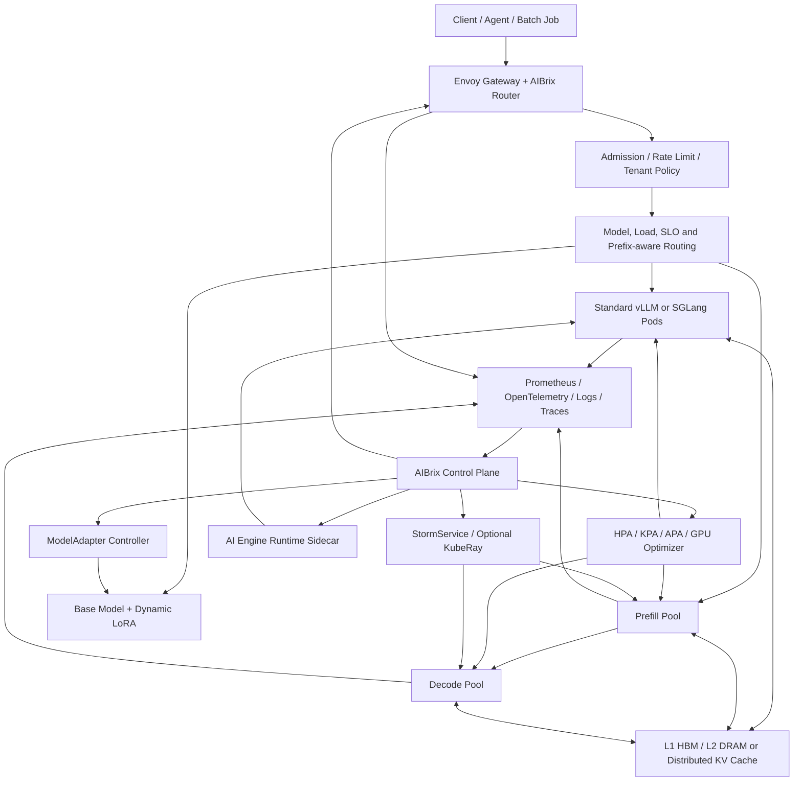

# 自动驾驶数据闭环与 Apache Iceberg 面试手册

目标岗位：Data Infrastructure / AI Infrastructure / Data Platform Engineer
核心场景：autonomous driving、smart cockpit、overseas data collection、robotics data collection
回答原则：先讲业务闭环，再讲数据模型与一致性，再讲性能、可靠性、成本和可观测性。

> 说明：本文把给定岗位要求与 `iceberg.txt` 中的 Iceberg、Spark/Flink、Ray 笔记整理成可直接用于面试的问答。项目章节包含“设计方案”和“可实现的演示项目”；没有提供个人履历证据的部分，不应表述为自己已经在生产环境拥有过，也不要虚构数据规模或指标。

---

## 0. 面试开场：先把岗位讲对

### Q0.1：你如何理解这个岗位？

**30 秒回答：**

> 这个岗位的核心不是普通 ETL，而是建设 autonomous driving / embodied AI 的 data closed loop：把车端或机器人端的多模态数据可靠采集到云端，经过同步、清洗、标准化、标注质检和 error-case mining，形成可版本化、可追溯、可复现的训练与评测数据集，再把模型失败案例回流到下一轮数据生产。平台既要处理 PB-scale 的离线数据，也要用 Kafka / Pulsar 支撑实时事件；用 Iceberg 管理 lakehouse table 的 snapshot、schema 和 partition evolution；用 Lance 一类面向 AI 的 columnar format 支撑随机访问、向量检索和高效训练读取。

### Q0.2：如果让你画端到端架构，你会怎么画？

```text
Vehicle / Robot / Smart Cockpit
    │
    ├─ Onboard Logger：sensor/log/event 采集、分片、校验、脱敏
    ├─ Upload Agent：断点续传、限速、压缩、重试、幂等 upload_id
    ▼
Regional Upload Gateway
    ├─ authentication / quota / rate limit
    ├─ multipart upload / checksum / deduplication
    └─ 只在消息中传 URI + metadata，不传大文件本体
    ▼
Raw Object Store（immutable source of truth）
    │
    ├─ Kafka / Pulsar：object-arrived、job-state、quality-event、model-error-event
    ▼
Preprocessing on Kubernetes / Spark / Ray
    ├─ 解包、解码、timestamp alignment、坐标变换
    ├─ cleaning / standardization / privacy filtering
    ├─ annotation QC / pseudo-label / scenario mining
    └─ quarantine + retry + dead-letter queue
    ▼
Apache Iceberg Lakehouse
    ├─ raw index / normalized frames / labels / scenarios / evaluation
    ├─ snapshot / ACID / time travel / schema & partition evolution
    └─ WAP branch：Write → Audit → Publish
    ▼
Metadata Catalog + Lineage + Dataset Registry
    ├─ dataset manifest / version / split / label version / code version
    ├─ asset → clip → label → dataset → model → evaluation lineage
    └─ search API / RBAC / audit / quality report
    ▼
Lance / Training Shards / Local NVMe Cache
    ├─ random row access / vector search / sample shuffle
    └─ prefetch / batch / distributed sampler
    ▼
Training + Simulation + Evaluation
    │
    └─ failure mining → annotation queue → new dataset version → retraining
```

### Q0.3：这套系统最重要的五个设计原则是什么？

1. **Raw data immutable**：原始数据只追加，不原地覆盖；后续产物都能追溯到 raw object。
2. **Control plane / data plane 分离**：大文件走 object storage；Kafka/Pulsar 只传事件、URI、checksum 和状态。
3. **At-least-once + idempotency**：分布式系统不假装没有重复；以确定性的 `idempotency_key` 保证重复执行无副作用。
4. **Version everything**：dataset、label、schema、transform code、model、evaluation suite 都要版本化。
5. **Measure before optimize**：先用 stage-level metrics 定位 network、CPU、memory、I/O、small files、skew 或 downstream backpressure，再优化。

### Q0.4：普通 Data Engineering 与 AI Data Infrastructure 有什么不同？

| 维度 | 普通 Data Engineering | AI Data Infrastructure |
| --- | --- | --- |
| 主要数据 | transaction、business log | video、image、LiDAR、radar、CAN、trajectory、embedding |
| 消费者 | BI、analyst、dashboard | training、evaluation、simulation、labeling |
| 质量重点 | schema、freshness、aggregation correctness | sensor sync、label correctness、scenario coverage、reproducibility |
| 访问模式 | scan、join、aggregate | scan + random access + shuffle + vector retrieval |
| 版本对象 | table partition | dataset manifest、split、label、feature、model、evaluation |
| 失败后果 | 报表错误或延迟 | 模型 regression、corner case 漏检、训练不可复现 |
| 核心指标 | query latency、freshness | data freshness、GPU starvation、samples/s、cost/TB、model lift |

---

## 1. 把 JD 拆成可落地的系统能力

### Q1.1：Core data closed loop 到底“闭”在哪里？

闭环不是“采集到入湖”就结束，而是：

```text
模型线上/仿真失败
  → 产生 model_error_event
  → 定位 trip / scene / temporal clip
  → 相似案例和 long-tail case mining
  → 清洗、标注或 pseudo-label
  → annotation QC
  → 新 dataset version
  → training / evaluation / simulation
  → 判断是否修复原失败并且无 regression
  → deployment candidate
  → 新一轮反馈
```

要能回答三个问题：

- **哪条数据影响了哪个模型？** 依赖 lineage。
- **某次训练到底读了什么？** 依赖 immutable dataset manifest 和 snapshot ID。
- **新模型是否真正修复失败？** 依赖固定的 evaluation suite、slice metrics 和 regression gate。

### Q1.2：Production data 和 R&D data 应该共用一套平台吗？

**回答：共用底层抽象，但 SLA、权限和保留策略不同。**

- 共用：object storage、event bus、Iceberg table、metadata/lineage、identity、audit。
- Production：强调 durability、real-time status、privacy、region isolation、on-call、严格 schema contract。
- R&D：强调 ad-hoc search、快速 dataset build、实验分支、灵活回溯和 notebook/API 访问。
- 不能把研发的自由度直接带到 production；发布到 main dataset 之前使用 WAP、quality gate 和 approval。

### Q1.3：如何同时支持离线和实时？

```text
实时路径：event → Kafka/Pulsar → Flink/service → alert/index/status table
离线路径：object → Spark/Ray → Iceberg/Lance → training/evaluation
```

实时路径负责“小数据、快信号”：上传状态、触发器、质量异常、model error event。离线路径负责“大数据、重计算”：视频解码、点云处理、全量清洗、dataset build。二者通过稳定的 event schema、object URI 和 idempotency key 衔接，不让 Kafka 承担 PB 级 blob 传输。

### Q1.4：Data as a Service 应提供什么？

不是简单暴露 object path，而是提供受治理的数据产品：

- `searchScenes(filter)`：按时间、region、weather、scenario、model score、quality 查询。
- `createDataset(query, splitPolicy, labelVersion)`：异步构建数据集。
- `getDatasetVersion(id)`：返回 manifest、snapshot、schema、统计、lineage。
- `streamSamples(datasetId, shard, cursor)`：面向训练读取。
- `getLineage(assetId | datasetId | modelId)`：上下游追踪和 impact analysis。
- `reportQuality(datasetId)`：完整性、一致性、重复率、分布、标注质量。
- 所有 API 带 RBAC/ABAC、region policy、audit log、quota、pagination 和 retry-safe request ID。

### Q1.5：不同业务如何统一数据模型？

使用稳定的核心实体，加业务扩展 schema：

| 核心实体 | 关键字段 |
| --- | --- |
| `Asset` | `asset_id`、URI、checksum、size、codec、region、retention |
| `Trip/Session` | vehicle/robot、start/end、software version、sensor config |
| `Frame` | sensor、timestamp、frame_id、calibration_id、asset offset |
| `Scene/Clip` | time range、geo cell、scenario tags、quality state |
| `LabelSet` | task、ontology version、annotator/model、QC status |
| `DatasetVersion` | manifest URI、Iceberg snapshot、split、policy、creator |
| `ModelRun` | code/image/model version、dataset version、hyperparameters |
| `EvaluationResult` | model、suite、slice、metric、failure cases |

统一的是 ID、版本、状态和 lineage 语义；autonomous driving、smart cockpit、robotics 的 payload 用明确的 schema extension 表达，避免造一张包含所有业务字段的“万能宽表”。

---

## 2. Data closed loop 深度设计

### Q2.1：车端采集如何设计？

**职责：** event trigger、local ring buffer、sensor bundle、compression、encryption、privacy filtering、upload scheduling。

典型流程：

1. logger 持续写入本地 bounded ring buffer。
2. trigger 命中时保留事件前后窗口，例如 `[-10s, +20s]`。
3. 生成 immutable bundle，包含 sensor chunks、manifest、checksum、software/config version。
4. 上传代理按网络、电量、区域合规和 priority 调度。
5. 每个 chunk 使用 `bundle_id + chunk_index` 做幂等；服务端返回已接收 bitmap，支持断点续传。
6. 完整上传后校验 object checksum，再发布 `object_arrived` 事件。

**追问：为什么需要 ring buffer？** 事件发生时只知道“现在失败了”，但原因通常发生在几秒前。ring buffer 能保留 pre-trigger context，同时用有界空间避免填满车端磁盘。

### Q2.2：上传 10 PB/月的数据，如何估算带宽？

平均带宽：

\[
B_{avg}=\frac{D}{T}
\]

若每月 10 PB，按 30 天计算：

\[
B_{avg}\approx\frac{10\times10^{15}\times8}{30\times86400}
\approx 30.9\text{ Gbit/s}
\]

实际容量不能按平均值配，要乘 peak factor、协议开销、重试放大和安全余量：

\[
B_{provisioned}=B_{avg}\times F_{peak}\times F_{retry}\times(1+H)
\]

面试中要主动说：还需按 region、车型、时间段分解，查看 p95/p99，而不是只报全局平均。

### Q2.3：如何保证上传不重复、不丢失？

- `bundle_id = hash(vehicle_id, session_id, start_ts, sensor_config_version)`。
- `chunk_id = bundle_id + chunk_index`，服务端保存 `(chunk_id, checksum, state)` 唯一约束。
- 完整对象的 `content_hash` 用于检测内容重复；不能只用文件名。
- client retry 使用 exponential backoff + jitter；server API 必须 idempotent。
- object 完成前处于 `UPLOADING`，checksum 通过后原子变成 `SEALED`。
- 只有 `SEALED` 对象才能发 downstream event。
- reconciliation job 定期比较 client manifest、object store、metadata DB 和 event log，修复“对象已到但事件没发”等裂缝。

### Q2.4：为什么消息队列只传 metadata，不传视频？

Kafka/Pulsar 擅长 durable event log，不是大对象存储。直接传大 blob 会导致 broker page cache 被污染、replication traffic 放大、consumer retry 昂贵、retention 成本失控。正确模式是：

```json
{
  "event_id": "...",
  "asset_id": "...",
  "uri": "s3://bucket/key",
  "checksum": "sha256:...",
  "schema_version": 3,
  "region": "...",
  "trace_id": "..."
}
```

### Q2.5：预处理 pipeline 如何做到可重放和可复现？

每个 stage 的输出 ID 都由输入与变换版本决定：

\[
output\_id=H(input\_ids,\ code\_version,\ config\_version,\ schema\_version)
\]

如果同一请求重试，命中相同 `output_id`，检查已有成功产物后直接复用。每次执行记录：

- container image digest，不只记录 `latest` tag；
- Git commit / package lock；
- input asset IDs 和 Iceberg snapshot ID；
- calibration、ontology、label model、feature config 版本；
- output checksum、row count、quality report；
- execution attempt、worker、start/end、error category。

### Q2.6：如何建 lineage？

使用 asset-level + dataset-level 两种粒度：

```text
RawAsset
  → DecodeJob
  → NormalizedFrame
  → Clip
  → LabelSet
  → DatasetVersion
  → ModelRun
  → EvaluationResult
```

- 高频在线查询放 PostgreSQL/graph index/cache；大量明细和历史 event 放 Iceberg。
- lineage edge 至少包含 `src_id`、`dst_id`、`edge_type`、`job_run_id`、`created_at`、`code_version`。
- 不能把每一帧的全部 lineage 都同步写中心数据库；可将细粒度映射写 columnar files，中心服务只保留分区索引和汇总边。
- impact analysis 是反向遍历：某 calibration 版本错误，找出受影响 clips → datasets → models → evaluations。

### Q2.7：dataset version 不能只用时间戳，为什么？

时间戳只能说明“什么时候创建”，不能完整表达“里面是什么”。一个可复现版本至少包含：

```yaml
dataset_id: perception-rainy-night-v42
iceberg_snapshot_id: 918273645
manifest_sha256: ...
query_definition_version: v7
label_ontology_version: v12
label_model_version: teacher-2026-07
calibration_version: calib-v9
split_policy_version: split-v4
transform_image_digest: sha256:...
parent_dataset_versions: [v39, hard-negative-v6]
quality_report_uri: s3://.../quality.json
```

### Q2.8：如何避免 train/validation/test leakage？

- 按 vehicle、trip、geo-cell、时间段或 scene family 做 group split，而不是按 frame 随机切分。
- 相邻帧高度相关，必须让同一 temporal clip 进入同一 split。
- 用 perceptual hash / embedding similarity 检测 near-duplicate 跨 split 泄漏。
- split assignment 由稳定 hash 决定，新增数据不会让老样本反复换 split：

\[
bucket=H(group\_id, split\_salt)\bmod 10000
\]

- test set 使用受控版本和访问权限，不能被日常 hard mining 反复“训练到”。

---

## 3. Apache Iceberg：从元数据树理解全部能力

### Q3.1：一句话说清 Iceberg 是什么

> Iceberg 是管理大规模 immutable data files 的 open table format。Parquet/ORC/Avro 保存数据，Iceberg 用 metadata tree 精确追踪每个 snapshot 包含哪些文件，并通过 Catalog 的 atomic compare-and-swap 提交新表状态，从而提供 snapshot isolation、time travel、schema/partition evolution 和多引擎一致访问。

不要说 Iceberg 是数据库；它不提供独立存储引擎、查询执行器或跨表事务。

### Q3.2：Iceberg metadata tree 是什么？

```text
Catalog
  └─ table identifier → current metadata.json
       ├─ schema / partition specs / sort orders / properties
       ├─ current-snapshot-id / refs / snapshot-log / metadata-log
       └─ Snapshot
            └─ Manifest List (Avro)
                 ├─ Manifest A (Avro)
                 │    ├─ Data File 1 (Parquet/ORC/Avro)
                 │    └─ Data File 2
                 └─ Manifest B
                      ├─ Data File 3
                      └─ Delete File / Deletion Vector metadata
```

| 层 | 回答的问题 | 关键内容 |
| --- | --- | --- |
| Catalog | 当前 table metadata 在哪？ | table → metadata location，atomic swap |
| Table Metadata | 表当前定义和历史是什么？ | schemas、specs、sort orders、snapshots、refs |
| Snapshot | 这个版本的文件集合根节点是什么？ | snapshot ID、parent、sequence、manifest-list |
| Manifest List | 哪些 Manifest 可能相关？ | manifest path、partition summary、counts |
| Manifest | 哪些 data/delete files 可能相关？ | path、partition、record count、column bounds |
| Data File | 真正的数据在哪里？ | Parquet、ORC、Avro |

### Q3.3：为什么是 Manifest List + Manifest 两层，而不是一个大文件列表？

**四个原因：**

1. **Fast append**：新增文件只写新 Manifest 和新 Manifest List，可复用旧 Manifest。
2. **分区演进**：一个 Manifest 对应一个 partition spec，不同 spec 可在同一 snapshot 共存。
3. **并行 planning**：超大表的百万文件拆成多个 Manifest，可并行读取和裁剪。
4. **两级 pruning**：先用 Manifest List 的 partition summaries 跳过 Manifest，再用 Manifest 的 partition/column metrics 跳过 Data File。

### Q3.4：一次读请求如何找到数据？

```text
load table from Catalog
  → read current metadata.json
  → resolve snapshot / branch / tag / timestamp
  → read Manifest List
  → partition summary pruning
  → read selected Manifests
  → partition + column metrics pruning
  → create scan tasks
  → column projection + row-group pruning + residual filter
```

Iceberg 不靠递归 `list` 目录发现分区和文件，因此规划成本不会随目录数量线性增长；它读取的是已提交 snapshot 所引用的确定文件集合。

### Q3.5：Iceberg 的原子提交来自哪里？

数据文件和新 metadata tree 先写好，最后由 Catalog 把 table pointer 从 `metadata-vN.json` 原子替换为 `metadata-vN+1.json`：

```text
writer reads base metadata location = M0
writer writes data + manifests + snapshot + M1
Catalog.compareAndSwap(table, expected=M0, new=M1)
```

- CAS 成功：新 snapshot 一次性可见。
- CAS 失败：说明并发 writer 已提交；重新加载当前 metadata，验证 assumptions，安全时重建 Manifest List 并重试。
- 失败重试通常不需要重写 data files，因为未提交文件和 Manifest 是 immutable 的。

不同 Catalog 可能用 metastore lock、SQL conditional update、object-store conditional write 或版本化 catalog 实现原子替换。面试重点不是背默认 Catalog，而是说明 **Catalog 必须提供可靠的 atomic table pointer update**。

### Q3.6：这如何产生 snapshot isolation 和 ACID？

- **Atomicity**：pointer swap 成功或失败，不会只暴露一半文件。
- **Isolation**：reader pin 到 immutable snapshot；老查询读老 snapshot，新查询读新 snapshot。
- **Durability**：提交前 data/metadata 已持久化，成功 pointer update 后可恢复。
- **Consistency**：Iceberg 保证 table metadata 和 file set 的结构一致，但不会替应用强制外键、业务唯一性等约束。
- 事务主要是单表范围；不能把它描述成通用跨表 ACID database。

### Q3.7：Optimistic Concurrency Control 如何判断能否重试？

提交由 **assumptions + actions** 组成。例如：

- Append 假设通常宽松：并发 append 多数可以 rebase 后重试。
- Overwrite/DELETE 假设目标分区或文件在 base snapshot 后没有被冲突修改。
- MERGE 必须验证读取到的匹配范围没有并发新增可能影响结果的行；serializable isolation 比 snapshot isolation 检查更严格。

回答模板：

> CAS 失败只说明 base pointer 过期，不等于业务冲突。writer 先 refresh 当前状态，再验证原操作的 assumptions；若仍成立，只重建基于新 head 的 metadata 并重试；若不成立则明确失败，让上层重新计算。

### Q3.8：Time travel、Branch、Tag、WAP 有何关系？

- `Time travel`：按 snapshot ID 或 timestamp 读历史快照。
- `Branch`：可写的 snapshot lineage head，有独立 retention policy。
- `Tag`：不可写的命名 snapshot reference，适合审计和训练基线。
- `WAP`：先写 audit branch，运行 schema、quality、count、distribution、privacy 检查，通过后 `fast_forward` main；失败则不影响 main。

注意：snapshot 只有在 retention policy 未过期且引用文件仍保留时才能 time travel。不能承诺“永久回滚”。

### Q3.9：Schema evolution 为什么安全？

Iceberg 按全局唯一 `field ID` 追踪列，而不是只按 name 或 position：

- add：分配新 field ID；旧文件读新列得到 `NULL` 或 default。
- rename：name 变化，field ID 不变。
- reorder：只改顺序，不改变字段身份。
- drop：从当前 schema 移除；旧 field ID 不回收。
- type promotion：只允许规范定义的安全提升；不应随意做缩窄转换。

因此“删掉 `a` 后把新列也命名为 `a`”不会错误复活旧列数据。

### Q3.10：Partition evolution 与 hidden partitioning 是什么？

Iceberg 用声明式 transform 定义分区，例如：

```sql
PARTITIONED BY (days(event_ts), bucket(64, vehicle_id))
```

用户查询原始列：

```sql
WHERE event_ts >= TIMESTAMP '2026-07-01 00:00:00'
  AND event_ts <  TIMESTAMP '2026-07-02 00:00:00'
```

引擎自动将 data predicate 做 `inclusive projection`，生成分区谓词。保证不漏真匹配行，但可能选入 false positive，最终仍需 residual filter。

分区策略改变时：旧文件保持旧 spec，新文件使用新 spec；查询分别针对每个 spec 做 predicate projection 后合并。分区演进本身是 metadata operation，不会自动重写旧数据。

常用 transform：`identity`、`bucket[N]`、`truncate[W]`、`year/month/day/hour`、`void`。具体可用 transform 要以部署的 Iceberg format version 和 engine support 为准。

### Q3.11：如何选择 partition key？

不是“基数越高越好”，而是同时考虑过滤频率、数据量、倾斜和目标文件大小：

\[
files\_per\_partition\approx\frac{bytes\_per\_partition}{target\_file\_size}
\]

经验判断：

- 时间是常见一级 transform，因为查询和 retention 常按时间。
- `vehicle_id` 高基数，直接 identity 可能制造大量小分区；可用 `bucket[N]`。
- region/weather/scenario 若分布极不均匀，不宜单独做粗暴 identity partition。
- 若过滤列不适合分区，可通过 sort order 改善 file-level min/max pruning。
- 选择后用真实 workload 验证 scanned files、planning latency、small-file ratio，而非凭直觉。

### Q3.12：为什么排序能加速查询？

Manifest 保存 data file 的 `lower_bounds / upper_bounds`。数据按常用过滤列聚簇后，每个文件范围更窄，谓词与多数文件范围不相交，可直接跳过。

设查询选择率为 `s`，理想有序时扫描文件比例接近 `s`；完全随机混合时，每个文件可能都含少量目标值，文件级 min/max 几乎无法裁剪。排序代价是 write shuffle 和更高 ingestion latency，因此要基于 read/write trade-off 选择 `hash` 或 `range` distribution。

### Q3.13：COW 与 MOR 如何选择？

| 模式 | 写入 | 读取 | 适用 |
| --- | --- | --- | --- |
| Copy-on-Write | 修改时重写受影响 data files | 无需合并 delete files，读快 | 读多写少、稳定训练集、批量修正 |
| Merge-on-Read | 写新行和 delete files / DV | 读时合并，需定期 compaction | CDC、频繁 upsert、低写延迟 |

不能只说“默认选 COW”。应根据 update/delete 频率、查询 SLA、compaction 窗口、engine 支持和 cost 选择。

### Q3.14：Position Delete、Equality Delete、Deletion Vector 有何区别？

- `Position Delete`：按 `(file_path, row_position)` 删除。Iceberg v2 使用 position delete files；在 v3 中新的 position delete files 已弃用。
- `Equality Delete`：按一个或多个 field ID 的值匹配，例如 `id=5`；适合 CDC/UPSERT 只知道业务键的输入。
- `Deletion Vector (DV)`：v3 使用 bitmap 表示单个 data file 被删除的位置，存于 Puffin；一个 snapshot 中每个 data file 最多一个 DV，新删位要与已有 DV/position deletes 合并。

Sequence rule 必须讲准确：

- DV / position delete 作用于相同 data file、相同 partition，且 `data_sequence(data) <= data_sequence(delete)`。
- equality delete 通常作用于相同 partition 中更老的数据，要求 `data_sequence(data) < data_sequence(delete)`；unpartitioned equality delete 可作为 global delete。

### Q3.15：Spark 与 Flink 写 Iceberg 有何本质差异？

- Spark 是 bounded batch，可以扫描整表并计算 `DELETE WHERE`、`MERGE INTO`、overwrite 的受影响文件。
- Flink 是持续流式处理，擅长把 upstream CDC 的 `INSERT/UPDATE/DELETE` 变成 data files 与 equality deletes，并在 checkpoint 完成时提交。
- 流式可见性通常与 checkpoint/commit cadence 相关；过于频繁提交会制造小文件和大量 metadata。
- 不要说“Flink 绝对不能做任何 delete”；准确说法是它通常不能像批处理 SQL 那样任意回扫全表做条件删除，但能消费 CDC delete/update 语义。

### Q3.16：Iceberg 小文件问题怎么解决？

**先找原因：** streaming micro-batch 太小、partition 基数过高、写 task 太小、skew、fanout 同时打开太多 partition writers。

**治理闭环：**

1. 监控 file count、median/p10 file size、files per partition、planning latency。
2. 调整 commit interval、partition spec、Spark AQE task size 和 `write.distribution-mode`。
3. 用 `rewrite_data_files` 做 bin-pack 或 sort compaction。
4. 写模式与查询过滤不一致时执行 `rewrite_manifests`。
5. 定期 `expire_snapshots`；谨慎清理 orphan files。

Spark 中 `target-file-size-bytes` 不是“保证输出这么大”。一个文件不能跨 Iceberg partition，也不能大于其写 task 能提供的数据；内存中 row size 与压缩后的 on-disk size 不相等，需用实测压缩比调 AQE advisory task size。

### Q3.17：Iceberg 日常 maintenance 有哪些？

- `expire_snapshots`：按保留策略移除旧 snapshots；被任何有效 snapshot 引用的文件仍不能删。
- 删除旧 metadata JSON：控制高频提交的 metadata 增长。
- `remove_orphan_files`：清理失败写入留下、未被 metadata 引用的文件。
- `rewrite_data_files`：合并小文件，必要时排序。
- `rewrite_manifests`：让 metadata layout 与查询过滤模式更一致。
- MOR 表还需合并 delete files / DV，避免 read amplification。

**危险点：** orphan retention 不能短于最长在途写入时间；对象存储最终一致性、路径规范化或错误 location 配置都可能造成误删。生产操作必须 dry run、白名单路径、审计和保守 retention。

### Q3.18：如何排查 Iceberg 查询突然变慢？

按层定位：

1. **Planning**：Manifest 数是否暴增？metadata fetch latency 是否升高？
2. **Pruning**：scanned files / total files 是否上升？谓词是否能投影到 partition？column metrics 是否缺失？
3. **Layout**：小文件、wide min/max、partition skew、delete files 是否累积？
4. **Execution**：object-store request latency、network、decompression、spill、shuffle。
5. **Engine**：predicate/column pushdown 是否生效？Catalog/cache 是否 stale？

常见动作：查看 `files`、`manifests`、`snapshots` 等 metadata tables，对比慢查询前后的 snapshot summary，再决定 compact、sort、rewrite manifests 或改 partition spec。

---

## 4. Kafka / Pulsar / RabbitMQ：面试必须说清的边界

### Q4.1：Kafka 在这套系统中的作用是什么？

Kafka 是 durable ordered partitioned event log，用于：

- 解耦 upload、preprocessing、quality、metadata、dataset build；
- 记录 object arrived、job state、quality event、model error event；
- 允许 consumer group 水平扩展；
- 允许按 offset replay 和重建派生状态。

Kafka 不应保存长期 PB 级 sensor blob；消息中保存 URI、checksum、schema version 和追踪字段。

### Q4.2：Kafka 如何保证顺序？

只保证 **partition 内顺序**。需要同一 trip/asset 的事件有序，就以 `trip_id` 或 `asset_id` 作为 key，使其稳定路由到同一 partition。全局顺序会牺牲并行度，通常既不需要也不应该追求。

### Q4.3：At-most-once、At-least-once、Exactly-once 怎么讲？

- `At-most-once`：先提交 offset 再处理，可能丢但不重复。
- `At-least-once`：处理成功后再提交 offset，不丢但失败重试会重复。
- Kafka 的 transaction 可将“向 Kafka 写结果 + 提交消费 offset”原子化，consumer 用 `read_committed` 可实现 Kafka-to-Kafka exactly-once processing。
- 一旦副作用落到外部数据库、对象存储或 HTTP 服务，仍需目标端 transaction、outbox/inbox、idempotency key 或去重表；不能把 Kafka EOS 夸大成全世界的端到端 exactly-once。

生产默认答案：`at-least-once delivery + idempotent processing + reconciliation`。

### Q4.4：如何实现 consumer 幂等？

```sql
BEGIN;
INSERT INTO processed_event(event_id, processed_at)
VALUES (:event_id, now())
ON CONFLICT DO NOTHING;

-- 只有上一条确实插入时才做状态转移，或把结果与去重记录放同一事务
UPDATE assets
SET state = :next_state, version = version + 1
WHERE asset_id = :asset_id
  AND version = :expected_version;
COMMIT;
```

对象产物使用确定性 path：`stage/output_id/part-...`，先写 temporary path，校验后原子 publish 或在 metadata 中 CAS 切换 active pointer。

### Q4.5：Kafka partition 数如何估算？

粗略下界：

\[
P\ge\max\left(
\left\lceil\frac{T_{in}}{t_{producer,partition}}\right\rceil,
\left\lceil\frac{T_{out}}{t_{consumer,partition}}\right\rceil,
C_{desired}
\right)
\]

还要考虑 key skew、broker 数、replication、reassignment 成本、future growth。partition 不是越多越好；过多会增加 metadata、file handles、leader election 和 rebalance 成本。

### Q4.6：出现 consumer lag 怎么排查？

1. 看是所有 partitions 变慢还是少数 hot partitions。
2. 比较 produce rate、consume rate、processing latency 和 downstream latency。
3. 检查 rebalance、GC、CPU、network、broker throttling、object-store/API timeout。
4. 若单 partition key skew，加 consumer 无效；需 redesign key、拆 hot key 或两级聚合。
5. 若 downstream 背压，盲目扩 consumer 只会把压力推过去；应限流、batch、cache 或扩 downstream。

积压清空时间近似：

\[
t_{drain}=\frac{backlog}{consume\_rate-produce\_rate}
\]

前提是 `consume_rate > produce_rate`，否则永远清不完。

### Q4.7：Kafka 与 Pulsar 如何选择？

| 维度 | Kafka | Pulsar |
| --- | --- | --- |
| 基本模型 | partitioned log | topic + subscription，broker 与 BookKeeper storage 分离 |
| 消费 | consumer group | Exclusive / Failover / Shared / Key_Shared |
| 保留/回放 | log retention、compaction | durable subscription、retention、backlog |
| 多租户 | 可构建但需治理 | tenant/namespace 是原生管理层级 |
| 适合 | 成熟 event streaming 生态、Kafka Streams | 多租户、跨集群、topic 数量大、灵活 subscription |

面试不要做绝对结论。先问现有运维经验、topic 数、multi-tenancy、geo-replication、latency、ecosystem 和 migration cost。

### Q4.8：RabbitMQ 什么时候更合适？

RabbitMQ 更适合传统 task queue、复杂 routing、低到中等吞吐、消息处理后即可删除的工作流。Kafka/Pulsar 更适合作为可长期 replay 的 event log。若任务需要严格的 per-job ack、priority queue 和丰富 routing，而不需要大规模历史回放，RabbitMQ 可能更简单。

---

## 5. Lance 与训练数据路径

### Q5.1：为什么有 Iceberg 还需要 Lance？

二者优化的访问模式不同，可以组合而不是二选一：

| 维度 | Iceberg | Lance |
| --- | --- | --- |
| 核心定位 | lakehouse table format | 面向 AI/ML 的 columnar dataset format |
| 强项 | snapshot、ACID、multi-engine SQL、partition evolution | fast random access、sample take、vector/scalar index、AI data |
| 常见访问 | scan、filter、join、aggregate | random sample、shuffle、embedding retrieval、训练 batch |
| 元数据对象 | snapshot / manifest / data file | version / fragment / index / deletion metadata |
| 典型角色 | governed source of truth | training-optimized serving layer |

可落地模式：Iceberg 管理标准化事实表、labels、scenarios 和 dataset registry；dataset builder 从固定 Iceberg snapshot 选择样本，物化为 Lance 或训练 shards。Lance 版本、Iceberg snapshot 和 transform image digest 一起写入 dataset manifest。

### Q5.2：Lance 为什么适合 AI training？

- Columnar layout 允许只读需要的列。
- 支持按 row IDs 快速随机 `take`，适合 sampling 和 shuffle。
- embedding/vector index 支持 similarity search，可用于相似 error case mining。
- immutable/versioned write 便于复现；delete 可通过 deletion index 表达。
- fragment compaction 可减少大量小 append 造成的 open/metadata 开销。

但要避免“用了 Lance，GPU 就一定满载”的错误表述。训练性能还取决于 object-store latency、sharding、decode、augmentation、prefetch、batch size、local cache、distributed sampler 和 network topology。

### Q5.3：如何设计训练数据读取链路，避免 GPU 等数据？

```text
Dataset Manifest
  → distributed sampler（每 rank 不重不漏）
  → shard/row-group assignment
  → async remote read
  → local NVMe cache
  → parallel decode / augmentation
  → pinned host memory
  → prefetch queue
  → H2D copy overlapped with previous GPU compute
  → training step
```

两个关键公式：

\[
T_{step}=\max(T_{data},T_{compute})
\]

只有 data loading 与 compute 能够充分重叠时才成立；若不能重叠则接近两者之和。

GPU data stall ratio：

\[
stall\_ratio=\frac{T_{waiting\ for\ batch}}{T_{training\ wall}}
\]

观察 `samples/s`、GPU utilization、data wait、cache hit、read amplification、decode CPU、p95 batch latency，判断瓶颈是否真在存储。

### Q5.4：如何做 distributed shuffle，既随机又可复现？

- 以 `(dataset_version, epoch, global_seed)` 生成 deterministic seed。
- 先在 shard 级 shuffle，再在 bounded buffer 内 sample shuffle，避免全量索引放内存。
- 用 `global_sample_id` 的稳定 hash 分配 rank：

\[
rank=H(sample\_id, epoch, seed)\bmod world\_size
\]

- 处理 `world_size` 变化时，记录 sampler version；是否 drop last、padding 或重复样本必须明确。
- checkpoint 保存 epoch、cursor、RNG state，恢复后不应静默重复大量样本。

### Q5.5：Lance dataset 也会有小 fragment 问题吗？

会。频繁小 append 会产生大量 fragments；大量 soft deletes 会增加查询过滤成本。维护动作包括 compact files/fragments、清理旧版本、在 rewrite 后重建受影响 index。Compaction 会创建新版本，不应先删老版本再发布新版本；先验证新版本，再按 retention 清理。

---

## 6. Data Cleaning、Annotation QC 与 Error-case Mining

### Q6.1：自动驾驶数据清洗具体检查什么？

按四层检查：

**1. 文件层**

- object 是否存在、size 是否匹配、checksum 是否正确；
- codec/container 能否解析；
- 是否 truncated、重复、加密密钥不可用；
- URI、region、retention policy 是否合规。

**2. Schema 层**

- required fields、type、range、enum、unit；
- schema version 与 decoder 是否兼容；
- calibration ID、sensor configuration 是否存在。

**3. 时序/多传感器层**

- timestamp monotonicity、gap、duplicate frame；
- camera/LiDAR/radar/IMU 的 time alignment；
- clock drift、frame rate、exposure异常；
- extrinsic/intrinsic calibration consistency。

**4. 语义/统计层**

- GPS 跳变、速度/加速度物理不可能值；
- label 与 image/point cloud 不一致；
- 分布漂移、异常 class ratio、duplicate scene；
- PII、face/license plate、region policy。

每条规则输出 `rule_id`、`severity`、`observed`、`expected`、`asset_id`、`evidence_uri`；不要只返回一个 `pass=false`。

### Q6.2：如何做多传感器时间同步？

给定 camera timestamp \(t_c\)，在 LiDAR timestamps 中找最近邻：

\[
i^*=\arg\min_i |t_i-t_c|
\]

如果 \(|t_{i^*}-t_c|>\epsilon\)，标记缺失或插值风险。对连续信号可线性插值：

\[
x(t)=x_0+\frac{t-t_0}{t_1-t_0}(x_1-x_0)
\]

对旋转姿态不能直接对 Euler angles 线性插值，通常使用 quaternion `SLERP`。还要估计 clock drift：

\[
t_{corrected}=a\cdot t_{sensor}+b
\]

`b` 是 offset，`a` 是 drift。通过同步脉冲或事件对齐估计。回答必须提到 tolerance、missing policy 和 quality score，而不是只说“按时间戳 join”。

### Q6.3：坐标系变换公式怎么讲？

齐次坐标下，将 LiDAR 点变换到 camera frame：

\[
\begin{bmatrix}p_c\\1\end{bmatrix}
=T_{camera\leftarrow ego}\,T_{ego\leftarrow lidar}
\begin{bmatrix}p_l\\1\end{bmatrix}
\]

其中：

\[
T=\begin{bmatrix}R&t\\0&1\end{bmatrix}
\]

再通过 camera intrinsic matrix 投影：

\[
s\begin{bmatrix}u\\v\\1\end{bmatrix}
=K\begin{bmatrix}x_c\\y_c\\z_c\end{bmatrix}
\]

必须过滤 `z_c <= 0` 的点，并处理 lens distortion、calibration version、vehicle motion compensation。

### Q6.4：Annotation QC 如何分层？

| 层 | 方法 | 示例 |
| --- | --- | --- |
| Schema QC | deterministic rules | class、bbox 坐标、必填属性 |
| Geometric QC | 几何约束 | bbox 面积、点数、投影一致性 |
| Temporal QC | 邻帧一致性 | track ID、速度、尺寸突变 |
| Cross-sensor QC | sensor consistency | 3D box 投影与 2D evidence |
| Statistical QC | distribution check | class/size/distance drift |
| Golden-set QC | 与专家标注比较 | precision、recall、IoU |
| Human audit | 分层抽样复核 | 高风险和低置信样本过采样 |
| Model-assisted QC | disagreement/uncertainty | teacher 与 human 冲突 |

### Q6.5：常用标注质量指标有哪些？

分类：

\[
Precision=\frac{TP}{TP+FP},\quad Recall=\frac{TP}{TP+FN}
\]

\[
F_\beta=(1+\beta^2)\frac{Precision\cdot Recall}{\beta^2 Precision+Recall}
\]

安全关键漏检代价更高时选 \(\beta>1\)。

2D bounding box：

\[
IoU=\frac{|B_{pred}\cap B_{gt}|}{|B_{pred}\cup B_{gt}|}
\]

标注者一致性不能只看 raw agreement；类别不平衡时可用 Cohen's Kappa：

\[
\kappa=\frac{p_o-p_e}{1-p_e}
\]

其中 \(p_o\) 是实际一致率，\(p_e\) 是随机期望一致率。

### Q6.6：如何用抽样估计标注错误率？

不能只看“抽 100 条没有错”。若观察到错误比例 \(\hat p\)，可报告 Wilson confidence interval；近似样本量：

\[
n\approx\frac{z_{\alpha/2}^2p(1-p)}{e^2}
\]

- \(e\)：允许误差，例如 1%。
- \(p\)：预估错误率；未知时用 0.5 最保守。
- 对 rare/safety-critical slices 必须 stratified sampling，不能被全局平均稀释。

生产方案：普通样本随机抽样 + 高风险规则命中样本过采样 + 新 annotator/新 ontology 分层抽样；最后用 sampling weight 还原总体估计。

### Q6.7：如何定位 model error cases？

错误发现源包括：

- online shadow/canary disagreement；
- simulation failure、collision/near-miss、rule violation；
- low confidence/high entropy；
- teacher-student disagreement；
- human correction；
- data drift、OOD detector；
- slice-level metric regression。

每个 failure event 应关联 `model_version`、`input_asset/clip`、`prediction`、`ground_truth or reviewer result`、`scenario tags`、`metric delta`、`trace_id`，这样才能一键回到原始数据和下一轮标注队列。

### Q6.8：Uncertainty sampling 的数学是什么？

分类熵：

\[
H(p)=-\sum_{c=1}^{C}p_c\log p_c
\]

熵越高，模型越不确定。也可使用 margin：

\[
margin=p_{(1)}-p_{(2)}
\]

margin 越小越值得复核。但只按 uncertainty 会选到大量噪声或重复样本，应组合 novelty、risk、diversity、quality：

\[
score=w_uU+w_rR+w_nN+w_dD-w_cCost-w_qQualityRisk
\]

权重需由 annotation budget 和 training lift 校准，不应凭拍脑袋永久固定。

### Q6.9：如何做 diversity-aware mining，避免选出一堆相似帧？

基本做法：

1. 用 embedding 表示 scene/clip。
2. 先按 risk/uncertainty 取较大 candidate pool。
3. 用 k-means、k-center greedy 或 maximal marginal relevance 选择多样样本。

余弦相似度：

\[
sim(x,y)=\frac{x\cdot y}{\|x\|\|y\|}
\]

MMR 形式：

\[
x^*=\arg\max_{x\in C}\left[\lambda relevance(x)-(1-\lambda)\max_{y\in S}sim(x,y)\right]
\]

这在“高价值”和“不重复”之间做权衡。

### Q6.10：如何发现 data drift？

- 数值特征：PSI、KS test、Wasserstein distance。
- 类别特征：chi-square、Jensen-Shannon divergence。
- 高维 embedding：MMD、cluster distribution、classifier two-sample test。
- 业务 slice：region/weather/time/sensor version 的比例与性能。

Jensen-Shannon divergence：

\[
JS(P\|Q)=\frac12 KL(P\|M)+\frac12 KL(Q\|M),\quad M=\frac12(P+Q)
\]

只检测 input drift 不够；还要区分 label drift、concept drift、pipeline bug 和 sampling policy change。发现漂移后要能 drill down 到具体 slice 与 source version。

### Q6.11：如何证明新挖的数据真的有价值？

建立带 control 的增量实验：

- baseline dataset + baseline model recipe；
- treatment 只增加 mined subset，其他条件固定；
- 看 overall metric、target slice metric、regression slices、calibration 和 robustness；
- 记录 annotation cost、compute cost、time-to-fix。

数据收益可定义为：

\[
ROI_{data}=\frac{\Delta target\ metric\times business\ weight}{annotation\ cost+compute\ cost+pipeline\ cost}
\]

不要只报告“挖了多少 TB”或“标了多少帧”；平台价值是更快修复模型问题、提高覆盖并降低单位有效样本成本。

---

## 7. Pipeline 性能：用指标和公式定位瓶颈

### Q7.1：如何系统地优化端到端 pipeline？

先把 pipeline 画成 stages，并对每层记录：

| Stage | Throughput | Latency | Queue | Resource | Quality/Cost |
| --- | --- | --- | --- | --- | --- |
| Upload | bytes/s | p50/p95/p99 | pending bundles | NIC/CPU | retry bytes、$/TB |
| Decode | frames/s | clip latency | ready clips | CPU/GPU/memory | corrupt ratio |
| Transform | records/s | task latency | backlog | CPU/spill | invalid ratio |
| Iceberg write | MB/s | commit latency | uncommitted files | I/O/Catalog | small-file ratio |
| Dataset build | samples/s | build time | jobs | CPU/network | duplicate ratio |
| Training read | samples/s | batch p95 | prefetch depth | CPU/NVMe/NIC | GPU stall |

优化顺序：测量 → 定位最慢 stage → 构造可复现实验 → 改一个变量 → 验证局部和端到端指标 → 检查成本与质量 regression。

### Q7.2：Pipeline throughput 的上限是什么？

串联稳定 pipeline 的吞吐受最慢 stage 限制：

\[
X_{pipeline}\le\min_i X_i
\]

如果 decode 2 GB/s、inference 0.8 GB/s、write 1.5 GB/s，盲目优化 decode 不会提升端到端吞吐。要提高 inference capacity、batch efficiency 或并行度。

### Q7.3：Little's Law 如何用于容量规划？

稳定系统中：

\[
L=\lambda W
\]

- \(L\)：系统平均在途任务数。
- \(\lambda\)：到达率。
- \(W\)：平均停留时间。

例如每秒到达 200 clips，平均处理时间 30 秒，则平均约 6000 clips 在途。它能帮助估算 queue、metadata state 和内存规模。前提是系统长期稳定、到达率约等于完成率。

### Q7.4：如何估算 worker 数？

单 worker 服务率 \(\mu=1/S\)，到达率 \(\lambda\)，目标利用率 \(\rho_{target}<1\)：

\[
N\ge\left\lceil\frac{\lambda}{\mu\rho_{target}}\right\rceil
=\left\lceil\frac{\lambda S}{\rho_{target}}\right\rceil
\]

不能长期把 utilization 设成 100%，否则流量波动和长尾任务会令 queue latency 爆炸。实际还要为 failure、autoscaling delay、skew 和 p99 service time 留余量。

### Q7.5：内存预算如何算？

每 worker 近似：

\[
M_{worker}\approx C_{inflight}(M_{input}+M_{decoded}+M_{output})+M_{runtime}+M_{model}
\]

全节点：

\[
M_{node}\ge N_{worker}M_{worker}+M_{object\ store}+M_{OS}+headroom
\]

视频压缩文件小，decoded tensor 可能放大几十倍，所以不能按 object size 估内存。解决方法：streaming decode、bounded queue、chunk、lower prefetch、spill、release references、separate CPU/GPU actor pools。

### Q7.6：Backpressure 怎么设计？

- 每个 stage 使用 bounded queue，不允许无限积压在内存。
- 下游通过 credits/semaphore 控制上游最大 in-flight。
- queue 接近 high watermark 时降低 source fetch 或暂停 partition。
- 恢复到 low watermark 后逐步放开，避免振荡。
- overload 时按 priority 丢弃可重算的低价值 work，不丢 source of truth。

关键指标：queue depth、queue age、blocked producer time、in-flight bytes、spill bytes、consumer lag。

### Q7.7：如何区分 CPU、memory、disk、network、scheduler bottleneck？

| 现象 | 可能原因 | 验证 |
| --- | --- | --- |
| CPU 高、I/O 低 | decode/compress/serialization | flame graph、CPU profile |
| CPU 不高、iowait 高 | disk/object read、small files | IOPS、request latency、open count |
| RSS/Object store 持续涨 | reference leak、unbounded buffer | heap/object refs、queue depth |
| NIC 满、CPU 低 | remote read/shuffle | bytes/node、cross-AZ traffic |
| 资源空闲但吞吐低 | scheduler overhead、task 太小、serialization | task duration、launch rate |
| 少量 tasks 极慢 | skew、bad object、noisy neighbor | partition/task distribution |
| GPU 低、CPU 高 | decode/augmentation bottleneck | data wait、CPU pool、prefetch |

### Q7.8：小任务与大任务如何权衡？

设每个 task 固定调度开销为 \(t_o\)，有效计算时间为 \(t_c\)：

\[
efficiency=\frac{t_c}{t_o+t_c}
\]

task 太小，scheduler/serialization 占比高；太大则 parallelism 不足、失败重算昂贵、straggler 加重、内存峰值高。应让 task 足够长以摊薄开销，同时能被更多 workers 分摊并满足内存约束。

### Q7.9：压缩算法怎么选？

目标不是最小文件，而是端到端时间与成本：

\[
T_{total}=T_{compress}+\frac{size_{compressed}}{network\ bandwidth}+T_{decompress}
\]

- network bottleneck：更高压缩率可能值得。
- CPU bottleneck：选择更快 codec 或硬件加速。
- columnar analytics 常比较 Snappy 与 Zstd；必须用真实 data distribution 和 query workload benchmark。
- 已压缩视频再次通用压缩可能收益很小，反而消耗 CPU。

### Q7.10：Amdahl's Law 如何避免错误优化？

若某部分占总耗时比例 \(p\)，把这部分加速 \(s\) 倍，总加速比：

\[
Speedup=\frac{1}{(1-p)+p/s}
\]

某阶段只占 10%，即使无限加速，整体最多约 1.11 倍。先做 end-to-end profiling，优先优化高占比路径。

### Q7.11：如何衡量缓存是否值得？

平均访问延迟：

\[
E[T]=hT_{hit}+(1-h)T_{miss}
\]

其中 \(h\) 是 hit ratio。还要计入填充、失效、存储和一致性成本。训练数据 cache key 必须包含 dataset/version/transform，避免新版本读到 stale sample。适合缓存热门 metadata、重复评测集、常用 decoded/normalized artifacts；不应无差别缓存一次性全表扫描。

### Q7.12：如何设计 SLO 和 error budget？

示例 SLO：

- 99.9% sealed assets 在 15 分钟内进入 processing queue；
- 99% 高优先级 error cases 在 2 小时内可被检索；
- 99.5% dataset builds 在承诺窗口内完成；
- metadata search p95 < 300 ms；
- dataset reproducibility audit pass = 100%。

若目标可用性为 \(A\)，周期时长 \(T\)：

\[
error\ budget=(1-A)T
\]

质量正确性类目标不能简单用 downtime budget 替代；数据泄漏、错误标签发布等需要零容忍 gate 和人工升级流程。

---

## 8. Spark、Ray 与 Kubernetes 的生产落地

### Q8.1：Spark、Ray、Flink 怎么选？

| 引擎 | 最适合 | 不应硬套 |
| --- | --- | --- |
| Spark | 大规模 batch SQL、join、shuffle、Iceberg maintenance | 低延迟逐事件处理、复杂 GPU actor state |
| Flink | stateful streaming、event time、CDC、checkpoint | PB 级一次性 batch 重算若团队无对应经验 |
| Ray | Python-native AI batch、stateful model actors、CPU/GPU 混合 pipeline | 纯 SQL warehouse workload |

一个平台可以组合：Flink 处理实时 event/CDC，Spark 做大规模 lakehouse ETL/compaction，Ray 做视频解码和 GPU pseudo-labeling。关键是统一 dataset/version/lineage，而不是强行只选一个引擎。

### Q8.2：Ray Task 与 Actor 的区别？

- `Task`：stateless function，适合短生命周期、可重试、并行转换。
- `Actor`：stateful process，适合昂贵初始化和状态复用，例如 video decoder、loaded teacher model、connection pool。
- `ObjectRef`：异步结果引用；应批量发射任务，避免循环中每次 `.remote()` 后立刻 `ray.get()` 导致串行化。
- 用 `ray.wait()` 或 Ray Data streaming executor 有界地消费完成结果，控制 in-flight。

### Q8.3：Ray 的 object store 就等于绝对 zero-copy 吗？

不应绝对化。Ray 在每节点有 shared-memory object store，Arrow/Numpy 等合适对象在同节点读取可减少复制；跨节点仍需 network transfer，Python heap object 可能涉及 serialization，GPU tensor 也有独立传输语义。准确回答：

> 我会利用 object store、Arrow blocks 和 locality-aware scheduling 减少重复序列化与跨进程复制，同时用 metrics 验证 object transfer、spill 和 heap memory；不会把所有数据路径都称为 zero-copy。

### Q8.4：Ray Data 如何避免 OOM？

- streaming execution 让下游无需等待上游全量完成；
- bounded block size 与 backpressure 控制在途 blocks；
- object store memory pressure 时可 spill to disk；
- worker heap 不会因为 object store spill 自动获救，用户代码仍需 batch/chunk；
- 删除不再使用的 Dataset/ObjectRef 引用；
- 对 model actor 控制 pool size、batch size、concurrency 和 prefetch。

### Q8.5：为什么 stateful model inference 用 Actor pool？

加载数 GB model 到 GPU 的初始化成本高。若每 batch 启新 task，会反复加载权重。Actor pool 让每个 worker 初始化一次，然后连续处理 batches：

\[
T_{avg/batch}=T_{infer}+\frac{T_{init}}{N_{batches\ per\ actor}}
\]

还需设置合理的 CPU/GPU resources、max concurrency、autoscaling min/max 和 warm-up；pool 太大可能显存 OOM，太小则吞吐不足。

### Q8.6：Kubernetes 资源怎么配？

- `requests` 用于 scheduling，接近稳定工作集；`limits` 防止失控，但 CPU limit 过紧会 throttling。
- CPU decode、GPU inference、memory-heavy shuffle 使用不同 node pools 和 workload classes。
- 使用 taint/toleration、node affinity、topology spread，避免全部 replicas 落一个 failure domain。
- PodDisruptionBudget 防止维护时同时驱逐太多 workers。
- ephemeral storage、`/dev/shm`、local NVMe、object store spill 路径必须显式配置和监控。
- HPA 对无状态服务可看 QPS/CPU；batch workers 更适合基于 queue age/backlog 的 KEDA/custom scaler。

### Q8.7：Pod 被 OOMKilled 怎么排查？

1. 区分 container cgroup limit、node pressure、GPU OOM、Ray object store 与 Python heap。
2. 查 OOM 前 RSS、heap、object store、in-flight batch、queue 和 spill。
3. 看是否数据依赖被 materialize 到 driver、是否 batch size/decoded tensor 放大、是否引用未释放。
4. 暂时降低 concurrency/batch/prefetch 是止血，不是根治。
5. 修复后用 worst-case clip、长尾尺寸和故障重试做 load test。

### Q8.8：如何处理 straggler？

- 记录 input size、codec、scene duration、worker、stage time，区分数据长尾与机器异常。
- 对超大 bundle 预先 split；用 work stealing / dynamic scheduling，而不是静态平均分。
- speculative execution 只用于 deterministic、idempotent、资源允许的任务。
- quarantine corrupted input，避免无限 retry。
- 设置 stage timeout 和 categorized retry；OOM 等 permanent-for-size 错误不应原样重试。

### Q8.9：如何做安全的 retry？

错误分类：

- transient：network timeout、temporary 5xx，可 exponential backoff + jitter。
- resource：OOM、disk full，应调整 batch/resource 或重新分片后重试。
- data：corrupt file、schema incompatible，进 quarantine/DLQ，不无限重试。
- code/config：deterministic bug，fail fast 并阻断批次。

退避：

\[
delay_k=\min(cap,base\cdot2^k)+Uniform(0,jitter)
\]

所有 retry 依赖 idempotent output、attempt metadata 和 max retry budget。

---

## 9. 项目一：端到端自动驾驶数据闭环（System Design Project）

> 定位：这是可用于 system design 的完整方案。如果你没有在生产中做过，请说“我会这样设计”或“我做了一个缩小版 prototype”，不要说成已上线的个人业绩。

### 9.1 项目目标

将 vehicle/robot 上传的 camera、LiDAR、radar、CAN、GPS/IMU 与 event logs 转成：

- 可查询的规范化数据；
- 经过 quality gate 的 labels；
- 可复现的 dataset version；
- 可高效读取的 training/simulation input；
- 能把 model failure 回流的 continuous data flywheel。

### 9.2 先问清需求

面试开头主动问：

1. 每天多少 vehicles、trips、TB/PB？平均和 peak upload rate？
2. 数据类型、单 bundle 大小、最大 clip、保留期？
3. 离线 freshness 与高优先级 error case latency SLO？
4. 是 append-only 还是包含 label CDC/upsert？
5. 训练读取是 sequential scan、random sampling 还是 vector search？
6. region/overseas 数据能否跨境？PII 与 retention 要求？
7. 允许重复处理吗？哪些阶段必须强一致发布？
8. 现有 Kafka/Pulsar、Spark/Ray/Flink、Kubernetes、Catalog 生态是什么？

### 9.3 核心数据状态机

```text
DISCOVERED
  → UPLOADING
  → SEALED
  → VALIDATING
  → NORMALIZED
  → LABELING
  → QC_PENDING
  → PUBLISHED

任何阶段
  → RETRYABLE_FAILED
  → QUARANTINED
  → DELETED（仅 retention/policy workflow）
```

状态转移用 optimistic lock：

```sql
UPDATE asset_state
SET state = :next_state,
    version = version + 1,
    updated_at = now()
WHERE asset_id = :asset_id
  AND state = :expected_state
  AND version = :expected_version;
```

影响行数为 0 表示状态已变化或发生竞争，不能直接覆盖。

### 9.4 表与事件设计

Iceberg 事实表建议：

- `assets`：object-level immutable facts；
- `sensor_frames`：frame timestamp、sensor、asset offset、quality；
- `clips`：scene/time window、scenario tags、geo cell；
- `labels`：label set/version、ontology、source、QC status；
- `model_predictions`：model version、prediction、confidence；
- `model_errors`：failure type、severity、slice、evidence；
- `dataset_membership`：dataset version → sample IDs/split/weight；
- `job_runs`：stage、input/output、code/config、attempt、metrics。

事件统一 envelope：

```json
{
  "event_id": "uuid",
  "event_type": "asset.sealed.v2",
  "occurred_at": "2026-07-22T12:00:00Z",
  "producer": "upload-gateway",
  "schema_version": 2,
  "entity_type": "asset",
  "entity_id": "asset-123",
  "idempotency_key": "asset-123:sealed:v2",
  "trace_id": "trace-456",
  "region": "us-west",
  "payload": {
    "uri": "s3://...",
    "checksum": "sha256:..."
  }
}
```

### 9.5 一致性设计

问题：“object 写成功，但 event 发布失败怎么办？”

三种选择：

1. **Transactional outbox**：若 object metadata 与 outbox 在同一关系数据库事务中，poller 可靠发布。
2. **Reconciliation**：定期扫描 `SEALED but no downstream event` 的状态，补发幂等 event。
3. **Object notification + dedup**：对象存储事件可能重复，consumer 按 asset/version 去重。

大文件上传本体不和 Kafka transaction 强行做跨系统 2PC。使用 immutable object + durable state + idempotent event + reconciliation 达到可恢复的一致性。

### 9.6 发布流程：WAP + Dataset Registry

```text
build output on audit branch
  → schema validation
  → row/file/count reconciliation
  → sensor completeness
  → duplicate/leakage check
  → label QC and distribution report
  → privacy/region policy
  → create dataset manifest
  → fast-forward/publish
  → emit dataset.published event
```

发布后仍保留 immutable manifest；`latest` 只是可变别名，训练必须 pin 具体 `dataset_version + snapshot_id`。

### 9.7 Failure handling

| 故障 | 检测 | 恢复 |
| --- | --- | --- |
| chunk 丢失 | manifest bitmap/checksum | 只重传缺失 chunk |
| event 重复 | unique event/idempotency key | no-op 或返回已有结果 |
| worker crash | heartbeat/task lease | lease 到期后重新领取 |
| data corrupt | decoder/checksum | quarantine，不无限 retry |
| Catalog commit conflict | CAS failure | refresh、validate、metadata rebase |
| 小文件暴增 | file metrics alert | 调 commit cadence + compaction |
| label regression | golden set/slice gate | 阻断 WAP publish |
| lineage 缺失 | publish gate | dataset 不允许进入 READY |

### 9.8 核心指标

- ingestion：accepted bytes/s、checksum failures、retry amplification；
- processing：stage throughput、p95/p99、queue age、failure by category；
- lakehouse：commit latency/conflicts、file size distribution、manifest count；
- quality：sensor completeness、duplicate rate、label error estimate、slice coverage；
- training：samples/s、GPU stall、cache hit、time-to-first-batch；
- flywheel：failure-to-search latency、failure-to-dataset latency、target-slice lift；
- cost：$/uploaded TB、$/normalized TB、$/accepted sample、egress/cross-AZ cost。

### 9.9 90 秒可直接回答

> 我会把这个系统分成 data plane 和 control plane。车端把多模态数据做分片、checksum、脱敏和断点续传，大对象直接进入 regional object storage；Kafka 或 Pulsar 只传播 object URI、schema version、trace 和状态事件。云端用 Kubernetes 上的 Spark/Ray/Flink 完成解码、时空同步、清洗、标准化、标注质检和 error mining，所有 stage 用确定性的 output ID 保证 at-least-once 下的幂等。规范化事实和 labels 进入 Iceberg，通过 snapshot、schema/partition evolution、WAP branch 管理一致发布；metadata/lineage service 记录 asset 到 dataset、model、evaluation 的关系。面向训练再物化为 Lance 或 optimized shards，结合 local cache 和 prefetch 避免 GPU 等数据。模型失败会生成 error event，定位原 clip、做相似案例挖掘，经过 QC 形成新 dataset version。整个系统用 queue age、stage throughput、small-file ratio、GPU stall、cost/TB 和 failure-to-dataset latency 驱动优化。

---

## 10. 项目二：Iceberg Dataset Registry 与 Lineage Platform

### 10.1 项目问题

算法团队常遇到：

- “上周训练用的数据今天为什么变了？”
- “这个坏 label 影响了哪些 models？”
- “能否把某 dataset 修正后安全发布？”
- “为什么 SQL 查得到，但训练 loader 读不到同一版本？”

目标是把 table snapshot、dataset membership、transform/label versions 和 lineage 组合成可审计的数据产品。

### 10.2 架构

```text
Dataset API
  ├─ PostgreSQL：dataset state、version、permissions、idempotency
  ├─ Iceberg：membership、quality facts、large lineage edges
  ├─ Object Store：manifest、reports、artifacts
  ├─ Redis：hot metadata/search cache
  ├─ OpenSearch/vector index：场景/文本/embedding 检索（按需）
  └─ Kafka：dataset lifecycle events
```

### 10.3 Dataset 生成协议

1. client 提交 query definition、split policy、label version 和 request ID。
2. registry 对 request canonicalize 后计算 `build_key`，重复请求返回同一 job。
3. builder pin source Iceberg snapshot，执行 query 和 group split。
4. 生成 sorted immutable membership manifest。
5. 计算 `manifest_hash`、counts、distribution、leakage、quality。
6. WAP audit branch 验证通过，registry CAS `BUILDING → READY`。
7. 发 `dataset.ready.v1`；training job 只接收具体 version。

### 10.4 Lineage 查询算法

在线 impact analysis 可视为有向图遍历。节点包括 asset、clip、label、dataset、model、evaluation；edge 有类型和时间范围。

若图规模大：

- 中心 DB 只存 coarse-grained edges 和索引；
- 细粒度 frame/sample edges 放 Iceberg；
- 查询先在中心图缩小候选 dataset，再对 Iceberg 做批量 join；
- 设 max depth、node type filter、time/version constraint，防止无界遍历。

### 10.5 Cache 策略

- key：`dataset_id:version`，绝不只用 `dataset_id`；
- immutable version 可长 TTL；mutable alias `latest` 短 TTL 或 event invalidation；
- cache value 包含 source version/etag，防 stale write；
- 防 cache stampede：single-flight + jittered TTL；
- Redis 只加速访问，不是 metadata source of truth。

### 10.6 可讲 trade-offs

- membership 存逐行表易查询但体积大；存 compressed manifest 更紧凑但 ad-hoc query 较慢，可双层保存。
- lineage 全存 graph DB 查询自然但成本/运维高；关系表 + Iceberg batch edges 往往更务实。
- 强制全局 transaction 成本高；单 dataset 状态机 + immutable artifacts + reconciliation 更容易扩展。
- snapshot 保留越久，可复现窗口越长但 storage/metadata 成本越高；关键训练版本用 tag/retention policy 单独保护。

### 10.7 60 秒可直接回答

> 我会把 dataset version 定义成内容和生成环境的组合，而不是一个时间戳。Registry 在构建开始时 pin source Iceberg snapshot，把 query、split、label ontology、transform image digest 都写入 manifest；membership 排序后计算内容 hash。构建结果先进入 audit branch，通过 count、distribution、duplicate、leakage、quality 和 policy gates 后再 publish。Lineage 同时记录 asset-to-dataset 和 dataset-to-model，在线索引用 PostgreSQL/Redis，细粒度历史边放 Iceberg。这样既能复现某次训练，也能在发现坏 calibration 或 label 时做反向 impact analysis。

---

## 11. 项目三：一次可信的性能优化故事怎么讲

> 以下是回答模板。将方括号替换成你真实经历；没有真实数字就说测量方法，不要编造。

### 11.1 STAR + engineering evidence

**Situation**

> 我们的 `[pipeline]` 在 `[traffic/data growth]` 后出现 `[p95 latency/backlog/cost/GPU stall]`，业务影响是 `[dataset freshness/training idle/error-case turnaround]`。

**Task**

> 我的目标是在不降低 `[correctness/quality]` 的前提下，把 `[metric]` 从 `[before]` 改善到 `[target]`，并且能安全回滚。

**Action**

1. 加 stage timers、queue age、bytes/records、CPU/memory/I/O/network、input-size tags。
2. 用 trace/flame graph/heap profile 将问题定位到 `[具体 stage]`，而不是先扩容。
3. 提出假设：例如 small files 导致 object-store open overhead，或 decoded tensor + unbounded prefetch 导致 OOM。
4. 用 representative workload 做 baseline 和 one-variable experiment。
5. 实施 `[batching/compaction/partition redesign/bounded queue/cache/locality]`。
6. canary 后比较 throughput、p99、error、quality、cost；准备 feature flag/old path 回滚。

**Result**

> 最终 `[真实结果]`。更重要的是增加了 `[dashboard/alert/runbook/auto-maintenance]`，避免问题复发。

### 11.2 一个不虚构数字的高质量回答

> 我不会一上来就说加机器。先把 upload、decode、transform、Iceberg write、dataset read 各 stage 的 throughput、p95、queue age 和 resource utilization 打通，用相同 trace ID 对齐。若 CPU 满且 object I/O 低，我会 profile decode/serialization；若 CPU 低但 file open latency 高，我会查 small-file ratio 和 request rate；若 GPU 低则看 data wait、decode pool 和 prefetch。找到瓶颈后用固定 workload 做前后对比，并同时看 correctness、cost/TB 和 p99，避免局部 throughput 提升却把压力推给下游。

### 11.3 面试官追问“你个人做了什么？”

使用明确主语：

- “我设计/实现/排查的是……”
- “团队共同决定的是……”
- “我推动对接了 algorithm、annotation、security 团队……”
- “如果是这个岗位，我会进一步……”

不要用模糊的“我们做了所有东西”掩盖 ownership，也不要把设计建议说成已上线事实。

---

## 12. Coding / Algorithm：与岗位最相关的题

### 12.1 合并重叠的 error-case 时间窗口

**题目：** 给定同一 trip 的失败窗口 `[start, end]`，合并相交或间隔不超过 `gap` 的窗口，避免重复上传/标注。

**思路：** 按 start 排序，维护最后一个合并区间。时间复杂度 \(O(n\log n)\)，额外空间 \(O(n)\)（不计输出可视为排序空间）。

```python
from typing import Iterable, List, Tuple


def merge_windows(
    windows: Iterable[Tuple[int, int]], gap: int = 0
) -> List[Tuple[int, int]]:
    """时间单位可为毫秒；非法区间直接拒绝。"""
    ordered = sorted(windows)
    for start, end in ordered:
        if start > end:
            raise ValueError(f"非法窗口: {(start, end)}")

    merged: List[List[int]] = []
    for start, end in ordered:
        if not merged or start > merged[-1][1] + gap:
            merged.append([start, end])
        else:
            merged[-1][1] = max(merged[-1][1], end)
    return [(start, end) for start, end in merged]
```

**追问：** 多 trips 时先按 `trip_id` 分组；输入太大时按 trip/time partition 排序，流式合并，并确保 partition boundary 有 overlap 或 carry-over state。

### 12.2 最近时间戳匹配

**题目：** camera timestamps 和已排序 LiDAR timestamps，给每个 camera frame 找 tolerance 内最近 LiDAR frame。

双指针版本时间复杂度 \(O(n+m)\)：

```python
from typing import List, Optional


def nearest_matches(
    camera_ts: List[int], lidar_ts: List[int], tolerance: int
) -> List[Optional[int]]:
    if camera_ts != sorted(camera_ts) or lidar_ts != sorted(lidar_ts):
        raise ValueError("输入时间戳必须有序")

    result: List[Optional[int]] = []
    j = 0
    for ts in camera_ts:
        while j + 1 < len(lidar_ts) and abs(lidar_ts[j + 1] - ts) <= abs(lidar_ts[j] - ts):
            j += 1
        if lidar_ts and abs(lidar_ts[j] - ts) <= tolerance:
            result.append(j)
        else:
            result.append(None)
    return result
```

要说明：真实同步还要处理 duplicate timestamp、clock drift、missing frames 和不同 sensor latency；nearest neighbor 只是基础算法。

### 12.3 固定窗口内检测 timestamp gap

**题目：** 找出相邻帧间隔超过阈值的缺口。

```python
from typing import Iterable, List, Tuple


def find_gaps(timestamps: Iterable[int], max_gap: int) -> List[Tuple[int, int]]:
    gaps: List[Tuple[int, int]] = []
    previous = None
    for current in timestamps:
        if previous is not None:
            if current < previous:
                raise ValueError("时间戳非单调")
            if current - previous > max_gap:
                gaps.append((previous, current))
        previous = current
    return gaps
```

Streaming 中只需保存前一个 timestamp，空间 \(O(1)\)。

### 12.4 Top-K 高价值 error cases，同时去重

**题目：** 流式输入 `(score, scene_id, embedding_cluster)`，每个 cluster 最多选一个，返回 top K。

做法：先为每个 cluster 保留最高分，再用大小 K 的 min-heap。若 cluster 数为 \(u\)，时间 \(O(n+u\log K)\)。如果 `u` 太大不能全放内存，应使用分区聚合或 approximate heavy hitters。

```python
import heapq
from typing import Dict, Iterable, List, Tuple


Case = Tuple[float, str, str]  # score, scene_id, cluster_id


def diverse_top_k(cases: Iterable[Case], k: int) -> List[Case]:
    if k <= 0:
        return []

    best_by_cluster: Dict[str, Case] = {}
    for case in cases:
        score, _, cluster_id = case
        old = best_by_cluster.get(cluster_id)
        if old is None or score > old[0]:
            best_by_cluster[cluster_id] = case

    heap: List[Case] = []
    for case in best_by_cluster.values():
        if len(heap) < k:
            heapq.heappush(heap, case)
        elif case[0] > heap[0][0]:
            heapq.heapreplace(heap, case)
    return sorted(heap, reverse=True)
```

### 12.5 Lineage DAG 的拓扑排序与 cycle detection

**题目：** pipeline stages 形成 DAG，返回执行顺序；有 cycle 则报错。

```python
from collections import defaultdict, deque
from typing import Dict, Iterable, List, Tuple


def topological_order(
    nodes: Iterable[str], edges: Iterable[Tuple[str, str]]
) -> List[str]:
    node_set = set(nodes)
    graph: Dict[str, List[str]] = defaultdict(list)
    indegree = {node: 0 for node in node_set}

    seen_edges = set()
    for source, target in edges:
        if source not in node_set or target not in node_set:
            raise ValueError("边引用了未知节点")
        if (source, target) in seen_edges:
            continue
        seen_edges.add((source, target))
        graph[source].append(target)
        indegree[target] += 1

    ready = deque(node for node, degree in indegree.items() if degree == 0)
    order: List[str] = []
    while ready:
        node = ready.popleft()
        order.append(node)
        for child in graph[node]:
            indegree[child] -= 1
            if indegree[child] == 0:
                ready.append(child)

    if len(order) != len(node_set):
        raise ValueError("lineage/pipeline 中存在 cycle")
    return order
```

复杂度 \(O(V+E)\)。Lineage 理论上通常是 DAG，但 retry、alias 或错误 edge 可能造环，服务端仍应检测。

### 12.6 有界并发 + retry + backpressure

**题目：** 异步处理大量 assets，最多 N 个在途任务，transient failure 重试，data error 不重试。

```python
import asyncio
import random
from collections.abc import Awaitable, Callable, Iterable


class DataError(Exception):
    pass


async def run_bounded(
    asset_ids: Iterable[str],
    process: Callable[[str], Awaitable[None]],
    concurrency: int = 16,
    max_attempts: int = 4,
) -> None:
    queue: asyncio.Queue[str | None] = asyncio.Queue(maxsize=concurrency * 2)

    async def producer() -> None:
        for asset_id in asset_ids:
            await queue.put(asset_id)  # queue 满时自然产生 backpressure
        for _ in range(concurrency):
            await queue.put(None)

    async def worker() -> None:
        while True:
            asset_id = await queue.get()
            try:
                if asset_id is None:
                    return
                for attempt in range(max_attempts):
                    try:
                        await process(asset_id)
                        break
                    except DataError:
                        raise  # 数据错误进入 quarantine，不原样重试
                    except Exception:
                        if attempt + 1 == max_attempts:
                            raise
                        delay = min(8.0, 0.25 * (2**attempt))
                        await asyncio.sleep(delay + random.random() * 0.1)
            finally:
                queue.task_done()

    workers = [asyncio.create_task(worker()) for _ in range(concurrency)]
    await producer()
    await queue.join()
    await asyncio.gather(*workers)
```

生产追问：失败不能让其他 workers 永久挂起；需要 structured cancellation、DLQ、metrics、trace、per-tenant quota，`process` 本身必须 idempotent。

### 12.7 LRU metadata cache

**题目：** 实现容量固定的 LRU cache，`get/put` 平均 \(O(1)\)。Python 可用 `OrderedDict`：

```python
from collections import OrderedDict
from typing import Generic, Optional, TypeVar

K = TypeVar("K")
V = TypeVar("V")


class LRUCache(Generic[K, V]):
    def __init__(self, capacity: int) -> None:
        if capacity <= 0:
            raise ValueError("capacity 必须为正数")
        self.capacity = capacity
        self.data: OrderedDict[K, V] = OrderedDict()

    def get(self, key: K) -> Optional[V]:
        if key not in self.data:
            return None
        self.data.move_to_end(key)
        return self.data[key]

    def put(self, key: K, value: V) -> None:
        if key in self.data:
            self.data.move_to_end(key)
        self.data[key] = value
        if len(self.data) > self.capacity:
            self.data.popitem(last=False)
```

追问：生产 cache 还要 TTL、negative cache、single-flight、versioned key、thread safety、metrics 和 invalidation。

### 12.8 Bloom Filter 的数学与用途

Bloom Filter 用于快速判断“肯定不在”或“可能在”，适合在 expensive lookup 前做 existence check。误判率近似：

\[
p\approx\left(1-e^{-kn/m}\right)^k
\]

- \(m\)：bit 数；\(n\)：元素数；\(k\)：hash 函数数。
- 最优 \(k\approx\frac{m}{n}\ln2\)。

有 false positive，无 false negative（前提是不删除或使用 counting Bloom filter）。不能单独用它做 authoritative dedup；最终仍需 DB unique constraint 或确定性 metadata check。

### 12.9 Reservoir Sampling

**题目：** 不知道流长度，只用 \(O(k)\) 空间均匀抽 k 个样本。

```python
import random
from typing import Iterable, List, TypeVar

T = TypeVar("T")


def reservoir_sample(stream: Iterable[T], k: int) -> List[T]:
    if k < 0:
        raise ValueError("k 不能为负")
    sample: List[T] = []
    for i, item in enumerate(stream):
        if i < k:
            sample.append(item)
        else:
            j = random.randint(0, i)
            if j < k:
                sample[j] = item
    return sample
```

第 \(i\) 个元素最终被保留的概率是 \(k/n\)。真实 annotation audit 常需 stratified/weighted sampling，不能用全局均匀抽样替代 safety slice 覆盖。

### 12.10 External Merge Sort

当 metadata/file list 大于内存：

1. 每次读可容纳的 chunk，在内存排序后写 sorted run。
2. 用 k-way min-heap 合并 runs。

I/O 复杂度主导，总比较复杂度约 \(O(n\log k)\)（合并阶段）。减少 runs 可降低 merge fan-in，但 chunk 太大可能 OOM。适用于大规模 manifest/membership canonicalization、离线去重或按 key 归并。

---

## 13. MySQL / PostgreSQL / Redis / MongoDB

### Q13.1：Metadata service 为什么常用 PostgreSQL/MySQL？

metadata control plane 需要 transaction、unique constraint、foreign key、secondary index、optimistic locking 和稳定的查询计划。关系数据库很适合保存：

- dataset state/version/owner；
- job state 与 idempotency record；
- access policy、audit index；
- coarse lineage edges；
- object URI/checksum/state。

大规模 sensor payload、逐帧事实和历史明细不应塞进关系库，放 object storage + Iceberg。

### Q13.2：Dataset table 如何设计？

```sql
CREATE TABLE dataset_versions (
    dataset_id          TEXT        NOT NULL,
    version             BIGINT      NOT NULL,
    state               TEXT        NOT NULL,
    source_snapshot_id  BIGINT      NOT NULL,
    manifest_uri        TEXT,
    manifest_sha256     TEXT,
    schema_version      INTEGER     NOT NULL,
    label_version       TEXT        NOT NULL,
    transform_digest    TEXT        NOT NULL,
    optimistic_version  BIGINT      NOT NULL DEFAULT 0,
    created_at          TIMESTAMPTZ NOT NULL,
    published_at        TIMESTAMPTZ,
    PRIMARY KEY (dataset_id, version),
    CHECK (state IN ('BUILDING', 'VALIDATING', 'READY', 'FAILED', 'RETIRED'))
);

CREATE UNIQUE INDEX dataset_manifest_hash_uq
ON dataset_versions(manifest_sha256)
WHERE manifest_sha256 IS NOT NULL;
```

索引按查询模式设计，而不是给每列都加索引。常见查询是 `(dataset_id, version)`、state queue、owner/time、manifest hash。

### Q13.3：如何防止两个人同时 publish 同一 dataset？

```sql
UPDATE dataset_versions
SET state = 'READY',
    published_at = now(),
    optimistic_version = optimistic_version + 1
WHERE dataset_id = :dataset_id
  AND version = :version
  AND state = 'VALIDATING'
  AND optimistic_version = :expected;
```

只有一方影响一行。另一方发现 0 行后读取现状；若已 READY 可返回幂等成功，若状态不同则报 conflict。

### Q13.4：什么是 Outbox Pattern？

把业务状态变化和待发 event 写入同一数据库事务：

```sql
BEGIN;
UPDATE dataset_versions SET state = 'READY' WHERE ...;
INSERT INTO outbox(event_id, topic, payload, state)
VALUES (:event_id, 'dataset.ready', :payload, 'NEW');
COMMIT;
```

独立 publisher 读取 outbox 发 Kafka，成功后标记 SENT。publisher crash 可能重复发送，因此 event consumer 仍要幂等；outbox 解决的是“DB 提交成功但 event 丢失”的 dual-write gap。

### Q13.5：Redis 在这里怎么用？

适合：

- hot metadata/cache；
- rate limit、short lease、distributed coordination（谨慎）；
- job progress 的短期读取；
- search result/cache；
- single-flight key。

不适合把唯一 dataset manifest 或永久 lineage 只放 Redis。Cache failure 应降级到 source of truth，而不是丢失核心状态。

### Q13.6：Cache Aside 有什么坑？

流程：读 cache miss → 读 DB → 回填；写 DB → 删除 cache。常见问题：

- stale read：并发回填旧值；用 version/etag 校验。
- cache stampede：single-flight、jitter TTL、预热。
- hot key：local cache、replica、key split，但先判断是否真的需要。
- negative cache：短 TTL 缓存不存在，防穿透。
- mutable `latest`：短 TTL 或 event invalidation；immutable version key 可长缓存。

### Q13.7：MongoDB 什么时候合理？

当 metadata payload 高度异构、需要文档级原子更新、查询模式与文档结构匹配时可用，例如不同 robot/sensor 的扩展配置。但核心 ID、version、state、lineage 关系仍需清晰约束。MongoDB 不是“schema-free”；生产必须有 schema validation、index、shard key、document size 和 migration 策略。

### Q13.8：如何选择 shard/partition key？

目标：均匀分布、支持主要查询、避免 hot key、减少 cross-shard transaction。`vehicle_id` 可能写入均匀但单 vehicle 查询好；时间键容易造成最新分区热点；纯随机 hash 均匀但 range query 差。常用复合思路：`hash(tenant/vehicle) + time bucket`，实际以 workload benchmark 验证。

### Q13.9：关系数据库慢查询怎么排查？

1. 查看 p95/p99 与连接池 wait，区分 DB query 和 pool exhaustion。
2. `EXPLAIN (ANALYZE, BUFFERS)` 看 scan、estimated vs actual rows、sort/spill。
3. 检查索引是否覆盖过滤/排序，统计信息是否过期。
4. 查 lock wait、long transaction、vacuum/bloat（PostgreSQL）或 buffer pool/redo（MySQL）。
5. N+1 query、无界 pagination、`OFFSET` 很大时改 keyset pagination。
6. 分库分表前先修 query/index/data lifecycle，不要用分布式复杂度掩盖基本问题。

---

## 14. Observability、Reliability、Security 与 Governance

### Q14.1：不要只说 logging，完整 observability 是什么？

- **Metrics**：throughput、latency、error、saturation、queue age、data quality、cost。
- **Logs**：structured log，含 asset/dataset/job/attempt/trace/schema/version。
- **Traces**：跨 upload gateway、event、job、metadata、publish 的 causal chain。
- **Profiles**：CPU flame graph、heap、I/O、GPU kernel/data wait。
- **Data observability**：freshness、volume、schema、distribution、lineage、quality。

每个 alert 都需要 owner、severity、runbook、dashboard link、抑制/聚合策略。只收集 telemetry 而无人行动不算可观测。

### Q14.2：关键 dashboard 放什么？

**Pipeline overview**

- ingest/complete rate、backlog count + oldest age；
- stage p50/p95/p99、error by category；
- CPU/memory/I/O/network/GPU saturation；
- cost/TB、cross-region/egress。

**Data quality**

- completeness、duplicate、corrupt、timestamp gap；
- class/scenario/region/weather distribution；
- label QC、human/model disagreement；
- publish gate pass/fail。

**Iceberg**

- commit latency/conflict/retry；
- snapshots/day、manifests、files、median/p10 file size；
- delete files/DV、planning latency、scanned/total files；
- maintenance duration/failure。

### Q14.3：如何定义数据 pipeline 的 correctness？

至少四层：

1. **Transport correctness**：checksum、no missing sealed object。
2. **Processing correctness**：deterministic transform、schema/unit、count reconciliation。
3. **Dataset correctness**：membership、split、dedup、no leakage、lineage complete。
4. **Model-facing correctness**：loader 读取版本与 manifest 一致，sample/label/calibration 对齐。

用 invariant 做自动 gate，例如：

```text
sealed_count = validated_count + quarantined_count + in_progress_count
published samples 必须全部有 valid source lineage
同一 group_id 不得跨 train/test
每个 manifest_hash 对应唯一 immutable membership
```

### Q14.4：Overseas data collection 的关键点？

- region-aware routing，原始数据默认落本地区域；
- data classification、PII detection/redaction；
- consent/purpose、retention、right-to-delete workflow；
- encryption in transit/at rest、KMS key region；
- RBAC + ABAC（region、purpose、project、sensitivity）；
- cross-border export 走审批和 aggregate/derived-data policy；
- access 与 dataset build 全量 audit。

面试不要随口断言具体法律条款；强调与 legal/security/privacy 团队定义 policy-as-code 和审计机制。

### Q14.5：如何做删除与“被遗忘权”类请求？

1. identity mapping 找到 subject/vehicle/user 关联 assets。
2. lineage 反向/正向找到 derived datasets、cache、index、models 的影响。
3. tombstone/deny-list 先阻断新访问和新 dataset build。
4. 对 mutable stores 删除；对 Iceberg 生成 row/file deletes 并按 policy compact/expire snapshots。
5. 对 immutable backup/snapshot 按受控 retention 到期清理。
6. 记录审计证据；若模型无法直接删除单样本影响，按 policy 评估 retraining/unlearning。

不能承诺发一个 SQL DELETE 就立即从所有历史 snapshot、backup 和模型中物理消失。

### Q14.6：如何处理 schema breaking change？

- Event schema 用 compatibility rules，producer 先加 optional fields，consumer 先支持新旧版本。
- 数据表 safe evolution 优先 add/rename with field IDs；危险 type change 用新列 + backfill + dual-read。
- 发布顺序：reader compatible → writer dual-write/new schema → verify → cutover → retention 后移除旧路径。
- schema registry、contract tests、canary、usage/lineage 查找 affected consumers。

### Q14.7：灾难恢复怎么设计？

- 明确 RPO/RTO，而不是笼统说“有备份”。
- object data 跨 failure domain replication；Catalog/metadata DB 做 point-in-time recovery。
- Kafka/Pulsar 根据业务保留和 replication；critical configuration/version 独立备份。
- 定期 restore drill：能否从 Catalog metadata、object files、dataset manifests 恢复一致 table state。
- recovery 后执行 reconciliation，不能只看服务启动成功。

### Q14.8：如何做 multi-tenancy？

- tenant/namespace/project 级 identity、quota、budget、priority；
- compute queue 与 node pool 做 resource isolation；
- storage prefix/catalog namespace 与 KMS key 隔离；
- noisy neighbor 指标：queue delay、I/O、object request、cache occupancy；
- fair scheduling + priority，但防止长期饿死低优先级；
- cost attribution 到 tenant/dataset/job。

---

## 15. 高频面试问答：直接说结论

### Q15.1：为什么不用 Hive-style directory partition？

> Hive-style 依赖目录结构和 file listing，partition evolution、rename、并发提交和海量目录 planning 成本较难处理。Iceberg 精确追踪 snapshot 的 file set，用 metadata pruning 和 atomic commit 解耦物理路径与逻辑 partition。不是说 Hive 永远不能用，而是大规模、多引擎、持续演进的 AI data lake 更适合 table format 管理。

### Q15.2：Iceberg 与 Delta Lake / Hudi 怎么选？

> 三者都是 lakehouse table format，不能只靠 feature checklist。我要看现有 engine ecosystem、catalog、CDC/upsert 强度、multi-engine openness、operations maturity、cloud integration 和团队经验。Iceberg 的强项是 open spec、metadata tree、partition evolution 和多引擎；若组织已在其他格式上有成熟运维，不应为技术偏好盲目迁移。

### Q15.3：如何保证一份训练数据完全复现？

> Pin dataset manifest、Iceberg snapshot/branch/tag、label ontology/model、calibration、transform container digest、split/sampler version 和 random seed。验证 source snapshots 未被 retention 清除，manifest 中每个 object 有 checksum。训练记录这些 inputs，而不是只记一个 mutable dataset name。

### Q15.4：如果 Catalog 挂了，数据丢了吗？

> data files 通常仍在 object storage，但 table discovery 和新 commits 不可用，读取是否继续取决于 client/cache 与故障模式。Catalog 是 control plane 的关键可用性和一致性组件，需要 HA、backup、PITR 和 restore drill。手工猜 metadata pointer 风险很高，不作为正常恢复方式。

### Q15.5：如果 Kafka 重复消息导致同一个 job 执行两次？

> 以 event ID 和确定性 output ID 去重；job state 用 unique constraint/CAS；输出写临时位置后通过 metadata pointer publish。重复 job 若发现已完成且 checksum/version 相同，返回已有结果。还用 reconciliation 修复对象、状态与事件之间的不一致。

### Q15.6：如何快速搜索十亿 clips？

> 先分层索引。结构化过滤字段放 Iceberg 和 serving index；高频 metadata 进入 PostgreSQL/OpenSearch，embedding 用 vector index。查询先做 tenant/region/time/scenario/quality 等 selective filter，再做 ANN similarity；结果带 dataset/snapshot/version。冷热分层、precomputed facets、pagination、cache，且索引必须能从 source of truth 重建。

### Q15.7：怎么支持 algorithm team 快速定位错误？

> 每个 prediction/evaluation 带 model version、sample/clip ID 和 trace；failure event 直接链接原始传感器、normalized input、label、prediction、calibration。UI/API 支持按 slice/score/region/weather 检索、相似案例、timeline playback、一键创建 annotation/dataset request。目标指标是 failure-to-search 和 failure-to-dataset latency。

### Q15.8：如何防止 metadata service 成为瓶颈？

> control plane 只存小 metadata，不代理大 payload；API 分页、批量、异步；immutable version cache；读写分离要注意 stale semantics；大 lineage 明细放 Iceberg；热点查询做 materialized index。数据库用正确索引、connection pool、keyset pagination。先测瓶颈再 shard。

### Q15.9：如何设计 annotation queue？

> 每个 task 包含 clip、task type、ontology version、priority、required skills、deadline、evidence。priority 综合 safety risk、uncertainty、novelty、diversity、campaign quota 和 cost。lease + heartbeat 防重复占有；过期可重新领取；提交 immutable label revision；QC 结果决定 accept/rework/escalate。避免单纯按模型最低置信度排序造成重复和噪声。

### Q15.10：如何优化 cost？

> 先做 cost attribution：$/uploaded TB、$/processed TB、$/accepted sample、GPU-hour、object requests、egress。再按价值优化：车端 trigger 降低无效上传；内容去重；分层存储和 retention；small-file compaction；spot/preemptible 处理可重试 batch；locality 减 cross-AZ；cache 热评测集；只对高价值样本跑昂贵 teacher model。不能以牺牲 lineage/quality 为代价省钱。

### Q15.11：如何支持回滚？

> Iceberg 表可将 reader/branch 指向旧 valid snapshot；dataset registry 将 active alias 回到旧 immutable version；服务用 deployment rollback。回滚前检查 schema/consumer compatibility，回滚后发 versioned event 并清 cache。若旧 snapshot 已过期，则不能承诺瞬时回滚，所以关键 release 要用 tag/retention 保护。

### Q15.12：如何处理 late/out-of-order events？

> 以 event time + watermark 处理业务时间，以 ingestion time 做运维。key 内用 sequence/version 检测旧更新；允许窗口内修正，超过窗口进入 correction path。状态更新用 version/CAS，不能让迟到旧事件覆盖新状态。离线 reconciliation 最终核对 source of truth。

### Q15.13：如何做 data dedup？

> 分三层：exact ID/checksum dedup、content/perceptual hash near-duplicate、embedding similarity semantic duplicate。exact dedup 可用于幂等；近似 dedup 要保留阈值、算法版本和 false-positive audit。重复场景不一定都删掉，可能用 sample weight/cluster cap 保留有价值分布。

### Q15.14：如何确定目标文件大小？

> 在 open/request overhead、parallelism、partition size、task memory、retry cost 之间折中。先根据典型 scan 和 storage 性能选候选范围，再看 file size distribution、files/task、planning time、throughput。不要机械背 512 MB；压缩比、row width、engine task size 和训练 access pattern 都不同。

### Q15.15：为什么 `latest` 很危险？

> `latest` 是 mutable pointer，训练期间可能变化，导致重跑结果不同。用户界面可以展示 latest，但 job 提交时必须 resolve 成 immutable version/snapshot 并记录。cache key、lineage、audit 也必须使用 resolved version。

### Q15.16：什么是数据质量与模型质量的区别？

> 数据质量是 completeness、validity、consistency、duplicate、label accuracy、coverage；模型质量是任务 metric、calibration、robustness、safety slices。高数据质量不保证模型一定好，但差数据会让训练和评估不可信。闭环需要把 data metrics 与 model slice delta 关联起来。

### Q15.17：如何应对算法团队“今天就要数据”？

> 提供分级交付：先返回可查询候选和 sample preview；并行跑 full QC/build；明确 provisional 与 published version。不能为速度绕过 privacy、leakage、lineage 和关键 quality gate。事后把一次性需求沉淀成 query template、dataset recipe 和 SLA。

### Q15.18：技术方案如何跨团队落地？

> 先把接口变成 contract：输入/输出 schema、ownership、SLO、failure semantics、versioning 和 escalation。用 design doc 记录 alternatives/trade-offs，prototype 验证最大风险，小范围 canary；dashboard 让 algorithm、annotation、infra 对同一指标负责。争议用 workload 和数据实验解决，不只靠观点。

---

## 16. 故障场景演练

### 场景 1：Iceberg commit conflict 暴增

可能原因：过多 writers 同时提交同一热点表/分区、streaming commit 太频繁、maintenance 与 ingestion 冲突。

处理：

1. 看 commit type、table/partition、retry count、base snapshot age。
2. 降低 commit frequency、聚合 writer、错开 maintenance。
3. 根据操作语义评估 append 能否安全 rebase；overwrite/MERGE 冲突不能盲重试。
4. 必要时按业务拆表/branch，但要评估查询和治理复杂度。

### 场景 2：训练 GPU utilization 从 90% 降到 35%

排查路径：

1. 看 data wait vs compute time，确认不是 model kernel 变化。
2. cache hit、object read latency、throughput、cross-AZ、throttling。
3. decode/augmentation CPU、worker count、queue/prefetch。
4. 新 dataset 是否大量小 files、样本尺寸变大、codec 变化、skew。
5. distributed sampler 是否导致某 rank straggler；step 由最慢 rank 决定。

修复可能是 compaction/sharding、local NVMe cache、更多 decode workers、batching/prefetch、数据 locality；以 profile 为准。

### 场景 3：某批 label 发布后模型指标突然下降

1. freeze 新 dataset/version，保留证据。
2. 对比 parent version 的 membership diff、label/ontology/calibration/code versions。
3. 按 slice 找 regression，抽样回看 labels 与 raw sensor。
4. 用 lineage 找受影响 runs；active alias 回滚到已验证版本。
5. 修复后走 WAP 和 targeted regression suite；增加防复发 gate。

### 场景 4：Kafka lag 只在一个 partition 增长

大概率是 hot key 或 poison message，而不是 consumer 数不够。查 key distribution、单条 processing time、retry loop。对 poison message 设 retry budget 后 quarantine；对 hot entity 做业务允许的 sub-key/salting 或把重计算异步化，同时保留必要的 per-key ordering。

### 场景 5：Object store request cost 暴涨

检查 small-file count、list/head/get rate、retry amplification、cache miss、跨区读取。常见修复是 compaction、批量 metadata 读取、避免 directory listing、local cache、region-aware scheduling、合理 multipart size。只看存储 GB 而忽略 request/egress 是常见错误。

### 场景 6：Ray job OOM 但节点看起来还有内存

区分 worker heap、shared object store、cgroup limit 和 node memory。可能是单 task decoded tensor 超过 worker limit，或 object refs 阻止释放；object store spill 不能解决 Python heap OOM。降低 batch/in-flight、流式解码、释放引用、隔离大样本、按资源请求调度。

### 场景 7：删除 orphan files 后表损坏

立即停止维护和写入，保留日志/路径清单；从 Catalog、snapshot metadata 和 object versioning/backup 判断被删引用文件。根因通常是 retention 短于在途 writer、路径 normalization 不一致或 location scope 错。恢复后增加 dry run、最小保留、workspace/table path guard 和审计审批。

### 场景 8：查询返回重复 rows

可能来自 upstream duplicate、at-least-once consumer 非幂等、CDC primary key/sequence 错、MOR delete 未正确应用或 dataset membership 重复。先用 stable business/sample ID 定位引入 snapshot/job；不要直接 `SELECT DISTINCT` 隐藏根因。

---

## 17. Math / Logic / Equation 速查

| 主题 | 公式 | 面试用途 |
| --- | --- | --- |
| Pipeline 上限 | \(X\le\min_i X_i\) | 找 bottleneck |
| Little's Law | \(L=\lambda W\) | 在途任务/queue 容量 |
| Backlog 清空 | \(t=B/(\mu-\lambda)\) | 估算恢复时间 |
| Worker 数 | \(N\ge\lceil\lambda S/\rho\rceil\) | capacity planning |
| Upload time | \(T=D/B\) | 网络容量 |
| Amdahl | \(1/((1-p)+p/s)\) | 判断优化上限 |
| Cache latency | \(hT_h+(1-h)T_m\) | 缓存收益 |
| IoU | \(\lvert A\cap B\rvert/\lvert A\cup B\rvert\) | 标注/检测质量 |
| F-beta | \((1+\beta^2)PR/(\beta^2P+R)\) | 漏检/误检权衡 |
| Entropy | \(-\sum p\log p\) | uncertainty mining |
| Cosine | \(x\cdot y/(\lVert x\rVert\lVert y\rVert)\) | 相似场景 |
| Bloom FPR | \((1-e^{-kn/m})^k\) | 去重前置过滤 |
| Error budget | \((1-A)T\) | SLO 管理 |
| File 数 | \(D/F_{target}\) | small-file 规划 |
| Compaction 写放大 | \(bytes_{rewritten}/bytes_{logical\ change}\) | COW/MOR trade-off |
| Read amplification | \(bytes_{read}/bytes_{returned}\) | partition/sort/delete 评估 |
| Cost/TB | \(total\ pipeline\ cost/processed\ TB\) | 成本优化 |

逻辑题常见陷阱：

- 平均值不能代表 p99；
- correlation 不等于 causation；
- sampling bias 会让 QC 结论失真；
- exactly-once 必须说明作用域；
- idempotent producer 不等于外部 side effect 幂等；
- snapshot 可复现依赖 retention；
- metadata operation 不等于没有任何成本；
- scale-out 不能解决 single hot partition；
- cache 提升 latency 可能牺牲 freshness；
- compaction 提升读性能但产生 write amplification。

---

## 18. Behavioral / Cross-team 问答

### Q18.1：算法团队与平台团队对数据质量定义不一致怎么办？

> 我会把争论转成可执行 contract：列出任务目标、关键 slices、可接受错误、阻断规则、warning 规则和 owner。选 representative/golden set，让双方共同标注失败示例；把规则版本化并输出 evidence。先用一个 dataset 做 shadow gate，对 false positive/negative 复盘，再逐步升级为 blocking gate。

### Q18.2：你如何推进一个跨团队项目？

> 先明确共同 outcome，例如把 failure-to-dataset 从几天降到可控 SLA，而不是“上线一个平台”。把接口拆成 upload、schema、quality、dataset、training contracts，写清 owner、deadline、dependency 和 failure semantics。每周用同一 dashboard 看数据，重大 decision 写 ADR；先交付 thin vertical slice，再扩规模和业务。

### Q18.3：线上事故如何沟通？

> 第一优先级是止损和事实。明确 incident commander、冻结危险写入或 active version、给出影响范围和下一次更新时间；不要在证据不足时猜根因。恢复后做 blameless review：timeline、trigger、detection gap、recovery、根因、contributing factors、action owner 和 due date，并验证 action 真正关闭。

### Q18.4：当业务要求速度但你担心风险时怎么办？

> 我会给可选方案和可见 trade-off：例如先提供 provisional dataset 给离线 exploration，但禁止进入正式 training baseline；完整 QC 通过后再 publish。不可逆的 privacy、cross-border、train/test leakage 风险不绕过。对可逆风险用 feature flag、canary、branch 和 rollback 降低等待成本。

### Q18.5：如何体现 proactive problem solving？

不要说“我很主动”，用证据结构：

```text
我观察到的 leading signal
  → 我提出并验证的假设
  → 我推动的跨团队行动
  → 可量化结果
  → 我补上的监控/自动化，防止复发
```

---

## 19. 面试易错点

1. 把 Iceberg 说成存储数据的数据库；正确说它是 table format + metadata protocol。
2. 把 Kafka 当大文件传输层；大对象应走 object storage。
3. 只说 retry，不说 idempotency、state transition 和 reconciliation。
4. 说“Kafka exactly-once”却不限定 Kafka-to-Kafka transaction 范围。
5. dataset version 只有日期，没有 membership hash、snapshot、label/code/split version。
6. 只讲 throughput，不讲 p99、quality、cost、backpressure 和 downstream saturation。
7. 只讲 global accuracy，不讲 rare/safety slice、sampling bias 和 confidence interval。
8. 只讲 Iceberg partition，不讲 sort order、file metrics、小文件和 maintenance。
9. 把 partition evolution 说成自动重写旧文件；它首先是 metadata evolution。
10. 把 Ray object store 的所有路径都叫 zero-copy。
11. 把 Redis 当 source of truth，或 cache key 不含 version。
12. 声称自己处理过未提供证据的 PB/500TB 生产规模。
13. 用 `DISTINCT`、无限 retry、加机器掩盖数据重复和系统性瓶颈。
14. 只画 happy path，不讲 partial failure、poison data、rollback、retention。
15. 只列技术名词，不说明 why、trade-off、metrics、failure mode。

---

## 20. 最后速背：20 个一句话结论

1. Data closed loop 的终点是模型失败转成下一轮可训练数据，不是数据入湖。
2. Raw object immutable；Kafka/Pulsar 传事件和 URI，不传 PB 级 blob。
3. 分布式正确性常用 `at-least-once + idempotency + reconciliation`。
4. Dataset version 是内容、source snapshot、label/split/code/config 的组合。
5. Lineage 要回答 asset → dataset → model → evaluation，也要支持反向 impact analysis。
6. Iceberg 的核心是 metadata tree 和 Catalog atomic pointer swap。
7. Snapshot immutable，因此 reader 不加锁也能得到一致视图。
8. Manifest List + Manifest 支持复用、两级 pruning、并行 planning 和 partition evolution。
9. Schema evolution 安全的关键是 field ID，不是列名或列位置。
10. Hidden partition 让用户过滤原始列，引擎做 inclusive projection。
11. COW 读快写重，MOR 写快但有 delete merge 和 compaction 成本。
12. Iceberg v3 的 DV 是按 data file position 的 bitmap；每 file 每 snapshot 最多一个。
13. Small files 同时伤害 planning、object requests 和 scan，需要从写入到 compaction 全链路治理。
14. Iceberg 是 governed lakehouse source，Lance 可作为 AI random access/vector/training optimized layer。
15. Pipeline throughput 由最慢 stage 限制；先 profile 再优化。
16. Backpressure 的核心是 bounded in-flight，而不是等 OOM 后再扩内存。
17. Annotation QC 要有 rules、golden set、sampling confidence 和 slice coverage。
18. Error mining 要组合 uncertainty、risk、novelty、diversity 和 cost。
19. GPU 低利用率先看 data wait、最慢 rank、decode/prefetch/cache，不要先怪模型。
20. 面试项目必须明确自己的 ownership；设计方案不能冒充生产经历。

---

## 21. Iceberg Hands-on：必须能写、能查、能排障

> 以下 SQL 展示面试时应该掌握的操作面。不同 Spark、Iceberg、Catalog 版本的语法和能力可能有差异，落地前必须核对兼容矩阵。

### Q21.1：如何创建一张适合 closed-loop event 的 Iceberg 表？

```sql
CREATE TABLE prod.closed_loop.model_errors (
    error_id        STRING        NOT NULL,
    vehicle_id      STRING        NOT NULL,
    trip_id         STRING        NOT NULL,
    scene_id        STRING        NOT NULL,
    event_ts        TIMESTAMP     NOT NULL,
    region          STRING,
    scenario_type   STRING,
    severity        INT,
    model_version   STRING,
    asset_uri       STRING,
    trace_id        STRING,
    created_at      TIMESTAMP
)
USING iceberg
PARTITIONED BY (days(event_ts), bucket(64, vehicle_id))
TBLPROPERTIES (
    'format-version' = '2',
    'write.format.default' = 'parquet',
    'write.parquet.compression-codec' = 'zstd',
    'write.target-file-size-bytes' = '536870912'
);
```

为什么这样设计：

- `days(event_ts)` 支持主要时间范围过滤和 retention。
- 高基数 `vehicle_id` 不直接 identity partition，用 `bucket` 限制分区数量。
- `error_id` 的业务唯一性仍要由 ingestion/dedup 逻辑保证；Iceberg 不是 OLTP unique-key database。
- `format-version=2` 是为了 row-level delete/upsert 能力；是否使用 v3 必须确认所有读写引擎已经兼容。

### Q21.2：如何检查 table 的真实物理状态？

常用 metadata tables：

```sql
-- 快照历史和操作类型
SELECT committed_at, snapshot_id, parent_id, operation, summary
FROM prod.closed_loop.model_errors.snapshots
ORDER BY committed_at DESC;

-- 当前 data files：大小、记录数、分区、列级统计入口
SELECT file_path, partition, record_count, file_size_in_bytes
FROM prod.closed_loop.model_errors.files;

-- Manifest 数量、分区 spec 与文件计数
SELECT path, length, partition_spec_id,
       added_data_files_count, existing_data_files_count, deleted_data_files_count
FROM prod.closed_loop.model_errors.manifests;

-- 所有历史 entries，定位哪个 snapshot 加入或删除文件
SELECT status, snapshot_id, data_file.file_path, data_file.record_count
FROM prod.closed_loop.model_errors.all_entries;
```

面试时要说明 metadata table 的用途：

- `snapshots/history`：找 regression 从哪个 commit 开始。
- `files/all_data_files`：统计小文件、partition skew、file bounds。
- `manifests`：排查 planning latency 和 metadata layout。
- `entries/all_entries`：追踪某文件的生命周期。
- `partitions`：看每 partition 的 record/file/delete 统计。

### Q21.3：如何做 schema evolution？

```sql
ALTER TABLE prod.closed_loop.model_errors
ADD COLUMN label_version STRING;

ALTER TABLE prod.closed_loop.model_errors
RENAME COLUMN scenario_type TO scenario_category;

ALTER TABLE prod.closed_loop.model_errors
ALTER COLUMN severity TYPE BIGINT;
```

底层不是把所有 Parquet 文件重写一遍，而是更新 table schema metadata。reader 按 field ID 投影。类型修改只允许 engine/spec 支持的安全 promotion；危险变更用 `new_column → dual write/backfill → cutover`。

### Q21.4：如何做 partition evolution？

假设只按天分区导致单日过大，希望增加 region：

```sql
ALTER TABLE prod.closed_loop.model_errors
ADD PARTITION FIELD region;
```

或者未来调整 bucket 数：

```sql
ALTER TABLE prod.closed_loop.model_errors
DROP PARTITION FIELD bucket(64, vehicle_id);

ALTER TABLE prod.closed_loop.model_errors
ADD PARTITION FIELD bucket(128, vehicle_id);
```

老数据留在旧 spec，新数据写新 spec。查询 planner 针对每个 spec 投影谓词。若希望老数据也获得新 layout 的性能收益，另做 rewrite；“修改 spec”本身不会搬数据。

### Q21.5：如何做 time travel 与可复现训练？

```sql
SELECT *
FROM prod.closed_loop.model_errors
VERSION AS OF 918273645;

SELECT *
FROM prod.closed_loop.model_errors
TIMESTAMP AS OF '2026-07-22 09:00:00';
```

训练 job 不应每个 stage 都重新解析 timestamp；提交时把 timestamp resolve 为具体 `snapshot_id` 并记录。timestamp 位于两个 commit 之间时，语义是选择不晚于该时刻的有效 snapshot。快照过期后无法继续读取，所以重要训练版本要用 tag/retention 保护。

### Q21.6：WAP 如何落地？

```sql
ALTER TABLE prod.closed_loop.model_errors
SET TBLPROPERTIES ('write.wap.enabled'='true');

ALTER TABLE prod.closed_loop.model_errors
CREATE BRANCH audit_branch;

SET spark.wap.branch = audit_branch;

INSERT INTO prod.closed_loop.model_errors
SELECT * FROM candidate_errors;

-- 对 branch 做 count、schema、quality、privacy、distribution 检查
SELECT COUNT(*)
FROM prod.closed_loop.model_errors.branch_audit_branch;

CALL prod.system.fast_forward(
  'closed_loop.model_errors', 'main', 'audit_branch'
);
```

`fast_forward` 要求目标 branch 没有形成无法快进的分叉。若 main 在 audit 期间继续前进，要根据冲突语义 rebase/rebuild，而不是强行覆盖。

### Q21.7：MERGE / DELETE 如何影响物理文件？

```sql
MERGE INTO prod.closed_loop.model_errors t
USING corrections s
ON t.error_id = s.error_id
WHEN MATCHED AND s.is_deleted THEN DELETE
WHEN MATCHED THEN UPDATE SET *
WHEN NOT MATCHED THEN INSERT *;
```

- COW：rewrite 受影响 data files。
- MOR：写新 data rows + delete files/DV，读取时合并。
- 若过滤条件完整覆盖 partition，某些 delete 可退化为 metadata-only file removal。
- 大范围 `MERGE` 的代价来自 target scan、shuffle、file rewrite/delete merge，不是 SQL 字符串本身。

### Q21.8：Spark 写入 distribution-mode 怎么选？

- `none`：不自动 shuffle；上游必须正确 cluster/sort，或使用 fanout writer。速度可能快，但容易产生多文件和内存/file-handle 压力。
- `hash`：按 partition key shuffle，通常是稳妥默认；同一 partition 的数据更集中。
- `range`：采样后按 partition/sort columns 做范围分布，shuffle 更贵，但能改善全局聚簇和 file bounds，利于读取。

关键关系：

```text
Spark task size（内存 row representation）
  → 每 task 可写的数据量
  → 受 Iceberg partition boundary 约束
  → 压缩为 on-disk Parquet file
```

因此调 `write.target-file-size-bytes` 但不调整 task/AQE/distribution，文件仍可能很小。

### Q21.9：如何给 compaction 设触发条件？

不要每天无脑重写全表。对 partition 计算：

- `file_count`；
- `p10/median file size`；
- `small_bytes / total_bytes`；
- `delete_records / data_records`；
- read p95、object GET、planning time；
- partition age 与是否仍有高频写入。

示例策略：仅 compact 已冷却的 partitions，且 `file_count > threshold` 或小文件字节比例超过阈值；达到目标文件大小后不再重复 rewrite。用 cost-benefit 判断：

\[
benefit_{window}>rewrite\ bytes\times storage/compute\ cost
\]

### Q21.10：Flink checkpoint 与 Iceberg commit 怎么配合？

Flink writers 持续写临时 data/delete files；checkpoint barrier 到达后 flush 写结果，committer 在 checkpoint 完成时把这些文件原子提交成 Iceberg snapshot。已完成 checkpoint 的 state 与 snapshot summary 中的 Flink job/checkpoint 信息用于恢复和避免重复提交。

重要陷阱：

- commit interval 太短 → snapshots/manifests/small files 暴增。
- checkpoint 长时间不成功 → 文件已写但不可见，freshness 降低。
- `expire_snapshots` 不能删除 Flink 恢复仍依赖的最后有效 job snapshot。
- `remove_orphan_files` retention 必须大于最长 checkpoint、故障恢复和在途写入时间。
- partitioned upsert 中 equality fields 需要覆盖相应 partition source columns，避免 delete 匹配错误。

### Q21.11：Flink sink 为什么能声称 exactly-once？边界是什么？

在 checkpoint 协议与 Iceberg atomic snapshot commit 范围内，恢复后不会把同一 checkpoint 的文件重复发布为多个可见 commits。边界是：

- upstream source 也必须参与可恢复 checkpoint；
- 外部 side effects 仍需 transaction/idempotency；
- 临时文件可能残留，需要安全 orphan cleanup；
- 业务键重复或错误 CDC 顺序不会因为 transport exactly-once 自动消失。

### Q21.12：Catalog 怎么选？

| Catalog | 优点 | 关注点 |
| --- | --- | --- |
| Hive Metastore | 生态成熟、已有环境常见 | HMS 运维、lock/latency、扩展能力 |
| REST Catalog | 标准化服务边界、集中 auth/policy、多语言客户端 | 服务 HA、commit semantics、token/latency |
| JDBC Catalog | 容易用关系数据库部署 | DB HA、连接/transaction contention |
| Glue Catalog | AWS 托管集成 | cloud lock-in、API quota/latency |
| Nessie-style versioned catalog | branch/commit 跨表版本语义强 | 额外系统复杂度、engine compatibility |
| Hadoop Catalog/Tables | 简单、直接基于文件路径 | object store 原子性/locking、集中治理弱 |

选择问题顺序：现有 ecosystem → atomic commit 能力 → HA/DR → auth/governance → multi-engine → latency/scale → 运维成本。

### Q21.13：S3 上为什么不能照搬 HDFS atomic rename 思路？

对象存储 rename 通常是 copy + delete 语义，不应被当成本地/HDFS 原子重命名。Iceberg 的设计让数据文件直接写最终 immutable location，通过 Catalog 原子更新 metadata pointer 发布。若使用缺乏可靠 mutual exclusion 的路径型方案，需要 lock manager 或 conditional operation；不要用“最后写入者覆盖”实现 commit。

### Q21.14：一次 commit 从 task 到可见的精确路径

```text
executor tasks
  → write immutable Parquet files
  → return DataFile metadata to driver/committer
  → write new Manifest(s)
  → write new Manifest List
  → create Snapshot + updated metadata JSON
  → Catalog compare-and-swap current metadata location
  → success: new readers see snapshot
  → failure: refresh current metadata, validate, retry or abort
```

数据文件先存在、后可见。这解释了为什么失败会留下 orphan files，也解释了 atomicity 不依赖把 PB 数据放进一个 transaction。

### Q21.15：怎样回答 Iceberg v2 与 v3？

> v1 定义 immutable analytic tables；v2 加入 row-level delete/update 所需的 delete files 和 sequence semantics；v3 加入 deletion vectors、row lineage、扩展类型等。生产升级不是改一个 property 就结束，必须确认所有 readers、writers、Catalog、maintenance 和 downstream tools 能读取新 format；不兼容 reader 面对新格式可能直接失败。

---

## 22. Distributed Systems Deep Dive：追问到底层仍能答

### Q22.1：为什么“消息不丢”不等于“业务正确”？

消息系统只能保证某一作用域内的 durable delivery。业务仍可能发生：

- 同一事件被执行两次；
- 旧事件覆盖新状态；
- object 成功但 metadata 失败；
- DB 成功但 event 未发；
- schema 合法但单位错误；
- 数据完整但 train/test leakage。

业务正确性依赖 event identity、state version、idempotent side effect、atomic local transaction、lineage、quality invariant 和 reconciliation。

### Q22.2：Checkpoint、Offset、Watermark 分别是什么？

- `Offset`：source log 的读取位置。
- `Checkpoint`：某一时刻 operator state + source positions + sink coordination 的一致恢复点。
- `Watermark`：系统对 event time 进度的估计，表示通常不再期待更早事件。

允许最大乱序 \(\Delta\) 时常见水位：

\[
watermark=max\_observed\_event\_time-\Delta
\]

watermark 太激进会把正常迟到数据当 late；太保守则 window state 与结果延迟变大。

### Q22.3：Two-phase commit 为什么难？

抽象流程：participants 先 `prepare`，coordinator 再决定 `commit/abort`。问题包括 coordinator failure、prepared participant 持锁、网络分区和 recovery log。对于 object store + Kafka + DB + Iceberg 的多系统工作流，强行全局 2PC 代价和支持度通常不可接受，因此使用：

```text
local atomic transaction
  + immutable artifacts
  + outbox/event log
  + idempotent consumer
  + reconciliation
  + explicit state machine
```

### Q22.4：Lease 为什么还需要 fencing token？

worker A 的 lease 过期但它因长 GC pause 不知道；worker B 获得新 lease。A 恢复后仍可能写结果，形成 split brain。每次 lease 分配单调递增 `fencing_token`，storage 只接受 token 不小于已见最大值的写入：

```sql
UPDATE job_outputs
SET result_uri = :uri, fencing_token = :token
WHERE job_id = :job_id
  AND fencing_token < :token;
```

仅靠 wall-clock expiry 不能阻止旧 owner 的迟到写入。

### Q22.5：CAP theorem 在这里如何正确使用？

CAP 讨论网络分区存在时，一致性和可用性的取舍，不是数据库的通用评分表。Catalog pointer、dataset publish 等控制面通常偏向 consistency：分区时拒绝不确定写入，避免两个 main heads。搜索、dashboard cache 可偏 availability，允许短暂 stale，但响应必须带 version/freshness。

### Q22.6：什么是 backpressure propagation？

下游 capacity 下降后：write queue 增长 → transform 暂停拉取 → consumer lag 增长 → source 保留数据。健康系统让压力以有界 queue/credit 反向传播。错误做法是每层都加无界 buffer，把故障延迟成全局 OOM。

### Q22.7：如何避免 retry storm？

- exponential backoff + full jitter；
- retry budget 与 circuit breaker；
- global/tenant concurrency limit；
- respect server retry-after；
- permanent/data errors 不重试；
- recovery 时逐步放量；
- idempotency 防重复 side effect。

若所有 clients 在固定 1 秒后同时重试，恢复中的服务会再次被打垮。

### Q22.8：一致性哈希能解决什么，不能解决什么？

Consistent Hashing 减少节点变化时需要迁移的 keys，适合 cache/shard routing。它不能自动解决：

- hot key；
- replica consistency；
- node capacity 不均；
- cross-key transaction；
- rebalance 中重复/丢失。

生产常使用 virtual nodes/weighted tokens，但数据状态仍需 replication、version 和 migration protocol。

### Q22.9：如何设计 Dead Letter Queue？

DLQ 不是垃圾桶。记录原 event、error category、attempts、first/last failure、code/schema version、trace 和 evidence。必须有：

- owner 与 alert；
- searchable UI/API；
- fix 后的受控 replay；
- replay 仍幂等；
- retention 与敏感数据 policy；
- 按原因统计，推动修复系统性错误。

### Q22.10：Reconciliation job 怎样避免把系统越修越坏？

1. source of truth 顺序必须明确，例如 object sealed state + Catalog committed snapshot。
2. 先 report/dry run，再执行 repair。
3. repair 使用 compare-and-swap 和 idempotency key。
4. 对 delete/overwrite 使用保守白名单与人工审批。
5. 记录 before/after evidence 和 repair run ID。
6. 大规模 mismatch 触发 circuit breaker，不自动批量修。

### Q22.11：Exactly-once 的面试标准回答

> 我先限定作用域。Kafka transaction 能把 Kafka output 与 consumed offsets 原子提交；Flink checkpoint + compatible sink 能在其恢复协议内提供 exactly-once；Iceberg 用 atomic snapshot commit 避免 partial table state。但跨 Kafka、object store、metadata DB、第三方标注服务的业务闭环通常采用 at-least-once delivery、idempotent state transition、outbox 和 reconciliation，而不是声称一个全局 exactly-once 魔法。

---

## 23. Lance / ANN Deep Dive：不仅会说 random access

### Q23.1：Lance 的 version 与 fragment 应如何理解？

Lance dataset 写入产生新 version；数据由 fragments 组织，fragment 可包含 data files、deletion metadata 和 index coverage。immutable/versioned 设计便于并发读和回溯。频繁小 append 造成 fragments 过多，soft deletes 造成额外过滤，因此需要 compaction 和版本清理。

### Q23.2：Random access 为什么对训练重要？

Parquet 非常适合 column scan，但任意取分散 rows 可能涉及多个 row groups/files。面向 AI 的格式若维护稳定 row addressing 和适合 random `take` 的 layout，可减少为了抽样/shuffle 读取大量无关数据的 amplification：

\[
read\ amplification=\frac{bytes\ physically\ read}{bytes\ consumed\ by\ model}
\]

不过随机读取过碎仍会被 remote request latency 支配，所以训练通常采用 shard-aware/batch-aware sampling，而非每个样本独立 GET。

### Q23.3：IVF 与 HNSW 的直觉是什么？

- `IVF`：先把向量聚类到多个 partitions，查询只探测若干最相关 partitions；`nprobes` 越大，recall 通常越高但读取/计算更多。
- `HNSW`：建立多层近邻图，通过图遍历快速接近 query 的近邻；搜索宽度越大，recall 越高但 latency/memory 增长。
- LanceDB 可将 HNSW 作为 IVF partition 内的 sub-index；实际可用组合随版本变化。

### Q23.4：Product Quantization 的 trade-off？

PQ 将高维向量分成子空间，每个子向量用 codebook index 近似：

```text
d-dimensional vector
  → M sub-vectors
  → each mapped to a centroid code
  → compact codes + approximate distance
```

优点是 index 更小、cache/scan 更快；代价是 quantization error 和 recall 下降。要用真实 query set 测 `Recall@K`、p95 latency、index size、build time。

\[
Recall@K=\frac{|ANN_K\cap Exact_K|}{K}
\]

### Q23.5：如何做 structured filter + vector search？

先按 region/time/scenario/quality/model version 做 scalar filtering，再在候选中 ANN；或者 ANN 先检索更大 candidate set 再 post-filter。选择取决于 filter selectivity 与 index 支持：

- 高选择性 filter：尽量 prefilter，减少 ANN 搜索空间。
- postfilter 可能返回不足 K 条，需要 oversampling。
- filter/index 版本必须与 dataset version 对齐，结果带 snapshot/version。

### Q23.6：Index 如何随数据更新？

- 新 fragments 可能暂时不在旧 index coverage 中，查询必须同时扫描未索引部分，或异步更新 index。
- compaction/rewrite 可能改变 row addresses，受影响 index 需要重建/更新。
- soft delete 必须在结果中正确过滤。
- index publish 应是 versioned/atomic 的，不能让一半新一半旧的 index 静默上线。

### Q23.7：怎样评价 error-case retrieval？

离线：Recall@K、Precision@K、nDCG、slice coverage、duplicate rate。

在线：p95/p99 latency、QPS、candidate scanned、index freshness、人工接受率、转成 dataset 的比例。
最终价值：retrieved cases 是否带来 target-slice improvement，而不是只看 embedding 相似。

### Q23.8：Iceberg 与 Lance 的一致性如何对齐？

Dataset manifest 中记录：

```yaml
source_iceberg_snapshot: 918273645
selection_query_hash: sha256:...
lance_dataset_uri: s3://.../dataset-v42.lance
lance_version: 17
index_versions:
  scene_embedding: 6
materialization_code_digest: sha256:...
membership_hash: sha256:...
```

物化成功后运行 count/hash/sample validation，再 CAS 把 registry 状态变 READY。不能把 mutable Lance URI 当作唯一版本信息。

---

## 24. 完整 Capacity Estimation 示例

> 这些数字仅用于展示推导方法，不是你的生产经历。

### Q24.1：假设与目标

```text
50,000 vehicles
每车每天触发并上传 2 GB
平均 100 TB/day
peak factor = 4
raw retention = 90 days
每个 bundle 平均 1 GB
预处理目标 freshness p95 < 6 hours
单 worker 实测有效吞吐 = 40 MB/s
目标稳定利用率 = 65%
```

### Q24.2：网络与对象数量

平均入口带宽：

\[
\frac{100\times10^{12}\times8}{86400}\approx9.26\ Gbit/s
\]

4 倍峰值约 37 Gbit/s，再加协议、retry 和 headroom。每日 bundle 数：

\[
100\ TB/1\ GB\approx100,000\ bundles/day
\]

平均约 1.16 bundles/s，但 peak 不是均匀分布，region endpoint 要按真实上传时段规划。

### Q24.3：预处理 worker 数

平均数据率约：

\[
100\ TB/86400\approx1.16\ GB/s
\]

按 4 倍峰值 4.63 GB/s，单 worker 40 MB/s，目标利用率 65%：

\[
N\ge\frac{4630}{40\times0.65}\approx179
\]

再加 failure-domain 与 autoscaling headroom，可把容量规划为约 200 个等效 workers。真正答案要用不同 codec、bundle size、CPU/GPU node 的 benchmark 分层计算。

### Q24.4：Backlog 恢复

若故障累积 500 TB，恢复期间新流量仍为 1.16 GB/s，扩容后处理 3 GB/s：

\[
t_{drain}=\frac{500,000\ GB}{3-1.16\ GB/s}\approx75.5\ hours
\]

说明“系统恢复”不等于“backlog 清零”。需要临时 burst capacity、priority queue，让高价值 error cases 不被三天旧积压阻塞。

### Q24.5：存储容量

90 天 raw：

\[
100\ TB/day\times90=9\ PB
\]

若 normalized 产物是 raw 的 35%，labels/metadata 5%，replication/overhead 1.2 倍：

\[
9\ PB\times(1+0.35+0.05)\times1.2\approx15.1\ PB
\]

还未包含 snapshots、temporary files、failed outputs、training materializations。要分层 retention，不能只做 raw × days。

### Q24.6：Iceberg 文件数

若 normalized 为 35 TB/day，目标 512 MB/file：

\[
files/day\approx\frac{35\times10^6\ MB}{512\ MB}\approx68,359
\]

若实际 median 只有 32 MB，则约 109 万 files/day，planning/request 成本迅速恶化。这个计算能说明为什么 commit cadence、partition granularity 和 compaction 是生产能力，不是 housekeeping。

### Q24.7：Kafka 容量估算

若每 bundle 生命周期平均产生 12 个 control events，100k bundles/day：

\[
1.2\ million\ events/day\approx13.9\ events/s\ average
\]

吞吐并不大，但 peak、consumer fan-out、retention、message size 和 key skew 更关键。不要因为 raw data 是 100 TB/day 就错误推导 Kafka 也要传 100 TB/day。

### Q24.8：Metadata DB 规模

若每 bundle 1 asset row、20 stage attempts/lineage summary rows：约 210 万 rows/day。保留一年接近 7.7 亿 rows，单表索引和 vacuum/backup 会变重。策略：

- operational hot state 只保近期/当前；
- immutable history 归档到 Iceberg；
- time partition + lifecycle；
- lineage detail batch-write columnar store；
- 仍需按真实 row/index size 做存储估算。

### Q24.9：训练读取容量

假设 256 GPUs，每 GPU 目标 80 samples/s，每 sample 经压缩平均 1.5 MB：

\[
throughput=256\times80\times1.5\ MB/s\approx30.7\ GB/s
\]

如果 70% local cache hit，远程平均仍约 9.2 GB/s，不含 retry/prefetch/read amplification。应按 rack/region/worker 分布核对 NIC、object store quota 和 decode CPU。

### Q24.10：容量估算的标准收尾

> 以上先给 quantity order，最终我会用真实 bundle size distribution、codec、worker benchmark、compression ratio、peak pattern 和 failure recovery target 校准。容量设计必须同时覆盖 steady state、burst、one-zone failure 和 backlog drain，而不是只满足平均流量。

---

## 25. Adversarial Deep Dive：面试官连续追问

### 路径 A：Iceberg 连续追问

**问：Iceberg 为什么快？**

答：不是因为换了 Parquet，而是 metadata tree 避免 directory listing，通过 Manifest List partition summaries 和 Manifest file/column bounds 两级 pruning，再结合 Parquet column/row-group pruning。排序让 file bounds 更窄。

**追问：Manifest 也越来越多怎么办？**

答：检查 write pattern 是否与 query filter 对齐；commit 太频繁会生成小 manifests。可 rewrite manifests 按常用 partition field 重新聚簇，同时调整 commit cadence，不能只事后维护。

**追问：两个 writers 同时 append 会丢数据吗？**

答：都基于旧 head 写自己的 immutable files。第一个 CAS 成功，第二个 CAS 失败后 refresh；append assumptions 通常仍成立，于是把自己的 Manifest rebase 到新 head 再 commit，不覆盖第一个 writer。

**追问：那两个 writers 同时 overwrite 呢？**

答：需要验证目标 files/partitions 与并发变化，可能是真冲突。不能像 append 一样无条件 rebase；根据 snapshot/serializable isolation 和 operation validation 决定重试或失败。

**追问：Catalog 是不是单点瓶颈？**

答：Catalog 主要保存/解析 table metadata pointer 和提交协调，不承载 data scan；但 commit QPS、auth、metadata lookup 确实可能成为 control-plane bottleneck，需要 HA/cache/metrics/分片。cache 不能破坏 commit freshness。

**追问：为什么删除一行可能很贵？**

答：COW 要重写包含该行的 data file；MOR 写 delete 较轻，但把成本推到读取和后续 compaction。选择取决于更新频率、read SLA 和 maintenance budget。

**追问：Time travel 为什么会失败？**

答：目标 snapshot 已 expire、引用文件被清理、权限/加密 key 失效，或 engine 不支持该 format/schema。版本管理必须把 retention 当成复现协议的一部分。

### 路径 B：Closed-loop 连续追问

**问：为什么一定要保存 raw data？**

答：decoder、calibration、label 和 model 会变化；没有 immutable raw 就无法重算、审计或修复 pipeline bug。但 raw retention 受成本和合规约束，应分级保留。

**追问：如何证明 output 对应正确 input？**

答：output ID 由 ordered input IDs、code/config/schema versions 计算；job record 保存 input/output checksum 和 lineage；publish gate 做 count/sample/hash reconciliation。

**追问：标注服务是第三方，如何保证一致性？**

答：提交 immutable task package 和 version；callback/event 可重复，按 task/revision 幂等；状态机 + lease/fencing；拉取 reconciliation 防 callback 丢失；QC 后才 publish。

**追问：模型错误事件没有 ground truth 怎么办？**

答：先作为 candidate failure，保留 prediction、rules、telemetry 和 evidence；用 simulation、human review、cross-model disagreement 或后验信号确认。不要把低置信等同真实错误。

**追问：为什么不把所有样本都标注？**

答：成本和长尾规模不可接受；需要 risk/uncertainty/novelty/diversity selection，并用随机 control sample 估计 selection bias。

**追问：闭环会不会强化模型偏见？**

答：只挖当前模型认为困难的样本会产生 feedback bias。保留 representative random stream、固定 evaluation set、coverage quotas 和 OOD slices，评估 mined data 的因果增益与 regression。

### 路径 C：性能连续追问

**问：吞吐低，第一步做什么？**

答：建立 stage-level baseline，比较 arrival/completion、queue age、resource saturation 和 input distribution；先定位 bottleneck，不先扩容。

**追问：所有 CPU 都不高，为什么还慢？**

答：可能在 network/object latency、small-file opens、lock/commit、scheduler、downstream backpressure 或单 hot partition。看 off-CPU/I/O/queue/trace。

**追问：加了 workers 为什么没提升？**

答：瓶颈不在该 stage、single partition 限制并行、shared downstream 饱和、协调开销上升、skew 或 data locality 变差。用 scaling curve 判断线性区间。

**追问：batch 越大越好吗？**

答：大 batch 摊薄 overhead、提高 GPU efficiency，但增加 memory、queue latency、失败重算和 tail latency。找吞吐与 p99/内存的 knee point。

**追问：怎样证明优化没有改坏数据？**

答：固定 representative inputs，对比 output manifest/hash、row count、quality metrics；允许 nondeterministic floating output 时用 tolerance 和 task metric。canary 同时看性能和 correctness gates。

### 路径 D：Ownership 连续追问

**问：你真正实现的是什么？**

答：只讲有证据的组件、代码、design decision、incident 和 metrics。将整体团队产出与个人 ownership 分开。

**追问：最难的 trade-off？**

答：用两个可行方案、约束、测量和最终选择回答，不说“时间紧”。例如 MOR 写延迟低但 read amplification 高，基于 workload 选择并建立 compaction SLA。

**追问：如果重做会改什么？**

答：指出当时未知信息、后续观察到的 failure mode，以及会提前加的 contract/metric/architecture。不要说“完全不会改”。

---

## 26. Pass Gate：消化后应能脱稿回答

这不是题目清单，而是判断是否真正掌握的验收门槛。每题应能在 60–120 秒内先给结论，再画结构、讲 trade-off，最后接 failure/metric。

### Gate 1：端到端系统

必须脱稿讲清：

```text
onboard collection
  → resumable upload + checksum
  → object store + event bus
  → cleaning/synchronization/QC/mining
  → Iceberg + metadata/lineage
  → dataset registry + Lance/training shards
  → training/evaluation/simulation
  → failure feedback
```

合格信号：能主动讲 data/control plane、idempotency、version、SLO、cost、privacy 和 failure recovery。

### Gate 2：Iceberg 白板

必须能从空白画出：

```text
Catalog → metadata JSON → Snapshot → Manifest List → Manifest → Data/Delete File
```

并解释 atomic commit、OCC retry、two-level pruning、field ID、partition evolution、COW/MOR、sequence/delete rules、small files 和 maintenance。

### Gate 3：真实操作

看到问题能说出该查什么：

- 查询慢 → `files/manifests/partitions/snapshots` + scanned file ratio。
- commit conflict → operation/partition/base snapshot/retry。
- 小文件 → commit cadence/distribution/AQE/partition/compaction。
- 错误发布 → snapshot diff/lineage/WAP rollback。
- streaming 异常 → checkpoint、last committed snapshot、orphan retention。

### Gate 4：性能定量

必须能现场使用：

- \(L=\lambda W\)；
- bottleneck `min(stage throughput)`；
- worker capacity；
- backlog drain；
- bandwidth/storage/file-count；
- Amdahl、read/write amplification。

如果只能说“加机器、加缓存、调 partition”，还不算掌握。

### Gate 5：Data quality / Mining

必须解释：timestamp alignment、coordinate transform、IoU/F-beta、sampling confidence、entropy/margin、diversity/MMR、drift、leakage，以及 mined data 的 controlled evaluation。

### Gate 6：Coding

不看答案能写出：

- interval merge；
- nearest timestamp / two pointers；
- Top-K heap；
- DAG topological sort；
- bounded producer-consumer；
- LRU；
- sampling/dedup 基础。

同时说出 time/space complexity、edge cases、distributed extension。

### Gate 7：Project ownership

每个项目回答至少包含：

```text
problem → scale/constraints → architecture → your ownership
→ hardest decision → failure → measurement → result → next improvement
```

没有真实经历支撑的内容说成 proposal/prototype。诚实不会扣分，虚构后被三层追问才会。

### Gate 8：一句最终判断

> 如果你能脱稿通过以上七个 gate，这份材料对该 JD 的技术覆盖已经足以支持一场深入面试；最终通过仍取决于 coding 熟练度、真实项目证据、沟通和现场判断，任何文档都不能保证 offer。

---

## 27. AIBrix Deep Dive：LLM Inference Control Plane 面试主线

> 本章面向 `AIBrix / Kubernetes-native LLM inference / AI Infrastructure` 相关面试。AIBrix 的 CRD、环境变量和实验性能力会随版本变化；面试时应区分“稳定的系统设计原理”和“当前项目实现细节”。如果没有真实生产经历，请说“我会这样设计 / 我做过 prototype”，不要把方案伪装成个人 ownership。

### Q27.1：先用 60 秒讲清 AIBrix 是什么

**答题模板：**

> AIBrix 不是新的 inference engine，而是构建在 Kubernetes 之上的 GenAI inference infrastructure building blocks。vLLM、SGLang 等 engine 负责 replica 内部的 batching、KV cache 和 token execution；AIBrix 负责跨 replica、跨 GPU 和跨 service 的 control plane 与 data-plane coordination，例如 model/LoRA lifecycle、Envoy Gateway routing、LLM-aware autoscaling、distributed inference、Prefill/Decode disaggregation、distributed KV cache、heterogeneous GPU optimization 和 observability。它的核心价值是把模型服务从“能启动一个 Pod”升级成“能够按 SLO、成本和多租户策略稳定运营的大规模平台”。

**一定要主动说出的边界：**

- AIBrix 不代替 CUDA kernel、attention kernel 或 engine 内部 scheduler。
- Kubernetes 原生 scheduler 不理解 prompt length、pending tokens、KV locality、TTFT 和 TPOT；AIBrix 补的是 LLM-aware orchestration。
- `Control plane` 决定 desired state、placement、policy 和 lifecycle；`data plane` 承载真实 inference traffic。
- “用了 AIBrix”不自动等于高性能；必须用 workload profile、SLO、routing policy 和故障演练证明。

### Q27.2：AIBrix 的端到端架构如何画？



**面试解释顺序：**

1. Client 通过 Envoy Gateway 进入统一入口。
2. Router 先做 model discovery、quota、rate limit 和 candidate filtering，再做 load/cache/SLO-aware selection。
3. 请求可进入 standard pod，也可按 prompt shape 和实时负载进入 Prefill/Decode 分离路径。
4. Controller 管理 desired state；autoscaler 根据 LLM-specific metrics 调 replica。
5. `ModelAdapter` 动态绑定 LoRA；`AI Engine Runtime` 抽象 engine management API，而不代理 token data path。
6. KV state、engine metrics 和 gateway trace 反馈给 routing、autoscaling 与运营闭环。

### Q27.3：一次请求从 Gateway 到 token stream 的完整路径是什么？

```text
HTTP /v1/chat/completions
  → authenticate tenant and resolve model/adapter
  → enforce RPM, TPM, concurrency and budget policy
  → estimate prompt tokens and request class
  → read local endpoint/metrics/prefix index snapshot
  → filter unhealthy, draining, wrong-version or quota-ineligible replicas
  → score candidates by load, KV locality, SLO and fairness
  → forward request through Envoy ext-proc decision
  → engine queues, batches, prefills and decodes
  → stream tokens to client
  → emit usage, TTFT, TPOT, queue, cache and route-decision telemetry
  → update autoscaling and optimization signals asynchronously
```

Hot path 不能同步查询每个 Pod。Router 应维护高频更新的 local state；metrics 过旧时降级到 `power-of-two` 或 `least-request`，而不是阻塞所有请求。

### Q27.4：为什么 round-robin / least-connections 不够？

LLM 请求的工作量不是常数。一个连接可能是 50-token prompt，也可能是 100K-token prompt；decode length 也未知。只看连接数会忽略：

- prompt tokens 与预期 output tokens；
- 当前 batched tokens、waiting tokens 和 active sequences；
- KV cache occupancy 与 prefix hit；
- model / LoRA 是否已加载；
- GPU 类型和实际 service rate；
- tenant priority 与 SLO tier；
- Prefill 与 Decode 的资源特征。

可以用可解释 score，而不是声称存在万能公式：

\[
S_i=w_q\hat q_i+w_t\widehat{TTFT}_i+w_k\hat k_i-w_h\hat h_i+w_f\hat f_i
\]

其中 (q_i) 是 pending-token load，(k_i) 是 KV pressure，(h_i) 是 prefix-hit benefit，(f_i) 是 fairness / locality penalty。选择最低分 replica。

**工程化做法：**先做 hard filter，再在少量候选中用 `Power of Two Choices`。这样把决策复杂度从每请求扫描全部 (N) 个 Pod 降到接近 (O(1))，同时避免纯 random 的严重倾斜。

### Q27.5：AIBrix Router 有哪些策略，怎样选？

| 策略 | 适用场景 | 风险与补偿 |
| --- | --- | --- |
| `least-request` | 请求形状相近、指标简单 | 长短请求差异大时失真 |
| `least-busy-time` | 能估算累计工作量 | 估算误差和 metrics staleness |
| `least-latency` | 稳态同类 workload | 历史平均掩盖当前 queue |
| `least-kv-cache` / `least-gpu-cache` | 避免显存压力 | 可能牺牲 prefix locality |
| `throughput` | 平衡累计 weighted tokens | 不直接保证 tail latency |
| `power-of-two` | 大规模、低决策开销 | score 必须选择正确 |
| `prefix-cache` | 重复 system prompt、多轮会话 | cache-aware hot spot |
| `prefix-cache-preble` | 同时权衡 prefix reuse 与 load | index、tokenization 和 cost model 更复杂 |
| `slo` | heterogeneous GPU + profiling | profile 漂移会导致错误路由 |

策略不应只写死在代码里。当前设计允许按 request header、全局环境配置或 model profile 选择；生产上还要限制租户可选策略，避免用户绕过平台 policy。

### Q27.6：Prefix-cache-aware routing 如何实现？

**核心数据结构：**tokenized prompt 的 block hash / radix tree。

```text
prompt tokens → fixed-size blocks → chained/block hashes
                              ↓
global prefix index: hash → {replica, block_count, timestamp}
                              ↓
route benefit = reusable_prefill_tokens - load_and_transfer_penalty
```

不能直接 hash 原始字符串，因为 tokenizer、chat template、special token 或 model version 不同都会改变 token 序列。Index key 至少要包含 `model_version + tokenizer_version + block_hash`。

**路由选择：**

\[
Benefit(i)=T_{hit}(i)\cdot C_{prefill}-Q_i\cdot C_{wait}-C_{imbalance}
\]

如果 cache reuse 节省的 prefill 时间小于排队代价，就不应该强行打到命中 Pod。

**必须讲的 failure modes：**

- KV event 丢失或乱序导致 false hit；
- Pod restart 后 index 仍指向旧 cache；
- metrics / event staleness；
- 热门 prefix 把单个 Pod 打热；
- 不一致 tokenizer 使 hash 看似相同、实际不能复用；
- index cardinality 和内存持续增长。

解决方案是 event sequence、TTL/epoch、Pod incarnation ID、定期 full reconciliation、load-aware scoring、bounded index 和 miss fallback。

### Q27.7：KV event synchronization 的意义是什么？

Engine 把 block created/removed 等 KV events 通过异步通道发布；AIBrix 侧同步到 prefix index，Gateway 才能知道“哪个 replica 真正拥有某段 prefix”。

```text
vLLM instances
  → ZMQ publish KV events
  → event manager / subscriber
  → synchronized prefix index
  → gateway routing snapshot
```

这是 hint-based optimization，不应成为 correctness dependency。Index 错误最多造成 cache miss 或性能退化，不能返回错误 token。Router 必须允许 engine 验证并 fallback。

### Q27.8：Distributed KV Cache 解决什么问题？

Replica-local KV cache 受单机 HBM/DRAM 容量限制，并且 engine/replica 之间难以共享。Distributed KV cache 把 KV blocks offload 到可横向扩展的 L2 backend，从而支持：

- common prefix 跨 engine / replica reuse；
- Prefill/Decode disaggregation 的 KV transfer；
- 降低 HBM pressure，提高 deployment density；
- Pod replacement 后仍可能复用远端状态；
- agent、多轮对话和共享 system prompt 的重复计算消除。

**分层模型：**

| 层 | 介质 | 特性 |
| --- | --- | --- |
| L0 | GPU HBM | 最低 latency、最贵、最小 |
| L1 | Local CPU DRAM | 容量更大，需要 PCIe/NVLink transfer |
| L2 | Remote memory / distributed cache | 可共享、容量大，但受 network latency/bandwidth 影响 |
| Recompute | GPU prefill | 无存储读取，但重复占用算力 |

是否 offload 的判断不是“remote cache 一定快”，而是比较：

\[
T_{remote}=T_{lookup}+T_{network}+T_{deserialize}
\]

与

\[
T_{recompute}=T_{prefill}(reusable\ tokens)
\]

只有 (T_{remote}<T_{recompute}) 且不会挤压关键网络流量时才值得复用。

### Q27.9：KV Cache 一致性、淘汰和容错怎样设计？

- **Identity**：key 包含 model weights、tokenizer、attention layout、block size、dtype 和 prefix hash。
- **Ownership**：用 consistent hashing 分布 block；扩缩容时限制迁移比例。
- **Freshness**：KV 通常 immutable，写完成后发布 metadata；部分写不可见。
- **Eviction**：不能只用 LRU，可结合 reusable token value、size、tenant quota 和 recompute cost。
- **Backpressure**：remote cache 慢时 circuit break，退化到 local/recompute。
- **Replication**：副本数取决于重算成本和可用性目标；不是所有 cache 都值得多副本。
- **Security**：tenant namespace、encryption、authz 和 prompt-derived key 防侧信道泄露。

一致性哈希虚拟节点的简化实现：

```python
from bisect import bisect_left
from hashlib import sha256

class HashRing:
    def __init__(self, nodes, virtual_nodes=128):
        points = []
        for node in nodes:
            for replica in range(virtual_nodes):
                h = int.from_bytes(
                    sha256(f"{node}:{replica}".encode()).digest()[:8], "big"
                )
                points.append((h, node))
        self.points = sorted(points)
        self.keys = [point for point, _ in self.points]

    def locate(self, cache_key: str) -> str:
        h = int.from_bytes(sha256(cache_key.encode()).digest()[:8], "big")
        index = bisect_left(self.keys, h)
        if index == len(self.points):
            index = 0
        return self.points[index][1]
```

追问要答：节点变化会移动约 (1/N) 的 key，但 hot key、replication、load weighting 和 failover 仍需单独解决。

### Q27.10：LLM autoscaling 为什么不能只看 GPU utilization？

GPU utilization 可能在 queue 已堆积后才升高，也可能高利用率但 token throughput 很差。更直接的 demand signals 包括：

- pending requests / pending tokens；
- active sequences、batch tokens；
- queue wait、TTFT、TPOT；
- KV cache usage / eviction；
- input/output token arrival rate；
- cold-start / model-load time；
- per-GPU measured service rate。

利用 Little's Law 做第一轮 sanity check：

\[
L=\lambda W
\]

若到达率为 (lambda) requests/s，平均系统时间为 (W) s，则平均系统内请求为 (L)。更贴合 LLM 的容量估算是：

\[
R_{needed}=\left\lceil \frac{\lambda\cdot E[tokens/request]}{\mu_{tokens/replica}\cdot U_{target}} \right\rceil
\]

其中 (mu) 必须来自相同 model、GPU、engine config 和 workload mix 的 profiling。

### Q27.11：HPA、KPA、APA、optimizer-based scaling 如何比较？

| 机制 | 核心思想 | 适合 | 局限 |
| --- | --- | --- | --- |
| HPA | generic/custom metric threshold | 平稳 workload、简单运营 | 不理解 cold start 与 burst shape |
| KPA | stable window + panic window | 突发流量、快速 scale-out | 易受噪声影响，需要 scale-down delay |
| APA | LLM-aware advanced policy | 需要 fluctuation tolerance | 策略与版本持续演进 |
| GPU Optimizer | profiling + cost model + solver | heterogeneous GPU、成本/SLO 联合优化 | profile 成本、漂移与 solver latency |

**防 oscillation：**

- scale-up 快、scale-down 慢；
- stable/panic 双窗口；
- cooldown、hysteresis、max-step；
- 把 starting/warming capacity 与 ready capacity 分开；
- 预测 `model_load_seconds` 内的未来 demand；
- policy 输出带 reason，便于 debug；
- 保护最小 warm capacity，但 cold model 可按 tier scale-to-zero。

### Q27.12：如何定位 autoscaler oscillation？

按时间线对齐以下信号：

```text
request arrival / token arrival
→ observed metric and timestamp
→ desired replicas
→ Pod scheduled
→ image/model downloaded
→ engine warmed
→ endpoint ready
→ router sends traffic
→ queue and SLO react
```

常见根因：metric delay、desired 与 ready capacity 混淆、冷启动长、scale-down 太激进、router 仍向 warming pod 发流量、不同 controller 互相打架、GPU quota/fragmentation 使 desired replicas 永远无法 ready。

### Q27.13：Prefill / Decode disaggregation 是什么？

`Prefill` 并行处理全部 input tokens，通常 compute-intensive；`Decode` 逐 token 生成，通常更受 memory bandwidth 和 KV access 限制。把两阶段放在不同 pool，可独立选择 GPU、batching 和 scaling policy。

```text
Long or prefill-heavy request
  → Prefill pod computes KV
  → KV transfer / shared cache
  → Decode pod generates tokens

Short request or PD overload
  → Standard pod executes both phases
```

**收益：**资源专门化、减少 prefill 对 decode tail latency 的干扰、独立扩缩容。

**代价：**KV transfer、额外 network hop、跨 pool failure handling、P:D ratio 估计、路由复杂度。短 prompt 可能不值得支付 transfer overhead，因此生产设计需要 standard + PD 混合路径和 overflow fallback。

### Q27.14：怎样估算 Prefill 与 Decode pool 比例？

设每秒到达 input tokens 为 (lambda_{in})，output tokens 为 (lambda_{out})，单个 prefill worker 吞吐为 (mu_p)，decode worker 吞吐为 (mu_d)：

\[
N_p\ge \frac{\lambda_{in}}{\mu_p U_p},\qquad
N_d\ge \frac{\lambda_{out}}{\mu_d U_d}
\]

但仅看平均值会漏掉 burst 和 length distribution。真实 sizing 要按 P95/P99 prompt bucket、并发、KV-transfer bandwidth、failure headroom 和目标 TTFT/TPOT 验证。

### Q27.15：StormService 是什么，为什么需要三层 CRD？

`StormService` 是 AIBrix 用于 inference container lifecycle 的 orchestration abstraction，尤其适合 P/D、Tensor Parallelism、Pipeline Parallelism 和 multi-node deployment。

```text
StormService
  └─ RoleSet replica / pool
       ├─ Prefill role Pods
       ├─ Decode role Pods
       └─ Optional coordinator / worker roles
```

- `StormService`：顶层 service intent、replicas、template、update strategy 和聚合 status。
- `RoleSet`：一组协同 roles，例如 Prefill + Decode。
- `Pod`：实际执行容器。

`replicas > 1` 是 replica mode，每个 RoleSet 是独立服务副本；`replicas = 1` 是 pooled mode，各 role 可独立扩缩。面试中应解释这是当前实现语义，具体字段以目标版本 CRD 为准。

### Q27.16：StormService update strategy 有什么难点？

- P/D 版本必须兼容，不能只更新 Prefill 后留下不可读 KV。
- TP/PP group 中一个 role 未 ready，整个 replica 可能不可服务。
- Rolling、in-place、parallel、sequential、interleaved 的选择影响 capacity dip 和兼容窗口。
- drain 必须停止新请求、等待 stream / decode 完成，再释放 Pod。
- status 聚合要避免每个 token-level 变化都写 API server。

标准回答：用 `generation + observedGeneration + Conditions` 表达进度；更新前做 compatibility gate；维护 `maxUnavailable/maxSurge`；失败时停止推进并回滚 route，而不是继续替换健康 replica。

### Q27.17：ModelAdapter 如何实现高密度 LoRA serving？

多个 LoRA 共享一个 base model，避免每个微调版本各占完整 GPU。`ModelAdapter controller` 选择具备 base model 且允许 adapter 的 Pod，委托下载/加载，创建对应 Service 和 EndpointSlice，使 adapter 能以自己的 model name 经 Gateway 访问。

典型 lifecycle：

```text
Pending → Scheduled → Loading → Bound → Running
                         ↘ retry / switch pod / Failed
```

```yaml
apiVersion: model.aibrix.ai/v1alpha1
kind: ModelAdapter
metadata:
  name: driving-scene-lora
spec:
  baseModel: vision-language-base
  artifactURL: s3://model-registry/adapters/driving-scene/v17
  podSelector:
    matchLabels:
      model.aibrix.ai/name: vision-language-base
      adapter.model.aibrix.ai/enabled: "true"
  schedulerName: least-adapters
```

这是面试示意；字段和 engine support 必须核对目标版本。当前官方文档说明动态加载路径主要与 vLLM 集成。

### Q27.18：LoRA scheduler 不能只数 adapter 个数，为什么？

不同 adapter 的 size、流量、热度和加载成本不同。更合理的 placement score 包含：

- adapter memory footprint；
- base model / adapter compatibility；
- active and expected traffic；
- reload frequency 与 artifact locality；
- Pod KV pressure 和 GPU headroom；
- tenant isolation；
- failure domain 与 replica diversity。

要避免 `load/unload thrashing`：设置最小驻留时间、hot set、admission quota、background prefetch 和 per-pod adapter limit。高密度不是无限加载，最终受 GPU memory、runtime metadata 和请求 interference 限制。

### Q27.19：AI Engine Runtime sidecar 做什么？

它为 control plane 提供统一 management interface：model download、LoRA load/unload、engine health 和 metric normalization。它不是 Istio sidecar，真实 inference data plane 不必经过它。

```text
Controller → AI Runtime management API → vLLM / SGLang / other engine
Client     → Gateway → engine inference port
```

好处是减少 controller 对某个 engine API 的硬编码；风险是 sidecar/engine version compatibility、额外资源、management API 权限和“sidecar ready 但 engine 未 warm”的假健康。

### Q27.20：Heterogeneous GPU optimizer 如何做成本与 SLO 联合优化？

先离线 profile 每个 `(model, engine, GPU type, batch, input/output bucket)` 的吞吐与 latency，再根据线上 workload distribution 求每类 GPU 的 replica 数和 routing policy。

简化目标：

\[
\min_{x_g}\sum_g c_gx_g
\]

约束：

\[
\sum_g \mu_{g,b}x_g \ge \lambda_b(1+h),\quad
P99_b(x)\le SLO_b
\]

其中 (x_g) 是 GPU 类型 (g) 的数量，(c_g) 是成本，(mu_{g,b}) 是对 workload bucket (b) 的 service rate，(h) 是 headroom。

**面试加分点：**Optimizer 只算 placement 不够；Router 必须把适合的 workload 发到对应 GPU，否则理论上的最优 GPU mix 仍会 queue、违反 SLO。

### Q27.21：Profiling data 为什么会失效？

- prompt/output distribution 漂移；
- engine、kernel、driver、quantization 或 model version 改变；
- noisy neighbor 和 network topology；
- GPU clock / thermal throttling；
- prefix-cache hit rate 与 benchmark 不同；
- structured decoding、tool call、multimodal input 改变成本。

因此 profile 要带完整 fingerprint；线上用 shadow measurement 校准；当预测误差超过阈值时退化到保守 routing，并触发 re-profile。

### Q27.22：如何写一个 production-grade Kubernetes reconciler？

```go
func (r *Reconciler) Reconcile(ctx context.Context, key NamespacedName) error {
    obj, err := r.Store.Get(ctx, key)
    if IsNotFound(err) { return nil }
    if err != nil { return Retry(err) }

    desired, err := NormalizeAndValidate(obj.Spec)
    if err != nil { return SetCondition(obj, "InvalidSpec", err) }

    if obj.DeletionTimestamp != nil {
        return r.finalizeIdempotently(ctx, obj)
    }

    if err := r.ensureRuntime(ctx, obj, desired); err != nil { return Retry(err) }
    if err := r.ensureService(ctx, obj, desired); err != nil { return Retry(err) }
    if err := r.ensureRoute(ctx, obj, desired); err != nil { return Retry(err) }
    return r.patchStatusIfChanged(ctx, obj)
}
```

**必须讲出的工程细节：**

- idempotent `ensure`，不要假设一次成功；
- informer/cache + work queue，不要循环 list 全集群；
- exponential backoff + jitter + max retry；
- optimistic concurrency，冲突后重新读对象；
- finalizer 清理外部资源，但必须允许 timeout/人工解锁；
- status 只写 phase/condition，high-cardinality metrics 去 Prometheus；
- `observedGeneration` 防止把旧 reconcile 结果当成新 spec 已生效；
- owner reference、RBAC least privilege、webhook validation、CRD conversion。

### Q27.23：Controller 如何扩展到万级 model / Pod？

1. 用 indexed informer 按 model/label 找相关 endpoints，避免 (O(N)) 扫描。
2. 分离高频 metrics plane 与 Kubernetes object state；不要每秒 patch status。
3. Work queue 做 key coalescing，多个 event 合并一次 reconcile。
4. 控制 worker concurrency，按 API server QPS/burst 做 client-side limit。
5. Shard controller ownership，但用 lease/fencing 防双写。
6. 大对象避免塞进 annotation/status；profile 和 histogram 放外部 store。
7. 记录 `queue depth / reconcile duration / retry / conflict / API calls`。

最危险的反模式：failure 时 tight loop、每次 reconcile list 所有 Pod、把实时指标写 CRD、controller restart 后无 full reconciliation。

### Q27.24：AIBrix 与 KServe、Ray Serve、KubeRay、vLLM 的边界怎样说？

| 组件 | 主要抽象 | 与 AIBrix 的关系 |
| --- | --- | --- |
| vLLM / SGLang | engine 内 token execution、batching、local KV | AIBrix 在其上做跨实例 policy/orchestration |
| Kubernetes | 通用 workload orchestration | 提供 CRD/controller/scheduling/network 基础，但不懂 token/KV/SLO |
| KubeRay | Ray cluster lifecycle | AIBrix distributed inference 可选依赖；不是所有模式必需 |
| Ray Serve | Python-native model serving DAG/deployment | 可承载应用 serving；AIBrix 更聚焦 LLM-aware infra building blocks |
| KServe | Kubernetes model-serving API 与 inference service | 抽象层有重叠，AIBrix 强调 LLM routing/KV/autoscaling 等专用能力 |
| Envoy Gateway | L7 gateway/data path | AIBrix Router 通过 gateway extension 加 LLM-aware policy |

不要回答“谁替代谁”。面试官看的是你是否能按 API ownership、data path、scheduling boundary 和 failure domain 划分系统。

### Q27.25：怎样设计 admission control、fairness 和 multi-tenancy？

分四层：

1. **Authentication / authorization**：tenant identity、model permission、adapter ownership。
2. **Rate and budget**：RPM、TPM、concurrent requests、daily token/cost budget。
3. **Queue fairness**：per-tenant queue、weighted fair queue、max wait、priority class。
4. **Resource isolation**：dedicated/shared GPU pool、namespace/quota、network policy、cache namespace。

只限制 request count 不够：一个 100K prompt 与一个 100-token prompt 成本完全不同。Token bucket 可按 estimated input + weighted max output 扣费，完成后按真实 usage reconciliation。

Weighted fair scheduling 的直觉：为 tenant (j) 维护 normalized service (V_j=served\_tokens_j/weight_j)，优先服务最小 (V_j)，并给高优请求 deadline override。必须防止长请求永久占用 batch，也要避免短请求让长请求 starvation。

### Q27.26：LLM inference observability 的黄金指标是什么？

| 层 | 必看指标 |
| --- | --- |
| User/SLO | success rate、TTFT P50/P95/P99、TPOT、end-to-end latency、stream interruption |
| Workload | prompt/output token histogram、RPS、TPM、model/tenant/region、long-context ratio |
| Router | candidate count、policy、fallback、decision latency、imbalance、prefix hit estimate |
| Engine | queue wait、running/waiting sequences、batch tokens、tokens/s、KV utilization/eviction |
| GPU | SM utilization、HBM、memory bandwidth、power、ECC/Xid、throttling |
| Control plane | reconcile latency/error、workqueue depth、API conflict、desired/ready replicas |
| Economics | cost/1M tokens、GPU-seconds/request、idle cost、SLO-compliant utilization |

`request_id / trace_id / tenant / model version / engine / GPU pool / route policy` 要贯穿 Gateway、engine 和 usage pipeline。不要把 raw prompt 放进 log；只记录经过治理的 length、hash 或 category。

### Q27.27：TTFT 突然升高，如何排障？

**先拆公式：**

\[
TTFT=T_{gateway}+T_{queue}+T_{prefill}+T_{first\ stream}
\]

**排查顺序：**

1. 按 model/tenant/region/prompt bucket 判断 blast radius。
2. 检查 rollout、engine config、tokenizer 或 routing policy 是否刚变化。
3. `gateway decision latency` 高：看 ext-proc、metrics cache、endpoint discovery。
4. `queue wait` 高：看 arrival tokens、ready capacity、autoscaler delay、hotspot。
5. `prefill` 高：看 prompt length、GPU、batch、prefix hit、PD transfer。
6. 单 Pod 异常：drain/quarantine；全局异常：rollback/scale/traffic shed。
7. 验证止血后 TTFT 与 error budget 恢复，再做根因和 regression test。

### Q27.28：TPOT 变差但 TTFT 正常，说明什么？

优先看 Decode path：decode batch contention、memory bandwidth、KV fragmentation/eviction、网络 token streaming、长 output mix、P/D decode pool saturation。不要先盲目扩 Prefill pool。

### Q27.29：Prefix hit rate 突然下降，怎样排查？

- tokenizer/chat template/model version 是否变更；
- system prompt 是否加入 per-request timestamp 导致 prefix 不再共享；
- KV event subscriber lag / drop；
- Pod churn 导致 cache 冷却；
- routing strategy 是否回退；
- hash block size / chained hash 是否变化；
- cache TTL/eviction 是否过激；
- metrics 统计的是 estimated hit 还是真实 engine hit。

止血可把稳定 system prompt 规范化、恢复兼容版本、预热 hot prefix、扩大 cache 或回退到 load-aware routing。不能为了 hit rate 把所有请求压到 hot Pod。

### Q27.30：Gateway 或 metrics cache 故障时怎样 graceful degradation？

```text
rich policy
  → cached metrics with bounded staleness
  → health-only power-of-two
  → static healthy endpoints
  → reject with retry-after instead of unbounded queue
```

- Router process 要水平扩展并保持无共享 hot-path state；
- endpoint snapshot 版本化，更新失败继续使用 last-known-good；
- policy engine 超时 fail-open 还是 fail-closed 取决于安全性；
- quota/security 默认 fail-closed，性能优化可 fail-open；
- overload 时 load shed，而不是让 queue 无限增长并最终全局 timeout。

### Q27.31：AIBrix 与本 reader 的 data closed loop 怎样连接？

AIBrix 产生的 inference telemetry 不是孤立监控，而可以进入 Iceberg 数据闭环：

```text
Gateway / engine / model error events
  → Kafka or Pulsar
  → privacy filter + schema validation + dedup
  → Iceberg inference_request / route_decision / evaluation tables
  → join model version, dataset version and deployment version
  → mine high-TTFT, cache-miss, disagreement and failure cases
  → annotation / evaluation dataset
  → new model or routing policy
  → canary deployment through AIBrix
  → online/offline metric comparison
```

这正是岗位的强连接点：数据平台不仅喂训练，也把 serving failure 变成可追溯、可复现的下一轮训练与系统优化输入。

建议表主键与 lineage：

```text
request_id
  → trace_id / tenant_bucket / model_version / adapter_version
  → route_policy_version / endpoint_incarnation / engine_version
  → prompt_length / output_length / error taxonomy
  → dataset_snapshot / evaluation_run / deployment_revision
```

### Q27.32：设计一个 AIBrix Error-case Mining Project

**Problem：**线上只能看到 aggregate latency 和 error rate，无法回答“哪些 prompt shape、model version、route policy 或 GPU pool 导致失败”，也无法把案例稳定回流给算法团队。

**Architecture：**

- Gateway 发 `route_decision_event`，engine 发 `inference_result_event`；
- Kafka 按 `request_id` hash，Flink 做去重、窗口 join 和迟到数据处理；
- sensitive prompt 经 policy 只保留批准字段或 encrypted pointer；
- Iceberg 保存 immutable raw events 与 curated failure facts；
- mining job 按 latency、error、model disagreement、low confidence 和 diversity 选样；
- Dataset Registry 固化 Iceberg snapshot、mining code、policy 和 label version；
- 新模型通过 AIBrix canary，比较 matched cohort 的质量、TTFT、TPOT 和成本。

**核心质量门：**event completeness、join rate、duplicate rate、privacy policy、selection bias、train/eval leakage、canary statistical power。

**不要虚构的结果：**如果这是设计项目，就用 estimated capacity 和 validation plan，不要声称真实提升百分比。

### Q27.33：系统设计题——设计全球多集群 AIBrix 平台

**需求先问：**model 数、region、GPU 类型、RPS/token distribution、SLO、data residency、tenant isolation、scale-to-zero、灾备目标。

**推荐分层：**

```text
Global control plane
  ├─ model metadata / policy / tenant / desired placement
  ├─ artifact replication status
  └─ global traffic and failover policy

Regional control planes
  ├─ AIBrix controllers / autoscalers / optimizer
  ├─ cluster-local endpoint and KV state
  └─ regional Gateway

Regional data planes
  ├─ standard / P-D / LoRA pools
  ├─ local model artifact cache
  └─ local or distributed KV cache
```

全局层不要进入 per-request hot path。Region selection 用 latency、residency、capacity、cost 和 failure state；cluster 内再做 cache/load-aware routing。Global state 采用 eventually consistent placement intent，regional data plane 能在 global outage 时用 last-known-good 独立服务。

### Q27.34：怎样设计安全 rollout？

```text
artifact verified
→ shadow load and warmup
→ synthetic correctness / latency gate
→ 1% canary by tenant or request bucket
→ compare TTFT/TPOT/error/quality/cost
→ progressive traffic shift
→ full rollout
```

- 保留旧 replica 直到新版本稳定，避免 rollback 时重新冷启动；
- route 必须绑定明确 model/adapter/tokenizer revision；
- canary cohort 要控制 prompt length、tenant 和 cache warmth；
- 用 error-budget burn rate 自动暂停，而不是只看平均 latency；
- streaming 请求 drain 完成后再回收旧 Pod；
- rollback 同时恢复 route policy、engine config 和 model artifact，避免只回滚一半。

### Q27.35：容量估算例题

假设峰值 40 requests/s，平均 input 2,000 tokens、output 300 tokens；经 profiling，每个 replica 在目标 SLO 下可持续处理 18,000 weighted tokens/s。把 decode token 权重设为 4，target utilization 为 70%，20% failure/burst headroom：

\[
work=40\times(2000+4\times300)=128000\ weighted\ tokens/s
\]

\[
replicas=\left\lceil\frac{128000\times1.2}{18000\times0.7}\right\rceil=13
\]

这只是初始值。还需按 prompt buckets 验证 P99、确认 TP/PP 每 replica 的 GPU 数、加 zone failure headroom，并把 cold-start time 纳入 scale-ahead。

### Q27.36：Coding——实现低开销 Power-of-Two Router

```python
from dataclasses import dataclass
from random import sample
from typing import Iterable

@dataclass(frozen=True)
class Replica:
    name: str
    ready: bool
    pending_tokens: int
    kv_pressure: float
    prefix_hit_tokens: int
    metrics_age_ms: int

def score(replica: Replica) -> float:
    stale_penalty = 10_000 if replica.metrics_age_ms > 2_000 else 0
    return (
        replica.pending_tokens
        + 2_000 * replica.kv_pressure
        - 0.6 * replica.prefix_hit_tokens
        + stale_penalty
    )

def choose(replicas: Iterable[Replica]) -> Replica:
    eligible = [r for r in replicas if r.ready]
    if not eligible:
        raise RuntimeError("no ready replica")
    if len(eligible) == 1:
        return eligible[0]
    a, b = sample(eligible, 2)
    return min((a, b), key=score)
```

面试追问：`sample` 的随机源、endpoint snapshot 并发读、metrics staleness、retry 是否会重复计费、sticky conversation、outlier ejection、单个 hot prefix、跨 router 实例一致性。

### Q27.37：Coding——如何维护 bounded prefix index？

设计组合：

- `hash → replicas + epoch + last_seen` 的 hash map；
- replica reverse index 支持 Pod 删除时批量失效；
- token-block radix tree 支持 longest-prefix match；
- per-model capacity + TTL + value-aware eviction；
- event sequence 检测 gap，gap 后 full sync；
- copy-on-write snapshot 供 router lock-free read。

复杂度目标：event update 接近 (O(B))，其中 (B) 是本次 block 数；lookup 接近 (O(P))，其中 (P) 是 prompt blocks；Pod removal 不扫描全局所有 key。

### Q27.38：最常见的 12 个 failure scenarios

1. **Gateway p99 高**：ext-proc 阻塞、candidate 全扫描、metrics lock contention。
2. **Router hot spot**：cache locality 权重过大、load penalty 太小。
3. **False prefix hit**：stale event、Pod epoch/tokenizer mismatch。
4. **KV remote cache 反而变慢**：network/serialization 大于 recompute。
5. **Desired replica 有但不 ready**：GPU quota、fragmentation、image/model download。
6. **Autoscaler oscillation**：metric delay + cold start + aggressive downscale。
7. **LoRA Running 不了**：base model label、artifact auth、engine runtime update 未启用。
8. **StormService rollout 卡死**：role dependency、DNS/readiness、update ordering。
9. **TPOT regression**：decode saturation、memory bandwidth、KV eviction。
10. **Cost 高但 GPU util 高**：无效/取消请求、低 tokens/s、错误 workload-to-GPU mapping。
11. **Controller 打爆 API server**：full list、status storm、tight retry。
12. **跨租户泄露风险**：shared cache key/namespace、prompt logging、adapter authz。

### Q27.39：高频追问与短答案

**1. AIBrix 最核心的价值？**

把通用 Kubernetes primitives 和 inference engine 组合成 LLM-aware routing、autoscaling、model/adapter lifecycle、distributed execution、KV management 和 cost/SLO control。

**2. 为什么 pending tokens 比 request count 好？**

它更接近实际 work，但仍需区分 prefill/decode、token length estimate 和 engine service rate。

**3. Cache-aware routing 最大陷阱？**

为了命中率制造负载热点；必须把 reusable compute benefit 与 queue cost 联合评分。

**4. P/D 一定更快吗？**

不是。短 prompt 或网络慢时 KV transfer overhead 可能大于收益，需要 mixed path 和 profiling。

**5. Distributed KV cache 是 source of truth 吗？**

不是，是可丢失的性能层；cache miss 应能 recompute。

**6. AI Runtime 是否处理用户流量？**

主要提供 management interface；inference traffic 通常不经过它。

**7. KubeRay 是否必需？**

不是。Ray-based distributed inference 需要它；当前 AIBrix 也提供不依赖 KubeRay 的 orchestration 路径。

**8. 为什么不能把 metrics 写进 CR status？**

更新频率和 cardinality 会压垮 API server/etcd；CR status 只保留低频 lifecycle state。

**9. 如何做 router HA？**

多个 stateless replicas、local snapshot、bounded-staleness updates、last-known-good 和 load balancer health check。

**10. 如何衡量 router 好坏？**

SLO violation、TTFT/TPOT、imbalance、prefix hit、decision overhead、fallback、cost/1M tokens，而不是只看 RPS。

**11. Engine abstraction 最大风险？**

过度抽象掩盖 capability/performance 差异；统一 lifecycle/metrics contract，但显式暴露 capabilities。

**12. 最有价值的 offline data？**

真实 prompt/output length distribution、cache reuse、model/GPU profile、route decision 和 SLO outcome 的可版本化数据。

### Q27.40：完整 3 分钟项目回答模板

> 我会把项目定义为 Kubernetes-native LLM inference control plane。问题不是启动 vLLM Pod，而是在多模型、多租户、不同 GPU 和突发 token workload 下稳定满足 TTFT/TPOT 与成本目标。API 层用 declarative CRD 表达 model、engine capability、resource、routing、autoscaling 和 rollout intent；controller 用幂等 reconcile 创建 runtime、Service、Gateway route 和 metrics resources，高频指标不写 CR status。请求进入 Envoy Gateway 后，先做 auth、RPM/TPM 和 candidate filtering，再结合 pending tokens、prefix reuse、KV pressure、SLO tier 与 fairness，用 power-of-two 做低开销选择。长 prompt 可进入 Prefill/Decode pool，短请求或 PD 饱和时走 standard pool。Autoscaler 使用 token arrival、queue wait 和 cold-start-aware policy；异构 GPU 则用离线 profile 与 cost/SLO optimizer，但线上持续校准 profile。可靠性方面，metrics stale 时回退到 health-only routing，distributed cache 故障时 recompute，rollout 用 warmup、canary、error-budget gate 和 route rollback。最后把 route decision、model version、latency、error 和 cost 事件写入 Kafka/Iceberg，做 error-case mining 与下一轮 model/routing policy 迭代。这让 inference serving 和 data closed loop 真正连起来。

### Q27.41：AIBrix 面试 Pass Gate

消化本章后，你应能脱稿完成：

- 5 分钟白板：Gateway、Router、Controller、Autoscaler、Engine、KV、P/D、observability。
- 解释 8 种 routing policy 的适用边界，而不是只说 cache-aware。
- 用 token arrival / service rate 算 replica，并指出平均数的不足。
- 解释 HPA/KPA/APA/optimizer 的差别与 oscillation。
- 说清 StormService、RoleSet、ModelAdapter 和 AI Runtime 的 ownership。
- 推导 remote KV reuse 与 recompute 的 break-even。
- 写出 idempotent reconciler、power-of-two router 或 consistent hash。
- 排查 TTFT、TPOT、prefix hit、autoscaling 和 controller/API-server 问题。
- 把 serving telemetry 接到 Kafka + Iceberg error-case closed loop。
- 用真实经历讲 ownership；没有生产经历时明确说 proposal/prototype。

### Q27.42：AIBrix 官方参考与版本提示

- [AIBrix Architecture](https://aibrix.readthedocs.io/latest/designs/architecture.html)
- [AIBrix Router](https://aibrix.readthedocs.io/latest/designs/aibrix-router.html)
- [AIBrix Autoscaler](https://aibrix.readthedocs.io/latest/designs/aibrix-autoscaler.html)
- [StormService](https://aibrix.readthedocs.io/latest/designs/aibrix-stormservice.html)
- [Prefill-Decode Disaggregation](https://aibrix.readthedocs.io/latest/features/pd-disaggregation.html)
- [KV Cache Offloading Framework](https://aibrix.readthedocs.io/latest/designs/aibrix-kvcache-offloading-framework.html)
- [KV Cache Event Synchronization](https://aibrix.readthedocs.io/latest/features/kv-event-sync.html)
- [LoRA Dynamic Loading](https://aibrix.readthedocs.io/latest/features/lora-dynamic-loading.html)
- [AI Engine Runtime](https://aibrix.readthedocs.io/latest/designs/aibrix-engine-runtime.html)
- [Heterogeneous GPU Inference](https://aibrix.readthedocs.io/latest/features/heterogeneous-gpu.html)
- [AIBrix GitHub](https://github.com/vllm-project/aibrix)

---

## 28. 官方技术参考

以下链接用于核对会随版本变化的技术细节；实际部署还要确认 processing engine 与 Catalog 的兼容矩阵。

- [Apache Iceberg Table Spec](https://iceberg.apache.org/spec/)
- [Apache Iceberg Maintenance](https://iceberg.apache.org/docs/latest/maintenance/)
- [Apache Iceberg Spark Writes](https://iceberg.apache.org/docs/latest/spark-writes/)
- [Apache Iceberg Branching and Tagging](https://iceberg.apache.org/docs/latest/branching/)
- [Apache Iceberg Flink Writes](https://iceberg.apache.org/docs/latest/flink-writes/)
- [Apache Iceberg Catalog Properties](https://iceberg.apache.org/docs/latest/catalog-properties/)
- [Apache Kafka Design: Message Delivery Semantics](https://kafka.apache.org/41/design/design/)
- [Apache Kafka Producer Configuration](https://kafka.apache.org/41/configuration/producer-configs/)
- [Apache Pulsar Messaging Concepts](https://pulsar.apache.org/docs/3.3.x/concepts-messaging/)
- [Lance Read and Write Data](https://lancedb.github.io/lance/introduction/read_and_write.html)
- [LanceDB Vector Indexes](https://docs.lancedb.com/indexing/vector-index)
- [Ray Data Internals](https://docs.ray.io/en/latest/data/data-internals.html)
