# Meta Video ML Foundations — Hiring Manager Interview 全面实战手册

> 面试：45 分钟 Hiring Manager conversation  
> 目标：用可信的 production experience 证明你能在 **video ranking、ML systems、GPU performance、model–system co-design、ranking funnel infrastructure、elastic compute** 的交叉点产生影响。  
> 作答语言：中文为主，关键 technical terms 保留 English。  
> 核心原则：先讲真实经历，再讲可迁移的 design judgment；不把 Meta 内部实现或 proposal 包装成亲自做过的事实。

> **现在直接读**：时间有限时直接跳到 `Part XVI`。第 78–79 节已经压缩成结论和现成答案，不需要执行学习计划。

---

## 0. 先理解这 45 分钟到底在评估什么

这通常不是完整 coding round，也不是让你背 RecSys 论文。Hiring Manager 更想确认五件事：

1. **Depth**：你是否真正拥有过一个 production ML / distributed system，而不只是接过 API。
2. **Relevance**：你的经验能否迁移到 high-scale video ranking、training/inference optimization 和 ranking infra。
3. **Systems judgment**：你会不会同时考虑 quality、latency、freshness、cost、reliability，而不是只优化单点指标。
4. **Ownership**：你能否从模糊问题走到 architecture、implementation、rollout、measurement 和 operations。
5. **Motivation**：你是真的想做 RecSys + infra co-design，还是只因 Meta brand / scale 感兴趣。

### 0.1 岗位所需的最佳技术定位

> 这个岗位需要的是能横跨 large-scale distributed systems、training data、GPU training/inference、retrieval/ranking 和 shared ML infrastructure 的 Senior Engineer / Tech Lead。核心价值不是只训练模型或只维护 serving，而是把 data、model、runtime、hardware、rollout 和 observability 放进同一个 end-to-end optimization loop，在 quality、latency、freshness、cost 和 reliability 之间做可量化决策。

### 0.2 一句话 value proposition

> **我能把 ranking quality improvement 转译成可在严格 latency、freshness 和 cost budget 内稳定运行的 production ML system。**

### 0.3 Reference design 与 Meta 内部实现的边界

本手册中的项目都是 production-grade reference design，用来训练推理、实现和 trade-off 能力，不是对 Meta 内部系统的描述。所有 QPS、GPU fleet、SLO、asset count 和 uplift 数字都是 scenario assumptions；TorchRec、HSTU、MTIA、FBGEMM 等只按公开资料讨论。面试中应明确说：

> “下面是我基于 workload、SLO 和公开技术资料推导的 end-to-end design。我会说明假设、计算、替代方案与验证方法，不把它表述成 Meta 的内部实现。”

---

# Part I — 45 分钟 conversation 的实战脚本

## 1. 建议时间分配

```text
0–3 min    rapport + role framing
3–8 min    60–90 秒 self-introduction + technical thesis
8–25 min   1 个 flagship project deep dive
25–35 min  ranking / GPU / infrastructure technical follow-ups
35–41 min  motivation、collaboration、career interest
41–45 min  反问 Patrick
```

不要尝试在 45 分钟里讲完所有项目。选一个最贴近追问的 reference project，再用另一个项目补足相邻维度：training data、distributed training、GPU inference、ranking funnel 或 sequential RecSys。

## 2. 60–90 秒技术定位模板

> 我最关注 high-scale recommender 中 model 与 infrastructure 的共同优化。一个 ranking improvement 只有在 data semantics 正确、training 吞吐可扩展、online inference 满足 tail-latency、fresh signals 能及时进入 funnel、并且 marginal quality 覆盖 marginal compute cost 时才有 production value。我的技术方法是先建立 end-to-end workload model 和 measurement，再定位 data、communication、memory、kernel、scheduler 或 model architecture 中的主瓶颈，最后用 offline quality、online guardrail、SLO 和 cost 一起验证。Video ML Foundations 的吸引力正是它把这些问题放在同一条闭环中。

### 2.1 两分钟 capability map

```text
Training data
  -> decision logging -> point-in-time join -> label finalization -> sampling
Distributed training
  -> sparse/dense partition -> sharding -> collectives -> checkpoint
Online inference
  -> model variants -> batching -> quantization -> kernels -> admission control
Ranking funnel
  -> retrieval -> early rank -> late rank -> constrained rerank
Freshness and elasticity
  -> watermark -> version compatibility -> capacity forecast -> overload ladder
Sequential RecSys
  -> event tokens -> long history -> user state -> retrieval + MTML ranking
```

## 3. Why Meta / Why Video ML Foundations

### 3.1 高质量答案

> 我感兴趣的不是“Meta scale 很大”这一个理由，而是这里的优化目标本身非常完整。Video ranking 不是单一模型问题：更强的 model architecture 只有在 training throughput、feature freshness、candidate funnel、GPU inference、tail latency 和 cost budget 允许时才有产品价值。反过来，单纯把 QPS 做高，如果 candidate recall、calibration 或 long-term satisfaction 下降，也不是成功。  
> 这个团队的技术价值在于 model 和 infra 必须共同设计：用 profiling 和 scale math 找到系统瓶颈，与 modeling 团队共同改变 embedding layout、sequence length、batching、quantization 或 funnel allocation，再通过 A/B test 和 system SLO 证明 end-to-end value。Video ML Foundations 的职责覆盖了完整的 optimization surface。

### 3.2 “你更偏 model 还是 infra？”

> 我的核心深度在 ML systems / infrastructure，但不是与 model 隔离的 infra。我能理解 loss、sampling、embedding、multi-task objectives、calibration 和 ranking metrics，并把这些模型要求转成 data contract、distributed training、serving runtime 和 hardware mapping。最有价值的工作往往不是“模型团队给我一个 frozen graph，我把它部署”，而是共同回答：哪些 feature 值得在线算、sequence length 增长是否值得、embedding 应如何 shard、哪里可以 quantize、哪些 candidate 应交给 expensive model、以及质量收益是否覆盖 marginal compute cost。

## 4. Hiring Manager 常见开场问题

### Q1：Tell me about your background.

使用第 2 节，不要超过 90 秒。结尾必须落到岗位，不要停在履历罗列。

### Q2：Which project is most relevant?

> 我会根据追问选择最相关的 reference project：training data 对应 Project 2，GPU training 对应 Project 3，inference/elastic compute 对应 Project 4，ranking funnel/freshness 对应 Project 5，sequential recommendation 对应 Project 6。先用 90 秒讲 end-to-end，再深入 data、model、serving 或 scaling trade-off。

### Q3：What do you want to learn next?

> 我想深化两个方向。第一是 large-scale recommender 的 sparse/dense hybrid training 与 GPU inference，包括 embedding sharding、jagged sequence、collective communication、quantization 和 kernels。第二是更强的 sequential / generative recommendation 如何与 production funnel 共同演进。我已经具备相邻的 multimodal ranking 和 AI runtime 经验，希望把它推进到真正 billions-user video recommendation 的 model–system co-design。

### Q4：Why leave your current role?

> 我不是为了离开现有方向，而是希望把当前积累集中在一个更直接的 user-facing optimization loop 上。shared AI platform 教会我如何做可复用 runtime 和 governance；我下一步希望更接近一个高频、可测量的核心产品问题，让 architecture 和 performance improvements 能直接反映到 recommendation quality、latency 和 cost。Video ML Foundations 正好具备这种闭环。

---

# Part II — Reference Project Deep Dive

## 5. Project：50B+ Multimodal Discovery & Ranking Platform

### 5.1 30 秒项目定位

> 设计一个面向 creative workflows 的 shared multimodal discovery platform，scenario 规模为 50B+ image、video、audio、3D 和 document assets。核心挑战不是“建一个 vector DB”，而是让 modality-specific parsing、embedding version、streaming freshness、batch reindex、permission、hybrid retrieval、multi-stage ranking 和 serving cost 形成可运营的 end-to-end system。

### 5.2 五分钟完整答案

#### Problem / Why now

不同产品各自维护 metadata、index 和 model，导致重复建设、freshness 不一致、heavy-media 传输昂贵、embedding upgrade 很慢，用户跨模态 discovery 质量受限。

#### Engineering scope

把系统边界明确拆成四层：

- `Architecture`：data flow、online/offline boundary、version contract 与 SLO；
- `Implementation`：ingestion、feature/embedding pipeline、retrieval/ranking serving 与 rollout；
- `Model collaboration`：embedding/ranking interface、offline/online metric 与 compatibility；
- `Product validation`：success metrics、A/B test、guardrail 与 rollback criteria。

重点不是宣称覆盖所有组件，而是解释各层 contract 如何保证端到端 correctness、performance 和 evolvability。

#### Architecture

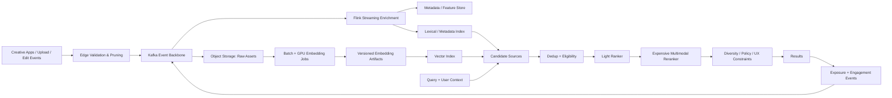

#### Key design decisions

1. Raw asset、metadata、derived artifact、embedding 和 index 分层，不让 index 成为 source of truth。
2. `producer_version + content_hash + model_version` 共同定义 derived artifact。
3. Streaming path 处理增量 freshness；batch path 处理 backfill、reindex 和大规模纠错。
4. Vector retrieval 与 lexical/metadata retrieval 并行，多阶段 fusion/ranking。
5. Video 只在必要时移动 full payload；先处理 keyframe、proxy、audio track、caption、metadata 和 artifact reference。
6. Online serving 使用 deadline、fallback、cache、autoscaling 与 sampled decision trace。

#### Result

- 50B+ multimodal assets。
- heavy-media transfer 下降约 10–20x。
- discovery CTR 提升约 15%。
- 面试前确认：baseline、实验窗口、你的 exact contribution、guardrail 和是否持续。

#### Learning

> 最大 learning 是 model quality 与 infrastructure contract 不能分开。Embedding version 如果不能稳定回填和原子切换，再好的 offline metric 也无法安全上线；同样，如果为 freshness 引入过多 synchronous dependency，p99 latency 会吞掉 quality gain。因此每个 model change 都要同时有 data migration plan、serving budget、fallback 和 evaluation plan。

### 5.3 Meta Video Foundations 映射

| 你的经历 | Video ML Foundations 的迁移 |
|---|---|
| multimodal video/image/audio parsing | video content understanding features |
| vector + lexical candidate retrieval | multi-source candidate generation |
| multi-stage ranking | retrieval → early rank → late rank → rerank funnel |
| embedding version/reindex | user/item tower compatibility、freshness、rollback |
| edge pruning / artifact reference | decode/transfer cost、feature materialization |
| autoscaling inference | heterogeneous CPU/GPU capacity、elastic compute |
| A/B test + CTR | watch time、satisfaction、retention、quality guardrails |

### 5.4 可能的尖锐追问

#### “50B 是 raw assets、versions 还是 embeddings？”

先给 precise definition。这里 `50B` 是 scenario 中的 logical asset records，不等于每个 asset 都有同等数量 embedding。说明：

```text
logical asset count
!= physical object/version count
!= embedding row count
!= index entry count
```

#### “CTR +15% 如何归因于你的系统？”

> 我不会把所有 uplift 都归给 platform。正确说法是：平台提供了新的 candidate sources、fresh features、hybrid retrieval 和可迭代 ranking path；modeling/product 团队共同完成 ranking changes；通过 controlled A/B test 观察到约 15% discovery CTR uplift。我的贡献是使这些模型能力可规模化、可回滚、可观测地进入 production。

#### “为什么 Milvus + Elasticsearch，而不是一个系统？”

> 因为当时 access pattern 不同：dense similarity、lexical exactness、metadata filtering 和 update semantics 各有优势。统一 API 可以隐藏 fan-out，但不能假装底层能力相同。长期是否统一要看 operational cost、filter pushdown、recall、freshness 和 scale，而不是追求技术栈数量最少。

---

# Part III — Video Ranking System Design

## 6. 旗舰系统设计题

> **Design the ML foundations for a Facebook-scale personalized video ranking system. Optimize quality while balancing latency, freshness, and cost.**

### 6.1 先澄清 requirements

Functional：

- Surface：Feed video、Reels、Watch，还是统一 foundation？
- Goal：watch time、completion、meaningful interaction、satisfaction、retention？
- Inventory：connected content + unconnected content？
- Freshness：新视频多久能进入 candidate pool？新 interaction 多久影响 ranking？
- Safety：integrity、age、privacy、creator/content policy 在哪层生效？
- Feedback：impression、view、dwell/watch time、skip、like、share、comment、hide、report、survey。

Non-functional：

- end-to-end p99 latency budget；
- QPS 和 peak factor；
- availability / graceful degradation；
- per-request compute / energy budget；
- training freshness 与 reproducibility；
- multi-region/cell isolation；
- model/feature backward compatibility。

### 6.2 一分钟高层答案

> 我会设计成一个 multi-stage ranking funnel。Retrieval 从 connected graph、real-time interests、long-term user embedding、similar-video ANN、trending/exploration 和 creator sources 中召回候选；early ranking 用 cache-friendly two-tower 或 lightweight multi-task model 快速压缩；late ranking 使用更丰富的 cross features、long sequence 和 multi-task model；最后 reranking 应用 diversity、freshness、integrity、creator ecosystem 和 product constraints。  
> Offline data plane 用 append-only interaction log 建 point-in-time-correct examples，streaming path 更新 fresh features，batch path 做 backfill；training plane 按 embedding/table、dense tower、sequence activation 的不同瓶颈选择 sharding 和 parallelism；serving plane 通过 model quantization、kernel fusion、dynamic batching、GPU/accelerator routing 和 deadline-aware degradation 控制成本与 tail latency。所有 model/data/index 版本共同进入 release manifest，先 replay/shadow，再 canary/A-B，并同时监控 quality、latency、freshness、cost 和 predictive health。

### 6.3 总体 architecture

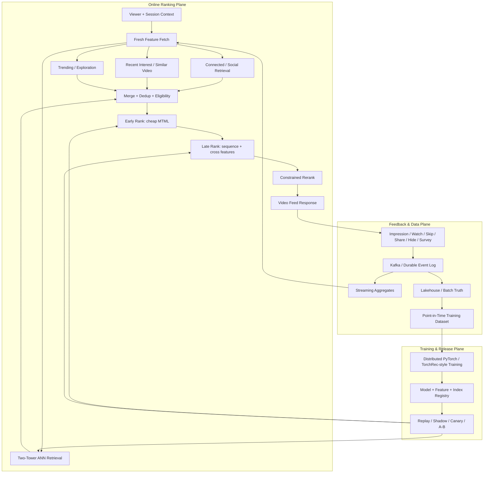

## 7. Ranking funnel：为什么一定是多阶段

假设 inventory 有十亿级视频，而每次请求 latency budget 只有数百毫秒，不可能对所有视频运行最昂贵模型。

```text
billions inventory
 -> retrieval: 10^3–10^4 candidates
 -> early rank: 10^2–10^3
 -> late rank: 10^2
 -> constrained rerank: dozens
 -> return page
```

每层优化的是不同 Pareto frontier：

| Stage | 目标 | 典型模型/系统 | 关键指标 |
|---|---|---|---|
| Retrieval | 高 recall、低成本、fresh | ANN、two-tower、graph、rules | Recall@K、source coverage、freshness |
| Early rank | 快速去除低价值候选 | small DLRM/MTML、precomputed feature | Recall of final winners、p99、cost |
| Late rank | 高质量 pointwise/multi-task prediction | DLRM、sequence model、cross features | NE/AUC、calibration、NDCG、latency |
| Rerank | slate-level constraints | greedy/optimization/diversity | diversity、policy、creator/viewer guardrail |

### 7.1 Funnel allocation math

总计算成本近似：

$$
C_{request} = \sum_{s=1}^{S} N_s \cdot c_s
$$

其中 $N_s$ 是第 $s$ 阶段候选数，$c_s$ 是每候选计算成本。一个 model change 的真实价值应看：

$$
ROI = \frac{\Delta \text{LongTermQuality}}{\Delta C_{request} + \Delta C_{training} + \Delta C_{ops}}
$$

因此优化不一定是让每层更小：如果 GPU co-design 让 early rank 一次处理更多 candidate，可能扩大 funnel 并提高最终 quality，同时降低 cost per useful candidate。

## 8. Retrieval

### 8.1 Candidate sources

- Social/connected graph。
- User long-term interest tower。
- Recent sequence / session interest。
- Item-to-item similar videos。
- Creator affinity。
- Trending / regional / contextual。
- Fresh content / cold-start exploration。
- Safety-approved inventory。

### 8.2 Two-Tower 数学

用户与视频分别编码：

$$
u = f_\theta(x_{user}, x_{context}), \qquad v_i = g_\phi(x_{video_i})
$$

相似度：

$$
s(u,v_i) = \frac{u^T v_i}{\tau}
$$

In-batch softmax loss：

$$
\mathcal{L}_{retrieval}
= -\frac{1}{B}\sum_{i=1}^{B}
\log \frac{\exp(s(u_i,v_i))}
{\sum_{j=1}^{B}\exp(s(u_i,v_j))}
$$

需要主动提的陷阱：

- in-batch negative 并非都是真 negative，popular video 更易成为 false negative；
- logged exposure 有 selection bias；
- sampled softmax 必须考虑 sampling probability；
- user tower v2 与 item index v1 不能静默混用；
- ANN recall、freshness 和 model offline accuracy 是不同指标。

### 8.3 Fresh item 怎么进入 ANN

```text
upload / publish
 -> policy + content understanding
 -> item embedding
 -> version validation
 -> incremental index insert
 -> queryable watermark advance
 -> background compaction / full rebuild
```

保证：

- `model_version == index_embedding_version`；
- 新 shard 未完整前不推进 global manifest；
- online request 记录 index version/freshness watermark；
- failed incremental update 可 replay；
- 大版本切换用 dual-read/shadow + atomic alias swap。

## 9. Multi-task / Multi-label Ranking

视频价值不能只等于 click。可能预测：

- $P(view)$、$P(3s\ view)$；
- expected watch time；
- $P(completion)$；
- $P(like/share/comment/follow)$；
- $P(skip/hide/report)$；
- satisfaction / survey interest；
- long-term return/retention proxy。

### 9.1 Multi-task loss

$$
\mathcal{L} = \sum_{t=1}^{T} \lambda_t \mathcal{L}_t
$$

Binary task：

$$
\mathcal{L}_{BCE}(y,p) = -y\log p - (1-y)\log(1-p)
$$

Watch time 可用 regression、bucket classification、survival/hazard 或分布建模。长尾 engagement 可以用 focal loss、negative downsampling correction 或 uncertainty weighting。

### 9.2 最终 value formula

示例而非 Meta 内部公式：

$$
V(i|u,c) =
w_1 \hat{p}_{watch}
+ w_2 \widehat{E[watch\_time]}
+ w_3 \hat{p}_{share}
+ w_4 \hat{p}_{satisfaction}
- w_5 \hat{p}_{hide}
- w_6 \hat{p}_{report}
- \lambda \cdot Cost(i)
$$

必须说明：

- 权重不是拍脑袋，要由 experiment / constrained optimization 校准；
- hard safety / privacy rule 不应仅作为一个可被收益抵消的小负权重；
- short-term watch time 可能诱导 clickbait 或重复消费，需 long-term guardrails；
- calibration 很重要，因为不同 task score 要进入同一 value space。

### 9.3 Calibration

Normalized Entropy（binary label）可表达为：

$$
NE = \frac{\text{LogLoss(model)}}{\text{LogLoss(empirical base rate)}}
$$

越低通常越好。还应看：

- Expected Calibration Error；
- prediction distribution drift；
- slice calibration（country、device、network、creator cohort、new user）；
- label delay / censoring。

## 10. Sequential / Generative Recommendation

传统 DLRM 强于 heterogeneous sparse feature interaction；sequence model 强于用户兴趣随时间的演化。

```text
[view video A, skip B, finish C, share D, ...]
 -> event embeddings + timestamps + action types
 -> jagged sequence encoder
 -> user state / next-action representation
 -> retrieval/ranking heads
```

公开的 Meta HSTU 工作将 recommendation 重新表述为 sequential transduction，强调 high-cardinality、non-stationary streaming data。面试不必背结构，但要能说出 system implications：

- sequence length 增长使 activation memory 和 attention compute 上升；
- 每个用户 sequence 长度不同，需要 jagged tensor / packing；
- online serving 要处理 KV/state cache 或重新编码成本；
- long history freshness 与 privacy/retention policy 冲突；
- context parallelism、kernel fusion 和 memory hierarchy 变成模型能力的一部分。

## 11. Constrained Reranking

最后阶段不是简单按 score 排序。约束可能包括：

- topic / creator diversity；
- freshness；
- integrity / safety；
- repeated-video / repeated-creator limits；
- inventory balance；
- exploration；
- network/device suitability；
- slate-level coherence。

最大边际相关性（MMR）示例：

$$
i^* = \arg\max_{i \notin S}
\left[\lambda R(i) - (1-\lambda)\max_{j\in S} sim(i,j)\right]
$$

生产中通常还要 hard eligibility、quota、business/product constraints 和 deadline-aware greedy approximation。

---

# Part IV — Training Data、Freshness 与 Evaluation

## 12. Training example 的正确性

### 12.1 Point-in-time join

预测发生在时间 $t$，只能使用 $t$ 当时可见的 feature：

$$
x_i = Feature(key_i, latest\_version \le t_i)
$$

常见 leakage：

- 使用视频发布后才生成的高质量标签；
- 使用 impression 后累计的 engagement aggregate；
- item moderation result 在 serving 时尚不可用；
- train/validation 按 row 随机 split，让同一用户/视频跨集合泄露；
- label window 尚未结束就当 negative。

### 12.2 Event contract

```json
{
  "event_id": "stable-id",
  "viewer_id_hash": "...",
  "video_id": "...",
  "request_id": "...",
  "event_type": "impression|view|skip|share|hide",
  "event_time_ms": 0,
  "ingest_time_ms": 0,
  "position": 0,
  "watch_ms": 0,
  "model_version": "ranker-v42",
  "feature_snapshot": "fs-2026-07-19-10",
  "candidate_source": "ann-recent-interest",
  "propensity": 0.0
}
```

关键：event time 与 ingest time 分开；稳定 event ID 支持 dedup；model/feature/source version 支持 replay 和 bias analysis。

### 12.3 Freshness budget decomposition

$$
T_{fresh} = T_{emit} + T_{ingest} + T_{stream} + T_{materialize} + T_{index} + T_{cache}
$$

不能只说“Kafka lag 很低”。必须定位 freshness 被哪一段消耗。

## 13. Sampling 与 bias

### 13.1 Negative sampling

- Random negatives：容易，可能过于简单。
- In-batch negatives：高效，有 false negative 与 popularity bias。
- Hard negatives：提升边界，可能放大 noisy label。
- Impression negatives：接近 policy distribution，但受当前 ranker bias。
- Counterfactual / exploration traffic：更有因果价值但成本高。

若样本按概率 $q(i)$ 被采样，可用 importance weight：

$$
w_i = \frac{p(i)}{q(i)}
$$

实际需 clipping，避免高方差：

$$
\tilde{w}_i = \min(w_i, w_{max})
$$

### 13.2 Position / selection bias

只有被当前 policy 曝光的 item 才有 feedback。方案：

- 小比例 randomized exploration；
- propensity logging；
- inverse propensity scoring / doubly robust estimator；
- replay / counterfactual evaluation；
- 不把 offline gain 直接等同 online causal gain。

## 14. Offline → Online evaluation

### 14.1 Offline

- Retrieval：Recall@K、HitRate、MRR、source coverage。
- Ranking：LogLoss/NE、AUC、NDCG、calibration。
- Slice：cold start、new creator、low bandwidth、language/region、long-tail topics。
- System：training samples/s、GPU utilization、step time、inference p99、cost/request。

### 14.2 上线门禁

```text
schema/unit tests
 -> deterministic replay
 -> offline quality + slice regression
 -> model compatibility validation
 -> load/latency benchmark
 -> shadow scoring
 -> canary
 -> A/B experiment
 -> gradual ramp
 -> long-term holdout / monitoring
```

### 14.3 A/B 指标框架

```text
Primary:
  satisfaction / meaningful watch / retention-aligned outcome

Secondary:
  watch time, completion, share, comment, creator follow

Negative guardrails:
  hide/report, repeated content, integrity, abandonment, session quality

System guardrails:
  p95/p99 latency, error/fallback, GPU cost, freshness, cache miss
```

---

# Part V — Distributed Training 与 GPU Performance

## 15. Recommendation training 为什么与普通 dense model 不同

典型 RecSys workload 同时包含：

- 大型 sparse embedding tables，memory/bandwidth bound；
- dense MLP / attention，compute bound；
- variable-length jagged sequences；
- all-to-all sparse feature exchange；
- dense gradient all-reduce；
- skewed feature frequency 和 hot rows。

因此只说“用 DDP”不够。要先 profile sparse、dense、communication 和 input pipeline 的比例。

## 16. Embedding capacity math

假设 200 个 embedding tables，总 row 数 $R=20B$，dimension $d=128$，FP16：

$$
M_{weights} = R \cdot d \cdot 2\ bytes
= 20\times 10^9 \cdot 128 \cdot 2
\approx 5.12\ TB
$$

若 optimizer 使用 Adam，master weight + first/second moments 可能让状态达到权重的数倍，单卡显然不可能，需要：

- table-wise / row-wise / column-wise sharding；
- hierarchical sharding；
- device/host/remote memory tiering；
- optimizer state sharding；
- hotness-aware placement；
- quantized embedding / caching。

## 17. Parallelism 选择

| 技术 | 适合 | 主要成本 |
|---|---|---|
| DDP | dense model 可放单卡 | gradient all-reduce、每卡复制权重 |
| FSDP | dense parameters/optimizer state 太大 | all-gather/reduce-scatter、复杂 checkpoint |
| Embedding model parallel | sparse tables 太大 | all-to-all、load imbalance |
| Tensor parallel | 单层 compute/weight 太大 | 高频 collective、拓扑敏感 |
| Pipeline parallel | 多层可切分 | bubble、microbatch 调度 |
| Context parallel | 长 sequence activation 太大 | sequence communication、jagged support |

### 17.1 TorchRec-style hybrid pattern

```text
sparse embeddings: model parallel / sharded by planner
dense interaction + MLP: data parallel
jagged input: bucket / pack / variable batch
pipeline: overlap input, all-to-all, embedding lookup, dense compute
```

### 17.2 训练 step time

$$
T_{step} \approx
\max(T_{input}, T_{sparse\_lookup}+T_{a2a}, T_{dense}, T_{allreduce})
+ T_{unhidden}
$$

目标不是单独最小化每项，而是 overlap 后减少 critical path。

## 18. GPU utilization 低：标准诊断协议

```text
1. 先建立 baseline：samples/s、step time、GPU util、SM occupancy、HBM BW
2. 分解 step：data wait / H2D / sparse / dense / collective / optimizer
3. 看 timeline，不靠平均 GPU utilization 猜
4. 判断 compute-bound、memory-bound、communication-bound 或 input-bound
5. 一次改变一个变量并验证 end-to-end throughput + model quality
```

### 18.1 症状 → 原因 → 验证 → 修复

| 症状 | 可能原因 | 验证 | 修复 |
|---|---|---|---|
| 周期性 GPU idle | dataloader / remote storage | profiler gaps、queue depth | prefetch、sharding、local cache、async IO |
| all-to-all 很长 | embedding placement / network | per-rank bytes、link utilization | hotness-aware shard、quantized comm、topology-aware placement |
| 某 rank 总最慢 | data/table skew | rank step histogram | rebalance、row-wise shard、dynamic batch |
| kernel 很碎 | many small ops | launch count、kernel duration | fusion、larger batch、compile、grouped GEMM |
| HBM OOM | embedding/activation/fragmentation | memory snapshot | sharding、checkpointing、lower precision、bucketing |
| GPU util 高但 throughput 低 | low-value compute / memory stall | roofline、useful samples/s | remove wasted candidates、fuse、layout change |

### 18.2 Roofline reasoning

Arithmetic intensity：

$$
I = \frac{FLOPs}{Bytes\ moved}
$$

可达性能近似：

$$
P \le \min(P_{peak},\ I \cdot BW_{memory})
$$

Embedding lookup 通常 arithmetic intensity 低，偏 memory-bandwidth bound；大 GEMM 更可能 compute-bound。优化 embedding 时盲目增加 FLOPs 没用，要减少 bytes、改善 locality、cache hot rows 或 quantize。

## 19. Training speed optimization 清单

Data：

- column pruning、predicate pushdown；
- deterministic sharding；
- prefetch、pinned memory、non-blocking H2D；
- sequence bucketing / packing；
- feature transform vectorization；
- point-in-time materialization cache。

Model：

- mixed precision（BF16/FP16）；
- gradient accumulation；
- activation checkpointing；
- embedding quantization / lower precision optimizer；
- sequence length / dimension scaling study；
- shared bottom vs experts 的 compute allocation。

System：

- overlap collective and compute；
- topology-aware sharding；
- fused embedding / optimizer kernels；
- `torch.compile` / Triton where beneficial；
- asynchronous distributed checkpoint；
- elastic restart and straggler mitigation。

### 19.1 Checkpoint interval math

若平均故障间隔为 $MTBF$，checkpoint 开销为 $C$，近似最优周期：

$$
T^* \approx \sqrt{2 \cdot C \cdot MTBF}
$$

这是起点，不是最终答案。还要考虑 multi-rank commit、storage bandwidth、recovery time、preemption 和 model/data state。

---

# Part VI — GPU Inference 与 Model–System Co-design

## 20. 先定义 inference trilemma

更复杂模型通常提高 quality，但会增加：

- compute FLOPs；
- memory footprint / bandwidth；
- communication；
- p99 latency；
- capacity cost。

面试高分点：不是问“如何把同一个 frozen model 跑快”，而是允许共同修改：

```text
model architecture
<-> feature representation
<-> candidate count
<-> precision
<-> kernel/layout
<-> batching/routing
<-> hardware topology
```

## 21. Inference latency decomposition

$$
T_{e2e} = T_{queue} + T_{feature} + T_{H2D} + T_{compute}
+ T_{collective} + T_{post} + T_{network}
$$

Tail latency 还受 fan-out 放大。若同时依赖 $n$ 个 backend：

$$
P(T_{max}\le t)=\prod_{i=1}^{n}P(T_i\le t)
$$

依赖越多，max latency 越差。因此 precompute/local state、request coalescing、deadline 和 fallback 很重要。

## 22. 优化工具箱

### 22.1 Quantization

- FP32 → BF16/FP16：常见 dense inference/training 基线。
- INT8：weights/activations 或 embedding row-wise quantization。
- FP8/INT4：需要 hardware/kernel、calibration 和 accuracy validation。
- QAT 比 PTQ 更可能保住 sensitive model quality，但训练复杂。

对称 quantization：

$$
q = clip(round(x/s), q_{min}, q_{max}), \qquad \hat{x}=s q
$$

scale：

$$
s = \frac{\max |x|}{q_{max}}
$$

面试必须讲验证：overall + slice NE/AUC、calibration、rare feature、long-tail creator、drift、latency、memory、throughput。

### 22.2 Batching

- static batching 提高吞吐但增加 queue latency；
- dynamic batching 以 deadline、shape/sequence bucket、GPU occupancy 决定；
- 推荐系统 batch 小且请求 feature shape 不同，不能照搬 offline batch；
- p99 SLO 下优化的是 `useful throughput within deadline`。

### 22.3 Kernel / graph

- fuse embedding lookup + pooling / optimizer；
- fuse small elementwise ops；
- grouped GEMM for multi-task heads / experts；
- remove CPU-GPU synchronization；
- preallocate buffers / CUDA Graphs for stable shapes；
- jagged tensor kernels；
- layout 与 tensor core alignment；
- benchmark representative production distribution，不只测 ideal shape。

### 22.4 Caching / memory hierarchy

```text
on-chip cache / SRAM
 -> HBM
 -> host DRAM
 -> remote memory / storage
```

Hot embedding rows 可 cache 在 HBM；cold rows 在 host/remote tier。必须监控：hit-bytes、miss latency、hotness drift、eviction、version correctness。

### 22.5 Adaptive routing

按 request context 选择 model complexity：

```text
easy / high-confidence request -> small model / early exit
hard / high-value request      -> larger model / more candidates
low-end device / tight deadline -> reduced sequence / fallback
```

这不是无条件降低 quality；routing model 自身要有 calibration、fairness、fallback 和 capacity guardrail。

## 23. Model–system co-design 例题

### Q：Late ranker quality +1%，但 GPU cost +80%、p99 +40%，怎么办？

答题框架：

1. 确认 +1% 是什么 metric、是否 online、哪些 slice 获益。
2. Profile 新增 cost：sequence、embedding、cross feature、GEMM、communication 哪一项。
3. 画 quality–cost curve，不把 architecture 当 binary choice。
4. 尝试：distillation、low-rank interaction、reduced precision、sequence truncation/bucketing、conditional experts、candidate allocation、kernel fusion。
5. 把大模型用于 hard/high-value traffic，保留 stable fallback。
6. 同时验证 long-term quality、tail latency、capacity 和 fairness。

### Q：何时 CPU 比 GPU 更合适？

> 小 batch、极低延迟、branchy logic、稀疏 random memory access、模型很小或 GPU queue/transfer 占主导时，CPU 可能更合适。GPU 适合高并行、足够 arithmetic intensity、可 batch/fuse 的 workload。正确选择要用 end-to-end benchmark，而不是按“ML 就用 GPU”。

### Q：什么时候写 Triton/CUDA kernel？

> 先确认热点稳定且占 end-to-end 足够比例；检查现有 PyTorch/FBGEMM/编译器能否解决；明确 shape distribution、numeric tolerance 和 hardware target；再写 kernel，并建立 correctness test、benchmark matrix、fallback 和版本兼容。一个 microbenchmark 快 2x、但只占请求 5%，最多带来约 2.6% end-to-end improvement（Amdahl's Law）。

$$
Speedup = \frac{1}{(1-p)+p/s}
$$

---

# Part VII — Elastic Compute、Reliability 与 Observability

## 24. Elastic compute architecture

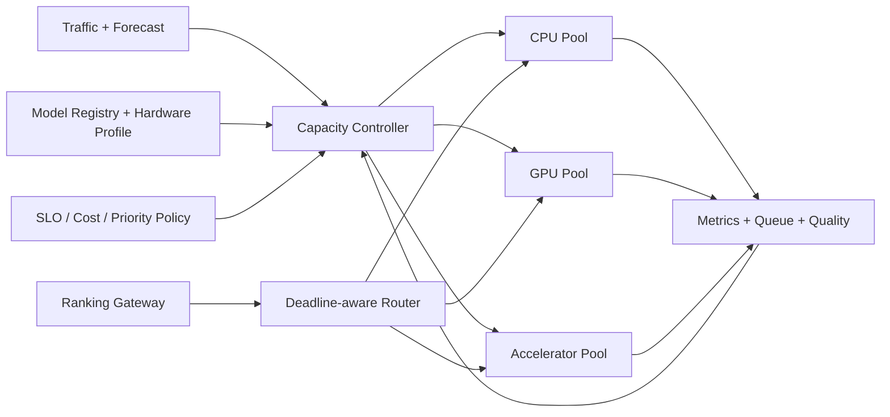

### 24.1 Autoscaling signal

不要只看 GPU utilization：

- arrival rate 与 forecast；
- queue age / deadline miss probability；
- p95/p99 latency；
- batch fill ratio；
- GPU memory headroom；
- model mix / sequence length；
- fallback rate；
- cost per 1K ranked candidates。

Little's Law：

$$
L = \lambda W
$$

若 arrival rate 增长但 service rate 不变，queue wait 会快速消耗 latency budget。

### 24.2 Capacity estimate

$$
N_{servers} =
\frac{QPS_{peak} \cdot cost_{request}}
{capacity_{server} \cdot target\_utilization}
\cdot headroom
$$

`target_utilization` 不能设为 100%，否则无突发、failover、model mix 变化和 straggler 空间。

## 25. Graceful degradation ladder

```text
Level 0: full model + all fresh features + normal candidate count
Level 1: smaller dynamic batch wait / cached fresh features
Level 2: reduced candidates / shorter sequence / small model
Level 3: cached or precomputed ranking
Level 4: safe heuristic / popular + personalized lightweight blend
```

原则：

- degradation 要 versioned、可测试、可观测；
- 不允许绕过 hard safety/privacy constraints；
- 记录 fallback reason，恢复后分析 quality debt；
- 避免 retry storm。

## 26. Ranking system 的 observability

### 26.1 四层指标

| Layer | Metrics |
|---|---|
| Data | event lag、dedup、feature freshness、null/schema drift、label maturity |
| Model | NE/AUC、calibration、prediction distribution、embedding norm、slice stability |
| Serving | QPS、p50/p95/p99、queue、timeout、fallback、batch、GPU/HBM/SM |
| Product | watch/satisfaction/retention、hide/report、creator/topic diversity |

### 26.2 Model stability 不等于 service availability

Service 200 OK 但 prediction 全部趋近常数，仍是严重事故。需要监控：

- task prediction mean/variance/quantiles；
- calibration / NE trend；
- feature missing/default rate；
- candidate source mix；
- score correlation with previous model；
- slice-level anomaly。

### 26.3 Decision trace

对小比例请求记录脱敏 trace：

```text
request/session cohort
candidate source counts
feature/model/index versions
per-stage candidate counts
filter reason codes
task scores + final value components
fallback/deadline path
latency spans
```

不要记录 raw PII、完整用户历史或不必要的 content payload。

## 27. Failure matrix

| Failure | User risk | Detection | Mitigation |
|---|---|---|---|
| Feature store stale | ranking relevance 下降 | freshness watermark | cached LKG + stale marker + async repair |
| ANN index partial update | recall/quality gap | shard manifest mismatch | old complete version + atomic swap |
| user/item tower mismatch | semantic space 不兼容 | version contract | reject load / dual version |
| GPU pool overload | p99/fallback 上升 | queue age、deadline miss | adaptive routing、reduced model、shed |
| bad quantization | slice quality regression | offline/slice/shadow | rollback precision/model |
| Kafka lag | feedback/training stale | event-time lag | scale consumers、priority topics、backfill |
| hot embedding shard | rank straggler | per-rank lookup/a2a | reshard/cache/replicate hot rows |
| prediction collapse | bad recommendations | model stability | freeze ramp、LKG rollback、feature isolation |
| training rank failure | job restart/cost | heartbeat/NCCL timeout | elastic restart、checkpoint、quarantine node |

---

# Part VIII — PyTorch Implementation

## 28. Two-Tower Retrieval（可运行的简化版）

```python
from __future__ import annotations

import torch
from torch import nn
import torch.nn.functional as F


class Tower(nn.Module):
    def __init__(self, num_ids: int, dense_dim: int, dim: int = 128):
        super().__init__()
        self.id_embedding = nn.Embedding(num_ids, dim)
        self.mlp = nn.Sequential(
            nn.Linear(dim + dense_dim, 256),
            nn.ReLU(),
            nn.Linear(256, dim),
        )

    def forward(self, ids: torch.Tensor, dense: torch.Tensor) -> torch.Tensor:
        x = torch.cat([self.id_embedding(ids), dense], dim=-1)
        return F.normalize(self.mlp(x), dim=-1)


class TwoTower(nn.Module):
    def __init__(self, users: int, videos: int, user_dense: int, video_dense: int):
        super().__init__()
        self.user_tower = Tower(users, user_dense)
        self.video_tower = Tower(videos, video_dense)
        self.log_temperature = nn.Parameter(torch.tensor(0.0))

    def forward(self, user_id, user_x, video_id, video_x):
        u = self.user_tower(user_id, user_x)
        v = self.video_tower(video_id, video_x)
        temperature = self.log_temperature.exp().clamp(0.01, 1.0)
        logits = u @ v.T / temperature
        labels = torch.arange(logits.size(0), device=logits.device)
        loss_uv = F.cross_entropy(logits, labels)
        loss_vu = F.cross_entropy(logits.T, labels)
        return 0.5 * (loss_uv + loss_vu), u, v
```

追问要点：

- production 不会用单个 `nn.Embedding` 容纳全部 ID；使用 sharded embeddings。
- 要处理 duplicate positive、false negative、sampled popularity correction。
- item embedding 可离线生成并进入 versioned ANN index；user embedding 在线计算或缓存。
- model 与 index manifest 必须原子兼容。

## 29. Multi-task Ranking Model

```python
from dataclasses import dataclass

import torch
from torch import nn
import torch.nn.functional as F


@dataclass
class RankTargets:
    completion: torch.Tensor
    share: torch.Tensor
    hide: torch.Tensor
    watch_seconds: torch.Tensor


class MultiTaskVideoRanker(nn.Module):
    def __init__(self, input_dim: int, hidden: int = 256):
        super().__init__()
        self.shared = nn.Sequential(
            nn.Linear(input_dim, hidden),
            nn.LayerNorm(hidden),
            nn.SiLU(),
            nn.Linear(hidden, hidden),
            nn.SiLU(),
        )
        self.heads = nn.ModuleDict({
            "completion": nn.Linear(hidden, 1),
            "share": nn.Linear(hidden, 1),
            "hide": nn.Linear(hidden, 1),
            "watch": nn.Linear(hidden, 1),
        })

    def forward(self, x: torch.Tensor) -> dict[str, torch.Tensor]:
        h = self.shared(x)
        return {name: head(h).squeeze(-1) for name, head in self.heads.items()}

    def loss(self, pred: dict[str, torch.Tensor], y: RankTargets):
        losses = {
            "completion": F.binary_cross_entropy_with_logits(pred["completion"], y.completion),
            "share": F.binary_cross_entropy_with_logits(pred["share"], y.share),
            "hide": F.binary_cross_entropy_with_logits(pred["hide"], y.hide),
            "watch": F.smooth_l1_loss(F.softplus(pred["watch"]), y.watch_seconds),
        }
        # 示例权重；生产中需通过 scale、uncertainty、gradient conflict 与实验校准。
        total = (
            1.0 * losses["completion"]
            + 2.0 * losses["share"]
            + 3.0 * losses["hide"]
            + 0.2 * losses["watch"]
        )
        return total, losses
```

深入追问：shared-bottom 可能有 negative transfer；可讨论 MMoE、PLE、task-specific experts、gradient normalization/PCGrad，但不要只堆模型名。先用 task conflict、latency 和 parameter budget 解释选择。

## 30. Point-in-time feature join 逻辑

```python
from bisect import bisect_right
from dataclasses import dataclass


@dataclass(frozen=True)
class FeatureVersion:
    event_time_ms: int
    value: float


def point_in_time_value(history: list[FeatureVersion], request_time_ms: int) -> float | None:
    """history 必须按 event_time_ms 升序。绝不能返回未来 feature。"""
    times = [x.event_time_ms for x in history]
    idx = bisect_right(times, request_time_ms) - 1
    return None if idx < 0 else history[idx].value


def test_no_future_leakage():
    history = [FeatureVersion(100, 1.0), FeatureVersion(200, 2.0)]
    assert point_in_time_value(history, 99) is None
    assert point_in_time_value(history, 100) == 1.0
    assert point_in_time_value(history, 199) == 1.0
    assert point_in_time_value(history, 200) == 2.0
```

Production 使用 temporal table join / feature store，不会逐 row 用 Python list；这里展示 invariant。

## 31. Deadline-aware dynamic batching

```python
from dataclasses import dataclass
import heapq


@dataclass(order=True)
class Request:
    deadline_ms: int
    request_id: str
    shape_bucket: int


class DeadlineBatcher:
    def __init__(self, max_batch: int, max_wait_ms: int):
        self.max_batch = max_batch
        self.max_wait_ms = max_wait_ms
        self.queues: dict[int, list[Request]] = {}

    def add(self, req: Request) -> None:
        heapq.heappush(self.queues.setdefault(req.shape_bucket, []), req)

    def pop_ready(self, now_ms: int) -> list[Request]:
        # 先处理最接近 deadline 的 bucket，避免只追吞吐造成 tail miss。
        ready_buckets = [
            (q[0].deadline_ms, bucket)
            for bucket, q in self.queues.items() if q
        ]
        if not ready_buckets:
            return []
        _, bucket = min(ready_buckets)
        q = self.queues[bucket]
        oldest_deadline = q[0].deadline_ms
        should_flush = len(q) >= self.max_batch or oldest_deadline - now_ms <= self.max_wait_ms
        if not should_flush:
            return []
        return [heapq.heappop(q) for _ in range(min(len(q), self.max_batch))]
```

Production 还需 cancellation、admission control、estimated service time、multi-model fairness、backpressure 和 metrics。

## 32. Diversity-aware greedy reranker

```python
from dataclasses import dataclass


@dataclass(frozen=True)
class Candidate:
    video_id: str
    creator_id: str
    topic: str
    relevance: float
    safe: bool


def rerank(candidates: list[Candidate], k: int, creator_penalty: float = 0.25):
    selected: list[Candidate] = []
    creator_counts: dict[str, int] = {}
    remaining = [c for c in candidates if c.safe]  # hard rule first

    while remaining and len(selected) < k:
        def marginal(c: Candidate) -> float:
            repeated_creator = creator_counts.get(c.creator_id, 0)
            repeated_topic = sum(x.topic == c.topic for x in selected)
            return c.relevance - creator_penalty * repeated_creator - 0.1 * repeated_topic

        best = max(remaining, key=marginal)
        selected.append(best)
        creator_counts[best.creator_id] = creator_counts.get(best.creator_id, 0) + 1
        remaining.remove(best)
    return selected
```

面试说明：这是教学版。真实系统要处理 quota、position bias、slate objective、exploration、deterministic tie-break、deadline 和 counterfactual evaluation。

## 33. Performance benchmark 的正确写法

```python
import torch


@torch.inference_mode()
def benchmark(model, batch, warmup=50, steps=200):
    model.eval()
    for _ in range(warmup):
        model(batch)
    torch.cuda.synchronize()

    start = torch.cuda.Event(enable_timing=True)
    end = torch.cuda.Event(enable_timing=True)
    start.record()
    for _ in range(steps):
        model(batch)
    end.record()
    torch.cuda.synchronize()

    total_ms = start.elapsed_time(end)
    return {
        "mean_ms": total_ms / steps,
        "throughput_batches_s": steps * 1000.0 / total_ms,
    }
```

必须补充：mean 不等于 production p99；要测真实 batch/sequence/feature distribution、concurrency、queueing、cold start、memory 和 quality。

---

# Part IX — 高频 Technical Q&A

## 34. Ranking / modeling

### Q：AUC 提升但线上 watch time 下降，为什么？

**答：**AUC 是 pairwise discrimination，可能被 dominant slice 改善；线上 policy 关注 top of list、calibration、candidate distribution 和 slate interaction。还可能有 training-serving skew、position bias、label proxy mismatch、latency fallback、diversity下降。按 stage/slice 分解 NDCG/NE/calibration，做 replay 与 score distribution comparison，再查 serving version/feature freshness，不能只怪实验噪声。

### Q：为什么不直接优化 watch time？

**答：**watch time 可能鼓励 clickbait、长视频偏置或不健康重复消费。需要 satisfaction、completion、hide/report、retention、diversity 等 multi-objective；hard integrity/experience constraints 不能被 watch time 抵消。

### Q：如何解决 cold start？

**答：**新视频依赖 content understanding、creator/context、topic/graph、exploration；新用户依赖 contextual/popular、session signals、轻量 onboarding。关键是给新内容进入 funnel 的机会并校正 exposure bias，同时设置 quality/safety guardrail。

### Q：Two-Tower 的最大局限？

**答：**为缓存 item embedding，通常不能建模强 user-item cross feature；dot product 表达力有限；ANN 与 embedding version 耦合；hard negatives 和 freshness 复杂。因此它适合 retrieval，不必承担最终精排全部责任。

### Q：何时用 RL/bandit？

**答：**当 action 会影响未来 state、需要 exploration、reward 延迟时才有价值。先保证 logged propensity、simulator/offline evaluation、safe exploration 和 guardrails。若问题只是 supervised point prediction，不应为“先进”强行上 RL。

## 35. Data / training

### Q：训练速度突然下降 20%，如何查？

**答：**先对比 step timeline、data version、model graph、world size、batch/sequence distribution 和 hardware topology；看是 input wait、collective、straggler、kernel regression 还是 checkpoint。用 known-good run 和 per-rank telemetry 做二分，不先调 learning rate 或盲目加机器。

### Q：GPU 从 64 扩到 256，throughput 不线性，为什么？

**答：**Amdahl's Law、all-to-all/all-reduce、embedding imbalance、network topology、global batch/optimizer semantics、input pipeline 和故障/straggler 概率。报告 scaling efficiency：

$$
E_N = \frac{Throughput_N}{N \cdot Throughput_1}
$$

并分解 exposed communication 与 load imbalance。

### Q：Data freshness 和 reproducibility 冲突怎么办？

**答：**在线 feature 可以持续新鲜，但训练/评估必须绑定 immutable snapshot/watermark。用 append-only log + versioned feature definitions；production model manifest 记录 data cutoff、feature code、sampling、model config。新鲜不等于每次训练读“现在最新且不可复现”的 mutable table。

### Q：如何处理 delayed label？

**答：**定义 observation window；未成熟样本不直接当 negative；可做 censoring/survival model、delayed feedback correction 或成熟样本训练 + fresh proxy task。监控 label maturity distribution 和 backfill consistency。

## 36. Inference / systems

### Q：p50 正常但 p99 变差，怎么查？

**答：**按 request shape、sequence length、candidate count、model version、host/GPU、cache miss、batch wait、dependency fan-out 分桶；看 queueing、GC/allocator、thermal/throttling、straggler、cold cache、retry。平均 profiler 可能看不到 tail，要采样 trace 和 per-stage percentile。

### Q：GPU utilization 95% 是否说明系统很好？

**答：**不一定。可能在做低价值 candidate、memory stall 或即将 miss deadline。看 useful QPS、quality-adjusted throughput、deadline success、HBM/SM、batch、cost/request。目标不是把 GPU 烧满，而是在 quality/SLO 下最小化成本。

### Q：如何安全上线 INT8？

**答：**代表性 calibration data；per-tensor/per-channel 或 row-wise 策略；offline overall/slice quality + calibration；shadow output diff；load benchmark；canary；A/B；精度 fallback。重点检查 rare feature、outlier、long-tail creator 和 drift。

### Q：Feature store timeout 怎么办？

**答：**按 feature criticality 分级：cached last-known-good、default + missing indicator、precomputed feature、small fallback model；deadline 到即停止 fan-out。不允许敏感 eligibility feature因超时默认放行。记录 missing/fallback 并做 quality attribution。

## 37. Architecture / ownership

### Q：如何决定 build platform 还是 project-specific solution？

**答：**先找稳定、重复、可执行的 invariant：model lifecycle、artifact/version、hardware profile、rollout、metrics。如果只有一个 use case 或语义还快速变化，先做 thin vertical slice；在第二/第三个真实消费者出现后抽象。平台 KPI 应包括 adoption、time-to-production、reliability 和 marginal cost，而不只是 API 数量。

### Q：与 research scientist 对 model complexity 有分歧怎么办？

**答：**把争论变成共同的 quality–cost frontier。用 production shape profile、latency/capacity budget 和 A/B value 建立约束；同时给出可验证 alternatives：sequence bucket、distillation、conditional compute、quantization、funnel reallocation。目标不是“infra 拒绝模型”，而是找到最高 end-to-end ROI。

### Q：你如何推动跨团队 migration？

**答：**先选高痛点 lighthouse workload；定义兼容 contract、migration adapter 和 exit criteria；用 shadow/double-run 验证；给 consumer dashboard 和 rollback；按 cohort 分批迁移；记录 adoption blocker。不要靠会议宣布“平台标准”。

---

# Part X — Behavioral / Leadership

## 38. 准备四个 STAR 故事

每个故事控制 2–3 分钟，必须能回答“你具体做了什么”。

### Story A：50B+ Multimodal Platform（Impact + Ambiguity）

- Situation：多产品、多模态、重复 pipeline、freshness/transfer/quality 问题。
- Task：建立 shared discovery/ranking foundation。
- Action：统一 artifact/version contract；stream + batch；hybrid retrieval；edge pruning；A/B path。
- Result：50B+ scale、transfer -10–20x、CTR +15%（确认 attribution）。
- Learning：model migration 必须携带 data/index/rollback contract。

### Story B：100B+ Real-time ML Bidding（Scale + Performance）

- Situation：极高 QPS、严格 latency、revenue-sensitive online inference。
- Task：优化 end-to-end prediction path。
- Action：用真实细节填入 feature path、cache/batching/model serving、profiling 和 rollout。
- Result：latency -30%、throughput +30%、cross-device CTR +12%（确认细节）。
- Learning：tail latency 与 feature freshness/quality 要共同测量。

### Story C：AppNexus p95 -54%（Technical depth + Operations）

- Situation：core ads data service tail latency / load。
- Action：memory-efficient caching、algorithmic/resource changes、metrics/alerts。
- Result：p95 -54%，保持 throughput。
- Follow-up：cache correctness、invalidation、measurement window、incident risk。

### Story D：Shared AI Execution Platform（Leadership + Platform）

- Situation：不同 AI workload 各自 orchestration/runtime，重复且难治理。
- Action：intent registry、planner、artifact reference、model dependency、policy、runtime routing、rollout。
- Judgment：batch、tensor inference、LLM generation 不强塞进一个 execution path。
- Result：用 adoption、efficiency、reliability 和 migration completion 等可验证指标衡量；reference design 不虚构 production uplift。

## 39. “Tell me about a disagreement”

推荐讲 technical trade-off，而不是人格冲突：

```text
shared outcome
 -> disagreement on latency / quality / launch scope
 -> evidence gathered
 -> alternatives + reversible experiment
 -> decision owner
 -> result and relationship
```

示例骨架：

> Modeling 希望在线增加更重 cross-feature model；infra 评估会突破 p99 和 capacity。我的做法不是直接否决，而是共同分解新增 quality 来自哪些 feature/sequence slice，跑 representative load profile，提出 early/late funnel allocation、distillation 和 conditional routing 三个方案。我们通过 shadow + 小流量实验选出在 latency guardrail 内收益最大的方案，并把完整模型保留给高价值/hard traffic。这个过程让双方形成可复用的 quality–cost review 模板。

仅当这与你真实经历一致时使用；否则替换成真实事件。

## 40. “Tell me about a failure”

高分答案包含：

- 你当时的 decision 和错误 assumption；
- blast radius / detection gap；
- mitigation；
- systemic fix，而非“以后更仔细”；
- 你如何分享 learning。

可选主题：cache invalidation、feature/schema change、backfill load、model rollout、capacity forecast。不要虚构 production incident。

## 41. “How do you measure your impact?”

> 我会同时定义 product outcome、model quality、system efficiency 和 operational health。例如 ranking 项目不只看 CTR/watch time，也看 hide/report、diversity、retention guardrail；model 看 calibration/NE 和 slice；system 看 p99、freshness、GPU cost；operation 看 fallback、incident 和 rollout time。这样避免局部优化：一个模型即使 offline 更准，如果 p99 导致大量 fallback，实际 product impact 可能为负。

---

# Part XI — Patrick 可能连续追问的 Deep Dive

## 42. “Design a project you would do on this team”

### 项目提案：Freshness- and Cost-Aware Video Ranking Funnel

**问题：**新视频与用户新兴趣需要快速进入推荐，但实时 feature/index/update 增加成本和 tail latency；所有 request 使用最大模型又不经济。

**目标：**在固定 p99 和 cost/request budget 下，提高 fresh-content recall 与 long-term satisfaction。

**方案：**

1. 建立端到端 freshness watermark，从 event → feature → item embedding → ANN → cache。
2. 将 candidate 分为 fresh、long-term、social、exploration sources，记录 source propensity。
3. Early rank 预测 candidate value + uncertainty + freshness benefit。
4. Deadline-aware router 为 uncertain/high-value request 分配更大 candidate budget / richer late model。
5. 通过 INT8 embedding、fused retrieval、dynamic batching 和 hot-row cache 降低 marginal compute。
6. Offline replay + shadow + A/B，同时看 satisfaction、retention、fresh creator exposure、p99 和 cost。

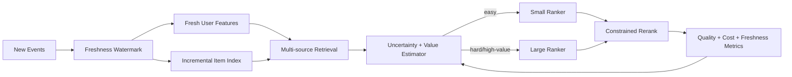

### Success metrics

$$
\max \Delta Satisfaction
\quad s.t. \quad
p99 \le L_{budget},\ C_{request}\le C_{budget},\ Safety\ regressions = 0
$$

### 项目如何真正落地

先固定 workload、quality、latency 和 cost baseline；选择一个可独立上线的 vertical slice；完成 point-in-time data validation、representative profiling 和 Pareto experiment；随后依次通过 replay、shadow、canary 与 A/B；最终把 model、feature、index、runtime 和 rollback 绑定为一个 release manifest。重点不是时间表，而是每一步都有可证伪的 gate。

## 43. “How would AI agents / LLMs help this workflow?”

不要说让 LLM 直接控制 production ranking。高质量答案：

- experiment configuration lint / policy check；
- profiler trace summarization 与 regression triage；
- model/data card generation；
- code/test generation with human review；
- incident evidence gathering；
- feature/schema migration assistant；
- offline analysis query generation；
- guarded agent orchestration，所有 action 经过 typed API、auth、dry-run、approval、audit。

衡量：time-to-diagnosis、experiment setup time、review defects、false recommendation、human acceptance，而不是“用了多少 agent”。

---

# Part XII — Coding / Practical Exercises

## 44. 高频 coding 方向

Hiring Manager chat 不一定写 code，但后续轮次可准备：

1. Top-K / heap / streaming aggregation。
2. LRU/LFU cache、TTL、versioned cache。
3. Rate limiter / token bucket。
4. Consistent hashing / shard assignment。
5. Merge candidate lists + dedup + source quota。
6. Sliding window engagement aggregation。
7. Weighted sampling / reservoir sampling。
8. DAG scheduling / retry / idempotency。
9. Batch formation under deadline。
10. Tensor shape、vectorization、PyTorch module debugging。

### 44.1 Merge multi-source candidates

要求：多个 source 已按 score 排序；去重；每个 source 有 quota；输出 top K。

需要讲清 invariant：

- 每个 source cursor 只前进；
- dedup 后才能计入 quota；
- tie-break deterministic；
- complexity 约 $O(K\log S)$，$S$ 为 sources 数。

### 44.2 Sliding window watch time

问清：event 是否乱序、窗口按 event time 还是 processing time、是否允许 late event、内存上限、需要 exact 还是 approximate。可用 deque（单 key）、time bucket + hash map（多 key）、stream processor state + watermark（distributed）。

### 44.3 Weighted reservoir sampling

用于长流中按权重保留固定大小样本。需要讨论随机性、reproducibility、distributed merge 和 sampling bias。

---

# Part XIII — Responsible AI、Safety 与 Product Judgment

## 45. Video RecSys 风险

- feedback loop / filter bubble；
- popularity bias 与 new creator starvation；
- demographic/language/region quality gaps；
- clickbait、misinformation、unsafe content；
- minors / sensitive topics；
- privacy、consent、data retention；
- engagement proxy 与 well-being 不一致；
- model/feature drift 导致不可预测 exposure。

### 45.1 Engineering controls

- hard eligibility / integrity gate；
- slice-level evaluation 与 threshold；
- calibrated uncertainty / abstain/fallback；
- diversity / exploration with guardrails；
- data minimization、retention、access audit；
- model/data cards；
- red-team、shadow、canary、rollback；
- sampled explainable decision trace；
- user controls / direct feedback integration。

### 45.2 高质量表达

> Responsible AI 不是模型上线后的最后一个 classifier，而是 data collection、label definition、sampling、objective、funnel eligibility、evaluation、rollout 和 monitoring 的系统属性。特别是 video ranking，short-term engagement 很容易与用户长期满意度错位，所以我会把 hard safety rule 与可优化的 soft objective 分开，并持续看 slice 和 long-term guardrail。

---

# Part XIV — 反问 Patrick Cullen

## 46. 优先级最高的 10 个问题

45 分钟最多问 3–4 个，按对话选择。

1. **Team charter**：Video ML Foundations 与 product ranking teams、Core AI、hardware/runtime teams 的 ownership boundary 如何划分？
2. **Current bottleneck**：目前最大的 constraint 更偏 training throughput、online inference、candidate funnel、feature freshness，还是 compute allocation？
3. **Success**：这个角色入职 6–12 个月后，什么结果会被视为 exceptional impact？
4. **Model–system co-design**：团队工程师通常在多早阶段参与 model architecture decision？能否举一个 model 因 hardware/system constraint 而重新设计的公开级别例子？
5. **Role depth**：这个岗位更期待在一个方向形成 deep technical ownership，还是跨 training/inference/funnel 推动 end-to-end initiative？
6. **Experiment loop**：从 research idea 到 online experiment，当前最大的 time-to-production bottleneck 是什么？
7. **Quality–cost**：团队如何评价 quality gain 是否值得额外 training/inference cost？有没有统一的 cost-aware decision framework？
8. **Freshness**：video/user signals 的 freshness 在当前 roadmap 中扮演什么角色，主要受 data、index、cache 还是 serving constraint 限制？
9. **Collaboration**：这个角色最频繁合作的是 Research Scientist、ML Engineer、Production Engineer 还是 hardware/kernel teams？
10. **Interview alignment**：基于今天的交流，这个岗位最需要候选人在哪个 technical dimension 形成立即可见的 depth，又希望在哪些方向继续成长？

### 46.1 最佳三问组合

```text
1. 当前最大技术 bottleneck 是什么？
2. 这个角色 6–12 个月 exceptional impact 如何定义？
3. model–system co-design 在团队实际如何发生？
```

不要先问福利、remote policy 或纯流程问题；这些可留给 recruiter。

---

# Part XV — 最后复习卡

## 47. 面试前必须能脱口而出的数字

| 数字 | 你必须能解释的内容 |
|---|---|
| 100B+ opportunities/day | definition、平均/peak scale、online path |
| latency -30% | baseline、p50/p95/p99、具体 change、quality guardrail |
| throughput +30% | measurement unit、capacity/cost impact |
| CTR +12% | personalization、实验与 attribution |
| 50B+ assets | logical/physical/index/embedding count 区别 |
| transfer -10–20x | pruning 什么、是否影响 quality/freshness |
| discovery CTR +15% | platform/model/product contribution 边界 |
| p95 -54% | cache/algorithm/resource change、correctness |

## 48. 十句技术主线

1. Ranking quality 必须在 latency、freshness、cost 和 safety constraint 下定义。
2. Funnel 每层有不同的 candidate count、model complexity 和 success metric。
3. Source of truth、feature/materialization、embedding 和 ANN index 必须分离但 version-compatible。
4. Point-in-time correctness 是 training data 的底线。
5. RecSys training 同时有 sparse memory、jagged sequence、dense compute 和 collective communication。
6. GPU utilization 不是目标；quality-adjusted useful throughput within deadline 才是目标。
7. Model–system co-design 允许共同改变 architecture、precision、candidate count、kernel 和 routing。
8. Service availability 不代表 prediction health；必须监控 calibration、distribution 和 slice stability。
9. Hard safety/privacy constraint 不能只是可被 engagement 抵消的 soft weight。
10. 任何 model improvement 都需要 data migration、benchmark、fallback、rollout 和 A/B plan。

## 49. 被问到陌生内部技术时

用这个协议：

> “我没有直接使用过这个 Meta internal system，所以不想猜它的实现。我先从我理解的 workload invariant 回答：它需要解决的是……我的相邻经验是……如果让我接手，我会先验证 API/scale/SLO/ownership，然后从这些指标和 failure modes 切入。”

这比硬编一个答案更 Senior。

## 50. 上场前只看这十句话

1. 我的核心价值是把 ranking quality 放进 latency、freshness、cost、reliability 的 production constraint 中实现。
2. 真实经历主线是 `100B+ online decisioning → 50B+ multimodal retrieval/ranking → shared CPU/GPU AI platform`。
3. Training data 的底线是 stable event identity、event-time semantics、point-in-time correctness、label maturity 和 reproducible manifest。
4. RecSys GPU workload 同时包含 sparse embedding、jagged sequence、dense compute、all-to-all 和 all-reduce。
5. GPU utilization 不是目标；`quality-adjusted useful throughput within deadline` 才是目标。
6. 性能优化先看 timeline，再区分 input、memory、compute、communication、launch 和 queue bottleneck。
7. Model–system co-design 共同改变 sequence、embedding、candidate K、precision、sharding、kernel 和 routing。
8. Offline metric 提升不等于线上价值；还要验证 calibration、slice、p99、fallback、cost 和 long-term guardrail。
9. 每次 release 必须原子绑定 data、feature、model、embedding/index、runtime 与 fallback version。
10. Meta 内部实现不是我的 direct experience；我会从 workload invariant、相邻经验、metrics 和 failure modes 回答。

---

# Part XVI — 三条核心能力的 Technical Depth 学习主线

> 这一部分是整份手册的“硬核学习区”。目标不是读完觉得熟悉，而是读完后可以：  
> 1. 从 raw interaction events 设计出 correctness-first、可重放的 RecSys training dataset；  
> 2. 看懂一次 recommendation training/inference profile，判断瓶颈并提出可验证优化；  
> 3. 用 model–infra–hardware co-design 把 quality gain 转化为 production ROI。  
> 每条主线都使用相同学习协议：**mental model → invariants → math → implementation → failure → experiment → interview defense**。

---

## 51. 学习验收标准：不是“知道”，而是“能推导、能实现、能诊断”

### 51.1 Training data pipelines

读完后你应能独立回答：

- 一次 video impression 如何变成 point-in-time-correct training example？
- event time、processing time、watermark、late event、dedup 分别解决什么？
- 为什么“没有 click”不一定是 negative？
- sampling 后的 loss 为什么需要 correction？
- streaming feature 和 batch backfill 如何保证同一语义？
- 如何把 dataset version、feature definition、label policy、sampling policy 固化成可复现 manifest？
- GPU 在等数据时，如何证明瓶颈在 storage、decode、transform、collate 还是 H2D？

### 51.2 GPU model performance optimization

读完后你应能独立完成：

- 从 `step_time` 分解 input、sparse lookup、all-to-all、dense compute、all-reduce、optimizer。
- 区分 compute-bound、memory-bound、communication-bound、launch-bound、input-bound。
- 计算 embedding weights + optimizer state 的 memory capacity。
- 解释 table-wise、row-wise、column-wise、table-row-wise sharding 的数据流与代价。
- 解释 jagged tensor 为什么不能简单 padding 到最长 sequence。
- 使用 `torch.profiler` 形成 hypothesis，并知道何时升级到 Nsight Systems / Nsight Compute。
- 用 Amdahl、Roofline、MFU、scaling efficiency 判断 optimization 是否值得。

### 51.3 ML infrastructure co-design

读完后你应能独立完成：

- 把“模型更准但太贵”从争论变为 Pareto frontier experiment。
- 对 embedding dimension、sequence length、candidate K、precision、batching、routing 做联合设计。
- 给每个 model change 附上 data/index migration、hardware mapping、benchmark、rollout 与 rollback。
- 解释为什么一个 microbenchmark improvement 可能没有 end-to-end value。
- 设计一个跨 modeling、training infra、serving、hardware、product 的 execution plan。

---

# Track A — High-scale RecSys Training Data Pipelines

## 52. 从 user action 到 tensor：完整 data lifecycle

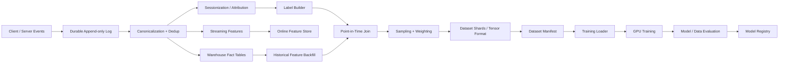

数据路径的五个层次：

1. **Raw truth**：尽可能接近发生事实的 append-only events。
2. **Canonical truth**：统一 schema、identity、event semantics、dedup 后的事实表。
3. **Feature state**：只使用 prediction time 当时可获得的信息。
4. **Training examples**：feature、label、sample weight 和 context 的不可变组合。
5. **Tensor delivery**：将 examples 高吞吐地变成 GPU 消费的 dense/jagged tensors。

### 52.1 六个 production invariants

**Invariant 1 — Stable identity**  
`request_id`、`impression_id`、`viewer_id`、`video_id` 的语义必须稳定；player retry 不能被误算成多个独立曝光。

**Invariant 2 — Event time is explicit**  
发生时间与到达时间分开，不能用 ingest time 冒充用户行为时间。

**Invariant 3 — Point-in-time correctness**  
任何 feature 的有效时间都不得晚于 prediction time。

**Invariant 4 — Label maturity**  
负样本必须等 observation window 成熟；否则“未来会发生的 engagement”会被错标为 0。

**Invariant 5 — Idempotent replay**  
同一 input range + code/config version 重放，应得到相同 logical output。

**Invariant 6 — Manifest before consumption**  
只有所有 shards、statistics、checksums 完整后才发布 dataset manifest；训练不能看到 partial dataset。

## 53. Event-time semantics：watermark、late data 与 dedup

### 53.1 三个时间

- `event_time`：用户行为真正发生的时间。
- `ingest_time`：event 到达 log/collector 的时间。
- `processing_time`：pipeline 处理该 event 的时间。

延迟：

$$
L_{event} = ingest\_time - event\_time
$$

若客户端离线、网络重试或 mobile batching，$L_{event}$ 可能长尾。只按 processing time 聚合会把昨天发生的 watch 计入今天。

### 53.2 Watermark

Watermark $W(t)$ 表示系统认为 `event_time <= W(t)` 的大多数事件已经到达。常见近似：

$$
W(t)=\max(event\_time\ observed)-allowed\_lateness
$$

它不是“绝对不会再有旧事件”，而是 completeness 与 latency 的 trade-off。

- watermark 太慢：label/dataset freshness 差、state retention 大。
- watermark 太快：late events 多、需要 correction/backfill。

### 53.3 Late event policy

| Late 程度 | 处理策略 |
|---|---|
| watermark 内 | 正常更新 window state |
| watermark 后但 correction horizon 内 | 写 correction stream / upsert aggregate |
| 超出 correction horizon | 保留 raw log，进入 offline reconciliation，不改 online state |

### 53.4 Dedup 不是简单 `distinct`

Dedup key 通常是稳定 `event_id`，而不是完整 payload hash。需要定义：

- duplicate TTL / retention；
- 同 ID 不同 payload 如何处理（quarantine / last-write 不一定安全）；
- dedup marker 与 aggregate update 是否同一 atomic boundary；
- replay 时 dedup state 如何重建。

端到端目标不是口号式 exactly-once，而是：

```text
at-least-once transport
+ stable event ID
+ idempotent transform
+ atomic/conditional sink update
+ reconciliation from raw truth
```

### 53.5 简化 watermark aggregator

```python
from __future__ import annotations

from collections import defaultdict
from dataclasses import dataclass


@dataclass(frozen=True)
class WatchEvent:
    event_id: str
    viewer_id: str
    event_time_ms: int
    watch_ms: int


class EventTimeWatchAggregator:
    """教学版：展示 watermark、dedup 和 late-event invariant。"""

    def __init__(self, allowed_lateness_ms: int):
        self.allowed_lateness_ms = allowed_lateness_ms
        self.max_event_time_ms = -1
        self.seen_ids: set[str] = set()
        self.watch_by_viewer: dict[str, int] = defaultdict(int)
        self.too_late: list[WatchEvent] = []

    @property
    def watermark_ms(self) -> int:
        return self.max_event_time_ms - self.allowed_lateness_ms

    def process(self, event: WatchEvent) -> str:
        if event.event_id in self.seen_ids:
            return "duplicate"
        self.seen_ids.add(event.event_id)
        self.max_event_time_ms = max(self.max_event_time_ms, event.event_time_ms)

        if event.event_time_ms < self.watermark_ms:
            self.too_late.append(event)
            return "late"

        self.watch_by_viewer[event.viewer_id] += event.watch_ms
        return "applied"
```

Production 版本需要 durable state、bounded dedup retention、window eviction、checkpoint、rescale 和 correction sink。

## 54. Point-in-time join：最常见也最隐蔽的模型泄漏

### 54.1 问题定义

对每个 impression $i$，prediction time 为 $t_i$。Feature value 应为：

$$
x_{i,f}=\arg\max_{v}\{v.event\_time \mid v.key=i.key,\ v.event\_time \le t_i\}
$$

不是“读取当前 feature table”，而是 as-of join。

### 54.2 SQL 语义示例

```sql
SELECT impression_id, viewer_id, video_id, feature_value
FROM (
  SELECT
    i.impression_id,
    i.viewer_id,
    i.video_id,
    f.value AS feature_value,
    ROW_NUMBER() OVER (
      PARTITION BY i.impression_id
      ORDER BY f.effective_time DESC
    ) AS rn
  FROM impressions i
  LEFT JOIN feature_history f
    ON f.entity_id = i.viewer_id
   AND f.effective_time <= i.prediction_time
)
WHERE rn = 1;
```

真实大规模实现不会盲目执行巨型 range join；可使用 sorted/bucketed temporal join、versioned snapshots、pre-materialized historical features 或 streaming state。

### 54.3 Offline/online feature parity

最稳的方法不是复制两套逻辑，而是：

```text
one versioned feature definition
 -> streaming executor for online state
 -> batch executor for historical backfill
 -> parity test on the same event slice
```

Parity 不能只看 schema；要比较 value distribution、null/default rate、timestamp、cardinality、top keys 和 slice。

### 54.4 Training-serving skew 的四类来源

1. **Code skew**：batch Python 与 online C++/Java 实现不同。
2. **Time skew**：offline 用最终值，online 用当时值。
3. **Availability skew**：训练 feature 很完整，线上经常 timeout/default。
4. **Distribution skew**：训练 sampler 与 production candidate policy 不同。

面试回答必须说明怎么检测：在 sampled production request 上同时记录 online feature 与可离线重算的 reference，按 feature/version/slice 做 diff。

## 55. Label construction：一次播放行为究竟是什么标签

### 55.1 Video engagement 不是一个 binary label

一次 impression 可能形成：

```text
impression
 -> autoplay start
 -> 3-second view
 -> 20-second watch
 -> completion
 -> replay
 -> like/share/comment/follow
 -> hide/report
 -> next-session return
```

每个 label 都需要：

- attribution key；
- observation window；
- eligibility conditions；
- censoring policy；
- retry/session semantics；
- late-event correction；
- privacy/retention policy。

### 55.2 Watch time 的 censoring

若用户在数据 cutoff 时仍在观看，真实 watch time 尚未知。直接使用当前值会产生 right censoring。方案：

- 等窗口成熟后训练；
- 将 watch time bucket 化并建模 hazard/survival；
- fresh 模型使用 proxy task，成熟数据用于主 task；
- 对未成熟样本加 mask，而不是当 0。

### 55.3 Negative 的三种语义

- **Exposed negative**：看到了但跳过/未互动；最接近当前 serving policy。
- **Unexposed sampled item**：不知道用户是否不喜欢，只是没展示。
- **Hard negative**：模型认为相关但实际未正反馈；可能是 label noise 或 false negative。

面试要主动说：implicit feedback 中 `not observed != dislike`。

## 56. Sampling、correction 与 unbiased objective

### 56.1 为什么必须 sampling

一次请求可能有上千 candidates，但只有少数 positives；全量保存所有 pairs 会导致数据与训练成本爆炸。Sampling 目标是降低成本，同时尽量保留对目标 distribution 的估计。

若目标分布 $p(x)$，训练采样分布 $q(x)$：

$$
\mathbb{E}_{p}[\ell(x)]
= \mathbb{E}_{q}\left[\frac{p(x)}{q(x)}\ell(x)\right]
$$

但 weight 可能高方差，所以需要 clipping / self-normalization。

### 56.2 Negative downsampling correction

若 positive 全保留，negative 仅以概率 $r$ 保留，训练集 prior 被改变。对于 binary logistic model，可使用 sample weight：

$$
w(y)=
\begin{cases}
1, & y=1\\
1/r, & y=0
\end{cases}
$$

或者对 logit 做 prior correction。不要在 downsampled data 上直接相信未经校准的 probability。

### 56.3 PyTorch weighted loss

```python
import torch
import torch.nn.functional as F


def corrected_bce_loss(
    logits: torch.Tensor,
    labels: torch.Tensor,
    negative_keep_probability: float,
    max_weight: float = 100.0,
) -> torch.Tensor:
    if not 0.0 < negative_keep_probability <= 1.0:
        raise ValueError("negative_keep_probability must be in (0, 1]")
    negative_weight = min(1.0 / negative_keep_probability, max_weight)
    weights = torch.where(
        labels > 0.5,
        torch.ones_like(labels),
        torch.full_like(labels, negative_weight),
    )
    per_example = F.binary_cross_entropy_with_logits(logits, labels, reduction="none")
    return (per_example * weights).sum() / weights.sum()
```

### 56.4 Hard-negative curriculum

```text
phase 1: random/in-batch negatives -> learn broad separation
phase 2: ANN/model-mined negatives -> refine boundary
phase 3: policy/exposure negatives -> match production distribution
```

风险：hard negative 太难或 false negative 太多会 destabilize training；mining model/version 要进入 dataset lineage。

## 57. Dataset versioning：可复现不是保存一个日期字符串

### 57.1 Dataset manifest

```yaml
dataset_id: video-rank-train-2026-07-19-v3
event_range: [2026-06-01T00:00:00Z, 2026-07-01T00:00:00Z]
label_maturity_cutoff: 2026-07-08T00:00:00Z
event_schema_version: watch-event-v12
feature_definition_hash: sha256:...
feature_snapshot: feature-history-v87
label_policy_version: video-label-v9
sampling_policy:
  name: exposed-plus-hard-negative
  negative_keep_probability: 0.05
  miner_model_version: retrieval-v41
privacy_policy_version: retention-v6
shards:
  - uri: blob://datasets/.../part-00000
    rows: 12000000
    checksum: sha256:...
statistics_uri: blob://datasets/.../stats.json
producer_code_commit: abc123
```

必须记录的不是工具名，而是所有会改变训练语义的依赖。

### 57.2 Atomic publish

```text
write temporary shards
 -> validate row counts/schema/stats/checksum
 -> write immutable manifest
 -> compare expected shard set
 -> atomic alias update: candidate -> ready
```

Reader 只能从 `ready` manifest 读取。Partial shard 永远不可见。

## 58. Data quality：从 schema 到 model behavior

### 58.1 四层检查

**Schema**：type、required、range、enum、shape。  
**Statistical**：null、quantile、cardinality、entropy、top-K、drift。  
**Relational**：impression ↔ candidate ↔ video ↔ viewer 的 referential integrity。  
**Semantic/model-aware**：label rate、feature-label leakage、embedding norm、slice coverage、sampling weight。

### 58.2 Drift metrics

Population Stability Index：

$$
PSI=\sum_b (p_b-q_b)\ln\frac{p_b}{q_b}
$$

Jensen-Shannon divergence：

$$
JSD(P\|Q)=\frac{1}{2}KL(P\|M)+\frac{1}{2}KL(Q\|M),\quad M=\frac{P+Q}{2}
$$

阈值需基于 feature 和历史 behavior 校准，不能用一个全局 magic number。

### 58.3 Golden slice parity test

选固定的 production event slice：

```text
streaming transform output
vs batch backfill output
vs online request logged feature
```

比较 exact value 或 tolerance，并在 feature definition change 时作为 CI gate。

## 59. Data ingestion performance：不要让更快 GPU 等更慢 CPU

### 59.1 Pipeline stage model

```text
remote read -> decrypt/decompress -> decode -> transform
-> filter/sample -> collate/pad -> pin memory -> H2D -> GPU
```

若各 stage 串行：

$$
T_{batch}=\sum_i T_i
$$

充分 pipeline overlap 后 throughput 受最慢 stage 限制：

$$
Throughput \approx \frac{1}{\max_i T_i}
$$

### 59.2 每阶段必须观测

- input/output records/s 与 bytes/s；
- queue depth、wait time、service time；
- filter selectivity；
- cache hit bytes；
- decompression/transform CPU；
- batch shape/sequence distribution；
- pinned-memory/H2D time；
- GPU data-wait ratio。

### 59.3 Backpressure

没有 backpressure 时，快 upstream 会把慢 stage 的 memory 打爆。策略：

- bounded queues；
- demand-driven pull；
- adaptive concurrency；
- per-tenant/workload quota；
- spill only when cost justified；
- cancellation propagation。

### 59.4 选择 precompute 还是 last-mile transform

| Precompute | Last-mile |
|---|---|
| 多次复用、计算昂贵、语义稳定 | 随机 augmentation、实验变化快 |
| 减少训练 CPU | 避免存储膨胀 |
| 可能 stale、storage cost 高 | 可能导致 GPU starvation |

应比较：

$$
Cost_{precompute}=C_{write}+N_{versions}C_{storage}+C_{refresh}
$$

$$
Cost_{online}=N_{epochs}\cdot N_{experiments}\cdot C_{transform}
$$

## 60. Training data pipeline 连续追问

### Q：如何证明训练数据没有未来信息？

**答：**每个 feature row 有 `effective_time`，example 有 `prediction_time`，构建使用 as-of join；CI 有 synthetic future-feature test；production golden slice 比较 online log 与 offline reconstruction；dataset manifest 固化 feature snapshot/code。只说“我们按日期 split”不够。

### Q：streaming 和 batch 结果不同怎么办？

**答：**先确定是 code skew、event ordering、late data、state TTL、numeric precision 还是 source cutoff；使用同一 feature definition 与固定 event slice replay；输出 intermediate state diff；语义选择由 contract 决定，不简单以 batch 为真。

### Q：如何处理 viral fresh video？

**答：**streaming content/engagement features、incremental item embedding/index、source-specific fresh retrieval、uncertainty/exploration、cache invalidation；同时防 bot/low-quality amplification。监控从 publish 到 retrievable/rankable 的 freshness budget。

### Q：pipeline 99.99% 可用，为什么模型仍然变差？

**答：**availability 只说明任务成功，不能证明语义正确。可能 schema default、label rate、sampling mix、feature time、candidate policy 已漂移。要同时监控 statistical/semantic data quality 与 model prediction health。

---

# Track B — GPU Model Performance Optimization

## 61. 第一原则：优化之前先定义“有效工作”

推荐系统的 performance metric 不能只有 FLOPs/s：

```text
training:
  quality target 下的 time-to-train / time-to-solution
  samples/s、GPU-hours、data freshness、failure recovery

inference:
  SLO 内的 quality-adjusted QPS
  cost / 1K candidates、deadline success、fallback rate
```

### 61.1 Time-to-solution

某 optimization 让单 step 快 20%，但需要更多 steps 才达到相同 quality，未必有效：

$$
T_{solution}=T_{step}\cdot Steps(Q\ge Q_{target})+T_{restart}+T_{queue}
$$

### 61.2 Model FLOPs Utilization（MFU）

$$
MFU=\frac{Achieved\ model\ FLOPs/s}{Hardware\ peak\ FLOPs/s}
$$

MFU 对 dense compute 有意义，但对 sparse embedding / memory-bound RecSys 不足。需要同时报告 HBM bandwidth utilization、communication 与 useful samples/s。

## 62. RecSys training step 的数据流

以 hybrid data/model parallel 为例：

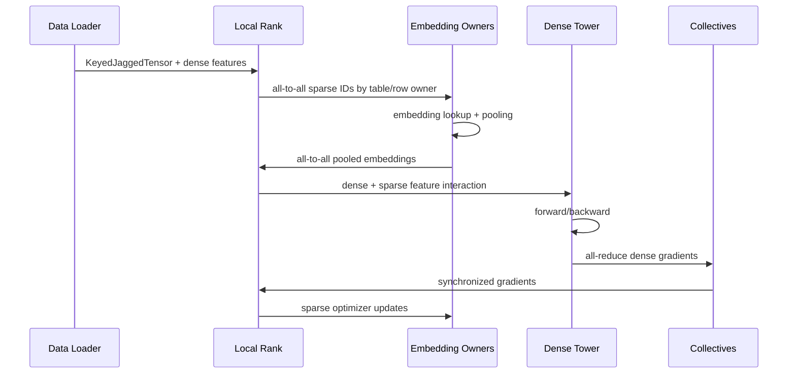

### 62.1 为什么需要 all-to-all

每个 rank 持有 local batch，但 embedding rows 分散在不同 owner ranks：

1. local rank 根据 feature/table/row owner 对 IDs bucketize；
2. all-to-all 将 IDs 发送到 owner；
3. owner 做 lookup/pooling；
4. all-to-all 将 embedding result 返回原 batch rank；
5. local dense network 继续计算。

通信量粗略：

$$
Bytes_{a2a} \approx B\cdot\sum_f nnz_f\cdot bytes_{id}
+B\cdot\sum_f d_f\cdot bytes_{emb}
$$

实际还受 bucket metadata、padding、network topology、skew 影响。

## 63. Jagged tensor：RecSys 性能的关键数据结构

用户历史长度不同：`[2, 30, 4, 500, ...]`。若 pad 到最大长度 $L_{max}$：

$$
Waste = 1-\frac{\sum_i L_i}{B\cdot L_{max}}
$$

长尾 sequence 会让 waste 接近 1。Jagged representation 使用：

```text
values:  [all IDs concatenated]
lengths: [2, 30, 4, 500, ...]
offsets: prefix_sum(lengths)
```

优势：少搬无效数据。代价：

- irregular memory access；
- load imbalance；
- kernel 设计更复杂；
- sequence bucket/packing 仍重要；
- graph capture/shape specialization 更困难。

## 64. Embedding sharding：不是“平均分内存”

### 64.1 四种基本方式

**Table-wise**：整张 table 放一个 rank。  
优点：lookup 无需跨 shard 聚合；适合较小 tables。缺点：大 table 放不下；hot table 造成 rank hotspot。

**Row-wise**：按 rows 分布。  
优点：大 table 可横跨多卡，容量平衡。缺点：ID redistribution all-to-all；hot rows 仍可能 skew。

**Column-wise**：按 embedding dimension 分布。  
优点：宽 embedding 可拆。缺点：每个 lookup 需要 gather/concat 所有 column shards。

**Table-row-wise / hierarchical**：先按 host 放 table，再在 host 内 row-wise。  
利用 NVLink/scale-up bandwidth，减少慢速跨 host communication。

### 64.2 Planner 的 cost model

一个实用 planner 至少考虑：

$$
Cost(plan)=
\alpha\max_r Memory_r
+\beta\max_r Compute_r
+\gamma\max_r Communication_r
+\delta\cdot Imbalance(plan)
$$

输入统计：

- rows、dimension、dtype；
- optimizer state bytes；
- pooling factor / average `nnz`；
- access frequency / hotness；
- batch size；
- HBM/DRAM capacity；
- intra-host / inter-host bandwidth；
- kernel type。

只按 table bytes 平分会失败：一张小但超高频 table 可能比大冷 table 更耗 compute/bandwidth。

### 64.3 简化 sharding estimator

```python
from dataclasses import dataclass


@dataclass(frozen=True)
class EmbeddingTableProfile:
    name: str
    rows: int
    dim: int
    bytes_per_weight: int
    optimizer_multiplier: float
    lookups_per_batch: float

    @property
    def memory_bytes(self) -> float:
        weights = self.rows * self.dim * self.bytes_per_weight
        return weights * self.optimizer_multiplier

    def estimated_read_bytes(self, batches_per_second: float) -> float:
        return self.lookups_per_batch * self.dim * self.bytes_per_weight * batches_per_second


def greedy_table_wise_plan(tables: list[EmbeddingTableProfile], world_size: int):
    """教学版：按 memory + read bandwidth 做 greedy placement。"""
    loads = [{"memory": 0.0, "read": 0.0, "tables": []} for _ in range(world_size)]
    for table in sorted(tables, key=lambda x: x.memory_bytes, reverse=True):
        target = min(
            range(world_size),
            key=lambda rank: loads[rank]["memory"] + 0.25 * loads[rank]["read"],
        )
        loads[target]["memory"] += table.memory_bytes
        loads[target]["read"] += table.estimated_read_bytes(1.0)
        loads[target]["tables"].append(table.name)
    return loads
```

真正 TorchRec planner 会处理更多 sharding types、topology、kernel、constraints；这个代码只用于理解 cost model。

## 65. Profiling protocol：从症状到证据

### 65.1 Level 0 — Baseline contract

记录：

- exact model/data/code/hardware version；
- batch、sequence、feature distribution；
- warmup、measurement window；
- quality metric；
- samples/s、step p50/p95、GPU memory、power；
- per-rank distribution，而非只看 rank 0。

### 65.2 Level 1 — Application timeline

使用 `torch.profiler` 看：

- CPU launch gaps；
- DataLoader wait；
- H2D；
- embedding ops；
- collectives；
- GEMM/attention；
- optimizer；
- memory allocation。

```python
import torch
from torch.profiler import ProfilerActivity, profile, record_function, schedule


def profile_training_steps(model, optimizer, batch_iterator, train_step, trace_dir: str):
    activities = [ProfilerActivity.CPU]
    if torch.cuda.is_available():
        activities.append(ProfilerActivity.CUDA)

    with profile(
        activities=activities,
        schedule=schedule(wait=2, warmup=2, active=4, repeat=1),
        record_shapes=True,
        profile_memory=True,
        with_stack=True,
        on_trace_ready=torch.profiler.tensorboard_trace_handler(trace_dir),
    ) as prof:
        for step, batch in enumerate(batch_iterator):
            with record_function("train_step"):
                train_step(model, optimizer, batch)
            prof.step()
            if step >= 7:
                break
```

不要长期在 production 全量打开 `with_stack/profile_memory`，它们有 overhead；使用 controlled representative run。

### 65.3 Level 2 — Nsight Systems

当需要分析跨 CPU threads、CUDA streams、NCCL、kernel launch、H2D overlap 时使用。回答问题：

- GPU idle 是 CPU 没 launch，还是 collective 等待？
- all-to-all 是否与 dense compute overlap？
- 某 rank 是否比其他 ranks 更晚到 collective？
- 是否有隐式 `cudaDeviceSynchronize`？

### 65.4 Level 3 — Nsight Compute / kernel profiler

只有确认某 kernel 是热点后才深入：

- achieved occupancy；
- memory throughput；
- L2 hit；
- warp stall reasons；
- tensor core usage；
- register/shared-memory pressure；
- load/store coalescing。

### 65.5 Hypothesis table

| Evidence | Hypothesis | 最小实验 |
|---|---|---|
| GPU timeline 有大块空白 | input/CPU launch bound | synthetic in-memory batch |
| all-to-all 后某 rank 晚到 | table/data skew | fixed-length + rebalance plan |
| kernel 多且 <10µs | launch-bound | compile/fuse/group ops |
| HBM BW 接近峰值、SM 低 | memory-bound | lower precision/cache/layout |
| SM 高、tensor cores 低 | unsupported shape/dtype | align dimensions、mixed precision |
| queue wait 占 p99 | batching/capacity | no-batch baseline、admission/routing |

## 66. Communication optimization

### 66.1 Collective time model

粗略 alpha-beta model：

$$
T_{comm} \approx \alpha \cdot messages + \beta \cdot bytes
$$

$\alpha$ 是启动/latency 成本，$\beta$ 是每 byte 成本。小消息多时 latency-bound；大消息时 bandwidth-bound。

### 66.2 优化手段

- 减少 bytes：lower precision / quantized collective；
- 减少 messages：coalesce / bucket；
- overlap：async collective 与 independent dense compute；
- topology-aware：优先 intra-host scale-up，再 scale-out；
- rebalance：减少 slowest rank bytes/compute；
- compression error compensation：防长期 bias；
- 调 global/local batch，但验证 convergence。

### 66.3 Scaling efficiency

Strong scaling（固定 global workload）：

$$
E_N=\frac{T_1}{N\cdot T_N}
$$

Weak scaling（每 GPU workload 固定）看吞吐是否随 N 近线性。必须说明测试的是哪种 scaling。

## 67. Kernel 与 memory optimization

### 67.1 Embedding lookup 为什么 memory-bound

每个 row 主要执行 load + pooling，FLOPs 少、bytes 多：

$$
I=\frac{FLOPs}{Bytes}\ll 1
$$

有效优化：

- row-wise quantization；
- cache hot rows；
- table-batched embedding；
- fuse lookup/pooling/optimizer；
- reorder/group accesses 改善 locality；
- reduce intermediate materialization；
- HBM/DRAM/SSD tiering。

### 67.2 Fusion 何时有用

未融合：

```text
kernel A writes HBM
 -> kernel B reads HBM and writes HBM
 -> kernel C reads HBM
```

融合可以减少 launch 和 intermediate bytes。但风险：

- register pressure 降低 occupancy；
- 巨型 kernel 难维护；
- shape specialization 爆炸；
- fusion 后 critical path 反而更长。

必须用 end-to-end representative benchmark 验证。

### 67.3 Dimension alignment

Embedding/GEMM dimension 对 vectorization / tensor cores 友好时更高效。Modeling 提出 `d=130`，infra 可比较 `128/144/160` 的 quality–performance，而不是事后接受任意 shape。

这就是 co-design 的一个最小例子。

## 68. Inference：latency-bounded throughput

### 68.1 Queueing 与 batching

Batch 越大通常 GPU efficiency 越高，但 queue wait 增加。请求总 latency：

$$
T=T_{queue}(B)+T_{feature}+T_{compute}(B)+T_{post}
$$

选择 $B$ 不是最大 throughput，而是：

$$
\max_B Throughput(B)
\quad s.t. \quad P(T(B)>Deadline)\le \epsilon
$$

### 68.2 Shape-aware batching

把 sequence length 差异过大的请求放一起会被最长请求拖累。使用 bucket：

```text
0–16, 17–64, 65–256, 257+
```

但 bucket 太多会降低 batch fill；要测 arrival distribution。

### 68.3 Tail amplification

多 stage/fan-out 的 p99 不可用各 stage p99 简单相加预测。应采 end-to-end trace，并监控 critical path、retry、hedge 和 dependency correlation。

### 68.4 Admission control

过载时无限排队只会让所有请求超时。使用：

- deadline-aware rejection；
- priority classes；
- adaptive model routing；
- reduced candidate/sequence；
- last-known-good/precomputed fallback；
- load shedding with product policy。

## 69. GPU performance 连续追问

### Q：`nvidia-smi` 显示 40% util，下一步做什么？

**答：**40% 是采样聚合，不能定位。先建立 repeatable workload，用 `torch.profiler` 分解 CPU/DataLoader/H2D/embedding/NCCL/dense；看 per-rank timeline 和 queue；再决定 Nsight。用 in-memory batch 判断 input-bound，用禁用 collective/single-rank 判断 communication-bound，用 shape/kernel metrics 判断 compute/memory-bound。

### Q：all-to-all 占 step 35%，怎么优化？

**答：**先分 latency 还是 bytes；看 per-rank send/recv、table hotness、pooling factor、topology。可能动作：reshard、table-row-wise hierarchical placement、quantized communication、ID bucket coalescing、overlap dense compute、replicate hot small tables。每项要测 memory 与 quality/convergence trade-off。

### Q：一个 Triton kernel 快 3x，是否应该上线？

**答：**先算它占 end-to-end 比例，检查 production shapes、p99、numeric error、compile/cache、hardware coverage 和维护成本。若热点占 10%，理论最大 speedup：

$$
\frac{1}{0.9+0.1/3}\approx1.071
$$

只有约 7.1%，还未计 queue/feature/communication；决定需看总 ROI。

### Q：降低 precision 后 throughput 没变，为什么？

**答：**可能瓶颈不在该 compute；有 dtype conversion；kernel 未走 tensor core；memory/communication/queue 主导；shape 太小；quantization/dequantization 抵消收益。用 profiler 验证，而不是继续降位宽。

---

# Track C — ML Infrastructure Co-design

## 70. Co-design 到底是什么

错误流程：

```text
research trains model
 -> exports frozen artifact
 -> infra is asked to make it fast
 -> hardware team is asked to add capacity
```

Co-design 流程：

```text
product objective + quality target + workload distribution
 -> model architecture candidates
 -> data/feature/index implications
 -> hardware cost model and topology
 -> compiler/kernel/runtime feasibility
 -> joint benchmark + Pareto frontier
 -> rollout and online value
```

### 70.1 五个共同 contract

1. **Data contract**：feature/sequence/candidate semantics 与 freshness。
2. **Model contract**：ops、shapes、dtype、sparsity、accuracy tolerance。
3. **Artifact contract**：model + embedding/index + feature versions。
4. **Runtime contract**：batching、deadline、fallback、hardware support。
5. **Measurement contract**：quality、latency、cost、reliability 的同一实验基线。

## 71. 联合设计的四个典型旋钮

### 71.1 Sequence length

Quality 可能随 $L$ 增长，但 attention/activation cost 上升。标准 Transformer attention 近似：

$$
Compute_{attn}=O(L^2d),\qquad Memory_{attn}=O(L^2)
$$

设计空间：

- recent exact + long-term compressed memory；
- importance sampling / event selection；
- bucketed length；
- linear/sparse attention 或 HSTU-style operator；
- distill long model to short serving model；
- only hard requests use long history。

### 71.2 Embedding dimension

更大 $d$ 增加表达力，也线性增加 table memory、lookup bytes 与 network result bytes：

$$
M\propto rows\cdot d,\quad Bytes_{lookup}\propto nnz\cdot d
$$

实验必须比较每个 table 的 marginal quality，而不是所有 table 同时翻倍。

### 71.3 Candidate count

扩大 K 可能提高 oracle recall，但 downstream compute 线性增加。应画：

```text
K -> retrieval recall -> final winner recall -> online quality -> cost/p99
```

如果新增 candidates 几乎不可能进入 top result，它们是 wasted compute。可以用 early learned filter 或 adaptive K。

### 71.4 Precision

并非全模型同一 dtype：

- embeddings row-wise INT8/FP8；
- dense tower BF16；
- sensitive accumulation FP32；
- output/calibration heads 保持更高精度；
- communication 可独立 quantize。

Co-design 是按 operator sensitivity 和 hardware capability 分配 precision。

## 72. Pareto frontier：让 trade-off 可测量

对配置 $c$，测量：

$$
Metrics(c)=\{Quality, p99, Cost, Freshness, Reliability\}
$$

若配置 A 在所有目标都不差且至少一项更好，则 A dominates B。只保留 non-dominated configurations 形成 Pareto frontier。

### 72.1 实验矩阵示例

| Config | Seq L | Emb dim | Candidates | Precision | Model | 目标 |
|---|---:|---:|---:|---|---|---|
| A | 64 | 128 | 500 | BF16 | baseline | control |
| B | 128 | 128 | 500 | BF16 | sequence+ | quality ceiling |
| C | 128 | 128 | 500 | INT8/BF16 | sequence+ | regain cost |
| D | adaptive | 128 | adaptive | INT8/BF16 | routed | best ROI |
| E | 64 | per-table | 1000 | INT8/BF16 | wider funnel | retrieval trade-off |

每次不应同时改变所有因素而无法归因；可先 factorial/sensitivity study，再集中在 frontier。

### 72.2 简化 frontier 代码

```python
from dataclasses import dataclass


@dataclass(frozen=True)
class ExperimentResult:
    name: str
    quality: float       # higher is better
    p99_ms: float        # lower is better
    cost_per_million: float


def dominates(a: ExperimentResult, b: ExperimentResult) -> bool:
    no_worse = (
        a.quality >= b.quality
        and a.p99_ms <= b.p99_ms
        and a.cost_per_million <= b.cost_per_million
    )
    strictly_better = (
        a.quality > b.quality
        or a.p99_ms < b.p99_ms
        or a.cost_per_million < b.cost_per_million
    )
    return no_worse and strictly_better


def pareto_frontier(results: list[ExperimentResult]) -> list[ExperimentResult]:
    return [
        candidate
        for candidate in results
        if not any(dominates(other, candidate) for other in results if other != candidate)
    ]
```

## 73. Hardware-aware model review

模型 design review 不能只看 parameter count。需要一张 operator/workload profile：

| Component | Shape/distribution | Bottleneck | Hardware concern | Possible co-design |
|---|---|---|---|---|
| Embedding | billions rows, jagged nnz | memory BW/capacity | HBM/DRAM/topology | shard/cache/quantize |
| MLP | small/medium GEMMs | launch/compute | tensor core shape | group/fuse/align dim |
| Sequence | variable L | activation/compute | HBM/SM | bucket/pack/sparse/context parallel |
| All-to-all | skewed bytes | network | NVLink/RDMA | hierarchical placement/compress |
| Rerank | small batch, branchy | latency | CPU/GPU handoff | fuse or keep CPU |

### 73.1 Hardware profile manifest

```yaml
runtime_profile:
  hardware: gpu-family-x
  supported_precisions: [bf16, fp16, int8]
  max_hbm_bytes: 80000000000
  preferred_gemm_multiples: [8, 16]
  scale_up_bandwidth_gbps: 900
  scale_out_bandwidth_gbps: 200
  max_batch_by_sequence_bucket:
    "0-64": 512
    "65-256": 128
  fallback_model: video-ranker-small-v18
```

这不是静态 truth；benchmark 更新后 versioned publish。

## 74. End-to-end co-design workflow

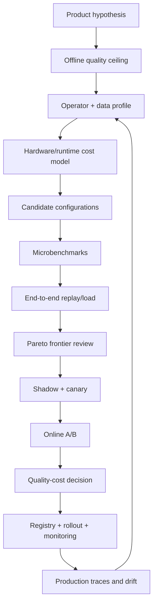

### 74.1 Review gates

**Quality gate**：overall/slice、calibration、long-term proxy。  
**Correctness gate**：feature/index/model compatibility、numeric parity。  
**Performance gate**：representative p99、throughput、memory、power。  
**Reliability gate**：overload、host loss、fallback、rollback。  
**Product gate**：A/B primary + guardrails。  
**Operations gate**：dashboard、on-call、capacity、owner。

## 75. 贯穿式项目：Video Ranking Efficiency Lab

这个项目是你可以在面试中提出的 concrete implementation surface，不应声称已在 Meta 完成。

### 75.1 目标

建立一个可重放的 benchmark/experiment platform，使 modeling 与 infra 团队能回答：

> 在固定 quality / p99 / cost budget 下，sequence length、embedding layout、candidate K、precision、sharding 与 routing 的最佳组合是什么？

### 75.2 Architecture

```text
Production sampled traces (privacy-safe)
  -> workload distribution snapshot
  -> deterministic replay generator
  -> data correctness validator
  -> model config generator
  -> TorchRec/sharding planner
  -> training benchmark runner
  -> inference load runner
  -> profiler trace collector
  -> offline quality evaluator
  -> Pareto frontier dashboard
  -> candidate release manifest
```

### 75.3 Core APIs

```python
run = submit_experiment(
    workload_snapshot="video-rank-traffic-2026-07-19",
    dataset_manifest="video-rank-train-v3",
    model_config={
        "sequence_length": 128,
        "embedding_dims": {"viewer": 128, "video": 192},
        "candidate_count": 800,
        "precision": "mixed-int8-bf16",
    },
    runtime_config={
        "sharding_plan": "planner-auto-v12",
        "batch_policy": "deadline-aware-v4",
        "hardware_profile": "gpu-family-x-v8",
    },
    gates={
        "max_quality_regression": 0.0,
        "max_p99_ms": 120.0,
        "max_cost_per_million": 42.0,
    },
)
```

这是 API contract 示例，不是现有 Meta API。

### 75.4 Implementation milestones

**M1 — Reproducible baseline**  
固定 data/model/workload/hardware manifest；建立 end-to-end trace。

**M2 — Bottleneck attribution**  
自动分解 data wait、sparse、collective、dense、queue；输出 top hypotheses，不自动宣称 root cause。

**M3 — Configuration sweep**  
运行 sequence、K、precision、sharding sensitivity experiments；生成 Pareto frontier。

**M4 — Shadow fidelity**  
对 production sampled traffic shadow score，比较 output、latency、batch fill、fallback。

**M5 — Safe release**  
生成 compatible model/index/feature/runtime manifest，canary + rollback。

### 75.5 Success metrics

- time-to-first-trustworthy-benchmark；
- experiment reproducibility rate；
- performance regression detection rate；
- quality-adjusted cost improvement；
- time from model prototype to safe experiment；
- false-positive profiler recommendations；
- platform adoption 与 migration cost。

## 76. Co-design 连续追问

### Q：谁拥有最终 decision？

**答：**不是 infra 用成本否决、也不是 research 用 quality 单方面决定。先明确 informed captain / product owner；modeling 提供 quality evidence，infra/hardware 提供 capacity/SLO evidence，product 定义 primary/guardrails。可逆决策用实验，长期架构决策记录 assumptions 和 revisit trigger。

### Q：如何避免 benchmark 被“优化作弊”？

**答：**固定 representative workload distribution、quality target、warmup/measurement、hardware/power、end-to-end boundaries；不能只删难样本、只测 favorable shapes 或忽略 queue/feature。独立 validation slice 和 production shadow 是 gate。

### Q：什么时候应该接受更高成本？

**答：**当 incremental long-term user/product value 可靠、guardrails 正向、capacity 可持续、机会成本明确时。比较的是 marginal value per resource，而不是追求 cost 永远下降。对高价值/hard traffic 可用 adaptive compute，而非全量扩容。

### Q：co-design 最常见的失败？

**答：**介入太晚；只看 averages；没有共同 workload/measurement contract；microbenchmark 代替 end-to-end；model/index/data version 脱节；硬件特化导致迭代速度和 portability 下降；没有 fallback/rollback。

---

## 77. 三条主线如何在一个面试答案里汇合

如果 Patrick 问“讲一个你会如何优化 video ranking 的例子”，使用这个 7 步结构：

1. **Product objective**：例如提高 fresh relevant video satisfaction，不只 watch time。
2. **Data truth**：验证 event/label/point-in-time/freshness，避免先优化错误目标。
3. **Model hypothesis**：更长 recent sequence + richer fresh-video features。
4. **System profile**：sequence activation、embedding a2a、item index freshness、inference p99。
5. **Co-design**：adaptive sequence、per-table dimension、INT8 embedding、hierarchical sharding、deadline routing。
6. **Experiment**：offline quality/slices → profile/load → shadow → A/B。
7. **Production**：version manifest、fallback、predictive health、cost/freshness dashboard。

90 秒示范答案：

> 我会先确认瓶颈是模型无法表达 fresh interest，还是数据/index 不够新。第一步把 publish-to-retrievable、interaction-to-feature、feature-to-training 的 watermark 打通，并用 point-in-time dataset 验证 offline gain不是 leakage。模型上比较更长 recent sequence 和 fresh content features，但同时 profile jagged sequence activation、embedding all-to-all 和 inference p99。若 quality 主要集中在高不确定请求，我不会全量增加 compute，而会联合尝试 sequence bucketing、adaptive routing、row-wise INT8 embedding、hot-row cache 和 topology-aware sharding。所有配置在同一 workload snapshot 上形成 quality–latency–cost Pareto frontier；然后 shadow/canary/A-B，并把 feature/model/index/runtime version 原子绑定。这样 training data、GPU optimization 和 co-design 是一个闭环，而不是三个独立项目。

## 78. 三条技术主线的即时消化版

### 78.1 Training data pipeline 的本质

Training pipeline 不是“把日志做成 Parquet”，而是重建模型在 prediction time 真正知道什么、之后发生了什么，以及样本为何进入训练集：

```text
append-only event truth
 -> canonical identity + dedup
 -> event-time window + late-event correction
 -> point-in-time features
 -> mature labels
 -> sampling + correction weight
 -> immutable dataset manifest
 -> tensor delivery without GPU starvation
```

最重要的错误是 leakage、label 未成熟、sampling 改变 prior、stream/batch 不一致和 silent default。Job 成功只表示计算完成，不表示语义正确。

### 78.2 RecSys GPU workload 的本质

RecSys 不是纯 dense Transformer：

- embedding table 容量巨大，lookup 通常 memory-bound；
- user history 是 jagged sequence；
- sharded embedding 需要 ID redistribution 和 result return 两次 all-to-all；
- dense tower 用 data parallel 和 all-reduce；
- slowest rank 决定 step time；
- input pipeline、network、HBM、kernel launch 和 queue 都可能是瓶颈。

诊断顺序只有一句：

> 固定 workload 和版本，先看 end-to-end timeline，找到 exposed critical path，再做能证伪 hypothesis 的最小实验。

### 78.3 Co-design 的本质

Co-design 不是硬件团队帮模型“提速”，而是在模型冻结前共同决定：

```text
sequence length
embedding rows/dimensions
candidate count
precision
operator/layout
sharding/topology
batching/routing
fallback
```

所有配置必须在相同 workload 上比较 quality、p99、cost、freshness 和 reliability，保留 Pareto frontier，而不是争论单一指标。

## 79. 20 个高价值问题与现成答案

### 1. Watermark 提前 10 分钟有什么后果？

Freshness 更好、state retention 更小，但更多 late events 会落到 correction/reconciliation，label 和 aggregate completeness 下降。要看 lateness distribution，而不是武断选择。

### 2. 为什么 dataset job 成功不代表数据正确？

它可能成功生成了未来 feature、错误 attribution、未成熟 negative、错误 sampling mix 或大量 defaults。必须监控 semantic statistics、point-in-time invariant、label rate、slice coverage 和 online/offline parity。

### 3. Negative downsample 1% 后为什么 probability 不再天然 calibrated？

训练集的 class prior 被改变；模型学习的是 sampled distribution。需要 inverse sampling weight、logit prior correction 或单独 calibration。

### 4. Streaming 与 batch parity 比较什么？

同一 event slice、同一 feature definition 下比较 value、timestamp、null/default、distribution、cardinality、top keys 和 slice，而不只是 schema。

### 5. `20B × 128-d FP16` embedding 多大？

$$20\times10^9\times128\times2=5.12\ TB$$

Adam 若另有 FP32 master weight、first/second moments，整体可达到权重数倍，必须 sharding/tiering/optimizer-state design。

### 6. Row-wise sharding 为什么需要 all-to-all？

每个 rank 拿到 local batch，但所需 rows 分散在 owner ranks。先把 IDs 发给 owners，lookup/pool 后再把 embeddings 返回原 batch rank。

### 7. Table-wise 内存平衡为什么仍可能 straggler？

Table bytes 不代表 access cost。小但超高频、pooling factor 大或 hot-key 集中的 table 会让某 rank lookup/read/communication 更重。

### 8. 如何区分 input-bound 与 communication-bound？

用预生成的 in-memory batch 消除 storage/transform；若 GPU idle 消失则 input-bound。再做 single-rank/no-collective 对照；若 step 明显改善且 timeline 的 collective 暴露，则 communication-bound。

### 9. HBM bandwidth 满时为什么加 FLOPs 没用？

Roofline 下性能受 $I\cdot BW$ 限制。Embedding arithmetic intensity 低，瓶颈是搬 bytes；应 quantize、cache、改善 locality/fusion，而不是增加算力。

### 10. Dynamic batching 为什么伤 p99？

请求为了等 batch 增加 queue time；shape 差异还可能让短请求被长 sequence 拖累。优化目标是 deadline 内 throughput，而不是最大 batch。

### 11. 热点 kernel 占 8%，快 4x，最大总加速多少？

$$Speedup=\frac{1}{0.92+0.08/4}\approx1.064$$

理论上约 6.4%，还没计 queue、feature 和 integration overhead。

### 12. Sequence length 翻倍意味着什么？

可能提高兴趣表达，但标准 attention compute/memory 近似二次增长；jagged tail、activation、batch capacity 和 inference p99 都恶化。可用 selection/compression、bucket、adaptive length、specialized operator 或 routing。

### 13. 如何防止 model v2 查询 item index v1？

Release manifest 原子绑定 user tower、item tower、embedding schema 和 index version；loader 验证 compatibility hash；dual-version shadow 后 atomic alias swap；不允许独立“latest”。

### 14. 为什么 co-design 要固定 workload distribution？

Batch、sequence、feature cardinality、candidate K 和 arrival pattern 决定 bottleneck。只测 favorable shape 会让 benchmark 无法代表 production ROI。

### 15. 什么叫 Pareto dominated？

如果配置 B 的 quality 不高于 A，同时 latency 与 cost 都不低于 A，而且至少一项严格更差，B 被 A dominate，无需上线考虑。

### 16. Offline +1% 但线上负向，先查什么？

先验证 experiment 和版本，再查 training-serving skew、candidate distribution、calibration、slice、p99/fallback、freshness、slate/diversity 和长期目标。AUC/NE 改善不保证 top-of-list product value。

### 17. Hard safety 如何不被 engagement 抵消？

Safety/eligibility 在 scoring 前后作为 deterministic hard gate；不能只设一个负权重，因为足够高的 engagement score可能抵消它。

### 18. Model release manifest 包含什么？

至少包含 dataset/feature definition、label/sampling policy、model weights/config、embedding/index、runtime/hardware profile、calibration、fallback 和 rollout policy version。

### 19. Overload 时如何保护体验？

Admission control + deadline-aware routing；依次减少 batch wait、candidate K、sequence/model complexity，使用 cached/precomputed fallback。无限 queue 会让所有请求 miss deadline。

### 20. 如何把三条主线汇成一个答案？

> 我先确认 quality 问题是否来自 data/index freshness，用 point-in-time dataset 排除 leakage；再把模型改动放到真实 workload profile 中，看 jagged sequence、embedding all-to-all、dense compute 和 serving p99；随后联合调整 sequence、embedding、candidate K、precision、sharding 和 routing，在统一 quality–latency–cost frontier 上选择方案；最后通过 compatible manifest、shadow、canary、A/B、fallback 和 predictive-health monitoring 上线。

---

# Part XVII — Project 1：50B-scale Multimodal Video Discovery & Ranking Platform

> 这是一个完整的 production reference project，不代表 Meta 内部实现。`50B assets`、embedding dimension、SLO、GPU 数量和产品指标都是用于架构推导的 scenario assumptions。它专注 content discovery；后续 Part XVIII 会加入更广泛的 personalized video recommendation、training、inference 和 elastic ranking projects。

---

## 80. Project scope 与 assumptions

| 范围 | 设计设定 |
|---|---|
| Corpus | 50B logical multimodal assets |
| Modalities | image、video、audio、3D、document |
| Data | Kafka/Flink ingestion、object storage、versioned artifacts |
| Retrieval | vector ANN + lexical + metadata + similar-item |
| Ranking | candidate fusion → light rank → multimodal rerank |
| Runtime | distributed CPU/GPU workers、autoscaling、deadline fallback |
| Lifecycle | incremental update + full re-embedding/reindex + atomic cutover |
| Optimization target | relevance、freshness、latency、transfer、compute cost |

### 80.1 一句话项目定义

> 这不是一个 vector database，而是一套把 50B multimodal assets 从 ingestion、versioned artifact generation、embedding、hybrid retrieval、multi-stage ranking 带到 online serving、feedback、A/B 和 operations 的完整 discovery platform；video 是最昂贵也最能体现 system–model co-design 的 modality。

### 80.2 它覆盖的能力

```text
creative asset discovery              video recommendation
------------------------              --------------------
query/context                          viewer/session context
asset candidate retrieval             video candidate retrieval
vector + lexical sources              ANN + graph + recent + trending sources
multimodal asset features              content + creator + viewer features
multi-stage ranking                    early/late/final ranking funnel
click/select/use feedback              view/watch/share/hide feedback
embedding/index freshness              user/item/index freshness
GPU embedding/reranking                GPU RecSys training/inference
```

它覆盖 content understanding 与 discovery，但不完整覆盖 personalized sequence、implicit feedback、position bias、slate objective 与 long-term user satisfaction。后续项目专门补齐这些领域。

---

## 81. Business problem 与 constraints

### 81.1 Problem

Creative applications 中的资产分散在不同 storage、metadata schema 和 modality pipeline：

- keyword search 无法理解视觉/音频/视频语义；
- video/3D 等 heavy payload 在 cloud/edge 间移动昂贵；
- 每个产品独立生成 embedding/index，版本与 freshness 不一致；
- 新 model 需要对巨量资产 re-embed/reindex；
- permission、tenant、product policy 不能在 retrieval 后才补；
- online quality improvement 必须兼顾 latency、cost、rollback 与 on-call。

### 81.2 Functional requirements

- ingestion 支持 image/video/audio/3D/document create/update/delete；
- modality-specific artifact extraction；
- lexical、metadata、vector、similar-item retrieval；
- permission-aware filtering；
- multi-stage ranking 和 diversity；
- incremental freshness + full backfill/reindex；
- exposure/click/select/use feedback；
- model/index version rollout 与 A/B。

### 81.3 Non-functional requirements

以下 SLO 是 reference design，面试中先问真实 constraint：

- retrieval/ranking p99 在交互预算内；
- 新/更新资产在 freshness budget 内可被检索；
- asset/model/index version 不兼容时 fail closed 或退回 last-known-good；
- data plane 故障不扩大成全站不可用；
- replay/backfill 幂等；
- cross-tenant permission 绝不因 cache/index fallback 绕过。

---

## 82. Scale math：先证明为什么 naive design 不成立

### 82.1 Embedding storage

Scenario assumption：每个 asset 一个 `768-d FP16` embedding：

$$
50\times 10^9 \cdot 768 \cdot 2\ bytes
= 76.8\ TB
$$

这还不包括：

- 多 modality / 多 model versions；
- ANN graph/quantizer/index metadata；
- replication；
- doc ID / filter metadata；
- rebuild 时 old/new 双版本。

若保留两个 active embedding versions，裸向量即约 `153.6 TB`。因此需要 sharding、quantization、tiering、version retention 与 incremental update。

### 82.2 Full re-embedding time

若一个 GPU worker 平均处理 $r=500$ assets/s，使用 $G=1000$ workers：

$$
T=\frac{50\times10^9}{500\times1000}
=100,000\ seconds\approx27.8\ hours
$$

这仍未计 read/decode、straggler、retry、index build 和 capacity contention。结论：

- 不能把 reindex 当一次无状态脚本；
- 需要 shard manifest、checkpoint、rate limit、priority、incremental catch-up；
- model upgrade 要考虑 old/new index coexistence。

### 82.3 Video transfer

假设原视频平均 100 MB，先生成 5 MB proxy/keyframes/audio/caption bundle：

$$
Reduction=\frac{100}{5}=20\times
$$

这解释了真实 `10–20x` heavy-media transfer reduction 的 system mechanism：优先移动 derived artifacts 与 references，只有需要 full-fidelity processing 时才拉 raw payload。

---

## 83. End-to-end architecture

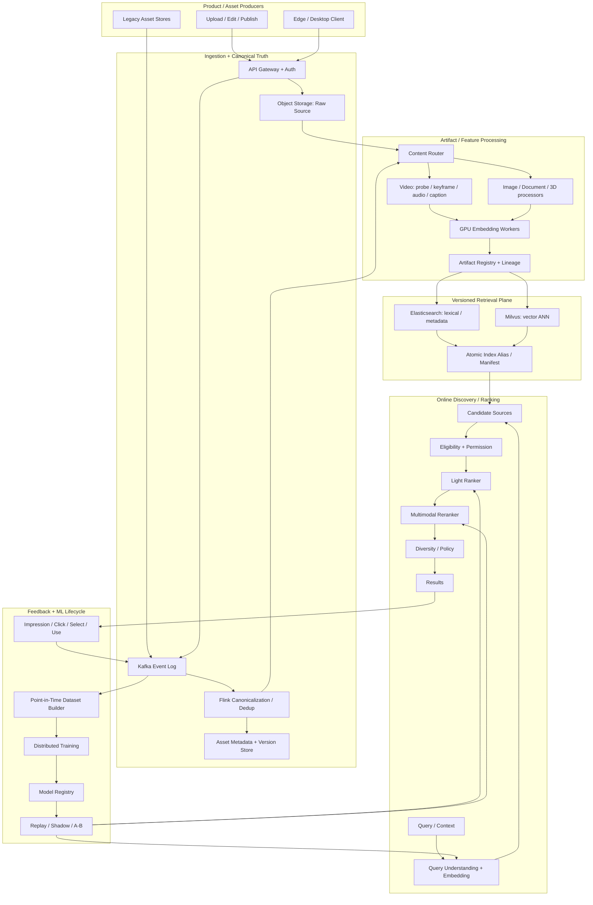

### 83.1 Control plane 与 data plane

**Control plane**：model/index version、job intent、policy、quota、rollout、lineage。  
**Data plane**：raw media、derived artifacts、embedding batches、online candidates。  

Raw payload 不经过 central control service；control plane 只签发 artifact reference、access capability 和 execution plan。

---

## 84. Canonical data model

### 84.1 Asset

```text
Asset
  asset_id
  tenant_id
  modality
  current_version_id
  lifecycle_state
  permission_policy_id
  created_at / updated_at
```

### 84.2 AssetVersion

```text
AssetVersion
  asset_id + version_id
  content_hash
  source_uri
  mime_type
  byte_size
  producer_version
  event_time
```

### 84.3 DerivedArtifact

```text
DerivedArtifact
  artifact_id
  asset_id + asset_version_id
  artifact_type       # keyframes / transcript / embedding / proxy
  producer_model_version
  transform_config_hash
  content_hash
  storage_uri
  status
  lineage
```

Artifact cache key：

$$
key=H(asset\_content\_hash, producer\_version, transform\_config)
$$

只用 `asset_id` 会在内容更新或 model upgrade 后返回 stale artifact。

### 84.4 InteractionEvent

```text
InteractionEvent
  event_id
  request_id
  actor/context hash
  asset_id + asset_version_id
  event_type           # impression/click/select/use/dismiss
  position
  event_time / ingest_time
  query_hash / context
  retrieval_sources
  model/index/feature versions
  propensity / experiment
```

---

## 85. Video processing pipeline

### 85.1 Processing DAG

```text
probe container/codec
 -> validate + malware/policy scan
 -> scene-change/keyframe extraction
 -> audio demux
 -> ASR transcript
 -> OCR / visual tags / moderation features
 -> image/video/audio embeddings
 -> proxy/thumbnail generation
 -> artifact validation
 -> registry commit
 -> incremental index update
```

### 85.2 为什么是 DAG 而非一个巨大 worker

- 不同 stage 的 CPU/GPU/memory/IO profile 不同；
- artifact 可复用和独立重算；
- ASR failure 不应迫使重做 keyframes；
- model version 可按 artifact type 独立迁移；
- backpressure 与 priority 更精细；
- failure/debug/lineage 更清晰。

### 85.3 Idempotent stage implementation

```python
from __future__ import annotations

from dataclasses import dataclass
from hashlib import sha256
from typing import Protocol


@dataclass(frozen=True)
class ArtifactKey:
    asset_hash: str
    producer_version: str
    transform_hash: str

    @property
    def artifact_id(self) -> str:
        raw = f"{self.asset_hash}:{self.producer_version}:{self.transform_hash}"
        return sha256(raw.encode("utf-8")).hexdigest()


class ArtifactStore(Protocol):
    def exists(self, artifact_id: str) -> bool: ...
    def write_if_absent(self, artifact_id: str, payload: bytes) -> bool: ...


def run_idempotent_stage(
    key: ArtifactKey,
    source: bytes,
    transform,
    store: ArtifactStore,
) -> str:
    artifact_id = key.artifact_id
    if store.exists(artifact_id):
        return artifact_id
    output = transform(source)
    # Conditional publish handles two workers racing on the same deterministic key.
    store.write_if_absent(artifact_id, output)
    return artifact_id
```

Production 还需 checksum、temporary upload、validation、quarantine、lease、retry class 和 lineage event。

---

## 86. Retrieval design：vector + lexical + metadata

### 86.1 Candidate sources

```text
lexical source:      title/caption/transcript/OCR exactness
metadata source:     type/product/time/owner/tags/filter
vector source:       semantic query-to-asset similarity
similar-item source: asset-to-asset embedding
behavior source:     aggregate usage/co-selection
fresh source:        recently created/updated content
```

### 86.2 Reciprocal Rank Fusion

不同 source score 不天然同尺度。RRF：

$$
RRF(d)=\sum_{s\in Sources}\frac{w_s}{k+rank_s(d)}
$$

它对 score calibration 要求低，适合作为 robust baseline；学习式 ranker 可进一步利用 source score/rank/features。

### 86.3 Fusion implementation

```python
from collections import defaultdict
from dataclasses import dataclass


@dataclass(frozen=True)
class RetrievedItem:
    asset_id: str
    score: float


def reciprocal_rank_fusion(
    source_results: dict[str, list[RetrievedItem]],
    source_weights: dict[str, float],
    k: int = 60,
) -> list[RetrievedItem]:
    fused: dict[str, float] = defaultdict(float)
    for source, items in source_results.items():
        weight = source_weights.get(source, 1.0)
        for rank, item in enumerate(items, start=1):
            fused[item.asset_id] += weight / (k + rank)
    return [
        RetrievedItem(asset_id=asset_id, score=score)
        for asset_id, score in sorted(fused.items(), key=lambda x: (-x[1], x[0]))
    ]
```

### 86.4 Permission placement

Permission 不应只在最终 top-20 检查：

- retrieval/index 使用 coarse tenant/policy partition 或 filter pushdown；
- merge 后执行 authoritative batch eligibility；
- final response 再验证 capability/version；
- cache key 包含 permission context/version；
- permission service failure 对新访问 fail closed。

---

## 87. Model design：retrieval + ranking

### 87.1 Stage 1 — Two-Tower retrieval

Query/context tower：text、product context、locale、session/usage signals。  
Asset tower：caption/transcript/OCR、visual/audio embedding、metadata、creator/owner context。

$$
q=f_\theta(x_q),\quad a=g_\phi(x_a),\quad s(q,a)=q^Ta/\tau
$$

Asset embeddings 离线/增量生成，可 ANN；query embedding 在线生成。

### 87.2 Stage 2 — Lightweight ranker

处理数百至数千 candidates：

- retrieval source/rank/score；
- lexical exactness；
- semantic similarity；
- freshness；
- historical use/popularity；
- modality/product compatibility；
- inexpensive query-asset crosses。

### 87.3 Stage 3 — Multimodal reranker

只处理 top dozens/hundreds：

- richer cross-encoder / late interaction；
- keyframe/query cross attention；
- transcript/audio semantic match；
- user/project context；
- multi-task outcome heads。

### 87.4 Multi-task objectives

真实 discovery 可预测 click、select、use/export、dismiss；迁移到 video recommendation 则是 view/watch/share/hide 等。

$$
\mathcal L =
\lambda_1\mathcal L_{click}
+\lambda_2\mathcal L_{select}
+\lambda_3\mathcal L_{use}
+\lambda_4\mathcal L_{ranking}
$$

### 87.5 Production-shaped model implementation

```python
from __future__ import annotations

import torch
from torch import nn
import torch.nn.functional as F


class RetrievalTower(nn.Module):
    def __init__(self, dense_dim: int, vocab_size: int, embedding_dim: int = 128):
        super().__init__()
        self.ids = nn.EmbeddingBag(vocab_size, embedding_dim, mode="mean")
        self.project = nn.Sequential(
            nn.Linear(dense_dim + embedding_dim, 256),
            nn.SiLU(),
            nn.Linear(256, embedding_dim),
        )

    def forward(self, dense, sparse_values, sparse_offsets):
        sparse = self.ids(sparse_values, sparse_offsets)
        return F.normalize(self.project(torch.cat([dense, sparse], dim=-1)), dim=-1)


class MultitaskRanker(nn.Module):
    def __init__(self, input_dim: int, hidden: int = 256):
        super().__init__()
        self.shared = nn.Sequential(
            nn.Linear(input_dim, hidden),
            nn.LayerNorm(hidden),
            nn.SiLU(),
            nn.Linear(hidden, hidden),
            nn.SiLU(),
        )
        self.click = nn.Linear(hidden, 1)
        self.select = nn.Linear(hidden, 1)
        self.use = nn.Linear(hidden, 1)

    def forward(self, features):
        h = self.shared(features)
        return {
            "click": self.click(h).squeeze(-1),
            "select": self.select(h).squeeze(-1),
            "use": self.use(h).squeeze(-1),
        }


def multitask_loss(logits, labels, weights=None):
    task_weights = weights or {"click": 1.0, "select": 2.0, "use": 3.0}
    losses = {
        task: F.binary_cross_entropy_with_logits(logits[task], labels[task])
        for task in logits
    }
    total = sum(task_weights[task] * loss for task, loss in losses.items())
    return total, losses
```

Production 需要 TorchRec-style distributed embeddings、jagged tensors、sampling correction、calibration 和 feature versioning；这段展示 model boundary。

---

## 88. Training data pipeline

### 88.1 Example generation

```text
impression event at t
 -> attach query/context and candidate source
 -> as-of join asset/user/project features <= t
 -> wait label maturity window
 -> join click/select/use/dismiss outcomes
 -> negative/hard-negative sampling
 -> attach sample weight / propensity
 -> group-aware time split
 -> immutable manifest
```

### 88.2 避免 leakage

- 不能使用 asset 在 impression 后累计的 popularity；
- 不能使用之后生成的新 embedding version；
- query reformulation 只能使用当时可见的 session；
- 同一 asset near-duplicate 不应随机分散到 train/test 造成内容泄漏；
- label window 未成熟的样本要 mask。

### 88.3 Hard negatives

- lexical 命中但 vector 不相关；
- vector 相似但未选择；
- previous model 高分但 dismissed；
- same-topic/near-duplicate confusing assets；
- permission-ineligible item 不应作为 relevance negative 混入。

### 88.4 Dataset manifest

```yaml
dataset_id: multimodal-discovery-train-v42
event_range: [start, end]
label_maturity_cutoff: timestamp
feature_definition_hash: sha256:...
asset_snapshot: asset-metadata-v87
embedding_versions:
  query: query-tower-v18
  asset: asset-tower-v18
sampling:
  exposed_negative_keep_rate: 0.05
  hard_negative_miner: ranker-v41
privacy_policy: policy-v9
shards:
  - uri: blob://.../part-00000
    rows: 12000000
    checksum: sha256:...
```

---

## 89. Distributed training 与 GPU path

### 89.1 Workload decomposition

```text
remote dataset read / decode
 -> dense + sparse/jagged batch
 -> sharded categorical embeddings
 -> multimodal dense embeddings
 -> feature interaction / shared tower
 -> task heads
 -> backward
 -> sparse optimizer + dense all-reduce
```

### 89.2 Sharding

- 大 asset/user/category tables：row-wise 或 hierarchical sharding；
- 小 hot tables：replicate 或 table-wise placement；
- dense tower：DDP/FSDP 取决于大小；
- multimodal precomputed embeddings：只在需要 fine-tune 时进入 GPU graph，否则作为 versioned features。

### 89.3 GPU starvation diagnosis

1. 用 in-memory batch 对照 remote loader；
2. timeline 分解 data wait、H2D、embedding、all-to-all、dense、all-reduce；
3. 按 rank 看 straggler；
4. 检查 sequence/pooling factor 与 hot table skew；
5. 只优化 exposed critical path。

### 89.4 Performance actions

- column pruning、prefetch、pinned memory；
- video artifact precompute，避免训练时重复 full decode；
- BF16 dense compute；
- embedding row-wise INT8/FP16；
- table-batched embedding / fused optimizer；
- topology-aware sharding；
- all-to-all quantization/overlap；
- sequence bucketing；
- asynchronous checkpoint + manifest commit。

---

## 90. Index build 与 zero-downtime model upgrade

### 90.1 Full + incremental 双路径

```text
full path:
  snapshot -> shard embedding jobs -> build shard indexes
  -> validate recall/checksum/count -> publish candidate manifest

incremental path:
  post-snapshot events -> new embedding -> delta index
  -> catch up until watermark >= cutover target

cutover:
  query v2 shadow -> compare -> atomic alias v1 -> v2
```

### 90.2 Version compatibility

```text
query tower v18
asset tower v18
embedding schema v6
ANN index v18-build-42
ranker v31
feature set v87
```

它们组成 release manifest，不能各自读取 `latest`。

### 90.3 Validation

- expected shard count / row count / checksum；
- embedding finite/norm/distribution；
- ANN Recall@K 与 exact subset 对照；
- deleted/permission-changed assets；
- incremental delta completeness；
- v1/v2 result overlap 和 winner migration；
- latency/memory/cost；
- rollback 可用。

---

## 91. Online serving

### 91.1 Request path

```text
request
 -> auth / tenant / experiment
 -> query parsing + query embedding
 -> parallel candidate sources with deadlines
 -> merge/dedup/RRF
 -> authoritative eligibility batch check
 -> light rank top 500
 -> GPU multimodal rerank top 50–100
 -> diversity/policy
 -> response + sampled decision trace
```

### 91.2 Deadline budget（示例，不是实际项目 SLO）

```text
gateway/auth             5 ms
query understanding     10 ms
candidate sources       30 ms parallel
eligibility              8 ms
light rank              10 ms
heavy rerank            25 ms
postprocess/network      12 ms
headroom                20 ms
```

不能把各 stage p99 直接相加当 end-to-end p99；需要 trace production correlation。

### 91.3 Async serving reference implementation

```python
from __future__ import annotations

import asyncio
from dataclasses import dataclass
from time import monotonic


@dataclass(frozen=True)
class Candidate:
    asset_id: str
    score: float


class RankingService:
    def __init__(self, lexical, vector, eligibility, light_ranker, heavy_ranker):
        self.lexical = lexical
        self.vector = vector
        self.eligibility = eligibility
        self.light_ranker = light_ranker
        self.heavy_ranker = heavy_ranker

    async def rank(self, request, deadline_ms: int = 120) -> list[Candidate]:
        started = monotonic()
        lexical_task = asyncio.create_task(self.lexical.retrieve(request))
        vector_task = asyncio.create_task(self.vector.retrieve(request))

        remaining_s = max(0.001, deadline_ms / 1000 - (monotonic() - started))
        done, pending = await asyncio.wait(
            {lexical_task, vector_task},
            timeout=min(0.035, remaining_s),
        )
        for task in pending:
            task.cancel()

        source_lists = [task.result() for task in done if not task.cancelled()]
        candidates = self._dedup(source_lists)
        candidates = await self.eligibility.filter(request, candidates)
        candidates = self.light_ranker.rank(request, candidates)[:500]

        elapsed_ms = (monotonic() - started) * 1000
        if elapsed_ms < deadline_ms - 30:
            return self.heavy_ranker.rank(request, candidates[:100])
        return candidates[:50]  # deterministic deadline fallback

    @staticmethod
    def _dedup(source_lists: list[list[Candidate]]) -> list[Candidate]:
        best: dict[str, Candidate] = {}
        for items in source_lists:
            for item in items:
                current = best.get(item.asset_id)
                if current is None or item.score > current.score:
                    best[item.asset_id] = item
        return sorted(best.values(), key=lambda x: (-x.score, x.asset_id))
```

Production 版本要使用 calibrated fusion、request cancellation propagation、batch GPU inference、rate limiting、trace、fallback reason 和 privacy-safe logging。

---

## 92. ML infrastructure co-design decisions

### 92.1 Video raw data vs derived artifacts

**Model desire**：更多 frames、更高分辨率、更完整 audio。  
**System cost**：decode、network、storage、GPU memory、latency。  
**Co-design**：scene-aware keyframes、proxy、precomputed video embedding；只对 uncertain top candidates 做更重 cross-modal inference。

### 92.2 Embedding dimension

对 `128/256/512/768` 做 quality–memory–ANN latency frontier。不是所有 modality 同 dimension；video/audio 可独立 projection 到 shared space。

### 92.3 Candidate allocation

Vector recall 增加 K 会线性推高 ranking compute。比较：

```text
K -> Recall@K -> final winner recall -> CTR/use -> p99/cost
```

只保留对最终 winner 有 marginal value 的 candidate budget。

### 92.4 Adaptive heavy rerank

使用 uncertainty、query complexity、candidate ambiguity 与 remaining deadline：

- easy query：light rank 足够；
- hard/high-value query：GPU multimodal rerank；
- overload：降低 top-N、使用 smaller model；
- hard permission/safety 永不降级绕过。

---

## 93. Evaluation 与 rollout

### 93.1 Offline

Retrieval：Recall@K、MRR、source coverage、ANN recall、fresh-item recall。  
Ranking：NDCG、pairwise accuracy、task NE/AUC、calibration。  
Slices：video/image/audio、new asset、long-tail、language、tenant/product、permission。  
System：p50/p95/p99、QPS、GPU cost、index freshness、fallback。

### 93.2 Replay

Replay 可以验证 deterministic feature/index/model path、latency 和 output changes；它不能知道新 policy 未展示 candidate 的真实 counterfactual outcome。

### 93.3 Shadow

新 model/index 接 production sampled traffic，但不影响结果：

- output overlap / score correlation；
- version compatibility；
- latency、memory、error；
- missing features；
- slice regressions。

### 93.4 A/B

- primary：discovery CTR / successful use（以实际项目 metric 为准）；
- guardrail：zero-result、latency、error、dismiss、permission/safety、cost；
- attribution：平台提供 candidate/model path，model/product improvement 是 team outcome；
- gradual ramp + long-enough window + rollback。

---

## 94. Observability

### 94.1 Metrics

| Layer | Metrics |
|---|---|
| Ingestion | event lag、dedup、schema error、asset freshness |
| Processing | queue age、stage duration、retry、artifact cache hit、GPU utilization |
| Index | build watermark、delta lag、row count、deleted leakage、Recall@K |
| Serving | QPS、p99、source timeout、candidate count、fallback、batch fill |
| Model | score distribution、embedding norm、calibration、slice stability |
| Product | CTR/select/use、zero result、diversity、fresh asset exposure |

### 94.2 Distributed trace

```text
request_id
 -> query embedding version/time
 -> each candidate source span
 -> eligibility span
 -> light/heavy rank versions
 -> candidate counts at every stage
 -> fallback/deadline reason
```

### 94.3 Predictive health

Service 返回 200 但 embedding 全零或 score collapse 仍是严重事故。监控：

- embedding norm/variance；
- score quantiles；
- source mix；
- model-vs-LKG correlation；
- null/default feature rate；
- top result churn。

---

## 95. Failure modes 与恢复

| Failure | Symptom | Root risk | Recovery |
|---|---|---|---|
| duplicate update event | 重复 artifact/index writes | 浪费/版本混乱 | stable ID + deterministic artifact key |
| video processor poison input | retry storm | queue blockage | bounded retry + quarantine + DLQ |
| embedding worker straggler | reindex 延迟 | shard incomplete | checkpoint + split/reassign shard |
| partial index build | missing candidates | quality regression | manifest不可见，继续 v1 |
| query tower/index mismatch | recall collapse | semantic incompatible | compatibility hash + reject load |
| permission service timeout | leak 或 zero result | security/availability | fail closed new access + cached signed snapshot if policy allows |
| vector source timeout | source coverage 下降 | relevance | lexical/fresh fallback + reason metric |
| GPU overload | p99/fallback 上升 | user experience | admission + reduce top-N + small model |
| bad model rollout | score collapse | product harm | canary gate + LKG atomic rollback |
| feedback Kafka lag | stale training | quality/freshness | priority consumer + backfill/reconcile |

### 95.1 Incident answer template

```text
detect -> bound blast radius -> stop ramp / use LKG
-> preserve evidence -> identify violated invariant
-> repair/replay -> verify quality + correctness
-> systemic prevention: contract/test/monitor/runbook
```

---

## 96. Testing strategy

### 96.1 Unit

- artifact key changes with content/model/config；
- duplicate event idempotency；
- as-of join rejects future feature；
- sampling weights；
- fusion deterministic tie-break；
- permission filter cannot be bypassed；
- fallback respects deadline。

### 96.2 Integration

- event → artifact → registry → index；
- delete/update propagation；
- v1/v2 dual index；
- replay same shard gives same logical output；
- model/index incompatible load fails；
- partial shard does not publish manifest。

### 96.3 Performance

- real modality/size distribution；
- hot/cold cache；
- long-tail video duration；
- source timeout/partial failure；
- GPU batch/shape mix；
- overload and failover；
- p99, not only mean。

### 96.4 Model

- offline overall + slices；
- calibration；
- ANN exact-subset recall；
- shadow parity；
- drift；
- A/B guardrails。

---

## 97. End-to-end release manifest

```yaml
release_id: multimodal-discovery-r42
dataset_manifest: multimodal-discovery-train-v42
features: discovery-features-v87
models:
  query_tower: query-tower-v18
  asset_tower: asset-tower-v18
  light_ranker: light-ranker-v31
  heavy_ranker: multimodal-reranker-v12
indexes:
  vector: asset-ann-v18-build-42
  lexical: asset-search-v63
runtime:
  gpu_profile: gpu-family-x-v8
  batch_policy: deadline-aware-v4
  precision: int8-embedding-bf16-dense
policies:
  eligibility: asset-policy-v22
  diversity: diversity-v7
fallback:
  release_id: multimodal-discovery-r41
validation:
  offline_report: blob://reports/r42/offline.json
  load_report: blob://reports/r42/load.json
  shadow_report: blob://reports/r42/shadow.json
```

这个 manifest 是 co-design 的落地边界：data、model、index、runtime 和 policy 不能独立漂移。

---

## 98. 五分钟 system-design answer

> 这个项目设计一个支持 50B multimodal assets 的 shared discovery and ranking platform，覆盖 image、video、audio、3D 和 document。问题不是简单加一个 vector search，而是不同产品各自维护 ingestion、metadata、embedding 和 index，导致 heavy-media transfer、freshness、version migration、permission 和 ranking iteration 都很昂贵。  
> 我们把系统分成 canonical asset/event truth、artifact processing、versioned indexing 和 online ranking 四层。Raw asset 进入 durable object storage；Kafka/Flink 统一增量 event、metadata 和 lineage；modality router 将 video 拆成 keyframes、proxy、audio、caption 等可复用 artifacts，再由 CPU/GPU workers 生成 versioned embeddings。Milvus 负责 vector ANN，Elasticsearch 负责 lexical/metadata retrieval；online 并行召回、dedup 和 permission filtering，先 light rank，再对少量候选执行 expensive multimodal rerank，最后做 diversity/policy。  
> Video 是关键优化点。系统不让所有 pipeline 无条件搬 full media，而是在 edge/client 或早期 stage 做 pruning，优先传递 proxy、keyframes、audio/caption 和 artifact references；在 100 MB raw video 与 5–10 MB derived bundle 的场景下，transfer 可降低约 10–20x。Embedding artifact 使用 content hash、producer model version 和 transform config 作为 identity，保证重算、缓存和 rollback 正确。  
> Model upgrade 不是直接替换文件，而是 snapshot 后分片 re-embedding/index build，同时消费增量事件追平 watermark；所有 shards、recall、checksum 和 deletion/permission checks 通过后才 atomic alias 切换。Online 记录 model、feature、index 和 source versions，支持 replay、shadow、canary 和 A/B。平台最终以 discovery CTR、successful use、freshness、p99 和 cost 的联合指标决定是否上线。  
> 这个项目完整覆盖 multimodal content、candidate funnel、embedding/index freshness、GPU training/inference 和 quality–latency–cost trade-off；personalized video recommendation 的 user sequence、implicit feedback、position bias 和 long-term satisfaction 由后续项目补齐。

---

## 99. 连续追问与回答

### Q1：这个项目中最难的 engineering boundary 是什么？

> 最难的是使 asset content、derived artifact、embedding、index、ranker 与 permission 在版本上兼容，同时支持巨量 backfill 和持续 incremental updates。没有 immutable artifact identity 与 atomic release manifest，freshness、cache、rollback 和 quality attribution都会失真。

### Q2：如何证明平台改动带来 ranking impact？

> Platform 不是凭空创造 CTR；它使新的 candidate sources、fresh embeddings、hybrid retrieval 和 ranker 可以安全进入 production。用 component ablation、source coverage、winner attribution、shadow/A-B 说明因果链，同时看 latency、fallback、freshness 与 cost，防止只优化表面 engagement。

### Q3：如何支持 50B reindex？

> Snapshot + deterministic shards + checkpoint + bounded retry；分离 embedding artifact 和 ANN build；旧/新双版本；增量 delta 追平 snapshot 后事件；manifest validation 后 atomic alias；capacity-aware throttle，避免影响 online serving。

### Q4：为什么不把 video 每次在线 decode 后 rerank？

> Decode/transfer 太慢且重复，p99/cost 不可接受。预生成 keyframes/proxy/audio/caption/embeddings；online 只对少量 uncertain/high-value candidates 做更重 cross-modal inference。

### Q5：Milvus 或 Elasticsearch 挂了怎么办？

> Candidate sources 独立 deadline/circuit breaker；剩余 source 继续；记录 coverage/fallback；若 permission/eligibility 无法验证则不能用 relevance source替代安全检查。恢复后 replay/repair index。

### Q6：Embedding v2 offline 更好，为什么可能 online 变差？

> ANN index mismatch、hard-negative distribution、score calibration、freshness、quantization、candidate source mix、p99 fallback 或 slice regression。按 data → index → model → serving → experiment 顺序排查。

### Q7：如何降低 GPU cost？

> 先 profile exposed bottleneck；视频 artifact precompute；embedding quantization/cache；top-N funnel allocation；light/heavy rank separation；dynamic batching；BF16/fusion；adaptive routing；用 quality-adjusted cost，不牺牲关键 slices 或 safety。

### Q8：这个项目最重要的 invariant？

> `asset content version + producer model/config -> immutable artifact`，并让 feature/model/index/runtime version 原子兼容。没有这个 invariant，freshness、cache、reindex、rollback 和 audit 都不可信。

### Q9：如果迁移到 Facebook Video Ranking，第一处 model 差异是什么？

> 从 query-centric retrieval 变成 viewer/session-centric sequential recommendation。增加 user history jagged sequence、watch/skip/share/hide multi-task labels、position/selection bias、exploration 和 slate/long-term objectives；底层 artifact/index/GPU/freshness patterns仍可迁移。

### Q10：最 Senior 的 trade-off 是什么？

> 不追求对所有 candidates/requests 使用最强模型，而是在 funnel 中分配有限 compute：precompute 可复用内容理解；扩大有价值的 retrieval recall；light rank 过滤；只把 expensive multimodal inference 用于高不确定/高价值候选；用 Pareto frontier 和 A/B 证明收益覆盖成本。

---

# Part XVIII — Broader End-to-End Video ML Foundations Projects

> 以下项目覆盖 search/discovery 之外的核心领域。它们是独立、完整、可实现的 production reference designs：  
> Project 2 解决 personalized video ranking 的 training data truth；  
> Project 3 解决 DLRM/sequential recommender 的 distributed GPU training；  
> Project 4 解决 low-latency GPU inference 与 elastic compute；  
> Project 5 解决 multi-stage funnel、freshness 与 index/model compatibility；  
> Project 6 解决 long-sequence / generative video recommendation。

---

# Project 2 — Point-in-Time Video Ranking Training Data Platform

## 100. Problem statement

设计一套为 billions-scale video recommendation 持续生成训练数据的平台。输入是 impression、watch、skip、like、share、comment、hide、report、survey、video metadata、creator graph 与 user/session state；输出是：

- point-in-time-correct training examples；
- mature multi-task labels；
- sampled candidates + correction weights；
- reproducible dataset manifests；
- high-throughput tensor shards；
- data quality、lineage、privacy 与 replay。

核心难点不是 ETL throughput，而是：

```text
what the model knew at ranking time
vs what happened after ranking
vs why this candidate was observed
```

## 101. Architecture

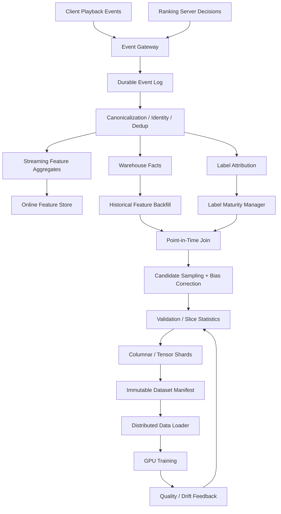

## 102. Event and decision contracts

Ranking server 必须记录不仅是 displayed video，还要记录 candidate generation context，否则无法分析 selection bias。

```json
{
  "request_id": "r-123",
  "viewer_id_hash": "u-456",
  "session_id_hash": "s-789",
  "request_time_ms": 0,
  "model_version": "late-ranker-v42",
  "feature_snapshot": "feature-v87",
  "index_versions": {"ann": "ann-v31", "social": "graph-v18"},
  "candidates": [
    {
      "video_id": "v-1",
      "sources": ["recent-interest", "ann"],
      "source_scores": [0.81, 0.77],
      "rank_score": 1.22,
      "position": 0,
      "propensity": 0.12,
      "eligible": true
    }
  ]
}
```

Playback event：

```json
{
  "event_id": "stable-event-id",
  "request_id": "r-123",
  "viewer_id_hash": "u-456",
  "video_id": "v-1",
  "event_type": "impression|play|pause|complete|share|hide|report",
  "watch_delta_ms": 0,
  "event_time_ms": 0,
  "ingest_time_ms": 0,
  "client_sequence": 0
}
```

`request_id + video_id` 建立 decision 与 outcome attribution；`event_id` 保证 replay dedup；`client_sequence` 帮助处理 offline mobile batching 和乱序。

## 103. Label state machine

一次 candidate 的 label 不应通过简单 `GROUP BY video_id` 生成：

```text
ELIGIBLE
 -> IMPRESSED
 -> PLAY_STARTED
 -> WATCH_ACCUMULATING
 -> COMPLETED / ABANDONED
 -> ENGAGED / NEGATIVE_FEEDBACK
 -> LABEL_MATURE
```

示例 label：

- `y_view_3s`：真实 impression 后累计观看 >= 3s；
- `y_completion`：watch / playable duration >= threshold；
- `y_share`：attribution window 内 share；
- `y_hide/report`：负向 outcome；
- `watch_seconds`：处理 autoplay、seek、replay、background；
- `y_return`：未来 session return，需要更长 maturity window。

### 103.1 Label maturity

不同 task 有不同窗口：

```text
skip/view: minutes
like/share: hours
hide/report: hours or days
retention: days or weeks
```

Dataset 可以使用 task mask：未成熟的 long-term task 不贡献 loss，而不是错误填 0。

## 104. Point-in-time feature reconstruction

Example at time $t$：

$$
x_{u,f}(t)=latest\ feature(u,f, effective\_time\le t)
$$

Feature groups：

- user long-term interests；
- recent session sequence；
- user–creator affinity；
- video content/quality/freshness；
- creator aggregates；
- network/device/context；
- candidate source metadata；
- experimental/exploration propensity。

禁止：用 impression 后更新的 watch/popularity aggregate；用未来 moderation result；用后来生成的 item embedding。

## 105. Sampling policy

训练集应包含：

- positives：watch/complete/share 等；
- exposed negatives：impressed but skipped/dismissed；
- hard negatives：high-scored but lost/no positive；
- unexposed retrieval negatives：只用于特定 retrieval objective；
- exploration traffic：支持更低偏的 evaluation。

若 negative 以 $q_i$ 采样，sample weight：

$$
w_i=clip(1/q_i, w_{max})
$$

Propensity correction 对 position/policy bias：

$$
\hat R_{IPS}=\frac{1}{N}\sum_i \frac{\pi(a_i|x_i)}{\mu(a_i|x_i)}r_i
$$

$\mu$ 是 logging policy，$\pi$ 是 target policy。要 clipping/self-normalization，防高方差。

## 106. Training example builder implementation

```python
from __future__ import annotations

from dataclasses import dataclass
from typing import Mapping


@dataclass(frozen=True)
class Decision:
    request_id: str
    viewer_id: str
    video_id: str
    prediction_time_ms: int
    position: int
    sampling_probability: float


@dataclass(frozen=True)
class Outcome:
    watch_ms: int
    shared: bool
    hidden: bool
    label_mature: bool


@dataclass(frozen=True)
class TrainingExample:
    features: Mapping[str, float]
    labels: Mapping[str, float]
    masks: Mapping[str, float]
    sample_weight: float


class HistoricalFeatureStore:
    def as_of(self, viewer_id: str, video_id: str, timestamp_ms: int) -> Mapping[str, float]:
        raise NotImplementedError


def build_example(
    decision: Decision,
    outcome: Outcome,
    feature_store: HistoricalFeatureStore,
    max_weight: float = 50.0,
) -> TrainingExample:
    features = feature_store.as_of(
        decision.viewer_id,
        decision.video_id,
        decision.prediction_time_ms,
    )
    probability = max(decision.sampling_probability, 1e-6)
    weight = min(1.0 / probability, max_weight)
    mature = 1.0 if outcome.label_mature else 0.0
    return TrainingExample(
        features={**features, "position": float(decision.position)},
        labels={
            "view_3s": float(outcome.watch_ms >= 3000),
            "watch_seconds": outcome.watch_ms / 1000.0,
            "share": float(outcome.shared),
            "hide": float(outcome.hidden),
        },
        masks={
            "view_3s": mature,
            "watch_seconds": mature,
            "share": mature,
            "hide": mature,
        },
        sample_weight=weight,
    )
```

Production builder 是 distributed temporal join，不是单机 class；代码展示 contract 和 correctness boundary。

## 107. Data delivery to GPUs

```text
manifest -> shard assignment -> remote read -> decrypt/decompress
-> feature extraction -> jagged collation -> pinned memory
-> async H2D -> prefetch queue -> GPU
```

优化：

- column pruning 与 predicate pushdown；
- data shards 与 trainer ranks 确定性映射；
- variable sequence bucketing；
- bounded prefetch/backpressure；
- precomputed expensive content features；
- cache popular data across experiments；
- checkpoint `epoch + shard + logical offset + RNG state`。

关键 metrics：time-to-first-batch、records/s、bytes/s、filter selectivity、queue depth、H2D、GPU data-wait、cache-hit bytes。

## 108. Failure and correctness matrix

| Failure | Silent risk | Detection | Recovery |
|---|---|---|---|
| client duplicate events | watch overcount | event ID duplicate rate | dedup + replay |
| late playback events | wrong window/label | lateness histogram | correction stream/backfill |
| feature future leakage | fake offline gain | temporal invariant test | rebuild dataset |
| immature labels | false negatives | maturity distribution | masks/delayed build |
| sampler change | calibration drift | source/weight stats | version policy/recalibrate |
| partial dataset | missing slice | manifest shard count | atomic manifest |
| stream/batch skew | online regression | golden slice parity | unify definition/replay |
| loader bottleneck | GPU starvation | per-stage queue/timeline | prefetch/cache/transform |

### 108.1 Interview answer

> 我把 training-data platform 分成 event truth、feature state、label attribution、example construction 和 tensor delivery。最重要的是 prediction-time semantics：所有 feature 用 as-of join，long-term labels 等 maturity window，negative sampling 记录 probability/weight，dataset 通过 immutable manifest 发布。Streaming 为 online freshness 服务，batch 用相同 feature definition 重建历史并做 reconciliation。最后对 loader 做 stage-level observability，确保更快 GPU 不被 remote read、decode、jagged collation 或 H2D 饿住。

---

# Project 3 — Distributed GPU Training Platform for Large Recommenders

## 109. Problem statement

训练包含 trillion-scale sparse parameters、dense towers 和 long jagged sequences 的 video recommender。系统要实现：

- embedding tables 超过单卡 HBM；
- hundreds/thousands GPUs；
- time-to-quality 优化；
- elastic failure recovery；
- reproducible sharding and checkpoints；
- experiment isolation 与 cost accounting。

## 110. Training architecture

```mermaid
flowchart LR
  DM["Dataset Manifest"] --> DL["Distributed Loader"]
  DL --> KJT["Dense + KeyedJaggedTensor"]
  KJT --> SP["Sparse Input Distributor"]
  SP --> EBC["Sharded EmbeddingBagCollection"]
  EBC --> A2A["All-to-All Embedding Results"]
  A2A --> SEQ["Sequence Encoder"]
  SEQ --> DENSE["Dense / MTML Towers"]
  DENSE --> LOSS["Multi-task Loss"]
  LOSS --> AR["Dense All-Reduce"]
  LOSS --> SO["Fused Sparse Optimizer"]
  AR --> CK["Async Distributed Checkpoint"]
  SO --> CK
  PROF["Profiler / Cost Model"] --> PLAN["Sharding Planner"]
  PLAN --> EBC
  CK --> REG["Training Run Registry"]
```

## 111. Capacity model

对 table $j$：

$$
M_j=rows_j\cdot dim_j\cdot bytes_{weight}\cdot optimizer\_multiplier
$$

Rank $r$ memory：

$$
M_r=\sum_{j\in placement(r)}M_{j,r}+M_{dense}+M_{activation}+M_{buffer}
$$

必须留 fragmentation、collective buffers、temporary tensors 和 checkpoint staging headroom。

Step time：

$$
T_{step}=T_{input}+T_{sparse}+T_{a2a}+T_{sequence}+T_{dense}+T_{allreduce}+T_{optimizer}-T_{overlap}
$$

Slowest rank 决定 synchronous step：

$$
T_{global}=\max_r T_r
$$

因此 planner 要优化最大 rank cost，而不是平均值。

## 112. Sharding planner

Planner inputs：

- rows/dim/dtype/optimizer；
- pooling factor、access frequency、hotness；
- table dependency/group；
- HBM/DRAM capacity；
- intra-host/inter-host topology；
- kernel support；
- batch/sequence distribution。

Candidate strategies：data-parallel、table-wise、row-wise、column-wise、table-row-wise。

### 112.1 Cost-aware planner implementation

```python
from __future__ import annotations

from dataclasses import dataclass, field


@dataclass(frozen=True)
class Table:
    name: str
    rows: int
    dim: int
    bytes_per_parameter: int
    optimizer_multiplier: float
    lookups_per_step: float
    hotness: float

    @property
    def memory(self) -> float:
        return self.rows * self.dim * self.bytes_per_parameter * self.optimizer_multiplier

    @property
    def read_cost(self) -> float:
        return self.lookups_per_step * self.dim * self.bytes_per_parameter * self.hotness


@dataclass
class RankLoad:
    memory: float = 0.0
    read_cost: float = 0.0
    tables: list[str] = field(default_factory=list)


def plan_table_wise(tables: list[Table], world_size: int, hbm_limit: float) -> list[RankLoad]:
    ranks = [RankLoad() for _ in range(world_size)]
    for table in sorted(tables, key=lambda t: (t.memory, t.read_cost), reverse=True):
        feasible = [r for r in ranks if r.memory + table.memory <= hbm_limit]
        if not feasible:
            raise MemoryError(f"{table.name} requires row/column-wise sharding")
        target = min(feasible, key=lambda r: max(r.memory / hbm_limit, r.read_cost))
        target.memory += table.memory
        target.read_cost += table.read_cost
        target.tables.append(table.name)
    return ranks
```

这是教学 cost model；production planner 需要枚举/搜索 heterogeneous sharding、通信与 topology。

## 113. Training execution

### 113.1 Hybrid parallelism

```text
embeddings: model parallel / sharded
dense tower: DDP or FSDP
long sequence: context parallel when activation dominates
very large layers: tensor parallel
```

### 113.2 Mixed-precision training step

```python
from __future__ import annotations

import torch


def train_step(model, optimizer, batch, task_weights):
    optimizer.zero_grad(set_to_none=True)
    device_type = "cuda" if torch.cuda.is_available() else "cpu"
    dtype = torch.bfloat16 if device_type == "cuda" else torch.float32

    with torch.autocast(device_type=device_type, dtype=dtype, enabled=device_type == "cuda"):
        outputs = model(batch.features)
        losses = {
            name: batch.loss_functions[name](outputs[name], batch.labels[name])
            for name in outputs
        }
        total = sum(task_weights[name] * losses[name] for name in losses)

    total.backward()
    torch.nn.utils.clip_grad_norm_(model.parameters(), max_norm=1.0)
    optimizer.step()
    return {name: float(loss.detach()) for name, loss in losses.items()}
```

Production sparse optimizer 可能与 embedding backward fused；BF16 是否安全要看 hardware、loss、optimizer 和 convergence。

## 114. Performance control loop

```text
baseline run
 -> trace step timeline
 -> classify bottleneck
 -> generate one hypothesis
 -> isolated experiment
 -> quality + throughput + cost gate
 -> commit known-good profile
 -> continuous regression test
```

Metrics：

- samples/s、time-to-quality；
- step p50/p95、per-rank skew；
- sparse lookup/all-to-all/dense/all-reduce exposed time；
- HBM、memory bandwidth、SM/tensor core；
- input wait、H2D；
- checkpoint overhead/recovery；
- GPU-hours and energy per quality target。

### 114.1 Regression gate

```python
from dataclasses import dataclass


@dataclass(frozen=True)
class RunMetrics:
    quality: float
    samples_per_second: float
    step_p95_ms: float
    peak_memory_gb: float


def accept_candidate(base: RunMetrics, candidate: RunMetrics) -> tuple[bool, list[str]]:
    reasons: list[str] = []
    if candidate.quality < base.quality:
        reasons.append("quality regression")
    if candidate.samples_per_second < base.samples_per_second * 1.05:
        reasons.append("less than 5% throughput gain")
    if candidate.step_p95_ms > base.step_p95_ms:
        reasons.append("tail step regression")
    if candidate.peak_memory_gb > base.peak_memory_gb * 1.05:
        reasons.append("memory regression")
    return not reasons, reasons
```

Threshold 是 project policy，不是通用真理；time-to-quality 比固定 step quality 更重要。

## 115. Distributed checkpoint

```text
each rank writes temporary shard
 -> checksum + local metadata
 -> coordinator verifies expected world/shards
 -> write global manifest
 -> atomic READY marker
 -> old checkpoint retention
```

Manifest 包含：model shards、embedding shards、optimizer、scheduler、global step、dataset shard/offset、RNG、sharding plan、world/topology compatibility。

恢复：

- same world：direct restore；
- changed world：reshard/repartition；
- corrupted shard：fallback previous complete checkpoint；
- transient rank failure：elastic restart；
- bad node：quarantine。

## 116. Failure matrix

| Failure | Detection | Mitigation |
|---|---|---|
| hot embedding shard | rank a2a/lookup skew | reshard/replicate/cache hot rows |
| input stalls | GPU idle + empty queue | DPP/prefetch/cache/bounded queues |
| NCCL timeout | collective trace | topology/health check, restart/quarantine |
| OOM only on some ranks | per-rank memory | rebalance, reserve headroom |
| small kernels | launch timeline | fuse/group/compile |
| checkpoint too slow | checkpoint critical path | async/local+global/tiered save |
| faster steps worse quality | time-to-quality | batch/LR/precision validation |

### 116.1 Interview answer

> 这个 training platform 用 TorchRec-style sparse model parallel 和 dense data parallel。Sharding planner 不只按 bytes，而是结合 pooling factor、hotness、optimizer state、HBM 与 network topology，优化 slowest rank。训练 runner 对 data、embedding all-to-all、sequence、dense、all-reduce 建完整 timeline；优化必须通过 quality、time-to-solution、step tail 和 cost gate。Checkpoint 使用 per-rank shards + global manifest，只有完整提交才可恢复，并支持 elastic reshard。

---

# Project 4 — Low-Latency GPU Ranking Inference and Elastic Compute

## 117. Problem statement

在严格 p99 deadline 内服务多种 video ranking models：

- model sizes 与 sequence lengths 差异大；
- traffic burst、region failover、GPU failure；
- batching 提升吞吐但增加 queue latency；
- larger model 提高 quality 但不能全量使用；
- heterogeneous CPU/GPU/accelerator pools；
- quantization/kernel optimization 必须保持 calibration 与 slices。

目标：

$$
\max QualityAdjustedThroughput
\quad s.t.\quad p99\le L, Cost\le C, Safety=hard
$$

## 118. Architecture

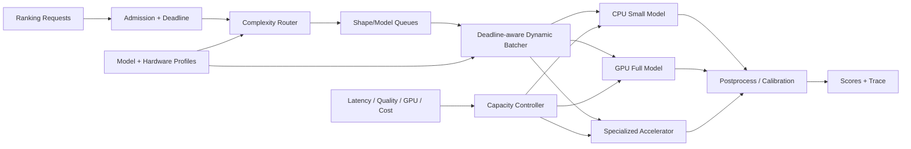

## 119. Model variants

```text
full model:
  long sequence + rich cross features + large MTML heads

medium model:
  shorter sequence + distilled representation

small fallback:
  cached/precomputed user state + lightweight ranker
```

Router features：remaining deadline、queue depth、request complexity、uncertainty、candidate count、device/network context、capacity、experiment。

Hard policy/safety 不由 router 降级。

## 120. Deadline-aware router implementation

```python
from dataclasses import dataclass


@dataclass(frozen=True)
class RequestProfile:
    remaining_ms: float
    queue_depth: int
    candidate_count: int
    sequence_length: int
    uncertainty: float


@dataclass(frozen=True)
class ModelProfile:
    name: str
    estimated_p95_ms: float
    quality_score: float
    max_candidates: int
    max_sequence: int


def choose_model(request: RequestProfile, models: list[ModelProfile]) -> ModelProfile:
    queue_penalty = min(request.queue_depth * 0.05, request.remaining_ms * 0.3)
    compute_budget = max(0.0, request.remaining_ms - queue_penalty)
    feasible = [
        model
        for model in models
        if model.estimated_p95_ms <= compute_budget
        and request.candidate_count <= model.max_candidates
        and request.sequence_length <= model.max_sequence
    ]
    if not feasible:
        return min(models, key=lambda model: model.estimated_p95_ms)
    # Uncertain requests benefit more from quality when deadline permits.
    return max(feasible, key=lambda model: model.quality_score * (1.0 + request.uncertainty))
```

Production router 应使用 calibrated service-time distribution，不只 p95 point estimate；还要 fairness、capacity reservation 和 safe fallback。

## 121. Dynamic batching

每个 queue 按 `(model_version, sequence_bucket, candidate_bucket, hardware)` 分组。

Flush 条件：

- batch 达到 max；
- oldest request 接近 deadline；
- predicted next-arrival 不值得等；
- GPU slot available；
- priority request。

目标：

$$
choose\ B=\arg\max Throughput(B)
\quad s.t.\quad P(T_{queue}+T_{service}(B)>D)<\epsilon
$$

## 122. Quantization and kernels

Mixed precision design：

- embedding rows：INT8/FP8 row-wise；
- dense GEMM：BF16/FP16；
- sensitive accumulation/calibration：FP32；
- communication：独立量化；
- output heads：按 task sensitivity。

Kernel work：table-batched embedding、jagged ops、grouped GEMM、fused interaction/post-op、CUDA Graphs for stable buckets、Triton/CUDA only for proven hotspots。

Validation：overall + rare/new/region/device slices、calibration、score rank correlation、p99、memory、power、fallback。

## 123. Elastic capacity controller

Signals：arrival rate forecast、queue age、deadline miss、batch fill、model mix、GPU memory、fallback、host health。

Required replicas：

$$
N=\left\lceil\frac{QPS_{peak}\cdot service\_cost}
{capacity_{replica}\cdot target\_utilization}\cdot headroom\right\rceil
$$

Scale-up 冷启动可能慢，因此：

- warm pools；
- model weights local cache；
- predictive autoscale；
- load shedding；
- cell isolation；
- reserved fallback capacity。

## 124. Overload ladder

```text
0 full model/full K/full sequence
1 reduce batch wait
2 shorten sequence or reduce candidate K
3 route to medium/small model
4 cached/precomputed ranking
5 safe deterministic fallback
```

每一级记录 reason/version，并离线量化 quality debt。

## 125. Failure matrix

| Failure | Detection | Response |
|---|---|---|
| GPU OOM | allocation/model bucket | smaller batch/model, quarantine |
| queue explosion | age/deadline | admission/load shed/router downgrade |
| bad quant model | slice/prediction drift | rollback precision/model |
| model load storm | cache miss/startup | stagger/warm pool/local weights |
| host/network straggler | trace/health | remove host/retry within deadline |
| full model unavailable | capacity | medium/small LKG |
| router bias | cohort/model assignment | fairness monitor/guardrail |

### 125.1 Interview answer

> 我把 serving 分为 admission、complexity routing、shape-aware batching、heterogeneous execution 和 calibration/postprocess。每个 model 有 hardware-specific latency/memory/quality profile；router 根据 deadline、uncertainty、candidate/sequence shape 与 capacity 选择最高可行质量。Batcher 优化 latency-bounded throughput，capacity controller 使用 queue/deadline/model-mix 而不是只看 GPU util。Overload 时逐级降低 compute，但 hard safety 不降级；所有 quantization/kernel changes 都必须通过 slice quality 与 p99 gate。

---

# Project 5 — Freshness-Aware Multi-Stage Video Ranking Funnel

## 126. Problem statement

从 billions inventory 中实时推荐 fresh、relevant、safe videos。挑战：

- 新视频和新用户兴趣快速变化；
- retrieval、early rank、late rank 对 freshness/compute 的需求不同；
- user/item tower 与 ANN index 必须版本兼容；
- 新内容没有 engagement，容易被 popularity model 永久压制；
- 扩大 K 提高 recall 但增加 downstream GPU cost。

## 127. Funnel architecture

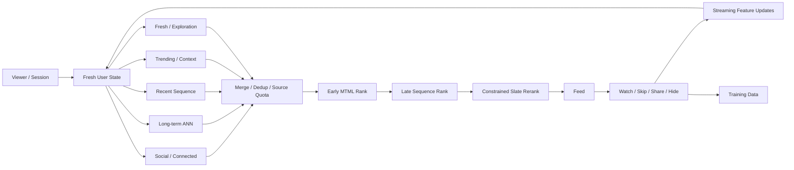

## 128. Freshness coordinator

Watermarks：

```text
video publish watermark
content-understanding watermark
item-embedding watermark
ANN-index watermark
user-interaction watermark
feature-store watermark
training-data watermark
```

End-to-end item freshness：

$$
T_{item}=T_{publish}+T_{policy}+T_{features}+T_{embedding}+T_{index}+T_{cache}
$$

Request trace 记录各 watermark；否则只能知道“结果旧”，不知道旧在哪。

## 129. Versioned index cutover

```text
item tower v7 -> snapshot embeddings -> index v7 base
                                  \-> delta updates after snapshot
query tower v7 -> shadow queries -> recall/latency comparison
delta watermark catches target
 -> atomic compatibility manifest activation
```

Manifest：

```yaml
retrieval_release: retrieval-v7
user_tower: user-v7
item_tower: item-v7
embedding_schema: shared-space-v4
ann_base: ann-v7-snapshot-42
ann_delta_watermark: 2026-07-19T10:00:00Z
feature_set: retrieval-feature-v31
fallback_release: retrieval-v6
```

## 130. Adaptive candidate budget

固定 K 对所有 request 浪费 compute。根据 source entropy、retrieval margin、uncertainty、remaining capacity 分配 K。

```python
from dataclasses import dataclass


@dataclass(frozen=True)
class RetrievalContext:
    uncertainty: float
    fresh_interest: float
    queue_pressure: float
    base_k: int = 500


def candidate_budget(ctx: RetrievalContext, minimum: int = 200, maximum: int = 2000) -> int:
    quality_multiplier = 1.0 + 0.8 * ctx.uncertainty + 0.4 * ctx.fresh_interest
    capacity_multiplier = max(0.4, 1.0 - 0.7 * ctx.queue_pressure)
    budget = int(ctx.base_k * quality_multiplier * capacity_multiplier)
    return max(minimum, min(maximum, budget))
```

Router 必须防某些 cohort 长期只获得小 K；监控分配公平性和 final-winner recall。

## 131. Fresh content cold start

新视频没有 engagement，使用：

- content/video/audio/text embeddings；
- creator prior，但防 rich-get-richer；
- topic/context；
- freshness source quota；
- controlled exploration；
- uncertainty-aware ranking；
- safety/quality gate；
- rapid streaming feedback。

Exploration 不等于随机污染 feed。可以在合适 cohort/positions 进行 bounded exploration，记录 propensity，并监控 hide/report。

## 132. Funnel compute allocation

总 cost：

$$
C=K_r c_r+K_e c_e+K_l c_l+K_f c_f
$$

目标是让每阶段保留最终 winner 的 recall，同时减少无价值 candidates。监控：

- `winner_recall(stage)`：最终 winner 是否在该 stage top-K；
- `candidate_survival_by_source`；
- `cost_per_final_item`；
- `fresh_item_survival`；
- `fallback/deadline`。

## 133. Constrained reranking

Hard gates：safety、privacy、blocked content、age/region eligibility。  
Soft/slate objectives：relevance、watch、satisfaction、freshness、creator/topic diversity、exploration。

$$
\max_{slate\ S}\sum_{i\in S}V(i)-\lambda Redundancy(S)
$$

subject to hard eligibility and quotas。

### 133.1 Interview answer

> Funnel 使用 social、long-term ANN、recent sequence、trending 和 fresh/exploration sources。每个 source 有独立 freshness watermark；merge 后 early rank、late sequence rank 与 constrained rerank。User/item towers、embedding schema 和 ANN base/delta 通过 compatibility manifest 原子切换。Candidate K 根据 uncertainty/fresh-interest/capacity 自适应，但监控 cohort fairness 和 winner recall。新内容依赖 content understanding + bounded exploration，不让 popularity feedback loop 永久饿死 cold-start videos。

---

# Project 6 — Long-Sequence Generative Video Recommender

## 134. Problem statement

传统 handcrafted aggregates 和短历史难以表达用户兴趣演化。将推荐建模为 sequence transduction：

```text
(video, action, watch_time, timestamp, context)_1 ... _L
 -> sequence encoder
 -> user state / next-item representation
 -> retrieval + ranking + multi-task outcomes
```

挑战：high-cardinality item IDs、non-stationary stream、jagged long sequences、activation memory、training/inference cost、state freshness。

## 135. Tokenization

每个 event token：

$$
e_t=E_{video}(v_t)+E_{action}(a_t)+E_{time}(\Delta t)+E_{context}(c_t)
$$

可附加 watch-duration bucket、creator/topic/content embedding。不要把连续时间只当绝对 position；time gap 表示兴趣衰减。

### 135.1 Training objectives

- next-item / next-action prediction；
- masked event reconstruction；
- retrieval contrastive loss；
- future watch/share/hide multi-task；
- sequence-level satisfaction/retention proxy。

联合 loss：

$$
\mathcal L=\lambda_{next}\mathcal L_{next}
+\lambda_{retr}\mathcal L_{retr}
+\sum_t\lambda_t\mathcal L_t
$$

## 136. Simplified sequential model

```python
from __future__ import annotations

import torch
from torch import nn
import torch.nn.functional as F


class SequentialVideoRecommender(nn.Module):
    def __init__(
        self,
        num_videos: int,
        num_actions: int,
        dim: int = 128,
        layers: int = 3,
        heads: int = 4,
    ):
        super().__init__()
        self.video = nn.Embedding(num_videos, dim, padding_idx=0)
        self.action = nn.Embedding(num_actions, dim)
        self.time_gap = nn.Embedding(64, dim)
        encoder_layer = nn.TransformerEncoderLayer(
            d_model=dim,
            nhead=heads,
            dim_feedforward=4 * dim,
            batch_first=True,
            norm_first=True,
        )
        self.encoder = nn.TransformerEncoder(encoder_layer, num_layers=layers)
        self.user_projection = nn.Linear(dim, dim)
        self.watch_head = nn.Linear(dim, 1)
        self.hide_head = nn.Linear(dim, 1)

    def forward(self, video_ids, action_ids, gap_buckets, valid_mask):
        x = self.video(video_ids) + self.action(action_ids) + self.time_gap(gap_buckets)
        causal = torch.triu(
            torch.ones(x.size(1), x.size(1), device=x.device, dtype=torch.bool),
            diagonal=1,
        )
        h = self.encoder(x, mask=causal, src_key_padding_mask=~valid_mask)
        last_index = valid_mask.long().sum(dim=1).sub(1).clamp_min(0)
        user_state = h[torch.arange(h.size(0), device=h.device), last_index]
        user_state = F.normalize(self.user_projection(user_state), dim=-1)
        return {
            "user_state": user_state,
            "watch_logit": self.watch_head(user_state).squeeze(-1),
            "hide_logit": self.hide_head(user_state).squeeze(-1),
        }
```

这是教学 baseline，不是 HSTU 实现。Production 应用 jagged kernels、efficient attention/HSTU-style operators、distributed embeddings、sampling 和 long-sequence parallelism。

## 137. Long-sequence performance

标准 attention：

$$
Compute=O(BL^2d),\quad Activation=O(BL^2)
$$

解决手段：

- event selection / dedup / compress repeated actions；
- short recent exact + long-term memory summary；
- sequence bucketing/packing；
- sparse/linear/specialized attention；
- activation checkpoint；
- context parallelism；
- distillation；
- adaptive sequence length。

### 137.1 Jagged context parallel

Sequence lengths 不等，按 token count 而非 user count 平衡 ranks。需要：

- global token offsets；
- ragged partition；
- communication-aware attention；
- padding-free kernels；
- deterministic recombination；
- per-rank token/compute telemetry。

## 138. Serving state

三种选择：

**Recompute full sequence**：最新但贵。  
**Cached user state**：快但 stale，需要 event-driven refresh。  
**Incremental state update**：最复杂，需要 model/state version compatibility。

Hybrid：

```text
offline long-term state
+ streaming recent-event delta
-> lightweight online combiner
```

State key 包含 `user_id + model_version + history_watermark`。Model upgrade 时 dual-state build 或 fallback，不能用 v1 state 输入 v2 encoder。

## 139. Training and evaluation

- time-based split，防未来泄漏；
- sequence truncation policy version；
- sampled softmax / in-batch/hard negatives；
- NDCG/Recall + calibration + watch/hide tasks；
- long-history/user activity slices；
- cold-start users/items；
- online long-term satisfaction/retention guardrails；
- training/inference cost scaling curve。

## 140. Failure matrix

| Failure | Impact | Mitigation |
|---|---|---|
| repeated events dominate | biased interest | dedup/downweight/compress |
| long active users OOM | batch failure | bucket/token budget/truncate |
| cached state stale | relevance loss | watermark/stream delta |
| model/state mismatch | score collapse | versioned state contract |
| hard negatives false | training instability | miner version/filter/curriculum |
| sequence model too slow | p99/cost | distill/adaptive routing/smaller online model |

### 140.1 Interview answer

> 我把每次 video interaction 编码为 video、action、time gap 和 context token，用 sequential transducer 学 user state，并同时支持 next-item retrieval 与 watch/share/hide multi-task ranking。系统难点是 jagged long sequences：训练按 token count bucket/pack，需要 distributed embeddings、specialized attention 和必要的 context parallelism；Serving 使用 long-term cached state 加 streaming recent delta，并让 state/model/watermark version兼容。更长历史是否值得，由 quality–activation–p99–cost scaling curve和 adaptive routing决定。

---

## 141. Core infrastructure project coverage map

| Project | Primary depth | End-to-end output |
|---|---|---|
| 1. Multimodal Discovery | content/artifact/index/ranking | 50B-scale hybrid discovery platform |
| 2. Training Data Platform | event/feature/label/sampling | reproducible point-in-time datasets |
| 3. GPU Training Platform | embedding/jagged/distributed | time-to-quality optimized training |
| 4. Ranking Inference | batching/quantization/elasticity | latency-bounded quality serving |
| 5. Fresh Ranking Funnel | retrieval/freshness/cold start | compatible multi-stage online funnel |
| 6. Sequential Recommender | long history/generative RecSys | user-state retrieval + MTML ranking |

如果面试官说：

- `training data pipelines` → Project 2；
- `GPU model performance` → Project 3 + 4；
- `model-infra co-design` → Project 4 + 5 + 6；
- `video/content understanding` → Project 1；
- `ranking/retrieval architecture` → Project 5；
- `next-generation RecSys` → Project 6。

---

# Part XIX — Facebook-Style Video Recommendation Projects

> 本部分专门处理 Facebook/Reels 类 video feed，而不是泛化的商品或广告推荐。设计参考 Meta 公开资料中的 video unification、multi-stage ranking、real-time ranking、dynamic pagination、direct user feedback 和 multimodal video learning；所有实现、SLO 与规模数字仍是 interview reference design，不代表内部系统。

# Project 7 — Unified Reels / VOD / Live Video Feed Ranking

## 142. Product problem

一个统一 video surface 同时服务：

- `Reels`：短、消费速度快、swipe signal 密集；
- `VOD`：时长跨度大，用户可能只看某个片段；
- `Live`：freshness 极敏感，剩余直播时长不确定；
- `connected inventory`：来自 follow/friend/group；
- `unconnected inventory`：来自未知 creator，需要 discovery 与 safety control。

真正的问题不是把所有候选混在一起排序，而是：

$$
\max_\pi \; \mathbb{E}[U_{session}(\pi)]
$$

subject to：

$$
p99_{latency} \le L,\quad Cost/request \le C,
\quad SafetyViolation \le \epsilon,
\quad FreshnessLag \le F
$$

其中 policy $\pi$ 同时决定 candidate source、model variant、page size 和最终序列。

## 143. End-to-end architecture

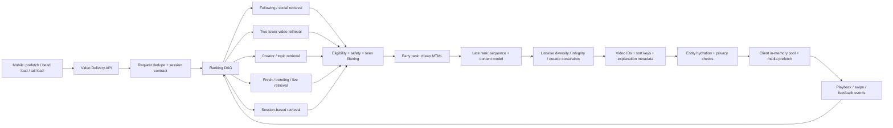

关键 contract：

1. Ranking 返回 `video_id + sort_key + model/version metadata`，不是重型 video entity；
2. Server 做 authoritative privacy/entity materialization；
3. Client 不重新发明排序，只按 sort key、seen state 和明确的 playback constraint 消费；
4. 下一次 tail load 带上 session delta，使 ranking 对刚发生的 swipe/watch/hide 快速响应；
5. 同一个 `request_id` 必须 deterministic，retry 不应生成完全不同的一页。

## 144. Candidate generation and funnel budget

假设 retrieval 后有 20K candidates，但 late rank 只能处理 500 个：

| Stage | Candidate count | Model | 典型成本 |
|---|---:|---|---:|
| multi-source retrieval | 20K | ANN / graph / rule | 10–25 ms |
| eligibility/filter | 8K | policy + seen set | 5–10 ms |
| early rank | 2K | small DLRM/MTML | 10–20 ms |
| late rank | 500 | sequence + multimodal | 20–50 ms |
| listwise rerank | 20–50 | constrained optimizer | 2–8 ms |

不要固定每个 source 的候选数。令 source $s$ 的边际收益为 $\Delta Q_s(k)$，边际成本为 $\Delta C_s(k)$：

$$
k_s^* = \arg\max_k \left[Q_s(k)-\lambda C_s(k)\right]
$$

在线 controller 根据 user state、session depth、source yield 和 fleet load 调整 $k_s$。新用户应提高 exploration/fresh pool，成熟用户可以扩大 personalized pool。

## 145. Video-specific MTML objective

不要直接最大化 raw watch time。长视频天然有更大的 watch-time ceiling，短视频 completion 又更容易。模型输出至少包括：

- $p_{play}$：有效播放；
- $p_{3s}$ / $p_{10s}$：短期 retention；
- $E[T_{watch}]$：expected watch time；
- $p_{complete}$：完成；
- $p_{like},p_{share},p_{comment},p_{follow}$；
- $p_{hide},p_{report},p_{quick\_skip}$；
- $p_{interest}$：true-interest / satisfaction proxy；
- $p_{return}$：long-term return proxy。

一个可解释的 base utility：

$$
U(u,v,c)=
w_1\log(1+E[T_{watch}])
+w_2p_{complete}
+w_3p_{share}
+w_4p_{interest}
+w_5p_{return}
-w_6p_{hide}
-w_7p_{report}
$$

### Duration debiasing

同时使用三类 target：

$$
r_{watch}=\frac{\min(T_{watch},T_{video})}{T_{video}},\qquad
r_{cap}=\frac{T_{watch}}{\min(T_{video},\tau)},\qquad
h(t)=P(T_{watch}=t\mid T_{watch}\ge t)
$$

- `watch ratio` 适合短视频，但会惩罚长视频；
- `capped watch` 限制长视频的天然优势；
- `survival/hazard model` 更正确地处理 swipe/censoring；
- calibration 必须按 duration bucket、surface、network 与 position 分层检查。

## 146. Implement: multi-task score and length calibration

```python
from dataclasses import dataclass
from math import exp, log1p
from typing import Iterable


@dataclass(frozen=True)
class VideoPrediction:
    video_id: str
    duration_s: float
    expected_watch_s: float
    p_complete: float
    p_share: float
    p_interest: float
    p_return: float
    p_hide: float
    p_report: float
    creator_id: str
    topic_id: str
    is_live: bool
    age_minutes: float


@dataclass(frozen=True)
class ScoreWeights:
    watch: float = 0.30
    complete: float = 0.12
    share: float = 0.18
    interest: float = 0.25
    returning: float = 0.15
    hide: float = 0.35
    report: float = 1.20
    freshness: float = 0.08


def sigmoid(x: float) -> float:
    return 1.0 / (1.0 + exp(-max(-30.0, min(30.0, x))))


def duration_calibrated_watch(p: VideoPrediction, cap_s: float = 60.0) -> float:
    # 同时限制长视频 ceiling，并保留 absolute watch value。
    capped_denominator = max(1.0, min(p.duration_s, cap_s))
    ratio = min(p.expected_watch_s / capped_denominator, 1.5)
    return 0.55 * log1p(p.expected_watch_s) + 0.45 * ratio


def freshness_value(p: VideoPrediction, half_life_min: float = 360.0) -> float:
    decay = exp(-0.693 * p.age_minutes / half_life_min)
    # Live freshness 更敏感，但仍不能绕过 quality/safety。
    return decay * (1.25 if p.is_live else 1.0)


def pointwise_score(p: VideoPrediction, w: ScoreWeights) -> float:
    value = (
        w.watch * duration_calibrated_watch(p)
        + w.complete * p.p_complete
        + w.share * p.p_share
        + w.interest * p.p_interest
        + w.returning * p.p_return
        + w.freshness * freshness_value(p)
        - w.hide * p.p_hide
        - w.report * p.p_report
    )
    return value


def constrained_rerank(
    predictions: Iterable[VideoPrediction],
    page_size: int,
    max_per_creator: int = 2,
    topic_repeat_penalty: float = 0.20,
) -> list[VideoPrediction]:
    remaining = list(predictions)
    selected: list[VideoPrediction] = []
    creator_count: dict[str, int] = {}
    topic_count: dict[str, int] = {}
    weights = ScoreWeights()

    while remaining and len(selected) < page_size:
        best_index = -1
        best_score = float("-inf")
        for i, candidate in enumerate(remaining):
            if creator_count.get(candidate.creator_id, 0) >= max_per_creator:
                continue
            score = pointwise_score(candidate, weights)
            score -= topic_repeat_penalty * topic_count.get(candidate.topic_id, 0)
            if score > best_score:
                best_index, best_score = i, score
        if best_index < 0:
            break
        chosen = remaining.pop(best_index)
        selected.append(chosen)
        creator_count[chosen.creator_id] = creator_count.get(chosen.creator_id, 0) + 1
        topic_count[chosen.topic_id] = topic_count.get(chosen.topic_id, 0) + 1
    return selected
```

Production 中 constraint 不止 creator/topic，还包括 integrity、language、format、seen state、live/VOD mix 与 exploration floor。Hard safety/privacy 是 filter；diversity 和 ecosystem balance 才适合 soft penalty。

## 147. Real-time session adaptation

Session 内信号比长期 profile 更新更快：

```text
swipe < 1 s             -> strong negative for this video/context
watch 5 s of 8 s        -> short-video positive
watch 20 s of 20 min    -> weak/ambiguous, not necessarily negative
rewatch                 -> strong local-interest signal
share / follow creator  -> sparse high-value positive
hide / report           -> strong negative + policy workflow
```

User representation：

$$
h_{session,t}=GRU/Transformer(h_{session,t-1}, e_{video_t}, e_{action_t}, e_{timegap_t})
$$

$$
h_u = g(h_{longterm}, h_{session,t}, h_{context})
$$

低延迟实现不必每次重算完整 history：

1. `long_term_state` 从 versioned cache 读取；
2. 最近 10–50 个事件在 request 中 piggyback 或从 low-latency stream 读取；
3. incremental encoder 只处理 delta；
4. state 带 `model_version + event_watermark`，防止新模型读取旧语义 state；
5. tail-load request 若 signal snapshot 未变化，可以复用部分 retrieval/ranking computation。

## 148. Metrics and failure drills

| Layer | Primary metrics | Failure question |
|---|---|---|
| retrieval | source recall、unique creators、fresh coverage | 某 source 空了是否静默损失 inventory？ |
| ranking | calibrated AUC、NDCG、watch/satisfaction | 长视频是否因 raw watch time 获得偏置？ |
| listwise | topic/creator entropy、repeat rate | diversity 是否伤害相关性？ |
| system | p50/p95/p99、GPU utilization、timeout | overload 时哪一级模型先降级？ |
| product | session depth、return rate、hide/report | engagement gain 是否来自低质量 consumption？ |
| creator | new-creator exposure、concentration | 大 creator 是否垄断 feedback loop？ |

典型故障：

- `seen-set lag` → 重复视频；
- `session delta loss` → 实时兴趣不响应；
- `duration calibration drift` → inventory mix 改变后长短视频偏置；
- `live candidate stale` → 已结束直播仍进入 funnel；
- `privacy hydration rejection` → ranking 浪费容量并导致 page underfill；
- `source collapse` → 总体 CTR 尚可但内容生态变窄。

## 149. Interview answer

> 我会把 Facebook-style unified video feed 设计成 client、delivery server 和 ranking DAG 三层。Ranking 从 social、two-tower、creator/topic、fresh/live 和 session source 召回，经 eligibility、cheap early rank、sequence-aware late rank 与 constrained listwise rerank。模型不是只优化 watch time，而是联合预测 play、watch survival、completion、share、true interest、return、hide 和 report，并按 duration bucket 做 calibration。实时行为通过 tail-load request 的 session delta 进入 incremental user state。系统通过 deadline-aware model variant、dynamic candidate budget、deterministic request 和 entity/privacy hydration contract，在 quality、freshness、latency、cost 与 safety 之间闭环优化。

---

# Project 8 — Video Satisfaction and True-Interest Learning

## 150. Why engagement labels are insufficient

`watch time`、`like`、`share` 都是重要但有偏的 proxy：

- autoplay 会产生并非主动选择的 watch；
- sensational content 可能提高短期 consumption，却降低长期 satisfaction；
- 不点赞不等于不喜欢，用户可能是 low-engagement type；
- like button 在不同 surface/UI position 下 exposure 不同；
- niche content 缺少 engagement，容易被 popularity feedback loop 压制。

目标是估计：

$$
P(Y_{true\_interest}=1\mid u,v,c)
$$

并把它作为主 ranking model 的 alignment signal，而不是完全替代已有 MTML objectives。

## 151. End-to-end feedback system

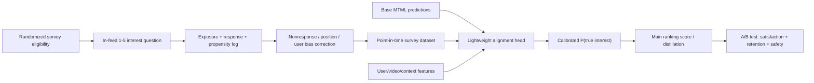

Logging contract 必须保存：

```text
survey_impression_id, user_id, video_id, session_id
request_id, position, surface, timestamp
sampling_probability, response_probability_estimate
question_version, model_version, feature_watermark
response_value, response_latency, dismissed
```

没有 `sampling_probability` 就无法纠正 survey exposure bias；没有 `dismissed/nonresponse` 就会只学习“愿意回答问卷的人”。

## 152. Bias correction

设 survey 被展示的 propensity 是 $p_i$，被回答的概率估计为 $q_i$：

$$
w_i=\operatorname{clip}\left(\frac{1}{p_iq_i},0,w_{max}\right)
$$

加权 loss：

$$
\mathcal{L}_{survey}=
-\frac{\sum_i w_i[y_i\log\hat y_i+(1-y_i)\log(1-\hat y_i)]}
{\sum_i w_i}
$$

仅靠 IPS variance 很大，因此 production 更常用：

- propensity clipping；
- self-normalized IPS；
- outcome regression；
- doubly robust estimator；
- 按 region/language/activity bucket 做 calibration 与 minimum support；
- randomized holdout 检查模型是否只学会 survey response style。

## 153. Implement: alignment head and weighted loss

```python
import torch
from torch import nn
from torch.nn import functional as F


class TrueInterestAlignmentHead(nn.Module):
    """在 frozen 或 slowly-updated base predictions 上学习 survey alignment。"""

    def __init__(self, base_prediction_dim: int, context_dim: int, hidden: int = 128):
        super().__init__()
        self.network = nn.Sequential(
            nn.Linear(base_prediction_dim + context_dim, hidden),
            nn.LayerNorm(hidden),
            nn.SiLU(),
            nn.Dropout(0.1),
            nn.Linear(hidden, 1),
        )

    def forward(self, base_predictions: torch.Tensor, context: torch.Tensor) -> torch.Tensor:
        x = torch.cat([base_predictions.detach(), context], dim=-1)
        return self.network(x).squeeze(-1)


def survey_alignment_loss(
    logits: torch.Tensor,
    labels: torch.Tensor,
    sampling_propensity: torch.Tensor,
    response_propensity: torch.Tensor,
    max_weight: float = 20.0,
) -> torch.Tensor:
    propensity = (sampling_propensity * response_propensity).clamp_min(1e-4)
    weights = (1.0 / propensity).clamp_max(max_weight)
    weights = weights / weights.mean().clamp_min(1e-6)
    per_example = F.binary_cross_entropy_with_logits(logits, labels.float(), reduction="none")
    return (weights * per_example).mean()


def combine_ranking_logits(
    engagement_utility: torch.Tensor,
    interest_logit: torch.Tensor,
    negative_feedback_risk: torch.Tensor,
    interest_weight: float,
) -> torch.Tensor:
    interest_probability = torch.sigmoid(interest_logit)
    return engagement_utility + interest_weight * interest_probability - negative_feedback_risk
```

为什么先做 lightweight head：

- survey label 稀疏，直接训练 giant ranker 容易 overfit；
- 可解释 base predictions 与 alignment residual 的关系；
- rollout/rollback 独立；
- 验证有效后，可通过 distillation 或 auxiliary loss 融入主模型。

## 154. Sparse feedback and generalization

Survey 每天相对全量 impressions 极少，需要利用 representation transfer：

$$
z_{uv}=f(e_u,e_v,e_{topic},e_{audio},e_{style},e_{mood},e_{context})
$$

模型不只学习 topic match，还要表达 audio、production style、mood、motivation 等视频维度。对稀疏 group：

1. base ranker prediction 作为 dense prior；
2. survey head 学 residual correction；
3. hierarchical calibration 在 global → locale → cohort 间 shrinkage；
4. creator/video 冷启动依赖 multimodal embeddings，不依赖 ID memorization；
5. uncertainty 高的 cohort 控制 alignment weight，而不是大胆 extrapolate。

## 155. Experiment design

### Offline

- weighted AUROC / PR-AUC；
- Brier score / ECE；
- doubly robust policy value；
- slice：locale、age bucket、new user、niche topic、duration；
- alignment gain 是否来自 popularity feature shortcut。

### Online

Primary：

- in-feed true-interest survey score；
- session satisfaction / return；
- meaningful shares/follows；
- niche high-quality content coverage。

Guardrail：

- watch time、session abandonment；
- hide/report；
- creator concentration；
- latency/cost；
- survey fatigue 与 response rate。

必须保留 randomized survey traffic，不能让新 policy 完全决定自己的训练数据，否则 evaluation 会被 feedback loop 污染。

## 156. Failure modes

| Failure | Symptom | Fix |
|---|---|---|
| survey selection bias | offline 好、全量差 | randomized eligibility + IPS/DR |
| nonresponse bias | 只服务高活跃答题者 | response model + calibration |
| label interpretation drift | 不同 locale 的 1–5 含义不同 | question/version/locale calibration |
| engagement collapse | satisfaction gain but usage drops | bounded multi-objective optimization |
| popularity shortcut | niche coverage 不升 | representation audit + counterfactual slices |
| survey fatigue | response rate 持续下降 | frequency cap + minimal randomized holdout |

## 157. Interview answer

> 对 Facebook-style video feed，我不会把 watch time 当作真实满意度。可以随机抽取少量 in-context survey，记录 survey exposure、response propensity、position、surface 和 model version；用 IPS/self-normalized 或 doubly robust 方法纠正 sampling 与 nonresponse bias。先在主 MTML predictions 上训练 lightweight true-interest alignment head，输出 calibrated satisfaction probability，再以 bounded weight 融入 ranking score。离线看 weighted calibration 和 slice generalization，在线同时看 survey satisfaction、return、watch、hide/report、creator concentration 与 latency。长期保留 randomized holdout，防止 policy-generated data 形成自证循环。

---

# Project 9 — Multimodal Video Understanding and Fresh-Upload Cold Start

## 158. Product problem

新上传视频没有 watch/like graph，传统 collaborative retrieval 几乎看不见它；但 Facebook-style video feed 又必须快速理解：

- 视觉：objects、actions、scene、style、quality；
- 音频：music、speech、sound event；
- 文本：caption、hashtag、OCR、ASR transcript；
- 时序：关键片段、节奏、topic transition；
- policy：safety、rights、privacy、integrity；
- creator/context：language、region、historical quality prior。

目标不是单个 foundation model，而是一条 `upload → understanding → index → exploration → feedback → mature ranking` 的 lifecycle。

## 159. Architecture

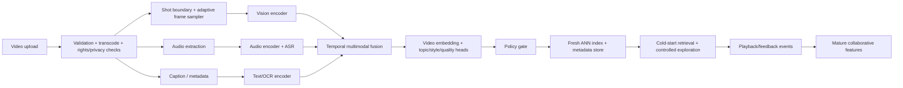

两条路径并行：

- `fast path`：低成本模型，目标是数分钟内获得可检索 embedding；
- `deep path`：更多 frames、更强 audio/text/temporal model，异步替换 embedding 与 quality heads。

如果只做 deep path，freshness 太差；如果只做 fast path，理解质量限制长期 recall。

## 160. Adaptive temporal representation

固定每秒采一帧会在长视频上浪费，在快速剪辑短视频上漏信息。使用：

1. shot boundary detection；
2. 每个 shot 至少一个 keyframe；
3. motion/audio/activity 高的 segment 增加 token；
4. token budget 固定，按 information value 分配；
5. live video 使用 rolling window 与 incremental state。

令 frame token 为 $x_t$，modality token 为 $a_t,s_t,o_t$：

$$
h_t=\operatorname{FusionTransformer}(x_t,a_t,s_t,o_t,t)
$$

$$
e_v=\sum_t \alpha_t h_t,\qquad
\alpha_t=\operatorname{softmax}(q^Th_t)
$$

Multi-task pretraining：

$$
\mathcal{L}=
\lambda_1\mathcal{L}_{video-text}
+\lambda_2\mathcal{L}_{masked\ temporal}
+\lambda_3\mathcal{L}_{audio-video}
+\lambda_4\mathcal{L}_{topic}
+\lambda_5\mathcal{L}_{quality}
$$

## 161. Implement: multimodal temporal encoder

```python
import torch
from torch import nn


class MultimodalVideoEncoder(nn.Module):
    def __init__(self, vision_dim: int, audio_dim: int, text_dim: int, model_dim: int = 256):
        super().__init__()
        self.vision_projection = nn.Linear(vision_dim, model_dim)
        self.audio_projection = nn.Linear(audio_dim, model_dim)
        self.text_projection = nn.Linear(text_dim, model_dim)
        encoder_layer = nn.TransformerEncoderLayer(
            d_model=model_dim,
            nhead=8,
            dim_feedforward=4 * model_dim,
            dropout=0.1,
            batch_first=True,
            norm_first=True,
        )
        self.temporal_encoder = nn.TransformerEncoder(encoder_layer, num_layers=4)
        self.attention_query = nn.Parameter(torch.randn(model_dim))
        self.topic_head = nn.Linear(model_dim, 256)
        self.quality_head = nn.Linear(model_dim, 1)

    def forward(
        self,
        vision_tokens: torch.Tensor,
        audio_tokens: torch.Tensor,
        text_token: torch.Tensor,
        padding_mask: torch.Tensor,
    ) -> dict[str, torch.Tensor]:
        # vision/audio shape: [batch, time, dim]; text: [batch, dim]
        fused_time = self.vision_projection(vision_tokens) + self.audio_projection(audio_tokens)
        text_context = self.text_projection(text_token).unsqueeze(1)
        fused_time = fused_time + text_context
        hidden = self.temporal_encoder(fused_time, src_key_padding_mask=padding_mask)

        attention_logits = torch.einsum("btd,d->bt", hidden, self.attention_query)
        attention_logits = attention_logits.masked_fill(padding_mask, float("-inf"))
        attention = torch.softmax(attention_logits, dim=-1)
        video_embedding = torch.einsum("bt,btd->bd", attention, hidden)
        video_embedding = nn.functional.normalize(video_embedding, dim=-1)

        return {
            "embedding": video_embedding,
            "topic_logits": self.topic_head(video_embedding),
            "quality_logit": self.quality_head(video_embedding).squeeze(-1),
            "attention": attention,
        }
```

Production 注意：ASR/audio/frame token 常常时间轴不对齐，需要 explicit timestamp alignment；padding mask、missing modality mask 与 model version 必须写入 feature contract。

## 162. Cold-start retrieval and exploration

新视频初始 score：

$$
S_0(u,v)=
\alpha\,sim(e_u,e_v)
+\beta\,creatorPrior(c_v)
+\gamma\,quality(v)
+\delta\,freshness(v)
-\eta\,risk(v)
$$

探索不是随机把视频塞给所有人。使用分层 eligibility：

1. safety/rights/privacy hard gate；
2. language/region/topic match；
3. predicted quality floor；
4. small cohort exploration；
5. sequential probability ratio / Bayesian update；
6. 达到 evidence threshold 后进入 normal candidate pool；
7. 负反馈快速降权，但避免单个 noisy event 永久杀死内容。

可用 uncertainty bonus：

$$
S_{explore}=\mu_{uv}+\kappa\sigma_{uv}
$$

但 $\kappa$ 必须受 safety、creator fairness 和 session risk 限制。

## 163. Fresh feature lifecycle

```text
t0 upload accepted
t0+seconds   metadata/creator/policy preliminary features
t0+minutes   fast multimodal embedding enters fresh index
t0+minutes   limited cold-start exploration
t0+hours     deep embedding + early engagement features
t0+days      mature collaborative/session statistics
```

每个 candidate 携带：

```text
video_id
content_embedding_version
content_feature_watermark
policy_version
index_generation
feature_completeness_bitmap
```

Ranker 必须知道 missing feature 是“尚未生成”，不是数值 0。Fast/deep embedding 切换需 dual-read shadow 验证，避免 embedding space 不兼容导致 ANN recall 瞬间坍塌。

## 164. Compute and quality control

Cost per uploaded minute：

$$
C_{video}=N_fC_{vision}+T_aC_{audio}+T_sC_{ASR}+N_t^2C_{fusion}
$$

控制手段：

- shot-aware frame reduction；
- cheap model first，deep model by predicted value；
- feature reuse across ranking、integrity、search；
- mixed precision / compile / fused preprocess；
- duration bucket batching；
- live content incremental encoding；
- backfill 与 fresh traffic 分离 quota，避免 reindex 挤压新上传。

Metrics：fresh-index lag、embedding coverage、cold-start recall、new-video exposure precision、time-to-first-qualified-view、creator concentration、feature cost/video-minute、safety escape rate。

## 165. Interview answer

> 对 Facebook-style fresh video cold start，我会做 fast/deep 双路径内容理解。上传后完成 transcode 和 policy gate，按 shot boundary 与 activity 做 adaptive frame sampling，融合 vision、audio、ASR、OCR 和 metadata，先在数分钟内产生 fast embedding 进入 fresh ANN index，再异步用更深 temporal model 替换。新视频用 user-content similarity、creator prior、quality、freshness 与 risk 初始化，通过受控 cohort exploration 收集反馈，随后逐步切换到 collaborative features。所有 feature 带 model version、watermark、completeness bitmap 和 index generation；训练与 serving 同时监控 time-to-index、cold-start recall、safety、creator concentration 和 compute/video-minute。

---

# Project 10 — Delivery-Aware Video Ranking and Dynamic Pagination

## 166. Why ranking quality alone is not enough

用户只有在视频及时起播且连续播放时，才可能产生 ranking value。系统必须联合考虑：

- network request：prefetch、head load、tail load；
- ranking latency 与 page size；
- server entity hydration/privacy CPU；
- client memory pool；
- media manifest/segment prefetch；
- startup delay、rebuffer、data usage、battery；
- cache freshness 与 data-center capacity。

端到端 expected value：

$$
EV(v)=P(served)P(start\mid served)P(no\ rebuffer\mid start)U_{rank}(u,v)
$$

一个高 ranking score 但在当前网络下无法及时播放的视频，实际价值可能低于略低分但可顺畅播放的候选。

## 167. Cross-layer architecture

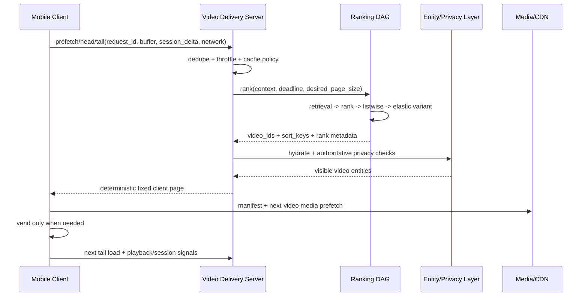

三个 page-size 概念不要混淆：

- `ranking work size`：ranking 实际计算多少 candidates；
- `server response size`：privacy/materialization 后可返回多少；
- `client vend size`：一次真正移动到 UI 的数量，通常更小。

## 168. Dynamic pagination policy

Page size 由 consumption likelihood、ranking confidence、buffer、capacity 和 network 决定：

$$
n^*=\arg\max_n
\left[
\sum_{i=1}^{n}P(scroll\ge i)EV(v_i)
-\lambda C_{rank}(n)
-\mu C_{hydrate}(n)
-\nu C_{network}(n)
\right]
$$

直觉：

- 新用户/低置信度：小 page，尽快拿到新 feedback；
- heavy consumer：大 ranking page，减少频繁 round trip；
- client buffer 低：优先低延迟可靠返回；
- fleet overload：缩小 late-rank budget/page；
- poor network：server metadata page 可适中，但 media prefetch 必须保守。

## 169. Implement: deadline-aware page controller

```python
from dataclasses import dataclass


@dataclass(frozen=True)
class DeliveryContext:
    predicted_session_depth: float
    ranking_confidence: float
    network_mbps: float
    client_buffer_items: int
    fleet_load: float
    deadline_ms: float
    is_head_load: bool


@dataclass(frozen=True)
class DeliveryDecision:
    ranking_page_size: int
    client_page_size: int
    late_rank_budget: int
    model_variant: str
    media_prefetch_items: int


def choose_delivery_policy(ctx: DeliveryContext) -> DeliveryDecision:
    ranking_page = 12
    if ctx.predicted_session_depth >= 8.0 and ctx.ranking_confidence >= 0.65:
        ranking_page = 30
    elif ctx.predicted_session_depth >= 4.0:
        ranking_page = 20

    late_rank_budget = 500
    model_variant = "full"

    if ctx.fleet_load >= 0.90 or ctx.deadline_ms < 80.0:
        ranking_page = min(ranking_page, 12)
        late_rank_budget = 200
        model_variant = "compact"
    if ctx.fleet_load >= 0.97 or ctx.deadline_ms < 45.0:
        ranking_page = min(ranking_page, 8)
        late_rank_budget = 80
        model_variant = "early-rank-only"

    # Client contract 保持小而 deterministic；ranking 可计算更大池。
    client_page = min(8, ranking_page)

    if ctx.network_mbps < 2.0:
        prefetch = 0 if ctx.client_buffer_items >= 2 else 1
    elif ctx.network_mbps < 8.0:
        prefetch = 1
    else:
        prefetch = 2 if ctx.predicted_session_depth >= 4.0 else 1

    if ctx.is_head_load and ctx.client_buffer_items == 0:
        # Head load 首要目标是快速可播放，不扩大 speculative work。
        client_page = min(client_page, 5)
        prefetch = max(1, prefetch)

    return DeliveryDecision(
        ranking_page_size=ranking_page,
        client_page_size=client_page,
        late_rank_budget=late_rank_budget,
        model_variant=model_variant,
        media_prefetch_items=prefetch,
    )
```

Controller 的 policy 不能靠手写阈值永久运行。Production 路径是：规则版建立 safe baseline → replay/simulator → contextual bandit 或 constrained policy optimization；任何 learned policy 都受 hard latency/capacity/network guardrails 限制。

## 170. Fresh cache versus network result

Client 同时可能拥有 cache 和 in-flight network result。决策可写成：

$$
Choose(network)
\iff
P(T_{network}\le d)\cdot \Delta Q_{fresh}
>
Cost(wait)+Risk(empty\ screen)
$$

工程策略：

1. prefetch 与 head load 可并发，但同一 surface 通过 request generation 去重；
2. network 在 deadline 前返回则优先新 sort key；
3. 超时则使用 cache，后台结果不得突然重排已展示内容；
4. tail load 仅在 network-origin buffer 降到 low watermark 时触发；
5. cache item 也要做 seen/privacy/version validation；
6. client report `source=cache/network`，否则训练无法识别 stale exposure。

## 171. Elastic ranking overload ladder

按 quality-per-millisecond 降级：

```text
Level 0  full retrieval + full late rank + listwise
Level 1  reduce low-yield source budgets
Level 2  compact late-rank model / smaller candidate set
Level 3  reuse stable user state and cached retrieval
Level 4  early-rank only + mandatory safety/diversity
Level 5  fresh-enough cached page
```

绝不降级的 contract：privacy、safety hard filters、request determinism、seen dedupe 和 response schema compatibility。

Capacity math：

$$
GPU_{needed}=
\frac{QPS\cdot E[t_{gpu}(variant,batch)]}{UtilizationTarget}
$$

但 autoscaling 不能只看 GPU utilization。还要看 queue delay、deadline miss、batch fill、source fanout、server hydration CPU 和 client empty-buffer rate。

## 172. Unified observability

每个 request 使用同一 trace identity 串起：

```text
client_request_id
server_request_id
ranking_request_id
model_variant + model_version
candidate_source_counts
rank/hydration/privacy latency
cache/network origin
client vend timestamp
media start/rebuffer/complete
feedback event watermark
```

核心分解：

$$
T_{time-to-first-frame}=
T_{client-trigger}+T_{network}+T_{server}+T_{rank}
+T_{hydrate}+T_{manifest}+T_{first-segment}+T_{decode}
$$

没有 cross-layer trace，ranking 团队会把播放慢归因于 client，client 会把空 buffer 归因于 server，最终没人拥有真实 end-to-end latency。

## 173. Failure drills and interview answer

| Failure | User symptom | Detection | Mitigation |
|---|---|---|---|
| rank response late | 首屏空白/cache stale | head-load deadline miss | compact variant/cache race |
| privacy rejection spike | page underfilled | hydration reject ratio | retrieval heuristic + overfetch |
| duplicate request | capacity spike/unstable list | request-id fanout | idempotency + generation token |
| over-prefetch | data/battery waste | unused bytes | consumption-aware prefetch |
| under-prefetch | swipe 后等待 | empty-buffer rate | low-watermark tail load |
| cache too aggressive | relevance stale | cache age/session mismatch | freshness-aware arbitration |
| degradation removes safety | integrity incident | policy invariant test | non-negotiable hard gate |

> 我会把 video ranking 和 delivery 当成一个 control system。Client 发 prefetch/head/tail request，带 buffer、network 和 session delta；server 负责 dedupe、throttle、cache 与 authoritative hydration/privacy；ranking DAG 根据 deadline 和 capacity 选择 candidate budget、model variant 与 ranking page size。动态分页优化的是 expected consumed value 减去 ranking、hydration 和 network cost，不是盲目返回更多视频。Client 只 vend 必要内容并做 media prefetch。overload ladder 可以降 source budget、late-rank model 和 speculative work，但不能绕过 safety/privacy/determinism。最终用统一 trace 分解 time-to-first-frame、empty-buffer、rebuffer、freshness、quality 和 cost。

---

## 174. Facebook-style video project drill map

| Interview prompt | 首选项目 | 必须讲出的核心 |
|---|---|---|
| Design Facebook/Reels video ranking | Project 7 | mixed inventory、MTML、duration debias、real-time session |
| Watch time 有什么问题 | Project 8 | direct feedback、selection bias、IPS/DR、alignment head |
| 新视频如何获得推荐 | Project 9 | multimodal fast/deep path、fresh index、controlled exploration |
| Ranking 与 mobile/server 怎么 co-design | Project 10 | dynamic pagination、buffer/prefetch、elastic ranking、trace |
| 如何统一 Reels、long VOD、Live | Project 7 + 10 | shared contract、format calibration、delivery difference |
| 如何平衡 quality/latency/cost/freshness | Project 7 + 10 | constrained objective、adaptive budget、overload ladder |
| GPU training/inference 如何深入 | Project 3 + 4 | sharding/collective 与 batching/quantization/kernel |
| Training data correctness | Project 2 + 8 | point-in-time labels 与 feedback propensity |

这四个 video 项目的连接关系：

```text
Project 9: understand every fresh video
        ↓ embeddings / topics / quality / risk
Project 7: retrieve and rank mixed Reels/VOD/Live inventory
        ↓ ranked IDs / sort keys / page policy
Project 10: deliver smoothly under device/network/capacity constraints
        ↓ watch / skip / hide / survey / return signals
Project 8: correct proxy bias and align ranking with true interest
        ↺ new labels and objectives return to Projects 2/3/7
```

---

# Appendix A — 公开技术资料锚点

以下用于理解方向，不代表团队内部实现，也不应在面试中机械背诵数字。

1. Meta / PyTorch, **TorchRec**：large-scale RecSys 的 sparse embedding、sharding 和 distributed training primitives。  
   https://pytorch.org/blog/introducing-torchrec/
2. Meta / PyTorch, **TorchRec and FBGEMM 1.0**：embedding/jagged kernels、quantization、distributed training/inference。  
   https://pytorch.org/blog/torchrec-fbgemm-1/
3. Meta, **DLRM quantized collective communication**：all-to-all/all-reduce communication quantization。  
   https://ai.meta.com/research/publications/training-deep-learning-recommendation-model-with-quantized-collective-communications/
4. Meta, **Instagram Explore multi-stage recommendations**：retrieval、first-stage、second-stage、reranking、Two-Tower、cache/precompute。  
   https://engineering.fb.com/2023/08/09/ml-applications/scaling-instagram-explore-recommendations-system/
5. Meta, **HSTU / Generative Recommenders**：sequential transduction 与 RecSys scaling。  
   https://arxiv.org/abs/2402.17152
6. Meta, **Facebook video delivery system**：freshness、ranking ownership、deterministic fetching、client/server trade-off。  
   https://engineering.fb.com/2024/12/10/video-engineering/inside-facebooks-video-delivery-system/
7. Meta, **Journey to 1000 models**：ranking model predictive health 与统一 model stability。  
   https://engineering.fb.com/2025/05/21/production-engineering/journey-to-1000-models-scaling-instagrams-recommendation-system/
8. Meta, **Scaling RecSys training with 2D sparse parallelism**：embedding sharding、imbalance、thousands-GPU scaling。  
   https://pytorch.org/blog/scaling-recommendation-2d-sparse-parallelism/
9. Meta, **FBGEMM**：low-precision high-performance kernels 与 server-side inference。  
   https://engineering.fb.com/2018/11/07/ml-applications/fbgemm/
10. Meta, **Video/Reels direct user feedback and interest modeling**：implicit feedback 之外的 satisfaction signal、MTML funnel integration。  
    https://engineering.fb.com/2026/01/14/ml-applications/adapting-the-facebook-reels-recsys-ai-model-based-on-user-feedback/
11. Meta, **SilverTorch / Index as Model**：公开的 GPU retrieval、filtering、reranking co-design 方向。  
    https://engineering.fb.com/2026/05/26/ml-applications/silvertorch-index-as-model-new-retrieval-paradigm-recommendation-systems/
12. Meta, **Understanding Data Storage and Ingestion for Large-Scale Deep Recommendation Model Training**：end-to-end DSI、distributed storage、preprocessing 与 accelerator data stalls。  
    https://arxiv.org/abs/2108.09373
13. Meta, **Scaling data ingestion for machine learning training**：disaggregated storage、Data PreProcessing tier 与 last-mile transforms。  
    https://engineering.fb.com/2022/09/19/ml-applications/data-ingestion-machine-learning-training-meta/
14. Meta, **DLRM**：sparse embedding model parallel + dense data parallel 的基础 workload model。  
    https://arxiv.org/abs/1906.00091
15. Meta, **Software–Hardware Co-design for DLRM Training**：hierarchical sharding、reduced-precision communication、memory hierarchy 与 pipelining。  
    https://arxiv.org/abs/2104.05158
16. PyTorch, **Exploring TorchRec sharding**：table-wise、row-wise、column-wise、table-row-wise 与 planner。  
    https://docs.pytorch.org/tutorials/advanced/sharding.html
17. Meta, **DeepRecSys**：latency-bounded throughput、query size/arrival、model 与 hardware-aware scheduling。  
    https://ai.meta.com/research/publications/deeprecsys-a-system-for-optimizing-end-to-end-at-scale-neural-recommendation-inference/
18. Meta, **MTIA**：recommendation-specific accelerator 与 PyTorch/model/software/hardware co-design。  
    https://ai.meta.com/blog/meta-training-inference-accelerator-AI-MTIA/

---

# Appendix B — 技术型 closing statement

> 我对这个方向感兴趣，是因为 Video ML Foundations 解决的不是单一模型问题，而是完整的 ML system optimization：如何让 ranking quality 在 latency、freshness、cost 和 reliability constraint 下持续提升。这里既需要理解 training data semantics、distributed GPU training 和 low-latency inference，也需要把 retrieval、ranking funnel、elastic compute 与 product objective 联合设计。我希望深入这种可量化的 model–system co-design：先建立正确的 end-to-end measurement，再定位主瓶颈，通过 model、kernel、runtime、data pipeline 和 capacity policy 的协同优化，把实验收益可靠地转化为 production impact。
