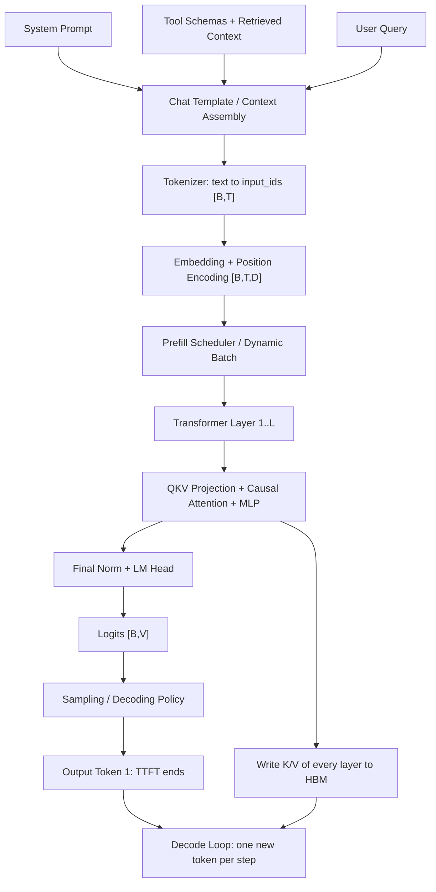
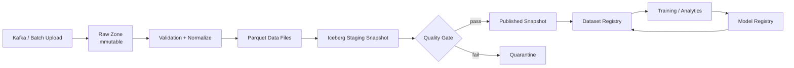
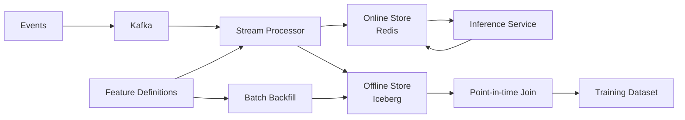
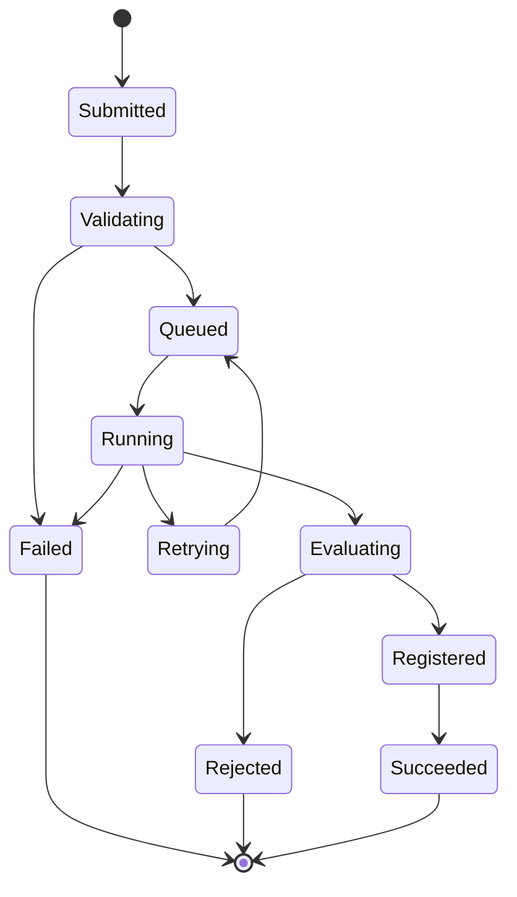
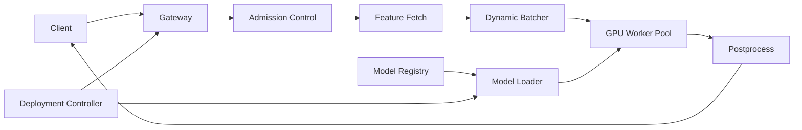
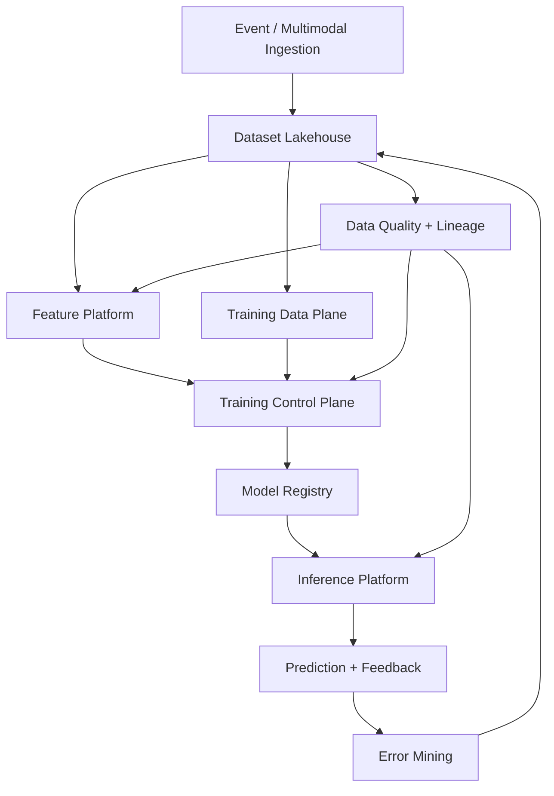
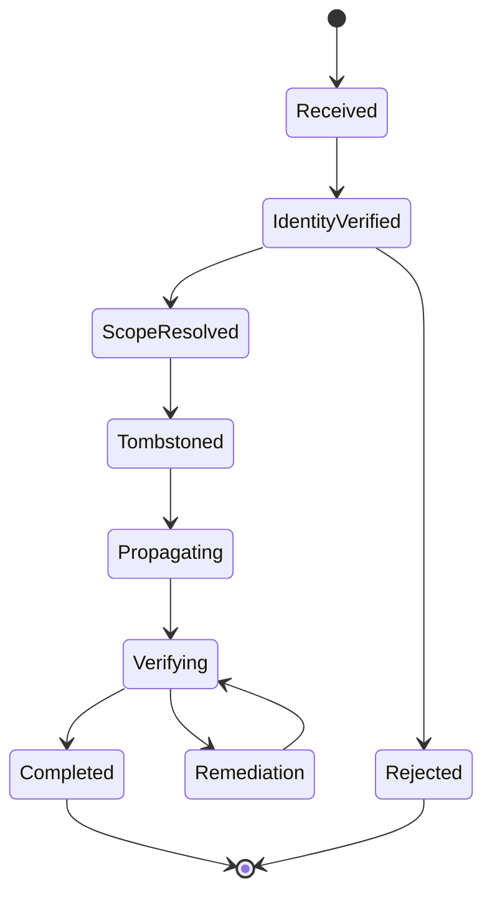
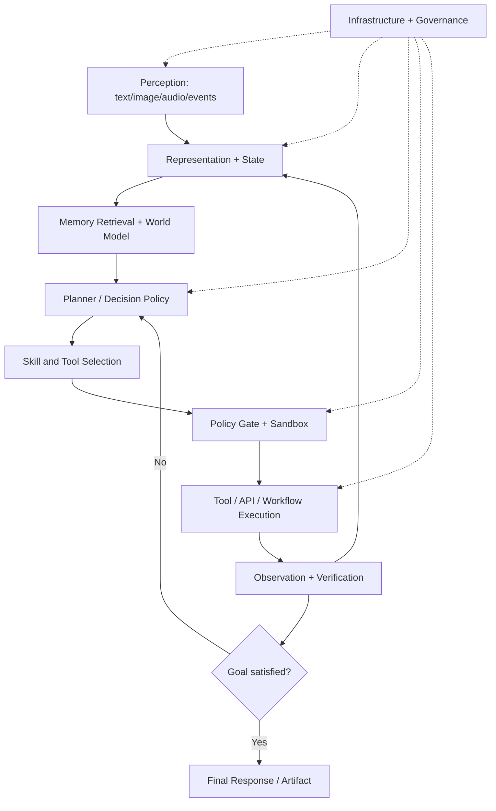
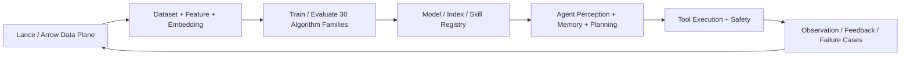

# 数据科学进阶 Python：从分析代码到可复现机器学习流水线

> 这不是 Python 语法清单，而是一份面向数据科学实战与面试的学习手册。目标是：能写出正确、清晰、可复现、可扩展的分析代码；能处理大数据集；能把探索性分析升级为可靠的机器学习流水线。
>
> 文中库名、接口名和代码必须保留其英文原名，其余说明均使用中文。

---

## 0.5 Python 列表基础训练：25 道题从操作走向思维

第二张示例图展示了列表操作的起点。列表是数据科学中最常见的 Python 容器之一，但真正需要掌握的不是背接口，而是理解：

- 列表是**有序、可变、允许重复元素**的序列；
- 索引从 `0` 开始，负索引从末尾开始；
- 切片通常创建新列表，直接赋值只复制引用；
- 尾部追加通常很快，头部插入或删除需要移动其他元素；
- 当数据成为规则的数值矩阵或表格后，应及时转向 NumPy 或 Pandas。

### 0.5.1 常用列表方法

| 操作 | 含义 | 是否原地修改 | 返回值 |
|---|---|---:|---|
| `append(x)` | 在末尾添加一个元素 | 是 | `None` |
| `extend(values)` | 在末尾添加多个元素 | 是 | `None` |
| `insert(i, x)` | 在位置 `i` 插入元素 | 是 | `None` |
| `remove(x)` | 删除第一个等于 `x` 的元素 | 是 | `None` |
| `pop(i)` | 删除并返回位置 `i` 的元素 | 是 | 被删除的元素 |
| `clear()` | 删除所有元素 | 是 | `None` |
| `index(x)` | 返回第一个等于 `x` 的位置 | 否 | 整数索引 |
| `count(x)` | 统计 `x` 出现次数 | 否 | 整数次数 |
| `sort()` | 原地排序 | 是 | `None` |
| `reverse()` | 原地反转 | 是 | `None` |
| `copy()` | 创建浅复制 | 否 | 新列表 |

关键区别：

```python
values = [3, 1, 2]

sorted_values = sorted(values)  # 返回新列表，values 不变
values.sort()                    # 原地排序，返回 None

print(values)
print(sorted_values)
```

### 0.5.2 练习 1：创建从 1 到 5 的列表

```python
numbers = [1, 2, 3, 4, 5]
print(numbers)
```

需要连续整数时，更通用的写法是：

```python
numbers = list(range(1, 6))
```

`range` 的结束位置不包含在结果中，因此结束参数是 `6`。

### 0.5.3 练习 2：访问第一个、最后一个和中间元素

```python
numbers = [10, 20, 30, 40, 50]

first = numbers[0]
last = numbers[-1]
middle = numbers[len(numbers) // 2]

print(first, last, middle)
```

这段代码假定列表非空。生产代码要明确空列表的语义：

```python
def middle_value(values: list[int]) -> int:
    if not values:
        raise ValueError("列表不能为空")
    return values[len(values) // 2]
```

偶数长度列表有两个中间元素，应由需求决定返回左侧、右侧还是两者。

### 0.5.4 练习 3：修改第三个元素

```python
numbers = [1, 2, 3, 4, 5]
numbers[2] = 99
print(numbers)
```

第三个元素的索引是 `2`，因为索引从 `0` 开始。

### 0.5.5 练习 4：在末尾和开头添加元素

```python
numbers = [1, 2, 3]
numbers.append(4)
numbers.insert(0, 0)
print(numbers)
```

`append` 的均摊复杂度是 `O(1)`；`insert(0, value)` 需要移动现有元素，复杂度是 `O(n)`。频繁从两端添加元素时应使用 `collections.deque`。

### 0.5.6 练习 5：按值和按索引删除元素

```python
numbers = [10, 20, 30, 40, 50]
numbers.remove(30)  # 删除第一个值为 30 的元素
removed = numbers.pop(1)  # 删除并返回索引 1 的元素

print(numbers)
print("按索引删除的值：", removed)
```

如果值不存在，`remove` 会抛出 `ValueError`；索引越界时，`pop` 会抛出 `IndexError`。

### 0.5.7 练习 6：统计元素出现次数

```python
numbers = [1, 2, 2, 3, 2, 4, 2]
count = numbers.count(2)
print(count)
```

一次统计可以使用 `count`；需要统计所有元素时，使用 `Counter` 更合适：

```python
from collections import Counter

counts = Counter(numbers)
print(counts)
```

### 0.5.8 练习 7：查找元素索引

```python
numbers = [5, 10, 15, 20, 25]
index = numbers.index(15)
print(index)
```

`index` 只返回第一次出现的位置，且找不到时会报错。需要安全查找时可以封装：

```python
def find_index(values: list[int], target: int) -> int | None:
    try:
        return values.index(target)
    except ValueError:
        return None
```

### 0.5.9 练习 8：反转列表

```python
numbers = [1, 2, 3, 4, 5]
numbers.reverse()
print(numbers)
```

三种写法的区别：

```python
values = [1, 2, 3]

values.reverse()       # 原地修改
reversed_copy = values[::-1]  # 创建新列表
iterator = reversed(values)   # 返回惰性迭代器
```

### 0.5.10 练习 9：升序和降序排列

```python
numbers = [4, 1, 7, 2, 9]

ascending = sorted(numbers)
descending = sorted(numbers, reverse=True)

print(ascending)
print(descending)
```

复杂对象应明确排序键：

```python
records = [
    {"姓名": "甲", "分数": 88},
    {"姓名": "乙", "分数": 95},
]
ranked = sorted(records, key=lambda row: row["分数"], reverse=True)
```

### 0.5.11 练习 10：寻找最大值和最小值

```python
numbers = [8, 3, 12, 5, 1, 9]
print(max(numbers))
print(min(numbers))
```

空列表不能直接调用 `max` 或 `min`。如果空列表合法，应明确返回默认值或 `None`。

### 0.5.12 练习 11：计算所有元素之和

```python
numbers = [2, 4, 6, 8, 10]
total = sum(numbers)
print(total)
```

平均值需要同时处理空列表：

```python
def mean(values: list[float]) -> float:
    if not values:
        raise ValueError("不能计算空列表的平均值")
    return sum(values) / len(values)
```

### 0.5.13 练习 12：创建元素平方的新列表

```python
numbers = [1, 2, 3, 4, 5]
squares = [number**2 for number in numbers]
print(squares)
```

列表推导式的通用结构是：

```python
result = [
    transform(item)
    for item in source
    if condition(item)
]
```

当变换逻辑很复杂时，应提取为具名函数。

### 0.5.14 练习 13：清空列表

```python
numbers = [1, 2, 3, 4, 5]
numbers.clear()
print(numbers)
```

`clear()` 会修改原列表，因此其他指向同一列表的变量也会看到变化：

```python
left = [1, 2, 3]
right = left
left.clear()
assert right == []
```

而 `left = []` 只是让 `left` 指向一个新列表，不会清空 `right` 指向的旧列表。

### 0.5.15 练习 14：连接两个列表

```python
left = [1, 2, 3]
right = [4, 5, 6]

joined = left + right
print(joined)
```

`+` 创建新列表；`left.extend(right)` 会原地修改 `left`。要连接许多列表，可以使用 `itertools.chain`，避免反复复制中间结果。

### 0.5.16 练习 15：检查元素是否存在

```python
numbers = [10, 20, 30, 40]

print(20 in numbers)
print(50 in numbers)
```

列表成员检查是线性扫描，复杂度为 `O(n)`。如果需要对大量目标反复检查，应先转成集合：

```python
number_set = set(numbers)
print(20 in number_set)
```

### 0.5.17 练习 16：保序删除重复元素

```python
numbers = [1, 2, 2, 3, 4, 1, 5]
unique = list(dict.fromkeys(numbers))
print(unique)
```

直接写 `list(set(numbers))` 虽然可以去重，但不应依赖其输出顺序。

如果元素不可哈希，例如内部包含列表，则需要显式扫描：

```python
def unique_unhashable(values: list[list[int]]) -> list[list[int]]:
    result: list[list[int]] = []
    for value in values:
        if value not in result:
            result.append(value)
    return result
```

### 0.5.18 练习 17：向右旋转列表

```python
def rotate_right(values: list[int], positions: int) -> list[int]:
    if not values:
        return []
    positions %= len(values)
    return values[-positions:] + values[:-positions]


numbers = [1, 2, 3, 4, 5]
print(rotate_right(numbers, 2))
```

使用取模后，旋转次数大于列表长度也能正确处理。`positions == 0` 时切片仍能返回原顺序的新列表。

### 0.5.19 练习 18：展开一层嵌套列表

```python
nested = [[1, 2], [3, 4], [5, 6]]
flat = [value for group in nested for value in group]
print(flat)
```

执行顺序等价于：

```python
flat = []
for group in nested:
    for value in group:
        flat.append(value)
```

这只展开一层。任意深度递归结构还要定义字符串、字典等对象是否也算可展开对象，不能盲目递归。

### 0.5.20 挑战 19：寻找第二大的不同元素

```python
def second_largest(values: list[int]) -> int:
    unique = set(values)
    if len(unique) < 2:
        raise ValueError("至少需要两个不同元素")
    largest = max(unique)
    unique.remove(largest)
    return max(unique)


print(second_largest([4, 9, 9, 2, 7]))
```

这个实现需要额外集合。若数据量很大，可以一次扫描并维护最大值与第二大值，将额外空间降为 `O(1)`。

### 0.5.21 挑战 20：检查列表是否已排序

```python
def is_non_decreasing(values: list[int]) -> bool:
    return all(
        left <= right
        for left, right in zip(values, values[1:])
    )


print(is_non_decreasing([1, 2, 2, 4]))
print(is_non_decreasing([1, 3, 2, 4]))
```

空列表和单元素列表没有逆序对，因此通常定义为已排序。

### 0.5.22 挑战 21：把两个列表配对

```python
names = ["甲", "乙", "丙"]
scores = [91, 87, 95]

pairs = list(zip(names, scores))
print(pairs)
```

默认 `zip` 会在较短输入耗尽时停止。Python 3.10 及以上可以要求长度严格一致：

```python
pairs = list(zip(names, scores, strict=True))
```

长度不一致时会抛出 `ValueError`，可以防止数据静默丢失。

### 0.5.23 挑战 22：删除所有负数

```python
numbers = [1, -2, 3, -4, 5]
non_negative = [number for number in numbers if number >= 0]
print(non_negative)
```

不要一边正向遍历列表一边删除其中元素，因为索引移动后可能跳过元素。

### 0.5.24 挑战 23：分别统计偶数和奇数

```python
numbers = [1, 2, 3, 4, 5]

even_count = sum(number % 2 == 0 for number in numbers)
odd_count = len(numbers) - even_count

print("偶数：", even_count)
print("奇数：", odd_count)
```

布尔值在求和时可视为 `1` 和 `0`，因此可以直接统计满足条件的元素数。

### 0.5.25 挑战 24：寻找两个列表的共同元素

只需要集合意义上的交集：

```python
left = [1, 2, 2, 4]
right = [2, 3, 4]

common = set(left) & set(right)
print(common)
```

需要保留左侧顺序：

```python
right_set = set(right)
common_in_left_order = list(
    dict.fromkeys(value for value in left if value in right_set)
)
print(common_in_left_order)
```

这里先把右侧转为集合，避免对每个左侧元素都线性扫描右侧列表。

### 0.5.26 挑战 25：按固定大小分块

```python
from collections.abc import Iterator
from typing import TypeVar

T = TypeVar("T")


def chunked(values: list[T], chunk_size: int) -> Iterator[list[T]]:
    if chunk_size <= 0:
        raise ValueError("分块大小必须大于 0")
    for start in range(0, len(values), chunk_size):
        yield values[start : start + chunk_size]


print(list(chunked([1, 2, 3, 4, 5, 6, 7], 3)))
```

使用生成器后，调用方可以逐块消费；但每个切片仍会创建一个小列表。处理文件或数据库流时，应改为接收通用迭代器的批处理函数。

### 0.5.27 列表最重要的四个陷阱

#### 陷阱一：赋值不是复制

```python
original = [1, 2, 3]
alias = original
alias.append(4)

assert original == [1, 2, 3, 4]
```

需要独立外层列表时使用：

```python
copied = original.copy()
# 或 copied = original[:]
# 或 copied = list(original)
```

#### 陷阱二：浅复制不会复制嵌套对象

```python
original = [[1, 2], [3, 4]]
copied = original.copy()
copied[0].append(99)

assert original[0] == [1, 2, 99]
```

确实需要递归复制时使用 `copy.deepcopy`，但应先确认是否可以用不可变结构或重新构造来减少共享状态。

#### 陷阱三：不要用乘法创建嵌套可变列表

```python
bad_matrix = [[0] * 3] * 3
bad_matrix[0][0] = 1
print(bad_matrix)  # 三行的第一个元素都会改变

good_matrix = [[0] * 3 for _ in range(3)]
```

#### 陷阱四：不要在遍历时修改原列表

```python
numbers = [1, -2, -3, 4]

# 推荐创建新列表
numbers = [number for number in numbers if number >= 0]
```

### 0.5.28 列表操作复杂度速查

| 操作 | 平均复杂度 | 原因 |
|---|---:|---|
| `values[i]` | `O(1)` | 按偏移量随机访问 |
| `append(x)` | 均摊 `O(1)` | 偶尔需要扩容 |
| `pop()` | `O(1)` | 删除末尾 |
| `insert(0, x)` | `O(n)` | 其余元素需要移动 |
| `pop(0)` | `O(n)` | 其余元素需要移动 |
| `x in values` | `O(n)` | 线性查找 |
| `values.index(x)` | `O(n)` | 线性查找 |
| `values.remove(x)` | `O(n)` | 查找后还可能移动元素 |
| `values[a:b]` | `O(k)` | 创建长度为 `k` 的新列表 |
| `values.sort()` | `O(n log n)` | 比较排序 |

### 0.5.29 从列表过渡到数据科学工具

| 数据形态 | 推荐工具 |
|---|---|
| 少量异构对象、通用程序逻辑 | Python 列表 |
| 频繁从两端加入或删除 | `deque` |
| 大量成员检查、去重 | `set` |
| 键值查找、分组 | `dict`、`defaultdict` |
| 同类型多维数值计算 | NumPy |
| 带列名的表格数据 | Pandas |
| 超大数据的过滤、连接和聚合 | SQL、列式查询引擎或分布式框架 |

判断标准不是“哪个接口更熟”，而是数据的形状、访问方式、规模和计算目标。

---

## 1. 高级数据结构：先选对容器，再写算法

### 1.1 常见结构与复杂度

| 结构 | 典型用途 | 读取 | 插入/删除 | 关键提醒 |
|---|---|---:|---:|---|
| `list` | 有序序列、批次 | 按索引 `O(1)` | 尾部均摊 `O(1)` | 头部插入是 `O(n)` |
| `tuple` | 不可变记录、复合键 | 按索引 `O(1)` | 不支持 | 元素也必须可哈希才能作为字典键 |
| `dict` | 键到值映射 | 平均 `O(1)` | 平均 `O(1)` | 现代 Python 保留插入顺序 |
| `set` | 去重、成员判断 | 平均 `O(1)` | 平均 `O(1)` | 无索引，不应依赖展示顺序 |
| `deque` | 双端队列、滑动窗口 | 两端 `O(1)` | 两端 `O(1)` | 中间随机访问不如列表 |
| `Counter` | 频数统计 | 平均 `O(1)` | 平均 `O(1)` | 支持加减、交并等计数运算 |
| `defaultdict` | 自动初始化分组 | 平均 `O(1)` | 平均 `O(1)` | 读取不存在的键会创建该键 |

### 1.2 `defaultdict`、`Counter` 与 `deque`

```python
from collections import Counter, defaultdict, deque

events = [
    ("用户甲", "点击"),
    ("用户乙", "浏览"),
    ("用户甲", "购买"),
    ("用户甲", "点击"),
]

# 按用户聚合事件
events_by_user: defaultdict[str, list[str]] = defaultdict(list)
for user_id, event_name in events:
    events_by_user[user_id].append(event_name)

# 统计事件频数
event_counts = Counter(event_name for _, event_name in events)
print(event_counts.most_common(2))

# 固定长度滑动窗口；新元素进入时，最旧元素自动移除
latest_values: deque[float] = deque(maxlen=3)
for value in [10.0, 12.0, 11.0, 15.0]:
    latest_values.append(value)
    rolling_mean = sum(latest_values) / len(latest_values)
    print(value, rolling_mean)
```

### 1.3 数据记录：命名元组还是数据类

命名元组适合轻量、不可变、行为很少的记录；数据类适合需要默认值、校验方法或更明确领域语义的记录。

```python
from typing import NamedTuple


class Observation(NamedTuple):
    entity_id: str
    feature_value: float
    label: int


row = Observation("样本-001", 0.82, 1)
print(row.feature_value)
```

### 1.4 高频问题：为什么去重不要直接写 `list(set(values))`

因为这会丢失原始顺序。需要“保序去重”时可以利用字典键的插入顺序：

```python
values = ["甲", "乙", "甲", "丙"]
unique_in_order = list(dict.fromkeys(values))
assert unique_in_order == ["甲", "乙", "丙"]
```

### 1.5 可变对象复制陷阱

```python
# 错误：三行引用同一个内部列表
bad_matrix = [[0] * 3] * 3
bad_matrix[0][0] = 1
print(bad_matrix)  # 三行都发生变化

# 正确：每次创建新的内部列表
good_matrix = [[0] * 3 for _ in range(3)]
good_matrix[0][0] = 1
print(good_matrix)
```

面试回答：

> Python 变量保存的是对象引用。浅复制只复制外层容器，内部可变对象仍然共享；深复制会递归复制，但成本更高。数据科学中应优先通过不可变配置、明确构造和向量化数组减少隐式共享。

---

## 2. 函数、高阶函数与闭包：把分析过程变成可组合单元

### 2.1 函数是一等对象

函数可以被赋值、放入容器、作为参数传入，也可以作为结果返回。

```python
from collections.abc import Callable, Iterable


def apply_transform(
    values: Iterable[float],
    transform: Callable[[float], float],
) -> list[float]:
    return [transform(value) for value in values]


scaled = apply_transform([1.0, 2.0, 3.0], lambda value: value * 10)
```

匿名函数适合短小、无状态、只使用一次的表达式。出现分支、异常处理或复杂业务规则时，应改用具名函数。

### 2.2 纯函数为什么适合数据科学

纯函数只依赖输入，不修改外部状态，同样输入得到同样输出。它更容易测试、缓存、并行和复现。

```python
def winsorize_value(value: float, lower: float, upper: float) -> float:
    if lower > upper:
        raise ValueError("下界不能大于上界")
    return min(max(value, lower), upper)
```

不要在清洗函数内部悄悄读取全局路径、当前日期或全局随机数；应把它们作为显式参数传入。

### 2.3 参数设计：避免可变默认值

```python
# 错误：所有调用共享同一个列表
def append_bad(value: int, bucket: list[int] = []) -> list[int]:
    bucket.append(value)
    return bucket


# 正确：用 None 表示“未提供”
def append_safe(
    value: int,
    bucket: list[int] | None = None,
) -> list[int]:
    result = [] if bucket is None else list(bucket)
    result.append(value)
    return result
```

### 2.4 闭包：构造带配置的变换函数

```python
from collections.abc import Callable


def make_standardizer(mean: float, std: float) -> Callable[[float], float]:
    if std <= 0:
        raise ValueError("标准差必须大于 0")

    def standardize(value: float) -> float:
        return (value - mean) / std

    return standardize


standardize_age = make_standardizer(mean=40.0, std=12.0)
print(standardize_age(52.0))
```

闭包捕获的是变量引用。循环中创建函数时要注意“晚绑定”：

```python
# 使用默认参数在定义时固定 multiplier
functions = [
    (lambda value, multiplier=multiplier: value * multiplier)
    for multiplier in range(3)
]
assert [function(10) for function in functions] == [0, 10, 20]
```

### 2.5 `map`、`filter` 与推导式如何选择

- 简单映射和过滤通常优先列表推导式，可读性更高。
- 已有具名函数时，`map(function, values)` 很自然。
- 数据量大时使用生成器表达式，避免一次创建完整列表。
- 表格数据优先使用 NumPy/Pandas 向量化，不要把每行当普通 Python 对象循环。

---

## 3. 迭代器、生成器与 `itertools`：用有限内存处理无限数据

### 3.1 可迭代对象与迭代器

- 可迭代对象实现 `__iter__`，可以用于 `for`。
- 迭代器还实现 `__next__`，每次产生一个值，耗尽后抛出 `StopIteration`。
- 迭代器通常只能消费一次。

```python
values = [10, 20, 30]
iterator = iter(values)
print(next(iterator))
print(next(iterator))
```

### 3.2 生成器与流式批处理

```python
from collections.abc import Iterable, Iterator
from itertools import islice
from typing import TypeVar

T = TypeVar("T")


def batched(items: Iterable[T], batch_size: int) -> Iterator[list[T]]:
    if batch_size <= 0:
        raise ValueError("批次大小必须大于 0")

    iterator = iter(items)
    while batch := list(islice(iterator, batch_size)):
        yield batch


for batch in batched(range(8), batch_size=3):
    print(batch)
```

这里不会先复制全部输入，只在内存中保留当前批次。

### 3.3 `itertools` 常用积木

```python
from itertools import chain, combinations, groupby, product
from operator import itemgetter

# 拼接多个迭代源
merged = list(chain([1, 2], [3, 4]))

# 两两组合
pairs = list(combinations(["甲", "乙", "丙"], 2))

# 笛卡尔积，常用于参数网格
grid = list(product([0.01, 0.1], [10, 100]))

# groupby 只分组相邻且键相同的元素，因此通常要先排序
records = [("乙", 2), ("甲", 1), ("甲", 3)]
records.sort(key=itemgetter(0))
for key, group in groupby(records, key=itemgetter(0)):
    print(key, list(group))
```

### 3.4 流式读取大文件

```python
from collections.abc import Iterator
from pathlib import Path


def iter_nonempty_lines(path: Path) -> Iterator[str]:
    with path.open("r", encoding="utf-8") as file:
        for line in file:
            cleaned = line.strip()
            if cleaned:
                yield cleaned
```

`yield` 让文件按行读取。与 `file.read()` 相比，内存复杂度从 `O(文件大小)` 降到近似 `O(单行大小)`。

---

## 4. 装饰器、数据类与类型提示：建立可靠接口

### 4.1 装饰器：给函数增加通用能力

```python
from collections.abc import Callable
from functools import wraps
from time import perf_counter
from typing import ParamSpec, TypeVar

P = ParamSpec("P")
R = TypeVar("R")


def timed(function: Callable[P, R]) -> Callable[P, R]:
    @wraps(function)
    def wrapper(*args: P.args, **kwargs: P.kwargs) -> R:
        start = perf_counter()
        try:
            return function(*args, **kwargs)
        finally:
            elapsed = perf_counter() - start
            print(f"{function.__name__} 耗时 {elapsed:.4f} 秒")

    return wrapper


@timed
def sum_squares(limit: int) -> int:
    return sum(value * value for value in range(limit))
```

`wraps` 会保留原函数的名称、文档和签名元数据。装饰器适合计时、日志、缓存、权限和重试，但不要隐藏核心业务逻辑。

### 4.2 数据类：明确表达配置与结果

```python
from dataclasses import dataclass, field


@dataclass(frozen=True, slots=True)
class TrainingConfig:
    target_column: str
    numeric_features: tuple[str, ...]
    categorical_features: tuple[str, ...]
    random_seed: int = 42
    metrics: tuple[str, ...] = field(
        default_factory=lambda: ("准确率", "召回率")
    )


config = TrainingConfig(
    target_column="是否流失",
    numeric_features=("年龄", "月消费"),
    categorical_features=("地区",),
)
```

- `frozen=True` 防止训练过程中配置被意外修改。
- `slots=True` 减少实例内存，并阻止随意增加属性。
- 可变默认值要用 `default_factory`。

### 4.3 类型提示的价值与边界

类型提示不会自动进行运行时校验，但可以：

- 提前发现参数和返回值不一致；
- 明确 `None` 是否合法；
- 改善自动补全和重构；
- 让数据变换函数成为可理解的契约。

```python
from collections.abc import Mapping, Sequence


def weighted_average(
    values: Sequence[float],
    weights: Sequence[float],
) -> float:
    if len(values) != len(weights):
        raise ValueError("数值和权重长度必须一致")
    total_weight = sum(weights)
    if total_weight == 0:
        raise ValueError("权重总和不能为 0")
    return sum(v * w for v, w in zip(values, weights)) / total_weight


FeatureRow = Mapping[str, float | int | str | None]
```

静态类型不能替代数据校验。数据科学还需要验证范围、唯一性、缺失率、类别集合、时间边界和表间关系。

---

## 5. NumPy：形状、轴、广播和内存是核心

### 5.1 为什么 NumPy 比 Python 循环快

NumPy 数组：

- 元素类型统一，内存更紧凑；
- 核心循环在编译后的底层代码中执行；
- 能利用连续内存、向量指令和优化数学库；
- 减少 Python 对象和解释器循环开销。

```python
import numpy as np

values = np.array([1, 2, 3], dtype=np.float64)
shifted = values + 10
```

### 5.2 形状与轴

假设矩阵形状是 `(样本数, 特征数)`：

```python
matrix = np.array(
    [
        [1.0, 10.0, 100.0],
        [2.0, 20.0, 200.0],
        [3.0, 30.0, 300.0],
    ]
)

column_mean = matrix.mean(axis=0)  # 每个特征的均值，形状 (3,)
row_mean = matrix.mean(axis=1)     # 每个样本的均值，形状 (3,)
```

记忆方法：

> `axis` 表示被压缩掉的轴。`axis=0` 压缩行的方向，保留每一列；`axis=1` 压缩列的方向，保留每一行。

### 5.3 广播

广播从末尾维度开始比较，两维兼容的条件是：

1. 两者相等；或
2. 其中一个为 `1`；或
3. 其中一个维度不存在。

```python
feature_mean = matrix.mean(axis=0, keepdims=True)  # (1, 3)
feature_std = matrix.std(axis=0, keepdims=True)    # (1, 3)
standardized = (matrix - feature_mean) / feature_std
```

`keepdims=True` 保留被聚合轴，常常能让形状语义更清晰。

### 5.4 向量化与布尔掩码

```python
scores = np.array([0.2, 0.8, np.nan, 0.6])
valid = ~np.isnan(scores)
high_score = valid & (scores >= 0.7)
selected = scores[high_score]
```

逻辑组合要使用 `&`、`|`、`~`，并给每个条件加括号。Python 的 `and`、`or` 不能逐元素处理 NumPy 数组。

### 5.5 视图与复制

```python
array = np.arange(6)
view = array[1:4]       # 基础切片通常返回视图
copy = array[[1, 2, 3]] # 高级索引通常返回复制

view[0] = 99
assert array[1] == 99
```

判断是否共享内存可以使用：

```python
print(np.shares_memory(array, view))
print(np.shares_memory(array, copy))
```

性能优化不能只看速度，还要看是否意外复制了数百兆字节的数据。

### 5.6 数值稳定性

直接计算 Softmax 容易指数溢出，应先减去最大值：

```python
def stable_softmax(logits: np.ndarray) -> np.ndarray:
    shifted = logits - np.max(logits, axis=-1, keepdims=True)
    exponentials = np.exp(shifted)
    return exponentials / np.sum(exponentials, axis=-1, keepdims=True)
```

对数概率相加比很多小概率直接相乘更稳定：

$$
\log\left(\prod_{i=1}^{n}p_i\right)
=
\sum_{i=1}^{n}\log(p_i)
$$

### 5.7 随机数与可复现性

```python
rng = np.random.default_rng(seed=42)
sample = rng.normal(loc=0.0, scale=1.0, size=1_000)
```

优先显式传递随机数生成器，不要依赖隐式全局随机状态。

### 5.8 向量化不是无条件更好

当向量化表达式创建多个巨大临时数组时，内存可能成为瓶颈。可选策略：

- 原地操作，但要确认不会破坏后续需要的原数据；
- 分块计算；
- 使用 `numexpr` 或 Numba；
- 使用更合适的数据类型，例如 `float32`；
- 把过滤尽量前推，减少参与计算的数据量。

---

## 6. Pandas：围绕表语义，而不是逐行写 Python

### 6.1 建立明确的表契约

读取数据后先回答：

- 一行代表什么实体或事件？
- 主键是什么，是否唯一？
- 时间列代表事件时间还是处理时间？
- 单位是什么？
- 哪些列允许缺失？
- 类别值的合法集合是什么？

```python
import pandas as pd

customers = pd.DataFrame(
    {
        "客户编号": ["甲", "乙", "丙"],
        "地区": ["北区", "南区", "北区"],
        "年龄": [31, 45, None],
    }
)

orders = pd.DataFrame(
    {
        "订单编号": [101, 102, 103, 104],
        "客户编号": ["甲", "甲", "乙", "丁"],
        "金额": [80.0, 120.0, 50.0, 999.0],
        "下单时间": pd.to_datetime(
            ["2026-01-01", "2026-01-03", "2026-01-04", "2026-01-05"]
        ),
    }
)
```

### 6.2 `loc`、`iloc` 与链式赋值

```python
# 推荐：在一个 loc 操作中明确指定行和列
mask = customers["年龄"].isna()
customers.loc[mask, "年龄"] = customers["年龄"].median()

# 不推荐：中间对象可能是视图，也可能是复制
# customers[customers["年龄"].isna()]["年龄"] = 0
```

- `loc` 按标签；
- `iloc` 按位置；
- 修改时优先使用 `.loc[行条件, 列名] = 值`。

### 6.3 数据类型优化

```python
customers["客户编号"] = customers["客户编号"].astype("string")
customers["地区"] = customers["地区"].astype("category")
customers["年龄"] = customers["年龄"].astype("Float32")

print(customers.memory_usage(deep=True))
```

类别重复很多时，`category` 可以显著节省内存；但类别基数接近行数时收益有限。

### 6.4 连接：最危险的是不理解基数

```python
customer_orders = orders.merge(
    customers,
    on="客户编号",
    how="left",
    validate="many_to_one",
    indicator=True,
)

unmatched = customer_orders.loc[
    customer_orders["_merge"] == "left_only",
    "客户编号",
]
```

`validate` 是重要的正确性保护：

- `one_to_one`：两边键都唯一；
- `one_to_many`：左边唯一；
- `many_to_one`：右边唯一；
- `many_to_many`：允许笛卡尔式扩张，应格外谨慎。

连接后至少检查：

```python
assert len(customer_orders) == len(orders)
assert customer_orders["订单编号"].is_unique
```

### 6.5 分组聚合

```python
customer_summary = (
    orders.groupby("客户编号", as_index=False)
    .agg(
        订单数=("订单编号", "nunique"),
        总金额=("金额", "sum"),
        平均金额=("金额", "mean"),
        最近下单=("下单时间", "max"),
    )
    .sort_values("总金额", ascending=False)
)
```

常见方法区别：

- `agg`：每组压缩成较少的行；
- `transform`：返回与原表相同长度，适合组内标准化；
- `filter`：按组级条件保留或删除整组；
- `apply`：最灵活，但通常更慢，优先寻找专用向量化操作。

组内标准化：

```python
orders["客户内金额标准分"] = orders.groupby("客户编号")["金额"].transform(
    lambda series: (series - series.mean()) / series.std(ddof=0)
)
```

### 6.6 透视表与交叉表

```python
monthly = orders.assign(
    月份=orders["下单时间"].dt.to_period("M").astype("string")
)

pivot = monthly.pivot_table(
    index="客户编号",
    columns="月份",
    values="金额",
    aggfunc="sum",
    fill_value=0,
)
```

`pivot` 要求每个索引—列组合唯一；存在重复时使用可聚合的 `pivot_table`。

### 6.7 时间序列与滚动窗口

```python
daily = (
    orders.set_index("下单时间")
    .sort_index()
    .resample("D")["金额"]
    .sum()
    .to_frame()
)

daily["七日移动均值"] = daily["金额"].rolling(
    window=7,
    min_periods=1,
).mean()
```

时间序列必须先排序。预测任务中尤其要警惕中心窗口和未来数据造成泄漏。

### 6.8 缺失值不是一个问题，而是一种机制

先区分：

- 完全随机缺失；
- 与已观测变量有关的缺失；
- 与未观测值本身有关的缺失；
- 业务上“不适用”而不是“未知”。

不要无条件用均值填充。需要同时考虑：

- 是否加入“原值是否缺失”的指示特征；
- 填充值是否只从训练集拟合；
- 类别缺失是否应成为单独类别；
- 缺失本身是否携带业务信号。

### 6.9 避免逐行循环

优先级通常是：

1. 内置向量化方法；
2. 布尔掩码、`where`、`select`；
3. `groupby`、`merge`、窗口函数；
4. 必要时 `apply`；
5. 最后才是 `iterrows`。

```python
import numpy as np

orders["金额等级"] = np.select(
    [
        orders["金额"] >= 500,
        orders["金额"] >= 100,
    ],
    [
        "高",
        "中",
    ],
    default="低",
)
```

### 6.10 大文件分块读取

```python
from pathlib import Path


def aggregate_large_csv(path: Path) -> pd.Series:
    partial_results: list[pd.Series] = []

    for chunk in pd.read_csv(
        path,
        usecols=["客户编号", "金额"],
        dtype={"客户编号": "string", "金额": "float64"},
        chunksize=200_000,
    ):
        partial_results.append(chunk.groupby("客户编号")["金额"].sum())

    return pd.concat(partial_results).groupby(level=0).sum()
```

如果数据会反复读取，优先考虑 Parquet，因为它支持列式存储、压缩、类型保留和列裁剪。

---

## 7. 数据可视化：每张图都必须回答一个问题

### 7.1 图形选择

| 问题 | 推荐图形 | 常见错误 |
|---|---|---|
| 分布如何 | 直方图、密度图、箱线图 | 只看均值，忽略偏态和离群值 |
| 类别之间如何比较 | 排序条形图、点图 | 类别过多、标签不可读 |
| 两变量关系如何 | 散点图、回归图、二维密度图 | 把相关性说成因果 |
| 随时间如何变化 | 折线图、区间带 | 时间未排序、双纵轴误导 |
| 组成比例如何 | 堆叠条形图 | 类别多时使用饼图 |
| 模型误差在哪里 | 残差图、校准图、分群指标图 | 只展示一个总分 |

### 7.2 可复用绘图函数

```python
import matplotlib.pyplot as plt
import pandas as pd
import seaborn as sns
from matplotlib.axes import Axes


def plot_amount_distribution(data: pd.DataFrame) -> tuple[plt.Figure, Axes]:
    figure, axis = plt.subplots(figsize=(8, 4.5))
    sns.histplot(
        data=data,
        x="金额",
        bins=30,
        kde=True,
        ax=axis,
    )
    axis.set(
        title="订单金额分布",
        xlabel="订单金额",
        ylabel="订单数",
    )
    figure.tight_layout()
    return figure, axis
```

函数返回图对象，调用方可以继续修改，也便于测试和保存：

```python
figure, _ = plot_amount_distribution(orders)
figure.savefig("订单金额分布.png", dpi=160, bbox_inches="tight")
plt.close(figure)
```

### 7.3 可视化检查清单

- 标题是否直接表达问题？
- 坐标轴、单位、时间范围是否完整？
- 类别颜色是否保持一致？
- 是否展示样本量和不确定性？
- 坐标轴截断是否可能夸大差异？
- 图是否能在灰度或色觉差异下理解？
- 高密度散点是否需要透明度、抽样或六边形分箱？

---

## 8. Python 与 SQL：让计算发生在最合适的位置

### 8.1 分工原则

优先在 SQL 中完成：

- 过滤和列裁剪；
- 表连接；
- 大规模聚合；
- 排名、累计值和时间窗口；
- 把数据量降到本地可以处理的范围。

优先在 Python 中完成：

- 复杂统计建模；
- 机器学习；
- 自定义算法；
- 交互式可视化；
- SQL 难以表达且数据量可控的变换。

### 8.2 参数化查询

```python
import sqlite3

import pandas as pd

connection = sqlite3.connect("分析.db")
query = """
SELECT
    客户编号,
    COUNT(*) AS 订单数,
    SUM(金额) AS 总金额
FROM 订单
WHERE 下单时间 >= ?
GROUP BY 客户编号
ORDER BY 总金额 DESC
LIMIT ?
"""

result = pd.read_sql_query(
    query,
    connection,
    params=("2026-01-01", 100),
)
connection.close()
```

不要用字符串拼接插入用户输入。参数化查询同时改善安全性和类型处理。

### 8.3 SQL 窗口函数

```sql
SELECT
    客户编号,
    下单时间,
    金额,
    SUM(金额) OVER (
        PARTITION BY 客户编号
        ORDER BY 下单时间
        ROWS BETWEEN UNBOUNDED PRECEDING AND CURRENT ROW
    ) AS 客户累计金额,
    ROW_NUMBER() OVER (
        PARTITION BY 客户编号
        ORDER BY 下单时间 DESC
    ) AS 最近顺序
FROM 订单;
```

窗口函数不会像 `GROUP BY` 一样压缩行，因此适合累计值、组内排名、移动平均和前后事件比较。

### 8.4 SQL 与 Pandas 结果核对

迁移逻辑时用一个小样本同时运行两套实现，并检查：

- 行数；
- 主键唯一性；
- 空值语义；
- 排序；
- 聚合精度；
- 时区；
- 连接基数。

---

## 9. 性能分析：没有测量，就没有优化

### 9.1 正确的性能分析顺序

```text
定义性能目标
  → 建立可重复基线
  → 定位耗时或内存热点
  → 判断算法、输入输出还是解释器开销
  → 只修改一个主要因素
  → 验证速度、内存和结果正确性
```

### 9.2 计时

```python
from time import perf_counter

start = perf_counter()
result = sum(value * value for value in range(1_000_000))
elapsed = perf_counter() - start
print(f"耗时：{elapsed:.4f} 秒，结果：{result}")
```

微基准应使用多次重复，并包含预热；Jupyter 中可以使用 `%timeit`。不要用一次运行就得出结论。

### 9.3 函数级剖析

```python
import cProfile
import pstats


def workload() -> int:
    return sum(value * value for value in range(1_000_000))


profiler = cProfile.Profile()
profiler.enable()
workload()
profiler.disable()

stats = pstats.Stats(profiler).sort_stats("cumulative")
stats.print_stats(15)
```

关注：

- `tottime`：函数自身时间；
- `cumtime`：函数加上其调用函数的累计时间；
- 调用次数是否异常；
- 热点是否来自自己的代码、序列化、输入输出或第三方库。

### 9.4 算法复杂度优先

```python
# 慢：每次在列表中线性查找，总体可能接近 O(n*m)
allowed_list = list(range(10_000))
selected_bad = [value for value in range(20_000) if value in allowed_list]

# 快：集合成员判断平均 O(1)
allowed_set = set(allowed_list)
selected_good = [value for value in range(20_000) if value in allowed_set]
```

从 `O(n²)` 改成 `O(n log n)` 或 `O(n)`，通常比微调 Python 语法更重要。

### 9.5 内存预算

粗略估算一个二维数组：

$$
\text{内存字节数}
=
\text{行数}\times\text{列数}\times\text{每元素字节数}
$$

一亿个 `float64` 元素仅原始数值就约占：

$$
10^8 \times 8\text{ 字节}=800\text{ MB}
$$

实际峰值还要加上临时数组、索引、对象开销和库内部缓冲区。优化时应观察峰值内存，而不仅是最终对象大小。

### 9.6 常见优化层级

1. 减少不必要的数据和列；
2. 改进算法和数据结构；
3. 使用 NumPy/Pandas 向量化；
4. 使用合适数据类型和分块；
5. 利用编译后的库；
6. 最后才考虑并行、Numba 或分布式计算。

---

## 10. 并发、并行与扩展工具

### 10.1 线程、进程和异步的选择

| 工作负载 | 推荐起点 | 原因 |
|---|---|---|
| 网络请求、远程存储 | 线程或异步 | 大量时间在等待输入输出 |
| 调用会释放全局解释器锁的数值库 | 线程可行 | 底层计算可并行 |
| 纯 Python 计算密集循环 | 多进程 | 绕开全局解释器锁 |
| 超大表格、超出单机内存 | 分布式框架或数据库 | 需要分区和调度 |
| 单个紧密数值循环 | NumPy 或 Numba | 避免 Python 解释器循环 |

并行不是免费加速。总时间近似为：

$$
T_{\text{总}}
=
T_{\text{计算}}
+T_{\text{启动}}
+T_{\text{序列化}}
+T_{\text{通信}}
+T_{\text{合并}}
$$

任务太小时，调度和序列化成本会超过并行收益。

### 10.2 Windows 安全的多进程写法

```python
from concurrent.futures import ProcessPoolExecutor


def sum_chunk(bounds: tuple[int, int]) -> int:
    start, stop = bounds
    return sum(value * value for value in range(start, stop))


def main() -> None:
    chunks = [
        (0, 250_000),
        (250_000, 500_000),
        (500_000, 750_000),
        (750_000, 1_000_000),
    ]
    with ProcessPoolExecutor(max_workers=4) as executor:
        partials = list(executor.map(sum_chunk, chunks))
    print(sum(partials))


if __name__ == "__main__":
    main()
```

要点：

- 入口必须放在 `if __name__ == "__main__"` 下；
- 提交给进程的函数和参数必须可序列化；
- 避免反复复制巨大 DataFrame；
- 控制底层数值库线程数，防止“进程数 × 每进程线程数”导致过度订阅。

### 10.3 工具选择

- **Jupyter**：探索、解释和可视化；不应成为唯一的生产入口。
- **Joblib**：简单任务并行、缓存和模型持久化。
- **Numba**：数值类型稳定、循环密集且难以向量化的函数。
- **Dask**：类 NumPy/Pandas 的分块和延迟执行，适合超出内存或多核工作负载。
- **Polars**：高性能列式 DataFrame 和查询优化。
- **DuckDB**：直接对本地 Parquet/CSV 执行分析型 SQL。

使用新工具前先问：

> 当前瓶颈究竟是算法、输入输出、内存、单核计算，还是数据规模超过单机？工具解决的是哪一个问题？

---

## 11. 数据科学必备统计基础

### 11.1 描述统计不能只报均值

同时检查：

- 样本量；
- 均值与中位数；
- 标准差与四分位距；
- 分位数；
- 缺失率；
- 唯一值数量；
- 偏度、长尾和异常值；
- 按关键人群分层后的分布。

均值：

$$
\bar{x}=\frac{1}{n}\sum_{i=1}^{n}x_i
$$

样本方差：

$$
s^2=\frac{1}{n-1}\sum_{i=1}^{n}(x_i-\bar{x})^2
$$

### 11.2 相关不代表因果

观察到 $X$ 和 $Y$ 相关，可能来自：

- $X$ 导致 $Y$；
- $Y$ 导致 $X$；
- 混杂变量同时影响二者；
- 选择偏差；
- 数据泄漏；
- 偶然波动；
- 时间趋势导致伪相关。

面试中应先说识别假设，再谈模型。

### 11.3 置信区间与自助法

当统计量的解析分布复杂时，可用自助抽样估计不确定性：

```python
import numpy as np


def bootstrap_mean_interval(
    values: np.ndarray,
    *,
    repetitions: int = 2_000,
    confidence: float = 0.95,
    seed: int = 42,
) -> tuple[float, float]:
    if values.ndim != 1 or len(values) == 0:
        raise ValueError("输入必须是一维非空数组")

    rng = np.random.default_rng(seed)
    means = np.empty(repetitions)
    for index in range(repetitions):
        sample = rng.choice(values, size=len(values), replace=True)
        means[index] = sample.mean()

    alpha = 1.0 - confidence
    lower, upper = np.quantile(means, [alpha / 2, 1 - alpha / 2])
    return float(lower), float(upper)
```

### 11.4 假设检验的常见误区

- `p < 0.05` 不表示原假设只有 5% 概率为真；
- 统计显著不等于业务显著；
- 多次检验会提高误报率；
- 检验前看数据再选择指标会引入选择偏差；
- 样本量极大时，微小且无意义的差异也可能显著。

应同时报告效应量、置信区间、样本量和业务影响。

### 11.5 A/B 测试最小分析框架

1. 明确随机化单位；
2. 定义主要指标和护栏指标；
3. 预先确定样本量和停止规则；
4. 检查分流比例与实验前平衡；
5. 按预定方法估计效应和区间；
6. 检查异质性，但控制多重比较；
7. 说明能否推广到其他时间和人群。

两组转化率差：

$$
\Delta=\hat{p}_{B}-\hat{p}_{A}
$$

业务上还常报告相对提升：

$$
\text{相对提升}
=
\frac{\hat{p}_{B}-\hat{p}_{A}}{\hat{p}_{A}}
$$

---

## 12. 机器学习流水线：防止数据泄漏是第一原则

### 12.1 一个正确的流水线包含什么

```text
原始数据
  → 数据契约与质量检查
  → 训练/验证/测试切分
  → 只在训练数据上拟合预处理
  → 特征变换
  → 模型训练
  → 交叉验证与超参数选择
  → 独立测试集最终评估
  → 保存完整流水线、版本与指标
```

### 12.2 为什么要先切分再预处理

如果先用全体数据计算均值、类别词表、特征选择阈值或目标编码，验证集信息就进入了训练过程。即使标签没有直接出现，也可能造成数据泄漏。

正确原则：

> 所有需要从数据中“学习参数”的步骤，都必须只在训练折上拟合。

### 12.3 数值和类别特征的完整流水线

```python
from sklearn.compose import ColumnTransformer
from sklearn.impute import SimpleImputer
from sklearn.linear_model import LogisticRegression
from sklearn.pipeline import Pipeline
from sklearn.preprocessing import OneHotEncoder, StandardScaler

numeric_features = ["年龄", "月消费"]
categorical_features = ["地区", "套餐"]

numeric_pipeline = Pipeline(
    steps=[
        ("缺失值", SimpleImputer(strategy="median", add_indicator=True)),
        ("标准化", StandardScaler()),
    ]
)

categorical_pipeline = Pipeline(
    steps=[
        (
            "缺失值",
            SimpleImputer(strategy="most_frequent"),
        ),
        (
            "独热编码",
            OneHotEncoder(handle_unknown="ignore"),
        ),
    ]
)

preprocessor = ColumnTransformer(
    transformers=[
        ("数值", numeric_pipeline, numeric_features),
        ("类别", categorical_pipeline, categorical_features),
    ]
)

model = Pipeline(
    steps=[
        ("预处理", preprocessor),
        (
            "分类器",
            LogisticRegression(
                max_iter=1_000,
                class_weight="balanced",
                random_state=42,
            ),
        ),
    ]
)
```

保存的是完整 `Pipeline`，而不是只保存最后的分类器。

### 12.4 切分策略由数据生成过程决定

| 数据关系 | 推荐策略 | 避免 |
|---|---|---|
| 独立同分布样本 | 随机分层切分 | 类别比例严重漂移 |
| 同一用户多行 | 按用户分组切分 | 同一用户同时出现在训练和验证 |
| 时间序列 | 按时间向前验证 | 随机打乱未来和过去 |
| 地域或设备群组 | 分组交叉验证 | 群组特征泄漏 |
| 极少数正样本 | 分层切分并报告区间 | 只看准确率 |

### 12.5 交叉验证

```python
from sklearn.model_selection import StratifiedKFold, cross_validate

cross_validator = StratifiedKFold(
    n_splits=5,
    shuffle=True,
    random_state=42,
)

scores = cross_validate(
    model,
    features,
    target,
    cv=cross_validator,
    scoring={
        "受试者曲线下面积": "roc_auc",
        "平均精确率": "average_precision",
        "负对数损失": "neg_log_loss",
    },
    return_train_score=True,
    n_jobs=-1,
)
```

训练分数很好、验证分数明显更差，通常意味着过拟合、泄漏排除后模型过于复杂，或训练与验证分布不一致。

### 12.6 指标选择

二分类混淆矩阵：

|  | 预测为正 | 预测为负 |
|---|---:|---:|
| 实际为正 | 真阳性 | 假阴性 |
| 实际为负 | 假阳性 | 真阴性 |

精确率：

$$
\text{精确率}
=
\frac{TP}{TP+FP}
$$

召回率：

$$
\text{召回率}
=
\frac{TP}{TP+FN}
$$

$F_1$：

$$
F_1
=
2\cdot
\frac{\text{精确率}\cdot\text{召回率}}
{\text{精确率}+\text{召回率}}
$$

选择指标要从错误成本出发：

- 漏掉高风险病例成本极高：优先召回率；
- 人工审核能力有限：关注精确率；
- 类别极不平衡：平均精确率通常比准确率更有信息；
- 预测概率用于决策：关注对数损失、布里尔分数和校准；
- 排序后只处理前若干项：关注前若干项精确率、召回率或增益。

### 12.7 阈值不属于模型默认值

分类器输出概率后，阈值应由业务成本或容量决定：

$$
\text{期望成本}(t)
=
C_{FP}\cdot FP(t)
+C_{FN}\cdot FN(t)
$$

在验证集选择阈值，在测试集只做一次最终评估。不要在测试集上反复调阈值。

### 12.8 模型误差分析

总分之后继续检查：

- 不同地区、设备、年龄段的指标；
- 高置信错误；
- 缺失值较多的样本；
- 新用户和老用户；
- 不同时间窗口；
- 预测概率校准；
- 错误是否集中在数据质量问题；
- 特征是否在预测时真正可用。

---

## 13. 工程最佳实践：让分析可以被别人重复运行

### 13.2 数据契约检查

```python
import pandas as pd


def validate_orders(data: pd.DataFrame) -> None:
    required_columns = {"订单编号", "客户编号", "金额", "下单时间"}
    missing_columns = required_columns.difference(data.columns)
    if missing_columns:
        raise ValueError(f"缺少列：{sorted(missing_columns)}")

    if data["订单编号"].isna().any():
        raise ValueError("订单编号不能缺失")
    if not data["订单编号"].is_unique:
        raise ValueError("订单编号必须唯一")
    if (data["金额"] < 0).any():
        raise ValueError("订单金额不能为负")
```

“程序没有报错”不等于“数据正确”。很多严重错误只会改变行数、基数或分布。

### 13.3 单元测试

```python
import pandas as pd
import pytest


def add_amount_level(data: pd.DataFrame) -> pd.DataFrame:
    result = data.copy()
    result["金额等级"] = pd.cut(
        result["金额"],
        bins=[float("-inf"), 100, 500, float("inf")],
        labels=["低", "中", "高"],
        right=False,
    )
    return result


def test_add_amount_level_handles_boundaries() -> None:
    data = pd.DataFrame({"金额": [99.99, 100.0, 500.0]})
    result = add_amount_level(data)
    assert result["金额等级"].astype("string").tolist() == ["低", "中", "高"]


def test_validate_orders_rejects_duplicate_id() -> None:
    data = pd.DataFrame(
        {
            "订单编号": [1, 1],
            "客户编号": ["甲", "乙"],
            "金额": [10.0, 20.0],
            "下单时间": pd.to_datetime(["2026-01-01", "2026-01-02"]),
        }
    )
    with pytest.raises(ValueError, match="唯一"):
        validate_orders(data)
```

重点测试：

- 空输入；
- 单行输入；
- 边界值；
- 缺失值；
- 重复键；
- 未见过的类别；
- 时区和日期边界；
- 输入顺序改变后结果是否仍正确。

### 13.4 异常与日志

```python
import logging
from pathlib import Path

logger = logging.getLogger(__name__)


def load_dataset(path: Path) -> pd.DataFrame:
    if not path.exists():
        raise FileNotFoundError(f"数据文件不存在：{path}")

    logger.info("开始读取数据：%s", path)
    data = pd.read_parquet(path)
    logger.info("读取完成：行数=%d，列数=%d", *data.shape)
    return data
```

原则：

- 捕获自己能处理的具体异常；
- 不要使用空的 `except:`；
- 日志记录路径、行数、版本、阶段和耗时，不记录敏感原始数据；
- 异常信息要包含处理问题所需的上下文。

### 13.5 可复现清单

- 固定代码版本；
- 固定依赖版本；
- 固定随机种子；
- 保存原始数据版本或内容哈希；
- 记录特征列表、目标定义和时间窗口；
- 保存训练配置；
- 记录切分规则；
- 保存完整流水线；
- 保存指标和环境信息；
- 确保从空环境可以一条命令运行。

### 13.6 笔记本卫生

提交前执行“重启内核并从头运行全部单元格”。如果失败，说明结果依赖隐藏状态。

建议：

- 单元格短小并有单一目的；
- 不手工修改中间结果；
- 不依赖执行顺序编号；
- 不在笔记本中复制多份业务逻辑；
- 大输出、密钥和敏感样本不要提交；
- 最终参数和指标写入文件，而不是只留在单元格输出中。

---

## 14. 端到端项目：客户流失预测

这一项目的重点不是追求最复杂模型，而是展示完整的数据科学闭环。

### 14.1 问题定义

目标：预测客户在未来 30 天内是否流失。

首先定义：

- **观察窗口**：用于构造特征的过去 90 天；
- **预测窗口**：观察窗口结束后的 30 天；
- **标签**：预测窗口内是否满足流失定义；
- **决策时点**：模型实际运行的时间；
- **可用特征**：决策时点之前已经产生的数据；
- **行动**：高风险客户进入挽留流程；
- **错误成本**：漏掉真正流失客户和打扰不会流失客户的成本。

### 14.2 防止时间穿越

对每个样本设置截止时间 $t$：

```text
[t - 90 天, t)       构造特征
[t, t + 30 天)       构造标签
```

任何在 $t$ 之后产生的信息都不能进入特征。包括“未来更新后的账户状态”“事后修正的标签”和全量数据计算的聚合值。

### 14.3 数据流水线接口

```python
from dataclasses import dataclass
from pathlib import Path

import pandas as pd


@dataclass(frozen=True)
class ProjectPaths:
    raw_data: Path
    processed_data: Path
    model_artifact: Path
    metrics_artifact: Path


def build_features(
    events: pd.DataFrame,
    cutoff_time: pd.Timestamp,
) -> pd.DataFrame:
    history = events.loc[events["事件时间"] < cutoff_time].copy()
    history["距截止天数"] = (
        cutoff_time - history["事件时间"]
    ).dt.total_seconds() / 86_400

    features = (
        history.groupby("客户编号", as_index=False)
        .agg(
            历史事件数=("事件类型", "size"),
            最近事件距今天数=("距截止天数", "min"),
            历史消费总额=("金额", "sum"),
            历史消费均值=("金额", "mean"),
        )
    )
    return features
```

函数显式接受 `cutoff_time`，可以测试“截止时间之后的数据不会进入特征”。

### 14.4 基线模型

在复杂模型之前建立基线：

1. 全部预测为多数类；
2. 简单业务规则；
3. 逻辑回归；
4. 再尝试树模型或梯度提升模型。

基线回答两个问题：

- 新模型是否真的优于简单方法？
- 性能提升是否值得新增复杂度、延迟和维护成本？

### 14.5 时间切分

```python
training = samples.loc[samples["样本时间"] < "2026-01-01"]
validation = samples.loc[
    (samples["样本时间"] >= "2026-01-01")
    & (samples["样本时间"] < "2026-02-01")
]
test = samples.loc[samples["样本时间"] >= "2026-02-01"]
```

真实项目还要考虑标签成熟期：最近样本可能尚未有完整的 30 天观察结果。

### 14.6 训练与保存

```python
import json
from pathlib import Path

import joblib
from sklearn.metrics import average_precision_score, roc_auc_score


def train_and_save(
    pipeline: Pipeline,
    training_features: pd.DataFrame,
    training_target: pd.Series,
    validation_features: pd.DataFrame,
    validation_target: pd.Series,
    model_path: Path,
    metrics_path: Path,
) -> None:
    pipeline.fit(training_features, training_target)
    probabilities = pipeline.predict_proba(validation_features)[:, 1]

    metrics = {
        "受试者曲线下面积": float(
            roc_auc_score(validation_target, probabilities)
        ),
        "平均精确率": float(
            average_precision_score(validation_target, probabilities)
        ),
        "验证样本数": int(len(validation_target)),
    }

    model_path.parent.mkdir(parents=True, exist_ok=True)
    joblib.dump(pipeline, model_path)
    metrics_path.write_text(
        json.dumps(metrics, ensure_ascii=False, indent=2),
        encoding="utf-8",
    )
```

### 14.7 交付物

一个合格项目应包含：

- 问题定义和决策场景；
- 数据字典与契约；
- 探索分析报告；
- 可重复执行的特征生成代码；
- 无泄漏的训练流水线；
- 基线与候选模型比较；
- 总体和分群指标；
- 阈值与成本分析；
- 错误分析；
- 模型与指标文件；
- 运行说明；
- 数据与模型版本；
- 监控建议。

### 14.8 上线后监控

至少监控四层：

1. **系统层**：延迟、吞吐、错误率、资源使用；
2. **数据层**：缺失率、类别变化、范围、模式漂移；
3. **预测层**：分数分布、正例率、校准、分群差异；
4. **业务层**：实际流失率、干预成本、增量收益。

没有及时标签时，先监控输入与预测漂移；标签成熟后再计算真实模型指标。

---

## 15. 高频面试问答

### 15.1 为什么 Pandas 的 `apply` 经常慢

直接回答：

> `apply` 往往把每行或每个元素交回 Python 解释器执行，产生大量函数调用和对象开销，无法充分利用底层连续内存与向量化。我的顺序是先找内置向量化方法、布尔掩码、连接、分组和窗口操作；确实无法表达时才使用 `apply`，并用剖析结果证明它是瓶颈。

### 15.2 NumPy 广播是什么

直接回答：

> 广播是在不显式复制数据的情况下，让形状兼容的数组执行逐元素运算。它从末尾维度比较，维度相同或其中一个为 1 时兼容。广播简化了标准化等操作，但也可能意外生成巨大结果，所以我会先写出输入和输出形状。

### 15.3 如何处理超出内存的数据

直接回答：

> 我先做列裁剪、行过滤和类型优化，优先使用 Parquet 等列式格式；能聚合前推的就在 SQL 或查询引擎中完成。单机仍可处理时使用分块与增量聚合；确实超出单机能力时再使用 Dask、Spark 或仓库计算。选择工具前我会先确认瓶颈是容量、计算还是输入输出。

### 15.4 如何发现数据泄漏

直接回答：

> 我从决策时点反推每个特征在预测当时是否可用，检查特征生成时间、标签窗口、表连接和全量统计。然后使用符合数据生成过程的时间或分组切分，并把所有会学习参数的预处理放进交叉验证流水线。如果验证分数异常高，我会优先检查实体重叠、未来信息、目标代理变量和重复样本。

### 15.5 多线程与多进程如何选择

直接回答：

> 输入输出密集任务通常从线程或异步开始；纯 Python 计算密集任务使用多进程；NumPy 等释放全局解释器锁的底层计算可能从线程受益。真正决定是否加速的还有任务粒度、序列化、通信和底层库线程数，因此我会基准测试端到端时间，而不是只看核心函数。

### 15.6 如何保证结果可复现

直接回答：

> 我固定代码和依赖版本，记录数据版本或哈希、配置、特征列表、切分规则和随机种子；保存完整预处理加模型流水线和指标。随机数生成器显式传递，笔记本必须重启后从头运行成功，最终流程要能从干净环境用一条命令重新执行。

### 15.7 缺失值应该怎样处理

直接回答：

> 我先理解缺失机制和业务语义，而不是直接填均值。填充参数只在训练数据上拟合，必要时加入缺失指示特征。数值、类别和时间字段使用不同策略，并通过交叉验证比较。上线后还要监控缺失率变化，因为它可能代表数据管道故障或人群漂移。

### 15.8 如何优化一段慢代码

直接回答：

> 我先定义目标并建立可重复基线，用函数级、行级和内存剖析定位热点。先改数据量、算法复杂度和数据结构，再考虑向量化、分块和合适类型，最后才是并行或即时编译。每次修改后同时验证结果正确性、耗时和峰值内存，避免用错误结果换速度。

### 15.9 为什么机器学习要使用 `Pipeline`

直接回答：

> 流水线把缺失值、编码、缩放和模型绑定为一个可拟合对象，使交叉验证的每个训练折独立拟合预处理，避免泄漏；预测时也复用完全相同的特征逻辑，降低训练—服务偏差。部署和版本管理时保存完整流水线也比只保存模型更可靠。

### 15.10 模型指标很好，为什么仍不能上线

直接回答：

> 离线总分不能证明线上价值。还要确认数据可用时间、分群公平性、概率校准、延迟、容量、阈值成本、反馈回路和业务行动是否成立；也要验证相对简单基线的增量收益。最终需要受控实验或可靠的因果评估证明模型改变了业务结果。

---

## 16. 实战练习

### 练习一：事件频数与滑动窗口

输入用户事件流，输出：

- 每种事件累计频数；
- 每个用户最近五个事件；
- 每个用户最近十分钟事件数。

要求解释为什么分别选择 `Counter`、`deque` 和时间队列。

### 练习二：NumPy 广播

给定形状为 `(样本数, 特征数)` 的矩阵：

1. 对每列标准化；
2. 对缺失值使用列均值填充；
3. 计算每两行之间的欧氏距离；
4. 写出每一步的输入输出形状和峰值内存风险。

### 练习三：Pandas 订单分析

准备客户表、订单表和退款表：

1. 校验主键；
2. 使用 `validate` 连接；
3. 计算客户最近 30 天消费；
4. 找出退款率最高且订单数不少于十的客户；
5. 解释缺失客户和重复订单如何处理。

### 练习四：性能改写

把一个使用 `iterrows` 的特征函数分别改写为：

1. 向量化；
2. 分块；
3. SQL；
4. 必要时 Numba。

记录正确性、运行时间和峰值内存，不接受只给“更快”结论。

### 练习五：无泄漏训练

构造一个包含用户、时间、特征和标签的数据集：

1. 故意做一次随机行切分，观察虚高分数；
2. 改为用户分组切分；
3. 改为时间切分；
4. 将预处理放入 `Pipeline`；
5. 比较三种方案并解释差异。

### 练习六：端到端交付

完成第 14 章项目，要求：

- 从原始文件开始一条命令运行；
- 自动生成处理后数据、模型、指标和图；
- 至少五个单元测试；
- 固定环境与随机种子；
- README 说明问题、数据、运行方法、限制与后续工作。

---

## 17. Python 核心原理面试深潜

这一章解决的不是“某个接口怎么用”，而是“为什么 Python 会这样表现”。数据科学面试中的语言题通常会继续追问内存、复杂度、并发和正确性。

### 17.1 Python 是动态类型还是弱类型

**面试问题：Python 是动态类型、强类型，还是弱类型？**

**直接回答：**

> Python 是动态类型、强类型语言。变量名不绑定固定类型，运行时可以重新指向其他类型的对象，所以是动态类型；但 Python 通常不会在不兼容类型之间做隐式运算转换，例如字符串不能直接与整数相加，所以是强类型。类型属于对象，不属于变量名。

```python
value = 10
value = "十"  # 同一个名称可以重新指向字符串对象

# "10" + 2 会抛出 TypeError，而不是自动转换
```

可以把赋值理解为：

```text
名称  ─────→  对象
value        整数对象 10
```

重新赋值只是改变名称指向，不是把原对象“变成”另一种类型。

**追问：类型提示是否会让 Python 变成静态类型？**

不会。类型提示主要服务于静态分析、编辑器和接口表达，CPython 默认不会在运行时强制执行。外部输入仍需显式校验。

### 17.2 `is` 和 `==` 的本质区别

**直接回答：**

> `is` 比较两个引用是否指向同一个对象，`==` 调用相等性协议比较值是否相等。判断 `None` 应使用 `is None`；比较数值、字符串和数组内容通常使用值相等。不能根据小整数或短字符串的驻留现象，把 `is` 当成值比较。

```python
left = [1, 2]
right = [1, 2]
alias = left

assert left == right
assert left is not right
assert alias is left
```

NumPy 中 `left_array == right_array` 返回逐元素布尔数组，而不是单个布尔值：

```python
import numpy as np

left_array = np.array([1, 2])
right_array = np.array([1, 2])

assert np.array_equal(left_array, right_array)
assert np.all(left_array == right_array)
```

### 17.3 可变性、可哈希性与字典键

**直接回答：**

> 字典和集合依赖哈希值定位槽位。作为键的对象在生命周期内必须保持与相等性一致的稳定哈希值，因此列表、字典和集合等可变容器不可哈希；整数、字符串和只包含可哈希元素的元组通常可哈希。

哈希契约是：

$$
a=b \Rightarrow hash(a)=hash(b)
$$

反方向不成立：哈希相同不代表对象相等，因为可能发生哈希冲突。

```python
valid_key = ("用户甲", 2026)
mapping = {valid_key: 3}

invalid_key = ("用户甲", [2025, 2026])
try:
    hash(invalid_key)
except TypeError:
    print("元组内部包含列表，因此不可哈希")
```

**追问：自定义类如何作为字典键？**

需要定义一致的 `__eq__` 和 `__hash__`，并避免参与哈希的字段被修改。不可变数据类是常见做法：

```python
from dataclasses import dataclass


@dataclass(frozen=True)
class FeatureKey:
    entity_id: str
    feature_date: str
    feature_version: int


cache: dict[FeatureKey, float] = {
    FeatureKey("用户甲", "2026-07-24", 1): 0.83
}
```

### 17.4 Python 参数传递到底是值传递还是引用传递

**直接回答：**

> 更准确的说法是“对象共享传递”或“按对象引用的值传递”。函数收到的是指向同一对象的新局部名称。函数内重新绑定参数不会影响调用方名称；但通过参数修改同一个可变对象，会被调用方观察到。

```python
def rebind(values: list[int]) -> None:
    values = [99]  # 只改变局部名称的指向


def mutate(values: list[int]) -> None:
    values.append(99)  # 修改共享列表对象


numbers = [1, 2]
rebind(numbers)
assert numbers == [1, 2]

mutate(numbers)
assert numbers == [1, 2, 99]
```

数据处理函数默认返回新对象，通常比隐式原地修改更安全；若为了内存必须原地修改，应在函数名、文档和类型中明确。

### 17.5 浅复制和深复制如何影响 DataFrame 配置

```python
import copy

config = {
    "features": ["年龄", "消费额"],
    "model": {"type": "逻辑回归", "参数": {"C": 1.0}},
}

shallow = config.copy()
deep = copy.deepcopy(config)

shallow["model"]["参数"]["C"] = 0.1
assert config["model"]["参数"]["C"] == 0.1

deep["model"]["参数"]["C"] = 10.0
assert config["model"]["参数"]["C"] == 0.1
```

深复制不是万能解法：

- 复制大数组或表格成本很高；
- 文件句柄、连接、锁等资源不能简单深复制；
- 自定义对象可能定义特殊复制语义；
- 更好的设计常常是不可变配置与显式构造。

### 17.6 LEGB 作用域与闭包晚绑定

名称查找顺序：

```text
局部作用域
  → 外层函数作用域
  → 模块全局作用域
  → 内置作用域
```

赋值会让名称默认成为局部变量：

```python
count = 10


def broken_increment() -> int:
    # count += 1 会先读取局部 count，但它还没有被赋值
    # 因此会抛出 UnboundLocalError
    return count
```

闭包中的函数在调用时读取被捕获变量，这会产生晚绑定：

```python
bad_functions = [lambda: index for index in range(3)]
assert [function() for function in bad_functions] == [2, 2, 2]

good_functions = [
    lambda index=index: index
    for index in range(3)
]
assert [function() for function in good_functions] == [0, 1, 2]
```

### 17.7 迭代协议为什么对大数据重要

**直接回答：**

> 可迭代对象负责产生迭代器，迭代器通过 `__next__` 每次返回一个值，耗尽时抛出 `StopIteration`。生成器是创建迭代器的简洁方式。它将空间复杂度从保存全部结果的 `O(n)` 降为保存当前状态的 `O(1)` 或一个批次的 `O(k)`，适合大文件和流式数据。

自定义可迭代数据集：

```python
from collections.abc import Iterator
from pathlib import Path


class CsvLineDataset:
    def __init__(self, path: Path) -> None:
        self.path = path

    def __iter__(self) -> Iterator[str]:
        with self.path.open("r", encoding="utf-8") as file:
            header = next(file, None)
            if header is None:
                return
            for line in file:
                yield line.rstrip("\n")
```

每次 `iter(dataset)` 都会重新打开文件并创建新迭代器，因此这个对象可以重复遍历；直接保存并返回同一个生成器则通常只能消费一次。

### 17.8 生成器的 `send`、`throw` 和 `close`

普通数据科学工作主要使用 `yield`，但理解完整协议有助于回答高级追问：

```python
from collections.abc import Generator


def running_average() -> Generator[float, float, None]:
    total = 0.0
    count = 0
    value = yield 0.0
    while True:
        total += value
        count += 1
        value = yield total / count


average = running_average()
next(average)           # 启动生成器
assert average.send(10.0) == 10.0
assert average.send(20.0) == 15.0
average.close()
```

实际业务中，更推荐状态明确的类或普通函数；复杂的双向生成器虽然强大，但可读性成本高。

### 17.9 上下文管理器解决什么问题

**直接回答：**

> 上下文管理器把资源获取与释放绑定在同一结构中，保证正常返回或异常发生时都执行清理。文件、数据库事务、锁和临时目录都适合使用 `with`。

```python
from contextlib import contextmanager
from time import perf_counter
from collections.abc import Iterator


@contextmanager
def measured(name: str) -> Iterator[None]:
    start = perf_counter()
    try:
        yield
    finally:
        elapsed = perf_counter() - start
        print(f"{name} 耗时 {elapsed:.4f} 秒")


with measured("特征生成"):
    result = sum(value * value for value in range(100_000))
```

数据库事务中的关键语义是：成功则提交，失败则回滚。

### 17.10 引用计数、循环垃圾回收与内存泄漏

**直接回答：**

> CPython 主要用引用计数管理对象生命周期，引用数归零时通常立即释放；循环引用无法仅靠引用计数回收，所以还有循环垃圾回收器。Python 仍可能出现内存持续增长，例如全局缓存无上限、列表不断累积、外部库内存未释放、对象仍被回调或闭包引用，以及内存分配器没有立刻把已释放内存归还操作系统。

```python
import sys

values = [1, 2, 3]
alias = values
print(sys.getrefcount(values))  # 调用本身会临时增加一次引用
```

排查顺序：

1. 观察进程常驻内存是否持续增长；
2. 用 `tracemalloc` 比较不同时间点的 Python 分配；
3. 查找无界缓存、全局容器和闭包；
4. 区分 Python 堆、NumPy 底层缓冲区和外部库内存；
5. 构造最小复现，确认增长是否与批次数线性相关。

### 17.11 全局解释器锁到底锁住什么

**直接回答：**

> 在常见 CPython 构建中，全局解释器锁保证同一进程内同一时刻通常只有一个线程执行 Python 字节码。它简化了对象内存管理，但限制纯 Python 计算密集线程的多核并行。线程对输入输出密集任务仍然有用；NumPy 等底层扩展在计算时可能释放锁；纯 Python 计算密集任务通常考虑多进程或编译后的实现。

全局解释器锁不等于线程安全。复合操作仍可能在线程切换时出现竞态，外部资源也需要同步。

**选择框架：**

| 任务 | 首选 |
|---|---|
| 大量网络等待 | 异步或线程 |
| 纯 Python 计算循环 | 多进程、Numba 或改写为向量化 |
| NumPy 大矩阵运算 | 先使用底层数学库并控制其线程数 |
| 超出单机内存 | 数据库、分布式表格或计算框架 |

### 17.12 为什么 `list` 追加是均摊 `O(1)`

列表底层是动态指针数组。容量满时会申请更大的连续空间并复制指针，因此个别追加是 `O(n)`；但 Python 会过度分配容量，连续多次追加不需要每次扩容，所以平均到一系列操作上是均摊 `O(1)`。

这也解释了：

- 随机索引是 `O(1)`；
- 头部插入是 `O(n)`；
- 列表保存的是对象引用，不是所有对象内容连续排列；
- NumPy 同类型连续缓冲区更适合数值运算。

### 17.13 字典查找为什么平均是 `O(1)`

字典通过键的哈希值确定候选槽位，冲突时使用探测策略寻找其他槽位。平均查找接近常数时间，但最坏情况可退化；扩容也会产生阶段性成本。

面试必须说清：

- 键必须可哈希；
- `__eq__` 和 `__hash__` 必须一致；
- 字典以额外内存换取快速查找；
- 插入顺序和排序是不同概念；
- 不应修改正在迭代的字典大小。

### 17.14 浮点数为什么会出现 `0.1 + 0.2 != 0.3`

二进制浮点无法精确表示多数十进制小数：

```python
import math

assert 0.1 + 0.2 != 0.3
assert math.isclose(0.1 + 0.2, 0.3)
```

比较浮点数应使用容差：

$$
|a-b|
\le
\max(
\text{绝对容差},
\text{相对容差}\cdot\max(|a|,|b|)
)
$$

金额等需要十进制定点语义的场景可以使用 `decimal.Decimal`；大规模数值计算通常仍使用浮点，并通过误差分析、稳定算法与合理容差处理。

### 17.15 异常处理的面试原则

```python
from pathlib import Path


def read_required_text(path: Path) -> str:
    try:
        return path.read_text(encoding="utf-8")
    except FileNotFoundError as error:
        raise FileNotFoundError(f"找不到必要输入文件：{path}") from error
    except UnicodeDecodeError as error:
        raise ValueError(f"文件不是有效的 UTF-8 文本：{path}") from error
```

面试回答重点：

- 捕获能处理的具体异常；
- 不吞掉异常；
- 用异常链保留原始原因；
- 不把正常控制流全部建立在异常上；
- 在系统边界把底层异常转换成领域异常；
- `finally` 用于必须执行的资源清理。

---

## 18. NumPy 面试深潜：从内存布局到算法实现

### 18.1 `dtype` 为什么决定速度和内存

NumPy 数组的核心元数据包括：

```text
数据缓冲区地址
形状 shape
步长 strides
元素类型 dtype
维度数 ndim
```

同类型元素让 NumPy 能够用紧凑内存和编译后的循环处理数据。

```python
import numpy as np

values_64 = np.arange(1_000_000, dtype=np.float64)
values_32 = values_64.astype(np.float32)

assert values_64.nbytes == 8_000_000
assert values_32.nbytes == 4_000_000
```

使用 `float32` 可以减半内存和带宽，但精度、累计误差以及下游库支持必须验证。整数缩小类型前要检查范围，避免溢出。

### 18.2 步长如何描述数组视图

```python
matrix = np.arange(12, dtype=np.int64).reshape(3, 4)
transposed = matrix.T

print(matrix.shape, matrix.strides)
print(transposed.shape, transposed.strides)
```

转置通常只修改形状和步长，不移动数据。步长表示沿每个轴前进一步需要跨过多少字节。

这解释了：

- 转置通常很快；
- 转置后的数组可能不是连续内存；
- 某些底层算法会为非连续输入创建复制；
- `reshape` 能否返回视图取决于内存布局。

### 18.3 `reshape`、`ravel` 和 `flatten`

```python
matrix = np.arange(6).reshape(2, 3)

reshaped = matrix.reshape(3, 2)  # 尽可能返回视图
raveled = matrix.ravel()         # 尽可能返回视图
flattened = matrix.flatten()     # 总是返回复制
```

不能只凭方法名判断共享内存，应使用：

```python
print(np.shares_memory(matrix, reshaped))
print(np.shares_memory(matrix, raveled))
print(np.shares_memory(matrix, flattened))
```

### 18.4 广播推导题

给定：

```python
left = np.empty((8, 1, 6, 1))
right = np.empty((7, 1, 5))
result = left + right
print(result.shape)
```

从右向左对齐：

```text
left : 8 × 1 × 6 × 1
right:     7 × 1 × 5
补齐 : 1 × 7 × 1 × 5
结果 : 8 × 7 × 6 × 5
```

每一维相等或其中一个为 `1`，所以结果形状是 `(8, 7, 6, 5)`。

面试时不仅要判断能否广播，还要估算输出大小，防止意外创建巨型数组。

### 18.5 基础索引与高级索引

```python
values = np.arange(10)

basic = values[2:5]       # 基础切片通常是视图
advanced = values[[2, 3, 4]]  # 整数数组索引通常是复制
boolean = values[values > 5]  # 布尔索引通常是复制
```

赋值时高级索引仍可以修改原数组：

```python
values[[0, 2, 4]] = -1
```

但重复索引的原地累加可能不符合直觉：

```python
values = np.zeros(3, dtype=int)
indices = np.array([0, 0, 1])

values[indices] += 1
print(values)  # 重复索引可能只反映一次缓冲后的赋值

values = np.zeros(3, dtype=int)
np.add.at(values, indices, 1)
print(values)  # [2, 1, 0]
```

### 18.6 `NaN` 的语义与陷阱

```python
values = np.array([1.0, np.nan, 3.0])

assert np.isnan(values[1])
assert not (values[1] == np.nan)

ordinary_mean = values.mean()
missing_aware_mean = np.nanmean(values)
```

`NaN` 是浮点特殊值，不适用于普通整数数组。缺失值处理还要区分“未知”“不适用”“计算失败”和“无穷大”。

### 18.7 数值稳定的对数和指数

Log-Sum-Exp：

$$
\log\sum_i e^{x_i}
=
m+\log\sum_i e^{x_i-m},
\quad m=\max_i x_i
$$

```python
def logsumexp(values: np.ndarray, axis: int = -1) -> np.ndarray:
    maximum = np.max(values, axis=axis, keepdims=True)
    stable = maximum + np.log(
        np.sum(np.exp(values - maximum), axis=axis, keepdims=True)
    )
    return np.squeeze(stable, axis=axis)
```

逻辑损失也不应直接写 `log(sigmoid(x))`，成熟库会使用稳定组合公式。

### 18.8 在线均值和方差

不能保存全部数据时，使用 Welford 算法：

```python
from dataclasses import dataclass


@dataclass
class RunningStats:
    count: int = 0
    mean: float = 0.0
    squared_difference_sum: float = 0.0

    def update(self, value: float) -> None:
        self.count += 1
        delta = value - self.mean
        self.mean += delta / self.count
        delta_after = value - self.mean
        self.squared_difference_sum += delta * delta_after

    @property
    def sample_variance(self) -> float:
        if self.count < 2:
            raise ValueError("样本方差至少需要两个观测值")
        return self.squared_difference_sum / (self.count - 1)
```

它比维护平方和再做“两大数相减”更稳定，空间复杂度为 `O(1)`。

### 18.9 向量化实现成对欧氏距离

对于 $X\in\mathbb{R}^{n\times d}$ 和 $Y\in\mathbb{R}^{m\times d}$：

$$
\|x-y\|^2
=
\|x\|^2+\|y\|^2-2x^\top y
$$

```python
def pairwise_squared_distance(
    left: np.ndarray,
    right: np.ndarray,
) -> np.ndarray:
    if left.ndim != 2 or right.ndim != 2:
        raise ValueError("输入必须是二维矩阵")
    if left.shape[1] != right.shape[1]:
        raise ValueError("特征维度必须一致")

    left_norm = np.sum(left * left, axis=1, keepdims=True)
    right_norm = np.sum(right * right, axis=1, keepdims=True).T
    distances = left_norm + right_norm - 2.0 * (left @ right.T)
    return np.maximum(distances, 0.0)
```

`maximum` 处理浮点误差导致的极小负数。输出本身是 `n × m`，当样本很多时仍可能超内存，需要分块。

### 18.10 不完全排序求前若干大元素

如果只需要前 `k` 个元素，无需完整排序：

```python
def top_k_indices(values: np.ndarray, k: int) -> np.ndarray:
    if not 0 < k <= values.size:
        raise ValueError("k 必须位于有效范围")

    candidate_indices = np.argpartition(values, -k)[-k:]
    order = np.argsort(values[candidate_indices])[::-1]
    return candidate_indices[order]
```

- 完整排序约为 `O(n log n)`；
- `argpartition` 平均接近 `O(n)`，再对 `k` 个候选排序；
- 相等元素的顺序不应默认稳定。

### 18.11 协方差矩阵从头实现

设中心化数据矩阵为 $X_c$：

$$
\Sigma
=
\frac{1}{n-1}X_c^\top X_c
$$

```python
def covariance_matrix(matrix: np.ndarray) -> np.ndarray:
    if matrix.ndim != 2 or matrix.shape[0] < 2:
        raise ValueError("至少需要两个样本的二维矩阵")
    centered = matrix - matrix.mean(axis=0, keepdims=True)
    return centered.T @ centered / (matrix.shape[0] - 1)
```

### 18.12 主成分分析从头实现

```python
from dataclasses import dataclass


@dataclass(frozen=True)
class PrincipalComponentResult:
    transformed: np.ndarray
    components: np.ndarray
    explained_variance: np.ndarray
    mean: np.ndarray


def principal_components(
    matrix: np.ndarray,
    components_count: int,
) -> PrincipalComponentResult:
    if matrix.ndim != 2:
        raise ValueError("输入必须是二维矩阵")
    if not 1 <= components_count <= min(matrix.shape):
        raise ValueError("主成分数量无效")

    mean = matrix.mean(axis=0, keepdims=True)
    centered = matrix - mean
    _, singular_values, right_vectors = np.linalg.svd(
        centered,
        full_matrices=False,
    )
    components = right_vectors[:components_count]
    transformed = centered @ components.T
    explained_variance = (
        singular_values[:components_count] ** 2
        / (matrix.shape[0] - 1)
    )
    return PrincipalComponentResult(
        transformed=transformed,
        components=components,
        explained_variance=explained_variance,
        mean=mean.ravel(),
    )
```

为什么用奇异值分解而不是直接对协方差矩阵做特征分解：

- 通常数值稳定性更好；
- 不必显式形成可能很大的协方差矩阵；
- 能自然处理样本数和特征数不对称的情况。

### 18.13 线性回归的闭式解与稳定性

普通最小二乘：

$$
\hat{\beta}
=
(X^\top X)^{-1}X^\top y
$$

代码中不要显式求逆：

```python
def fit_linear_regression(
    features: np.ndarray,
    target: np.ndarray,
) -> np.ndarray:
    design = np.column_stack([np.ones(len(features)), features])
    coefficients, *_ = np.linalg.lstsq(design, target, rcond=None)
    return coefficients
```

`lstsq` 使用更稳定的数值方法，能处理秩亏问题并返回诊断信息。

### 18.14 内存安全的分块矩阵计算

```python
from collections.abc import Iterator


def pairwise_distance_blocks(
    left: np.ndarray,
    right: np.ndarray,
    block_size: int,
) -> Iterator[tuple[slice, np.ndarray]]:
    if block_size <= 0:
        raise ValueError("分块大小必须大于 0")

    for start in range(0, len(left), block_size):
        stop = min(start + block_size, len(left))
        block = pairwise_squared_distance(left[start:stop], right)
        yield slice(start, stop), block
```

分块不会减少总计算量，但能控制峰值内存。调用方应逐块消费或写出结果，而不是最后又把所有块拼成巨型数组。

### 18.15 NumPy 现场题检查清单

回答任何数组题前先写：

1. 输入 `shape`；
2. 输出 `shape`；
3. 沿哪个 `axis` 聚合；
4. 广播是否兼容；
5. 是否创建复制或巨型临时数组；
6. `dtype` 是否可能溢出或损失精度；
7. 是否有 `NaN`、无穷大或除零；
8. 空数组和单元素数组如何处理。

---

## 19. Pandas 面试深潜：正确性先于语法

### 19.1 一行数据的粒度为什么是第一问题

任何表格题都应先说：

> 我先确定一行代表什么、主键是什么、事件时间是什么、允许哪些缺失，再进行连接或聚合。否则行数增长可能是正确的一对多，也可能是错误的多对多。

例如：

```text
客户表：一行一个客户，主键是客户编号
订单表：一行一个订单，主键是订单编号，客户编号是外键
订单明细：一行一个订单商品，主键是订单编号加商品编号
```

如果先把客户表连接订单明细，再统计客户数，必须使用客户编号去重，不能直接数行。

### 19.2 连接后行数暴增如何定位

```python
import pandas as pd


def duplicate_key_summary(
    data: pd.DataFrame,
    keys: list[str],
) -> pd.DataFrame:
    return (
        data.groupby(keys, dropna=False)
        .size()
        .rename("出现次数")
        .reset_index()
        .query("出现次数 > 1")
        .sort_values("出现次数", ascending=False)
    )
```

排查步骤：

1. 分别检查两边连接键是否唯一；
2. 明确预期连接基数；
3. 使用 `validate`；
4. 使用 `indicator=True` 检查未匹配行；
5. 对连接前后行数和主键唯一性写断言；
6. 不要用连接后再随意 `drop_duplicates` 掩盖根因。

### 19.3 `groupby().agg()` 和 `transform()` 的核心区别

```python
orders = pd.DataFrame(
    {
        "客户": ["甲", "甲", "乙"],
        "金额": [10.0, 30.0, 20.0],
    }
)

summary = orders.groupby("客户", as_index=False).agg(
    总金额=("金额", "sum")
)

orders["客户总金额"] = orders.groupby("客户")["金额"].transform("sum")
orders["订单占客户金额比例"] = orders["金额"] / orders["客户总金额"]
```

- `agg` 改变粒度，每组得到一行或少数结果；
- `transform` 保持原行数，结果能按原索引对齐；
- `apply` 可返回任意结构，但语义和性能更难预测。

### 19.4 如何得到每个用户最近一条记录

```python
events = pd.DataFrame(
    {
        "用户": ["甲", "甲", "乙", "乙"],
        "事件时间": pd.to_datetime(
            [
                "2026-01-01",
                "2026-01-03",
                "2026-01-02",
                "2026-01-04",
            ]
        ),
        "状态": ["浏览", "购买", "浏览", "流失"],
    }
)

latest = (
    events.sort_values(["用户", "事件时间"])
    .drop_duplicates("用户", keep="last")
)
```

如果同一用户在同一时间可能有多条记录，必须再加入确定性的次级排序键，否则“最近一条”不唯一。

### 19.5 会话切分

定义：同一用户相邻事件间隔超过 30 分钟时开启新会话。

```python
def add_session_id(events: pd.DataFrame) -> pd.DataFrame:
    result = events.sort_values(["用户", "事件时间"]).copy()
    gap = result.groupby("用户")["事件时间"].diff()
    is_new_session = (
        gap.isna()
        | (gap > pd.Timedelta(minutes=30))
    )
    result["用户内会话序号"] = (
        is_new_session.groupby(result["用户"]).cumsum().astype("int64")
    )
    result["会话编号"] = (
        result["用户"].astype("string")
        + "-"
        + result["用户内会话序号"].astype("string")
    )
    return result
```

复杂度主要来自排序，为 `O(n log n)`；分组差分和累计和近似线性。

### 19.6 截止时间之前的最近特征连接

预测时经常需要为每个样本找到“不晚于样本时间”的最近状态：

```python
samples = pd.DataFrame(
    {
        "用户": ["甲", "乙"],
        "样本时间": pd.to_datetime(["2026-01-05", "2026-01-05"]),
    }
).sort_values("样本时间")

states = pd.DataFrame(
    {
        "用户": ["甲", "甲", "乙"],
        "状态时间": pd.to_datetime(
            ["2026-01-01", "2026-01-04", "2026-01-03"]
        ),
        "账户状态": ["正常", "关注", "正常"],
    }
).sort_values("状态时间")

joined = pd.merge_asof(
    samples,
    states,
    left_on="样本时间",
    right_on="状态时间",
    by="用户",
    direction="backward",
    allow_exact_matches=True,
)
```

`direction="backward"` 是防止未来信息进入特征的关键；两边必须按连接时间排序。

### 19.7 时间窗口特征如何避免包含当前或未来

```python
daily = pd.DataFrame(
    {
        "用户": ["甲"] * 5,
        "日期": pd.date_range("2026-01-01", periods=5),
        "金额": [10.0, 20.0, 30.0, 40.0, 50.0],
    }
).sort_values(["用户", "日期"])

daily["过去三日均值_不含当日"] = (
    daily.groupby("用户")["金额"]
    .transform(lambda series: series.shift(1).rolling(3, min_periods=1).mean())
)
```

先 `shift(1)` 再滚动，表示预测当日只使用更早数据。是否排除当前事件必须根据真实决策时点定义。

### 19.8 宽表与长表如何转换

```python
wide = pd.DataFrame(
    {
        "用户": ["甲", "乙"],
        "一月": [10, 20],
        "二月": [15, 18],
    }
)

long = wide.melt(
    id_vars="用户",
    var_name="月份",
    value_name="金额",
)

wide_again = long.pivot(
    index="用户",
    columns="月份",
    values="金额",
)
```

长表通常更适合分组、可视化和建模；宽表更适合某些报告和矩阵输入。

### 19.9 多级索引应如何使用

多级索引适合表达分层维度，但在复杂流水线中也可能让列和索引语义混杂。

```python
indexed = orders.set_index(["客户", "金额"])
restored = indexed.reset_index()
```

原则：

- 对齐和重采样确实依赖索引时使用；
- 连接键和业务字段通常保留为普通列更清晰；
- 分组后若不需要索引，使用 `as_index=False`；
- 导出或传给机器学习前明确重置索引。

### 19.10 字符串和类别列的性能

```python
data = pd.DataFrame(
    {
        "地区": ["北区", "南区", "北区", "北区"],
        "文本": [" 甲 ", "乙", None, "丙"],
    }
)

data["地区"] = data["地区"].astype("category")
data["文本"] = data["文本"].astype("string").str.strip()
```

`category` 适合重复率高的有限类别。需要注意：

- 训练和预测的类别集合可能不同；
- 排序类别与无序类别语义不同；
- 高基数标识符转为类别未必有收益；
- 字符串清洗后要重新检查空字符串和缺失值。

### 19.11 时区问题为什么危险

数据系统中应区分：

- 无时区时间；
- 带时区的绝对时刻；
- 用户所在地区的本地展示时间；
- 夏令时切换造成的不存在或重复本地时间。

```python
timestamps = pd.Series(
    pd.to_datetime(
        ["2026-07-24T12:00:00Z", "2026-07-24T13:00:00Z"],
        utc=True,
    )
)

pacific = timestamps.dt.tz_convert("America/Los_Angeles")
```

存储和连接通常使用世界协调时间，展示和业务日边界再转换到明确时区。

### 19.12 大表优化应先减少扫描量

```python
needed_columns = ["用户", "事件时间", "金额"]
events = pd.read_parquet(
    "事件.parquet",
    columns=needed_columns,
)

events = events.loc[
    events["事件时间"] >= "2026-01-01",
    needed_columns,
]
```

优化顺序：

1. 只读必要列；
2. 尽早过滤行；
3. 使用正确类型；
4. 避免对象列；
5. 连接前先聚合到需要粒度；
6. 避免 Python 逐行对象；
7. 仍超出内存时使用查询引擎、分块或分布式工具。

### 19.13 安全的分块聚合为什么需要第二次聚合

同一用户可能出现在多个分块：

```python
from pathlib import Path


def chunked_customer_totals(path: Path) -> pd.DataFrame:
    partials: list[pd.DataFrame] = []

    for chunk in pd.read_csv(
        path,
        usecols=["客户", "金额"],
        chunksize=100_000,
    ):
        partial = (
            chunk.groupby("客户", as_index=False)
            .agg(总金额=("金额", "sum"), 订单数=("金额", "size"))
        )
        partials.append(partial)

    return (
        pd.concat(partials, ignore_index=True)
        .groupby("客户", as_index=False)
        .agg(总金额=("总金额", "sum"), 订单数=("订单数", "sum"))
    )
```

均值不能直接对各分块均值再取平均，必须同时保存总和与计数，最终用总和除以总计数。

### 19.14 数据质量断言应该放在哪里

```python
def validate_feature_table(data: pd.DataFrame) -> None:
    required = {"样本编号", "样本时间", "特征一", "标签"}
    missing = required - set(data.columns)
    if missing:
        raise ValueError(f"缺少必要列：{sorted(missing)}")
    if not data["样本编号"].is_unique:
        raise ValueError("样本编号不唯一")
    if data["样本时间"].isna().any():
        raise ValueError("样本时间存在缺失")
    if not data["标签"].dropna().isin([0, 1]).all():
        raise ValueError("标签必须是 0 或 1")
```

检查应放在：

- 数据刚进入系统时；
- 每次改变粒度的连接或聚合后；
- 生成训练集前；
- 模型预测输入边界；
- 写出最终产物前。

### 19.15 Pandas 现场题回答模板

拿到表格题时按以下顺序说：

1. 定义每张表的行粒度和主键；
2. 检查时间与时区；
3. 明确缺失值和重复值语义；
4. 先过滤再连接；
5. 声明连接基数并验证；
6. 用向量化、分组、窗口完成计算；
7. 对结果行数、唯一性和范围写断言；
8. 说明数据很大时如何下推到 SQL 或分块。

---

## 20. 统计与概率面试深潜

### 20.1 条件概率和贝叶斯公式

条件概率：

$$
P(A\mid B)
=
\frac{P(A\cap B)}{P(B)}
$$

贝叶斯公式：

$$
P(A\mid B)
=
\frac{P(B\mid A)P(A)}{P(B)}
$$

**面试问题：某疾病患病率为 1%，检测灵敏度为 95%，假阳性率为 5%。检测阳性后真正患病概率是多少？**

令 $D$ 为患病，$+$ 为阳性：

$$
P(D\mid +)
=
\frac{0.95\times0.01}
{0.95\times0.01+0.05\times0.99}
\approx 16.1\%
$$

重点不是算术，而是说明**基础发生率**。即使检测看起来准确，低患病率也会让大多数阳性来自假阳性。

### 20.2 期望、方差和协方差

期望：

$$
E[X]=\sum_x xP(X=x)
$$

方差：

$$
Var(X)
=
E[(X-E[X])^2]
=
E[X^2]-E[X]^2
$$

协方差：

$$
Cov(X,Y)
=
E[(X-E[X])(Y-E[Y])]
$$

线性组合方差：

$$
Var(aX+bY)
=
a^2Var(X)+b^2Var(Y)+2abCov(X,Y)
$$

只有独立或协方差为零时，交叉项才消失。零协方差不一定代表独立；独立通常能推出零协方差，但非线性依赖可能相关系数为零。

### 20.3 大数定律和中心极限定理

**直接回答：**

> 大数定律说明样本均值在适当条件下趋近总体均值，回答“估计是否收敛”；中心极限定理说明标准化后的样本均值在适当条件下趋近正态分布，回答“估计误差如何分布”。二者不是说原始数据会变成正态分布。

若独立同分布且方差有限：

$$
\frac{\bar X-\mu}{\sigma/\sqrt{n}}
\xrightarrow{d}
N(0,1)
$$

标准误差随样本量按 $1/\sqrt n$ 下降。想把标准误差减半，样本量约需变成四倍。

### 20.4 常见分布如何选择

| 分布 | 典型变量 | 参数含义 | 例子 |
|---|---|---|---|
| 伯努利 | 单次二元结果 | 成功概率 | 是否点击 |
| 二项 | 固定次数中的成功数 | 次数、成功概率 | 一百次曝光的点击数 |
| 泊松 | 固定区间事件数 | 平均发生率 | 每分钟请求数 |
| 指数 | 泊松过程事件间隔 | 发生率 | 请求间隔 |
| 正态 | 许多小效应之和 | 均值、方差 | 测量误差近似 |
| 对数正态 | 乘法效应、正长尾 | 对数后的均值和方差 | 收入、时延 |
| 贝塔 | 0 到 1 概率 | 两个形状参数 | 转化率先验 |

真实数据不必严格服从某个分布。分布假设是建模工具，要通过生成过程、诊断图和稳健性分析验证。

### 20.5 最大似然估计是什么

给定参数 $\theta$ 和观测数据 $x_1,\dots,x_n$：

$$
\hat{\theta}_{MLE}
=
\arg\max_\theta
\prod_{i=1}^{n}p(x_i\mid\theta)
$$

通常取对数：

$$
\hat{\theta}_{MLE}
=
\arg\max_\theta
\sum_{i=1}^{n}\log p(x_i\mid\theta)
$$

原因：

- 乘积变求和，求导更简单；
- 避免许多小概率相乘下溢；
- 最大点不变，因为对数单调递增。

逻辑回归最小化交叉熵，本质上就是伯努利模型的负对数似然。

### 20.6 无偏、方差与均方误差

估计量的均方误差：

$$
MSE(\hat\theta)
=
Bias(\hat\theta)^2
+Var(\hat\theta)
$$

无偏不是唯一目标。一个轻微有偏但方差明显更低的估计量，可能具有更小均方误差。这也是正则化常常提升泛化能力的原因之一。

### 20.7 置信区间到底表示什么

**正确解释：**

> 如果重复执行抽样和构造区间的过程，长期来看约 95% 的区间会覆盖固定的真实参数。

在频率学派框架下，得到一个具体区间后，参数不是随机变量，因此不能严格说“参数有 95% 概率落在这个区间”。

面试中还要补充：

- 区间依赖抽样与模型假设；
- 更大样本通常缩窄区间；
- 置信水平越高，区间越宽；
- 系统性偏差不会通过增加样本自动消失。

### 20.8 `p` 值是什么，不是什么

**直接回答：**

> `p` 值是在原假设和检验假设成立的前提下，观察到当前或更极端统计量的概率。它不是原假设为真的概率，不是结果由随机造成的概率，也不表示效应大小。

统计显著性必须和以下信息一起报告：

- 效应量；
- 置信区间；
- 样本量；
- 预先定义的主要指标；
- 多重比较处理；
- 业务成本与收益。

### 20.9 第一类错误、第二类错误和检验功效

- 第一类错误：原假设为真却拒绝它，概率为 $\alpha$；
- 第二类错误：备择假设为真却未拒绝原假设，概率为 $\beta$；
- 检验功效：$1-\beta$。

功效受以下因素影响：

- 样本量；
- 真实效应大小；
- 数据方差；
- 显著性水平；
- 单侧或双侧检验；
- 实验设计与分层。

样本量设计必须先定义“最小可检测且有业务意义的效应”，不能只追求任意微小差异显著。

### 20.10 两组比例实验的标准误差

两组转化率差 $\hat p_B-\hat p_A$ 的未合并标准误差：

$$
SE
=
\sqrt{
\frac{\hat p_A(1-\hat p_A)}{n_A}
+
\frac{\hat p_B(1-\hat p_B)}{n_B}
}
$$

近似置信区间：

$$
(\hat p_B-\hat p_A)
\pm
z_{1-\alpha/2}SE
$$

对于低转化率、小样本或极端比例，正态近似可能不可靠，应使用更合适的区间或精确方法。

### 20.11 多重检验为什么会制造假发现

若做 20 次相互独立、显著性水平 5% 的检验，即使所有原假设都为真，至少一次误报的概率约为：

$$
1-(1-0.05)^{20}
\approx 64.2\%
$$

处理方式：

- Bonferroni 控制族错误率，保守但简单；
- Holm 方法逐步调整；
- Benjamini-Hochberg 控制假发现率；
- 更重要的是预先定义少量主要指标，避免无目的切片。

### 20.12 自助法何时有效，何时危险

自助法通过对观测样本有放回重采样近似统计量的抽样分布。

适合：

- 解析标准误差难求；
- 样本较大且能代表总体；
- 统计量相对平滑。

危险情况：

- 时间序列存在自相关却逐点重采样；
- 同一用户多行却按行重采样；
- 极小样本；
- 极端尾部统计量；
- 原样本有严重选择偏差。

有群组结构时按群组重采样；时间序列考虑块自助法。

### 20.13 选择偏差和幸存者偏差

例子：只分析仍在使用产品的用户，会遗漏已经流失的人；用“完成问卷的人”代表所有用户，会受到响应意愿影响。

面试回答框架：

1. 目标总体是谁；
2. 实际被采样的是谁；
3. 进入样本的机制是否与结果相关；
4. 哪些人被排除；
5. 能否通过随机抽样、加权、敏感性分析或更完整数据修正。

### 20.14 混杂、碰撞变量和中介变量

- **混杂变量**：同时影响处理和结果，未控制会产生伪关联；
- **中介变量**：位于处理影响结果的路径上，控制它会移除部分总效应；
- **碰撞变量**：由处理和结果共同影响，条件化可能制造原本不存在的关联。

不能看到相关变量就全部放进回归。变量选择要由因果问题和生成机制指导，而不仅是预测相关性。

### 20.15 相关系数的局限

皮尔逊相关：

$$
r
=
\frac{Cov(X,Y)}
{\sigma_X\sigma_Y}
$$

局限：

- 主要刻画线性关系；
- 对离群值敏感；
- 可能被共同时间趋势驱动；
- 混合不同群组可能产生辛普森悖论；
- 不代表因果。

分析时应配合散点图、分群、时间结构和领域机制。

### 20.16 线性回归的关键假设

针对推断，常见假设包括：

- 条件均值线性；
- 误差条件均值为零；
- 观测之间满足适当独立性；
- 无完全多重共线性；
- 同方差和正态误差主要影响经典标准误差与小样本推断。

预测场景不要求所有经典推断假设完全成立，但分布漂移、外推和泄漏仍会破坏泛化。

### 20.17 缺失机制

- 完全随机缺失：缺失与任何已观测或未观测变量都无关；
- 条件随机缺失：给定已观测变量后，缺失与缺失值本身无关；
- 非随机缺失：缺失概率仍与未观测值有关。

简单删除缺失行可能改变人群分布。插补也不会凭空恢复信息，应做敏感性分析并保留缺失指示。

---

## 21. 机器学习算法面试深潜

### 21.1 偏差—方差权衡

对平方误差，期望测试误差可以分解为：

$$
E[(Y-\hat f(X))^2]
=
\text{不可约噪声}
+Bias[\hat f(X)]^2
+Var[\hat f(X)]
$$

- 模型过于简单：偏差高；
- 模型过于复杂、数据有限：方差高；
- 增加训练数据通常降低方差；
- 正则化、剪枝和集成可以控制方差；
- 更丰富特征和模型可以降低偏差，但也可能增加方差。

训练误差低、验证误差高是过拟合信号；两者都高可能是欠拟合、特征不足、优化失败或标签噪声。

### 21.2 线性回归与梯度

模型：

$$
\hat y=Xw+b
$$

均方误差：

$$
L(w,b)
=
\frac{1}{n}\sum_{i=1}^{n}
(x_i^\top w+b-y_i)^2
$$

梯度：

$$
\nabla_w L
=
\frac{2}{n}X^\top(Xw+b-y)
$$

```python
import numpy as np


def fit_linear_gradient_descent(
    features: np.ndarray,
    target: np.ndarray,
    *,
    learning_rate: float = 0.01,
    iterations: int = 2_000,
) -> tuple[np.ndarray, float]:
    rows, columns = features.shape
    weights = np.zeros(columns)
    bias = 0.0

    for _ in range(iterations):
        prediction = features @ weights + bias
        error = prediction - target
        weight_gradient = 2.0 * features.T @ error / rows
        bias_gradient = 2.0 * error.mean()
        weights -= learning_rate * weight_gradient
        bias -= learning_rate * bias_gradient

    return weights, bias
```

现场追问：

- 特征尺度差异大时梯度下降变慢；
- 学习率太大可能发散，太小收敛慢；
- 异常值会被平方损失放大；
- 共线性使系数不稳定；
- 闭式解和迭代优化各有适用规模。

### 21.3 逻辑回归为什么叫回归

逻辑回归对**对数几率**做线性建模：

$$
\log\frac{p}{1-p}
=
x^\top w+b
$$

因此：

$$
p
=
\sigma(x^\top w+b)
=
\frac{1}{1+e^{-(x^\top w+b)}}
$$

它输出概率并用于分类，但模型形式是对连续的对数几率进行回归。

### 21.4 逻辑回归从头实现

```python
def sigmoid(values: np.ndarray) -> np.ndarray:
    positive = values >= 0
    result = np.empty_like(values, dtype=float)
    result[positive] = 1.0 / (1.0 + np.exp(-values[positive]))
    negative_exp = np.exp(values[~positive])
    result[~positive] = negative_exp / (1.0 + negative_exp)
    return result


def fit_logistic_regression(
    features: np.ndarray,
    target: np.ndarray,
    *,
    learning_rate: float = 0.05,
    iterations: int = 2_000,
    l2_strength: float = 0.0,
) -> tuple[np.ndarray, float]:
    rows, columns = features.shape
    weights = np.zeros(columns)
    bias = 0.0

    for _ in range(iterations):
        probability = sigmoid(features @ weights + bias)
        error = probability - target
        weight_gradient = (
            features.T @ error / rows
            + l2_strength * weights
        )
        bias_gradient = error.mean()
        weights -= learning_rate * weight_gradient
        bias -= learning_rate * bias_gradient

    return weights, bias
```

这里没有对偏置项正则化。生产中应使用成熟实现，并检查收敛、尺度和数值稳定性。

### 21.5 L1 与 L2 正则化

L1：

$$
L_{\text{总}}
=
L_{\text{数据}}
+\lambda\sum_j|w_j|
$$

L2：

$$
L_{\text{总}}
=
L_{\text{数据}}
+\lambda\sum_jw_j^2
$$

对比：

| 方面 | L1 | L2 |
|---|---|---|
| 系数效果 | 产生精确零值，具稀疏性 | 连续缩小，很少精确为零 |
| 共线特征 | 可能选择其中一个，结果不稳定 | 倾向共同缩小 |
| 优化 | 零点不可导，需要特殊方法 | 光滑、易优化 |
| 用途 | 稀疏模型、特征选择 | 稳定系数、控制复杂度 |

正则化前通常要缩放特征，否则惩罚强度受单位影响。

### 21.6 决策树如何选择切分

分类树常用基尼不纯度：

$$
Gini
=
1-\sum_{k=1}^{K}p_k^2
$$

熵：

$$
H
=
-\sum_{k=1}^{K}p_k\log p_k
$$

选择让加权子节点不纯度下降最大的切分：

$$
\text{增益}
=
I(\text{父})
-
\frac{n_L}{n}I(L)
-
\frac{n_R}{n}I(R)
$$

树的优点：

- 捕捉非线性与交互；
- 不要求特征标准化；
- 规则可解释。

缺点：

- 单树高方差；
- 贪心切分不是全局最优；
- 对小数据变化敏感；
- 深树容易过拟合；
- 叶节点概率往往不够平滑。

### 21.7 随机森林为什么降低方差

随机森林结合：

1. 对训练样本做自助抽样；
2. 每次切分只考虑随机特征子集；
3. 对多棵去相关树平均或投票。

如果树的平均相关性降低，集成方差也会下降。随机特征不是为了让单棵树更强，而是避免所有强树都依赖同一组主导特征。

### 21.8 梯度提升树在做什么

梯度提升按顺序添加弱学习器，每一步拟合当前损失对预测的负梯度：

$$
F_m(x)
=
F_{m-1}(x)
+\eta h_m(x)
$$

与随机森林对比：

| 方面 | 随机森林 | 梯度提升树 |
|---|---|---|
| 训练方式 | 多棵树相对独立，可并行 | 顺序纠正残差 |
| 主要作用 | 降低方差 | 逐步降低偏差 |
| 调参敏感度 | 相对较低 | 学习率、树深、轮数高度相关 |
| 异常与噪声 | 通常较稳健 | 可能持续拟合噪声 |

### 21.9 支持向量机的间隔思想

线性可分情况下，支持向量机寻找最大间隔超平面。软间隔目标：

$$
\min_{w,b}
\frac{1}{2}\|w\|^2
+
C\sum_i
\max(0,1-y_i(w^\top x_i+b))
$$

- 较大 `C` 更重视训练错误，间隔可能更窄；
- 较小 `C` 正则更强，允许更多间隔违反；
- 核方法通过相似度隐式映射到高维；
- 大规模数据上核矩阵成本高。

### 21.10 K 近邻的主要瓶颈

训练几乎只是保存数据，预测需要计算与大量训练样本的距离。

问题：

- 预测成本高；
- 高维空间距离趋于不具区分性；
- 对特征尺度敏感；
- 无关特征会污染距离；
- 需要选择 `k` 和距离度量。

可通过标准化、降维、近似最近邻和合理索引结构改善。

### 21.11 K 均值目标与局限

目标：

$$
\min_{\{\mu_k\}}
\sum_{i=1}^{n}
\min_k\|x_i-\mu_k\|^2
$$

算法交替执行：

1. 把样本分配给最近中心；
2. 用簇内均值更新中心；
3. 直到收敛。

局限：

- 需要预先给定簇数；
- 对初始化和异常值敏感；
- 偏好近似球形、相似方差的簇；
- 特征尺度决定距离；
- 只能到达局部最优。

### 21.12 主成分分析的几何与统计解释

第一主成分是使投影方差最大的单位方向：

$$
\max_{\|w\|=1}
w^\top\Sigma w
$$

解是协方差矩阵最大特征值对应的特征向量。后续方向与前面正交，并依次最大化剩余方差。

注意：

- PCA 是无监督的，高方差不代表对标签有用；
- 对特征尺度敏感；
- 组件符号可以整体翻转但含义不变；
- 线性投影无法表达复杂非线性流形。

### 21.13 为什么准确率会误导

如果正例率为 1%，全部预测负例就有 99% 准确率，但召回率为零。

不平衡分类应根据决策目标看：

- 精确率—召回率曲线；
- 平均精确率；
- 分层召回率；
- 前若干项精确率；
- 成本加权指标；
- 概率校准；
- 与简单规则基线的增量。

### 21.14 受试者曲线下面积的概率解释

受试者曲线下面积等于随机抽取一个正例和一个负例时，模型给正例更高分数的概率，平分按一半计算。

优点：

- 与单一阈值无关；
- 衡量排序能力。

局限：

- 不反映概率校准；
- 类别极不平衡时可能显得乐观；
- 不直接体现实际决策区间和错误成本；
- 不说明选定阈值后的精确率与召回率。

### 21.15 概率校准是什么

若所有预测约为 0.8 的样本中，大约 80% 实际为正，则该区域校准良好。

区分：

- **排序**：谁更可能为正；
- **区分度**：正负样本分得多开；
- **校准**：预测概率是否对应真实频率。

可用校准曲线、布里尔分数、对数损失评估；可用等距回归或逻辑校准，但必须在独立验证数据上拟合。

### 21.16 交叉验证为什么不能随机套用

随机 K 折假设样本可以近似交换。以下情况要改变切分：

- 同一用户多行：分组切分；
- 时间预测：向前链式验证；
- 地理区域泛化：按区域留出；
- 重复测量：按实验对象分组；
- 数据存在批次：确保批次关系符合部署目标。

切分策略本身就是对部署环境的模拟。

### 21.17 超参数选择和嵌套交叉验证

若用同一验证集反复选择模型和参数，验证集逐渐参与了训练决策，其分数会乐观。

嵌套交叉验证：

- 内层用于超参数选择；
- 外层用于估计完整选择流程的泛化性能。

最终测试集只用于一次无偏评估，不能根据测试结果继续调参。

### 21.18 特征重要性为什么可能骗人

树模型的不纯度重要性可能偏向：

- 连续变量；
- 可切分点很多的高基数变量；
- 与其他变量高度相关的特征。

置换重要性衡量打乱特征后性能下降，但相关特征会互相替代，导致每个单独看都不重要。解释还可能受泄漏和数据分布影响。

重要性不代表因果效应。

### 21.19 分布漂移的三种形式

- 协变量漂移：$P(X)$ 改变；
- 标签漂移：$P(Y)$ 改变；
- 概念漂移：$P(Y\mid X)$ 改变。

只有输入漂移时，可以先检测特征分布；概念漂移最终需要标签才能确认。处理方式可能包括重加权、重新训练、调整阈值、更新特征或重新定义问题。

### 21.20 模型选择的面试回答模板

> 我先从业务损失、数据规模、标签质量、推理延迟和解释要求定义约束。建立简单规则与线性模型基线，再选择能捕捉已知非线性或交互的候选模型。切分方式模拟真实部署，所有预处理放进流水线。比较的不只是一个离线总分，还包括分群表现、校准、稳定性、推理成本和相对基线的增量。

---

## 22. 数据科学现场编码深潜

### 22.1 前若干高频元素

```python
from collections import Counter
from typing import TypeVar

T = TypeVar("T")


def most_frequent(values: list[T], k: int) -> list[tuple[T, int]]:
    if k < 0:
        raise ValueError("k 不能为负")
    return Counter(values).most_common(k)
```

复杂度：

- 计数 `O(n)`；
- 取前 `k` 取决于实现，通常优于完整排序所有不同元素；
- 空输入自然返回空列表。

追问：若数据流大到无法保存所有键，需要近似频率算法、分区聚合或外部存储。

### 22.2 固定窗口移动平均

```python
from collections import deque
from collections.abc import Iterable, Iterator


def moving_average(
    values: Iterable[float],
    window_size: int,
) -> Iterator[float]:
    if window_size <= 0:
        raise ValueError("窗口大小必须大于 0")

    window: deque[float] = deque()
    running_sum = 0.0

    for value in values:
        window.append(value)
        running_sum += value
        if len(window) > window_size:
            running_sum -= window.popleft()
        if len(window) == window_size:
            yield running_sum / window_size
```

时间 `O(n)`，额外空间 `O(k)`。每个窗口重新求和会变成 `O(nk)`。

### 22.3 合并重叠时间区间

```python
def merge_intervals(
    intervals: list[tuple[int, int]],
) -> list[tuple[int, int]]:
    if not intervals:
        return []
    if any(start > end for start, end in intervals):
        raise ValueError("区间起点不能晚于终点")

    ordered = sorted(intervals)
    merged = [ordered[0]]

    for start, end in ordered[1:]:
        previous_start, previous_end = merged[-1]
        if start <= previous_end:
            merged[-1] = (
                previous_start,
                max(previous_end, end),
            )
        else:
            merged.append((start, end))
    return merged
```

排序 `O(n log n)`，扫描 `O(n)`。面试要先确认相邻区间是否也算重叠，以及边界是闭区间还是半开区间。

### 22.4 按键保留最新记录

```python
from collections.abc import Iterable
from dataclasses import dataclass
from datetime import datetime


@dataclass(frozen=True)
class Record:
    entity_id: str
    event_time: datetime
    value: float


def latest_by_entity(records: Iterable[Record]) -> dict[str, Record]:
    latest: dict[str, Record] = {}
    for record in records:
        current = latest.get(record.entity_id)
        if current is None or record.event_time > current.event_time:
            latest[record.entity_id] = record
    return latest
```

时间 `O(n)`，空间 `O(实体数)`。相同时间的冲突需要定义次级排序或报错。

### 22.5 水塘抽样

目标：不知道流长度且只能遍历一次时，等概率抽取 `k` 个元素。

```python
import random
from collections.abc import Iterable


def reservoir_sample(
    stream: Iterable[T],
    k: int,
    *,
    seed: int = 42,
) -> list[T]:
    if k < 0:
        raise ValueError("k 不能为负")

    rng = random.Random(seed)
    reservoir: list[T] = []

    for index, item in enumerate(stream):
        if index < k:
            reservoir.append(item)
            continue

        replacement_index = rng.randint(0, index)
        if replacement_index < k:
            reservoir[replacement_index] = item

    return reservoir
```

第 `i` 个元素最终被保留的概率为 `k/n`。空间 `O(k)`。

### 22.6 在线混淆矩阵与指标

```python
from dataclasses import dataclass


@dataclass
class BinaryMetrics:
    true_positive: int = 0
    false_positive: int = 0
    true_negative: int = 0
    false_negative: int = 0

    def update(self, actual: int, predicted: int) -> None:
        if actual not in (0, 1) or predicted not in (0, 1):
            raise ValueError("标签必须为 0 或 1")
        if actual == 1 and predicted == 1:
            self.true_positive += 1
        elif actual == 0 and predicted == 1:
            self.false_positive += 1
        elif actual == 0 and predicted == 0:
            self.true_negative += 1
        else:
            self.false_negative += 1

    @property
    def precision(self) -> float:
        denominator = self.true_positive + self.false_positive
        return self.true_positive / denominator if denominator else 0.0

    @property
    def recall(self) -> float:
        denominator = self.true_positive + self.false_negative
        return self.true_positive / denominator if denominator else 0.0
```

必须明确分母为零时的约定，成熟指标库通常允许配置。

### 22.7 按用户分组切分数据

```python
import numpy as np
import pandas as pd


def group_train_test_split(
    data: pd.DataFrame,
    group_column: str,
    *,
    test_fraction: float = 0.2,
    seed: int = 42,
) -> tuple[pd.DataFrame, pd.DataFrame]:
    if not 0 < test_fraction < 1:
        raise ValueError("测试比例必须位于 0 和 1 之间")

    groups = data[group_column].drop_duplicates().to_numpy()
    rng = np.random.default_rng(seed)
    shuffled = rng.permutation(groups)
    test_size = max(1, round(len(shuffled) * test_fraction))
    test_groups = set(shuffled[:test_size])

    is_test = data[group_column].isin(test_groups)
    return data.loc[~is_test].copy(), data.loc[is_test].copy()
```

这个简单实现不保证标签分层。真实项目优先使用成熟的分组切分工具，并验证训练与测试群组交集为空。

### 22.8 手写标准化器

```python
from dataclasses import dataclass


@dataclass(frozen=True)
class Standardizer:
    mean: np.ndarray
    scale: np.ndarray

    @classmethod
    def fit(cls, matrix: np.ndarray) -> "Standardizer":
        mean = matrix.mean(axis=0)
        scale = matrix.std(axis=0)
        safe_scale = np.where(scale == 0, 1.0, scale)
        return cls(mean=mean, scale=safe_scale)

    def transform(self, matrix: np.ndarray) -> np.ndarray:
        return (matrix - self.mean) / self.scale
```

标准化器只能在训练集上拟合；零方差列需要特殊处理；缺失值应在前一步按训练数据拟合的策略处理。

### 22.9 从头计算受试者曲线下面积

一种实现是基于秩统计。为正确处理同分，需要给相等分数平均秩：

```python
def binary_auc(actual: np.ndarray, score: np.ndarray) -> float:
    if actual.shape != score.shape:
        raise ValueError("标签与分数形状必须一致")
    positives = actual == 1
    negatives = actual == 0
    positive_count = int(positives.sum())
    negative_count = int(negatives.sum())
    if positive_count == 0 or negative_count == 0:
        raise ValueError("必须同时包含正例和负例")

    ranks = (
        pd.Series(score)
        .rank(method="average")
        .to_numpy()
    )
    positive_rank_sum = ranks[positives].sum()
    return float(
        (
            positive_rank_sum
            - positive_count * (positive_count + 1) / 2
        )
        / (positive_count * negative_count)
    )
```

面试中也可以解释为所有正负样本对的排序正确比例，但直接两两比较需要 `O(n_+n_-)`。

### 22.10 类别目标编码为什么容易泄漏

错误做法：用全体数据计算每个类别的平均标签，再把结果作为特征。每行标签影响了自己的编码。

训练数据应使用折外编码：

1. 把训练集分成若干折；
2. 每折的编码只用其他折标签计算；
3. 验证集和测试集使用完整训练集计算的映射；
4. 对低频类别做平滑；
5. 未见类别回退到全局均值。

平滑编码：

$$
\text{编码}
=
\frac{n_c\bar y_c+\alpha\bar y}
{n_c+\alpha}
$$

其中 $\alpha$ 控制向全局均值收缩的强度。

### 22.11 不依赖全量内存的分位数怎么办

精确分位数通常需要保存或排序大量数据。流式场景可选：

- 分块后外部排序；
- 数据仓库近似分位数；
- t-digest 等近似摘要；
- 固定直方图；
- 水塘抽样后估计。

必须报告近似误差、尾部精度和可合并性，不要把近似结果当精确值。

### 22.12 编码题的沟通模板

写代码前先说：

1. 输入类型、规模和是否排序；
2. 空输入、重复值、缺失值和相等边界；
3. 目标时间与空间复杂度；
4. 是否允许修改输入；
5. 结果顺序是否有要求；
6. 数据流能否重复读取；
7. 先给清晰正确解，再根据瓶颈优化。

---

## 23. 生产级数据科学系统深潜

### 23.1 从笔记本到生产流水线需要跨过什么

笔记本中的模型只证明“在当前内存状态下能运行”。生产系统还需要：

```text
版本化原始数据
  → 可重放的数据校验
  → 时间点正确的特征生成
  → 可复现训练
  → 模型与特征契约
  → 批量或在线预测
  → 结果落库与审计
  → 监控、反馈和回滚
```

关键差距：

- 隐式状态变显式参数；
- 手动执行变成幂等任务；
- 临时变量变成版本化产物；
- 单次指标变成持续监控；
- 个人理解变成数据契约和测试。

### 23.2 特征的时间点正确性

每个训练样本必须有：

- 实体编号；
- 观察截止时间；
- 标签窗口；
- 特征版本。

特征值只能来自截止时间之前。离线查询的逻辑应近似：

```sql
SELECT
    s.样本编号,
    s.截止时间,
    f.特征值
FROM 样本 AS s
LEFT JOIN 特征历史 AS f
    ON s.实体编号 = f.实体编号
   AND f.特征时间 <= s.截止时间
QUALIFY ROW_NUMBER() OVER (
    PARTITION BY s.样本编号
    ORDER BY f.特征时间 DESC
) = 1;
```

线上系统需要保存特征事件时间，而不是只保留最新覆盖值，否则训练回放无法恢复历史状态。

### 23.3 幂等性如何设计

同一任务因重试运行多次，结果应与运行一次相同。

常见方法：

- 以业务主键和版本做唯一约束；
- 输出先写临时位置，校验成功后原子替换；
- 使用分区覆盖而不是无条件追加；
- 记录输入版本和任务运行编号；
- 外部副作用使用幂等键；
- 训练产物路径包含内容哈希或版本。

### 23.4 数据版本应包含什么

仅记录文件名不够。数据版本可以由以下信息构成：

```text
源表快照或文件内容哈希
查询代码版本
参数与时间窗口
模式版本
特征定义版本
标签定义版本
上游依赖版本
```

目标不是复制所有数据，而是能够回答：

> 这个模型究竟用哪份数据、哪段逻辑、哪些参数训练出来？

### 23.5 批量预测流水线

```python
from dataclasses import dataclass
from datetime import datetime, timezone
from pathlib import Path

import joblib
import pandas as pd


@dataclass(frozen=True)
class ScoringRun:
    model_version: str
    feature_version: str
    scored_at: str


def batch_score(
    feature_path: Path,
    model_path: Path,
    output_path: Path,
    *,
    model_version: str,
    feature_version: str,
) -> ScoringRun:
    features = pd.read_parquet(feature_path)
    if not features["样本编号"].is_unique:
        raise ValueError("样本编号必须唯一")

    model = joblib.load(model_path)
    feature_columns = model.feature_names_in_
    missing = set(feature_columns) - set(features.columns)
    if missing:
        raise ValueError(f"缺少模型输入特征：{sorted(missing)}")

    probability = model.predict_proba(features[feature_columns])[:, 1]
    scored_at = datetime.now(timezone.utc).isoformat()
    result = features[["样本编号"]].assign(
        预测概率=probability,
        模型版本=model_version,
        特征版本=feature_version,
        预测时间=scored_at,
    )

    output_path.parent.mkdir(parents=True, exist_ok=True)
    result.to_parquet(output_path, index=False)
    return ScoringRun(model_version, feature_version, scored_at)
```

真实系统还需要原子写入、输入输出哈希、行数对账、失败重试和访问控制。

### 23.6 训练—服务偏差从哪里来

- 线上线下使用不同代码；
- 时间窗口边界不同；
- 缺失值默认值不同；
- 类别编码词表不同；
- 时区不同；
- 浮点精度或库版本不同；
- 离线使用事后修正数据；
- 在线特征延迟或失败。

降低方式：

- 共享转换库或完整模型流水线；
- 保存特征契约；
- 对同一批样本做线上线下一致性测试；
- 记录特征值和版本；
- 监控缺失率与新类别；
- 对关键变换建立黄金样例。

### 23.7 人口稳定性指标

可用人口稳定性指标粗略比较基线与当前分布：

$$
PSI
=
\sum_i
(q_i-p_i)
\ln\frac{q_i}{p_i}
$$

其中 $p_i$ 是基线分箱比例，$q_i$ 是当前比例。

注意：

- 对分箱方式和样本量敏感；
- 零比例需要平滑；
- 阈值不是普适真理；
- 只能说明分布变化，不能说明模型性能一定下降；
- 应结合特征语义、标签指标和业务事件解释。

### 23.8 监控面板应该分层

**数据层**

- 行数与延迟；
- 模式变化；
- 缺失率；
- 范围与类别集合；
- 主键重复；
- 特征分布漂移。

**模型层**

- 预测分数分布；
- 预测正例率；
- 分群指标；
- 校准；
- 标签成熟后的精确率、召回率和损失。

**系统层**

- 吞吐；
- 延迟分位数；
- 错误率；
- 资源和队列；
- 重试与超时。

**业务层**

- 实际干预量；
- 单次行动成本；
- 增量收益；
- 用户投诉或风险护栏。

### 23.9 模型回滚需要保存什么

- 上一个可用模型；
- 相应预处理和特征契约；
- 模型版本到数据版本的映射；
- 部署配置；
- 阈值；
- 依赖镜像或环境；
- 回滚触发条件；
- 回滚后的验证检查。

只保存模型权重而没有预处理、特征顺序和阈值，无法可靠回滚。

### 23.10 端到端案例：欺诈风险评分

**业务目标**

在交易授权时评估欺诈风险，在有限审核能力下减少欺诈损失，同时控制误拒正常用户。

**数据**

- 交易金额、商户、设备、地理位置；
- 用户历史行为；
- 设备与账户关联图；
- 已成熟的拒付或调查标签；
- 特征事件时间和可用时间。

**关键特征**

- 过去十分钟、一天、七天交易计数与金额；
- 相对用户历史基线的金额偏离；
- 新设备、新商户、新国家；
- 设备关联账户数；
- 距离上次交易的时间；
- 失败尝试数量。

**最危险的泄漏**

- 使用调查结束状态；
- 使用交易之后才更新的账户封禁状态；
- 随机切分同一用户的相邻交易；
- 用完整历史计算当前交易的“未来累计值”；
- 标签成熟度不足，把尚未确认的欺诈当负例。

**评估**

- 在固定审核量下的前若干项精确率；
- 在目标误拒率下的召回率；
- 金额加权召回；
- 概率校准；
- 按国家、商户和新老用户分群；
- 时间外测试。

**上线**

- 规则与模型并存；
- 明确允许、审核、拒绝三个动作；
- 阈值由成本矩阵和审核容量决定；
- 保留人工复核反馈；
- 监控攻击者适应导致的概念漂移；
- 使用影子模式和逐步放量。

### 23.11 系统设计题的完整回答骨架

1. 先定义决策、时延、规模和错误成本；
2. 定义样本、标签、观察窗口和预测窗口；
3. 画出离线训练与在线或批量预测链路；
4. 解释时间点正确的特征；
5. 设计数据契约、版本和幂等性；
6. 给出基线、模型和切分方法；
7. 说明指标、阈值与分群评估；
8. 讨论容量、失败、降级和回滚；
9. 设计数据、模型、系统与业务监控；
10. 明确隐私、公平性和反馈回路。

---

## 24. 高频追问与可直接复述答案

### 24.1 列表和元组怎样选择

> 列表适合需要增删改的有序集合；元组适合固定结构、不可变记录和复合键。元组通常更紧凑，但“不可变”只限制元组保存的引用，内部若包含列表，内部列表仍可修改，该元组也不能哈希。

### 24.2 生成器为什么节省内存

> 生成器保存执行状态并按需产生一个元素，不需要一次构造全部结果。处理大文件时，空间从与数据量线性相关降到当前元素或批次规模。代价是通常只能顺序消费一次，随机访问和重复遍历不方便。

### 24.3 为什么向量化更快

> 向量化把循环下沉到编译后的底层实现，在连续或规则内存上批量执行，减少 Python 对象和函数调用开销，还能利用向量指令与优化数学库。但若表达式创建巨大临时数组，内存带宽可能成为瓶颈，所以我会同时检查速度、形状和峰值内存。

### 24.4 怎样判断连接是否正确

> 我先定义两张表的行粒度和连接基数，检查键唯一性，使用 `validate` 和未匹配标记。连接后验证行数、主键唯一性、未匹配比例以及关键聚合是否守恒。多对多不是一定错误，但必须是明确的业务语义，不能靠事后去重掩盖。

### 24.5 模型过拟合怎样处理

> 我先排除泄漏和切分错误，再比较训练与验证曲线。可增加代表性数据、降低模型复杂度、加强正则、做特征选择、早停或数据增强。超参数必须在验证或内层交叉验证选择，最终测试集不参与迭代。

### 24.6 如何选择交叉验证

> 切分要模拟部署时的未知数据。独立样本可用随机分层；同一实体多行要按实体分组；时间预测要向前验证；地域泛化可按地域留出。随机 K 折不是默认真理，关键是防止相关样本跨折和未来信息进入过去。

### 24.7 为什么不能只看受试者曲线下面积

> 它衡量全阈值范围的排序能力，不反映概率校准、实际阈值和错误成本。类别极不平衡或业务只处理最高风险一小部分时，我还会看精确率—召回率、前若干项指标、校准和成本曲线。

### 24.8 发现线上特征漂移怎么办

> 先排除数据管道、模式和时间延迟故障，再定位哪些特征、哪些人群和何时开始变化。输入漂移不等于性能下降；有成熟标签后检查概念漂移和业务指标。根据原因选择修复管道、调整阈值、重新训练、重加权或重新定义特征，并保留回滚能力。

### 24.9 数据科学代码怎样测试

> 我把稳定逻辑从笔记本提取成纯函数，测试空值、重复键、边界、时间截止点和未见类别。对表格变换检查行数、主键、模式和统计守恒；对随机算法固定生成器；对模型流水线做小型端到端测试和训练—预测一致性测试。

### 24.10 你的优化方法是什么

> 先定义目标并测量基线，用剖析定位时间与内存热点。优先减少扫描数据、改善算法复杂度和数据结构，再做向量化、类型优化和分块。只有任务足够大且可独立时才并行。每次优化都验证数值结果、端到端时间和峰值内存。

### 24.11 如何处理新类别

> 训练时保存类别处理策略；预测时编码器必须能处理未知类别，例如映射到“其他”或全零向量。高风险领域还要记录未知类别率并告警，因为它可能表示数据漂移或上游模式变化。

### 24.12 为什么随机种子仍不能保证绝对复现

> 种子只控制被它覆盖的随机源。多线程归约顺序、硬件、底层算法、库版本、数据顺序和非确定性加速算子都可能造成差异。因此还要固定环境、数据、代码和执行配置，并区分逐位复现与统计意义上的复现。

### 24.13 模型解释和因果解释有什么区别

> 模型解释说明模型如何利用输入产生预测，例如特征变化与预测变化的关系；因果解释回答干预某变量是否改变结果。预测模型可能依赖混杂、代理或选择偏差，因此特征重要性不能直接当作干预效果。

### 24.14 怎样定义一个好特征

> 好特征在决策时可获得，语义稳定，与目标存在可泛化信号，计算成本可接受，缺失机制可理解，并能在线上线下一致生成。高相关但来自未来或事后流程的特征不是好特征，而是泄漏。

### 24.15 什么时候不用机器学习

> 当规则已足够、标签不可靠、样本太少、错误成本无法定义、行动链路不存在，或模型维护成本超过增量价值时，不应强行使用机器学习。先建立规则或统计基线，也能帮助判断机器学习是否真正带来收益。

---

## 25. AI、机器学习与深度学习的统一基础

### 25.1 AI、机器学习、深度学习和生成式 AI 的关系

**直接回答：**

> 人工智能是让机器完成感知、推理、决策和生成等智能任务的总称。机器学习通过数据学习函数，而不是为每个规则手工编程；深度学习使用多层神经网络学习分层表示；生成式 AI 学习数据分布并生成文本、图像、音频或代码。LLM 是以大规模文本及其他模态训练的语言生成模型。

```text
人工智能
├── 规则、搜索、规划、知识表示
└── 机器学习
    ├── 传统机器学习
    └── 深度学习
        ├── 判别模型
        └── 生成模型
            └── 大语言模型
```

这些概念不是按“先进程度”互相替代。明确规则在高风险约束、数据不足和可审计流程中仍然重要。

### 25.2 四类学习范式

| 范式 | 训练信号 | 典型任务 |
|---|---|---|
| 监督学习 | 人工或业务标签 | 分类、回归、排序 |
| 无监督学习 | 无显式标签 | 聚类、降维、异常检测 |
| 自监督学习 | 从数据自身构造标签 | 遮盖预测、下一词预测、对比学习 |
| 强化学习 | 环境奖励 | 控制、策略优化、偏好对齐 |

半监督学习同时使用少量标签和大量无标签数据。迁移学习把一个任务学到的表示用于另一个任务。

### 25.3 特征、表示和嵌入是什么

- **特征**：模型输入的可测量属性；
- **表示**：模型内部表达对象的方式；
- **嵌入**：把离散对象映射到连续向量空间；
- **标签**：模型要预测或优化的目标；
- **参数**：训练过程中学习的值；
- **超参数**：训练前或外层流程选择的配置。

嵌入相似不自动等于业务等价。向量空间反映训练目标和数据，可能保留偏差、遗漏因果关系或被分布漂移破坏。

### 25.4 判别模型与生成模型

判别模型学习：

$$
P(y\mid x)
$$

或直接学习决策边界。生成模型学习联合分布、数据分布或条件生成分布：

$$
P(x),\quad P(x,y),\quad P(x\mid c)
$$

语言模型的自回归分解：

$$
P(x_1,\dots,x_T)
=
\prod_{t=1}^{T}
P(x_t\mid x_{<t})
$$

生成式模型也可以通过提示或微调用于分类，但成本、稳定性和校准需要单独评估。

### 25.5 损失函数、评价指标与业务目标

三者不能混为一谈：

- 损失函数需要可优化，通常可微；
- 离线指标用于比较模型；
- 业务目标衡量实际决策价值。

例如推荐系统可以训练交叉熵，离线看排序指标，线上看留存与负反馈。离线指标提升不保证业务目标提升。

### 25.6 训练、验证和推理

- **训练**：用数据和优化器更新参数；
- **验证**：选择模型、超参数和阈值；
- **测试**：对冻结流程做一次最终泛化评估；
- **推理**：使用冻结参数对新输入产生输出。

训练与推理的差异：

- 训练保存激活和梯度，内存更大；
- 训练常处理大批次，追求吞吐；
- 在线推理常关注单请求延迟和尾延迟；
- 自回归推理包含一次预填充和多次逐词解码。

### 25.7 泛化是机器学习的核心问题

模型不是要记住训练集，而是要在来自目标分布的新样本上表现良好。

泛化失败来源：

- 过拟合；
- 训练与部署分布不同；
- 标签定义变化；
- 数据泄漏；
- 选择偏差；
- 捷径特征；
- 反馈回路；
- 评估集被反复使用。

### 25.8 维度灾难

维度增加后：

- 空间体积快速增长；
- 固定样本变得稀疏；
- 最近邻距离差异缩小；
- 密度估计需要更多数据；
- 无关特征会污染相似度。

处理方式包括特征选择、正则化、降维、更强先验和增加代表性数据。

---

## 26. 神经网络与反向传播面试深潜

### 26.1 一个神经元做什么

线性变换：

$$
z=w^\top x+b
$$

再经过非线性激活：

$$
h=\phi(z)
$$

如果多层网络没有非线性，多次线性变换仍等价于一次线性变换，因此无法表达复杂非线性函数。

### 26.2 常见激活函数

**Sigmoid**

$$
\sigma(x)=\frac{1}{1+e^{-x}}
$$

适合二分类输出概率，但在大正负值区域梯度接近零，隐藏层容易梯度消失。

**ReLU**

$$
ReLU(x)=\max(0,x)
$$

计算简单、正区间梯度稳定，但神经元长期落在负区间可能“死亡”。

**GELU**

近似按输入大小平滑门控，常用于 Transformer。

**Softmax**

$$
softmax(z_i)
=
\frac{e^{z_i}}{\sum_j e^{z_j}}
$$

将一组 Logit 转换成和为 1 的类别概率。计算时必须减去最大 Logit 保持数值稳定。

### 26.3 前向传播和反向传播

前向传播计算预测和损失；反向传播使用链式法则从损失向输入方向计算梯度。

若：

$$
z=wx+b,\quad
\hat y=\sigma(z),\quad
L=-y\log\hat y-(1-y)\log(1-\hat y)
$$

则 Sigmoid 与二元交叉熵组合后：

$$
\frac{\partial L}{\partial z}
=
\hat y-y
$$

这是逻辑回归梯度简洁且稳定的重要原因。

### 26.4 计算图与自动微分

```python
import torch

x = torch.tensor([1.0, 2.0, 3.0])
w = torch.tensor([0.1, -0.2, 0.3], requires_grad=True)
b = torch.tensor(0.0, requires_grad=True)
target = torch.tensor(1.0)

logit = x @ w + b
loss = torch.nn.functional.binary_cross_entropy_with_logits(
    logit,
    target,
)
loss.backward()

print(w.grad)
print(b.grad)
```

PyTorch 在前向过程中构建计算图，`backward()` 反向累计梯度。梯度默认累加，因此每个训练步骤需要清零。

### 26.5 一个完整、正确的 PyTorch 训练循环

```python
from collections.abc import Iterable

import torch
from torch import nn


def train_one_epoch(
    model: nn.Module,
    batches: Iterable[tuple[torch.Tensor, torch.Tensor]],
    optimizer: torch.optim.Optimizer,
    device: torch.device,
) -> float:
    model.train()
    total_loss = 0.0
    total_examples = 0

    for features, target in batches:
        features = features.to(device)
        target = target.to(device)

        optimizer.zero_grad(set_to_none=True)
        logits = model(features)
        loss = nn.functional.cross_entropy(logits, target)
        loss.backward()
        nn.utils.clip_grad_norm_(model.parameters(), max_norm=1.0)
        optimizer.step()

        batch_size = features.shape[0]
        total_loss += loss.item() * batch_size
        total_examples += batch_size

    return total_loss / total_examples


@torch.no_grad()
def evaluate(
    model: nn.Module,
    batches: Iterable[tuple[torch.Tensor, torch.Tensor]],
    device: torch.device,
) -> float:
    model.eval()
    correct = 0
    total = 0

    for features, target in batches:
        features = features.to(device)
        target = target.to(device)
        prediction = model(features).argmax(dim=-1)
        correct += int((prediction == target).sum())
        total += target.numel()

    return correct / total
```

必须解释：

- `train()` 启用训练模式的 Dropout 和批归一化；
- `eval()` 切换评估行为；
- `no_grad()` 不保存梯度图；
- 损失应按样本数加权平均，不能简单平均不同大小批次；
- 验证集不调用 `optimizer.step()`。

### 26.6 随机梯度下降、动量和 AdamW

随机梯度下降：

$$
\theta_{t+1}
=
\theta_t-\eta g_t
$$

动量累积平滑方向：

$$
v_t=\beta v_{t-1}+g_t,\quad
\theta_{t+1}=\theta_t-\eta v_t
$$

Adam 为每个参数维护梯度的一阶和二阶矩估计，自适应调整步长。AdamW 将权重衰减与梯度更新解耦，更符合直接衰减参数的语义。

面试不要说“Adam 永远更好”：

- Adam 类优化器通常早期收敛快；
- 随机梯度下降加动量在一些视觉任务上泛化很好；
- 学习率计划、批次大小和权重衰减同样关键。

### 26.7 权重初始化为什么重要

初始化过大，激活和梯度可能爆炸；过小，信号逐层衰减。

- Xavier 初始化适合近似对称激活；
- Kaiming 初始化考虑 ReLU 截断；
- 偏置通常初始化为零；
- 所有权重不能全部为零，否则同层神经元保持对称、学到相同特征。

### 26.8 梯度消失和梯度爆炸

反向传播需要连乘多层雅可比矩阵。乘积范数持续小于 1 会消失，持续大于 1 会爆炸。

缓解方式：

- ReLU/GELU 等激活；
- 合理初始化；
- 残差连接；
- 归一化；
- 梯度裁剪；
- 更短有效路径；
- LSTM/GRU 门控；
- 检查学习率和数据尺度。

### 26.9 残差连接为什么有效

残差块：

$$
y=x+F(x)
$$

它为梯度提供恒等路径，让网络更容易学习对输入的增量修正，缓解深层网络优化困难。残差连接不是保证没有梯度问题，但显著改善信息和梯度传播。

### 26.10 批归一化与层归一化

**批归一化**

- 对批次统计均值和方差；
- 训练和推理行为不同；
- 依赖批次大小和分布；
- 常用于卷积网络。

**层归一化**

- 对单个样本的特征维归一化；
- 不依赖其他样本；
- 训练和推理统计一致；
- 常用于 Transformer。

### 26.11 Dropout 的训练与推理差异

训练时随机将激活置零并按保留率缩放，减少神经元共适应；推理时使用完整网络。

```python
dropout = torch.nn.Dropout(p=0.2)
values = torch.ones(10)

dropout.train()
training_output = dropout(values)

dropout.eval()
inference_output = dropout(values)
```

忘记 `eval()` 会让推理结果随机，并使批归一化继续使用批次统计。

### 26.12 卷积神经网络基础

卷积利用：

- 局部连接；
- 权重共享；
- 平移相关结构；
- 分层感受野。

二维卷积输出尺寸：

$$
H_{out}
=
\left\lfloor
\frac{H_{in}+2P-D(K-1)-1}{S}
+1
\right\rfloor
$$

其中 $K$ 是卷积核、$S$ 是步长、$P$ 是填充、$D$ 是膨胀率。

卷积参数量：

$$
C_{out}\times
(C_{in}\times K_h\times K_w+1)
$$

### 26.13 RNN、LSTM 和序列问题

基础 RNN：

$$
h_t
=
\phi(W_xx_t+W_hh_{t-1}+b)
$$

长序列反向传播容易梯度消失或爆炸。LSTM 使用输入门、遗忘门和输出门控制记忆单元，改善长期依赖，但训练仍难完全并行。

Transformer 用注意力直接连接任意位置并支持训练并行，已成为多数语言任务主流；RNN 在流式、小模型和严格状态递推场景仍可能有价值。

### 26.14 深度学习常见失败诊断

**损失不下降**

- 学习率不合适；
- 标签或损失接口错误；
- 梯度被断开；
- 输入未标准化；
- 参数未交给优化器；
- 全部标签相同；
- 数值溢出。

**训练很好、验证很差**

- 过拟合；
- 数据泄漏后切分修正暴露真实差距；
- 训练和验证预处理不同；
- 分布偏移；
- 标签噪声或样本太少。

**出现 `NaN`**

- 学习率过大；
- 对零取对数；
- 除零；
- 混合精度溢出；
- 极端输入；
- 梯度爆炸。

---

## 27. Attention 与 Transformer 面试深潜

### 27.1 Attention 解决什么问题

**直接回答：**

> Attention 让每个位置根据当前任务动态聚合其他位置的信息。与固定窗口卷积或逐步递归相比，它能直接建立长距离依赖，并在训练时并行处理序列位置。

### 27.2 Query、Key、Value 的直觉

- Query：当前位置想找什么；
- Key：每个位置提供什么匹配标签；
- Value：匹配后真正聚合的内容。

缩放点积注意力：

$$
Attention(Q,K,V)
=
softmax\left(
\frac{QK^\top}{\sqrt{d_k}}
+M
\right)V
$$

除以 $\sqrt{d_k}$ 是因为维度增加会让点积方差增大，Softmax 过度饱和、梯度变小。$M$ 是填充或因果掩码。

### 27.3 从头实现单头注意力

```python
import math

import torch


def scaled_dot_product_attention(
    query: torch.Tensor,
    key: torch.Tensor,
    value: torch.Tensor,
    mask: torch.Tensor | None = None,
) -> tuple[torch.Tensor, torch.Tensor]:
    scale = math.sqrt(query.shape[-1])
    scores = query @ key.transpose(-2, -1) / scale

    if mask is not None:
        scores = scores.masked_fill(~mask, float("-inf"))

    weights = torch.softmax(scores, dim=-1)
    output = weights @ value
    return output, weights
```

形状示例：

```text
Q: 批次 × 查询长度 × 头维度
K: 批次 × 键长度   × 头维度
V: 批次 × 键长度   × 值维度
分数: 批次 × 查询长度 × 键长度
```

### 27.4 因果掩码为什么必要

训练下一词预测时，位置 $t$ 不能看到未来 Token $t+1,\dots,T$，否则训练目标泄漏。

```python
def causal_mask(length: int, device: torch.device) -> torch.Tensor:
    return torch.tril(
        torch.ones(length, length, dtype=torch.bool, device=device)
    )
```

因果掩码与填充掩码含义不同：

- 因果掩码阻止访问未来；
- 填充掩码阻止关注无意义补齐位置。

### 27.5 多头注意力为什么不是重复计算

多头把表示投影到不同子空间，每个头可以学习不同关系：

$$
head_i
=
Attention(QW_i^Q,KW_i^K,VW_i^V)
$$

$$
MHA(Q,K,V)
=
Concat(head_1,\dots,head_h)W^O
$$

头数增加时单头维度通常减小，总隐藏维度保持不变。头数不是越多越好，部分头可能冗余。

### 27.6 Transformer 块

典型预归一化解码器块：

```text
x
├─ LayerNorm → 因果多头自注意力 → 残差相加
└─ LayerNorm → 前馈网络          → 残差相加
```

前馈网络逐位置独立：

$$
FFN(x)
=
W_2\phi(W_1x+b_1)+b_2
$$

注意力负责位置间通信，前馈网络负责每个位置的非线性特征变换。

### 27.7 位置编码为什么需要

纯自注意力对输入排列本身缺少顺序感，需要注入位置信息。

方法：

- 固定正弦位置编码；
- 学习式绝对位置嵌入；
- 相对位置偏置；
- 旋转位置编码。

旋转位置编码把 Query 和 Key 按位置旋转，使点积自然包含相对位置信息。上下文外推仍取决于训练长度、频率设计和模型适配。

### 27.8 编码器、解码器和编码器—解码器

| 架构 | 注意力 | 典型用途 |
|---|---|---|
| 编码器 | 双向自注意力 | 理解、分类、向量表示 |
| 解码器 | 因果自注意力 | 自回归生成 |
| 编码器—解码器 | 编码器加交叉注意力解码器 | 翻译、摘要、条件生成 |

解码器 LLM 能通过提示统一许多任务，但不意味着在所有分类或检索任务上都是成本最优选择。

### 27.9 Attention 的时间与空间复杂度

标准全注意力的分数矩阵大小为 $T\times T$：

$$
\text{时间}\sim O(T^2d),\quad
\text{注意力内存}\sim O(T^2)
$$

长上下文挑战来自：

- 二次方注意力；
- KV Cache 线性增长；
- 长文本中的有效信息检索；
- 位置外推；
- 训练数据中长依赖不足。

### 27.10 FlashAttention 为什么更快

**直接回答：**

> FlashAttention 不改变精确注意力数学结果，核心是通过分块和在线 Softmax，减少高带宽显存与片上存储之间的读写，不显式物化完整注意力矩阵。它主要优化输入输出复杂度和内存占用，而不是把标准注意力的理论计算复杂度从二次方变成线性。

### 27.11 Transformer 追问检查表

- 能写出 $QK^\top/\sqrt{d_k}$；
- 能解释 Softmax 沿哪个轴；
- 能说清因果和填充掩码；
- 能推导张量形状；
- 能解释残差、层归一化和前馈网络；
- 能区分编码器与解码器；
- 能分析序列长度对计算和 KV Cache 的影响。

---

## 28. 大语言模型基础面试深潜

### 28.1 大语言模型到底学到了什么

**直接回答：**

> 自回归大语言模型通过大量序列训练，学习给定前文时下一个 Token 的条件概率。这个简单目标迫使模型压缩语法、语义、事实模式和任务结构，但它仍然是概率生成模型，不是事实数据库，也不天然具有可靠的因果推理、实时知识或行动权限。

训练目标：

$$
L
=
-\sum_{t=1}^{T}
\log P_\theta(x_t\mid x_{<t})
$$

Teacher Forcing 在训练时给模型真实历史 Token；推理时模型消费自己生成的 Token，因此错误可能累积，这种差异称为暴露偏差。

### 28.2 Tokenization 为什么重要

语言模型处理的是 Token 编号，不直接处理字符或单词。

常见子词方法通过高频字符片段构建词表，在词表大小和序列长度之间权衡：

- 词表太小：序列长，计算与 KV Cache 增加；
- 词表太大：嵌入和输出层参数增加，低频 Token 学习不足；
- 不同语言的每字 Token 数可能差异很大；
- 代码、数字、空格和特殊字符切分会影响能力。

面试不能简单说“一个 Token 等于一个词”。Token 与字符或单词不是固定一一对应。

### 28.3 Embedding 和输出概率

输入 Token 编号通过嵌入矩阵映射到向量：

$$
e_t=E[x_t]
$$

最后隐藏状态经线性投影得到词表 Logit：

$$
z_t=W_oh_t
$$

再经 Softmax 得到下一 Token 分布。许多模型共享输入嵌入与输出投影权重，以减少参数并利用表示对偶性。

### 28.4 预训练、继续预训练与微调

- **预训练**：在大规模通用语料上学习基础语言与世界模式；
- **继续预训练**：用领域无标签文本继续下一词训练，适应术语和分布；
- **监督微调**：使用指令—回答对学习任务行为；
- **偏好对齐**：让模型输出更符合人类或策略偏好；
- **任务微调**：针对特定分类、抽取或生成任务优化。

继续预训练主要改变领域语言建模能力；监督微调更直接改变回答格式与行为。错误选择可能导致灾难性遗忘或收益有限。

### 28.5 SFT、RLHF 和 DPO

**监督微调**

对高质量示范回答做最大似然训练。

**基于人类反馈的强化学习**

典型流程：

1. 收集回答偏好；
2. 训练奖励模型；
3. 用策略优化最大化奖励；
4. 用 KL 惩罚限制策略偏离参考模型。

**直接偏好优化**

直接用优选与拒选回答对优化策略相对偏好，不必显式训练并在线使用奖励模型进行强化学习。

对齐不是“让模型绝对正确”，而是改变输出行为分布；偏好数据偏差、奖励投机和能力退化仍需评估。

### 28.6 温度、贪心、Top-k 和 Top-p

温度调整：

$$
P_i
=
\frac{\exp(z_i/T)}
{\sum_j\exp(z_j/T)}
$$

- $T<1$：分布更尖锐；
- $T>1$：分布更平坦；
- $T\to0$：趋近贪心选择。

**贪心解码**每步选最大概率 Token，稳定但可能重复或陷入局部选择。

**Top-k**只在概率最高的 `k` 个 Token 中采样。

**Top-p**选择累计概率达到 `p` 的最小候选集合，候选数量随上下文变化。

事实抽取和结构化任务通常使用低随机性；创意生成可适当增加多样性。参数选择必须通过任务评估，而不是固定迷信某个值。

### 28.7 Beam Search 为什么不总适合对话

Beam Search 保留多个累计概率最高的序列候选，常用于翻译等有明确最优序列的任务。

在开放式对话中：

- 高似然不一定更有帮助；
- 可能产生通用、重复回答；
- 计算和内存随 Beam 数增加；
- 采样通常能提供更自然多样性。

### 28.8 上下文窗口不是长期记忆

上下文窗口是一次推理可见的 Token 范围。扩大窗口不等于模型能同等利用每个位置：

- 注意力计算和 KV Cache 增长；
- 关键信息可能淹没在长文本中；
- 位置外推可能退化；
- 输入成本和延迟增加；
- 超出窗口的信息仍不可见。

长期记忆通常需要外部状态、摘要、检索或数据库，并明确写入与读取策略。

### 28.9 KV Cache 是什么

自回归解码时，过去 Token 的 Key 和 Value 不会随新 Token 改变，可以缓存，避免每一步重新计算整个前缀。

粗略元素量：

$$
2
\times L
\times T
\times H_{kv}
\times d_h
$$

其中 `2` 代表 Key 和 Value，$L$ 是层数，$T$ 是已缓存长度，$H_{kv}$ 是 KV 头数，$d_h$ 是头维度。再乘批次和每元素字节数得到内存。

多查询或分组查询注意力通过共享 KV 头减少缓存，但可能带来一定质量权衡。

### 28.10 预填充和解码阶段

**预填充**

- 一次处理全部输入 Token；
- 矩阵乘法规模较大；
- 通常计算密集；
- 产生初始 KV Cache。

**解码**

- 每次每条序列通常只生成一个 Token；
- 反复读取模型权重和 KV Cache；
- 常更受内存带宽与调度影响；
- 序列长度和结束时间不同。

因此首 Token 延迟和后续每 Token 延迟应分别监控。

### 28.11 幻觉为什么发生

**直接回答：**

> LLM 优化的是在上下文下生成高概率序列，而不是查询经过验证的事实数据库。训练数据缺失、冲突或过时，提示含糊，检索证据不足，解码随机性，以及模型把语言模式当成事实，都可能产生流畅但错误的回答。

缓解而非“彻底消除”：

- 检索权威、最新证据；
- 要求引用并验证引用；
- 结构化输出与模式校验；
- 工具调用执行确定性计算；
- 允许拒答和表达不确定性；
- 高风险任务加入人工复核；
- 按可验证事实单元评估。

### 28.12 全量微调与参数高效微调

**全量微调**

- 更新全部参数；
- 容量最大；
- 训练内存和存储成本高；
- 更容易影响原有能力。

**LoRA**

冻结原权重 $W$，学习低秩增量：

$$
W'
=
W+\frac{\alpha}{r}BA
$$

其中：

$$
A\in\mathbb{R}^{r\times d_{in}},
\quad
B\in\mathbb{R}^{d_{out}\times r},
\quad
r\ll \min(d_{in},d_{out})
$$

优点是可训练参数和优化器状态少，适合多任务适配；局限是基础模型不具备的知识和能力不一定能靠少量适配学会。

### 28.13 LoRA 线性层示例

```python
import torch
from torch import nn


class LoRALinear(nn.Module):
    def __init__(
        self,
        base: nn.Linear,
        rank: int,
        alpha: float,
    ) -> None:
        super().__init__()
        if rank <= 0:
            raise ValueError("秩必须大于 0")

        self.base = base
        for parameter in self.base.parameters():
            parameter.requires_grad = False

        self.adapter_a = nn.Parameter(
            torch.empty(rank, base.in_features)
        )
        self.adapter_b = nn.Parameter(
            torch.zeros(base.out_features, rank)
        )
        nn.init.kaiming_uniform_(self.adapter_a, a=5**0.5)
        self.scale = alpha / rank

    def forward(self, values: torch.Tensor) -> torch.Tensor:
        base_output = self.base(values)
        adapter_output = (
            values @ self.adapter_a.T @ self.adapter_b.T
        )
        return base_output + self.scale * adapter_output
```

把 `B` 初始化为零可以让训练开始时适配器增量为零，不改变基础模型初始输出。

### 28.14 量化是什么

量化用更低位宽表示权重或激活，例如从 FP16 降到 INT8 或 4 位。

收益：

- 降低显存；
- 减少内存带宽；
- 在硬件支持下提升吞吐。

代价：

- 量化误差；
- 某些层或异常通道敏感；
- 运行核和硬件支持决定实际加速；
- 模型文件变小不保证端到端延迟同比下降。

区分：

- 训练后量化；
- 量化感知训练；
- 仅权重量化；
- 权重与激活量化；
- 用量化基础模型训练 LoRA 的方案。

### 28.15 困惑度是什么

平均负对数似然：

$$
NLL
=
-\frac{1}{T}
\sum_{t=1}^{T}
\log P(x_t\mid x_{<t})
$$

困惑度：

$$
PPL=e^{NLL}
$$

较低表示模型对该 Tokenization 下的文本分配更高概率。

局限：

- 不同 Tokenizer 的困惑度不可直接比较；
- 低困惑度不保证事实正确、有帮助或安全；
- 指令遵循和长程推理需要任务级评估。

### 28.16 LLM 评估应该分层

**模型能力**

- 知识、推理、代码、数学；
- 多语言；
- 长上下文；
- 工具使用。

**任务质量**

- 正确性；
- 完整性；
- 引用真实性；
- 结构遵循；
- 拒答适当性。

**系统指标**

- 首 Token 延迟；
- 每 Token 延迟；
- 吞吐；
- 错误率；
- 单请求成本。

**安全与业务**

- 有害输出；
- 隐私泄露；
- 提示注入成功率；
- 人工接受率；
- 任务完成率。

### 28.17 LLM-as-Judge 的限制

模型评审可以扩展评估规模，但可能：

- 偏好更长或更像自己的答案；
- 受答案顺序影响；
- 无法发现同源知识错误；
- 被被评文本中的指令操纵；
- 与真实用户偏好不一致。

改进：

- 随机交换答案顺序；
- 使用清晰量表和参考事实；
- 对关键样本做人类复核；
- 测量评审与专家一致性；
- 把评审输入当不可信数据隔离。

### 28.18 提示工程的稳定原则

有效提示通常包含：

1. 明确任务和边界；
2. 提供必要上下文；
3. 定义输出模式；
4. 给少量高质量示例；
5. 说明不确定时如何处理；
6. 把数据与指令清晰分隔；
7. 对结果做外部校验。

提示不能修复模型根本不知道的最新事实，也不能替代权限控制和业务校验。

### 28.19 结构化输出

```python
from dataclasses import dataclass
from typing import Any


@dataclass(frozen=True)
class ExtractionResult:
    entity_name: str
    confidence: float
    evidence: tuple[str, ...]


def validate_extraction(payload: dict[str, Any]) -> ExtractionResult:
    name = payload.get("entity_name")
    confidence = payload.get("confidence")
    evidence = payload.get("evidence")

    if not isinstance(name, str) or not name.strip():
        raise ValueError("实体名称无效")
    if not isinstance(confidence, (int, float)):
        raise ValueError("置信度必须是数值")
    if not 0 <= float(confidence) <= 1:
        raise ValueError("置信度必须位于 0 和 1 之间")
    if not isinstance(evidence, list) or not all(
        isinstance(item, str) for item in evidence
    ):
        raise ValueError("证据必须是字符串列表")

    return ExtractionResult(
        entity_name=name.strip(),
        confidence=float(confidence),
        evidence=tuple(evidence),
    )
```

模型返回的 JSON 仍是不可信输入，必须做模式、范围、权限和业务规则校验。

---

## 29. RAG、向量检索与 Agent 面试深潜

### 29.1 RAG 解决什么问题

**直接回答：**

> 检索增强生成在推理时从外部知识库检索相关证据，将证据放入模型上下文，再生成回答。它适合动态、私有、需要引用的知识；不能保证检索一定召回正确证据，也不能自动阻止模型忽略或曲解证据。

```text
文档接入
  → 解析与切块
  → 嵌入和索引
  → 查询理解
  → 候选检索
  → 重排
  → 上下文组装
  → 生成与引用
  → 事实和权限校验
```

### 29.2 稀疏检索、稠密检索和混合检索

**稀疏检索**

- 基于词项匹配；
- 擅长专有名词、编号和精确关键词；
- 语义改写能力有限。

**稠密检索**

- 基于嵌入向量；
- 擅长语义相似；
- 可能漏掉精确标识符；
- 质量依赖嵌入模型和领域适配。

**混合检索**

组合二者，提高不同查询类型的召回，再用重排模型提高精度。

### 29.3 余弦相似度

$$
\cos(a,b)
=
\frac{a^\top b}
{\|a\|_2\|b\|_2}
$$

```python
import numpy as np


def cosine_similarity(
    query: np.ndarray,
    documents: np.ndarray,
) -> np.ndarray:
    query_norm = np.linalg.norm(query)
    document_norm = np.linalg.norm(
        documents,
        axis=1,
        keepdims=True,
    )
    if query_norm == 0 or np.any(document_norm == 0):
        raise ValueError("零向量没有定义余弦相似度")
    return (documents @ query) / (
        document_norm[:, 0] * query_norm
    )
```

若索引中的向量已归一化，余弦相似度等于点积，可以使用更快的点积检索。

### 29.4 文档切块是检索质量的核心

块太小：

- 缺少上下文；
- 答案跨块；
- 检索到片段但无法理解。

块太大：

- 嵌入混合多个主题；
- 召回噪声增加；
- 占用上下文；
- 重排和生成成本上升。

策略：

- 按标题、段落和语义边界；
- 保留层级、文档编号、时间和权限元数据；
- 必要时重叠；
- 表格、代码和图像使用专门解析；
- 通过真实问题评估，而不是只按固定字符数。

### 29.5 召回与重排

第一阶段检索目标是高召回，快速找出候选；第二阶段重排用更强的交叉编码器或 LLM 联合读取查询和候选，提升前排精度。

两阶段的原因：

- 强重排器对全库运行太贵；
- 向量索引适合大规模候选生成；
- 最终质量依赖候选阶段不能漏掉正确证据。

### 29.6 RAG 如何评估

分解评估：

**检索**

- 正确证据召回率；
- 前 `k` 项命中率；
- 平均倒数排名；
- 权限过滤正确率。

**生成**

- 答案正确性；
- 证据支持度；
- 引用准确性；
- 完整性；
- 无证据时拒答率。

**端到端**

- 任务完成率；
- 延迟与成本；
- 用户接受率；
- 安全事件。

只看最终回答会难以判断失败来自检索还是生成。

### 29.7 RAG 与微调怎样选择

| 需求 | 更适合 RAG | 更适合微调 |
|---|---:|---:|
| 知识频繁更新 | 是 | 否 |
| 私有文档与引用 | 是 | 通常否 |
| 固定格式和风格 | 可辅助 | 是 |
| 改变任务行为 | 有限 | 是 |
| 注入大量精确事实 | 是 | 不可靠 |
| 降低每次长提示成本 | 视情况 | 可能 |

二者可以结合：微调模型学会更好地使用检索证据，知识仍由外部索引维护。

### 29.8 Agent 是什么

**直接回答：**

> Agent 是由模型驱动的闭环系统：读取目标和当前状态，选择工具或动作，观察结果，更新状态并继续，直到完成、失败或达到预算。真正的工程难点不是让模型输出“思考”，而是工具契约、状态、权限、重试、终止条件、审计和安全。

```text
目标
  → 规划或选择下一动作
  → 参数校验
  → 权限检查
  → 执行工具
  → 观察结果
  → 更新状态
  → 完成或继续
```

### 29.9 一个安全的工具循环骨架

```python
from collections.abc import Callable
from dataclasses import dataclass
from typing import Any


@dataclass(frozen=True)
class ToolCall:
    name: str
    arguments: dict[str, Any]


@dataclass(frozen=True)
class ToolResult:
    success: bool
    output: str


def run_tool_loop(
    decide: Callable[[list[str]], ToolCall | None],
    tools: dict[str, Callable[[dict[str, Any]], ToolResult]],
    *,
    max_steps: int = 8,
) -> list[str]:
    history: list[str] = []

    for _ in range(max_steps):
        call = decide(history)
        if call is None:
            return history
        tool = tools.get(call.name)
        if tool is None:
            history.append(f"未知工具：{call.name}")
            continue

        result = tool(call.arguments)
        history.append(result.output)
        if not result.success:
            break

    return history
```

生产系统还必须加入权限、超时、幂等键、速率限制、敏感数据过滤和完整审计。

### 29.10 提示注入是什么

攻击者把恶意指令藏在用户输入、网页或检索文档中，诱导模型忽略系统规则、泄露数据或调用高风险工具。

防御原则：

- 把外部内容当数据而不是可信指令；
- 最小权限；
- 工具参数和目标做确定性验证；
- 高风险动作需要确认或策略引擎；
- 数据访问在检索层做权限过滤；
- 不把秘密放进模型可见上下文；
- 测试间接提示注入。

没有单一提示能够彻底解决提示注入。

### 29.11 Agent 的失败模式

- 无限循环；
- 重复调用有副作用工具；
- 根据错误观察继续；
- 工具返回被当成可信指令；
- 状态过长导致关键信息丢失；
- 计划与真实权限不一致；
- 费用和延迟失控；
- 失败后没有可恢复检查点。

设计必须有步数、时间、费用和权限预算。

---

## 30. AI 训练与推理系统面试基础

### 30.1 GPU 为什么适合深度学习

神经网络核心是大量规则的矩阵运算。GPU 提供：

- 大量并行计算单元；
- 高显存带宽；
- 针对矩阵乘法的专用单元；
- 成熟的并行计算和通信库。

但 GPU 快不代表端到端快。数据加载、CPU 预处理、主机到设备传输、同步和小算子调度都可能让 GPU 空闲。

### 30.2 训练显存由什么组成

粗略包括：

- 模型参数；
- 梯度；
- 优化器状态；
- 前向激活；
- 临时工作区；
- 通信缓冲；
- 内存碎片。

使用 Adam 的全精度训练时，每参数除权重外还可能有梯度、两个矩估计和混合精度主权重，实际每参数字节远高于仅保存权重。

### 30.3 混合精度训练

用 FP16 或 BF16 加速矩阵运算并减少内存，同时在需要时保持 FP32 累积或主权重。

- FP16 动态范围较小，常需要损失缩放；
- BF16 指数范围接近 FP32，通常更稳健，但有效精度较低；
- 并非所有操作都适合低精度；
- 最终必须验证收敛和指标。

### 30.4 梯度累积

显存放不下目标批次时，把多个微批次梯度累积后再更新：

$$
B_{\text{有效}}
=
B_{\text{微批}}
\times
N_{\text{累积}}
\times
N_{\text{数据并行}}
$$

```python
def train_with_accumulation(
    model: torch.nn.Module,
    batches: list[tuple[torch.Tensor, torch.Tensor]],
    optimizer: torch.optim.Optimizer,
    accumulation_steps: int,
) -> None:
    model.train()
    optimizer.zero_grad(set_to_none=True)

    for step, (features, target) in enumerate(batches, start=1):
        logits = model(features)
        loss = torch.nn.functional.cross_entropy(logits, target)
        (loss / accumulation_steps).backward()

        if step % accumulation_steps == 0 or step == len(batches):
            optimizer.step()
            optimizer.zero_grad(set_to_none=True)
```

损失除以累积步数，使梯度尺度近似与大批次平均一致。

### 30.5 激活检查点

不保存全部前向激活，反向时重新计算部分前向，以额外计算换取显存。它减少激活内存，但不能减少参数、梯度或优化器状态。

### 30.6 数据并行、张量并行和流水线并行

**数据并行**

- 每个设备有模型副本；
- 处理不同数据；
- 同步梯度；
- 适合模型单卡放得下。

**张量并行**

- 把单个矩阵运算切到多个设备；
- 需要高频设备间通信；
- 适合单层过大。

**流水线并行**

- 不同层放不同设备；
- 用微批次填充流水线；
- 存在流水线气泡和调度复杂度。

大型训练常组合多种并行方式。

### 30.7 推理吞吐和延迟为什么冲突

批次增大通常提高 GPU 利用率和吞吐，但请求等待组批时间和单请求延迟可能增加。

在线系统关注：

- 首 Token 延迟；
- 每 Token 延迟；
- 端到端延迟分位数；
- 每秒输出 Token；
- 请求吞吐；
- 队列时间；
- 单 Token 或单请求成本。

### 30.7A 图解深潜：从 Input Payload 到第一个 Output Token（TTFT）

这张图描述的是 **LLM Inference 的 Prefill 阶段**：系统把完整输入上下文编码成 Prompt Tokens，在 GPU 上一次并行处理全部输入位置，建立每层 KV Cache，然后采样出第一个输出 Token。这个过程决定 Time To First Token（TTFT）。

先给出完整主线：



#### 30.7A.1 先纠正图中的三个简化

**简化一：Prompt Tokens 不直接是 `[T,D]`。**

Tokenizer 的输出通常是整数 Token ID：

$$
\text{input\_ids}\in\mathbb{N}^{B\times T}
$$

经过 Token Embedding 和 Position Encoding/RoPE 后，才得到：

$$
X_0\in\mathbb{R}^{B\times T\times D}
$$

其中：

- $B$：Batch Size；
- $T$：输入 Token 数；
- $D$：Model Hidden Dimension。

**简化二：Model Weight 不是单个 `[D,D]` 矩阵。**

每个 Transformer Layer 至少包含：

- Attention 的 $W_Q,W_K,W_V,W_O$；
- MLP 的 Gate/Up/Down Projection；
- Normalization 参数；
- 最后还有 LM Head。

因此图中的 `Dense GEMM Execution` 代表很多次 GEMM、Attention Kernel、Normalization、Activation 和通信，不是一次矩阵乘法。

**简化三：KV Cache 不只是 `[T,H,d_h]`。**

更完整的逻辑形状是：

$$
K,V
\in
\mathbb{R}^{L\times B\times H_{kv}\times T\times d_h}
$$

其中 $L$ 是层数，$H_{kv}$ 是 KV Head 数，$d_h$ 是每个 Head 的维度；K 和 V 是两份独立数据。Multi-Query Attention（MQA）或 Grouped-Query Attention（GQA）通过让 $H_{kv}<H_q$ 显著减少 KV Cache。

---

#### 30.7A.2 Step 1：组装 Input Payload 与 Context

输入通常按确定顺序拼接：

```text
System Prompt
→ Developer / Policy Instructions
→ Tool Definitions / JSON Schemas
→ Retrieved Search or RAG Context
→ Conversation History
→ Current User Query
```

各部分职责不同：

| 输入部分 | 作用 | 常见风险 |
|---|---|---|
| System Prompt | 定义角色、边界、格式和安全规则 | 过长、规则冲突、Prompt Injection |
| Tool Definitions | 告诉模型有哪些函数以及参数 Schema | Schema 太大、描述含糊、工具重叠 |
| Search/RAG Context | 注入本次回答需要的外部证据 | 召回错误、重复 Chunk、过期内容 |
| Conversation History | 保留多轮状态和用户意图 | 无限制增长、旧指令污染当前任务 |
| User Query | 当前需要解决的问题 | 歧义、恶意输入、缺少约束 |

这里要区分：

- **Tool Definition** 只是“模型可以怎样调用工具”的 Schema；
- **Tool Result** 是模型发起调用以后返回的新 Observation；
- **Retrieved Context** 是在本次 Prefill 前已经检索并拼入 Prompt 的证据。

如果模型决定调用工具，当前生成会先输出 Tool Call；系统执行工具后，把 Tool Result 追加为新消息，再进行下一轮 Prefill/Decode。Agent 因此不是一次前向，而是：

```text
LLM → Tool Call → External Execution → Observation
→ LLM → Optional More Tools → Final Answer
```

**工程要求：**

- 使用稳定的 Chat Template；
- 为每段内容记录 Source、Version、Token Count；
- 在进入模型前做权限、安全和长度检查；
- 对 RAG Chunk 去重、排序和压缩；
- 不把未授权数据放入 Prompt；
- 为超长上下文定义 Truncation/Summarization Policy。

---

#### 30.7A.3 Step 2：Chat Template 序列化

不同模型可能要求不同控制 Token，例如：

```text
<BOS>
<SYSTEM> ... </SYSTEM>
<TOOLS> ... </TOOLS>
<USER> ... </USER>
<ASSISTANT>
```

Chat Template 是 Model Contract 的一部分。即使可见文本相同，下列差异也会改变模型行为：

- Role Token；
- BOS/EOS；
- Message Separator；
- Tool Call 标记；
- Assistant Generation Prefix；
- 是否在末尾加入空的 Assistant Turn。

因此 Model Version 必须绑定：

```text
weights + tokenizer + chat_template + generation_config
```

常见故障是训练使用一种 Template，Serving 使用另一种 Template，导致模型能力明显下降但系统没有报错。

---

#### 30.7A.4 Step 3：Tokenizer 把字符串变成 Token ID

Tokenizer 通常运行在 CPU 上：

$$
\text{text}
\xrightarrow{\text{tokenizer}}
\text{input\_ids}[B,T]
$$

它可能使用 BPE、WordPiece 或 SentencePiece。需要输出：

- `input_ids`；
- `attention_mask`；
- 有些模型还需要 `position_ids`；
- 输入长度 $T$。

Token 数而不是字符数决定大部分 LLM 成本。中文、代码、JSON Schema、URL 和 Base64 的 Token/Character Ratio 可能很不同。

Tokenizer 阶段常见瓶颈：

- 超长 Tool Schema；
- 重复 Conversation History；
- CPU Tokenization 线程不足；
- Python 串行预处理；
- Tokenizer Version 与模型不一致；
- 输入超过 Context Window 后静默截断。

应监控：

```text
input_char_count
input_token_count
tokenization_latency
truncated_token_count
tokens_by_prompt_component
```

---

#### 30.7A.5 Step 4：Request Admission 与 Prefill Scheduling

请求进入 GPU 前，Serving Scheduler 会决定：

- 是否超过最大 Context Length；
- 需要多少 KV Cache Block；
- 当前 GPU 是否有足够显存；
- 是否与其他请求组成 Prefill Batch；
- 使用哪个 Model Replica、GPU 或 Parallel Group；
- Priority、Deadline 和 Tenant Quota；
- 是否复用 Prefix Cache。

Admission Control 的目标不是“尽量接收所有请求”，而是避免一个超长 Prompt 让整个 Replica OOM 或阻塞其他请求。

可以用粗略预算：

$$
M_{\text{required}}
=
M_{\text{weights}}
+M_{\text{KV}}
+M_{\text{workspace}}
+M_{\text{runtime reserve}}
$$

只有：

$$
M_{\text{required}}
\le
M_{\text{available}}
$$

才允许进入目标 Replica。

常见调度策略：

- 相近长度请求做 Length Bucketing，减少 Padding；
- Chunked Prefill 把超长 Prompt 分块，避免独占 GPU；
- Continuous Batching 允许 Prefill 和 Decode Request 动态加入；
- Prefix Caching 复用相同 System Prompt/Tool Schema 的 KV；
- 给交互请求和离线请求不同 Queue/Priority。

---

#### 30.7A.6 Step 5：Token Embedding 与位置编码

Token ID 通过 Embedding Table 查表：

$$
X
=
E[\text{input\_ids}],
\qquad
E\in\mathbb{R}^{V\times D}
$$

得到：

$$
X\in\mathbb{R}^{B\times T\times D}
$$

其中 $V$ 是 Vocabulary Size。Transformer 还需要位置信息，现代 LLM 常在 Q/K 上应用 RoPE：

$$
Q'_t=R_tQ_t,
\qquad
K'_t=R_tK_t
$$

$R_t$ 是由位置 $t$ 决定的旋转。Context Extension 方案会改变 RoPE Scaling；配置错误可能让短上下文看起来正常，长上下文质量却严重下降。

---

#### 30.7A.7 Step 6：从 HBM 读取 Model Weights

Model Weights 常驻 GPU HBM。以低精度参数为例，权重内存粗略为：

$$
M_{\text{weights}}
\approx
N_{\text{params}}\times b_{\text{weight}}
$$

例如 7B 参数使用 BF16：

$$
7\times10^9\times2
\approx14\text{ GB}
$$

这还不包括 KV Cache、Workspace、CUDA Graph、通信 Buffer 和内存碎片。

执行每层时，SM/Tensor Core 需要从 HBM/L2 取得 Weight 和 Activation。Tensor Core 负责高吞吐矩阵乘法；SM 还执行 Normalization、Softmax、Activation、Sampling 等 Kernel。

**重要面试点：**

- Prefill 一次处理 $T$ 个 Token，矩阵较大，通常更容易获得较高 Tensor Core 利用率；
- Decode 每步通常只有一个新 Token，矩阵较“瘦”，更容易受 HBM Bandwidth 和 Kernel Launch 限制；
- “Weight 已经在显存里”不代表读取免费，每一步仍要把需要的数据送入计算单元；
- Quantization 减少 Weight Bytes 和带宽，但需要兼容的 Kernel，并可能损失质量。

---

#### 30.7A.8 Step 7：每层的 Q/K/V Projection

对第 $\ell$ 层输入 $X_\ell$：

$$
Q=X_\ell W_Q,\qquad
K=X_\ell W_K,\qquad
V=X_\ell W_V
$$

典型形状：

$$
Q\in\mathbb{R}^{B\times H_q\times T\times d_h}
$$

$$
K,V\in\mathbb{R}^{B\times H_{kv}\times T\times d_h}
$$

并满足：

$$
D=H_qd_h
$$

Prefill 能把全部 $T$ 个位置的 Projection 合并成大型 GEMM：

$$
[B T,D]\times[D,D_{\text{proj}}]
\rightarrow
[B T,D_{\text{proj}}]
$$

这就是图中“SRAM Math across T tokens”的主要含义：Tile 从 HBM 进入片上 SRAM/Register 后，Tensor Core 在多个 Token 上复用 Weight Tile，提升 Arithmetic Intensity。

---

#### 30.7A.9 Step 8：Causal Self-Attention

每个 Query 只能看当前位置及以前的 Token：

$$
S
=
\frac{QK^\top}{\sqrt{d_h}}
+M_{\text{causal}}
$$

$$
P=\operatorname{softmax}(S)
$$

$$
O=PV
$$

Causal Mask 满足：

$$
M_{ij}
=
\begin{cases}
0,&j\le i\\
-\infty,&j>i
\end{cases}
$$

标准 Attention 的 Score Matrix 与 $T^2$ 成长，但 FlashAttention 不把完整 $T\times T$ Score Matrix 写回 HBM，而是按 Tile 计算并在线维护 Softmax 统计量，从而减少 HBM IO。

这一步仍然不会消除 Attention 的数学计算量，但显著减少中间数据读写：

```text
普通 Attention：写 Score → 读 Score → Softmax → 再写/读
FlashAttention：片上分块完成 Score + Softmax + PV
```

---

#### 30.7A.10 Step 9：Attention Output、Residual、Norm 与 MLP

Attention 输出还要经过：

$$
Y
=
X+\operatorname{Attention}(X)W_O
$$

然后进入 MLP。以 SwiGLU 为例：

$$
\operatorname{MLP}(Y)
=
\left[
\operatorname{SiLU}(YW_{\text{gate}})
\odot
(YW_{\text{up}})
\right]
W_{\text{down}}
$$

完整 Layer 还包含 RMSNorm/LayerNorm 和 Residual Connection。不同架构可能使用 Pre-Norm、Post-Norm、Parallel Residual 或 Mixture-of-Experts（MoE）。

MoE 还会增加：

- Router；
- Top-k Expert Selection；
- Token Dispatch；
- All-to-All Communication；
- Expert Load Imbalance；
- Capacity/Drop Policy。

图中的单个 `Dense GEMM Execution` 方框因此至少代表：

```text
Norm
→ QKV GEMM
→ RoPE
→ Attention
→ Output GEMM
→ Residual
→ Norm
→ Gate/Up GEMM
→ Activation
→ Down GEMM
→ Residual
```

以上过程对所有 $L$ 层重复。

---

#### 30.7A.11 Step 10：把每层 K/V 写入 KV Cache

Prefill 为每个 Layer 和 Prompt Position 生成 K/V，并写入 HBM。之后 Decode 不再重复计算历史 Token 的 K/V。

KV Cache 字节数近似为：

$$
M_{\text{KV}}
=
2
\times L
\times B
\times T
\times H_{kv}
\times d_h
\times b_{\text{element}}
$$

前面的 $2$ 代表 K 和 V。

示例：32 层、Batch 1、4096 Token、8 个 KV Head、Head Dim 128、BF16：

$$
M_{\text{KV}}
=
2\times32\times1\times4096\times8\times128\times2
=512\text{ MiB}
$$

```python
def kv_cache_bytes(
    *,
    layers: int,
    batch_size: int,
    tokens: int,
    kv_heads: int,
    head_dim: int,
    bytes_per_element: int,
) -> int:
    """估算未考虑分页碎片、对齐和运行时元数据的 KV Cache 大小。"""
    return (
        2
        * layers
        * batch_size
        * tokens
        * kv_heads
        * head_dim
        * bytes_per_element
    )


size = kv_cache_bytes(
    layers=32,
    batch_size=1,
    tokens=4096,
    kv_heads=8,
    head_dim=128,
    bytes_per_element=2,
)
print(size / 2**20)  # 512.0 MiB
```

生产系统还要处理：

- Block/Page Allocation；
- 不同请求的变长序列；
- Beam Search 的共享和复制；
- Prefix Cache 引用计数；
- Request Cancel 后释放；
- Tensor Parallel 下 KV 的分片；
- CPU/NVMe Offload；
- Quantized KV Cache；
- 内存碎片和 Watermark。

KV Cache 写入完成不代表后续免费。Decode 每步仍需读取当前请求历史的 K/V。

---

#### 30.7A.12 Step 11：Final Norm 与 LM Head 产生 Logits

最后一层 Hidden State 经过 Final Norm 和 LM Head：

$$
\text{logits}
=
h_{\text{last}}W_{\text{vocab}}
$$

其中：

$$
h_{\text{last}}\in\mathbb{R}^{B\times D},
\qquad
W_{\text{vocab}}\in\mathbb{R}^{D\times V}
$$

虽然 Prefill 计算了所有 Prompt Position，但生成第一个 Token 时通常只需要最后一个有效位置的 Logits：

$$
\text{logits}\in\mathbb{R}^{B\times V}
$$

如果 Batch 中序列长度不同，必须根据 `attention_mask` 选择各序列最后一个非 Padding 位置；选错位置会得到看似合法但完全错误的输出。

---

#### 30.7A.13 Step 12：Sampling 选出第一个 Output Token

先对 Logits 应用生成策略：

- Temperature；
- Top-k；
- Top-p/Nucleus Sampling；
- Repetition Penalty；
- Bad-word/Allowed-token Mask；
- JSON Grammar 或 Constrained Decoding。

Temperature：

$$
p_i
=
\frac{\exp(z_i/\tau)}
{\sum_j\exp(z_j/\tau)}
$$

Greedy Decoding：

$$
y_1=\arg\max_i z_i
$$

Sampling：

$$
y_1\sim\operatorname{Categorical}(p)
$$

采样出的 Token ID 还要通过 Tokenizer Decode 转回文本片段。某些 Token 是不完整字节或词片，Streaming Layer 可能需要等待更多 Token 才能输出合法 UTF-8。

**TTFT 的终点**通常定义为客户端收到第一个可见输出 Token/Chunk，而不只是 GPU 算出 Token ID。

---

#### 30.7A.14 TTFT 应怎样拆解

端到端 TTFT：

$$
\text{TTFT}
=
T_{\text{gateway}}
+T_{\text{auth}}
+T_{\text{retrieval/tool-before-model}}
+T_{\text{template}}
+T_{\text{tokenize}}
+T_{\text{queue}}
+T_{\text{prefill}}
+T_{\text{sample}}
+T_{\text{stream}}
$$

不能只把 GPU Prefill Time 当 TTFT。

常见影响：

| 因素 | 为什么影响 TTFT |
|---|---|
| Prompt Length $T$ | 更多 Projection、Attention 和 KV 写入 |
| Queue Time | Replica 过载、Batch Policy 或 Priority |
| Batch Composition | 大 Batch 提高吞吐，但可能增加等待和 Padding |
| Prefix Cache Hit | 可跳过重复 Prefix 的部分 Prefill |
| Tensor Parallel | 单卡计算减少，但增加 Collective Communication |
| Quantization | 减少 Weight Bytes，但 Kernel/Dequantization 质量很关键 |
| Chunked Prefill | 改善公平性，但增加调度和可能的额外开销 |
| RAG/Tool Latency | 在模型前执行时直接进入 TTFT |
| Network Streaming | GPU 已生成，但客户端仍未收到 |

必须按 Stage 记录 Histogram，而不是只有一个平均值：

```text
request_received_at
context_ready_at
tokenization_done_at
admitted_at
prefill_started_at
prefill_done_at
first_token_sampled_at
first_token_sent_at
first_token_client_ack_at  # 若协议支持
```

---

#### 30.7A.15 第一个 Token 之后：Decode Workflow

首 Token 生成后，系统进入 Autoregressive Decode：

```text
Previous Output Token
→ Embedding [B,1,D]
→ 每层计算这个新 Token 的 Q/K/V
→ 读取历史 KV Cache
→ Attention over positions 1..T+t
→ 把新 K/V 追加到 Cache
→ LM Head
→ Sampling
→ Output Token t+1
→ 重复直到 EOS / Stop / Max Tokens
```

第 $t$ 个 Decode Step 不重新计算全部历史 Hidden State，而是复用 KV：

$$
Q_t\in\mathbb{R}^{B\times H_q\times1\times d_h}
$$

$$
K_{\le t},V_{\le t}
\in
\mathbb{R}^{B\times H_{kv}\times(T+t)\times d_h}
$$

Attention：

$$
O_t
=
\operatorname{softmax}
\left(
\frac{Q_tK_{\le t}^{\top}}{\sqrt{d_h}}
\right)
V_{\le t}
$$

Prefill 和 Decode 的核心差异：

| 维度 | Prefill | Decode |
|---|---|---|
| 每次处理 Token | 全部 Prompt Token | 每个请求通常 1 个新 Token |
| GEMM 形状 | 大矩阵 | Matrix-vector/瘦矩阵 |
| 常见瓶颈 | 更偏 Compute-bound | 更偏 Memory-bandwidth-bound |
| KV Cache | 批量创建 | 每步读取历史并追加 |
| 主要指标 | TTFT / Prompt Tokens per Second | TPOT/ITL、Output Tokens per Second |
| Batch | Prefill Batch | Continuous Decode Batch |

Decode 的 Inter-token Latency（ITL）或 Time Per Output Token（TPOT）决定流式输出是否顺畅：

$$
\text{Generation Time}
\approx
\sum_{t=1}^{N_{\text{out}}}\text{TPOT}_t
$$

完整请求延迟近似为：

$$
\text{E2E Latency}
\approx
\text{TTFT}
+(N_{\text{out}}-1)\times\overline{\text{TPOT}}
$$

---

#### 30.7A.16 一个可实现的 Prefill/Decode 伪代码

```text
function serve(request):
    payload = assemble_context(
        system_prompt,
        tool_schemas,
        retrieved_context,
        history,
        request.user_query,
    )

    input_ids = tokenizer.encode(chat_template(payload))
    validate_context_length(input_ids)

    replica = scheduler.admit(
        model_id=request.model_id,
        prompt_tokens=len(input_ids),
        max_new_tokens=request.max_new_tokens,
        priority=request.priority,
    )

    prefix_state = prefix_cache.lookup(input_ids)
    remaining_ids = input_ids[prefix_state.matched_tokens:]

    hidden, kv_cache = model.prefill(
        remaining_ids,
        prefix_kv=prefix_state.kv_cache,
    )

    logits = lm_head(final_norm(hidden.last_position))
    token = sample(logits, request.generation_config)
    stream(token)                         # TTFT ends

    while not should_stop(token):
        hidden, kv_delta = model.decode_one(token, kv_cache)
        kv_cache.append(kv_delta)
        logits = lm_head(final_norm(hidden))
        token = sample(logits, request.generation_config)
        stream(token)

    kv_cache.release()
```

真实实现还需要处理 Cancel、Timeout、Backpressure、Replica Failure、Partial Output、Tool Call、Safety Filter 和 Usage Accounting。

---

#### 30.7A.17 如何定位图中每个区域的性能问题

**Input Payload / Context 慢：**

- RAG Query 慢；
- Tool Schema 太大；
- History 没有压缩；
- 权限过滤在串行路径；
- Tokenizer CPU 饱和。

**Queue 慢：**

- GPU 容量不足；
- 长请求阻塞；
- Batch Wait 设置过大；
- Tenant 没有隔离；
- Admission 估算过度保守。

**HBM Read / GEMM 慢：**

- Model 太大；
- Batch 太小；
- Quantization Kernel 不合适；
- Tensor Parallel 通信占比高；
- Shape 导致 Tensor Core 利用率低；
- 大量小 Kernel 和同步。

**Attention / Prefill 慢：**

- Prompt 太长；
- 没使用 FlashAttention；
- Padding 浪费；
- Prefix Cache Miss；
- Chunked Prefill 配置不合适。

**KV Cache 写入或分配慢：**

- 内存碎片；
- Page Size 不合适；
- Cache Block 不足；
- Prefix 引用无法及时释放；
- Offload/Paging 抖动；
- Request Cancel 后泄漏。

**首 Token 已在 GPU 产生但用户仍觉得慢：**

- Sampling/Detokenization；
- Safety Filter；
- Server Flush Policy；
- Proxy Buffering；
- HTTP/2、SSE 或 WebSocket 配置；
- 客户端渲染。

---

#### 30.7A.18 高频面试追问与直接回答

**为什么 Prefill 往往 Compute-bound，而 Decode 往往 Memory-bound？**

> Prefill 同时处理很多 Prompt Token，大 GEMM 能复用 Weight Tile，Arithmetic Intensity 较高；Decode 每个请求每步只有一个新 Token，却仍需读取大量模型权重和历史 KV，单位读取字节对应的计算较少，因此更受 HBM Bandwidth 限制。但这只是常见情况，短 Prompt、小 Batch、MoE、并行通信或低效 Kernel 都会改变瓶颈。

**为什么 KV Cache 能加速 Decode？**

> 它保存每层历史 Token 的 K/V，使新 Token 只需计算自己的 Q/K/V，不需要重新运行所有历史 Token 的 Projection。代价是 KV 显存随层数、并发数和序列长度线性增长，而且每个 Decode Step 仍需读取历史 K/V。

**为什么更长 Context 会同时伤害 TTFT 和 TPOT？**

> Prefill 需要处理更多输入 Token 并建立更多 KV，因此 TTFT 增加；Decode 时 Attention 要读取更长的历史 KV，因此后续 TPOT 也可能随 Context 增长。

**Prefix Cache 与普通 Response Cache 有何区别？**

> Response Cache 直接复用最终回答，要求请求语义和生成配置足够一致；Prefix Cache 复用共同 Prompt Prefix 的中间 KV，后续 Query 仍由模型继续计算。Prefix Cache 更适合重复 System Prompt、Tool Schema 或公共文档前缀。

**为什么不能只看 GPU Utilization？**

> 高 Utilization 可能来自低效 Kernel、Padding 或通信等待；低 Utilization 可能是请求不足、CPU/网络慢或 Batch 太小。必须联合看 SM/Tensor Core、HBM Bandwidth、Kernel Timeline、Queue、Batch、KV Occupancy、TTFT 和 TPOT。

**如果 TTFT 高但 TPOT 正常，先查什么？**

> 先拆 Context/RAG、Tokenization、Queue 和 Prefill。典型原因是长 Prompt、排队、Prefix Cache Miss、Padding 或 Prefill Batch 策略，而不是 Decode Kernel。

**如果 TTFT 正常但后续输出越来越慢，先查什么？**

> 检查 KV Cache 长度增长、Decode Batch Composition、HBM Bandwidth、Paged Cache、Request Swapping，以及长短请求混合导致的调度问题。

---

#### 30.7A.19 面试时的 90 秒完整回答

> 这张图主要描述 LLM 的 Prefill 到首 Token 路径。系统先把 System Prompt、Tool Schema、RAG Context、History 和 User Query 按模型 Chat Template 序列化，Tokenizer 在 CPU 上得到 `[B,T]` 的 Token IDs。Scheduler 根据 Prompt Length、KV 预算、Priority 和当前 GPU 容量做 Admission 与 Batch。Token IDs 经过 Embedding 形成 `[B,T,D]`，然后在每个 Transformer Layer 中依次执行 QKV Projection、RoPE、Causal Attention、Output Projection 和 MLP。权重常驻 HBM，通过 Tensor Core 执行大 GEMM；每一层产生的 K/V 都写入 KV Cache，完整形状还包含 Layer、Batch、KV Head、Sequence 和 Head Dimension。最后一个有效位置经过 Final Norm 和 LM Head 得到 Vocabulary Logits，再按 Temperature、Top-k/Top-p 或约束解码选出第一个 Token。端到端 TTFT 不只是 GPU Prefill，还包括 RAG、Tokenization、Queue、Sampling 和 Network Flush。首 Token 后进入 Decode，每步只处理一个新 Token并复用历史 KV，因此通常从 Prefill 的 Compute-heavy 转为更受 HBM Bandwidth 和 KV Cache 影响。排障时我会分别看 Queue、Prefill、KV Allocation、Sampling、TTFT 和 TPOT，而不是只看 GPU Utilization。

### 30.8 连续批处理

传统静态批次必须等所有序列完成；生成长度不同时会浪费计算。连续批处理在请求完成后立即插入新请求，提高设备利用率，但调度、KV Cache 管理和公平性更复杂。

### 30.9 PagedAttention 的核心思想

KV Cache 长度动态变化，连续大块分配会产生碎片和预留浪费。分页式管理把逻辑连续的 KV 序列映射到非连续物理块，类似虚拟内存分页，提高内存利用率并支持共享前缀。

它优化的是 KV Cache 内存管理，不改变 Attention 数学定义。

### 30.10 推理性能诊断

```text
延迟高
├── 队列高：容量或调度问题
├── 预填充高：输入过长、计算不足或批次问题
├── 解码高：内存带宽、KV Cache、批次或模型过大
└── 外部工具高：网络和依赖服务

GPU 利用率低
├── CPU 数据准备慢
├── 主机到设备复制慢
├── 请求太小或批次太小
├── 频繁同步
├── 算子碎片化
└── 调度产生空洞
```

先分阶段测量，不要只根据一个 GPU 利用率数字判断。

### 30.11 AI 系统可观测性

记录：

- 模型、Tokenizer、适配器和提示版本；
- 输入输出 Token 数；
- 检索文档编号和分数；
- 工具调用及结果；
- 首 Token 与每 Token 延迟；
- 拒答、安全和模式校验；
- 用户反馈；
- 成本；
- 不记录或严格保护敏感原文。

### 30.12 AI 基础高频直接回答

**为什么 Transformer 比 RNN 更适合大规模预训练？**

> Transformer 在训练时能并行处理序列位置，注意力提供短路径连接长距离依赖，更适合 GPU 大矩阵运算。代价是标准注意力随序列长度二次增长，推理还需要管理不断增长的 KV Cache。

**RAG 能消除幻觉吗？**

> 不能。RAG 提供外部证据并改善新鲜度和可引用性，但检索可能漏召回，文档可能错误，模型也可能忽略或曲解证据。需要分别评估检索和生成，并对高风险事实做验证。

**微调和提示工程怎样选择？**

> 少量行为和格式调整先用提示；稳定且大量重复的行为模式可以评估微调；动态事实与私有知识优先 RAG。选择依据是质量、更新频率、成本、延迟和维护复杂度。

**温度越低是否越准确？**

> 低温减少随机性，常让结构化或事实任务更稳定，但不会修复错误知识或推理。温度为零附近也不保证跨硬件绝对确定。准确性仍取决于模型、证据、提示和验证。

**参数量更大是否一定更好？**

> 不一定。能力还取决于数据质量、训练计算、架构、对齐和任务分布。部署还要考虑延迟、显存、成本、隐私和小模型经领域适配后的性价比。

**如何降低 LLM 成本？**

> 先减少无效输入和输出 Token，做缓存、检索压缩与模型路由；再考虑批处理、量化、较小模型和推理引擎优化。任何成本优化都要用任务质量和尾延迟做回归验证。

---

## 32. 机器学习面试核心 Q&A 题库

这一章按真实面试追问组织。回答时先给结论，再解释原因，最后结合项目说明如何验证。不要一开始堆公式或库名。

### 32.1 什么是机器学习

**可直接回答：**

> 机器学习是从数据中学习输入到目标或决策的规律，并在未见样本上泛化。一个完整机器学习问题不仅包含模型，还包含样本定义、标签、特征可用时间、损失函数、评估切分、上线决策和持续监控。

**常见追问：机器学习和规则系统怎样选择？**

数据充足、模式复杂且会变化时机器学习有优势；规则明确、样本少、需要强审计或错误不可接受时，规则更合适。真实系统常用规则约束边界、模型处理模糊排序。

### 32.2 监督、无监督和自监督学习有什么区别

> 监督学习使用外部标签学习预测；无监督学习寻找没有显式标签的数据结构；自监督学习从数据本身构造预测目标，例如遮盖恢复或下一 Token 预测。自监督通常先学通用表示，再迁移到少量标签任务。

面试中要给任务例子，而不是只背定义：

- 监督：流失预测；
- 无监督：客户聚类；
- 自监督：用未标注文本预训练表示。

### 32.3 分类和回归的区别是什么

> 分类预测离散类别或类别概率，回归预测连续数值。区别不仅在输出类型，还在损失、指标和误差成本。二分类常用对数损失，回归常用平方或绝对误差；实际任务还可能是排序、生存分析或计数建模，不能强行归入普通分类回归。

### 32.4 什么是偏差—方差权衡

> 偏差表示模型假设过强造成的系统性误差，方差表示模型对训练样本波动过于敏感。简单模型通常偏差高、方差低；复杂模型可能偏差低、方差高。我的目标不是最复杂模型，而是最小化目标分布上的泛化误差。

如何诊断：

- 训练与验证都差：高偏差、特征不足或优化失败；
- 训练好、验证差：高方差、泄漏修正后分布差异或样本不足；
- 两者都好、线上差：评估分布与线上不一致。

### 32.5 什么是过拟合，怎样处理

> 过拟合是模型学到了训练数据中特有的噪声或偶然模式，导致训练表现好但新数据表现差。我先排除泄漏和错误切分，再通过学习曲线确认差距；之后考虑更多代表性数据、正则化、降低模型复杂度、早停、特征选择和数据增强。

不能只回答“加 Dropout”。传统机器学习与深度学习的处理手段不同。

### 32.6 欠拟合怎样判断

> 训练集和验证集表现都不足，且增加数据不能明显改善时，可能欠拟合。原因包括模型容量不足、特征缺少信号、正则过强、优化未收敛或标签定义本身不可预测。

先检查训练损失是否真正收敛，再决定增加复杂度。

### 32.7 为什么要分训练集、验证集和测试集

> 训练集学习参数；验证集选择模型、超参数和阈值；测试集只评估冻结后的完整流程。如果反复根据测试结果改模型，测试集就变成了验证集，最终分数会乐观。

数据较少时可以用交叉验证进行选择，但仍应保留真正独立的最终评估，或明确使用嵌套交叉验证估计选择流程。

### 32.8 什么是数据泄漏

> 数据泄漏是训练时使用了预测当时不可获得的信息，或验证数据通过预处理、实体重叠等方式影响训练。它让离线指标虚高，通常是比模型选择更严重的问题。

四类高频泄漏：

1. 未来信息；
2. 目标代理变量；
3. 在全体数据上拟合填充、缩放或特征选择；
4. 同一用户、设备或重复样本跨训练和验证。

### 32.9 怎样系统检查数据泄漏

> 我为每个样本定义决策时间，并逐个特征确认产生时间和可用时间；检查标签窗口、连接条件和聚合窗口。然后选择符合实体和时间关系的切分，把所有会学习参数的预处理放进流水线。若分数异常高，我优先做特征消融并检查重复实体和事后字段。

### 32.10 为什么预处理必须只在训练集拟合

> 均值、标准差、类别词表、插补值和特征选择阈值都是从数据学到的参数。如果用验证集参与计算，验证分布就进入了训练流程。正确方式是在每个训练折拟合预处理，再变换对应验证折。

这也是使用 `Pipeline` 的核心价值之一。

### 32.11 什么时候需要特征缩放

> 基于距离或梯度优化、且不同特征单位差异大的模型通常需要缩放，例如 K 近邻、K 均值、SVM、逻辑回归和神经网络。决策树按阈值切分，通常不依赖单调尺度变换。

缩放参数只从训练数据估计。存在离群值时可以考虑稳健缩放，而不是机械使用均值和标准差。

### 32.12 缺失值怎样处理

> 我先理解缺失代表未知、不适用还是采集失败，并检查缺失是否与标签或人群有关。数值可以用训练集的中位数或模型插补，类别可设“未知”类别，并根据业务加入缺失指示。最终策略通过正确交叉验证选择，线上还要监控缺失率。

删除缺失行可能改变样本分布；均值填充会缩小方差，也不代表恢复了真实信息。

### 32.13 类别特征怎样编码

> 低基数无序类别可用独热编码；有明确顺序的类别可用有序编码；高基数类别可以考虑频率编码、哈希、嵌入或严格折外目标编码。编码方式必须能处理线上未见类别。

目标编码必须折外计算，否则每行标签会进入自己的特征。

### 32.14 怎样处理异常值

> 先判断是数据错误、真实极端事件还是目标相关信号。错误值应按数据契约修复或拒绝；真实长尾可以做对数变换、截尾、稳健缩放或使用稳健损失。不能仅因为离均值远就删除，否则可能删掉最有价值的风险样本。

### 32.15 逻辑回归有哪些假设

> 逻辑回归假设特征与对数几率近似线性，观测关系满足切分设计，无完全共线性，并且标签定义正确。它不要求特征本身服从正态分布。预测场景还要关注正则化、交互项、校准和分布漂移。

### 32.16 如何解释逻辑回归系数

若其他变量固定，特征增加一个单位：

$$
\text{几率乘数}=e^{\beta_j}
$$

> 系数是对数几率变化，不是概率直接变化。概率变化取决于原始概率和其他特征。特征缩放、交互、共线性和正则化都会影响解释。

### 32.17 L1 与 L2 正则化如何选择

> L1 倾向产生稀疏系数，可用于特征选择，但相关特征中选谁可能不稳定；L2 平滑缩小所有系数，通常对共线和噪声更稳定。选择要通过交叉验证，同时确保特征先按合适尺度处理。

正则强度越大不代表越好；过强会欠拟合。

### 32.18 决策树怎样选择切分

> 分类树遍历候选特征与阈值，选择让加权子节点不纯度下降最大的切分，常用基尼或熵；回归树常最小化平方误差。树是贪心算法，不保证全局最优，并通过深度、叶节点样本数和剪枝控制过拟合。

**数学补充：**

$$
\Delta I
=
I(P)
-
\frac{n_L}{n}I(L)
-
\frac{n_R}{n}I(R)
$$

算法对每个候选阈值计算不纯度下降，选择 $\Delta I$ 最大者。单特征先排序后维护左右计数，可把扫描控制在 `O(n log n)`。

### 32.19 为什么树模型不需要标准化

> 树只比较特征是否小于某个阈值。对特征做单调缩放会改变阈值数值，但通常不改变样本排序和可形成的分区，因此预测基本不变。

但缺失处理、类别编码和异常值语义仍然重要。

### 32.20 随机森林和梯度提升树有什么区别

> 随机森林通过样本和特征随机化训练多棵相对独立的树，再平均以降低方差；梯度提升按顺序拟合当前损失的负梯度，逐步降低偏差。随机森林更易并行、通常较稳健；提升树往往精度更高，但对学习率、树深和轮数更敏感。

**算法补充：**

```text
随机森林：
对 b = 1...B：
    自助抽样训练数据
    每个节点随机选择部分特征
    独立训练一棵树
最终预测 = B 棵树平均或投票

梯度提升：
初始化 F0
对 m = 1...M：
    计算负梯度或残差
    训练树 hm 拟合残差
    Fm = Fm-1 + 学习率 × hm
```

### 32.21 为什么梯度提升有效

> 它把复杂函数表示为许多弱学习器的加法模型。每一轮新树拟合当前模型最需要修正的方向，并用学习率控制步长。小学习率配合更多树通常更稳健，但训练更慢。

### 32.22 Bagging 和 Boosting 的区别

| 方面 | Bagging | Boosting |
|---|---|---|
| 训练 | 学习器相对独立 | 顺序依赖 |
| 目标 | 主要降低方差 | 主要降低偏差 |
| 数据 | 常用自助抽样 | 关注残差或困难样本 |
| 并行 | 容易 | 较难 |
| 噪声敏感 | 相对稳健 | 可能持续拟合噪声 |

### 32.23 SVM 的核心思想是什么

> SVM 寻找最大间隔决策边界，只有支持向量直接决定边界。软间隔参数控制间隔宽度与训练错误的权衡；核方法通过相似度隐式表示非线性边界。

**数学补充：**

$$
\min_{w,b}
\frac{1}{2}\|w\|^2
+
C\sum_i
\max(0,1-y_i(w^\top x_i+b))
$$

第一项最大化间隔，第二项是 Hinge Loss。$C$ 越大越重视训练错误，正则相对更弱。

追问：

- 特征需要缩放；
- 大规模核 SVM 训练成本高；
- 原始输出不是天然校准概率。

### 32.24 K 近邻的优缺点是什么

> K 近邻几乎没有显式训练，预测时根据邻居标签决定结果。它简单、可表达复杂局部边界，但预测成本高，对尺度、无关特征和高维空间敏感。

`k` 太小方差高，太大偏差高；通过交叉验证选择。

### 32.25 朴素贝叶斯为什么“朴素”

> 它假设给定类别后各特征条件独立，这在现实中通常不成立，但能显著简化估计。在高维稀疏文本、数据较少时常是强基线。

**数学补充：**

$$
\hat y
=
\arg\max_c
\left[
\log P(c)
+
\sum_j\log P(x_j\mid c)
\right]
$$

使用对数把概率乘积变成求和并避免下溢。文本分类常对词频使用多项式朴素贝叶斯。

即使概率估计不完美，分类边界仍可能很好；需要概率决策时应检查校准。

### 32.26 K 均值的假设和局限

> K 均值最小化样本到簇中心的平方距离，隐含偏好近似球形、方差相近的簇。它需要预设簇数，对尺度、初始化和异常值敏感，并只能得到局部最优。

**目标与算法：**

$$
J
=
\sum_i
\min_k
\|x_i-\mu_k\|_2^2
$$

重复“分配到最近中心 → 用簇内均值更新中心”，目标不会上升，但只保证收敛到局部最优。每轮时间约 `O(nkd)`。

选择 `k` 可以结合肘部、轮廓系数、稳定性和业务可解释性，不能只看一条曲线。

### 32.27 PCA 是什么

> PCA 寻找一组正交方向，使投影方差依次最大。它用于压缩、去相关和可视化，但不使用标签，高方差方向不一定对预测最有用。特征单位不一致时通常要先标准化。

**数学补充：**

$$
\max_{\|w\|=1}
w^\top\Sigma w
$$

拉格朗日求导得到：

$$
\Sigma w=\lambda w
$$

因此主成分是协方差矩阵的特征向量，解释方差是对应特征值。

主成分是原特征线性组合，解释时要检查载荷，而不是把组件编号当业务含义。

### 32.28 怎样选择损失函数

> 损失应与目标分布和错误代价匹配。二分类常用交叉熵，回归常用平方误差；异常值多时绝对误差或 Huber 更稳健；排序任务用成对或列表损失；类别不平衡可加权，但最终仍要根据业务指标选择阈值。

损失函数是训练代理目标，不一定等于最终业务指标。

### 32.29 为什么分类通常不用均方误差

> Sigmoid 加均方误差在饱和区域可能梯度很小；交叉熵来自伯努利负对数似然，与 Sigmoid 组合后梯度更直接、优化通常更好。均方误差不是数学上完全不能用，而是概率分类通常有更匹配的损失。

### 32.30 精确率和召回率怎样选择

> 假阳性成本高时重视精确率，例如人工审核能力有限；假阴性成本高时重视召回率，例如漏掉严重风险。最终应根据成本矩阵、容量和阈值曲线选择，而不是抽象地说哪个指标更重要。

### 32.31 ROC 曲线和 PR 曲线怎样选择

> ROC 展示真正率与假正率的权衡，对整体排序有用；PR 展示精确率与召回率，在正例稀少且关注正类时更有解释力。类别极不平衡时，ROC 可能看起来很好，但精确率仍很低。

**公式补充：**

$$
TPR=\frac{TP}{TP+FN},
\qquad
FPR=\frac{FP}{FP+TN}
$$

$$
Precision=\frac{TP}{TP+FP},
\qquad
Recall=TPR
$$

算法按预测分数从高到低移动阈值，并累计混淆计数生成曲线。

### 32.32 AUC 的含义是什么

> AUC 可以解释为随机抽一个正例和负例时，模型给正例更高分数的概率。它衡量排序而非概率校准，也不对应某个具体阈值或业务成本。

因此上线前还要看阈值下指标、校准和成本。

### 32.33 什么是概率校准

> 若模型预测为 0.8 的样本中约 80% 真为正例，则该区域校准良好。校准和排序是不同能力：模型可以 AUC 很高但概率过度自信。

**数学补充：**

布里尔分数：

$$
BS
=
\frac{1}{n}
\sum_i
(p_i-y_i)^2
$$

它同时受校准和区分度影响。可靠性图则把预测概率分箱，对比每箱平均预测与真实正例率。

校准方法必须在独立数据上拟合，并检查不同人群和时间段。

### 32.34 怎样选择分类阈值

> 阈值不是固定 0.5。我在验证集上根据假阳性与假阴性成本、行动容量或目标召回率选择阈值，然后在独立测试集做一次最终评估。线上分布变化后还要监控并重新校准。

**成本公式：**

$$
Cost(t)
=
C_{FP}FP(t)
+
C_{FN}FN(t)
$$

算法枚举验证集中的候选分数作为阈值，计算每个阈值的成本或容量约束，选择最优后冻结。

### 32.35 类别极不平衡怎么办

> 先确认标签与采样正确，再采用分层切分、合适指标和成本敏感阈值。训练阶段可使用类别权重、欠采样、过采样或困难样本挖掘；概率若受采样改变，需要按真实基础发生率重新校准。

合成过采样不能跨验证集生成，也不能替代真实少数类覆盖。

### 32.36 为什么准确率在不平衡数据上危险

> 如果正例只有 1%，全部预测负例就有 99% 准确率，但对正类没有任何价值。应使用平均精确率、召回率、前若干项精确率、成本指标和混淆矩阵。

### 32.37 交叉验证怎样选择

> 切分必须模拟上线未知数据。独立样本用随机分层 K 折；同一用户多行用分组 K 折；时间预测用滚动或向前验证；区域泛化按区域留出。错误切分会比模型算法造成更大误导。

### 32.38 时间序列为什么不能随机切分

> 随机切分会把未来模式放进训练，破坏真实的时间因果顺序，并低估漂移。应训练在过去、验证在未来，同时确保滚动特征只使用当时可见数据。

### 32.39 什么是嵌套交叉验证

> 外层折估计完整模型选择流程的泛化性能，内层折选择超参数。它避免用同一验证数据既调参又报告最终分数，适合数据较少且需要较无偏模型比较的场景。

### 32.40 网格搜索、随机搜索和贝叶斯优化怎样选

> 网格搜索适合参数少、范围离散；随机搜索在只有少数参数真正重要时更高效；贝叶斯优化根据历史试验选择下一组参数，适合单次训练昂贵。无论哪种方法，搜索空间和验证设计比搜索工具本身更重要。

### 32.41 怎样做特征选择

> 我先删除泄漏、不可用、重复和近常数特征；再结合领域知识、正则化、单变量筛选、模型重要性和消融实验。所有基于标签的选择必须放在交叉验证内部。

特征选择目标不只是分数，还包括稳定性、成本、延迟和可解释性。

### 32.42 怎样解释模型

> 全局解释回答模型整体依赖哪些特征，局部解释回答某个预测为何产生。我会结合系数、置换重要性、部分依赖和局部贡献，但同时说明相关特征、分布外样本和模型外推的限制。

解释模型行为不等于证明因果关系。

### 32.43 SHAP 值是什么

> SHAP 基于合作博弈的 Shapley Value，把某个预测相对基线的差异分配给各特征。它有一致性和可加性，但计算和结果依赖背景分布；相关特征如何共享贡献并不唯一。

不要把 SHAP 正负方向直接解释成干预后的因果效果。

### 32.44 如何判断特征重要性是否稳定

> 在不同交叉验证折、时间窗口和随机种子上重复计算；检查相关特征成组变化；做删除特征后的性能消融；确认线上该特征分布和可用性稳定。单次训练的排行榜不足以支持结论。

### 32.45 什么是数据漂移和概念漂移

> 数据漂移是输入分布 $P(X)$ 变化；标签漂移是 $P(Y)$ 变化；概念漂移是 $P(Y\mid X)$ 变化。输入漂移可以无标签检测，但概念漂移最终需要成熟标签或可靠代理。

**分布分解：**

$$
P(X,Y)
=
P(Y\mid X)P(X)
=
P(X\mid Y)P(Y)
$$

这个分解帮助定位变化发生在输入、标签先验还是条件关系。仅检测 $P(X)$ 不能证明 $P(Y\mid X)$ 已变化。

漂移告警应触发调查，不应自动等同模型失效。

### 32.46 上线后监控哪些指标

> 我分四层监控：系统的延迟、吞吐和错误率；数据的模式、缺失和漂移；模型的分数分布、校准和分群表现；业务的行动量、成本和增量结果。标签有延迟时先监控输入与预测，标签成熟后回填真实指标。

### 32.47 多久重新训练一次模型

> 不应只按固定日历决定。重训触发来自标签积累、性能下降、数据或概念漂移、业务规则变化和成本收益。固定周期可以作为运营基线，但每次重训仍要通过验证门槛，不能自动替换表现更好的现有模型。

### 32.48 批量预测和在线预测怎样选择

> 决策允许小时或天级延迟时，批量预测更简单、成本低且易审计；需要毫秒级实时上下文时使用在线预测，但必须处理特征一致性、容量、降级和尾延迟。很多系统采用离线候选加在线轻量重排。

### 32.49 怎样避免训练—服务偏差

> 共享预处理代码或保存完整流水线，版本化特征契约，统一时间和缺失语义，并对同一批样本做线上线下一致性测试。记录预测时实际使用的特征值与版本，便于事后对账。

### 32.50 如何做模型误差分析

> 先检查混淆矩阵和高置信错误，再按时间、人群、地区、设备、缺失模式和样本难度分层。查看错误是否来自标签、数据质量、特征缺失、阈值还是模型容量，并把发现转化成可验证的下一轮实验。

不要只挑几个故事性案例，要同时量化错误模式覆盖多少样本和业务损失。

### 32.51 怎样建立基线模型

> 基线应从业务规则、多数类、历史均值和简单线性模型开始。它验证数据与评估流程是否合理，并回答复杂模型的增量是否值得额外成本。

强基线表现异常高时，应先查泄漏，而不是立即庆祝。

### 32.52 离线指标提升为什么线上可能不提升

可能原因：

- 离线分布与线上不同；
- 指标与业务目标不一致；
- 阈值或行动容量限制；
- 模型改变用户行为产生反馈；
- 延迟使特征或预测失效；
- 实验样本量不足；
- 新模型只改善了不重要人群。

> 离线评估用于筛选，真正业务影响通常需要受控线上实验或可靠因果分析。

### 32.53 如何证明新特征有效

> 把新特征加入完全相同的数据切分和训练流程，做交叉验证消融，比较平均提升、折间方差、分群表现、校准与成本。同时检查该特征是否在预测时可用、稳定且无泄漏。

一次随机切分提升不足以证明有效。

### 32.54 标签噪声怎样处理

> 先量化噪声来源和人群，抽样人工复核并检查标注一致性。可改进标签定义、聚合多标注者、使用置信权重、稳健损失或半监督方法。若噪声与特征系统相关，单纯增加数据不会解决偏差。

### 32.55 样本权重什么时候使用

> 样本权重可表达不同错误成本、采样概率或目标总体重加权。训练与指标计算要区分权重语义，并避免让少数巨大权重导致高方差。加权后还要在真实目标分布上评估。

### 32.56 怎样保证机器学习实验可复现

> 固定代码、依赖、数据版本、切分、配置和所有随机源；保存完整流水线、指标与环境信息。还要记录硬件和非确定性算子，因为相同种子不保证所有平台逐位一致。

### 32.57 如何选择最终模型

> 我先定义必须满足的质量、延迟、成本、解释和安全约束；排除不满足硬约束的候选，再比较正确切分下的均值与方差、分群表现、校准和稳定性。若复杂模型提升很小，我会选择更简单、可靠、易维护的模型。

### 32.58 面试中怎样介绍一个机器学习项目

使用以下顺序：

1. 业务决策与错误成本；
2. 样本、标签和时间窗口；
3. 数据规模与质量问题；
4. 切分和泄漏防护；
5. 基线；
6. 特征与模型选择；
7. 指标、阈值和误差分析；
8. 上线架构；
9. 监控和迭代；
10. 自己负责的具体部分。

### 32.59 如果面试官问“你为什么不用更复杂的模型”

> 模型复杂度是成本，不是目标。我会根据基线差距、非线性需求、数据量、延迟和解释要求决定。如果简单模型已经满足业务目标且更稳定、易校准和易维护，就没有必要增加复杂度；如果误差分析显示系统性非线性或交互，再引入更强模型并用消融证明收益。

### 32.60 设计一个流失预测模型，你会怎样回答

> 我先定义流失事件、观察窗口、预测窗口和干预动作。按用户和时间生成样本，确保特征只来自截止时间前；使用时间切分，建立历史规则和逻辑回归基线。评估排序、校准、目标容量下精确率和增量收益，并按用户生命周期分群。上线后监控特征、分数、行动量和标签成熟后的真实流失，同时用实验验证挽留动作是否产生因果增量。

---

## 33. 常见机器学习八股：速答、公式与解题

这一章用于面试临场速答。每题先记住第一段，再根据追问展开公式、假设和工程限制。

### 33.1 生成模型和判别模型有什么区别

**速答：**

> 判别模型学习 $P(y\mid x)$ 或直接学习决策边界；生成模型学习 $P(x,y)$、$P(x)$ 或条件生成分布。逻辑回归和 SVM 是判别模型，朴素贝叶斯是生成式分类模型。

生成模型能采样或处理缺失结构，但需要对数据分布做更多假设；判别模型通常更直接优化预测。

### 33.2 参数模型和非参数模型有什么区别

> 参数模型用固定维度参数描述函数，例如线性回归；非参数模型的有效复杂度可以随数据增长，例如 KNN 和决策树。“非参数”不代表没有参数，而是不预先固定有限维函数形式。

### 33.3 经验风险和结构风险是什么

经验风险是在训练样本上的平均损失：

$$
R_{emp}(f)
=
\frac{1}{n}
\sum_{i=1}^{n}
L(y_i,f(x_i))
$$

结构风险在经验风险之外加入复杂度惩罚：

$$
R(f)
=
R_{emp}(f)+\lambda\Omega(f)
$$

正则化的目标是在拟合数据和控制复杂度之间平衡。

### 33.4 为什么需要独立同分布假设

> 许多泛化结论假设训练和测试样本来自相同分布且近似独立。真实数据常因用户重复、时间、地点和反馈回路违反这一假设，所以切分必须按实体或时间设计，不能机械随机切行。

### 33.5 什么是奥卡姆剃刀

> 在解释数据能力相近时，优先选择假设更少、复杂度更低的模型。机器学习中它对应正则化、最小描述长度和偏好简单基线，但不是说简单模型永远更准。

### 33.6 为什么训练误差通常随模型复杂度降低

> 更复杂的假设空间包含或近似包含简单模型，至少能拟合得一样好。但验证误差可能先下降后上升，因为方差和过拟合增加。

### 33.7 什么是学习曲线

> 学习曲线展示训练样本量或训练轮数变化时的训练和验证指标。训练与验证都差且接近通常表示高偏差；训练好、验证差表示高方差；增加数据主要帮助高方差问题。

### 33.8 什么是梯度下降

$$
\theta_{t+1}
=
\theta_t-\eta\nabla_\theta L(\theta_t)
$$

> 梯度给出损失上升最快方向，因此沿负梯度更新。学习率过大可能震荡或发散，过小收敛慢。

### 33.9 批量、随机和小批量梯度下降怎样比较

| 方法 | 梯度数据 | 优点 | 缺点 |
|---|---|---|---|
| 批量 | 全体数据 | 梯度稳定 | 每步昂贵 |
| 随机 | 单样本 | 更新快、噪声可逃离局部区域 | 方差大、硬件利用差 |
| 小批量 | 一小批样本 | 向量化和稳定性的折中 | 需要选择批次 |

现代训练通常使用小批量。

### 33.10 为什么特征标准化能帮助梯度下降

> 不同尺度会让损失等高线狭长，统一学习率在某些方向过大、另一些方向过小。标准化改善条件数，让优化路径更直接。它不会自动解决离群值或非线性。

**数学补充：**

对于平方损失，Hessian 与 $X^\top X$ 有关。条件数：

$$
\kappa
=
\frac{\lambda_{\max}(X^\top X)}
{\lambda_{\min}(X^\top X)}
$$

$\kappa$ 很大时等高线狭长，梯度下降容易来回震荡。缩放常能降低条件数。

### 33.11 什么是凸优化

> 凸函数任意局部最小值都是全局最小值。线性回归平方损失和逻辑回归负对数似然配合常见正则通常是凸问题；深度神经网络一般非凸。

凸不代表一定容易：数据规模、病态条件和约束仍影响计算。

### 33.12 为什么对数似然常用

> 独立样本似然是概率乘积，取对数后变成求和，数值更稳定、求导更简单，并且对数单调，不改变最大值位置。

### 33.13 交叉熵和 KL 散度有什么关系

$$
H(P,Q)
=
H(P)+D_{KL}(P\|Q)
$$

真实分布 $P$ 固定时，最小化交叉熵等价于最小化 $D_{KL}(P\|Q)$。KL 不对称，也不是严格距离。

### 33.14 为什么 Softmax 要减最大值

```python
import numpy as np


def stable_softmax(values: np.ndarray) -> np.ndarray:
    shifted = values - values.max(axis=-1, keepdims=True)
    exp_values = np.exp(shifted)
    return exp_values / exp_values.sum(axis=-1, keepdims=True)
```

> 减去同一个常数不改变 Softmax 结果，但避免大 Logit 指数溢出。选择最大值还能让所有指数输入不大于零。

### 33.15 L1 为什么产生稀疏解

> L1 的等值约束区域有尖角，损失等高线更容易在坐标轴尖角相切，使部分系数精确为零。L2 边界光滑，通常只连续缩小系数。

### 33.16 正则化参数增大会怎样

> 正则越强，模型复杂度通常越低，训练误差可能升高、方差降低、偏差升高。最佳值应在正确交叉验证中选择。不同库对 `C` 或 `lambda` 的定义可能相反。

### 33.17 为什么共线性会让线性回归不稳定

> 高度相关特征使 $X^\top X$ 接近奇异，多个系数组合都能产生相似预测，小数据扰动会导致系数大幅变化。可使用正则化、删除或组合相关特征、PCA，并避免把不稳定系数做因果解释。

**诊断公式：**

$$
VIF_j
=
\frac{1}{1-R_j^2}
$$

$R_j^2$ 是用其他特征回归第 $j$ 个特征得到的决定系数。越接近 1，VIF 越大，系数方差越容易膨胀。

### 33.18 多重共线性怎样检测

- 相关矩阵；
- 条件数；
- 方差膨胀因子；
- 不同抽样下系数稳定性。

高共线不一定严重损害预测，但会损害单个系数解释和数值稳定性。

### 33.19 线性回归为什么对异常值敏感

> 平方误差让残差翻倍时损失变成四倍，极端点影响很大。可检查数据质量，使用绝对误差、Huber、稳健回归或适当变换。

### 33.20 为什么逻辑回归不能用普通最小二乘替代

> 线性概率模型可能输出小于零或大于一，误差方差也随概率变化。逻辑回归通过 Logit 链接把线性预测映射到合法概率，并使用伯努利似然。

### 33.21 Gini 和熵有什么区别

基尼：

$$
Gini=1-\sum_kp_k^2
$$

熵：

$$
H=-\sum_kp_k\log p_k
$$

> 二者都衡量节点不纯度，通常产生相似切分。Gini 计算稍简单；熵有信息论解释。实际差异通常小于树深、样本和特征设置的影响。

### 33.22 决策树为什么容易过拟合

> 树可以不断切分直到叶节点很纯，容易记住噪声和少量样本。限制深度、叶节点最小样本、最小增益或后剪枝可以控制复杂度。

### 33.23 什么是剪枝

- 预剪枝：生长过程中限制深度、叶节点大小或增益；
- 后剪枝：先长树，再根据复杂度惩罚删除收益不足的分支。

后剪枝通常用验证或代价复杂度权衡误差与树大小。

### 33.24 随机森林为什么要随机选特征

> 如果每棵树总使用同一个最强特征，树之间高度相关，平均的降方差收益有限。随机特征子集降低树间相关性，即使单树略弱，整体泛化可能更好。

### 33.25 什么是袋外误差

> 每棵自助抽样树约有一部分训练样本未被抽中，可用这些袋外样本评估该树，再汇总得到无需单独验证集的近似泛化估计。它不能替代符合时间或群组关系的外部验证。

### 33.26 AdaBoost 的核心思想是什么

> AdaBoost 顺序训练弱分类器，提高被前一轮错分样本的权重，并按学习器表现加权投票。它关注困难样本，但也可能被错误标签和异常值牵引。

### 33.27 GBDT 和 XGBoost 有什么区别

> GBDT 是梯度提升决策树的一类方法；XGBoost 是工程化实现和目标扩展，加入二阶梯度、正则化、列采样、缺失值方向和高效并行等。不能把算法族和具体库当成同一层概念。

### 33.28 XGBoost 为什么使用二阶信息

对目标在当前预测附近做二阶泰勒展开：

$$
L
\approx
\sum_i
\left[
g_if_i+\frac{1}{2}h_if_i^2
\right]
+\Omega(f)
$$

> 一阶梯度给优化方向，二阶项描述局部曲率，使叶节点最优权重和分裂增益可解析计算。

### 33.29 LightGBM 的主要特点是什么

> LightGBM 使用直方图分桶、高效类别和稀疏处理，并常采用按叶生长策略。按叶生长能更快降低损失，但小数据上更容易过拟合，需要限制深度和叶节点样本。

### 33.30 为什么 Boosting 不容易并行训练树

> 后一棵树依赖前面模型的残差或梯度，树之间存在顺序依赖。单棵树内部的特征、分桶和数据计算仍可以并行。

### 33.31 核技巧是什么

> 核函数直接计算样本在某个高维特征空间的内积，无需显式构造高维映射。核矩阵必须满足相应正定条件。样本很多时，核矩阵的时间和空间成本会成为瓶颈。

### 33.32 KNN 为什么在高维退化

> 高维中数据稀疏，最近和最远距离趋于相近，局部邻域不再明显；无关维度还会累积噪声。可通过特征选择、降维、度量学习或更合适模型处理。

### 33.33 EM 算法是什么

> EM 用于含隐变量或缺失结构的最大似然问题。E 步在当前参数下估计隐变量后验期望，M 步最大化期望完整数据对数似然；反复迭代会使似然不下降，但可能收敛到局部最优。

**算法公式：**

$$
Q(\theta\mid\theta^{old})
=
E_{Z\mid X,\theta^{old}}
[\log P(X,Z\mid\theta)]
$$

```text
E 步：计算隐变量后验或其充分统计量
M 步：θnew = argmaxθ Q(θ | θold)
直到对数似然或参数变化足够小
```

高斯混合模型是经典例子。

### 33.34 K-Means 和 GMM 有什么区别

> K-Means 做硬分配，每个点只属于一个簇，并隐含相似球形方差；GMM 给出软概率分配，可建模不同协方差形状。GMM 参数更多，对初始化和样本量更敏感。

### 33.35 PCA 和 LDA 降维有什么区别

> PCA 无监督，寻找最大方差方向；线性判别分析有监督，寻找让类间距离大、类内距离小的方向。PCA 保留总体变化，LDA 更直接服务分类，但依赖标签和分布假设。

### 33.36 PCA 为什么要中心化

> PCA 寻找围绕均值的最大方差方向。不中心化时，第二矩包含均值位置影响，主方向可能指向远离原点，而不是数据变化方向。

### 33.37 PCA 是否一定要标准化

> 不一定。若特征单位不同且不希望大尺度特征主导，应标准化；若原始单位和方差大小本身有业务意义，盲目标准化可能扭曲问题。

### 33.38 余弦相似度和欧氏距离有什么区别

> 余弦关注方向、忽略整体模长；欧氏距离同时受方向和大小影响。向量先做 L2 归一化后，二者排序存在单调关系。选择取决于模长是否携带信息。

若 $\|a\|=\|b\|=1$：

$$
\|a-b\|_2^2
=
2-2a^\top b
=
2-2\cos(a,b)
$$

因此单位向量上的最大余弦相似度等价于最小欧氏距离。

### 33.39 宏平均、微平均和加权平均是什么

- 宏平均：各类别指标等权，重视小类；
- 微平均：先累计所有混淆计数，受大类主导；
- 加权平均：按类别样本数加权。

多分类报告时应同时说明类别分布和具体类别表现。

**公式补充：**

$$
Macro\text{-}F_1
=
\frac{1}{K}\sum_{k=1}^{K}F_{1,k}
$$

微平均先对所有类别累计 $TP,FP,FN$，再代入同一个指标公式；加权平均用各类支持度作为权重。

### 33.40 F1 有什么局限

> F1 是精确率与召回率的调和平均，不包含真负例，也默认二者同等重要。它依赖阈值，不衡量概率校准。业务成本不对称时应使用加权 $F_\beta$ 或直接成本函数。

### 33.41 Top-k 准确率何时使用

> 当系统可返回多个候选、正确答案进入前几名就有价值时使用，例如图像识别候选或检索。它不能代替排名位置质量和后续用户行为指标。

### 33.42 回归常见指标如何选择

| 指标 | 特点 |
|---|---|
| MAE | 与原单位一致，对异常值较稳健 |
| MSE | 强烈惩罚大误差，便于优化 |
| RMSE | 与原单位一致，仍强调大误差 |
| $R^2$ | 相对均值基线解释方差，可能为负 |
| MAPE | 相对误差直观，但真实值接近零时失效 |

### 33.43 $R^2$ 是什么

$$
R^2
=
1-\frac{\sum_i(y_i-\hat y_i)^2}
{\sum_i(y_i-\bar y)^2}
$$

> 它比较模型平方误差与预测训练均值基线。测试集上可以为负，说明比测试标签均值基线还差。高 $R^2$ 不证明因果或没有系统偏差。

### 33.44 为什么离线特征重要性和线上效果不一致

> 特征可能在线上延迟、缺失或定义不同；重要性也可能来自泄漏、相关代理或历史策略。离线重要性衡量模型依赖，不直接等于加入特征的线上增量价值。

### 33.45 什么是协变量漂移

> $P(X)$ 变化但 $P(Y\mid X)$ 相对稳定。若能估计训练和目标分布密度比，可用重要性加权修正；实际还要确认支持集重叠，否则模型在未见区域无法可靠外推。

### 33.46 什么是反馈回路

> 模型决策改变之后收集到的数据。例如只审核高风险样本会导致低风险样本缺少标签，下一版模型继续强化既有选择。需要随机探索、延迟标签、反事实评估或策略实验缓解。

### 33.47 为什么模型概率会失准

- 训练采样改变基础发生率；
- 强正则或提升模型输出过度自信；
- 分布漂移；
- 标签噪声；
- 用与部署不同的数据做校准。

校准必须在代表部署分布的独立数据上完成。

### 33.48 何时使用在线学习

> 数据持续到达、分布变化快、参数能增量更新且标签及时可得时在线学习有价值。它需要处理灾难性遗忘、异常批次、延迟标签、回滚和监控；不是简单每来一条就更新。

### 33.49 什么是冷启动

> 新用户、新物品或新类别缺乏历史行为，协同信号不足。可使用内容特征、总体先验、探索策略、相似实体迁移和逐步个性化。

### 33.50 为什么可重复实验不等于可复现业务结果

> 固定代码和种子只能复现计算过程。业务环境、用户行为、上游数据和干预策略会变化，因此还要保存数据快照、执行环境并通过线上实验验证真实效果。

---

### 33.51 典型计算题与完整解法

#### 计算题一：根据混淆矩阵计算指标

已知：

```text
TP = 80
FP = 20
FN = 40
TN = 860
```

**解：**

$$
Precision
=
\frac{80}{80+20}
=
0.8
$$

$$
Recall
=
\frac{80}{80+40}
\approx
0.667
$$

$$
F_1
=
\frac{2\times0.8\times0.667}
{0.8+0.667}
\approx
0.727
$$

$$
Accuracy
=
\frac{80+860}{1000}
=
0.94
$$

结论：准确率 94% 看似很高，但仍漏掉三分之一正例，因此必须结合业务成本解释。

#### 计算题二：计算一个节点的 Gini

节点中有 60 个正例、40 个负例：

$$
Gini
=
1-0.6^2-0.4^2
=
0.48
$$

若切分后：

```text
左节点：40 正，10 负，共 50
右节点：20 正，30 负，共 50
```

左侧：

$$
G_L=1-0.8^2-0.2^2=0.32
$$

右侧：

$$
G_R=1-0.4^2-0.6^2=0.48
$$

加权子节点不纯度：

$$
G_{split}
=
0.5\times0.32+0.5\times0.48
=
0.40
$$

Gini 增益：

$$
0.48-0.40=0.08
$$

#### 计算题三：计算二分类交叉熵

真实标签 $y=1$，模型预测 $p=0.8$：

$$
L
=
-y\log p-(1-y)\log(1-p)
=
-\log 0.8
\approx
0.223
$$

若模型只给 0.1：

$$
L=-\log0.1\approx2.303
$$

交叉熵会强烈惩罚自信但错误的预测。

#### 计算题四：解释逻辑回归系数

某特征系数 $\beta=0.7$：

$$
e^{0.7}\approx2.01
$$

**答案：**

> 在其他特征不变时，该特征增加一个单位，正类几率约乘以 2.01。不能说概率直接翻倍，因为概率变化依赖原始概率。

#### 计算题五：计算 L2 正则梯度

若目标：

$$
L_{total}
=
L_{data}
+\frac{\lambda}{2}\|w\|_2^2
$$

则：

$$
\nabla_w L_{total}
=
\nabla_wL_{data}
+\lambda w
$$

若正则项写成 $\lambda\|w\|^2$ 而没有二分之一，梯度就是 $2\lambda w$。面试要先确认定义。

#### 计算题六：阈值成本怎样计算

假阳性成本为 5，假阴性成本为 100。

阈值 A：

```text
FP = 100，FN = 10
```

$$
Cost_A
=
5\times100+100\times10
=
1500
$$

阈值 B：

```text
FP = 40，FN = 20
```

$$
Cost_B
=
5\times40+100\times20
=
2200
$$

尽管阈值 B 假阳性更少，业务总成本更高，因此应选 A。

#### 计算题七：标准误差和样本量

样本均值标准误差近似：

$$
SE=\frac{\sigma}{\sqrt n}
$$

若希望标准误差从 2 降到 1，缩小一半：

$$
\frac{\sigma}{\sqrt{n_{new}}}
=
\frac{1}{2}
\frac{\sigma}{\sqrt{n_{old}}}
$$

因此：

$$
n_{new}=4n_{old}
$$

#### 计算题八：PCA 解释方差比例

三个特征值为：

```text
5，3，2
```

总方差为 10。前两个主成分解释：

$$
\frac{5+3}{10}
=
80\%
$$

若目标保留至少 75% 方差，需要两个主成分。

#### 计算题九：AUC 的样本对解释

有两个正例分数 `0.9, 0.6`，两个负例分数 `0.7, 0.2`。

四个正负对：

```text
0.9 > 0.7  正确
0.9 > 0.2  正确
0.6 > 0.7  错误
0.6 > 0.2  正确
```

因此：

$$
AUC=\frac{3}{4}=0.75
$$

#### 计算题十：识别数据泄漏

任务：预测用户未来七天是否取消订阅。

候选特征：

1. 截止日前三十天登录次数；
2. 用户当前套餐；
3. 取消后生成的退款状态；
4. 用全体样本计算的类别目标均值；
5. 截止日之前的客服投诉次数。

**解：**

- 1、2、5 在确认产生时间后可以使用；
- 3 是明显未来信息；
- 4 使用验证标签并让每行标签影响自身编码，是统计泄漏；
- 目标编码应在训练折外计算，验证和测试只使用训练数据映射。

---

## 34. 机器学习全领域补充 Q&A

### 34.1 什么是泛化误差

> 泛化误差是模型在目标数据分布上对未见样本的期望损失。训练误差只是有限训练集上的经验估计；两者差距受模型复杂度、样本量、噪声和训练选择影响。

测试集必须代表真实目标分布，否则测到的不是部署泛化能力。

### 34.2 什么是 VC 维

> VC 维衡量一个假设集合能够任意正确划分的最大样本点数，是模型容量的一种理论度量。容量越大，拟合训练数据的能力越强，但获得同等泛化保证通常需要更多样本。

**理解公式：**

泛化差距的典型上界量级可写成：

$$
R(h)
\lesssim
\hat R(h)
+
O\left(
\sqrt{
\frac{
d_{VC}\log(n/d_{VC})+\log(1/\delta)
}{n}
}
\right)
$$

它强调样本量增加会缩小界，模型容量增加会放大界；常数和具体形式依赖定理条件。

实际模型选择不直接计算深度模型的 VC 维，而使用验证、正则化和学习曲线。

### 34.3 PAC 学习是什么

> PAC 框架研究模型能否以至少 $1-\delta$ 的概率，学到真实误差不超过 $\epsilon$ 的假设，并分析所需样本量。它把“近似正确”和“高概率”形式化。

有限假设集合的一种样本复杂度量级：

$$
n
=
O\left(
\frac{
\log|\mathcal H|+\log(1/\delta)
}{\epsilon}
\right)
$$

它提供理论上界，不等于真实任务的精确样本量公式。

### 34.4 什么是经验风险最小化

> 在训练样本上选择平均损失最小的模型。若假设空间过大，单纯经验风险最小化会过拟合，因此需要容量控制、正则化或验证选择。

### 34.5 什么是结构风险最小化

> 在经验损失之外惩罚模型复杂度，在不同容量的假设空间之间选择。L1、L2、树深限制和间隔最大化都可理解为不同形式的复杂度控制。

### 34.6 什么是 No Free Lunch

> 对所有可能数据分布平均，不存在一个算法在所有任务上都优于其他算法。模型优势来自与真实问题匹配的归纳偏置，因此必须结合数据生成机制和部署约束选择模型。

### 34.7 什么是归纳偏置

> 模型从有限训练样本推广到未见样本时依赖的先验假设。例如线性模型偏好线性关系，卷积偏好局部和平移结构，树偏好分段常数规则。

没有归纳偏置，就无法从有限样本确定未见区域的预测。

### 34.8 什么是早停

> 在验证指标不再改善时停止训练，相当于限制模型沿优化路径继续拟合训练噪声。它是一种正则化，但监控指标、耐心值和验证集反复使用都可能影响结果。

### 34.9 为什么更大的批次不一定更好

> 大批次提高硬件吞吐并降低梯度方差，但需要更多内存，更新次数减少，也可能收敛到泛化较差的区域。学习率通常要随有效批次调整，不能只扩大批次而保持其他设置不变。

### 34.10 学习率计划有什么作用

> 训练早期用较大学习率快速探索，后期降低学习率精细收敛。常见方法有阶梯下降、余弦退火、预热和基于验证指标衰减。预热可缓解大模型训练初期不稳定。

### 34.11 MLE 和 MAP 有什么区别

最大似然：

$$
\hat\theta_{MLE}
=
\arg\max_\theta P(D\mid\theta)
$$

最大后验：

$$
\hat\theta_{MAP}
=
\arg\max_\theta
P(D\mid\theta)P(\theta)
$$

> MAP 加入参数先验。高斯先验对应类似 L2 正则，拉普拉斯先验对应类似 L1 正则。数据量很大时，先验影响通常减弱。

### 34.12 贝叶斯推断和频率学派有什么区别

> 频率学派把参数视为固定未知量，概率描述重复抽样；贝叶斯把参数也表示为随机变量，通过先验和数据得到后验。两者对区间、检验和不确定性的解释不同。

选择不应停留在哲学标签，还要考虑计算、先验可信度和决策需求。

### 34.13 什么是共轭先验

> 若先验和似然结合后的后验与先验属于同一分布族，则称共轭。它让后验有解析形式，例如伯努利似然配贝塔先验。

现代复杂模型常用数值近似，不要求共轭。

### 34.14 什么是后验预测分布

$$
P(y^\*\mid x^\*,D)
=
\int
P(y^\*\mid x^\*,\theta)
P(\theta\mid D)
d\theta
$$

> 它对参数后验不确定性积分，而不是只使用一个点估计，能更完整表达预测不确定性。

### 34.15 什么是隐变量模型

> 模型假设观测数据由未直接观测的变量生成。混合模型的簇编号、HMM 的隐藏状态和主题模型的主题都属于隐变量。

隐变量的语义不一定与真实业务概念一一对应。

### 34.16 HMM 的三个核心问题

1. 给定模型，计算观测序列概率：前向算法；
2. 求最可能隐藏状态序列：Viterbi；
3. 从数据估计参数：Baum-Welch，也就是一种 EM。

HMM 假设当前隐藏状态只依赖前一状态，当前观测只依赖当前状态。

**前向递推：**

$$
\alpha_t(j)
=
P(o_{1:t},z_t=j)
=
b_j(o_t)
\sum_i
\alpha_{t-1}(i)a_{ij}
$$

Viterbi 把求和替换为最大值，并保存回溯指针。若状态数为 $K$、序列长为 $T$，复杂度为 `O(TK²)`。

### 34.17 条件随机场和 HMM 的区别

> HMM 是生成模型，要建模观测与标签联合分布并做条件独立假设；线性链 CRF 是判别模型，直接建模给定观测时的标签序列，能使用更灵活的重叠特征。

### 34.18 什么是马尔可夫性质

> 给定当前状态后，未来与更早历史条件独立。它是简化序列建模的假设，不代表真实系统一定只依赖一步历史。

### 34.19 什么是特征交叉

> 特征交叉表示两个或多个特征的联合作用，例如“设备类型 × 国家”。线性模型加入交叉后可以表达部分非线性，但组合数量可能爆炸，需要领域选择、哈希或正则化。

### 34.20 多项式特征有什么风险

> 它能让线性模型拟合曲线与交互，但维度快速增长、共线性和过拟合增加，对外推也可能极不稳定。必须缩放、正则化并通过正确验证选择阶数。

### 34.21 特征哈希是什么

> 用哈希把大量类别映射到固定维度，内存稳定且无需维护词表，适合高基数或流式数据。代价是哈希冲突、解释困难，维度需要验证。

### 34.22 为什么 ID 类特征危险

> 高基数 ID 可能让模型记住训练实体而非学习可泛化规律，并在随机行切分中产生虚高指标。应按实体切分，分析新实体场景，并只在有明确重复行为价值时使用嵌入或历史聚合。

### 34.23 怎样处理高基数类别

可选：

- 频率编码；
- 哈希；
- 折外目标编码；
- 学习嵌入；
- 层级归并；
- 删除纯标识符。

选择取决于数据规模、未见类别、延迟、解释和泄漏风险。

### 34.24 什么是分箱

> 把连续变量转换成区间类别，可表达非线性、降低异常值影响并提升解释性。缺点是损失信息、边界不连续，若按全体标签选择切点会泄漏。

### 34.25 为什么要做特征消融

> 保持其他流程不变，删除或加入一组特征，测量真实增量。它比模型内部重要性更直接回答“这组特征是否带来验证收益”，但相关特征会互相替代。

### 34.26 什么是数据增强

> 在保持标签语义的前提下生成训练变体，注入任务先验并减少过拟合。图像旋转、文本改写和噪声扰动是否合理取决于标签是否对该变换不变。

不合理增强会制造错误标签。

### 34.27 什么是半监督学习

> 同时使用少量标签和大量无标签数据。常见方法有伪标签、一致性训练和图传播。核心假设是数据结构或局部平滑性能帮助标签传播。

错误伪标签可能被模型不断放大，需要置信阈值和验证。

### 34.28 什么是主动学习

> 模型选择最有信息价值的未标注样本请求人工标注，以减少标注成本。常用不确定性、代表性和多样性采样。

**不确定性分数示例：**

二分类最小置信度：

$$
u(x)
=
1-\max_yP(y\mid x)
$$

熵采样：

$$
u(x)
=
-\sum_y
P(y\mid x)\log P(y\mid x)
$$

只选最不确定样本可能集中在异常或噪声区域，应兼顾覆盖和标注成本。

### 34.29 时间序列的平稳性是什么

> 弱平稳通常要求均值和方差不随时间改变，协方差只依赖时间间隔。许多经典模型依赖平稳假设；趋势、季节和结构突变会破坏它。

可通过差分、变换、去趋势和显式季节项处理。

### 34.30 ACF 和 PACF 是什么

> ACF 衡量序列与不同滞后的总体相关；PACF 控制更短滞后后衡量某一滞后的直接相关。经典经验上，AR 阶数可参考 PACF 截尾，MA 阶数可参考 ACF 截尾，但应结合诊断和验证。

### 34.31 AR、MA 和 ARIMA 是什么

- AR：当前值依赖过去值；
- MA：当前值依赖过去误差；
- ARIMA：先做差分获得近似平稳，再组合 AR 和 MA；
- 季节 ARIMA：加入季节结构。

它们适合明确线性时间依赖，但对复杂外生变量和非线性有限。

### 34.32 时间序列切分怎样做

> 按时间向前训练和验证，可使用扩展窗口或滚动窗口。特征、缩放和参数都只能在每个训练窗口拟合，不能让未来进入过去。

### 34.33 什么是滚动预测

> 在每个预测时点只用此前可用数据预测下一段，再向前移动。它更接近真实部署，也能观察模型随时间退化。

### 34.34 预测指标 MAPE 有什么问题

> 真实值接近零时 MAPE 会爆炸，真实值为零时无定义；它还对高低误差不对称。可结合 MAE、RMSE、对称 MAPE 或缩放误差，并根据业务单位选择。

$$
MAPE
=
\frac{100\%}{n}
\sum_i
\left|
\frac{y_i-\hat y_i}{y_i}
\right|
$$

公式直接说明分母接近零时指标失稳。
### 34.35 怎样处理趋势和季节性

- 时间趋势项；
- 差分；
- 季节哑变量；
- Fourier 特征；
- 同比与环比；
- 显式状态空间或季节模型。

必须确认预测时未来日历特征可知，而未来统计量不可知。

### 34.36 什么是概念突变

> 关系在某个时间点突然改变，例如政策或产品重构。历史平均验证可能掩盖突变，应做时间分段诊断、变化点检测和更重视近期数据。

### 34.37 异常检测为什么难评估

> 异常稀少、定义变化且标签不完整。高异常分数不一定是业务风险，可能只是新群体。应通过人工复核、注入测试、时间外验证和行动价值评估。

### 34.38 Isolation Forest 的原理

> 随机选择特征和切分值隔离样本，异常点通常更容易用较短路径隔离。它不需要密度假设，适合中高维表格，但结果依赖污染率和特征尺度语义。

常用异常分数：

$$
s(x,n)
=
2^{-\frac{E[h(x)]}{c(n)}}
$$

$h(x)$ 是隔离路径长度，$c(n)$ 是随机二叉搜索树平均路径长度的归一化项。路径越短，分数越接近 1。
### 34.39 One-Class SVM 的原理

> 在特征空间中寻找包围大部分正常样本的边界，把边界外视为异常。对核、尺度和参数敏感，大数据上计算成本较高。

**目标形式：**

$$
\min_{w,\rho,\xi}
\frac{1}{2}\|w\|^2
+
\frac{1}{\nu n}\sum_i\xi_i
-\rho
$$

满足：

$$
w^\top\phi(x_i)\ge\rho-\xi_i,\quad \xi_i\ge0
$$

$\nu$ 控制允许异常比例与支持向量比例的边界。
### 34.40 自编码器如何做异常检测

> 在正常数据上学习重构，重构误差高的样本视为异常。风险是容量过强时连异常也能重构，或正常分布多模态导致误报。

### 34.41 异常阈值怎样选择

> 根据人工审核容量、误报成本、已知异常召回和时间稳定性，在验证数据选择。无标签时可用历史分位数作为起点，但不能称为真实准确率最优阈值。

### 34.42 推荐系统为什么分召回和排序

> 全库物品太多，昂贵模型无法逐一评分。召回阶段用多路轻量方法高召回地缩小候选，排序阶段用丰富特征和复杂模型精排。

### 34.43 协同过滤是什么

> 利用用户—物品交互模式推荐相似用户喜欢的物品，或推荐与历史物品相似的物品。它不依赖内容语义，但有冷启动、稀疏和流行度偏差。

### 34.44 矩阵分解是什么

将交互矩阵近似为：

$$
R\approx UV^\top
$$

> 用户和物品被映射到低维隐空间，点积表示偏好。显式反馈可拟合评分，隐式反馈要处理未点击不等于不喜欢的问题。

### 34.45 隐式反馈为什么需要负采样

> 只观察到点击或购买等正反馈，未交互集合巨大且包含未知偏好。负采样从未交互中构造训练对，采样分布会显著影响模型学习与概率解释。

### 34.46 推荐系统的冷启动怎么解决

- 新用户：热门、上下文、快速兴趣收集和探索；
- 新物品：内容特征、商家信息和受控曝光；
- 新场景：迁移、规则和在线实验。

### 34.47 NDCG 是什么

$$
DCG@k
=
\sum_{i=1}^{k}
\frac{2^{rel_i}-1}
{\log_2(i+1)}
$$

$$
NDCG@k
=
\frac{DCG@k}{IDCG@k}
$$

> 它让高相关结果排在前面获得更大收益，并按理想排序归一化。需要明确相关性标签和截断位置。

### 34.48 MAP 和 MRR 有什么区别

> MRR 只关注第一个相关结果的位置；MAP 对每个查询的多个相关结果计算平均精确率再平均。问答只需首个正确结果时 MRR 合适，多相关文档检索更适合 MAP。

$$
MRR
=
\frac{1}{Q}
\sum_{q=1}^{Q}
\frac{1}{rank_q}
$$

$$
AP
=
\frac{1}{R}
\sum_{k=1}^{N}
Precision@k\cdot rel(k)
$$

MAP 是所有查询 AP 的平均。
### 34.49 推荐系统的离线指标为什么常与线上不一致

> 历史日志来自旧策略，存在曝光偏差；离线未观察到未曝光物品的真实反馈，也难衡量新颖性、长期满意度和生态影响。需要反事实方法、探索数据和线上实验。

### 34.50 什么是曝光偏差

> 用户只能点击已被系统展示的物品，未展示不代表不喜欢。直接把未点击全部当负样本会学习旧推荐策略的选择偏差。

### 34.51 什么是多任务学习

> 共享表示同时优化多个相关目标，例如点击、停留和转化。它能利用更多信号和正则化表示，但任务梯度可能冲突，损失权重也会改变业务取舍。

### 34.52 什么是排序学习

- 点式：把每个物品独立分类或回归；
- 对式：学习正物品分数高于负物品；
- 列表式：直接优化整个排序列表的代理目标。

排序指标不可微，通常使用可优化代理损失。

### 34.53 A/B 测试为什么要随机化

> 随机化让处理组和对照组在期望上除处理外可比，打断已知和未知混杂，从而识别因果效应。

随机化单位必须与干预和网络效应匹配。

### 34.54 什么是样本比例不匹配

> 实际分流比例显著偏离实验设计，可能来自分流、埋点、资格过滤或数据丢失问题。它是实验可信度的红旗，应先排查，不能直接读业务指标。

### 34.55 什么是 CUPED

> 使用与实验指标相关、但不受实验影响的实验前变量做协变量调整，减少结果方差，提高检验功效。若协变量受处理影响或数据缺失机制不同，会引入偏差。

调整后的指标：

$$
Y_{cv}
=
Y-\theta(X-E[X])
$$

最优线性系数：

$$
\theta^\*
=
\frac{Cov(Y,X)}{Var(X)}
$$

$X$ 必须是处理前测量，不能被实验影响。
### 34.56 什么是序贯检验问题

> 每天反复查看普通固定样本 `p` 值并在显著时停止，会提高第一类错误。需要预定停止规则或使用序贯检验、置信序列等方法。

### 34.57 什么是网络效应

> 一个用户的处理会影响其他用户结果，违反个体间无干扰假设。社交、市场和供需系统常见，应考虑群组随机化、地理实验或专门网络实验设计。

### 34.58 什么是新奇效应

> 用户因功能新鲜短期改变行为，效果随后衰减。实验应观察足够周期，并分析时间异质性，而不是只看首日。

### 34.59 什么是辛普森悖论

> 总体趋势与各分组趋势相反，通常由组别比例和混杂造成。分析总体指标时应检查关键分层，但分层选择要预先定义，避免事后挖掘。

### 34.60 观察数据如何做因果推断

> 先明确因果图和识别假设，再考虑回归调整、匹配、倾向评分、工具变量、断点回归或双重差分。任何方法都不能仅凭算法自动消除未观测混杂。

### 34.61 倾向评分是什么

$$
e(x)=P(T=1\mid X=x)
$$

> 它是给定协变量时接受处理的概率，可用于匹配、分层或逆概率加权。需要无未观测混杂、正值性和正确模型等假设。

### 34.62 双重差分的核心假设是什么

> 若没有处理，处理组和对照组结果趋势应保持平行。方法比较两组处理前后变化的差异，控制共同时间冲击和固定组差异。

处理前趋势图和安慰剂检验很重要。

### 34.63 什么是工具变量

合格工具变量需要：

- 与处理相关；
- 只通过处理影响结果；
- 与未观测混杂独立；
- 通常还需要单调性等条件。

这些假设大多不能只靠数据检验，必须有领域机制。

### 34.64 什么是 uplift 模型

> 预测处理相对不处理对个体结果的增量，而不是预测谁最可能转化。高自然转化概率用户不一定最值得干预，关键是处理效应。

目标条件平均处理效应：

$$
\tau(x)
=
E[Y(1)-Y(0)\mid X=x]
$$

每个个体只能观察 $Y(1)$ 或 $Y(0)$ 之一，这是因果推断的基本缺失数据问题。
### 34.65 公平性指标为什么会冲突

> 在不同群体基础发生率不同且模型不完美时，校准、相等机会和错误率平等等标准通常不能同时满足。公平性是价值和政策选择，不能由单一指标自动解决。

### 34.66 常见公平性指标

- 人口统计均等：不同群体预测正率相近；
- 相等机会：不同群体真正率相近；
- 相等赔率：真正率和假正率都相近；
- 群体校准：相同预测概率对应相近真实频率。

必须结合任务危害选择。

**公式补充：**

相等机会要求：

$$
P(\hat Y=1\mid Y=1,A=a)
$$

在不同群体 $a$ 之间相近。预测率均等则比较：

$$
P(\hat Y=1\mid A=a)
$$

二者回答不同公平问题，不能混用。

### 34.67 怎样检测代理歧视

> 即使删除敏感属性，邮编、学校、设备等代理仍可能编码群体信息。应做分群误差、反事实或敏感性分析，并审查特征产生机制。

### 34.68 差分隐私是什么

> 差分隐私限制单个样本加入或删除对输出分布的影响，通过隐私预算 $\epsilon$ 描述保护强度。常用裁剪和加噪实现，隐私增强会牺牲一定效用。

### 34.69 联邦学习是什么

> 数据保留在设备或机构本地，只聚合模型更新。它减少原始数据集中化，但不自动提供隐私，梯度仍可能泄露，需要安全聚合、差分隐私和鲁棒性机制。

### 34.70 什么是成员推断攻击

> 攻击者根据模型输出判断某条样本是否参与训练。过拟合和过度置信会增加风险，可通过正则、限制输出、差分隐私和安全评估缓解。

### 34.71 特征库解决什么问题

> 管理特征定义、计算、版本和线上线下一致性，并支持时间点正确查询。特征库不能自动修复错误标签或泄漏，定义和时间语义仍需工程保证。

### 34.72 模型注册表需要记录什么

- 模型文件与哈希；
- 训练代码和数据版本；
- 特征契约；
- 指标与审批；
- 模型阶段；
- 依赖环境；
- 部署与回滚关系。

### 34.73 Shadow、Canary 和 A/B 有什么区别

- Shadow：新模型接收流量但不影响用户；
- Canary：小比例真实请求由新模型决策，用于安全放量；
- A/B：随机分组比较因果业务效果。

Shadow 能测系统和预测差异，但不能测用户对新决策的反应。

### 34.74 模型怎样降级

> 模型或特征服务失败时，可回退到缓存结果、较简单模型、业务规则或安全默认值。降级策略取决于错误风险，并必须被测试和监控。

### 34.75 什么是模型契约

> 明确定义输入列、类型、范围、缺失、类别、时间语义、输出和版本。部署时在边界校验，避免上游静默改变导致错误预测。

### 34.76 如何设计重训流水线

```text
数据快照
→ 质量检查
→ 时间点特征
→ 固定切分
→ 训练与调参
→ 评估门槛
→ 模型注册
→ Shadow/Canary
→ 监控与回滚
```

重训成功不等于必须部署，新模型要超过质量和安全门槛。

### 34.77 如何排查线上指标突然下降

1. 检查埋点、标签和指标计算；
2. 检查请求、错误和延迟；
3. 检查模式、缺失和特征新鲜度；
4. 对比预测分布；
5. 分群定位；
6. 检查业务或策略变化；
7. 必要时回滚。

先排系统和数据故障，再断言模型概念漂移。

### 34.78 怎样评估模型推理成本

> 测量目标硬件上的端到端吞吐、平均与尾延迟、内存、批次和单请求成本。离线模型大小或浮点运算量不能完全代表实际延迟。

### 34.79 如何选择批量大小

> 批次增大常提高吞吐，但增加等待、内存和尾延迟。离线任务按吞吐与内存选择，在线任务还要满足延迟服务等级，并考虑动态组批。

### 34.80 机器学习系统设计题怎样收尾

> 最后明确失败模式、降级、监控、回滚、隐私和反馈闭环，并说明怎样用线上实验证明价值。只讲模型而没有数据时间语义和运营闭环，不算完整系统。

---

## 35. 多模态机器学习面试 Q&A

### 35.1 什么是多模态机器学习

**可直接回答：**

> 多模态机器学习联合处理文本、图像、音频、视频、传感器等不同信息形式，学习它们之间的对应关系，并完成检索、理解、生成或决策。核心难点不是简单拼接输入，而是表示差异、时空对齐、信息融合、缺失模态、数据质量和评估。

### 35.2 为什么需要多模态

> 单一模态通常只观察现实的一部分。图像提供空间外观，音频提供声学事件，文本提供抽象语义，视频提供时间动态。多模态能互补信息、提高鲁棒性，也能支持跨模态检索和自然语言交互。

代价是数据、计算、对齐和错误传播更复杂。

### 35.3 多模态系统的三类核心任务

1. **跨模态表示与检索**：文本找图、图找文；
2. **多模态理解**：VQA、分类、OCR、Grounding、视频问答；
3. **条件生成**：图像描述、文本生成图像、视频摘要。

不同任务对融合深度、时序建模和生成解码器要求不同。

### 35.4 早期融合、晚期融合和中间融合有什么区别

**早期融合**

在低层或输入附近组合特征，能学习细粒度交互，但要求较好对齐，计算量大。

**晚期融合**

各模态独立预测，再组合分数，模块化、可处理缺失模态，但跨模态交互有限。

**中间融合**

各模态先编码，再通过交叉注意力、门控或共享层交互，是现代系统常见折中。

### 35.5 什么是模态对齐

> 把不同模态中语义对应的内容映射到可比较或可交互的表示空间。例如图片中的“狗”和文本“狗”应相近。对齐可以是样本级、区域—词级、帧—文本级或时间段—事件级。

弱配对数据只提供样本级对应，不保证每个词都有精确区域标签。

### 35.6 什么是 CLIP 式双编码器

> 图像编码器和文本编码器分别产生归一化向量，通过对比学习让配对图文相似度高、不配对图文相似度低。训练后可以独立预计算图像向量，适合大规模检索和零样本分类。

```text
图像 → 图像编码器 → 图像向量 ┐
                              ├→ 相似度矩阵 → 对比损失
文本 → 文本编码器 → 文本向量 ┘
```

### 35.7 CLIP 对比损失怎样写

批次内图像向量 $v_i$ 与文本向量 $t_j$ 的相似度：

$$
s_{ij}
=
\frac{v_i^\top t_j}{\tau}
$$

双向损失：

$$
L
=
\frac{1}{2}
\left[
CE(S,\text{对角标签})
+
CE(S^\top,\text{对角标签})
\right]
$$

其中 $\tau$ 是温度。

```python
import torch
from torch import nn


def symmetric_contrastive_loss(
    image_embedding: torch.Tensor,
    text_embedding: torch.Tensor,
    temperature: float = 0.07,
) -> torch.Tensor:
    if image_embedding.shape != text_embedding.shape:
        raise ValueError("图像与文本批次形状必须一致")

    image_embedding = nn.functional.normalize(
        image_embedding,
        dim=-1,
    )
    text_embedding = nn.functional.normalize(
        text_embedding,
        dim=-1,
    )
    logits = image_embedding @ text_embedding.T / temperature
    labels = torch.arange(logits.shape[0], device=logits.device)
    image_loss = nn.functional.cross_entropy(logits, labels)
    text_loss = nn.functional.cross_entropy(logits.T, labels)
    return (image_loss + text_loss) / 2
```

### 35.8 对比学习中温度参数有什么作用

> 温度控制 Softmax 分布尖锐程度。温度较小会放大相似度差异和困难负样本梯度，但过小可能训练不稳定或过度关注噪声；温度较大分布更平滑，但区分信号变弱。

温度可以固定或学习，需要结合批次和数据噪声验证。

### 35.9 为什么对比学习喜欢大批次

> 批次内其他样本通常作为负样本。批次越大，负样本更多、更丰富，表示学习信号通常更强。但计算相似度矩阵和内存增加，重复语义造成的假负样本也更多。

可使用跨设备聚合、负样本队列和困难负样本挖掘。

### 35.10 什么是假负样本

> 在训练标签中被当作不匹配，但语义实际上匹配。例如两张不同图片都描述“海边日落”，其中一张文本可能适用于另一张。假负样本会错误地推远相似内容。

缓解：

- 多正样本损失；
- 文本去重和语义聚类；
- 软标签；
- 降低可疑负样本权重；
- 更精确配对数据。

### 35.11 双编码器和交叉编码器怎样选择

| 方面 | 双编码器 | 交叉编码器 |
|---|---|---|
| 编码 | 两模态独立 | 联合读取并深度交互 |
| 检索 | 可预计算向量，适合大规模 | 每个候选都需联合计算 |
| 质量 | 交互较弱 | 细粒度匹配通常更强 |
| 典型用途 | 候选召回 | 候选重排 |

常见系统用双编码器召回，再用交叉编码器重排。

### 35.12 图像怎样变成 Transformer Token

Vision Transformer 把图像切成固定 Patch，并把每个 Patch 展平后线性投影：

$$
N
=
\frac{H}{P}\times\frac{W}{P}
$$

其中 $H,W$ 是图像尺寸，$P$ 是 Patch 边长。分辨率翻倍时，Patch 数约变四倍，标准注意力成本增长更快。

### 35.13 CNN 和 Vision Transformer 有什么区别

> CNN 内置局部连接和平移相关归纳偏置，数据效率较好；ViT 把 Patch 当 Token，用全局注意力建模，扩展到大数据和大模型时表现强，但计算和数据需求更高。

许多视觉编码器结合卷积层级结构与注意力，不必把两者视为绝对对立。

### 35.14 视觉编码器如何连接 LLM

常见方式：

1. 视觉编码器产生视觉 Token；
2. 投影层把视觉维度映射到 LLM 隐藏维度；
3. 把视觉 Token 作为前缀或与文本 Token 拼接；
4. LLM 通过自注意力生成回答。

更复杂方案会使用查询 Transformer、抽象器或交叉注意力压缩视觉信息。

### 35.15 为什么需要视觉投影器

> 视觉编码器和语言模型的维度、分布和语义空间不同。投影器把视觉特征映射到语言模型可消费的表示空间，并承担初步模态对齐。

线性投影简单高效，多层投影容量更强但可能过拟合。

### 35.16 Q-Former 类模块解决什么

> 使用少量可学习 Query 通过交叉注意力从大量视觉特征中提取与语言任务相关的信息，压缩视觉 Token 数，并在冻结视觉编码器与 LLM 之间建立桥梁。

压缩提高效率，但可能丢失小物体、文字和细粒度空间信息。

### 35.17 多模态 LLM 常见训练阶段

```text
预训练视觉编码器和语言模型
→ 图文对齐训练
→ 多模态指令微调
→ 偏好或安全对齐
→ 任务与系统评估
```

- 对齐阶段让视觉表示进入语言空间；
- 指令微调教模型按问题使用视觉信息；
- 偏好阶段改善帮助性、安全和拒答。

阶段不是固定模板，端到端联合训练与冻结策略取决于数据和算力。

### 35.18 冻结编码器还是端到端训练

**冻结**

- 训练便宜；
- 保留预训练能力；
- 数据较少时更稳定；
- 领域差异大时适应有限。

**端到端**

- 可联合适配；
- 显存和数据需求高；
- 可能灾难性遗忘；
- 需要更谨慎学习率与正则。

常见折中是先冻结对齐，再逐步解冻或使用 LoRA。

### 35.19 多模态指令数据包含什么

- 图像或视频；
- 用户指令；
- 参考回答；
- 可选区域、时间戳、OCR 和工具结果；
- 安全与拒答样例。

质量问题包括模板单一、答案凭空编造、图像不可见信息进入回答和语言分布偏差。

### 35.20 多模态数据为什么比文本更难清洗

> 文件可能损坏、模态缺失、时间不同步、图文弱相关、字幕错误、重复或近重复，且含人脸、位置和版权等敏感信息。仅验证文件能打开远远不够。

需要内容哈希、感知去重、质量评分、配对一致性、隐私和权限过滤。

### 35.21 多模态去重怎样做

- 二进制哈希找完全重复；
- 感知哈希找缩放或压缩后的近重复图像；
- 嵌入相似度找语义近重复；
- 文本规范化与 MinHash；
- 视频关键帧和音轨指纹；
- 训练集与评估集交叉去重。

阈值太宽会删除合理相似样本，太窄会留下污染。

### 35.22 图文配对质量怎样评估

> 用双编码器相似度做粗筛，再结合 OCR、对象、字幕和人工抽样。高相似度不保证事实完全对应，低相似度也可能是需要推理的有效样本。

应按数据来源、语言、内容类型分层抽查。

### 35.23 多任务损失怎样组合

$$
L
=
\sum_{k=1}^{K}
\lambda_kL_k
$$

> 不同任务损失尺度和收敛速度不同，简单等权可能让某任务主导。可以人工调权、按不确定性加权、归一化梯度或处理梯度冲突。

最终权重仍应根据任务和业务指标验证。

### 35.24 什么是模态坍塌

> 模型忽略某一模态，只依赖更容易的模态完成训练。例如 VQA 数据中通过问题文本偏差猜答案，不看图也能得高分。

检测：

- 遮蔽单一模态；
- 打乱图文配对；
- 比较仅文本、仅图像和联合模型；
- 使用反事实样本；
- 检查注意力不等同真实依赖。

### 35.25 缺失模态怎样处理

- 为缺失模态加入显式掩码；
- 使用可学习缺失 Token；
- 模态 Dropout 训练鲁棒性；
- 按可用模态动态路由；
- 蒸馏到单模态模型；
- 输出不确定或拒答。

训练中应模拟真实缺失模式，而不是随机缺失替代所有情况。

### 35.26 什么是跨模态注意力

> 一种模态的 Query 关注另一模态的 Key 和 Value。例如文本 Token 查询图像区域，从视觉特征中提取与当前词相关的信息。

**形状与公式：**

若文本长度为 $T$、视觉 Token 数为 $V$、头维度为 $d$：

$$
Q_{text}\in\mathbb R^{T\times d},
\quad
K_{vision},V_{vision}\in\mathbb R^{V\times d}
$$

$$
CrossAttention
=
softmax
\left(
\frac{
Q_{text}K_{vision}^\top
}{\sqrt d}
\right)
V_{vision}
$$

注意力矩阵形状为 $T\times V$，时间和中间内存随 $TV$ 增长。

它比简单拼接更明确建模方向性交互，但计算量随两个序列长度乘积增长。

### 35.27 多模态位置编码怎样设计

图像需要二维空间位置，视频还需要时间位置，文本需要一维顺序。

方案：

- 分解行列位置；
- 二维或三维旋转位置；
- 模态类型嵌入；
- 绝对与相对位置组合；
- 帧时间戳编码。

模型需要区分“Token 来自哪里”和“在模态内部位于哪里”。

### 35.28 OCR 对 VLM 为什么重要

> 文档、界面、路牌和图表任务依赖读取小文本。通用视觉 Patch 可能因分辨率和压缩丢失字符信息，因此常结合高分辨率切片、专用 OCR、布局编码和文本 Token。

OCR 结果也可能错误，不能无条件当作事实。

### 35.29 文档理解与普通图像理解有什么不同

- 高分辨率；
- 文字密集；
- 二维布局和阅读顺序；
- 表格与图表结构；
- 多页关系；
- 精确引用和坐标。

文档系统常联合 OCR、布局模型、视觉编码和 RAG。

### 35.30 什么是视觉问答

> 给定图像和问题生成或选择答案。评估不仅看语言流畅，还要判断答案是否由图像支持、是否需要外部知识以及问题是否存在歧义。

开放式 VQA 的同义答案规范化和人工一致性很重要。

### 35.31 什么是视觉 Grounding

> 将文本短语与图像区域或视频时间段对应，输出框、掩码或时间区间。它要求模型不仅知道“有什么”，还知道“在哪里或何时发生”。

### 35.32 Grounding 的 IoU 怎样计算

$$
IoU
=
\frac{\text{预测区域}\cap\text{真实区域}}
{\text{预测区域}\cup\text{真实区域}}
$$

检测通常在不同 IoU 阈值下计算精确率。小物体对坐标误差更敏感。

### 35.33 图像描述怎样评估

自动指标可比较词汇、短语或语义相似，但局限明显：

- 多个不同描述都可能正确；
- 高词面重合不保证事实正确；
- 流畅度会掩盖对象幻觉；
- 参考答案不完整。

应加入对象事实、属性、关系和人工评估。

### 35.34 什么是对象幻觉

> 模型描述图中不存在的对象、属性或关系。原因包括语言先验过强、视觉信息压缩、训练字幕噪声和解码偏好。

缓解：

- 高质量细粒度对齐；
- Grounding 和检测工具；
- 反事实训练；
- 基于视觉证据的解码；
- 对不可见信息拒答；
- 专门对象幻觉评估。

### 35.35 为什么 VLM 会忽略图像

> LLM 语言先验强，而训练问题可能仅靠文本统计就能回答；视觉投影器容量不足、视觉 Token 被压缩或训练梯度也可能让图像信号弱。

可用配对打乱、图像替换和仅文本基线验证真实视觉依赖。

### 35.36 视频比图像难在哪里

- 时间维度长；
- 冗余帧多；
- 动作依赖顺序；
- 事件持续时间不同；
- 音频、字幕和画面不同步；
- Token 与显存快速增长；
- 需要定位关键时刻。

### 35.37 视频采样策略有哪些

- 均匀采样：覆盖全局，可能漏短事件；
- 随机采样：训练增强；
- 镜头边界采样：减少冗余；
- 动作或变化驱动采样：关注事件；
- 粗到细：先全局，再对候选片段密集采样。

采样本身定义模型能看到什么，是质量上限的一部分。

**均匀采样索引：**

```python
import numpy as np


def uniform_frame_indices(
    total_frames: int,
    sample_count: int,
) -> np.ndarray:
    if total_frames <= 0 or sample_count <= 0:
        raise ValueError("帧数和采样数必须大于 0")
    sample_count = min(sample_count, total_frames)
    return np.linspace(
        0,
        total_frames - 1,
        num=sample_count,
        dtype=int,
    )
```

均匀采样是 `O(k)`，但短暂事件可能落在采样点之间，因此长视频问答常用粗到细二阶段采样。

### 35.38 怎样建模视频时间信息

- 帧编码后做时间池化；
- 时间卷积；
- 时序 Transformer；
- 分层短片段—长视频建模；
- 记忆 Token；
- 先检测事件再精细编码。

简单平均池化会丢失顺序，无法区分“打开门”和“关上门”。

**带掩码的时间池化：**

```python
def masked_temporal_mean(
    frame_embedding: torch.Tensor,
    valid_mask: torch.Tensor,
) -> torch.Tensor:
    if frame_embedding.shape[:2] != valid_mask.shape:
        raise ValueError("帧表示和掩码前两维必须一致")
    weight = valid_mask.to(frame_embedding.dtype).unsqueeze(-1)
    denominator = weight.sum(dim=1).clamp_min(1.0)
    return (frame_embedding * weight).sum(dim=1) / denominator
```

它处理变长视频的 Padding，但仍是无序聚合；需要顺序时加入时间位置编码或时序模型。

### 35.39 长视频怎样降低计算

> 先减少冗余：镜头切分、关键帧、低帧率和低分辨率粗编码；再用分层建模、Token 合并、稀疏注意力或检索选择相关片段。不能只截取开头，因为问题可能涉及任意时间。

### 35.40 视频问答怎样避免时间泄漏

若任务是在某时间点做实时预测：

- 只能使用当时已到达的帧；
- 字幕和元数据也要按可用时间截断；
- 不能用完整视频摘要；
- 训练和验证按视频或事件分组；
- 近重复片段不能跨集合。

### 35.41 音频怎样输入模型

常见表示：

- 原始波形；
- 频谱图；
- 梅尔频谱；
- 学习式音频 Token。

语音任务还要处理采样率、静音、噪声、说话人和时间对齐。

### 35.42 音频与视频怎样同步

> 使用共同时间戳把音频窗口与视频帧对齐，并估计采集、编码和传输偏移。训练可用音画同步作为自监督目标。

不同步会让模型学到错误对应，尤其影响说话人和事件定位。

### 35.43 什么是多模态 RAG

> 查询可以是文本、图像或组合，知识库包含文本、图片、页面、视频片段和音频。系统需要多模态解析、索引、跨模态检索、重排和证据组装。

不能把整段视频或整份 PDF 无差别塞进上下文，应检索到具体页、区域和时间段。

### 35.44 多模态索引如何设计

每个可检索单元保存：

- 内容或对象存储地址；
- 文本与视觉嵌入；
- 文档、页面、区域或时间戳；
- OCR、字幕和描述；
- 权限；
- 版本；
- 父子层级。

向量相似度过滤之前或同时必须执行权限约束。

### 35.45 多模态检索怎样使用困难负样本

> 随机负样本通常太容易。困难负样本与查询语义相近但并不正确，能训练模型学习细粒度差别，例如颜色、数量、否定和时间顺序。

过难样本可能是假负样本，需要人工规则、强模型或多标签验证。

### 35.46 多模态检索指标有哪些

- Recall@K；
- Precision@K；
- Mean Reciprocal Rank；
- Mean Average Precision；
- NDCG；
- 按查询类型和模态分层指标；
- 延迟和索引成本。

图到文与文到图要分别评估，因为候选空间和难度不同。

**公式补充：**

$$
Recall@K
=
\frac{
\text{前 K 个结果命中的相关项数}
}{
\text{全部相关项数}
}
$$

若每个查询只有一个正确配对，则 Recall@K 等于“正确配对是否进入前 K”的查询比例。

### 35.47 零样本分类怎样通过图文模型完成

1. 为每个类别构造文本提示；
2. 编码为类别文本向量；
3. 编码图像；
4. 计算相似度；
5. 选择最高类别。

提示措辞影响结果，可对多个模板做平均。类别粒度和训练分布外概念仍可能失败。

**分类公式：**

对归一化图像向量 $v$ 与类别文本向量 $t_c$：

$$
P(c\mid v)
=
softmax_c
\left(
\frac{v^\top t_c}{\tau}
\right)
$$

多模板时先对每个类别的模板向量求平均并重新归一化，再计算相似度。

### 35.48 多模态模型怎样做参数高效微调

- 冻结主干只训练投影器；
- 在视觉编码器或 LLM 加 LoRA；
- 训练少量查询 Token；
- Adapter；
- Prompt Tuning。

选择取决于领域偏移发生在视觉、语言还是跨模态对齐层。

### 35.49 多模态模型量化有什么额外风险

> 视觉编码器、投影器和 LLM 对量化敏感度不同。文本生成正常不代表视觉 Grounding、OCR 和细粒度计数无损。应按任务和模态分别做精度回归。

### 35.50 多模态推理如何优化

- 图像和视频预处理并行；
- 缓存重复媒体编码；
- 动态分辨率与帧数；
- 视觉 Token 压缩；
- 文本与视觉请求分桶组批；
- 量化和编译；
- 分阶段测量编码、预填充与解码；
- 控制媒体下载和解码延迟。

### 35.51 多模态批处理为什么困难

> 图像分辨率、视频帧数、音频长度和文本长度不同，Padding 浪费严重。可以按形状和长度分桶、使用动态批次，并限制每批总 Token 或像素预算。

### 35.52 怎样评估多模态模型是否真正鲁棒

- 图像遮挡、模糊、压缩和光照；
- 文本改写与否定；
- 图文冲突；
- 缺失模态；
- 分布外对象；
- 不同语言；
- 对抗和提示注入；
- 人群与设备分层。

### 35.53 多模态提示注入是什么

> 恶意指令可以藏在图片文字、PDF、网页截图、音频或视频字幕中，诱导模型泄露信息或调用工具。OCR 得到的文字仍是不可信数据。

防御依赖权限隔离、工具策略、内容来源标记、最小权限和高风险确认，而不是仅靠提示。

### 35.54 多模态隐私风险有哪些

- 人脸与生物特征；
- 地理位置；
- 屏幕和文档敏感文字；
- 声纹；
- 儿童与医疗数据；
- 训练数据记忆；
- 媒体元数据。

需要最小采集、脱敏、访问控制、保留期限、审计和删除机制。

### 35.55 多模态项目怎样做误差分析

先把错误分层：

```text
输入质量
├── 媒体损坏
├── 分辨率不足
└── 同步错误

感知
├── 对象遗漏
├── OCR 错误
└── 动作识别错误

对齐与推理
├── 错误区域或时间段
├── 语言先验覆盖视觉
└── 多步关系失败

生成
├── 对象幻觉
├── 引用错误
└── 格式失败
```

每类要量化占比和业务损失，而不是只展示几个失败案例。

### 35.56 设计一个图文检索系统

**回答骨架：**

1. 明确文找图、图找文或双向任务；
2. 清洗配对数据和去重；
3. 双编码器对比训练；
4. 离线预计算媒体向量；
5. 向量索引召回；
6. 交叉编码器重排；
7. Recall@K、NDCG、分群与延迟评估；
8. 增量索引、权限和版本；
9. 困难负样本和反馈闭环。

### 35.57 设计一个视频问答系统

> 我先定义视频长度、问题类型和延迟。离线完成镜头切分、音频转写、关键帧和片段嵌入；查询时先检索相关时间段，再对候选片段做高分辨率多模态编码，最后由 LLM 基于带时间戳证据回答。评估拆分片段召回、答案正确性、时间 Grounding、幻觉、延迟和成本。

### 35.58 设计一个文档多模态问答系统

> 文档解析保留页码、区域、阅读顺序、表格和图片；分别建立文本、布局和视觉索引。查询时做混合检索与页面重排，必要时裁剪目标区域给 VLM。回答必须引用页码和区域，无证据时拒答，并对 OCR、表格计算和权限单独验证。

### 35.59 多模态项目面试怎样讲

使用以下顺序：

1. 业务任务和为什么单模态不够；
2. 每个模态的数据来源、规模和对齐；
3. 编码器、融合与训练目标；
4. 负样本和数据清洗；
5. 模态级与端到端指标；
6. 误差分类和消融；
7. 推理延迟、Token 与显存；
8. 隐私、安全和降级；
9. 自己负责的实现和取舍。

### 35.60 多模态面试一分钟总答

> 我会把多模态问题拆成五层：第一是每个模态如何可靠表示；第二是样本、区域和时间如何对齐；第三是用双编码、交叉注意力或 LLM 桥接怎样融合；第四是分别评估检索、感知、Grounding 和生成，定位幻觉来自哪里；第五是控制媒体处理、视觉 Token、KV Cache、权限和隐私成本。模型选择取决于任务需要大规模召回还是细粒度交互，而不是默认把所有输入直接拼给最大模型。

---

## 36. 多模态进阶全领域 Q&A

### 36.1 多模态预训练有哪些常见目标

常见目标可以组合：

- 图文对比学习；
- 图文匹配二分类；
- 遮盖语言建模；
- 遮盖图像建模；
- 图像描述生成；
- 下一 Token 生成；
- 区域—词对齐；
- 音画同步判断；
- 多任务监督。

不同目标分别强化全局检索、细粒度交互和生成能力。

### 36.2 图文对比和图文匹配有什么区别

> 图文对比通常用独立编码向量在批次级区分配对，适合高效检索；图文匹配让模型联合读取一对图文并判断是否匹配，能捕捉细粒度关系但计算更贵。

常见做法是对比召回候选，再用匹配目标重排。

### 36.3 生成式多模态预训练有什么优势

> 直接训练模型根据视觉输入生成文本，目标与问答和描述任务一致，能学习开放式输出。缺点是语言建模可能掩盖视觉依赖，检索向量质量也不一定最佳。

### 36.4 遮盖图像建模是什么

> 隐藏部分图像 Patch，让模型恢复像素、离散视觉 Token 或教师特征。它从无标签图像学习视觉表示，目标选择决定模型更关注低层纹理还是高层语义。

### 36.5 为什么重建像素不一定学到最好语义

> 像素损失重视颜色和纹理细节，模型可能用局部低层统计完成任务，而不理解对象和关系。重建语义特征、离散 Token 或结合对比目标可以增强高层表示。

### 36.6 什么是 Perceiver Resampler

> 使用固定数量的可学习潜在 Query，通过交叉注意力从任意长度视觉特征中提取紧凑表示。它把大量图像或视频 Token 压缩成固定数量，便于接入 LLM。

**形状与复杂度：**

若输入有 $N$ 个媒体 Token，使用 $M$ 个潜在 Query：

$$
Q\in\mathbb R^{M\times d},
\quad
K,V\in\mathbb R^{N\times d}
$$

交叉注意力矩阵为 $M\times N$，复杂度约 `O(MNd)`；当 $M\ll N$ 时，后续 LLM 只处理 $M$ 个媒体 Token。

固定瓶颈提高效率，但可能丢失小物体和长视频细节。

### 36.7 BLIP 类方法的核心思路是什么

> 结合图文对比、图文匹配和文本生成等目标，同时学习检索、理解和生成。数据经过字幕生成和过滤后，可以改善网页弱配对噪声。

面试重点是多目标互补，不是背模型名称。

### 36.8 BLIP-2 类桥接架构为什么冻结两端

> 冻结成熟视觉编码器和语言模型，只训练轻量桥接模块，可以用更少算力对齐两种预训练空间，并减少灾难性遗忘。局限是两端无法充分适应新领域。

### 36.9 Flamingo 类架构如何处理交错图文

> 用视觉抽象器压缩媒体表示，并在冻结语言模型层间插入门控交叉注意力，让文本序列在需要时读取一幅或多幅图像。它适合图文交错和少样本提示。

### 36.10 LLaVA 类训练范式是什么

> 使用视觉编码器、投影器和语言模型，先做图文特征对齐，再用多模态指令数据微调，使模型能围绕图像对话。其能力高度依赖指令数据质量、分辨率和视觉 Token 表示。

### 36.11 多图输入怎样表示

- 每幅图独立编码并加图像编号；
- 按顺序拼接视觉 Token；
- 用分隔 Token 区分；
- 先逐图摘要再联合推理；
- 对大量图像先检索相关图。

必须防止模型混淆“第一张”和“第二张”的对象关系。

### 36.12 动态分辨率有什么价值

> 不同图片长宽比和细节需求不同。动态分辨率或分块能保留小文字与小物体，同时避免所有图片都使用最高分辨率。

代价是视觉 Token 数不固定，批处理、位置编码和延迟更复杂。

### 36.13 高分辨率图像分块有什么风险

- 全局上下文被切断；
- 同一对象跨块；
- 重复边界内容；
- 块数量增加；
- 坐标需要映射回原图。

通常联合一个全局缩略图和多个高分辨率局部块。

### 36.14 如何进行区域—词对齐

> 使用检测框、分割掩码、短语 Grounding 标注，或通过交叉注意力和弱监督学习。训练目标可以最大化正确短语与区域相似度，并抑制错误对应。

只有图文对数据时，细粒度对齐存在不可辨识和字幕遗漏问题。

### 36.15 什么是多模态链式推理

> 把问题分解为感知、定位、关系和推理步骤，例如先识别图表数值，再计算差异。显式步骤有助于诊断，但自然语言推理过程不保证真实反映模型内部计算。

关键结果仍要由工具或标注验证。

### 36.16 什么是扩散模型

> 扩散模型逐步给数据加噪得到简单噪声分布，再训练神经网络学习反向去噪，从噪声逐步生成样本。文本条件通过交叉注意力或条件嵌入控制生成。

### 36.17 前向扩散过程是什么

$$
q(x_t\mid x_{t-1})
=
N(
\sqrt{1-\beta_t}x_{t-1},
\beta_tI
)
$$

可直接从 $x_0$ 采样任意时刻：

$$
x_t
=
\sqrt{\bar\alpha_t}x_0
+
\sqrt{1-\bar\alpha_t}\epsilon
$$

其中 $\epsilon\sim N(0,I)$。

### 36.18 扩散模型通常预测什么

可以预测：

- 加入的噪声 $\epsilon$；
- 原始样本 $x_0$；
- 速度参数 $v$；
- 分数函数。

不同参数化影响训练权重、稳定性和采样质量。

### 36.19 扩散训练损失怎样写

简化噪声预测目标：

$$
L
=
E_{x_0,t,\epsilon}
\left[
\|
\epsilon-
\epsilon_\theta(x_t,t,c)
\|_2^2
\right]
$$

$c$ 是文本等条件。

### 36.20 什么是分类器无关引导

训练时随机丢弃条件，让同一模型学习有条件和无条件预测。采样时：

$$
\hat\epsilon
=
\epsilon_{uncond}
+s(
\epsilon_{cond}-\epsilon_{uncond}
)
$$

引导强度 $s$ 增大通常提高文本一致性，但过大可能降低多样性并产生伪影。

### 36.21 潜空间扩散为什么更省计算

> 先用自编码器把高维图像压缩到潜空间，在潜空间做扩散，再解码回像素。空间尺寸和通道更小，训练与生成显著便宜。

代价是自编码器压缩可能丢细节，生成质量上限受潜表示影响。

### 36.22 U-Net 和 DiT 在扩散中做什么

> U-Net 用多尺度卷积和跳连预测去噪目标，适合图像空间结构；DiT 把潜图像切成 Token，用 Transformer 建模。二者都是去噪网络架构，不改变扩散概率过程本身。

### 36.23 文本如何控制扩散生成

文本编码器产生 Token 表示，图像去噪网络中的视觉 Query 通过交叉注意力读取文本 Key 和 Value。每一步去噪都能受提示影响。

### 36.24 为什么扩散采样慢

> 生成需要多步顺序去噪，每一步运行大型网络。可用更好的采样器、蒸馏、一致性模型、减少步数或并行近似加速，但要验证质量和提示一致性。

### 36.25 GAN 和扩散模型怎样比较

| 方面 | GAN | 扩散 |
|---|---|---|
| 训练 | 生成器与判别器博弈，可能不稳定 | 去噪目标较稳定 |
| 推理 | 通常一次前向，快 | 多步采样，慢 |
| 多样性 | 可能模式坍塌 | 覆盖通常更好 |
| 似然 | 通常不显式 | 有概率建模解释 |

### 36.26 什么是模式坍塌

> 生成器只覆盖少数数据模式，产生相似样本，却无法代表完整真实分布。常见于 GAN 训练失衡。多样性指标和按类别覆盖分析很重要。

### 36.27 FID 是什么

> 把真实与生成图像映射到特征空间，用两个高斯分布均值和协方差之间的距离比较。较低通常更好。

**公式：**

$$
FID
=
\|\mu_r-\mu_g\|_2^2
+
Tr
\left(
\Sigma_r+\Sigma_g
-2(\Sigma_r\Sigma_g)^{1/2}
\right)
$$

其中 $r$ 和 $g$ 分别表示真实与生成特征分布。有限样本估计有偏，比较实验必须使用相同样本量和特征提取流程。

局限：

- 依赖特征提取器；
- 对样本量敏感；
- 不直接衡量文本一致性；
- 不能检测记忆复制和安全问题。

### 36.28 CLIP Score 有什么局限

> 衡量生成图像与文本在图文嵌入空间的相似度，但可能偏好训练分布中的表面关联，对计数、空间关系、文字和细节不可靠，也不能单独衡量图像质量。

### 36.29 图像生成怎样评估

分层评估：

- 图像真实感和美学；
- 文本一致性；
- 对象、属性、数量和空间关系；
- 多样性；
- 安全与偏差；
- 训练数据记忆；
- 延迟和成本；
- 人工成对偏好。

### 36.30 什么是 ControlNet 类条件控制

> 在预训练扩散模型旁增加条件分支，引入边缘、深度、姿态或分割图等空间约束，同时尽量保留原模型生成能力。

### 36.31 什么是图像编辑中的身份保持

> 编辑局部属性时保留人物、对象和未编辑区域的一致性。需要身份表示、掩码、参考图条件和区域损失；仅靠文本提示往往无法稳定保持。

### 36.32 ASR 系统解决什么

> 自动语音识别把音频转换成文字，核心挑战包括噪声、口音、说话人、长音频、专有名词、时间戳和流式延迟。

### 36.33 CTC 损失是什么

> CTC 对输入帧到较短标签序列的所有单调对齐路径求和，引入空白符并合并重复，无需帧级标注。

**数学补充：**

设 $\mathcal B$ 删除空白并合并重复，标签序列为 $y$：

$$
P(y\mid x)
=
\sum_{\pi:\mathcal B(\pi)=y}
\prod_{t=1}^{T}
P(\pi_t\mid x)
$$

CTC Loss 为 $-\log P(y\mid x)$。前向—后向动态规划避免枚举指数数量的对齐路径。

假设条件独立较强，语言建模能力有限，但解码高效。

### 36.34 RNN-T 与 CTC 有什么区别

> RNN-T 除声学编码器外还有预测网络，显式依赖已输出 Token，能学习输出历史，适合流式 ASR；训练和解码更复杂。

### 36.35 Encoder-Decoder ASR 的特点

> 编码器处理音频，注意力解码器自回归生成文本，语言建模能力强。纯注意力对齐不天然单调，流式处理和长音频需要专门设计。

### 36.36 字错率怎样计算

$$
WER
=
\frac{S+D+I}{N}
$$

其中 $S$ 是替换、$D$ 是删除、$I$ 是插入，$N$ 是参考词数。中文常使用字错率。

字错率不完全反映数字、姓名和命令等高价值错误。

### 36.37 语音活动检测有什么作用

> 识别音频中的语音区间，去除长静音，减少 ASR 计算并改善切段。过度切分会截断词，漏检会丢内容。

### 36.38 说话人分离是什么

> 回答“谁在什么时候说话”，输出说话人时间段。流程常包括语音活动检测、说话人嵌入、聚类和重叠语音处理。

它与把混合语音分离成独立波形的语音分离不同。

### 36.39 音频分类和 ASR 有什么区别

> 音频分类预测事件或场景，例如玻璃破碎；ASR 预测语言内容。非语言声音无需先转写，强行 ASR 会丢失声学信息。

### 36.40 音频—文本对比学习有什么用途

> 把声音与描述映射到共同空间，可做文本检索音频、零样本声音分类和音频理解初始化。配对描述的细节和时间对应决定上限。

### 36.41 3D 卷积怎样处理视频

> 卷积核同时跨时间、高度和宽度，直接提取时空局部模式。计算量大，时间感受野受层数和采样限制。

**参数与计算量：**

参数量：

$$
C_{out}
\left(
C_{in}K_tK_hK_w+1
\right)
$$

输出计算量量级：

$$
O(
T_{out}H_{out}W_{out}
C_{in}C_{out}K_tK_hK_w
)
$$

时间核 $K_t>1$ 才能直接建模局部运动。
### 36.42 Two-Stream 视频模型是什么

> 一路处理 RGB 外观，一路处理光流或运动信息，最后融合。它明确分开空间和运动，但计算光流成本高，端到端现代模型可直接学习运动表示。

### 36.43 SlowFast 思想是什么

> 慢路径低帧率捕捉空间语义，快路径高帧率、较少通道捕捉快速运动，通过侧向连接融合，以较低成本兼顾外观和动作。

### 36.44 动作识别和动作定位有什么区别

- 识别：给定片段预测动作类别；
- 时间定位：在长视频中找动作开始结束；
- 时空定位：还要定位每帧中的人物或对象区域。

定位需要边界指标和背景负样本。

### 36.45 时间 IoU 怎样计算

$$
tIoU
=
\frac{\text{预测时间段与真实时间段交集长度}}
{\text{二者并集长度}}
$$

时间动作定位常在多个 tIoU 阈值下计算平均精确率。

### 36.46 视频中的因果和双向建模怎样选择

> 离线理解可以使用未来帧的双向上下文；实时检测只能使用当前及过去帧，需要因果模型。用离线双向模型评估实时任务会产生未来泄漏。

### 36.47 视频字幕为什么是弱标签

> 字幕可能只描述部分画面、包含画外信息、时间错位或完全无关。训练时需要时间对齐、过滤和多实例学习，不能认为每个字幕词都对应当前帧。

### 36.48 相机、LiDAR 和 Radar 各自提供什么

- 相机：丰富颜色、纹理和语义，但深度不直接；
- LiDAR：准确稀疏三维几何，远距和天气可能受限；
- Radar：速度和远距鲁棒性好，但空间分辨率较低。

多传感器融合利用互补性。

### 36.49 什么是传感器标定

> 内参描述传感器自身成像几何，外参描述不同传感器坐标系之间的刚体变换。标定误差会让空间对应系统性偏移。

三维点变换：

$$
p_B
=
R_{BA}p_A+t_{BA}
$$

### 36.50 为什么时间同步和空间标定同样重要

> 车辆和对象在运动，即使外参准确，不同时间采集的数据也对应不同场景状态。需要硬件时间戳、延迟校正、姿态插值和运动补偿。

### 36.51 传感器融合的早期、中期和晚期

- 早期：原始点、像素或体素级融合，细粒度但标定敏感；
- 中期：编码特征后融合，常见折中；
- 晚期：独立检测结果融合，模块化但交互有限。

### 36.52 什么是 BEV 表示

> Bird's-Eye View 把多相机或多传感器特征投影到统一俯视空间，方便融合、检测、地图和规划。它减少透视差异，但深度估计和投影误差会影响质量。

**几何链路：**

像素 $(u,v)$ 和预测深度 $z$ 先反投影到相机坐标：

$$
p_{cam}
=
zK^{-1}
\begin{bmatrix}
u\\v\\1
\end{bmatrix}
$$

再变换到车体坐标：

$$
p_{ego}
=
R_{ego\leftarrow cam}p_{cam}
+t_{ego\leftarrow cam}
$$

最后按 $x,y$ 落入 BEV 网格。深度和外参误差会直接造成网格位置偏移。
### 36.53 多相机如何生成 BEV

方法包括：

- 预测每个像素深度分布再提升到三维；
- 用可学习 Query 通过几何投影关注多相机特征；
- 使用显式相机参数做反投影；
- 融合历史帧补充遮挡。

### 36.54 点云怎样表示

- 原始点集；
- 体素；
- 柱状网格；
- Range View；
- BEV 特征。

点表示保留精细几何但不规则；体素便于卷积但有量化和稀疏成本。

### 36.55 多传感器缺失怎样降级

> 训练时做传感器 Dropout 和质量扰动，模型显式接收可用性与置信度；线上检测传感器健康，动态路由或切换安全模式。不能假设所有传感器永久可用。

### 36.56 多模态数据集怎样防止切分污染

- 同一视频不同片段按源视频分组；
- 同一文档不同页面按文档分组；
- 同一对象连拍按事件分组；
- 近重复媒体跨集合检测；
- 用户和设备按目标场景分组；
- 时间外测试。

### 36.57 多模态评估为什么需要分层

总分可能掩盖：

- 不同分辨率；
- 语言；
- 对象大小；
- 视频长度；
- 音频噪声；
- OCR 密度；
- 模态缺失；
- 人群和设备差异。

### 36.58 多模态标注一致性怎样测

分类可用一致率或 Kappa，框和掩码可用 IoU，文本回答可做规范化后的一致性与人工审议。主观生成任务应保留多参考和偏好分布。

### 36.59 如何构造多模态困难测试集

- 图文冲突；
- 对象数量变化；
- 左右、上下和前后关系；
- 否定句；
- 小文字；
- 遮挡；
- 相似对象；
- 音画不同步；
- 短暂视频事件；
- 无法回答问题。

### 36.60 多模态模型如何做消融

> 分别移除视觉、音频、字幕、投影器、对比损失、重排器或高分辨率分支，保持数据和评估一致，量化每部分贡献。还要做模态打乱实验，确认模型真正使用对应输入。

### 36.61 怎样估算视觉 Token

单图 Patch 数：

$$
N
=
\frac{H}{P}
\times
\frac{W}{P}
$$

若 `H=W=336`、`P=14`：

$$
N=24\times24=576
$$

四张图就是 2304 个视觉 Patch Token，尚未计入特殊 Token 和文本。

### 36.62 视频 Token 为什么快速爆炸

若每帧 576 个 Token，采样 32 帧：

$$
576\times32=18432
$$

标准全注意力对序列长度近似二次增长，因此必须做帧采样、空间池化、Token 压缩或分层处理。

### 36.63 多模态模型显存怎样估算

包括：

- 各模态编码器参数；
- 投影与融合层；
- LLM 权重；
- 视觉、音频和文本激活；
- Attention 临时矩阵；
- KV Cache；
- 解码与媒体预处理缓冲。

不能只用参数量乘字节数估算峰值。

### 36.64 媒体缓存如何设计

> 对不可变媒体按内容哈希缓存解码结果和编码向量，并把编码器版本、预处理配置和分辨率纳入缓存键。权限和删除必须能同步失效。

### 36.65 多模态服务如何分阶段

```text
媒体下载
→ 解码与安全扫描
→ 图像/音频/视频预处理
→ 模态编码
→ Token 压缩与融合
→ LLM 预填充
→ 解码
→ 结构与安全校验
```

每阶段分别记录延迟和错误，才能定位瓶颈。

### 36.66 何时使用专用模型而不是通用 VLM

> 当任务固定、延迟严格、标签充足或需要精确坐标时，专用检测、OCR、ASR 或分类模型通常更便宜、稳定和可校准。通用 VLM 适合开放式理解和统一交互。

最佳系统常是专用感知工具加 LLM 编排。

### 36.67 多模态模型怎样做蒸馏

> 教师模型给学生提供类别概率、嵌入、区域对齐或生成序列。学生可更小或只使用部分模态。需要在真实缺失模态和分布外数据上验证。

### 36.68 什么是跨模态蒸馏

> 训练时利用丰富模态教师，推理时学生只使用廉价模态。例如用图像加 LiDAR 教师指导仅图像学生。学生不可能恢复所有缺失信息，但可学习训练期间的结构先验。

### 36.69 怎样防止多模态训练数据记忆

- 训练评估去重；
- 限制重复样本；
- 检查近邻复制；
- 生成样本与训练媒体相似度审计；
- 隐私与版权过滤；
- 必要时差分隐私或删除机制。

### 36.70 多模态高级面试总答

> 我会先按任务选择表示与融合：大规模检索用双编码器，细粒度理解用交叉注意力，开放式回答用视觉或音频桥接 LLM，生成任务再选择自回归或扩散。然后从样本、区域和时间三层保证对齐，用对比、匹配、生成和 Grounding 目标组合训练。评估必须拆开感知、检索、对齐、推理和生成，并通过模态遮蔽与打乱验证真实依赖。生产上重点控制视觉/视频 Token、媒体解码、缓存、权限、幻觉和缺失传感器降级。

---

## 38. 贯穿全文的数学、算法与从零实现

这一章把前面最重要的概念落成可手写实现。面试时不要求重新造生产库，但要能解释输入、输出、公式、复杂度和边界。

### 38.1 从零实现二分类指标

```python
from dataclasses import dataclass

import numpy as np


@dataclass(frozen=True)
class ClassificationMetrics:
    accuracy: float
    precision: float
    recall: float
    f1: float


def binary_classification_metrics(
    actual: np.ndarray,
    predicted: np.ndarray,
) -> ClassificationMetrics:
    if actual.shape != predicted.shape:
        raise ValueError("标签与预测形状必须一致")
    if not np.isin(actual, [0, 1]).all():
        raise ValueError("真实标签必须为 0 或 1")
    if not np.isin(predicted, [0, 1]).all():
        raise ValueError("预测标签必须为 0 或 1")

    true_positive = int(((actual == 1) & (predicted == 1)).sum())
    true_negative = int(((actual == 0) & (predicted == 0)).sum())
    false_positive = int(((actual == 0) & (predicted == 1)).sum())
    false_negative = int(((actual == 1) & (predicted == 0)).sum())

    total = len(actual)
    accuracy = (
        (true_positive + true_negative) / total
        if total else 0.0
    )
    precision_denominator = true_positive + false_positive
    recall_denominator = true_positive + false_negative
    precision = (
        true_positive / precision_denominator
        if precision_denominator else 0.0
    )
    recall = (
        true_positive / recall_denominator
        if recall_denominator else 0.0
    )
    f1 = (
        2 * precision * recall / (precision + recall)
        if precision + recall else 0.0
    )
    return ClassificationMetrics(accuracy, precision, recall, f1)
```

时间复杂度 `O(n)`，额外空间 `O(n)` 来自布尔数组；流式版本可只维护四个计数，额外空间 `O(1)`。

### 38.2 从零实现分层训练—测试切分

```python
def stratified_split_indices(
    labels: np.ndarray,
    *,
    test_fraction: float = 0.2,
    seed: int = 42,
) -> tuple[np.ndarray, np.ndarray]:
    if labels.ndim != 1:
        raise ValueError("标签必须是一维")
    if not 0 < test_fraction < 1:
        raise ValueError("测试比例必须位于 0 和 1 之间")

    rng = np.random.default_rng(seed)
    train_parts: list[np.ndarray] = []
    test_parts: list[np.ndarray] = []

    for label in np.unique(labels):
        indices = np.flatnonzero(labels == label)
        shuffled = rng.permutation(indices)
        test_size = max(1, round(len(indices) * test_fraction))
        test_parts.append(shuffled[:test_size])
        train_parts.append(shuffled[test_size:])

    train = rng.permutation(np.concatenate(train_parts))
    test = rng.permutation(np.concatenate(test_parts))
    return train, test
```

这个教学实现不处理只有一个样本的类别，也不处理群组或时间关系。真实项目优先使用成熟切分器。

### 38.3 从零实现 KNN 分类

```python
from collections import Counter


def knn_predict_one(
    training_features: np.ndarray,
    training_labels: np.ndarray,
    query: np.ndarray,
    k: int,
) -> int:
    if not 1 <= k <= len(training_features):
        raise ValueError("k 超出有效范围")
    if training_features.shape[1] != query.shape[0]:
        raise ValueError("查询特征维度不一致")

    squared_distance = np.sum(
        (training_features - query) ** 2,
        axis=1,
    )
    neighbor_indices = np.argpartition(
        squared_distance,
        k - 1,
    )[:k]
    vote = Counter(training_labels[neighbor_indices].tolist())
    return int(vote.most_common(1)[0][0])
```

单次暴力预测时间 `O(nd)`，保存训练数据空间 `O(nd)`。平票规则、特征缩放和距离度量必须明确。

### 38.4 从零实现高斯朴素贝叶斯

对每个类别 $c$ 和特征 $j$：

$$
P(x_j\mid y=c)
=
\frac{1}
{\sqrt{2\pi\sigma_{cj}^2}}
\exp
\left(
-\frac{(x_j-\mu_{cj})^2}
{2\sigma_{cj}^2}
\right)
$$

条件独立后使用对数概率相加：

```python
@dataclass(frozen=True)
class GaussianNaiveBayesModel:
    classes: np.ndarray
    log_prior: np.ndarray
    mean: np.ndarray
    variance: np.ndarray


def fit_gaussian_naive_bayes(
    features: np.ndarray,
    labels: np.ndarray,
    smoothing: float = 1e-9,
) -> GaussianNaiveBayesModel:
    classes, counts = np.unique(labels, return_counts=True)
    means = []
    variances = []

    for label in classes:
        class_features = features[labels == label]
        means.append(class_features.mean(axis=0))
        variances.append(class_features.var(axis=0) + smoothing)

    return GaussianNaiveBayesModel(
        classes=classes,
        log_prior=np.log(counts / counts.sum()),
        mean=np.stack(means),
        variance=np.stack(variances),
    )


def predict_gaussian_naive_bayes(
    model: GaussianNaiveBayesModel,
    features: np.ndarray,
) -> np.ndarray:
    difference = features[:, None, :] - model.mean[None, :, :]
    log_likelihood = -0.5 * np.sum(
        np.log(2 * np.pi * model.variance)[None, :, :]
        + difference**2 / model.variance[None, :, :],
        axis=-1,
    )
    score = log_likelihood + model.log_prior[None, :]
    return model.classes[np.argmax(score, axis=1)]
```

### 38.5 从零寻找决策树最佳 Gini 切分

```python
def gini_impurity(labels: np.ndarray) -> float:
    if len(labels) == 0:
        return 0.0
    _, counts = np.unique(labels, return_counts=True)
    probabilities = counts / counts.sum()
    return float(1.0 - np.sum(probabilities**2))


def best_numeric_split(
    feature: np.ndarray,
    labels: np.ndarray,
) -> tuple[float, float] | None:
    order = np.argsort(feature)
    ordered_feature = feature[order]
    ordered_labels = labels[order]
    candidates = (
        ordered_feature[:-1] + ordered_feature[1:]
    ) / 2
    candidates = np.unique(
        candidates[ordered_feature[:-1] != ordered_feature[1:]]
    )
    if len(candidates) == 0:
        return None

    parent_impurity = gini_impurity(labels)
    best_threshold = 0.0
    best_gain = float("-inf")

    for threshold in candidates:
        left = ordered_labels[ordered_feature <= threshold]
        right = ordered_labels[ordered_feature > threshold]
        weighted = (
            len(left) * gini_impurity(left)
            + len(right) * gini_impurity(right)
        ) / len(labels)
        gain = parent_impurity - weighted
        if gain > best_gain:
            best_gain = gain
            best_threshold = float(threshold)

    return best_threshold, best_gain
```

朴素实现对每个阈值重新扫描，约 `O(n²)`；生产实现排序后维护左右类别计数，把单特征扫描降为 `O(n log n)`。

### 38.6 从零实现 K-Means

```python
@dataclass(frozen=True)
class KMeansResult:
    centers: np.ndarray
    labels: np.ndarray
    inertia: float


def fit_kmeans(
    features: np.ndarray,
    clusters: int,
    *,
    iterations: int = 100,
    seed: int = 42,
) -> KMeansResult:
    if not 1 <= clusters <= len(features):
        raise ValueError("簇数无效")

    rng = np.random.default_rng(seed)
    initial_indices = rng.choice(
        len(features),
        size=clusters,
        replace=False,
    )
    centers = features[initial_indices].astype(float).copy()

    for _ in range(iterations):
        squared_distance = np.sum(
            (features[:, None, :] - centers[None, :, :]) ** 2,
            axis=2,
        )
        labels = np.argmin(squared_distance, axis=1)
        new_centers = centers.copy()

        for cluster in range(clusters):
            members = features[labels == cluster]
            if len(members):
                new_centers[cluster] = members.mean(axis=0)
            else:
                new_centers[cluster] = features[
                    rng.integers(len(features))
                ]

        if np.allclose(new_centers, centers):
            centers = new_centers
            break
        centers = new_centers

    final_squared_distance = np.sum(
        (features[:, None, :] - centers[None, :, :]) ** 2,
        axis=2,
    )
    labels = np.argmin(final_squared_distance, axis=1)
    inertia = float(
        final_squared_distance[np.arange(len(features)), labels].sum()
    )
    return KMeansResult(centers, labels, inertia)
```

每轮时间约 `O(nkd)`，空间约 `O(nk)`。大数据可分块计算距离，初始化可用 K-Means++。

### 38.7 从零实现线性回归 $R^2$

```python
def r_squared(
    actual: np.ndarray,
    predicted: np.ndarray,
) -> float:
    if actual.shape != predicted.shape:
        raise ValueError("真实值与预测值形状必须一致")
    residual_sum = np.sum((actual - predicted) ** 2)
    total_sum = np.sum((actual - actual.mean()) ** 2)
    if total_sum == 0:
        raise ValueError("真实值没有方差，R² 不适定")
    return float(1.0 - residual_sum / total_sum)
```

测试集 $R^2$ 可以小于零，表示比预测该测试集均值还差。

### 38.8 从零实现时间序列滞后特征

```python
import pandas as pd


def add_lag_features(
    data: pd.DataFrame,
    *,
    group_column: str,
    time_column: str,
    value_column: str,
    lags: tuple[int, ...],
) -> pd.DataFrame:
    if any(lag <= 0 for lag in lags):
        raise ValueError("滞后必须为正整数")

    result = data.sort_values(
        [group_column, time_column]
    ).copy()
    grouped = result.groupby(group_column)[value_column]
    for lag in lags:
        result[f"{value_column}_滞后_{lag}"] = grouped.shift(lag)
    return result
```

必须先按实体和时间排序。`shift(1)` 表示当前行只能读取上一时刻，避免未来泄漏。

### 38.9 从零实现 NDCG@K

```python
def ndcg_at_k(relevance: np.ndarray, k: int) -> float:
    if k <= 0:
        raise ValueError("k 必须大于 0")
    values = relevance[:k].astype(float)
    positions = np.arange(2, len(values) + 2)
    discount = np.log2(positions)
    dcg = np.sum((2**values - 1) / discount)

    ideal = np.sort(relevance)[::-1][:k].astype(float)
    ideal_positions = np.arange(2, len(ideal) + 2)
    idcg = np.sum((2**ideal - 1) / np.log2(ideal_positions))
    return float(dcg / idcg) if idcg > 0 else 0.0
```

这里假设输入已经按模型排序。若所有相关性为零，定义结果为零。

### 38.10 从零实现最大边际相关检索

最大边际相关在相关性和多样性之间权衡：

$$
\arg\max_{d\notin S}
\left[
\lambda sim(q,d)
-
(1-\lambda)
\max_{s\in S}sim(d,s)
\right]
$$

```python
def maximal_marginal_relevance(
    query_similarity: np.ndarray,
    document_similarity: np.ndarray,
    k: int,
    diversity_tradeoff: float = 0.7,
) -> list[int]:
    if not 0 <= diversity_tradeoff <= 1:
        raise ValueError("权衡参数必须位于 0 和 1 之间")

    selected: list[int] = []
    remaining = set(range(len(query_similarity)))

    while remaining and len(selected) < k:
        best_index = -1
        best_score = float("-inf")
        for candidate in remaining:
            redundancy = (
                max(
                    document_similarity[candidate, chosen]
                    for chosen in selected
                )
                if selected else 0.0
            )
            score = (
                diversity_tradeoff * query_similarity[candidate]
                - (1 - diversity_tradeoff) * redundancy
            )
            if score > best_score:
                best_score = float(score)
                best_index = candidate
        selected.append(best_index)
        remaining.remove(best_index)

    return selected
```

朴素复杂度约 `O(kN²)` 的上界量级，可通过维护每个候选的最大冗余降到约 `O(kN)` 相似度更新。

### 38.11 从零实现自助法均值差区间

```python
def bootstrap_mean_difference(
    treatment: np.ndarray,
    control: np.ndarray,
    *,
    repetitions: int = 5_000,
    confidence: float = 0.95,
    seed: int = 42,
) -> tuple[float, float, float]:
    if len(treatment) == 0 or len(control) == 0:
        raise ValueError("两组都必须非空")

    rng = np.random.default_rng(seed)
    differences = np.empty(repetitions)
    for index in range(repetitions):
        treatment_sample = rng.choice(
            treatment,
            size=len(treatment),
            replace=True,
        )
        control_sample = rng.choice(
            control,
            size=len(control),
            replace=True,
        )
        differences[index] = (
            treatment_sample.mean() - control_sample.mean()
        )

    alpha = 1 - confidence
    lower, upper = np.quantile(
        differences,
        [alpha / 2, 1 - alpha / 2],
    )
    estimate = float(treatment.mean() - control.mean())
    return estimate, float(lower), float(upper)
```

若随机化单位是用户而数据一行一事件，应按用户聚合或按用户重采样，不能错误地逐行独立重采样。

### 38.12 从零实现人口稳定性指标

```python
def population_stability_index(
    expected_count: np.ndarray,
    actual_count: np.ndarray,
    epsilon: float = 1e-6,
) -> float:
    if expected_count.shape != actual_count.shape:
        raise ValueError("两个分箱计数形状必须一致")
    if np.any(expected_count < 0) or np.any(actual_count < 0):
        raise ValueError("计数不能为负")
    if expected_count.sum() == 0 or actual_count.sum() == 0:
        raise ValueError("总计数必须大于 0")

    expected = expected_count / expected_count.sum()
    actual = actual_count / actual_count.sum()
    expected = np.clip(expected, epsilon, None)
    actual = np.clip(actual, epsilon, None)
    return float(np.sum((actual - expected) * np.log(actual / expected)))
```

分箱必须用基线数据定义并固定；否则分箱变化本身会改变指标。

### 38.13 从零实现词错率

编辑距离动态规划：

$$
D_{i,j}
=
\min
\begin{cases}
D_{i-1,j}+1 & 删除\\
D_{i,j-1}+1 & 插入\\
D_{i-1,j-1}+[r_i\ne h_j] & 替换
\end{cases}
$$

```python
def word_error_rate(
    reference: list[str],
    hypothesis: list[str],
) -> float:
    if not reference:
        return 0.0 if not hypothesis else float("inf")

    previous = list(range(len(hypothesis) + 1))
    for reference_index, reference_word in enumerate(reference, start=1):
        current = [reference_index]
        for hypothesis_index, hypothesis_word in enumerate(
            hypothesis,
            start=1,
        ):
            deletion = previous[hypothesis_index] + 1
            insertion = current[hypothesis_index - 1] + 1
            substitution = (
                previous[hypothesis_index - 1]
                + (reference_word != hypothesis_word)
            )
            current.append(min(deletion, insertion, substitution))
        previous = current

    return previous[-1] / len(reference)
```

时间 `O(nm)`，滚动数组空间 `O(m)`。

### 38.14 从零实现二维和时间 IoU

```python
def box_iou(
    left: tuple[float, float, float, float],
    right: tuple[float, float, float, float],
) -> float:
    left_x1, left_y1, left_x2, left_y2 = left
    right_x1, right_y1, right_x2, right_y2 = right

    intersection_width = max(
        0.0,
        min(left_x2, right_x2) - max(left_x1, right_x1),
    )
    intersection_height = max(
        0.0,
        min(left_y2, right_y2) - max(left_y1, right_y1),
    )
    intersection = intersection_width * intersection_height
    left_area = max(0.0, left_x2 - left_x1) * max(
        0.0,
        left_y2 - left_y1,
    )
    right_area = max(0.0, right_x2 - right_x1) * max(
        0.0,
        right_y2 - right_y1,
    )
    union = left_area + right_area - intersection
    return intersection / union if union > 0 else 0.0


def temporal_iou(
    left: tuple[float, float],
    right: tuple[float, float],
) -> float:
    intersection = max(
        0.0,
        min(left[1], right[1]) - max(left[0], right[0]),
    )
    union = (
        max(left[1], right[1]) - min(left[0], right[0])
    )
    return intersection / union if union > 0 else 0.0
```

边界约定必须一致。检测框通常使用半开或连续坐标，像素闭区间实现可能需要加一。

### 38.15 从零实现图像 Patch 化

```python
def image_to_patches(
    image: np.ndarray,
    patch_size: int,
) -> np.ndarray:
    if image.ndim != 3:
        raise ValueError("图像形状必须是 高 × 宽 × 通道")
    height, width, channels = image.shape
    if height % patch_size or width % patch_size:
        raise ValueError("高和宽必须能被 Patch 尺寸整除")

    grid_height = height // patch_size
    grid_width = width // patch_size
    patches = image.reshape(
        grid_height,
        patch_size,
        grid_width,
        patch_size,
        channels,
    ).transpose(0, 2, 1, 3, 4)
    return patches.reshape(
        grid_height * grid_width,
        patch_size * patch_size * channels,
    )
```

输出形状：

$$
\left(
\frac{H}{P}\frac{W}{P},
P^2C
\right)
$$

### 38.16 从零实现扩散前向加噪

```python
def diffusion_add_noise(
    clean_sample: torch.Tensor,
    cumulative_alpha: torch.Tensor,
    noise: torch.Tensor | None = None,
) -> tuple[torch.Tensor, torch.Tensor]:
    if noise is None:
        noise = torch.randn_like(clean_sample)
    if noise.shape != clean_sample.shape:
        raise ValueError("噪声与样本形状必须一致")

    noisy = (
        torch.sqrt(cumulative_alpha) * clean_sample
        + torch.sqrt(1.0 - cumulative_alpha) * noise
    )
    return noisy, noise
```

批次训练时 `cumulative_alpha` 要 reshape 成能沿图像或潜变量维度广播的形状。

### 38.17 从零实现三维刚体变换

```python
def transform_points(
    points: np.ndarray,
    rotation: np.ndarray,
    translation: np.ndarray,
) -> np.ndarray:
    if points.ndim != 2 or points.shape[1] != 3:
        raise ValueError("点必须是 N × 3")
    if rotation.shape != (3, 3):
        raise ValueError("旋转矩阵必须是 3 × 3")
    if translation.shape != (3,):
        raise ValueError("平移必须是长度 3 的向量")
    return points @ rotation.T + translation
```

必须明确变换方向。例如 $R_{BA},t_{BA}$ 表示把 A 坐标系的点转换到 B，不能混用逆变换。

### 38.18 从三维相机坐标投影到像素

针孔模型：

$$
\begin{bmatrix}
u\\v\\1
\end{bmatrix}
\sim
K
\begin{bmatrix}
X/Z\\Y/Z\\1
\end{bmatrix}
$$

```python
def project_camera_points(
    points: np.ndarray,
    intrinsic: np.ndarray,
) -> tuple[np.ndarray, np.ndarray]:
    if points.ndim != 2 or points.shape[1] != 3:
        raise ValueError("点必须是 N × 3")
    if intrinsic.shape != (3, 3):
        raise ValueError("内参必须是 3 × 3")

    valid = points[:, 2] > 0
    visible_points = points[valid]
    normalized = visible_points / visible_points[:, 2:3]
    homogeneous_pixel = normalized @ intrinsic.T
    return homogeneous_pixel[:, :2], valid
```

真实相机还要处理畸变、图像裁剪和时间同步。

### 38.19 KV Cache 内存估算函数

```python
def kv_cache_bytes(
    *,
    batch_size: int,
    layers: int,
    sequence_length: int,
    kv_heads: int,
    head_dimension: int,
    bytes_per_element: int,
) -> int:
    values = [
        batch_size,
        layers,
        sequence_length,
        kv_heads,
        head_dimension,
        bytes_per_element,
    ]
    if any(value <= 0 for value in values):
        raise ValueError("所有参数必须大于 0")
    return (
        2
        * batch_size
        * layers
        * sequence_length
        * kv_heads
        * head_dimension
        * bytes_per_element
    )
```

`2` 代表 Key 与 Value。实际系统还要加分页元数据、对齐和碎片。

### 38.20 算法题统一检查模板

任何代码或数学题都按以下顺序回答：

1. 定义输入、输出和形状；
2. 明确空值、重复、边界和排序；
3. 先写直接正确解；
4. 推导时间与空间复杂度；
5. 指出数值稳定和数据泄漏；
6. 用最小样例手算；
7. 再做向量化、分块或近似优化；
8. 最后说明生产库与教学实现的差异。

---

## 39. PyTorch 面试深潜：Tensor、Autograd、训练与分布式

### 39.1 PyTorch 的核心抽象是什么

> Tensor 表示带形状、类型、设备和步长的多维数据；Autograd 构建动态计算图并求梯度；`nn.Module` 组织参数与子模块；优化器根据梯度更新参数；Dataset/DataLoader 负责输入流水线。

面试回答不能只说“类似 NumPy 但支持 GPU”，还要说明自动微分、模块注册和设备执行。

### 39.2 Tensor 的 Storage、Shape 和 Stride 是什么

- Storage：底层一维数据缓冲；
- Shape：每个维度长度；
- Stride：沿每个维度移动一步跨过的元素数；
- Offset：视图在 Storage 中的起点。

```python
import torch

tensor = torch.arange(12).reshape(3, 4)
transposed = tensor.transpose(0, 1)

print(tensor.shape, tensor.stride())
print(transposed.shape, transposed.stride())
print(transposed.is_contiguous())
```

转置通常只改变 Shape 和 Stride，不复制 Storage。

### 39.3 `view`、`reshape` 和 `contiguous` 有什么区别

> `view` 要求当前内存布局能用新 Shape 解释；`reshape` 尽量返回视图，无法满足时可能复制；`contiguous` 按目标顺序生成连续副本。转置后常不能直接 `view`。

```python
values = torch.arange(12).reshape(3, 4)
transposed = values.T

try:
    transposed.view(-1)
except RuntimeError:
    print("非连续布局不能直接 view")

flattened = transposed.contiguous().view(-1)
```

不要无条件调用 `contiguous()`，它可能复制大 Tensor；先确认下游算子是否真的要求连续。

### 39.4 `permute`、`transpose`、`squeeze` 和 `unsqueeze`

- `transpose(a,b)` 交换两个维度；
- `permute(...)` 任意重排维度；
- `unsqueeze(dim)` 插入长度为 1 的维度；
- `squeeze(dim)` 删除指定长度为 1 的维度。

```python
image = torch.randn(8, 3, 224, 224)
channels_last_view = image.permute(0, 2, 3, 1)
assert channels_last_view.shape == (8, 224, 224, 3)
```

不指定维度的 `squeeze()` 可能意外删除批次维，生产代码应明确 `dim`。

### 39.5 PyTorch 广播规则是什么

从最后一维向前比较，两维相等或其中一个为 1 时可广播。

```python
matrix = torch.randn(32, 128)
bias = torch.randn(128)
output = matrix + bias
assert output.shape == (32, 128)
```

广播通常不实际复制扩展输入，但结果仍会分配；意外广播可能产生巨型输出。

### 39.6 `expand` 和 `repeat` 的区别

> `expand` 用步长为零创建广播视图，不复制数据，只能扩展长度为 1 的维度；`repeat` 真正复制数据。

```python
row = torch.tensor([[1.0, 2.0, 3.0]])
expanded = row.expand(1000, -1)
repeated = row.repeat(1000, 1)

assert expanded.shape == repeated.shape
assert (
    expanded.untyped_storage().data_ptr()
    == row.untyped_storage().data_ptr()
)
```

扩展视图多个位置可能指向同一 Storage，不适合逐位置原地写入。

### 39.7 dtype 和 device 为什么必须显式检查

```python
features = torch.randn(16, 32, dtype=torch.float32, device="cpu")
print(features.dtype, features.device)
```

常见错误：

- CPU Tensor 与 CUDA Tensor 混算；
- 标签本应 `long` 却是浮点；
- 模型 FP16、输入 FP32；
- 整数除法或溢出；
- 无意创建 FP64 Tensor 导致慢和类型不一致。

### 39.8 `.to(device)` 是否原地修改

> 通常返回位于目标设备或类型的新 Tensor；如果已经满足条件，可能返回自身。必须接收返回值。

```python
features = features.to("cpu", dtype=torch.float32)
```

对 Module 调用 `model.to(device)` 会递归移动已注册参数和 Buffer。

### 39.9 Autograd 的动态计算图是什么

> 在默认梯度模式下，每次前向执行都会按实际运行的 Tensor 操作构建图。控制流可以依赖数据，下一次前向会构建新图。反向后中间图通常释放。

```python
x = torch.tensor(2.0, requires_grad=True)
y = x**3 + 2 * x
y.backward()
assert x.grad.item() == 14.0
```

$$
\frac{d}{dx}(x^3+2x)
=
3x^2+2
$$

### 39.10 什么是叶子 Tensor

> 用户直接创建且 `requires_grad=True` 的 Tensor 通常是叶子；由运算产生的 Tensor 是非叶子并带 `grad_fn`。默认只有叶子 Tensor 的 `.grad` 被累积。

```python
x = torch.tensor(2.0, requires_grad=True)
y = x * 3

assert x.is_leaf
assert not y.is_leaf
assert y.grad_fn is not None
```

若要观察非叶子梯度，可在反向前调用 `retain_grad()`。

### 39.11 梯度为什么默认累积

> `backward()` 把新梯度加到现有 `.grad`，便于梯度累积和多损失反向。普通训练每步必须清梯度。

```python
parameter = torch.tensor(2.0, requires_grad=True)
(parameter**2).backward()
(parameter**2).backward()
assert parameter.grad.item() == 8.0
```

### 39.12 `zero_grad(set_to_none=True)` 有什么差别

> 把梯度设为 `None` 通常减少清零写操作和内存访问；下一次反向会新建梯度。它与零 Tensor 在“该参数本步没有梯度”时语义不同，优化器可能跳过 `None` 梯度。

```python
optimizer.zero_grad(set_to_none=True)
```

### 39.13 为什么非标量输出调用 `backward()` 需要梯度参数

Autograd 实际计算向量—雅可比积：

$$
v^\top
\frac{\partial y}{\partial x}
$$

```python
x = torch.tensor([1.0, 2.0], requires_grad=True)
y = x**2
y.backward(torch.tensor([1.0, 0.5]))
assert torch.allclose(x.grad, torch.tensor([2.0, 2.0]))
```

标量输出隐含上游梯度为 1。

### 39.14 `detach`、`no_grad` 和 `inference_mode` 的区别

- `detach()`：返回与原 Tensor 共享 Storage、但脱离当前图的 Tensor；
- `no_grad()`：其中操作不记录反向图，输出之后仍可用于梯度区域；
- `inference_mode()`：进一步关闭视图跟踪和版本计数，开销更低但限制更强。

```python
model.eval()
with torch.inference_mode():
    prediction = model(features)
```

`inference_mode()` 不会自动执行 `model.eval()`。

### 39.15 为什么不能滥用 `.data`

> `.data` 绕过 Autograd 的版本与原地修改检查，可能产生静默错误梯度。需要无梯度更新时用 `no_grad()`，需要脱图时用 `detach()`。

### 39.16 原地操作为什么可能破坏反向传播

> 反向公式可能需要前向保存的 Tensor。原地修改后，保存值与版本不匹配，PyTorch 会报错；更危险的绕过方式可能给出错误梯度。

```python
x = torch.tensor([1.0, 2.0], requires_grad=True)
y = x * x

try:
    x.add_(1.0)
except RuntimeError:
    print("叶子 Tensor 的危险原地修改被阻止")
```

### 39.17 `retain_graph` 和 `create_graph` 有什么区别

- `retain_graph=True`：反向后保留原图，允许再次反向；
- `create_graph=True`：对梯度计算本身建图，用于二阶导数。

```python
x = torch.tensor(3.0, requires_grad=True)
first_gradient = torch.autograd.grad(
    x**3,
    x,
    create_graph=True,
)[0]
second_gradient = torch.autograd.grad(first_gradient, x)[0]
assert second_gradient.item() == 18.0
```

保留图会增加内存，不能把它当成修复所有反向报错的默认参数。

### 39.18 如何做梯度检查

```python
from torch.autograd import gradcheck


def function(values: torch.Tensor) -> torch.Tensor:
    return torch.sin(values) * values**2


input_tensor = torch.randn(
    4,
    dtype=torch.float64,
    requires_grad=True,
)
assert gradcheck(function, (input_tensor,))
```

有限差分对数值精度敏感，因此通常使用双精度和小输入。

### 39.19 `nn.Module` 怎样注册参数

> 赋值为 `nn.Parameter` 的属性会注册参数；赋值为 `nn.Module` 的属性会注册子模块；放进普通 Python 列表的模块不会自动注册，应使用 `ModuleList` 或 `Sequential`。

```python
from torch import nn


class FeedForward(nn.Module):
    def __init__(self, width: int, depth: int) -> None:
        super().__init__()
        self.layers = nn.ModuleList(
            nn.Linear(width, width)
            for _ in range(depth)
        )

    def forward(self, values: torch.Tensor) -> torch.Tensor:
        for layer in self.layers:
            values = torch.relu(layer(values))
        return values
```

### 39.20 Parameter 和 Buffer 有什么区别

> Parameter 参与训练并由优化器更新；Buffer 是模型状态但通常不求梯度，例如批归一化运行均值。二者都可进入 `state_dict` 并随 `to(device)` 移动。

```python
class CenteringLayer(nn.Module):
    def __init__(self, mean: torch.Tensor) -> None:
        super().__init__()
        self.register_buffer("mean", mean)

    def forward(self, values: torch.Tensor) -> torch.Tensor:
        return values - self.mean
```

普通 Tensor 属性不会自动随模型移动或保存。

### 39.21 `train()` 和 `eval()` 做什么

> 它们切换 Module 的 `training` 标记，影响 Dropout、BatchNorm 等层的行为，不控制 Autograd。评估通常同时需要 `model.eval()` 和 `inference_mode()` 或 `no_grad()`。

### 39.22 `state_dict` 保存什么

> Module 的 `state_dict` 包含已注册参数和持久 Buffer；优化器有独立 `state_dict`，包含动量等状态。它不自动保存任意 Python 配置、数据版本或代码。

`state_dict()` 返回浅复制，其中值引用模型状态；异步保存前要谨慎处理模型继续更新。

### 39.23 `load_state_dict(strict=True)` 的意义

> 严格模式要求键完全匹配，能及时发现架构或命名变化。迁移学习可用非严格模式，但必须检查缺失键和意外键，不能静默忽略。

### 39.24 CrossEntropyLoss 期望什么输入

> 多分类交叉熵通常接收未经过 Softmax 的 Logit 和整数类别索引。它内部组合 `log_softmax` 与负对数似然，数值更稳定。

```python
logits = torch.randn(8, 5)
target = torch.randint(0, 5, size=(8,))
loss = nn.functional.cross_entropy(logits, target)
```

不要先 Softmax 再传给交叉熵。

### 39.25 BCEWithLogitsLoss 为什么比 Sigmoid 加 BCE 稳定

> 它把 Sigmoid 和二元交叉熵合并，使用 Log-Sum-Exp 类稳定公式，避免极端 Logit 导致 `log(0)`。

```python
logits = torch.randn(8)
target = torch.randint(0, 2, size=(8,)).float()
loss = nn.functional.binary_cross_entropy_with_logits(logits, target)
```

### 39.26 Dataset 的 Map-style 和 Iterable-style

- Map-style：实现 `__len__` 和 `__getitem__`，支持随机索引和 Sampler；
- Iterable-style：实现 `__iter__`，适合流、动态生成或无法随机访问的数据。

多 Worker 使用 IterableDataset 时必须手动分片，防止每个 Worker 重复读取全量数据。

### 39.27 自定义 Dataset 示例

```python
from torch.utils.data import Dataset


class TensorPairDataset(Dataset):
    def __init__(
        self,
        features: torch.Tensor,
        target: torch.Tensor,
    ) -> None:
        if len(features) != len(target):
            raise ValueError("特征与标签长度必须一致")
        self.features = features
        self.target = target

    def __len__(self) -> int:
        return len(self.features)

    def __getitem__(
        self,
        index: int,
    ) -> tuple[torch.Tensor, torch.Tensor]:
        return self.features[index], self.target[index]
```

### 39.28 `collate_fn` 解决什么问题

> 把一组样本合并成批次。变长文本、音频和检测框不能直接 `stack`，需要 Padding、掩码或保持列表。

```python
from torch.nn.utils.rnn import pad_sequence


def collate_variable_sequences(
    samples: list[tuple[torch.Tensor, int]],
) -> tuple[torch.Tensor, torch.Tensor, torch.Tensor]:
    sequences, labels = zip(*samples)
    lengths = torch.tensor([len(item) for item in sequences])
    padded = pad_sequence(
        sequences,
        batch_first=True,
        padding_value=0.0,
    )
    return padded, lengths, torch.tensor(labels)
```

### 39.29 DataLoader 的 `num_workers` 怎样选择

> 从 0 建立基线，再逐步增加并测量吞吐、CPU、内存和 GPU 空闲。Worker 太少会供数不足，太多会争抢 CPU、内存和存储，并复制 Dataset 状态。

Windows/Spawn 环境中的 Worker 函数和 Dataset 必须可序列化，入口要受 `if __name__ == "__main__"` 保护。

### 39.30 `pin_memory=True` 有什么作用

> DataLoader 把 CPU Tensor 放入页锁定内存，通常能加速 CPU 到 CUDA 的传输；结合 `.to(device, non_blocking=True)` 才有机会与计算重叠。

```python
for features, target in loader:
    features = features.to("cuda", non_blocking=True)
    target = target.to("cuda", non_blocking=True)
```

页锁定内存是有限系统资源，不是越多越好。

### 39.31 `persistent_workers` 和 `prefetch_factor`

> `persistent_workers=True` 让 Worker 在一个 Epoch 后继续存活，减少反复启动成本；预取控制每个 Worker 预先准备的批次数。它们用更多内存换吞吐，应通过剖析调整。

### 39.32 如何保证 DataLoader 随机性可复现

- 设置主进程随机种子；
- 为每个 Worker 派生不同种子；
- 给 Sampler 或 Generator 显式种子；
- 分布式训练每个 Epoch 调用 Sampler 的 `set_epoch`；
- 保存恢复 RNG 状态；
- 不依赖不稳定文件遍历顺序。

### 39.33 一个可靠的训练步骤

```python
def training_step(
    model: nn.Module,
    batch: tuple[torch.Tensor, torch.Tensor],
    optimizer: torch.optim.Optimizer,
    device: torch.device,
) -> float:
    model.train()
    features, target = batch
    features = features.to(device)
    target = target.to(device)

    optimizer.zero_grad(set_to_none=True)
    logits = model(features)
    loss = nn.functional.cross_entropy(logits, target)
    loss.backward()
    optimizer.step()
    return float(loss.detach())
```

训练循环还需验证、Checkpoint、日志、调度器和异常处理。

### 39.34 梯度累积怎样正确实现

```python
def accumulated_training(
    model: nn.Module,
    batches: list[tuple[torch.Tensor, torch.Tensor]],
    optimizer: torch.optim.Optimizer,
    accumulation_steps: int,
) -> None:
    optimizer.zero_grad(set_to_none=True)

    for step, (features, target) in enumerate(batches, start=1):
        logits = model(features)
        loss = nn.functional.cross_entropy(logits, target)
        (loss / accumulation_steps).backward()

        should_update = (
            step % accumulation_steps == 0
            or step == len(batches)
        )
        if should_update:
            optimizer.step()
            optimizer.zero_grad(set_to_none=True)
```

分布式训练还可在非更新微步使用 DDP 的 `no_sync()` 避免每次 All-Reduce。

### 39.35 梯度裁剪在什么时候做

> 在反向得到梯度后、优化器更新前。AMP 时先 `unscale_`，再裁剪真实尺度梯度。

```python
torch.nn.utils.clip_grad_norm_(
    model.parameters(),
    max_norm=1.0,
)
```

长期依赖裁剪掩盖爆炸，应继续检查学习率、初始化和数据。

### 39.36 当前推荐的 AMP 写法

```python
scaler = torch.amp.GradScaler("cuda")

optimizer.zero_grad(set_to_none=True)
with torch.amp.autocast("cuda", dtype=torch.float16):
    logits = model(features)
    loss = nn.functional.cross_entropy(logits, target)

scaler.scale(loss).backward()
scaler.unscale_(optimizer)
torch.nn.utils.clip_grad_norm_(model.parameters(), 1.0)
scaler.step(optimizer)
scaler.update()
```

`torch.cuda.amp.*` 旧入口已被统一的 `torch.amp` 接口取代。

### 39.37 FP16 和 BF16 怎样选择

| 类型 | 指数范围 | 有效精度 | 训练特点 |
|---|---|---|---|
| FP16 | 较小 | 较高 | 易下溢/上溢，常需 GradScaler |
| BF16 | 接近 FP32 | 较低 | 动态范围大，通常更稳健 |

硬件支持和模型预训练类型决定实际选择。BF16 通常不依赖损失缩放。

### 39.38 什么是激活检查点

> 前向不保存部分中间激活，反向时重新运行对应前向，以额外计算换显存。它减少激活内存，不减少参数、梯度和优化器状态。

```python
from torch.utils.checkpoint import checkpoint


def forward_with_checkpoint(
    block: nn.Module,
    values: torch.Tensor,
) -> torch.Tensor:
    return checkpoint(
        block,
        values,
        use_reentrant=False,
    )
```

包含 Dropout 等随机操作时要理解 RNG 保存与恢复成本。

### 39.39 CUDA 操作为何看起来“计时很快”

> CUDA Kernel 启动通常异步，CPU 计时可能只测到排队时间。准确基准需要 CUDA Event 或在边界同步。

```python
start = torch.cuda.Event(enable_timing=True)
end = torch.cuda.Event(enable_timing=True)

start.record()
output = model(features)
end.record()
torch.cuda.synchronize()
milliseconds = start.elapsed_time(end)
```

同步会改变流水线性能，只应放在测量边界。

### 39.40 `allocated` 和 `reserved` 显存有什么区别

> Allocated 是活跃 Tensor 使用的显存；Reserved 是 PyTorch 缓存分配器向 CUDA 保留的内存，其中可能包含未使用缓存块。进程监控看到的显存通常高于活跃 Tensor。

`empty_cache()` 释放未使用缓存给其他进程，不会释放仍被 Tensor 引用的显存，也不会修复真实泄漏。

### 39.41 CUDA OOM 怎样排查

1. 记录失败前峰值显存；
2. 检查批次、序列、分辨率和临时 Tensor；
3. 查找保存带图 Loss/Output 的列表；
4. 使用 AMP、梯度累积和激活检查点；
5. 缩短序列或分块；
6. 区分容量不足与碎片；
7. 在相同输入形状下复现。

常见泄漏：

```python
# 错误：保存的 loss 保留整个计算图
loss_history.append(loss)

# 正确：保存普通数值或脱图 Tensor
loss_history.append(float(loss.detach()))
```

### 39.42 如何使用 PyTorch Profiler

```python
from torch.profiler import ProfilerActivity, profile, record_function

with profile(
    activities=[
        ProfilerActivity.CPU,
        ProfilerActivity.CUDA,
    ],
    record_shapes=True,
    profile_memory=True,
) as profiler:
    with record_function("训练批次"):
        output = model(features)
        loss = nn.functional.cross_entropy(output, target)
        loss.backward()

print(
    profiler.key_averages().table(
        sort_by="cuda_time_total",
        row_limit=20,
    )
)
```

先找端到端瓶颈，再优化单个算子。

### 39.43 DataParallel 和 DDP 的区别

> DataParallel 单进程控制多卡，每步复制/聚合，主卡容易成为瓶颈；DDP 通常每 GPU 一个进程，每个进程有模型副本，通过梯度 All-Reduce 同步，扩展性和性能更好。

生产多 GPU 训练优先 DDP。

### 39.44 DDP 每一步做什么

```text
每个 Rank：
读取不同数据分片
→ 独立前向
→ 独立反向
→ 梯度 Bucket 就绪后触发 All-Reduce
→ 每个 Rank 得到相同平均梯度
→ 各自执行相同优化器更新
```

若每个 Rank 批次为 $B$、进程数为 $W$，每次更新的全局批次通常为 $BW$。

### 39.45 DDP 为什么还需要 DistributedSampler

> DDP 只同步梯度，不会自动切分输入数据。DistributedSampler 让不同 Rank 读取不同样本，并保持每个 Rank 步数一致。

每个 Epoch 调用：

```python
sampler.set_epoch(epoch)
```

否则每个 Epoch 的 Shuffle 顺序可能相同。

### 39.46 All-Reduce 梯度平均的数学

第 $r$ 个 Rank 梯度为 $g_r$：

$$
g
=
\frac{1}{W}
\sum_{r=1}^{W}
g_r
$$

所有 Rank 从相同参数开始并应用相同平均梯度，因此更新后保持一致。通信可与反向计算通过 Bucket 重叠。

### 39.47 DDP 为什么会卡住

常见原因：

- 不同 Rank 执行了不同数量 Collective；
- 某 Rank 数据耗尽或异常；
- 条件分支导致参数使用不一致；
- DataLoader Worker 挂起；
- 网络/NCCL 问题；
- 某 Rank OOM 但其他 Rank 仍等待。

先查看每个 Rank 最后进度并最小化到单机少卡复现。

### 39.48 FSDP 解决什么问题

> DDP 在每个 Rank 复制完整参数、梯度和优化器状态；FSDP 把这些状态分片，需要计算某层时再集合参数，计算后重新分片，从而训练单卡放不下的模型。

代价：

- 更多通信；
- Wrap 粒度和预取复杂；
- Checkpoint 格式复杂；
- CPU Offload 可能受带宽限制。

### 39.49 数据并行显存为什么不会随卡数明显下降

> DDP 每张卡仍保存完整模型、梯度和优化器状态，只分摊激活对应的批次。增加卡数提高全局批次和吞吐，但不能让超大模型自动放进单卡；需要 FSDP、ZeRO 或模型并行。

### 39.50 Checkpoint 应保存什么

```python
checkpoint_payload = {
    "model": model.state_dict(),
    "optimizer": optimizer.state_dict(),
    "epoch": epoch,
    "step": step,
    "torch_rng": torch.get_rng_state(),
    "cuda_rng": torch.cuda.get_rng_state_all(),
    "config": config,
}
torch.save(checkpoint_payload, "checkpoint.pt")
```

还应保存调度器、GradScaler、数据 Sampler 进度、代码和数据版本。恢复后要移动优化器状态到正确设备。

### 39.51 只保存整个 Module 有什么问题

> 直接序列化整个 Python 对象依赖类路径和代码结构，长期兼容性差。通常保存 `state_dict` 加显式模型配置更稳健。

不要加载不可信 Checkpoint；序列化格式可能执行代码或加载危险对象。

### 39.52 `torch.compile` 在做什么

> 它捕获可编译的 Python/Tensor 区域，生成并缓存优化图，再由后端融合和编译算子。首次调用包含编译开销，后续匹配 Guard 的调用才享受加速。

```python
compiled_model = torch.compile(model)
output = compiled_model(features)
```

是否加速取决于模型、形状、Graph Break 和硬件，必须预热后基准测试。

### 39.53 什么是 Graph Break

> 编译器遇到无法捕获的 Python 行为时结束当前图，回到 Eager，再尝试捕获后续区域。过多 Graph Break 会减少融合并增加调度开销。

典型来源：

- 依赖 Tensor 值的 Python 控制或 `.item()`；
- 不支持的 Python/C 扩展；
- 动态副作用；
- 反射和修改全局状态。

### 39.54 Guard 和重编译是什么

> 编译图会记录输入类型、形状、常量等假设。新输入不满足 Guard 时需要重新编译；变化形状过多会导致编译抖动，达到限制后可能回退 Eager。

动态形状、按长度分桶和稳定控制流可减少重编译。

### 39.55 怎样定位 `torch.compile` 没有加速

1. 分开测首次编译和稳态运行；
2. 查看 Graph Break；
3. 查看 Guard 失败和重编译；
4. 固定或分桶输入形状；
5. 确认模型计算足够大以摊销开销；
6. 比较正确性和显存；
7. 无收益区域保持 Eager。

### 39.56 如何诊断 `NaN` 和 `Inf`

```python
torch.autograd.set_detect_anomaly(True)

for name, parameter in model.named_parameters():
    if parameter.grad is not None:
        if not torch.isfinite(parameter.grad).all():
            raise FloatingPointError(f"梯度异常：{name}")
```

排查：

- 输入和标签有限性；
- 第一处异常激活；
- Loss 接口；
- 学习率；
- AMP 溢出；
- 梯度范数；
- 对数、除法和归一化分母。

异常检测很慢，只用于调试。

### 39.57 如何冻结部分模型

```python
for parameter in model.encoder.parameters():
    parameter.requires_grad_(False)

optimizer = torch.optim.AdamW(
    parameter
    for parameter in model.parameters()
    if parameter.requires_grad
)
```

冻结参数不等于冻结 BatchNorm 运行统计；若需要固定行为，还要对相关模块设置评估模式或专门处理。

### 39.58 Optimizer 参数组有什么用途

```python
optimizer = torch.optim.AdamW(
    [
        {
            "params": model.encoder.parameters(),
            "lr": 1e-5,
        },
        {
            "params": model.head.parameters(),
            "lr": 1e-3,
            "weight_decay": 1e-2,
        },
    ]
)
```

可为不同模块设置学习率和权重衰减。必须确保同一 Parameter 不重复出现在多个组。

### 39.59 怎样做可复现训练

```python
import random

import numpy as np
import torch


def seed_everything(seed: int) -> None:
    random.seed(seed)
    np.random.seed(seed)
    torch.manual_seed(seed)
    if torch.cuda.is_available():
        torch.cuda.manual_seed_all(seed)
```

还要固定数据顺序、Worker 种子、库版本和确定性算法。确定性可能降低性能，且跨设备逐位一致并非总能保证。

### 39.60 PyTorch 面试一分钟总答

> 我把 PyTorch 理解为五层：Tensor 的 Storage、Shape、Stride、dtype 和 device；Autograd 的动态计算图、叶子 Tensor 与向量—雅可比积；Module 的参数、Buffer 和状态注册；Dataset/DataLoader 到异步 CPU—GPU 数据路径；最后是 AMP、Profiler、DDP/FSDP 和编译优化。写训练代码时我会保证 Logit 与 Loss 接口正确、梯度清零、训练评估模式、无梯度推理、Checkpoint 可恢复，并用真实设备上的吞吐、显存和数值稳定性验证优化。

---

## 40. PyTorch 高频现场编码题

### 40.1 手写两层 MLP

```python
class TwoLayerClassifier(nn.Module):
    def __init__(
        self,
        input_dimension: int,
        hidden_dimension: int,
        classes: int,
    ) -> None:
        super().__init__()
        self.network = nn.Sequential(
            nn.Linear(input_dimension, hidden_dimension),
            nn.ReLU(),
            nn.Dropout(p=0.1),
            nn.Linear(hidden_dimension, classes),
        )

    def forward(self, features: torch.Tensor) -> torch.Tensor:
        return self.network(features)
```

最后一层返回 Logit，不在模型内做 Softmax，以便使用稳定交叉熵。

### 40.2 手写带 Mask 的均值池化

```python
def masked_mean_pool(
    hidden: torch.Tensor,
    mask: torch.Tensor,
) -> torch.Tensor:
    if hidden.shape[:2] != mask.shape:
        raise ValueError("隐藏状态与 Mask 形状不匹配")
    weight = mask.to(hidden.dtype).unsqueeze(-1)
    total = (hidden * weight).sum(dim=1)
    count = weight.sum(dim=1).clamp_min(1.0)
    return total / count
```

输入 `hidden: [B,T,D]`，`mask: [B,T]`，输出 `[B,D]`。

### 40.3 手写 Label Smoothing 交叉熵

```python
def label_smoothed_cross_entropy(
    logits: torch.Tensor,
    target: torch.Tensor,
    smoothing: float,
) -> torch.Tensor:
    if not 0 <= smoothing < 1:
        raise ValueError("平滑系数必须位于 [0, 1)")
    log_probability = torch.log_softmax(logits, dim=-1)
    negative_log_likelihood = -log_probability.gather(
        dim=-1,
        index=target.unsqueeze(-1),
    ).squeeze(-1)
    smooth_loss = -log_probability.mean(dim=-1)
    return (
        (1 - smoothing) * negative_log_likelihood
        + smoothing * smooth_loss
    ).mean()
```

### 40.4 手写 Focal Loss

$$
FL
=
-\alpha_t(1-p_t)^\gamma\log p_t
$$

```python
def binary_focal_loss(
    logits: torch.Tensor,
    target: torch.Tensor,
    gamma: float = 2.0,
    alpha: float = 0.25,
) -> torch.Tensor:
    base_loss = nn.functional.binary_cross_entropy_with_logits(
        logits,
        target,
        reduction="none",
    )
    probability = torch.sigmoid(logits)
    correct_probability = torch.where(
        target == 1,
        probability,
        1 - probability,
    )
    alpha_weight = torch.where(
        target == 1,
        alpha,
        1 - alpha,
    )
    return (
        alpha_weight
        * (1 - correct_probability) ** gamma
        * base_loss
    ).mean()
```

### 40.5 手写 Early Stopping 状态

```python
@dataclass
class EarlyStopping:
    patience: int
    best: float = float("inf")
    bad_epochs: int = 0

    def update(self, validation_loss: float) -> bool:
        if validation_loss < self.best:
            self.best = validation_loss
            self.bad_epochs = 0
            return False
        self.bad_epochs += 1
        return self.bad_epochs >= self.patience
```

真实实现还需要最小改善量、最佳 Checkpoint 和指标方向。

### 40.6 手写准确率累积器

```python
@dataclass
class AccuracyMeter:
    correct: int = 0
    total: int = 0

    def update(
        self,
        logits: torch.Tensor,
        target: torch.Tensor,
    ) -> None:
        prediction = logits.argmax(dim=-1)
        self.correct += int((prediction == target).sum())
        self.total += target.numel()

    def compute(self) -> float:
        return self.correct / self.total if self.total else 0.0
```

DDP 中必须对 `correct` 和 `total` 做跨 Rank 求和，不能平均各 Rank 百分比。

### 40.7 手写因果注意力 Mask

```python
def make_causal_mask(
    length: int,
    device: torch.device,
) -> torch.Tensor:
    return torch.tril(
        torch.ones(
            length,
            length,
            dtype=torch.bool,
            device=device,
        )
    )
```

若注意力实现使用“True 表示屏蔽”，需要取反；必须确认接口语义。

### 40.8 手写 Top-k 准确率

```python
def top_k_accuracy(
    logits: torch.Tensor,
    target: torch.Tensor,
    k: int,
) -> float:
    if not 1 <= k <= logits.shape[-1]:
        raise ValueError("k 超出类别数")
    top_indices = logits.topk(k, dim=-1).indices
    correct = top_indices.eq(target.unsqueeze(-1)).any(dim=-1)
    return float(correct.float().mean())
```

### 40.9 PyTorch 现场题检查模板

1. 写清 Tensor Shape；
2. 明确 dtype 和 device；
3. 区分 Logit、概率和标签类型；
4. 检查广播、视图和复制；
5. 说明梯度是否需要；
6. 处理训练与评估模式；
7. 给时间和显存复杂度；
8. 检查空批次、变长 Mask 和分布式聚合；
9. AMP 下说明缩放和裁剪顺序；
10. 用小 Tensor 手算验证。

---

## 41. PyTorch 进阶全领域 Q&A

### 41.1 `nn.Linear` 的 Shape 和参数量

输入形状：

$$
(*,d_{in})
$$

输出形状：

$$
(*,d_{out})
$$

参数量：

$$
d_{out}d_{in}+d_{out}
$$

`*` 表示任意前导维，Linear 只作用于最后一维。

### 41.2 为什么 Linear 权重形状是 `[out, in]`

前向等价于：

$$
y=xW^\top+b
$$

```python
layer = nn.Linear(16, 32)
assert layer.weight.shape == (32, 16)
assert layer.bias.shape == (32,)
```

### 41.3 Conv2d 输出尺寸怎样推导

$$
H_{out}
=
\left\lfloor
\frac{
H_{in}+2P-D(K-1)-1
}{S}
+1
\right\rfloor
$$

宽度同理。必须分别代入 Kernel、Stride、Padding 和 Dilation。

### 41.4 Conv2d 参数量是多少

若分组数为 $G$：

$$
C_{out}
\left(
\frac{C_{in}}{G}K_hK_w+1
\right)
$$

偏置关闭时去掉最后的 `+1`。

### 41.5 什么是 Grouped Convolution

> 输入和输出通道分成若干组，每组独立卷积。它减少参数和计算，但降低跨组通道交互。

要求输入通道数和输出通道数都能被 `groups` 整除。

### 41.6 什么是 Depthwise Separable Convolution

> Depthwise 卷积对每个输入通道独立做空间卷积，随后用 `1×1` Pointwise 卷积混合通道。

标准卷积计算量量级：

$$
HWK^2C_{in}C_{out}
$$

深度可分离卷积：

$$
HWK^2C_{in}
+
HWC_{in}C_{out}
$$

### 41.7 Dilation 有什么作用

> 在卷积核元素之间插入间隔，扩大感受野而不同比增加参数。有效 Kernel：

$$
K_{eff}
=
D(K-1)+1
$$

过大 Dilation 可能产生栅格效应。

### 41.8 Transposed Convolution 是反卷积吗

> 它是普通卷积线性映射关于输入的转置操作，用于可学习上采样，不是一般意义上恢复原输入的数学逆。

不合适的 Kernel 和 Stride 组合可能产生棋盘伪影。

### 41.9 Max Pool 和 Average Pool 怎样选择

> Max Pool 保留最强局部响应，Average Pool 保留平均统计。全局平均池化把空间维压成每通道一个值，减少全连接参数。

池化会丢空间细节，检测和分割需要多尺度或跳连。

### 41.10 Adaptive Pooling 解决什么

> 指定输出尺寸而不是 Kernel，让不同输入尺寸得到固定 Shape。

```python
pool = nn.AdaptiveAvgPool2d((1, 1))
feature = torch.randn(8, 256, 14, 14)
pooled = pool(feature)
assert pooled.shape == (8, 256, 1, 1)
```

### 41.11 Embedding 层做什么

> 把整数索引查表映射到稠密向量。它等价于 One-Hot 乘权重矩阵，但无需显式构造巨大 One-Hot。

```python
embedding = nn.Embedding(
    num_embeddings=10_000,
    embedding_dim=128,
    padding_idx=0,
)
token_id = torch.randint(0, 10_000, (32, 50))
output = embedding(token_id)
assert output.shape == (32, 50, 128)
```

### 41.12 `padding_idx` 有什么作用

> 指定 Padding 行不参与普通梯度更新，通常保持为零。池化和 Attention 仍需 Mask，否则 Padding 位置会影响结果。

### 41.13 Embedding 的稀疏梯度是什么

> 一个批次只访问少量词表行，`sparse=True` 可产生稀疏梯度，减少梯度存储和更新，但只有部分优化器支持，许多分布式和编译路径也有限制。

### 41.14 EmbeddingBag 有什么用途

> 直接对一组变长索引的 Embedding 做 Sum、Mean 或 Max，避免显式产生所有中间嵌入，适合词袋和高基数类别集合。

### 41.15 RNN 输入 Shape 怎样理解

使用 `batch_first=True`：

```text
输入：[B, T, D]
输出：[B, T, H × directions]
最终隐藏：[layers × directions, B, H]
```

LSTM 还返回相同层级 Shape 的 Cell State。

### 41.16 为什么 LSTM 有 Hidden State 和 Cell State

> Hidden State 是当前层对外输出，Cell State 是门控维护的长期记忆通道。加法式 Cell 更新让梯度更容易跨长时间传播。

### 41.17 PackedSequence 解决什么

> 对变长序列按真实长度打包，RNN 跳过 Padding 计算。输入常需要按长度排序，或设置 `enforce_sorted=False`。

Transformer 更常使用 Padding Mask，因为 Attention 仍以规则 Tensor 执行。

### 41.18 双向 RNN 能用于实时预测吗

> 双向 RNN 的后向状态需要未来输入，因此不适合严格流式实时推理。若训练使用双向、线上只能因果，会产生能力和数据可见性不一致。

### 41.19 `MultiheadAttention` 的常见 Shape

使用 `batch_first=True`：

```text
Query: [B, Tq, D]
Key:   [B, Tk, D]
Value: [B, Tk, D]
输出:  [B, Tq, D]
权重:  [B, Tq, Tk] 或保留 Head 维
```

`D` 必须能被 Head 数整除。

### 41.20 Attention Mask 和 Key Padding Mask

> Attention Mask 描述位置对之间能否注意，例如因果上三角；Key Padding Mask 描述批次中哪些 Key 是补齐位置。二者 Shape 和布尔语义要按具体接口确认。

### 41.21 `scaled_dot_product_attention` 的价值

> 提供统一的缩放点积注意力接口，并可根据设备、dtype 和 Shape 选择优化内核。用户应传入正确 Mask、Dropout 和因果语义，而不是手写低效完整矩阵路径。

### 41.22 BatchNorm 的训练与推理公式

训练批次：

$$
\hat x
=
\frac{x-\mu_B}
{\sqrt{\sigma_B^2+\epsilon}}
$$

$$
y=\gamma\hat x+\beta
$$

推理使用运行均值和方差。小批次统计噪声大，多卡每卡批次小时可考虑 SyncBatchNorm 或其他归一化。

### 41.23 LayerNorm 对哪些维度归一化

> 对每个样本的指定尾部维度独立计算统计，不依赖其他样本。输入 `[B,T,D]` 配 `LayerNorm(D)` 时，对每个 Token 的 `D` 维归一化。

### 41.24 GroupNorm 为什么适合小批次视觉任务

> 它在每个样本内把通道分组归一化，不依赖批次统计，因此小批次下比 BatchNorm 稳定。

### 41.25 初始化如何匹配激活

- ReLU：Kaiming 初始化；
- Tanh/Sigmoid：常用 Xavier；
- 残差末层有时做小初始化或零初始化；
- Embedding 常用小随机值。

初始化选择来自保持前向和反向方差的推导。

### 41.26 Dropout 是否缩放激活

> PyTorch 训练时使用 Inverted Dropout：保留元素除以 $1-p$，使训练期望与推理一致；推理时直接恒等映射。

### 41.27 Hook 有哪些类型

- Forward Pre-Hook；
- Forward Hook；
- Full Backward Hook；
- Tensor Gradient Hook；
- State Dict Hook。

适合调试、特征抓取和监控，但 Hook 中副作用会增加复杂度并可能影响编译。

### 41.28 用 Hook 检查激活

```python
activation_summary: dict[str, tuple[float, float]] = {}


def activation_hook(
    name: str,
):
    def hook(
        module: nn.Module,
        inputs: tuple[torch.Tensor, ...],
        output: torch.Tensor,
    ) -> None:
        activation_summary[name] = (
            float(output.detach().mean()),
            float(output.detach().std()),
        )

    return hook


handle = model.layer.register_forward_hook(
    activation_hook("layer")
)
output = model(features)
handle.remove()
```

必须保存并移除 Handle，避免重复注册和内存增长。

### 41.29 自定义 Autograd Function 何时需要

> 自定义算子需要手写反向、调用外部内核或实现特殊梯度时使用。普通 Tensor 组合应让 Autograd 自动求导，减少错误。

```python
class SquareFunction(torch.autograd.Function):
    @staticmethod
    def forward(
        context,
        values: torch.Tensor,
    ) -> torch.Tensor:
        context.save_for_backward(values)
        return values**2

    @staticmethod
    def backward(
        context,
        output_gradient: torch.Tensor,
    ) -> tuple[torch.Tensor]:
        (values,) = context.saved_tensors
        return (2 * values * output_gradient,)
```

自定义反向必须通过 `gradcheck`。

### 41.30 `save_for_backward` 为什么重要

> 它让 Autograd 正确管理反向所需 Tensor 的生命周期、版本检查和 Saved Tensor Hook。直接把 Tensor 任意存在 Context 属性上可能绕过这些机制。

### 41.31 梯度 Hook 能做什么

```python
parameter = nn.Parameter(torch.tensor([1.0, 2.0]))
handle = parameter.register_hook(
    lambda gradient: gradient.clamp(-1.0, 1.0)
)
```

可用于调试或特殊梯度变换，但全局梯度裁剪优先使用标准工具。Hook 要返回相同 Shape 的梯度。

### 41.32 什么是 Sparse COO Tensor

> 只保存非零元素坐标和数值，适合非常稀疏数据。重复坐标可能处于未合并状态，需要 `coalesce()` 求和并排序。

```python
indices = torch.tensor([[0, 1], [2, 0]])
values = torch.tensor([3.0, 4.0])
sparse = torch.sparse_coo_tensor(
    indices,
    values,
    size=(2, 3),
).coalesce()
```

并非所有算子和 Autograd 路径都支持稀疏格式。

### 41.33 COO、CSR 和 BSR 怎样选择

- COO：通用坐标格式，构建简单；
- CSR：按行压缩，适合二维稀疏矩阵乘；
- BSR：按固定块压缩，适合块结构稀疏。

选择取决于稀疏模式和后端算子支持。

### 41.34 Channels Last Memory Format 是什么

> 对四维卷积 Tensor 使用更适合某些硬件内核的通道末尾物理布局，同时逻辑 Shape 仍可保持 NCHW。模型和输入都要使用兼容格式，并实际基准测试。

```python
image = image.to(memory_format=torch.channels_last)
model = model.to(memory_format=torch.channels_last)
```

### 41.35 什么是算子融合

> 把多个逐元素或相邻算子合成一个 Kernel，减少中间 Tensor 写回和 Kernel 启动。编译器、融合算子和手写 Kernel 都可以实现。

融合主要减少内存流量和调度，不改变数学结果。

### 41.36 如何避免不必要的 CPU—GPU 同步

以下操作常触发同步：

- 读取 CUDA Tensor 的 Python 标量，如 `.item()`；
- 把 CUDA Tensor 转 NumPy；
- 某些打印和异常检查；
- 显式 `synchronize()`。

训练热路径不要每步读取大量标量。

### 41.37 CUDA Stream 是什么

> Stream 是设备操作的有序队列。同一 Stream 按顺序，不同 Stream 在依赖满足时可重叠。跨 Stream 使用 Tensor 必须建立事件或等待关系，避免竞态。

### 41.38 H2D 传输和计算怎样重叠

条件：

- CPU 数据在 Pinned Memory；
- `.to(..., non_blocking=True)`；
- 使用合适 Stream；
- 传输与计算使用不同缓冲；
- 硬件支持并发。

只设置 `non_blocking=True` 不保证实际重叠。

### 41.39 TF32 是什么

> 在支持的 GPU 上，某些 FP32 矩阵运算可使用较低尾数精度但较大指数范围的 TensorFloat-32 路径，提高吞吐。输出仍为 FP32。需要验证数值误差是否可接受。

### 41.40 `torch.set_float32_matmul_precision` 的意义

> 控制 FP32 矩阵乘内部精度与性能偏好，不改变输出 Tensor 的 dtype。选项语义依赖设备实现，必须用目标模型做精度和性能回归。

### 41.41 为什么许多小算子导致 GPU 低利用率

> 每个 Kernel 启动有固定开销，小算子计算不足以占满 GPU，且频繁读写中间 Tensor。向量化、批处理、算子融合和 `torch.compile` 可以改善。

### 41.42 DDP Gradient Bucket 是什么

> DDP 把参数梯度分桶。当某个桶内梯度就绪就启动 All-Reduce，与后续反向计算重叠。桶太小通信调用多，太大则启动晚。

### 41.43 `no_sync()` 什么时候使用

> DDP 梯度累积的非更新微步可暂时关闭梯度同步，只在最后微步 All-Reduce。

```python
from contextlib import nullcontext


for micro_step, batch in enumerate(batches):
    should_sync = (micro_step + 1) % accumulation_steps == 0
    context = nullcontext() if should_sync else model.no_sync()
    with context:
        loss = compute_loss(model, batch) / accumulation_steps
        loss.backward()
```

### 41.44 `find_unused_parameters=True` 的代价

> DDP 需要遍历 Autograd 图识别未参与当前反向的参数，增加开销。只有模型控制流确实导致参数未使用时才开启，并确认不同 Rank 行为一致。

### 41.45 SyncBatchNorm 解决什么

> 跨数据并行 Rank 聚合 BatchNorm 统计，使每卡小批次时统计更稳定。它增加通信，只适用于支持的分布式场景。

### 41.46 FSDP Wrap 粒度怎样影响性能

> 粒度太细会产生大量 All-Gather/Reduce-Scatter；太粗会增大峰值完整参数和降低通信重叠。通常按 Transformer Block 等重复大模块 Wrap。

### 41.47 什么是 Tensor Parallel

> 把单层权重或矩阵乘沿维度切到多卡，例如列并行和行并行 Linear。它降低单卡参数量，但层内通信频繁，需要高速互连。

### 41.48 Pipeline Parallel 的气泡是什么

> 流水线开始填充和结束排空时，部分 Stage 空闲。增加微批次可降低气泡比例，但增加调度和激活管理复杂度。

### 41.49 什么是 DeviceMesh

> 用多维网格描述设备拓扑，使数据、张量和其他并行维度能组合表达。面试重点是并行维度映射，不必背具体构造参数。

### 41.50 量化的仿射映射公式

$$
q
=
clamp
\left(
round\left(\frac{x}{s}\right)+z,
q_{min},
q_{max}
\right)
$$

反量化：

$$
\hat x=s(q-z)
$$

$s$ 是 Scale，$z$ 是 Zero Point。

### 41.51 Per-Tensor 和 Per-Channel 量化

> Per-Tensor 整个 Tensor 共用量化参数，简单但容易被异常通道支配；Per-Channel 每个输出通道独立 Scale，权重量化误差通常更低，元数据和内核更复杂。

### 41.52 动态、静态和 Weight-Only 量化

- 动态：运行时根据激活计算量化范围；
- 静态：校准后固定激活范围；
- Weight-Only：只量化权重，激活保持高精度。

实际加速取决于硬件和低精度 Kernel，不是位宽降低就必然同比加速。

### 41.53 什么是量化校准

> 用代表性数据收集激活分布，确定 Scale 和 Zero Point。校准数据必须覆盖真实范围；离群值和分布偏移会造成饱和或精度浪费。

### 41.54 什么是 QAT

> Quantization-Aware Training 在训练中插入 Fake Quantization，模拟舍入和截断，让模型参数适应量化误差。通常比训练后量化精度好，但训练成本更高。

### 41.55 当前 PyTorch 量化方向

> 当前官方文档把新的量化开发集中到 TorchAO。核心工作流使用配置对象和 `quantize_` 对模型应用 Weight-Only、动态激活或其他量化方案；旧 `torch.ao.quantization` API 仍有参考价值，但新项目要核对 TorchAO 的当前稳定工作流。

```python
# 需要单独安装与当前 PyTorch 兼容的 torchao
from torchao.quantization import (
    Int8WeightOnlyConfig,
    quantize_,
)

quantize_(model, Int8WeightOnlyConfig())
```

### 41.56 量化后怎样做精度回归

- 总体指标；
- 分群和长尾；
- Logit 或隐藏层误差；
- SQNR、余弦相似度；
- 延迟、吞吐、显存；
- 实际目标硬件。

量化前后只比较模型文件大小远远不够。

### 41.57 `torch.export` 和 `torch.compile` 的区别

> `torch.compile` 面向当前 Python 运行时优化执行，可包含多个编译区域；`torch.export` 用示例输入捕获单一规范化 Tensor 图及 Shape 约束，面向 AOT 变换、序列化和下游部署。

### 41.58 `torch.export` 基本示例

```python
example = torch.randn(2, 16)
exported_program = torch.export.export(
    model,
    args=(example,),
)
```

导出的图记录追踪路径上的操作和形状假设。数据相关 Python 控制流需要改写为可导出形式。

### 41.59 动态 Shape 导出为什么难

> 示例输入只展示一个 Shape，导出器需要知道哪些维可变化以及约束关系。过度静态会限制输入，过度动态会使证明和优化更复杂。

### 41.60 导出前要测试什么

1. 多组合法 Shape；
2. 边界长度；
3. Eager 与导出图数值一致；
4. 目标设备和 dtype；
5. 控制流和自定义算子；
6. 状态与随机行为；
7. 性能和内存；
8. 版本兼容。

### 41.61 PyTorch 模型单元测试怎样写

```python
def test_classifier_shape_and_gradient() -> None:
    model = TwoLayerClassifier(16, 32, 4)
    features = torch.randn(5, 16, requires_grad=True)
    logits = model(features)

    assert logits.shape == (5, 4)
    assert torch.isfinite(logits).all()

    logits.sum().backward()
    assert features.grad is not None
    assert torch.isfinite(features.grad).all()
```

### 41.62 怎样测试训练真的能学

> 用极小数据集让模型过拟合到接近零损失。若做不到，通常是 Loss、标签、梯度、优化器或模型连接错误。

这个测试不证明泛化，但能验证训练管道基本正确。

### 41.63 怎样测试保存与恢复

1. 固定输入；
2. 保存 `state_dict`；
3. 创建新模型并加载；
4. `eval()` 与无梯度推理；
5. 比较输出；
6. 若恢复训练，再比较下一步更新。

### 41.64 怎样测试 CPU/GPU 一致性

> 在合理容差内比较相同权重和输入的输出与梯度。浮点归约顺序和低精度会产生小差异，不能默认逐位相同。

### 41.65 怎样测试 AMP

- FP32 基线；
- AMP Loss 曲线；
- 梯度是否有限；
- GradScaler 是否长期下降；
- 最终指标；
- 关键算子 dtype；
- 性能和显存。

### 41.66 PyTorch 性能优化顺序

```text
确认正确性
→ Profile 定位 CPU、GPU、传输或通信
→ 提高批次和数据供给
→ 消除同步与小算子
→ AMP/内存格式/融合
→ torch.compile
→ 分布式和量化
→ 再次验证数值与端到端指标
```

### 41.67 PyTorch 代码审查检查表

- Shape、dtype、device；
- Parameter/Buffer 是否注册；
- Loss 是否接收正确 Logit；
- 梯度是否意外断开；
- 训练/评估模式；
- DataLoader 是否重复数据；
- AMP 顺序；
- 分布式指标聚合；
- Checkpoint 完整性；
- 隐式同步和显存引用；
- 不可信模型文件加载风险。

### 41.68 PyTorch 项目面试怎样讲

1. 模型输入输出与 Shape；
2. Dataset、采样和 Collate；
3. 模型结构和损失；
4. 优化器、调度、AMP；
5. 显存与吞吐优化；
6. 多 GPU 策略；
7. 指标和误差分析；
8. Checkpoint 与复现；
9. 导出、量化和部署；
10. 自己定位并修复的具体故障。

### 41.69 PyTorch 常见“看似能跑但错误”的代码

- CrossEntropy 前先 Softmax；
- 忘记清梯度；
- 验证时忘记 `eval()`；
- 把 Loss Tensor 直接存入列表导致保图；
- 使用 `.data`；
- 把子模块放普通列表；
- 指标只算最后一批；
- DDP 各 Rank 重复相同数据；
- 梯度累积时未除微步数；
- AMP 裁剪前未 Unscale；
- Checkpoint 只存模型，不存优化器和 RNG。

### 41.70 PyTorch 进阶一分钟总答

> 除了会写训练循环，我会从算子和系统两端理解 PyTorch：层级上能推导 Linear、Conv、Embedding、RNN 和 Attention 的 Shape、参数量与复杂度；框架上能处理 Parameter、Buffer、Hook、自定义 Autograd、稀疏格式和内存布局；训练上能正确使用 AMP、累积、检查点和分布式同步；部署上能区分 Compile、Export 和量化，并在当前官方工作流下验证目标硬件的精度、吞吐和显存。所有优化都从 Profiler 证据开始，并用数值与端到端指标回归。

---

## 43. 可真正实现的 Data + ML Infrastructure 项目

这一章不是“项目点子列表”，而是面试时可以继续向下钻的工程方案。每个项目都必须留下以下可验证产物：

1. 可运行的最小系统，而不只是 Notebook；
2. 明确的数据契约、主键、时间语义和状态机；
3. 至少一次容量测试与故障注入；
4. 数据质量、系统性能和模型效果三类指标；
5. 架构决策记录，即为什么选择这种方案；
6. 可以展示的 Dashboard、运行日志、版本记录和复盘文档。

> **诚实边界：**下面的容量和指标是设计目标或示例，不是个人生产业绩。面试时只有亲自实现并测量后，才能说“我把 P99 从 X 降到 Y”。在此之前应说“我的目标、估算与验证方法是……”。

### 43.2 项目一：可版本化 Dataset Lakehouse 与发布系统

#### 业务问题

原始事件每天不断到达。训练团队希望：

- 按时间范围查询历史数据；
- 修复处理逻辑后重放旧数据；
- 精确复现“模型版本 M 当时使用的数据”；
- Schema 变化时不破坏旧任务；
- 数据发布失败时，读者不能看到半成品。

这不是“把 Parquet 放进对象存储”就完成了。真正的核心是：

> **不可变数据文件 + 可提交的元数据快照 + Dataset Registry。**

#### 目标规模与容量估算

假设每天有 \(2\times10^8\) 条事件，压缩后平均 600 Byte：

$$
D_{\text{day}}
=2\times10^8\times600
\approx120\text{ GB/day}
$$

保留 365 天、考虑 1.3 倍 Compaction 与历史快照开销：

$$
D_{\text{year}}
\approx120\times365\times1.3
\approx56.9\text{ TB}
$$

如果希望 2 小时完成每日回填，所需最低有效扫描吞吐为：

$$
T_{\min}
=\frac{120\text{ GB}}{7200\text{ s}}
\approx16.7\text{ MB/s}
$$

这只是数据读取下限，实际还要计入解压、Shuffle、写出和对象存储限流。

#### 架构与数据流



Data Plane 存放大数据文件；Control Plane 只管理小型元数据：

- 数据文件位置、大小、分区和统计信息；
- Snapshot ID 与父 Snapshot；
- 代码版本、Schema 版本和输入范围；
- 质量报告与审批状态；
- 使用这个 Dataset 的模型运行。

#### 核心表设计

```sql
CREATE TABLE dataset_version (
    dataset_name       VARCHAR NOT NULL,
    version_id         VARCHAR NOT NULL,
    snapshot_id        VARCHAR NOT NULL,
    parent_version_id  VARCHAR,
    schema_hash        VARCHAR NOT NULL,
    transform_git_sha  VARCHAR NOT NULL,
    input_watermark    TIMESTAMP NOT NULL,
    status             VARCHAR NOT NULL,
    row_count          BIGINT NOT NULL,
    quality_report_uri VARCHAR NOT NULL,
    created_at         TIMESTAMP NOT NULL,
    PRIMARY KEY (dataset_name, version_id)
);
```

训练任务永远引用不可变的 `version_id`，不能引用“latest”：

```yaml
training_run:
  run_id: run_2026_00142
  dataset:
    name: fraud_features
    version_id: ds_01JXYZ
    snapshot_id: "918273645"
  code_git_sha: a13c92e
  image_digest: sha256:example
  seed: 2026
```

#### 幂等写入

同一批输入重试时不能产生重复数据。可以用业务主键与处理版本生成确定性写入键：

```python
from __future__ import annotations

import hashlib
from dataclasses import dataclass


@dataclass(frozen=True)
class InputBatch:
    source: str
    partition: str
    start_offset: int
    end_offset: int
    transform_version: str


def deterministic_batch_id(batch: InputBatch) -> str:
    raw = (
        f"{batch.source}|{batch.partition}|"
        f"{batch.start_offset}|{batch.end_offset}|"
        f"{batch.transform_version}"
    )
    return hashlib.sha256(raw.encode("utf-8")).hexdigest()
```

处理流程是：

1. 计算 `batch_id`；
2. 查询 Control Plane 是否已经成功提交；
3. 文件先写入唯一 staging 路径；
4. 质量检查通过后，以一次 Catalog 提交发布 Snapshot；
5. 重试发现相同 `batch_id` 已提交时直接返回原结果。

Exactly-once 不是某个组件的魔法，而是：

$$
\text{At-least-once execution}
+
\text{deterministic identity}
+
\text{idempotent commit}
$$

#### 质量门禁

发布前至少检查：

- Schema 是否兼容；
- 主键空值率与重复率；
- 行数相对历史基线是否异常；
- 事件时间范围是否连续；
- 标签分布、类别分布和关键分位数是否漂移；
- 输入分区是否全部到齐；
- 是否存在未来信息进入特征。

```python
from dataclasses import dataclass


@dataclass(frozen=True)
class QualityResult:
    passed: bool
    duplicate_rate: float
    null_rate: float
    row_count: int
    reasons: tuple[str, ...]


def quality_gate(
    row_count: int,
    expected_min_rows: int,
    duplicate_rate: float,
    null_rate: float,
) -> QualityResult:
    reasons: list[str] = []
    if row_count < expected_min_rows:
        reasons.append("row_count_below_expected")
    if duplicate_rate > 1e-5:
        reasons.append("duplicate_rate_too_high")
    if null_rate > 0.01:
        reasons.append("null_rate_too_high")
    return QualityResult(
        passed=not reasons,
        duplicate_rate=duplicate_rate,
        null_rate=null_rate,
        row_count=row_count,
        reasons=tuple(reasons),
    )
```

#### 必做故障注入

- 写完一半文件后 Worker 崩溃；
- Catalog Commit 成功，但客户端超时；
- 两个 Backfill 同时修改同一分区；
- Schema 增加字段、删除字段或修改类型；
- 下游仍然持有旧 Snapshot；
- Compaction 与正常写入并发。

验收标准不是“任务最终成功”，而是：

- Published Snapshot 永远完整；
- 重试不增加业务重复；
- 旧版本仍可读；
- 能从 `model_run_id` 反查 Dataset、代码和输入文件；
- Staging 垃圾可以安全回收。

#### 90 秒面试回答

> 我实现的是一个可版本化训练数据发布系统。原始数据首先不可变落地，计算任务写入 Staging Data Files，但不会直接暴露给训练任务。系统用确定性的 Batch ID 保证重试幂等，通过质量门禁后再原子提交一个 Snapshot，并在 Dataset Registry 中记录 Schema Hash、代码版本、输入 Watermark 和质量报告。训练任务只能引用不可变 Version ID，因此模型能够精确复现。对于客户端超时、并发回填和半写失败，我分别使用提交状态查询、乐观并发控制和 Staging 清理处理。这个项目重点不是存 Parquet，而是 Dataset Lifecycle、原子发布和端到端 Lineage。

---

### 43.3 项目二：离线—在线一致的实时 Feature Platform

#### 业务问题

欺诈检测、推荐或风险评分需要：

- 在线请求读取最近 5 分钟、1 小时、7 天聚合特征；
- 训练时重建“当时能看到的特征”；
- 特征定义只写一次；
- 迟到事件和数据修复不会悄悄改变标签之前的历史；
- 在线存储故障时可以降级。

最大风险不是延迟，而是 **Training-serving Skew** 和时间泄漏。

#### 时间语义

必须区分：

- `event_time`：业务事件真正发生的时间；
- `ingestion_time`：平台收到事件的时间；
- `processing_time`：计算算子处理事件的时间；
- `label_time`：预测目标确定的时间。

训练样本只能使用：

$$
t_{\text{feature}}\le t_{\text{prediction}}
$$

Point-in-time Join 可以表示为：

$$
f(e,t)
=\arg\max_{r}
\left\{
r.\text{event\_time}
\mid
r.\text{entity}=e,
r.\text{event\_time}\le t
\right\}
$$

#### 架构



#### Feature Contract

```python
from __future__ import annotations

from dataclasses import dataclass
from datetime import timedelta
from typing import Literal


@dataclass(frozen=True)
class FeatureSpec:
    name: str
    entity_key: str
    source_topic: str
    window: timedelta
    aggregation: Literal["count", "sum", "mean", "max"]
    dtype: str
    default_value: float
    ttl: timedelta
    version: int


tx_count_5m = FeatureSpec(
    name="transaction_count_5m",
    entity_key="account_id",
    source_topic="transactions.v1",
    window=timedelta(minutes=5),
    aggregation="count",
    dtype="float32",
    default_value=0.0,
    ttl=timedelta(hours=1),
    version=1,
)
```

在线键必须包含实体、特征和版本，避免不兼容定义互相覆盖：

```text
feature:{entity_type}:{entity_id}:{feature_name}:v{version}
```

Value 至少包含：

```json
{
  "value": 17.0,
  "event_time": "2026-07-24T10:14:00Z",
  "computed_at": "2026-07-24T10:14:04Z",
  "source_watermark": "2026-07-24T10:13:30Z"
}
```

#### Watermark 与迟到数据

若 Watermark 为 \(W\)，允许迟到时间为 \(L\)，窗口 \([a,b)\) 在下式成立后关闭：

$$
W \ge b + L
$$

选择 \(L\) 是完整性和延迟之间的权衡：

- \(L\) 太小：更多迟到事件被丢弃或进入修正流；
- \(L\) 太大：窗口结果迟迟不能稳定，State 也更大。

迟到数据策略必须明确：

1. 在允许迟到范围内更新窗口；
2. 超过范围的事件写入 Dead-letter / Correction Topic；
3. 离线层始终保留原事件；
4. 周期性 Backfill 修正 Offline Store；
5. 已经做出的在线决策通常不能“倒流重做”，但必须记录差异。

#### Online / Offline Parity Test

```python
from collections.abc import Mapping, Sequence
import math


def assert_feature_parity(
    online_rows: Sequence[Mapping[str, float]],
    offline_rows: Sequence[Mapping[str, float]],
    feature_names: Sequence[str],
    tolerance: float = 1e-5,
) -> None:
    if len(online_rows) != len(offline_rows):
        raise AssertionError("row count mismatch")

    for online, offline in zip(online_rows, offline_rows, strict=True):
        for name in feature_names:
            if not math.isclose(
                online[name],
                offline[name],
                rel_tol=tolerance,
                abs_tol=tolerance,
            ):
                raise AssertionError(
                    f"feature skew: {name}, "
                    f"online={online[name]}, offline={offline[name]}"
                )
```

#### 容量规划

若峰值请求为 50,000 QPS，每次读取 40 个 Feature Key，批量读取后每请求一次网络往返：

$$
QPS_{\text{store}}\approx50{,}000
$$

若错误地逐 Key 请求：

$$
QPS_{\text{store}}
=50{,}000\times40
=2{,}000{,}000
$$

所以 Feature Fetch API 必须批量化，并监控：

- Fetch P50/P95/P99；
- Cache Hit Rate；
- Feature Freshness；
- Missing / Default Rate；
- Online-offline Skew；
- Consumer Lag；
- 热键比例与单分片负载。

#### 降级策略

- Online Store 超时：使用短期本地缓存；
- 特征缺失：使用训练时定义的 Default，而不是随意填零；
- 新版本异常：回退旧 Feature Version；
- Consumer Lag 过高：标记结果 Stale，必要时切换保守模型；
- 热键：Key Salting、读副本或本地缓存。

#### 90 秒面试回答

> 我把 Feature Platform 分成统一定义、流式计算、离线存储、在线存储和 Point-in-time Join 五部分。事件同时写入 Kafka 和不可变历史层，流处理按照 Event Time 与 Watermark 更新窗口，再把带版本和时间戳的结果批量写入在线存储；同一个 Feature Definition 也用于离线 Backfill。训练数据以预测时间做 As-of Join，避免看到未来数据。系统持续抽样比较在线与离线值，并监控 Freshness、Default Rate 和 Skew。迟到数据进入修正流，在线决策不倒流，但离线历史会回填。这个项目最关键的是时间语义和一致性，不只是 Redis 延迟。

---

### 43.4 项目三：让 GPU 不再等数据的 PyTorch Training Data Plane

#### 业务问题

模型训练中 GPU 利用率只有 35%，Profiler 显示每个 Step 前都有空洞。数据包含大量图像、文本或小文件，瓶颈可能在：

- 对象存储请求数；
- JPEG 解码和 Tokenization；
- Python Worker；
- 随机访问；
- Host-to-Device Copy；
- 分布式 Rank 之间的数据不均衡。

目标不是“把 `num_workers` 调大”，而是建立可测量的数据通路。

#### 吞吐预算

假设 8 张 GPU，每张每秒处理 220 个样本：

$$
R_{\text{required}}
=8\times220
=1760\text{ samples/s}
$$

若平均样本压缩后 320 KB，则最低输入带宽：

$$
B_{\text{required}}
=1760\times320\text{ KB}
\approx563\text{ MB/s}
$$

再乘以 1.3 的抖动余量：

$$
B_{\text{target}}\approx732\text{ MB/s}
$$

每个 Training Step 的时间近似：

$$
T_{\text{step}}
=\max(T_{\text{data}},T_{\text{compute}})
+T_{\text{sync}}
$$

只有数据准备与 GPU 计算重叠时，才接近 `max`；否则会变成两者相加。

#### 数据布局

大量 20 KB 小文件会制造元数据和网络请求瓶颈。把样本打包成 128–512 MB Shard：

```text
dataset/v17/
  manifest.parquet
  shards/
    train-000000.tar
    train-000001.tar
    ...
  stats.json
```

Manifest 包含：

- `sample_id`；
- `shard_uri`；
- `byte_offset` 与 `length`；
- 标签、模态、质量等级；
- Split；
- Dataset Version。

#### 分布式确定性 Sharding

每个 Rank 必须拿到不重叠的样本，并且恢复后能够重建顺序：

```python
from __future__ import annotations

from collections.abc import Iterator, Sequence
import random


def rank_shards(
    shards: Sequence[str],
    epoch: int,
    world_size: int,
    rank: int,
    seed: int,
) -> Iterator[str]:
    ordered = list(shards)
    rng = random.Random(seed + epoch)
    rng.shuffle(ordered)

    # 补齐到 world_size 的整数倍，保证各 Rank Step 数一致。
    remainder = len(ordered) % world_size
    if remainder:
        ordered.extend(ordered[: world_size - remainder])

    yield from ordered[rank::world_size]
```

严格来说，补齐会重复少量 Shard。系统必须记录：

$$
\text{duplication rate}
=\frac{N_{\text{emitted}}-N_{\text{unique}}}
{N_{\text{emitted}}}
$$

如果不允许重复，可以丢弃尾部，但各 Rank 必须保持相同步数，否则 DDP 可能等待。

#### DataLoader 基线

```python
from __future__ import annotations

import torch
from torch.utils.data import DataLoader, Dataset


class TrainingDataset(Dataset[tuple[torch.Tensor, torch.Tensor]]):
    def __init__(self, features: torch.Tensor, labels: torch.Tensor) -> None:
        self.features = features
        self.labels = labels

    def __len__(self) -> int:
        return self.features.shape[0]

    def __getitem__(self, index: int) -> tuple[torch.Tensor, torch.Tensor]:
        return self.features[index], self.labels[index]


def make_loader(
    dataset: Dataset[tuple[torch.Tensor, torch.Tensor]],
    batch_size: int,
) -> DataLoader[tuple[torch.Tensor, torch.Tensor]]:
    return DataLoader(
        dataset,
        batch_size=batch_size,
        shuffle=True,
        num_workers=4,
        pin_memory=True,
        persistent_workers=True,
        prefetch_factor=2,
        drop_last=True,
    )
```

训练端使用异步拷贝：

```python
for features_cpu, labels_cpu in loader:
    features = features_cpu.to("cuda", non_blocking=True)
    labels = labels_cpu.to("cuda", non_blocking=True)
    logits = model(features)
    loss = loss_fn(logits, labels)
```

`non_blocking=True` 只有在源内存、设备和执行条件合适时才可能重叠；必须用 Timeline 验证，不能只看参数。

#### 两级缓存

- L1：Worker 进程内已解码对象，容量小；
- L2：节点本地 NVMe Shard Cache；
- Remote：对象存储。

缓存收益可用下式估算：

$$
T_{\text{avg}}
=h_1T_{L1}
+(1-h_1)h_2T_{L2}
+(1-h_1)(1-h_2)T_{\text{remote}}
$$

缓存键必须包括 Dataset Version 和内容 Hash，不能仅使用文件名。

#### Checkpoint 的数据状态

可恢复训练不仅保存模型，还要保存：

- Epoch；
- 当前 Shard；
- Shard 内 Sample Offset；
- Shuffle Seed / RNG State；
- Dataset Version；
- 已完成全局 Step。

若数据变换不支持精确 Seek，可以从 Shard 开头重放，但要明确可能重复多少样本。

#### 实验矩阵

逐项测量，不要一次改五个变量：

| 实验 | 变量 | 观察指标 |
|---|---|---|
| A | `num_workers` 0/2/4/8 | samples/s、CPU、Context Switch |
| B | 小文件 vs Shard | Remote GET/s、吞吐 |
| C | 是否缓存 | Hit Rate、NVMe、网络 |
| D | `pin_memory` + async copy | H2D Timeline、GPU Idle |
| E | Decode 在 CPU/GPU | CPU、GPU、成本 |
| F | 不同 Shard Size | First-batch Latency、随机性 |

#### 故障注入

- 某个 Shard 损坏；
- 远端返回 429/503；
- 一个 Worker 卡死；
- 某 Rank 提前耗尽数据；
- 节点重启导致本地缓存消失；
- Checkpoint 恢复时 Dataset Version 已变化。

#### 90 秒面试回答

> 我先从目标 GPU 消费速率反推样本吞吐和字节带宽，再用 Profiler 区分远端读取、解码、Python Worker、H2D 和同步瓶颈。存储侧把小文件打包成带 Manifest 的 Shard，训练侧按 Epoch、World Size 和 Rank 做确定性分片，并用本地 NVMe Cache、Prefetch、Pinned Memory 和异步拷贝形成流水线。Checkpoint 除模型外还保存 Dataset Version、Shard 位置与 RNG State。正确性上检查 Rank 间重复率、样本覆盖率和恢复后的顺序，性能上看 Samples/s、GPU Idle、Remote GET 和 Cache Hit Rate。这样优化的是整个 Data Plane，而不是盲调 DataLoader 参数。

---

### 43.5 项目四：可复现、可恢复的分布式训练控制面

#### 业务问题

数据科学家提交一个训练配置后，平台需要自动完成：

1. 校验 Dataset 与 Feature Schema；
2. 启动分布式训练；
3. 处理抢占和节点失败；
4. 保存 Checkpoint、日志、指标和模型；
5. 评估通过后注册模型；
6. 保留完整 Lineage。

这里需要分开：

- **Control Plane**：Run、状态机、调度、重试、元数据；
- **Data Plane**：训练进程、Dataset、Checkpoint、模型文件、日志流。

#### Run 状态机



每次状态迁移必须是带版本的条件更新：

```sql
UPDATE training_run
SET state = :next_state,
    state_version = state_version + 1,
    updated_at = CURRENT_TIMESTAMP
WHERE run_id = :run_id
  AND state = :expected_state
  AND state_version = :expected_version;
```

受影响行数为 0 表示另一个 Controller 已经推进状态，当前 Worker 不能重复执行副作用。

#### 训练配置

```yaml
run:
  project: fraud_ranker
  owner: ml-team
  retry_limit: 3

data:
  dataset_version: fraud_features_v42
  train_split: train
  validation_split: validation

trainer:
  framework: pytorch
  world_size: 8
  precision: bf16
  max_steps: 100000
  checkpoint_every_steps: 1000
  seed: 2026

resources:
  gpu_type: example_gpu
  gpu_per_worker: 1
  cpu_per_worker: 8
  memory_gb_per_worker: 64

acceptance:
  min_pr_auc: 0.41
  max_regression_vs_champion: 0.005
```

#### 运行指纹

仅记录 Git Commit 不够。运行指纹应包括：

$$
F
=H(
\text{code},
\text{container},
\text{dataset},
\text{config},
\text{dependencies},
\text{seed}
)
$$

```python
from __future__ import annotations

import hashlib
import json
from collections.abc import Mapping
from typing import Any


def run_fingerprint(parts: Mapping[str, Any]) -> str:
    canonical = json.dumps(
        parts,
        sort_keys=True,
        separators=(",", ":"),
        ensure_ascii=False,
    )
    return hashlib.sha256(canonical.encode("utf-8")).hexdigest()
```

#### Checkpoint 两阶段发布

不应该直接覆盖 `latest.pt`：

1. 写入 `checkpoints/run_id/step=1000/tmp-uuid/`；
2. 写完所有 Rank Shard；
3. 生成 Manifest，记录文件大小与 Hash；
4. 验证可读取；
5. 原子更新 `LATEST` 指针或 Registry 记录。

Manifest 示例：

```json
{
  "run_id": "run_2026_00142",
  "global_step": 1000,
  "world_size": 8,
  "dataset_version": "fraud_features_v42",
  "files": [
    {
      "uri": "s3://example/run_2026_00142/step=1000/rank=0.pt",
      "sha256": "example",
      "bytes": 123456
    }
  ]
}
```

恢复时必须检查 Dataset Version、模型结构和 World Size 是否兼容。改变 World Size 是否可以恢复，取决于 Checkpoint 格式是否支持重新分片。

#### Retry 分类

| 错误 | 是否自动重试 | 处理 |
|---|---:|---|
| 节点抢占、临时网络错误 | 是 | 从最近完整 Checkpoint 恢复 |
| CUDA OOM | 有条件 | 降低 Micro-batch 或进入人工诊断 |
| NaN Loss | 通常否 | 保存 Debug Artifact，检查数据和数值 |
| Dataset Schema 不兼容 | 否 | Validation 阶段失败 |
| 用户代码语法错误 | 否 | 快速失败 |
| Registry 临时超时 | 是 | 幂等重试注册 |

#### 核心指标

- Queue Wait Time；
- Run Success Rate；
- Retry / Preemption Rate；
- Checkpoint Duration 与恢复时间；
- GPU Utilization / Goodput；
- Cost per Successful Run；
- Reproducibility Pass Rate；
- 从提交到模型可评估的 Lead Time。

Goodput 比 GPU Utilization 更接近有效产出：

$$
\text{Goodput}
=\frac{\text{完成有效训练 Step 的时间}}
{\text{总资源占用时间}}
$$

#### 90 秒面试回答

> 我把训练平台分成控制面和数据面。控制面维护带版本的 Run 状态机，所有状态迁移都通过条件更新避免双 Controller 重复执行；数据面运行 PyTorch Job，并把日志、指标、Checkpoint 和模型写入 Artifact Store。每次运行由代码、镜像、Dataset Version、配置、依赖和 Seed 形成不可变指纹。Checkpoint 使用 Staging、Manifest 和发布指针，只有完整写入后才能成为恢复点。重试按错误分类：抢占可以恢复，Schema 错误和用户代码错误快速失败，NaN 会保存诊断产物。平台的核心指标不是任务数量，而是 Queue Time、Goodput、恢复时间、成功率和可复现率。

---

### 43.6 项目五：带 Dynamic Batching、Canary 和回滚的推理平台

#### 业务问题

模型离线指标合格后，需要满足：

- 5,000 QPS；
- P99 小于 100 ms；
- 支持多个模型版本；
- 新版本可灰度；
- GPU 过载时不把整个服务拖垮；
- 请求、特征和模型版本可追踪。

#### 延迟预算

总延迟可以拆为：

$$
L_{\text{total}}
=L_{\text{gateway}}
+L_{\text{feature}}
+L_{\text{queue}}
+L_{\text{preprocess}}
+L_{\text{model}}
+L_{\text{postprocess}}
+L_{\text{network}}
$$

例如 100 ms SLO 不能把 95 ms 全给模型；应该为 Feature Fetch、排队、网络和抖动留预算。

#### 架构



#### Dynamic Batching

批量增大通常提高吞吐，但也增加排队时间：

$$
L_{\text{request}}
=L_{\text{queue}}(B,W)
+L_{\text{infer}}(B)
$$

其中 \(B\) 是最大 Batch Size，\(W\) 是最大等待窗口。优化目标不是最大吞吐，而是在 SLO 下最大化吞吐：

$$
\max_{B,W}\ \text{throughput}(B,W)
\quad
\text{s.t.}\quad P99(L)\le100\text{ ms}
$$

一个可测试的异步 Batcher 核心：

```python
from __future__ import annotations

import asyncio
from dataclasses import dataclass
from typing import Any


@dataclass
class PendingRequest:
    payload: Any
    future: asyncio.Future[Any]


class DynamicBatcher:
    def __init__(self, max_batch_size: int, max_wait_ms: float) -> None:
        self.max_batch_size = max_batch_size
        self.max_wait_seconds = max_wait_ms / 1000.0
        self.queue: asyncio.Queue[PendingRequest] = asyncio.Queue()

    async def submit(self, payload: Any) -> Any:
        loop = asyncio.get_running_loop()
        future: asyncio.Future[Any] = loop.create_future()
        await self.queue.put(PendingRequest(payload, future))
        return await future

    async def collect_batch(self) -> list[PendingRequest]:
        first = await self.queue.get()
        batch = [first]
        deadline = asyncio.get_running_loop().time() + self.max_wait_seconds

        while len(batch) < self.max_batch_size:
            remaining = deadline - asyncio.get_running_loop().time()
            if remaining <= 0:
                break
            try:
                item = await asyncio.wait_for(
                    self.queue.get(),
                    timeout=remaining,
                )
            except TimeoutError:
                break
            batch.append(item)
        return batch
```

生产实现还需要：

- 请求取消和 Deadline；
- 不同 Shape / Length 的分桶；
- Padding Waste 监控；
- 单请求错误隔离；
- Worker 背压；
- Queue 满时快速拒绝。

#### Little's Law 与实例数

若到达率为 \(\lambda\)，平均系统时间为 \(W\)，系统内平均请求数：

$$
L=\lambda W
$$

如果一个实例在目标延迟下稳定处理 650 QPS，峰值为 5,000 QPS，并保留 30% 余量：

$$
N
\ge
\left\lceil
\frac{5000\times1.3}{650}
\right\rceil
=10
$$

必须用目标硬件和真实输入分布压测，因为序列长度、图像尺寸和 Feature Fetch 都会改变容量。

#### Canary 判定

新版本先接收 1% 流量，比较：

- 系统：Error Rate、P95/P99、GPU Memory、Queue Depth；
- 模型：分数分布、预测正例率、校准；
- 业务：CTR、召回、拦截率或人工复核通过率；
- 分群：国家、设备、语言、长尾输入。

两比例差异可以用：

$$
z
=\frac{\hat p_1-\hat p_0}
{\sqrt{\hat p(1-\hat p)
\left(\frac{1}{n_1}+\frac{1}{n_0}\right)}}
$$

但回滚不能只等统计显著：严重错误、延迟和安全 Guardrail 应立即触发。

#### 过载与背压

过载时按顺序处理：

1. Admission Control 限制进入系统的请求；
2. Queue 设置上限；
3. 超过 Deadline 的请求不再执行；
4. 可降级到较小模型、缓存结果或规则；
5. Autoscaler 根据 Queue Delay、并发和 GPU 指标扩容；
6. 不依赖 CPU 平均利用率作为唯一信号。

#### 90 秒面试回答

> 我先把 100 ms P99 拆成网关、特征、排队、预处理、模型和后处理预算，再通过真实输入压测找到 Batch Size 与最大等待窗口。请求进入后先做 Admission Control，按 Shape 分桶形成 Dynamic Batch，再由 GPU Worker 执行。Queue 有硬上限和 Deadline，过载时快速拒绝或降级，避免无限排队。模型从 Registry 按不可变版本加载，新版本通过 1% Canary 比较系统、模型和业务指标，Guardrail 触发就自动回滚。容量用单实例稳定 QPS 加余量估算，线上持续看 P99、Queue Delay、Batch Fill Ratio、错误率和每请求成本。

---

### 43.7 项目六：Data Quality、Lineage 与可观测性平台

#### 业务问题

模型效果下降，但原因可能是：

- 上游少了一天分区；
- 字段单位从美元变成美分；
- Join 产生行数爆炸；
- 标签延迟；
- 某一国家的数据被过滤；
- Feature Pipeline 发布了错误版本。

如果只有模型监控，没有数据 Lineage，根因定位会非常慢。

#### Data Contract

```yaml
dataset: transaction_events
version: 3
owner: payments-data
primary_key: [transaction_id]
event_time_column: event_time
freshness_slo_minutes: 10
columns:
  transaction_id:
    type: string
    nullable: false
  account_id:
    type: string
    nullable: false
  amount_usd:
    type: float64
    nullable: false
    min: 0
    max: 1000000
  event_time:
    type: timestamp_utc
    nullable: false
```

Contract 不只检查类型，还要定义：

- 业务语义和单位；
- 主键与唯一性；
- 时间列和时区；
- 数据 Owner；
- Freshness SLO；
- 兼容性规则；
- 敏感数据等级；
- 下游影响范围。

#### 三层质量检查

**单行规则**

- 非空、范围、枚举、格式；
- 时间不能明显在未来；
- 数值单位合理。

**批次规则**

- Row Count；
- 重复率；
- 分位数；
- 类别覆盖；
- Join Cardinality；
- 分区完整性。

**跨时间统计**

- 分布漂移；
- 新鲜度；
- 周期模式；
- 标签率和特征—标签关系变化。

PSI：

$$
\text{PSI}
=\sum_{i=1}^{K}
(p_i-q_i)
\ln\frac{p_i}{q_i}
$$

Jensen–Shannon Divergence：

$$
\operatorname{JSD}(P,Q)
=\frac{1}{2}D_{KL}(P\|M)
+\frac{1}{2}D_{KL}(Q\|M),
\quad
M=\frac{P+Q}{2}
$$

漂移只表示分布变化，不自动等于模型变差。必须联动模型分群指标和业务变化解释。

#### 可组合规则引擎

```python
from __future__ import annotations

from collections.abc import Callable, Mapping, Sequence
from dataclasses import dataclass
from typing import Any


@dataclass(frozen=True)
class Check:
    name: str
    severity: str
    predicate: Callable[[Mapping[str, Any]], bool]
    message: str


@dataclass(frozen=True)
class Violation:
    check_name: str
    severity: str
    message: str


def evaluate_row(
    row: Mapping[str, Any],
    checks: Sequence[Check],
) -> list[Violation]:
    violations: list[Violation] = []
    for check in checks:
        if not check.predicate(row):
            violations.append(
                Violation(
                    check_name=check.name,
                    severity=check.severity,
                    message=check.message,
                )
            )
    return violations
```

大数据不能逐行 Python 执行；真实系统把规则编译成 SQL、Spark 表达式或流处理算子。上面代码用于证明规则模型与测试方式。

#### Lineage 图

节点：

- Dataset Version；
- Pipeline Run；
- Feature Version；
- Training Run；
- Model Version；
- Deployment。

边：

- `READ_FROM`；
- `PRODUCED_BY`；
- `TRAINED_ON`；
- `DEPLOYED_AS`；
- `DERIVED_FROM`。

当 `amount_usd` 异常时，Blast Radius 查询应回答：

1. 哪些 Dataset Version 读取了这个字段？
2. 哪些训练任务使用这些数据？
3. 哪些模型已注册或部署？
4. 哪些负责人需要通知？

#### SLO 与 Error Budget

若月度 Freshness SLO 为 99.9%，30 天允许的失败时间：

$$
30\times24\times60\times(1-0.999)
=43.2\text{ minutes}
$$

指标至少包括：

- Freshness；
- Completeness；
- Validity；
- Uniqueness；
- Schema Compatibility；
- Quality Check Coverage；
- Mean Time to Detect；
- Mean Time to Recover；
- Lineage Coverage；
- 告警 Precision。

#### 故障演练

人为注入：

- 删除一个分区；
- 把金额乘以 100；
- 复制 5% 主键；
- 延迟标签 6 小时；
- 修改类别大小写；
- 让 Join 从一对一变成多对多。

验收：系统是否在发布前阻断？若没有阻断，多久告警？能否自动找到受影响模型？

#### 90 秒面试回答

> 我把数据可观测性分成 Contract、批次质量、时间漂移和 Lineage。Contract 定义 Schema、主键、单位、时间语义、Owner 和 Freshness SLO；规则在小规模用 Python 验证，在生产编译为 SQL 或分布式表达式。每次 Pipeline Run 产生不可变质量报告，并把 Dataset、Feature、Training Run、Model 和 Deployment 连成血缘图。告警发生后，系统不仅显示“某列漂移”，还给出受影响的训练和线上模型。项目通过缺分区、单位变化、重复主键和 Join 爆炸做故障注入，衡量 MTTD、MTTR 和告警准确率。

---

### 43.8 项目七：多模态数据闭环与 Error-case Mining 平台

#### 业务问题

一个图文检索、视频理解、视觉语言模型或自动驾驶感知模型已经上线。团队每天产生大量新数据，但不能全部标注。系统需要：

- 找出模型最不确定、最失败的数据；
- 去掉近重复；
- 保证场景多样性；
- 分配给标注系统；
- 质量检查后生成新 Dataset Version；
- 证明新数据真的改善目标切片。

这构成真正的数据闭环：


#### Candidate Score

候选分数可以组合不确定性、新颖性、业务价值和标注成本：

$$
S(x)
=\alpha U(x)
+\beta N(x)
+\gamma V(x)
-\delta C(x)
$$

其中：

- \(U(x)\)：模型不确定性；
- \(N(x)\)：与已有训练集的差异；
- \(V(x)\)：业务重要性；
- \(C(x)\)：标注成本。

分类模型的熵：

$$
H(p)
=-\sum_{k=1}^{K}p_k\log p_k
$$

Margin Uncertainty：

$$
U_{\text{margin}}
=1-(p_{(1)}-p_{(2)})
$$

多模态检索还可以使用图文相似度残差、跨模态一致性或教师—学生分歧。

#### 去重与多样性

只按不确定性排序，往往得到同一事故、同一视频连续帧或同一模板文本。流程应为：

1. 计算 Embedding；
2. 近邻检索去掉相似度过高样本；
3. 对候选聚类；
4. 按 Cluster 分配配额；
5. 在每个 Cluster 内按综合分数排序；
6. 对稀有但重要场景设置最小配额。

余弦相似度：

$$
\cos(\mathbf{x},\mathbf{y})
=\frac{\mathbf{x}^{\top}\mathbf{y}}
{\|\mathbf{x}\|_2\|\mathbf{y}\|_2}
$$

一个小规模 Max-Min 多样性选择实现：

```python
from __future__ import annotations

import numpy as np


def select_diverse(
    embeddings: np.ndarray,
    scores: np.ndarray,
    budget: int,
) -> list[int]:
    if embeddings.ndim != 2:
        raise ValueError("embeddings must be a matrix")
    if len(embeddings) != len(scores):
        raise ValueError("score count mismatch")
    if budget <= 0 or len(embeddings) == 0:
        return []

    vectors = embeddings.astype(np.float64, copy=True)
    norms = np.linalg.norm(vectors, axis=1, keepdims=True)
    vectors /= np.maximum(norms, 1e-12)

    first = int(np.argmax(scores))
    selected = [first]
    min_distance = 1.0 - vectors @ vectors[first]

    while len(selected) < min(budget, len(vectors)):
        # 兼顾原始价值分与到已选集合的最小距离。
        utility = 0.5 * scores + 0.5 * min_distance
        utility[selected] = -np.inf
        next_index = int(np.argmax(utility))
        selected.append(next_index)
        distance = 1.0 - vectors @ vectors[next_index]
        min_distance = np.minimum(min_distance, distance)

    return selected
```

真实大规模系统用 ANN 索引和分桶，不构建完整 \(N\times N\) 距离矩阵。

#### 多模态数据契约

```json
{
  "sample_id": "sample_01JXYZ",
  "capture_time": "2026-07-24T10:00:00Z",
  "modalities": {
    "image": {
      "uri": "s3://example/image.jpg",
      "sha256": "example",
      "width": 1920,
      "height": 1080
    },
    "text": {
      "uri": "s3://example/text.json",
      "language": "zh"
    }
  },
  "model_version": "vlm_v17",
  "prediction_uri": "s3://example/prediction.json",
  "embedding_version": "embed_v4",
  "mining_reason": ["high_entropy", "rare_scene"],
  "privacy_status": "approved"
}
```

必须记录 Embedding Version，因为模型变化后向量空间也变化，旧阈值和旧索引不一定还能比较。

#### 标注质量

分层 QC：

1. 自动规则：框越界、文本为空、时间不同步；
2. 多人重叠标注；
3. Golden Set；
4. 专家仲裁；
5. 按标注员和场景抽样。

Cohen's Kappa：

$$
\kappa
=\frac{p_o-p_e}{1-p_e}
$$

检测框可用 IoU：

$$
\operatorname{IoU}(A,B)
=\frac{|A\cap B|}{|A\cup B|}
$$

Kappa 或 IoU 低时，可能是标注员问题，也可能是规范本身含糊，不能只处罚标注员。

#### 证明闭环有效

不能只说“加入了 10 万样本”。需要比较：

- Random Sampling；
- Uncertainty-only；
- Diversity-only；
- Uncertainty + Diversity；
- 新策略在固定标注预算下的增益。

增量数据价值：

$$
\Delta M
=M(D_{\text{base}}\cup D_{\text{new}})
-M(D_{\text{base}})
$$

还要报告：

- 总体指标；
- 目标 Error Slice；
- 长尾切片；
- 校准；
- 单位标注成本带来的提升；
- 是否伤害已有能力。

#### 故障场景

- Embedding Job 重跑产生重复候选；
- ANN Index 与 Dataset Version 不一致；
- 同一视频连续帧占满标注预算；
- 某个高价值场景因数据少而被聚类过滤；
- 标注规范升级，旧标签不兼容；
- 新数据提升目标切片却降低总体校准；
- 隐私过滤在标注后才发生，造成返工。

#### 90 秒面试回答

> 我实现的是从线上失败样本到下一版训练集的多模态数据闭环。每个样本记录原始模态、模型版本、预测、Embedding 版本和 Mining Reason。候选分数组合模型不确定性、新颖性、业务价值和标注成本；然后用 ANN 去重、聚类配额和 Max-Min 选择保证多样性，避免连续帧或模板数据吃掉预算。标注后通过自动规则、重叠标注、Golden Set 和专家仲裁做质量控制，发布成不可变 Dataset Version。最终在固定标注预算下对比 Random、Uncertainty 和 Diversity 策略，并报告总体、目标切片和单位成本增益。重点是闭环的可追踪性和增量数据价值，而不是单独训练一个模型。

---

### 43.9 把七个项目连接成一个完整平台

七个项目不是七套互不相关的 Demo，可以共享一条端到端主线：



统一实体关系：

```text
Raw Event
  -> Dataset Version
  -> Feature Version
  -> Training Run
  -> Checkpoint
  -> Model Version
  -> Deployment
  -> Prediction
  -> Feedback / Error Case
  -> New Dataset Version
```

任何线上预测都应能够回答：

- 使用了哪个模型版本？
- 模型在哪次训练中生成？
- 训练使用哪个 Dataset 和 Feature Version？
- 数据由哪版代码产生？
- 当前输入是否触发了降级？
- 这条反馈进入了哪个 Error Slice？

这就是端到端 Lineage。

---

### 43.12 面试项目讲述模板

不要从“我用了 Kafka、PyTorch、Kubernetes”开始。按下面顺序回答：

#### 1. Problem

> 原来的流程有什么具体失败？是不可复现、GPU 等数据、线上延迟，还是坏数据发现太晚？

#### 2. Scale 与 SLO

> 数据量、QPS、模型大小、延迟目标、Freshness 和保留周期是多少？哪些是测量值，哪些是设计目标？

#### 3. Semantics

> 主键、事件时间、版本、幂等、顺序、一致性和重试语义是什么？

#### 4. Architecture

> Data Plane 与 Control Plane 如何分开？同步路径和异步路径分别是什么？

#### 5. Hard Decision

> 最难的取舍是什么？例如吞吐与随机性、延迟与 Batch、完整性与 Watermark、成本与副本数。

#### 6. Failure

> 真实注入过什么故障？怎样发现、恢复和证明没有产生静默错误？

#### 7. Measurement

> 改进前后的吞吐、延迟、资源、正确性和成本如何测量？

#### 8. Ownership

> 你亲自设计和实现了哪些接口、算法、测试和诊断？哪些只是团队或参考架构？

#### 两分钟通用答案

> 这个项目解决的是【具体问题】，规模和 SLO 是【数据量、吞吐、延迟或新鲜度】。我先定义了【主键、事件时间、版本和幂等语义】，然后把系统拆成【Control Plane】和【Data Plane】。数据从【输入】经过【核心处理】产生不可变的【Dataset / Feature / Model Version】，并通过【Registry 与 Lineage】关联。最难的取舍是【A 与 B】，我通过【实验或公式】选择方案。为了验证可靠性，我注入了【三种故障】，并用【指标】证明能够发现和恢复。我本人实现的是【真实范围】；当前限制是【限制】，下一步会通过【方案】扩展。

---

## 44. Data + ML Infra 进阶项目：一致性、调度与治理

前一章覆盖了完整 ML Platform 主链路。本章继续深入六个更像平台核心组件的项目。它们适合回答 Staff / Senior 面试中的追问：

- 数据库变更怎样可靠进入训练湖仓？
- 大规模 Backfill 怎样不影响实时任务？
- 怎样从一个坏字段找到所有受影响模型？
- Embedding 与 ANN Index 怎样作为一个版本发布？
- 多团队争抢 GPU 时怎样公平且高效？
- 用户要求删除数据后，派生特征、向量和训练集怎么办？

### 44.2 项目八：CDC 到 Lakehouse 的可靠增量数据管道

#### 场景

业务数据库中有用户、订单和支付状态。训练与分析希望在几分钟内看到变化，但不能直接查询生产数据库。系统需要：

- 捕获 Insert、Update、Delete；
- 保持同一主键的修改顺序；
- Consumer 重试时不重复产生最终行；
- Schema 变化可控；
- 能从某个数据库位点重新构建 Lakehouse；
- Batch Snapshot 与增量事件衔接时不丢不重。

#### 为什么轮询 `updated_at` 不够

轮询存在以下问题：

- 多行拥有相同时间戳，分页边界容易漏；
- 事务未提交时不可见；
- 物理删除没有记录；
- 时钟精度和时区容易出错；
- 高频轮询增加主库负载；
- 更新同一行多次时只能看到最终状态。

CDC 读取数据库事务日志，更接近真实变更历史。

#### 事件模型

```json
{
  "event_id": "orders:12:9182736",
  "source": {
    "database": "commerce",
    "table": "orders",
    "partition": 12,
    "log_position": 9182736,
    "transaction_id": "tx_123"
  },
  "operation": "UPDATE",
  "primary_key": {"order_id": "o_42"},
  "before": {"status": "created", "amount": 39.5},
  "after": {"status": "paid", "amount": 39.5},
  "schema_version": 7,
  "event_time": "2026-07-24T10:00:00Z",
  "captured_at": "2026-07-24T10:00:01Z"
}
```

`event_id` 应由 Source Partition 与 Log Position 确定生成，而不是随机 UUID。这样同一变更重读后仍有相同身份。

#### Transactional Outbox

如果业务服务既更新数据库又发送消息，以下写法存在 Dual-write：

```text
UPDATE orders ...   成功
PUBLISH event ...   失败
```

解决方法是在同一个数据库事务中更新业务表和 Outbox：

```sql
BEGIN;

UPDATE orders
SET status = 'paid',
    updated_at = CURRENT_TIMESTAMP
WHERE order_id = 'o_42';

INSERT INTO outbox (
    event_id,
    aggregate_type,
    aggregate_id,
    event_type,
    payload,
    created_at
) VALUES (
    'event_o_42_paid_v2',
    'order',
    'o_42',
    'OrderPaid',
    '{"order_id":"o_42","status":"paid"}',
    CURRENT_TIMESTAMP
);

COMMIT;
```

CDC 读取 Outbox，再发布到消息队列。它保证业务状态和“应发送事件”原子产生，但从 Outbox 到 Queue、再到 Sink 仍然通常是 At-least-once，需要下游幂等。

#### 每个 Key 的顺序

全局顺序昂贵且通常没有必要。将同一业务主键路由到同一 Partition：

$$
p
=H(\text{primary key})\bmod N
$$

这样可以保证 Partition 内的顺序。改变 Partition 数会改变映射，扩容时要考虑迁移窗口、版本化路由或允许下游按照 Source Log Position 解决乱序。

#### 幂等 Upsert

Sink 只接受更新版本更大的事件：

```sql
MERGE INTO lakehouse.orders AS target
USING incoming_changes AS source
ON target.order_id = source.order_id
WHEN MATCHED
  AND source.log_position > target.source_log_position
  AND source.operation = 'DELETE'
THEN DELETE
WHEN MATCHED
  AND source.log_position > target.source_log_position
THEN UPDATE SET
  status = source.status,
  amount = source.amount,
  source_log_position = source.log_position,
  source_event_time = source.event_time
WHEN NOT MATCHED
  AND source.operation <> 'DELETE'
THEN INSERT (
  order_id,
  status,
  amount,
  source_log_position,
  source_event_time
) VALUES (
  source.order_id,
  source.status,
  source.amount,
  source.log_position,
  source.event_time
);
```

核心规则是：

$$
\text{apply}(e)
\iff
e.\text{position}
>
\text{state}[\text{key}].\text{position}
$$

重复事件和迟到旧事件因此不会覆盖新状态。

#### Micro-batch Commit

Consumer 不应在每条事件后提交 Lakehouse Snapshot。可以：

1. 按记录数或时间形成 Micro-batch；
2. 对 Key 内事件按 Position 排序；
3. 同一 Key 只保留批次内最新状态，审计表保留完整 Changelog；
4. 写 Data / Delete Files；
5. 原子提交 Snapshot；
6. 记录本 Snapshot 覆盖的 Source Offset；
7. 最后提交 Queue Offset。

如果步骤 5 成功、步骤 7 失败，批次会重放；幂等 Merge 与 Snapshot Commit ID 必须识别它已提交。

```python
from __future__ import annotations

from dataclasses import dataclass
from typing import Any


@dataclass(frozen=True)
class Change:
    event_id: str
    key: str
    position: int
    operation: str
    value: dict[str, Any] | None


def latest_change_per_key(changes: list[Change]) -> list[Change]:
    latest: dict[str, Change] = {}
    for change in changes:
        current = latest.get(change.key)
        if current is None or change.position > current.position:
            latest[change.key] = change
    return sorted(latest.values(), key=lambda item: item.key)
```

#### 初始 Snapshot 与 CDC 衔接

正确流程：

1. 记录 CDC 起始 Log Position \(P_0\)；
2. 对数据库做一致性 Snapshot；
3. Snapshot 数据写入 Lakehouse；
4. 从 \(P_0\) 开始消费增量；
5. 依靠 Position 比较消除 Snapshot 期间的重复；
6. 追上实时 Watermark 后切换为正常增量。

关键不是“先全量还是先增量”，而是二者必须共享一个可证明的边界。

#### Schema Evolution

将变化分类：

- 新增 Nullable 字段：通常向后兼容；
- 删除字段：先停止下游读取，再延迟删除；
- 类型扩大，如 `int32 → int64`：通常可兼容；
- 类型缩小或语义改变：创建新字段或新事件版本；
- Rename：在日志层常表现为删旧加新，必须有映射。

Schema Registry 应阻止不兼容 Producer 上线。Consumer 必须显式声明支持的版本范围。

#### 容量

平均 30,000 events/s，峰值系数 4，单事件 1.2 KB：

$$
B_{\text{peak}}
=30{,}000\times4\times1.2\text{ KB}
\approx144\text{ MB/s}
$$

若一个 Consumer Partition 稳定处理 8,000 events/s，保留 30% 余量：

$$
N
\ge
\left\lceil
\frac{120{,}000\times1.3}{8{,}000}
\right\rceil
=20
$$

这只是起点；还要测 Lakehouse Commit、对象存储请求和 State 大小。

#### 故障注入

- 同一个事件发送三次；
- 先发送 Position 103，再发送 102；
- Sink Commit 成功后 Consumer 崩溃；
- Source Schema 增加、删除和修改字段；
- Delete Event 缺少 Before Image；
- Queue 保留期内 Consumer 停机；
- 初始 Snapshot 运行 6 小时，同时业务持续更新。

#### 核心指标

- Source-to-Lake Freshness；
- Consumer Lag；
- Duplicate Event Rate；
- Out-of-order Rate；
- Snapshot Commit Latency；
- Schema Rejection Count；
- Dead-letter Rate；
- Source Count 与 Sink Count 对账；
- 每个 Source Position 是否被某个 Snapshot 覆盖。

#### 90 秒回答

> 我把业务数据库变化通过 CDC 写入 Lakehouse。事件身份由 Source Partition 和 Log Position 确定，同一主键路由到同一 Queue Partition，只要求 Key 内有序。Sink 保存最后应用的 Source Position，只有更大的 Position 才能更新，因此重复和旧事件不会覆盖新状态。Consumer 以 Micro-batch 写 Data/Delete Files，Snapshot 原子提交后记录 Source Offset；如果 Offset Commit 失败，重放仍然幂等。初始全量通过先记录 CDC Position、再做一致性 Snapshot、最后从该 Position 追增量完成衔接。系统重点监控 Freshness、Lag、乱序、重复和 Source-Sink Reconciliation。

---

### 44.3 项目九：不压垮线上任务的 Backfill 与 Compaction 平台

#### 场景

以下情况都需要 Backfill：

- 修复特征计算 Bug；
- 新增历史特征；
- 标签逻辑变化；
- Schema Migration；
- 重建 Embedding；
- 删除请求需要重写受影响文件。

Backfill 最大的风险不是失败，而是成功地把共享存储、Catalog 或计算集群压垮。

#### Backfill Job 模型

```yaml
backfill:
  job_id: bf_2026_0017
  dataset: transaction_features
  input_version: v41
  output_branch: bf_2026_0017
  transform_version: git:a13c92e
  range:
    start: 2025-01-01T00:00:00Z
    end: 2026-01-01T00:00:00Z
  shard:
    unit: day
    max_parallelism: 12
  resources:
    priority: low
    max_read_mb_per_second: 800
    max_write_mb_per_second: 400
  validation:
    compare_to: v41
    sample_rate: 0.01
```

#### 分片规划

固定按天分片不一定均衡。可根据文件字节数、行数和历史运行时间估计成本：

$$
C_i
=\alpha\cdot\text{bytes}_i
+\beta\cdot\text{rows}_i
+\gamma\cdot\text{files}_i
$$

目标是让 Worker 负载接近：

$$
\frac{\sum_i C_i}{N_{\text{workers}}}
$$

贪心 Longest Processing Time：

```python
from __future__ import annotations

import heapq
from dataclasses import dataclass


@dataclass(frozen=True)
class WorkShard:
    shard_id: str
    estimated_cost: float


def balance_shards(
    shards: list[WorkShard],
    workers: int,
) -> list[list[WorkShard]]:
    if workers <= 0:
        raise ValueError("workers must be positive")

    assignments: list[list[WorkShard]] = [[] for _ in range(workers)]
    heap: list[tuple[float, int]] = [(0.0, i) for i in range(workers)]
    heapq.heapify(heap)

    for shard in sorted(
        shards,
        key=lambda item: item.estimated_cost,
        reverse=True,
    ):
        load, worker = heapq.heappop(heap)
        assignments[worker].append(shard)
        heapq.heappush(heap, (load + shard.estimated_cost, worker))

    return assignments
```

#### Token Bucket 限流

Backfill 使用低优先级资源池，并对共享服务做 Token Bucket：

$$
T(t)
=\min(B,\ T(t_0)+r(t-t_0))
$$

- \(B\)：Burst Capacity；
- \(r\)：持续补充速率；
- 每次读取或写入消耗相应 Token。

线上 Lag 或 P99 超阈值时，Backfill Controller 自动降低并发，而不是等整个集群崩溃。

#### 隔离策略

- 独立 Compute Queue / Namespace；
- 独立输出 Branch 或 Staging Table；
- 对象存储请求限速；
- Catalog Commit 限频；
- 禁止直接覆盖 Production Snapshot；
- 单 Job 最大并发和全局 Backfill Budget；
- 线上任务拥有抢占权。

#### 原子发布

Backfill 不应逐日覆盖 Production。正确流程：

1. 所有 Shard 写入隔离 Branch；
2. 每个 Shard 记录输入、输出、行数和 Hash；
3. 完成全局质量检查；
4. 比较旧版与新版；
5. 一次元数据操作切换 Dataset Alias；
6. 保留旧 Snapshot 作为回滚点。

如果表规模太大，必须增量发布，也要维护清晰的发布状态和覆盖区间，不能让下游误以为全量完成。

#### Compaction

目标不是文件越大越好。过小导致：

- 元数据膨胀；
- 对象存储 GET 多；
- 查询规划慢；
- 训练随机读取效率差。

过大导致：

- 重写成本高；
- 并行度下降；
- 首批延迟增加；
- 删除少量数据也要重写大文件。

候选文件可按分区、排序键和大小分组。只有满足收益条件才压缩：

$$
\text{benefit}
=\Delta\text{read cost}
-\text{rewrite cost}
>0
$$

#### Backfill 正确性比较

不能只比较行数：

- 主键集合；
- Schema；
- Null / Duplicate Rate；
- 数值分位数；
- Feature Distribution；
- 标签率；
- 新旧值差异分布；
- 下游模型离线指标。

```python
from __future__ import annotations

from dataclasses import dataclass


@dataclass(frozen=True)
class DatasetSummary:
    rows: int
    unique_keys: int
    null_rate: float
    mean: float
    p99: float


def compare_summaries(
    old: DatasetSummary,
    new: DatasetSummary,
) -> list[str]:
    issues: list[str] = []
    if old.unique_keys != new.unique_keys:
        issues.append("primary_key_coverage_changed")
    if abs(old.null_rate - new.null_rate) > 0.001:
        issues.append("null_rate_shift")
    if abs(old.mean - new.mean) > max(abs(old.mean) * 0.05, 1e-9):
        issues.append("mean_shift")
    if abs(old.p99 - new.p99) > max(abs(old.p99) * 0.10, 1e-9):
        issues.append("p99_shift")
    return issues
```

#### Straggler 处理

先找原因：

- 分片数据倾斜；
- 某些文件损坏或读取慢；
- Worker 硬件差异；
- Shuffle Hot Partition；
- 外部服务限流；
- Python GC 或 OOM 重试。

可以对剩余时间特别长且可幂等的 Shard 做 Speculative Execution，但必须保证只有一个结果提交成功。

#### 90 秒回答

> 我把 Backfill 当成低优先级、可重放的数据产品发布，而不是临时批任务。Planner 根据字节、行数和文件数估计 Shard 成本，用负载均衡分配 Worker；Controller 同时限制并发、读写带宽和 Catalog Commit 速率，并根据线上 Lag 与 P99 动态降速。所有结果写入隔离 Branch，每个 Shard 有确定性 ID 和 Manifest，完成全局主键、分布和模型指标比较后，再原子切换 Dataset Alias。Compaction 使用收益模型选择候选文件，不追求盲目大文件。这样可以修复历史数据，同时保持线上 SLO 和可回滚性。

---

### 44.4 项目十：可查询的 Metadata Catalog 与 Lineage Graph

#### 场景

组织中有数千个 Dataset、Feature、Pipeline、Training Run 和 Model。用户希望搜索：

- 哪个表包含 `account_id`？
- 这个 Feature 的 Owner 是谁？
- 这个模型训练用了哪些 Dataset Version？
- 删除某字段会影响哪些 Dashboard 和 Model？
- 某次事故污染了哪些 Deployment？

Catalog 不是静态 Wiki。它必须由运行事件自动更新。

#### 核心实体

```text
Dataset
DatasetVersion
SchemaField
Pipeline
PipelineRun
Feature
FeatureVersion
TrainingRun
ModelVersion
Deployment
Owner
QualityReport
```

关系：

```text
DatasetVersion --DERIVED_FROM--> DatasetVersion
PipelineRun --READ--> DatasetVersion
PipelineRun --WRITE--> DatasetVersion
TrainingRun --TRAINED_ON--> DatasetVersion
TrainingRun --PRODUCED--> ModelVersion
Deployment --SERVES--> ModelVersion
FeatureVersion --COMPUTED_FROM--> SchemaField
```

#### Metadata Event

各平台发事件，不允许所有服务直接写 Catalog 数据库：

```json
{
  "event_type": "DatasetVersionPublished",
  "event_version": 2,
  "event_id": "evt_01JXYZ",
  "occurred_at": "2026-07-24T10:00:00Z",
  "producer": "dataset-registry",
  "entity": {
    "type": "DatasetVersion",
    "urn": "urn:dataset:fraud_features:v42"
  },
  "attributes": {
    "schema_hash": "abc123",
    "snapshot_id": "918273645",
    "owner": "risk-ml"
  },
  "inputs": [
    "urn:dataset:transactions:v17",
    "urn:dataset:accounts:v9"
  ]
}
```

Catalog Consumer 按 `event_id` 幂等更新。事件 Version 允许 Payload 演进。

#### URN

稳定标识不能使用显示名称：

```text
urn:{entity_type}:{namespace}:{name}:{version}
```

例如：

```text
urn:dataset:risk:fraud_features:v42
urn:model:risk:fraud_ranker:v17
```

Rename 只改属性，不改 URN；真正语义变化才建立新实体。

#### 双存储模型

- Relational DB：实体属性、Owner、Schema、权限、事务；
- Graph / Adjacency Store：多跳血缘；
- Search Index：全文、标签和字段搜索。

小规模项目完全可以先用 PostgreSQL 的节点表和边表：

```sql
CREATE TABLE lineage_node (
    urn          VARCHAR PRIMARY KEY,
    entity_type  VARCHAR NOT NULL,
    attributes   JSONB NOT NULL,
    updated_at   TIMESTAMP NOT NULL
);

CREATE TABLE lineage_edge (
    source_urn    VARCHAR NOT NULL,
    relation_type VARCHAR NOT NULL,
    target_urn    VARCHAR NOT NULL,
    run_id        VARCHAR,
    created_at    TIMESTAMP NOT NULL,
    PRIMARY KEY (source_urn, relation_type, target_urn, run_id)
);

CREATE INDEX lineage_edge_target_idx
ON lineage_edge (target_urn, relation_type);
```

#### Blast Radius

从坏 Dataset Version 向下游遍历：

```python
from __future__ import annotations

from collections import deque
from collections.abc import Mapping, Sequence


def downstream_impact(
    start: str,
    adjacency: Mapping[str, Sequence[str]],
    max_depth: int = 10,
) -> dict[str, int]:
    depth = {start: 0}
    queue = deque([start])

    while queue:
        node = queue.popleft()
        if depth[node] >= max_depth:
            continue
        for downstream in adjacency.get(node, ()):
            if downstream in depth:
                continue
            depth[downstream] = depth[node] + 1
            queue.append(downstream)

    depth.pop(start, None)
    return depth
```

生产查询还要：

- 按时间点过滤；
- 区分 Column-level 和 Dataset-level Lineage；
- 防止循环；
- 根据 Deployment 状态排序；
- 返回路径证据，不只返回节点列表。

#### Column-level Lineage

表达式：

```sql
net_amount = gross_amount - refund_amount
```

应生成：

```text
output.net_amount --DERIVED_FROM--> input.gross_amount
output.net_amount --DERIVED_FROM--> input.refund_amount
```

自动解析 SQL 可以覆盖常见语句，但 UDF、动态 SQL 和 Python 逻辑可能需要运行时声明。Catalog 必须显示 Lineage Confidence，而不是假装 100% 完整。

#### API

```text
GET  /v1/entities/{urn}
GET  /v1/search?q=account_id&type=dataset
GET  /v1/lineage/{urn}?direction=downstream&depth=5
GET  /v1/impact/{urn}?active_deployments=true
POST /v1/events
POST /v1/ownership/claim
```

#### 新鲜度与覆盖率

$$
\text{lineage coverage}
=\frac{\text{有完整输入输出记录的生产 Run}}
{\text{生产 Run 总数}}
$$

$$
\text{metadata freshness}
=t_{\text{catalog visible}}-t_{\text{event occurred}}
$$

还应监控：

- Orphan Entity；
- 无 Owner Dataset；
- Schema 未登记字段；
- Event Consumer Lag；
- Search Index Lag；
- 断裂血缘边；
- 高影响变更未审批。

#### 90 秒回答

> 我把 Catalog 设计成事件驱动的元数据控制面，而不是人工 Wiki。Dataset、Pipeline、Training Run、Model 和 Deployment 使用稳定 URN，各系统发布版本化 Metadata Event，Catalog Consumer 幂等写入实体和血缘边。关系数据库保存强一致属性，邻接表或图存储支持多跳 Lineage，搜索索引负责字段与标签检索。事故发生时，从坏 Dataset Version 向下游遍历，返回受影响模型、活跃 Deployment 和完整路径证据。平台持续衡量 Metadata Freshness、Lineage Coverage、无 Owner 资产和断裂边，并对自动解析不到的 UDF 标记置信度。

---

### 44.5 项目十一：分布式 Embedding 生成与 Vector Index 发布

#### 场景

RAG、推荐和多模态检索需要为数亿文档、图像或视频片段生成 Embedding，并建立 ANN Index。难点不只是模型推理：

- 输入数据不断变化；
- Embedding Model 会升级；
- 任务重试不能重复或漏样本；
- Index 必须和 Embedding Version 对齐；
- 新 Index 构建期间线上仍需服务；
- 删除数据后向量也必须删除。

#### 版本三元组

每个可服务索引都绑定：

$$
V
=(
V_{\text{dataset}},
V_{\text{embedding model}},
V_{\text{index config}}
)
$$

任何一个变化，都不能默认与旧 Index 兼容。

```json
{
  "index_version": "idx_2026_0042",
  "dataset_version": "documents_v91",
  "embedding_model_version": "encoder_v17",
  "dimension": 1024,
  "distance": "cosine",
  "index_type": "hnsw",
  "index_config": {
    "m": 32,
    "ef_construction": 200
  },
  "vector_count": 120000000,
  "status": "validated"
}
```

#### 数据流

```mermaid
flowchart LR
    A["Dataset Version"] --> B["Shard Planner"]
    B --> C["GPU Embedding Workers"]
    C --> D["Vector Shards"]
    D --> E["Dedup + Validation"]
    E --> F["ANN Index Builder"]
    F --> G["Recall / Latency Gate"]
    G --> H["Index Registry"]
    H --> I["Alias Switch"]
    I --> J["Retrieval Service"]
```



#### 确定性 Work ID

```python
from __future__ import annotations

import hashlib


def embedding_work_id(
    dataset_version: str,
    model_version: str,
    shard_id: str,
) -> str:
    raw = f"{dataset_version}|{model_version}|{shard_id}"
    return hashlib.sha256(raw.encode("utf-8")).hexdigest()
```

Worker 输出到：

```text
embeddings/{dataset_version}/{model_version}/{work_id}/
  vectors.parquet
  manifest.json
  success.marker
```

只有文件大小、行数、维度和 Hash 验证完成后才写 Success Marker。

#### GPU Worker 动态批量

不同文本长度或图片尺寸会导致显存不同。按 Token / Pixel Budget 组批比固定样本数更稳：

$$
\sum_{x\in B}\text{tokens}(x)
\le T_{\max}
$$

```python
from __future__ import annotations

from collections.abc import Iterable


def token_budget_batches(
    lengths: Iterable[int],
    max_tokens: int,
) -> list[list[int]]:
    if max_tokens <= 0:
        raise ValueError("max_tokens must be positive")

    batches: list[list[int]] = []
    current: list[int] = []
    used = 0

    for index, length in enumerate(lengths):
        if length > max_tokens:
            if current:
                batches.append(current)
                current = []
                used = 0
            batches.append([index])
            continue

        if current and used + length > max_tokens:
            batches.append(current)
            current = []
            used = 0

        current.append(index)
        used += length

    if current:
        batches.append(current)
    return batches
```

超过 Budget 的单样本需要截断、缩放、单独执行或进入 Quarantine，不能无休止 OOM 重试。

#### 向量正确性检查

- Vector Count 等于有效输入数；
- `sample_id` 唯一；
- 维度固定；
- 不含 NaN / Inf；
- Norm 分布合理；
- 相同输入重算 Cosine 相似度接近 1；
- 模型升级后抽样检查邻居语义；
- Metadata 与 Vector Key 一一对应。

```python
from __future__ import annotations

import numpy as np


def validate_vectors(vectors: np.ndarray) -> dict[str, float]:
    if vectors.ndim != 2:
        raise ValueError("vectors must be a matrix")
    if not np.isfinite(vectors).all():
        raise ValueError("vectors contain NaN or Inf")

    norms = np.linalg.norm(vectors, axis=1)
    if np.any(norms < 1e-12):
        raise ValueError("zero-norm vector detected")

    return {
        "count": float(len(vectors)),
        "dimension": float(vectors.shape[1]),
        "norm_mean": float(norms.mean()),
        "norm_p99": float(np.quantile(norms, 0.99)),
    }
```

#### ANN 评估

用小规模精确检索作为 Ground Truth：

$$
\operatorname{Recall@K}
=\frac{|A_K(q)\cap E_K(q)|}{K}
$$

- \(A_K\)：ANN 返回；
- \(E_K\)：Exact Search Top-K。

同时测：

- Recall@K；
- Query P50/P95/P99；
- QPS；
- Index Build Time；
- Index Size；
- Memory；
- Update / Delete 延迟。

Index 参数选择是 Recall、Latency 和 Memory 的权衡，不能只报告 Recall。

#### 蓝绿发布

1. 新 Index 在隔离位置构建；
2. 完整性与 Recall Gate；
3. Shadow Query 比较新旧结果；
4. 加载到 Green Pool；
5. 1% Canary；
6. 原子切换 `active_index` Alias；
7. 保留旧 Index 回滚；
8. 超过保留期后回收。

Embedding Store 和 ANN Index 必须共同切换，不能一个先指向新版、另一个仍是旧版。

#### 增量更新还是全量重建

增量适合：

- Dataset 少量新增；
- Embedding Model 不变；
- Index 支持稳定增删；
- 删除比例低。

全量重建适合：

- Embedding Model 改变；
- 大量删除或更新；
- Index 碎片严重；
- 配置改变；
- 需要重新验证全局 Recall。

#### 90 秒回答

> 我把 Embedding 与 ANN Index 当成一个版本化数据产品。Index Version 同时绑定 Dataset、Embedding Model 和 Index Config。Shard Planner 生成确定性 Work ID，GPU Worker 按 Token 或 Pixel Budget 动态组批，输出 Vector Shard 与 Manifest；重试发现完整 Success Marker 就跳过。构建 Index 前检查数量、唯一性、维度、NaN 和 Norm，再用精确检索样本评估 Recall@K，同时测 P99、内存和构建成本。新 Index 通过 Shadow 与 Canary 后原子切换 Alias，旧版保留回滚。模型升级通常全量重建，普通新增可以增量更新。

---

### 44.6 项目十二：GPU-aware Training Scheduler 与多租户配额

#### 场景

多个团队共享 GPU 集群：

- 有人提交 1-GPU 调试任务；
- 有人提交 64-GPU 训练；
- 有人长期占用资源；
- 大任务一直等不到所有 GPU；
- 低优先级任务可以被抢占；
- GPU 型号、显存和网络拓扑不同。

Scheduler 需要平衡：

- 利用率；
- 公平性；
- 排队时间；
- 大任务 Gang Scheduling；
- 拓扑性能；
- 抢占损失。

#### Job Contract

```yaml
job:
  job_id: train_0042
  team: multimodal
  priority_class: normal
  replicas: 8
  gpu_per_replica: 1
  gpu_type: example_80gb
  cpu_per_replica: 12
  memory_gb_per_replica: 96
  topology:
    same_fabric: true
  checkpoint:
    enabled: true
    max_age_minutes: 15
  preemptible: true
  max_runtime_hours: 24
```

#### Dominant Resource Fairness

用户在多种资源中的 Dominant Share：

$$
s_u
=\max_r
\frac{a_{u,r}}{C_r}
$$

- \(a_{u,r}\)：用户 \(u\) 已分配资源 \(r\)；
- \(C_r\)：集群资源 \(r\) 总量。

调度时优先选择 Dominant Share 较小的队列，可以避免只按 GPU 数公平、却忽略 CPU 或内存占用。

#### Aging

纯优先级会饿死低优先级任务。有效优先级：

$$
P_{\text{effective}}
=P_{\text{base}}
+\alpha\cdot T_{\text{wait}}
$$

等待越久，优先级逐渐提高，但生产紧急任务仍可有硬优先级上限。

#### Bin Packing

单节点剩余资源：

```python
from __future__ import annotations

from dataclasses import dataclass


@dataclass(frozen=True)
class NodeCapacity:
    free_gpus: int
    free_cpu: int
    free_memory_gb: int


@dataclass(frozen=True)
class Request:
    gpus: int
    cpu: int
    memory_gb: int


def placement_score(node: NodeCapacity, request: Request) -> float:
    if (
        node.free_gpus < request.gpus
        or node.free_cpu < request.cpu
        or node.free_memory_gb < request.memory_gb
    ):
        return float("-inf")

    gpu_left = node.free_gpus - request.gpus
    cpu_left = node.free_cpu - request.cpu
    memory_left = node.free_memory_gb - request.memory_gb

    # 剩余资源越少，说明装箱越紧；实际系统还应加入拓扑和碎片惩罚。
    return -(
        10.0 * gpu_left
        + 1.0 * cpu_left
        + 0.1 * memory_left
    )
```

实际 Score 还包括：

$$
\text{score}
=w_1\text{packing}
+w_2\text{topology}
-w_3\text{fragmentation}
-w_4\text{data locality penalty}
$$

#### Gang Scheduling

DDP 的 8 个 Worker 通常必须一起启动。如果只分配 7 个，资源被占用但任务无法前进。Gang Scheduling 要求：

> 要么一次满足整个 Pod Group，要么一个都不绑定。

这会产生 Head-of-line Blocking。解决方法包括：

- Reservation；
- Backfilling 小任务；
- 大任务专用 Queue；
- 最大等待时间；
- 在允许时使用 Elastic Training。

#### 拓扑

多 GPU 通信性能取决于：

- 同一节点内高速互联；
- 跨节点 Fabric；
- NUMA；
- NIC 与 GPU 亲和性；
- 网络超售。

对于通信密集任务，应优先放在同一高速 Fabric Domain。不能只看“有 8 张空闲 GPU”。

#### 抢占成本

抢占收益必须大于损失：

$$
\text{net benefit}
=V_{\text{high priority}}
-C_{\text{lost work}}
-C_{\text{restart}}
-C_{\text{cache warmup}}
$$

Checkpoint 太旧时抢占可能浪费大量 Goodput。Scheduler 应考虑：

- 最近 Checkpoint 年龄；
- 任务是否 Preemptible；
- 已运行时间；
- 恢复时长；
- 被抢占次数；
- Deadline。

#### 配额

- Hard Quota：团队不能超过；
- Soft Quota：空闲时可借用；
- Burst Quota：短时增加；
- Credit：低峰节省可换高峰资源；
- Per-user Limit：防止单个用户占满团队额度。

#### 指标

- Cluster GPU Allocation / Utilization；
- Queue Wait P50/P95；
- Job Completion Time；
- Goodput；
- Fragmentation；
- Pending GPU-hours；
- Preemption Waste；
- Fairness / Dominant Share；
- 每团队成本；
- 大任务调度成功率。

#### 调度模拟器

真实改策略前，用历史 Job Trace 回放：

- Arrival Time；
- Resource Request；
- Duration；
- Priority；
- Actual Utilization；
- Failure / Preemption。

比较 FIFO、Priority、DRF、Aging 和 Backfilling 的：

- 平均等待；
- P95 等待；
- Slowdown；
- 利用率；
- 公平性；
- 抢占浪费。

#### 90 秒回答

> 我设计的 GPU Scheduler 先用 Queue Quota 和 Dominant Resource Fairness 控制团队公平，再用 Aging 防止低优先级任务饥饿。节点选择使用资源装箱、GPU 拓扑、碎片和数据局部性综合评分。分布式训练采用 Gang Scheduling，无法一次满足全部 Worker 时不做部分绑定，同时允许短小任务 Backfill 空洞。抢占策略会考虑 Checkpoint 年龄、恢复成本和历史抢占次数，而不是只比较优先级。上线前用历史 Job Trace 模拟 FIFO、DRF 和不同权重，最终看 Queue P95、Goodput、Fragmentation、公平性与 Preemption Waste。

---

### 44.7 项目十三：隐私删除与派生数据治理平台

#### 场景

用户请求删除其数据。原始行容易删除，但数据可能已经进入：

- CDC 日志；
- Raw / Curated Dataset；
- Feature Store；
- Cache；
- Embedding；
- ANN Index；
- Training Dataset；
- Checkpoint；
- Model；
- Backup。

真正的问题是：

> 删除范围到哪里结束，怎样证明已经执行，以及模型是否需要重新训练？

#### 删除请求状态机



#### Deletion Ledger

```sql
CREATE TABLE deletion_request (
    request_id       VARCHAR PRIMARY KEY,
    subject_key_hash VARCHAR NOT NULL,
    jurisdiction     VARCHAR NOT NULL,
    requested_at     TIMESTAMP NOT NULL,
    deadline_at      TIMESTAMP NOT NULL,
    state            VARCHAR NOT NULL,
    scope_version    VARCHAR NOT NULL,
    legal_hold       BOOLEAN NOT NULL,
    completed_at     TIMESTAMP
);

CREATE TABLE deletion_task (
    request_id       VARCHAR NOT NULL,
    asset_urn        VARCHAR NOT NULL,
    asset_version    VARCHAR NOT NULL,
    action           VARCHAR NOT NULL,
    state            VARCHAR NOT NULL,
    attempt          INTEGER NOT NULL,
    evidence_uri     VARCHAR,
    updated_at       TIMESTAMP NOT NULL,
    PRIMARY KEY (request_id, asset_urn, asset_version)
);
```

Ledger 不保存多余的明文身份信息，使用受控映射或 Hash；但普通 Hash 对低熵 ID 可能被枚举，应使用 HMAC 或受保护 Tokenization。

#### Scope Resolution

1. 将外部身份映射为内部 Entity Keys；
2. 查询 Catalog / Lineage；
3. 找到所有直接和派生资产；
4. 应用保留政策、Legal Hold 与地区规则；
5. 为每个资产生成幂等 Deletion Task；
6. 冻结 Scope Version，后续新增资产另行补充。

#### Tombstone

先写全局 Tombstone，阻止正在运行的 Pipeline 再次把已删除数据写回来：

```python
from __future__ import annotations

import hashlib
import hmac


def subject_token(secret: bytes, subject_id: str) -> str:
    return hmac.new(
        secret,
        subject_id.encode("utf-8"),
        hashlib.sha256,
    ).hexdigest()
```

所有写入 Pipeline 在发布前对 Tombstone Set 做 Anti-join。否则删除任务和 Backfill 竞态会导致“删完又回来”。

#### 不同存储的删除方式

| 资产 | 方法 | 注意 |
|---|---|---|
| OLTP | 主键删除或匿名化 | 外键、审计要求 |
| Kafka | Tombstone / Retention | 历史 Segment 不一定立即消失 |
| Iceberg | Equality / Position Delete，再重写文件 | Snapshot 与旧文件保留期 |
| Redis | Key Delete + Cache Invalidation | 副本与本地缓存 |
| Embedding Store | Vector Key Delete | Metadata 同步 |
| ANN Index | Logical Delete 或重建 | 删除比例影响 Recall/碎片 |
| Backup | 加密擦除或到期清理 | 恢复后必须重放 Tombstone |
| Log | Redaction / 受控保留 | 避免身份进入日志 |

#### Lakehouse 物理删除

逻辑 Delete File 能立即让当前 Snapshot 不再返回数据，但旧 Snapshot 和对象文件可能仍存在。完整流程：

1. 当前表应用 Delete；
2. Compact / Rewrite 受影响文件；
3. 等待合法 Time-travel 保留期；
4. Expire Snapshot；
5. 删除不可达对象；
6. 保存不含原始数据的执行证据。

#### 模型是否重训

这不是纯技术判断。技术上可按风险分级：

- 数据从未进入训练：无需重训；
- 进入训练集但影响极小：记录并按政策处理；
- 敏感样本、可记忆模型或高风险场景：重训或使用合规删除算法；
- 能通过 Membership / Canary 等评估发现记忆风险：提高处置等级。

不能简单声称“删除训练文件就等于从模型删除”。

#### 验证

验证查询必须覆盖：

- 当前 Dataset Snapshot；
- Feature Online / Offline；
- Embedding Store；
- Active ANN Index；
- Cache；
- 活跃 Training Run；
- 备份恢复演练；
- 新 Backfill 是否重新产生数据。

```python
from __future__ import annotations

from dataclasses import dataclass


@dataclass(frozen=True)
class DeletionEvidence:
    asset: str
    checked_locations: int
    remaining_records: int
    verified_at_epoch_seconds: int


def deletion_verified(evidence: list[DeletionEvidence]) -> bool:
    return bool(evidence) and all(
        item.checked_locations > 0 and item.remaining_records == 0
        for item in evidence
    )
```

#### SLO

$$
\text{completion latency}
=t_{\text{verified}}-t_{\text{received}}
$$

监控：

- 到期前完成率；
- Scope Resolution 时间；
- 每类资产剩余任务；
- Retry / Permanent Failure；
- Tombstone 命中次数；
- 删除后重新出现次数；
- 无 Owner 资产；
- Backup Restore 后重放成功率。

#### 故障注入

- 删除期间运行历史 Backfill；
- ANN 删除成功但 Metadata 删除失败；
- Worker 在删除文件后、写 Evidence 前崩溃；
- 恢复旧 Backup；
- 同一请求提交多次；
- 用户存在多个内部身份；
- Legal Hold 与删除请求冲突。

#### 90 秒回答

> 我把隐私删除设计成带证据的分布式工作流。请求验证后，系统通过 Catalog 和 Lineage 冻结 Scope，为 Raw、Feature、Embedding、Index、Cache 和 Backup 生成幂等任务。执行前先写全局 Tombstone，所有新 Pipeline 发布前都做 Anti-join，避免 Backfill 把数据重新带回。Lakehouse 先逻辑删除，再重写文件、过期 Snapshot 和回收对象；向量存储和 ANN Index 共同更新。每个任务产生不含原始数据的 Evidence，最终从所有活跃读取路径反查为零才完成。至于已训练模型，不能声称删除训练行即可完成模型删除，而要按政策和记忆风险决定重训。

---

### 44.8 六类生产事故演练

#### 事故一：CDC Lag 快速增长

排查顺序：

1. Source 事件率是否突增；
2. 是否只有某些 Partition Lag；
3. Consumer CPU、GC、网络；
4. Lakehouse Commit 是否变慢；
5. 热 Key 是否造成倾斜；
6. Schema 错误是否导致重试风暴；
7. 扩 Consumer 前确认 Partition 数是否足够。

不要一开始就扩容。若 Sink Commit 是瓶颈，更多 Consumer 只会制造更多并发 Commit。

#### 事故二：Backfill 影响在线查询

立即措施：

- 降低 Backfill Token Rate；
- 暂停低优先级 Shard；
- 限制对象存储与 Catalog 请求；
- 保护在线 Queue；
- 检查是否发生 Cache Eviction。

长期修复：

- 独立资源池；
- 基于线上 SLO 的闭环限速；
- 分区级并发上限；
- Backfill Traffic 标记和成本归属。

#### 事故三：Catalog 显示模型没有上游数据

检查：

- Training Controller 是否发送 Metadata Event；
- Event 是否被 Schema Registry 拒绝；
- Consumer Lag；
- URN 是否版本不一致；
- Run 失败后是否错误删除 Lineage；
- Search Index Lag 是否被误认为主库缺失。

#### 事故四：新 Vector Index Recall 降低

检查：

- Ground Truth 是否使用相同 Dataset；
- Embedding 是否归一化；
- Distance Metric 是否匹配；
- Vector Dimension；
- Index 参数；
- 删除标记；
- 输入预处理是否改变；
- 模型和 Index Version 是否错配。

#### 事故五：GPU 利用率高但训练完成变慢

可能原因：

- 重算增加；
- 通信时间被错误计入忙碌；
- 数据重复导致有效样本减少；
- Checkpoint 太频繁；
- Straggler 让其他 Rank 等待；
- NaN 重试；
- GPU 高利用但 Goodput 低。

正确指标是有效 Step、目标精度时间和成本，不是单看利用率。

#### 事故六：删除完成后数据重新出现

根因通常是：

- 历史 Backfill 没有读取 Tombstone；
- Backup 恢复未重放删除 Ledger；
- Cache 未失效；
- 新身份映射漏掉；
- 旧 Snapshot 仍可查询；
- 删除任务只覆盖当前资产，没有冻结 Lineage Scope。

---

## 45. MLE 真实面经问题逐项详解

### Research、统计与项目沟通

#### 45.2 什么是 p-value？常见误解是什么

**直接回答：**

在零假设 \(H_0\) 为真、并且统计模型假设成立的条件下，p-value 是观察到“当前统计量或更极端结果”的概率：

$$
p
=P(T\ge T_{\text{obs}}\mid H_0)
$$

它不是：

- \(H_0\) 为真的概率；
- 结果由随机性造成的概率；
- 效应大小；
- 实验可以复现的概率。

若 \(p<0.05\)，只能说数据与 \(H_0\) 不太相容，不能说业务效果重要。面试应补充：

- 同时报告 Effect Size 和 Confidence Interval；
- 多重检验要校正；
- 检验前确定指标与停止规则；
- 大样本下微小无意义差异也可能显著；
- Sequential Test 不能每天偷看普通 p-value。

#### 45.3 项目 Deep Dive 怎样回答

按以下顺序：

1. **Problem**：业务决策是什么，错误代价是什么；
2. **Data**：样本单位、标签、时间窗口、泄漏风险；
3. **Baseline**：为什么不是先用最复杂模型；
4. **Decision**：为什么选择当前模型，比较过什么；
5. **Evaluation**：离线指标、分群指标、在线 Guardrail；
6. **Production**：训练、部署、监控、回滚；
7. **Failure**：遇到的具体失败及证据；
8. **Ownership**：自己写了什么、决定了什么；
9. **Result**：只说真实测量值；
10. **Next**：限制和下一步。

面对“为什么用这个模型”，回答应包含约束：

> 我们不仅比较精度，还需要满足 P99、解释性、训练成本和数据规模。Baseline 是……；候选模型 A 的提升是……但代价是……；最终选择 B，因为它在核心 Slice 达到……并满足服务预算。

#### 45.4 Research Vision、Brainstorm 与 Paper Critique

**Research Brainstorm 框架：**

1. 明确目标变量与约束；
2. 写出最简单 Baseline；
3. 提出可证伪 Hypothesis；
4. 设计最小实验隔离变量；
5. 指出可能的 Confounder；
6. 定义成功、失败和停止标准；
7. 给出若失败后的分支。

**读论文不要复述 Slides，而要审查：**

- 问题是否真实重要；
- Baseline 是否公平且调优充分；
- Ablation 能否支持因果归因；
- Dataset 是否代表目标分布；
- 是否数据泄漏；
- 指标是否掩盖长尾；
- 统计不确定性是否报告；
- 计算预算是否公平；
- 提升是否达到实际可用程度；
- 是否只在一个 Seed / Dataset 有效；
- 结论是否超出证据范围。

一个好回答：

> 论文声称模块 X 带来提升，但 X 同时增加参数量和训练 Token，因此 Ablation 没有隔离架构收益与计算收益。我会增加 Compute-matched Baseline、多 Seed 置信区间，以及目标生产分布上的 Slice Evaluation。

---

### 经典 ML、特征、评估与优化

#### 45.5 Random Forest 和 XGBoost 有什么区别

| 维度 | Random Forest | XGBoost / GBDT |
|---|---|---|
| 训练 | 多棵树并行 Bagging | 逐轮拟合残差 / 负梯度 |
| 降低问题 | 主要降 Variance | 逐步降 Bias，也需控制 Variance |
| 样本 | Bootstrap | 通常使用全量或 Subsample |
| 树 | 深树、相对独立 | 常用浅树、相互依赖 |
| 并行 | 树间容易并行 | 单轮内并行，轮间有依赖 |
| 噪声 | 通常更稳健 | 调参不当会追逐噪声 |
| 缺失值 | 实现相关 | 常能学习默认分支 |

RF 关键参数：

- `n_estimators`：更多树降低 Monte Carlo Variance，收益递减；
- `max_features`：每次分裂候选变量数；小一些增加树间多样性；
- `max_depth`、`min_samples_leaf`：控制单树复杂度；
- `bootstrap`、`max_samples`；
- `class_weight`。

如何选 `max_features`：

- 分类常从 \(\sqrt p\) 附近开始；
- 回归常从 \(p/3\) 或实现默认值开始；
- 用 OOB / CV 调优；
- 强相关变量多时适当降低，让不同树探索替代特征。

两个高度相关变量的 Feature Importance 会“分摊”或随机抢占贡献，因此单个变量重要性可能下降。Impurity Importance 还偏爱高基数特征。应使用 Permutation Importance、Grouped Permutation、SHAP 并检查相关特征组。

#### 45.6 Linear Regression 的假设、预测和 MSE

$$
\hat{\mathbf y}
=X\boldsymbol\beta+b
$$

$$
\operatorname{MSE}
=\frac{1}{n}\sum_{i=1}^{n}(y_i-\hat y_i)^2
$$

OLS 常见推断假设：

- 线性可加；
- 误差条件均值为零；
- 无完全共线性；
- 独立或正确建模相关结构；
- 同方差用于经典标准误；
- 正态性主要影响小样本推断，不是预测必需。

模型性能要看：

- 与 Mean Baseline 比较；
- MAE、RMSE、\(R^2\)；
- Residual vs Fitted；
- 分群残差；
- 时间外验证；
- Prediction Interval。

#### 45.7 为什么 Logistic Regression 使用 Sigmoid

线性分数无界，不能直接作为概率。Logistic 假设 Log-odds 线性：

$$
\log\frac{p}{1-p}
=\mathbf w^\top\mathbf x+b
$$

反解得到：

$$
p
=\sigma(z)
=\frac{1}{1+e^{-z}}
$$

配合 Bernoulli Likelihood 得到 Binary Cross-entropy。预测边界仍是线性的，但输出可以解释为条件概率；需要校准时再做 Platt / Isotonic 等验证。

#### 45.8 Outlier 应怎样定义和处理

不要因为 \(x\) 或 \(y\) 数值大就删除。在线性模型中应区分：

- **Residual Outlier**：\(|y_i-\hat y_i|\) 大；
- **High Leverage**：\(x_i\) 远离主要特征空间；
- **Influential Point**：删除后模型参数变化大，如 Cook's Distance；
- **数据错误**：单位、录入、传感器错误；
- **合法长尾**：真实但稀有，通常不能随意删除。

Studentized Residual：

$$
r_i
=\frac{e_i}{\hat\sigma\sqrt{1-h_{ii}}}
$$

处理顺序：

1. 回查数据来源；
2. 修复确定的数据错误；
3. 对合法极端值考虑 Log Transform、Winsorization、Huber Loss、Quantile Regression 或 Tree Model；
4. 同时报告含/不含极端值的敏感性；
5. 生产推理必须采用同样变换。

#### 45.9 SVM 的定义和过程

线性硬间隔 SVM：

$$
\min_{\mathbf w,b}
\frac{1}{2}\|\mathbf w\|^2
\quad
\text{s.t.}\quad
y_i(\mathbf w^\top x_i+b)\ge1
$$

软间隔加入 Slack：

$$
\min
\frac{1}{2}\|\mathbf w\|^2
+C\sum_i\xi_i
$$

等价使用 Hinge Loss。支持向量是落在 Margin 上或违反 Margin 的点。Kernel Trick 用内积 \(K(x_i,x_j)\) 隐式映射非线性空间。大样本下核 SVM 训练和预测成本较高，需考虑线性 SVM、近似 Kernel 或其他模型。

#### 45.10 L1、L2 与过多变量

$$
L_{\text{L1}}
=L+\lambda\|\mathbf w\|_1
$$

$$
L_{\text{L2}}
=L+\lambda\|\mathbf w\|_2^2
$$

- L1 产生稀疏参数，可做选择；
- L2 平滑缩小参数，对相关特征更稳定；
- Elastic Net 同时使用两者；
- 变量多时还要做 Cross-validation、Feature Group、稳定性选择和泄漏检查；
- \(p\gg n\) 时正则化尤其重要。

#### 45.11 如何处理 Multicollinearity

- 删除业务重复变量；
- 合并相关变量；
- Ridge / Elastic Net；
- PCA / PLS；
- 增加数据不一定解决结构性共线；
- 如果只追求预测，Tree/Regularization 可能足够；
- 如果解释系数，必须检查 VIF、标准误和符号稳定性。

$$
\operatorname{VIF}_j
=\frac{1}{1-R_j^2}
$$

高 VIF 表示 \(x_j\) 可被其他变量很好预测，系数估计不稳定，但不是自动删除阈值。

#### 45.12 Missing Value 怎样补全

先区分：

- MCAR：缺失与任何变量无关；
- MAR：给定已观测变量后随机；
- MNAR：缺失与未观测值本身有关。

方法：

- Mean / Median：简单基线，低估方差；
- Group-wise Median：利用业务分组；
- 线性模型：用相关特征预测；
- KNN：相似样本插补，需 Scaling，成本高；
- Iterative Imputer / MICE：多变量迭代；
- Model Native Missing Branch；
- 增加 Missing Indicator；
- 时间序列只能在合法方向 Forward Fill，避免未来泄漏。

插补器必须只在 Train Fit：

```python
from sklearn.impute import SimpleImputer
from sklearn.pipeline import Pipeline
from sklearn.preprocessing import StandardScaler

pipeline = Pipeline(
    steps=[
        ("imputer", SimpleImputer(strategy="median", add_indicator=True)),
        ("scaler", StandardScaler()),
    ]
)
```

Cosine 插补时先用共同已观测维度计算相似度，并规定共同维度太少时回退全局策略。

#### 45.13 类别不平衡怎样处理

先问错误成本和自然 Base Rate。方法分四层：

**数据**

- 收集更多正例；
- Under/Over-sampling；
- Hard-negative Mining；
- 时间和实体正确切分。

**模型**

- Class Weight；
- Focal Loss；
- Ranking Objective；
- Anomaly Detection。

**阈值**

选择满足成本或约束的阈值：

$$
\text{Cost}(t)
=C_{FP}FP(t)+C_{FN}FN(t)
$$

**评估**

- PR-AUC；
- Precision@Recall；
- Recall@Fixed FPR；
- Calibration；
- 分群指标。

Upsampling 改变训练分布，但如果验证集保持自然分布，ROC 和 PR 曲线的计算本身仍反映自然 Base Rate；若连测试集也 Upsample，PR 会虚高。预测概率可能需要 Prior Correction 或重新校准。

#### 45.14 Precision、Recall、ROC 和 PR

$$
\text{Precision}
=\frac{TP}{TP+FP}
,\qquad
\text{Recall}
=\frac{TP}{TP+FN}
$$

ROC：

- 横轴 FPR \(=FP/(FP+TN)\)；
- 纵轴 TPR / Recall；
- 类别极不平衡时，大量 TN 会让 FPR 看起来很小。

PR：

- 横轴通常 Recall；
- 纵轴 Precision；
- 对正例稀少问题更敏感；
- Baseline 约等于正例率。

#### 45.15 Bias–Variance Trade-off

$$
\mathbb E[(y-\hat f(x))^2]
=\sigma^2
+\operatorname{Bias}^2
+\operatorname{Variance}
$$

常见变化：

| 操作 | Bias | Variance |
|---|---:|---:|
| 增加训练数据 | 近似不变或略降 | 通常下降 |
| 减少特征 | 可能上升 | 通常下降 |
| 增强正则化 | 上升 | 下降 |
| 更深树 / 更复杂模型 | 下降 | 上升 |
| Bagging | 近似不变 | 下降 |
| Boosting | 通常下降 | 调参不当会上升 |

面试不要机械回答；如果删除的是噪声特征，Bias 可能不升，Variance 反而明显下降。

#### 45.16 Overfit 与 Underfit 如何诊断

- Train 好、Validation 差：高 Variance / Overfit；
- Train 和 Validation 都差：高 Bias / Underfit；
- 时间外突然差：Distribution Shift；
- 总体好、Slice 差：覆盖或公平性问题；
- Validation 好、线上差：Leakage、Skew 或反馈环。

解决 Overfit：

- 更多有效数据；
- 正则化、Dropout、Early Stopping；
- 降低容量；
- 数据增强；
- 更可靠切分；
- 去泄漏和重复样本。

解决 Underfit：

- 更好特征；
- 更复杂模型；
- 减少过强正则；
- 更长训练；
- 修复优化问题。

#### 45.17 LDA 是什么

Linear Discriminant Analysis 假设各类条件分布为 Gaussian，并共享协方差：

$$
p(x\mid y=k)
=\mathcal N(\mu_k,\Sigma)
$$

由 Bayes Rule 得到线性判别边界。若每类协方差不同则为 QDA，边界为二次。LDA 既可分类，也可寻找最大化类间散度、最小化类内散度的投影。

#### 45.18 几百个 Feature 怎样建模

1. 数据契约、缺失和泄漏；
2. 仅在 Train Fit Scaling / Encoding；
3. Regularized Linear Baseline；
4. Tree-based Baseline；
5. Filter / Embedded / Stability Selection；
6. 嵌套 CV 防止选择过程泄漏；
7. 检查相关性、稀疏性和多重比较；
8. 解释需求决定是否 PCA。

#### 45.19 非线性关系怎样拟合

不是简单“加 Activation”：

- Polynomial / Interaction；
- Spline / GAM：可解释平滑曲线；
- Tree / GBDT；
- Kernel；
- Neural Network；
- 分段线性；
- 先根据 Residual Plot 和业务机制选择。

曲线回归仍然可以对变换后的 Basis 做 Linear Regression：

$$
\hat y
=\beta_0+\beta_1x+\beta_2x^2+\cdots+\beta_dx^d
$$

高阶 Polynomial 数值不稳且边界外容易爆炸，Spline 通常更可控。

#### 45.20 Cross-validation 怎样选择

- IID：K-fold；
- 类别不平衡：Stratified K-fold；
- 同一用户多行：Group K-fold；
- 时间序列：Walk-forward / Expanding Window；
- 调参与报告：Nested CV；
- 大模型：固定 Validation + 多 Seed，成本允许再 CV。

任何预处理、Feature Selection、Imputation、Scaling 都必须在每个 Fold 的 Train 部分 Fit。

#### 45.21 LSTM 与 Transformer

| 维度 | LSTM | Transformer |
|---|---|---|
| 依赖 | 递归状态 | Attention |
| 并行训练 | 差 | 好 |
| 长距离 | 门控缓解但仍困难 | 任意 Token 直接交互 |
| 复杂度 | \(O(nd^2)\) 常见 | Attention \(O(n^2d)\) |
| Streaming | 自然增量 | 需 KV Cache |
| 小数据 | 有时更稳 | 通常需要更多数据/正则 |

时间序列不应默认 Transformer 更好。短序列、小数据、低延迟流式场景，LSTM/TCN/GBDT 可能更适合。

#### 45.22 Decision Tree、Bagging、Boosting 与 Random Restart

Decision Tree 按最大化信息增益或减少不纯度递归分裂：

$$
Gini
=1-\sum_k p_k^2
$$

推理时间约 \(O(\text{tree depth})\)；平衡树约 \(O(\log L)\)，退化树最坏 \(O(L)\)。

- Bagging：并行训练多个高方差模型再平均；
- Boosting：顺序关注前一轮错误；
- Random Restart：非凸优化从多个初值运行，选择最优验证解；K-Means 常用，Tree 通常不这样表述。

#### 45.23 K-Means 的过程、缺点与 PCA

K-Means 交替：

$$
c_i
=\arg\min_k\|x_i-\mu_k\|_2^2
$$

$$
\mu_k
=\frac{1}{|C_k|}\sum_{i\in C_k}x_i
$$

缺点：

- 要指定 \(K\)；
- 对初始化和尺度敏感；
- 假设近似球形、相近方差 Cluster；
- 对 Outlier 敏感；
- 容易局部最优；
- 高维距离集中。

PCA 的 Principal Components 正交，所以不同 Component 的 Cosine Similarity 为 0；原始变量可能共同加载到同一 Component。选择 Component 看解释方差、Scree Plot、CV 下游表现和可解释性，而不是“选择某几个原变量”。

#### 45.24 梯度消失与爆炸

反向传播包含 Jacobian 连乘：

$$
\frac{\partial h_T}{\partial h_t}
=\prod_{k=t+1}^{T}
\frac{\partial h_k}{\partial h_{k-1}}
$$

若谱范数长期小于 1，梯度消失；大于 1，可能爆炸。

方法：

- Xavier / He Initialization；
- Residual Connection；
- Normalization；
- LSTM / GRU 门控；
- Gradient Clipping；
- 合理 Activation；
- 较短反传窗口；
- 监控 Layer-wise Gradient Norm。

#### 45.25 Weight Initialization

Xavier 适合 Tanh / 近线性：

$$
\operatorname{Var}(w)
\approx\frac{2}{n_{\text{in}}+n_{\text{out}}}
$$

He 适合 ReLU：

$$
\operatorname{Var}(w)
\approx\frac{2}{n_{\text{in}}}
$$

目标是让前向激活和反向梯度的方差跨层不过快放大或缩小。

#### 45.26 MLP 是什么

$$
h^{(\ell)}
=\phi(W^{(\ell)}h^{(\ell-1)}+b^{(\ell)})
$$

非线性 Activation 使多层网络不再退化成一个线性变换。MLP 适合固定长度向量，但没有 CNN 的空间归纳偏置或 Transformer 的 Token 交互结构。

#### 45.27 Adam、RMSProp、Learning Rate、Loss Sum/Mean 与 Shuffle

RMSProp 使用梯度平方移动平均缩放更新；Adam 同时维护一阶和二阶矩，并做 Bias Correction：

$$
m_t=\beta_1m_{t-1}+(1-\beta_1)g_t
$$

$$
v_t=\beta_2v_{t-1}+(1-\beta_2)g_t^2
$$

$$
\theta_t
=\theta_{t-1}
-\eta\frac{\hat m_t}{\sqrt{\hat v_t}+\epsilon}
$$

Learning Rate 是最关键超参数之一；过大震荡/发散，过小收敛慢或困在差解。常用 Warmup + Decay。

`mean loss` 让梯度规模相对 Batch Size 稳定；`sum loss` 随 Batch 增大，需要相应调整 LR。DDP、梯度累积和不等长 Batch 下必须明确归一化分母。

Shuffle 减少 Batch 顺序偏差，使梯度更接近全数据随机估计；时间序列或因果顺序任务不能随意打乱跨时间关系。

#### 45.28 Backpropagation：数学、实现与测试

对两层网络：

$$
z_1=XW_1+b_1,\quad h=\operatorname{ReLU}(z_1)
$$

$$
z_2=hW_2+b_2,\quad L=\ell(z_2,y)
$$

链式法则：

$$
\frac{\partial L}{\partial W_2}
=h^\top\frac{\partial L}{\partial z_2}
$$

$$
\frac{\partial L}{\partial W_1}
=X^\top
\left(
\frac{\partial L}{\partial z_2}W_2^\top
\odot
\mathbf1[z_1>0]
\right)
$$

测试：

- Shape Test；
- 手算微型例子；
- Finite Difference Gradient Check；
- 与 Autograd 对比；
- 边界点避开 ReLU 的 0；
- 检查 Batch Mean 的系数。

---

### Deep Learning、视觉与 PyTorch

#### 45.29 RNN、GRU 和 LSTM

普通 RNN：

$$
h_t=\tanh(W_xx_t+W_hh_{t-1}+b)
$$

GRU 用 Update / Reset Gate，没有独立 Cell State，参数较少：

$$
z_t=\sigma(W_zx_t+U_zh_{t-1})
$$

LSTM 使用 Input、Forget、Output Gate 和 Cell State，表达力强但计算更多。选择要基于序列长度、数据量、延迟和验证指标。

改善生成连贯性不能只“换 RNN”：

- 更长上下文；
- Teacher Forcing 与 Scheduled Sampling；
- Attention；
- 更好的 Tokenization；
- Beam / Top-p；
- Coverage / Repetition Penalty；
- Sequence-level Objective；
- 检查 Exposure Bias。

#### 45.30 手写 Batch Normalization

训练时：

$$
\mu_B=\frac1m\sum_i x_i,\qquad
\sigma_B^2=\frac1m\sum_i(x_i-\mu_B)^2
$$

$$
\hat x_i=\frac{x_i-\mu_B}{\sqrt{\sigma_B^2+\epsilon}},
\qquad
y_i=\gamma\hat x_i+\beta
$$

```python
import torch
from torch import nn


class ManualBatchNorm2d(nn.Module):
    def __init__(
        self,
        channels: int,
        eps: float = 1e-5,
        momentum: float = 0.1,
    ) -> None:
        super().__init__()
        self.eps = eps
        self.momentum = momentum
        self.weight = nn.Parameter(torch.ones(channels))
        self.bias = nn.Parameter(torch.zeros(channels))
        self.register_buffer("running_mean", torch.zeros(channels))
        self.register_buffer("running_var", torch.ones(channels))

    def forward(self, x: torch.Tensor) -> torch.Tensor:
        dims = (0, 2, 3)
        if self.training:
            mean = x.mean(dim=dims)
            var = x.var(dim=dims, unbiased=False)
            self.running_mean.lerp_(mean.detach(), self.momentum)
            self.running_var.lerp_(var.detach(), self.momentum)
        else:
            mean = self.running_mean
            var = self.running_var

        mean = mean[None, :, None, None]
        var = var[None, :, None, None]
        weight = self.weight[None, :, None, None]
        bias = self.bias[None, :, None, None]
        return (x - mean) / torch.sqrt(var + self.eps) * weight + bias
```

生产实现还要处理累计统计量定义、Mixed Precision、Distributed Sync 和空 Batch。

#### 45.31 如何融合 Conv 与 BatchNorm

推理时 BN 使用固定统计量。对输出通道 \(c\)：

$$
W'_c
=W_c
\frac{\gamma_c}{\sqrt{\sigma_c^2+\epsilon}}
$$

$$
b'_c
=\left(b_c-\mu_c\right)
\frac{\gamma_c}{\sqrt{\sigma_c^2+\epsilon}}
+\beta_c
$$

融合后删除 BN，减少一次 Kernel 和内存读写。只能使用 `eval` 状态的 Running Statistics；训练中不能直接这样替换。

#### 45.32 手写 Conv2D

输出 Shape：

$$
H_{\text{out}}
=\left\lfloor
\frac{H+2P-D(K-1)-1}{S}
\right\rfloor+1
$$

```python
import torch
import torch.nn.functional as F


def conv2d_naive(
    x: torch.Tensor,
    weight: torch.Tensor,
    bias: torch.Tensor | None = None,
    stride: int = 1,
    padding: int = 0,
) -> torch.Tensor:
    x_pad = F.pad(x, (padding, padding, padding, padding))
    batch, _, height, width = x_pad.shape
    out_channels, _, kernel_h, kernel_w = weight.shape
    out_h = (height - kernel_h) // stride + 1
    out_w = (width - kernel_w) // stride + 1
    output = x.new_zeros((batch, out_channels, out_h, out_w))

    for row in range(out_h):
        for col in range(out_w):
            patch = x_pad[
                :,
                :,
                row * stride : row * stride + kernel_h,
                col * stride : col * stride + kernel_w,
            ]
            output[:, :, row, col] = torch.einsum(
                "bchw,ochw->bo",
                patch,
                weight,
            )

    if bias is not None:
        output += bias[None, :, None, None]
    return output
```

#### 45.33 Residual Block 为什么有效

$$
y=F(x)+x
$$

Identity Path 为梯度提供直接通道，使网络更容易学习对恒等映射的扰动。Shape 不同则使用 Projection Shortcut。不能把残差简单说成“解决梯度消失”；它也改善优化景观和特征复用。

#### 45.34 CNN、ViT 与低数据场景

CNN 有局部性和平移等变的强归纳偏置；ViT 把 Patch 当 Token，使用全局 Attention，扩展性好但常更依赖数据和预训练。

低数据：

- 预训练 + Fine-tune；
- 冻结 Backbone；
- 强数据增强；
- Self-supervised / Contrastive；
- 正则化；
- 参数高效适配；
- Cross-validation；
- 类别先验与业务规则；
- 防止增强破坏标签语义。

#### 45.35 Object Detection 必须掌握什么

两阶段：Proposal + Classification/Regression，如 Faster R-CNN；精度强、延迟较高。

一阶段：直接密集预测，如 RetinaNet / YOLO 类；速度快。

核心概念：

- Anchor / Anchor-free；
- IoU、GIoU/DIoU 类 Box Loss；
- NMS；
- Focal Loss；
- Feature Pyramid；
- mAP；
- 小目标、遮挡、长尾；
- 训练/推理 Resize 一致；
- 标注框质量。

System Design 要覆盖：数据采集、标注、版本、训练、离线 Slice、模型导出、视频流解码、Batch、Tracker、延迟、漂移和反馈闭环。

#### 45.36 Camera Calibration 基础

针孔模型：

$$
s
\begin{bmatrix}u\\v\\1\end{bmatrix}
=K
\begin{bmatrix}R&t\end{bmatrix}
\begin{bmatrix}X\\Y\\Z\\1\end{bmatrix}
$$

- Intrinsic \(K\)：焦距、主点、Skew；
- Extrinsic \(R,t\)：相机相对世界坐标；
- Distortion：Radial / Tangential；
- 标定用已知 3D/平面点与图像点，最小化 Reprojection Error。

#### 45.37 分析 Training Code 的 CPU/GPU 调用

逐行分类：

- Python、Dataset、Decode、Collate：通常 CPU；
- `.to("cuda")`：H2D；
- CUDA Tensor 上的算子：GPU Kernel；
- `.item()`、`.cpu()`、打印 CUDA Tensor：可能同步；
- DataLoader Worker：独立 CPU 进程；
- Optimizer：参数在哪个 Device 就在哪执行；
- 文件 I/O：CPU / OS / Storage。

优化顺序：

1. Profiler Timeline；
2. 判断 GPU Idle 还是 Kernel 慢；
3. DataLoader Worker、Shard、Cache；
4. `pin_memory=True` + `non_blocking=True`；
5. 增大计算粒度、融合小算子；
6. AMP；
7. 避免同步；
8. 分布式通信分析。

#### 45.38 自定义 Class、Debug 与代码分析

面试时按：

- 明确 Invariant；
- Constructor Validation；
- Mutable / Immutable State；
- `__repr__`、Equality、Hash 语义；
- 边界输入；
- 时间/空间复杂度；
- 先写失败测试，再修 Bug。

典型 Bug：共享默认可变参数、浅拷贝、类变量误作实例变量、资源未关闭、异常后状态半更新。

#### 45.39 Data Split、Label、Feature 与模型选择

样本单位和线上决策单位必须一致。Split 优先遵循：

- 同用户不跨集合；
- 训练时间早于验证/测试；
- 特征截止时间早于预测时间；
- 标签窗口完整；
- 重复样本不跨集合。

Positive / Negative Label 要明确观察窗口和未曝光样本。推荐/广告中“没点击”不一定是真负例，可能根本未被展示。

模型选择从 Baseline、数据规模、Latency、解释性、更新频率、错误成本和维护成本共同决定。

#### 45.40 多 GPU DNN 训练分发什么、返回什么

Data Parallel：

- 每个 Rank 有模型副本；
- 不同 Rank 读取不同 Mini-batch；
- 前向产生局部激活；
- 反向产生局部梯度；
- All-reduce 聚合梯度；
- 每个 Rank 更新相同参数。

参数量翻倍时，普通 DDP 每 Step 梯度通信字节近似翻倍：

$$
B_{\text{comm}}
\approx2\frac{N-1}{N}P
$$

其中 \(P\) 为梯度字节数，Ring All-reduce 系数如上。实际时间还取决于 Bucket、带宽、延迟和通信计算重叠。

#### 45.41 VAE 是什么、能做什么

VAE 最大化 ELBO：

$$
\mathcal L
=
\mathbb E_{q_\phi(z\mid x)}
[\log p_\theta(x\mid z)]
-
D_{KL}(q_\phi(z\mid x)\|p(z))
$$

Reparameterization：

$$
z=\mu+\sigma\odot\epsilon,\quad
\epsilon\sim\mathcal N(0,I)
$$

用途：生成、压缩表示、异常检测、插值、缺失数据建模。常见问题是 Posterior Collapse、生成模糊、重建与正则的权衡。

---

### Transformer、BERT、LLM 与 RAG

#### 45.42 Transformer 架构是什么

输入先变成 Token Embedding，加位置表示，然后经过重复 Block。

Encoder Block：

1. Multi-head Self-attention；
2. Residual + Normalization；
3. Position-wise Feed-forward；
4. Residual + Normalization。

Decoder 还包含 Causal Mask；Encoder-decoder 模型的 Decoder 另有 Cross-attention。

Attention：

$$
\operatorname{Attention}(Q,K,V)
=\operatorname{softmax}
\left(
\frac{QK^\top}{\sqrt{d_k}}+M
\right)V
$$

输入通常是：

$$
X\in\mathbb R^{B\times T\times d}
$$

输出保持主维度：

$$
Y\in\mathbb R^{B\times T\times d}
$$

语言模型最后投影到 Vocabulary：

$$
\text{logits}\in\mathbb R^{B\times T\times |V|}
$$

#### 45.43 Self-attention、Multi-head、Mask 和手写实现

- Self-attention：Q/K/V 都来自同一序列；
- Cross-attention：Q 来自 Decoder，K/V 来自 Encoder 或外部模态；
- Multi-head：每个 Head 学习不同子空间关系，再拼接；
- Padding Mask：忽略补齐位置；
- Causal Mask：位置 \(t\) 不能看未来 \(>t\)。

```python
import math
import torch


def scaled_dot_product_attention(
    query: torch.Tensor,
    key: torch.Tensor,
    value: torch.Tensor,
    mask: torch.Tensor | None = None,
) -> tuple[torch.Tensor, torch.Tensor]:
    scores = query @ key.transpose(-2, -1)
    scores = scores / math.sqrt(query.shape[-1])
    if mask is not None:
        scores = scores.masked_fill(~mask, float("-inf"))
    weights = torch.softmax(scores, dim=-1)
    output = weights @ value
    return output, weights
```

数值注意：

- Scale 避免 \(d_k\) 大时 Dot Product 方差太大、Softmax 饱和；
- 全被 Mask 的行会产生 NaN，需要保证至少一个合法 Key 或特殊处理；
- Mixed Precision 下 Mask 值和 Softmax 稳定性要测试。

#### 45.44 为什么 Decoder-only 适合生成

Encoder-decoder 适合输入到输出的条件转换，如翻译和摘要；Decoder-only 把 Prompt 与输出拼成一个自回归序列，用统一 Next-token Objective：

$$
p(x_{1:T})
=\prod_{t=1}^{T}p(x_t\mid x_{<t})
$$

优点：

- 训练目标和开放式生成统一；
- Prompt、Few-shot Example、工具结果都可串在上下文；
- 架构简单、规模化方便；
- KV Cache 支持增量解码。

不是所有任务都应选择 Decoder-only。双向理解、固定输入输出转换或需要独立编码巨大输入时，Encoder 或 Encoder-decoder 可能更高效。

#### 45.45 BERT 与“Transformer”有什么区别

Transformer 是架构家族；BERT 是使用 Transformer Encoder 的预训练模型。

BERT：

- 双向 Self-attention；
- Masked Language Modeling；
- 适合理解、分类、Token Label；
- 通常输出每 Token Contextual Embedding 和 `[CLS]` 表示。

GPT：

- Decoder-only Causal Attention；
- Next-token Prediction；
- 适合生成。

FC / MLP 与 Transformer：

- FC 对固定向量做全连接变换；
- Transformer 让 Token 间内容相关地交互；
- Attention 参数量通常不直接依赖序列长度，但计算和激活依赖长度。

#### 45.46 BERT 每层多少参数

设 Hidden Size \(d\)，FFN Size \(d_f\)。

Self-attention 的 Q/K/V/O：

$$
4d^2+4d
$$

FFN 两层：

$$
2dd_f+d_f+d
$$

两个 LayerNorm：

$$
4d
$$

总计近似：

$$
4d^2+2dd_f
$$

BERT-base \(d=768,d_f=3072\)，每层大约 7.1M 参数；精确值还包括所有 Bias 和 LayerNorm。Embedding 参数约：

$$
|V|d+T_{\max}d+\text{segment embeddings}
$$

#### 45.47 怎样向非技术面试官解释 LLM

> LLM 是在大量序列上学习“给定上下文，下一段最可能是什么”的神经网络。它把文本切成 Token，用 Transformer 在上下文中建立关系，再逐 Token 生成。它学到的是统计规律，不是带保证的事实数据库，因此会出现幻觉、过时、偏见和不稳定。真实产品通常再加入检索、工具、权限、评估和人工审批。

#### 45.48 LLM Fine-tuning 有哪些方法

- Continued Pretraining：领域无标签文本，继续 Next-token Training；
- SFT：输入—理想输出；
- Full Fine-tuning：更新全部参数；
- LoRA / Adapter：只训练少量参数；
- Preference Optimization：DPO、RLHF 类；
- Prompt / Prefix Tuning；
- RAG：不改或少改参数，运行时注入知识；
- Tool Use：让模型调用外部系统。

选择依据：

- 知识更新：优先 RAG；
- 输出格式/行为：SFT / Preference；
- 领域语言分布：Continued Pretraining；
- 预算小：LoRA；
- 能力缺失且有规模数据：再考虑更大训练。

#### 45.49 LoRA 是什么

冻结原权重 \(W\)，学习低秩增量：

$$
W'
=W+\Delta W,
\qquad
\Delta W
=\frac{\alpha}{r}BA
$$

其中 \(A\in\mathbb R^{r\times d_{\text{in}}}\)，
\(B\in\mathbb R^{d_{\text{out}}\times r}\)，且 \(r\ll d\)。

优点：

- 可训练参数和 Optimizer State 少；
- 多任务 Adapter 容易管理；
- 基座共享。

限制：

- Rank / Target Module 需调优；
- 不保证与 Full Fine-tune 同效果；
- 多 Adapter 服务增加路由与显存复杂度；
- 合并权重前要处理量化兼容性。

#### 45.50 T5、GPT、OPT、LLaMA 以及 Attention/Position 差异

| 模型 | 主体 | 训练目标/特点 |
|---|---|---|
| T5 | Encoder-decoder | Text-to-text、Span Corruption |
| GPT/OPT | Decoder-only | Causal LM |
| LLaMA 类 | Decoder-only | 常见 RMSNorm、RoPE、SwiGLU、现代训练配方 |

Attention 变体：

- MHA：每 Head 独立 K/V；
- MQA：所有 Query Head 共享一组 K/V，KV Cache 小；
- GQA：多个 Query Head 共享若干 K/V Head，质量与效率折中；
- Sliding Window：局部窗口，降低长序列成本；
- Cross-attention：Q 与 K/V 来源不同；
- Sparse / Linear Attention：改变连接或计算形式。

位置方法：

- Learned Absolute；
- Sinusoidal；
- Relative Bias；
- ALiBi；
- RoPE；
- 长上下文 RoPE Scaling / Interpolation。

RoPE 让二维子空间按位置旋转，使 Attention 内积自然依赖相对位置。长上下文研究要回答“训练长度外是否稳定”，不能只说改 Base。YaRN 等方法通过频率插值和缩放扩展上下文；更新研究也持续分析 RoPE 在超长上下文中的位置区分限制。面试时应给论文、实验设置和适用长度，而不是说某方法永久解决。

延伸阅读：[YaRN（ICLR 2024）](https://proceedings.iclr.cc/paper_files/paper/2024/file/874a4d89f2d04b4bcf9a2c19545cf040-Paper-Conference.pdf)、[RoPE 长上下文限制分析（2026）](https://arxiv.org/abs/2605.15514)。

#### 45.51 SFT、RLHF、DPO 与 Alignment

Alignment 是让模型行为更符合人类意图、政策和安全约束。

SFT：

$$
L_{\text{SFT}}
=-\sum_t\log p_\theta(y_t\mid x,y_{<t})
$$

RLHF 常见流程：

1. SFT；
2. 收集 Preference Pair；
3. 训练 Reward Model；
4. 用 Policy Optimization，在 Reward 与偏离 Reference 之间权衡。

DPO 直接从 Preference Pair 优化 Policy 相对 Reference 的 Log-ratio，流程较简单。

限制：

- Reward Hacking；
- 标注偏差；
- Over-optimization；
- Helpful/Harmless 冲突；
- Distribution Shift；
- Alignment Tax；
- 评估集被污染。

#### 45.52 Exposure Bias 与特定风格输出

Teacher Forcing 训练看到真实前缀，推理看到自己的历史输出，误差可能累积，称 Exposure Bias。

方法：

- Scheduled Sampling，但有一致性争议；
- Sequence-level Training；
- DAgger 类数据收集；
- On-policy Preference / RL；
- 增加模型自身生成的困难前缀；
- 更稳健的 Decoding。

特定风格：

1. 明确定义风格 Rubric；
2. 高质量 SFT Pair；
3. 防止内容和风格纠缠；
4. Preference Optimization；
5. Style Classifier / LLM Judge + 人评；
6. 检查事实性和安全没有因风格下降；
7. 若只是简单格式，Prompt / Constrained Decoding 可能足够。

#### 45.53 怎样降低 LLM 推理延迟

分开：

- TTFT：Time to First Token；
- TPOT：Time per Output Token；
- E2E Latency；
- Throughput。

方法：

- 减少 Prompt / 输出长度；
- KV Cache；
- Continuous / In-flight Batching；
- Paged KV Cache；
- Quantization；
- Tensor / Pipeline Parallel；
- FlashAttention / Fused Kernel；
- Speculative Decoding；
- Prefix Cache；
- 模型蒸馏；
- 请求按长度分桶；
- Admission Control。

Prefill 常偏 Compute-bound，Decode 常偏 Memory-bandwidth-bound。优化前用 Profiler 和负载分布确认。

FlashAttention 保持精确 Attention 数学，通过 Tiling 减少 HBM 与片上 SRAM 之间的读写，不应说成近似 Attention。

原始论文：[FlashAttention: Fast and Memory-Efficient Exact Attention with IO-Awareness](https://arxiv.org/abs/2205.14135)。

#### 45.54 Offline LLM 到 Online 需要改变什么

- Notebook → 可重复 Model Artifact；
- 固定 Tokenizer / Prompt Template；
- Offline Batch → 并发请求调度；
- 单次生成 → Streaming、Cancel、Deadline；
- 无限制上下文 → Token Budget；
- 本地权重 → Registry、加载、Warmup；
- 平均延迟 → P95/P99、TTFT/TPOT；
- 单用户 → 隔离、鉴权、配额；
- 人工观察 → 自动评估、Tracing、回滚；
- 静态数据 → Freshness、RAG Index Version；
- 无安全边界 → Content/Tool Guardrail。

#### 45.55 RAG 是什么，怎样设计

流程：

1. Ingestion；
2. Parse / Chunk；
3. Embedding；
4. Index；
5. Query Rewrite；
6. Retrieval；
7. Rerank；
8. Context Assembly；
9. Generation；
10. Citation / Evaluation。

评估分解：

- Retrieval Recall@K；
- Reranker NDCG；
- Context Precision；
- Answer Correctness；
- Faithfulness；
- Citation Accuracy；
- No-answer 行为；
- Latency 与成本。

失败时先问：正确文档是否被召回？如果没有，改生成器无效。

#### 45.56 企业使用 AI / LLM 怎样设计，以及限制

先选窄而可测的 Workflow，不是“给公司做 Chatbot”。

架构：

```text
User
 -> Auth / Policy
 -> Orchestrator
 -> Retrieval / Tools
 -> Model Gateway
 -> Validator
 -> Human Approval when needed
 -> Audit / Feedback
```

限制：

- Hallucination；
- Context / Freshness；
- Prompt Injection；
- Data Leakage；
- Non-determinism；
- Bias；
- Tool Side Effect；
- Latency / Cost；
- Evaluation Difficulty；
- Vendor / Model Drift。

多模态应用要把每个模态的时间、版本、质量和缺失策略写清，再做 Early / Late / Cross-attention Fusion。

#### 45.57 Softmax、BCE、CE、MSE 手写

```python
import numpy as np


def softmax(logits: np.ndarray) -> np.ndarray:
    shifted = logits - logits.max(axis=-1, keepdims=True)
    exp = np.exp(shifted)
    return exp / exp.sum(axis=-1, keepdims=True)


def binary_cross_entropy_from_logits(
    logits: np.ndarray,
    targets: np.ndarray,
) -> float:
    losses = (
        np.maximum(logits, 0.0)
        - logits * targets
        + np.log1p(np.exp(-np.abs(logits)))
    )
    return float(losses.mean())


def cross_entropy(
    logits: np.ndarray,
    target_index: np.ndarray,
) -> float:
    shifted = logits - logits.max(axis=1, keepdims=True)
    log_probs = shifted - np.log(
        np.exp(shifted).sum(axis=1, keepdims=True)
    )
    return float(-log_probs[np.arange(len(logits)), target_index].mean())


def mean_squared_error(
    predictions: np.ndarray,
    targets: np.ndarray,
) -> float:
    return float(np.mean((predictions - targets) ** 2))
```

不要先 Sigmoid 再取 Log 来算 BCE，极端 Logit 会数值不稳定。

#### 45.58 Top-k / Top-p Token Decoding

```python
import numpy as np


def top_k_sample(
    logits: np.ndarray,
    k: int,
    rng: np.random.Generator,
) -> int:
    if logits.ndim != 1:
        raise ValueError("logits must be one-dimensional")
    k = max(1, min(k, len(logits)))
    indices = np.argpartition(logits, -k)[-k:]
    selected = logits[indices]
    selected = selected - selected.max()
    probabilities = np.exp(selected)
    probabilities /= probabilities.sum()
    return int(rng.choice(indices, p=probabilities))
```

- Greedy：最大概率；
- Top-k：固定候选数；
- Top-p：最小累积概率集合；
- Temperature：控制分布平坦程度；
- Beam Search：近似最大化整序列概率，开放生成可能单调。

#### 45.59 Tokenizer 类型和实现

- Character；
- Word；
- BPE；
- WordPiece；
- Unigram；
- Byte-level；
- SentencePiece 是训练/表示框架，可支持 BPE/Unigram。

简单扫描器：

```python
from __future__ import annotations


def tokenize_categories(text: str) -> list[str]:
    tokens: list[str] = []
    current: list[str] = []
    current_type: str | None = None

    def kind(char: str) -> str:
        if char.isalnum():
            return "alnum"
        if char.isspace():
            return "space"
        return "punct"

    for char in text:
        char_type = kind(char)
        if char_type == "punct":
            if current:
                tokens.append("".join(current))
                current = []
                current_type = None
            tokens.append(char)
        elif char_type == "space":
            if current:
                tokens.append("".join(current))
                current = []
                current_type = None
        else:
            if current_type not in (None, char_type):
                tokens.append("".join(current))
                current = []
            current.append(char)
            current_type = char_type

    if current:
        tokens.append("".join(current))
    return tokens
```

生产 Tokenizer 还要处理 Unicode Normalization、Emoji、特殊 Token、Offset Mapping 和版本兼容。

#### 45.60 Vector Embedding 与 Contrastive Loss

Embedding 把对象映射到稠密向量，使语义相似对象距离更近。Cosine：

$$
\cos(x,y)
=\frac{x^\top y}{\|x\|_2\|y\|_2}
$$

InfoNCE：

$$
L_i
=-\log
\frac{\exp(s(z_i,z_i^+)/\tau)}
{\sum_j\exp(s(z_i,z_j)/\tau)}
$$

负例质量、Batch Size、Temperature 和 False Negative 都会影响结果。

---

### 推荐、搜索、时间序列与在线实验

#### 45.61 推荐系统需要什么数据

- User / Member Profile；
- Item / Pin Content；
- Impression / Exposure；
- Click、Dwell、Save、Purchase；
- Query / Context；
- Position、Device、Time；
- Negative Feedback；
- Candidate Source；
- Policy / Experiment ID。

必须记录 Exposure；没展示的 Item 不能直接当普通负例。

#### 45.62 Candidate Generator 使用什么模型、复杂度

常见：

- Popular / Rule；
- Item-to-item；
- Matrix Factorization；
- Two-tower；
- Graph；
- ANN on Embeddings。

Two-tower：

$$
s(u,i)=f_\theta(u)^\top g_\phi(i)
$$

Item Embedding 可离线预计算，在线只计算 User Embedding，再 ANN 检索。Brute Force 是 \(O(Nd)\)，ANN 用近似换取低延迟；必须报告 Recall@K、Latency、Index Memory。

#### 45.63 Ranker 用什么模型、复杂度

- Logistic / GBDT：强 Baseline、低延迟；
- Wide & Deep / DLRM 类；
- MLP；
- Sequence Transformer；
- Multi-task Model。

若有 \(C\) 个 Candidate，每个推理成本 \(F\)：

$$
T_{\text{rank}}\approx O(CF)
$$

因此常用多阶段：

```text
百万 Item
 -> 千级 Retrieval
 -> 百级 Pre-rank
 -> 十级 Rank / Re-rank
```

#### 45.64 Member、Item/Pin 和 Sequence Embedding

- Member Embedding：长期兴趣、近期行为、上下文；
- Item/Pin Embedding：内容、作者、视觉、文本、交互；
- ID Embedding 记忆协同信号；
- Content Embedding 解决 Cold-start；
- Sequence Feature 使用最近行为顺序、时间间隔和行为类型。

训练要处理：

- Negative Sampling；
- Popularity Bias；
- Position Bias；
- Freshness；
- Leakage；
- Embedding Version；
- Online/Offline 一致。

#### 45.65 怎样提高搜索结果准确率

拆成：

1. Query Understanding；
2. Recall；
3. Ranking；
4. Re-ranking；
5. Business Rules。

诊断：

- 正确文档没进入 Candidate：改召回、Embedding、Query Rewrite；
- 进入但排位低：改 Ranker / Feature；
- 指标好但用户差：Label / Metric 不匹配；
- 长尾 Query 差：增加 Slice、Synthetic/Mining；
- Freshness 差：增量 Index；
- 点击偏差：Counterfactual / Randomized Data。

#### 45.66 Multi-armed Bandit

目标平衡 Exploration 与 Exploitation。

UCB：

$$
a_t
=\arg\max_a
\left[
\hat\mu_a
+c\sqrt{\frac{\log t}{n_a}}
\right]
$$

Thompson Sampling 从每个 Arm 的 Posterior 采样并选最大。要考虑 Delayed Reward、Non-stationarity、Guardrail 和 Offline Replay Bias。

#### 45.67 Bayesian Linear Regression 与端到端上线

先验：

$$
p(w)=\mathcal N(0,\Sigma_0)
$$

Gaussian Likelihood 下 Posterior 仍为 Gaussian，可得到预测不确定性。它适合小数据、需要不确定性的场景，但高维大规模需近似。

E2E 上线：

```text
Problem -> Label -> Dataset -> Split -> Baseline
-> Train -> Offline Slice -> Registry -> Canary
-> Monitor -> Feedback -> Retrain
```

#### 45.68 A/B Test Sample Size、时间序列与重训触发

两比例近似样本量随以下量变化：

$$
n
\propto
\frac{\sigma^2
(z_{1-\alpha/2}+z_{1-\beta})^2}
\delta^2
$$

更小 MDE \(\delta\) 需要平方级更多样本。还要考虑 Base Rate、Power、双侧/单侧、聚类、Multiple Testing 和实验周期。

时间序列 CV 使用过去预测未来，不能随机打散。需要 Seasonality、Trend、Lag Feature、Rolling Statistics，并确保所有窗口只看过去。

重训触发：

- 定期；
- 数据 Freshness / Drift；
- 标签到达；
- 模型 Slice 退化；
- Calibration 变化；
- 业务规则变化；
- 新类别；
- 不要只因 PSI 超阈值自动重训，应先确认标签效果和根因。

#### 45.69 POS Tagging Practical ML Coding

最小项目：

1. Token-level 数据；
2. 按句子 Split；
3. Baseline：多数标签；
4. Feature：当前词、小写、Prefix/Suffix、是否数字、上下文词；
5. Logistic / CRF；
6. Token Accuracy + Macro F1 + OOV Slice；
7. `predict(sentence)`；
8. 有时间用 BiLSTM-CRF 或 Transformer Token Classification。

注意 Padding Label 使用 Ignore Index，评估时排除 Padding。

#### 45.70 Negative Transfer、HPO 和 Low-data

Negative Transfer：预训练或多任务知识使目标任务变差。原因：

- Source/Target 分布差；
- 冲突梯度；
- 无关特征；
- 过强共享；
- Fine-tune 过大 LR。

诊断要和 From-scratch、Frozen Backbone、Partial Fine-tune 比较。

HPO：

- Random Search 通常优于盲 Grid；
- Bayesian Optimization 适合昂贵低维搜索；
- ASHA / Hyperband 早停差 Trial；
- Test Set 不能用于调参；
- 报告 Search Budget。

---

### GPU、推理、部署与系统

#### 45.71 ML Pipeline / Notebook Debug 方法

检查顺序：

1. Schema、Shape、Dtype；
2. 一条样本能否跑通；
3. Label Alignment；
4. Train/Eval Mode；
5. Device；
6. Loss 输入契约；
7. 梯度是否存在且有限；
8. 小数据能否 Overfit；
9. Validation 是否泄漏；
10. 固定 Seed 复现。

三个高频 Bug：Padding 未 Mask、Label Shift 一位、Evaluation 忘记 `model.eval()`。

#### 45.72 CPU、GPU、CUDA Thread Block 与内存层级

CPU：少量复杂核心、大 Cache、低延迟和分支控制强。

GPU：大量并行执行单元，适合规则、高吞吐计算。

CUDA：

- Thread 组成 Warp；
- Thread Block 在一个 SM 上执行；
- Block 共享 Shared Memory；
- Grid 包含多个 Block；
- Warp Divergence 降低利用；
- Coalesced Global Memory Access 很重要。

内存大致：

- Register：每 Thread，最快；
- Shared Memory / L1：Block 内；
- L2：Device 共享；
- HBM / Global：容量大、延迟高；
- Host Pinned Memory：利于 DMA。

#### 45.73 Web Service 很慢，怎样定位架构组件

先做分布式 Trace：

$$
L_{\text{total}}
=L_{\text{queue}}+L_{\text{network}}+L_{\text{DB}}
+L_{\text{feature}}+L_{\text{model}}+L_{\text{post}}
$$

看 P50/P95/P99、Queue、Connection Pool、Cache、DB Query、外部 API、Serialization、GC、CPU Throttle、GPU Batch。不要根据平均 CPU 猜。

#### 45.74 GPU Utilization 怎样解释

高 Utilization 只表示采样窗口内有 Kernel 活动，不等于：

- Tensor Core 满载；
- Memory Bandwidth 满载；
- Goodput 高；
- 所有 GPU 均衡；
- 成本合理。

结合 SM Occupancy、Tensor Core、HBM Throughput、Kernel Timeline、Data Stall、Communication、Step Time 和有效样本数。

#### 45.75 `pin_memory` 原理

普通 Pageable Host Memory 可能被 OS 换页。Pinned Memory 固定物理页，GPU DMA 可以直接读取，并在适当 Stream 条件下与计算重叠。

推荐 DataLoader 使用 `pin_memory=True`，传输时 `.to(device, non_blocking=True)`。手动即时 `tensor.pin_memory()` 也有复制成本，不保证更快；必须 Profile。Pinned 太多会伤害系统内存。

当前 PyTorch 官方教程：[Pin Memory 与 Non-blocking Transfer](https://docs.pytorch.org/tutorials/intermediate/pinmem_nonblock.html)。

#### 45.76 LLM API 部署与 Dockerfile

服务接口至少包含：

```text
POST /v1/generate
GET  /health/live
GET  /health/ready
GET  /metrics
```

请求包含 Model Version、Prompt、Sampling、Max Tokens、Deadline、Streaming。服务要有 Authentication、Rate Limit、Cancellation、Batching、Tracing。

Dockerfile 原则：

- 固定 Base Image Digest；
- 固定依赖；
- 多阶段构建；
- 非 Root；
- 只复制必要文件；
- 不把 Secret 烘进镜像；
- Health Check；
- 明确 Entrypoint；
- 模型权重独立版本管理；
- SBOM / Vulnerability Scan。

#### 45.77 Dynamic Batching、Continuous Batching 与 KV Cache

Dynamic Batching 在请求级聚合输入；Continuous / In-flight Batching 在每个 Decode Iteration 重新调度，新请求可加入、完成请求可退出，更适合不同输出长度。

KV Cache 近似随以下增长：

$$
M_{\text{KV}}
\propto
B\times T\times L\times H_{KV}\times d_h
\times2\times\text{bytes}
$$

Paged KV Cache 减少连续大块分配与碎片。调度时同时受 Max Batch、Max Tokens、KV Blocks 和 Deadline 约束。

当前 TensorRT-LLM 官方说明：[Executor API 与 In-flight Batching](https://nvidia.github.io/TensorRT-LLM/advanced/executor.html)。

#### 45.78 GEMM 与 Convolution 如何加速

GEMM：

- Tiling；
- Shared Memory；
- Coalesced Access；
- Tensor Core；
- Mixed Precision；
- Fusion；
- 合适 Layout；
- 避免小矩阵；
- Autotuning。

Convolution：

- Direct / im2col+GEMM / Winograd / FFT；
- Layout；
- Kernel Fusion；
- Tensor Core；
- Channels Last；
- Algorithm Search；
- 静态 Shape；
- Conv-BN Fusion。

选择取决于 Kernel、Feature Map、Batch、硬件和 Workspace，不存在单一最快算法。

#### 45.79 Profiling 怎样找 Bottleneck

由外到内：

1. E2E SLO；
2. Trace 定位服务；
3. CPU/GPU Timeline；
4. Kernel / Memory；
5. Roofline 判断 Compute-bound 或 Memory-bound；
6. 改一个变量；
7. 回归正确性和成本。

Roofline：

$$
\text{performance}
\le
\min(
\text{peak compute},
\text{bandwidth}\times\text{arithmetic intensity}
)
$$

#### 45.80 Quantization

$$
q
=\operatorname{clip}
\left(
\operatorname{round}\left(\frac{x}{s}\right)+z
\right)
$$

- Weight-only：易部署，LLM 常见；
- Dynamic：Activation 运行时量化；
- Static PTQ：需要 Calibration；
- QAT：训练模拟量化；
- Per-channel 通常比 Per-tensor 精确。

必须在目标硬件测 Accuracy、TTFT、TPOT、Throughput、Memory；模型更小不保证延迟同比下降。

#### 45.81 C++ 高频：虚函数、异常、C 多态、RAII、内存

- Virtual Function 通过 Vtable/Vptr 实现动态分派；
- Base Class 作为多态接口时 Destructor 应为 Virtual；
- RAII：资源生命周期绑定对象生命周期；
- `unique_ptr` 单一所有权，`shared_ptr` 引用计数，避免环；
- Exception 展开 Stack，Destructor 释放 RAII 资源；
- 不要从 Destructor 抛异常；
- C 模拟多态：Struct 中保存函数指针表和上下文指针；
- 区分 Stack、Heap、Object Lifetime、Move、Copy。

---

### Coding 与现场实现

#### 45.82 Linked List、Heap 和 Stack

链表至少会：反转、找中点、判环、合并有序链表。反转：

```python
from __future__ import annotations

from dataclasses import dataclass


@dataclass
class ListNode:
    value: int
    next: "ListNode | None" = None


def reverse_list(head: ListNode | None) -> ListNode | None:
    previous = None
    current = head
    while current is not None:
        next_node = current.next
        current.next = previous
        previous = current
        current = next_node
    return previous
```

Stack：LIFO，Array 或 Linked List，Push/Pop \(O(1)\)。

Heap：Complete Binary Tree + Heap Property；Array 中父节点 \((i-1)//2\)，子节点 \(2i+1,2i+2\)，Push/Pop \(O(\log n)\)，Top \(O(1)\)。

#### 45.83 Edit Distance

$$
dp[i][j]
=\min
\begin{cases}
dp[i-1][j]+1 & \text{delete}\\
dp[i][j-1]+1 & \text{insert}\\
dp[i-1][j-1]+\mathbf1[a_i\ne b_j] & \text{replace}
\end{cases}
$$

时间 \(O(mn)\)，空间可优化到 \(O(\min(m,n))\)。

#### 45.84 CSV / String Parser

不要简单 `split(",")` 假装支持标准 CSV，因为引号内可能有逗号。若题目明确简化格式，可 Split；生产使用 `csv` 模块。

验证：

- 字段数；
- Trim；
- 正整数但排除 `+1`、`1.0` 是否视题意；
- 时间和货币格式；
- 空字段；
- 重复主键；
- Header；
- CRLF；
- Unicode；
- 保留错误原因与行号；
- 明确 First-win / Last-win / Reject-all Duplicate。

#### 45.85 手写 KNN 与多种插补

```python
import numpy as np


class KNearestNeighbors:
    def __init__(self, neighbors: int = 5) -> None:
        self.neighbors = neighbors
        self.x_train: np.ndarray | None = None
        self.y_train: np.ndarray | None = None

    def fit(self, x: np.ndarray, y: np.ndarray) -> "KNearestNeighbors":
        self.x_train = np.asarray(x, dtype=float)
        self.y_train = np.asarray(y)
        return self

    def predict(self, x: np.ndarray) -> np.ndarray:
        if self.x_train is None or self.y_train is None:
            raise RuntimeError("model is not fitted")
        query = np.asarray(x, dtype=float)
        distances = np.linalg.norm(
            query[:, None, :] - self.x_train[None, :, :],
            axis=2,
        )
        k = min(self.neighbors, len(self.x_train))
        indices = np.argpartition(distances, k - 1, axis=1)[:, :k]
        predictions = []
        for row in indices:
            values, counts = np.unique(
                self.y_train[row],
                return_counts=True,
            )
            predictions.append(values[np.argmax(counts)])
        return np.asarray(predictions)
```

KNN 前要 Scaling；暴力预测 \(O(nd)\) 每 Query，维度高时效果和索引都会退化。

#### 45.86 Vectorized K-Means

```python
import numpy as np


def kmeans(
    x: np.ndarray,
    clusters: int,
    iterations: int,
    rng: np.random.Generator,
) -> tuple[np.ndarray, np.ndarray]:
    data = np.asarray(x, dtype=float)
    if not 1 <= clusters <= len(data):
        raise ValueError("invalid number of clusters")

    centers = data[rng.choice(len(data), size=clusters, replace=False)]
    labels = np.zeros(len(data), dtype=int)

    for _ in range(iterations):
        squared_distances = (
            (data[:, None, :] - centers[None, :, :]) ** 2
        ).sum(axis=2)
        new_labels = squared_distances.argmin(axis=1)
        if np.array_equal(labels, new_labels):
            break
        labels = new_labels

        new_centers = centers.copy()
        for cluster in range(clusters):
            members = data[labels == cluster]
            if len(members):
                new_centers[cluster] = members.mean(axis=0)
            else:
                new_centers[cluster] = data[
                    rng.integers(0, len(data))
                ]
        centers = new_centers

    return centers, labels
```

图片聚类要比较不同 Embedding、归一化、K、Silhouette、NMI/ARI（有标签时）、人工语义一致性和长尾 Cluster。

#### 45.87 手写 K-fold 与 Cross-validation

```python
import numpy as np


def kfold_indices(
    sample_count: int,
    folds: int,
    rng: np.random.Generator,
) -> list[tuple[np.ndarray, np.ndarray]]:
    if not 2 <= folds <= sample_count:
        raise ValueError("invalid folds")
    indices = rng.permutation(sample_count)
    fold_sizes = np.full(folds, sample_count // folds, dtype=int)
    fold_sizes[: sample_count % folds] += 1

    result = []
    start = 0
    for size in fold_sizes:
        stop = start + size
        validation = indices[start:stop]
        training = np.concatenate((indices[:start], indices[stop:]))
        result.append((training, validation))
        start = stop
    return result
```

Stratified / Group / Time Series 不能用这个普通版本直接替代。

#### 45.88 Path Sum、Masked Attention 与 Multinomial Sampler

二维从顶到底路径和：

$$
dp[r][c]
=grid[r][c]
+\min(dp[r-1][c-1],dp[r-1][c])
$$

若题目要求同时从顶部和底部，先明确是两条路径、相遇条件、能否共享格子，再设计双向 DP 或状态压缩。

Masked Attention 见 45.43。

Multinomial Sampling 用累计概率和 `searchsorted`：

```python
import numpy as np


def multinomial_samples(
    probabilities: np.ndarray,
    sample_count: int,
    rng: np.random.Generator,
) -> np.ndarray:
    probs = np.asarray(probabilities, dtype=float)
    if np.any(probs < 0) or not np.isclose(probs.sum(), 1.0):
        raise ValueError("invalid probabilities")
    cumulative = np.cumsum(probs)
    uniforms = rng.random(sample_count)
    return np.searchsorted(cumulative, uniforms, side="right")
```

一次生成全部随机数，避免 Python Loop；用频率误差和置信区间验证，而不是要求精确相等。

#### 45.89 手写 Decision Tree

最小实现需：

1. 枚举特征和候选阈值；
2. 计算加权 Impurity；
3. 选择最大 Gain；
4. 递归；
5. 达到 Depth、样本数或 Gain 阈值停止；
6. 叶子输出多数类/均值。

面试优化：排序后只在相邻不同值之间考虑阈值；不要每个节点复制整个数据；处理缺失、重复值和空子树。

#### 45.90 NumPy Layer Forward/Backward 与 PyTorch 自定义 Loss

```python
import numpy as np


class LinearLayer:
    def __init__(self, weight: np.ndarray, bias: np.ndarray) -> None:
        self.weight = weight
        self.bias = bias
        self.input: np.ndarray | None = None
        self.grad_weight = np.zeros_like(weight)
        self.grad_bias = np.zeros_like(bias)

    def forward(self, x: np.ndarray) -> np.ndarray:
        self.input = x
        return x @ self.weight + self.bias

    def backward(self, grad_output: np.ndarray) -> np.ndarray:
        if self.input is None:
            raise RuntimeError("forward must be called first")
        self.grad_weight = self.input.T @ grad_output
        self.grad_bias = grad_output.sum(axis=0)
        return grad_output @ self.weight.T
```

测试用 Finite Difference 与 PyTorch Autograd 对比。自写 Loss 必须明确 Reduction 和数值稳定性。

#### 45.91 Register Overflow、双蛋与称球

Register 每次加 \(a\)，宽度 \(b\) Bit、Unsigned、初值 \(x_0\)：

$$
n
=\left\lceil
\frac{2^b-x_0}{a}
\right\rceil
$$

若每秒 \(r\) 次，时间 \(t=n/r\)。先问 Signed/Unsigned、Saturating/Wraparound、加法频率。

双蛋问题：在 \(F\) 层内最坏最少次数 \(k\) 满足：

$$
1+2+\cdots+k
=\frac{k(k+1)}2
\ge F
$$

称球问题必须先问：天平还是电子秤、异常球轻重是否已知、称几次。信息论下三叉天平 \(k\) 次最多区分约 \(3^k\) 个结果，但可行分组还受状态对称约束。

#### 45.92 到所有点 L2 距离和最小的点

题目是 Geometric Median：

$$
x^*
=\arg\min_x\sum_i\|x-x_i\|_2
$$

Mean 最小化的是平方距离和。Geometric Median 一般无闭式解，可用 Weiszfeld：

$$
x^{(t+1)}
=
\frac{\sum_i x_i/\|x^{(t)}-x_i\|}
{\sum_i1/\|x^{(t)}-x_i\|}
$$

迭代点撞到样本点时要特殊处理；一维答案是 Median。

#### 45.93 在线更新股票平均价格

```python
class RunningAverage:
    def __init__(self) -> None:
        self.count = 0
        self.mean = 0.0

    def add(self, value: float) -> float:
        self.count += 1
        self.mean += (value - self.mean) / self.count
        return self.mean
```

更新 \(O(1)\)、空间 \(O(1)\)。大规模浮点求和可讨论 Kahan Summation；多 Worker 合并使用 `(count, sum)` 或可合并的均值公式。

#### 45.94 Convex Optimization、Gradient 与 SVD

集合是 Convex：

$$
\lambda x+(1-\lambda)y\in C,
\quad
\lambda\in[0,1]
$$

函数是 Convex：

$$
f(\lambda x+(1-\lambda)y)
\le
\lambda f(x)+(1-\lambda)f(y)
$$

可微 Convex 函数的局部最优也是全局最优；若 Hessian 半正定，则函数 Convex。Gradient Descent：

$$
\theta_{t+1}
=\theta_t-\eta\nabla f(\theta_t)
$$

非凸神经网络没有全局最优保证，但 SGD 的噪声、初始化、Normalization 和架构让训练可行。

SVD：

$$
X=U\Sigma V^\top
$$

- \(V\)：右奇异向量，对应特征空间方向；
- \(\Sigma\)：奇异值；
- PCA 对中心化 \(X\) 做 SVD，Principal Direction 是 \(V\)；
- 截断 SVD 给出最佳 Rank-\(k\) Frobenius Approximation；
- 应用于降维、去噪、矩阵补全、Embedding 和推荐。

#### 45.95 Reinforcement Learning 基础

MDP：

$$
(\mathcal S,\mathcal A,P,R,\gamma)
$$

目标最大化折扣回报：

$$
J(\pi)
=\mathbb E_\pi
\left[
\sum_{t=0}^{\infty}\gamma^tr_t
\right]
$$

Bellman Optimality：

$$
Q^*(s,a)
=\mathbb E
\left[
r+\gamma\max_{a'}Q^*(s',a')
\right]
$$

- Value-based：学习 \(Q\)，如 Q-learning；
- Policy-based：直接优化 Policy；
- Actor-Critic：Actor 选动作，Critic 估价值；
- On-policy 与 Off-policy 区别在于数据策略是否与目标策略相同；
- 核心难点：探索、Credit Assignment、Sample Efficiency、Reward Hacking、Offline Distribution Shift。

推荐/广告场景还要考虑 Delayed Reward、Safety Constraint 和 Counterfactual Evaluation。

#### 45.96 Context-agnostic 与 Context-aware Embedding

Context-agnostic：

- 同一个词始终一个向量；
- Word2Vec、GloVe 类；
- 便宜、易缓存；
- 无法区分一词多义。

Context-aware：

- Token 表示依赖所在句子；
- BERT / Transformer Hidden State；
- 能区分语境；
- 计算昂贵，长文本需要 Pooling / Chunk。

文档分类可从 TF-IDF / 静态 Embedding Baseline 开始，再比较 Contextual Encoder。维度过高时考虑：

- Regularization；
- PCA / Truncated SVD；
- Feature Hashing；
- Bottleneck Projection；
- 量化；
- 用下游指标而不是解释方差单独决定维度。

#### 45.97 BERT 家族差异怎样回答

不要背模型名单，要按“改变了什么”分类：

- **训练目标**：是否保留 NSP、是否使用替代目标；
- **参数共享**：跨层共享降低参数；
- **效率**：蒸馏、剪枝、低秩；
- **长文本**：Sparse / Local Attention；
- **多语言**：Vocabulary 与语料；
- **领域**：继续预训练；
- **结构**：Encoder-only 是否改变；
- **Tokenization**：Vocabulary 和 Normalization。

比较时固定 Dataset、Token Budget、参数量和 Fine-tuning Recipe，否则“模型更好”可能只是训练资源更多。

#### 45.98 PyTorch Notebook 现场题完整流程

1. 打印一个 Batch 的 Shape、Dtype、Range；
2. 写 `nn.Module`；
3. 手推每层维度；
4. 根据任务选择 Loss；
5. 先跑一次 Forward；
6. 检查 Loss 是有限标量；
7. `zero_grad → backward → step`；
8. 打印 Gradient Norm；
9. 用 10 个样本 Overfit；
10. 再加入 Validation、`eval()` 和 `no_grad()`。

```python
import torch
from torch import nn


class SmallClassifier(nn.Module):
    def __init__(
        self,
        input_dim: int,
        hidden_dim: int,
        classes: int,
    ) -> None:
        super().__init__()
        self.network = nn.Sequential(
            nn.Linear(input_dim, hidden_dim),
            nn.ReLU(),
            nn.Linear(hidden_dim, classes),
        )

    def forward(self, x: torch.Tensor) -> torch.Tensor:
        return self.network(x)


def manual_cross_entropy(
    logits: torch.Tensor,
    targets: torch.Tensor,
) -> torch.Tensor:
    log_probs = logits.log_softmax(dim=1)
    selected = log_probs.gather(1, targets[:, None])
    return -selected.mean()
```

若是多类单标签，用 Raw Logits + CE；二分类可用单 Logit + BCEWithLogits；回归用 MSE/MAE/Huber；多标签用逐类 BCE。

#### 45.99 时间序列项目怎样完整回答

先定义：

- Forecast Horizon；
- Granularity；
- Available-at-prediction-time Feature；
- Late-arriving Data；
- Missing Timestamp；
- Business Cost。

Baseline：

- Last Value；
- Seasonal Naive；
- Moving Average；
- Linear / Tree with Lag；
- 再比较 ARIMA、State Space、RNN/TCN/Transformer。

特征：

- Lag；
- Rolling Mean/Std；
- Calendar；
- Holiday；
- Known Future Covariate；
- Entity Static Feature。

验证使用 Rolling Origin：

```text
Train [1......t1] -> Validate [t1+1...t2]
Train [1............t2] -> Validate [t2+1...t3]
```

指标按业务选择 MAE、RMSE、WAPE、Quantile Loss，并按 Horizon、实体规模、节假日和冷启动分群。随机切分和使用未来 Rolling Window 是最常见泄漏。

---

## 46. MLE / ML-SWE 场景化面试 Q&A

### 46.1 设计一个实时欺诈检测系统

**直接回答：**

请求同步路径必须短：

```text
Transaction
 -> Feature Fetch
 -> Model Inference
 -> Rule / Policy
 -> Approve, Reject or Review
```

异步路径负责事件落库、特征更新、标签回流、监控和重训。每个预测记录：

- `request_id`；
- Model / Feature Version；
- 原始分数和决策阈值；
- 缺失或降级特征；
- 最终 Decision；
- 延迟到达的 Chargeback Label。

欺诈率低，因此评估使用 PR-AUC、Recall@固定 FPR、单位人工审核量抓到的欺诈金额和 Calibration。高风险但不确定的请求进入人工审核，不应强迫模型只有 Accept/Reject 两个动作。

容量先从峰值 QPS 与延迟预算反推实例数：

$$
N
\ge
\left\lceil
\frac{QPS_{\text{peak}}\times\text{headroom}}
{QPS_{\text{instance at SLO}}}
\right\rceil
$$

### 46.2 欺诈标签延迟 60 天，怎样训练和评估

最近 60 天的“未欺诈”样本其实是未成熟标签，不能当负例。

做法：

1. 定义 Observation Window 与 Label Maturity；
2. 训练只使用已经成熟的 Cohort；
3. 最近数据用于无标签 Drift 监控；
4. 对不同标签延迟做 Survival / Positive-unlabeled 分析；
5. 报告指标时标记 Cohort Date；
6. 新策略上线后等待完整标签再判断长期效果，同时用短期 Proxy 做 Guardrail。

若负例需要“60 天内没有 Chargeback”，则样本截止时间必须满足：

$$
t_{\text{sample}}
+60\text{ days}
\le t_{\text{dataset cutoff}}
$$

### 46.3 训练指标很好，线上效果差，先查什么

按概率最高的顺序：

1. Data Leakage；
2. Online/Offline Feature Skew；
3. 预处理或 Tokenizer Version 不同；
4. 样本选择偏差；
5. 线上流量分布变化；
6. Threshold / Business Rule 不一致；
7. `train()` / `eval()` 模式；
8. Serving 中的 Quantization 或导出差异；
9. 日志与标签 Join 错误。

先对同一批真实请求做 Replay：保存线上特征和输出，再离线使用同一 Model Artifact 运行，逐 Feature、Logit 和 Decision 比较。不要一开始就重新训练。

### 46.4 怎样保证 Point-in-time Correctness

每个训练样本有预测时间 \(t_p\)。任何 Feature 必须来自当时已经可用的数据：

$$
t_{\text{event}}\le t_p
\quad\text{且}\quad
t_{\text{available}}\le t_p
$$

第二个条件很重要：事件虽然早已发生，但如果当时还没到达系统，训练也不能使用。

As-of Join 应按 Entity 找到 `available_at <= prediction_time` 的最新 Feature Version。测试要构造未来更新，确认它不会进入过去样本。

### 46.5 怎样发现隐藏的数据泄漏

高价值检查：

- 删除可疑 Feature 后指标是否异常下降；
- 单 Feature 模型是否好得不合理；
- Feature Timestamp 是否晚于预测；
- Aggregate Window 是否越过预测时间；
- Target Encoding 是否跨 Fold；
- 同用户、设备或文档是否跨 Split；
- 预处理是否在全数据 Fit；
- Label 生成流程是否回写到 Feature；
- 数据重复是否让 Train/Test 共享近邻。

还可以做时间倒置实验：若用更早的 Feature Cutoff 指标几乎不变，说明模型可能依赖静态泄漏变量。

### 46.6 Model Accuracy 突然下降，怎样做 Incident Response

先冻结当前状态：

- Model Version；
- Feature Version；
- Dataset / Schema；
- Deployment Config；
- 最近变更；
- 受影响 Slice。

然后分层：

1. **输入是否变了**：Missing、Range、Category、Drift；
2. **Feature 是否坏了**：Freshness、Default、Join；
3. **模型输出是否变了**：Score Distribution、Calibration；
4. **标签是否变了**：延迟、定义、Join；
5. **业务环境是否变了**。

立即措施可能是回滚 Feature、Model 或 Threshold。长期修复应加入能够在相同错误再次发生前阻断发布的测试。

### 46.7 Shadow、Canary 和 A/B Test 有什么区别

- Shadow：复制真实流量给新模型，但不影响用户；验证稳定性和输出差异；
- Canary：少量真实流量由新模型实际决策；验证系统与安全 Guardrail；
- A/B：随机分流并测量因果业务效果。

Shadow 无法测量模型行为改变后的反馈；Canary 不一定有统计 Power；A/B 不应用来发现明显崩溃。合理顺序通常是 Offline → Shadow → Canary → A/B → Ramp-up。

### 46.8 怎样设计安全回滚

回滚对象不只是模型权重，还包括：

- Feature Definition；
- Tokenizer / Preprocessor；
- Threshold；
- Index；
- Prompt；
- Runtime；
- Schema。

Deployment Manifest 必须绑定全部版本。回滚前确认旧模型仍能读取当前 Feature Schema；否则需要 Compatibility Layer 或成套回滚。

触发条件分两类：

- Hard Guardrail：错误率、P99、安全违规，立即回滚；
- Statistical Metric：业务效果，需要最小样本量和置信区间。

### 46.9 什么时候重训模型

重训信号：

- 新成熟标签足够多；
- 核心 Slice 指标退化；
- Calibration 漂移；
- 新类别或业务规则；
- 数据覆盖明显变化；
- 固定周期作为兜底。

不应仅因 Feature Drift 自动重训，因为 \(P(X)\) 变化不一定导致 \(P(Y\mid X)\) 变化。重训前应有新旧数据回放、Champion/Challenger、离线 Gate 和回滚路径。

### 46.10 消息队列是 At-least-once，怎样得到正确结果

让副作用幂等：

$$
\text{correct result}
=
\text{at-least-once delivery}
+
\text{deterministic identity}
+
\text{idempotent state transition}
$$

事件有稳定 `event_id` 或 Source Offset；Sink 保存最后处理版本，重复事件返回原结果。数据库写与处理记录放同一事务，外部 API 使用 Idempotency Key。

“Exactly-once”必须说明边界：Queue 内部事务不能自动覆盖第三方支付、邮件或任意外部副作用。

### 46.11 Backfill 和实时流同时写同一表怎么办

不要让二者直接覆盖：

- Backfill 写独立 Branch / Staging；
- 输出包含 Transform Version；
- 实时流继续写 Production；
- Backfill 完成后比较覆盖区间；
- 合并时按 Event Time 与 Source Version 定义冲突规则；
- 一次 Metadata Commit 发布；
- 保留旧 Snapshot。

如果 Feature 定义已经改变，旧实时结果与新版 Backfill 不能混成一个无版本 Dataset。

### 46.12 Data Quality Gate 应该检查什么

四层：

1. Schema：字段、类型、兼容性；
2. Row：Null、Range、Enum、Format；
3. Batch：Row Count、Primary Key、Join Cardinality；
4. Distribution：分位数、类别、标签率、Freshness。

Gate 分：

- Block：主键重复、Schema 不兼容；
- Warn：轻微 Drift；
- Observe：记录但不阻断。

阈值由历史分布、业务风险和误报成本决定，不能所有列统一“偏离 5%”。

### 46.13 Online Feature Store 出现 Hot Key 怎样处理

先确认是读 Hot Key 还是写 Hot Key。

读：

- 本地缓存；
- Read Replica；
- Request Coalescing；
- 批量读取；
- 对稳定特征延长 TTL。

写：

- Key Salting；
- 分层聚合；
- 将高频事件先在 Stream Processor 局部合并；
- 避免每个事件都写完整 Feature Blob。

复制 Hot Key 会带来一致性和失效问题，必须记录 Feature Timestamp 并接受明确的 Staleness Budget。

### 46.14 Feature 缺失时用 0、Mean 还是默认值

默认值必须与训练一致，并保留 Missing Indicator。

- 0 只有在业务语义确实为 0 时使用；
- Mean/Median 应由 Train 数据 Fit；
- 类别使用显式 `UNKNOWN`；
- 超时可使用最近缓存，但标记 Stale；
- 关键 Feature 缺失可能直接拒绝预测或降级模型。

监控 Missing Rate 和 Default Rate；否则模型性能可能在“服务成功率 100%”下静默下降。

### 46.15 怎样为类别不平衡模型选择阈值

不要固定 0.5。根据成本：

$$
t^*
=\arg\min_t
\left[
C_{FP}FP(t)+C_{FN}FN(t)
\right]
$$

也可以满足约束：

- 最大化 Recall，且 Precision ≥ 80%；
- 最大化欺诈金额召回，且人工审核量 ≤ 每日容量；
- Recall@FPR ≤ 0.1%。

阈值必须在独立 Validation 上选，在 Test 上只报告一次；若 Base Rate 改变，重新校准和选阈值。

### 46.16 模型排序能力好，但概率不准怎么办

ROC-AUC 衡量排序，不保证 Calibration。检查 Reliability Diagram、Brier Score 和 Expected Calibration Error。

方法：

- Platt Scaling；
- Isotonic Regression；
- Temperature Scaling；
- 在近期、代表性 Calibration Set 上 Fit。

校准器本身也要版本化。对不同 Slice 训练独立校准器需防止样本过少和不连续决策。

### 46.17 推荐模型离线 NDCG 提升，线上 CTR 下降，为什么

可能原因：

- 离线 Label 有 Position Bias；
- Candidate Distribution 不同；
- 新模型降低 Diversity；
- Clickbait 提高短期点击但伤害长期满意度；
- Latency 导致超时和降级；
- 在线 Feature 缺失；
- Exploration 改变；
- 用户反馈环。

检查线上曝光日志是否与离线评估一致，并同时看 CTR、Dwell、Hide、Retention、Diversity 和系统延迟。

### 46.18 新用户和新 Item 的 Cold-start 怎么做

新 Item：

- Content Embedding；
- 类别/作者先验；
- 小流量 Exploration；
- 质量与安全规则。

新用户：

- Context、地域、设备；
- Onboarding Preference；
- Popular / Trending；
- Session Behavior 快速更新。

双塔中 ID Embedding 负责记忆，Content Encoder 负责泛化。评估必须单独报告 Warm、New-user、New-item 和 Both-cold Slice。

### 46.19 Negative Sampling 怎样影响推荐模型

随机负例太容易，模型学不到边界；只用 Hard Negative 又会引入 False Negative 和训练不稳。

组合：

- In-batch Negative；
- Popularity-aware；
- Impression-but-not-clicked；
- ANN Hard Negative；
- 随机负例。

若采样分布 \(q(i)\) 与真实分布不同，Logit 或 Loss 可能需要 Importance Correction。评估仍使用自然 Candidate Distribution。

### 46.20 A/B Test 中用户互相影响怎么办

普通 A/B 假设 SUTVA：一个用户结果不受其他用户 Treatment 影响。社交、市场和推荐系统可能违反。

方法：

- Cluster Randomization；
- Geo Experiment；
- Switchback；
- Marketplace 双边实验；
- Network-aware Design。

分析标准误必须匹配随机化单元；按用户随机却按事件当独立样本会严重低估方差。

### 46.21 Batch Size 翻倍，Learning Rate 是否翻倍

没有无条件答案。大 Batch 降低梯度噪声，常尝试 Linear Scaling：

$$
\eta'
\approx
\eta\frac{B'}{B}
$$

但需要 Warmup，并受到 Optimizer、Normalization、序列长度和 Generalization 影响。有效 Batch：

$$
B_{\text{effective}}
=B_{\text{micro}}
\times
\text{accumulation steps}
\times
\text{world size}
$$

比较实验时要固定看过的样本数或 Token 数，不只固定 Epoch。

### 46.22 Training Loss 降，Validation Loss 升，怎么办

先确认不是评估 Bug：

- `model.eval()`；
- 相同预处理；
- 无重复或泄漏；
- Validation Label 正确。

若确实 Overfit：

- Early Stopping；
- Weight Decay / Dropout；
- 数据增强；
- 降低模型容量；
- 更多数据；
- 冻结部分 Backbone；
- 检查 Train/Validation Distribution。

还要看任务指标：Loss 升不一定立刻导致目标阈值指标下降，但通常是风险信号。

### 46.23 Loss 突然变成 NaN，怎样定位

二分定位第一个非有限 Tensor：

1. 输入是否有 NaN/Inf；
2. Logit；
3. Loss；
4. Gradient；
5. Parameter。

常见原因：

- LR 过大；
- `log(0)`、除零、`exp` Overflow；
- FP16 Overflow；
- 全 Mask Softmax；
- 空集合 Mean；
- 坏 Batch；
- Gradient Explosion。

保存首个失败 Batch、Model State、Optimizer State 和 RNG。只加 `nan_to_num` 会掩盖根因。

### 46.24 CUDA OOM 怎样系统处理

先区分：

- Parameter / Optimizer State；
- Activation；
- Temporary Workspace；
- Fragmentation；
- 意外保留计算图。

处理：

- 减小 Micro-batch；
- Gradient Accumulation；
- AMP；
- Activation Checkpoint；
- 更短序列；
- Memory-efficient Attention；
- Sharding；
- 修复 `losses.append(loss)` 等图引用；
- Profile Peak Allocation。

`empty_cache()` 不释放仍被 Tensor 引用的显存，也不是内存泄漏修复。

### 46.25 GPU 利用率低，如何判断是不是 DataLoader

Timeline 若显示 GPU Kernel 之间有规律空洞，且 CPU Decode/Collate 占用高，可能是 Data Pipeline。

实验：

- 用预生成 GPU Tensor 跑模型上限；
- `num_workers` Sweep；
- 小文件与 Shard 对比；
- 关闭/开启 CPU Transform；
- Cache；
- `pin_memory` + Async Copy；
- 监控 Queue Depth。

若 Kernel 连续但利用率仍低，可能是小算子、低 Occupancy 或 Memory-bound，不是 DataLoader。

### 46.26 DDP 训练卡住，最常见原因是什么

- 各 Rank Step 数不同；
- 某 Rank 条件分支没有参与同一 Collective；
- DataLoader 某 Rank 提前结束；
- 未使用参数；
- 某 Rank OOM/异常但其他 Rank 仍等待；
- 网络或 NCCL；
- Checkpoint 只让一个 Rank 进入 Barrier 前的路径。

排查：

1. 每个 Collective 前打印 Rank 与 Step；
2. 设置分布式 Debug 日志和超时；
3. 检查各 Rank Batch 数；
4. 用小模型、小数据复现；
5. 确认控制流一致。

### 46.27 Checkpoint 恢复后 Loss 跳变，为什么

可能漏存：

- Optimizer State；
- LR Scheduler；
- AMP Scaler；
- RNG；
- Data Position；
- Model `train/eval`；
- Dataset Version；
- Tokenizer；
- EMA Weight。

恢复测试应比较连续训练 \(N+M\) Step 与训练 \(N\) Step、保存恢复、再训 \(M\) Step 的参数和 Loss。在非确定性 Kernel 下允许合理容差，但趋势应一致。

### 46.28 模型服务 P99 突然升高，但平均延迟不变

检查尾部专属问题：

- Queue Head-of-line Blocking；
- 极长输入；
- Cache Miss；
- GC；
- Cold Model / Page Fault；
- 少数坏节点；
- Retry Amplification；
- 下游 Connection Pool；
- Dynamic Batch 等待；
- Autoscaling 过慢。

按请求长度、节点、Model Version、Batch Size、Cache Hit 和时间切片 P99；平均值会掩盖少数极慢请求。

### 46.29 Dynamic Batching 怎样选择 Batch Size 和等待时间

目标是在 P99 约束下最大化吞吐：

$$
\max_{B,W}\operatorname{throughput}(B,W)
\quad
\text{s.t.}\quad
P99(L_{\text{queue}}+L_{\text{infer}})\le SLO
$$

用真实到达过程和长度分布压测。低流量时等待窗口主导延迟，高流量时 Batch 很快填满。长短请求应分桶，避免 Padding Waste 和 Head-of-line Blocking。

### 46.30 模型太大无法满足延迟，压缩顺序是什么

先确定瓶颈，再选择：

1. 减少无效输入；
2. 更高效 Kernel / Runtime；
3. Mixed Precision；
4. Quantization；
5. Distillation；
6. Pruning / Low-rank；
7. 更小架构；
8. Cache / Early Exit。

每一步同时回归整体与 Slice Quality、Calibration、P99、Throughput、Memory 和成本。参数减少不保证 Wall-clock 变快。

### 46.31 INT8 量化后精度大幅下降，怎样排查

- Calibration Data 是否代表线上分布；
- Activation 是否有 Outlier；
- Per-tensor 是否应改 Per-channel；
- 首尾层、Normalization、Softmax 是否不适合量化；
- Scale / Zero Point 是否错误；
- Quantize/Dequantize 边界是否过多；
- Tokenizer / Preprocess 是否同时变化。

逐层比较 FP 与 Quantized Activation，找到误差开始放大的层。必要时做 Mixed Precision 或 QAT。不要只比较模型文件大小。

### 46.32 Model、Tokenizer、Feature 和 Runtime 怎样做兼容管理

使用一个不可变 Deployment Manifest：

```yaml
model_version: ranker_v42
feature_schema_version: features_v17
tokenizer_version: tokenizer_v6
preprocessor_digest: sha256:example
runtime_image_digest: sha256:example
threshold_version: threshold_v9
```

每个 Artifact 声明兼容范围；发布前做 Contract Test。服务启动时若版本不兼容应 Fast Fail，不能用默认值勉强启动。

### 46.33 Embedding 已更新但 ANN Index 还没更新，会发生什么

向量空间改变后，新 Query Embedding 与旧 Item Embedding 不再可比，Recall 会静默下降。

解决：

- Embedding Model、Corpus Version、Index Config 绑定成一个 Index Version；
- 新旧完整构建；
- Shadow Query；
- Recall/Latency Gate；
- 原子切换 Alias；
- Query Encoder 与 Index 共同回滚。

不能分别部署“最新 Query Encoder”和“最新 Index”。

### 46.34 RAG 回答错误，如何判断是 Retrieval 还是 Generation

建立分层测试：

1. Gold Document 是否在 Corpus；
2. Chunk 是否保留答案；
3. Gold Chunk Recall@K；
4. Rerank 后位置；
5. Context 中已有答案时模型是否正确回答；
6. 没证据时是否拒答；
7. Citation 是否真正支持结论。

若 Gold Chunk 不在 Top-K，修 Retrieval；若在 Context 中仍答错，修 Prompt、Context Assembly 或 Model；若文档过时，修 Ingestion。

### 46.35 怎样选择 RAG Chunk Size

Chunk 太小：

- 语义不完整；
- Recall 候选多；
- 上下文关系丢失。

Chunk 太大：

- Embedding 表示被稀释；
- Token 成本高；
- 无关信息多；
- 精确定位差。

按文档结构切分，并保留 Parent/Section Metadata。用 Query Set 实验 Chunk Size、Overlap、Recall@K、Context Precision、答案质量和 Token Cost，而不是固定“500 Token 最好”。

### 46.36 怎样防御 Prompt Injection

把检索内容视为不可信数据，不是系统指令。

- System / Tool Policy 与文档内容分离；
- 工具使用最小权限；
- 参数 Schema Validation；
- 敏感操作二次确认；
- 输出不能直接作为 Shell/SQL 执行；
- 检索权限过滤；
- Egress Control；
- Audit；
- 专门的 Injection Test Set。

没有单个“Injection Classifier”能彻底解决；核心是权限和副作用边界。

### 46.37 LLM 没有唯一正确答案，怎样评估

分层：

- Task Success；
- Factuality / Faithfulness；
- Completeness；
- Style / Format；
- Safety；
- Latency / Cost。

方法组合：

- 确定性规则；
- Reference Metric；
- LLM Judge；
- Pairwise Human Preference；
- Tool/Environment Outcome。

LLM Judge 要检查 Position Bias、Self-preference 和与人评一致性。版本变化后固定评估集可能被过拟合，应保留隐藏集和线上抽样。

### 46.38 多个 LoRA Adapter 怎样在线服务

选择：

- 每个 Adapter 独立实例：简单但浪费 Base Model；
- 共享 Base、动态加载 Adapter：省显存但有切换和缓存复杂度；
- 热门 Adapter 常驻，长尾按需加载；
- 合并权重：适合固定 Adapter，不适合频繁切换。

Scheduler 应按 Base Model、Adapter ID、序列长度组批；监控 Adapter Cache Hit、加载延迟和租户隔离。

### 46.39 多模态模型缺少一个模态怎么办

训练时模拟 Modality Dropout，显式加入 Missing Token / Mask。推理策略：

- 使用剩余模态；
- 切换 Unimodal Backup；
- 输出较低 Confidence；
- 关键场景拒绝预测。

评估必须包含：

- 全模态；
- 每个单模态缺失；
- 噪声模态；
- 模态时间不同步；
- 错误模态配对。

### 46.40 视频模型延迟过高，先优化哪里

拆解：

```text
Read -> Demux -> Decode -> Sample -> Resize
-> Encode -> Temporal Model -> Postprocess
```

常见瓶颈是 Decode、帧数和视觉 Token，而不是最后分类层。方法：

- 更稀疏或自适应采样；
- Shot / Keyframe；
- Hardware Decode；
- 缓存 Frame/Clip Embedding；
- 降分辨率；
- Token Pooling；
- Streaming State；
- 分层粗到细推理。

质量评估按短/长视频、快速动作和稀有事件分群。

### 46.41 设计一个模型推理 API

请求：

```json
{
  "request_id": "req_42",
  "model_version": "fraud_v17",
  "instances": [{"account_id": "a1", "amount": 39.5}],
  "deadline_ms": 80
}
```

响应：

```json
{
  "request_id": "req_42",
  "model_version": "fraud_v17",
  "predictions": [{"score": 0.91, "decision": "review"}],
  "degraded": false
}
```

要求：

- Idempotency；
- Batch；
- Deadline / Cancellation；
- 明确错误码；
- Version；
- Schema；
- Authentication；
- Observability；
- 不在日志中泄漏敏感 Feature。

### 46.42 Python GIL 对模型服务有什么影响

GIL 限制同一进程内多个线程同时执行 Python Bytecode，但：

- I/O 等待会释放；
- NumPy/PyTorch 的许多底层算子会释放；
- GPU Kernel 异步提交后计算在 GPU；
- Python Pre/Postprocess 仍可能成为瓶颈。

CPU-bound Python 用多进程、向量化或 Native Extension；I/O-bound 可用 Async/Thread。还要防止每个 Worker 的底层 BLAS 线程导致 Oversubscription。

### 46.43 怎样设计有界 Producer–Consumer Pipeline

必须使用 Bounded Queue 形成 Backpressure：

```python
from __future__ import annotations

import queue
import threading
from collections.abc import Callable, Iterable
from typing import TypeVar

T = TypeVar("T")
R = TypeVar("R")


def run_pipeline(
    items: Iterable[T],
    transform: Callable[[T], R],
    consume: Callable[[R], None],
    capacity: int = 128,
) -> None:
    work_queue: queue.Queue[T | None] = queue.Queue(maxsize=capacity)

    def producer() -> None:
        for item in items:
            work_queue.put(item)
        work_queue.put(None)

    def consumer() -> None:
        while True:
            item = work_queue.get()
            try:
                if item is None:
                    return
                consume(transform(item))
            finally:
                work_queue.task_done()

    threads = [
        threading.Thread(target=producer),
        threading.Thread(target=consumer),
    ]
    for thread in threads:
        thread.start()
    for thread in threads:
        thread.join()
```

生产代码还需异常传播、取消、多个 Consumer、超时和指标。Unbounded Queue 会把速度差异变成 OOM。

### 46.44 实现 Token Bucket Rate Limiter

```python
from __future__ import annotations

import threading
import time


class TokenBucket:
    def __init__(self, rate: float, capacity: float) -> None:
        if rate <= 0 or capacity <= 0:
            raise ValueError("rate and capacity must be positive")
        self.rate = rate
        self.capacity = capacity
        self.tokens = capacity
        self.updated_at = time.monotonic()
        self.lock = threading.Lock()

    def allow(self, cost: float = 1.0) -> bool:
        with self.lock:
            now = time.monotonic()
            elapsed = now - self.updated_at
            self.tokens = min(
                self.capacity,
                self.tokens + elapsed * self.rate,
            )
            self.updated_at = now
            if self.tokens < cost:
                return False
            self.tokens -= cost
            return True
```

Token Bucket 允许有限 Burst；Leaky Bucket 更强调平滑输出。分布式限流需要中心状态、分片或近似 Local Budget。

### 46.45 设计一个线程安全 LRU Cache

核心数据结构是 Hash Map + Doubly Linked List：

- `get`：\(O(1)\)，移动到头部；
- `put`：\(O(1)\)，更新或插入；
- 超容量删除尾部；
- Lock 保护 Map 和 List 的复合修改。

生产还要考虑 TTL、Value Size、Cache Stampede、负缓存和 Load Failure。若加载昂贵，使用 Single-flight，避免同一个 Key 被并发加载多次。

### 46.46 数据流中实时维护 Top-K

使用大小为 \(K\) 的 Min-heap：

```python
import heapq
from collections.abc import Iterable


def stream_top_k(values: Iterable[float], k: int) -> list[float]:
    if k <= 0:
        return []
    heap: list[float] = []
    for value in values:
        if len(heap) < k:
            heapq.heappush(heap, value)
        elif value > heap[0]:
            heapq.heapreplace(heap, value)
    return sorted(heap, reverse=True)
```

时间 \(O(n\log k)\)，空间 \(O(k)\)。分布式 Top-K 可先算每个 Partition 的 Local Top-K，再合并。

### 46.47 为什么分布式 Cache 使用 Consistent Hashing

普通：

$$
node=H(key)\bmod N
$$

改变 \(N\) 会移动大多数 Key。Consistent Hashing 把 Node 和 Key 放在环上，Key 归属顺时针第一个 Node；增删节点只移动邻近范围。

Virtual Node 改善负载均衡。仍需处理热点、复制、节点权重和 Rebalancing 流量。

### 46.48 怎样设计 Idempotency Key

Key 必须代表业务操作，而不是某次网络请求：

```text
tenant + operation + business_entity + client_operation_id
```

服务保存：

- Key；
- Request Hash；
- 状态；
- Response；
- Expiration。

相同 Key、相同 Request 返回原 Response；相同 Key、不同 Request 应报冲突。并发首次请求使用唯一约束或条件写，防止两个副作用都执行。

### 46.49 实时计算滑动窗口 Feature

例如最近 \(W\) 秒事件数，使用 Deque：

```python
from collections import deque


class SlidingWindowCounter:
    def __init__(self, window_seconds: float) -> None:
        self.window_seconds = window_seconds
        self.timestamps: deque[float] = deque()

    def add(self, timestamp: float) -> int:
        self.timestamps.append(timestamp)
        cutoff = timestamp - self.window_seconds
        while self.timestamps and self.timestamps[0] < cutoff:
            self.timestamps.popleft()
        return len(self.timestamps)
```

这是按事件有序的单 Key 实现。分布式流还要处理 Event Time、Watermark、迟到和 State TTL。

### 46.50 数据太大，只能采样一次，怎样做 Reservoir Sampling

```python
from __future__ import annotations

import random
from collections.abc import Iterable, Sequence
from typing import TypeVar

T = TypeVar("T")


def reservoir_sample(
    items: Iterable[T],
    k: int,
    rng: random.Random,
) -> Sequence[T]:
    reservoir: list[T] = []
    for index, item in enumerate(items):
        if index < k:
            reservoir.append(item)
        else:
            chosen = rng.randint(0, index)
            if chosen < k:
                reservoir[chosen] = item
    return reservoir
```

第 \(i\) 个元素最终进入 Reservoir 的概率为 \(k/n\)。要处理 \(k\le0\) 和 Stream 少于 \(k\)。

### 46.51 怎样按权重随机采样

少量静态类别：

1. Normalize；
2. Prefix Sum；
3. 生成 \(u\sim U(0,1)\)；
4. Binary Search。

多次采样可用 Alias Method，将预处理 \(O(n)\) 换成每次 \(O(1)\)。权重动态变化频繁时可使用 Fenwick Tree，Update 和 Sample 都约 \(O(\log n)\)。

### 46.52 怎样调度有依赖关系的 ML Pipeline

把任务建成 DAG，Topological Sort：

```python
from collections import defaultdict, deque


def topological_order(
    nodes: list[str],
    edges: list[tuple[str, str]],
) -> list[str]:
    graph: dict[str, list[str]] = defaultdict(list)
    indegree = {node: 0 for node in nodes}
    for source, target in edges:
        graph[source].append(target)
        indegree[target] += 1

    ready = deque(node for node in nodes if indegree[node] == 0)
    order: list[str] = []
    while ready:
        node = ready.popleft()
        order.append(node)
        for target in graph[node]:
            indegree[target] -= 1
            if indegree[target] == 0:
                ready.append(target)

    if len(order) != len(nodes):
        raise ValueError("pipeline contains a cycle")
    return order
```

调度器还要处理 Retry、Idempotency、Artifact、Cache、资源、优先级和 Partial Rerun。DAG 成功不代表数据正确，仍需 Quality Gate。

### 46.53 Schema Evolution 怎样不破坏旧 Consumer

- 新增 Optional Field；
- 不重用 Field ID；
- 不改变旧字段语义；
- 类型扩大需验证；
- Rename 使用 Alias 或新字段；
- 删除采用 Deprecate → 观察使用 → 删除；
- Producer/Consumer Contract Test；
- Schema Version 与兼容策略。

数据库 Schema、Event Schema 和 Feature Schema 的兼容性边界不同，不能只靠 JSON 能解析就认为兼容。

### 46.54 Batch Inference 怎样设计

```text
Input Dataset Version
 -> Partition Planner
 -> Idempotent Workers
 -> Prediction Shards
 -> Validation
 -> Atomic Publish
```

输出主键包含 Input Entity、Model Version 和 Prediction Time。Worker 重试写确定性 Shard；最终检查 Count、Unique Key、Score Distribution 和失败率。

批量推理优先吞吐和成本，在线推理优先尾延迟；两者可以共享 Model Artifact，但不一定共享 Runtime Configuration。

### 46.55 怎样测试一个数据 Pipeline

测试金字塔：

- Pure Transform Unit Test；
- Schema / Contract Test；
- Property-based Test；
- Golden Dataset；
- Integration Test；
- Replay Test；
- Failure Injection。

关键不变量：

- 主键唯一；
- 行数变化可解释；
- Join Cardinality；
- 时间截止；
- Sum / Count 守恒；
- 重跑幂等；
- 分区完整；
- 空输入行为。

### 46.56 怎样测试 Train–Serving Serialization 一致

构造 Golden Request：

1. 原始输入；
2. 训练预处理输出；
3. Serving 预处理输出；
4. Model Logit；
5. Postprocess Decision。

逐层保存并比较 Shape、Dtype、Value、Missing 和 Category Mapping。导出模型后用相同输入比较 Framework 与 Runtime 输出，设置基于 Dtype 的容差。

### 46.57 Code Review 发现推理函数里每次都加载模型，怎么改

问题：

- 延迟；
- 重复显存；
- 并发 Race；
- 文件 I/O；
- 无 Warmup。

模型在进程启动时加载一次，完成 Readiness 前 Warmup。请求路径只做验证、Batch、Inference 和 Postprocess。若支持多版本，使用有界 Model Cache，并对加载做 Single-flight 与原子切换。

### 46.58 怎样回答“你做过最难的线上 Bug”

使用：

1. Symptom 与用户影响；
2. Timeline；
3. Evidence；
4. Root Cause；
5. Immediate Mitigation；
6. Permanent Fix；
7. Prevention。

不要把故事讲成“我很快修好了”。重点是如何缩小范围、排除假设、协调决策，以及新增了什么自动化防线。

### 46.59 怎样回答“你不同意模型方案时怎么办”

把意见变成可检验决策：

- 共同明确目标和约束；
- 写 Baseline；
- 定义比较指标；
- 控制实验预算；
- 记录决策；
- 用结果而不是职位争论。

如果涉及安全、隐私或不可逆风险，明确升级；如果只是偏好，接受可逆实验。

### 46.60 怎样在 45 分钟 ML System Design 中分配时间

可直接采用：

- 5 分钟：需求、规模、SLO、错误成本；
- 5 分钟：Label、Feature、Split、Leakage；
- 10 分钟：高层 Data/Training/Serving 架构；
- 8 分钟：模型与指标；
- 7 分钟：一致性、版本、回滚；
- 5 分钟：容量；
- 5 分钟：失败、监控、权衡。

回答始终沿一条 Prediction 生命周期推进：

```text
Event -> Dataset -> Feature -> Train -> Registry
-> Deploy -> Predict -> Label -> Monitor -> Retrain
```

面试官深入某一点时先回答，再回到主链路，避免只画组件而没有语义。

---

## 47. Multimodal Data + Infrastructure 面试 Q&A

### 47.1 多模态样本的主键应该怎样设计

不要把文件路径当主键。路径会迁移、重命名或重新编码。

一个样本需要：

- 稳定 `sample_id`；
- 原始资产 `asset_id`；
- Capture Session；
- 时间范围；
- Sensor / Camera；
- 内容 Hash；
- Dataset Version；
- Transform Version。

```python
from __future__ import annotations

import hashlib


def multimodal_sample_id(
    source_id: str,
    capture_session: str,
    start_time_ns: int,
    end_time_ns: int,
    sensor_id: str,
) -> str:
    raw = (
        f"{source_id}|{capture_session}|{start_time_ns}|"
        f"{end_time_ns}|{sensor_id}"
    )
    return hashlib.sha256(raw.encode("utf-8")).hexdigest()
```

重新编码只产生新的 Asset Version，不应悄悄改变业务 Sample Identity。

### 47.2 多模态数据契约应包含什么

```json
{
  "sample_id": "sample_42",
  "capture_session": "session_7",
  "start_time_ns": 1720000000000000000,
  "end_time_ns": 1720000005000000000,
  "modalities": {
    "video": {
      "uri": "s3://bucket/video.mp4",
      "sha256": "example",
      "codec": "h264",
      "fps": 30.0,
      "width": 1920,
      "height": 1080
    },
    "audio": {
      "uri": "s3://bucket/audio.flac",
      "sample_rate": 16000,
      "channels": 1
    },
    "text": {
      "uri": "s3://bucket/transcript.json",
      "language": "zh"
    }
  },
  "alignment_version": "align_v4",
  "privacy_status": "approved"
}
```

契约还要定义缺失模态是否允许、时间单位、坐标系、压缩格式、Checksum、Owner 和兼容规则。

### 47.3 为什么媒体文件放对象存储，消息队列只传 Metadata

视频和高分辨率图像体积大，直接进入 Queue 会导致：

- Broker 磁盘和网络压力；
- 重试成本高；
- Retention 昂贵；
- Consumer 无法独立选择读取范围；
- 大消息阻塞小消息。

正确模式：

```text
Media -> Object Storage
Metadata + URI + Hash -> Event Queue
```

对象上传完成并验证后才能发布事件，否则 Consumer 会收到尚不可读的 URI。

### 47.4 怎样实现大视频断点上传

使用 Multipart Upload：

1. 创建 Upload Session；
2. Client 按 Part 上传；
3. 每个 Part 有序号与 Checksum；
4. Server 记录已完成 Part；
5. 重试只传缺失 Part；
6. Complete 时验证总大小和最终 Hash；
7. 写 Asset Registry；
8. 再发布 `AssetReady`。

Upload ID 是幂等边界。同一 Part Number、不同内容应拒绝，避免重试覆盖产生不可追踪资产。

### 47.5 上传成功但 `AssetReady` 事件发送失败怎么办

这是对象存储与 Queue 的 Dual-write。

解决方式：

- Asset Registry 中写 `UPLOADED` 状态；
- Transactional Outbox 记录待发事件；
- Publisher 重试；
- Consumer 按 `asset_id + version` 幂等；
- Reconciler 周期扫描“已上传但未发布”的资产。

对象存储本身不能和数据库做普通 ACID 事务，因此需要状态机与 Reconciliation。

### 47.6 图像、音频和视频的时间对齐怎样做

先统一到同一 Clock Domain，再对 Timestamp。

给定视频帧时间 \(t_v\)，寻找最近音频窗口：

$$
j^*
=\arg\min_j|t_v-t_{a,j}|
$$

且必须满足：

$$
|t_v-t_{a,j^*}|\le\Delta_{\max}
$$

超过容差不能强行配对，应标为 Missing / Misaligned。

```python
from bisect import bisect_left


def nearest_timestamp(
    timestamps: list[int],
    target: int,
    max_delta: int,
) -> int | None:
    position = bisect_left(timestamps, target)
    candidates = []
    if position < len(timestamps):
        candidates.append(position)
    if position > 0:
        candidates.append(position - 1)
    if not candidates:
        return None
    best = min(candidates, key=lambda i: abs(timestamps[i] - target))
    return best if abs(timestamps[best] - target) <= max_delta else None
```

### 47.7 Clock Drift 怎样发现和校正

设备时间差不一定是常量。可建模：

$$
t_{\text{reference}}
=a\cdot t_{\text{device}}+b
$$

- \(b\)：Clock Offset；
- \(a-1\)：Drift。

使用同步脉冲、共同事件、音视频 Cross-correlation 或硬件时间戳估计。监控 Residual 随时间的趋势；只校正固定 Offset 无法解决长期 Drift。

### 47.8 传感器空间标定怎样版本化

Extrinsic：

$$
p_B
=R_{BA}p_A+t_{BA}
$$

每个 Calibration Artifact 必须包含：

- Source / Target Frame；
- \(R,t\)；
- Intrinsic / Distortion；
- Valid Time Range；
- Calibration Method；
- Quality Metric；
- Device / Sensor Serial；
- Version。

训练样本引用 Capture Time 有效的 Calibration Version，不能永远读取 `latest`.

### 47.9 怎样验证多模态对齐质量

分层：

- 时间差分布；
- Reprojection Error；
- 音唇同步；
- ASR 文本与音频时间覆盖；
- OCR Box 与文本；
- LiDAR Point 投影是否落在物体区域；
- 随机抽样人工检查。

平均误差可能掩盖长尾，应报告 P95/P99、设备、Session、温度和速度 Slice。

### 47.10 某个模态缺失或损坏，数据管道怎么办

不要让 Decoder 抛异常后无限重试。

状态分类：

- `VALID`；
- `MISSING_ALLOWED`；
- `CORRUPT_RETRYABLE`；
- `CORRUPT_PERMANENT`；
- `MISALIGNED`；
- `QUARANTINED`。

永久损坏进入 Quarantine，并保留原因、Decoder Version 和原始 URI。训练 Dataset 明确是否允许缺失模态以及采用什么 Mask。

### 47.11 怎样保证训练和服务的图像预处理一致

共同版本化：

- Decode Library；
- EXIF Orientation；
- Color Space；
- Resize；
- Crop；
- Normalization；
- Channel Order；
- Dtype。

构造 Golden Image，比较训练 Pipeline 与 Serving Runtime 每一步的 Shape、Pixel Range 和最终 Tensor Hash/容差。最常见错误是 RGB/BGR、0–255 与 0–1、Resize 插值和 EXIF 旋转。

### 47.12 视频随机访问为什么昂贵

压缩视频通常按 GOP 存储，目标帧依赖前面的 Keyframe 和 Delta Frame。读取第 \(t\) 帧可能需要从最近 Keyframe 开始解码。

优化：

- 合理 Keyframe Interval；
- 按 Clip 顺序读取；
- 保存索引；
- 对训练常用片段做 Shard；
- 缓存 Decode 后帧或 Embedding；
- 不要对同一视频随机跳帧数百次。

### 47.13 视频应该按帧、Clip 还是整段存

- Frame：随机访问方便，但小文件严重；
- Clip：训练友好、并行和局部性较好；
- Whole Video：存储高效，但随机训练读取和故障重试成本高。

常用方案是原始整视频作为 Source of Truth，训练层生成可版本化 Clip/Shard 和 Manifest。不要只保留派生帧而丢失原始时间关系。

### 47.14 音频重采样有哪些风险

- Sample Rate 不一致；
- Anti-alias Filter；
- Channel Mixing；
- Dtype Clipping；
- 时间长度偏差；
- 静音处理；
- Encoder Delay。

所有音频统一到目标 Sample Rate 前要保存原始信息。对 ASR，Timestamp Mapping 必须考虑 Resample Ratio：

$$
n_{\text{target}}
\approx
n_{\text{source}}
\frac{f_{\text{target}}}{f_{\text{source}}}
$$

### 47.15 怎样解决数十亿图片小文件问题

把训练样本打包成中等大小 Shard，并使用 Manifest：

```text
dataset/v42/
  manifest.parquet
  shards/
    part-000001.tar
    part-000002.tar
```

Manifest 记录 `sample_id`、Shard、Offset、Length、Hash、Label 和 Split。Shard 太小造成请求开销；太大降低并行度并放大重试。目标大小应通过对象存储吞吐、Worker 数和 First-batch Latency 实测。

### 47.16 Multimodal Manifest 怎样设计

一行表示一个逻辑样本，而不是一个文件：

```text
sample_id
image_uri / image_offset
audio_uri / audio_offset
text_uri
start_time / end_time
label_version
alignment_version
privacy_status
split
quality_flags
```

Manifest 应不可变并带 Version。训练读取 Manifest，而不是递归扫描目录；目录扫描无法可靠表达 Label、Alignment 和缺失模态语义。

### 47.17 多模态 Dataset Version 由什么决定

$$
V
=H(
\text{source assets},
\text{selection},
\text{alignment},
\text{labels},
\text{transforms},
\text{split}
)
$$

任何影响训练样本含义的变化都产生新版本。仅 Compaction、文件搬迁且逻辑内容不变，可以保留 Dataset Semantic Version，但更新 Physical Snapshot。

### 47.18 多模态 Schema Evolution 为什么更难

不仅字段类型会变，媒体语义也会变：

- Camera 分辨率；
- Codec；
- Sensor 坐标系；
- Audio Channel；
- Transcript Tokenization；
- Bounding Box Convention；
- Frame Rate。

Schema 必须包含单位、Convention 和 Version。`bbox=[x1,y1,x2,y2]` 与 `[x,y,w,h]` 都是四个 Float，但语义完全不兼容。

### 47.19 怎样做多层去重

1. Exact Hash：完全相同字节；
2. Normalized Content Hash：去 Metadata 后相同；
3. Perceptual Hash：Resize/压缩后的近重复图；
4. Audio Fingerprint；
5. Embedding ANN：语义或视觉近重复；
6. Session / 时间邻近：连续帧。

Hash 阈值要按模态和用途标定。近重复不一定要删除，可建立 Duplicate Group，在 Split 时整组分配。

### 47.20 怎样防止近重复样本造成 Train/Test Leakage

先对全量数据建立 Duplicate / Near-duplicate Connected Components，再按 Group Split：

```python
from __future__ import annotations

from collections import defaultdict


def assign_duplicate_groups(
    sample_to_group: dict[str, str],
    group_to_split: dict[str, str],
) -> dict[str, str]:
    result = {}
    for sample_id, group_id in sample_to_group.items():
        if group_id not in group_to_split:
            raise KeyError(f"missing split for group {group_id}")
        result[sample_id] = group_to_split[group_id]
    return result
```

视频连续帧、同一商品不同 Crop、同一音频转码都应视任务风险决定是否成组。

### 47.21 多模态标注平台怎样设计

```text
Dataset Version
 -> Task Generation
 -> Assignment
 -> Annotation UI
 -> Validation
 -> Consensus / Review
 -> Label Snapshot
```

Task 包含 Asset Version、时间范围、标注 Schema、Instruction Version 和所需工具。标注结果不能直接覆盖旧 Label，而应产生新的 Label Version，并保留 Annotator、时间和 Revision。

### 47.22 图像、视频和音频标注各自的 Infra 难点

**图像**

- 大图加载；
- Zoom / Tile；
- Box/Polygon；
- EXIF 与坐标。

**视频**

- Seek；
- Frame-accurate Timestamp；
- Track ID；
- 插值；
- 长任务保存。

**音频**

- Waveform；
- Playback Speed；
- Segment Boundary；
- Speaker Track；
- 噪声。

Annotation UI 和导出格式必须共享同一坐标/时间 Convention。

### 47.23 怎样做标注质量控制

组合：

- 自动规则；
- Golden Task；
- 重叠标注；
- Peer Review；
- 专家仲裁；
- 按 Annotator / 场景抽样；
- Drift Monitoring。

不要只看总体通过率。分别看类别、对象大小、音频噪声、视频长度和稀有场景。质量低可能来自 Instruction 含糊，而不是 Annotator 能力。

### 47.24 多人标注意见不一致怎么办

先判断任务是否存在唯一真值。

- 分类：Majority、Cohen/Fleiss Kappa；
- Box：IoU Matching 后聚合；
- Segment：Boundary Tolerance；
- 开放文本：Rubric + Pairwise Review；
- 主观任务：保留 Label Distribution，而非强制单标签。

若一致率低，先改 Instruction 和示例，再增加标注人数。

### 47.25 怎样在固定标注预算下选择样本

综合：

$$
S(x)
=\alpha U(x)
+\beta D(x)
+\gamma V(x)
-\delta C(x)
$$

- Uncertainty；
- Diversity；
- Business Value；
- Annotation Cost。

只选最高 Uncertainty 会集中在噪声和重复样本。先去重/聚类，再按 Cluster 配额和综合分数选择。

### 47.26 多模态资产如何做隐私与版权过滤

不同模态分别检查：

- 图像/视频：Face、License Plate、Document；
- 音频：Voice Biometric、姓名；
- 文本：PII、Secret；
- Metadata：GPS、Device ID；
- Copyright / License。

Privacy Status 必须是 Dataset 发布条件。派生 Embedding 也可能泄漏敏感信息，不能因为不是原图就默认安全。

### 47.27 用户删除请求如何穿透多模态派生资产

通过 Lineage 找到：

```text
Raw Asset
 -> Clip / Frame / Transcript
 -> Annotation
 -> Embedding
 -> Vector Index
 -> Dataset Version
 -> Training Run
```

先写 Tombstone 阻止 Backfill 重新生成，再删除当前读取路径、重写文件、更新 Index，并处理旧 Snapshot 和 Backup。模型是否重训取决于政策和记忆风险，不能说“删原图就完成”。

### 47.28 多模态 Lineage 至少记录什么

- Source Asset；
- Decode / Transform Run；
- Calibration / Alignment；
- Annotation Version；
- Sample / Shard；
- Embedding Model；
- Index；
- Dataset；
- Training Run；
- Deployment。

任何线上 Prediction 应能反查使用了哪个媒体版本、预处理、模型和索引。

### 47.29 改了视频采样策略，怎样安全 Backfill

新采样策略写入独立 Dataset Branch：

1. 固定 Source Video Version；
2. 确定性 Clip ID；
3. 分片执行；
4. 检查覆盖率、重复率和帧分布；
5. 与旧版比较模型 Slice；
6. 原子发布新 Dataset Version；
7. 保留旧版回滚。

不要在原目录逐个覆盖 Clip，否则训练可能读到一半新、一半旧。

### 47.30 分布式媒体预处理怎样做到幂等

Work ID：

$$
\text{work id}
=H(
\text{asset hash},
\text{transform version},
\text{segment range}
)
$$

Worker 写唯一 Staging 路径，输出 Manifest 包含文件 Hash、样本数和状态。只有完整验证后才 Commit。Retry 看到已完成 Work ID 直接返回原 Artifact。

### 47.31 怎样处理媒体预处理中的 Straggler

先按可预测成本分片：

- 视频时长；
- 分辨率；
- Codec；
- 音频长度；
- 页数；
- 历史 Decode Time。

避免“一文件一任务”造成超长视频拖尾。大资产切段，小资产合并。对可幂等的长尾 Task 可 Speculative Execution，但只能一个 Attempt 发布成功。

### 47.32 怎样建设分布式 Embedding Pipeline

```text
Dataset Manifest
 -> Cost-aware Sharding
 -> Decode/Batch
 -> GPU Encoder
 -> Vector Shards
 -> Validation
 -> Index Build
 -> Alias Publish
```

按 Token、Pixel 或 Frame Budget 动态组批，而不是固定样本数。记录 Model Version、Preprocess Version、Vector Dimension、Normalization 和 Dtype。

### 47.33 图像、文本和音频是否放在同一个 Vector Index

只有当它们被训练到同一个可比较向量空间、维度和距离定义一致时才可以。

即使共享空间，也可能需要：

- 按 Modality Filter；
- 独立 Index 便于扩容；
- 不同 Quantization；
- 不同更新频率；
- 最后做 Score Fusion。

不要把不同模型输出的同维向量当成可比较；维度相同不代表语义空间相同。

### 47.34 Multimodal RAG 怎样建立索引

为每个 Asset 建立多级表示：

- Document / Video Level；
- Page / Scene / Clip；
- Region / Frame；
- Transcript Chunk；
- OCR Text；
- Metadata。

Query 先路由模态，再做 Hybrid Retrieval 与 Rerank。返回 Context 时保留 Asset、Timestamp、Page、Region 和权限，才能生成可验证 Citation。

### 47.35 多模态训练 DataLoader 怎样避免 GPU 等数据

流水线：

```text
Remote Shard Read
 -> Decode
 -> Augment
 -> Tokenize
 -> Collate
 -> Pinned Memory
 -> Async H2D
```

Profile 每阶段。常见优化：

- Shard 顺序读取；
- Persistent Worker；
- Prefetch；
- 本地 NVMe Cache；
- Batch 内相近 Shape 分桶；
- GPU Decode/Augment；
- 预计算稳定 Embedding。

### 47.36 多模态 Batch 怎样处理不同长度和分辨率

固定 Padding 浪费：

$$
\text{padding waste}
=1-
\frac{\sum_i \text{valid units}_i}
{B\times\max_i\text{units}_i}
$$

使用：

- Length / Resolution Bucket；
- Token Budget；
- Dynamic Resolution；
- Packed Sequence；
- Attention Mask；
- Gradient Accumulation。

分桶会降低全局随机性，要在 Bucket 内外设计 Shuffle。

### 47.37 分布式训练如何保证每个 Rank 不重复样本

先按 Epoch 对 Shard 做确定性 Shuffle，再：

$$
\text{rank shards}
=\text{shards}[rank::world\_size]
$$

Shard 内再按 Seed 洗牌。Checkpoint 保存 Epoch、Shard、Offset 和 RNG。若补齐尾部保证 Rank 步数一致，会产生少量重复，必须测量 Duplication Rate。

### 47.38 多模态 Cache 怎样设计

分层：

- 原始媒体对象存储；
- 节点 NVMe 编码文件；
- 解码帧/音频 Chunk；
- Token / OCR；
- Embedding；
- Query Result。

Cache Key 必须包含 Content Hash 与 Transform/Model Version：

```text
cache:{asset_hash}:{transform_version}:{segment}
```

不能只用 URI；同一路径内容更新会返回旧结果。缓存大媒体时监控 Byte Hit Rate，而不只看 Request Hit Rate。

### 47.39 怎样监控 Multimodal Data Pipeline

**完整性**

- Asset Count；
- Missing Modality；
- Corrupt Rate；
- Duplicate Rate。

**对齐**

- Timestamp Delta；
- Reprojection Error；
- Transcript Coverage。

**性能**

- Upload / Decode / Transform Throughput；
- Queue Lag；
- GPU Idle；
- Cache Hit；
- Cost per Hour Media。

**质量**

- Resolution、Duration、Language、Label；
- Privacy Rejection；
- Annotation Agreement。

所有指标按 Device、Codec、Source、Region 和 Dataset Version 分群。

### 47.40 多模态数据漂移怎样检测

不要只看 Embedding Distribution。分层检测：

- 媒体 Metadata：Resolution、FPS、Codec、Duration；
- 内容：Brightness、Audio SNR、Language；
- Embedding；
- Label；
- Missing Modality；
- Alignment Quality；
- Model Slice Performance。

Embedding Drift 可能来自 Encoder Version 改变，因此比较前先固定 Model Version。漂移告警必须连接实际模型和业务影响。

### 47.41 怎样估算视频数据平台容量

假设 \(C\) 路摄像头、帧率 \(F\)、每帧压缩后平均 \(S\) Byte、每日有效采集 \(H\) 小时：

$$
D_{\text{day}}
=C\times F\times S\times H\times3600
$$

若使用 Video Bitrate \(R\)：

$$
D_{\text{day}}
=C\times R\times H\times3600/8
$$

再计入：

- 副本；
- 派生 Clip；
- Frame；
- Annotation；
- Embedding；
- Snapshot Retention；
- Compaction 临时空间。

带宽、对象数和 GET QPS 也要独立估算，只有 TB 数量不够。

### 47.42 怎样衡量多模态 Pipeline 成本

单位成本：

$$
\text{cost per processed hour}
=
\frac{
\text{storage}
+\text{CPU decode}
+\text{GPU inference}
+\text{network}
+\text{annotation}
}{
\text{有效媒体小时}
}
$$

还应报告 Cost per Accepted Sample，因为大量数据可能在质量或隐私 Gate 被拒绝。优化时区分：

- 原始数据保留；
- 重复派生资产；
- 低 Cache Hit；
- GPU 等 Decode；
- 重复 Backfill；
- 无价值标注。

### 47.43 一批视频突然全部无法解码，怎样排查

按共同维度聚合：

- Source Device；
- Codec / Profile；
- Container；
- Upload Client Version；
- Decoder Version；
- Region；
- 时间。

先保留原始字节和失败样本，不要自动转码覆盖。用两个独立 Decoder 交叉验证，检查文件尾、Index、Checksum 和 Multipart Complete。若新 Decoder 不兼容，回滚 Decoder；若上传截断，修 Producer 并重传。

### 47.44 模型效果突然下降，发现音视频错位，怎样处理

立即：

- 阻断受影响 Dataset 发布；
- 找到第一个坏 Alignment Version；
- 回滚到旧 Dataset；
- 标记已训练 Model；
- 检查是否已部署。

根因可能是 Clock Unit、Offset Sign、Frame Rate、Resample 或 Timestamp Rounding。永久修复加入 Synthetic Sync Signal、P99 Alignment Gate 和跨模态一致性测试。

### 47.45 标注队列中简单样本越来越多，困难样本没人做

可能是任务分配按吞吐优化，Annotator 选择容易任务。

解决：

- Server-side Assignment；
- 难度分层；
- 配额；
- 复杂任务更长 SLA；
- Skill-based Routing；
- 质量而非纯数量 Incentive；
- 监控每个 Difficulty Bucket 的等待时间。

不要把困难样本强行混入普通任务而不调整工具和说明。

### 47.46 新 Embedding Pipeline 数量正确，但检索 Recall 降低

检查：

- Preprocess；
- Normalize；
- Model Weight；
- Projection Head；
- Distance Metric；
- Dtype / Quantization；
- Query/Item Version；
- Duplicate Removal；
- Index 参数。

数量对账只能证明“都有向量”，不能证明向量语义正确。保留 Golden Pair 和 Exact Search Benchmark 作为发布 Gate。

### 47.47 Metadata 存在但媒体对象被删除怎么办

读取前验证对象存在并校验 Version/ETag。系统应有：

- Reference Count / Retention Policy；
- Delete Protection；
- Garbage Collector 只删不可达对象；
- Tombstone；
- 定期 Metadata–Object Reconciliation；
- Backup 或再生成路径。

对象删除和 Metadata 删除的顺序必须设计；直接 Lifecycle Expiration 可能破坏仍被旧 Dataset Version 引用的资产。

### 47.48 实时摄像头流发生 Backpressure 怎么办

不能无限缓冲。按业务选择：

- Drop Oldest；
- Drop Newest；
- 降低 FPS；
- 降分辨率；
- 只保留 Keyframe；
- 本地 Spill；
- Source Throttle；
- 优先级采样。

对于安全关键事件，使用事件触发高质量保留，普通片段降采样。记录 Drop Rate 和原因，训练数据必须知道哪些帧从未被保存。

### 47.49 怎样评估一个多模态 Dataset 是否“更好”

不能只看样本数。比较：

- Coverage；
- Diversity；
- Duplicate Rate；
- Label Quality；
- Alignment；
- Privacy；
- Target Slice；
- 模型增量效果；
- 单位成本。

固定模型和训练预算做 Dataset Ablation：

$$
\Delta M
=M(D_{\text{base}}\cup D_{\text{new}})
-M(D_{\text{base}})
$$

同时检查旧 Slice 是否退化，避免新分布挤掉已有能力。

### 47.50 设计端到端 Multimodal Data Platform，怎样回答

沿数据生命周期回答：

```text
Capture
 -> Resumable Upload
 -> Raw Immutable Assets
 -> Metadata Event
 -> Decode / Align / Calibrate
 -> Quality + Privacy Gate
 -> Annotation
 -> Dataset Version
 -> Sharded Training Data
 -> Embedding / Index
 -> Training
 -> Deployment
 -> Error Mining
 -> New Dataset
```

必须说清：

- Sample Identity；
- Event/Available Time；
- 坐标系和 Calibration；
- 幂等与原子发布；
- Asset/Dataset/Model/Index Version；
- Backfill；
- Lineage；
- Missing Modality；
- SLO 和容量；
- 删除；
- 事故回滚。

最后给一个具体权衡，例如：

> 原始媒体保留整文件以保证可追溯，训练层生成 256 MB 左右的 Shard 提高顺序读取；两者通过 Manifest 和 Content Hash 关联。这样增加一层存储成本，但训练吞吐、重放和版本隔离更可控。

---

## 48. 基于个人经历的 MLE / AI Infra 面试 Q&A

本节只使用现有简历化材料中已经出现的经历锚点。回答时保持三种边界：

- **个人直接贡献**：可以说 `I designed / I implemented / I owned`；
- **团队结果**：说 `we delivered`，再说明自己的部分；
- **迁移设计**：说 `based on adjacent experience, I would design`，不能包装成已经做过。

### 48.1 请做一个 60–90 秒自我介绍

> 我过去十二年主要建设 large-scale distributed systems、production ML platform 和 multimodal data infrastructure。早期参与过每天 100B+ opportunities 的实时决策与 ML serving，积累了 high-QPS、low-latency 和 production reliability 经验。之后建设覆盖 image、video、audio、3D 和 document 的 50B+ multimodal discovery platform，使用 Kafka/Flink 做增量数据流，Milvus 与 Elasticsearch 做 vector、lexical 和 metadata retrieval，并通过 multi-stage ranking、stream/batch processing 与 hybrid edge-cloud execution 支持大规模产品场景。最近我作为 Senior Engineer / Tech Lead 建设 shared AI execution platform，把 intent、artifact、policy、model dependency、runtime selection 和 rollout contract 标准化。我最擅长的是把模型、数据和分布式系统连接成可版本、可回滚、可观测、能长期运营的 product-facing AI platform。

### 48.2 你的核心竞争力是什么

> 我的差异不是只做 Backend，也不是只做 Modeling，而是能在三者交界工作：第一，我做过 100B+ daily opportunity 的实时系统，理解 tail latency 和 failure isolation；第二，我做过 50B+ multimodal asset ingestion、retrieval 和 ranking，理解媒体数据生命周期；第三，我做 shared AI execution，理解怎样把 batch、tensor inference 和 LLM workflow 变成可治理的平台。很多 AI 项目失败在模型外部，而我的优势正是把 data semantics、runtime、SLO、rollout 和 product metric 串起来。

### 48.3 “50B+ assets”到底指什么

必须先给精确定义：

```text
logical asset records
!= physical object versions
!= embedding rows
!= vector index entries
```

> 这里的 50B+ 应按简历口径解释为平台管理或 Onboard 的 Logical Multimodal Asset Records。一个 Logical Asset 可能有多个 Version、Rendition、Derived Artifact 和 Embedding。面试前我要确认该数字的统计口径、去重规则和时间点，不能让面试官误以为是 50B 个全尺寸视频或 50B 个同时在线的 Vector。

### 48.4 50B+ Multimodal Discovery Platform 的高层架构

```text
Creative Product Events
 -> Kafka
 -> Flink Enrichment
 -> Metadata / Feature Store

Raw Assets
 -> Object Storage
 -> Batch/GPU Embedding
 -> Versioned Embeddings
 -> Milvus

Metadata/Text
 -> Elasticsearch

Milvus + Elasticsearch
 -> Candidate Fusion
 -> Eligibility/Dedup
 -> Light Ranker
 -> Expensive Multimodal Reranker
 -> Policy/Diversity
```

Source of Truth 是 Asset 和 Versioned Metadata，不是任何一个 Index。Index 可以重建、回填和原子切换。

### 48.5 你在 50B+ Platform 中的个人贡献是什么

不要把整个平台都说成个人完成。推荐回答：

> 团队共同交付了 Multimodal Discovery 与 Ranking Platform。我的重点贡献在【面试前按真实情况选择：ingestion contract、stream/batch boundary、embedding/index version、retrieval serving、hybrid edge-cloud、rollout/observability】。我负责把这些模块之间的接口和 Failure Semantics 定义清楚，例如 derived artifact 如何由 content hash、producer version 和 model version 唯一确定，新 embedding 如何 backfill、验证并原子切换。模型与产品团队共同完成 Ranking 和 A/B，我不会把所有模型或业务提升归为我的个人工作。

### 48.6 为什么选择 Kafka + Flink

> Kafka 提供可重放的事件日志和 Partitioned Ordering，Flink 处理 Stateful Stream、Event Time、Watermark、Window 和 Exactly-once State。这个组合适合 Asset Metadata、Edit、Publish、Delete 和 Engagement Event 的增量路径。大规模 Reindex 和历史纠错仍走 Batch，因为强行把所有 Backfill 塞进实时流会影响 Freshness SLO。

追问时说明：

- Key 如何分区；
- 迟到事件；
- State TTL；
- Checkpoint；
- Sink 幂等；
- Consumer Lag。

### 48.7 为什么同时使用 Milvus 和 Elasticsearch

> 两者服务不同 Access Pattern。Milvus 面向 Dense Vector ANN，Elasticsearch 面向 Lexical、Exact Match、Metadata Filter 和成熟的倒排能力。统一 Retrieval API 可以并行 Fan-out 和 Score Fusion，但不会假设两套分数天然可比。是否长期合并，要用 Recall、Filter Pushdown、Freshness、Operation Cost 和 Failure Isolation 决定，而不是为了减少技术栈数量。

### 48.8 Vector 与 Lexical 分数怎样融合

可使用：

- Rank-based Fusion；
- Reciprocal Rank Fusion；
- 归一化后加权；
- Learned Ranker。

RRF：

$$
\operatorname{RRF}(d)
=\sum_m\frac{1}{k+\operatorname{rank}_m(d)}
$$

它不要求不同 Retriever 的原始分数可比较。最终还要做 Eligibility、Permission、Dedup 和 Diversity。

### 48.9 Streaming 与 Batch 为什么必须并存

> Streaming 负责分钟级 Freshness 和增量更新；Batch 负责全量 Reindex、Embedding Model Upgrade、历史纠错、复杂 Join 和大规模 Backfill。两条路径必须共享 Transform Contract、Dataset Version 和 Validation，否则会产生 Lambda Architecture 中常见的双逻辑漂移。

面试应说清：

- 谁是 Source of Truth；
- 如何 Reconcile；
- 如何切换新 Snapshot；
- Backfill 怎样不压垮 Online。

### 48.10 Embedding Model 升级怎样安全上线

1. 固定 Source Dataset；
2. 新 Model Version 全量/增量生成 Embedding；
3. 检查 Count、Dimension、Norm、NaN；
4. 构建新 ANN Index；
5. Exact Ground Truth 评估 Recall@K；
6. Shadow Query；
7. Canary；
8. 原子切换 Query Encoder + Index Alias；
9. 保留旧版回滚。

> 我会强调 Embedding 和 Index 是一个兼容单元。只发布新 Query Encoder、继续查询旧 Index，是高风险 Silent Failure。

### 48.11 Heavy-media Transfer 降低 10–20x 是怎样做到的

推荐讲法：

> 团队没有默认把完整视频、3D 或高分辨率资产搬到 Cloud 才开始处理，而是先在 Device/Edge 做 Validation、Metadata Extraction、Keyframe/Proxy、Audio Track、Thumbnail 或轻量 Pruning，再上传 Model 或 Workflow 真正需要的最小 Payload。Cloud 仍保留按需获取原始资产的路径。10–20x 是重媒体传输量的简历结果口径，不是所有请求、所有模态都固定提升；面试前需确认 Baseline、统计窗口和覆盖范围。

核心权衡：

- Edge Compute；
- Battery；
- Privacy；
- Model Staleness；
- 失败后 Cloud Fallback；
- Quality Recall。

### 48.12 Discovery CTR 提升约 15% 应怎样归因

> 我不会把 15% 全归给 Platform 或个人。平台提供新的 Candidate Source、Fresh Feature、Vector/Lexical Hybrid Retrieval 和可快速迭代的 Multi-stage Ranking Path；Modeling 与 Product 团队共同完成模型和体验变化；Controlled A/B Test 观察到约 15% Discovery CTR Uplift。我的贡献应具体落在使这些能力可规模化、可回滚、可观测地进入 Production。

面试前确认：

- Relative 还是 Absolute；
- 实验周期；
- Randomization Unit；
- Guardrail；
- 是否长期保持；
- 自己的 Exact Contribution。

### 48.13 100B+ opportunities/day 的系统意味着什么

平均速率：

$$
\frac{100\times10^9}{86400}
\approx1.16\times10^6\text{ opportunities/s}
$$

但平均值没有设计价值，必须考虑峰值、Region、Campaign Fan-out 和 Deadline。

可讲：

- Partition / Cell Architecture；
- Stateless Serving；
- Cache；
- Bounded Queue；
- Deadline Propagation；
- Graceful Degradation；
- Sampled Trace；
- Online/Offline Feature；
- Money Correctness。

### 48.14 实时广告/决策经验如何迁移到 MLE

> 迁移点不是广告领域知识，而是通用生产约束：每个请求有严格 Deadline，Feature 和 Model Version 必须一致，Tail Latency 比平均值重要，Overload 时必须降级，决策日志要支持 Attribution 和 Replay。相同原则适用于 Fraud、Recommendation、LLM Routing 和 Multimodal Serving。

### 48.15 “约 30% prediction latency / throughput 优化”怎样讲

这个数字在现有简历化材料中出现，但面试前必须确认是 Latency、Throughput，还是组合指标，以及 Baseline。

可靠结构：

> 我先用 Profile 将总时间拆成 Feature Fetch、Serialization、Queue、Model 和 Network，再确定主瓶颈是【真实项】。我实施【真实优化】，同时用 Golden Replay 验证 Prediction Parity。结果是【确认后的指标】；Guardrail 包括错误率、P99、CPU/GPU、Calibration 和 Cost。

不要把两个不同指标合并成一个模糊“性能提升 30%”。

### 48.16 Shared AI Execution Platform 解决什么问题

> 不同团队的 AI Workflow 如果各自实现上传、模型调用、GPU Queue、Policy、Retry 和 Rollout，会产生重复系统与不一致安全边界。Shared Execution Platform 用统一 Intent Contract 接收任务，以 Artifact Reference 传递大对象，根据 Policy、Device、Network、Latency、Model Profile 和 Queue Pressure 选择 Runtime，并让 Batch、Tensor Inference、LLM Generation 独立扩展。

### 48.17 Intent Contract 应包含什么

```json
{
  "intent": "generate_video_variant",
  "input_artifacts": ["asset://image/42/v3"],
  "constraints": {
    "deadline_ms": 30000,
    "privacy": "device_preferred",
    "max_cost": 0.20
  },
  "model_capability": "video_generation",
  "output_contract": "asset/video/v2"
}
```

Intent 描述“要什么”和约束，不把调用方绑定到某个 Vendor 或 Runtime。Planner 再解析为 Versioned Execution Plan。

### 48.18 为什么使用 Artifact Reference，而不是在 Workflow 中传大 Tensor

- Durable；
- 可重试；
- 可共享；
- 可审计；
- 避免 Queue 大消息；
- 跨语言；
- 支持权限与 Retention。

Artifact Reference 绑定 Content Hash、Version、Schema、Owner、Policy 和 URI。Tensor 可以在单进程/节点 Hot Path 内传递，但 Durable Workflow State 不应依赖进程内对象。

### 48.19 为什么 Batch、Tensor Inference 和 LLM Generation 要独立扩展

三类 Workload 不同：

| Workload | 主要特征 |
|---|---|
| Batch | 吞吐、可抢占、长任务 |
| Tensor Inference | 稳定 Shape、低延迟、Batching |
| LLM Generation | KV Cache、变长 Decode、Continuous Batching |

若共用一个 Queue 和 Autoscaler，长 Batch 会阻塞 Interactive，请求长度差异会造成严重 Head-of-line Blocking。Control Plane 可以统一，Execution Pool 应分开。

### 48.20 Edge、Cloud CPU 和 GPU 怎样路由

Score 可以综合：

$$
\text{utility}(r)
=
w_qQ(r)
-w_lL(r)
-w_cC(r)
-w_pP(r)
-w_eE(r)
$$

- Quality；
- Latency；
- Cost；
- Privacy Risk；
- Energy。

Hard Constraint 先过滤不允许的 Runtime，再在可选集合中优化。路由决策必须记录原因，支持 Replay 和 A/B。

### 48.21 Shared AI Platform 怎样做治理

- Model Registry；
- Capability / Intent Registry；
- Artifact Lineage；
- Policy Decision；
- Tenant Quota；
- Tool Permission；
- Safety Gate；
- Audit；
- Cost Attribution；
- Rollout / Kill Switch。

> Governance 不是审批页面，而是执行路径上的机器可检查 Contract。高风险操作必须在 Side Effect 前授权，并记录 Actor、Policy Version 和 Evidence。

### 48.22 你怎样体现 Tech Lead，而不只是高级实现者

> 我会把个人贡献分成三层：第一，亲自解决关键技术问题；第二，定义团队共享的 Contract、SLO 和 Failure Model；第三，让后续团队可以自助接入并安全运营。我不会只说“带领团队”，而会给出我推动的 Decision、被否决的方案、迁移步骤、跨团队 Interface 和上线后的 Operational Result。

### 48.23 怎样讲一次跨团队技术决策

结构：

1. 团队目标冲突；
2. 共同 Invariant；
3. 两三个方案；
4. 数据与实验；
5. 决策；
6. Migration；
7. 结果与后续。

例如 Vector + Lexical 不应争论“谁更先进”，而应根据 Query Slice、Recall、Filter、Freshness 和运维成本决定 Hybrid Boundary。

### 48.24 你的经历怎样迁移到大规模推荐

直接可迁移：

- Multimodal Content Embedding；
- Vector/Lexical Candidate Retrieval；
- Multi-stage Ranking；
- Embedding Version / Reindex；
- Fresh Feature；
- Online A/B；
- CPU/GPU Elastic Serving。

需诚实补充的差距：

- 超大 User Embedding Table；
- Jagged Sequence；
- Sparse All-to-all；
- Generative Recommendation；
- Billions-user Feedback Loop。

> 我会说已有相邻经验，而不是声称已经拥有目标公司的推荐栈。

### 48.25 你的经历怎样迁移到自动驾驶或机器人 AI Infra

可迁移：

- Image/Video/3D Asset；
- Edge Pruning；
- Stream + Batch；
- Dataset Version；
- Embedding / Search；
- Error Mining；
- GPU Workflow；
- Lineage。

需要表达为设计延伸：

- 车端 Sensor 真实协议；
- Safety-critical Validation；
- LiDAR/Radar Calibration Ownership；
- Simulation Fleet；
- VLA Training。

### 48.26 你的经历怎样迁移到 GenAI / Agent Platform

> Multimodal Asset Platform 提供 Durable Asset、Search、Lineage 和 Policy；Shared Execution Platform 提供 Intent、Planner、Runtime、Checkpoint、Rollout 和 Cost；二者组合后，Agent 不再只是调用 LLM，而是一个受权限、预算、终止条件和审计约束的 Workflow Executor。

这比“我使用过 Agent Framework”更强，因为它回答了生产 Side Effect 和恢复问题。

### 48.27 行业未来最值得投入的方向是什么

结合你的经历，最可信的回答不是预测某个模型名称，而是：

> AI 的竞争正在从单次 Model Call 转向完整 Data/Artifact/Execution Lifecycle。企业需要可版本的 Multimodal Asset、可治理的 Agent Workflow、GPU-efficient Runtime、持续 Evaluation 和 Feedback Loop。我会继续深耕 Model–Data–System Co-design：让新模型能力能在明确的成本、延迟、隐私和可靠性边界内进入产品。

### 48.28 你下一步最想学习什么

> 第一，我想深化 large-scale recommender 的 sparse/dense hybrid training 和 GPU inference，包括 Embedding Sharding、Jagged Sequence、Collective Communication、Quantization 和 Kernel。第二，我想深化 Generative/Sequential Recommendation 与 Production Funnel 的共同演进。我已经有 Multimodal Ranking、Real-time Decisioning 和 AI Runtime 的相邻经验，下一步希望更深入 Model–System Co-design。

### 48.29 你最大的经验缺口是什么

可选择与你目标岗位一致的真实差距：

> 我的强项是 Data/Serving/Runtime，而不是声称自己是 Foundation Model Algorithm Owner。对于大规模预训练算法、专有 GPU Kernel 或目标行业特有 Sensor Stack，我会明确这是需要深化的部分。但我能快速贡献其外部最难的平台问题：Data Contract、Distributed Execution、Performance、Versioning、Evaluation 和 Production Safety。

这比说“我没有缺点”更可信。

### 48.30 哪些词分别用于个人、团队和设计

**个人**

> I designed the contract.  
> I implemented the critical path.  
> I owned the rollout and SLO.

**团队**

> We delivered the platform.  
> The modeling and product teams jointly achieved the metric.

**设计延伸**

> Based on adjacent production experience, I would design...  
> I have not owned this exact stack, but the transferable invariants are...

如果无法说明自己修改了什么 Decision、Code、Interface 或 Operation，就不要使用 `I owned`。

---

## 49. ML / AI / DL 基础面试 Q&A

### 49.1 AI、Machine Learning 和 Deep Learning 有什么关系

**AI** 是让机器表现出感知、推理、决策或生成能力的广义领域。

**Machine Learning** 是 AI 的一种实现方式：从数据中学习函数，而不是为所有规则手工编码。

**Deep Learning** 是 ML 的子集，使用多层神经网络学习分层表示。DL 并不自动优于传统 ML；表格小数据、解释性和低成本场景中，Linear Model 或 GBDT 常更合适。

### 49.2 Supervised、Unsupervised、Self-supervised 和 Reinforcement Learning

- Supervised：有输入 \(x\) 和标签 \(y\)；
- Unsupervised：没有人工标签，学习聚类或结构；
- Self-supervised：从数据本身构造监督信号，如 Masked Token；
- Reinforcement Learning：Agent 与环境交互，最大化长期 Reward。

区别核心是监督信号从哪里来，不是使用哪种模型。

### 49.3 Classification 和 Regression 的区别

- Classification 预测离散类别或类别概率；
- Regression 预测连续值。

输出和 Loss 要匹配：

- 二分类：单 Logit + BCE；
- 多类单标签：\(K\) 个 Logit + CE；
- 多标签：每类独立 Logit + BCE；
- 回归：MSE、MAE、Huber 或任务特定 Loss。

### 49.4 Train、Validation 和 Test 各做什么

- Train：拟合参数；
- Validation：选模型、Hyperparameter、Threshold；
- Test：最终一次无偏报告。

Test 被反复查看后就变成了 Validation。所有 Imputation、Scaling、Feature Selection 都只能在 Train Fit。

### 49.5 怎样正确切分数据

切分必须模拟上线：

- IID 样本可随机切分；
- 同用户多行用 Group Split；
- 时间预测用过去训练、未来测试；
- 推荐按用户与时间防止交互泄漏；
- 图片/视频近重复必须成组；
- 标签窗口要完整。

### 49.6 Parameter 和 Hyperparameter 有什么区别

- Parameter：训练学到，如 Weight、Bias；
- Hyperparameter：训练前或外层选择，如 Learning Rate、Depth、Regularization。

Hyperparameter 用 Validation/CV 选择，不能用 Test 调优。

### 49.7 Loss、Metric 和 Business Objective 有什么区别

- Loss：可优化的训练目标；
- Metric：评估模型；
- Business Objective：真实价值。

三者可能不同。例如推荐训练 BCE，离线看 NDCG，线上看 Watch Time 和 Retention。Loss 可导不代表它最接近业务目标。

### 49.8 什么是 Overfitting 和 Underfitting

- Overfit：Train 好、Validation 差，通常 Variance 高；
- Underfit：Train 和 Validation 都差，通常 Bias 高。

Overfit 可用更多数据、正则化、Early Stopping、数据增强和降容量；Underfit 可改进特征、增容量、减弱正则或修复优化。

### 49.9 什么是 Bias–Variance Trade-off

$$
\mathbb E[(y-\hat f(x))^2]
=\sigma^2+\operatorname{Bias}^2+\operatorname{Variance}
$$

简单模型通常 Bias 高、Variance 低；复杂模型相反。增加数据主要降低 Variance；增强正则通常提高 Bias、降低 Variance。

### 49.10 什么是 Data Leakage

模型训练时使用了预测时不可获得的信息。

常见：

- 未来数据；
- 全数据 Fit Scaler；
- Target Encoding 跨 Fold；
- 同实体跨 Train/Test；
- 标签生成字段；
- 重复样本。

Leakage 会让离线指标虚高，通常比模型选择错误更危险。

### 49.11 Data Drift 和 Concept Drift

- Data Drift：\(P(X)\) 变化；
- Label Drift：\(P(Y)\) 变化；
- Concept Drift：\(P(Y\mid X)\) 变化。

Feature Drift 不一定导致性能下降。应连接标签、Slice Metric 和业务变化再决定是否重训。

### 49.12 Linear Regression 的目标是什么

$$
\hat y=X\beta+b
$$

OLS：

$$
\min_{\beta,b}
\sum_i(y_i-\hat y_i)^2
$$

它学习条件均值的线性近似。面试还应提 Residual、Multicollinearity、Outlier 和非线性关系。

### 49.13 MSE、MAE 和 Huber Loss 如何选择

- MSE 对大误差惩罚平方，平滑但对 Outlier 敏感；
- MAE 更稳健，但零点不可导且优化可能慢；
- Huber 小误差用平方、大误差用线性，是折中。

选择取决于错误成本，不是哪个公式更常见。

### 49.14 Logistic Regression 为什么是分类模型

它假设 Log-odds 线性：

$$
\log\frac{p}{1-p}
=w^\top x+b
$$

Sigmoid 把分数映射到 \((0,1)\)。Decision Boundary 对原始 Feature 仍是线性的，但 Probability 可用于 Threshold 和 Calibration。

### 49.15 Sigmoid 和 Softmax 的区别

Sigmoid：

$$
\sigma(z)=\frac{1}{1+e^{-z}}
$$

每个输出独立，适合二分类或多标签。

Softmax：

$$
p_k
=\frac{e^{z_k}}{\sum_j e^{z_j}}
$$

类别互斥且概率和为 1，适合多类单标签。

### 49.16 BCE 和 Cross-entropy

Binary Cross-entropy：

$$
L
=-[y\log p+(1-y)\log(1-p)]
$$

多类 Cross-entropy：

$$
L=-\log p_y
$$

实现时使用 Raw Logits 版本提高数值稳定性，不要手工先算极端概率再取 Log。

### 49.17 L1 和 L2 Regularization

$$
L_{\text{L1}}
=L+\lambda\|w\|_1
$$

$$
L_{\text{L2}}
=L+\lambda\|w\|_2^2
$$

L1 倾向稀疏；L2 平滑缩小权重，对相关 Feature 通常更稳定。Elastic Net 组合两者。

### 49.18 为什么要 Feature Scaling

Distance、Gradient 和 Regularization 对尺度敏感。

- Standardization：均值 0、标准差 1；
- Min-max：缩放到固定区间；
- Robust Scaling：使用 Median/IQR。

Tree Model 通常不依赖单调尺度，但 Neural Network、KNN、SVM、PCA 常需要。

### 49.19 类别 Feature 怎样编码

- One-hot：低基数；
- Ordinal：确有顺序；
- Target Encoding：高基数，但必须防泄漏；
- Hashing：大规模开放 Vocabulary；
- Embedding：高基数与深度模型；
- Unknown Bucket：处理未见类别。

### 49.20 Missing Value 怎样处理

先理解 Missing Mechanism，再选择：

- Median/Mode；
- Group-wise；
- Model-based；
- Missing Indicator；
- Native Missing Handling；
- 时间序列 Forward Fill。

插补器只在 Train Fit；缺失本身可能携带业务信号。

### 49.21 Decision Tree 怎样选择分裂

分类常减少 Gini/Entropy，回归减少方差/MSE。

$$
\text{gain}
=I(parent)
-\frac{n_L}{n}I(L)
-\frac{n_R}{n}I(R)
$$

Tree 易解释、能建模非线性和交互，但容易 Overfit。

### 49.22 Bagging 和 Boosting 的区别

- Bagging：模型并行、对样本重采样、平均结果，主要降 Variance；
- Boosting：模型顺序训练，后续修正前面错误，主要降 Bias。

Random Forest 是 Bagging 代表；GBDT/XGBoost 是 Boosting 代表。

### 49.23 Random Forest 为什么有效

多棵高方差但不完全相关的树平均：

$$
\operatorname{Var}(\bar f)
\approx
\rho\sigma^2
+\frac{1-\rho}{T}\sigma^2
$$

增加树数降低第二项；Feature Subsampling 降低树间相关性 \(\rho\)。

### 49.24 XGBoost 与普通 GBDT 的核心思想

每轮新树拟合当前 Loss 的负梯度。XGBoost 进一步使用二阶信息、正则化、Shrinkage、Subsample 和高效分裂实现。

它在表格数据上强，但需要处理 Overfit、类别编码、时间切分和 Calibration。

### 49.25 SVM 的核心是什么

寻找最大间隔超平面：

$$
\min_{w,b}
\frac12\|w\|^2
+C\sum_i\xi_i
$$

只有 Support Vector 决定边界。Kernel 可处理非线性，但大样本训练和预测成本可能高。

### 49.26 KNN 的优缺点

预测时找最近 \(K\) 个样本。

优点：简单、无显式训练、非线性。

缺点：

- 推理慢；
- 对尺度敏感；
- 高维距离失效；
- 需要保存训练数据；
- \(K\) 太小高 Variance，太大高 Bias。

### 49.27 K-Means 优化什么

$$
\min_{\{\mu_k\}}
\sum_i\|x_i-\mu_{c_i}\|_2^2
$$

交替 Assignment 和 Center Update。对初始化、尺度、Outlier 敏感，偏好球形 Cluster，需要预先选择 \(K\)。

### 49.28 PCA 是什么

PCA 寻找最大方差的正交方向。对中心化矩阵：

$$
X=U\Sigma V^\top
$$

\(V\) 给 Principal Direction。PCA 可降维、去噪和缓解共线性，但 Component 可解释性下降。

### 49.29 类别不平衡怎样处理

- 合适指标：PR-AUC、Recall@FPR、Precision@K；
- Class Weight；
- Over/Under-sampling；
- Hard-negative Mining；
- Focal Loss；
- Threshold Optimization；
- Probability Calibration。

验证和测试保持自然 Base Rate。

### 49.30 Precision、Recall 和 F1

$$
\text{Precision}
=\frac{TP}{TP+FP}
$$

$$
\text{Recall}
=\frac{TP}{TP+FN}
$$

$$
F_1
=2\frac{PR}{P+R}
$$

F1 默认 Precision 与 Recall 同等重要，业务成本不同则应使用 \(F_\beta\) 或直接优化成本。

### 49.31 ROC-AUC 与 PR-AUC

ROC-AUC 衡量正例分数高于负例的概率；PR-AUC 更关注正例检索质量。

极不平衡时 ROC 可能看起来很好，而 Precision 很低，因此 Fraud、Search、Detection 常更重视 PR。

### 49.32 什么是 Probability Calibration

如果预测概率为 0.8 的样本中约 80% 为正，则模型校准良好。

排序好不等于校准好。方法：

- Platt；
- Isotonic；
- Temperature Scaling。

Calibration Set 必须独立且代表当前分布。

### 49.33 Threshold 怎样选择

Threshold 是业务决策，不是模型固定属性。

选择：

$$
t^*
=\arg\min_t
[C_{FP}FP(t)+C_{FN}FN(t)]
$$

或满足 Precision、Recall、FPR、审核容量等约束。在 Validation 选择，在 Test 报告。

### 49.34 Cross-validation 为什么有用

它估计模型对不同数据子集的稳定性，并更充分利用有限数据。

- IID：K-fold；
- 不平衡：Stratified；
- 用户重复：Group；
- 时间：Walk-forward；
- 调参无偏评估：Nested CV。

### 49.35 Gradient Descent

$$
\theta_{t+1}
=\theta_t-\eta\nabla_\theta L
$$

梯度给局部最陡上升方向，因此减去梯度降低 Loss。Learning Rate 太大可能发散，太小收敛慢。

### 49.36 Batch、SGD 和 Mini-batch

- Batch GD：每步全数据，稳定但昂贵；
- SGD：每步一个样本，噪声大；
- Mini-batch：效率、向量化和噪声折中。

深度学习通常说 SGD 实际指 Mini-batch SGD。

### 49.37 Learning Rate 为什么重要

LR 决定每步更新幅度。常用：

- Warmup；
- Step/Cosine Decay；
- Plateau Reduction；
- One-cycle。

调试先看 Loss Curve、Gradient Norm 和有效 Batch Size，不应只换 Optimizer。

### 49.38 Adam 与 SGD

Adam 使用梯度一阶、二阶矩自适应缩放，初期收敛快、对尺度较稳。

SGD + Momentum 有时 Generalization 更好且 State 更少。选择应比较目标指标、训练预算和内存，而不是认为 Adam 永远更高级。

### 49.39 Backpropagation 是什么

使用 Chain Rule 从 Loss 向后计算每个 Parameter 的 Gradient。

若：

$$
y=f(g(x))
$$

则：

$$
\frac{dy}{dx}
=\frac{dy}{dg}\frac{dg}{dx}
$$

Autograd 自动建立计算图，但仍需理解 Shape、Reduction 和梯度累积。

### 49.40 常见 Activation Function

- ReLU：简单高效，负区间梯度为 0；
- Leaky ReLU：保留负区间小梯度；
- Sigmoid：输出概率/门控，深层易饱和；
- Tanh：零中心但会饱和；
- GELU：Transformer 常用；
- SiLU/Swish：平滑门控。

### 49.41 Weight Initialization 为什么重要

目标是让激活和梯度方差跨层稳定。

- Xavier：Tanh/近线性；
- He：ReLU；
- Pretrained Model：沿用权重并使用较小 Fine-tune LR。

全零初始化隐藏层会造成神经元对称，无法学习不同特征。

### 49.42 BatchNorm 和 LayerNorm 的区别

- BatchNorm：跨 Batch/空间统计每 Channel，依赖 Train/Eval 和 Running Stats；
- LayerNorm：对每个样本的 Feature 维归一化，不依赖 Batch Size。

CNN 常用 BatchNorm；Transformer 常用 LayerNorm/RMSNorm。小 Batch 下 GroupNorm 可能更稳。

### 49.43 Dropout 为什么有效

训练时随机置零 Activation：

$$
\tilde h
=\frac{m\odot h}{1-p}
$$

它减少神经元共同适应，起正则化作用。推理时关闭。Dropout 过大造成 Underfit；不能替代数据和正确切分。

### 49.44 Residual Connection 为什么重要

$$
y=F(x)+x
$$

Identity Path 改善梯度传播，让深网络容易学习相对恒等映射的修正。Shape 不同需 Projection。

### 49.45 CNN 的核心归纳偏置

- Local Receptive Field；
- Weight Sharing；
- Translation Equivariance；
- Hierarchical Feature。

它对图像高效，但全局依赖需要更深层、Pooling 或 Attention。

### 49.46 RNN、LSTM 和 GRU

RNN 递归维护 Hidden State，但长序列容易梯度消失。

LSTM 使用 Input/Forget/Output Gate 与 Cell State；GRU 结构更简单、参数更少。Transformer 更易并行，但 RNN 在 Streaming、小数据和低状态延迟场景仍有价值。

### 49.47 Embedding 是什么

Embedding 将离散对象映射为稠密向量：

$$
e_i=E[i]
$$

语义或行为相似对象在空间中更近。训练目标、负例和数据分布决定向量含义；维度相同不代表两个 Embedding Space 可比较。

### 49.48 Attention 为什么除以 \(\sqrt{d_k}\)

若 Q/K 每维方差近似 1，Dot Product 方差随 \(d_k\) 增大。除以 \(\sqrt{d_k}\) 保持分数尺度稳定，避免 Softmax 过度饱和。

$$
\operatorname{Attention}(Q,K,V)
=\operatorname{softmax}
\left(
\frac{QK^\top}{\sqrt{d_k}}
\right)V
$$

### 49.49 Multi-head Attention 有什么作用

将表示投影到多个子空间，每个 Head 可学习不同关系。Head 输出拼接后再投影。

Head 多不保证更好；固定 Hidden Size 时，每个 Head 维度会变小，并增加调度和 KV Cache 结构复杂度。

### 49.50 Transformer Block 包含什么

典型 Block：

1. Normalization；
2. Multi-head Attention；
3. Residual；
4. Normalization；
5. Feed-forward / MLP；
6. Residual。

还需要 Position Information、Mask 和 Dropout。Attention 负责 Token 交互，MLP 负责逐 Token 非线性变换。

### 49.51 Encoder、Decoder、BERT 和 GPT

- Encoder：双向上下文表示；
- Decoder：Causal 自回归；
- Encoder-decoder：输入编码后条件生成；
- BERT：Encoder-only，适合理解；
- GPT：Decoder-only，适合生成；
- T5：Encoder-decoder，Text-to-text。

### 49.52 Positional Encoding 为什么需要

Self-attention 本身对输入顺序没有感知，需要位置表示。

常见：

- Sinusoidal；
- Learned Absolute；
- Relative Bias；
- RoPE；
- ALiBi。

长上下文要验证训练长度外的稳定性，不能只扩大 Context 配置。

### 49.53 Tokenization 为什么重要

Tokenizer 决定：

- Vocabulary；
- Sequence Length；
- OOV 行为；
- 多语言公平；
- 数字/代码表示；
- Model Input ID。

模型和 Tokenizer 必须版本绑定。更大 Vocabulary 缩短序列但增加 Embedding/Output 参数。

### 49.54 Pretraining、Fine-tuning 和 In-context Learning

- Pretraining：大规模通用目标学习能力；
- Fine-tuning：更新参数适配任务；
- In-context Learning：不更新参数，通过 Prompt 示例改变行为。

Fine-tuning 适合稳定行为，RAG 适合更新知识，Prompt 适合快速控制。

### 49.55 LoRA 是什么

冻结原 Weight，学习低秩增量：

$$
W'
=W+\frac{\alpha}{r}BA
$$

优点是参数和 Optimizer State 少；限制是 Rank、Target Module、Adapter Serving 和量化兼容仍需验证。

### 49.56 RAG 与 Fine-tuning 怎样选择

- 需要最新、可引用知识：RAG；
- 需要特定格式、风格或行为：Fine-tuning；
- 需要领域语言适应：Continued Pretraining/SFT；
- 常见组合：Fine-tune 行为 + RAG 注入知识。

RAG 失败要区分 Retrieval 与 Generation。

### 49.57 LLM 为什么会 Hallucinate

模型优化的是条件 Token Probability，不是事实数据库查询。原因包括：

- 训练数据错误；
- 缺少证据；
- Prompt 含糊；
- 解码随机；
- 对齐鼓励回答；
- Retrieval 错误。

缓解：RAG、Tool、Citation、Verification、拒答、结构化约束和人工审批；不能保证完全消除。

### 49.58 Offline Metric 与 Online Metric 为什么可能不一致

- Dataset Bias；
- Position/Exposure Bias；
- Feedback Loop；
- Latency；
- Feature Skew；
- 用户行为适应；
- Offline Metric 与业务目标不一致。

上线需要 Shadow、Canary、A/B 和 Guardrail。

### 49.59 一个 Production Model 需要哪些版本

- Dataset；
- Feature / Preprocess；
- Code；
- Dependency / Image；
- Model Weight；
- Tokenizer；
- Threshold；
- Runtime；
- Evaluation Report。

Model Identity 不只是一个 `.pt` 文件。

### 49.60 ML 基础题怎样回答得不像背书

使用四步：

1. 一句话定义；
2. 一个公式或机制；
3. 一个适用/不适用场景；
4. 一个常见失败。

例如：

> Random Forest 是对 Bootstrap 样本训练多棵随机子特征树并平均，主要降低 Variance。它适合非线性表格 Baseline，但模型大、外推差，相关 Feature 会分摊 Importance；我会用 OOB/CV 和 Permutation Importance 验证。

## 50. 基于个人经历的 ML / AI / DL 基础 Q&A

本节把基础概念放进我熟悉的行业场景：`100B+` 级实时决策机会、`50B+` 多模态资产发现、Hybrid Retrieval、Ranking、Edge–Cloud Processing 和 Shared AI Execution Platform。面试时必须保持证据边界：团队交付的业务结果用“我们”，本人确实负责的架构、接口、SLO、上线和故障处置才用“我”。`10–20x` 传输缩减、约 `15%` CTR 等数字还要能说明 Baseline、时间窗口、测量方法与本人贡献。

### 50.1 为什么实时广告或推荐系统仍然会用 Logistic Regression

**答：** Logistic Regression（LR）不是因为“简单所以落后”，而是因为训练稳定、推理快、概率可解释、容易增量更新，特别适合稀疏离散特征和严格延迟预算。它输出：

$$
P(y=1\mid x)=\sigma(w^\top x+b)
=\frac{1}{1+e^{-(w^\top x+b)}}
$$

在实时决策中，可以把用户、内容、上下文的 Categorized Feature 做 One-hot/Hashing，再预测 Click/Conversion Probability。LR 也常作为复杂模型的 Baseline 或最后一层 Calibration Model。

局限是只学习线性 Log-odds；需要人工 Cross Feature，无法自然表达复杂交互。面试中我会补一句：在 `100B+` 机会规模下，模型提升必须同时考虑每次请求的 CPU、内存、网络和 Tail Latency，不能只看 AUC。

### 50.2 Classification、Regression 和 Ranking 在业务中怎样区分

**答：**

- Classification：判断是否点击、是否违规、资产属于哪一类；
- Regression：预测 Watch Time、Revenue 或连续 Quality Score；
- Ranking：给同一 Query/User 的候选集合排序。

Ranking 不能简单等同于对每个 Item 做独立分类，因为业务关心相对顺序。多模态发现系统常用“召回 → 粗排 → 精排”：召回优化 Coverage/Recall，精排优化 NDCG、CTR 或多目标 Utility。

### 50.3 为什么点击率预测需要 Calibration

**答：** AUC 只衡量排序，不保证 `0.8` 真代表约 80% 的发生概率。广告出价、风险阈值和资源分配依赖概率绝对值，因此需要 Calibration。

常见指标是 Brier Score：

$$
\text{Brier}=\frac{1}{N}\sum_{i=1}^{N}(p_i-y_i)^2
$$

方法包括 Platt Scaling、Isotonic Regression 和 Temperature Scaling。必须用独立 Validation Set 拟合校准器，并按 Traffic Slice 画 Reliability Diagram；总体校准好不代表新用户、地区或设备都好。

### 50.4 点击、转化或违规样本严重不平衡怎么办

**答：** 先确认目标不是把正负样本“凑平”，而是学到正确决策边界并保留线上先验。常见做法：

- Weighted Loss 或 Focal Loss；
- 对负样本 Downsample，但在训练或推理时修正 Prior；
- Hard Negative Mining；
- 用 PR-AUC、Recall@Precision、Expected Cost，而不是只看 Accuracy；
- 按业务代价选择 Threshold。

二分类决策可写成：

$$
\text{predict positive if}\quad
p(y=1\mid x)>
\frac{C_{FP}}{C_{FP}+C_{FN}}
$$

实际阈值还要考虑容量和审核预算。Sampling 改变概率分布后，未校准的输出不能直接当真实 CTR。

### 50.5 Delayed Label 为什么会让实时模型训练出错

**答：** Click 可能几秒到达，Conversion 可能几天后才发生。如果过早把“尚未转化”当负样本，会产生 False Negative 和时间偏差。

解决方案包括设置 Label Maturity Window、使用 Event-time Join、允许 Late Event 更新、区分 Observed Negative 与 Censored Sample。评估集必须按标签成熟时间冻结；否则最近一段数据会看起来异常差。

### 50.6 什么是 Data Leakage，实时系统最常见在哪里

**答：** Leakage 是训练时使用了预测时不可获得的信息。常见例子：

- 用点击后才产生的统计量预测点击；
- 随机切分时间序列，让未来数据进入训练；
- Offline Feature 使用全日聚合，Online Feature 只有请求前信息；
- 同一视频的 Near-duplicate 同时进入 Train/Test；
- 在全量数据上先做 Normalize/Feature Selection 再切分。

应采用 Point-in-time Correct Join：

$$
\text{feature\_time}\le \text{prediction\_time}
$$

并用时间切分、实体隔离和 Offline–Online Feature Parity Test 验证。

### 50.7 Bias–Variance Trade-off 在超大规模系统里还重要吗

**答：** 重要。更大数据通常降低 Estimation Variance，但不能自动消除错误标签、选择偏差、模型假设错误和 Distribution Shift。简单 LR 可能 High Bias；过深模型可能在稀有 Slice 或噪声标签上 High Variance。

$$
\mathbb{E}[(y-\hat f(x))^2]
=\text{Bias}^2+\text{Variance}+\text{Noise}
$$

我的判断方式不是只看 Train/Test Gap，还会按时间、国家、内容类型、新旧用户切片，检查模型是否只在 Head Traffic 上稳定。

### 50.8 Offline Metric 很好，为什么 Online CTR 可能不升

**答：** 常见原因是目标错位、Exposure Bias、Feature Skew、延迟增加、候选分布变化、Feedback Loop 或实验功效不足。离线 AUC 的小幅提升可能来自大量容易样本，却没有改变 Top-K。

上线链路应是 Offline Gate → Replay/Shadow → Canary → A/B。在线除 CTR，还要看 Latency、Error Rate、Diversity、Complaint、Long-term Retention 等 Guardrail，避免用短期点击牺牲长期价值。

### 50.9 如何严谨解释“CTR 提升约 15%”

**答：** 先说明它是 Relative Lift 还是 Absolute Lift：

$$
\text{Relative Lift}
=\frac{\text{CTR}_{treatment}-\text{CTR}_{control}}
{\text{CTR}_{control}}
$$

然后说明 Randomization Unit、实验周期、流量比例、置信区间、Novelty/Seasonality 和 Guardrail。个人贡献要拆开讲：例如“我们获得该结果；我负责数据/检索/排序服务的架构与上线边界”，不能把平台、模型和产品团队的共同结果全算成个人模型提升。

### 50.10 什么是 Concept Drift，怎样监控

**答：**

- Data Drift：$P(x)$ 变化；
- Label Drift：$P(y)$ 变化；
- Concept Drift：$P(y\mid x)$ 变化。

输入可监控 PSI、KS、Embedding Distribution；输出可监控 Score/Calibration；有成熟标签后监控 AUC、NDCG、Error Slice。Drift 告警不是自动重训命令，还要排除 Schema Change、埋点错误、流量路由变化和节日效应。

### 50.11 为什么 `50B+` 多模态资产适合用 Embedding

**答：** Keyword 只能匹配符号，Embedding 把语义映射到连续向量空间，使文本 Query 能召回语义相近的图像、视频、音频、3D 或文档。理想情况是相似内容距离近，不相关内容距离远。

Embedding 不是完整答案：还需要元数据过滤、权限、安全、时间、质量和业务规则。因此生产检索通常是 Vector Retrieval + Lexical Retrieval + Structured Filter + Ranking。

### 50.12 Cosine、Dot Product 和 Euclidean Distance 怎样选择

$$
\cos(x,y)=\frac{x^\top y}{\|x\|\|y\|},
\qquad
d_2(x,y)=\|x-y\|_2
$$

**答：** 向量已 L2 Normalize 时，最大化 Cosine、最大化 Dot Product 和最小化 L2 的排序等价。未归一化时 Dot Product 同时受方向和模长影响，模长可能编码 Confidence/Popularity，也可能只是训练副作用。

选择必须与训练 Loss、Index Metric 和 Serving Preprocess 一致；否则离线模型相似、线上索引不相似。

### 50.13 Contrastive Learning 的核心是什么

**答：** 拉近正样本，推远负样本。CLIP 类跨模态训练常用 InfoNCE：

$$
\mathcal L_i
=-\log
\frac{\exp(s(z_i^I,z_i^T)/\tau)}
{\sum_j\exp(s(z_i^I,z_j^T)/\tau)}
$$

其中 $\tau$ 控制分布尖锐程度。关键不是公式本身，而是正负样本定义：错误配对会破坏对齐；Batch 内负样本可能含 False Negative；重复资产会泄漏。多模态数据平台的价值之一，就是提供稳定的 Identity、Lineage、Dedup 和 Pairing。

### 50.14 Negative Sampling 为什么直接影响检索和排序质量

**答：** 随机负样本通常太容易，模型学不到边界；Hard Negative 更有信息，但太难或含 False Negative 会让训练不稳定。

生产方案可分阶段：

1. Random/In-batch Negative 建立基本语义；
2. 用旧模型或 ANN 挖 Hard Negative；
3. 按语言、模态、主题和时间混合；
4. 对疑似 False Negative 降权或人工审计。

必须避免用未来版本索引为过去训练集挖负样本而产生 Leakage。

### 50.15 ANN 为什么比精确 KNN 更适合海量资产

**答：** 精确搜索对每个 Query 与全部 $N$ 个向量计算距离，复杂度约 $O(Nd)$。Approximate Nearest Neighbor（ANN）用 HNSW、IVF/PQ 等结构牺牲少量 Recall 换延迟和成本。

HNSW 查询快但图内存大、更新和删除复杂；IVF/PQ 更节省内存，但需要训练 Quantizer，参数会影响 Recall。评价不能只看 Recall@K，还要联合 P50/P99 Latency、QPS、Memory、Build Time、Freshness 和 Filter Selectivity。

### 50.16 为什么检索要分 Recall 和 Ranking 两阶段

**答：** Recall 从十亿级资产快速缩到几百或几千候选，强调“不漏”；Ranking 用更丰富特征做更贵的打分，强调“顺序准”。

若相关资产没有进入候选集，精排无法补救：

$$
\text{Final Quality}
\le \text{Candidate Recall Ceiling}
$$

排障时应分别测 Retrieval Recall、Ranker NDCG 和 End-to-end Business Metric，不能只盯最终 CTR。

### 50.17 为什么 Hybrid Retrieval 通常优于纯向量搜索

**答：** Vector Search 擅长语义，BM25/Elasticsearch 擅长精确实体、ID、稀有词，Structured Filter 负责权限、时间、格式和 Region。三者互补。

简单线性融合：

$$
S=\alpha S_{\text{vector}}+\beta S_{\text{lexical}}
+\gamma S_{\text{quality}}
$$

但不同 Score 的尺度不可直接相加，需要 Normalize/Calibration。也可以用 Reciprocal Rank Fusion：

$$
\text{RRF}(d)=\sum_m\frac{1}{k+\operatorname{rank}_m(d)}
$$

### 50.18 Pointwise、Pairwise、Listwise Ranking Loss 有何区别

**答：**

- Pointwise：独立预测每个 Item 的 Label/Score，简单但弱化相对顺序；
- Pairwise：学习正样本高于负样本，如 $-\log\sigma(s_i-s_j)$；
- Listwise：直接建模整个列表或近似 NDCG，更贴近排序目标但训练更复杂。

工程上常用 Pointwise/Pairwise 配合 Sampling、Position Debias 和多目标权重。若训练样本来自旧 Ranker 的曝光，必须处理 Selection/Position Bias。

### 50.19 NDCG、MAP 和 Recall@K 分别回答什么问题

**答：**

- Recall@K：相关结果有多少被召回，适合 Candidate Generation；
- MAP：多个 Query 的 Average Precision 均值，强调所有相关结果的顺序；
- NDCG：支持分级相关性，并对靠前位置赋更大权重。

$$
\text{DCG@K}=\sum_{i=1}^{K}
\frac{2^{rel_i}-1}{\log_2(i+1)},
\qquad
\text{NDCG@K}=\frac{\text{DCG@K}}{\text{IDCG@K}}
$$

离线指标必须按 Query 类型、语言、模态和 Head/Tail 分桶，平均值会掩盖长尾失败。

### 50.20 多阶段 Ranking Funnel 怎样分配模型复杂度

**答：** 越靠后候选越少，单候选可用计算越多：

1. ANN/Lexical 召回：高吞吐、低成本；
2. 粗排：轻量模型和少量 Feature；
3. 精排：Cross Feature、Cross-encoder 或更深模型；
4. Re-rank：Diversity、Freshness、Policy、Dedup。

每一级都要有 Budget、Fallback 和 Stage-level Metric。昂贵模型放在最前面会使成本爆炸；过早过滤则造成不可恢复的 Recall Loss。

### 50.21 Feature Freshness 为什么是模型问题，不只是数据问题

**答：** 用户兴趣、资产热度和安全状态会变化。训练用新鲜 Feature、线上却读到过期值，会造成 Training–Serving Skew。应为每类 Feature 定义 Event Time、TTL、Max Staleness、Missing Policy 和 Backfill 语义。

模型层面要用 Age Feature、Missing Indicator 或衰减：

$$
w(\Delta t)=e^{-\lambda\Delta t}
$$

系统层面监控 Freshness Distribution，而不是只看 Feature Store 是否可用。

### 50.22 Batch 和 Streaming Feature Pipeline 怎样选择

**答：** 稳定画像、长期统计适合 Batch；最近点击、趋势、安全信号适合 Streaming。典型架构用 Kafka 承载事件、Flink 做 Event-time 聚合，再与离线特征合并。

难点是 Exactly-once 语义、Late Event、State Size、Backfill 和 Online/Offline Parity。多数业务不需要所有数据绝对 Exactly-once，而需要明确的幂等键、可重放和可解释误差边界。

### 50.23 Embedding 和 Index 为什么必须一起版本化

**答：** 新模型生成的向量分布可能与旧 Index 不兼容。完整身份至少包含：

```text
embedding_model_version
preprocess_version
dimension + normalization
distance_metric
index_algorithm + parameters
corpus_snapshot
filter_schema
```

上线可用 Dual-write/Dual-index、Shadow Query、Backfill Progress 和 Atomic Alias Switch。Rollback 不能只回滚模型而继续查询不兼容的索引。

### 50.24 多模态对齐与 Fusion 有哪些基本方式

**答：**

- Early Fusion：输入/浅层特征早期合并，交互充分但耦合强；
- Late Fusion：各模态独立编码后融合 Score，易扩展和容错；
- Cross-attention：一个模态 Query 另一个模态，表达力强但计算贵；
- Shared Embedding Space：适合跨模态检索。

在 `50B+` 资产系统里，通常需要统一 Contract，但允许不同模态独立演进；不是把所有模态强塞进同一个巨大模型。

### 50.25 缺失模态或损坏媒体怎么办

**答：** 不能默认所有资产都有高质量图像、音频、字幕和元数据。训练时可做 Modality Dropout，Serving 时使用 Availability Mask、单模态 Fallback 和 Quality-aware Fusion：

$$
z=\sum_m \alpha_m a_m z_m,
\qquad a_m\in\{0,1\}
$$

其中 $\alpha_m$ 可由质量模型决定。还要区分“本来不存在”“处理尚未完成”“处理失败”，因为三者的重试和产品语义不同。

### 50.26 多模态 Dataset 怎样切分才可信

**答：** 不能简单随机按文件切分。应按 Asset Family、Creator、时间或事件切分，确保转码版本、裁剪片段、相邻 Video Frame、重复 Caption 不跨集合。

还要检查 Label Provenance、Modality Coverage、语言和地域分布，以及去重前后指标。Near-duplicate Leakage 会让 Retrieval/Classification 指标虚高。

### 50.27 Edge Processing 为什么是 ML 质量与系统成本的联合优化

**答：** Edge 可先做采样、压缩、去重、轻量检测或 Embedding，只上传高价值结果，从而减少带宽和中心计算。但过度过滤会永久丢失 Recall。

可以把路由写成受约束效用优化：

$$
\max_\pi\;
\mathbb E[\text{quality}]
-\lambda_1\text{latency}
-\lambda_2\text{network cost}
-\lambda_3\text{GPU cost}
$$

`10–20x` 传输缩减必须同时报告 Quality/Recall Guardrail，而不是把压缩率单独当成功。

### 50.28 Quantization 和 Distillation 有什么区别

**答：** Quantization 降低数值精度，例如 FP16→INT8，减少显存、带宽和计算；Distillation 让 Student 学 Teacher 的 Soft Target，减少模型结构和参数。

蒸馏常见目标：

$$
\mathcal L
=\alpha\mathcal L_{\text{hard}}
+(1-\alpha)T^2
KL(p_T^{(T)}\|p_S^{(T)})
$$

二者可组合，但必须按模态和长尾 Slice 验证。平均精度不变，不代表 OCR、小物体或少数语言不退化。

### 50.29 GPU 利用率低通常是模型太小吗

**答：** 不一定。GPU 可能在等 CPU Preprocess、数据读取、网络、Kernel Launch、同步或小 Batch。要区分：

- Compute-bound；
- Memory-bandwidth-bound；
- Input/IO-bound；
- Communication-bound；
- Scheduler/Fragmentation-bound。

在 Shared AI Execution Platform 中，我会看 Queue Time、Host-to-device Time、Kernel Time、Memory、Batch Fill Rate 和 P99，而不是只看一个 GPU Utilization 百分比。

### 50.30 Dynamic Batching 如何影响 Latency 和 Throughput

**答：** 合批提高并行度和 GPU 吞吐，但要等待更多请求：

$$
\text{request latency}
=\text{queue wait}+\text{batch execution}
$$

需要设置 Max Batch Size、Max Queue Delay、Shape Bucketing 和 Priority。实时检索偏小等待；离线 Embedding 可用大 Batch。平均延迟下降也可能伴随 P99 变差，因此要按 SLO 调参。

### 50.31 CPU/GPU Routing 应基于什么

**答：** 不应写死“AI 都上 GPU”。路由要考虑 Model Compatibility、Input Shape、Batch Opportunity、Deadline、Queue、Memory、Cost 和 Fallback。

一个简化决策是：

$$
d^*=\arg\min_d
\left[
\alpha L_d(x)+\beta C_d(x)+\gamma R_d(x)
\right]
$$

其中 $L$ 是延迟，$C$ 是成本，$R$ 是失败风险。小模型、小 Batch 或严重排队时 CPU 可能更优；大矩阵计算和充分合批时 GPU 更优。

### 50.32 Batch Inference、Tensor Inference、LLM Generation 为什么不能共用同一套调度假设

**答：**

- Batch Job：吞吐优先、可排队、可重试；
- Tensor Serving：固定或有限 Shape、单次执行短、严格 P99；
- LLM Generation：Prefill 与 Decode 特征不同，持续占用 KV Cache，请求长度差异大。

所以可以共享 Identity、Policy、Observability 和 Rollout Control Plane，但 Data Plane 的 Queue、Batch、Memory 和 Autoscaling 必须独立优化。这也是“平台统一”不等于“执行器统一”。

### 50.33 Transformer 的 Attention 到底解决什么

**答：** Attention 允许每个 Token 根据内容动态聚合其他 Token：

$$
\operatorname{Attention}(Q,K,V)
=\operatorname{softmax}
\left(\frac{QK^\top}{\sqrt{d_k}}\right)V
$$

它擅长长距离依赖和并行训练，并可把 Token 扩展到图像 Patch、音频 Frame 或视频 Token。代价是标准 Self-attention 对序列长度为 $O(n^2)$，长视频和长上下文需要 Sparse/Window Attention、Compression 或 Retrieval。

### 50.34 Pretraining、Fine-tuning、LoRA 和 RAG 在平台中各解决什么

**答：**

- Pretraining：获得通用表示和生成能力；
- Fine-tuning/SFT：改变任务行为；
- LoRA：以低成本适配权重；
- RAG：在推理时注入可更新、可引用知识。

Shared Platform 需要把 Base Model、Adapter、Tokenizer、Prompt、Retriever、Index 和 Runtime 都纳入版本身份。只登记一个模型权重，无法复现最终行为。

### 50.35 LoRA 为什么节省训练资源，但不等于 Serving 免费

**答：** LoRA 冻结原权重，只学习低秩增量：

$$
W'=W+\frac{\alpha}{r}BA,
\qquad r\ll d
$$

训练参数、Gradient 和 Optimizer State 更少。但 Serving 仍要加载 Base Model，并处理 Adapter 缓存、切换、合并、Batch 内多 Adapter 和版本隔离。面试中不能把“可训练参数少”误说成“推理显存按同样比例下降”。

### 50.36 RAG 出错时怎样判断是 Retrieval 还是 Generation

**答：** 建立分层评估：

1. Context 中是否含 Gold Evidence：Retrieval Recall；
2. Rank 是否足够靠前：MRR/NDCG；
3. 有证据时答案是否正确：Answer Correctness；
4. 答案是否被证据支持：Faithfulness/Citation；
5. 无证据时是否正确拒答。

先用 Oracle Context 测 Generator 上限，再用真实 Retriever 测 End-to-end。否则“换更大 LLM”可能掩盖真正的召回问题。

### 50.37 多模态 RAG 与文本 RAG 的主要差异是什么

**答：** 多模态 RAG 还要处理跨模态 Query、时间区间、Region、OCR/ASR、Frame/Clip 粒度和媒体权限。一个视频不能只存单个全局向量；通常需要 Video-level、Scene-level、Frame-level 和 Transcript Chunk 的层级索引。

返回给模型的也不只是文本 Chunk，而可能是关键帧、时间戳、Caption 和结构化元数据。引用必须能回到原资产与时间区间。

### 50.38 LLM Hallucination 为什么不能只靠 Prompt 解决

**答：** LLM 学的是 Next-token Probability，不是事实真值。Prompt 能改善行为，但不能保证知识存在或证据正确。生产缓解需要 Retrieval、Tool、Citation、Structured Output、Verifier、Confidence/Abstention 和 Human Review。

高风险场景应定义“什么时候不回答”，并测 Unsupported Claim Rate；只测语言流畅度会奖励自信的错误答案。

### 50.39 一个 Production Model 的完整生命周期是什么

**答：**

```text
data/label contract
→ dataset snapshot
→ train + evaluate
→ model/artifact registry
→ offline gate
→ shadow/canary/A-B
→ monitor
→ rollback or retrain
```

必须记录 Dataset、Code、Feature、Weight、Tokenizer、Threshold、Dependency、Runtime 和 Evaluation Report。上线单位应是可复现的 Model Bundle/Artifact，而非孤立 `.pt`。

### 50.40 什么情况才应该触发 Retraining

**答：** 触发器可以是固定周期、标签量积累、质量下降、Drift、业务规则变化或新模态上线。但不能看到 PSI 告警就自动重训。

先判断是 Data Bug、Serving Skew、Label Delay 还是 Concept Drift；然后比较 Reweight、Recalibrate、Threshold Change、Index Refresh 与完整 Retrain 的成本。所有自动化训练仍需 Quality Gate 和可回滚版本。

### 50.41 什么是 Model–System Co-design

**答：** 模型结构与生产约束共同设计，而不是训练完再“扔给平台”。例如：

- 选择可缓存的 Encoder，降低重复资产计算；
- 用 Two-tower 支持离线 Item Embedding 和在线 ANN；
- 用轻量粗排保护精排容量；
- 量化前就测目标硬件 Kernel；
- 为 Edge 模型设计可接受的 Early-exit。

最优模型是满足质量、延迟、成本、可靠性和可运营性的 Pareto 解，不一定是离线分数最高的模型。

### 50.42 面试官问“你为什么选这个模型”怎样回答

**答：** 用 Constraint-first，而不是从流行模型开始：

> 我先定义目标和约束：候选规模、标签类型、P99、QPS、更新频率、GPU/CPU 预算和可解释性。然后建立简单 Baseline，比较质量—延迟—成本曲线。比如海量资产召回优先 Two-tower + ANN，因为 Item Embedding 可离线计算；Cross-encoder 留给少量精排候选。最后用 Shadow/A-B 和 Guardrail 验证，而不是只引用离线 AUC。

### 50.43 怎样把基础概念回答得像真实做过生产

**答：** 每题使用五层：

1. 定义；
2. 公式/机制；
3. 放进自己的业务场景；
4. 说明 Trade-off 和 Failure Mode；
5. 给出测量与上线方法。

例如回答 Embedding，不只说“稠密向量”，还要讲 Metric 一致性、Negative Sampling、ANN、Index Version、Freshness 和线上 Recall/Latency。

### 50.44 怎样从一个项目自然承接 ML 基础追问

**答：** 项目回答应包含：

```text
Problem → Scale/Constraint → ML formulation
→ Data/Label → Model/Index → Serving
→ Metric/Experiment → Failure/Rollback → My ownership
```

以多模态发现为例：先讲为什么需要跨模态语义检索，再讲 Contrastive Embedding、ANN 与 Hybrid Retrieval，随后说明 Ranking Metric、Index Version、数据新鲜度和故障降级。这样基础知识与系统设计是同一条因果链，不是两个背诵章节。

### 50.45 如何用 90 秒总结我的 ML / AI / DL 基础与行业经验

**答：**

> 我的核心优势是把 ML 基本原理落到大规模生产约束里。早期实时决策场景让我熟悉 Classification、Calibration、Delayed Label、Feature Freshness、Offline–Online Skew 和 A/B；`100B+` 机会规模下，模型收益必须和 P99、成本及可靠性一起优化。后来在 `50B+` 多模态资产发现中，我深入处理 Embedding、Contrastive Learning、ANN、Hybrid Retrieval、Multi-stage Ranking、Index Version 和 Edge–Cloud Trade-off。近期 Shared AI Execution Platform 又让我把 Batch Inference、Tensor Serving 和 LLM Generation 放进统一的 Artifact、Policy、Runtime、Rollout 与 Observability 框架。团队业务结果与个人贡献我会明确拆开：我重点讲自己实际负责的架构边界、接口、SLO、上线和故障处置；对未直接生产落地的 GPU/LLM 细节，则明确作为可迁移设计方案。 

## 51. 图解深潜：Agentic AI Stack、Lance File Format 与 30 个 AI Algorithms

本章不是对三张图做文字翻译，而是把每个方框展开为可设计、可实现、可测量、可排障的面试知识。回答时始终区分：

- **Model Capability**：模型理论上能否理解、推理和生成；
- **Runtime Capability**：系统能否可靠地检索、调用工具、执行和恢复；
- **Production Readiness**：是否具备安全、治理、观测、成本和回滚能力；
- **Algorithm Knowledge**：是否知道目标函数、假设、训练流程、复杂度和失败模式。

---

### 51.1 图一：Agentic AI 六层 Stack 的完整工作流

图中的六层从上到下是：

```text
Perception
→ Representation & Memory / World Model
→ Planning & Decision
→ Skills & Actions
→ Execution / Safety / Alignment
→ Infrastructure & Governance
```

它们不是一次性单向 Pipeline。真实 Agent 是一个带反馈、状态和停止条件的闭环：



#### 51.1.1 Layer 1：Perception

**直接回答：** Perception 把外部世界的非结构化信号转成 Agent 可以处理的 Token、Embedding、Object、Event 和结构化事实。输入可能是文本、图像、视频、音频、传感器、日志、数据库变更或用户界面状态。

典型处理：

| 模态 | 处理链 |
|---|---|
| Text | Decode → Language Detection → Tokenize → Entity/Intent |
| Image | Decode → Resize/Normalize → Vision Encoder/OCR/Detection |
| Audio | Resample → VAD → ASR/Speaker/Audio Encoder |
| Video | Demux → Frame/Clip Sampling → Vision/Audio/Temporal Encoder |
| UI/Document | Layout Parse → OCR → Element/Region Graph |
| Event/Telemetry | Schema Validate → Dedup → Event-time Normalize |

多模态 Perception 的核心不是“每种模态都调用一个模型”，而是建立统一 Observation Contract：

```json
{
  "observation_id": "obs_01",
  "modality": "image",
  "event_time": "2026-07-24T10:00:00Z",
  "source": "camera_or_document",
  "content_uri": "object://...",
  "text": "optional OCR/ASR",
  "embedding_version": "embed_v7",
  "confidence": 0.92,
  "provenance": ["decoder_v3", "ocr_v8"],
  "policy_labels": ["internal"]
}
```

关键失败：

- OCR/ASR 错误被下游当事实；
- 视频采样漏掉短暂关键事件；
- 时间戳和坐标系不一致；
- 模态缺失被误当负证据；
- Prompt Injection 藏在网页、图片或文档里；
- Perception Model Version 变化导致 Embedding Drift。

关键指标：

- Task Accuracy、WER、OCR CER、mAP、Recall；
- Observation Freshness；
- Missing/Corrupt Rate；
- Per-modality Latency/Cost；
- Confidence Calibration；
- Injection/Unsafe-content Detection Recall。

**高频追问：Perception 和 Representation 有什么区别？**

> Perception 负责从原始信号中提取 Observation；Representation 负责把 Observation 组织成可检索、可更新、可推理的状态。OCR 文本是 Perception 结果，把它关联到文档页、用户任务和历史事实才属于 Representation。

---

#### 51.1.2 Layer 2A：Representation

Representation 把 Observation 转成 Agent 内部状态：

$$
s_t=f_{\theta}(s_{t-1},o_t,a_{t-1})
$$

其中：

- $o_t$：当前 Observation；
- $a_{t-1}$：上一动作；
- $s_t$：当前 State；
- $f_\theta$：规则、模型或两者组合的状态更新函数。

Representation 可以包含：

- 当前 Goal 与约束；
- Entity、Relation、时间和空间；
- 已完成/待完成步骤；
- Evidence 与 Citation；
- Tool Execution Result；
- Uncertainty；
- User Preference 和 Permission；
- Artifact/Workflow State。

常见实现：

- Prompt/Context Window；
- Typed State Object；
- Knowledge Graph；
- Vector + Keyword Index；
- Relational/Document Store；
- Event-sourced State Log；
- Learned Latent State。

面试时不要说“把所有东西放进 Vector DB”。精确 ID、权限、计数和状态机适合结构化存储；语义相似检索才适合 Vector Index。

---

#### 51.1.3 Layer 2B：Memory

Agent Memory 至少可分四类：

| Memory | 内容 | 典型存储 |
|---|---|---|
| Working Memory | 当前任务的短期状态 | Context / Typed State |
| Episodic Memory | 过去执行过什么、结果如何 | Event Log / Trace |
| Semantic Memory | 稳定事实与领域知识 | RAG / Graph / DB |
| Procedural Memory | 怎样完成一类任务 | Skill、Prompt、Workflow、Policy |

Memory Write 不是把所有对话永久保存，而要决定：

$$
\text{write if}\quad
U(m)
=
\alpha\cdot\text{future value}
+\beta\cdot\text{confidence}
-\gamma\cdot\text{privacy risk}
-\delta\cdot\text{storage cost}
>\tau
$$

Memory Retrieval 可综合：

$$
S(m)
=
w_1S_{\text{semantic}}
+w_2S_{\text{lexical}}
+w_3S_{\text{recency}}
+w_4S_{\text{authority}}
+w_5S_{\text{task relevance}}
$$

必须处理：

- Memory Poisoning；
- 过期事实；
- 用户删除和 Retention；
- Tenant Isolation；
- 同一事实的冲突版本；
- Retrieval 结果进入 Prompt 前的权限检查；
- Memory Summary 丢失关键条件。

**高频追问：Long-term Memory 为什么不能直接等于聊天记录？**

> 原始聊天包含噪声、错误、敏感信息和过期意图。长期 Memory 需要提取、验证、去重、版本化、设置 TTL 和权限；还要保留 Provenance，避免错误 Summary 变成永久事实。

---

#### 51.1.4 Layer 2C：World Model

World Model 表示“环境如何随动作变化”。它可以是：

- LLM 内隐知识；
- 显式规则/Simulator；
- 状态转移模型；
- Scene/Object Graph；
- Learned Dynamics Model；
- Digital Twin。

形式化：

$$
\hat s_{t+1}
\sim
p_{\theta}(s_{t+1}\mid s_t,a_t)
$$

Planner 可用它预测动作后果：

$$
\hat a
=
\arg\max_a
\mathbb E_{s'\sim p_\theta(\cdot\mid s,a)}
[R(s,a,s')]
$$

World Model 的风险是 Model Error 累积。Agent 在想象中得到的好结果不等于真实环境会发生，因此高风险动作必须经过 External Verification 或 Simulator/Rule Gate。

---

#### 51.1.5 Layer 3：Planning & Decision

Planner 把 Goal 分解为可执行步骤，并在每次 Observation 后决定下一动作。

典型流程：

```text
Parse goal and constraints
→ Retrieve relevant state/memory
→ Generate candidate plans/actions
→ Estimate feasibility, risk, cost and information gain
→ Select next action
→ Execute
→ Observe
→ Re-plan or stop
```

决策可以写成：

$$
a_t^*
=
\arg\max_{a\in\mathcal A(s_t)}
\left[
\mathbb E(R\mid s_t,a)
-\lambda C(a)
-\mu Risk(a)
+\eta InfoGain(a)
\right]
$$

常见方法：

- ReAct：Reason → Act → Observe；
- Plan-and-Execute：先计划，再由 Executor 执行；
- Task DAG：显式依赖、并行和重试；
- Tree of Thoughts / Beam Search：保留多个候选推理分支；
- MCTS：选择、扩展、模拟和回传；
- Constraint Solver/Optimizer：约束明确时比自由生成更可靠；
- Rule + Model Hybrid：强规则约束，模型处理开放语义。

Planner 的停止条件必须显式：

- Goal 已满足；
- 无可行动作；
- 达到 Step/Token/Cost/Time Budget；
- 风险超过阈值；
- 需要 Human Input；
- 重复状态/无进展；
- Verification 失败。

常见失败：

- 无限循环；
- 计划与 Tool Capability 不匹配；
- 把未经验证的假设当 Observation；
- 每步都重新规划导致高延迟；
- 过度规划简单任务；
- 只优化局部步骤，不满足最终 Goal；
- 并行步骤存在隐藏依赖。

---

#### 51.1.6 Layer 4：Skills & Actions

Skill 是可复用能力，Action 是某次具体调用。

一个 Production Skill Contract 应包含：

```text
skill_id + version
description
typed input/output schema
preconditions
side effects
idempotency key
timeout/retry policy
authorization scope
cost estimate
rollback/compensation
observability fields
```

Tool Selection 通常由 Model 输出结构化调用：

```json
{
  "tool": "search_assets",
  "arguments": {
    "query": "red sports car",
    "limit": 20
  },
  "idempotency_key": "task_17_step_3"
}
```

工具必须返回机器可判断的状态：

```json
{
  "status": "success",
  "result_ref": "artifact://result-123",
  "retryable": false,
  "evidence": ["asset:45", "asset:98"]
}
```

常见 Tool 错误：

- Schema 合法但业务参数危险；
- Timeout 后其实已成功，重试产生重复副作用；
- 返回结果太大塞爆 Context；
- Tool 描述重叠导致选择不稳定；
- Tool Result 中包含 Prompt Injection；
- 写操作没有审批、幂等和审计。

**高频追问：怎样保证 Tool Call Exactly-once？**

> 分布式系统很难承诺物理 Exactly-once；常用 At-least-once Execution + Deterministic Idempotency Key + Result Lookup。Timeout 后先查询原调用状态，不能盲目重试写操作。

---

#### 51.1.7 Layer 5A：Execution Runtime

Execution Runtime 负责把计划变成可靠执行：

- State Machine / DAG；
- Queue 与 Scheduler；
- Parallelism/Concurrency Limit；
- Timeout、Retry、Backoff；
- Checkpoint/Resume；
- Idempotency；
- Cancellation；
- Compensation/Saga；
- Human Approval；
- Artifact Passing；
- Streaming/Backpressure。

推荐状态机：

```text
PENDING
→ READY
→ RUNNING
→ SUCCEEDED
   ↘ RETRY_WAIT → READY
   ↘ WAITING_FOR_HUMAN → READY / CANCELLED
   ↘ FAILED → COMPENSATING → FAILED_FINAL
```

每次 Transition 使用 Compare-and-Swap：

```sql
UPDATE task_step
SET state = 'RUNNING',
    attempt = attempt + 1,
    lease_owner = :worker,
    lease_until = :deadline
WHERE step_id = :step_id
  AND state = 'READY';
```

受影响行数为 1 才说明 Worker 获得执行权。Worker 崩溃后 Lease 到期，其他 Worker 可以接管。

---

#### 51.1.8 Layer 5B：Safety & Alignment

Safety 不是最后加一个 Content Filter，而应贯穿：

```text
Input Gate
→ Retrieval/Memory Permission
→ Plan Risk Classification
→ Tool Authorization
→ Runtime Sandbox
→ Output Validation
→ Audit / Incident Response
```

风险控制：

- Prompt Injection Detection；
- Least-privilege Tool Scope；
- Read/Write Tool 分离；
- Allowlist/Denylist；
- Data Loss Prevention；
- PII/Secret Redaction；
- Code/Browser Sandbox；
- Network Egress Policy；
- Transaction/Spend Limit；
- Human-in-the-loop；
- Output Schema/Policy Validation；
- Kill Switch。

风险分数：

$$
Risk(a)
=
P(\text{harm}\mid a)
\times
Impact(a)
$$

审批策略示例：

```text
Low risk + reversible + read-only       → automatic
Medium risk or external side effect     → policy checks + canary
High risk / irreversible / financial    → explicit human approval
Forbidden                               → deny
```

Alignment 更关注行为是否符合用户意图、政策和组织价值；Safety 更关注避免伤害。两者相关但不等价。

---

#### 51.1.9 Layer 6：Infrastructure & Governance

基础设施提供：

- Model/Prompt/Tool/Skill Registry；
- Agent Runtime 与 Worker Pool；
- CPU/GPU/Browser/Sandbox Resource Scheduling；
- Artifact/Object/Vector/Relational Storage；
- Event Bus、Queue、Workflow Engine；
- Secrets/IAM/KMS；
- Rate Limit、Quota、Multi-tenancy；
- Observability；
- Evaluation Platform；
- Rollout、Canary、Rollback；
- Cost Attribution。

Governance 要回答：

```text
Who invoked which agent?
Which model/prompt/tool/memory versions were used?
What data was read or written?
Which policy decision allowed the action?
What evidence supports the final result?
Can the run be reproduced, stopped, deleted and audited?
```

最小 Trace：

```json
{
  "run_id": "run_01",
  "tenant_id": "tenant_a",
  "agent_version": "agent_v12",
  "model_version": "model_v7",
  "prompt_version": "prompt_v9",
  "memory_snapshot": "mem_413",
  "steps": [
    {
      "step_id": "s1",
      "tool_version": "search_v3",
      "policy_decision": "allow",
      "input_hash": "sha256:...",
      "output_ref": "artifact://...",
      "latency_ms": 140,
      "cost_usd": 0.002
    }
  ]
}
```

核心指标：

- Task Success、Verified Success；
- Step Count、Replan Rate、Loop Rate；
- Tool Success/Retry/Timeout；
- Unsafe Action Block Rate；
- Human Escalation/Override；
- End-to-end P50/P95/P99；
- Token/Tool/Compute Cost；
- Memory/Retrieval Quality；
- Rollback/Incident Rate。

---

#### 51.1.10 六层 Agent 的端到端伪代码

```text
state = perceive_and_initialize(request)

while not terminal(state):
    memories = retrieve_authorized_memory(state)
    world = update_world_model(state, memories)
    candidates = planner.propose(world, budget)
    action = decision_policy.select(candidates)

    policy = safety.evaluate(
        user=request.user,
        state=state,
        action=action,
    )

    if policy.requires_human:
        state = checkpoint_and_wait(state, action)
        continue

    if not policy.allowed:
        state = record_denial_and_replan(state, action)
        continue

    result = runtime.execute(
        action,
        idempotency_key=deterministic_key(state, action),
        sandbox=policy.sandbox,
        deadline=budget.deadline,
    )

    verified = verify(result, action.expected_effect)
    state = transition(state, action, result, verified)

return produce_answer_with_evidence(state)
```

**90 秒面试回答：**

> 我把 Agent 看成六层闭环系统。Perception 把文本、图像、音频和事件转成带 Provenance 的 Observation；Representation 和 Memory 维护当前任务状态、历史经验与可检索知识，World Model 用来预测动作后果。Planner 基于 Goal、Cost、Risk 和 Information Gain 选择下一动作，Skill 层通过带 Schema、权限、幂等和副作用说明的 Tool Contract 执行。Runtime 用状态机、Lease、Checkpoint、Retry 和 Compensation 保证长任务可靠；Safety 在输入、检索、计划、工具和输出各层做策略控制。最底层 Infrastructure/Governance 统一版本、身份、资源、Trace、评估、灰度和审计。关键点是每次 Tool Observation 都回写 State 并触发 Re-plan，因此它不是一条直线 Pipeline；生产质量要测 Verified Task Success、Loop、Tool Failure、Risk、P99 和 Cost，而不只是模型回答看起来是否聪明。

---

### 51.2 图二：Lance File Format 的写入与随机读取工作流

先区分三个概念：

- **Apache Arrow**：内存中的列式数据表示与交换接口；
- **Lance File Format**：磁盘上的列页、编码、Schema/Page Map 和 Footer；
- **Lance Dataset/Table Layer**：多个文件、版本、Fragment、事务和索引的更高层管理。

图中主要解释单个 Lance File，不等于完整 Dataset Versioning，也不等于 Vector Index。


#### 51.2.1 Write Step 1：输入 Arrow RecordBatch

Arrow RecordBatch 提供：

- Schema；
- Typed Column Arrays；
- Null Bitmap；
- Offset Buffer；
- Value Buffer；
- Nested List/Struct/Map；
- Fixed-size/Variable-size Binary。

为什么从 Arrow 输入：

- 语言间有统一内存语义；
- 列式 Buffer 可减少对象序列化；
- 能表达 Nested Type；
- 便于与计算引擎零拷贝或少拷贝交换；
- 输出也能直接返回 Arrow Array。

写入器首先验证：

- Batch Schema 是否兼容；
- Column Length 是否一致；
- Offset 是否单调且不越界；
- Null Bitmap 与 Value Buffer 是否一致；
- Variable-length 数据是否超过限制；
- Dictionary/Extension Type 是否受支持。

---

#### 51.2.2 Write Step 2：Columnize 成 Leaf-column Streams

Nested Schema 会被拆成多个 Leaf Stream。例如：

```text
user: struct<
    id: int64,
    profile: struct<
        age: int32,
        tags: list<string>
    >
>
```

可拆成：

```text
user.id.values
user.profile.age.validity
user.profile.age.values
user.profile.tags.validity
user.profile.tags.offsets
user.profile.tags.item.validity
user.profile.tags.item.offsets
user.profile.tags.item.bytes
```

结构信息与 Value 分开后，不同 Leaf Column 可拥有独立 Page 数量。图里的 `No row groups` 表示读取定位不必先依赖一个横跨所有列的统一 Row Group 边界；每列可以根据自身值宽、压缩性和访问模式独立分页。

好处：

- Projection 只读目标列；
- 宽列不会强迫窄列使用同样 Page Layout；
- Nested Field 可以独立访问；
- 随机 Row Range 可定位到更小 Buffer。

代价：

- Page Map 更复杂；
- 重建 Nested Array 需要合并结构 Stream；
- 跨列一致 Row 定位必须由 Metadata 正确描述。

---

#### 51.2.3 Write Step 3：构建独立 Column Pages

Page 是编码和 IO 的基本单位。Page Boundary 要在以下因素间取舍：

$$
\text{Total Cost}
=
\text{IO Requests}
+\text{Bytes Read}
+\text{Decode CPU}
+\text{Metadata}
$$

Page 太小：

- Metadata 多；
- Range Request 多；
- Object Store RTT 占比高；
- Compression Ratio 可能变差。

Page 太大：

- 随机读取产生 Read Amplification；
- 只要少量 Row 也要读大 Buffer；
- Cache 粒度粗；
- 解码延迟高。

每列可以基于 Target Page Bytes、Row Count、Value Boundary 和 Encoding Requirement Flush Page。

---

#### 51.2.4 Write Step 4：Encode Structure 与 Values

编码通常要处理：

- Validity/Null；
- Offsets/Lengths；
- Definition/Structure；
- Primitive Values；
- Variable-length Bytes；
- Dictionary；
- Compression。

常见思想：

| 数据特征 | 可考虑的编码 |
|---|---|
| 小整数范围 | Bit Packing |
| 单调/近似单调整数 | Delta |
| 长重复序列 | Run-length Encoding |
| 低基数字符串 | Dictionary |
| 浮点/高熵值 | Plain + Compression |
| Variable Binary | Offset/Length + Bytes |

Encoding Selection 不能只看 Compression Ratio，还要看 Decode Speed、Random Access 和 SIMD 友好程度。

$$
\text{Effective Read Time}
\approx
\frac{\text{compressed bytes}}{\text{IO bandwidth}}
+\frac{\text{rows}}{\text{decode throughput}}
$$

压得更小但解码极慢，不一定端到端更快。

---

#### 51.2.5 On-disk Layout：Column Page Buffers

文件从低 Offset 向 EOF 大致布局为：

```text
[Column Page Buffers]
[Schema + Page Map / Metadata]
[Footer]
```

不同列的 Page Count 可以不同：

```text
column A: page A0 | A1 | A2
column B: page B0 | B1
column C: page C0 | C1 | C2 | C3
```

Page Buffer 保存编码后的数据；Page Map 说明：

```text
column/stream identity
row range
file offset
compressed length
uncompressed length
encoding
statistics or auxiliary metadata
```

具体字段会随 Format Version 演进；面试重点是“Meaning 与 Location 分离”：Page Buffer 是 Data Plane，Page Map/Footer 是定位它们的 Metadata Plane。

---

#### 51.2.6 为什么 Footer 放在 EOF

Writer 在写完所有 Page 后才知道完整 Offset、Length、Encoding 和 Schema Metadata，因此最后写 Footer 最自然。

Reader 可以：

1. 先读取固定大小或可定位的文件尾；
2. 从 Footer 得到 Metadata 位置/长度和 Format Version；
3. 再 Range-read Schema + Page Map；
4. 不扫描整个文件即可发现列页。

这对 Object Storage 很重要，因为 Reader 可发 HTTP/S3 Range Request：

```text
GET object Range: bytes=start-end
```

故障处理：

- Footer Magic/Version 不认识：拒绝或走兼容 Reader；
- Footer Checksum 失败：文件可能截断或损坏；
- Metadata Offset 越界：拒绝读取；
- 写到一半没有有效 Footer：文件不应被发布为可见版本。

---

#### 51.2.7 Write Commit：怎样避免读到半个文件

单文件写入可采用：

```text
write unique temporary object
→ finish all pages
→ write metadata/footer
→ fsync/complete multipart upload
→ validate footer/checksum
→ atomically publish file reference in dataset metadata
```

对象存储通常不能 Rename，因此“原子性”应放在更高层 Metadata Commit，而不是假设移动文件是原子的。

Retry 使用确定性 File/Fragment Identity 或 Commit Token，避免同一输入发布两份可见数据。

---

#### 51.2.8 Read Step 1：Open，从 EOF 读取 Footer

Reader 先取得：

- Object Size；
- Tail Range；
- Magic/Format Version；
- Metadata Offset/Length；
- 可选 Checksum。

这一步的延迟主要由 Object Store RTT 决定，而不是字节数。频繁打开许多小文件会造成 Metadata/Request Amplification，因此需要 Metadata Cache、File Coalescing 或合理 Compaction。

---

#### 51.2.9 Read Step 2：加载 Schema + Page Map

Schema 回答 **WHAT**：

- 有哪些 Column；
- Data Type；
- Nested Relation；
- Nullability；
- Field ID/Logical Meaning。

Page Map 回答 **WHERE/HOW**：

- 所需 Row 位于哪些 Page；
- 每个 Page 的 Offset/Length；
- 使用何种 Encoding；
- 需要哪些结构 Stream。

Reader 把 Query：

```text
projection = ["asset_id", "embedding", "label"]
rows = [1000, 1005, 3001]
```

解析为最小 Page 集合：

$$
\mathcal P_{\text{needed}}
=
\bigcup_{c\in C_{\text{projected}}}
\operatorname{locate}(c,R_{\text{selected}})
$$

---

#### 51.2.10 Read Step 3：Range-read 必需 Pages

Range Planner 会合并相邻 Page Range，权衡：

$$
\text{Request Cost}
\approx
N_{\text{requests}}\times RTT
+\frac{\text{bytes}}{\text{bandwidth}}
$$

两个 Page 虽然不连续，如果 Gap 很小，也可能一次多读少量字节来减少一次 RTT。

读取优化：

- Projection Pushdown；
- Row/Take Pushdown；
- Predicate/Statistics Pruning；
- Range Coalescing；
- Async Prefetch；
- Page/Metadata Cache；
- Parallel Read with Concurrency Limit；
- Retry + Checksum；
- Local NVMe Cache。

必须避免无限并发 Range Request，否则会触发 Object Store Throttling、连接池耗尽和 Tail Latency 放大。

---

#### 51.2.11 Read Step 4：Decode 并重建 Arrow Arrays

Reader 对 Page：

```text
read bytes
→ verify
→ decompress
→ decode validity/offset/value streams
→ select requested rows
→ concatenate page fragments
→ reconstruct nested arrays
→ return Arrow RecordBatch
```

Projection 结果继续保持 Arrow Layout，便于：

- NumPy/PyTorch/JAX 转换；
- DataFusion/Spark 计算；
- Vectorized Filter；
- IPC/Flight 传输；
- GPU Data Pipeline。

“Zero-copy”必须谨慎表述：如果 Encoding/Compression、Row Selection、Endian、Alignment 或 Device Transfer 需要转换，就会产生 Decode 或 Copy；Arrow Compatible 不等于所有路径绝对零拷贝。

---

#### 51.2.12 Lance 为什么适合 ML/多模态访问模式

ML/多模态常见模式：

- 随机取样训练 Row；
- 只读取 `embedding`、`label`、`uri` 等少数列；
- 大 Binary/Vector Column；
- Take 一组离散 Row ID；
- 按 Batch 返回 Arrow/Tensor；
- Schema 中含 Nested Metadata。

相对以顺序分析扫描为主的布局，这种独立 Column Page + Page Map + Range Read 的设计可降低随机访问的 Read Amplification。是否优于 Parquet 必须用实际 Workload 测量，不能只根据格式名称判断。

Benchmark 至少包括：

```text
sequential scan throughput
random take latency
projected-column bytes read
object-store request count
decode CPU
cache hit rate
small-file count
write throughput
compression ratio
```

---

#### 51.2.13 Lance File、Dataset Version 与 Vector Index 的关系

三层应分开：

```text
Vector / Scalar Index
    references stable row/fragment identities

Dataset Metadata / Version / Fragment
    decides which files constitute a snapshot

Lance Files
    store encoded column pages and footer metadata
```

Compaction 重写 File 后：

- Dataset Version 变化；
- Fragment/File 映射变化；
- Row Identity 必须保持可解析或生成 Remap；
- Vector Index 可能要 Update/Rebuild；
- 旧 Snapshot 仍可能引用旧文件；
- Garbage Collection 只能删除没有 Snapshot/Index 引用的文件。

这是 Data Infra 面试最容易遗漏的点：文件格式解决局部 IO，不能自动解决事务、版本、索引一致性和生命周期。

---

#### 51.2.14 Lance 高频面试追问

**为什么从 Footer 开始读？**

> Writer 写到最后才知道所有 Page 的位置和编码；把定位信息放在尾部，Reader 通过一次小 Tail Range Read 就能找到 Schema/Page Map，不必扫描全文件。

**没有统一 Row Group 有什么 Trade-off？**

> 每列独立分页更适合 Projection 和随机访问，但 Metadata 与跨列 Row 定位更复杂。应根据查询模式、Page Size 和 Range Request Cost 做权衡。

**Page 越小是否随机读取越快？**

> 不一定。小 Page 减少无关字节，却增加 Metadata、Range Request 和解码调用。Object Store 下 RTT 常使过小 Page 更慢。

**它为什么返回 Arrow？**

> Arrow 提供标准列式 Buffer，使上层计算引擎和 ML Framework 能批量消费，并减少对象级反序列化。但如果磁盘编码需要解压/重建，仍然有 Decode 成本。

**怎样防止读取半写文件？**

> 文件先写到唯一不可见路径，完整写入 Footer 并校验后，再通过 Dataset Metadata 的原子 Commit 发布引用。Reader 只读取已提交 Snapshot。

**90 秒面试回答：**

> Lance 写入从 Arrow RecordBatch 开始，把 Nested Schema 拆成独立 Leaf-column Stream，再按列形成 Page，对结构信息和值分别编码压缩。磁盘上先放 Column Page Buffer，尾部放 Schema/Page Map 和 Footer。Footer 记录如何定位 Metadata，因此 Reader 打开对象时先 Range-read EOF，再读取 Schema/Page Map；根据 Projection 和 Row Selection 只定位、合并并 Range-read 必需 Page，最后解码重建 Arrow Array。这种布局特别适合 ML 的随机 Take、少列 Projection 和 Vector/Binary 数据，但 Page 太小会增加 Object Store RTT，太大又产生 Read Amplification。文件格式只解决物理 IO；Dataset Snapshot、Fragment Commit、Compaction、Row Identity 和 Vector Index 一致性仍需上层 Control Plane 管理。

---

### 51.3 图三：30 个 AI Algorithms 逐项面试深潜

图里的箭头不代表固定学习顺序，也不表示后一个算法一定优于前一个算法。选择算法应从数据、目标、约束和 Baseline 出发：

```text
Task type
→ Label availability
→ Data modality / scale
→ Metric and error cost
→ Latency / memory / explainability
→ Baseline
→ Cross-validation / ablation
→ Production monitoring
```

以下每个算法都按“定义 → 目标/公式 → 工作流 → 适用 → 失败 → 高频追问”展开。

#### 51.3.1 Linear Regression

**定义：** 用输入特征的线性组合预测连续值：

$$
\hat y=w^\top x+b
$$

最小二乘目标：

$$
\min_{w,b}
\frac{1}{N}\sum_{i=1}^{N}
(y_i-w^\top x_i-b)^2
$$

**工作流：**

```text
处理缺失与异常值
→ 切分数据
→ 对需要正则化的数值特征标准化
→ 拟合 OLS/Ridge/Lasso
→ 检查 Residual
→ 用 MAE/RMSE/R² 和业务切片评估
```

低维满秩时有 Normal Equation：

$$
\hat w=(X^\top X)^{-1}X^\top y
$$

实际不应显式求逆，可用 QR/SVD；高维大数据使用 Gradient Method。

正则化：

$$
\text{Ridge: }\mathcal L+\lambda\|w\|_2^2
$$

$$
\text{Lasso: }\mathcal L+\lambda\|w\|_1
$$

**适用：** 关系近似线性、需要强 Baseline/解释性、表格数据。  
**失败：** 非线性、强异常值、多重共线、异方差、时间泄漏、外推。  
**追问：为什么 R² 高仍可能是坏模型？**

> 可能有 Leakage、非平稳趋势、少数极端值主导，或测试集与生产分布不一致。应结合时间切分、Residual、MAE/RMSE 和业务 Slice。

---

#### 51.3.2 Logistic Regression

**定义：** 线性建模 Log-odds，输出二分类概率：

$$
p(y=1\mid x)
=
\sigma(w^\top x+b)
$$

$$
\log\frac{p}{1-p}
=w^\top x+b
$$

Binary Cross-entropy：

$$
\mathcal L
=-\frac1N\sum_i
\left[
y_i\log p_i
+(1-y_i)\log(1-p_i)
\right]
$$

**工作流：**

```text
编码类别/稀疏特征
→ 标准化连续特征
→ 处理 Class Imbalance
→ 拟合带 L1/L2 的 LR
→ 检查 AUC/PR-AUC/Calibration
→ 按业务代价选择 Threshold
```

**适用：** CTR/Risk Baseline、稀疏高维、需要概率和 Feature Direction。  
**失败：** 非线性交互未建模、完全分离、类别极不平衡、Sampling 后未修正概率。  
**追问：为什么 Logistic Regression 是线性模型，却输出非线性概率？**

> 它对 Feature 的 Log-odds 是线性的；Sigmoid 只是把线性 Score 映射到 `[0,1]`。决策边界 $w^\top x+b=0$ 仍是线性的。

---

#### 51.3.3 Decision Tree

**定义：** 递归选择 Feature 和 Split，把样本划分到叶节点。

分类常用 Gini：

$$
Gini(S)
=1-\sum_kp_k^2
$$

Split Gain：

$$
\Delta I
=I(S)
-\frac{|S_L|}{|S|}I(S_L)
-\frac{|S_R|}{|S|}I(S_R)
$$

回归树常最小化叶内平方误差。

**工作流：**

```text
枚举候选 Feature/Split
→ 选最大 Gain
→ 递归生成左右子树
→ 达到 Depth/Leaf/Sample 条件停止
→ Pruning 或正则化
```

**适用：** 表格非线性、缺少 Feature Scaling、需要规则解释。  
**失败：** 深树高 Variance、对小数据变化敏感、贪心 Split 非全局最优、连续外推差。  
**追问：为什么树不需要标准化？**

> 树主要依赖 Feature 的顺序和阈值，单调缩放不改变可划分顺序；但异常值、缺失值和类别编码仍会影响训练。

---

#### 51.3.4 Random Forest

**定义：** 对 Bootstrap Sample 训练多棵随机子特征树，再平均/投票。

$$
\hat f(x)
=\frac1M\sum_{m=1}^{M}f_m(x)
$$

Bagging 通过降低树间相关性来降低 Variance：

$$
\operatorname{Var}(\bar f)
\approx
\rho\sigma^2
+\frac{1-\rho}{M}\sigma^2
$$

其中 $\rho$ 是树间相关性。

**工作流：**

```text
每棵树 Bootstrap Sampling
→ 每个节点随机选择部分 Feature
→ 训练深树
→ 平均/投票
→ OOB Evaluation
```

**适用：** 强表格 Baseline、非线性交互、对调参不敏感。  
**失败：** 模型大、推理慢于单树、外推差、极稀疏高维不一定合适。  
**追问：OOB Error 是什么？**

> 每棵树约有一部分训练样本未被其 Bootstrap Sample 选中，可用这些 Out-of-bag Sample 评估该树，再聚合为近似验证指标。

---

#### 51.3.5 Support Vector Machine（SVM）

**定义：** 寻找最大间隔决策边界。Soft-margin 目标：

$$
\min_{w,b,\xi}
\frac12\|w\|^2
+C\sum_i\xi_i
$$

满足：

$$
y_i(w^\top x_i+b)\ge1-\xi_i,
\qquad \xi_i\ge0
$$

等价常写为 Hinge Loss：

$$
\max(0,1-yf(x))
$$

Kernel Trick：

$$
K(x_i,x_j)
=\phi(x_i)^\top\phi(x_j)
$$

**工作流：**

```text
标准化
→ 选 Linear/RBF Kernel
→ 用 CV 调 C 与 gamma
→ 训练 Support Vectors
→ 评估 Margin/Calibration/Latency
```

**适用：** 中小数据、高维、Margin 清晰；Linear SVM 适合文本。  
**失败：** Kernel SVM 对样本量扩展差、概率需额外校准、参数对 Scaling 敏感。  
**追问：C 大小有什么影响？**

> 大 C 强调减少训练错误，Margin 更窄、过拟合风险更高；小 C 允许更多违反 Margin，正则更强。

---

#### 51.3.6 k-Nearest Neighbors（KNN）

**定义：** 根据距离找到最近的 $k$ 个训练样本，分类投票或回归平均。

$$
\hat y
=
\frac{\sum_{j\in N_k(x)}w_jy_j}
{\sum_{j\in N_k(x)}w_j}
$$

常用：

$$
w_j=\frac1{d(x,x_j)+\epsilon}
$$

**工作流：**

```text
选择特征与距离
→ Scaling
→ 建立 Brute-force / KD-tree / ANN
→ 查询 k 个邻居
→ Vote/Average
→ CV 选择 k
```

**适用：** 小数据、局部结构、可作为 Similarity Baseline。  
**失败：** 推理慢、存储全部数据、维度灾难、无关 Feature 扭曲距离、密度不均。  
**追问：k 太小或太大分别怎样？**

> 小 k 低 Bias、高 Variance，对噪声敏感；大 k 更平滑、Bias 增加，可能把不同局部结构混在一起。

---

#### 51.3.7 Naive Bayes

**定义：** 用 Bayes Rule，并假设给定类别后 Feature 条件独立：

$$
P(y\mid x)
\propto
P(y)\prod_jP(x_j\mid y)
$$

为避免下溢使用 Log：

$$
\log P(y\mid x)
=\log P(y)+\sum_j\log P(x_j\mid y)+C
$$

常见变体：

- Gaussian NB：连续 Feature；
- Multinomial NB：词频/计数；
- Bernoulli NB：二值出现。

**工作流：**

```text
估计 Class Prior
→ 估计各类 Feature Likelihood
→ Laplace Smoothing
→ 累加 Log Posterior
→ Argmax
```

**适用：** 文本分类、小数据、快速 Baseline、增量统计。  
**失败：** Feature 强相关时概率不可靠；零频问题；Likelihood 假设错误。  
**追问：Naive 假设不成立为何仍可能分类好？**

> 分类只要求各类别 Posterior 的相对顺序正确，不要求概率模型完全真实；即使概率不准，Decision Boundary 仍可能有效。

---

#### 51.3.8 Gradient Boosting

**定义：** 顺序添加弱学习器，每一步拟合当前 Loss 的负梯度。

$$
F_m(x)
=F_{m-1}(x)+\eta h_m(x)
$$

Pseudo-residual：

$$
r_{im}
=-
\left.
\frac{\partial\mathcal L(y_i,F(x_i))}
{\partial F(x_i)}
\right|_{F=F_{m-1}}
$$

**工作流：**

```text
初始化常数模型
→ 计算残差/负梯度
→ 训练浅树拟合残差
→ Line Search/Leaf Weight
→ Shrinkage 更新
→ 重复并 Early Stop
```

**适用：** 结构化表格、复杂非线性和 Feature Interaction。  
**失败：** 噪声标签、深树/高学习率过拟合、训练串行、类别和缺失语义处理错误。  
**追问：为什么 Learning Rate 小通常要更多树？**

> 每棵树只做较小修正，降低单步过度拟合，但需要更多迭代达到相似训练 Loss。

---

#### 51.3.9 AdaBoost

**定义：** 顺序提高被前一轮错分样本的权重，组合弱分类器：

$$
F(x)
=\sum_{m=1}^{M}\alpha_mh_m(x)
$$

弱分类器错误率：

$$
\epsilon_m
=
\frac{\sum_iw_i\mathbf1[h_m(x_i)\ne y_i]}
{\sum_iw_i}
$$

权重：

$$
\alpha_m
=\frac12\log\frac{1-\epsilon_m}{\epsilon_m}
$$

样本更新：

$$
w_i
\leftarrow
w_i\exp(-\alpha_my_ih_m(x_i))
$$

**适用：** 干净数据、Decision Stump 能逐步纠错。  
**失败：** 错标/异常值会被不断放大；弱分类器错误率接近或超过 0.5。  
**追问：AdaBoost 与 Gradient Boosting 区别？**

> AdaBoost 显式重加权错分样本，可视为优化 Exponential Loss；Gradient Boosting 是更一般的函数梯度框架，可优化多种可微 Loss。

---

#### 51.3.10 XGBoost

**定义：** 正则化 Gradient-boosted Tree，使用一阶和二阶梯度近似目标。

第 $t$ 轮：

$$
\mathcal L^{(t)}
\approx
\sum_i
\left[
g_if_t(x_i)
+\frac12h_if_t(x_i)^2
\right]
+\Omega(f_t)
$$

$$
\Omega(f)
=\gamma T+\frac12\lambda\sum_{j=1}^{T}w_j^2
$$

Leaf 最优权重：

$$
w_j^*
=-\frac{G_j}{H_j+\lambda}
$$

Split Gain：

$$
\frac12
\left[
\frac{G_L^2}{H_L+\lambda}
+\frac{G_R^2}{H_R+\lambda}
-\frac{(G_L+G_R)^2}{H_L+H_R+\lambda}
\right]
-\gamma
$$

**实现特点：**

- 二阶信息；
- Tree/Leaf Regularization；
- Column/Row Subsampling；
- Missing Direction；
- Shrinkage；
- Histogram/Approximate Split；
- Parallel Split Search；
- Early Stopping。

**适用：** 表格数据强 Baseline、非线性和 Feature Interaction。  
**失败：** 随机切分时间数据、Label Leakage、类别编码不当、调参只追 Leaderboard。  
**追问：XGBoost 为什么常胜过单棵树？**

> 它顺序修正残差降低 Bias，并通过 Shrinkage、Subsampling、Depth 和 Leaf Regularization 控制 Variance；二阶近似还能更精确估计 Split/Leaf 更新。

---

#### 51.3.11 k-Means Clustering

**定义：** 把样本分到 $k$ 个簇，使簇内平方距离最小：

$$
\min_{\{\mu_j\},\{c_i\}}
\sum_{i=1}^{N}
\|x_i-\mu_{c_i}\|_2^2
$$

Lloyd Algorithm：

```text
初始化 k 个中心
→ Assignment：分到最近中心
→ Update：中心变为簇均值
→ 重复直到收敛
```

**适用：** 近似球状、大小/密度相近的簇；Embedding 粗分桶。  
**失败：** 对 Scale、Outlier、初始化敏感；非凸形状和不均衡密度差；必须预先给 $k$。  
**评估：** Inertia、Silhouette、Stability、下游业务可解释性。  
**追问：为什么 k-Means 不保证全局最优？**

> 目标非凸，Lloyd 的 Assignment/Update 只保证每轮目标不增，最终落在依赖初始化的局部最优。

---

#### 51.3.12 Hierarchical Clustering

**定义：** 构建样本的层级树（Dendrogram）。Agglomerative 从每点一簇开始逐步合并；Divisive 从一簇开始拆分。

Linkage：

$$
d_{\text{single}}(A,B)
=\min_{a\in A,b\in B}d(a,b)
$$

$$
d_{\text{complete}}(A,B)
=\max_{a\in A,b\in B}d(a,b)
$$

$$
d_{\text{average}}(A,B)
=\frac1{|A||B|}
\sum_{a\in A,b\in B}d(a,b)
$$

Ward Linkage 选择使簇内平方和增加最小的合并。

**工作流：**

```text
计算距离
→ 初始化 singleton clusters
→ 找最近 cluster pair
→ 按 linkage 合并
→ 更新距离
→ 按 dendrogram height 截断
```

**适用：** 需要层级解释、不确定簇数、中小数据。  
**失败：** 典型实现内存/计算昂贵；早期错误合并不可撤销；Linkage 选择改变结果。  
**追问：Single Linkage 的 Chaining Effect 是什么？**

> 两个密集簇可能被少量桥接点串成一个簇，因为只看两簇最近点；Complete/Ward 更紧凑但也有不同 Bias。

---

#### 51.3.13 DBSCAN

**定义：** 基于局部密度形成任意形状的簇，并把稀疏点标为 Noise。

参数：

- $\varepsilon$：Neighborhood Radius；
- `min_samples`：成为 Core Point 所需邻居数。

点类型：

```text
Core：eps 邻域内至少 min_samples
Border：不是 Core，但落在某个 Core 邻域
Noise：都不是
```

**工作流：**

```text
选择未访问点
→ 查询 eps-neighbors
→ 若非 Core，暂标 Noise
→ 若 Core，创建/扩展 cluster
→ 递归加入 Density-reachable points
```

**适用：** 任意形状、有 Noise、不知道簇数。  
**失败：** 不同密度簇难用同一 $\varepsilon$；高维距离失效；Scale 敏感。  
**追问：DBSCAN 中 Noise 一定是真异常吗？**

> 不一定。它只表示在当前 Feature、Metric、$\varepsilon$ 和 `min_samples` 下密度不足，可能是合法长尾或参数不合适。

---

#### 51.3.14 Principal Component Analysis（PCA）

**定义：** 找到最大化投影方差的正交方向。

中心化数据 $X$ 的第一主成分：

$$
v_1
=
\arg\max_{\|v\|=1}
v^\top
\left(\frac1N X^\top X\right)v
$$

等价于 Covariance Matrix 最大 Eigenvector，也可通过 SVD：

$$
X=U\Sigma V^\top
$$

取 $V$ 的前 $k$ 列。

**工作流：**

```text
只在 Train Fit Mean/Scale
→ Center（必要时 Standardize）
→ SVD/Eigendecomposition
→ 选累计 Explained Variance
→ Transform Train/Test
```

**适用：** 线性降维、去相关、压缩、可视化前处理。  
**失败：** 只保留高方差不等于保留预测信号；对 Scale/Outlier 敏感；Component 不易解释。  
**追问：PCA 是否需要标准化？**

> PCA 必须中心化。是否除以标准差取决于单位和语义；不同量纲且没有合理尺度时通常标准化，否则高数值尺度 Feature 主导。

---

#### 51.3.15 t-SNE

**定义：** 为可视化保留局部邻域，把高维相似度 $p_{ij}$ 与低维相似度 $q_{ij}$ 的 KL Divergence 最小化：

$$
\mathcal L
=
KL(P\|Q)
=
\sum_{i\ne j}
p_{ij}\log\frac{p_{ij}}{q_{ij}}
$$

低维常用 Student-t Distribution 缓解 Crowding Problem。

**工作流：**

```text
Scale/PCA Pre-reduction
→ 由 Perplexity 建高维邻域概率
→ 初始化低维点
→ Gradient Descent 优化 KL
→ 多 Seed/Perplexity 检查稳定性
```

**适用：** 2D/3D 探索局部结构、Embedding 可视化。  
**失败：** 簇间距离/面积不应直接解释；随机性强；不适合作为通用下游 Feature；大数据慢。  
**追问：t-SNE 图上两个簇很远是否代表原空间也很远？**

> 不一定。t-SNE 重点保留局部邻居，Global Geometry 会失真；必须结合原空间距离、标签外的定量指标和多次运行。

---

#### 51.3.16 Q-Learning

**定义：** Off-policy Temporal-difference Control，学习最优 Action-value：

$$
Q^*(s,a)
=
\mathbb E
\left[
r+\gamma\max_{a'}Q^*(s',a')
\right]
$$

更新：

$$
Q(s,a)
\leftarrow
Q(s,a)
+\alpha
\left[
r+\gamma\max_{a'}Q(s',a')
-Q(s,a)
\right]
$$

**工作流：**

```text
观察 state
→ behavior policy（如 epsilon-greedy）选 action
→ 得到 reward/next state
→ 用 max next-Q 构造 target
→ 更新 Q
→ 衰减 exploration
```

**适用：** 离散、小状态动作空间、可反复交互。  
**失败：** 表格无法扩展大状态；稀疏 Reward；Maximization Bias；Off-policy + Approximation 可能不稳定。  
**追问：为什么叫 Off-policy？**

> 收集数据的 Behavior Policy 可以是 $\epsilon$-greedy，但 Target 使用 Greedy 的 $\max_{a'}Q(s',a')$，学习的是不同于行为策略的目标策略。

---

#### 51.3.17 SARSA

**定义：** On-policy TD Control，名称来自：

```text
State → Action → Reward → next State → next Action
```

更新：

$$
Q(s,a)
\leftarrow
Q(s,a)
+\alpha
\left[
r+\gamma Q(s',a')
-Q(s,a)
\right]
$$

其中 $a'$ 由当前 Behavior Policy 实际选择。

**适用：** 探索动作本身有风险，需要学习当前探索策略下价值。  
**失败：** 同样受大状态空间限制；策略变化导致 Target 非平稳。  
**追问：Cliff Walking 中 SARSA 为什么常比 Q-Learning 安全？**

> SARSA 的 Target 包含未来 $\epsilon$-greedy 探索动作风险，因此可能学到离悬崖更远的路径；Q-Learning 学纯 Greedy Target，忽略执行时仍会探索。

---

#### 51.3.18 Deep Q-Network（DQN）

**定义：** 用 Neural Network $Q_\theta(s,a)$ 近似 Q Function。

Target：

$$
y
=
r+\gamma(1-d)
\max_{a'}Q_{\theta^-}(s',a')
$$

Loss：

$$
\mathcal L(\theta)
=
\mathbb E
\left[
\left(y-Q_\theta(s,a)\right)^2
\right]
$$

稳定化：

- Replay Buffer：打破样本相关性；
- Target Network：减慢 Target 变化；
- Reward/Gradient Clipping；
- Double DQN：缓解 Overestimation；
- Dueling Network；
- Prioritized Replay。

**工作流：**

```text
epsilon-greedy interaction
→ append transition to replay
→ sample mini-batch
→ compute frozen-target Q
→ optimize online Q
→ periodic/soft target update
```

**适用：** 离散 Action、State 高维（如图像）。  
**失败：** 连续动作不便；Sample Inefficient；Reward/Seed 敏感；Distribution Shift。  
**追问：为什么不能用同一个快速变化的网络同时算 Prediction 和 Target？**

> Target 会随每次更新移动，造成 Chasing a Moving Target；延迟更新的 Target Network 提供相对稳定的监督信号。

---

#### 51.3.19 Policy Gradient

**定义：** 直接优化参数化策略 $\pi_\theta(a\mid s)$ 的期望回报。

Policy Gradient Theorem：

$$
\nabla_\theta J(\theta)
=
\mathbb E_{\pi_\theta}
\left[
\nabla_\theta\log\pi_\theta(a_t\mid s_t)
Q^{\pi}(s_t,a_t)
\right]
$$

REINFORCE 用 Monte Carlo Return $G_t$：

$$
\mathcal L_{\text{policy}}
=
-\mathbb E
\left[
G_t\log\pi_\theta(a_t\mid s_t)
\right]
$$

加 Baseline 不改变期望但降低 Variance：

$$
A_t=G_t-b(s_t)
$$

**适用：** Stochastic Policy、连续/离散动作、直接优化长期 Reward。  
**失败：** Gradient Variance 高、Sample Inefficient、Reward Scale 敏感、容易早熟收敛。  
**追问：为什么使用 Log-probability Trick？**

> 环境回报通常不可对动作采样直接反传；$\nabla p=p\nabla\log p$ 把期望梯度转成可由采样轨迹估计的形式。

---

#### 51.3.20 Actor–Critic

**定义：**

- Actor $\pi_\theta(a\mid s)$ 决定动作；
- Critic $V_\phi(s)$ 或 $Q_\phi(s,a)$ 评价动作/状态。

TD Error：

$$
\delta_t
=
r_t+\gamma V_\phi(s_{t+1})-V_\phi(s_t)
$$

Actor 更新：

$$
\nabla_\theta J
\approx
\mathbb E
\left[
\nabla_\theta\log\pi_\theta(a_t\mid s_t)
\delta_t
\right]
$$

Critic 最小化：

$$
\mathcal L_V
=\delta_t^2
$$

**工作流：**

```text
Actor sample action
→ environment transition
→ Critic estimate TD target/advantage
→ update Critic
→ update Actor
→ entropy bonus maintain exploration
```

**适用：** 需要比纯 Monte Carlo 更低 Variance、在线/连续控制。  
**失败：** Critic Bias 会误导 Actor；两个网络学习率/稳定性耦合；Off-policy Correction 复杂。  
**追问：Actor–Critic 怎样体现 Bias–Variance Trade-off？**

> Critic Bootstrap 降低 Monte Carlo Return 的 Variance，但不准确的 Value Estimate 引入 Bias；GAE 等方法通过参数在两者间折中。

---

#### 51.3.21 Artificial Neural Network（ANN/MLP）

**定义：** 多层可微函数组合。第 $\ell$ 层：

$$
z^{(\ell)}
=
W^{(\ell)}h^{(\ell-1)}
+b^{(\ell)}
$$

$$
h^{(\ell)}
=\phi(z^{(\ell)})
$$

训练使用 Backpropagation 和 Optimizer：

$$
\theta
\leftarrow
\theta-\eta\nabla_\theta\mathcal L
$$

**工作流：**

```text
Batch input
→ Forward
→ Loss
→ Backward/Autograd
→ Gradient clipping/regularization
→ Optimizer step
→ Validation/Early stopping
```

核心选择：

- Activation：ReLU/GELU/SiLU；
- Initialization：Xavier/He；
- Normalization；
- Dropout/Weight Decay；
- Optimizer/Learning-rate Schedule；
- Loss 与 Output Activation 配对。

**适用：** 非线性 Function Approximation；也作为 CNN/RNN/Transformer 的基础。  
**失败：** 数据不足、过拟合、梯度消失/爆炸、Feature Scale、不正确的 Loss/Activation。  
**追问：为什么不能把“ANN”与“Deep Learning”当两个互斥算法？**

> ANN 是模型家族，Deep Learning 指多层表示学习范式；CNN、RNN、Transformer 都是特定结构的 Neural Network。

---

#### 51.3.22 Convolutional Neural Network（CNN）

**定义：** 用局部共享 Kernel 在空间/时间维滑动：

$$
y_{i,j,c_o}
=
\sum_{u,v,c_i}
W_{u,v,c_i,c_o}
x_{i+u,j+v,c_i}
$$

核心 Inductive Bias：

- Local Connectivity；
- Weight Sharing；
- Translation Equivariance；
- Hierarchical Feature。

输出尺寸：

$$
H_{\text{out}}
=
\left\lfloor
\frac{H+2P-D(K-1)-1}{S}
+1
\right\rfloor
$$

其中 $P$ 是 Padding、$D$ 是 Dilation、$S$ 是 Stride。

**工作流：**

```text
image/video/audio tensor
→ convolution blocks
→ activation/norm
→ downsample or dilation
→ global pooling/head
→ task loss
```

**适用：** 图像、语音频谱、局部时序；需要高效局部建模。  
**失败：** 长距离关系需深层/大 Receptive Field；分辨率变化、Domain Shift、Shortcut Learning。  
**追问：Convolution 与 Cross-correlation 有何区别？**

> 数学卷积会翻转 Kernel；深度学习库通常实现 Cross-correlation，但 Kernel 是学习的，因此习惯上仍称 Convolution。

---

#### 51.3.23 Recurrent Neural Network（RNN）

**定义：** 用共享递归状态处理序列：

$$
h_t
=\phi(W_xx_t+W_hh_{t-1}+b)
$$

$$
y_t=g(W_yh_t)
$$

训练通过 Backpropagation Through Time（BPTT）。

**适用：** 在线流式序列、小模型、状态递推。  
**失败：** 长依赖梯度消失/爆炸；训练位置间无法完全并行；长序列吞吐差。  
**复杂度直觉：** 每步依赖 $h_{t-1}$，训练 Critical Path 与 $T$ 成正比。  
**追问：为什么 RNN 容易梯度消失？**

> 反向梯度包含许多 Jacobian 连乘；若主导奇异值小于 1 会指数衰减，大于 1 会爆炸。Gating、Initialization、Normalization、Residual 和 Gradient Clipping 可缓解。

---

#### 51.3.24 Long Short-Term Memory（LSTM）

**定义：** 用 Gate 控制 Cell State 的写入、保留与输出。

$$
f_t=\sigma(W_f[x_t,h_{t-1}]+b_f)
$$

$$
i_t=\sigma(W_i[x_t,h_{t-1}]+b_i)
$$

$$
\tilde c_t=\tanh(W_c[x_t,h_{t-1}]+b_c)
$$

$$
c_t=f_t\odot c_{t-1}+i_t\odot\tilde c_t
$$

$$
o_t=\sigma(W_o[x_t,h_{t-1}]+b_o)
$$

$$
h_t=o_t\odot\tanh(c_t)
$$

**适用：** 中等长度序列、流式状态、算力受限且 Transformer 不必要的任务。  
**失败：** 仍是顺序计算；超长依赖有限；参数/Kernel 比简单 RNN 多。  
**追问：LSTM 为什么缓解梯度消失？**

> Cell State 有加法更新路径，梯度可沿 $c_t$ 传播；Forget Gate 控制保留程度，避免每步都经过饱和非线性和矩阵连乘。

---

#### 51.3.25 Transformer

**定义：** 用 Self-attention 动态聚合序列位置，并用 Feed-forward Network 逐 Token 变换。

$$
\operatorname{Attention}(Q,K,V)
=
\operatorname{softmax}
\left(
\frac{QK^\top}{\sqrt{d_k}}
+M
\right)V
$$

完整 Block：

```text
Norm → Multi-head Attention → Residual
→ Norm → MLP → Residual
```

为什么除以 $\sqrt{d_k}$：

> 若 Q/K 分量方差近似为 1，Dot Product 方差随 $d_k$ 增长；缩放避免 Logit 过大使 Softmax 饱和。

**适用：** LLM、多模态、长距离交互、并行预训练。  
**失败：** 标准 Attention 的 $O(T^2)$ Score；推理 KV Cache；位置外推；数据/算力成本。  
**追问：Encoder-only、Decoder-only、Encoder–Decoder 怎样选？**

> Encoder-only 适合理解/表征；Decoder-only 适合自回归生成和通用 Prompt；Encoder–Decoder 适合条件生成并将输入编码与输出解码分离。

---

#### 51.3.26 k-Means++

**定义：** 改进 k-Means 初始化。先随机选一个中心，之后按到最近已有中心的平方距离采样新中心：

$$
P(x_i\text{ selected})
=
\frac{D(x_i)^2}
{\sum_jD(x_j)^2}
$$

其中：

$$
D(x)
=
\min_{\mu\in C}\|x-\mu\|
$$

**工作流：**

```text
random first center
→ compute distance to nearest center
→ sample proportional to squared distance
→ repeat until k centers
→ run ordinary k-Means
```

**价值：** 减少中心初始挤在同一区域的概率，通常收敛更快、结果更稳定。  
**失败：** 仍不能解决 $k$ 选择、非球状簇、Outlier 和不同密度。  
**追问：为什么用平方距离而非永远选最远点？**

> 概率采样兼顾覆盖与随机性；永远选最远点对单个 Outlier 极敏感。

---

#### 51.3.27 Autoencoder

**定义：** Encoder 把输入压到 Latent，Decoder 重建：

$$
z=f_\theta(x)
$$

$$
\hat x=g_\phi(z)
$$

$$
\min_{\theta,\phi}
\mathbb E[\mathcal L(x,\hat x)]
$$

变体：

- Undercomplete；
- Denoising；
- Sparse；
- Variational Autoencoder；
- Masked Autoencoder。

**工作流：**

```text
corrupt/encode input
→ latent bottleneck
→ decode reconstruction
→ optimize reconstruction + regularization
→ evaluate latent usefulness, not only loss
```

**适用：** 表示学习、压缩、去噪、异常分数、预训练。  
**失败：** Decoder 太强绕过有意义 Latent；只学 Identity；重建误差不等于语义异常。  
**追问：Autoencoder 与 PCA 的关系？**

> 单隐藏层、线性 Activation、MSE 且合适约束下，Autoencoder 学到的子空间与 PCA 主子空间相关；非线性 Autoencoder 能表达更复杂流形，但更难训练和解释。

---

#### 51.3.28 Isolation Forest

**定义：** 异常点通常更容易被随机切分隔离。训练多棵随机 Isolation Tree，记录样本路径长度 $h(x)$。

异常分数：

$$
s(x,n)
=
2^{-\frac{\mathbb E[h(x)]}{c(n)}}
$$

其中 $c(n)$ 是随机 Binary Search Tree 的平均路径归一化项。

**工作流：**

```text
subsample data
→ randomly choose feature
→ randomly choose split in feature range
→ recursively isolate
→ average path length across trees
→ threshold anomaly score
```

**适用：** 无监督表格异常、高维中等规模、异常稀少。  
**失败：** 类别 Feature/Scale/无关维度；Clustered Anomaly；阈值和 Contamination 不确定；无法直接解释业务原因。  
**追问：为什么不需要先定义“正常中心”？**

> 它不估计密度或中心，而用随机隔离难度衡量异常，因此能处理多峰正常分布；但 Feature Representation 仍决定隔离是否有意义。

---

#### 51.3.29 Markov Decision Process（MDP）

**定义：** 强化学习问题的数学框架：

$$
\mathcal M
=
(\mathcal S,\mathcal A,P,R,\gamma)
$$

Markov Property：

$$
P(s_{t+1}\mid s_0,a_0,\ldots,s_t,a_t)
=
P(s_{t+1}\mid s_t,a_t)
$$

Bellman Expectation：

$$
V^\pi(s)
=
\sum_a\pi(a\mid s)
\sum_{s'}P(s'\mid s,a)
\left[
R(s,a,s')
+\gamma V^\pi(s')
\right]
$$

Bellman Optimality：

$$
V^*(s)
=
\max_a
\mathbb E
\left[
r+\gamma V^*(s')
\mid s,a
\right]
$$

**工作流：**

```text
define state/action/reward/transition
→ choose horizon/discount
→ policy evaluation
→ policy improvement
→ iterate or learn from samples
```

**适用：** 连续决策、动作影响未来状态。  
**失败：** State 不满足 Markov；Reward Misspecification；Transition 未知；状态动作爆炸。  
**追问：MDP 是算法吗？**

> 更准确地说它是问题形式化框架。Value Iteration、Policy Iteration、Q-Learning、Actor–Critic 才是在 MDP 假设下求策略的方法。

---

#### 51.3.30 Genetic Algorithms（GA）

**定义：** 维护候选解 Population，通过 Selection、Crossover、Mutation 和 Fitness Evaluation 迭代搜索。

```text
initialize population
→ evaluate fitness
→ select parents
→ crossover
→ mutate
→ elitism/replacement
→ stop by budget/convergence
```

如果候选解 $x$ 有约束，可定义：

$$
\text{fitness}(x)
=
\text{objective}(x)
-\lambda\cdot\text{constraint violation}(x)
$$

**适用：**

- 不可微、离散或混合搜索空间；
- Objective 是黑盒；
- 多峰、组合优化；
- 可并行评价 Population。

**失败：**

- Sample/Compute Expensive；
- Fitness Design 错误；
- Premature Convergence；
- Mutation/Crossover 与表示不匹配；
- 不保证全局最优；
- 在可微问题上通常不如 Gradient Method 高效。

**关键设计：**

- Encoding 必须让 Crossover 后仍大概率合法；
- Tournament/Rank Selection 避免 Fitness Scale 问题；
- Mutation 保持 Diversity；
- Elitism 防止最好解丢失，但过强会早熟；
- 固定 Evaluation Budget 才能公平比较。

**追问：Genetic Algorithm 与 Gradient Descent 怎样选？**

> Objective 可微、连续且维度大时优先 Gradient；不可微、离散、模拟器黑盒或多目标约束复杂时可考虑 GA。最终比较单位计算预算下的解质量和稳定性。

---

### 51.4 如何在面试中选择这 30 个算法

不要从“我会哪些算法”开始，而要先分类问题：

| 问题 | 优先 Baseline | 进一步选择 |
|---|---|---|
| 连续值预测 | Linear/Ridge | Gradient Boosting、ANN |
| 二分类/概率 | Logistic Regression | XGBoost、ANN、SVM |
| 中小型表格 | Tree/Random Forest | XGBoost/Gradient Boosting |
| 高维稀疏文本 | Logistic/Naive Bayes/Linear SVM | Transformer |
| 局部相似性 | KNN | Learned Embedding + ANN Index |
| 球状聚类 | k-Means++ | GMM 等 |
| 任意形状与 Noise | DBSCAN | HDBSCAN 等 |
| 层级关系 | Hierarchical | Graph/Taxonomy Method |
| 线性降维 | PCA | Autoencoder |
| 仅可视化局部结构 | t-SNE | UMAP 等 |
| 无监督异常 | Isolation Forest | Autoencoder/Domain Rules |
| 小型离散 RL | Q-Learning/SARSA | DQN |
| 连续/随机策略 | Policy Gradient | Actor–Critic/PPO/SAC |
| 图像局部模式 | CNN | Vision Transformer/Hybrid |
| 流式序列 | RNN/LSTM | Transformer/State-space Model |
| 大规模序列/多模态 | Transformer | Sparse/Retrieval/Hybrid |
| 黑盒组合优化 | Genetic Algorithm | Bayesian/Constraint Search |

算法选择回答模板：

> 我先确定 Label、Metric、误判成本、数据规模和 Serving 约束，再建立最简单可信 Baseline。对于表格分类，我会先用带 Calibration 的 Logistic Regression，再比较 XGBoost；如果业务要求 P99 很严，就联合比较 PR-AUC、Calibration、Model Size 和 Latency。选择不是按模型流行度，而是看 Validation Slice、Ablation 和上线成本。任何离线提升都要经过 Leakage Check、时间外推、Shadow/Canary 和 Online Guardrail。

---

### 51.5 三张图怎样连接成一个真实 AI 平台

三张图并非三个孤立知识点：



完整闭环：

```text
多模态/事件数据进入 Arrow Batch
→ Lance Page 编码和可版本化 Dataset
→ 训练/评估合适算法
→ 注册 Model、Embedding、Index 和 Skill
→ Agent Perception 调用模型理解输入
→ Memory/World Model 形成状态
→ Planner 选择 Skill/Action
→ Runtime 安全执行
→ Observation、用户反馈和失败样本回流
→ 新 Dataset Version
```

**面试中的系统级结论：**

> 算法只是平台中的一个版本化 Artifact。Lance 一类格式解决数据页的高效读写，却不替代 Dataset Transaction；Agent Stack 组织感知、记忆、规划和行动，却不替代可靠 Workflow Runtime；30 个算法提供不同 Inductive Bias，却不能脱离 Label、Metric、Serving 和 Governance 单独选择。真正的 Production AI 闭环必须把 Data Identity、Model Identity、Agent Run、Tool Side Effect 和 Feedback 全部关联起来。

---

## 52. Data Science 核心面试：从业务问题到可信决策

这一章补齐 Data Scientist 面试中容易被算法题掩盖的能力：把模糊业务问题变成可测量问题，构建可信样本，选择指标，解释结果，并把分析转成行动。

### 52.1 Data Science 项目的第一步是什么

**问：拿到“提高用户参与度”这样的需求，你先做什么？**

**答：** 先把业务语言拆成 **决策、对象、时间与可行动结果**，而不是直接找模型。

```text
谁在什么时点做什么决策？
→ 可以采取哪些行动？
→ 希望改变哪个结果？
→ 结果在多长时间内观察？
→ 错误决策的成本是什么？
→ 没有模型时的 Baseline 是什么？
```

例如“提高参与度”至少要澄清：

- 对象：新用户、活跃用户还是创作者；
- 行动：推荐、通知、排序还是产品流程；
- 指标：有效互动、7 日留存还是内容产出；
- 时间窗：当前 Session、次日还是 28 天；
- Guardrail：投诉、退订、延迟、多样性与长期留存；
- 目标：预测相关性还是干预后的因果增量。

> 我先定义决策单元、决策时点、候选行动、目标窗口和错误成本，再建立不使用 ML 的规则或统计基线。只有当预测能改变真实行动，而且增量收益高于数据与维护成本时，才进入建模。

### 52.2 Metric Tree 怎样设计

**问：North-star、Driver、Diagnostic 和 Guardrail Metric 有什么区别？**

- **North-star Metric**：最终业务价值，例如长期留存；
- **Driver Metric**：团队能快速影响的先导指标，例如首日激活；
- **Diagnostic Metric**：解释变化发生在哪一环；
- **Guardrail Metric**：防止局部优化伤害系统，例如投诉率、延迟和公平性。

一个简化指标树：

$$
\text{Weekly Value}
=
\text{Active Users}
\times
\text{Successful Sessions per User}
\times
\text{Value per Successful Session}
$$

若优化点击率：

$$
\text{CTR}=\frac{\text{Clicks}}{\text{Eligible Impressions}}
$$

分母必须定义清楚：不可见曝光、机器人流量、预加载但未展示的 Item 是否计入，会直接改变结论。常见错误是 Proxy 取代长期价值、分母定义漂移、总指标掩盖关键 Slice、短期点击伤害长期满意度。

### 52.3 Funnel、Cohort 和 Retention 怎样分析

漏斗：

```text
Eligible → Exposed → Clicked → Started → Completed
```

相邻转化率与端到端转化率：

$$
r_i=\frac{N_{i+1}}{N_i},
\qquad
r_{\text{end}}=\prod_i r_i
$$

分析下降时要区分流量 Mix、某一步真实能力、埋点或 Join 丢失、结果成熟时间以及用户去重逻辑。

Cohort Retention：

$$
R(d)=
\frac{\#\{\text{cohort 用户在第 }d\text{ 天活跃}\}}
{\#\{\text{cohort 中符合资格的用户}\}}
$$

```sql
WITH first_seen AS (
  SELECT user_id, MIN(CAST(event_time AS DATE)) AS cohort_date
  FROM events
  GROUP BY user_id
),
activity AS (
  SELECT DISTINCT user_id, CAST(event_time AS DATE) AS activity_date
  FROM events
)
SELECT
  f.cohort_date,
  DATE_DIFF('day', f.cohort_date, a.activity_date) AS day_n,
  COUNT(DISTINCT a.user_id) AS retained_users
FROM first_seen f
JOIN activity a USING (user_id)
GROUP BY 1, 2;
```

### 52.4 怎样做可信的 Exploratory Data Analysis

EDA 的目标是验证数据生成机制和建模假设，不是制作图表。

1. **Grain**：一行代表什么；
2. **Key**：主键是否唯一，Join 基数是什么；
3. **Time**：事件时间、处理时间、标签成熟时间；
4. **Coverage**：人群、地域、设备和版本覆盖；
5. **Missingness**：缺失是否与目标或管道相关；
6. **Distribution**：范围、长尾、零膨胀、异常值；
7. **Leakage**：特征在决策时点是否可见；
8. **Slice**：聚合结果是否掩盖关键分群；
9. **Stability**：跨时间分布和定义是否稳定；
10. **Actionability**：观察结果能否改变决策。

```python
def audit_table(df, key, target=None):
    report = {
        "rows": len(df),
        "duplicate_key_rate": df.duplicated(key).mean(),
        "missing_rate": df.isna().mean().sort_values(ascending=False),
        "dtypes": df.dtypes.astype(str),
    }
    if target is not None:
        report["target_rate"] = df[target].mean()
    return report
```

### 52.5 Sampling Bias 与 Selection Bias 怎样识别

样本量只减少随机误差，不能消除系统偏差。

- **Coverage Bias**：数据只覆盖某类用户；
- **Self-selection**：进入样本由用户行为决定；
- **Survivorship Bias**：只看到仍存在的实体；
- **Collider Bias**：条件化在共同结果上制造虚假相关；
- **Label Selection**：只有被旧策略处理的样本有标签；
- **Logging Policy Bias**：只看到旧策略曝光过的 Item。

若被选择概率为 $\pi_i=P(S_i=1\mid X_i)$，逆概率加权估计为：

$$
\hat{\mu}_{IPW}
=
\frac{\sum_i S_iY_i/\hat{\pi}_i}
{\sum_i S_i/\hat{\pi}_i}
$$

极端权重会增大方差，而且 IPW 不能修复未观测选择变量。

### 52.6 Label、Observation Window 与 Prediction Window

**问：怎样定义不会泄漏的流失标签？**

```text
feature_start ── feature_end / prediction_time ── label_start ── label_end
                         ↑
                    决策时点
```

- 特征只能来自 `prediction_time` 之前；
- 标签只来自未来定义好的窗口；
- 提取时间要晚于 `label_end`，确保标签成熟；
- 同一用户多个样本要避免跨 Fold 泄漏；
- 取消、退款、延迟转化要有成熟规则。

生产中应使用 Point-in-time Join，而不是把当前最新画像 Join 到历史样本。

### 52.7 Baseline 为什么比复杂模型更重要

可信 Baseline 包括：

- 常数：均值、中位数、最大类；
- 规则：业务现有策略；
- 历史：上一周期或 Seasonal Naive；
- 简单模型：Linear/Logistic Regression；
- 容量匹配：相同成本或延迟预算；
- Oracle Bound：信息完美时理论上能提高多少。

$$
\text{Incremental Value}
=
\text{New Method Value}
-
\text{Best Credible Baseline Value}
$$

复杂模型若只比错误基线好，不能证明真实价值。

### 52.8 Classification、Regression、Ranking 与 Uplift 怎样选

| 业务问题 | 学习目标 | 典型输出 |
|---|---|---|
| 用户是否流失 | Classification | $P(Y=1\mid X)$ |
| 未来消费金额 | Regression | $E[Y\mid X]$ 或 Quantile |
| 候选 Item 顺序 | Ranking | 相对 Utility |
| 给谁发优惠最有效 | Uplift / CATE | $E[Y(1)-Y(0)\mid X]$ |

高流失概率用户不一定最值得干预。一个本来就会留下、或无论如何都会流失的用户，Treatment Uplift 都可能很小。

$$
\tau(x)=E[Y(1)-Y(0)\mid X=x]
$$

### 52.9 怎样选择 Offline Metric

Metric 必须与业务损失、排序容量和输出语义一致。

$$
\text{Precision}=\frac{TP}{TP+FP},
\qquad
\text{Recall}=\frac{TP}{TP+FN}
$$

$$
F_\beta=(1+\beta^2)
\frac{PR}{\beta^2P+R}
$$

$$
\text{MAE}=\frac1n\sum_i|y_i-\hat y_i|,
\qquad
\text{RMSE}=
\sqrt{\frac1n\sum_i(y_i-\hat y_i)^2}
$$

Quantile Loss：

$$
L_\tau(y,\hat y)=
\begin{cases}
\tau(y-\hat y), & y\ge \hat y\\
(1-\tau)(\hat y-y), & y<\hat y
\end{cases}
$$

若资源只允许处理 Top 1%，应看 Precision@Capacity、Recall@K、Lift 和 Calibration，而不是只看全局 AUC。

### 52.10 怎样从误判成本选择 Threshold

若误报成本为 $C_{FP}$，漏报成本为 $C_{FN}$，预测正类当：

$$
C_{FP}(1-p)<C_{FN}p
$$

因此：

$$
p>\frac{C_{FP}}{C_{FP}+C_{FN}}
$$

前提是概率已经 Calibration。实际还要加入人工容量、分群成本、延迟、安全约束和不确定区间 Abstain。

```python
import numpy as np

def best_threshold(y, p, cost_fp=1.0, cost_fn=10.0):
    candidates = np.unique(np.r_[0.0, p, 1.0])
    scored = []
    for threshold in candidates:
        pred = p >= threshold
        fp = np.sum(pred & (y == 0))
        fn = np.sum((~pred) & (y == 1))
        scored.append((cost_fp * fp + cost_fn * fn, float(threshold)))
    return min(scored)
```

### 52.11 Probability Calibration 为什么是独立能力

排序正确不等于概率正确。预测为 0.8 的样本中约 80% 为正，才在该区间校准良好。

$$
\text{Brier}=\frac1n\sum_i(p_i-y_i)^2
$$

$$
\operatorname{ECE}
=
\sum_{b=1}^{B}
\frac{|S_b|}{n}
\left|
\operatorname{acc}(S_b)-\operatorname{conf}(S_b)
\right|
$$

常见方法包括 Platt Scaling、Isotonic Regression 和 Temperature Scaling。校准器必须在独立验证数据上拟合，并按关键人群检查。

### 52.12 Missing Value 怎样理解

- **MCAR**：缺失与已观测、未观测值都无关；
- **MAR**：给定已观测变量后，缺失与缺失值本身无关；
- **MNAR**：缺失仍依赖未观测值本身。

工程上还要区分真实缺失、不适用、采集失败、Join 未命中、数据迟到、隐私过滤和新用户无历史。不要把所有缺失都填 0；可保留 Missing Indicator，并确保训练与线上逻辑一致。

```python
from sklearn.impute import SimpleImputer
from sklearn.pipeline import Pipeline
from sklearn.preprocessing import StandardScaler

numeric = Pipeline([
    ("impute", SimpleImputer(strategy="median", add_indicator=True)),
    ("scale", StandardScaler()),
])
```

### 52.13 Outlier 是错误还是信号

先调查生成机制，再决定处理。

$$
\operatorname{MAD}
=
\operatorname{median}_i
\left|x_i-\operatorname{median}(x)\right|
$$

- 采集错误：修复或过滤；
- 合法长尾：Log Transform、Robust Loss、Quantile Model；
- 关键异常事件：单独建模；
- 高杠杆点：做敏感性分析；
- 不能为了提高分数静默删除。

### 52.14 Feature Engineering 的核心逻辑

高质量特征常来自 Recency、Frequency、Intensity、Trend、Ratio、Interaction、Sequence、Context 和 Exposure。

$$
\text{trend}
=
\frac{\text{events}_{7d}}{7}
-
\frac{\text{events}_{28d}}{28}
$$

所有窗口都必须以样本自己的 `prediction_time` 截断。

### 52.15 怎样设计可靠的数据切分

| 数据生成机制 | 推荐切分 |
|---|---|
| 独立实体、稳定分布 | Stratified Random Split |
| 同一用户多行 | Group Split |
| 时间预测 | Forward/Time Split |
| 地域泛化 | Geographic Holdout |
| 新实体泛化 | Cold-start Holdout |
| 调参后最终评估 | Untouched Test |

```text
Train: [t0, t1)
Gap:   [t1, t2)
Valid: [t2, t3)
Test:  [t3, t4)
```

预处理、特征选择、Target Encoding、Calibration 和 Threshold Selection 都必须位于正确 Fold 内。

### 52.16 Slice Evaluation 为什么比总分更重要

总体 Metric 是 Slice 的加权平均，大流量简单人群可能掩盖小而重要的人群。至少检查新老用户、频率、地域、语言、设备、长尾类别、缺失模式、Freshness 和高成本人群，并为小 Slice 报告不确定性。

```python
def metric_by_slice(df, slice_col, metric_fn):
    return (
        df.groupby(slice_col, dropna=False)
          .apply(lambda part: {
              "n": len(part),
              "metric": metric_fn(part["y"], part["score"]),
          })
    )
```

### 52.17 Offline Improvement 为什么不一定产生 Online Value

可能原因：

- Offline Data 来自旧策略，存在 Exposure Bias；
- Metric 与产品目标不一致；
- 改善样本不在可行动区域；
- Serving Feature 延迟或缺失；
- 提升被下游规则覆盖；
- 新策略改变用户行为和分布；
- Latency 导致结果未被采用；
- 实验有 SRM、污染或埋点错误。

```text
验证实验与埋点
→ 验证线上模型/特征版本
→ 分解 Candidate、Score、Rule、Display Funnel
→ 检查 Slice 与容量
→ 检查延迟、错误和降级
→ 检查反馈回路与长期 Guardrail
```

### 52.18 Product Experiment 怎样从分析变成决策

实验前预先写清 Hypothesis、Randomization Unit、Eligibility、Primary Metric、Guardrail、MDE、Sample Size、时长、排除规则和 Decision Rule。

结果报告不应只有 `p < 0.05`：

```text
Effect = +1.8%
95% CI = [+0.4%, +3.2%]
Primary metric passed
Guardrails remain within agreed bounds
No sample-ratio mismatch
Key slices directionally consistent
Recommendation: ramp / iterate / stop
```

### 52.19 Metric 突然下降怎样分析

```text
1. 事件是否延迟、重复、丢失或改变 Schema
2. 分子和分母是否同时变化
3. 与独立数据源交叉验证
4. 按平台、版本、地域、渠道、新老用户分解
5. 对齐发布、事故、节假日和外部事件
6. 检查绝对值、同比、环比和季节性
7. 计算各 Slice 对总变化的贡献
```

总变化可近似拆成 Mix Effect 与 Within-slice Effect：

$$
\Delta M
=
\sum_g(w_{g,1}-w_{g,0})m_{g,0}
+
\sum_g w_{g,1}(m_{g,1}-m_{g,0})
$$

### 52.20 SQL：Join 后为什么 Metric 翻倍

Join 改变了 Grain。一对多连接把用户复制成订单行，随后 `COUNT(*)` 已不是用户数。

```sql
WITH order_by_user AS (
  SELECT
    user_id,
    COUNT(*) AS order_count,
    SUM(amount) AS total_amount
  FROM orders
  GROUP BY user_id
)
SELECT
  COUNT(DISTINCT u.user_id) AS active_users,
  SUM(COALESCE(o.total_amount, 0)) AS revenue
FROM users u
LEFT JOIN order_by_user o USING (user_id)
WHERE u.is_active = TRUE;
```

回答时主动说明 Join Key、左右表唯一性、Null、重复、未匹配和时间条件。

### 52.21 SQL：怎样计算连续活跃天数

使用 `date - row_number()` 构造连续区间：

```sql
WITH daily AS (
  SELECT DISTINCT user_id, CAST(event_time AS DATE) AS dt
  FROM events
),
numbered AS (
  SELECT
    user_id,
    dt,
    ROW_NUMBER() OVER (PARTITION BY user_id ORDER BY dt) AS rn
  FROM daily
),
islands AS (
  SELECT
    user_id,
    dt,
    dt - rn * INTERVAL '1' DAY AS island_key
  FROM numbered
)
SELECT
  user_id,
  MIN(dt) AS start_date,
  MAX(dt) AS end_date,
  COUNT(*) AS consecutive_days
FROM islands
GROUP BY user_id, island_key;
```

这是 **Gaps and Islands**：连续日期减去递增序号后得到相同键。

### 52.22 Forecasting Case 应怎样回答

1. 明确 Grain：SKU × Region × Day；
2. 定义 Horizon、更新频率和决策用途；
3. 建立 Seasonal Naive Baseline；
4. 检查趋势、季节、节假日、价格和缺货；
5. 使用 Rolling-origin Evaluation；
6. 同时预测 Point 与 Quantile；
7. 用业务成本决定高估与低估权重；
8. 监控 Bias、Coverage 和不同 Horizon 的误差。

Pinball Loss：

$$
L_\tau(y,\hat q_\tau)
=
\max\left(
\tau(y-\hat q_\tau),
(\tau-1)(y-\hat q_\tau)
\right)
$$

若缺货使观测销量受限，则销量不是潜在需求，必须处理 Censoring。

### 52.23 Churn Case 应怎样回答

```text
业务行动：挽留资源有限
样本：每个用户在每周固定时点一行
特征窗：过去 28/90 天
标签窗：未来 30 天是否无有效行为
切分：按时间 + 用户分组
Baseline：规则 + Logistic
模型：GBDT，并做 Calibration
指标：PR-AUC、Recall@Capacity、Calibration、Expected Value
上线：每日或每周 Batch Score
实验：对高风险用户随机分配干预
监控：特征新鲜度、分数、触达、标签成熟、Uplift
```

预测流失概率不等于预测挽留增量，最终最好用实验数据估计 Uplift。

### 52.24 Anomaly Detection Case 应怎样回答

- 定义点异常、上下文异常或群体异常；
- 建立季节性与业务规则基线；
- 对指标去趋势；
- 使用 Robust Z-score、EWMA、Isolation Forest 或 Forecast Residual；
- 阈值由告警容量和历史事件回放决定；
- 合并相邻告警，避免 Alert Storm；
- 人工处置结果形成弱标签；
- 评估 Detection Delay、Precision@Alert 和告警负担。

$$
z_t=\alpha x_t+(1-\alpha)z_{t-1},
\qquad
e_t=x_t-\hat{x}_t
$$

### 52.25 Data Science 项目怎样在两分钟内讲清

> 我先说明业务决策和为什么现有方法不足，然后定义样本 Grain、决策时点、特征窗与标签窗，确保 Point-in-time Correctness。接着给出规则或统计 Baseline，说明为什么选择某个模型、Metric 和 Validation Scheme。结果部分不仅报总分，还报 Calibration、关键 Slice、置信区间和相对 Baseline 的增量。上线时说明特征与模型版本、Threshold、容量、监控和降级。最后用受控实验验证业务因果价值，并明确团队结果与我个人负责的数据定义、建模、评估或上线边界。

---

## 53. Statistics 核心面试：估计、检验、实验与因果

### 53.1 Probability、Likelihood 与 Posterior 有什么区别

- Probability 固定参数，讨论数据发生概率：$P(X\mid\theta)$；
- Likelihood 固定已观察数据，把它看成参数函数：$L(\theta;x)$；
- Posterior 用先验和数据更新参数不确定性：

$$
p(\theta\mid x)
=
\frac{p(x\mid\theta)p(\theta)}
{p(x)}
\propto
p(x\mid\theta)p(\theta)
$$

同一个表达式 $p(x\mid\theta)$ 在生成观点中是概率模型，在参数估计中是 Likelihood。

### 53.2 Joint、Marginal、Conditional Probability 怎样联系

$$
p(x,y)=p(x\mid y)p(y)=p(y\mid x)p(x)
$$

Marginalization：

$$
p(x)=\sum_y p(x,y)
\quad\text{或}\quad
p(x)=\int p(x,y)\,dy
$$

独立意味着 $p(x,y)=p(x)p(y)$；条件独立 $X\perp Y\mid Z$ 不代表边际独立。

### 53.3 Expectation、Variance 与 Covariance

$$
E[X]=\sum_x xp(x),
\qquad
\operatorname{Var}(X)=E[X^2]-E[X]^2
$$

$$
\operatorname{Cov}(X,Y)
=
E[(X-E[X])(Y-E[Y])]
$$

$$
\operatorname{Var}(aX+bY)
=
a^2\operatorname{Var}(X)
+b^2\operatorname{Var}(Y)
+2ab\operatorname{Cov}(X,Y)
$$

不相关只表示协方差为零，不通常意味着独立；若联合高斯，则零协方差可推出独立。

### 53.4 常见分布如何由业务过程选择

| 分布 | 业务过程 | 均值 / 方差 |
|---|---|---|
| Bernoulli$(p)$ | 一次成功/失败 | $p$ / $p(1-p)$ |
| Binomial$(n,p)$ | $n$ 次独立试验成功数 | $np$ / $np(1-p)$ |
| Geometric$(p)$ | 首次成功前等待次数 | 依定义而异 |
| Poisson$(\lambda)$ | 固定区间稀疏事件数 | $\lambda$ / $\lambda$ |
| Exponential$(\lambda)$ | Poisson 事件间隔 | $1/\lambda$ / $1/\lambda^2$ |
| Normal$(\mu,\sigma^2)$ | 多个小效应之和 | $\mu$ / $\sigma^2$ |
| Beta$(\alpha,\beta)$ | 概率参数先验 | $\alpha/(\alpha+\beta)$ |
| Gamma | 正值等待时间/Rate 先验 | 依参数化而异 |

观察计数方差远大于均值时，Poisson 的 equidispersion 假设不合适，可考虑 Negative Binomial；大量结构性零可考虑 Zero-inflated Model。

### 53.5 Law of Large Numbers 与 Central Limit Theorem

LLN 说明样本均值在适当条件下收敛到总体均值：

$$
\bar X_n\xrightarrow{p}\mu
$$

CLT 说明标准化样本均值趋近正态：

$$
\frac{\sqrt n(\bar X_n-\mu)}{\sigma}
\xrightarrow{d}N(0,1)
$$

LLN 回答“一致性”，CLT 回答“误差分布”。重尾、强相关、极端不平衡或样本量很小时，不能机械套正态近似。

### 53.6 一个好 Estimator 应具备什么性质

- **Unbiased**：$E[\hat\theta]=\theta$；
- **Consistent**：$\hat\theta_n\xrightarrow{p}\theta$；
- **Efficient**：在可比估计量中方差小；
- **Sufficient**：保留关于参数的全部样本信息；
- **Robust**：少量污染不会造成巨大变化。

均方误差分解：

$$
\operatorname{MSE}(\hat\theta)
=
\operatorname{Var}(\hat\theta)
+
\operatorname{Bias}(\hat\theta)^2
$$

有限样本中，轻微有偏但方差更小的估计量可能 MSE 更低。

### 53.7 MLE 与 MAP 的区别

$$
\hat\theta_{\text{MLE}}
=
\arg\max_\theta
\sum_i\log p(x_i\mid\theta)
$$

$$
\hat\theta_{\text{MAP}}
=
\arg\max_\theta
\left[
\sum_i\log p(x_i\mid\theta)
+\log p(\theta)
\right]
$$

MAP 可看成带先验正则的点估计。高斯先验对应 L2 风格惩罚，Laplace 先验对应 L1 风格惩罚；但完整 Bayesian Inference 还会保留 Posterior，而不是只取众数。

### 53.8 Confidence Interval 到底表示什么

频率学派的 95% CI 指：如果无限次重复同一抽样与构造过程，约 95% 的区间覆盖固定参数。它不表示当前这个固定区间有 95% 概率包含参数。

均值的大样本区间：

$$
\bar x
\pm
z_{1-\alpha/2}
\frac{s}{\sqrt n}
$$

小样本且近似正态时用 $t$ 分布。若数据按用户、学校或时间 Cluster，应使用 Cluster-aware Standard Error 或按 Cluster Bootstrap。

### 53.9 p-value 是什么

$$
p
=
P(
T(X)\text{ 至少与观测值一样极端}
\mid H_0,\text{模型假设}
)
$$

它不是 $P(H_0\mid data)$，不表示效应大小，也不是“结果由随机造成的概率”。应同时报告 Effect Size、CI、样本量、假设与业务意义。

### 53.10 Type I、Type II Error 与 Power

- Type I：$H_0$ 为真却拒绝，概率 $\alpha$；
- Type II：$H_1$ 为真却未拒绝，概率 $\beta$；
- Power：$1-\beta$。

两组比例、每组近似相同样本量：

$$
n
\approx
\frac{
2(z_{1-\alpha/2}+z_{1-\beta})^2
\bar p(1-\bar p)
}
\delta^2
$$

$\delta$ 是最小可检测绝对差异。Baseline Rate 越极端、MDE 越小、所需 Power 越大，样本量通常越大。

### 53.11 One-sided 与 Two-sided Test 怎样选

方向必须在看数据前决定。

- Two-sided：上升或下降都重要；
- One-sided：只有一个方向构成研究假设，而且反方向不会被忽略；
- 产品实验通常仍偏向 Two-sided，并为严重负向 Guardrail 设置独立停止规则。

看完数据才改成单侧检验会增加假阳性。

### 53.12 Parametric 与 Non-parametric Test 怎样选

| 问题 | 常用方法 | 关键假设 |
|---|---|---|
| 两独立组均值 | Welch t-test | 独立；均值近似可处理 |
| 配对前后差 | Paired t-test | 配对差值独立 |
| 两组分布/秩 | Mann–Whitney | 独立；解释不总是均值差 |
| 配对秩 | Wilcoxon signed-rank | 差值分布有相应对称性 |
| 类别关联 | Chi-square / Fisher | 期望计数条件 |
| 多组均值 | ANOVA / Welch ANOVA | 独立及相应方差假设 |

“非参数”不等于无假设。大样本时应关注估计量、Cluster、重尾和实际效应，而不是机械做正态性检验。

### 53.13 Bootstrap 与 Permutation Test 的区别

Bootstrap 有放回重采样观测，近似统计量的抽样分布，常用于 Standard Error 和 CI。Permutation Test 在 $H_0$ 下交换标签，构造零假设分布。

```python
import numpy as np

def bootstrap_mean_ci(x, n_boot=5000, seed=0):
    rng = np.random.default_rng(seed)
    x = np.asarray(x)
    stats = np.empty(n_boot)
    for b in range(n_boot):
        sample = rng.choice(x, size=len(x), replace=True)
        stats[b] = sample.mean()
    return np.quantile(stats, [0.025, 0.975])

def permutation_difference(x, y, n_perm=5000, seed=0):
    rng = np.random.default_rng(seed)
    observed = np.mean(x) - np.mean(y)
    pooled = np.r_[x, y].copy()
    extreme = 0
    for _ in range(n_perm):
        rng.shuffle(pooled)
        diff = pooled[:len(x)].mean() - pooled[len(x):].mean()
        extreme += abs(diff) >= abs(observed)
    return (extreme + 1) / (n_perm + 1)
```

时间序列或 Cluster Data 不能逐行重采样，应使用 Block/Cluster Bootstrap。

### 53.14 Multiple Testing 为什么危险

独立做 $m$ 个显著性水平 $\alpha$ 的检验，至少一次假阳性概率：

$$
1-(1-\alpha)^m
$$

方法：

- Bonferroni/Holm 控制 Family-wise Error Rate；
- Benjamini–Hochberg 控制 False Discovery Rate；
- 预注册 Primary Metric；
- 减少任意切片与事后选择；
- 对探索性结果明确标注并复验。

### 53.15 Sequential Peeking 为什么增加假阳性

每天用固定样本检验反复查看并在显著时停止，会改变统计量分布。可选：

- 固定 Horizon；
- Group Sequential Design；
- Alpha Spending；
- Always-valid p-value / Confidence Sequence；
- Bayesian Decision Rule。

严重安全、正确性和延迟 Guardrail 不需要等待统计显著才停止。

### 53.16 A/B Test 的 Difference in Means 与 Standard Error

$$
\hat\tau=\bar Y_T-\bar Y_C
$$

$$
SE(\hat\tau)
=
\sqrt{
\frac{s_T^2}{n_T}
+
\frac{s_C^2}{n_C}
}
$$

若随机化单元是用户，分析也应以用户为独立单元；把同一用户的每次点击当独立样本会严重低估 Standard Error。

### 53.17 Sample Ratio Mismatch 是什么

若预期 50/50，实际分组数量明显偏离，可能是分流、日志、Eligibility、Bot Filter 或跨设备身份问题。

$$
\chi^2
=
\sum_g
\frac{(O_g-E_g)^2}{E_g}
$$

SRM 是实验完整性的报警。不能因为主指标很好就忽略。

### 53.18 CUPED 为什么能降方差

使用实验前、与结果相关且不受 Treatment 影响的变量 $X$：

$$
Y_{cv}=Y-\theta(X-E[X])
$$

最优线性系数：

$$
\theta^*=
\frac{\operatorname{Cov}(Y,X)}
{\operatorname{Var}(X)}
$$

若相关系数为 $\rho$，理想方差约缩小到：

$$
\operatorname{Var}(Y_{cv})
=
\operatorname{Var}(Y)(1-\rho^2)
$$

不能使用 Treatment 后变量，否则会引入 Bias。

### 53.19 OLS 的矩阵解与几何意义

模型：

$$
y=X\beta+\epsilon
$$

最小化：

$$
\min_\beta\|y-X\beta\|_2^2
$$

若 $X^\top X$ 可逆：

$$
\hat\beta=(X^\top X)^{-1}X^\top y
$$

几何上，$X\hat\beta$ 是 $y$ 在 $X$ 列空间上的投影，残差与列空间正交：

$$
X^\top(y-X\hat\beta)=0
$$

数值实现不应显式求逆，优先 QR、SVD 或稳定的最小二乘求解器。

### 53.20 Linear Regression 的关键假设

对无偏或一致估计与推断，应区分：

- 正确的条件均值：$E[\epsilon\mid X]=0$；
- 观测独立或已正确建模相关；
- 无完美共线性；
- Homoskedasticity 主要影响经典标准误；
- Normality 主要用于小样本精确推断，不是 OLS 拟合必要条件。

异方差下可使用 Robust Standard Error；Clustered Data 使用 Cluster-robust SE；非线性关系需变换、Spline 或其他模型。

### 53.21 Multicollinearity 怎样检测和处理

$$
\operatorname{VIF}_j
=
\frac{1}{1-R_j^2}
$$

影响是系数方差增大、符号不稳定、解释困难，但预测可能仍可接受。

处理：

- 基于业务删除冗余特征；
- 合并或正交化；
- Ridge；
- PCA；
- 增加数据；
- 不把不稳定系数解释成因果。

### 53.22 Logistic、Poisson 等 GLM 的统一框架

Generalized Linear Model：

$$
g(E[Y\mid X])=X\beta
$$

- Logistic：$g(p)=\log\frac{p}{1-p}$；
- Poisson：$g(\lambda)=\log\lambda$；
- Linear：Identity Link。

Poisson Rate Model 常加入 Exposure Offset：

$$
\log E[Y_i]
=
X_i\beta+\log(\text{exposure}_i)
$$

这允许比较不同观察时长或机会数下的事件 Rate。

### 53.23 Bayesian Update 的可计算例子

若转化率 $p\sim Beta(\alpha,\beta)$，观察到 $s$ 次成功、$f$ 次失败：

$$
p\mid data
\sim
Beta(\alpha+s,\beta+f)
$$

Posterior Mean：

$$
E[p\mid data]
=
\frac{\alpha+s}{\alpha+\beta+s+f}
$$

先验提供 Shrinkage，适合小样本 Segment；但先验敏感性必须透明，不能用先验掩盖数据不足。

### 53.24 Causal DAG 中 Confounder、Mediator 与 Collider

```text
Confounder: Z → T, Z → Y
Mediator:   T → M → Y
Collider:   T → C ← Y
```

- Confounder 通常需要调整以阻断 Backdoor Path；
- 若估计 Total Effect，通常不控制 Mediator；
- 控制 Collider 会打开原本关闭的路径，制造偏差；
- 变量选择应由因果问题和 DAG 指导，不是“把所有可用字段都放回归”。

### 53.25 Potential Outcomes 与 ATE

每个单位有两个潜在结果 $Y_i(1)$、$Y_i(0)$，但只能观察一个：

$$
Y_i=T_iY_i(1)+(1-T_i)Y_i(0)
$$

平均处理效应：

$$
ATE=E[Y(1)-Y(0)]
$$

随机化使 Treatment 与潜在结果独立，从而可用两组均值差估计 ATE。观察数据需要可交换性、Positivity、Consistency 等识别假设。

### 53.26 Propensity Score 与 Doubly Robust Estimation

$$
e(X)=P(T=1\mid X)
$$

IPW：

$$
\hat\tau_{IPW}
=
\frac1n\sum_i
\left[
\frac{T_iY_i}{\hat e(X_i)}
-
\frac{(1-T_i)Y_i}{1-\hat e(X_i)}
\right]
$$

Doubly Robust 方法组合 Outcome Model 与 Propensity Model；其中一个正确时仍可能一致。但它不能修复未观测混杂，且 Positivity 差时会有极端权重。

### 53.27 Difference-in-Differences 的核心假设

$$
\hat\tau_{DiD}
=
(\bar Y_{T,post}-\bar Y_{T,pre})
-
(\bar Y_{C,post}-\bar Y_{C,pre})
$$

关键是没有 Treatment 时两组会有 **Parallel Trends**。还要检查：

- Treatment Timing；
- Anticipation；
- Spillover；
- Composition Change；
- Serial Correlation；
- 多期错位实施下传统 Two-way Fixed Effects 的问题。

Event Study 可检查处理前趋势，但“未显著”不自动证明平行趋势。

### 53.28 Instrumental Variable 需要什么条件

工具变量 $Z$：

1. Relevance：影响 Treatment；
2. Independence：与未观测混杂独立；
3. Exclusion：只通过 Treatment 影响 Outcome；
4. 常见 LATE 解释还需要 Monotonicity。

弱工具变量会产生不稳定估计。Exclusion Restriction 通常不能从数据单独验证，需要强业务论证。

### 53.29 Survival Analysis 解决什么问题

目标是 Time-to-event，并正确处理 Censoring。

Survival Function：

$$
S(t)=P(T>t)
$$

Hazard：

$$
h(t)
=
\lim_{\Delta t\to0}
\frac{
P(t\le T<t+\Delta t\mid T\ge t)
}{\Delta t}
$$

Kaplan–Meier：

$$
\hat S(t)
=
\prod_{t_i\le t}
\left(1-\frac{d_i}{n_i}\right)
$$

Cox Proportional Hazards：

$$
h(t\mid X)=h_0(t)\exp(X^\top\beta)
$$

需要检查 Proportional Hazards；流失、故障、转化时间都常有右删失。

### 53.30 Statistics 面试答题模板

> 我先明确 estimand：要估计均值、比例、分位数、风险比还是因果效应；再说明样本如何产生、独立单元是什么、是否有 Cluster、Censoring 或选择偏差。然后给出估计量和不确定性，说明检验假设、Effect Size、Confidence Interval 与 Multiple Testing。若是实验，我会先检查 Randomization、SRM、Exposure 和 Guardrail；若是观察数据，则明确 DAG、识别假设与无法排除的未观测混杂。最后把统计结果翻译成业务决策，而不是只报一个 p-value。

---

## 54. Data Engineering 核心面试：模型、存储、计算与可靠性

### 54.1 一条数据管道首先要定义什么

不是先选 Spark 或 Kafka，而是定义：

1. Source of Truth；
2. 一行数据的 Grain；
3. Key 与唯一性；
4. Event Time、Ingest Time、Process Time；
5. 更新、删除和迟到语义；
6. Delivery Guarantee；
7. Consumer 与 SLO；
8. Backfill 和 Replay；
9. Schema/Contract Ownership；
10. 数据隐私与 Retention。

> 我先定义数据语义和失败后应该得到什么状态，再选择 Batch、Stream、存储格式与计算引擎。组件不能替代 Semantics。

### 54.2 OLTP 与 OLAP 有什么区别

| 维度 | OLTP | OLAP |
|---|---|---|
| 工作负载 | 短事务、点查、更新 | Scan、Join、Aggregate |
| 数据模型 | 规范化 | 星型/宽表/列式 |
| 延迟 | 毫秒级 | 秒到分钟 |
| 并发 | 大量小请求 | 较少重查询 |
| 存储 | 行式常见 | 列式常见 |
| 一致性 | 强事务约束 | Snapshot/Batch Consistency |

不要让重分析查询直接打生产 OLTP；通常通过 CDC、Snapshot 或 ETL 进入分析系统。

### 54.3 Data Warehouse、Data Lake 与 Lakehouse

- **Warehouse**：强 Schema、治理和 SQL 性能，计算/存储通常由平台管理；
- **Lake**：低成本对象存储，格式开放，但早期缺少事务和治理；
- **Lakehouse**：对象存储 + 开放列式文件 + Transaction Log/Metadata，提供 ACID、Schema Evolution、Time Travel。

Lakehouse 并不自动解决数据质量、Catalog Ownership、Access Control 或小文件问题。

### 54.4 Row Store 与 Column Store 为什么适合不同场景

行式把同一记录字段放在一起，适合读取/更新整行；列式把同一列值放在一起，适合只扫描少量列、压缩与向量化聚合。

分析查询近似读取成本：

$$
\text{Bytes Read}
\approx
\sum_{c\in\text{projected columns}}
\text{CompressedBytes}(c,\text{selected row groups})
$$

Column Pruning、Predicate Pushdown 和 Row-group Statistics 能减少 IO。

### 54.5 Parquet 的核心结构是什么

```text
File
├─ Row Group 1
│  ├─ Column Chunk A → Pages
│  ├─ Column Chunk B → Pages
│  └─ Column Chunk C → Pages
├─ Row Group 2
└─ Footer: schema + offsets + statistics
```

关键点：

- Row Group 是并行与裁剪单元；
- Page 是编码/压缩单元；
- Dictionary、RLE、Delta Encoding 利用数据规律；
- Footer 记录 Metadata；
- 文件太小产生 Metadata/Task 开销，太大降低并行度和选择性。

### 54.6 Fact Table 的 Grain 为什么必须先写

例如：

```text
一行 = 一个 order_line 在最终确认时的业务事实
```

Fact 常含外键、度量和事件时间；Dimension 描述实体属性。若 Grain 不清，容易混合订单、订单行和支付记录，造成 Double Counting。

**Additive 类型：**

- Additive：金额可跨所有维度求和；
- Semi-additive：账户余额可跨用户求和，但不能直接跨时间求和；
- Non-additive：比率不能直接求和，应分别聚合分子分母。

### 54.7 Star Schema 与 Snowflake Schema

Star Schema 的 Dimension 更反规范化，Join 少、BI 易用；Snowflake 进一步规范化 Dimension，减少重复但增加 Join 和理解成本。

对分析系统，优先让事实 Grain 明确、Conformed Dimension 一致、Metric 定义集中，而不是为了数据库范式机械拆表。

### 54.8 Slowly Changing Dimension 类型

- Type 0：不改变；
- Type 1：覆盖旧值，不保留历史；
- Type 2：新建版本，保留历史；
- Type 3：保存有限的前值。

SCD Type 2 常见字段：

```sql
customer_sk,
customer_id,
segment,
valid_from,
valid_to,
is_current
```

历史事实应按事件时间 Join 当时有效的 Dimension：

```sql
SELECT f.*, d.segment
FROM fact_order f
JOIN dim_customer d
  ON f.customer_id = d.customer_id
 AND f.event_time >= d.valid_from
 AND f.event_time <  d.valid_to;
```

### 54.9 Partition 与 Bucketing 怎样选择

Partition 用目录/Metadata 排除大范围数据，适合低到中等基数且常过滤的列，例如日期。高基数字段直接分区会制造大量小目录。

Bucketing/Hash Distribution 把相同 Key 分配到固定桶，有利于 Join 或采样，但依赖引擎与表格式支持。

理想分区大小在平台与工作负载间权衡：

$$
\text{Parallelism}
\approx
\frac{\text{Input Bytes}}{\text{Target Partition Bytes}}
$$

还要避免热点日期、默认空分区和倾斜 Key。

### 54.10 Small Files Problem 为什么严重

大量小文件带来：

- Object Store LIST/GET 和 Metadata 开销；
- Driver Planning 压力；
- Task 启动时间超过计算时间；
- 压缩率差；
- 查询无法形成高吞吐顺序读。

解决：

- 写入端 Micro-batch；
- 定期 Compaction；
- 控制 Shuffle Partition；
- 使用 Table Format 管理文件；
- 对热点分区单独优化；
- Compaction 后原子提交新 Snapshot，再安全回收旧文件。

### 54.11 Batch 与 Streaming 如何选择

| 条件 | Batch | Streaming |
|---|---|---|
| 新鲜度 | 分钟到天 | 毫秒到分钟 |
| 状态 | 有界重算 | 长期增量状态 |
| 纠错 | Backfill 简单 | 需迟到/重放设计 |
| 成本 | 周期性 | 持续资源 |
| 语义复杂度 | 较低 | 较高 |

很多系统使用 Lambda/Kappa 风格组合，但最重要的是 Batch Backfill 与 Real-time Path 是否有统一定义、可比较结果和明确 Cutover。

### 54.12 Event Time、Processing Time 与 Watermark

- Event Time：业务事件实际发生时间；
- Ingest Time：进入平台时间；
- Processing Time：算子处理时间；
- Watermark：系统对“某 Event Time 之前大部分事件已到”的进度估计。

```text
watermark = max_observed_event_time - allowed_lateness
```

Watermark 不是“之后不会再有迟到数据”。超过允许迟到的事件仍需定义 Drop、Side Output、Correction 或 Backfill。

### 54.13 Window 有哪些类型

- Tumbling：不重叠固定窗口；
- Sliding：固定长度、按步长滑动；
- Session：按 inactivity gap 分段；
- Global：全局状态配自定义触发。

窗口结果 Key：

```text
(business_key, window_start, window_end, metric_version)
```

Upsert 结果时必须使重复触发覆盖同一逻辑窗口，而不是每次追加一行。

### 54.14 At-most-once、At-least-once 与 Exactly-once

- At-most-once：可能丢，不重复；
- At-least-once：不轻易丢，但可能重复；
- Exactly-once：每个逻辑输入对最终状态只产生一次可见效果。

Exactly-once 通常是端到端属性，需要：

```text
可重放 Source
+ 一致 Checkpoint
+ 确定性或幂等计算
+ Transactional / Idempotent Sink
```

消息中间件声称 Exactly-once 不代表外部数据库、Email 或支付 Side Effect 自动 Exactly-once。

### 54.15 Idempotency Key 怎样设计

$$
\text{idempotency key}
=
H(
\text{source}
\Vert
\text{entity id}
\Vert
\text{logical version}
\Vert
\text{operation}
)
$$

Sink 使用唯一约束或 Compare-and-swap：

```sql
INSERT INTO target(event_id, entity_id, version, payload)
VALUES (:event_id, :entity_id, :version, :payload)
ON CONFLICT (event_id) DO NOTHING;
```

若只用随机 Task ID，Retry 会产生新 ID，无法去重。

### 54.16 CDC 的基本流程

```text
DB Transaction Log
→ CDC Connector
→ Ordered Change Events
→ Kafka
→ Stream Transform
→ Lakehouse / Warehouse / Search
```

事件至少应含 Source Table、Primary Key、Operation、Before/After、Commit Position、Transaction ID、Schema Version 和 Event Time。

Snapshot 与增量切换必须有一致边界：

```text
记录日志位置 L
→ 读取与 L 一致的 Snapshot
→ 应用 position > L 的 Changes
```

### 54.17 Transactional Outbox 解决什么

业务事务同时写业务表与 Outbox 表：

```sql
BEGIN;
UPDATE orders SET status = 'PAID' WHERE order_id = :id;
INSERT INTO outbox(event_id, aggregate_id, type, payload)
VALUES (:event_id, :id, 'OrderPaid', :payload);
COMMIT;
```

CDC 再发布 Outbox。这样避免“数据库已提交但消息未发”或相反的 Dual-write 问题。Consumer 仍需幂等。

### 54.18 Kafka Partition、Offset 与 Consumer Group

- 同一 Partition 内有顺序；
- 不同 Partition 间没有全局顺序；
- Consumer Group 中一个 Partition 同时只分配给一个活跃 Consumer；
- Offset 是 Consumer 的处理进度；
- 最大并行度受 Partition 数限制。

Partition Key 应保证需要局部顺序的实体落在同一 Partition，同时避免热点：

$$
\text{partition}
=
hash(key)\bmod P
$$

增加 Partition 数会改变 Hash 映射；如果业务依赖跨历史的固定分区，需要显式处理。

### 54.19 Kafka Consumer 怎样安全提交 Offset

错误顺序：

```text
commit offset → process/write
```

崩溃会丢数据。更安全的 At-least-once：

```text
poll → process → idempotent write → commit offset
```

若处理超过 `max.poll.interval`，可能 Rebalance 并重复消费。需要控制 Batch、Heartbeat、Pause/Resume 和下游 Backpressure。

### 54.20 Spark 的 Narrow 与 Wide Transformation

- Narrow：每个输出 Partition 依赖少量输入 Partition，如 `map`、`filter`；
- Wide：需要跨 Partition 重分布，如 `groupByKey`、`join`、`distinct`。

Wide Transformation 产生 Shuffle：

$$
\text{Shuffle Cost}
\approx
\text{Serialize}
+
\text{Network}
+
\text{Disk Spill}
+
\text{Sort/Merge}
$$

优化的核心是减少数据量、避免不必要 Shuffle、合理 Partition，并处理 Skew。

### 54.21 Spark DAG、Stage 与 Task

Logical Plan 经 Catalyst 优化为 Physical Plan；遇到 Shuffle Boundary 切成 Stage；每个 Stage 对每个 Partition 运行 Task。

排查慢 Job：

```text
先看是哪一个 Stage
→ 看 Task Duration 分布
→ Input/Shuffle Read/Write
→ Spill、GC、Executor Lost
→ 是否少数 Straggler
→ 回到 Join、Partition、Skew 与 UDF
```

不能只靠增加 Executor。

### 54.22 Broadcast、Shuffle Hash 与 Sort-merge Join

- Broadcast Join：小表复制到各 Worker，避免大表 Shuffle；
- Shuffle Hash Join：按 Key Shuffle 后构建 Hash Table；
- Sort-merge Join：两边 Shuffle/Sort 后合并，适合大表。

Broadcast 条件：

$$
\text{small table bytes}
\times
\text{executors}
\ll
\text{cluster memory budget}
$$

统计信息过期可能让 Optimizer 选错计划。Join 前应过滤、列裁剪并聚合到所需 Grain。

### 54.23 Data Skew 怎样诊断和处理

症状：

- 少数 Task 运行远久；
- 某 Partition Shuffle Read 极大；
- Executor OOM；
- 大多数 Task 已完成，Stage 卡在最后几个。

处理：

- Filter/Pre-aggregate；
- Broadcast 小表；
- 热 Key 单独路径；
- Salt Key 后二次聚合；
- Adaptive Query Execution；
- 增加 Partition 只对一般分布有效，不能消除单一热点。

Salting：

```text
(hot_key, salt) join (hot_key, replicated_salt)
→ local aggregation
→ remove salt and final aggregation
```

### 54.24 `groupByKey` 为什么常不如聚合前推

`groupByKey` 把同一 Key 的全部原始值传输并聚集；`reduceByKey`、`aggregateByKey` 或 SQL Partial Aggregate 可先在 Map Side 合并。

若每个 Key 有 $m$ 条记录：

```text
groupByKey network ≈ O(number of records)
partial aggregate network ≈ O(number of keys × partitions)
```

还应避免单 Key 的无界 Value List。

### 54.25 Orchestrator 与 Compute Engine 的边界

Airflow/Dagster/Argo 负责依赖、调度、Retry、参数、状态与可观测性；Spark/Flink/SQL Engine 负责数据计算。

不要在 Orchestrator Worker 内加载数百 GB 数据。Task 应提交外部 Job，保存 Job ID，并能在 Retry 时 Reattach 或判断已完成状态。

### 54.26 Backfill 怎样不破坏实时数据

Backfill 必须显式包含：

- Time Range；
- Input Snapshot；
- Code/Metric Version；
- Output Namespace；
- Resource Quota；
- Validation；
- Cutover；
- 可恢复进度。

安全模式：

```text
写 shadow partition/table
→ 行数、主键、统计与样本 Diff
→ 原子替换 Snapshot/Partition Pointer
→ 保留旧版本以回滚
```

不要让历史 Backfill 与实时流无条件 Last-write-wins。

### 54.27 Schema Evolution 怎样分类

- Add Optional Column：通常 Backward Compatible；
- Rename：常被底层视为 Delete + Add，需 Field ID 支持；
- Type Widening：如 int → long，通常较安全；
- Type Narrowing：可能溢出；
- Requiredness Change：影响旧数据；
- Semantic Change：类型不变但含义改变，最危险。

Schema Compatibility 不等于 Semantic Compatibility。Data Contract 还应包含 Grain、单位、枚举、Null、时区、更新和删除语义。

### 54.28 Iceberg/Delta/Hudi 一类 Table Format 解决什么

共同目标：

- ACID Snapshot；
- 并发提交；
- Schema/Partition Evolution；
- Time Travel；
- Upsert/Delete；
- 文件级 Metadata 与 Pruning；
- Compaction 和 Vacuum。

以 Snapshot 指针思考提交：

```text
write immutable data files
→ write new metadata/manifests
→ compare-and-swap current snapshot pointer
```

Reader 固定 Snapshot，避免看到半写结果。表格式不替代文件格式；Parquet 存列数据，Table Format 管理多个文件的事务与版本。

### 54.29 Data Quality 应检查哪些层

1. **Schema**：类型、Required、枚举；
2. **Key**：唯一性、Referential Integrity；
3. **Volume**：行数、字节、分区；
4. **Completeness**：Null、Coverage；
5. **Validity**：范围、单位、时间；
6. **Distribution**：Quantile、Category、Drift；
7. **Freshness**：最新 Event/Partition；
8. **Reconciliation**：跨系统守恒；
9. **Semantic**：业务不变量；
10. **ML-specific**：Label、Leakage、Feature Skew。

金额守恒示例：

$$
\left|
\sum \text{source amount}
-
\sum \text{target amount}
\right|
\le \epsilon
$$

质量规则应有 Severity、Owner、SLO、Failure Action 和 Exception Process。

### 54.30 Freshness、Completeness 与 Correctness SLO

Freshness Lag：

$$
\text{lag}
=
\text{now}
-
\max(\text{available event time})
$$

Completeness：

$$
\text{completeness}
=
\frac{\text{received expected units}}
{\text{expected units}}
$$

Correctness 通常无法只靠一个指标，需要约束、对账、抽样 Diff 和业务不变量。SLO 示例：

```text
99% 的小时分区在窗口结束后 20 分钟内可用；
关键字段完整率 ≥ 99.9%；
源与目标日金额差异 ≤ 0.01%；
错误预算耗尽后暂停非必要变更。
```

### 54.31 Lineage 为什么不仅是画 DAG

有效 Lineage 应回答：

- 某 Dashboard/Feature 来自哪些 Source Column；
- 哪个 Code、Config、Dataset Snapshot 生成；
- 哪些下游受某 Schema/质量事故影响；
- 哪个 Owner 负责；
- 是否包含敏感字段；
- 能否重现某历史结果。

OpenLineage 等标准可采集 Run、Job、Dataset 事件，但 Column-level Lineage、动态 SQL 和 UDF 仍可能需要额外解析。

### 54.32 Privacy、Retention 与 Deletion 怎样进入数据架构

设计时需要：

- Data Classification；
- 最小化采集；
- Purpose Limitation；
- Row/Column Access Control；
- Encryption 与审计；
- Retention TTL；
- Subject Deletion；
- Backup、Cache、Index 和 Derived Dataset 的删除传播。

删除应使用稳定 Subject ID 与可审计 Workflow。对象存储或日志的物理删除可能延迟，因此系统要说明 Tombstone、Compaction、Vacuum 与法务 SLA 的关系。

### 54.33 Data Engineering SQL：保留每个 Key 最新记录

```sql
SELECT *
FROM (
  SELECT
    t.*,
    ROW_NUMBER() OVER (
      PARTITION BY entity_id
      ORDER BY event_time DESC, source_offset DESC
    ) AS rn
  FROM changes t
) x
WHERE rn = 1;
```

必须提供确定性的 Tie-breaker；只有 `event_time` 而没有 Source Offset 时，同毫秒事件可能不稳定。

### 54.34 Data Engineering SQL：增量 Merge

```sql
MERGE INTO target t
USING staged_changes s
ON t.business_key = s.business_key
WHEN MATCHED AND s.sequence_no > t.sequence_no AND s.op = 'DELETE'
  THEN DELETE
WHEN MATCHED AND s.sequence_no > t.sequence_no
  THEN UPDATE SET
    value = s.value,
    sequence_no = s.sequence_no,
    updated_at = s.event_time
WHEN NOT MATCHED AND s.op <> 'DELETE'
  THEN INSERT (business_key, value, sequence_no, updated_at)
       VALUES (s.business_key, s.value, s.sequence_no, s.event_time);
```

比较 Sequence 防止旧的迟到事件覆盖新状态。

### 54.35 Data Pipeline Incident 怎样回答

```text
1. Stop the bleeding：暂停发布、隔离坏分区、保护下游
2. Scope：受影响时间、表、用户与模型
3. Source vs Transform vs Sink：定位最早异常边界
4. Restore：切旧 Snapshot、Replay 或 Backfill
5. Validate：Key、Volume、Reconciliation、关键 Slice
6. Communicate：Owner、ETA、消费者影响
7. Prevent：Contract、Test、Canary、SLO、Runbook
```

> 我不会先重跑整个 DAG。先固定坏数据边界和最后可信 Snapshot，避免实时流继续污染；恢复后用源目标对账和业务不变量证明正确，再补 Root Cause 与长期防护。

### 54.36 Data Engineering 系统设计两分钟模板

> 我先定义 Source of Truth、记录 Grain、Key、时间与更新/删除语义，再给出数据量、Freshness、查询和 Retention SLO。架构上区分 Ingestion、Storage、Compute、Serving、Orchestration 与 Governance，并说明 Partition、File/Table Format 和数据模型。可靠性部分明确 At-least-once 下的 Idempotency Key、Checkpoint、Transactional Sink、迟到数据、Backfill 与原子发布。最后用 Schema、Key、Volume、Freshness、Reconciliation 和 Lineage 验证结果，并说明容量、成本、故障降级和 Ownership。

---

## 55. Data Science × Statistics × Data Engineering 综合面试题

### 55.1 设计一个可信的 A/B Experimentation Platform

**需求：** 支持数百个并发实验，正确计算指标、置信区间、SRM 和 Guardrail。

**端到端设计：**


**数据语义：**

- Assignment 表：`experiment_id, unit_id, variant, assignment_time, hash_version`；
- Exposure 表：记录用户真正看到 Treatment 的时间；
- Outcome 只使用 Exposure 后、预定义窗口内事件；
- 独立分析单元与随机化单元对齐；
- Experiment、Metric Definition、SQL 和 Data Snapshot 全部版本化。

**统计计算：**

$$
\hat\tau=\bar Y_T-\bar Y_C
$$

$$
CI=
\hat\tau
\pm
z_{1-\alpha/2}
\sqrt{\frac{s_T^2}{n_T}+\frac{s_C^2}{n_C}}
$$

**必须防的错误：**

- 同一用户跨设备进入不同 Variant；
- 只分析实际使用功能的人，产生 Post-treatment Selection；
- 每个 Event 当独立样本；
- 指标窗口尚未成熟；
- 反复 Peeking；
- Variant 日志丢失造成 SRM；
- Metric SQL 修改后重算却不记录版本。

**面试结论：**

> Experiment Platform 的难点不是 t-test API，而是 Assignment、Exposure、Identity、Metric Grain、成熟窗口和版本的端到端一致性。统计正确性依赖数据工程语义。

### 55.2 构建 Point-in-time Correct 的 Training Dataset

**需求：** 每日为每个用户构建流失样本，支持历史 Backfill 与增量更新。

```text
Raw Events
→ deduplicate by event_id
→ normalize event/schema time
→ construct prediction points
→ as-of aggregate features
→ wait for label maturity
→ build label
→ validate and publish Dataset Snapshot
```

As-of Join：

```sql
SELECT
  p.user_id,
  p.prediction_time,
  f.feature_value,
  f.feature_time
FROM prediction_points p
LEFT JOIN feature_history f
  ON p.user_id = f.user_id
 AND f.feature_time <= p.prediction_time
QUALIFY ROW_NUMBER() OVER (
  PARTITION BY p.user_id, p.prediction_time, f.feature_name
  ORDER BY f.feature_time DESC, f.source_offset DESC
) = 1;
```

Dataset Identity：

$$
\text{dataset id}
=
H(
\text{source snapshots},
\text{feature code},
\text{label definition},
\text{cutoff},
\text{schema}
)
$$

质量门禁：

- 主键 `(user_id, prediction_time)` 唯一；
- `max(feature_time) <= prediction_time`；
- Label Window 已成熟；
- 目标率、Null、Quantile 与历史范围一致；
- Train/Test 用户与时间无意外交叉；
- 抽样回放原始事件；
- 发布 Immutable Snapshot，而不是覆盖路径。

### 55.3 实时 Dashboard 与离线报表数字不一致，怎样排查

按以下顺序比较：

1. Metric Definition 和过滤条件；
2. Grain 与去重 Key；
3. Event Time vs Processing Time；
4. Watermark 与 Late Event；
5. 时区和窗口边界；
6. Bot/Internal Traffic；
7. CDC Delete/Update；
8. Join Dimension Version；
9. Approximate vs Exact Aggregation；
10. Snapshot/Cutoff。

构造 Reconciliation 表：

```sql
SELECT
  metric_date,
  realtime_value,
  batch_value,
  realtime_value - batch_value AS absolute_diff,
  (realtime_value - batch_value)
    / NULLIF(batch_value, 0) AS relative_diff
FROM realtime_metrics
FULL OUTER JOIN batch_metrics USING (metric_date);
```

迟到数据的预期误差可定义为：

$$
\text{late correction rate}
=
\frac{|M_{\text{final}}-M_{\text{initial}}|}
{\max(|M_{\text{final}}|,\epsilon)}
$$

若实时结果允许最终修正，应公开 `as_of_time`、Completeness 和 Finalization 状态，不能把临时值伪装成最终真值。

### 55.4 设计大规模 Feature 与 Metric Computation Platform

共同抽象：

```text
Definition
+ Input Contract
+ Entity/Grain
+ Time Semantics
+ Computation
+ Version
+ Quality
+ Materialization Target
```

Feature Example：

```yaml
name: user_click_rate_7d
entity: user_id
event_time: event_time
window: 7d
numerator: count_if(event_type == "click")
denominator: count_if(event_type == "eligible_impression")
default: null
version: 3
```

计算逻辑：

$$
\text{CTR}_{7d}(u,t)
=
\frac{
\sum_{e: u_e=u,\ t-7d\le t_e<t} I(e=\text{click})
}{
\sum_{e: u_e=u,\ t-7d\le t_e<t} I(e=\text{eligible impression})
}
$$

边界必须是左闭右开，且分母为零时语义明确。Batch 与 Streaming 编译到不同引擎，但使用同一逻辑 Contract，并用 Replay Sample 做 Parity Test。

### 55.5 设计数据驱动的 Multimodal Retrieval 改进闭环

结合多模态与数据/统计能力：

```text
Query + Candidate + Rank + Impression + Engagement Logs
→ Session Reconstruction
→ Failure Slice Mining
→ Human/Weak Label
→ Dataset Version
→ Embedding/Ranker Training
→ Offline Retrieval Evaluation
→ Shadow/Canary/A-B
→ Feedback
```

**Data Science：**

- 明确 Query Intent、Candidate Coverage、Ranking Quality 和 User Value；
- 分解 Recall Failure、Embedding Failure、Metadata Filter、Ranker Error；
- 指标包括 Recall@K、NDCG、Zero-result Rate、Latency、Diversity；
- 不能只从已曝光结果构造负样本。

**Statistics：**

- Query/用户是 Cluster，置信区间需按正确单元；
- 多语言、多模态和长尾 Slice 报告不确定性；
- Online Test 预定义 Primary Metric 与 Guardrail；
- 处理 Novelty、Interference 与 Multiple Testing。

**Data Engineering：**

- Asset、Rendition、Embedding、Index 与 Model Version 关联；
- Delete 和 Permission Change 传播到索引；
- Training Dataset 使用 Immutable Snapshot；
- Impression/Engagement Log 有稳定 Request ID 与 Position；
- Backfill 新 Embedding 后原子切换 Index Alias。

### 55.6 “模型指标下降”怎样跨三类知识排查

```text
观察到 Metric Drop
├─ Statistical?
│  ├─ 样本量/随机波动
│  ├─ CI、Seasonality、Multiple Testing
│  └─ Mix Change / Simpson's Paradox
├─ Data?
│  ├─ Freshness、Null、Schema、Join、Duplicate
│  ├─ Label Maturity、Point-in-time Leakage
│  └─ Batch/Online Skew
├─ Model?
│  ├─ Feature/Concept Drift
│  ├─ Calibration/Threshold
│  └─ Model or Index Version
└─ Serving/Product?
   ├─ Timeout、Fallback、Rule Override
   ├─ Exposure/Logging
   └─ User Feedback Loop
```

不要一看到下降就重训。先构建可信对照：

- 同一数据跑旧模型与新模型；
- 同一模型跑旧数据与新数据；
- Replay 同一请求比较线上/离线输出；
- 按时间、版本、Slice 定位首次分叉；
- 确定根因后再选择 Rollback、Data Fix、Threshold Change 或 Retraining。

### 55.7 综合现场题：每天处理 10 TB Event，计算 7/28 日指标

**需求：** 每天 10 TB，按用户计算多窗口行为指标，小时级新鲜度，支持 90 天回填。

**容量逻辑：**

若目标文件大小 512 MB：

$$
\text{files/day}
\approx
\frac{10\times1024\times1024\ \text{MB}}
{512\ \text{MB}}
\approx 20480
$$

真实数量取决于压缩率，应按压缩后字节、Partition 和并行度估计。

**设计：**

```text
Kafka/Object Upload
→ Raw immutable hourly partitions
→ normalize + deduplicate
→ user-day partial aggregates
→ merge 7d/28d rolling state
→ feature/metric snapshot
→ quality + atomic publish
```

先聚合成 `user_id × day`，再计算滚动窗口，可显著减少重复扫描：

```sql
WITH daily AS (
  SELECT
    user_id,
    event_date,
    COUNT_IF(event_type = 'click') AS clicks,
    COUNT_IF(event_type = 'view') AS views
  FROM clean_events
  GROUP BY 1, 2
)
SELECT
  user_id,
  event_date,
  SUM(clicks) OVER (
    PARTITION BY user_id ORDER BY event_date
    ROWS BETWEEN 6 PRECEDING AND CURRENT ROW
  ) AS clicks_7d,
  SUM(views) OVER (
    PARTITION BY user_id ORDER BY event_date
    ROWS BETWEEN 27 PRECEDING AND CURRENT ROW
  ) AS views_28d
FROM daily;
```

若日期缺口存在，`ROWS` 不等于自然日窗口，应先补齐日历或使用引擎支持的 `RANGE` 时间语义。

**可靠性：**

- Event ID 去重；
- 分区完成度与 Watermark；
- 迟到修正；
- Hot User Salting；
- Backfill Shadow Output；
- Snapshot Cutover；
- Source/Target Count 与 Sum Reconciliation；
- Feature Definition Version；
- Cost per TB 和 Freshness SLO。

### 55.8 三类面试问题的一张决策表

| 面试官问题 | Data Science 重点 | Statistics 重点 | Data Engineering 重点 |
|---|---|---|---|
| 指标为什么下降 | Funnel、Slice、业务假设 | CI、Mix、Seasonality | Freshness、Schema、Join |
| 模型是否有效 | Baseline、Metric、Action | Uncertainty、Experiment | Dataset/Feature Version |
| 实验是否可信 | Primary/Guardrail | Randomization、Power、SRM | Assignment/Exposure Log |
| 训练数据怎样构建 | Label/Feature Window | Sampling/Selection | As-of Join、Snapshot |
| 实时与离线不一致 | Metric Definition | 误差容忍度 | Watermark、Dedup、Cutoff |
| 新方案是否上线 | Expected Value | Effect + CI | SLO、Canary、Rollback |

### 55.9 综合回答的最终模板

> 我会把问题分成四层。第一层是业务与 Data Science：决策是什么、谁是样本、一行数据代表什么、目标与 Guardrail 是什么。第二层是 Statistics：Estimand、独立单元、抽样偏差、不确定性和因果识别是否成立。第三层是 Data Engineering：Source of Truth、Event Time、Key、Idempotency、Partition、Backfill、Snapshot 与质量 SLO。第四层是 Production Decision：模型或分析结果怎样进入产品、怎样实验、监控、降级和回滚。这样能避免算法离开数据语义，也避免数据管道只做到“任务成功”却无法证明结果可信。

---

## 56. Recent Data Science / Statistics Interview Deep Dive

这一章聚焦近年更常见的高级 Product Data Science、Experimentation 与 Causal 面试题。重点不是背检验名称，而是识别 **Estimand、随机化单元、指标结构、依赖关系与决策边界**。

### 56.1 Ratio Metric 的方差怎样估计

**问：CTR 是总点击除以总曝光，能把每个曝光当 Bernoulli 吗？**

**答：** 若随机化在用户层，而同一用户贡献多个曝光，曝光不独立。应先把用户作为分析单元，或对 Ratio-of-sums 使用 Delta Method/Cluster Bootstrap。

设用户 $i$ 的分子为 $X_i$、分母为 $Y_i$：

$$
\hat r=\frac{\bar X}{\bar Y}
$$

Delta Method：

$$
\operatorname{Var}(\hat r)
\approx
\frac{1}{n\mu_Y^2}
\operatorname{Var}(X-rY)
$$

样本估计：

$$
\widehat{SE}(\hat r)
=
\sqrt{
\frac{
\sum_i[(X_i-\hat rY_i)-\overline{(X-\hat rY)}]^2
}{
n(n-1)\bar Y^2
}
}
$$

```python
import numpy as np

def ratio_and_se(numerator, denominator):
    x = np.asarray(numerator, dtype=float)
    y = np.asarray(denominator, dtype=float)
    ratio = x.sum() / y.sum()
    influence = x - ratio * y
    se = influence.std(ddof=1) / (np.sqrt(len(x)) * y.mean())
    return ratio, se
```

如果分母很小、重尾严重或 Cluster 结构复杂，优先按随机化单元 Bootstrap。

### 56.2 Average of Ratios 与 Ratio of Sums 为什么不同

$$
\frac1n\sum_i\frac{X_i}{Y_i}
\ne
\frac{\sum_iX_i}{\sum_iY_i}
$$

- Average of Ratios 给每个用户相同权重；
- Ratio of Sums 给曝光多的用户更大权重。

例：用户 A 为 `1/1`，用户 B 为 `9/99`：

$$
\text{avg user CTR}
=
\frac{1+9/99}{2}\approx0.545
$$

$$
\text{global CTR}
=
\frac{10}{100}=0.1
$$

两者回答不同产品问题。面试前必须先定义 Estimand，不能把 SQL 写法当成纯实现细节。

### 56.3 Clustered Experiment 为什么不能按行做 t-test

若用户内观测相关，Design Effect 近似：

$$
DE=1+(m-1)\rho
$$

$m$ 为平均 Cluster Size，$\rho$ 为 Intraclass Correlation。有效样本量：

$$
n_{\text{eff}}\approx\frac{n}{DE}
$$

处理：

- 聚合到随机化单元；
- Cluster-robust Standard Error；
- Cluster Bootstrap；
- Randomization Inference；
- 设计阶段按 Cluster 数而非事件行数做 Power。

只有两个大 Cluster 时，常规 Cluster-robust SE 也不可靠。

### 56.4 Switchback Experiment 何时使用

Marketplace、配送、广告竞价或共享资源系统中，用户之间互相影响，普通用户级 A/B 违反 SUTVA。Switchback 按地区/市场与时间块切换 Treatment：

```text
Market A: C T C T
Market B: T C T C
```

关键设计：

- Block 长度覆盖 Carryover；
- Treatment Schedule 随机化；
- 控制 Time-of-day、Day-of-week；
- 留出 Washout；
- 分析按 Market × Time Block Cluster；
- 检查跨市场 Spillover；
- Power 由独立 Block 数决定。

Treatment 切换太快会污染，太慢则独立样本太少。

### 56.5 Non-inferiority Guardrail 怎样检验

若新系统降低成本，但要求质量最多下降 $\Delta$：

$$
H_0:\mu_T-\mu_C\le-\Delta
$$

$$
H_1:\mu_T-\mu_C>-\Delta
$$

若差值置信区间下界高于 $-\Delta$，可宣称 Non-inferior。$\Delta$ 必须由业务预先定义，不能根据结果调整。

可同时要求：

```text
Primary value metric superiority
AND latency/cost improvement
AND safety quality non-inferiority
```

### 56.6 CUPED 与 Regression Adjustment 有什么联系

CUPED 本质上用 Treatment 前协变量解释结果方差。更一般的回归：

$$
Y_i=\alpha+\tau T_i+\beta^\top X_i+\epsilon_i
$$

随机化保证未调整均值差无偏；正确使用 Pre-treatment Covariate 可降方差。现代实现常用：

- Centered Covariate；
- Treatment × Covariate Interaction；
- Cross-fitting，防止灵活模型过拟合；
- Missing Indicator；
- 仍报告未调整结果作为完整性检查。

不能使用 Treatment 后变量，也不能只保留“成功曝光”的用户。

### 56.7 Heterogeneous Treatment Effect 怎样分析

事后枚举 Segment 会产生假发现。合理流程：

1. 预注册少量关键 Segment；
2. 使用 Interaction Test，而不是比较“一个显著、一个不显著”；
3. 调整 Multiple Testing；
4. 报告 Slice 样本量和 CI；
5. 用新实验验证；
6. 若做个体化策略，评估 Policy Value，而非只看 CATE 拟合误差。

回归交互：

$$
Y=\alpha+\tau T+\gamma G+\delta(T\times G)+\epsilon
$$

$\delta$ 才直接检验两组 Treatment Effect 是否不同。

### 56.8 Uplift Model 怎样离线评估

模型排序 $\hat\tau(X)$，目标是优先处理真正有正增量的人。常用：

- Uplift Curve；
- Qini Curve/Coefficient；
- AUUC；
- Policy Value；
- Calibration by predicted uplift bins。

对选择策略 $\pi(X)\in\{0,1\}$，随机实验数据上的 IPS Value：

$$
\hat V(\pi)
=
\frac1n\sum_i
\left[
\frac{T_i\pi(X_i)Y_i}{p}
+
\frac{(1-T_i)(1-\pi(X_i))Y_i}{1-p}
\right]
$$

还要减去 Treatment Cost。Treatment 极不平衡时权重方差大，应考虑 Doubly Robust Estimator。

### 56.9 推荐策略的 Off-policy Evaluation

日志由旧策略 $\mu(a\mid x)$ 产生，要评估新策略 $\pi(a\mid x)$。

IPS：

$$
\hat V_{IPS}
=
\frac1n\sum_i
\frac{\pi(a_i\mid x_i)}
{\mu(a_i\mid x_i)}
r_i
$$

SNIPS：

$$
\hat V_{SNIPS}
=
\frac{
\sum_i w_ir_i
}{
\sum_iw_i
},
\qquad
w_i=\frac{\pi(a_i\mid x_i)}{\mu(a_i\mid x_i)}
$$

核心风险：

- Propensity 未记录或不可信；
- 新策略选择旧策略从未选择的 Action，违反 Support；
- 极端权重导致高方差；
- Ranking Slate 的联合 Propensity 很小；
- 用户反馈改变未来状态。

OPE 用于筛选，不能完全替代 Online Experiment。

### 56.10 Delayed Conversion 怎样避免标签偏差

最近样本尚未经历完整转化窗口，把“未转化”直接当负类会造成右删失。

方法：

- 只训练成熟 Cohort；
- Survival Model；
- Delay Distribution 修正；
- Positive–Unlabeled Learning；
- 分离 Eventual Conversion Probability 与 Delay Model。

$$
P(Y=1\text{ by }t\mid X)
=
P(Y_{\infty}=1\mid X)
\cdot
P(D\le t\mid Y_{\infty}=1,X)
$$

线上监控应按 Label Age 分层，不能把未成熟 Cohort 与历史成熟率直接比较。

### 56.11 Covariate Shift 下怎样校正评估

训练分布 $p_{tr}(x)$ 与目标分布 $p_{te}(x)$ 不同，但假设 $p(y\mid x)$ 稳定：

$$
E_{te}[L]
=
E_{tr}\left[
\frac{p_{te}(X)}{p_{tr}(X)}L
\right]
$$

Density Ratio 可通过“训练集 vs 目标集”分类器估计。若 $q(x)=P(S=1\mid x)$ 表示来自目标集：

$$
\frac{p_{te}(x)}{p_{tr}(x)}
\propto
\frac{q(x)}{1-q(x)}
$$

权重裁剪减少方差，但引入 Bias。若 $p(y\mid x)$ 也变化，则单纯 Importance Weighting 不够。

### 56.12 Calibration 在 Base-rate Shift 下怎样变化

若类条件分布近似稳定、只有 Prior 改变，可调整 Odds：

$$
\text{odds}_{new}(Y=1\mid x)
=
\text{odds}_{old}(Y=1\mid x)
\times
\frac{
\pi_{new}/(1-\pi_{new})
}{
\pi_{old}/(1-\pi_{old})
}
$$

真实生产通常还会发生条件分布变化，因此应使用新鲜带标签数据重新校准，并按 Slice 检查。仅调整 Threshold 不等于修复概率。

### 56.13 Synthetic Control 解决什么问题

只有一个地区或市场接受政策、无法随机实验时，可用多个未处理单位的加权组合构造反事实：

$$
\hat Y_{treated,t}(0)
=
\sum_{j=1}^{J}w_jY_{j,t},
\qquad
w_j\ge0,\quad\sum_jw_j=1
$$

权重使处理前趋势和协变量匹配。处理后差异估计效果。验证包括：

- Pre-period Fit；
- Placebo in Space；
- Placebo in Time；
- Leave-one-out；
- 无其他同期冲击；
- Donor Pool 未受 Spillover。

### 56.14 Regression Discontinuity 的识别逻辑

Treatment 由 Running Variable $R$ 是否超过阈值 $c$ 决定：

$$
\tau_{RD}
=
\lim_{r\downarrow c}E[Y\mid R=r]
-
\lim_{r\uparrow c}E[Y\mid R=r]
$$

关键假设是阈值附近潜在结果平滑，且不能精确操控 $R$。实践中使用局部回归、合理 Bandwidth，并检查：

- Running Variable Density 跳变；
- 阈值前其他协变量是否连续；
- 不同 Bandwidth/Polynomial 敏感性；
- 结果通常是阈值附近的 Local Effect。

### 56.15 Sequential Experiment 怎样安全提前停止

固定 Horizon 检验不能每天重复查看。可使用：

- Alpha Spending；
- Group Sequential Boundary；
- Confidence Sequence；
- Sequential Probability Ratio Test；
- Bayesian Expected Loss。

任何方案都要预先定义：

```text
最大样本量
检查频率
Success/Futility Boundary
Guardrail Stop
Multiple Metrics
最短运行周期
```

统计允许停止不代表业务周期已覆盖；仍需考虑周内周期、学习效应和 Novelty。

### 56.16 LLM/AI Product 的 Data Science Evaluation 怎样设计

近年面试常问 AI Feature，而不是只问传统模型 AUC。

分层评估：

1. **Task Success**：正确、完整、可执行；
2. **Groundedness**：事实是否由 Context 支持；
3. **Safety**：有害、隐私、越权；
4. **User Value**：采纳、完成时间、满意度；
5. **System**：TTFT、Latency、Cost、Failure；
6. **Long-term**：留存、信任、内容生态。

Pairwise Preference：

$$
P(A\succ B)
=
\sigma(s_A-s_B)
$$

Judge Model 必须用人工 Golden Set 做 Calibration，并检查 Position Bias、Length Bias、自偏好、语言/领域 Slice。线上实验不能只看点击，因为 AI 答案可能减少后续点击但提高任务成功。

### 56.17 “分析结果与高管直觉冲突”怎样回答

> 我先不把冲突解释为谁对谁错，而是核对问题定义、数据覆盖、时间窗、分母、Slice 和不确定性。然后把高管直觉转成可检验假设，例如某渠道或成熟用户效果不同，并展示哪些证据支持或反驳。若数据只能说明相关性，我明确限制；若决策价值高而不确定性仍大，我提出最小成本实验。最终给出 Decision Table：在不同真实效应和风险下应采取什么行动，而不是只交一张图。

---

## 57. Recent Data Engineering Interview Deep Dive

### 57.1 Query Plan 应怎样读

不要从最深节点逐字念。先回答：

1. 扫了多少文件、分区、行和字节；
2. Filter/Projection 是否 Pushdown；
3. Join 顺序与算法；
4. 哪里发生 Exchange/Shuffle；
5. 估计行数与实际行数是否偏差巨大；
6. 是否 Spill、Skew 或重复扫描；
7. 最长 Critical Path 在哪里。

```text
Scan → Filter → Partial Aggregate
                   \
                    Exchange → Join → Final Aggregate → Sort/Limit
                   /
         Small Scan → Broadcast
```

优化前后都用 `EXPLAIN ANALYZE` 或引擎 UI 验证，不能只凭 SQL 外观判断。

### 57.2 Cost-based Optimizer 为什么会选错

CBO 依赖：

- Row Count；
- NDV；
- Null Count；
- Min/Max；
- Histogram；
- Correlation；
- File/Partition Statistics。

若估计 $\hat n$ 与实际 $n$ 差几个数量级，Join Order、Broadcast 与 Parallelism 都可能错误。

常见原因：

- Statistics 过期；
- 多列高度相关但 Optimizer 假设独立；
- UDF 不透明；
- 复杂 Filter；
- 数据倾斜；
- 参数值差异。

先修统计和表达式可见性，再考虑强制 Hint。

### 57.3 Predicate/Projection Pushdown 到底减少什么

Projection Pushdown 只读需要列；Predicate Pushdown 把过滤下推到 Scan，并利用 Partition、Row-group、Page 或 Zone-map Statistics 跳过数据。

```sql
SELECT user_id, amount
FROM read_parquet('events/*.parquet')
WHERE event_date = DATE '2026-07-01'
  AND amount > 100;
```

理想路径：

```text
partition prune date
→ row-group min/max prune amount
→ read user_id + amount column chunks only
→ vectorized filter
```

对列做不可下推函数可能破坏裁剪，例如 `DATE(timestamp_col)=...`；更容易优化的形式是显式范围。

### 57.4 Vectorized Execution 为什么快

逐行 Volcano Iterator 每行有函数调用、分支和解释开销。Vectorized Engine 一次处理一个数据 Batch：

- 更好 CPU Cache Locality；
- SIMD；
- 更少虚函数调用；
- 压缩数据直接操作；
- Selection Vector 避免复制；
- 批量 Materialization。

性能仍可能受 IO、解压、Hash Table、Shuffle、内存带宽和 Cardinality 限制，不能只说“向量化一定快”。

### 57.5 Spark Adaptive Query Execution 解决什么

AQE 使用运行时统计重新优化：

- Coalesce 小 Shuffle Partitions；
- 动态选择 Join；
- 处理 Skew Partition；
- 局部读取 Shuffle。

它不能修复错误 Grain、UDF、无界中间结果或严重数据建模问题。面试回答应先说明原计划为何错，再说明 AQE 使用哪个运行时信号修正。

### 57.6 Stateful Streaming 的 State 预算怎样估算

$$
\text{State Bytes}
\approx
\text{Active Keys}
\times
\text{Bytes per Key}
\times
\text{Versions/Windows}
\times
\text{Overhead Factor}
$$

还要预算：

- Checkpoint Increment；
- RocksDB/State Backend Local Disk；
- Restore Time；
- Compaction；
- Timer 数量；
- Hot Key；
- TTL/Watermark 清理速度。

监控 `stateRowsTotal`、State Size、Update/Commit Latency、Checkpoint Duration 与 Input Lag。State 只增不减通常是时间边界或 TTL 设计问题。

### 57.7 Stream–Stream Join 为什么必须有时间边界

如果任意未来事件都可能匹配任意历史事件，两边状态无限增长。

```sql
SELECT *
FROM impressions i
JOIN clicks c
  ON i.user_id = c.user_id
 AND c.click_time >= i.impression_time
 AND c.click_time < i.impression_time + INTERVAL '1' DAY;
```

需要：

- 两个输入的 Event-time Watermark；
- 跨流时间范围；
- Join Type 对迟到/Null 输出的语义；
- Late Data Policy；
- State TTL 与业务窗口一致。

Watermark 过慢导致 State/Latency 大；过快造成更多晚到数据被丢或修正。

### 57.8 多输入流的 Watermark 为什么会被最慢输入拖住

为了不错误丢弃慢流数据，Operator 的安全 Event-time Progress 通常由最慢输入决定：

$$
W_{operator}=\min(W_1,W_2,\ldots,W_k)
$$

风险：

- 某 Partition Idle，Watermark 不前进；
- State 无法清理；
- Append 结果延迟；
- Checkpoint 变大。

处理：

- Idle Source Detection；
- Watermark Alignment；
- 拆开语义不相关的流；
- 为不同来源设置合理延迟；
- 若选择更激进的最大 Watermark，明确会丢慢流数据。

### 57.9 新一代 Stateful API 面试应关注什么

现代 Streaming API 越来越强调显式 State、Timer、TTL 与测试。回答任意 `transformWithState`/Process Function 类题时说明：

```text
State name + schema
State update rule
Event-time or processing-time timer
TTL and cleanup
Output/update mode
Checkpoint compatibility
Schema evolution
Deterministic replay
Unit test with controlled time/watermark
```

迁移 API 时最危险的不是编译，而是旧 Savepoint/Checkpoint State Schema、Timer 和 TTL 语义是否兼容。

### 57.10 Kafka Producer Idempotence 与 Transaction 有什么区别

Producer Idempotence 防止同一 Producer Session 的 Retry 在 Kafka Log 产生重复；Transaction 将多个 Partition Write 与 Offset Commit 组成原子单元。

```text
beginTransaction
→ consume input
→ produce outputs
→ sendOffsetsToTransaction
→ commitTransaction
```

仍需理解边界：

- 外部 Database Side Effect 不自动纳入；
- Transactional ID 需要稳定以 Fencing Zombie Producer；
- Consumer 需配置读取已提交数据；
- Long Transaction 影响可见性与资源；
- 跨系统通常仍依靠 Outbox、Idempotent Sink 或 Saga。

### 57.11 Checkpoint 与 Savepoint 有什么区别

一般语义：

- Checkpoint：Runtime 自动管理，用于故障恢复；
- Savepoint：用户触发、长期保留，用于升级、迁移或维护；
- 两者都不等于业务 Output 的备份；
- 恢复成功不证明 Sink 中无重复或数据正确。

升级前检查：

- Operator UID；
- State Serializer/Schema；
- Parallelism/Rescaling；
- Timer；
- TTL；
- Source Offset；
- Sink Transaction；
- 新旧版本兼容性；
- 使用历史流量 Replay 验证。

### 57.12 Iceberg Branch / WAP 怎样安全发布数据

Write–Audit–Publish：

```text
main snapshot S0
→ create audit branch from S0
→ write candidate data to branch
→ validate schema/key/volume/reconciliation
→ fast-forward main if branch still compatible
→ readers atomically see new snapshot
```

适用：

- 大型 Backfill；
- 新 Pipeline 版本；
- Data Quality Gate；
- 实验性 Partition/Sort Layout；
- 可审计发布。

注意：

- Branch 不是免费副本，仍需 Snapshot Retention；
- Schema 在 Branch/Tag 查询中的选择语义要理解；
- Concurrent Main Update 可能使 Fast-forward 失败，需要 Rebase/Recompute；
- 发布后仍要保留旧 Snapshot 一段时间用于回滚。

### 57.13 Iceberg Metadata Tree 怎样做 Pruning

```text
Table Metadata
→ Snapshot
→ Manifest List
→ Manifest Files
→ Data/Delete Files
→ Row Groups/Pages
```

规划层层裁剪：

1. Partition Range 过滤 Manifest；
2. File-level Lower/Upper Bounds、Null Count 排除 Data File；
3. Parquet Row-group/Page Statistics；
4. 只读取投影列。

Metadata 也会膨胀：大量小文件、Manifest、Snapshot 和 Delete File 会拖慢 Planning，需要 Rewrite Data Files、Rewrite Manifests、Expire Snapshots，并保护仍被 Branch/Tag 引用的 Snapshot。

### 57.14 Hidden Partitioning 与 Partition Evolution

逻辑查询过滤原始列：

```sql
WHERE event_time >= TIMESTAMP '2026-07-01 00:00:00'
  AND event_time <  TIMESTAMP '2026-07-02 00:00:00'
```

Table Format 将谓词转换到 `day(event_time)` 等隐藏 Partition Transform。Partition Evolution 后：

- 旧文件保留旧 Spec；
- 新文件按新 Spec 写；
- Planner 对每个 Spec 独立推导裁剪；
- 不需要一次性重写历史文件；
- 物理布局改变而逻辑查询不变。

这比让消费者手工维护 `event_date` 更安全。

### 57.15 Copy-on-write 与 Merge-on-read 怎样权衡

- **Copy-on-write**：更新时重写受影响数据文件，读简单、写放大；
- **Merge-on-read**：写 Delete/Delta File，写快，但读时合并、规划复杂。

近似成本：

$$
\text{CoW write amplification}
\approx
\frac{\text{rewritten file bytes}}
{\text{changed row bytes}}
$$

选择取决于更新频率、读写比、查询延迟、Compaction 能力和 Delete File 数量。高频小更新若长期不 Compaction，会把成本转移到每次读取。

### 57.16 Optimistic Concurrency 冲突怎样处理

两个 Writer 基于 Snapshot $S_0$ 写文件并尝试更新当前指针：

```text
Writer A: S0 → S1 succeeds
Writer B: compare current == S0 fails
```

Writer B 需要刷新 Metadata，验证新变化是否与自己的操作冲突，再 Retry Commit。不能无脑覆盖。冲突维度可能包括：

- 同一 Partition/Key；
- Rewrite 的输入文件已被替换；
- Schema/Partition Spec 已变化；
- Delete 与 Append 隔离级别。

### 57.17 Data Contract 怎样做到可执行

Contract 不只是 YAML 文档，应进入 CI、Producer、Registry 和 Consumer。

```yaml
dataset: order_events
grain: one row per event_id
primary_key: [event_id]
event_time: occurred_at
required: [event_id, order_id, event_type, occurred_at]
allowed_event_type: [created, paid, cancelled]
max_lateness: 24h
retention: 400d
owner: commerce-data
compatibility: backward
```

Enforcement：

- PR 中检查 Schema Compatibility；
- Producer Serialization Validation；
- Quarantine 不合格记录；
- Consumer Contract Test；
- Freshness/Completeness SLO；
- 破坏性变更采用新 Version/Topic。

### 57.18 Semantic Layer 为什么成为面试热点

同一个“Revenue”若各团队独立写 SQL，会发生分母、时区、退款和 Currency 逻辑漂移。Semantic Layer 定义：

```text
Entity + Grain
Measure
Dimension
Time Dimension
Join Relationship
Filter
Metric Composition
Version/Owner
```

Revenue 不是简单列：

$$
\text{Net Revenue}
=
\sum(\text{captured amount})
-
\sum(\text{refund})
-
\sum(\text{chargeback})
$$

语义层不能掩盖错误 Join；必须验证 Cardinality，防止 Fanout。

### 57.19 DuckDB/Embedded Analytics 适合什么

适合：

- 本地/Notebook 直接查询 Parquet；
- CI 中数据测试；
- 单机中等规模 Transformation；
- Edge/Embedded Analytics；
- 快速抽样与文件检查。

不适合直接替代：

- 大规模多租户并发 Warehouse；
- 长期分布式 Stateful Stream；
- 需要跨节点高可用 OLTP。

面试要说工作负载而不是品牌：列式、Vectorized Execution、Filter/Projection Pushdown 让单机分析很强，但内存、并发和分布式协调边界仍存在。

### 57.20 Data Observability 怎样从“告警”升级到“定位”

四层信号：

```text
Pipeline: run status, duration, retry, resource
Dataset: freshness, volume, schema, distribution
Semantic: key, reconciliation, business invariant
Consumer: dashboard/model impact, query failures
```

告警事件应关联：

```text
dataset version
upstream run
code/config version
schema change
owner
downstream lineage
last good snapshot
runbook
```

异常检测只能发现“不同”，不能证明“错误”；Severity 应由消费者影响和 SLO 决定。

### 57.21 Data Cost Interview 怎样回答

总成本：

$$
\text{Cost}
=
\text{Storage}
+
\text{Scan}
+
\text{Shuffle}
+
\text{Compute}
+
\text{Network}
+
\text{Metadata/Ops}
+
\text{Human Cost}
$$

优化顺序：

1. 删除无价值数据和重复计算；
2. Projection/Predicate/Partition Pruning；
3. 增量计算；
4. 合理文件与 Partition；
5. 预聚合和缓存；
6. Workload Isolation；
7. Spot/Autoscaling；
8. 为 Dataset/Query/Team 做 Cost Attribution。

不能用牺牲 Freshness、Correctness 或恢复能力的方式制造“便宜”。

### 57.22 Modern Data Engineering 两分钟总答

> 我会从数据语义而不是组件清单开始：Grain、Key、Event Time、更新删除、迟到、Owner 和 SLO。批处理侧说明 Columnar File、Table Snapshot、Partition/Sort、Metadata Pruning、Compaction 和 WAP 发布；流处理侧说明 Source Offset、Watermark、有界 State、Checkpoint、Idempotent/Transactional Sink 和 Replay。查询层说明 Plan、Statistics、Pushdown、Join、Shuffle 与 Skew。治理层把 Contract、Lineage、Quality、Privacy 和 Cost 关联到 Dataset Version。最后用 Last Good Snapshot、Shadow Backfill、Atomic Cutover 和 Reconciliation 证明系统可恢复且结果可信。

---

## 58. Recent Interview Drills：SQL、Python、Statistics 与 System Case

### 58.1 SQL：计算实验组用户级 CTR 与 Lift

先聚合到随机化单元，再比较 Variant：

```sql
WITH user_metric AS (
  SELECT
    a.variant,
    a.user_id,
    COUNT_IF(e.event_type = 'click') AS clicks,
    COUNT_IF(e.event_type = 'eligible_impression') AS impressions
  FROM assignments a
  LEFT JOIN events e
    ON a.user_id = e.user_id
   AND e.event_time >= a.assignment_time
   AND e.event_time < a.assignment_time + INTERVAL '14' DAY
  GROUP BY 1, 2
),
variant_metric AS (
  SELECT
    variant,
    SUM(clicks) * 1.0 / NULLIF(SUM(impressions), 0) AS ctr,
    COUNT(*) AS users
  FROM user_metric
  GROUP BY variant
)
SELECT
  t.ctr AS treatment_ctr,
  c.ctr AS control_ctr,
  (t.ctr - c.ctr) / NULLIF(c.ctr, 0) AS relative_lift
FROM variant_metric t
JOIN variant_metric c
  ON t.variant = 'treatment'
 AND c.variant = 'control';
```

SQL 得到点估计，不代表 Standard Error 正确；统计层应保留每个用户的分子分母做 Delta Method 或 Cluster Bootstrap。

### 58.2 SQL：Sessionization

若相邻事件间隔超过 30 分钟则新 Session：

```sql
WITH lagged AS (
  SELECT
    user_id,
    event_time,
    LAG(event_time) OVER (
      PARTITION BY user_id ORDER BY event_time
    ) AS previous_time
  FROM events
),
marked AS (
  SELECT *,
    CASE
      WHEN previous_time IS NULL
        OR event_time > previous_time + INTERVAL '30' MINUTE
      THEN 1 ELSE 0
    END AS new_session
  FROM lagged
)
SELECT *,
  SUM(new_session) OVER (
    PARTITION BY user_id
    ORDER BY event_time
    ROWS UNBOUNDED PRECEDING
  ) AS session_number
FROM marked;
```

追问：

- 相同时间戳用什么 Tie-breaker；
- 乱序事件何时 Finalize；
- Bot 连续事件；
- 跨 Midnight；
- 实时实现需要 Per-user State 与 Timer。

### 58.3 SQL：计算 Rolling 7-day Active Users

错误做法是先按天算 DAU 再把 7 天 DAU 相加，因为同一用户会重复。

精确方法：

```sql
WITH calendar AS (
  SELECT dt
  FROM UNNEST(
    SEQUENCE(DATE '2026-07-01', DATE '2026-07-31', INTERVAL '1' DAY)
  ) AS t(dt)
),
daily_users AS (
  SELECT DISTINCT CAST(event_time AS DATE) AS dt, user_id
  FROM events
)
SELECT
  c.dt,
  COUNT(DISTINCT d.user_id) AS wau_7d
FROM calendar c
LEFT JOIN daily_users d
  ON d.dt BETWEEN c.dt - INTERVAL '6' DAY AND c.dt
GROUP BY c.dt;
```

大规模系统可用 Bitmap、Theta Sketch 或 HyperLogLog 近似；普通 HLL 的日 Sketch 适合 Union，但不直接支持从滑动窗口减去过期集合。

### 58.4 SQL：SCD Type 2 增量更新逻辑

输入先对 Business Key 去重并排序。若属性 Hash 改变：

```text
1. close current row: valid_to = change_time, is_current = false
2. insert new row: valid_from = change_time, valid_to = infinity
```

约束：

$$
\forall k,t,\quad
\sum_v I(valid\_from_v\le t<valid\_to_v)\le1
$$

即同一业务 Key 任意时间最多一个有效版本。迟到 Change 可能需要拆分历史区间，不能只更新当前行。

### 58.5 SQL：Top-N per Group 且处理 Tie

```sql
SELECT category, item_id, score
FROM (
  SELECT
    category,
    item_id,
    score,
    DENSE_RANK() OVER (
      PARTITION BY category ORDER BY score DESC
    ) AS rank_in_category
  FROM item_scores
) x
WHERE rank_in_category <= 3;
```

- `ROW_NUMBER` 固定返回 N 行，需要确定性 Tie-breaker；
- `RANK` 有跳号；
- `DENSE_RANK` 不跳号，可能返回超过 N 行。

先问面试官 Tie 的产品语义。

### 58.6 Python：Streaming Mean 与 Variance

Welford Algorithm 数值稳定、$O(1)$ 空间：

```python
class RunningStats:
    def __init__(self):
        self.n = 0
        self.mean = 0.0
        self.m2 = 0.0

    def update(self, x):
        self.n += 1
        delta = x - self.mean
        self.mean += delta / self.n
        delta2 = x - self.mean
        self.m2 += delta * delta2

    @property
    def variance(self):
        return self.m2 / (self.n - 1) if self.n > 1 else float("nan")
```

合并两个 Partition $A,B$：

$$
\delta=\mu_B-\mu_A,\qquad n=n_A+n_B
$$

$$
\mu=\mu_A+\delta\frac{n_B}{n}
$$

$$
M_2=M_{2A}+M_{2B}
+\delta^2\frac{n_An_B}{n}
$$

因此可并行聚合。

### 58.7 Python：可合并的 Heavy Hitters

精确 `Counter` 对高基数流需要 $O(k)$ 内存。Misra–Gries 用最多 $m-1$ 个 Counter 找频率大于 $n/m$ 的候选：

```python
def misra_gries(stream, capacity):
    counters = {}
    for value in stream:
        if value in counters:
            counters[value] += 1
        elif len(counters) < capacity - 1:
            counters[value] = 1
        else:
            dead = []
            for key in counters:
                counters[key] -= 1
                if counters[key] == 0:
                    dead.append(key)
            for key in dead:
                del counters[key]
    return counters
```

返回的是候选；若需要精确 Count，第二遍扫描。分布式合并要保留算法误差界，不能简单把截断后的 Top-k 当全局 Top-k。

### 58.8 Python：按用户稳定 Hash Split

```python
import hashlib

def stable_bucket(entity_id: str, salt: str, buckets: int = 10_000) -> int:
    payload = f"{salt}:{entity_id}".encode("utf-8")
    digest = hashlib.sha256(payload).digest()
    return int.from_bytes(digest[:8], "big") % buckets

def assign(entity_id: str, experiment: str) -> str:
    bucket = stable_bucket(entity_id, experiment)
    return "treatment" if bucket < 5_000 else "control"
```

不能使用 Python 内置 `hash()` 做跨进程长期分组，因为其结果可能受随机化种子影响。实验还需记录 Hash Version、Eligibility、Assignment Time，且扩容 Variant 时避免大范围重分配。

### 58.9 Statistics Case：指标 +5%，为什么不能直接上线

依次问：

1. 绝对变化还是相对变化；
2. 样本与随机化单元；
3. CI 和 MDE；
4. SRM；
5. Metric 定义是否改变；
6. Guardrail；
7. Multiple Testing；
8. 实验周期；
9. Key Slice；
10. 实施成本与 Expected Value。

若 Control 20%、Treatment 21%：

$$
\text{absolute lift}=1\text{ percentage point}
$$

$$
\text{relative lift}=\frac{21\%-20\%}{20\%}=5\%
$$

表达不清可能把业务影响夸大五倍以上。

### 58.10 Statistics Case：A 显著、B 不显著，是否证明 A 比 B 好

否。“A 的效果显著、B 不显著”不等于两者效果差显著。应直接检验 Interaction 或差中差：

$$
H_0:\tau_A-\tau_B=0
$$

需要估计：

$$
SE(\hat\tau_A-\hat\tau_B)
$$

并考虑两估计是否独立。这个陷阱在 Segment、国家、模型版本比较中非常常见。

### 58.11 Statistics Case：数据量巨大，所有结果都显著怎么办

大样本让很小效应也有很小 p-value。改为：

- 预先定义 Practical Significance/MDE；
- 报 Effect 与 CI；
- 计算 Expected Business Value；
- 检查 Guardrail；
- 做 Equivalence/Non-inferiority；
- 防止微小 Bias 在大样本中被“精确估计”；
- 检查数据依赖使 SE 是否被低估。

统计精度不能修复错误的 Estimand 或系统性偏差。

### 58.12 System Case：每天重复数据突然增加 20 倍

排查树：

```text
Producer retry without stable event_id?
CDC snapshot + incremental overlap?
Consumer offset reset?
Repartition changed key?
Sink lost unique constraint?
Backfill and live path overlap?
Join cardinality explosion?
Late events replayed?
```

止血：

1. 隔离受影响 Partition/Snapshot；
2. 暂停下游发布；
3. 找到最早重复边界；
4. 用稳定 Event ID/Source Position 重建；
5. 写 Shadow Output；
6. 验证 Count、Distinct Key、Sum；
7. 原子 Cutover。

不能仅在最终表 `SELECT DISTINCT *`，因为完全相同不等于业务重复，且会掩盖根因。

### 58.13 System Case：Streaming Job Lag 不断增加

定义处理能力 $\mu$ 与输入速率 $\lambda$。当长期 $\lambda>\mu$，Lag 必然增长：

$$
\frac{dQ}{dt}=\lambda-\mu
$$

定位：

- Source Partition 是否足够；
- 单一 Hot Partition；
- Stateful Operator/Checkpoint；
- Sink Throttling；
- GC/Spill；
- 外部 Lookup；
- Backpressure；
- Recent Deploy；
- Data Size/Schema 变化。

恢复策略：

- 保护 Source Retention；
- 限制非必要输出；
- 扩容可并行 Stage；
- 修复 Hot Key/Batch；
- Async/Cache 外部 Lookup；
- 独立 Replay Catch-up；
- 不以关闭 Checkpoint 换取短期吞吐。

### 58.14 System Case：Backfill 结果与历史报表不同

先判断是 Bug 还是预期的 Reproducibility 差异：

- Source Snapshot 是否相同；
- Code、Dependency、UDF Version；
- Dimension 是否 As-of；
- Late Data/Delete 是否后来到达；
- 时区和 Calendar；
- Random/Approximation；
- Metric Definition；
- 隐私删除；
- Floating-point Reduction Order。

应区分：

```text
Recompute with latest truth
vs
Reproduce what was known then
```

前者使用现在可见的纠正数据，后者需要历史 Snapshot、代码和配置。

### 58.15 近期面试的 30 分钟 Case 答题节奏

```text
0–3 分钟：澄清决策、Grain、时间、规模、SLO
3–7 分钟：定义 Metric/Estimand/Baseline
7–14 分钟：画 Data Flow 与 Schema/Key
14–19 分钟：算法或统计方法、公式与假设
19–24 分钟：Failure、Late Data、Bias、Leakage
24–27 分钟：Evaluation、Experiment、Quality
27–30 分钟：Trade-off、Cost、Rollout、Ownership
```

最终总结：

> 我设计的不是一个只在正常路径输出数字的 Job，而是一条能说明数字含义、估计不确定性、在 Retry/迟到/回填下保持语义，并能用版本、质量和实验连接到业务决策的数据产品。

---

## 59. 2026 Product Data Science 高频新题：Experiment Integrity 与产品决策

本章只补充前文尚未系统展开、但当前高级 Product DS / Experimentation 岗位频繁强调的主题。

### 59.1 Triggered Analysis 与 Intent-to-Treat 怎样选

**场景：** 功能只被 10% 用户触发。全量 A/B 效果被稀释，是否只分析触发用户？

**ITT：** 按最初随机分组分析所有 Eligible Unit：

$$
\tau_{ITT}=E[Y\mid Z=1]-E[Y\mid Z=0]
$$

它估计“把策略分配给总体”的真实产品效果，保留随机化。

**Triggered Analysis：** 只分析会进入功能适用域的人，但 Trigger 必须满足：

- Trigger 定义在 Treatment 前，或两组以完全相同逻辑计算；
- Treatment 不能改变是否被纳入；
- Control 中存在可计算的 Counterfactual Trigger；
- Trigger Logging 不能只在 Treatment 产生。

若使用“实际点击了新按钮”作为筛选条件，这是 Post-treatment Selection，会破坏随机化。

### 59.2 A/A Test 能发现什么，不能发现什么

A/A 将相同体验随机分为两组，应该观察到均匀 p-value 与名义假阳性率。它可检查：

- Randomization；
- SRM；
- Exposure/Metric Logging；
- Standard Error；
- Cluster/重复观测；
- Pipeline Reproducibility；
- False-positive Calibration。

不能证明：

- 新 Treatment 不会污染日志；
- Treatment Effect 模型正确；
- 指标对真实产品变化敏感；
- 长期 Carryover 不存在。

应重复许多 A/A 或用 Historical Replay，而不是一次 `p > 0.05` 就宣布平台正确。

### 59.3 Experiment 的 Sample Ratio 正常，仍可能有 Bias 吗

会。50/50 只证明计数比例近似正确，不证明：

- Assignment 与用户属性独立；
- 两组 Exposure Capture 一致；
- Treatment 改变 Missing Outcome；
- Bot/Employee Filter 在两组一致；
- Cross-device Identity 正确；
- Triggered Population 未被 Treatment 改变。

完整 Integrity Check：

```text
Assignment SRM
→ pre-treatment covariate balance
→ exposure rate by arm
→ missing metric rate
→ logging delay
→ duplicate unit
→ cross-experiment collision
→ invariant/placebo metrics
```

### 59.4 Negative Control 与 Placebo Metric 有什么用

**Negative-control Outcome** 理论上不应受 Treatment 影响；**Negative-control Exposure** 理论上不应影响 Outcome。

例：明天上线的 UI 不应改变用户“实验分配前 7 天消费”。若出现效果，通常说明：

- 时间 Join 泄漏；
- Assignment 与历史行为不平衡；
- 分组或日志 Bug；
- 分析窗口错误。

Negative Control 不能证明无偏，但能主动发现特定偏差路径。

### 59.5 Experiment Metric 怎样做 Governance

Metric 不是一段无人负责的 SQL，应具备：

```text
metric_id + version
business definition
entity/grain
numerator/denominator
eligibility
time window
late-data finalization
owner
validation tests
known limitations
change history
```

Metric 修改需回答：

- 历史实验是否重算；
- 新旧版本能否比较；
- Primary Metric 的 Decision Rule 是否改变；
- Dashboard、Experiment 与财务口径是否一致；
- 谁批准破坏性语义变更。

### 59.6 Long-term Effect 为什么不能靠延长实验简单解决

长期效果可能包含：

- Novelty：新功能初期好奇；
- Learning：用户需时间掌握；
- Habituation：收益逐渐消失；
- Network Accumulation；
- Creator/Supply Response；
- Delayed Harm；
- Survivorship。

分析方法：

- Treatment Effect by Time-since-exposure；
- 固定 Cohort；
- Holdout/Long-term Holdback；
- Staggered Rollout；
- 机制指标；
- Post-experiment Persistence。

长实验还会受产品版本变化、交叉污染与 Sample Attrition 影响。

### 59.7 Headroom Analysis 怎样判断项目值不值得做

Headroom 估计从现状到可实现上界的空间。

```text
Observed loss
→ removable vs irreducible
→ affected eligible population
→ action adoption
→ expected treatment effect
→ business value
```

$$
\text{Expected Headroom}
\approx
N_{\text{eligible}}
\times
P(\text{action applied})
\times
\Delta_{\text{achievable}}
\times
\text{value per outcome}
$$

Oracle 上界不能直接当 Forecast；还要乘可达覆盖率、采用率与系统约束。Search 例子要分 Zero-result、Bad Ranking、Latency Abandonment 和无法满足的 Query。

### 59.8 Product-market Fit 怎样用数据回答

不能只看增长。证据组合：

- Cohort Retention 是否趋于稳定；
- 有价值行为是否重复；
- 用户是否主动回来；
- 不同 Acquisition Channel 的质量；
- Organic/Referral；
- Willingness to Pay；
- Qualitative “must-have”；
- Expansion 与 Churn；
- 使用集中在少数 Power User 还是广泛存在。

若用户增长来自补贴或通知，而 Cohort 曲线持续归零，不能据此宣称 PMF。

### 59.9 Search 产品应如何定义 Success

不能只看 CTR。Metric Stack：

```text
Coverage: query success / zero-result
Relevance: human judgment, NDCG
Behavior: reformulation, long click, abandonment
Task: successful completion
System: latency, timeout
Trust: unsafe/incorrect result
Long-term: retained search usage
```

Latency 与丰富结果存在 Trade-off。可画 Pareto Frontier：

$$
\mathcal P=
\{x:\nexists x'\text{ 在质量与延迟上都优于 }x\}
$$

“点击减少”可能意味着答案直接满足需求，也可能意味着质量下降，需要结合 Reformulation、Task Completion 与用户研究。

### 59.10 Ads/Marketplace Experiment 为什么容易干扰

Treatment 可能改变竞价、价格、库存和其他参与者机会：

```text
Advertiser Treatment
→ bid/spend changes
→ auction equilibrium changes
→ Control advertiser outcomes change
```

应考虑：

- Cluster by Market/Auction；
- Switchback；
- Budget Cannibalization；
- General Equilibrium；
- Buyer 与 Seller 双边指标；
- Revenue、Advertiser Value、User Experience Guardrail；
- Ramp 阶段效应可能非线性。

局部 1% 流量效果不能机械外推到 100%。

### 59.11 AI Assistant Experiment 的“少点击悖论”

AI 直接完成任务可能减少搜索、点击和页面停留。应从 Engagement Proxy 升级到 Outcome：

- Task Completion；
- Time to Successful Outcome；
- Edit/Accept/Undo；
- Follow-up Correction；
- Factual/Safety Failure；
- 用户信任与长期回访；
- Cost/Latency。

需要针对自动化能力设计 **Counterfactual Success Metric**，而不是要求新体验提高旧 Funnel 的每一步。

### 59.12 Experiment Decision Memo 应包含什么

```text
Decision and recommendation
Hypothesis and mechanism
Population, randomization, exposure
Primary/guardrail metric versions
Integrity checks
Effect + CI + practical threshold
Key slice and long-term evidence
Risks and unresolved uncertainty
Expected value and cost
Ramp/hold/retest plan
```

> 我的目标不是证明 Treatment “显著”，而是给出在当前证据、风险和可逆性下的最优决策，并明确什么新证据会改变该决策。

---

## 60. 2026 Data Engineering 高频新题：Serving、Commit 与数据产品

### 60.1 Real-time OLAP 系统为什么不是普通 Warehouse

实时 Dashboard/Monitoring 常要求：

```text
秒级 Ingest
秒级 Freshness
高并发 Filter/Aggregate
低 P95 Query Latency
高基数 Dimension
Upsert/Dedup
```

Pinot/Druid/ClickHouse 类系统通常结合：

- Columnar Segment/Part；
- Inverted/Range/Bitmap Index；
- Partition/Shard；
- Replication；
- Pre-aggregation；
- Vectorized Execution；
- Background Merge；
- Broker/Coordinator 与 Worker。

它们优化 Serving Latency，不替代可重放 Raw Lake、复杂 Batch Transformation 或强事务 OLTP。

### 60.2 Real-time OLAP 的 Segment Lifecycle

```text
Kafka events
→ mutable consuming segment
→ seal
→ build index
→ publish immutable segment
→ replicate
→ compact/merge
→ retention delete
```

面试追问：

- Mutable Segment 崩溃如何恢复；
- 同一事件怎样去重；
- Segment Publish 如何原子可见；
- Replica Lag；
- 高基数 Index 的内存；
- 小 Segment 如何合并；
- Late Event 放到哪个时间 Partition。

### 60.3 Object Store 为什么需要 Commit Protocol

Worker 直接写最终路径会出现：

- 部分 Task 成功、部分失败；
- Retry 重复文件；
- Driver 崩溃留下孤儿；
- Reader 看到半批数据；
- Rename 在对象存储上可能不是廉价原子操作。

可靠模式：

```text
write immutable unique files
→ collect task commit messages
→ validate all expected outputs
→ publish manifest/snapshot pointer atomically
→ asynchronously clean orphan files
```

可见性由 Metadata Commit 决定，而不是“目录里出现文件”。

### 60.4 Incremental Materialized View 怎样保持正确

对于：

$$
Q(D)=\operatorname{GROUPBY\_SUM}(D)
$$

Append Delta 可增量更新：

$$
Q(D\cup\Delta D)=Q(D)+Q(\Delta D)
$$

但 Update/Delete 需要 Retract：

```text
old row contribution: -1
new row contribution: +1
```

难点：

- Non-invertible Aggregate，如 Exact Median；
- Join 一边变化影响多行；
- Late Dimension Update；
- Out-of-order Delete；
- Schema/Logic Version；
- Backfill 与 Incremental 合流。

必须保存足够 State 或定期 Full Reconciliation。

### 60.5 Kafka Log Compaction 与 Retention 的区别

- Time/Size Retention 删除旧 Segment；
- Log Compaction 保留每个 Key 的较新值；
- Tombstone 表示删除，但物理回收有延迟；
- Compaction 不保证 Topic 只含一个 Key Version；
- 无 Key 消息不适合状态恢复；
- Consumer 必须能处理历史多个版本与 Tombstone。

Compact Topic 常用作 Changelog/State Bootstrap，不应误认为实时数据库。

### 60.6 Consumer Rebalance 为什么导致重复与停顿

Membership 或 Partition 数改变会重新分配。风险：

- Stop-the-world Pause；
- In-flight Record 未提交；
- 新 Consumer 从旧 Offset 重放；
- 两个 Owner 短暂写同一外部状态；
- Local Cache/State Warm-up。

设计：

- Cooperative/Incremental Rebalance；
- Static Membership；
- Revoke 时完成或放弃 In-flight Work；
- 幂等 Sink；
- Generation/Fencing；
- 控制 `max.poll.interval`；
- 监控 Rebalance Count/Duration。

### 60.7 Late-arriving Dimension 怎样处理

Fact 先到、Dimension 尚未到：

1. 使用 Unknown Surrogate Key，后续 Restatement；
2. 暂存 Fact 等待；
3. 用业务 Key 保留并 Late Binding；
4. 流式 Temporal Join + State/Timeout。

选择取决于 Freshness 与历史正确性。不能把当前 Dimension 值直接回填所有历史 Fact，否则破坏 As-of 语义。

### 60.8 Snapshot Fact 与 Accumulating Snapshot Fact

- Periodic Snapshot：每个实体每周期一行，如每日账户余额；
- Accumulating Snapshot：一个业务流程一行，里程碑列随进展更新，如下单、支付、发货、完成；
- Transaction Fact：每个不可变事件一行。

Accumulating Snapshot 适合计算阶段耗时：

$$
\text{payment latency}
=
t_{\text{paid}}-t_{\text{created}}
$$

但需处理流程重开、取消、多次付款和迟到更正。

### 60.9 Data Mesh 与 Data Product 不是“每个团队自己建表”

一个可消费 Data Product 至少需要：

- 明确 Domain Owner；
- Contract；
- Discoverability；
- Stable Interface；
- Quality/Freshness SLO；
- Access/Privacy；
- Lineage；
- Version/Deprecation；
- Cost；
- Support/Runbook。

平台团队提供 Self-service Guardrail，Domain 团队拥有语义。完全去中心化会复制基础设施，完全集中化会形成语义瓶颈。

### 60.10 Medallion Architecture 的局限

Bronze/Silver/Gold 是组织层次，不保证正确：

- Bronze 是否真 Immutable；
- Silver 的 Grain/Key 是什么；
- Gold 是否出现多个冲突 Metric；
- PII 是否在每层复制；
- Backfill 怎样原子发布；
- Schema 变化怎样传播；
- 临时中间表是否无限增长。

应以 Contract、Snapshot、Owner 和 Consumer SLO 定义层，而不是只按文件夹命名。

### 60.11 Dataset-aware Orchestration 解决什么

传统 Cron 只知道“时间到了”，不知道输入是否真的准备好。Dataset-aware 调度基于：

```text
dataset version available
+ completeness passed
+ upstream contract valid
→ trigger consumer run
```

仍需：

- 防重复事件；
- 多输入 Barrier；
- 超时与缺失输入；
- Backfill Version；
- Event Storm 合并；
- Consumer Pin 到确切 Dataset Version。

### 60.12 Data Platform Build vs Buy 怎样回答

Decision Matrix：

| 维度 | Build | Buy |
|---|---|---|
| 差异化语义 | 强 | 弱 |
| 上线速度 | 慢 | 快 |
| 运维与升级 | 自担 | Vendor |
| 定制/集成 | 高 | 受限 |
| Lock-in | 较低/自担迁移 | 可能较高 |
| TCO | 取决于规模与团队 | 取决于消费模型 |

> 我会购买 Commodity Capability，内部建设直接承载业务语义、规模差异或安全边界的薄层。比较三年 TCO、迁移出口、SLO、数据移动、可观测性和团队能力，而不是只比较 License Price。

---

## 61. 当前 Onsite 高频统计与 SQL 追问题

### 61.1 ITT、Treatment-on-the-Treated 与 Per-protocol

随机分配 $Z$，实际接受 Treatment 为 $D$：

- ITT：分配 Treatment 的效果，保留随机化；
- TOT：实际接受者的效果；
- Per-protocol：按是否遵守方案分析，通常有选择偏差。

若 Assignment 只通过实际接受影响结果、无 Defier 等 IV 假设成立：

$$
\text{LATE}
\approx
\frac{
E[Y\mid Z=1]-E[Y\mid Z=0]
}{
E[D\mid Z=1]-E[D\mid Z=0]
}
$$

这估计 Complier 的局部效果，不是全体用户效果。

### 61.2 Missing Outcome 怎样做 Sensitivity Analysis

若 Treatment 组 Outcome 缺失更多，Complete-case Analysis 可能偏。

步骤：

1. 报各组 Missing Rate；
2. 检查缺失与 Pre-treatment Covariate；
3. 在 MAR 假设下做 IPW/Multiple Imputation；
4. 做 Worst/best-case Bound；
5. 对 MNAR 设置不同缺失者结果偏移量 $\delta$；
6. 展示结论在哪个 $\delta$ 下反转。

```text
Observed effect positive
→ if missing treatment outcomes are 5% worse: still positive
→ 10% worse: inconclusive
→ 15% worse: reverses
```

这比假装某种插补“修复了一切”更诚实。

### 61.3 Randomization Inference 为什么有吸引力

固定观察结果，在实验实际随机化机制下重新分配 Treatment，得到零假设分布：

```python
def randomization_pvalue(y, assignment, statistic, draws, rng):
    observed = statistic(y, assignment)
    extreme = 0
    for _ in range(draws):
        permuted = rng.permutation(assignment)
        extreme += abs(statistic(y, permuted)) >= abs(observed)
    return (extreme + 1) / (draws + 1)
```

若实验按 Cluster/Strata 随机化，Permutation 必须遵循同样机制，不能全局打乱。

### 61.4 Bayesian Experiment 怎样转成决策

不是只问 $P(\tau>0\mid data)$，还应结合损失：

$$
a^*
=
\arg\min_a
E[L(a,\tau)\mid data]
$$

例如上线的 Downside Cost 很高，可要求：

```text
P(effect > practical threshold) > 95%
AND expected loss of launch < expected loss of hold
AND guardrail risk below bound
```

Posterior Probability 仍依赖 Prior、Likelihood 与模型假设；不能宣称“Bayesian 不需要实验设计”。

### 61.5 SQL：Triggered Experiment 的正确分析集

Control 也必须用 Treatment-independent Trigger：

```sql
WITH eligible_trigger AS (
  SELECT DISTINCT
    a.experiment_id,
    a.user_id,
    a.variant
  FROM assignments a
  JOIN pre_treatment_context c
    ON a.user_id = c.user_id
   AND c.context_time < a.assignment_time
  WHERE c.would_be_eligible = TRUE
),
metric AS (
  SELECT
    t.variant,
    t.user_id,
    COUNT_IF(e.event_type = 'success') AS successes
  FROM eligible_trigger t
  LEFT JOIN events e
    ON t.user_id = e.user_id
   AND e.event_time >= :experiment_start
   AND e.event_time <  :experiment_end
  GROUP BY 1, 2
)
SELECT variant, AVG(successes) AS success_per_user
FROM metric
GROUP BY variant;
```

不能使用 Treatment 专属的“按钮点击事件”来筛选两组。

### 61.6 SQL：Search Query Reformulation Rate

定义：同一 Session 中，查询后 $k$ 分钟内出现不同 Query，可视为 Reformulation。需要 Normalization 与去重：

```sql
WITH q AS (
  SELECT
    user_id,
    session_id,
    query_time,
    LOWER(TRIM(query_text)) AS query_norm,
    LEAD(query_time) OVER w AS next_time,
    LEAD(LOWER(TRIM(query_text))) OVER w AS next_query
  FROM search_queries
  WINDOW w AS (
    PARTITION BY user_id, session_id
    ORDER BY query_time, query_id
  )
)
SELECT
  AVG(CASE
        WHEN next_time <= query_time + INTERVAL '5' MINUTE
         AND next_query <> query_norm
        THEN 1.0 ELSE 0.0
      END) AS reformulation_rate
FROM q;
```

Reformulation 可能表示失败，也可能是自然探索，需结合 Query Intent、点击和 Task Completion。

### 61.7 SQL：按来源分解 Revenue Change

```sql
WITH daily AS (
  SELECT
    dt,
    channel,
    COUNT(DISTINCT user_id) AS users,
    SUM(revenue) AS revenue
  FROM fact_revenue
  GROUP BY 1, 2
),
paired AS (
  SELECT
    channel,
    MAX(CASE WHEN dt = :current THEN users END) AS users_1,
    MAX(CASE WHEN dt = :previous THEN users END) AS users_0,
    MAX(CASE WHEN dt = :current THEN revenue END) AS rev_1,
    MAX(CASE WHEN dt = :previous THEN revenue END) AS rev_0
  FROM daily
  GROUP BY channel
)
SELECT *,
  rev_1 - rev_0 AS revenue_change,
  rev_1 / NULLIF(users_1, 0) AS arpu_1,
  rev_0 / NULLIF(users_0, 0) AS arpu_0
FROM paired
ORDER BY ABS(rev_1 - rev_0) DESC;
```

先找绝对贡献，再拆 User Mix 与 ARPU，避免只按百分比排序放大小渠道。

### 61.8 SQL：检查 Experiment Covariate Balance

```sql
SELECT
  variant,
  COUNT(*) AS users,
  AVG(pre_metric) AS mean_pre,
  STDDEV_SAMP(pre_metric) AS sd_pre,
  AVG(is_new_user) AS new_user_rate
FROM experiment_units
GROUP BY variant;
```

Standardized Mean Difference：

$$
SMD=
\frac{\bar X_T-\bar X_C}
{\sqrt{(s_T^2+s_C^2)/2}}
$$

不要对数百个 Covariate 逐个看 p-value；结合 SMD、整体随机化检查和预先定义的关键变量。

### 61.9 “没有实验条件，明天必须决策”怎样回答

> 我先明确决策是否可逆和错误成本。然后建立最可信的描述性事实与 Baseline，画因果图，识别主要混杂，选择可行的 Quasi-experiment 或 Sensitivity Analysis，并报告结果区间而不是虚假精确值。如果决策可逆，建议小流量 Canary 或分阶段 Rollout 收集证据；如果不可逆且风险高，要求更高证据门槛。最终把建议写成条件决策：在关键假设成立时做什么，哪些监控信号触发停止，以及未来怎样补实验。

### 61.10 当前 Staff-level 面试真正区分候选人的地方

不是多背十个检验，而是能否：

- 发现题目中的错误 Estimand；
- 识别 Post-treatment Bias 与依赖结构；
- 把 Metric SQL、统计估计和数据版本连起来；
- 解释不确定性如何改变决策；
- 设计能发现平台自身错误的 Integrity Check；
- 在 Latency、质量、长期价值和成本间作 Trade-off；
- 给出 Rollout、Failure、Ownership 与 Governance；
- 清楚区分“我们交付的结果”和“我负责的边界”。

---

## 62. Bagu：机器学习八股文完整合并

> 本节完整合并自 `bagu.md`。仅调整标题层级与代码围栏缩进以适配本手册；全部文字、问题、答案、公式、表格、代码与 23 个原图引用均保留。原图文件未随源文档提供，因此网页中保留其说明和相对路径，避免显示为破损图片。

### 62.1 机器学习八股文
### 62.2 Machine Leaning
#### ML 基础概念

1. Overfitting / Underfitting  

   **过拟合**指模型与数据的匹配程度过高，将训练数据一些正常的起伏、波动、异常值也当作是数据的特征，导致模型对新数据的泛化能力变差。具体的表现为在训练集上表现非常优秀，而在验证集/测试集中表现非常差。
    - 解决过拟合的方法一般有：1) 适量减少特征的数量；2) 添加**正则化项**(Regularization)。正则化，顾名思义，目的是为了降低特征对于预测结果的影响能力。常见的正则化项有L1正则项和L2正则项。详见正则化。
    
    **欠拟合**与过拟合相反，指的是模型缺乏足够的泛化能力。
    - 解决欠拟合的方法有：1) 增加训练轮数；2) 增加模型特征；3) 减少正则项。

2. Bias / Variance trade-off

    偏差(Bias)指模型预测结果与真实值的差异程度，描述了模型的拟合能力；方差(Varience)指模型面对不同数据集时的差异程度，描述了数据扰动对模型的影响。
    一般来说，越简单模型的偏差越高，方差越低；越复杂模型的偏差越低，方差越高。这同样也对应着模型的过拟合与欠拟合。

    权衡偏差与方差的常见方法有**交叉认证**(Cross-Validation)。K折交叉验证的基本方法为：将训练集平均分为$k$份，每次训练取其中一份作为验证集，剩下$k-1$份作为训练集，重复$k$次，直到每一份小数据集都被作为过验证集。最终的损失为$k$次训练的损失取平均。

#### 正则化 Regularization

1. L1 vs L2

    - L1正则化，又称LASSO、L1范数，是所有参数的绝对值之和。
        $$
            \lVert x \lVert_1=\sum_{i=1}^m\lvert x_i \lvert
        $$
    
    - L2正则化，又称Ridge，岭回归，是所有参数的平方和的平方根。

        $$
            \lVert x \lVert_2=\sqrt{\sum_{i=1}^m x_i^2}
        $$

    - 两种范数都有助于降低过拟合风险。L1范数可以用于**特征选择**，但不能直接求导，因此不能使用常规的梯度下降法/牛顿法等进行优化（常见方法有坐标轴下降法和 Lasso 回归法）；L2范数方便求导。

2. L1范数的稀疏性 / 为何L1正则化可以用于特征选择？

    L1范数相比于L2范数，更容易得到**稀疏解**，即L1范数可以将不重要的特征参数优化至**0**.

    - 如何理解？
    > 假设损失函数 $L$ 与某个参数 $x$ 的关系如下图所示：此时最优点位于红色点处，$x<0$.
    > 
    > ````（原图资源未随 `bagu.md` 提供）
    >
    > 这时施加 L2 正则化，新的损失函数 $(L+Cx^2)$ 如下图黄线所示，可以看到最优的 $x$ 在蓝点处，$x$ 的绝对值减小了，但依然非零。
    >
    > ````（原图资源未随 `bagu.md` 提供）
    >
    > 而如果施加 L1 正则化，则新的损失函数 $(L+C\lvert x \lvert)$ 如下图绿线所示，最优的 $x$ 就变成了 0。
    >
    > ````（原图资源未随 `bagu.md` 提供）
    >
    > 略加推导可以得到，当施加 L2 正则化时，当且仅当损失函数原本的导数为 0 时，损失函数才会在 $x=0$ 处极小；而施加 L1 正则化时，参数 $C$ 与损失函数的导数仅需满足 $C>\lvert L \lvert$ 的关系，$x=0$ 便会成为损失函数的一个极小值点。 
    >
    > 上面只分析了一个参数 $x$。事实上 L1 正则化会使得许多参数的最优值变成 0，使得模型变得稀疏。利用这样的特性，我们便可以使用L1正则化来帮助筛选特征。


#### 机器学习中的评估指标 Metrics

1. Precision / Recall / $F_1$ Score

    对于二分类问题，我们常常使用精确率(Precision)、召回率(Recall)以及$F_1$ Score来评估二分类模型的性能。对于一个二分类器，在数据集上的预测情况可以分为以下4种：

    - TP(True Positive)，将正类**正确**预测为正类；
    - TN(True Negative)，将负类**正确**预测为负类；
    - FP(False Positive)，将负类**错误**预测为正类；
    - FN(False Negative)，将正类**错误**预测为负类；
    
    有了以上概念，我们可以给出以下评估指标的定义：

    - 精确率定义为：
        $$
            P=\frac{TP}{TP+FP}
        $$
        即在模型**预测为正类**的样本中，预测正确的比例。可以看到，精确率更加关注于模型认为是正类样本的结果。
    - 召回率定义为：
        $$
            R=\frac{TP}{TP+FN}
        $$
        即在正类的样本中，模型预测正确的比例。相比之下，召回率更加关注于那些**真实值为正类**的样本。
    - 此外，$F_1$ 值定义为精确率与召回率的调和均值，即
        $$
            \frac{2}{F_1}=\frac{1}{P}+\frac{1}{R}
        $$
        $$
            F_1 = \frac{2 \times P \times R}{P + R} = \frac{2TP}{2TP+FP+FN}
        $$
        当精确率和召回率都高时，$F_1$ 值也会高。

2. 混淆矩阵 Confusion Matrix

    分类结果的混淆矩阵如下表所示。

    ````（原图资源未随 `bagu.md` 提供）

3. macro-$F_1$ vs micro-$F_1$

    很多时候我们有多个二分类混淆矩阵（例如多次训练与测试 / 多个数据集 / 多分类任务中每两两类别的组合等），这是我们希望在 $n$ 个二分类混淆矩阵上综合考察模型性能。

    - macro-$F_1$

        一种直接的做法是直接计算各个混淆矩阵的精确率和召回率，再计算平均值，分别得到 macro-$P$、macro-$R$和对应的macro-$F_1$. 
        $$
            \text{macro-}P = \frac{1}{n}\sum_{i=1}^n P_i, \qquad
            \text{macro-}R = \frac{1}{n}\sum_{i=1}^n R_i,
        $$
        $$
            \text{macro-}F_1 = \frac{2 \times \text{macro-}P \times \text{macro-}R}{\text{macro-}P + \text{macro-}R}
        $$
    
    - micro-$F_1$

        另一种做法是先将各个混淆矩阵的对应元素进行平均，得到$\overline{TP}$、$\overline{TN}$、$\overline{FP}$和$\overline{FN}$，再基于这些值计算出micro-$P$、micro-$R$和对应的micro-$F_1$. 
        $$
            \text{micro-}P = \frac{\overline{TP}}{\overline{TP}+\overline{FP}}, \qquad
            \text{micro-}R = \frac{\overline{TP}}{\overline{TP}+\overline{FN}},
        $$
        $$
            \text{micro-}F_1 = \frac{2 \times \text{micro-}P \times \text{micro-}R}{\text{micro-}P + \text{micro-}R}
        $$

4. ROC 曲线 / AUC 面积

    ROC 曲线(Receiver Operating Characteristic)与 AUC (Area Under ROC Curve)是面对**不平衡分类问题**时最常用的评估指标。要了解 ROC 是什么，首先我们根据混淆矩阵再定义两个指标：True Positive Rate(TPR) 以及 False Positive Rate(FPR). 

    $$
        TPR = R = \frac{TP}{TP+FN}, \qquad
        FPR = \frac{FP}{TN+FP},
    $$
    正常来说，一个好的模型应该满足高 TPR 和低 FPR。对于任意一个训练好的模型，在给定测试数据上我们都能计算出它的 TPR 和 FPR。以 FPR 为横坐标，TPR 为纵坐标，我们可以将任意模型的一对 (FPR, TPR) 画在该坐标图中，如下图所示。同时我们将由该坐标轴构成的空间称为 ROC 空间。图1中假设有 A、B、C、D、E 共计五个模型。在 ROC 空间中，模型越靠近左上角，表明模型效果越好。

    ````（原图资源未随 `bagu.md` 提供）

    在二分类问题的大多数情况中（尤其是神经网络中），我们判定一个样本是正类和负类的依据是设置一个阈值，超过该阈值的样本被标记为正类，反之则为负类。一般而言，这个阈值被设置为0.5。那么如果我们尝试使用不同的阈值来划分正负类，我们就能得到多组 (FPR, TPR)。我们可以根据这些坐标近似地在 ROC 空间中画出一条曲线，即 **ROC 曲线**。只要 (FPR, TPR) 点足够多，我们可以计算出曲线下的面积，即 **AUC面积**，如下图所示。

    ````（原图资源未随 `bagu.md` 提供）


#### Loss与优化

1. 凸优化问题

    对于一个优化问题，如果其目标函数是**凸函数**，且可行域是**凸集**（集合中任意两点连线上的任意点都在集合内），那么它就是一个凸优化问题。
    
    定义域 $\mathbb{D}$ 是一个凸集的函数 $f$ 是凸函数，当且仅当对于任意的 $x,y \in \mathbb{D}$ 和 $\theta \in [0,1]$，都有：

    $$
        f(\theta x+(1-\theta)y) \le \theta f(x)+(1-\theta) f(y)
    $$

    ````（原图资源未随 `bagu.md` 提供）

    数学中强调凸优化问题的重要性，在于凸优化问题的**局部最优解**必然也是其**全局最优解**。这个特性使得我们可以使用贪心算法、梯度下降法、牛顿法等方法来求解凸优化问题。事实上，我们求解许多非凸优化问题，也是通过将其拆解为若干个凸优化问题，再分别进行求解。

2. MSE / MSELoss

    均方误差 (Mean Square Error, MSE)，是回归任务中最常见的度量指标。

    $$
        E(f;D)=\sum_{i=1}^m (f(x_i) - y_i)^2
    $$

3. 以 MSELoss 为损失函数的逻辑回归是凸优化问题吗？

    **不是**。逻辑回归将线性模型通过 sigmoid 非线性函数映射为分类问题，其 MSE 是一个非凸函数，优化时可能得到局部最优解而得不到全局最优解，所以以 MSELoss 为损失函数的逻辑回归不是凸优化问题。


4. 线性回归，最小二乘法与最大似然估计的关系？

    求解线性回归常用的方法有**最小二乘法 (OLS)**和**最大似然估计 (MLE)**。

    - 最小二乘法以预测值和真实值的平方和作为损失函数 (MSELoss)。

        $$
            J(w)=\sum_{i=1}^m (h_w(x_i) - y_i)^2
        $$

    - 最大似然估计在已知 $x$ 与 $y$ 的情况下，以**概率最大**的角度，估计模型可能性最大的参数 $h_w$。设误差 $\epsilon_i = y_i - h_w(x_i)$， 由于 $\epsilon_i$ 符合高斯分布，可得概率密度函数：
        
        $$
            p(\epsilon_i) = \frac{1}{\sigma \sqrt{2\pi}} e^{-\frac{(\epsilon_i)^2}{2\sigma^2}}
        $$

        将 $\epsilon_i = y_i - h_w(x_i)$ 代入，可得：

        $$
            p(y_i | h_w(x_i)) = \frac{1}{\sigma \sqrt{2\pi}} e^{-\frac{(y_i - h_w(x_i))^2}{2\sigma^2}}
        $$

        则似然函数公式如下：

        $$
            \begin{aligned}
                L(h_w(x_i)) &= \prod_{i=1}^m p(y_i | h_w(x_i))\\
                &= \prod_{i=1}^m \frac{1}{\sigma \sqrt{2\pi}} e^{-\frac{(y_i - h_w(x_i))^2}{2\sigma^2}} \\
            \end{aligned}
        $$

        等号两边取对数，不影响函数的极值点。

        $$
            \begin{aligned}
                \log L(h_w(x_i)) &= \sum_{i=1}^m \log \frac{1}{\sigma \sqrt{2\pi}} e^{-\frac{(y_i - h_w(x_i))^2}{2\sigma^2}}\\
                &= m \log \frac{1}{\sigma \sqrt{2\pi}} - \frac{1}{2\sigma^2} \sum_{i=1}^m (y_i - h_w(x_i))^2
            \end{aligned}
        $$

        我们知道 $h_w(x)$ 是关于权重 $w$ 的函数，不妨设为 $l(w)$。因此有：
            
        $$
            \begin{aligned}
                l(w) = m \log \frac{1}{\sigma \sqrt{2\pi}} - \frac{1}{2\sigma^2} \sum_{i=1}^m (y_i - h_w(x_i))^2
            \end{aligned}
        $$

        去除前面的常数项和常数系数，可以看到与最小二乘法的的公式一致，之后求解过程同最小二乘法。因此得出结论，最小二乘法与最大似然估计从两个不同的角度出发，得到一致的结果。

5. 相对熵与交叉熵 Ralative-Entropy / Cross-Entropy

    我们常用**信息量**来量化数据中的信息。设事件 $x_0$ 发生的概率为 $p(x_0)$，则其信息量为：

    $$
        I(x_0) = -\log p(x_0)
    $$

    **熵** (Entropy) 被用来度量一个系统的混乱程度，代表一个系统中所有事件信息量的期望。熵越大，该系统的不确定性也越大。

    $$
        H(X) = -\sum_{x \in X}p(x_i) \log p(x_i)
    $$

    **相对熵** (Ralative Entropy)，又称 **KL 散度** (Kullback-Leibler Divergence)，是两个随机分布 $p$ 与 $q$ 之间的对数差值的期望。

    $$
        D_{KL}(p||q)=\sum_{x\in X} p(x)\log\frac{p(x)}{q(x)}=-\sum_{x\in X} p(x)[\log q(x) - \log p(x)]
    $$

    **交叉熵** (Cross-Entropy)，与 KL 散度类似，是两个随机分布 $p$ 与 $q$ 之间距离的另一种度量。

    $$
        CEH(p,q)=−\sum_{x \in X}p(x)logq(x)
    $$

    > **为何在机器学习中常使用交叉熵而不是 KL 散度作为损失函数？**
    >
    > 可以看到，相对熵、交叉熵之间存在以下关系：
    > 
    >    $$
    >       D_{KL}(p||q) = CEH(p,q) - H(p)
    >    $$
    >    
    > 在机器学习中，可以将 $p$ 看作真实分布，$q$ 为预测分布。则当 $p$ 的分布已知时，$H(p)$ 为常数，交叉熵与 KL 散度等价。


    ***在分类问题中***，常使用交叉熵作为损失函数，公式表达如下：

    * 二分类问题中，交叉熵损失函数为:
        $$
            L = -\frac{1}{N} \sum_i [y_i \log(p_i) + (1 - y_i) \log (1 - p_i)]
        $$
    * 多分类问题中，交叉熵损失函数为：
        $$
            L = -\frac{1}{N} \sum_i \sum_c^M [y_{ic} \log (p_{ic})]
        $$
        其中，$M$ 为类别数量。


#### 朴素贝叶斯 Naive Bayes

1. 概率相关公式及贝叶斯定理

    - 条件概率：事件 A 在另外一个事件 B 已经发生条件下的发生概率，即 $p(A|B)$；
    - 联合概率：事件 A 和事件 B 同时发生的概率，即 $p(A, B) = p(A|B) * p(B)$；
    - 全概率：若事件 B1, B2, ..., Bn 构成一个**完备事件组**，即他们两两不相容，且和为全集，则对于任意事件 A 有：<br>$p(A)=\sum^n_{i=1} [p(A|B_i)*p(B_i)]$
    - 贝叶斯概率：在日常生活中，有时候我们难以直接求出 $p(A_i|B)$，但我们若已知 $p(B|A_i)$，$p(A_i)$ 和 $p(B)$，则有：
        $$
            p(A_i|B) = \frac{p(B|A_i)*p(A_i)}{p(B)} = \frac{p(B|A_i)*p(A_i)}{\sum^n_{j=1}p(B|A_j)*p(A_j)}
        $$
        其中，$p(A_i|B)$ 被称为**后验概率**，$p(A_i)$ 被称为**先验概率**。


2. 朴素贝叶斯分类器

    - 设 $x=\{a_1,a_2,...,a_m\}$ 为一个待分类项，其中 $a_i$ 是 $x$ 的特征属性。
    - 有类别集合 $C=\{y_1,y_2,...,y_n\}$。
    - 对每一个类别 $y_i$，统计各个特征属性的条件概率，即 $p(a_1|y_1)$, $p(a_2|y_1)$, ..., $p(a_m|y_1)$。
    - 根据贝叶斯公式，求得 $p(y_i|x)=\frac{p(x|y_i)*p(y_i)}{p(x)}$。
    - 计算所有类别的 $p(y_i|x)$，概率最大的 $y_k$ 即为预测的类别。
    - 该分类器之所以被称为“朴素”贝叶斯，是因为模型假设待分类项 $x$ 的所有特征都是**独立的**事件。
    - 常见的朴素贝叶斯分类器有：
        - GaussianNB，该分类器用**高斯分布**来假设类别的先验概率分布，一般用于连续型数据。
        - MultinomialNB，该分类器用**多项式分布**来假设类别的先验概率分布，用于多项式数据。
        - BernoulliNB，该分类器用**伯努利分布**来假设类别的先验概率分布，用于二项分布数据。


3. 朴素贝叶斯分类器的优缺点

    朴素贝叶斯分类器的主要优点有：
    - 模型发源于古典数学概论，算法比较简单，且有稳定的分类效率；
    - 对小规模的数据表现好，适合多分类任务；
    - 对缺失数据不敏感，例如文本分类等任务；
    - 不存在过拟合的说法。

    朴素贝叶斯分类器的缺点有：
    - 朴素贝叶斯假设特征之间相互独立，但在现实中这个假设往往不成立；
    - 朴素贝叶斯需要先估计先验概率，如果估计不准确容易影响分类结果；
    - 基于概率的分类有可能会不准确。


4. Generative Model vs Discriminative Model 生成模型 / 判别模型

    生成模型通过学习联合概率 $P(X,Y)$，即特征 $x$ 与类别 $y$ 同时出现的概率，再对每一个类别求条件概率，取概率最大的类别作为预测结果，即 $P(Y|X) = \frac{P(X,Y)}{P(X)}$。
     - 生成模型能学习到更多信息，如每个特征的边缘分布 $p(x)$；
     - 生成模型收敛速度快，且对小规模数据或稀疏数据表现较好；
     - 生成模型不容易出现过拟合现象；
     - 生成模型的效果一般没有判别模型好。
    
    判别模型则是通过学习条件概率，即直接预测特征 $x$ 下类别 $y$ 的概率。
     - 判别模型的分类边界更加灵活，能够拟合更加复杂的边界；
     - 只用学习分类的信息，问题得到简化；
     - 准确率普遍较生成模型较高。


#### 支持向量机 Support Vector Machine, SVM

1. SVM 的核心思想？

    SVM 是定义在特征空间中的线性分类器，目标是使得分隔超平面两边的数据点离超平面的**间隔最大**。当数据线性可分时，可以通过**硬间隔最大化**来学习一个线性的超平面；当数据近似线性可分时，则可以通过加上一个松弛变量，通过**软间隔最大化**来学习超平面；当线性不可分时，也可以使用核函数，将输入空间映射到高维的特征空间。

2. 硬间隔最大化

    首先定义超平面 $(w,b)$ 关于样本点 $(x_i,y_i)$ 的**函数间隔**为 $\hat{\gamma}_i=y_i(wx_i+b)$ 但是，如果成比例地改变 $w$ 和 $b$ 的值，函数间隔会发生改变，但其超平面并没有变。为了解决这个问题，引入**几何间隔**为超平面与样本点的直线距离 $\gamma_i=y_i(\frac{w}{||w||}x_i+\frac{b}{||w||})$。硬间隔最大化的优化目标就是找到合适的超平面 $(w,b)$，使得点到超平面的间隔最大，即：
    $$
        \max_{w,b} \gamma, \text{s.t.,} y_i(\frac{w}{||w||}x_i+\frac{b}{||w||}) \geq \gamma, i=1,2,...,N
    $$
    我们可以将这个优化问题转化为：
    $$
        \min_{w,b} \frac{1}{2}||w||^2, \text{s.t.,} y_i(wx_i+b)-1 \geq 0,i=1,2,...,N
    $$
    可以使用拉格朗日乘子将该问题转换为对偶问题，这样可以便于求解：
    $$
        \min_\alpha \frac{1}{2}\sum_i^N \sum_j^N \alpha_i \alpha_j y_iy_j(x_i\cdot x_j)-\sum_i^N \alpha_i, \text{s.t.,} \sum_i^N \alpha_i y_i=0, \alpha_i \geq 0,i=1,2,...,N
    $$
    转换为对偶问题还可以便于引入**核技巧**来解决非线性问题，即将内积 $(x_i\cdot x_j)$ 用核函数 $K(x_i,x_j)=\phi(x_i)\cdot\phi(x_j)$ 来代替。

3. 软间隔最大化

    在现实中数据并不可能总是线性可分（可能存在噪音点、离群点等脏数据），线性不可分意味着有些样本点 $(x_i,y_i)$ 不能满足函数间隔大于 1 的约束条件。为了使得模型更加鲁棒，我们需要将硬间隔转换为软间隔。对于每一个样本点，我们引进一个松弛变量 $\xi_i$，使得函数间隔加上松弛变量大于 1，即 $y_i(wx_i+b)\geq1-\xi_i$。

    同时，添加一个惩罚参数 $C$，目标函数变为 $\frac{1}{2}||w||^2 + C\sum_i^N \xi_i$。惩罚参数的添加是使得**函数间隔尽可能大，而误分类点尽可能少**，惩罚参数是调和二者的系数。当 $\xi_i = 0$ 时，样本点在间隔之外；当 $0 <\xi_i < 1$ 时，分类正确，样本点在超平面与间隔边界之间；当 $\xi_i > 1$ 时，样本点被误分。

4. Hinge Loss 合页损失函数

    Hinge Loss 的图像如图所示，横轴是函数间隔 $\hat{\gamma}_i=y_i(wx_i+b)$，当间隔 $\hat{\gamma}_i\geq 1$ 时，表示正确分类，损失值为 0；当间隔 $\hat{\gamma}_i < 0$ 时分类错误；当间隔 $0 < \hat{\gamma}_i < 1$ 时，分类正确，但样本点在间隔边界与超平面之间。Hinge Loss 对这样的样本点也会进行惩罚，提高了样本点的利用率，这使得 SVM 对训练样本数的依赖大大减少。

    ````（原图资源未随 `bagu.md` 提供）


#### 逻辑回归 Logistic Regression, LR

1. 逻辑回归的核心思想？

    逻辑回归主要用于分类问题，对于所给数据集，认为可以用一条直线将数据线性分类。逻辑回归与线性回归的最主要区别在于逻辑回归主要关注于分类概率与输入向量的关系，即 $P(Y=1)$ 与 $x$ 的直接关系，然后通过概率值来判断是否属于某一类别。

    逻辑回归主要考虑二分类问题。给定数据集：

    $$
        D=(x_1,y_1), (x_2,y_2),...,(x_N,y_N), x_i\in R^n
    $$

    由于 $w^T x+b$取值连续，因此可以用它来拟合条件概率 $p(Y=1|x)$. 最理想的函数其实是：

    $$
        p(Y=1|x)=
        \begin{cases}
            0, & z < 0\\
            0.5, & z = 0 \\
            1, & z > 0
        \end{cases}
        , z = w^T x + b
    $$

    但是，这个函数不可微，因此，我们使用 sigmoid 函数来拟合概率：

    $$
        y=\frac{1}{1+e^z}, z=w^T x + b
    $$

    将 $y$ 视为类后验概率估计，则重写公式有：

    $$
        P(Y=1|x)=\frac{1}{1+e^z}, z=w^T x + b,\\
    $$
    
    $$
        z = \ln\frac{P(Y=1|x)}{1-P(Y=1|x)}
    $$

    因此，逻辑回归实际上是**使用线性回归模型的预测值来逼近分类任务的对数几率**，其优点有：

    - 不仅能够预测出类别，还能预测出属于该类别的概率，对于一些需要预测概率的任务很适用；
    - 对数几率函数在任意阶都是**连续可导的凸函数**，因此可以使用许多优化算法求解。
  
2. 逻辑回归的损失函数与梯度

    设：$P(Y=1|x) = p(x), P(Y=0|x) = 1 - p(x)$，则似然函数可以写为：

    $$L(w) = \prod[p(x_i)]^{y_i}[1-p(x_i)]^{1-y_i}$$
    
    为了方便求解，一般取对数似然函数：
    
    $$
    \begin{aligned}
        l(w) = \ln L(w) & = \sum[y_i\ln p(x_i) + (1-y_i)\ln (1-p(x_i))] \\
        & = \sum[y_i\ln\frac{p(x_i)}{1-p(x_i)} + \ln(1-p(x_i))] \\
        & = \sum[y_i z_i - \ln(1 + e^{z_i})]
    \end{aligned}
    $$

    使用梯度下降法求解时，取似然函数的**相反值**进行优化，求其梯度为：

    $$    
    \begin{aligned}
        \frac{\partial J(w)}{\partial w_j} & = -\sum_i \frac{\partial [y_i z_i - \ln(1 + e^{z_i})]}{\partial z_i} \cdot \frac{\partial z_i}{\partial w_j} \\
        & = -\sum_i (y_i - p(x_i)) \cdot x_j
    \end{aligned}
    $$

    权重更新为：
    
    $$w_j := w_j + \eta(\sum_i (y_i - p(x_i)) \cdot x_j),\text{ for }i\text{ in range}(n)$$

3. 与 SVM 的区别？

    - 同样是更加关注于分类边界附近的数据点，不同之处在于，LR 通过非线性映射减小离分类平面远的数据点的权重，提升离分类平面近的数据点的权重；而 SVM 则是完全只关注于分类错误的点以及靠近分类平面的数据点，而不关注那些离分类平面较远的普通样本。
    - LR 是参数模型，而 SVM 是非参数模型。参数模型的前提是假设数据符合某种分布（如 LR 假设数据服从伯努利分布），该分布由一些参数决定。依赖数据分布会使得 LR 模型在样本不均衡时影响分类效果；而非参数模型不直接依赖于分布。
    - LR 能够产生概率，而 SVM 不能直接产生概率。


#### 决策树 Decision Tree

1. 什么是决策树？

    决策树以树状的结构对数据特征进行分类。建立一棵树，树上的每一个节点都是一个决策的判断，记为**分支**。将数据输入决策树，当在某节点数据不再分裂，则形成一个叶子节点，完成最终的分类。

2. 如何确定分类的指标？

    简要来说，我们在每次选择划分特征时，都会选择**对分类最有帮助**的特征来作为接下来的划分特征。具体来说，我们通过计算特征的**熵**来评价特征的重要程度。
    **熵** (Entropy) 被用来度量一个系统的混乱程度，代表一个系统中所有事件信息量的期望。
    $$
        H(X) = -\sum_{x \in X}p(x_i) \log p(x_i)
    $$
    $$
        H(X|A) = -\sum_{i=1}^d p(A=a_i)H(X|A=a_i)
    $$
    熵越大，该系统的不确定性也越大。构造树的基本思想时随着树深度的增加，节点的熵迅速降低。熵降低的速度越快越好，以便生成一个高度尽可能**矮**的决策树。

    首先，我们根据分类的 label，计算不选择任何特征时，系统的熵值 $H(D)$。随后，我们分别计算考虑了各个特征之后，系统的熵值。我们计算每个特征的**信息增益** $Gain(D|A) = H(D) - H(D|A)$，并选择信息增益最大的特征作为新节点的划分特征。

3. 决策树的分类

    - ID3。使用**信息增益**作为特征选择的评估方式。缺点主要是：当遇到稀疏特征时（如用户 ID），由于每项特征的样本比较少，可能会出现信息增益特别大的情况，导致决策树错误选择该稀疏特征作为划分特征。通常来说，ID3决策树偏向选择那些取值较多的特征属性。
    - C4.5。使用**信息增益率**作为特征选择的评估方式。信息增益率计算方式如下：
        $$
            GainRatio(D|A) = \frac{Gain(D|A)}{H(A)} = \frac{H(D)-H(D|A)}{H(A)}
        $$
        然而，信息增益率偏向选择取值较少的特征。因此，C4.5决策树会选择信息增益大于平均水平的特征来进行信息增益率的计算。此外，C4.5相对于ID3决策树，增加了对连续值和缺失值的处理过程。
    - CART。对于分类问题，CART 决策树使用 **Gini 系数**作为评估标准；而对于回归问题，CART 决策树使用 **MSE** 作为评估标准。公式如下：
        $$
            Gini(X) = \sum_{x\in X} p(x_i)(1-p(x_i))
        $$
        $$
            Gini(X|A) = \sum_{i=1}^d p(A=a_i) Gini(X|A=a_i)
        $$

4. 随机森林 Random Forest, RF

    使用 **Bagging 算法**，即有放回采样地选取 $n$ 个样本，建立 $m$ 个决策树分类器。多个分类器采用**投票机制**来产生最终的分类结果。
    随机森林的“随机”有两重含义：
    - 样本随机选择，即 $n < \lVert D\rVert$，在每个决策树中选择一部分样本，有利于增加模型对离群点、噪音点的鲁棒性。
    - 特征随机选择，每个决策树中只挑选一部分特征进行分类，有利于筛选不重要的特征或无效的特征。


#### XGBoost

1. Boosting 思想

    当每个弱分类器的分类效果不理想时，我们可以尝试将多个不同的弱分类器组合起来，形成效果更好的强分类器。Boosting 着重于减小模型的 **bias**。Boosting 与 Bagging 的区别如下：
    - 样本选择上，Bagging 在每次训练中是通过 Bootstrap 有放回选取不同的数据，每轮训练的数据集是独立的；Boosting 中每轮的训练集不变，只是训练集中每个样本的权重在训练中发生变化，样本的权重根据上一轮的分类结果进行调整。
    - 模型预测上，Bagging 中每个模型的权重相等，通过投票或取均值的方式进行结合；Boosting 中每个弱分类器都有对应的权重，对于分类误差小的分类器分配更大的权重。
    - 计算方式上，Bagging 的各个模型可以并行训练；Boosting 中每个模型只能串行训练，因为后一个模型的样本权重需要通过上一轮的训练结果来调整。
    - *Bagging 着重于减小模型的 Variance；Boosting 着重于减小模型的 bias。*

    > **为何说 Bagging 是减小 Variance，Bagging 是减小 bias？**
    >
    > 在 Bagging 中，对样本重采样，每个子样本训练一个强（甚至过强）模型，最后取平均。由于子样本之间的相似程度高，多个模型的类型、结构与分布也非常相似，故多个模型有着近似的效果。而经过 Bagging 后，可以有效减小子模型的过拟合情况，因此可以显著降低模型的 Variance。
    > 在 Boosting 中，把许多个弱分类器组合成一个强的分类器，着重于提高弱模型的性能，即着重降低模型的 bias。而 Variance 则不在 Boosting 的考虑范围之内。在 Boosting 中，多个模型有着同样的优化目标，并且通过在每一轮中的不断优化，能够达到降低 bias 的目的。
    > 


2. XGBoost 基本原理

    在第 $t$ 轮训练中，在**保留前 $t-1$ 轮训练结果**的前提下，加入一棵树 $f_t$，使得目标函数**尽可能地降低**。用公式表达如下：
    $$
        \begin{aligned}
            Obj_t & = \sum_{i=1}^n l(y_i, \hat{y}_i^t) \\
            & = \sum_{i=1}^n l(y_i, \hat{y}_i^{t-1} + f_t(x_i)) \\
        \end{aligned}
    $$
    设损失函数为 MSE，则原目标函数写为：
    $$
        \begin{aligned}
            Obj_t &= \sum_{i=1}^n (y_i - (\hat{y}_i^{t-1} + f_t(x_i)))^2 \\
            & = \sum_{i=1}^n[2(\hat{y}_i^{t-1} - y_i)f_t(x_i)+f_t(x_i)^2] + \sum_{i=1}^n ({y_i - \hat{y}_i^{t-1}})^2
        \end{aligned}
    $$
    其中，$\sum_{i=1}^n ({y_i - \hat{y}_i^{t-1}})^2$ 与本轮无关，可以视为常数，$(\hat{y}_i^{t-1} - y_i)$ 一般被叫做**残差**，表示了上一轮预测值与真实值之间的差异，也是 XGBoost 算法在每一轮中预测的主要目标。即，将上一轮的训练结果看作一个整体，而新的一轮则对残差值进行预测。

    ````（原图资源未随 `bagu.md` 提供）

    此外，XGBoost 在每个叶子节点上都增加了正则化项 $\Omega(f_t) = \gamma T + \lambda\frac{1}{2}\sum^T_{j=1} w_j^2$，其中，$T$ 代表叶子节点数量，$\lambda\frac{1}{2}\sum^T_{j=1} w_j^2$ 为 L2 正则化项。


### 62.3 Deep Learning
#### DL 基础概念

1. 为什么神经网络需要偏置项？

    对于神经网络中的每一个神经元，都有 $y_i = W^TX_i + b$。这个式子本质上就是要用这个函数在空间中划分决策面。而如果没有偏置项，那么划分的超平面就只能经过原点。偏置项的加入使得神经网络的拟合更加灵活，如果没有偏置项，训练可能难以收敛或出现其他 bug。

    > **在所有场合都可以使用偏置项吗？**
    > 
    > 不是。例如在卷积层之后，如果要添加 Batch Normalization 层，最好不添加偏置项，因为不起作用，且会占用显卡内存。
    > 
    > 在 BN 中，有一步关键操作为：
    > 
    > $$
    >       \hat{x_i} = \frac{x_i - \mu_\mathcal{B}}{\sqrt{\sigma^2_{\mathcal{B}} + \epsilon}}
    > $$
    > 
    > 其中，$\mu_\mathcal{B}$ 为均值，$\sigma^2_{\mathcal{B}}$ 为方差。在该操作中，偏置项在计算中会被抵消掉，故偏置项不起作用。


2. Back Propagation

    BP 神经网络是由一个输入层、一个输出层和若干个隐藏层构成的。输入信号从输入层进入，经过隐藏层计算，并由输出层输出。将输出的结果和真实值进行比对得到训练的误差。该误差沿着输出层，经过隐藏层，最终传播到输入层的权值参数。由于误差传播方向和训练方向相反，故称“反向传播”。

    反向传播是为了解决神经网络无法直接应用梯度下降法的问题。由于梯度下降法只能用于“能够通过得到误差”的情况，例如逻辑回归。但隐藏层并不存在所谓“误差”，因此只能通过先将误差反向传播到隐藏层，应用链式法则得到求导函数，再使用梯度下降法进行优化。反向传播算法可以看作是梯度下降法在链式法则（Chain Rule）中的应用。


3. 梯度消失和梯度爆炸问题

    在反向传播的梯度更新中，若更新的梯度一直小于 0，就可能触发连乘效应，在之后的传播中越传越小，导致靠近输入层的权值几乎不更新，训练收敛速度变慢，这便是**梯度消失**。与之相反，若梯度过大则会触发**梯度爆炸**，以致于溢出，出现梯度为 NaN 的问题。
    
    > 当激活函数为 Sigmoid 时，容易触发梯度消失问题。因为 Sigmoid 函数的导数最大值只有 0.25，如图所示。
    > 
    > ````（原图资源未随 `bagu.md` 提供）

    常见的缓解梯度消失 / 梯度爆炸的方法有：
    - 使用其他**激活函数**，如ReLU等；
    - 用更合理的**权值初始化**方式，如 Xavier 初始化，He 初始化。这两种初始化方法都能保证在传播时权值的方差不变。
    - **Batch Normalization**. 梯度的更新与 $x$ 的值也有关系，因此用 BN 限制 $x$ 的分布也有利于缓解梯度消失 / 梯度爆炸问题；
    - 对权重进行**正则化**（L1、L2）；
    - 使用 **ResNet 网络**。ResNet 通过添加 Shortcut Connections，使得层与层之间可以跨层连接，减少了梯度消失 / 梯度爆炸的问题。
    - 通过**梯度截断**（Gradient Truncation）手动防止梯度爆炸。


4. 能不能将神经网络的所有权值都初始化为 0？

    不能。事实上，不能将神经网络的所有权值都设置为同一值。否则，在神经网络的更新中，两权值的更新将一模一样。多个相同的神经元相当于只有一个神经元，会使得神经网络无法拟合。

    因此，一般我们选择随机初始化，或是使用其他初始化方法，如 Xavier 初始化，He 初始化。这两种初始化方法都能保证在传播时权值的方差不变。


5. 在深度学习中缓解过拟合问题

    深度学习中防止过拟合常见的方法有：

    - 获取更多、质量更高的数据
      - 采集新的数据
      - 数据增强（图片镜像、翻转等）
      - 利用对抗网络生成数据
    - 正则化（L1、L2）
    - Dropout
    - Early Stopping
    - 集成学习，如 Bagging、Boosting 等。


6. Dropout 是什么？

    Dropout 是在每次训练过程中都随机舍弃一些神经元之间的连接。这样做可以降低对部分上层神经元的依赖关系，迫使模型去学习一些更具有鲁棒性的特征，使得模型泛化能力更强。

    ````（原图资源未随 `bagu.md` 提供）
    

7. Dropout 和 Batch Normalization 在训练和预测中的区别？

    Dropout 在训练时采用，是为了减少神经元对部分上层神经元的依赖，减少过拟合的风险。而在预测中，应该用训练完成的模型，不需要 Dropout。

    对于 BN，在训练时使用每一批数据的均值和方差进行计算，对每一批数据单独进行归一化。但在测试时，可能不存在 batch 的概念（例如预测单条数据）。因此在测试时，一般使用所有训练数据的均值和方差进行计算。

    > **为什么不在训练的时候使用所有训练数据的均值和方差？**
    > 
    > 因为在训练中使用所有数据的均值和方差容易出现过拟合现象。
    > 
    > BN 的原理就是将每一批数据都归一到相同的分布。而每一批数据的均值和方差都不相同，这个差别能够增加模型的鲁棒性，在一定程度上减少模型的过拟合现象。
    > 
    > 也正是因此，当应用 BN 时，一般要求将训练集完全打乱，并用一个较大的 batch size，否则，一批数据可能无法较好得代表训练集的分布，会影响模型训练的效果。


8. 常见的 Non-Linear Activation Function 及其优缺点

    非线性激活函数是神经网络与感知机网络最大的区别，即将非线性特性引入到网络中。如果不用非线性激活函数，则每一层都是上一层的线性变换，无论网络有多少层，输出都是输入的线性组合。而加入非线性层后，神经网络便拥有了学习非线性关系的能力，这使得神经网络可以逼近任意形状的函数。

   | 函数名 |         函数表达式        |        优点           |      缺点         |
   |:-----:|:-----------------------:|:----------------------|:-----------------|
   |Sigmoid|$\displaystyle f(z)=\frac{1}{1+e^{-z}}$|1. 将输入转换为 (0, 1) 的区间。|1. 在神经网络反向传播中可能出现梯度消失问题；<br>2. 函数均值不为 0，使得权值总往同一方向更新，<br>收敛速度慢。|
   |  tanh |$\displaystyle f(z)=\frac{e^z-e^{-z}}{e^z+e^{-z}}$|1. 将输入转换为 (0, 1) 的区间；<br>2. 解决 Sigmoid 均值非 0 问题。|1. 依然存在梯度消失问题；<br>2. 幂函数计算复杂，训练时间大。|
   |  ReLU |$f(z)=max(0,x)$|1. 解决了梯度消失的问题；<br>2. 计算与收敛速度快。|1. 函数均值不为 0；<br>2. Dead ReLU Problem. 当 $x<0$ 时梯度为 0，且<br>该神经元之后的神经元梯度永远为 0，即神经元直接<br>失效。通过合理的初始化，或是降低学习率来解决。|
   |Leaky ReLU|$f(z)=max(\alpha \cdot x,x)$|1. 使得神经元在负数区域偏向于<br>激活而不是直接失效。|1. 函数均值不为 0；<br>2. $\alpha$ 的值需要确定且比较敏感（通常是一个非常小<br>的值，如 0.01）。


9. Gradient Descent vs Stochastic Gradient Descent vs Mini-Batch Gradient Descent

    |        方法     |                 优点           |            缺点               |
    |:--------------:|:------------------------------|:------------------------------|
    |Gradient Descent|1. 参数梯度更新方向大致确定；<br>2. 适合并行化计算。|1. 训练时收敛速度慢；<br>2. 当数据量大时，需要大量显存。|
    |Stochastic Gradient<br> Descent (SGD)|1. 每次只随机抽取一条数据进行梯度更新，<br>花费代价小；<br>2. 适合大量数据的训练。|1. 需要更多迭代次数；<br>2. 参数更新的过程震荡很大，参数更新方向有很大的波动；<br>3. 不适合并行化计算。|
    |Mini-Batch Gradient<br> Descent (MBGD)|结合了前两种方法的优势：<br>1. 比 GD 收敛速度快，比 SGD 更加稳定；<br>2. 能利用高度优化的矩阵运算，适合并行化；|1. 难以选择合适的学习率。太小的学习率会导致收敛缓慢；<br>太大的学习率会导致波动过大，可能跳出局部最优解。<br>可以采用动态调整学习率的方法（learning rate decay）。


10. 常见的优化器及其对比

    |        方法     |                 特点                                          |
    |:--------------:|:--------------------------------------------------------------|
    |GD / SGD / MBGD|1. 难以选择合适的学习率。学习率太小会导致收敛缓慢；学习率太大会导致波动过大，可能跳出局部最优解。<br>2. 每个参数的学习率都是相同的。如果数据是稀疏的，且不同特征的出现频率相差较大，则会出现部分特征<br>学习不足的问题；<br>3. 在训练中容易陷入鞍点，即局部最优点，在这些点的梯度为 0，无法继续训练。|
    | Momentum      |1. 借鉴了物理中的动量概念，模拟物体运动时的惯性，即更新的时候在一定程度上保留之前更新的方向，而不<br>是像 GD 算法一样完全按照新的梯度方向更新。这样可以增加稳定性，并且有一定的摆脱局部最优解的能力。<br>2. Momentum 算法会观察上一步的梯度，若当前梯度方向与历史梯度一致，则增强该方向的梯度，否则则削<br>弱该方向的梯度。|
    |    AdaGrad    |1. 针对 GD 算法中对于每个参数都保持同一学习率的问题，AdaGrad 算法能在训练中自动对不同参数的学习率<br>进行调整。对于出现频率比较低的特征，加大更新的学习率；对于出现频率高的，减小学习率。<br>2. 由于这个特性，AdaGrad 非常适合用于处理稀疏的数据。|
    |    RMSprop    |1. Root Mean Square prop. 对 AdaGrad 算法的改进，把 AdaGrad 的将历史梯度相加变成对历史梯度求均值；<br>2. 这种方法可以缓解 AdaGrad 算法学习率下降较快的问题。|
    |     Adam      |1. Adam 算法结合了 AdaGrad 和 RMSprop 的优点，即动态更新参数的学习率。不同于 RMSprop 只参考了参<br>数的历史平均值，Adam 同时参考了梯度的平均值和方差。<br>2. 在各大机器学习库中，两次估计的衰减率默认值 $\beta_1$ 和 $\beta_2$ 分别为 0.9 和 0.999.|
    |    AdamW      |1. 针对 Adam 算法中先进行梯度衰减再进行正则化，使得梯度大的参数无法正常被正则化的问题，在 AdamW<br>中将梯度衰减的步骤移到正则化后，解决了这一问题。


11. 如何正确使用迁移学习？

    通过使用之前在大数据集上经过训练的预训练模型，我们可以直接使用相应的结构和权重，将它们应用到我们正在面对的问题上。

    - 场景一：现有数据集***大***，数据与原数据相似度***高***

        这是最理想的情况，采用预训练模型会变得非常高效。最好的运用方式是保持模型原有的结构和初始权重不变，随后在新数据集的基础上重新训练 / 微调。

    - 场景二：现有数据集***小***，数据与原数据集相似度***高***
        
        在这种情况下，由于数据和原数据集相似度高，我们不需要重新训练模型，只需要将输出层改为新问题的结构即可。

    - 场景三：现有数据集***大***，数据与原数据集相似度***低***

        因为实际数据与预训练模型的训练数据之间存在很大差异，采用预训练模型将不会是一种高效的方式。因此最好的方法还是只沿用预训练模型的结构。将预处理模型中的权重全都初始化后，在新数据集上**重新**开始训练。

    - 场景四：现有数据集***小***，数据与原数据集相似度***低***

        这是最糟糕的一种情况。为了防止过拟合，我们不能从头开始训练。我们可以利用预训练模型较低的层进行特征提取，弥补数据集大小不足的缺陷，再利用较高的层进行训练（一般而言，神经网络较高的层具有较高的区分度，更适合用来训练数据本身）。因此，我们**冻结**预训练模型前 $k$ 层的权重，用于提取数据的特征，然后训练后 $n-k$ 层，并将原输出层改为新问题的结构。


### 62.4 Natural Language Processing
#### NLP 基本概念

1. 常见的文本相似度计算方法

    - 欧式距离，用于计算两等长**句子向量**的相似度。 $\text{distance} = \sqrt{(A-B)*(A-B)^T}$；
    - 余弦距离，用于计算两等长**句子向量**的相似度。 $\text{distance} = \frac{A*B^T}{|A|*|B|}$；
    - Jaccard 相似度。将句子看作单词的集合。则 A 与 B 的 Jaccard 相似度为：$\text{similarity} = \frac{|A\cap B|}{|A\cup B|}$；
    - TF-IDF。TF 是词频 (Term Frequency)，表示在一个文章中某个单词出现的频率；IDF 是逆文本频率指数 (Inverse Document Frequency)，表示含有该关键词的文档占所有文档的比例。TF-IDF 建立在以下假设上：对区别文档最有意义的词语应该是那些在**文档中出现频率高**，而在整个文档集合的**其他文档中出现频率少**的词语；
    - 最小编辑距离。一种经典的距离计算方法，用来度量字符串之间的差异。将字符串 A 不断修改（增删改），直至成为字符串 B，所需要的修改次数代表了字符串 A 和 B 的差异大小。常使用动态规划来计算最小编辑距离。


2. word2vec 模型

    在 NLP 中，我们希望用一个数学形式表示不同的单词，于是便有了词向量。最初的词向量是 one-hot 词向量，但这种向量维度过大，非常稀疏，且不能反映词与词之间的关系。于是便有了**分布式词向量**，即固定 embedding 的维度，embedding 中的每一个值都是通过计算不同单词的贡献得到的。

    训练 word2vec 模型主要有两种方式：CBOW 和 Skip-Gram。
    - CBOW 是让模型根据某个词前面的 C 个词和之后的 C 个词，预测这个词出现的概率。如图，训练过程其实就是学习这两个矩阵 $W$ 和 $W'$，其中，$W$ 矩阵又被叫做 lookup table，即所有词嵌入向量的词表。

        ````（原图资源未随 `bagu.md` 提供）
    - Skip-Gram 和 CBOW 相反，是根据某一个词来预测它的前 C 个词和后 C 个词。同样训练两个矩阵 $W$ 和 $W'$，其中，$W$ 矩阵是 lookup table。一般来说，Skip-Gram 的训练时间比 CBOW 要慢。

        ````（原图资源未随 `bagu.md` 提供）
    
    为了加快训练速度，word2vec 采用了两种优化方式。
    - Hierarchical Softmax，用霍夫曼树代替神经网络，本质上是将 n 分类变成 log(n) 次二分类。
    - Negative Sampling，由于霍夫曼树中高频词离根结点较近，但是如果中心词是较生僻的词，那么就要消耗很长时间。简要来说就是从负样本中选取一部分来更新，而不是更新全部的权重。


3. GloVe 模型

    GloVe 模型利用了词语的共现频率来计算相关性。首先引入词语的共现矩阵 $X$，其中 $X_{ij}$ 是在 word i 的上下文中 word j 的出现次数，$X_i = \sum_k X_{ik}$ 是出现在 word i 的上下文中所有词的出现次数，则共现概率为 $P_ij = P(j|i) = \frac{X_{ij}}{X_i}$，是word j 出现在 word i 上下文的概率。可以发现，共现概率的比例可以反映两个词的**相关度**。


#### HMM / CRF

1. 隐马尔可夫模型 Hidden Markov Model, HMM

    - 马尔可夫链，即一个状态序列，满足在任意时刻 $t$ 的状态仅与其前一时刻的状态有关。隐马尔可夫链，则是无法直接观测到某一时刻的状态，而是要通过其他的观测状态才能预测隐藏的状态。
    - 隐马尔可夫模型的两个基本假设：
      - **齐次性假设**：即隐藏的马尔可夫状态在任意时刻的状态只依赖于前一时刻的状态，与其他时刻的状态无关；
      - **观测独立性假设**：任意时刻的观测状态只取决与当前状态的隐藏状态，和其他时刻的观测状态或隐藏状态无关。
    - 隐马尔可夫模型的五个要素：
      - **隐藏状态集** $Q$ = {$q_1$, $q_2$, ..., $q_N$}，即隐藏节点只能取值于该集合中的元素。
      - **观测状态集** $V$ = {$v_1$, $v_2$, ..., $v_M$}，即观测节点的状态也只能取值于该集合中的元素。
      - **隐藏状态转移矩阵** $A$ = $[a_{ij}]_{N\times N}$，表示从一种隐藏状态到另一种隐藏状态的转移概率。
      - **观测概率矩阵** $B$ = $[b_{ij}]_{N\times M}$，表示对于某一种隐藏状态，其观测状态的分布概率。
      - **初始隐藏状态概率** $\pi$ = $[p_1, p_2, ..., p_n]$，表示初始时刻处于各个隐藏状态的概率。
    - 隐马尔可夫模型要求解的基本问题：
      - **概率计算问题**。对于已知模型 $\lambda$ = $(A, B, \pi)$，和已知观测序列 $O$ = {$o_1$, $o_2$, ..., $o_M$}，求产生这种观测序列的概率是多少，即求 $p(O|\lambda)$。
      - **学习问题**。对于已知观测序列 $O$ = {$o_1$, $o_2$, ..., $o_M$}，求解模型 $\lambda$ = $(A, B, \pi)$ 的参数，使得产生这种观测序列的概率 $p(O|\lambda)$ 最大，即用**最大似然估计**方法估计模型的参数。
      - **解码问题**。同样对于已知模型 $\lambda$ = $(A, B, \pi)$，和已知观测序列 $O$ = {$o_1$, $o_2$, ..., $o_M$}，求解最优的隐藏状态序列 $I$ = {$i_1$, $i_2$, ..., $i_N$}，使得 $p(I|O)$ 最大。
    - 对于基本问题的解法：
      - 对第一个问题的解法：
        - 暴力解法：时间复杂度为 $O(TN^T)$；
        - 前向算法：利用动态规划思想，将前面时刻计算过的概率保存下来。
          - 对于第一个时刻的状态：$a_1(i) = \pi_ib_i(o_1)$, $i\in [1,N]$；
          - 对于第 $t$ 个时刻的状态：$a_t(i) = [\sum_{j=1}^N a_{t-1}(j)a_{ji}]b_i(o_t)$。
      - 对第二个问题的解法：
        
        Baum-Welch 算法：与 EM 算法相似，在 E-step 中，计算联合分布 $P(O,I|\lambda)$ 和条件分布 $P(I|O,\bar{\lambda})$，根据联合分布和条件分布计算期望表达式 $L(\lambda,\bar{\lambda})$；在 M-step 中最大化 $\lambda$ 的值，使得 $\bar{\lambda} = \argmax_\lambda L(\lambda,\bar{\lambda})$。
    
      - 对第三个问题的解法：

        Viterbi 维特比算法：可以看作一个求最长路径的动态规划算法。

        初始化两个状态变量：$\delta_t(i)$ 表示在 $t$ 时刻隐藏状态为 $i$ 的所有状态转移路径中概率最大值，初始化 $\delta_1(i) = \pi_i b_i(o_1)$。$\psi_t(i)$ 则是在 $t$ 时刻使得隐藏状态为 $i$ 的转移路径中概率最大的前一时刻的隐藏状态，初始化为 0。则两状态变量的递推表达式为：

        $$
            \begin{cases}
                \delta_t(i) = \max_{1\leq j\leq N}[\delta_{t-1}(j)a_{ji}]b_i(o_t) \\
                \psi_t(i) = \argmax_{1\leq j\leq N}[\delta_{t-1}(j)a_{ji}]
            \end{cases}
        $$

        在第 $T$ 步，取 $\delta_T(i)$ 最大值即为最可能隐藏序列出现的概率，此时最大的 $\psi_T(i)$ 即为第 $T$ 的状态。

        随后，从第 $T$ 步开始回溯，即 $i^*_{t-1}$ = $\psi_t(i^*_t)$，得到完整的隐藏序列 $I=(i^*_1, i^*_2, ..., i^*_T)$。


2. 条件随机场 Conditional Random Field, CRF

    首先介绍随机场。一组随机变量，分布在同一个样本空间，那么它们就组成了一个随机场。我们希望利用这些随机变量之间的关系来解决实际问题。

    马尔可夫随机场是满足马尔可夫独立性的随机场，即每个节点仅与其相邻的节点有关系。并不像贝叶斯网络（有向无环图）一样，通过变量之间的条件分布建模（节点与节点之间的依赖关系），马尔可夫随机场是根据变量之间的联合分布来建模的。当知道了变量之间的联合分布，则它们之间的条件分布也就能求解出来。因此，马尔可夫随机场是**生成模型**。

    条件随机场则是对条件概率建模。即已经观测到部分点的前提下，求解整张图的分布。

    HMM 是通过对可观测序列和隐藏序列的联合概率建模，估计模型的隐含变量的分布，再计算概率最大的隐藏序列，是一个**生成模型**。CRF 则是直接对条件概率 $P(I|O)$ 建模，通过可观测序列直接判别出隐藏序列，是一个**判别模型**。

    比较常见的条件随机场是线性链条件随机场。设 $X = (X_1, X_2, ..., X_n)$, $Y = (Y_1, Y_2, ..., Y_n)$ 均为线性链表示的随机变量序列。在给定 $X$ 的情况下，随机变量序列 $Y$ 的条件概率分布构成线性链条件随机场，即 $Y$ 的分布只与其相邻的节点有关。

    与 HMM 相似，条件随机场主要求解的也是三个问题：
     - 概率计算问题：给定条件随机场 $P(Y|X)$, 观测序列 $x$ 和隐藏序列 $y$，计算条件概率 $P(Y_i=y_i|x)$，可以通过前向后向解法求解
     - 学习问题：已知观测序列和隐藏序列，通过极大似然估计法来学习模型的最大概率参数。
     - 预测问题：给定条件随机场 $Y=(Y|X)$ 和观测序列 $x$，求条件概率最大的隐藏序列 $y^*$，即**对观测序列进行标注**。预测问题的常用算法是维特比算法。

    CRF 是一个序列化标注算法，接收一个输入序列 $X = (x_1, x_2, ..., x_n)$，输出目标序列 $Y = (y_1, y_2, ..., y_n)$，可以被看作是一个 Seq2Seq 模型。在词性标注任务中，输入为文本序列，输出则为对应的词性序列。

    相比于 HMM 需要对状态转移矩阵和观测概率矩阵建模，CRF 属于判别模型，其直接对 $P(I|O)$ 建模：

    $$ 
        P(I|O) = \frac{1}{Z(O)}e^{\sum_i^T \sum_k^M \lambda_k f_k(O, I_{i-1}, I_i, i)}
    $$

    其中，下标 i 表示当前所在的节点（token）位置，下标 k 表示第 k 个特征函数，并且每个特征函数都附属一个权重 $\lambda_k$，$\frac{1}{Z(O)}$ 是归一化系数。


#### RNN / LSTM

1. 为什么需要 RNN？

    循环神经网络（Recurrent Neural Network, RNN）。当给定的数据是序列型数据，如文本、音频等数据时，我们往往希望模型能够学习到给定数据的上下文环境。例如，对于一个句子，序列模型试图从同一个句子前面的单词推导出关系。

    ````（原图资源未随 `bagu.md` 提供）

    在循环神经网络的每一个时间步骤（time step）中，我们取一个输入 $x_i$ 和上一个节点的权值 $h_{i-1}$ 作为输入，并产生一个输出 $y_i$ 和权值 $h_i$，这个权值又被传递到下一个时间步骤，直到输入序列被读取完毕。

    ````（原图资源未随 `bagu.md` 提供）

    普通的 RNN（Vanilla RNN）常使用 BP 算法来训练权值，但由于**梯度消失 / 梯度爆炸**问题，RNN 会丧失学习远距离信息的能力。为了解决远距离依赖问题，提出了 LSTM（Long Short-Term Memory）。


2. LSTM 网络

    LSTM（Long Short-Term Memory）相对于普通 RNN 网络，能够显著的缓解长期依赖关系丢失的问题。LSTM 的主要思想是利用**门结构**来去除或添加单元之间信息传递的能力。LSTM 拥有三个门，来保护和控制单元状态，分别为**遗忘门**、**输入门**和**输出门**。

    - 遗忘门

        ````（原图资源未随 `bagu.md` 提供）
        第一步是决定从上一个单元中保留多少消息。将上一单元的状态 $h_{t-1}$ 和这一层的输入 $x_i$ 经过 sigmoid 层，输出一个 0-1 的值，代表要从上一层的单元状态保留多少信息。

    - 输入门

        ````（原图资源未随 `bagu.md` 提供）
        这一步是决定在这一层的单元状态中保留多少信息。将上一单元的状态 $h_{t-1}$ 和这一层的输入 $x_i$ 分别经过 sigmoid 层和 tanh 层，得到一个候选的单元状态 $\tilde{C}_t$。

        ````（原图资源未随 `bagu.md` 提供）
        随后，根据遗忘门得到的遗忘比例 $f_t$ 和这一层要输入的单元状态 $\tilde{C}_t$，得到这一层的最终单元状态 $C_t = f_t*C_{t-1} + i_t*\tilde{C}_t$。

    - 输出门

        ````（原图资源未随 `bagu.md` 提供）
        最终，我们需要决定这一层的单元的输出状态。将上一单元的状态 $h_{t-1}$ 和这一层的输入 $x_i$ 经过 sigmoid 层，确定要输出的部分 $o_t$，再将这一层的单元状态 $C_t$ 经过 tanh 层，再与 $o_t$ 结合，得到最终的输出状态 $h_t$。


3. GRU 网络

    与 LSTM 对比，GRU 网络更加简单，训练更加高效。GRU 去除了单元状态，将 LSTM 的 3 个门减少到 2 个，分别为更新门和重置门，分别决定了应该让多少信息通过单元，以及应该丢弃多少信息。

    ````（原图资源未随 `bagu.md` 提供）


4. 如何计算 LSTM 和 GRU 的参数量？

    一个单元内一共有四个非线性门 ($W[h_{t-1},x_t] + b$)，每一个门内的可训练变量包括一个矩阵 $W$ 和一个置项 $b$。

    因此，一个 LSTM 非线性门的参数即为 **(embed_size + hidden_size) * hidden_size +hidden_size**，LSTM 四个门的总参数量为 **((embed_size + hidden_size) * hidden_size +hidden_size) * 4**。

    同理，一个 GRU 单元的参数量为 **((embed_size + hidden_size) * hidden_size + hidden_size) * 3**。


4. RNN / LSTM 的局限性
   
   - 对于 RNN 来说，在访问一个单元前需要遍历之前所有的单元，使得在长文本下极度容易出现梯度消失问题。
   - LSTM 利用门机制稍微缓解了 RNN 的梯度消失问题，但在超长文本前仍然存在该问题。
   - 在 LSTM 中，在每一个单元中都有 4 个 MLP 层，需要消耗大量的计算资源，且模型本身不利于并行化。


#### TextCNN

1. 如何卷积？

    输入一个长度为 $s$ 的句子，将其分词后映射到词向量，假设词向量的维度为 $d$，那么该句子可以表示为一个 $s\times d$ 的矩阵。将该矩阵看作一张图像，用卷积神经网络提取特征。

    **文本卷积和图像卷积的区别在与文本序列只在垂直方向做卷积**，即卷积核的宽度固定为词向量的维度 $d$。 


2. TextCNN 的优缺点？

    - 优点：网络结构简单，训练速度快，适合进行并行化，对短文本效果好；使用 Max-Pooling，便于提取最关键信息，因此适用于文本分类等任务。
    - 缺点：全局 Max-Pooling 丢失了结构信息，很难发现文本中的依赖关系；只能学习到关键词是什么，无法学习到关键词的频率和顺序。


#### Attention Mechanism / Transformer

1. Seq2Seq 中的 Attention 机制

    在 Seq2Seq 中，我们使用 encoder 将输入文本转化为一个定长向量，再用 decoder 将该向量转换为输出文本。但是，在面对长文本时，我们很难在定长向量中保留完整的输入文本信息，因此在 decode 时会存在信息丢失的问题。为了缓解这个问题，我们引入了 Attention 机制。

    以机器翻译任务举例，在翻译到某一个单词时，我们希望能够注意到这个单词所对应的上下文，并结合之前已翻译的部分作出相应的翻译。这样，我们在 decoder 中就可以注意到输入文本的全部信息，而不只局限于那个定长的向量。

    Attention 的计算过程如下：

    - 得到 encoder 中的 hidden state $\overrightarrow{h_e} = (h_1, h_2, ..., h_n)$。
    - 假设当前翻译到的 decoder state 为 $\overrightarrow{s_{t-1}}$，则可以计算该状态与输入的每一个单元 $h_j$ 状态的关联性 $e_{tj} = a(s_{t-1},h_j)$，写成向量形式则为 $\overrightarrow{e_t} = a(\overrightarrow{s_{t-1}}, \overrightarrow{h})$，其中，$a$ 是相关性的计算，常见的计算方式有：
      - 直接点乘 $a(s_{t-1},h_j)=\overrightarrow{s_{t-1}}^T\cdot\overrightarrow{h}$；
      - 加权点乘 $a(s_{t-1},h_j)=\overrightarrow{s_{t-1}}^T\cdot W \cdot\overrightarrow{h}$，其中，$W$ 是可训练矩阵；
      - 多层感知机 $a(s_{t-1},h_j)=V \cdot \tanh(W_1 \cdot \overrightarrow{s_{t-1}} + W_2 \cdot \overrightarrow{h})$，其中，$V$、$W_1$、$W_2$ 都是可训练矩阵；
      - 缩放的点乘 $a(s_{t-1},h_j)=\frac{\overrightarrow{s_{t-1}}^T\cdot\overrightarrow{h}}{\sqrt{|\overrightarrow{h}|}}$。Softmax 函数对非常大的输入很敏感。这会使得梯度的传播出现问题，并且会导致学习的速度下降，甚至会导致学习的停止。那如果我们使用 $\sqrt{|\overrightarrow{h}|}$ 来对输入的向量做缩放，就能够防止进入到 softmax 函数的饱和区，使梯度过小。
    - 对 $\overrightarrow{e_t}$ 进行 softmax 操作后得到 Attention 分布 $\overrightarrow{\alpha_t} = softmax(\overrightarrow{e_t})$，其中，$\alpha_{tj} = \frac{\exp(e_{tj})}{\sum_{i=1}^n \exp(e_{ti})}$。
    - 计算得到**上下文表示** $\overrightarrow{c_t}=\sum_{j=1}^n \alpha_{tj}\cdot h_j$。
    - 我们可以将该上下文表示利用到下一个时间步的状态生成 $s_t = f(s_{t-1}, y_{t-1}, c_t)$。


2. Q(Query), K(Key), V(Value)

    在 Attention 中，Q(Query) 指的是被查询的向量，即根据什么来关注其他的单词；K(Key) 指的是查询的向量，即被关注的向量的关键词；V(Value) 则是的被关注的信息本身。

    使用 Q 和 K 计算了相似度之后得到相似度评分，之后有了相似度评分，就可以把内容 V 加权回去了。


3. Transformer

    既然我们知道 Attention 机制本身就可以获取上下文信息，那么我们可不可以将原本的 RNN 结构完全去掉，仅仅依赖于 Attention 模型呢？这样我们可以使得训练并行化，并且可以拥有全局的信息。根据这个思想，产生了 Transformer 模型。其模型结构如下：

    ````（原图资源未随 `bagu.md` 提供）

    - Self-Attention 机制
    
        Seq2Seq 中的 Attention 机制是在 decode 过程中，逐步计算对应的上下文表示，仿照这个思想，Self-Attention 就是在 encode 阶段，便考虑到每个输入单词与其他单词的关联性，从而得到具有上下文信息的 input embedding 信息。因此，对于 Self-Attention，其 Q, K, V 都来自于同一个输入矩阵，即 Q=K=V。

        Self-Attention 的计算过程如下：
      - 输入序列 $\overrightarrow{x}$；
      - 将 $\overrightarrow{x}$ 分别与对应 Q, K, V 的三个可训练矩阵 $W_q$, $W_k$, $W_v$ 点乘，得到 $Q=\overrightarrow{x}\cdot W_q$, $K=\overrightarrow{x}\cdot W_k$, $V=\overrightarrow{x}\cdot W_v$；
      - 计算 $Attention(Q,K,V)=softmax(\frac{Q\cdot K^T}{\sqrt{d_K}})\cdot V$，其中，$d_K$ 为 $K$ 的维度。

    - Multi-Head Attention

        为了使模型能够**从不同角度获取输入序列的上下文信息表示**，同时引入多组 ($W_{qi}$, $W_{ki}$, $W_{vi}$) 矩阵，分别得到多个 ($Q_i$, $K_i$, $V_i$)，再将它们**按列拼接**，之后经过一个联合矩阵 $W_o$，得到最终的 Attention 表示。过程如图所示：

        ````（原图资源未随 `bagu.md` 提供）

        注意，在 Transformer 的模型中，有多个 Multi-Head Attention 步骤。其中，encoder 中的 Attention 和 decoder 中的第一步 Attention 的步骤都仅以前一级的输出作为输入，而在 decoder 中的第二步 Attention 则不仅接受来自前一级的输出，还要接收 encoder 的输出。

        即，在第一种 Multi-Head Attention 中，有 $Q = K = V$，在第二种 Multi-Head Attention 中，则 $Q \neq K = V$: $Q$ 指的是 target 序列，而 $Q$ 和 $K$ 指的是输入序列。

    - Positional Encoding

        由于 Transformer 模型没有循环结构或卷积结构，为了使模型能够学习到输入序列的顺序，我们需要插入一些关于 tokens 位置的信息。因此提出了 **Positional Encoding** 的概念，其与 input embedding 具有相同的维度，便于相加。

        但是，如果直接使用计数的方式来进行 encoding，即 $pos = 1, 2, ..., n - 1$，那么最后一个 token 的encoding 将会比第一个 token 大很多，与原 embedding 相加后会造成数据不平衡的现象。原论文作者们的方法是使用了不同频率的正弦和余弦函数来作为位置编码：
        $$
            \begin{aligned}
                PE_{(pos,2i)}   & = sin(pos/10000^{2i/d_{model}}) \\
                PE_{(pos,2i+1)} & = cos(pos/10000^{2i/d_{model}}) \\
            \end{aligned}
        $$

```python
        def get_positional_embedding(d_model, max_seq_len):
            positional_embedding = torch.tensor([
                    [pos / np.power(10000, 2.0 * (i // 2) / d_model) for i in range(d_model)]  # i 的取值为 [0, d_model)
                    for pos in range(max_seq_len)]  # pos 的取值为 [0, max_seq_len)
                )
            # 进行 sin / cos 变换
            positional_embedding[:, 0::2] = torch.sin(positional_embedding[:, 0::2])
            positional_embedding[:, 1::2] = torch.cos(positional_embedding[:, 1::2])
            return positional_embedding
```
    
    - Add & Norm 层
      - Add 指的是 Residual Connection，$y=F(x)+x$. 与 ResNet 的原理相似，是将上一层的信息直接传到下一层，可以帮助解决多层神经网络训练困难的问题。同时，引入残差连接有助于减轻神经网络在深层退化的问题。
      - Norm 指的是 Layer Normalization，在层与层之间对每一行数据进行缩放。这样可以缓解梯度消失的状况，同时使模型更快收敛。
        > **Batch Normalization 和 Layer Normalization 的区别？**
        > 
        > 在 BN 中，我们将每一个 batch 中的数据**按列**进行缩放。而在 NLP 任务中，由于输入序列的长度是不确定的，且不同行同一位置的单词直接并没有直接联系，直接做缩放可能会影响原语义表达。因此，在 NLP 等序列型任务中，我们一般采用 Layer Normalization，即对每一行数据进行缩放。
    

4. BERT: Bi-directional Encoder Representation from Transformers

    - 双向表示

        区别于 Bi-LSTM 的双向表示，分别正序和反序得到表示再进行拼接，BERT 中的双向指的是根据前文和后文来预测被 masked 的单词。

    - Embedding

        BERT 中的 embedding 由三个部分组成：Token Embedding，Segment Embedding，Position Embedding。
        - Token Embedding 是词向量，其中，第一个词为 [CLS] 标记，可以用于之后的下游任务。
        - Segment Embedding 用于区分 BERT 输入的两个句子，之后的 pre-training 将会用到。
        - Position Embedding 由学习得到，而不是普通 Transformer 中的三角函数。

    - Pre-training Tasks
        - Masked LM
            
            在训练过程中，将 15% 的单词用 [mask] 代替，让模型去预测被遮挡的单词，最终的损失函数只计算被遮盖的 token。

            但是如果一直用 [mask] 表示（实际预测时并不会遇到 [mask] 标记）会影响模型，因此作者设置了一下规则：80% 的时间用 [mask] 来代替被遮盖的单词，10% 的时间随机用另一个单词代替，剩下 10% 的时间保留原单词。

            值得注意的是，模型并不知道哪些单词被遮盖了，这使得模型能够关注到每一个单词，依赖上下文信息预测单词，赋予了模型一定的纠错能力。
        
        - Next Sentence Prediction

            对于输入的两个句子 A 和 B，让模型预测 B 是否应该是 A 的后一句。该任务的目的是让模型理解两个句子直接的关系。
    
    - 为什么BERT在第一句前会加一个 [CLS] 标志?

        为了获得整个句子的语义表示，用于其他任务。一个没有明显语义的 [CLS] 标记会更加**公平**地融合句子中每个单词的语义，从而获得更加完整的句子表示。

    - BERT 的优缺点？

        优点是建立在 Transformer 上，相对rnn更加高效，具有强大的信息提取能力，能捕捉更长距离的依赖。且双向模型比单向的 Transformer 效果更好；
        
        缺点则是该模型几乎无法修改，只能拿来直接用。由于只能预测 15% 的词，模型收敛较慢，需要强大算力支撑。

    - 使用BERT预训练模型为什么最多只能输入 512 个词，最多只能两个句子合成一句？

        这是由于在预训练的时候，在参数中设置了 position embedding 的大小和 segment embedding 的大小，分别为 512 和 2。在这之外的单词和句子会没有与之对应的 embedding。

    - BERT 的输入和输出分别是什么？

        输入是 token embedding，segment embedding 和 position embedding，输出是文本中各个字 / 词融合了全文语义信息后的向量表示。

    - 计算 BERT 模型的参数数量？
        - 词向量参数：vocab_size=30522, hidden_size=768, max_position_embedding=512, token_type_embedding=2，因此参数量为 (30522 + 512 + 2) * 768。
        - Multi-head Attention：len = hidden_size = 768, $d_k$ = $d_q$ = $d_v$ = $d_{model}/n_{head}$ = 768 / 12 = 64，将12个头进行拼接后还要进行线性变换，因此参数量为 768 * 64 * 12 * 3 + 768 * 768。
        - 前馈网络参数：$\text{FFN}(x)=\max(0, xW_1+b_1)W_2 + b_2$，W_1 和 W_2 的参数量均为 768 * (768 * 4)，总参数量为 768 * 768 * 4 * 2。

        总参数量 = 词向量参数 + 12 (层数) * (Multi-head + 前馈网络) = 110M

5. ALBERT

    - Factorized Embedding Parameterization

        在 BERT 中，模型直接将词表对应到 word embedding 中，embedding 的维度大小和隐藏层 H 的维度大小相等。这是没有必要的，因为当维度大小 $d_H$ 增加时，word embedding 维度的增加没有意义。因此引入多一层转换矩阵 E，让词表 V 先通过转换矩阵，再转换为隐藏层的维度大小。这样可以明显减小参数量，由之前的 $(d_V * d_H)$ 减少为 $(d_V * d_E + d_E * d_H)$。
    
    - Cross-Layer Parameter Sharing

        BERT 框架中的参数主要包括 Attention 层的参数和 Feed Forward 网络的参数，ALBERT 将这些参数都共享，大大减小了参数量，为了弥补性能的损失，ALBERT 加大了隐藏层的维度大小，由“窄而深”变成“宽而浅”。

    - Sentence Order Prediction 

        针对 BERT 的第二个训练任务，即判断 A 是否是 B 的下一句话，过于简单的问题，ALBERT 增加了预训练的难度，即将负样本换成了两个句子的逆序排列。

        > **[NSP 任务]** 正样本：同一个文档的两个连续句子；负样本：两个连续句子交换顺序
        > 
        > **[SOP 任务]** 正样本：同一个文档的两个连续句子；负样本：不同文档的句子


6. XLNet

    由于 BERT 在预训练过程中需要加入 [mask]，而在下游任务及预测过程中都没有这样的标记，因此会造成性能损失。XLNet 则通过自回归语言模型的思想来解决，即从左到右依次生成。为了保持模型仍然是双向的，能够同时从前文和后文获取信息，XLNet 引入了 Attention Mask 机制。

    假设模型在预训练过程中需要预测第 $k$ 个词，那么首先先将序列随机打乱，再取前 $k-1$ 个词进行预测，这样既可以读到前后文的信息，又可以省去 [mask] 标记。

    这样的预训练模式天然符合下游任务序列生成的任务，因此可以预计 XLNet 在文本摘要，机器翻译，信息检索等领域具有优势。


7. TinyBERT

    由于 BERT 模型过于庞大，很难实际应用落地。因此提出了一种蒸馏 BERT 的方法 TinyBERT，它的大小不到 BERT 的 1/7，但速度提高了 9 倍。

    知识蒸馏的基本思想是使用一个大的训练好的模型来知道小模型更好的训练。TinyBERT 的基本思想是减少 Transformer 的层数以及降低 hidden_size 的大小。模型结构如下：

    ````（原图资源未随 `bagu.md` 提供）

    TinyBERT 的 loss 分为三部分：

    - Embedding Layer Distillation

        TinyBERT 的 embedding 大小比教师模型更小，因此需要通过一个维度变换矩阵来把学生模型的 embedding 映射到教师模型所在空间，再通过 MSE 来计算 loss：
        $$
            \mathcal{L}_{embd}= \text{MSE}(E^SW_e, E^T)
        $$

    - Transformer Layer Distillation

        TinyBERT 的知识蒸馏采取每隔 k 层蒸馏的方式。设 Teacher BERT 有 12 层，TinyBERT 有 4 层，则学生模型每隔 3 层就与教师模型计算一次 loss，其中，loss 又分为 Attention Loss 和 Hidden Loss：

        $$
            \mathcal{L}_{attn} = \frac{1}{h}\sum_{i=1}^h \text{MSE}(A_i^S, A_i^T)
        $$
        其中，h 为 Attention 头数，$A_i\in \{A_q,A_k,A_v\}$。

        $$
            \mathcal{L}_{hidn} = \text{MSE}(H^SW_h, H^T)
        $$

    - Prediction Layer Distillation

        在预测层的 loss 计算取决于不同的具体任务，但都需要结合教师模型和学生模型的 loss。


8. RoBERTa

    - 去除 NSP 任务
    - 动态掩码。RoBERTa的做法是将训练数据复制多份，每份采用不同的随机挑选 token 进行掩码。这样有助于模型适应不同的掩码策略，学习不同的语言表征。
    - 文本编码。使用了更大的词汇表来训练。
    - 可以看作是一个“调过参的 BERT 版本”


#### Speech Translation

---

## 63. PyTorch 面试问答 Top 50：从张量、训练到分布式系统

> 本节基于附件中的完整 Q1–Q50 进行结构化整理与技术校正。保留全部题目、解释、代码和速查表，并补充面试检查点、核心公式与当前 PyTorch 2.x API 变化。

### 63.0 两分钟回答框架与核心公式

回答每一道 PyTorch 问题时，优先使用同一条主线：**先给结论 → 说明 tensor shape / dtype / device → 解释 autograd 或内存机制 → 给最小代码 → 补充性能、分布式与失败模式**。这样比罗列 API 更像真实工程经验。

核心公式锚点：

$$
\frac{\partial L}{\partial x}=\frac{\partial L}{\partial y}\frac{\partial y}{\partial x},\qquad
g_{\text{effective}}=\frac{1}{K}\sum_{k=1}^{K}g_k
$$

$$
\operatorname{Attention}(Q,K,V)=\operatorname{softmax}\!\left(\frac{QK^\top}{\sqrt{d_k}}+M\right)V
$$

$$
\theta_{t+1}=(1-\eta\lambda)\theta_t-\eta\frac{\hat m_t}{\sqrt{\hat v_t}+\epsilon}
$$

> **当前 API 提醒（2026）：** 新部署图优先回答 `torch.export`；TorchScript 已被官方标记为 deprecated。ONNX 新 exporter 也基于 `torch.export`，实际面试中应把 TorchScript 作为遗留兼容路径，而不是新项目默认方案。

官方参考：[TorchScript deprecation notice](https://docs.pytorch.org/docs/stable/notes/cpu_threading_torchscript_inference.html)、[`torch.export` guide](https://docs.pytorch.org/docs/stable/user_guide/torch_compiler/export.html)、[torch.export-based ONNX exporter](https://docs.pytorch.org/docs/stable/onnx.html)。

### 63.1 第 1 章：PyTorch 基础与张量


本章从张量开始，因为几乎所有 PyTorch 面试都会从这里开始。如果你对 shape、dtype 或 device placement 不稳定，这个弱点会继续暴露在训练代码、调试和部署中。本章目标不是孤立地背 API，而是建立足够的直觉：看到一个张量操作时，能立刻说明它做了什么、返回什么 shape，以及可能在哪里失败。

- **核心概念：**张量创建、dtype 处理、设备放置、reshape、broadcasting 和 einsum。这些是几乎所有训练或推理流水线背后的基础构件。

- **面试官真正想检查的是：**你是否能从 shape 和数据移动的角度推理，而不是背函数名。强回答会解释一个张量操作返回什么、在哪里运行，以及哪里可能悄悄出错。

- **常见薄弱点：**广播导致结果改变却不报错；意外使用整数运算；CPU/GPU 不匹配，直到工作流后面才暴露问题。

- **学习建议：**对每个例子，大声说出输入 shape、输出 shape、dtype 和 device。如果你能很快做到，后面内容会容易很多。
#### Q1：什么是 PyTorch Tensor？它和 NumPy 数组有什么区别？


**核心回答：**

Tensor 是 PyTorch 的基础数据结构，是一个可以位于 CPU 或 GPU 上的多维数组，并且可以选择性地记录操作以支持自动求导。它和 NumPy 的关键区别包括：

- Device：Tensor 可以通过 .to("cuda") 或 .cuda() 移动到 GPU。
- Autograd：requires_grad=True 的 Tensor 会构建计算图，并能够计算梯度。
- 零拷贝桥接：torch.from_numpy() 与 NumPy 共享内存，不会复制数据。
- Dtype 系统：PyTorch 支持 float16、bfloat16、float32、int8 等类型。

**代码与实现：**

```python

import torch
import numpy as np

t = torch.tensor([[1.0, 2.0], [3.0, 4.0]])
n = np.array([[1.0, 2.0], [3.0, 4.0]])

# 零拷贝桥接：共享内存
t_from_np = torch.from_numpy(n)
np_from_t = t.numpy()  # 仅 CPU tensor 可用，不带梯度

# 移动到 GPU
device = "cuda" if torch.cuda.is_available() else "cpu"
t_gpu = t.to(device)
print(t_gpu.device)  # cuda:0 或 cpu

# Autograd
x = torch.tensor([2.0], requires_grad=True)
y = x ** 3
y.backward()
print(x.grad)  # 3 * x^2 = 12.0

```

> **追问与陷阱：** 追问通常落在共享内存、.numpy() 的 CPU/梯度限制，以及跨设备复制是否同步。

#### Q2：解释张量创建方法：zeros、ones、rand、randn、arange、linspace


**核心回答：**

每个 factory function 都服务于不同的初始化需求。zeros 和 ones 生成常量张量；rand 从均匀分布 Uniform[0, 1) 采样；randn 从标准正态分布 N(0, 1) 采样；arange 和 linspace 生成序列。*_like 变体会自动保留已有张量的 device 和 dtype。

**代码与实现：**

```python

import torch

z = torch.zeros(3, 4)          # 全 0，shape 为 (3, 4)
o = torch.ones(2, 3)           # 全 1
f = torch.full((2, 3), 7.5)    # 填充为 7.5

r = torch.rand(3, 3)           # 均匀分布 [0, 1)
rn = torch.randn(3, 3)         # 标准正态分布 N(0, 1)
ri = torch.randint(0, 10, (2, 4))  # [0, 10) 内的整数

a = torch.arange(0, 10, 2)     # [0, 2, 4, 6, 8]
l = torch.linspace(0, 1, 5)    # [0.0, 0.25, 0.5, 0.75, 1.0]

# Like-shape：保留 device 和 dtype
x = torch.randn(3, 3).cuda()
z_like = torch.zeros_like(x)

torch.manual_seed(42)          # 可复现
print(torch.randn(2, 2))

```

> **追问与陷阱：** 不要只背 factory API；要主动说出默认 dtype/device、随机种子和 *_like 的工程价值。

#### Q3：张量 reshape 操作如何工作？对比 view、reshape、squeeze、unsqueeze


**核心回答：**

view 是零拷贝 reshape，但要求张量在内存中连续。reshape 更安全：当必要时会复制数据。squeeze 删除 size 为 1 的维度；unsqueeze 插入新的 size 为 1 的维度。由这些操作引发的 shape bug，是模型代码中最常见的隐蔽错误来源之一。

**代码与实现：**

```python

import torch

t = torch.arange(24)  # shape: (24,)

# view：零拷贝，要求 contiguous
t_v = t.view(4, 6)
t_v = t.view(2, 3, 4)

# reshape：非 contiguous 时会复制，更安全
t_r = t.reshape(3, 8)

# 连续性问题
x = torch.randn(3, 4).T       # 转置后变成 non-contiguous
x_cont = x.contiguous()       # 显式变成 contiguous
x_view = x_cont.view(12)      # 现在安全

# squeeze / unsqueeze
a = torch.randn(1, 3, 1, 5)   # (1, 3, 1, 5)
b = a.squeeze()               # (3, 5)
c = a.squeeze(0)              # (3, 1, 5)
d = b.unsqueeze(0)            # (1, 3, 5)
d = b.unsqueeze(-1)           # (3, 5, 1)

f = a.flatten()               # (15,)
f2 = a.flatten(1)             # (1, 15)

```

> **追问与陷阱：** 必须解释 stride、contiguous 与是否复制；`reshape` 不是永远零拷贝。

#### Q4：PyTorch 的广播规则是什么？为什么它可能造成隐蔽错误？


**核心回答：**

Broadcasting 让 PyTorch 可以在不复制数据的情况下，对不同 shape 的张量执行操作。它从右侧对齐 shape，并扩展任何 size 为 1 的维度。当两个 shape 恰好“意外兼容”时，PyTorch 会静默广播，而不是抛错，从而生成错误结果，而且非常难追踪。

**代码与实现：**

```python

import torch

# 合法广播：(3,) + (2, 3) -> (2, 3)
a = torch.tensor([1.0, 2.0, 3.0])  # (3,)
b = torch.ones(2, 3)               # (2, 3)
print((a + b).shape)               # (2, 3)

# 隐蔽错误：labels (3,) 与 outputs (3, 1) 广播成 (3, 3)
labels = torch.tensor([1, 0, 1])              # (3,)
outputs = torch.tensor([[0.9], [0.1], [0.8]]) # (3, 1)
loss = (outputs - labels) ** 2
print(loss.shape)  # (3, 3)，错误：本应是 (3,)

# 修复：显式匹配 shape
labels_col = labels.float().unsqueeze(1)  # (3, 1)
loss_fixed = (outputs - labels_col) ** 2
print(loss_fixed.shape)  # (3, 1)，正确

```

> **专业提示：**算术运算后始终检查 .shape。在训练代码中加入 assert 捕捉广播意外；这些检查在正常执行时几乎没有成本。

> **追问与陷阱：** 先从右对齐维度，再说明 size 为 1 才能扩展；loss shape 异常是高频线上 bug。

#### Q5：什么是 torch.einsum？什么时候应该使用它？


**核心回答：**

einsum 使用爱因斯坦求和记号表达张量 contraction。它可以用一行可读代码处理矩阵乘法、点积、外积、批量运算和 attention score 计算，让代码意图更清晰。

**代码与实现：**

```python

import torch

a = torch.randn(3, 4)
b = torch.randn(4, 5)

# 矩阵乘法：'ij,jk->ik'
c = torch.einsum("ij,jk->ik", a, b)  # (3, 5)

# 点积：'i,i->'
x = torch.randn(5)
y = torch.randn(5)
dot = torch.einsum("i,i->", x, y)  # scalar

# 外积：'i,j->ij'
outer = torch.einsum("i,j->ij", x, y)  # (5, 5)

# 批量矩阵乘：'bij,bjk->bik'
A = torch.randn(8, 3, 4)
B = torch.randn(8, 4, 5)
C = torch.einsum("bij,bjk->bik", A, B)  # (8, 3, 5)

# Transformer attention scores：'bqd,bkd->bqk'
Q = torch.randn(2, 10, 64)
K = torch.randn(2, 10, 64)
scores = torch.einsum("bqd,bkd->bqk", Q, K)  # (2, 10, 10)

# 矩阵 trace：'ii->'
M = torch.randn(4, 4)
trace = torch.einsum("ii->", M)

```

> **追问与陷阱：** 能写出 attention 的 einsum 还不够，也要比较 matmul 的可读性、性能和编译器优化。

### 63.2 第 2 章：Autograd 与计算图


Autograd 是 PyTorch 从“张量库”变成“深度学习框架”的关键。本章关注 forward 和 backward 期间引擎实际做了什么，以及当梯度异常或内存持续上涨时，这些机制为什么重要。这些问题能区分“会用 PyTorch 的人”和“能在压力下调试 PyTorch 的人”。

- **核心概念：**动态计算图、梯度流、requires_grad、no_grad、detach、自定义 autograd 逻辑和梯度累积。

- **面试官真正想检查的是：**你是否理解梯度为什么出现、消失或累积。好的回答会描述计算图机制，而不是把 autograd 当成黑盒。

- **常见薄弱点：**忘记清空梯度；in-place 更新破坏计算图；把推理阶段的 shortcut 混进训练代码。

- **学习建议：**手动跟踪一个简单例子，从 forward pass 到 backward pass。只要你能解释每个梯度来自哪里，更难的问题就不再抽象。
#### Q6：PyTorch 的自动求导 autograd 底层如何工作？


**核心回答：**

PyTorch 使用 define-by-run，也就是动态自动微分。对 requires_grad=True 的张量执行每个操作时，输出张量都会记录一个 grad_fn，并构建一个无环计算图。调用 .backward() 时，PyTorch 会反向遍历这个图，并在每个节点应用链式法则，也就是 reverse-mode automatic differentiation。

**代码与实现：**

```python

import torch

x = torch.tensor(3.0, requires_grad=True)
y = torch.tensor(4.0, requires_grad=True)

# z = (x + y)^2 = x^2 + 2xy + y^2
z = x**2 + 2 * x * y + y**2

print(z.grad_fn)  # <AddBackward0>
z.backward()
print(x.grad)     # dz/dx = 2x + 2y = 14.0
print(y.grad)     # dz/dy = 2x + 2y = 14.0

# 非标量 backward 需要显式传入 gradient 参数
z2 = torch.randn(3, requires_grad=True) ** 2
z2.backward(torch.ones_like(z2))

print(x.is_leaf)  # True，用户创建的张量
print(z.is_leaf)  # False，计算得到的张量

```

> **追问与陷阱：** 要能沿拓扑逆序、局部 Jacobian-vector product 和链式法则解释 reverse-mode AD。

#### Q7：torch.no_grad() 和 tensor.detach() 有什么区别？分别什么时候用？


**核心回答：**

二者都会停止梯度追踪，但作用层级不同。torch.no_grad() 是一个上下文管理器，会全局禁用梯度引擎，通常用于推理以节省内存和计算。.detach() 返回一个与原张量共享数据的新张量，但该张量从计算图中分离；当你需要某个张量的数值、但不希望反向传播穿过它时使用，例如强化学习中的 target network 或指标计算。

**代码与实现：**

```python

import torch

model_param = torch.randn(3, 3, requires_grad=True)

# torch.no_grad()：全局禁用梯度引擎
with torch.no_grad():
    out = model_param @ model_param.T
print(out.requires_grad)  # False

# .detach()：从图上切断，共享底层数据
x = torch.randn(3, requires_grad=True)
y = x ** 2
y_val = y.detach()        # 同数据，无 grad_fn
print(y_val.requires_grad)  # False

# DQN target network 示例
target = model_param.detach()  # 阻止梯度流到这里

# torch.inference_mode() 更强：其中创建的 tensor 不能重新进入计算图。
# 对纯推理最快。
with torch.inference_mode():
    result = model_param.sum()
print(result.requires_grad)  # False

```

> **追问与陷阱：** `no_grad` 是作用域级开关，`detach` 是张量级断图；二者都不等同于 `eval()`。

#### Q8：什么会导致 “in-place operation on a tensor required for gradient computation” 错误？


**核心回答：**

PyTorch 在反向传播时需要保留张量的原始值来计算梯度。In-place 操作会覆盖这些值，破坏计算图的 version counter，使梯度计算变得错误或不可能。因此 PyTorch 会抛出 RuntimeError 来保护你。

**代码与实现：**

```python

import torch

# 错误：对 leaf tensor 做 in-place
x = torch.tensor([1.0, 2.0], requires_grad=True)
# x += 1  # RuntimeError: in-place on leaf!

# 错误：在 grad_fn 被记录之后做 in-place
a = torch.randn(3, requires_grad=True)
b = a * 2       # grad_fn = MulBackward0
b += 1          # 破坏 b 的 version
# b.sum().backward()  # RuntimeError

# 正确：out-of-place 总是创建新张量
b = b + 1       # 安全：新张量，图保持完整
b.sum().backward()

# 非梯度张量上的 in-place 是允许的，例如 buffer
buf = torch.zeros(3)
buf += 1.0      # 没问题：requires_grad=False

```

> **追问与陷阱：** 核心是 autograd version counter；不要把所有 in-place 都说成非法。

#### Q9：如何实现带 forward 和 backward 的自定义 autograd Function？


**核心回答：**

继承 torch.autograd.Function，并把 forward 和 backward 实现为静态方法。典型用途是为离散或不可导操作构造 Straight-Through Estimator，简称 STE，例如量化或二值激活。

**代码与实现：**

```python

import torch
from torch.autograd import Function

class StraightThroughEstimator(Function):
    """
    Forward: sign(x)，量化到 {-1, +1}
    Backward: 直接把梯度传过去，也就是 identity
    """

    @staticmethod
    def forward(ctx, x):
        ctx.save_for_backward(x)
        return x.sign()

    @staticmethod
    def backward(ctx, grad_output):
        (x,) = ctx.saved_tensors
        grad = grad_output.clone()
        grad[x.abs() > 1] = 0  # 在 [-1, 1] 之外裁剪
        return grad

ste = StraightThroughEstimator.apply
x = torch.tensor([-1.5, -0.5, 0.3, 0.9, 1.2], requires_grad=True)
y = ste(x)
y.sum().backward()
print(x.grad)  # [0, 1, 1, 1, 0]

# 数值检查梯度
from torch.autograd import gradcheck

x64 = torch.randn(4, dtype=torch.float64, requires_grad=True)
print(gradcheck(ste, (x64,), eps=1e-6))  # True

```

> **追问与陷阱：** 说明 ctx.save_for_backward、反向梯度签名，并用 gradcheck 验证数值正确性。

#### Q10：什么是梯度累积？为什么它对大 batch 训练重要？


**核心回答：**

当 GPU 显存无法容纳大 batch 时，可以通过多个小 batch 的 forward/backward 累积梯度，再调用一次 optimizer.step() 来模拟大 batch。需要把 loss 除以累积步数，让有效梯度幅值与真正的大 batch 一致。

**代码与实现：**

```python

import torch
import torch.nn as nn

model = nn.Linear(512, 10)
optimizer = torch.optim.AdamW(model.parameters(), lr=3e-4)
criterion = nn.CrossEntropyLoss()
ACCUM = 4  # 模拟 batch_size * 4

optimizer.zero_grad()
for step, (x, y) in enumerate(dataloader):
    out = model(x)
    loss = criterion(out, y) / ACCUM  # 归一化
    loss.backward()                   # 梯度累积

    if (step + 1) % ACCUM == 0:
        nn.utils.clip_grad_norm_(model.parameters(), 1.0)
        optimizer.step()
        optimizer.zero_grad()

# 搭配 AMP，也就是混合精度
scaler = torch.cuda.amp.GradScaler()
for step, (x, y) in enumerate(dataloader):
    with torch.autocast(device_type="cuda", dtype=torch.float16):
        loss = criterion(model(x), y) / ACCUM
    scaler.scale(loss).backward()

    if (step + 1) % ACCUM == 0:
        scaler.unscale_(optimizer)
        nn.utils.clip_grad_norm_(model.parameters(), 1.0)
        scaler.step(optimizer)
        scaler.update()
        optimizer.zero_grad()

```

> **追问与陷阱：** loss 必须除以 accumulation steps；DDP 下还可用 `no_sync()` 避免每个 micro-batch all-reduce。

### 63.3 第 3 章：神经网络模块 nn.Module


本章关注 PyTorch 模型如何组织。好的回答听起来不只是文档复述，而是工程判断：什么时候注册参数，什么时候保存 buffer，什么时候冻结层，以及 hooks 如何帮助你在不重写模型的情况下检查行为。到了高级工程师层面，面试官希望听到你知道模型代码如何在规模变大时保持可维护。

- **核心概念：**参数、buffer、hooks、权重共享、冻结，以及 Sequential、ModuleList、ModuleDict 等容器类。

- **面试官真正想检查的是：**你是否理解 nn.Module 如何处理注册、设备移动、序列化，以及哪些内容会进入 state_dict。

- **常见薄弱点：**把可学习张量存成普通属性而没有注册；混淆 buffer 和 parameter；需要 module container 时却使用普通 Python list。

- **学习建议：**把每个概念和你实际构建过的模型联系起来。这通常能区分可信解释和死记硬背。
#### Q11：nn.Parameter、register_buffer() 和普通张量有什么区别？

| 项目 | nn.Parameter | Buffer | 普通张量 |
| --- | --- | --- | --- |
| 是否可学习 | 是 | 否 | 否 |
| 是否进入 state_dict | 是 | 是 | 否 |
| 是否随 .to() 移动 | 是 | 是 | 否 |
| 是否进入 optimizer | 是 | 否 | 否 |


**代码与实现：**

```python

import torch
import torch.nn as nn

class DemoModule(nn.Module):
    def __init__(self):
        super().__init__()

        # 可学习，进入 optimizer 和 state_dict
        self.weight = nn.Parameter(torch.randn(4, 4))

        # 不可学习，进入 state_dict，并跟随 device 移动
        self.register_buffer("running_mean", torch.zeros(4))

        # 完全不被跟踪：.to() 不会移动它，也没有梯度
        self.plain = torch.randn(4)

    def forward(self, x):
        return x @ self.weight + self.running_mean

m = DemoModule()
print(m.state_dict().keys())  # weight, running_mean，不包含 plain
m.cuda()
print(m.weight.device)        # cuda:0
print(m.running_mean.device)  # cuda:0
print(m.plain.device)         # cpu，容易踩坑

```

> **追问与陷阱：** Parameter 与 buffer 都进入模块注册体系，但只有 Parameter 默认交给 optimizer。

#### Q12：nn.Module 中 forward hook 和 backward hook 如何工作？


**核心回答：**

Hook 允许你在不修改模块源码的情况下，检查或修改流经模块的张量。Forward hook 在 forward() 之后触发；backward hook 在 backward() 期间触发。它们对调试、特征提取、梯度手术和可视化都很重要。使用完成后一定要移除 handle，避免内存泄漏。

**代码与实现：**

```python

import torch
import torch.nn as nn

model = nn.Sequential(nn.Linear(8, 4), nn.ReLU(), nn.Linear(4, 2))

# Forward hook：捕获 activation
activations = {}

def save_activation(name):
    def hook(module, inp, output):
        activations[name] = output.detach()
    return hook

handle = model[0].register_forward_hook(save_activation("l1"))
_ = model(torch.randn(2, 8))
print(activations["l1"].shape)  # (2, 4)
handle.remove()                 # 一定清理

# Backward hook：捕获或修改梯度
grads = {}

def save_grad(name):
    def hook(grad):
        grads[name] = grad.detach()
    return hook

x = torch.randn(2, 8, requires_grad=True)
x.register_hook(save_grad("input"))
model(x).sum().backward()
print(grads["input"].shape)  # (2, 8)

```

> **追问与陷阱：** hook 适合观测和调试，不宜承载核心业务逻辑；注意句柄释放和分布式下的多副本行为。

#### Q13：迁移学习时如何冻结模型参数？


**核心回答：**

把要冻结的参数设置为 requires_grad = False，然后用新的 nn.Linear 替换分类头。新层默认 requires_grad=True。构造 optimizer 时只传入可训练参数。需要注意：model.eval() 是另一件事，它控制 BatchNorm 和 Dropout 行为，与梯度冻结相互独立。

**代码与实现：**

```python

import torch
import torch.nn as nn
from torchvision.models import resnet50, ResNet50_Weights

model = resnet50(weights=ResNet50_Weights.IMAGENET1K_V2)

# 冻结整个 backbone
for param in model.parameters():
    param.requires_grad = False

# 替换 head，新层默认 requires_grad=True
model.fc = nn.Linear(2048, 10)

# optimizer 只看到可训练参数
optimizer = torch.optim.Adam(
    filter(lambda p: p.requires_grad, model.parameters()),
    lr=1e-3,
)

# 分层学习率
optimizer_lwlr = torch.optim.AdamW(
    [
        {"params": model.layer4.parameters(), "lr": 1e-4},
        {"params": model.fc.parameters(), "lr": 1e-3},
    ],
    weight_decay=1e-2,
)

# 检查可训练比例
trainable = sum(p.numel() for p in model.parameters() if p.requires_grad)
total = sum(p.numel() for p in model.parameters())
print(f"Trainable: {trainable:,} / {total:,} ({100 * trainable / total:.1f}%)")

```

> **追问与陷阱：** 冻结梯度不等于冻结 BatchNorm running stats；是否 eval() 取决于 fine-tuning 策略。

#### Q14：PyTorch 中什么是权重共享？如何实现？


**核心回答：**

权重共享指模型的多个部分引用同一个 nn.Parameter 对象。来自所有使用点的梯度会累积到同一个参数上。经典例子包括 tied encoder-decoder autoencoder，以及语言模型中的 input-output embedding weight tying。

**代码与实现：**

```python

import torch
import torch.nn as nn

class TiedAutoencoder(nn.Module):
    def __init__(self, input_dim, latent_dim):
        super().__init__()
        self.W = nn.Parameter(torch.randn(latent_dim, input_dim))
        self.enc_bias = nn.Parameter(torch.zeros(latent_dim))
        self.dec_bias = nn.Parameter(torch.zeros(input_dim))

    def encode(self, x):
        return torch.relu(x @ self.W.T + self.enc_bias)

    def decode(self, z):
        return z @ self.W + self.dec_bias  # tied：使用同一个 W

    def forward(self, x):
        return self.decode(self.encode(x))

model = TiedAutoencoder(784, 64)
params = sum(p.numel() for p in model.parameters())
print(f"Parameters: {params:,}")  # 784*64 + 64 + 784 = 51040

```

> **追问与陷阱：** 真正的共享必须复用同一个 Parameter 对象；复制数值并不等于 tied weights。

#### Q15：nn.ModuleList、nn.ModuleDict 和 nn.Sequential 有什么区别？


**核心回答：**

三者都会注册子模块，使其出现在 parameters() 和 state_dict() 中。Sequential 会在 forward() 中自动串联层；ModuleList 提供索引访问，适合自定义 forward 逻辑；ModuleDict 提供命名访问，适合条件路由。不要使用普通 Python list 或 dict 保存子模块，否则 PyTorch 看不到这些模块。

**代码与实现：**

```python

import torch
import torch.nn as nn

# Sequential：按顺序自动 forward
seq = nn.Sequential(
    nn.Linear(64, 128),
    nn.ReLU(),
    nn.Dropout(0.2),
    nn.Linear(128, 10),
)
out = seq(torch.randn(8, 64))  # 完全自动

# ModuleList：手动 forward，可索引
class ResStack(nn.Module):
    def __init__(self, n):
        super().__init__()
        self.layers = nn.ModuleList([nn.Linear(64, 64) for _ in range(n)])

    def forward(self, x):
        for layer in self.layers:
            x = torch.relu(layer(x)) + x  # residual
        return x

# ModuleDict：命名访问，条件路由
class MultiHead(nn.Module):
    def __init__(self):
        super().__init__()
        self.heads = nn.ModuleDict(
            {
                "cls": nn.Linear(64, 10),
                "reg": nn.Linear(64, 1),
            }
        )

    def forward(self, x, task: str):
        return self.heads[task](x)

```

> **追问与陷阱：** 普通 Python list 不会注册子模块；这是 ModuleList 最关键的面试点。

### 63.4 第 4 章：训练循环与优化


这一章会非常直接地暴露一个人的 PyTorch 实战能力。训练循环表面上可能很干净，但仍然隐藏 stale gradients、错误的 scheduler 时机或不稳定的 loss scaling。本节按真实工作中的出现顺序梳理这些移动部件，让你既能解释正常路径，也能解释失败案例。

- **核心概念：**训练循环顺序、optimizer 更新、scheduler、loss function、gradient clipping、checkpoint 逻辑和混合精度训练。

- **面试官真正想检查的是：**你是否知道操作的准确顺序，并且能解释正确性、数值稳定性和训练速度如何配合。

- **常见薄弱点：**在错误时刻 step scheduler；在 optimizer step 之后才做 gradient clipping；使用自动混合精度但不理解 gradient scaling。

- **学习建议：**不看代码，从 batch load 到 optimizer update 讲完整循环。如果你能把顺序讲清楚，就已经处在不错的位置。
#### Q16：写一个完整、生产质量的 PyTorch 训练循环，包含验证


**核心回答：**

生产质量训练循环会把逻辑拆成每个 epoch 的函数；使用 set_to_none=True 更快地清空梯度；应用 gradient clipping；通过 GradScaler 集成混合精度；并基于验证损失保存最佳 checkpoint。

**代码与实现：**

```python

import torch
import torch.nn as nn

def train_epoch(model, loader, optimizer, criterion, device, scaler):
    model.train()
    total_loss, correct, total = 0.0, 0, 0

    for x, y in loader:
        x = x.to(device, non_blocking=True)
        y = y.to(device, non_blocking=True)

        optimizer.zero_grad(set_to_none=True)

        with torch.autocast(device_type="cuda", dtype=torch.float16):
            out = model(x)
            loss = criterion(out, y)

        scaler.scale(loss).backward()
        scaler.unscale_(optimizer)
        nn.utils.clip_grad_norm_(model.parameters(), 1.0)
        scaler.step(optimizer)
        scaler.update()

        total_loss += loss.item() * x.size(0)
        correct += (out.argmax(1) == y).sum().item()
        total += x.size(0)

    return total_loss / total, correct / total

@torch.no_grad()
def evaluate(model, loader, criterion, device):
    model.eval()
    total_loss, correct, total = 0.0, 0, 0

    for x, y in loader:
        x, y = x.to(device), y.to(device)
        out = model(x)
        loss = criterion(out, y)

        total_loss += loss.item() * x.size(0)
        correct += (out.argmax(1) == y).sum().item()
        total += x.size(0)

    return total_loss / total, correct / total

device = torch.device("cuda" if torch.cuda.is_available() else "cpu")
model = MyModel().to(device)
optimizer = torch.optim.AdamW(model.parameters(), lr=3e-4, weight_decay=1e-2)
scheduler = torch.optim.lr_scheduler.CosineAnnealingLR(optimizer, T_max=50)
criterion = nn.CrossEntropyLoss(label_smoothing=0.1)
scaler = torch.cuda.amp.GradScaler()
best_val = float("inf")

for epoch in range(1, 51):
    tr_loss, tr_acc = train_epoch(model, train_loader, optimizer, criterion, device, scaler)
    vl_loss, vl_acc = evaluate(model, val_loader, criterion, device)
    scheduler.step()

    if vl_loss < best_val:
        best_val = vl_loss
        torch.save(model.state_dict(), "best.pt")

    print(
        f"Ep {epoch:03d} | Train {tr_loss:.4f}/{tr_acc:.3f} | "
        f"Val {vl_loss:.4f}/{vl_acc:.3f}"
    )

```

> **追问与陷阱：** 顺序必须是 zero grad → forward → scaled backward → unscale → clip → step → update。

#### Q17：对比 PyTorch 优化器：SGD、Adam、AdamW、RMSProp


**核心回答：**

关键区别是 Adam 和 AdamW：在 Adam 中，weight decay 会被 adaptive step size 缩放，这不是正确的正则化；AdamW 将 weight decay 与 adaptive update 解耦，从而得到正确的 L2 正则化。现代深度网络通常优先使用 AdamW。
| Optimizer | Adaptive | Momentum | 最适合 |
| --- | --- | --- | --- |
| SGD | 否 | 是 | 视觉任务、fine-tuning、SGD + momentum |
| Adam | 是 | 是 | 通用场景 |
| AdamW | 是 | 是 | Transformer、大模型 |
| RMSProp | 是 | 可选 | RNN、强化学习 |


**代码与实现：**

```python

import torch
import torch.nn as nn

model = nn.Linear(128, 10)

sgd = torch.optim.SGD(
    model.parameters(),
    lr=0.01,
    momentum=0.9,
    weight_decay=1e-4,
    nesterov=True,
)

adam = torch.optim.Adam(
    model.parameters(),
    lr=1e-3,
    betas=(0.9, 0.999),
    eps=1e-8,
)

# AdamW：weight decay 与 adaptive step 解耦
adamw = torch.optim.AdamW(
    model.parameters(),
    lr=3e-4,
    betas=(0.9, 0.999),
    weight_decay=1e-2,
)

rms = torch.optim.RMSprop(
    model.parameters(),
    lr=1e-3,
    alpha=0.99,
    eps=1e-8,
)

# AdamW 正确公式：
# theta -= lr * m / (sqrt(v) + eps)
# theta -= lr * wd * theta  # 单独的、未被 adaptive step 缩放的 decay

```

> **追问与陷阱：** 不要笼统说 AdamW 总优；应结合泛化、batch size、训练预算和 weight-decay 排除项回答。

#### Q18：学习率调度器如何工作？对比 StepLR、CosineAnnealingLR、OneCycleLR


**核心回答：**

StepLR 每隔 step_size 个 epoch 将学习率乘以 gamma；它简单，但会产生突变。CosineAnnealingLR 从最大值平滑退火到 eta_min，是现代训练中的常用选择。OneCycleLR 按 batch 调度，实现 Leslie Smith 的 super-convergence：先线性 warmup 到 max_lr，再 cosine decay。可以用 SequentialLR 把 warmup 与任意后续 scheduler 组合起来。

**代码与实现：**

```python

import torch
import torch.nn as nn

optimizer = torch.optim.SGD(nn.Linear(10, 1).parameters(), lr=0.1)

step_sched = torch.optim.lr_scheduler.StepLR(
    optimizer,
    step_size=10,
    gamma=0.1,
)

cos_sched = torch.optim.lr_scheduler.CosineAnnealingLR(
    optimizer,
    T_max=50,
    eta_min=1e-6,
)

one_sched = torch.optim.lr_scheduler.OneCycleLR(
    optimizer,
    max_lr=0.1,
    steps_per_epoch=len(train_loader),
    epochs=30,
    pct_start=0.3,
    anneal_strategy="cos",
)

# warmup + cosine，用 SequentialLR
warmup = torch.optim.lr_scheduler.LinearLR(
    optimizer,
    start_factor=0.1,
    total_iters=5,
)
main = torch.optim.lr_scheduler.CosineAnnealingLR(optimizer, T_max=45)
sched = torch.optim.lr_scheduler.SequentialLR(
    optimizer,
    schedulers=[warmup, main],
    milestones=[5],
)

# per-epoch scheduler：在 optimizer.step() 之后调用
for epoch in range(50):
    train_one_epoch(...)
    cos_sched.step()

# OneCycleLR：每个 batch 调用
for x, y in train_loader:
    optimizer.step()
    one_sched.step()

```

> **追问与陷阱：** 先确认 scheduler 是 per-step 还是 per-epoch，并说明恢复 checkpoint 时也要保存 scheduler state。

#### Q19：PyTorch 提供哪些损失函数？分别什么时候使用？

| Loss | 任务 | 说明 |
| --- | --- | --- |
| CrossEntropyLoss | 多分类 | 接收 raw logits |
| BCEWithLogitsLoss | 二分类 | 数值稳定 |
| MSELoss | 回归 | 对 outlier 敏感 |
| L1Loss | 回归 | 对 outlier 更鲁棒 |
| HuberLoss | 回归 | L1/L2 混合 |
| NLLLoss | 多分类 | 需要先做 log-softmax |


**代码与实现：**

```python

import torch
import torch.nn as nn

ce = nn.CrossEntropyLoss(label_smoothing=0.1)
bce = nn.BCEWithLogitsLoss()
mse = nn.MSELoss()
huber = nn.HuberLoss(delta=1.0)

# 类别不均衡：给稀有类别更高权重
w = torch.tensor([1.0, 5.0, 3.0]).cuda()
ce_w = nn.CrossEntropyLoss(weight=w)

# 自定义 Focal Loss：降低 easy example 的权重
class FocalLoss(nn.Module):
    def __init__(self, alpha=1.0, gamma=2.0):
        super().__init__()
        self.alpha = alpha
        self.gamma = gamma

    def forward(self, inputs, targets):
        bce = nn.functional.binary_cross_entropy_with_logits(
            inputs,
            targets.float(),
            reduction="none",
        )
        p_t = torch.exp(-bce)
        return (self.alpha * (1 - p_t) ** self.gamma * bce).mean()

```

> **追问与陷阱：** CrossEntropy 接收 logits 与 class index；BCEWithLogits 已内置 sigmoid，不能重复激活。

#### Q20：什么是混合精度训练？如何在 PyTorch 中启用？


**核心回答：**

混合精度使用 float16 或 bfloat16 进行计算，并用 float32 更新权重。这能把内存减半，并加速 Tensor Core 操作。使用 float16 时，GradScaler 可以防止梯度下溢。在 Ampere 及更新 GPU 上，例如 A100、H100，优先考虑 bfloat16，它拥有与 float32 相同的指数范围，通常不需要 scaler。

**代码与实现：**

```python

import torch
import torch.nn as nn

model = nn.Linear(1024, 1024).cuda()
optimizer = torch.optim.AdamW(model.parameters(), lr=3e-4)
scaler = torch.cuda.amp.GradScaler()

for x, y in dataloader:
    x, y = x.cuda(), y.cuda()
    optimizer.zero_grad(set_to_none=True)

    # autocast：内部 op 自动以 fp16 运行
    with torch.autocast(device_type="cuda", dtype=torch.float16):
        out = model(x)
        loss = criterion(out, y)

    scaler.scale(loss).backward()
    scaler.unscale_(optimizer)
    nn.utils.clip_grad_norm_(model.parameters(), 1.0)
    scaler.step(optimizer)
    scaler.update()

    # Ampere+ 上的 bfloat16：不需要 scaler
    with torch.autocast(device_type="cuda", dtype=torch.bfloat16):
        out = model(x)  # 无需 GradScaler 也更稳定

```

> **追问与陷阱：** FP16 需要关注 underflow 与 scaler；BF16 指数范围更大，但尾数精度更低。

### 63.5 第 5 章：数据加载与预处理


模型训练速度取决于数据到达的速度。本章关注 PyTorch 中悄悄控制吞吐的一侧：dataset 设计、worker 配置、batching 策略和 collation。面试官喜欢这些问题，因为它们能看出你是否做过真实流水线，而不只是玩过小 notebook 数据集。

- **核心概念：**Dataset、IterableDataset、DataLoader、sampling strategies、自定义 collate_fn，以及面向更大工作负载的预处理设计。

- **面试官真正想检查的是：**你是否能把优雅的 dataset 代码与真实吞吐限制联系起来，例如 I/O、CPU transform、batching cost 和 host-to-device transfer time。

- **常见薄弱点：**把 dataloader 当作细节；忽略模型之外的瓶颈；低估 sampling 或 padding 对训练行为的影响。

- **学习建议：**看每个例子时，问自己生产中这条 pipeline 最先在哪里变慢。这个问题通常比背 API 更能带出好回答。
#### Q21：如何在 PyTorch 中实现自定义 Dataset？


**核心回答：**

Map-style Dataset 需要实现 __len__ 和 __getitem__。DataLoader 会包装它，并处理 batching、shuffling 和多进程加载。关键性能参数包括 num_workers、pin_memory、persistent_workers 和 prefetch_factor。

**代码与实现：**

```python

import torch
from torch.utils.data import Dataset, DataLoader
from pathlib import Path
from PIL import Image
import torchvision.transforms as T

class ImageDataset(Dataset):
    def __init__(self, root, split="train", transform=None):
        self.root = Path(root) / split
        self.classes = sorted(d.name for d in self.root.iterdir() if d.is_dir())
        self.class_to_idx = {c: i for i, c in enumerate(self.classes)}
        self.samples = [
            (p, self.class_to_idx[p.parent.name])
            for cls_dir in self.root.iterdir()
            for p in cls_dir.glob("*.jpg")
        ]
        self.transform = transform or T.ToTensor()

    def __len__(self):
        return len(self.samples)

    def __getitem__(self, idx):
        path, label = self.samples[idx]
        img = Image.open(path).convert("RGB")
        return self.transform(img), label

loader = DataLoader(
    ImageDataset(
        "data",
        "train",
        transform=T.Compose(
            [
                T.RandomResizedCrop(224),
                T.RandomHorizontalFlip(),
                T.ToTensor(),
                T.Normalize([0.485, 0.456, 0.406], [0.229, 0.224, 0.225]),
            ]
        ),
    ),
    batch_size=64,
    shuffle=True,
    num_workers=8,          # 并行 worker
    pin_memory=True,        # 更快的 CPU -> GPU 传输
    persistent_workers=True,# 保持 worker 存活
    prefetch_factor=2,      # 预取 batch 数
    drop_last=True,
)

```

> **追问与陷阱：** __getitem__ 里避免昂贵的全局初始化；worker-safe 资源通常要延迟创建。

#### Q22：什么是 IterableDataset？什么时候应该用它而不是 Dataset？


**核心回答：**

当数据太大无法放进内存、以流式方式到达，或者随机访问成本很高时，例如从 S3 或数据库 streaming，应该使用 IterableDataset。它按顺序 yield 样本，而不是按索引取样。务必在 __iter__ 中使用 get_worker_info() 实现 worker sharding，否则每个 worker 都会产生完整数据集。

**代码与实现：**

```python

import torch
from torch.utils.data import IterableDataset, DataLoader

class StreamingDataset(IterableDataset):
    def __init__(self, file_paths, seq_len=512):
        self.files = file_paths
        self.seq_len = seq_len

    def __iter__(self):
        info = torch.utils.data.get_worker_info()
        files = self.files[info.id::info.num_workers] if info else self.files

        for path in files:
            tokens = tokenize(open(path).read())
            for i in range(0, len(tokens) - self.seq_len, self.seq_len):
                chunk = tokens[i : i + self.seq_len]
                yield torch.tensor(chunk), torch.tensor(chunk[1:] + [0])

loader = DataLoader(
    StreamingDataset(["shard_0.txt", "shard_1.txt"]),
    batch_size=32,
    num_workers=4,
    # shuffle=False：顺序由 iterable 自己控制
)

```

> **追问与陷阱：** 每个 worker 必须显式分片，否则 iterable stream 会被重复消费。

#### Q23：如何为变长序列编写自定义 collate_fn？


**核心回答：**

默认 collate 函数要求 batch 内所有张量 shape 相同。对于变长序列，需要提供自定义 collate_fn：用 pad_sequence 把较短序列 pad 到当前 batch 中最长序列的长度，并可选地按长度排序，以便高效使用 RNN packing。

**代码与实现：**

```python

import torch
from torch.nn.utils.rnn import pad_sequence

def collate_variable_length(batch):
    sequences, labels = zip(*batch)

    # 按长度降序排序，pack_padded_sequence 需要
    idx = sorted(range(len(sequences)), key=lambda i: len(sequences[i]), reverse=True)
    sequences = [sequences[i] for i in idx]
    labels = [labels[i] for i in idx]

    padded = pad_sequence(sequences, batch_first=True, padding_value=0)
    lengths = torch.tensor([len(s) for s in sequences])
    return padded, lengths, torch.tensor(labels)

# 多标签 collate：ragged label lists
def collate_multi_label(batch):
    images, label_lists = zip(*batch)
    images = torch.stack(images)
    max_len = max(len(l) for l in label_lists)
    labels = torch.full((len(batch), max_len), -1)

    for i, l in enumerate(label_lists):
        labels[i, : len(l)] = torch.tensor(l)

    return images, labels

loader = DataLoader(dataset, batch_size=32, collate_fn=collate_variable_length)

```

> **追问与陷阱：** 变长 batch 的关键不是 padding API，而是 mask、length、排序和 padding waste。

#### Q24：如何分析 DataLoader 瓶颈并优化吞吐？


**核心回答：**

显式计时 batch，并配合 CUDA synchronization，把加载开销和计算开销隔离。如果 loader 是瓶颈，可以增加 num_workers，启用 pin_memory 和 persistent_workers，并考虑使用 torchvision.transforms.v2 把较重的数据增强迁移到 GPU。

**代码与实现：**

```python

import torch
import time

def benchmark_loader(loader, n=50):
    it = iter(loader)
    next(it)  # warm up
    torch.cuda.synchronize()
    t0 = time.perf_counter()

    for i, batch in enumerate(it):
        if i >= n:
            break
        _ = batch[0].cuda(non_blocking=True)
        torch.cuda.synchronize()

    elapsed = time.perf_counter() - t0
    print(f"{n} batches: {elapsed:.2f}s ({n / elapsed:.1f}/s)")

# GPU 侧增强：通常比 CPU transforms 快 3-5 倍
import torchvision.transforms.v2 as Tv2

gpu_aug = Tv2.Compose(
    [
        Tv2.RandomHorizontalFlip(),
        Tv2.ColorJitter(0.4, 0.4, 0.4),
        Tv2.RandomErasing(p=0.5),
    ]
)

for x, y in loader:
    x = x.cuda()
    x = gpu_aug(x)  # 所有操作都在 GPU 上

```

> **追问与陷阱：** 用 GPU idle gap、data time 与 compute time 分离定位，不要一上来盲目增加 workers。

#### Q25：如何处理 PyTorch 数据集中的类别不均衡？


**核心回答：**

有三类互补方法：

- 使用 WeightedRandomSampler 在 batch 级别对稀有类别过采样。
- 使用 weighted loss，让错分稀有类别的代价更高。
- 使用 Focal Loss，在训练中降低 easy majority-class examples 的权重。

**代码与实现：**

```python

import torch
import numpy as np
from torch.utils.data import WeightedRandomSampler, DataLoader

labels = [0] * 900 + [1] * 90 + [2] * 10  # 9:1:0.1 imbalance
counts = np.bincount(labels)
weights = 1.0 / counts                     # inverse frequency
sample_weights = torch.tensor([weights[l] for l in labels])

sampler = WeightedRandomSampler(
    weights=sample_weights,
    num_samples=len(labels),
    replacement=True,
)

loader = DataLoader(dataset, batch_size=32, sampler=sampler)

# Weighted cross-entropy loss
class_w = torch.tensor([1.0, 10.0, 100.0]).cuda()
ce_w = torch.nn.CrossEntropyLoss(weight=class_w)

# Focal loss：gamma 降低 easy-example 贡献
class FocalLoss(torch.nn.Module):
    def __init__(self, gamma=2):
        super().__init__()
        self.gamma = gamma

    def forward(self, logits, targets):
        log_p = torch.nn.functional.log_softmax(logits, -1)
        log_pt = log_p.gather(1, targets.view(-1, 1)).squeeze()
        return (-(1 - log_pt.exp()) ** self.gamma * log_pt).mean()

```

> **追问与陷阱：** 采样改变数据分布，loss weighting 改变优化目标；二者同时使用可能过度校正。

### 63.6 第 6 章：GPU 加速与 CUDA


把模型移到 CUDA 很容易。获得稳定加速，同时不遇到 stall、sync point 或 OOM 崩溃，则更难。本章把 GPU 工作视为系统问题：数据如何移动，开销在哪里出现，以及模型比预期慢时应先 profile 什么。

- **核心概念：**device placement、pinned memory、异步传输、CUDA streams、compilation、profiling 和 memory debugging。

- **面试官真正想检查的是：**你是否知道 GPU 上什么可以真正重叠，什么会强制同步，以及为什么 utilization 数字有时会误导。

- **常见薄弱点：**计时 CUDA 代码时不做同步；把数据 pipeline 瓶颈归咎于模型；混淆 allocated memory 和 reserved memory。

- **学习建议：**用系统视角阅读这一章。每个加速结论都应该包含原因、测量方法，以及它引入了什么 tradeoff。
#### Q26：PyTorch 如何管理 GPU 显存？如何调试 OOM？


**核心回答：**

PyTorch 使用 caching allocator：释放的显存会返回到缓存池，而不是还给操作系统，因此 memory_reserved >= memory_allocated。OOM 通常来自：把计算图保存在 list 里；忘记 .item()；评估阶段没有使用 no_grad()；或者 batch size 确实太大。

**代码与实现：**

```python

import torch

print(torch.cuda.memory_allocated() / 1e9, "GB")
print(torch.cuda.memory_reserved() / 1e9, "GB")
print(torch.cuda.max_memory_allocated() / 1e9, "GB peak")

# 内存快照，PyTorch >= 2.0
torch.cuda.memory._record_memory_history(max_entries=100_000)
# ... training steps ...
torch.cuda.memory._dump_snapshot("mem.pickle")

# 错误：累积计算图引用
losses = []
for x, y in loader:
    loss = model(x).sum()
    losses.append(loss)  # 持有 live graph

# 正确：提取 Python scalar
losses.append(loss.item())  # 不持有 graph

# 释放碎片化缓存
torch.cuda.empty_cache()

# Flash Attention：O(n) memory，不物化 n^2 attention matrix
out = torch.nn.functional.scaled_dot_product_attention(
    Q,
    K,
    V,
    is_causal=True,
)

```

> **追问与陷阱：** 区分 allocated、reserved、峰值与真正泄漏；empty_cache() 不会释放仍被 tensor 引用的内存。

#### Q27：什么是 pin_memory？为什么它能加快主机到设备的数据传输？


**核心回答：**

Pinned memory，也就是 page-locked memory，不能被换出到磁盘，因此 GPU DMA engine 可以直接从 CPU RAM 传输数据，而不需要中间拷贝。配合 .to() 中的 non_blocking=True，CPU-GPU 传输可以与 Python 执行重叠，对大 batch 通常能带来 2-3 倍吞吐提升。

**代码与实现：**

```python

import torch
from torch.utils.data import DataLoader

loader = DataLoader(
    dataset,
    batch_size=128,
    pin_memory=True,
    num_workers=4,
)

for x, y in loader:
    # non_blocking：传输发起后 CPU 立即继续
    x = x.to("cuda", non_blocking=True)
    y = y.to("cuda", non_blocking=True)

    # GPU kernel 会自动等待传输完成
    loss = criterion(model(x), y)

# 手动 pinned tensor
t = torch.randn(1024, 1024).pin_memory()
print(t.is_pinned())  # True
t_gpu = t.to("cuda", non_blocking=True)

# 注意：只在 GPU workload 中启用。
# 纯 CPU 训练会支付额外分配成本，却没有收益。

```

> **追问与陷阱：** pinned memory 只有配合 CUDA 和 non-blocking copy 才可能受益，并非免费优化。

#### Q28：CUDA streams 在 PyTorch 中如何工作？什么时候有用？


**核心回答：**

CUDA stream 是一条 GPU 操作队列，同一个 stream 中操作按顺序执行；不同 stream 中的操作在硬件资源允许时可以并发。主要用途是重叠数据传输和计算：当 GPU 计算 batch N 时，DMA engine 预加载 batch N+1。

**代码与实现：**

```python

import torch

compute_stream = torch.cuda.Stream()
transfer_stream = torch.cuda.Stream()

x_cpu = torch.randn(1024, 1024).pin_memory()
model = torch.nn.Linear(1024, 512).cuda()

with torch.cuda.stream(transfer_stream):
    x_gpu = x_cpu.to("cuda", non_blocking=True)

# 记录 event：compute stream 等待传输完成
event = torch.cuda.Event()
transfer_stream.record_event(event)

with torch.cuda.stream(compute_stream):
    compute_stream.wait_event(event)
    out = model(x_gpu)

torch.cuda.synchronize()  # 等待所有 stream

# double-buffering 模式：GPU 计算 N，CPU/GPU 侧加载 N+1
prev_x = None
for x_cpu, y in loader:
    if prev_x is not None:
        with torch.cuda.stream(compute_stream):
            out = model(prev_x)

    with torch.cuda.stream(transfer_stream):
        x_gpu = x_cpu.to("cuda", non_blocking=True)

    torch.cuda.synchronize()
    prev_x = x_gpu

```

> **追问与陷阱：** 跨 stream 数据依赖必须用 event/wait 明确同步；错误并发会产生竞态而非单纯变慢。

#### Q29：什么是 torch.compile()？它如何加速训练？


**核心回答：**

torch.compile() 是 PyTorch 2.0+ 的特性，它通过 TorchDynamo 捕获 Python 层计算图，并通过 TorchInductor 生成优化后的 Triton kernel。它能够融合操作、消除 Python overhead，并开启硬件特定优化。在现代 GPU 上，通常不用修改模型代码就能获得 1.5-3 倍加速。

**代码与实现：**

```python

import torch
import torch.nn as nn
import time

model = nn.Transformer(d_model=512, nhead=8).cuda()

# 默认 backend：inductor，会生成 Triton kernels
compiled = torch.compile(model)

# modes: "default" | "reduce-overhead" | "max-autotune"
fast_model = torch.compile(model, mode="max-autotune", fullgraph=True)

# 第一次 forward 会触发编译，存在 cold start
x = torch.randn(8, 32, 512).cuda()
out = compiled(x, x)  # 在这里编译

# 测量加速
N = 100
start = time.perf_counter()
for _ in range(N):
    model(x, x)
torch.cuda.synchronize()
t_eager = time.perf_counter() - start

start = time.perf_counter()
for _ in range(N):
    compiled(x, x)
torch.cuda.synchronize()
t_compiled = time.perf_counter() - start

print(f"Speedup: {t_eager / t_compiled:.2f}x")

```

> **追问与陷阱：** 解释 Dynamo graph capture、AOTAutograd、Inductor，以及 graph break、重编译和 cold start。

#### Q30：如何分析 PyTorch 模型的 GPU 性能？


**核心回答：**

使用 PyTorch Profiler 获取每个 operator 的 CPU 和 CUDA 时间，并通过 TensorBoard 做可视化检查。对于具体操作的轻量级 micro-benchmark，可以使用 torch.cuda.Event。

**代码与实现：**

```python

import torch
from torch.profiler import profile, record_function, ProfilerActivity

model = MyModel().cuda()

with profile(
    activities=[ProfilerActivity.CPU, ProfilerActivity.CUDA],
    record_shapes=True,
    profile_memory=True,
    on_trace_ready=torch.profiler.tensorboard_trace_handler("./log"),
    schedule=torch.profiler.schedule(wait=1, warmup=1, active=3, repeat=1),
) as prof:
    for step, (x, y) in enumerate(loader):
        with record_function("forward"):
            out = model(x)
        with record_function("backward"):
            out.sum().backward()
        prof.step()

print(prof.key_averages().table(sort_by="cuda_time_total", row_limit=15))

# 轻量方式：用 CUDA events 做 micro-benchmark
start = torch.cuda.Event(enable_timing=True)
end = torch.cuda.Event(enable_timing=True)
start.record()
out = model(x)
end.record()
torch.cuda.synchronize()
print(f"Forward: {start.elapsed_time(end):.2f} ms")

```

> **追问与陷阱：** profile 要先 warm-up，再用 CUDA event 或 profiler；普通 wall-clock 容易漏掉异步执行。

### 63.7 第 7 章：模型保存、加载与部署


训练不是终点。某个时候，模型需要被保存、在别处加载，并在原始 notebook 或训练任务之外稳定运行。本章围绕这个交接点展开，关注会影响可移植性、可复现性、延迟，以及后续加载模型的人会遭遇多少痛苦的选择。

- **核心概念：**state_dict 使用、checkpoint 设计、resume 逻辑、TorchScript、ONNX 导出、量化，以及面向部署的模型打包。

- **面试官真正想检查的是：**你是否能把 export path 和目标环境匹配起来，并解释为了可靠恢复或 serving 必须保存哪些内容。

- **常见薄弱点：**为了恢复训练保存得太少；没有结构地保存太多；把所有部署格式当成可互换。

- **学习建议：**从部署场景回答：mobile、server inference、research handoff 或 training recovery。上下文通常会让 tradeoff 更容易解释。
#### Q31：保存 state_dict 和保存整个模型有什么区别？


**核心回答：**

始终优先保存 state_dict。它只把参数和 buffer 序列化为普通 tensor。保存完整模型会使用 Python pickle，并包含类定义路径；如果类被重命名或移动，就会失效。对于训练 checkpoint，需要在权重之外同时保存 optimizer、scheduler 和 epoch。

**代码与实现：**

```python

import torch
import torch.nn as nn

model = nn.Linear(64, 10)

# 推荐：只保存 state_dict
torch.save(model.state_dict(), "weights.pt")
model2 = nn.Linear(64, 10)
model2.load_state_dict(torch.load("weights.pt", map_location="cpu"))

# 用于恢复训练的完整 checkpoint
def save_ckpt(model, optimizer, scheduler, epoch, loss, path):
    torch.save(
        {
            "epoch": epoch,
            "loss": loss,
            "model": model.state_dict(),
            "optim": optimizer.state_dict(),
            "sched": scheduler.state_dict(),
        },
        path,
    )

def load_ckpt(model, optimizer, scheduler, path, device="cpu"):
    ck = torch.load(path, map_location=device)
    model.load_state_dict(ck["model"])
    optimizer.load_state_dict(ck["optim"])
    scheduler.load_state_dict(ck["sched"])
    return ck["epoch"], ck["loss"]

# 处理 partial load，例如 fine-tuning 时 head 不同
msg = model2.load_state_dict(pretrained_weights, strict=False)
print(msg.missing_keys)     # 模型中有、文件中没有
print(msg.unexpected_keys)  # 文件中有、模型中没有

```

> **追问与陷阱：** 生产 checkpoint 通常保存模型、optimizer、scheduler、scaler、epoch、RNG state 与配置版本。

#### Q32：现代 PyTorch 如何导出模型？`torch.export` 与 TorchScript 如何选择？


**核心回答：**

新项目优先使用 `torch.export`：它通过 TorchDynamo 以 Ahead-of-Time 方式捕获纯 Tensor 计算图，生成规范化的 ATen IR，同时记录输入 shape constraints。导出的 `ExportedProgram` 可以序列化，也可继续交给 AOTInductor、ONNX 等后端。

TorchScript 会把模型编译成可脱离 Python interpreter 运行的图，但目前已被 PyTorch 官方标记为 deprecated。遗留部署仍要理解两条路径：`torch.jit.trace` 针对样例输入记录算子，会漏掉数据依赖控制流；`torch.jit.script` 编译可支持的 Python 子集，能表达部分 `if` / `for`。面试时应明确：**新系统选 `torch.export`，旧系统维护才继续讨论 TorchScript**。

**代码与实现：**

```python

import torch
import torch.nn as nn

class Net(nn.Module):
    def __init__(self):
        super().__init__()
        self.fc = nn.Linear(64, 10)

    def forward(self, x: torch.Tensor) -> torch.Tensor:
        return torch.relu(self.fc(x))

model = Net()
example = (torch.randn(4, 64),)

# 现代首选：捕获带 shape guards 的 ExportedProgram
ep = torch.export.export(model, example)
torch.export.save(ep, "model.pt2")

loaded_ep = torch.export.load("model.pt2")
out = loaded_ep.module()(*example)
print(out.shape)  # (4, 10)

# 以下是遗留 TorchScript 兼容路径

# 方法 1：trace，适合没有控制流的简单模型
traced = torch.jit.trace(model, example[0])
traced.save("model_traced.pt")

# 方法 2：script，能处理 if/while 分支
scripted = torch.jit.script(model)
scripted.save("model_scripted.pt")

# 不依赖 Python 加载
loaded = torch.jit.load("model_scripted.pt")
loaded.eval()
print(loaded(torch.randn(4, 64)).shape)  # (4, 10)

# 动态控制流：必须用 script，不能用 trace
class DynNet(nn.Module):
    def forward(self, x: torch.Tensor, use_relu: bool = True) -> torch.Tensor:
        return torch.relu(x) if use_relu else torch.sigmoid(x)

scripted_dyn = torch.jit.script(DynNet())

```

> **追问与陷阱：** `torch.export` 对 graph break 比 `torch.compile` 更严格；还要说明 dynamic shapes、custom ops、shape guards、序列化兼容性和目标后端。TorchScript 只作为遗留兼容路径。

#### Q33：如何把模型导出为 ONNX 并用 ONNX Runtime 运行？


**核心回答：**

ONNX，即 Open Neural Network Exchange，是一种跨框架 IR，可通过 ONNX Runtime 部署到 CPU、CUDA、TensorRT 等 backend。现代 PyTorch 的 ONNX exporter 基于 `torch.export`；应优先使用 `dynamo=True`，并通过 `dynamic_shapes` 声明动态 batch，而不是把旧的 `dynamic_axes` 当成唯一方案。导出完成后必须做 schema checker、目标 runtime 加载和数值一致性验证。

**代码与实现：**

```python

import torch
import torch.nn as nn
import onnx
import onnxruntime as ort
import numpy as np

model = nn.Linear(64, 10).eval()
dummy = torch.randn(1, 64)
batch = torch.export.Dim("batch", min=1)

torch.onnx.export(
    model,
    (dummy,),
    "model.onnx",
    dynamo=True,
    input_names=["input"],
    output_names=["output"],
    dynamic_shapes=({0: batch},),
)

onnx.checker.check_model(onnx.load("model.onnx"))
print("ONNX model valid")

# 用 ONNX Runtime 运行
sess = ort.InferenceSession(
    "model.onnx",
    providers=["CUDAExecutionProvider", "CPUExecutionProvider"],
)

x_np = np.random.randn(4, 64).astype(np.float32)
out = sess.run(None, {"input": x_np})[0]
print(out.shape)  # (4, 10)

# 验证输出与 PyTorch 一致
with torch.no_grad():
    pt_out = model(torch.tensor(x_np)).numpy()
np.testing.assert_allclose(pt_out, out, atol=1e-5)
print("Outputs match!")

```

> **追问与陷阱：** 现代 ONNX exporter 基于 `torch.export`；要验证 dynamic shapes、opset/算子覆盖、custom ops、数值容差和目标 runtime，不能以“文件成功生成”作为上线标准。

#### Q34：什么是 PyTorch 量化？有哪些不同方式？


**核心回答：**

量化把模型精度从 float32 降到 int8 或更低，可以把模型大小降低约 4 倍，并加速 CPU 推理。Dynamic quantization 最容易：权重在加载时量化，activation 在运行时量化。Post-training static quantization，简称 PTQ，会使用代表性数据校准 activation range。Quantization-aware training，简称 QAT，会在训练中插入 fake-quantization 节点，通常质量最好。

**代码与实现：**

```python

import torch
import torch.nn as nn
import torch.ao.quantization as Q

model = nn.Sequential(
    nn.Linear(64, 32),
    nn.ReLU(),
    nn.Linear(32, 10),
).eval()

# 1. Dynamic quantization：最简单，仅 CPU
dyn = torch.quantization.quantize_dynamic(
    model,
    {nn.Linear},
    dtype=torch.qint8,
)

# 2. Post-training static quantization，PTQ
model.qconfig = Q.get_default_qconfig("x86")
Q.prepare(model, inplace=True)  # 插入 observer
with torch.no_grad():
    for x, _ in calibration_loader:
        model(x)                # 校准
Q.convert(model, inplace=True)  # 替换为 int8

# 3. Quantization-aware training，QAT，质量最好
model.train()
model.qconfig = Q.get_default_qat_qconfig("x86")
Q.prepare_qat(model, inplace=True)  # fake-quant nodes

for x, y in train_loader:
    loss = criterion(model(x), y)
    loss.backward()
    optimizer.step()

model.eval()
Q.convert(model, inplace=True)      # 最终转成 int8

```

> **追问与陷阱：** 量化答案必须说 calibration 数据、per-channel/per-tensor、symmetric/asymmetric 与精度回归。

#### Q35：如何实现 early stopping 和模型 checkpoint？


**核心回答：**

Early stopping 会监控一个验证指标。当该指标连续 patience 个 epoch 不再改善时，就停止训练，并自动保存最佳 checkpoint。这可以防止过拟合和不必要的计算。

**代码与实现：**

```python

import torch
import numpy as np

class EarlyStopping:
    def __init__(self, patience=7, min_delta=1e-4, mode="min", path="best.pt"):
        self.patience = patience
        self.min_delta = min_delta
        self.mode = mode
        self.path = path
        self.counter = 0
        self.best = np.inf if mode == "min" else -np.inf
        self.stop = False

    def __call__(self, metric, model):
        improved = (
            (self.mode == "min" and metric < self.best - self.min_delta)
            or (self.mode == "max" and metric > self.best + self.min_delta)
        )

        if improved:
            self.best = metric
            self.counter = 0
            torch.save(model.state_dict(), self.path)
        else:
            self.counter += 1
            if self.counter >= self.patience:
                self.stop = True

es = EarlyStopping(patience=7, mode="min")
for epoch in range(100):
    _, val_loss = evaluate(model, val_loader, criterion, device)
    es(val_loss, model)

    if es.stop:
        print("Early stopping triggered.")
        break

model.load_state_dict(torch.load("best.pt"))

```

> **追问与陷阱：** early stopping 的 monitor、mode、min_delta 和 patience 必须与业务指标及噪声水平匹配。

### 63.8 第 8 章：高级架构：CNN、RNN、Transformer


架构问题通常是在测试深度。会用内置层是一回事，能解释它为什么有效、张量 shape 如何流动，以及如何从零重建核心思想，是另一回事。本章聚焦第二层理解。

- **核心概念：**残差连接、卷积块、循环层、attention、normalization 选择和位置编码。

- **面试官真正想检查的是：**你是否能把模型想法转化为清晰的 PyTorch 代码，并解释为什么层要这样排列。

- **常见薄弱点：**在 block 中丢失张量 shape；把正确 layer 用在错误目标上；只有论文层面的解释，没有代码层面的细节。

- **学习建议：**手动画出每个 block 的 tensor shapes。实践中，这比记住每个构造参数更重要。
#### Q36：从零实现 ResNet 残差块


**核心回答：**

He 等人在 2016 年提出 identity shortcut：y = F(x, {W_i}) + x，其中 F 是两层卷积堆叠。当维度发生变化，例如 stride 或 channel 不匹配时，用 1x1 projection shortcut 对齐 shape。

**代码与实现：**

```python

import torch
import torch.nn as nn

class ResidualBlock(nn.Module):
    def __init__(self, in_ch, out_ch, stride=1):
        super().__init__()
        self.conv1 = nn.Conv2d(in_ch, out_ch, 3, stride=stride, padding=1, bias=False)
        self.bn1 = nn.BatchNorm2d(out_ch)
        self.relu = nn.ReLU(inplace=True)
        self.conv2 = nn.Conv2d(out_ch, out_ch, 3, padding=1, bias=False)
        self.bn2 = nn.BatchNorm2d(out_ch)

        self.shortcut = nn.Identity()
        if stride != 1 or in_ch != out_ch:
            self.shortcut = nn.Sequential(
                nn.Conv2d(in_ch, out_ch, 1, stride=stride, bias=False),
                nn.BatchNorm2d(out_ch),
            )

    def forward(self, x):
        identity = self.shortcut(x)
        out = self.relu(self.bn1(self.conv1(x)))
        out = self.bn2(self.conv2(out))
        return self.relu(out + identity)  # residual addition

block = ResidualBlock(64, 128, stride=2)
x = torch.randn(4, 64, 32, 32)
print(block(x).shape)  # (4, 128, 16, 16)

```

> **追问与陷阱：** 残差相加前 shape 必须一致；stride 或 channel 改变时 projection shortcut 不能漏。

#### Q37：从零实现多头自注意力层


**核心回答：**

根据 Vaswani 等人 2017 年的 Transformer 思路：把输入投影到 Q、K、V，拆成 h 个 head，每个 head 计算 scaled dot-product attention：

Attention(Q, K, V) = softmax(QK^T / sqrt(d_k)) V

然后拼接所有 head，并投影回原维度。

**代码与实现：**

```python

import math
import torch
import torch.nn as nn

class MultiHeadSelfAttention(nn.Module):
    def __init__(self, d_model, n_heads, dropout=0.1):
        super().__init__()
        assert d_model % n_heads == 0
        self.h = n_heads
        self.dk = d_model // n_heads
        self.q_proj = nn.Linear(d_model, d_model, bias=False)
        self.k_proj = nn.Linear(d_model, d_model, bias=False)
        self.v_proj = nn.Linear(d_model, d_model, bias=False)
        self.o_proj = nn.Linear(d_model, d_model, bias=False)
        self.drop = nn.Dropout(dropout)

    def forward(self, x, mask=None):
        B, T, D = x.shape

        def split(proj, t):
            return proj(t).view(B, T, self.h, self.dk).transpose(1, 2)

        Q = split(self.q_proj, x)
        K = split(self.k_proj, x)
        V = split(self.v_proj, x)

        scores = (Q @ K.transpose(-2, -1)) / math.sqrt(self.dk)
        if mask is not None:
            scores = scores.masked_fill(mask == 0, float("-inf"))

        attn = self.drop(torch.softmax(scores, dim=-1))
        out = (attn @ V).transpose(1, 2).contiguous().view(B, T, D)
        return self.o_proj(out)

mhsa = MultiHeadSelfAttention(512, 8)
x = torch.randn(2, 32, 512)
print(mhsa(x).shape)  # (2, 32, 512)

```

> **追问与陷阱：** 要说清 /\sqrt{d_k}$ 的原因、mask 语义、head reshape，以及 Flash/SDPA 的内存优势。

#### Q38：如何实现 LSTM？什么时候用 LSTM 而不是 Transformer？

| 维度 | LSTM | Transformer |
| --- | --- | --- |
| 长距离依赖 | 弱 | 强 |
| 并行性 | 无，顺序执行 | 完全并行 |
| 内存 | O(n) | O(n^2) |
| Streaming/causal | 天然适合 | 需要 causal mask |
| 短序列 | 可以 | 可能过重 |


**代码与实现：**

```python

import torch
import torch.nn as nn
from torch.nn.utils.rnn import pack_padded_sequence, pad_packed_sequence

class LSTMClassifier(nn.Module):
    def __init__(self, vocab, emb, hid, layers, n_cls, drop=0.3):
        super().__init__()
        self.embed = nn.Embedding(vocab, emb, padding_idx=0)
        self.lstm = nn.LSTM(
            emb,
            hid,
            layers,
            batch_first=True,
            dropout=drop if layers > 1 else 0,
            bidirectional=True,
        )
        self.fc = nn.Linear(hid * 2, n_cls)
        self.drop = nn.Dropout(drop)

    def forward(self, tokens, lengths):
        x = self.drop(self.embed(tokens))
        pkg = pack_padded_sequence(
            x,
            lengths.cpu(),
            batch_first=True,
            enforce_sorted=False,
        )
        _, (h_n, _) = self.lstm(pkg)
        h = torch.cat([h_n[-2], h_n[-1]], dim=-1)  # 双向最后一层
        return self.fc(self.drop(h))

```

> **追问与陷阱：** LSTM 的 sequential inductive bias 适合流式与短状态任务；不是简单地被 Transformer 淘汰。

#### Q39：Batch Normalization 和 Layer Normalization 有什么区别？


**核心回答：**

BatchNorm 在 batch 和 spatial dimensions 上归一化；训练时需要 batch size 大于 1，并在 eval 时使用 running statistics。LayerNorm 在每个 sample 内部的 feature dimension 上归一化；它适用于任意 batch size，因此是 Transformer 和序列模型的标准选择。

**代码与实现：**

```python

import torch
import torch.nn as nn

bn = nn.BatchNorm2d(64)  # (N, C, H, W)，在 N,H,W 上归一化
ln = nn.LayerNorm(512)   # (N, T, D)，在 D 上归一化
gn = nn.GroupNorm(8, 64) # 介于 BN 和 LN 之间

# RMSNorm，LLaMA、Mistral 使用：不减均值，更快
class RMSNorm(nn.Module):
    def __init__(self, dim, eps=1e-8):
        super().__init__()
        self.scale = nn.Parameter(torch.ones(dim))
        self.eps = eps

    def forward(self, x):
        rms = x.pow(2).mean(-1, keepdim=True).add(self.eps).sqrt()
        return (x / rms) * self.scale

# 使用
x = torch.randn(2, 10, 512)  # (batch, seq, d_model)
print(ln(x).shape)           # (2, 10, 512)，shape 不变
rms = RMSNorm(512)
print(rms(x).shape)          # (2, 10, 512)

```

> **追问与陷阱：** BN 依赖 batch 统计且 train/eval 不同；LN 按特征归一化，更适合序列和小 batch。

#### Q40：实现 Transformer 的位置编码


**核心回答：**

主要有三种方式：

- Sinusoidal，Vaswani 2017：固定编码，可泛化到更长序列。
- Learned，GPT 风格：简单使用 Embedding。
- RoPE，Su 2021：把位置编码为复平面上的旋转，用于 LLaMA 和 Mistral。

**代码与实现：**

```python

import math
import torch
import torch.nn as nn

class SinusoidalPE(nn.Module):
    def __init__(self, d_model, max_len=5000, dropout=0.1):
        super().__init__()
        self.drop = nn.Dropout(dropout)

        pe = torch.zeros(max_len, d_model)
        pos = torch.arange(0, max_len).unsqueeze(1).float()
        div = torch.exp(torch.arange(0, d_model, 2).float() * -(math.log(10000.0) / d_model))

        pe[:, 0::2] = torch.sin(pos * div)
        pe[:, 1::2] = torch.cos(pos * div)
        self.register_buffer("pe", pe.unsqueeze(0))  # (1, L, D)

    def forward(self, x):
        return self.drop(x + self.pe[:, : x.size(1)])

# Learned PE，GPT 风格
class LearnedPE(nn.Module):
    def __init__(self, d_model, max_len=2048):
        super().__init__()
        self.embed = nn.Embedding(max_len, d_model)

    def forward(self, x):
        B, T, _ = x.shape
        pos = torch.arange(T, device=x.device).unsqueeze(0)
        return x + self.embed(pos)

# RoPE，LLaMA 风格：在频率空间旋转 Q 和 K
def apply_rope(q, k, seq_len, head_dim, base=10000):
    theta = 1.0 / (
        base ** (torch.arange(0, head_dim, 2, device=q.device).float() / head_dim)
    )
    pos = torch.arange(seq_len, device=q.device).float()
    freqs = torch.outer(pos, theta)
    cos, sin = freqs.cos()[None, None], freqs.sin()[None, None]

    q_rot = torch.cat([-q[..., 1::2], q[..., 0::2]], dim=-1)
    k_rot = torch.cat([-k[..., 1::2], k[..., 0::2]], dim=-1)
    return q * cos + q_rot * sin, k * cos + k_rot * sin

```

> **追问与陷阱：** 区分 absolute learned、sinusoidal、RoPE 与 ALiBi，并讨论长度外推。

### 63.9 第 9 章：分布式训练与性能


分布式训练在你真正需要让它跨多 GPU 或多节点工作之前，都可能听起来很抽象。本章保持讨论实用：对比主要并行训练模式，解释通信成本在哪里出现，并强调那些经常破坏正确代码的配置细节。

- **核心概念：**数据并行、DistributedDataParallel、FullyShardedDataParallel、sharding、tensor parallel 和 pipeline parallel 思路，以及多进程任务启动模式。

- **面试官真正想检查的是：**你是否知道某种 scaling strategy 什么时候有帮助、引入什么成本，以及为什么新的分布式模式通常会替代旧 wrapper。

- **常见薄弱点：**忽略 sampler 协调；误解梯度何时同步；把所有 multi-GPU 方法都看成差不多。

- **学习建议：**从内存、通信开销和运维复杂度三个角度比较每种方法。面试官通常想听的就是这种对比。
#### Q41：nn.DataParallel 和 DistributedDataParallel 有什么区别？

| 维度 | DataParallel | DDP |
| --- | --- | --- |
| 进程 | 1 个 | 每 GPU 1 个 |
| 梯度同步 | 参数服务器模式，集中到 GPU 0 | NCCL all-reduce |
| 多节点 | 不支持 | 支持 |
| GIL 瓶颈 | 有 | 无 |
| 是否推荐 | 否 | 是 |


**代码与实现：**

```python

import os
import torch
import torch.nn as nn
import torch.distributed as dist
from torch.nn.parallel import DistributedDataParallel as DDP

def setup(rank, world_size):
    dist.init_process_group(
        backend="nccl",
        init_method="env://",
        rank=rank,
        world_size=world_size,
    )
    torch.cuda.set_device(rank)

def train(rank, world_size):
    setup(rank, world_size)

    model = nn.Linear(1024, 10).to(rank)
    ddp_model = DDP(model, device_ids=[rank])
    optimizer = torch.optim.Adam(ddp_model.parameters())

    for x, y in distributed_loader:
        x, y = x.to(rank), y.to(rank)
        loss = criterion(ddp_model(x), y)
        loss.backward()  # all-reduce 发生在这里
        optimizer.step()
        optimizer.zero_grad()

    dist.destroy_process_group()

# 启动：torchrun --nproc_per_node=4 train.py

```

> **追问与陷阱：** DP 单进程集中聚合是瓶颈；DDP 每卡一进程、梯度 bucket all-reduce，通常是默认选择。

#### Q42：FSDP 如何支持训练超大模型？


**核心回答：**

FSDP 会在所有 GPU 之间分片参数、梯度和 optimizer states，因此每张 GPU 只持有总内存的 1/N。每个 forward/backward layer 前会 all-gather 参数，用完后立即丢弃，从而支持超过单卡显存的大模型。

**代码与实现：**

```python

import functools
import torch
import torch.nn as nn
from torch.distributed.fsdp import (
    FullyShardedDataParallel as FSDP,
    MixedPrecision,
    BackwardPrefetch,
    ShardingStrategy,
)
from torch.distributed.fsdp.wrap import transformer_auto_wrap_policy
from transformers.models.llama.modeling_llama import LlamaDecoderLayer

mp = MixedPrecision(
    param_dtype=torch.bfloat16,
    reduce_dtype=torch.float32,
)
wrap = functools.partial(
    transformer_auto_wrap_policy,
    transformer_layer_cls={LlamaDecoderLayer},
)

model = FSDP(
    model,
    sharding_strategy=ShardingStrategy.FULL_SHARD,
    mixed_precision=mp,
    auto_wrap_policy=wrap,
    backward_prefetch=BackwardPrefetch.BACKWARD_PRE,
    device_id=torch.cuda.current_device(),
)

# FSDP 保存：在 rank 0 合并 shards
from torch.distributed.fsdp import StateDictType, FullStateDictConfig

cfg = FullStateDictConfig(offload_to_cpu=True, rank0_only=True)
with FSDP.state_dict_type(model, StateDictType.FULL_STATE_DICT, cfg):
    state = model.state_dict()
    if dist.get_rank() == 0:
        torch.save(state, "model.pt")

```

> **追问与陷阱：** FSDP 的关键是参数、梯度、optimizer state 分片及 all-gather/reduce-scatter 的通信时机。

#### Q43：如何为 DDP 训练实现 DistributedSampler？


**核心回答：**

DistributedSampler 会按 rank 切分数据集，使每张 GPU 看到互不重叠的样本子集。每个 epoch 开始时都要调用 sampler.set_epoch(epoch)，用不同随机种子重新 shuffle；如果跳过这一步，每个 epoch 都会看到相同顺序。

**代码与实现：**

```python

from torch.utils.data import DataLoader
from torch.utils.data.distributed import DistributedSampler

sampler = DistributedSampler(
    dataset,
    num_replicas=world_size,
    rank=rank,
    shuffle=True,
    drop_last=True,
)

loader = DataLoader(
    dataset,
    batch_size=64,
    sampler=sampler,
    num_workers=4,
    pin_memory=True,
    persistent_workers=True,
)

# 关键：每个 epoch 都设置 epoch，确保正确 shuffle
for epoch in range(num_epochs):
    sampler.set_epoch(epoch)  # 每个 epoch 改变随机种子
    for x, y in loader:
        ...

# 没有 set_epoch：每个 epoch 使用相同 shuffle
# -> 所有 rank 看到同样顺序 -> 错误

```

> **追问与陷阱：** set_epoch() 不是装饰；它改变每轮的确定性 shuffle，同时保持各 rank 不重叠。

#### Q44：流水线并行和张量并行有什么区别？


**核心回答：**

流水线并行把模型层切到不同 GPU 上，数据像流水线一样流过各个 stage，并通过 micro-batching 隐藏 pipeline bubble。张量并行，例如 Megatron-LM，会把单个权重矩阵切到多张 GPU 上，并在每层做 all-reduce。大规模 LLM 训练通常把二者和 DDP 结合起来，即 3D parallelism。

**代码与实现：**

```python

import torch
import torch.nn as nn

# Pipeline parallelism：每张 GPU 持有一部分层
stage0 = nn.Sequential(embedding, layer0, layer1).to("cuda:0")
stage1 = nn.Sequential(layer2, layer3, head).to("cuda:1")

def forward_pipeline(x):
    x = stage0(x)          # 在 GPU 0
    x = x.to("cuda:1")     # 显式传输
    return stage1(x)       # 在 GPU 1

# Tensor parallelism：按列切分权重矩阵
class ColParallelLinear(nn.Module):
    def __init__(self, in_f, out_f, world_size):
        super().__init__()
        self.linear = nn.Linear(in_f, out_f // world_size)

    def forward(self, x):
        local = self.linear(x)
        out = [torch.zeros_like(local) for _ in range(dist.get_world_size())]
        dist.all_gather(out, local)
        return torch.cat(out, dim=-1)  # 重建输出

```

> **追问与陷阱：** pipeline 切层、tensor parallel 切算子、data parallel 切 batch；大模型常组合成 3D parallelism。

#### Q45：如何使用 torchrun 配置分布式训练任务？


**核心回答：**

torchrun 替代旧的 torch.distributed.launch，会自动设置环境变量 RANK、LOCAL_RANK 和 WORLD_SIZE，并管理 worker fault tolerance。脚本读取这些变量来初始化 process group。

**代码与实现：**

```python

# train_ddp.py
import os
import torch
import torch.distributed as dist
import torch.nn as nn
from torch.nn.parallel import DistributedDataParallel as DDP

def main():
    rank = int(os.environ["RANK"])
    local_rank = int(os.environ["LOCAL_RANK"])
    world_size = int(os.environ["WORLD_SIZE"])

    dist.init_process_group(backend="nccl")
    torch.cuda.set_device(local_rank)

    model = nn.Linear(512, 10).to(local_rank)
    model = DDP(model, device_ids=[local_rank])
    # ... training loop ...

    dist.destroy_process_group()

if __name__ == "__main__":
    main()

```

**代码与实现：**

```bash

# 单节点，4 GPUs
torchrun --nproc_per_node=4 train_ddp.py

# 多节点，2 个节点，每个节点 8 GPUs
# 节点 0，也就是 master:
torchrun --nproc_per_node=8 --nnodes=2 --node_rank=0 \
  --master_addr="192.168.1.10" --master_port=29500 train_ddp.py

# 节点 1:
torchrun --nproc_per_node=8 --nnodes=2 --node_rank=1 \
  --master_addr="192.168.1.10" --master_port=29500 train_ddp.py

```

> **追问与陷阱：** 除了启动命令，还要说明 rendezvous、rank/world size、容错、网络接口与 NCCL 排障。

### 63.10 第 10 章：调试、性能分析与最佳实践


最后一章关注工程判断。大多数真实 PyTorch 痛点来自调试，而不是写出模型第一版。当训练发散、梯度爆炸或内存每个 epoch 都增长时，你需要方法，而不是猜测。这些问题让你有机会清楚展示自己的方法。

- **核心概念：**梯度路径调试、NaN tracing、可复现性设置、针对性单元测试、profiler 使用和内存泄漏诊断。

- **面试官真正想检查的是：**你是否能按纪律化顺序排查问题，并在不猜测的情况下区分症状和根因。

- **常见薄弱点：**一次改太多变量；总是假设 optimizer 有问题；跳过输入统计、shape 或 deterministic settings 等基础检查。

- **学习建议：**把本章当作 incident-response playbook。最好的回答是冷静、分步骤，并以可观测信号为依据。
#### Q46：如何诊断并修复梯度消失和梯度爆炸？


**核心回答：**

定期记录每层的 gradient norm。低于 1e-5 通常提示梯度消失；高于 1e3 通常提示梯度爆炸。修复手段包括 gradient clipping、合适的权重初始化，例如 He/Xavier、残差连接和归一化层。

**代码与实现：**

```python

import torch
import torch.nn as nn

def log_grad_norms(model):
    for name, p in model.named_parameters():
        if p.grad is not None:
            print(f"{name}: {p.grad.norm().item():.4e}")

for step, (x, y) in enumerate(loader):
    loss = criterion(model(x), y)
    loss.backward()

    if step % 100 == 0:
        log_grad_norms(model)

    nn.utils.clip_grad_norm_(model.parameters(), 1.0)  # 修复 exploding
    optimizer.step()
    optimizer.zero_grad()

# 修复：合适初始化
def init_weights(m):
    if isinstance(m, nn.Linear):
        nn.init.kaiming_normal_(m.weight, nonlinearity="relu")
        if m.bias is not None:
            nn.init.zeros_(m.bias)
    elif isinstance(m, nn.Conv2d):
        nn.init.kaiming_normal_(m.weight, mode="fan_out")

model.apply(init_weights)

# 修复：Transformer 中用 LayerNorm，CNN 中用 BatchNorm
# 修复：使用 ReLU/GELU activation，深层网络避免 Sigmoid/Tanh

```

> **追问与陷阱：** 先记录逐层 grad norm 再修复；clipping 只缓解 exploding，不能解释或修复所有根因。

#### Q47：训练中如何追踪 NaN 并定位来源？


**核心回答：**

使用 torch.autograd.set_detect_anomaly(True)，当产生 NaN gradient 时可以得到完整 stack trace。注册 forward hook 可以定位具体出问题的层。常见原因包括 log(0)、0/0、未缩放的 fp16 loss，以及过大的 learning rate。

**代码与实现：**

```python

import torch
import torch.nn as nn

# 立即检测 loss 中的 NaN
for step, (x, y) in enumerate(loader):
    out = model(x)
    loss = criterion(out, y)

    if torch.isnan(loss) or torch.isinf(loss):
        print(f"NaN at step {step}:")
        print(
            f" out: min={out.min():.4f} max={out.max():.4f} "
            f"nan={out.isnan().any()}"
        )
        raise ValueError("NaN in loss")

    loss.backward()

# anomaly detection：会抛出精确 stack trace，但很慢
with torch.autograd.set_detect_anomaly(True):
    model(x).sum().backward()

# forward hook：找到出问题的层
def nan_hook(module, inp, out):
    if isinstance(out, torch.Tensor) and out.isnan().any():
        print(f"NaN in: {module.__class__.__name__}")

for mod in model.modules():
    mod.register_forward_hook(nan_hook)

# 常见修复：
# log(0) -> 加 eps: torch.log(x.clamp(min=1e-8))
# 0/0 -> 在自定义 op 中加保护
# fp16 -> 使用 GradScaler，或切换到 bfloat16

```

> **追问与陷阱：** 定位顺序应是输入 → forward activation → loss → backward gradient → optimizer state。

#### Q48：如何让 PyTorch 训练完全可复现？


**核心回答：**

可复现性需要同时设置 Python、NumPy、PyTorch CPU 和所有 GPU 的随机种子；禁用非确定性 cuDNN 算法；并为每个 DataLoader worker 独立设种子。注意：deterministic=True 可能让训练慢 10%-30%。

**代码与实现：**

```python

import os
import random
import torch
import numpy as np

def set_seed(seed=42):
    random.seed(seed)
    np.random.seed(seed)
    torch.manual_seed(seed)
    torch.cuda.manual_seed_all(seed)
    torch.backends.cudnn.deterministic = True
    torch.backends.cudnn.benchmark = False
    os.environ["CUBLAS_WORKSPACE_CONFIG"] = ":4096:8"
    torch.use_deterministic_algorithms(True)

set_seed(42)

# DataLoader worker seeding
def worker_init_fn(worker_id):
    base = torch.initial_seed() % 2**32
    np.random.seed(base + worker_id)
    random.seed(base + worker_id)

loader = DataLoader(
    dataset,
    num_workers=4,
    worker_init_fn=worker_init_fn,
    generator=torch.Generator().manual_seed(42),
)

```

> **追问与陷阱：** 可复现不等于跨硬件逐 bit 相同；应明确 determinism、性能代价和环境版本锁定。

#### Q49：如何为 PyTorch 神经网络组件写单元测试？


**核心回答：**

好的神经网络测试会检查：

- 输出 shape。
- 梯度是否流动。
- 输出是否没有 NaN。
- 通过 gradcheck 检查数值梯度正确性。

应在每次模型变更时在 CI 中运行这些测试，它们能立刻捕获自定义层中的回归。

**代码与实现：**

```python

import torch
import unittest

class TestMHSA(unittest.TestCase):
    def setUp(self):
        torch.manual_seed(0)
        self.model = MultiHeadSelfAttention(d_model=64, n_heads=4)
        self.B, self.T, self.D = 2, 10, 64

    def test_output_shape(self):
        x = torch.randn(self.B, self.T, self.D)
        out = self.model(x)
        self.assertEqual(out.shape, (self.B, self.T, self.D))

    def test_gradients_flow(self):
        x = torch.randn(self.B, self.T, self.D, requires_grad=True)
        out = self.model(x)
        out.sum().backward()
        self.assertIsNotNone(x.grad)
        self.assertFalse(x.grad.isnan().any())

    def test_no_nan_output(self):
        x = torch.randn(self.B, self.T, self.D)
        out = self.model(x)
        self.assertFalse(out.isnan().any())
        self.assertFalse(out.isinf().any())

    def test_gradcheck(self):
        m = MultiHeadSelfAttention(64, 4).double()
        x = torch.randn(1, 4, 64, dtype=torch.float64, requires_grad=True)
        self.assertTrue(torch.autograd.gradcheck(m, (x,), atol=1e-3))

if __name__ == "__main__":
    unittest.main()

```

> **追问与陷阱：** 至少覆盖 shape/dtype/device、forward 数值、backward、serialization，以及 CPU/GPU parity。

#### Q50：PyTorch 训练循环中常见的内存泄漏有哪些？如何发现？


**核心回答：**

最常见的泄漏是把 live tensor 对象追加到 Python list 中；这些 tensor 会持有计算图。使用 .item() 可以得到没有 graph 关联的 scalar。跨 epoch 监控 memory_allocated()：如果模型大小没有变化，但 allocated memory 持续上涨，通常说明存在引用泄漏。

**代码与实现：**

```python

import gc
import torch

# 错误：计算图在整个 loop 中留在 list 里
losses = []
for x, y in loader:
    loss = model(x).sum()
    losses.append(loss)  # 持有 graph

# 正确：提取 scalar，不保留 graph 引用
losses = []
for x, y in loader:
    loss = model(x).sum()
    losses.append(loss.item())  # Python float，无 graph

# 跨 epoch 监控显存
def check_mem(tag=""):
    alloc = torch.cuda.memory_allocated() / 1e9
    res = torch.cuda.memory_reserved() / 1e9
    print(f"[{tag}] Allocated={alloc:.3f}GB Reserved={res:.3f}GB")

for epoch in range(10):
    check_mem(f"Epoch {epoch} start")

    for x, y in loader:
        loss = criterion(model(x), y)
        loss.backward()
        optimizer.step()
        optimizer.zero_grad(set_to_none=True)  # 释放 grad memory

    check_mem(f"Epoch {epoch} end")
    gc.collect()
    torch.cuda.empty_cache()

```

> **追问与陷阱：** 最常见泄漏是 Python 容器保留带 grad_fn 的 tensor；先检查引用链，再谈清缓存。

### 63.11 Top 50 快速复习速查表


用这一节做最后快速复习。每一行都是一个你应该能用一到两分钟讲清楚的提示，关键概念是记忆锚点。
| Q | 问题 | 类别 | 关键概念 |
| --- | --- | --- | --- |
| 1 | Tensor vs NumPy | Fundamentals | GPU、autograd、zero-copy |
| 2 | Tensor 创建 | Fundamentals | zeros、rand、arange |
| 3 | Reshaping | Fundamentals | view、reshape、squeeze |
| 4 | Broadcasting | Fundamentals | Shape 对齐、隐蔽 bug |
| 5 | einsum | Fundamentals | Tensor contractions |
| 6 | Autograd internals | Autograd | grad_fn、reverse-mode AD |
| 7 | no_grad / detach | Autograd | Inference、target networks |
| 8 | In-place ops | Autograd | Version counter、graph corruption |
| 9 | Custom Function | Autograd | STE、forward/backward |
| 10 | Gradient accumulation | Autograd | 大 batch 模拟 |
| 11 | Parameter vs Buffer | nn.Module | state_dict、device movement |
| 12 | Hooks | nn.Module | Feature extraction、gradient surgery |
| 13 | Freezing params | nn.Module | Transfer learning |
| 14 | Weight sharing | nn.Module | Tied autoencoders |
| 15 | ModuleList / Dict / Seq | nn.Module | Container differences |
| 16 | Training loop | Training | 生产循环、AMP |
| 17 | Optimizers | Training | SGD、Adam、AdamW |
| 18 | LR schedulers | Training | Step、Cosine、OneCycle |
| 19 | Loss functions | Training | CE、BCE、Huber、Focal |
| 20 | Mixed precision | Training | AMP、fp16、bf16 |
| 21 | Custom Dataset | DataLoader | __getitem__、__len__ |
| 22 | IterableDataset | DataLoader | Streaming、worker sharding |
| 23 | collate_fn | DataLoader | 变长序列 |
| 24 | Loader profiling | DataLoader | Throughput、GPU augmentation |
| 25 | Class imbalance | DataLoader | WeightedSampler、Focal |
| 26 | GPU memory / OOM | CUDA | Caching allocator、debugging |
| 27 | pin_memory | CUDA | DMA、non-blocking transfer |
| 28 | CUDA streams | CUDA | 计算和 I/O 重叠 |
| 29 | torch.compile | CUDA | TorchDynamo、Inductor |
| 30 | Profiling | CUDA | Profiler、CUDA events |
| 31 | state_dict 保存 | Deployment | 可移植 checkpoint |
| 32 | TorchScript | Deployment | trace vs script |
| 33 | ONNX export | Deployment | Dynamic axes、ORT |
| 34 | Quantization | Deployment | Dynamic、PTQ、QAT |
| 35 | Early stopping | Deployment | Patience、best checkpoint |
| 36 | ResNet block | Architectures | Residual connections |
| 37 | Multi-head attention | Architectures | QKV、scaled dot-product |
| 38 | LSTM | Architectures | pack/pad、bidirectional |
| 39 | BatchNorm vs LayerNorm | Architectures | Normalization axis |
| 40 | Positional encoding | Architectures | Sinusoidal、learned、RoPE |
| 41 | DP vs DDP | Distributed | All-reduce、one process/GPU |
| 42 | FSDP | Distributed | Sharding、大模型 |
| 43 | DistributedSampler | Distributed | set_epoch、无重复 |
| 44 | Pipeline / tensor parallel | Distributed | 3D parallelism |
| 45 | torchrun | Distributed | 多节点启动 |
| 46 | Vanishing / exploding | Debugging | Grad norms、clipping |
| 47 | NaN detection | Debugging | Anomaly detection、hooks |
| 48 | Reproducibility | Debugging | Seeds、deterministic CUDA |
| 49 | Unit testing | Debugging | Shape、grad、gradcheck |
| 50 | Memory leaks | Debugging | .item()、zero_grad、gc |
