# 2026 Senior+ SWE / MLE System Design：28 个现代与高频案例深度手册

> 目标读者：Senior / Staff Software Engineer、Machine Learning Engineer、AI Infra / Recommendation / Realtime Platform 候选人。  
> 语言约定：中文解释为主，关键术语保留 English。  
> 重要说明：本文给出的是面试中的 **proposed design**，不是对相关公司内部真实架构的断言。

---

## 0. 先学会答题：Senior+ System Design 的统一方法

### 0.1 面试官真正评估什么

Senior+ 的系统设计不是“列出 Kafka、Redis、Kubernetes”比赛。面试官通常在观察五件事：

1. **Problem framing**：能否先缩小问题，识别核心用户旅程和不做什么。
2. **Quantitative reasoning**：能否用数量级估算把架构决策与规模绑定。
3. **Critical-path judgment**：能否把同步强保证链路与异步可恢复链路拆开。
4. **Trade-off ownership**：能否明确说出为什么选 A、放弃了什么、何时迁移到 B。
5. **Operational maturity**：能否覆盖 overload、partial failure、data correctness、privacy、cost 和 migration。

MLE 还应额外覆盖：

- **Objective / label definition** 是否与产品目标一致；
- **offline / online feature parity** 与 point-in-time correctness；
- 训练、评估、部署、监控、回滚的完整 **ML lifecycle**；
- latency、quality、diversity、fairness、safety、cost 之间的多目标权衡；
- feedback loop、selection bias、cold start、model staleness 和 experimentation。

### 0.2 推荐的 45 分钟节奏

| 时间 | 阶段 | 必须产出 |
|---|---|---|
| 0–5 分钟 | Clarify scope | 用户、核心 use cases、SLO、边界、优先级 |
| 5–8 分钟 | Estimate | DAU/QPS、峰值系数、storage、bandwidth、fan-out |
| 8–15 分钟 | Contract | API、event、data model、idempotency key、状态机 |
| 15–25 分钟 | High-level design | 主链路、控制面/数据面、sync/async 边界 |
| 25–37 分钟 | Deep dive | 题目最难的 1–2 个瓶颈、算法与 consistency |
| 37–42 分钟 | Reliability & operations | failure mode、backpressure、DR、observability、cost |
| 42–45 分钟 | Trade-off & evolution | 替代方案、迁移路径、总结 |

### 0.3 一段可直接开场的话

> “我先确认范围和最重要的用户体验，再给出数量级估算。随后我会定义 API、data model 和关键状态机，画出端到端架构。为了避免只停留在方框图，我会重点深挖最难的 critical path、consistency 和 failure recovery；如果这是 MLE 场景，我还会覆盖 training-serving lifecycle、evaluation 与 feedback loop。最后我会用 SLO、cost 和 evolution plan 收尾。”

### 0.4 全文默认工程原则

- 每一类数据 / aggregate 必须有且仅有一个明确的 **authoritative owner / source of truth**；同一产品可以有多个 bounded-context truth（例如 order、payment、inventory 各自权威），cache、index、feed、feature 则是可重建的 derived state。
- 跨服务不幻想全局 ACID；优先使用 **local transaction + Outbox / CDC + idempotent consumer + reconciliation**。
- API timeout 不等于操作失败；所有可重试写请求必须有 **idempotency key**。
- 先保护系统再追求完美：**admission control、bounded queue、backpressure、load shedding、graceful degradation**。
- 强一致只放在钱、库存、权限、唯一所有权和不可逆状态迁移上；其余明确接受 **eventual consistency**。
- 多地域先定义写入所有权和故障语义，再说 active-active；没有 conflict policy 的 multi-region 只是口号。
- 每个异步 workflow 都要回答：任务丢了怎么办、重复了怎么办、乱序怎么办、卡住怎么办、如何人工修复。
- 每个模型都要回答：baseline 是什么、标签如何来、线上如何降级、怎样发现 silent failure。

### 0.5 二十八题地图：每题主要考什么

| # | Case | SWE 核心 | MLE / Algorithm 核心 |
|---|---|---|---|
| 1 | WhatsApp | realtime delivery、ordering、multi-device、E2EE | spam/abuse、push priority |
| 2 | YouTube | resumable upload、transcoding DAG、CDN/ABR | recommendation、content safety、QoE |
| 3 | Uber | geospatial index、matching、dispatch、location stream | ETA、supply-demand、marketplace optimization |
| 4 | Netflix | global streaming、playback control plane、resilience | multi-stage recommendation、experimentation |
| 5 | Amazon | catalog、cart、inventory、order/payment saga | search/ranking、fraud、demand forecast |
| 6 | Instagram | media pipeline、feed fan-out、stories TTL | feed ranking、integrity、creator/user embeddings |
| 7 | X / Twitter | tweet ingestion、home timeline、celebrity fan-out | realtime ranking、trends、abuse |
| 8 | Google Drive | content-addressed chunks、sync、sharing ACL | conflict detection、malware/DLP、semantic search |
| 9 | Spotify | audio delivery、playlist consistency、offline mode | retrieval/ranking、sequence modeling、exploration |
| 10 | Zoom | WebRTC/SFU、media routing、screen share、chat | network adaptation、quality prediction、noise suppression |
| 11 | S3 Object Storage | metadata/blob separation、erasure coding、LIST、durability | placement、repair priority、cost modeling |
| 12 | URL Shortener | alias allocation、global redirect、cache/takedown | abuse detection、traffic analytics |
| 13 | Webhook Platform | subscription routing、retry/order、SSRF、replay | endpoint health/risk scoring |
| 14 | GitHub Actions / CI/CD | DAG orchestration、multi-tenant runners、secrets、artifacts | placement prediction、failure diagnosis |
| 15 | Job Scheduler | cron/timer、lease/fencing、DAG、misfire | runtime prediction、priority/fairness |
| 16 | Conflict Control | OCC/lock/CAS/queue、ledger、escrow | contention prediction、adaptive control |
| 17 | ChatGPT Playground | token streaming、quota、cancel、GPU routing | model lifecycle、safety、usage/cost |
| 18 | Batch Inference | offline batching、continuous batching、GPU scheduler | throughput-quality sizing、drift |
| 19 | ML Model Distribution | chunk/Merkle、P2P swarm、readiness barrier | rollout validation、model lineage |
| 20 | Real-time Top-K | sliding windows、sketch、late data、exact refinement | trend quality、anti-manipulation |
| 21 | Game Leaderboard | exact rank、neighbors、season settlement | anti-cheat/fraud、score quality |
| 22 | Crossword Solver | CSP、bitset、distributed frontier、termination | learned search heuristic |
| 23 | Google Calendar | recurrence/DST、delta sync、free-busy、resource booking | meeting-time ranking |
| 24 | Lowest-Cost Book Purchase | external fan-out、offer semantics、purchase Saga | seller ordering、price/latency prediction |
| 25 | Online Chess | durable game Actor、server clock、spectator fan-out | matchmaking、anti-cheat |
| 26 | Slack | enterprise channel log、hybrid delivery、search/retention | search/notification/abuse ranking |
| 27 | Stripe / Payment | payment attempts、ledger、UNKNOWN、reconciliation | fraud/risk、authorization optimization |
| 28 | Yelp | geospatial search、cursor、review moderation、rating aggregate | local ranking、fake-review detection |

---

## 1. Design WhatsApp：实时消息、群聊与多设备同步

> 以下是面试中的 **proposed design**，用于展示设计取舍，不代表 WhatsApp 的真实内部实现。

### 1.1 面试题与 30 秒 framing

**面试题**：设计一个全球即时通信系统，支持 1:1 message、group chat、图片/视频附件、online/offline delivery、multi-device sync、delivery/read receipt 与 End-to-End Encryption（E2EE）。

**30 秒开场**：

> “我会把系统拆成三条路径：第一，message accept path 负责在明确的 durability 边界内接收并排序 ciphertext；第二，delivery path 负责把消息可靠地 fan-out 到每个 device inbox；第三，media path 用 object storage + CDN 传输加密附件。核心难点不是 WebSocket 本身，而是 per-conversation ordering、重试下的 effectively-once user experience、群聊热点、多设备密钥变更和跨地域故障。我会先保证文本消息，再扩展 presence、read receipt 和 ML abuse prevention。”

### 1.2 Requirements、边界与质量目标

**Functional requirements**

1. 用户能发送文本与已加密附件；在线收件人实时收到，离线用户重连后补齐。
2. 支持 1:1、最多 1,024 人普通群；每个用户可有 5 个活跃 device。
3. 同一 conversation 内显示稳定顺序；重复发送不能产生重复气泡。
4. 支持 sent、delivered、read receipt；read receipt 可由用户关闭。
5. 支持 device add/remove、key rotation、blocked user、report spam。
6. 客户端本地保存历史；服务端只暂存尚未完成投递的 encrypted payload。

**Non-functional requirements**

- message accept availability ≥ 99.99%，同地域 p99 < 200 ms；
- 双方在线且网络正常时，端到端 delivery p99 < 500 ms；
- 一旦 API 返回 accepted，单地域机器故障不得丢消息；消息允许短暂重复但不可静默丢失；
- conversation 内 causal/per-sender order 可解释，不承诺全球 total order；
- E2EE 下服务端看不到 message plaintext；
- 水平扩展到数百万 write QPS、数千万 delivery QPS。

**Out of scope**：语音/视频通话、公开 channel、完整联系人发现、设备端数据库 UI、法律辖区的具体合规实现。搜索只做 device-local plaintext search，服务端不建立明文全文索引。

### 1.3 Capacity estimates：先用数量级约束设计

假设：

- 1B DAU，每人每天发 80 条 logical message，即 80B message/day；
- 70% 为 1:1，30% 为群消息；群消息平均实际投递 12 个 recipient；
- 每个用户平均 1.3 个活跃 device；峰值系数取 4；
- 平均 encrypted text envelope（header、ciphertext、signature、metadata）为 1 KB；
- 每天 500M 个 media object，平均 2 MB；每个平均被下载 2 次。

计算：

- logical write rate = 80B / 86,400 ≈ **0.93M msg/s average**，峰值约 **3.7M msg/s**；
- delivery copy/day = 80B × (0.7 × 1 + 0.3 × 12) × 1.3 ≈ **447B device deliveries/day**；
- delivery rate ≈ **5.2M/s average，20.8M/s peak**。这说明瓶颈是 device fan-out，而非 message creation；
- 若极端情况下 ciphertext 全部离线保留 30 天：80B × 1 KB × 30 = 2.4 PB logical；home region 按 RF3 是 **7.2 PB**。这只是单 home-region footprint，不含 paired-region DR log；若 paired region 只保留一份再加 2.4 PB，总计约 **9.6 PB**，若 paired region 也 RF3 则约 **14.4 PB**。实际 delivered 后删除 queue payload，容量会显著低于这些上界；
- media ingest = 500M × 2 MB = **1 PB/day**；采用 erasure coding 约 1.4×，30 天热层约 **42 PB**，再按生命周期转冷层；
- media egress = 500M × 2 views × 2 MB = **2 PB/day ≈ 185 Gbps average**，4× 峰值约 **740 Gbps**；需要 CDN，不能由 message service 代理字节流；
- 20.8M delivery/s × 约 0.5 KB delivery control frame ≈ **10.4 GB/s** 峰值内部流量，partition、broker 与 gateway 必须按 cell 隔离。

估算要主动说明误差：群规模分布是 heavy-tail，平均值会掩盖明星大群，因此 capacity plan 还要按 p99 group fan-out 和单 conversation 热点单独验算。

### 1.4 API 与 event contracts

~~~http
POST /v1/conversations/{conversation_id}/messages
Authorization: device_token
Idempotency-Key: {sender_device_id}:{client_message_id}
{
  "client_message_id": "uuid",
  "sender_device_id": "d-17",
  "recipient_snapshot": {
    "membership_version": 88,
    "devices": [
      {"user_id":"u-2","device_id":"d-41","device_list_version":17,"key_epoch":42}
    ],
    "devices_hash": "sha256..."
  },
  "device_envelopes": [
    {"recipient_device_id":"d-41","ciphertext":"base64"}
  ],
  "group_ciphertext": null,
  "media_ref": {"object_id":"o-9","content_hash":"..."} | null,
  "client_local_seq": 881,
  "reply_to_message_id": "..." | null
}
-> 202 {
  "server_message_id":"m-...",
  "conversation_seq":190234,
  "accepted_at":"...",
  "deduplicated":false
}

GET /v1/devices/{device_id}/sync?cursor={opaque_cursor}&limit=500
-> { "items":[...], "next_cursor":"...", "has_more":true }

POST /v1/devices/{device_id}/acks
{
  "conversation_id":"c-...",
  "delivered_high_watermark":190230,
  "read_high_watermark":190100,
  "gap_ids":["190221"]
}
~~~

实时连接使用 WebSocket/QUIC stream。frame 包含 protocol_version、delivery_id、conversation_id、conversation_seq、ciphertext 和 checksum；客户端必须 ack delivery_id。服务端返回 accepted 只代表 ciphertext 已在 message log 达到 durability quorum，不代表已送达对方。

关键 immutable event：

~~~text
MessageAccepted {
  event_id, message_id, conversation_id, conversation_seq,
  sender_user_id, sender_device_id,
  recipient_snapshot_ref, recipient_devices_hash,
  envelope_bundle_ref, membership_version, accepted_at
}
DeliveryStateAdvanced {
  event_id, delivery_id, device_id, message_id,
  from_state, to_state, occurred_at, source
}
DeviceMembershipChanged {
  user_id, device_id, action, device_list_version, key_epoch, occurred_at
}
~~~

Producer 使用 transactional outbox；consumer 以 event_id 去重。schema 只做 backward-compatible 演进，新字段 optional，旧字段不改变语义。

### 1.5 Data model、partition 与状态机

| Entity | Key / index | 关键字段与语义 |
|---|---|---|
| Conversation | PK: conversation_id | type、home_cell、next_seq、membership_version |
| Membership | PK: conversation_id；SK: user_id | role、joined_seq、left_seq、device_list_version；membership_version 做授权快照 |
| Message | PK: hash(conversation_id)；SK: conversation_seq | message_id、sender、envelope_bundle_ref、recipient_snapshot_ref/hash、key_epoch、created_at；`(conversation_id, sender_device_id, client_message_id)` 唯一去重 |
| DeviceInbox | PK: device_id + inbox_shard；SK: delivery_seq | delivery_id、message_id、attempt、not_before；delivered 后短 TTL |
| AckWatermark | PK: device_id；SK: conversation_id | delivered_seq、read_seq、gap bitmap、version |
| DeviceSession | PK: device_id | gateway_id、connection_epoch、last_seen；TTL 90 秒 |
| MediaObject | PK: object_id；index: owner + created_at | encrypted_blob_uri、size、hash、scan_status、expiry_policy |

普通 conversation 用 conversation_id 选固定 **home cell / sequencer shard**，从而低成本产生单调 conversation_seq。极热群不能简单把同一 log 随机打散，否则失去顺序；应保留一个轻量 sequencer，只把 payload storage 与 fan-out task 按 message_id/recipient bucket 分片。

Message 状态：

~~~text
DURABILITY_PENDING -> DURABLE_ACCEPTED -> FANOUT_ENQUEUED
FANOUT_ENQUEUED -> DEVICE_DELIVERED -> DEVICE_READ
FANOUT_ENQUEUED -> EXPIRED
~~~

`client-created` 只是客户端本地状态，不进入服务端状态机。只有 ciphertext 达到 durability quorum、状态成为 `DURABLE_ACCEPTED` 后，API 才返回 `accepted`；timeout 时客户端用同一个三元幂等键查询或重试。状态只允许单调前进；read 隐含 delivered。delivery 是 per-device 状态，不是 message 的单一布尔值。离线 ciphertext 默认 30 天 TTL；delivered inbox item 保留 24 小时用于重连去重；presence 只保留 90 秒，绝不作为 durable truth。

### 1.6 Proposed architecture

~~~mermaid
flowchart LR
  C["Mobile / Web Client"] --> G["Edge Gateway：WebSocket / QUIC"]
  G --> A["Auth + Device Registry"]
  G --> I["Message Ingest"]
  I --> S["Conversation Sequencer"]
  S --> L[("Replicated Message Log")]
  L --> F["Fan-out Workers"]
  F --> Q[("Device Inbox / Queue")]
  Q --> R["Realtime Router"]
  R --> G
  I --> M["Encrypted Media Service"]
  M --> O[("Object Storage")]
  O --> D["CDN"]
  L --> X["Cross-region Replicator"]
  E["Receipt / Sync Service"] --> Q
  G --> E
  L --> B["Abuse Signals Pipeline"]
  B --> ML["Risk + Push-priority Models"]
~~~

控制面是 identity、device/key metadata、membership；数据面是 ciphertext log、inbox 与 media bytes。两者分别扩容，media 不经过 realtime gateway。

### 1.7 核心 end-to-end flows

**发送文本**

1. 客户端读取当前 membership/device-list snapshot，用每个 recipient device 的 session key 生成 opaque envelope；群聊普通 payload 可只加密一次给当前 sender-key epoch，但 sender-key distribution / 新 epoch 仍按 device envelope。客户端提交精确 device set、各 user 的 device_list_version、snapshot hash，并生成稳定 client_message_id；网络重试必须复用整套 snapshot/envelopes。
2. Edge 验证 device token、size 与 rate limit；conversation home shard 在 commit 前原子验证 membership_version、每个 device_list_version、devices_hash 与 envelope coverage。任何 stale/missing/extra device 都返回 `409 REFRESH_RECIPIENT_SNAPSHOT`，服务端绝不替客户端生成密文。
3. Ingest 路由到 conversation home shard；sequencer 在同一 local transaction 中分配 conversation_seq，写 Message、不可变 recipient snapshot/envelope bundle 与 Outbox。
4. 两个以上 AZ 达到 quorum 后返回 202 accepted。Outbox 经 CDC 发 MessageAccepted。
5. Fan-out 只按事件中冻结的精确 recipient device set 写 DeviceInbox，并把对应 opaque device envelope 或 group-ciphertext ref 送给目标；新增设备不回填这条历史密文，重复任务按 `(message_id, recipient_device_id)` 幂等。
6. 在线 device 由 connection registry 定位 gateway；离线 device 等 push notification 与后续 sync。
7. 客户端持久化后 ack；服务端推进 high watermark。重复 delivery 由 delivery_id/message_id 在客户端去重。

**断线重连与 gap repair**

客户端携带 opaque cursor 和每个活跃 conversation 的 watermark。Sync Service 先返回 inbox 增量；若发现 seq gap，则按 membership 可见区间回读 Message Log。cursor 绑定 device、shard 与 connection_epoch，过期后做 bounded full sync，不能相信客户端任意指定 offset。

**附件**

客户端先申请 signed multipart upload URL，在本地用随机 content key 加密 media，再上传 object storage；complete 时提交各 part checksum。消息只携带 object_id、encrypted media key envelope 与 hash。接收端从 CDN 下载 ciphertext 后本地校验/解密。消息发送失败时 orphan object 经 24 小时 TTL 回收。

**新设备加入**

Device Registry 通过已有可信设备确认新 device，提升 device_list_version 并触发 key epoch rotation。历史消息默认不由服务端解密/重加密；是否把本地历史安全转移给新设备，是独立 device-to-device transfer flow。

### 1.8 Deep dive A：ordering 与 “exactly-once” 假象

网络中不能承诺真正 exactly-once。我们承诺的是：

- **at-least-once transport**：超时后安全重试；
- **idempotent accept**：effective key 是 URL 中的 `conversation_id` 加 header/body 中的 `(sender_device_id, client_message_id)` 三元组；重复请求返回同一 server_message_id，不能把 endpoint path 隐含后又误称为二元键；
- **stable display order**：conversation_seq 是服务器接受顺序；客户端临时 bubble 用 client_local_seq，收到 ack 后 reconcile；
- **gap-aware delivery**：若收到 seq 102 而 101 缺失，客户端短暂缓冲并发起 gap fetch；超过 2 秒可显示 102，但记录 gap，避免一个坏消息永久 head-of-line blocking。

同一 sender device 可利用 client_local_seq 检测乱序重试；跨 sender 的并发消息没有客观因果关系，由 sequencer 决定稳定顺序即可。conversation_seq 分配成功但 payload transaction 失败会产生 hole，因此 seq 与 Message/Outbox 必须同事务提交，或允许显式 tombstone；不能让客户端无限等一个不存在的 seq。

### 1.9 Deep dive B：group fan-out、热点与成员变更

普通群选择 **fan-out on write**，因为读路径需要低 latency 且群规模有限。MessageAccepted 内记录 recipient_snapshot_version，解决 “发送同时有人退群” 的歧义：只有 accepted 时快照内且 joined_seq ≤ message_seq < left_seq 的成员可读取。

热点有三层：

1. **sequencer hotspot**：一个超活跃群只能由一个 ordering owner 产生 seq。owner 只写小 header，不同步做 recipient fan-out；使用 lease + fencing token 防 split brain。
2. **fan-out hotspot**：把 recipient list 切成 256–2,048 人 bucket，task key = message_id + bucket_id，worker 幂等执行；队列积压时优先 1:1 和小群。
3. **celebrity/broadcast hotspot**：若产品允许十万级 channel，应切换 fan-out on read 或分层 dissemination tree；这已是不同产品语义，不应硬套普通群设计。

Queue lag 超阈值时不丢 durable message：暂停 typing/presence 等 best-effort frame，合并 receipt，降低 push 优先级，并对新建超大群/高频发送施加 admission control。

### 1.10 Deep dive C：multi-device E2EE 与密钥生命周期

可以提出类似 Double Ratchet / Sender Keys 思路，但明确它只是 proposed cryptographic design，协议需由安全专家审计：

- 每个 device 有 identity key、signed pre-key 和 one-time pre-key；Device Registry 只保存 public material；
- 1:1 首次会话为每个 recipient device 建 session，之后 ratchet 提供 forward secrecy 与 post-compromise recovery；
- 群聊由 sender 为当前 epoch 维护 sender key，每个 sender/device 独立；成员移除、新设备加入或风险事件触发 epoch rotation；
- 请求中的 recipient snapshot、device envelopes 和 snapshot hash 都是 ciphertext routing contract；服务端只验证 device/membership version 与 envelope coverage，不能读取 payload，也不能为漏掉的新 device 补加密；
- message header 带 key_epoch 与 sender_device_id；旧 epoch 只用于解密历史，不接受继续发送；
- 服务端授权依赖 membership，不依赖“能否解密”。被移除成员可能已保存旧 plaintext，cryptography 无法撤回已读内容。

关键失败语义：设备列表刚变化而 sender 尚未同步时，服务端拒绝 stale device_list_version 并返回 refresh-required；不要悄悄少加密给新设备。密钥备份若存在，应使用用户掌握的 recovery secret 做 client-side encryption。

### 1.11 Deep dive D：presence、push 与 realtime routing

gateway 每 30 秒 heartbeat，Session Registry 保存 gateway_id + connection_epoch，TTL 90 秒。路由发生竞态时，旧 gateway 发现 epoch 过期就拒绝投递，消息回到 inbox 等新连接拉取。因此 presence 丢失只影响 latency，不影响 correctness。

push notification 只携带 opaque “new message” 信号，不放 plaintext；同一用户 5 秒窗口内 coalesce。移动 OS token 失效要从 Device Registry 异步清理，但不能把 push success 当 delivery ack。

### 1.12 Reliability、multi-region、security 与 abuse

**Failure isolation 与 backpressure**

- 每个 cell 包含 gateway、sequencer shard、log、fan-out 与 inbox；一个 cell 过载不能拖垮全球。
- gateway 有 per-user/per-IP token bucket；ingest queue 有硬上限，超过后返回 retry-after，而不是无限吃内存。
- fan-out consumer 用 lag-based autoscaling；poison event 进入 DLQ，但同时触发 reconciliation 扫描 Message 与 inbox 差集。
- broker 重复、worker crash、ack 丢失都通过幂等键消化；每日 repair job 只补缺，不回滚已前进状态。

**Multi-region / DR**

- conversation 有一个写入 home region；用户可连接最近 edge，由 edge 转发到 home，避免跨地域 multi-master ordering conflict。
- home region 内跨 3 AZ quorum；异步复制 ciphertext log 到 paired region。目标 RPO < 5 秒、RTO < 10 分钟。
- 若业务要求 accepted message RPO = 0，可跨地域同步复制，但 p99 latency 与可用性会受 WAN 影响；这是需要明确选择的 trade-off。
- failover 由 control plane 提升 region_epoch，sequencer lease 带 fencing token。旧 region 恢复后只能作为 follower，防止双写。未复制但客户端收到 accepted 的极小窗口必须由客户端 outbox 重发并去重。

**Security / privacy / abuse**

- TLS、device-bound token、hardware-backed key（若平台支持）、least privilege、encrypted-at-rest、密钥与业务数据库分离；
- 日志绝不记录 ciphertext body、contact graph 全量或 push token；敏感 metadata 有短 retention 和审计访问；
- E2EE 下 abuse detection 依赖发送频率、账号年龄、设备信誉、多人 block/report、群邀请图等 metadata。用户主动 report 时，可由客户端明确同意上传被举报的最近消息与必要 session material；
- 分层处置：challenge → rate limit → 限制陌生人触达 → quarantine → account disable；高风险模型不能直接静默删除正常私聊；
- 防 enumeration：联系人发现使用 privacy-preserving protocol 或至少加盐/限速的 lookup，错误响应不可泄露账号是否存在。

### 1.13 MLE deep dive：spam risk 与 push priority

**Objective**

主任务最小化 harmful unsolicited delivery，同时把正常消息 false positive 控制在极低水平；辅助任务预测 “此 push 在 10 分钟内被打开且不导致 mute/block” 的 notification utility。可写成：

$$
J = \lambda_1 E[\text{abuse harm}] + \lambda_2 E[\text{false positive cost}]
    + \lambda_3 E[\text{notification fatigue}]
$$

其中 false positive 对私聊的成本远高于少发一次 push，因此 action policy 与 classifier threshold 必须分层。

**Labels 与 bias**

- 正标签：recipient report、block-after-first-contact、批量群移除；弱标签要去重并处理 coordinated reporting；
- 负标签不能简单取“未举报”，因为大多数 abuse 没被报告；采用 delayed label window、positive-unlabeled learning 或人工审查样本；
- notification label 为 push 后 10 分钟 open/reply，但受 OS 展示、时区和历史 policy 的 selection bias 影响。

**Features / model**

- 只使用服务端可见且最小化的 metadata：sender/recipient relationship age、out-degree velocity、相同 invite template 的 hash count、device reputation、report ratio、当地时间、recent push count；
- 禁止使用 message plaintext；敏感 demographic feature 不进模型；
- online baseline 可用 calibrated GBDT/linear model，图风险可离线生成 account/device embedding；push priority 用轻量 ranking model；
- 对新账号用 cohort prior + conservative rate limit，避免 cold start 被攻击者利用。

**Training 与 evaluation**

- feature snapshot 必须 point-in-time correct，避免把未来 report 泄漏到训练特征；
- offline 看 PR-AUC、precision at fixed high recall、正常熟人消息 false-positive-per-million、calibration、各国家/语言/设备 cohort slice；
- online A/B 看 report rate、block rate、successful conversation rate、push open/reply、mute/uninstall guardrail；abuse adversary 会适应，需 shadow test 与逐级 rollout。

**Serving / fallback / drift**

Risk Service p99 预算 20 ms，feature cache 超时即退回 deterministic limits，不能阻塞 message durability path。模型仅输出 risk tier；Policy Engine 决定 allow/challenge/throttle/quarantine。model registry 支持 canary、shadow、one-click rollback。监控 feature null rate、score PSI、calibration drift、report delay 与 cohort disparity；概念漂移时先收紧速率规则，再重训，不自动把阈值大幅改变。

### 1.14 Observability、SLO、capacity 与 cost

| SLI / SLO | 定义 | 主要报警 |
|---|---|---|
| Accept availability 99.99% | 合法非限流请求返回 durable accepted 的比例 | 5 分钟 burn rate、quorum error |
| Accept p99 < 200 ms | edge 收到完整请求到 durability ack | sequencer queue、cross-AZ latency |
| Online delivery p99 < 500 ms | accepted 到目标在线 device durable ack | fan-out lag、router miss、gateway saturation |
| No silent loss | accepted message 在 TTL 内可投递或有 terminal reason | message/inbox reconciliation mismatch |
| Sync correctness | cursor gap 最终在 60 秒内修复 | gap rate、stuck cursor |

按 cell 跟踪 connection count、messages/s、recipient expansion factor、top hot conversation、broker lag、inbox age、push error、dedup hit、key-version rejection。Trace 通过 message_id 关联，但严禁采集 payload。

容量按峰值的 1.5× provision，并保留一个 cell 故障时 N+1 余量。成本大头是 media egress/object storage 与长连接内存；优化顺序通常是 CDN hit、media lifecycle/erasure coding、receipt coalescing，不能用降低 durable replicas 换成本。

### 1.15 Trade-offs 与 V1 → V2 evolution

| 选择 | 收益 | 代价 / 何时改变 |
|---|---|---|
| conversation 单写 region | 顺序与冲突简单 | 跨洲发送多一次 WAN；只有明确需要低延迟双写时才引入 CRDT/冲突策略 |
| 普通群 fan-out on write | 读快、离线补齐简单 | 大群写放大；broadcast 产品改 fan-out on read |
| at-least-once + idempotency | 可恢复、工程现实 | 需要端到端 dedup 与 repair |
| 服务端暂存 ciphertext | 离线投递可靠 | metadata/storage 成本；delivered 后尽快删除 |

**V1**：单 region、1:1 text、WebSocket、关系型 metadata + partitioned log、client idempotency。  
**V2**：multi-AZ、群聊、device inbox、attachment/CDN、outbox/reconciliation。  
**V3**：cell-based multi-region、multi-device E2EE rotation、hot-group isolation、ML abuse/push ranking。每一步都先双写/影子读、比对一致性，再迁移流量。

### 1.16 高频 follow-up Q&A

**Q1：为什么不直接把每条消息写 Kafka 就返回？**  
A：Kafka 可作为 durable log，但仍要原子解决 dedup、conversation_seq 与事件发布。可让 partition leader 承担 log，但必须定义 quorum、retention、索引与恢复；“用了 Kafka”本身没有消除状态语义。

**Q2：如何做到 exactly once？**  
A：不声称网络 exactly once；用稳定 client_message_id、服务端唯一键、at-least-once delivery、客户端去重和 reconciliation，实现 effectively-once UI。

**Q3：两个用户跨 region 怎么排序？**  
A：conversation 固定 home region。两个 edge 都把写转发给同一 sequencer；牺牲一次 WAN latency 换清晰顺序。只要求 per-conversation，不要求全局顺序。

**Q4：已读回执风暴怎么办？**  
A：high watermark 代替逐消息 ack，100–500 ms 合并，群内按用户聚合；压力大时 read receipt 是可降级数据，delivery correctness 不受影响。

**Q5：服务端不能读内容，怎样反垃圾？**  
A：metadata risk、rate limits、relationship graph、device reputation 与用户自愿 report；把 classifier 与 policy 分离，并对正常私聊设置极低 false positive guardrail。

**Q6：群成员刚退出时能否收到并发消息？**  
A：用 accepted 时的 membership_snapshot_version 定义线性化点。joined_seq/left_seq 决定可见区间，行为确定且可审计。

### 1.17 60 秒可直接说的总结

> “我的 proposed design 把消息接收、device fan-out 和 media 传输分开。客户端用稳定 client_message_id 重试；conversation home sequencer 在本地事务中分配 seq、写 ciphertext 与 outbox，跨 AZ quorum 后才返回 accepted。异步 worker 按 membership snapshot 把消息写入每个 DeviceInbox，在线通过 WebSocket 推送，离线通过 cursor sync 补齐；全链路是 at-least-once，但靠唯一键、watermark、客户端去重与 reconciliation 提供 effectively-once 体验。普通群 fan-out on write，热群保留轻量 sequencer、把 recipient bucket 并行化。多设备 E2EE 通过 device identity、ratchet/sender key 与 key epoch rotation，服务端只见 metadata。系统按 cell 隔离，过载时先降级 presence、typing、receipt，不丢 durable message；跨地域用单写 owner + epoch fencing 做 DR。最后用 spam-risk 与 push-priority 模型辅助 policy，但 plaintext 不进模型，模型失败时回退确定性限流。核心 SLO 是 accept 99.99%、p99 200 ms、在线 delivery p99 500 ms，以及 accepted message 不静默丢失。”

## 2. Design YouTube：上传、转码、全球播放与推荐

> 以下是用于面试讨论的 **proposed design**，不是对 YouTube 真实内部系统的描述。

### 2.1 面试题与 30 秒 framing

**面试题**：设计一个大规模视频平台，用户可断点上传视频，系统完成校验、转码、内容安全处理、发布、搜索，并通过 Adaptive Bitrate Streaming（ABR）和 CDN 全球播放；首页提供个性化推荐。

**30 秒开场**：

> “我会先把 control plane 与 data plane 分开：control plane 管 video metadata、visibility、rights、processing state 和 playback authorization；data plane 让 upload bytes 直达 object storage，让播放 bytes 由 CDN 直达 player。上传后由 durable workflow 执行 probe、transcode、package、thumbnail、safety check 和 publish。播放端用 manifest + short-lived token + ABR，推荐端用 retrieval、ranking、re-ranking。重点深挖 resumable upload 的幂等性、transcoding DAG 的失败恢复、CDN/ABR 的 QoE，以及删除与权限变化如何穿透缓存。”

### 2.2 Requirements、边界与 SLO

**Functional requirements**

1. 创建 upload session，支持 multipart/resumable upload、checksum、pause/resume 与重复 complete。
2. 生成多 resolution、codec、audio track、thumbnail、caption 所需的 rendition；至少有一个可播放 rendition 后可 partial publish。
3. 支持 public、unlisted、private、scheduled visibility；owner 可删除或修改权限。
4. 播放器按网络和 buffer 动态切换 bitrate，支持 seek、resume position、字幕。
5. 支持 title/tag/channel 搜索、home recommendation、view/like/comment 等反馈采集。
6. 内容安全、版权/恶意文件检测结果可 block、age-gate 或限制分发。

**Non-functional requirements**

- upload API availability 99.95%，已确认 part 不因 worker crash 重传；
- public ready video 的 playback-start availability ≥ 99.99%，manifest p99 < 150 ms；
- 首帧 time-to-first-frame（TTFF）p95 < 2 秒，rebuffer ratio < 1% 作为产品目标；
- 热内容全球低延迟，源站不能承受 segment QPS；
- publish/visibility 权限强于 search/recommendation freshness：禁止的视频必须快速停止授权；
- 所有异步步骤可重试、可去重、可追踪、可人工修复。

**Out of scope**：live streaming、广告竞价、完整 comment system、创作者结算、DRM 协议细节、视频编辑器。搜索与推荐会设计主要接口和 ML lifecycle，但不展开社交图。

### 2.3 Capacity estimates

假设：

- 1B DAU，平均观看 60 分钟/DAU/day；
- 2M uploads/day，平均 8 分钟，源视频平均 bitrate 8 Mbps；
- 播放平均有效 bitrate 2.5 Mbps，segment 4 秒，峰值系数 3；
- 原始 source 保留，所有 ladder/codec 输出合计约为 source 的 1.8×；
- CDN global hit ratio 95%；storage 使用约 1.25× erasure coding overhead。

**Upload 与 storage**

- 单视频平均 source size = 8 min × 60 × 8 Mb/s ÷ 8 ≈ **480 MB**；
- source ingest = 2M × 480 MB ≈ **0.96 PB/day**，平均 **89 Gbps**，4× 上传峰值约 **356 Gbps**；
- source + renditions = 0.96 × (1 + 1.8) ≈ **2.69 PB/day logical**；
- 乘 1.25× erasure-coding overhead 后是 **3.36 PB/day** 的单 durable footprint，但这不含发布后多 origin-region placement。若 source 一份、renditions 至少两地域，约 \((0.96+2\times1.728)\times1.25=5.52PB/day\)；若 source 与 renditions 全部两地域则约 **6.72 PB/day**。全部保留 5 年分别约 10.1–12.3 EB，说明必须做 cold tier、低价值 rendition 延迟生成、删除与区域副本策略；
- 每天上传总时长 = 2M × 8 = 16M video-min。若完整 ladder 平均需 20 core-min/video-min，则平均约  
  16M × 20 / 1,440 ≈ **222K equivalent CPU cores**，2× processing peak 需 444K；codec hardware/GPU 可降成本但增加调度异构性。

**Playback**

- watch seconds/day = 1B × 60 × 60 = 3.6T seconds；
- egress = 3.6T × 2.5 Mb/s ÷ 8 ≈ **1.125 EB/day**；
- 平均带宽约 **104 Tbps**，3× peak 约 **312 Tbps**；
- segment request/day = 60B watch-min × 15 segments/min = **900B/day**，平均 **10.4M QPS**、峰值 **31M QPS**；
- 95% CDN hit 后 origin 平均仍约 **5.2 Tbps**。因此 origin shield、multi-tier cache 和 cache-key 稳定性是一级设计问题。

**Control plane**

若每次播放产生一次 playback session，假设 5B sessions/day，则平均 58K QPS、峰值约 174K QPS；它远小于 segment QPS，所以 token/manifest API 与 media serving 必须分离。

### 2.4 API 与 immutable event contracts

~~~http
POST /v1/videos
Idempotency-Key: {creator_id}:{client_video_id}
{
  "title":"...",
  "visibility":"PRIVATE",
  "scheduled_at":null,
  "expected_size":503316480,
  "content_type":"video/mp4"
}
-> 201 {"video_id":"v-1","upload_session_id":"u-1","part_size":16777216}

PUT /v1/uploads/{upload_session_id}/parts/{part_no}
Content-Range: bytes 0-16777215/503316480
X-Part-SHA256: ...
-> 200 {"part_no":1,"etag":"...","committed":true}

POST /v1/uploads/{upload_session_id}:complete
{"parts":[{"part_no":1,"etag":"..."},...],"source_sha256":"..."}
-> 202 {"video_id":"v-1","processing_state":"QUEUED"}

POST /v1/playback-sessions
{
  "video_id":"v-1",
  "device_capabilities":{"codecs":["av1","vp9","h264"],"max_height":2160},
  "region":"us-west",
  "network_type":"wifi"
}
-> 200 {
  "manifest_url":"https://cdn/.../manifest.mpd?token=...",
  "session_id":"ps-...",
  "expires_at":"..."
}
~~~

Player 以 batch/stream 上报 QoE，而不是每个 segment 同步写 analytics：

~~~text
PlaybackQoE {
  event_id, session_id, video_id, user_or_anon_id,
  startup_ms, played_ms, rebuffer_ms, selected_bitrates,
  dropped_frames, cdn_id, exit_reason, client_event_time
}
~~~

Workflow events：

~~~text
UploadFinalized {
  event_id, video_id, upload_id, source_uri,
  source_sha256, size_bytes, creator_id, finalized_at
}
AssetTaskRequested {
  task_id, video_id, task_type, profile, input_generation,
  priority, attempt, deadline
}
RenditionReady {
  event_id, video_id, profile, generation,
  manifest_fragment_uri, checksum, duration_ms
}
VideoPublishable {
  event_id, video_id, metadata_version, asset_generation,
  safety_policy_version, publish_at
}
~~~

task_id = hash(video_id, task_type, profile, input_generation)，让 retry 指向同一 logical work。Consumer 用 event_id/task_id 去重，所有事件带 schema_version。

### 2.5 Data model、partition、index、TTL 与状态机

| Entity | Key / index | 关键字段 |
|---|---|---|
| Video | PK: video_id | creator_id、metadata_version、processing_state、publish_state、policy_state、active_asset_generation、safety_state、created_at |
| CreatorVideo | PK: creator_id；SK: created_at + video_id | owner list 与管理页 index |
| UploadSession | PK: upload_id | expected_size、part_size、state、expires_at；INIT 24 小时 TTL，活跃可续租 |
| UploadPart | PK: upload_id；SK: part_no | byte_range、etag、sha256、size、committed_at |
| Asset | PK: video_id；SK: generation + profile | codec、resolution、bitrate、object_prefix、checksum、status |
| WorkflowTask | PK: task_id | state、lease_owner、fencing_token、attempt、next_retry、error_class |
| PlaybackGrant | cache key: user + video + metadata_version | authorization result；短 TTL 30–120 秒 |
| WatchEvent | PK: event_date + hash(user/session) | append-only；在线 feature stream 与离线 lake |

Object path 采用 hash(video_id)/asset_generation/profile/segment_no，避免按时间前缀形成 storage hotspot。Video metadata 以 video_id hash partition；CreatorVideo 是反向索引，可异步修复。Search index、recommendation corpus、CDN 都是 derived state，不是 source of truth。

Upload state：

~~~text
INITIATED -> UPLOADING -> FINALIZING -> FINALIZED
INITIATED / UPLOADING -> EXPIRED
FINALIZING -> FAILED_RETRYABLE | FAILED_TERMINAL
~~~

Processing、publishing 与 visibility policy 正交建模：

~~~text
processing_state: DRAFT -> PROCESSING -> PARTIALLY_READY -> READY
processing_state: PROCESSING / PARTIALLY_READY -> FAILED
publish_state:    UNPUBLISHED -> PUBLISHED -> DELETED_TOMBSTONE
policy_state:     ALLOWED <-> BLOCKED
~~~

状态迁移使用 expected_version / compare-and-set（CAS）。当 `processing_state ∈ {PARTIALLY_READY, READY}`、minimum playable set 和 safety gate 都满足时，publish_state 才可变为 PUBLISHED；后续高分 rendition 完成只推进 processing_state/manifest version，不撤销已发布低档。`BLOCKED` 是带 `moderation_decision_version` 的可逆 policy overlay：appeal 被新版本推翻且 rights/safety 复核通过后可回到 `ALLOWED`；`DELETED_TOMBSTONE` 才是不可逆 terminal publish state。BLOCKED/DELETED 都在 authorization 层高优先级生效；即使旧 segment 尚在 CDN，也拿不到新 grant。

### 2.6 Proposed architecture

~~~mermaid
flowchart LR
  U["Creator Client"] --> API["Video + Upload API"]
  API --> DB[("Metadata DB")]
  API --> OS[("Source Object Storage")]
  OS --> E["UploadFinalized Event"]
  E --> W["Durable Workflow Orchestrator"]
  W --> T["Probe / Transcode / Package Workers"]
  W --> S["Safety + Rights Pipeline"]
  T --> AS[("Rendition Storage")]
  T --> MF["Manifest Builder"]
  MF --> PUB["Publish Coordinator"]
  S --> PUB
  PUB --> DB
  P["Player"] --> PA["Playback Authorization"]
  PA --> C["Multi-CDN + Origin Shield"]
  C --> AS
  P --> Q["QoE Event Pipeline"]
  Q --> FS["Feature Store / Lake"]
  FS --> REC["Retrieval + Ranking"]
  REC --> H["Home API"]
  IDX["Search Indexer"] --> H
  DB --> IDX
~~~

同步 critical path 只做创建 session、提交 part、授权播放；昂贵处理全部异步。Object storage 是 media source of truth，metadata DB 是状态与权限 source of truth。

### 2.7 核心 end-to-end flows

**Resumable upload**

1. Creator 创建 Video 与 UploadSession，拿到固定 part_size 和 signed URLs；bytes 直接传 object storage。
2. 每个 part 以 upload_id + part_no 幂等提交，服务端验证 range、size、SHA-256。重复 part 内容相同返回原 etag，内容不同返回 conflict。
3. complete 进入 FINALIZING：校验 part 连续性、total size、source hash，然后 object compose/copy 到 immutable source generation。
4. Metadata transaction 把 UploadSession 改 FINALIZED、Video 改 PROCESSING，并写 Outbox；重复 complete 返回同一 generation。
5. 失联 session 过期后延迟 24 小时回收 orphan parts，防止迟到 complete 与 GC 竞态。

**Processing 与 publish**

1. Orchestrator 对 source 做 probe，得到 duration、codec、frame rate、audio tracks；根据设备覆盖和热度预测生成 DAG。
2. safety scan、thumbnail、caption、各 rendition transcode 可并行；package/manifest 依赖对应 rendition。
3. 360p/720p + audio ready 且 minimum safety gate 通过后，可 PARTIALLY_READY；高分辨率继续后台处理。
4. Publish Coordinator 用 metadata_version、asset_generation、safety_policy_version 做一致性检查，一次 CAS 激活 generation 并发 VideoPublishable。
5. Search/recommendation 异步索引；因此刚发布可能暂时搜不到，但 direct URL 必须按 visibility 正确播放。

**Playback**

1. Home/Watch page 请求 Playback Authorization；服务读取强一致 visibility/rights，返回 short-lived signed manifest URL。
2. Manifest 只列出 READY 且客户端支持的 rendition；player 从 CDN 拉 4 秒 segment。
3. ABR 根据 throughput、buffer、decoder 能力切换 rendition。CDN miss 先到 regional origin shield，再回 rendition storage。
4. QoE/engagement event 先写本地 durable buffer，批量上报；analytics 失败不能中断播放。

**Delete / rights change**

先在 metadata 中提高 policy version 并拒绝新 grant，再发 CDN purge 与 search/recommendation tombstone。旧 signed token 的 TTL 决定最大暴露窗口；高风险 takedown 用 token introspection/denylist 换取更快撤销。

### 2.8 Deep dive A：multipart idempotency、完整性与攻击面

断点上传不能把“收到 HTTP 200”当成 source 完整：

- part_no 对应固定 byte range；UploadPart 唯一键防重复；
- storage 返回 etag 后，control plane 还要校验客户端 SHA-256；对超大文件可用每 part hash + Merkle root，避免 complete 时重新读取全部 bytes；
- complete 操作带 source_sha256，并以 CAS 把 session 从 UPLOADING 变 FINALIZING；两个并发 complete 只有一个获胜；
- compose 输出写到 immutable generation，绝不原地覆盖正在处理的 source；
- 客户端声明 MIME 不可信，probe 在 sandbox 中运行；限制 duration、resolution、压缩炸弹、malformed container，失败分类为 retryable infrastructure error 与 terminal bad input。

如果 finalize worker 在 object compose 成功后、DB commit 前崩溃，重试通过 deterministic destination + checksum 发现已有对象并继续；因此不需要分布式事务。

### 2.9 Deep dive B：transcoding DAG、调度与 exactly-once output

一个典型 DAG：

~~~text
Probe -> {SafetyScan, Thumbnail, AudioExtract, SceneDetect}
Probe -> {360p-H264, 720p-H264, 1080p-VP9, 1080p-AV1, 4K-AV1}
EachTranscode -> Package -> ManifestFragment
MinimumProfiles + SafetyGate -> PartialPublish
AllRequiredProfiles -> FullReady
~~~

Orchestrator 保存 task state，不把进度只放 queue。Worker 领取带 lease + fencing_token 的 task；heartbeat 过期后 task 可被重领，旧 worker 的 completion 因 token 过期被拒绝。输出路径由 task_id/generation 决定，先写 temp object，checksum 完成后原子 publish marker，因此执行可 at-least-once，产物仍 effectively once。

调度器按：

$$
priority = w_1 \cdot creator\_tier + w_2 \cdot expected\_views
         + w_3 \cdot age - w_4 \cdot estimated\_cost
$$

分队列，并加 per-creator fair share，防一个大 creator 饿死所有人。短视频采用 whole-file job；长视频按 GOP/scene boundary 切 chunk 并行转码，最后验证 timestamp 连续性后 package。GPU/ASIC pool 用 capability-aware scheduling；没有 AV1 capacity 时先产 H.264，不阻塞 minimum publish。

Backpressure 时依次延迟 4K/AV1、低预测观看量的额外 ladder、非关键 thumbnail；安全扫描和 minimum playback profile 不可跳过。poison task 超过 attempt 上限进 DLQ，Video 显示明确 processing failed，repair tool 可重跑指定 generation。

### 2.10 Deep dive C：ABR、CDN 与 cache correctness

**ABR** 不应只看最新一次 download speed。Player 维护 harmonic mean/EWMA throughput、buffer seconds、recent rebuffer、decoder dropped frames。简化决策：

$$
r_{next} = \max \{r_i \mid r_i < \alpha \cdot \hat{bandwidth},
\ buffer > B_{min}(r_i)\}
$$

安全系数 $\alpha$ 可取 0.7–0.85；buffer < 5 秒时迅速降档，buffer > 20 秒才谨慎升档，使用 hysteresis 防 oscillation。也可用 BOLA/MPC，但必须保留 deterministic fallback。seek 后先取低码率 keyframe-aligned segment，降低 TTFF。

**CDN 层级**

- cache key = video_id + asset_generation + profile + segment_no；不能把短期 user token 放进 cache key，否则命中率崩溃；
- token 在 edge 验证，cache object 本身 immutable；新 generation 改 URL，自然避免脏覆盖；
- regional origin shield 合并 thundering herd；热门首段 pre-warm，长尾按需；
- Multi-CDN steering 根据 region、ASN、实时 error/throughput 与 cost 选 CDN，但 session 中途频繁切换会损害连接复用；
- CDN 失败时 player 切备用 hostname；origin 过载时优先保护 manifest/首段，长 buffer 客户端延迟 retry。

### 2.11 Deep dive D：publish、权限与 eventual consistency

发布是 metadata 与 assets 的一致性边界。不能在第一个 worker 上传完 object 后就让它可见。Publish Coordinator 读取同一 video 的：

- active metadata_version；
- minimum rendition readiness；
- safety/rights gate；
- scheduled_at 与 visibility；
- source/asset generation 一致性。

CAS 激活 active_asset_generation 后，Playback Authorization 才发 grant。Search index 慢几分钟可以接受；private→public 的 direct playback 立即生效，public→private 则必须优先停止授权。所有 derived index 消费 VideoPolicyChanged，并周期性从 source of truth 对账。删除采取 tombstone + retention window，避免迟到事件把视频“复活”。

### 2.12 Reliability、multi-region、security、privacy 与 abuse

**Reliability / backpressure**

- control plane 按 region/cell 分片，metadata DB 跨 3 AZ；upload 和 playback 分开 failure domain；
- workflow queue lag、GPU exhaustion 不影响已发布视频；processing 显示预计时间并保留原始 source；
- playback authorization cache 只缓存短 TTL allow；deny/block 通过高优先级 invalidation；
- QoE event 可采样和丢弃低价值 heartbeat，但 view billing/rights event 走独立 durable stream；
- 每个 step 有 retry budget、exponential backoff、deadline 与 DLQ，reconciliation 找出 metadata 声称 READY 但 object/manifest 缺失的异常。

**Multi-region / DR**

- upload 绑定 nearest ingest region，source 完成后异步复制到 processing region；Video metadata 有一个 home region 写 owner，避免多主状态冲突；
- 发布的 rendition 复制到至少两个 origin region，再打开 global traffic；CDN 是缓存，不算唯一副本；
- metadata 在 home region 跨 AZ quorum 内 RPO=0；paired region 使用异步 log replication 时，region-disaster RPO 明确为 **< 5 秒**、RTO < 15 分钟。若业务要求跨 region RPO=0，必须在返回 success 前等待 synchronous cross-region quorum，并接受更高 p99 latency 与 WAN partition 时较低 write availability；media 使用 erasure-coded durable object storage，跨 region RPO < 1 小时可按 creator tier 区分；
- paired region 故障时，已发布视频继续由其他 origin/CDN 服务；新上传可接受到另一区域但 processing 延迟。failover generation 防旧 region 恢复后覆盖新 metadata。

**Security / privacy / abuse**

- signed upload URL 绑定 upload_id、part_no、range、expiry；signed playback token 绑定 video_id、policy_version、region/device 风险；
- owner/private ACL 在 authorization service 判断，CDN 只验证最小化 token；token 不含 PII；
- source parser/transcoder 在 sandbox、无默认 outbound network、资源配额严格，防恶意媒体触发 RCE/zip bomb；
- encryption in transit/at rest、KMS envelope encryption、per-service IAM、审计 owner/admin 操作；
- watch history 有 retention、export/delete 与 consent；recommendation feature 不泄露 private video；
- upload rate limit、device/account reputation、hash matching、视觉/音频 safety classifier 与人工复核共同工作。自动判定采用 block/limit/review 多级 action，保留 appeal 与 audit trail。

### 2.13 MLE deep dive：多阶段推荐与内容安全

**Objective**

不能只优化 watch time，否则会鼓励 clickbait 或重复内容。提出多目标：

$$
score = w_1 P(\text{long watch}) + w_2 E[\text{satisfaction}]
      + w_3 P(\text{return}) - w_4 P(\text{quick abandon})
      - w_5 \text{safetyRisk} - w_6 \text{repetition}
$$

约束包括 latency、creator diversity、freshness、age policy 与 exposure fairness。

**Labels**

- 正反馈：qualified watch（例如观看 ≥ 30 秒或视频长度的较高比例）、like、save、subscribe、survey satisfaction；
- 负反馈：impression 后快速跳过、not interested、dislike/report、long rebuffer 后退出；
- 完播率必须按视频长度校正；watch time 受 recommendation policy 与 position bias 影响；
- 使用 impression log 记录展示但未点的 candidate、position、policy_version、propensity，支持 counterfactual/off-policy 分析。

**Features**

- user：近期 watch sequence、topic/creator embedding、session intent、locale、device/network；
- item：title/thumbnail/text embedding、audio/visual embedding、creator、freshness、duration、quality/safety；
- context：time、surface、network、recent impressions、当前 session；
- 所有 offline feature 用 event-time snapshot 保证 point-in-time correctness；online feature 有 freshness timestamp 和 default。

**Retrieval → ranking → re-ranking**

1. 多路 retrieval：subscription/follow、two-tower user-item ANN、similar-video ANN、fresh/trending、exploration；每路取数百 candidate，合并约 2K。
2. pre-ranker 以低成本模型筛到 300–500。
3. ranker 用 sequence model / DNN 预测多任务概率与 expected watch/satisfaction，p99 预算约 50 ms。
4. re-ranker 应用 safety/rights hard filter、去重、topic/creator diversity、freshness 与 exploration，输出 20–50 条。

**Evaluation**

- offline：retrieval Recall@K、NDCG、AUC/PR-AUC、watch-time regression calibration、coverage/diversity、各语言/新 creator slice；
- online：qualified watch、survey satisfaction、return rate；guardrail 为 report rate、quick abandon、rebuffer、creator concentration、session latency；
- 先 shadow、再 1% canary、逐步 rollout；实验单位按 user，避免同一用户跨 variant 污染。

**Serving、fallback、drift 与 bias**

Online Feature Store 与 ANN index 都带 version；rank request 记录 model/index/feature version。某个 retrieval timeout 只丢该路；ranker timeout 回退 cached personalized list，再回退 locale + age-safe trending。Safety hard rules 不因模型不可用而跳过。监控 embedding norm、feature null、candidate-source share、score calibration、topic distribution、new-creator exposure 与 cohort quality。选择偏差用 randomized exploration bucket、propensity weighting 或 doubly robust estimator 缓解；drift 时可冻结模型并扩大规则过滤，而不是直接使用未经验证的新阈值。

内容安全模型可共享视频 multimodal embedding，但 action policy 独立：高置信违法内容 block，中间区间 review/limit distribution，低置信 allow + monitor。离线看 per-class precision/recall 与语言/肤色/地区 slice，线上看 appeal overturn rate，避免对小众内容系统性过度拦截。

### 2.14 Observability、SLO、capacity 与 cost

| SLI / SLO | 口径 | Failure signal |
|---|---|---|
| Upload part success 99.95% | 合法 part 在 5 分钟内 committed | storage error、checksum mismatch、regional ingress saturation |
| Processing readiness | 95% 的 10 分钟视频在 10 分钟内有 minimum rendition | queue age、compute utilization、task retry |
| Playback start 99.99% | authorized session 能拿 manifest 与首段 | grant error、manifest miss、CDN 5xx |
| TTFF p95 < 2 s | 用户点播到首个 decoded frame | DNS/TLS、first segment、decoder |
| Rebuffer ratio < 1% | rebuffer_ms / played_ms | CDN/ASN、ABR、origin |
| Policy revocation | 高风险 block 在 60 秒内停止新授权 | stale auth cache、purge lag |

每个视频有 upload_id → workflow_id → task_id → asset_generation 的 lineage；每个播放有 session_id，但日志不记录敏感 watch history明细到通用 debug 系统。Dashboard 按 region、ISP/ASN、device、codec、CDN、video popularity bucket 分 slice，避免平均值隐藏故障。

成本大头是 egress、transcode 与 storage。优化次序：提高 CDN hit/peering；用 popularity prediction 决定是否生成 AV1/4K；source/rendition cold tier；chunk dedup 仅在安全隔离允许时使用；按内容热度调 replica。不能为了成本删除唯一 source 或让 block policy 依赖 CDN 自觉过期。

### 2.15 Trade-offs 与 V1 → V2 evolution

| 决策 | 优点 | 代价 |
|---|---|---|
| bytes 直传 object storage | API 无带宽瓶颈、可断点 | signed URL 与 finalize 协议更复杂 |
| async transcoding + partial publish | 上传响应快、低清先可播 | 状态机、generation 与 manifest 更新复杂 |
| immutable asset URL | CDN correctness 简单 | 新 generation 多占临时存储 |
| 4 秒 segment | cache/seek/ABR 折中 | 更短 TTFF 更好但 QPS、封装开销更高 |
| home-region metadata owner | 权限状态清晰 | 全球 creator 写有 WAN latency |
| multi-stage recommendation | 质量与规模兼顾 | feature/index/model 运维复杂 |

**V1**：单 region，multipart upload，一种 codec/三档分辨率，object storage + 单 CDN，按热度推荐。  
**V2**：durable workflow、partial publish、multi-CDN、search index、QoE pipeline、two-tower retrieval。  
**V3**：跨 region cell、异构 transcode pool、按需 ladder、multi-objective ranking、rights/safety policy version、自动 traffic steering。迁移时新旧 manifest generation 并存，shadow validate 后原子切 active generation。

### 2.16 高频 follow-up Q&A

**Q1：为何不把视频存数据库？**  
A：DB 保存 metadata 与状态，media byte 放 object storage。后者面向大 object、吞吐、erasure coding 与 CDN；把 PB/day bytes 经过 DB 会同时击穿成本和扩展性。

**Q2：upload complete 超时，客户端该不该重新上传？**  
A：先用同一 idempotency key 重试 complete。服务端 session state 和 deterministic generation 能返回原结果；只有明确 EXPIRED 且 object 已回收才重传 bytes。

**Q3：如何避免转码任务重复产生两个结果？**  
A：允许重复执行，但 task_id、generation、fencing token、deterministic output path 与 atomic publish marker 只接受一个结果，即 exactly-once effect 而不是 exactly-once compute。

**Q4：爆款视频把 origin 打挂怎么办？**  
A：immutable segment、origin shield request coalescing、首段 pre-warm、multi-CDN；origin overload 时保护 manifest/首段并对有 buffer 的请求 backoff。

**Q5：视频改 private 后 CDN 还有缓存，是否泄露？**  
A：cache object 不等于访问权。每次新 session 需要短期 grant；private 更新先阻断 grant。极端 takedown 再用 edge denylist/purge 收紧旧 token 窗口。

**Q6：为什么推荐不能只优化 CTR？**  
A：CTR 容易奖励 clickbait，与长期满意度不一致。使用 qualified watch、survey、return 与 negative feedback 多目标，并以 safety、diversity、QoE 为 guardrail。

**Q7：转码积压时怎么降级？**  
A：先推迟 AV1/4K 与低热度额外 ladder，保证 safety gate、audio、360p/720p；已发布播放面与 processing pool 隔离。

### 2.17 60 秒可直接说的总结

> “我的 proposed design 把 video control plane 与 media data plane 分离。Creator 创建 resumable upload session，multipart bytes 直达 object storage；part checksum、唯一键与 deterministic generation 保证重试不重复。Finalize 后 durable workflow 执行 probe、safety、transcode、package 和 manifest，worker 用 lease/fencing，产物 immutable；minimum ladder ready 后 partial publish。播放时 Authorization 按最新 visibility/rights 发 short-lived grant，player 从 multi-CDN 拉 4 秒 segment，并用 throughput + buffer 的 ABR 降低 TTFF 与 rebuffer。按 1B DAU 估算，播放约 104 Tbps 平均、segment 10.4M QPS，所以 CDN/origin shield 是核心；转码约 222K equivalent cores，必须按优先级和热度调度。推荐采用 multi-source retrieval、multi-task ranking、safety/diversity re-ranking，并提供 cached/trending fallback。权限删除先阻断新 grant，再 purge derived state；跨地域保留 metadata owner、多个 origin 和 generation fencing。最终用 playback-start 99.99%、TTFF、rebuffer、processing lag、policy revocation 与成本共同验证设计。”

## 3. Design Uber：实时位置、供需匹配、派单与行程状态

> 以下是面试中的 **proposed design**，不是对 Uber 真实内部实现的断言。

### 3.1 面试题与 30 秒 framing

**面试题**：设计一个网约车平台。乘客请求报价和叫车；司机持续上报 GPS、上下线、接受/拒绝 offer；系统在数秒内完成附近司机检索、ETA、matching/dispatch，维护 trip lifecycle、实时地图、定价和支付触发。

**30 秒开场**：

> “我会先把两种一致性完全不同的数据分开：driver location 是高吞吐、可丢中间点、最终一致的 realtime data plane；ride request、offer acceptance 和 trip state 是低一个数量级但必须强一致的 control plane。每座城市有 home cell，location stream 更新内存 geo index，Match Orchestrator 按 H3/S2 邻域 retrieval、批量 ETA 和约束优化派单；最终 assignment 以带 version 的强一致事务作为 linearization point。重点深挖热点 geo cell、offer race、matching objective、ETA/dispatch ML，以及城市级故障和 overload degradation。”

### 3.2 Requirements、边界与质量目标

**Functional requirements**

1. Rider 获取 quote，提交 ride request，看到搜索/司机到达/行程中状态，可取消。
2. Driver 上下线并每 2–5 秒上传位置、heading、speed、availability；收到 offer 后接受或拒绝。
3. 系统按 product type、距离、ETA、容量、司机状态等筛选并匹配，保证一名司机不会同时被两单占用，一单不会最终分配两名司机。
4. 匹配后双方获得实时位置和安全联系通道；trip 支持 arrived、pickup、start、complete 等状态。
5. 支持动态 quote、取消费、支付请求和 receipt 事件；支付服务内部实现不展开。
6. 支持机场 queue、无障碍车型等约束的扩展点。

**Non-functional requirements**

- ride request API availability ≥ 99.99%，p99 < 300 ms；
- 司机密集城区 match p95 < 10 秒；location freshness p95 < 5 秒；
- assignment correctness 优先于 latency：不允许 silent double assignment；
- trip state 一旦返回 success，单机/单 AZ 故障不得丢失；
- location pipeline 可水平扩展到 1M events/s burst，并允许 load shedding；
- 每个城市故障隔离，单个机场/演唱会热点不能拖垮整个 region。

**Out of scope**：底层地图制作、turn-by-turn navigation UI、支付网关内部账本、客服系统、拼车路线组合、法律/保险细节。本文会给 ETA、matching 与 supply-demand ML 深度，但不展开无人驾驶。

### 3.3 Capacity estimates

假设：

- 50M DAU，25M completed trips/day；
- 5M 注册/活跃司机，全球平均 1M online，通勤峰值 2M online；
- online driver 每 4 秒一个 location update，序列化后约 250 bytes；
- 每个 trip 平均 12 次 durable state write，峰值系数 20（城市时区高度集中）；
- 每个 completed trip 平均产生 10 次 quote refresh；
- 峰值 ride request 5.8K/s，每个 request 在 3 个 matching round 中各 score 150 个 candidate。

计算：

- location 平均 = 1M / 4 = **250K events/s**；峰值 = 2M / 4 = **500K/s**，按 2× burst 设计为 **1M/s**；
- location peak ingress = 1M × 250 B = **250 MB/s ≈ 2 Gbps**；三副本 broker 约 6 Gbps，不含 protocol overhead；
- 原始 location 日数据 = 250K × 250 B × 86,400 ≈ **5.4 TB/day**，broker RF3 为 16.2 TB/day；保留 7 天约 **113 TB**。更长期数据压缩、降采样后写 lake；
- ride request 平均 = 25M / 86,400 ≈ **289/s**，20× 峰值约 **5.8K/s**；
- quote 平均 = 250M / 86,400 ≈ **2.9K/s**，20× 峰值约 **58K/s**；
- trip durable writes = 25M × 12 / 86,400 ≈ **3.5K/s average**，20× 峰值约 **70K/s**；
- peak candidate scoring ≈ 5.8K × 150 × 3 = **2.6M candidate scores/s**。因此批量 feature fetch/ETA inference 比 request QPS 更能决定 matching capacity；
- 假设每次匹配与行程实时事件共 50 KB，25M trips/day 约 1.25 TB/day；与 location 相比小，但 retention 和审计等级更高。

平均数会掩盖机场、体育场、暴雨等空间热点。容量规划还要对单 city、单 H3 cell、单 driver ID 的 p99/p999 load 做 skew test，并保留至少 50% headroom。

### 3.4 API、stream 与 event contracts

~~~http
POST /v1/quotes
{
  "rider_id":"r-1",
  "pickup":{"lat":37.78,"lng":-122.41},
  "dropoff":{"lat":37.62,"lng":-122.38},
  "product":"STANDARD"
}
-> 200 {
  "quote_id":"q-1",
  "estimated_fare":{"currency":"USD","amount_minor":2840},
  "pickup_eta_sec":240,
  "expires_at":"..."
}

POST /v1/rides
Idempotency-Key: {rider_id}:{client_request_id}
{
  "client_request_id":"uuid",
  "quote_id":"q-1",
  "pickup":{...},
  "dropoff":{...},
  "product":"STANDARD",
  "payment_method_token":"pm-opaque"
}
-> 202 {"ride_id":"ride-1","state":"SEARCHING","state_version":1}

POST /v1/offers/{offer_id}:accept
{
  "driver_id":"d-1",
  "driver_session_id":"ds-9",
  "offer_version":3
}
-> 200 {"ride_id":"ride-1","assignment_id":"a-1","trip_state":"DRIVER_ASSIGNED"}

POST /v1/trips/{trip_id}:transition
{
  "action":"START",
  "expected_state":"PICKED_UP",
  "expected_version":8,
  "client_event_id":"uuid",
  "event_time":"..."
}
-> 200 {"state":"IN_PROGRESS","version":9}
~~~

Driver location 使用 long-lived gRPC/QUIC stream 或批量 HTTP：

~~~text
DriverLocationUpdate {
  driver_id, driver_session_id, sequence_no,
  lat_e7, lng_e7, accuracy_m, speed_mps, heading,
  availability, device_event_time, server_received_at
}
~~~

高价值 immutable events：

~~~text
RideRequested {
  event_id, ride_id, rider_id, city_id, pickup_cell,
  product, quote_version, request_version, requested_at
}
OfferCreated {
  event_id, offer_id, ride_id, driver_id,
  offer_version, score_components, expires_at
}
AssignmentCommitted {
  event_id, assignment_id, ride_id, driver_id,
  ride_version, driver_reservation_version, committed_at
}
TripStateChanged {
  event_id, trip_id, from_state, to_state,
  state_version, actor, reason, occurred_at
}
~~~

所有 command 都有 idempotency key 或 client_event_id。API timeout 不代表失败；客户端先 GET 当前 state/version，再决定是否重试。Outbox 与状态在同一 transaction 提交。

### 3.5 Data model、partition、index、TTL 与状态机

| Entity | Key / index | 关键字段 / 语义 |
|---|---|---|
| DriverSession | PK: driver_id | session_id、status、vehicle/product、last_seq、connection_epoch；offline 后短 TTL |
| DriverGeoEntry | PK: city_id + h3_cell + shard；SK: driver_id | lat/lng、heading、availability、location_version、last_seen；TTL 10–15 秒 |
| RideRequest | PK: city_id + ride_id | rider_id、pickup/dropoff、product、state、version、assigned_driver、deadline |
| RiderActiveRide | PK: rider_id | ride_id、version；唯一约束防重复活跃叫车 |
| Offer | PK: ride_id；SK: offer_id | driver_id、state、offer_version、expires_at、score snapshot |
| DriverReservation | PK: driver_id | ride_id、lease_epoch、state、expires_at；唯一 reservation |
| Trip | PK: city_id + trip_id | rider、driver、state、version、fare_policy_version、timestamps |
| TripEvent | PK: trip_id；SK: state_version | immutable transition、actor、reason、idempotency key |
| LocationHistory | PK: city_id + date + hash(driver_id)；SK: event_time | compressed raw/downsampled path，短热存、长冷存 |
| SupplyDemandAgg | PK: city_id + h3_cell；SK: minute_bucket | available、requests、predicted demand、surge policy version |

H3/S2 cell 是 routing/index 单元，不是精确距离。一个繁忙 cell 再按 hash(driver_id) 分 16–128 shard；query 并行读 shard 后用真实 road ETA 排序。DriverGeoEntry 是 ephemeral derived state，source 是最近 location stream；丢失可由司机下一次 heartbeat 重建。

RideRequest 状态：

~~~text
CREATED -> SEARCHING -> OFFERING -> DRIVER_ASSIGNED
SEARCHING / OFFERING -> NO_DRIVER_FOUND | RIDER_CANCELLED | EXPIRED
DRIVER_ASSIGNED -> TRIP_CREATED
~~~

Offer 状态：

~~~text
OFFERED -> ACCEPTED | REJECTED | EXPIRED | REVOKED
~~~

Trip 状态：

~~~text
DRIVER_ASSIGNED -> DRIVER_EN_ROUTE -> DRIVER_ARRIVED
-> PICKED_UP -> IN_PROGRESS -> COMPLETED
DRIVER_ASSIGNED / DRIVER_EN_ROUTE / DRIVER_ARRIVED -> CANCELLED
~~~

每个 transition 有 allowlist 和 expected_version；不能从 DRIVER_ASSIGNED 直接跳 COMPLETED。异常人工修复也写补偿 event，不能直接改数据库掩盖历史。

### 3.6 Proposed architecture

~~~mermaid
flowchart LR
  R["Rider App"] --> E["Regional Edge + Realtime Gateway"]
  D["Driver App"] --> E
  E --> API["Quote / Ride / Trip API"]
  E --> LI["Location Ingest"]
  LI --> LS[("Partitioned Location Stream")]
  LS --> GI["In-memory Geo Index"]
  LS --> LH[("Location History / Lake")]
  API --> TS[("Strongly-consistent Trip Store")]
  TS --> O["Transactional Outbox"]
  O --> MO["Match Orchestrator"]
  GI --> MO
  MO --> ETA["Route + ETA Service"]
  MO --> DS["Dispatch / Offer Service"]
  DS --> E
  DS --> TS
  O --> N["Notification + Payment Workflows"]
  LS --> F["Realtime Feature Pipeline"]
  F --> ML["ETA / Acceptance / Demand Models"]
  ML --> ETA
  ML --> MO
~~~

Location data plane 追求 freshness 和吞吐；Trip Store 追求 correctness。Match Orchestrator 可以重启重算，AssignmentCommitted 才是不可争议的 source of truth。

### 3.7 核心 end-to-end flows

**Driver location**

1. Driver 上线获得 driver_session_id 与 connection_epoch；每次 update 递增 sequence_no。
2. Edge 验证 token、坐标范围、速度跳变、event-time skew 与 rate；批量 append 到按 city_id + driver_id 分区的 Location Stream。
3. Geo consumer 只接受当前 session 中 sequence_no 更大的点，做 map matching/smoothing 后更新新 cell；跨 cell 时以 location_version 删除旧 entry、写新 entry。
4. 实时地图从最后点插值显示；Trip correctness 不依赖每个动画点。History consumer 可降采样写 lake。
5. 超过 10–15 秒没更新，entry TTL 失效，matching 不再选该 driver；司机 reconnect 后下一点即可重建。

**Quote 与 request**

Quote Service 用 route distance/time、product、当前 supply-demand 与 pricing_policy_version 生成有 30–60 秒 TTL 的 quote。Ride API 校验 quote 未过期、payment token 可用、rider 无 active ride；在事务中写 RiderActiveRide、RideRequest 与 Outbox，再返回 SEARCHING。超时重试由 rider_id + client_request_id 去重。

**Matching 与 dispatch**

1. Match Orchestrator 消费 RideRequested，在 pickup cell 向外扩圈 retrieval 符合 product/容量/状态的候选。
2. 批量调用 ETA/feature service，剔除 stale、已 reservation、ETA 超上限者；rank 或在 1–2 秒 micro-batch 内做局部 bipartite matching。
3. Dispatch 创建带 8–15 秒 lease 的 Offer 并通过 realtime gateway 推送；push 只作 fallback。
4. Driver accept 时，Assignment Service 在 city-local strongly consistent store 中执行 serializable transaction：Offer 仍 OFFERED 且未过期、RideRequest 未 assigned、DriverReservation 不存在，然后同时写 reservation、assignment、ride state 与 Outbox；结果先保持 `COMMITTED_NOT_NOTIFIED`。
5. compact `AssignmentCommitted/ActiveRide/DriverReservation` record 达到 paired-region synchronous safety quorum 后，系统才向 driver/rider 返回 success 并发通知；只有事务与 safety journal 的赢家成功。迟到/重复 accept 返回原 assignment 或 offer-expired，其他 offers 异步 revoke。
6. 若所有 offer 过期，Orchestrator 扩大半径/调整策略；到 ride deadline 则在同一 city-local transaction 写 `NO_DRIVER_FOUND`，并以 `ride_id` 做 conditional delete 释放 `RiderActiveRide`。assignment transaction 中途失败但没有 committed assignment 时，也走同一个幂等 terminal cleanup。

**Trip lifecycle**

Driver/Rider command 带 expected_version。Trip Service 验证 actor、距离/时间 guardrail 与 transition allowlist，再写 Trip + TripEvent + Outbox。`COMPLETED`、最终 `CANCELLED` 等 terminal transition 在同一事务中以 `(ride_id, driver_id)` 条件释放 `RiderActiveRide` 与 `DriverReservation`；terminal release record 还必须进入 paired-region safety journal，才把 driver/rider 暴露为可再次匹配并返回最终 ack。重复 terminal command 返回原结果。若 worker crash 或 lease 到期导致清理遗漏，reconciler 以 Trip source of truth 补发 `ReservationReleaseRequested`，只释放仍指向该 trip 的记录，避免误删司机的新 reservation。PaymentRequested 只在 COMPLETED transition 后异步产生；payment timeout 不回滚已发生的现实行程，而进入 payment retry/collections workflow。

**Cancel race**

Rider cancel 与 driver accept 同时发生，由 RideRequest version 的 serializable transaction 决定先后。若 accept 先 commit，cancel 按 assigned cancellation policy 处理；若 cancel 先 commit，accept 返回 revoked。不能由两个服务各自“看见旧状态”后都返回成功。

### 3.8 Deep dive A：geospatial index、边界与热点

不能用数据库对所有司机做 latitude/longitude range scan。将地球划分为 H3/S2 cell：

1. pickup 映射到 cell；
2. 查询本 cell 与 k-ring neighbors；
3. 根据候选数、最长 pickup ETA、城市密度动态扩大 ring；
4. 用 Haversine 只做廉价预过滤，最终用 road-network ETA。

**为什么不能只查固定半径**：河流、高速入口、单行道让直线距离不等于接驾时间；郊区需要大 ring，中心城区小 ring 已足够。Query budget 可定义为最多 500 raw candidate、50 个精确 route ETA；超过预算先按近似 ETA 取 top-K。

**跨 cell 更新竞态**：driver 从 A 到 B，旧 consumer 可能迟到。每个 entry 带 driver_session_id + location_version；delete A 只有在 version 不大于 move version 时生效，B 也只接受更大 version。Query 合并时按 driver_id 去重并选最大 version。

**热点**：机场 cell 有十万司机。cell 内 hash shard；availability queue 可按 airport policy 单独维护。读请求做 request coalescing 与 candidate cache，但 cache key 必须包含 product/eligibility version。热点过载时降低 location refresh 到 5–10 秒、限制 retrieval sample，而不影响 trip transition。

### 3.9 Deep dive B：matching/dispatch 算法与 offer semantics

“给每个乘客最近司机”是局部贪心，会让整体 pickup time 变差，也会造成司机 starvation。对一个 city zone 的短窗口请求 $R$ 与司机 $D$，构造边成本：

$$
C_{r,d} =
w_1 \widehat{ETA}_{pickup}
- w_2 P(accept \mid r,d)
- w_3 P(complete \mid r,d)
+ w_4 P(cancel \mid r,d)
+ w_5 fairnessPenalty_d
+ w_6 deadheadDistance
$$

目标：

$$
\min \sum_{r \in R, d \in D} x_{r,d} C_{r,d}
$$

约束每个 ride/driver 最多匹配一次，且车型、容量、无障碍、机场 queue、最大 ETA 等 hard constraint 满足。

完整 Hungarian Algorithm 为 $O(n^3)$，全城每秒求解不现实。可按地理 zone 分解，1–2 秒 micro-batch，用 greedy + local improvement、auction algorithm 或稀疏 min-cost matching；zone 边界请求同时进入邻接 zone，但 assignment commit 去重。低流量时立即 greedy，避免为 batching 增加不必要 latency。

**Sequential offer**：对司机干扰小，但每轮超时拉长 match latency。  
**Parallel offer**：更快，但多个司机同时点击只会有一个成功，体验差且 push 成本高。  
折中是小批量 offer（例如 top 2–3）+ 短 lease + early revoke，并把同司机并发 offer 数限制为 1。无论算法多聪明，正确性都落在 Assignment Service 的原子条件，而不是模型分数。

### 3.10 Deep dive C：location eventual consistency 与 trip strong consistency

两类数据不能用同一保证：

- location update 是 **latest-value semantics**。中间点丢失通常无害；新点到达后旧点应丢弃。目标是 bounded staleness，而非 exactly once；
- offer accept/trip transition 是 **state-machine semantics**。必须保留每次成功 transition、actor 与 version，允许重试但只生效一次；
- Realtime gateway 的 “delivered” 只代表 frame 到 device，不代表 driver 接受；Offer 表才是 truth；
- stream partition 以 driver_id 保证单 driver 顺序；device 重装/重新上线换 session_id，旧 session 的更大 sequence_no 也不得覆盖新 session。

若 Location Stream 暂停 20 秒，Geo Index 应把 stale driver 踢出 candidate，而不是继续派单；恢复后快速消费最新值，可按 driver_id compaction/skip old backlog。若 Trip Store 不可用，则停止创建新 ride/accept offer，返回 retryable unavailable；不能降级为内存 assignment，因为会双派。

### 3.11 Deep dive D：pricing、供需反馈环与稳定性

动态价格可基于 cell 的 demand forecast $D$、available supply $S$ 和不确定性：

$$
imbalance = \frac{\widehat{D}_{next\ 10m}}
{\max(\widehat{S}_{next\ 10m}, \epsilon)}
$$

Pricing Policy 把 imbalance 映射为有上下限、平滑和法规约束的 multiplier。不能每分钟跟随噪声跳变：对 cell/time 使用 EWMA、hysteresis、最小生效窗口，并把 quote 固定到 policy_version + expiry。

这是闭环系统：涨价会降低 demand、吸引 supply，因此离线预测若忽略 policy intervention 会偏。需要记录当时价格/曝光 propensity，并用实验或 causal methods 估计 elasticity。极端事件时 manual policy 可设 cap/freeze；模型故障回退最近稳定 multiplier 或 1.0，而不是输出无界值。

### 3.12 Reliability、backpressure、multi-region 与 DR

**Cell isolation**

- 每个 city/city-group 是 home cell，包含 Location partitions、Geo Index、Match Orchestrator、Dispatch 与 Trip Store 分片；
- 大城市再按 zone 分 matching worker，但 assignment store 保持 city-local 唯一约束；
- 一个城市 stream lag 不拖累其他城市；全球 control plane 只下发配置/model/policy version。

**Backpressure / degradation order**

1. Location Ingest 有 per-driver latest-value buffer；队列拥塞时保留最新点、丢弃同 driver 中间点。
2. 降低未匹配 driver 的 location rate，已分配/行程中 driver 保持高优先级。
3. Match retrieval 减少最大 ring/candidate、关闭复杂 local improvement，回退 nearest-valid greedy。
4. 降级 rider map animation 和非关键 analytics。
5. Trip/assignment command 永不丢弃；容量耗尽返回明确 429/503 + retry-after，调用方复用 idempotency key。

每个 workflow 有 deadline。stuck SEARCHING 由 reconciliation 重新触发；过期 Offer 定时器不是唯一机制，read path 也检查 expires_at。AssignmentCommitted 后 notification 丢失可由 Rider/Driver GET trip 恢复。

**Multi-region / DR**

- 每个 city 有单写 home region；edge 可全球接入但 command 转发 home region。位置和匹配本来具有本地性，active-active 全局写收益小、冲突代价高；
- Trip Store 在 region 内 3 AZ synchronous quorum；`AssignmentCommitted`、active ride/reservation ownership 和 terminal release 在 success/availability ack 前写 paired-region synchronous safety journal，因此“不双派”所依赖的 ownership state 在 region disaster 下 RPO=0。GPS 与非关键 trip telemetry 仍异步连续复制，RPO < 1 秒、RTO < 5 分钟；
- standby 定期重放 Geo snapshot + 最新 location stream；failover 只有在追上 assignment safety watermark 后才能提升 region_epoch。watermark 不可证明的 driver/ride 进入 quarantine，必须由 app 携带 assignment_id re-attest，期间不可参与新匹配；所有 lease/Assignment command 带 epoch fencing，旧 region 恢复后不能接受写；
- 灾难期间已在行程中的 trip 优先恢复；可暂时停止新 request 1–2 分钟以完成 fencing，宁可短暂不可用也不双派；
- Location 丢几秒可由 Driver App 重发最新点；不需要跨 region 同步每个 GPS 点。Durable TripEvent 与 payment trigger 必须复制。

### 3.13 Security、privacy、safety 与 abuse

- Rider/Driver 身份与 payment token 分库，业务事件使用 opaque ID；PII vault 独立授权；
- TLS/mTLS、device-bound credentials、short-lived session token、KMS envelope encryption、least privilege、admin audit；
- 精确位置只给当前匹配双方和必要服务；匹配前 Rider 看聚合车辆图标，不拿真实 driver identity/轨迹；
- raw location 热存 7 天只是示例，事故/合规数据进入受限 archive；其余降采样/删除，并支持 access/export/delete policy；
- 日志与 trace 对 lat/lng 做 coarse bucket 或 redact，客服访问精确轨迹需 reason code；
- 防 GPS spoof：device attestation、impossible speed、sensor consistency、road-map mismatch、IP/device/location divergence；可 challenge 或限制 online，不由单模型直接永久封号；
- 防 rider/driver collusion、fake trip、promo fraud：账户/设备/支付图 signals + rules + model + 人工审核；
- 安全功能包括号码 relay、route deviation alert、SOS event 的独立高优先级通道。SOS 不与普通 analytics 共用可丢队列；
- quote/dispatch API 做 per-account/device/IP rate limit，pickup 精确地址避免在 offer 前过度暴露。

### 3.14 MLE deep dive：ETA、candidate ranking 与 marketplace optimization

#### A. ETA model

**Objective / label**

预测 pickup ETA 与 trip ETA 的分布，不只预测均值。Label 是实际到达时间减请求时间，但需剔除 rider 等待、司机错误操作，并区分 traffic delay、pickup friction。可训练 p50/p90 quantile：

$$
L = \lambda_{50} \cdot Pinball(y,\hat y_{0.5})
  + \lambda_{90} \cdot Pinball(y,\hat y_{0.9})
$$

**Features / model**

- route graph：road segment、turn、distance、historical speed；
- realtime：最近 5–15 分钟 segment speed、incident、weather、event、road closure；
- context：time/day/holiday、pickup building/airport friction、driver heading；
- baseline 为 route engine 的静态 ETA；ML 预测 edge travel time 或 residual correction。GBDT 易解释低延迟，时空 Graph Neural Network 可提高大范围 traffic 建模但 serving 更复杂。

训练切分按时间，feature 只使用当时可见 traffic。实际 trip 是被旧 policy 选择的样本，存在 selection bias；加入随机 exploration/覆盖采样，并对取消/未完成样本处理 censoring。

#### B. Dispatch retrieval 与 ranking

Geo Index 是 retrieval：先取合资格的 100–500 drivers。Ranker 对每个 ride-driver pair 预测：

- $P(accept)$、$P(cancel)$、$P(complete)$；
- pickup ETA p50/p90；
- driver idle time / destination compatibility；
- rider/driver safety 或 eligibility hard filters。

Ranking score 进入前述 constrained matching；模型不能绕过 vehicle/availability/safety constraint。为了 driver fairness，不直接把历史 acceptance 低的司机永久降权，可加入等待时间、近期曝光与 minimum opportunity constraint，并监控 neighborhood/driver cohort 的派单差异。

#### C. Demand/supply forecast

以 H3 cell × 5 分钟预测 request count、online drivers 与 uncertainty。模型可从 seasonal baseline + GBDT 开始，再到 temporal/spatial model。Features 包括历史 demand/supply、天气、交通、节假日、航班/活动，但外部数据缺失必须有 default。输出服务 pricing、driver reposition suggestion 和 capacity planning；不要把 forecast 当精确事实。

**Offline evaluation**

- ETA：MAE、median AE、p90 AE、quantile coverage/calibration，按 city、road type、weather、trip length slice；
- acceptance/cancel：PR-AUC、log loss、calibration、top-K lift；
- matching policy：historical replay 的 pickup ETA、completion、driver idle/fairness，但明确 replay 无法完全模拟供需反馈；
- forecast：WAPE/MASE、peak recall 与 prediction interval coverage。

**Online evaluation**

以 city-zone/time cluster randomization，避免一个市场两种 policy 相互干扰。主指标为 match latency、pickup ETA、completion rate；guardrail 为 rider cancel、driver reject、driver earnings/hour 分布、unsafe event、price volatility、p99 serving latency。长期观察 retention，不能只看短期 trips。

**Serving / fallback**

Online feature 按 city/cell 批量取，candidate inference vectorized；Match round 总 p99 预算例如 150 ms，其中 feature 30 ms、ETA 60 ms、ranking 30 ms、网络余量 30 ms。Feature/模型带 event-time、version、freshness。ETA model timeout 回退 static route speed；acceptance model timeout 回退 nearest-valid + driver idle heuristic；optimizer 超时返回当前最好 feasible matching。fallback 必须也遵守 hard constraints。

**Drift、bias 与 silent failure**

监控 traffic feature freshness、GPS coverage、prediction calibration、score distribution、candidate source mix、城市/天气 slice。大型活动、道路关闭会造成 concept drift；先缩短 live-speed window、提升 uncertainty、回退 conservative ETA，再重训。模型 release 先 shadow、canary city、逐步扩张；model registry 支持一分钟内 rollback。公平性同时看 driver exposure/earnings 与 rider wait by neighborhood，任何调整都要区分需求密度差异与模型造成的额外差异。

### 3.15 Observability、SLO、capacity 与 cost

| SLI / SLO | 精确定义 | 关键报警 |
|---|---|---|
| Ride request 99.99% | 合法 request 在 300 ms 内 durable accepted 或明确拒绝 | Trip Store quorum、idempotency conflict |
| Match p95 < 10 s | SEARCHING 到 AssignmentCommitted，按 dense-city slice | retrieval empty、offer timeout、optimizer queue |
| Location freshness p95 < 5 s | server now - selected driver last valid update | stream lag、gateway disconnect、cell TTL expiry |
| Assignment conflict = 0 | 同 ride 多 driver 或同 driver 多 active ride | serializable abort、reconciliation invariant |
| Trip transition 99.99% | 合法 version command 成功或返回确定 conflict | DB latency、outbox lag |
| ETA calibration | 实际到达落在预测 p90 内约 90% | feature drift、road incident |

关键 metrics：location events/s、out-of-order/drop、active driver 与 Geo Index 数量差、cell skew、candidate count/ring depth、ETA batch p99、offer accept/expire、assignment transaction abort、state age、outbox lag、payment trigger mismatch。Trace 用 ride_id/offer_id/trip_id 串联，位置和 PII 不进入通用 span attribute。

容量按 city hot hour 建模而非全球平均；每个 cell 保留 1.5× 正常峰值和 N+1 failover headroom。预演 stadium exit、暴雨、网络运营商故障与 region failover。

成本主要是 location stream/egress、route ETA compute、实时 feature 与地图服务。优化方式：protobuf/delta compression、latest-value compaction、未匹配司机自适应采样、两阶段 ETA（近似筛选后精确 top-K）、batch/vectorized inference。绝不能通过减少 Trip Store durability 或跳过 assignment transaction 省成本。

### 3.16 Trade-offs 与 V1 → V2 evolution

| 决策 | 优点 | 代价 / 边界 |
|---|---|---|
| location eventual consistency | 高吞吐、可丢中间点 | 必须 TTL、version、staleness filter |
| assignment serializable transaction | 直接保证双边唯一性 | 比最终一致慢；只放在低 QPS correctness path |
| H3/S2 retrieval + road ETA rerank | 扩展性与准确度兼顾 | 两套 index/route 服务更复杂 |
| 1–2 秒 micro-batch matching | 提升全局效率、公平性 | 增加少量 latency；低流量走 immediate greedy |
| city single-write region | 状态清晰、故障隔离 | failover 有短暂停写 |
| small parallel offers | match 更快 | 司机竞争体验，需要 lease/revoke |

**V1**：单城，关系型 Trip DB，司机 location 放内存 geo index，nearest-valid greedy，固定 ETA/price。  
**V2**：location stream、H3 shard、durable outbox、Offer/Trip 状态机、multi-AZ、ETA model、serializable assignment。  
**V3**：city cell、多 region DR、micro-batch constrained matching、accept/cancel models、supply-demand forecast、adaptive sampling 与 fairness constraints。

演进时先 shadow 新 geo index/ETA，记录 candidate/score 差异；matching policy 先不执行只 replay，再小 zone canary。Trip state schema 用 expand-migrate-contract，不能直接切换唯一性规则。

### 3.17 高频 follow-up Q&A

**Q1：为什么不用 Redis GEO 解决全部问题？**  
A：它可做 V1 附近检索，但仍需处理 TTL、版本、热点 shard、road ETA、跨 cell 竞态和 durable location stream。具体产品可作为 Geo Index 实现，不能替代整体语义。

**Q2：driver accept 超时后重试，会不会抢到两单？**  
A：同一 offer_version 幂等；Assignment transaction 同时检查 Offer、RideRequest 和 DriverReservation。已有 assignment 返回原结果，过期/被别人赢得返回确定 conflict。

**Q3：为何 GPS 不放强一致数据库？**  
A：每秒数十万到百万更新，大部分中间点会立即过时。强一致写成本高且没有产品收益；用 ordered stream + latest-value geo state + TTL，trip/assignment 才进入强一致 store。

**Q4：怎样处理司机从一个 cell 移到另一个 cell？**  
A：entry 带 session/version；旧 cell conditional delete，新 cell upsert。短暂双重出现由 query 按 driver_id 取最大 version 去重，assignment reservation 再做最终保护。

**Q5：为什么不总给最近司机？**  
A：直线最近不等于 road ETA 最短，也不考虑接受率、取消、下一单供需和 driver fairness。Geo 只 retrieval，ETA/rank/约束优化决定 assignment。

**Q6：Trip Store 挂了，能否先在内存派单？**  
A：不能。没有线性化点会双派。可以继续接 location、展示 unavailable，并让客户端复用 idempotency key 重试；correctness path 宁可短时不可用。

**Q7：ETA 模型故障怎么办？**  
A：回退 route engine 的静态/近期 segment speed，并扩大展示区间；dispatch 回退 nearest-valid + idle-time heuristic。模型绝不能成为唯一可用路径。

**Q8：region 故障时正在行程中的用户怎么办？**  
A：paired region 优先恢复 TripEvent/assignment，提升 region_epoch 后 reconnect；Driver/Rider App 携带 trip_id/version sync。位置用最新点重建，支付 trigger 由 outbox/reconciliation 补发。

### 3.18 60 秒可直接说的总结

> “我的 proposed design 把高频 location data plane 和强一致 trip control plane 分开。Driver 每 4 秒上传带 session/sequence 的 GPS，进入按 city/driver 分区的 stream；consumer 只保留最新 version，更新带 TTL 的 H3/S2 Geo Index，跨 cell 用版本化 delete/upsert。Rider request 以 idempotency key 写强一致 Trip Store 和 outbox；Matcher 先按 cell retrieval，再批量算 road ETA 与 accept/cancel features，在 1–2 秒窗口做受约束 matching。Offer 可以 at-least-once 推送，但 accept 必须通过 serializable transaction 同时检查 Offer、RideRequest 和 DriverReservation，因此一单/一司机都只有一个赢家。location 堵塞时可丢中间点、降低采样和回退 greedy，Trip command 绝不降级为内存。每座城市单写 home region、三 AZ quorum、paired-region log 与 epoch fencing 提供 DR。MLE 侧用静态 route baseline + ETA residual/quantile、candidate ranking 与 demand forecast，离线看误差和 calibration，线上看 match、pickup、completion、fairness，并保留确定性 fallback。核心 SLO 是 ride accept 99.99%、城区 match p95 10 秒、location freshness 5 秒和 assignment conflict 为零。”

## 4. Design Netflix：全球视频流、播放控制面与推荐系统

> 以下是面试中的 **proposed design**，用于展示设计取舍，不代表 Netflix 的真实内部实现。

### 4.1 面试题与 30 秒 framing

**题目**：设计一个全球订阅视频平台。用户可浏览个性化首页，在不同设备上继续观看；平台要安全地授权播放，按网络条件自适应传输视频，并在单个 region、依赖服务或 CDN 节点故障时尽量不断播。

**30 秒开场**：

> “我会把系统拆成低流量但要求正确的 playback control plane，以及占绝大多数带宽、要求低抖动的 media data plane。主链路是 browse → authorize → manifest → CDN segment；视频源和编码产物是 immutable object，用户会话、授权与推荐是动态状态。我先估算 peak concurrent viewers 和 egress，再定义播放 session、entitlement、manifest contract；随后深挖 ABR、CDN/cache、region failure，最后覆盖 recommendation lifecycle、QoE SLO 与成本。”

### 4.2 Requirements、边界与成功标准

**Functional requirements**

- 用户登录、profile/parental control、设备管理；浏览 catalog 和个性化 rows。
- 支持 play、pause、seek、resume、subtitle/audio track 与跨设备 continue watching。
- VOD upload 后完成 validation、transcoding、packaging、DRM encryption 和发布。
- 按用户套餐、地域版权、年龄分级、并发设备数签发短期 playback authorization。
- 客户端通过 HLS/DASH 播放多码率 rendition，并持续上报 QoE heartbeat。
- 推荐系统产生候选、排序首页 rows，支持实验与无模型 fallback。

**Non-functional requirements**

- Playback-start API：p99 < 300 ms；授权可用性 99.99%。
- 已开始播放的用户：月度 rebuffer ratio < 0.5%，segment 请求主要由边缘命中。
- Continue-watching 更新可在 5 秒内跨设备可见；catalog 发布在 1 分钟内全局收敛。
- 用户状态需 read-your-writes；计费、entitlement 和并发租约不可因 eventual consistency 绕过。
- 支持单 AZ 无损、单 region 快速 failover；媒体文件目标 durability ≥ 11 nines。

**Out of scope**：影视制作、广告竞价、完整 billing ledger、直播、ISP peering 商务流程。讨论 DRM，但不设计密码学算法。

### 4.3 Capacity estimates：数字必须驱动设计

设 3 亿注册用户、8,000 万 DAU、每 DAU 每天 2 次播放、平均 90 分钟；峰值并发 \(C_{peak}=3,000\) 万。

- 播放开始：\(80M \times 2 / 86,400 \approx 1,852\) QPS average；按 10× 峰值约 **18.5K QPS**。这不是最大流量。
- 30 秒一次 heartbeat：\(30M/30=1M\) QPS peak。高频 QoE 字段可以采样/聚合，但用于 continue-watching 的 coalesced progress checkpoint 必须进入独立 durable stream、不可采样，也不能让每个原始 heartbeat 同步写用户主库。
- 若平均自适应码率 \(b=5\) Mbps，峰值媒体出口：
  \[
  B_{peak}=30M\times5\text{ Mbps}=150\text{ Tbps}
  \]
  假设 CDN hit ratio 98%，origin/eShield 仍约 3 Tbps；所以 data plane 不能穿过应用 region。
- 假设 10 万部 title，平均 2 小时，mezzanine 200 Mbps：
  \(100K \times 2h \times 200Mbps / 8 \approx 18PB\) source。每部多 codec、多分辨率封装后平均 80 GB，则约 8 PB derivatives；双份跨 region 副本后媒体存储约 **52 PB**。
- QoE telemetry 按 1M events/s、每条 500 B：约 500 MB/s、43 TB/day；保留 7 天 raw 约 300 TB，再转 columnar 聚合并设分层 retention。

数量级结论：播放授权服务要抗几十 K QPS，而 telemetry 是百万级 QPS，媒体出口是百 Tbps。三者必须使用不同的扩展与失败策略。

### 4.4 API 与 event contracts

**关键 API**

- `POST /v1/playback-sessions`
  - Request：`{profile_id, title_id, device_id, capabilities, start_position_ms, idempotency_key}`
  - Response：`{session_id, manifest_url, drm_license_url, expires_at, heartbeat_interval_s}`
  - 语义：相同 `(profile_id, idempotency_key)` 返回同一 session；只有授权成功才占用 concurrency lease。timeout 后客户端可安全重试。
- `POST /v1/playback-sessions/{id}/heartbeat`
  - `{seq_no, position_ms, buffered_ms, bitrate_kbps, dropped_frames, client_ts}`
  - 同一 session 仅接受更大的 `seq_no` 更新 resume point；重复 event 仍可进入匿名 QoE 聚合，但不重复计数。
- `POST /v1/playback-sessions/{id}:close`：best effort 释放 lease；未调用则靠 lease TTL 回收。
- `GET /v1/home?profile_id=&cursor=&experiment_context=`：返回 rows、item reason、opaque cursor；cursor 固定 recommendation snapshot，避免翻页重复。
- `POST /v1/content/{title_id}:publish`：后台管理接口，携带 `expected_version`，防止并发发布覆盖。

**异步事件**

`TitlePublished{title_id, asset_version, rights_version, event_id, occurred_at}`、  
`PlaybackQoEObserved{event_id, session_id, seq_no, region, cdn, rendition, metrics...}`、  
`WatchProgressUpdated{profile_id, title_id, session_id, session_seq, progress_version, position_ms, event_id}`、  
`TrainingImpression{event_id, impression_id, request_id, profile_id_hash, surface, slate[{item_id, position, item_propensity}], model_version, feature_snapshot_version, candidate_index_version, served_at}`、  
`ContentExposed{event_id, impression_id, item_id, visible_ms, playback_started, client_ts}`。

Title/rights/progress 等数据库 mutation 用 **transactional outbox**；request-time `TrainingImpression` 在响应前写 durable serving log，client `PlaybackQoE/ContentExposed` 则至少一次批量上报。三类 consumer 都以 `event_id` 去重，并用 impression_id 关联 slate/exposure/action。Schema 只做 backward-compatible 增字段，PII 与 QoE 采用不同 topic 和 retention。

### 4.5 Data model、partition、index、TTL 与状态机

| Entity | Key / index | 关键字段与一致性 |
|---|---|---|
| `Title` | PK=`title_id`; index=`genre, locale, publish_state` | metadata、`asset_version`、rights pointer；publish 用 compare-and-swap |
| `AssetManifest` | PK=`title_id#asset_version#device_class` | immutable segment map、codec、checksum、DRM key id；发布后不可原地改 |
| `RegionalRights` | PK=`region#catalog_shard#title_id`; index=`valid_to` | window、plan、age rating、scoped rights_epoch；授权 issuer 需 freshness lease |
| `PlaybackSession` | PK=`session_id`; index=`subscription_id, profile_id, expires_at` | device、lease、last_seq、state；TTL=播放结束后 24h |
| `WatchProgress` | PK=`profile_id`; SK=`title_id` | position、duration、last_session_id、last_session_seq、progress_version、updated_at |
| `HomeSnapshot` | PK=`profile_id#request_bucket`; SK=`rank` | model_version、items；TTL 5–15 分钟，可重建 |
| `QoEEvent` | partition=`hash(session_id)` | append-only raw；7 天 TTL，聚合保留 13 个月 |

`PlaybackSession` 状态机：

`CREATED → AUTHORIZED → PLAYING ↔ PAUSED → ENDED`；任何活动态可到 `REVOKED` 或 `EXPIRED`。只有 `AUTHORIZED` transition 原子获取 concurrency lease；`ENDED/REVOKED/EXPIRED` 释放。过期 lease 有 fencing token，迟到 heartbeat 不能复活旧租约。

### 4.6 Compact architecture

~~~mermaid
flowchart LR
  C["TV / Mobile Client"] --> G["Global API Gateway"]
  G --> H["Home + Recommendation API"]
  G --> P["Playback Control"]
  P --> E["Entitlement + Rights"]
  P --> S[("Session / Progress Store")]
  P --> M["Signed Manifest Service"]
  M --> CDN["Multi-CDN Edge"]
  CDN --> SH["Origin Shield"]
  SH --> O[("Immutable Object Storage")]
  C --> CDN
  C --> Q["QoE Ingest"]
  Q --> K[("Event Log")]
  K --> A["Stream Aggregation + Alerting"]
  K --> F["Feature / Training Pipeline"]
  F --> R["Retrieval + Ranking Models"]
  R --> H
  X["Content Pipeline"] --> O
  X --> M
~~~

关键边界：API region 从不代理 video bytes；manifest 只引用 immutable segments。Object storage 是媒体 source of truth，CDN 是可丢失 derived cache。

### 4.7 核心 end-to-end flows

**1. 内容 ingest 与发布**

1. Studio client 以 resumable multipart upload 写 mezzanine object，并提交 checksum。
2. Workflow engine 运行 probe → QC → scene-aware transcode → audio/subtitle → package → encrypt。worker 用 `(asset_id, stage, version)` 取得带 fencing token 的短 lease，把每次 attempt 写入唯一 temporary object，并记录 checksum；不假设两次编码一定 byte-deterministic。
3. Stage coordinator 以 conditional write / first-writer-wins 原子提交一个 verified output pointer，失败或落败 attempt 由 GC 清理。所有 rendition 验证成功后生成新的 immutable manifest version；metadata DB 用 CAS 将 `active_asset_version` 从 old 指向 new。
4. Outbox 发布 `TitlePublished`，catalog/search/recommendation cache 异步更新。失败版本保持不可见，可 replay；绝不让半套 rendition 被用户看到。

**2. Browse 到首帧**

1. Home API 并行读取 profile features、continue-watching、候选与 ranking；超过 120 ms 的模型请求被 deadline cancel，回退到缓存 rows。
2. Play 请求在 home region 验证 auth、plan、regional rights、parental policy 和 device lease。
3. Playback Control 原子创建 lease，签发 5 分钟有效的 manifest URL/DRM token；manifest 服务按 device capability 过滤 codec/rendition。
4. 客户端选择最近 CDN 拉取小的初始 segment，拿到首帧后再增加 bitrate；CDN miss 经 origin shield 合并，避免热门新片击穿 origin。

**3. 播放、恢复与退出**

客户端 heartbeat 在入口被拆成两类事件：可采样的 `PlaybackQoEObserved`，以及每 15–30 秒或 position 跨阈值产生、绝不采样的 durable `ProgressCheckpoint`。同一 session 只接受递增 `session_seq`；profile home shard 再为被接受的跨 session 更新分配单调 `progress_version`，因此不会错误比较两个设备各自的 seq。并发设备观看同一 title 时以 home shard 的 server commit order 决定当前 continue-watching position，并保留 session/audit 信息；“已看完”是独立 terminal flag，不能简单用 max(position) 推断。跨设备看到的进度允许数秒延迟。close 丢失时 lease TTL 回收；旧设备携带旧 fencing token 的 heartbeat 只记 QoE，不修改 session。

### 4.8 Deep dive 1：ABR、segment 与 CDN hotspot

视频切成 2–6 秒 segment，提供 AV1/HEVC/H.264 多 codec ladder。客户端估计吞吐量：

\[
\hat T_t=\alpha\cdot T_t+(1-\alpha)\hat T_{t-1}
\]

选择 rendition \(r\) 时满足 \(bitrate(r)<0.75\hat T_t\)，同时把 buffer level、switch penalty、decode capability 纳入 utility。启动阶段优先首帧，稳态才提升清晰度；buffer 低于阈值立即降码率，避免“高清但卡顿”。

segment URL 包含 `content_hash/asset_version/rendition/segment_no`，文件 immutable，因此 CDN 可长 TTL，更新靠新 URL 而非 purge。新剧首发的 thundering herd 由三层处理：预热前几分钟 segment、regional origin shield 做 request coalescing、Multi-CDN 按实时 error/throughput 加权。若一个 CDN 5xx 或吞吐下滑，manifest 提供备用 base URL，客户端在 segment boundary 切换；不在中途重新签发整场 session。

### 4.9 Deep dive 2：授权正确性、缓存与地域版权

Rights 数据读多写少，但错误播放有法律风险。proposed design 让 Rights Service 保存 versioned source of truth，epoch scope 为 `(region, catalog_shard)`。边缘 issuer 的 fast path 必须持 safety quorum 签发的短 `RightsFreshnessLease{scope, watermark, not_after}`；cache key 包含 title、scope 和 rights_epoch。紧急下架先在 quorum 提交 epoch E、停止签发/续租旧 watermark lease，并等待旧 lease 的最大 not_after 过去后才返回成功；网络分区 issuer 无法续租便 fail-closed。随后 deny cache/invalidation 加速清理，但 correctness 不依赖它。

并发设备限制采用短租约而不是永久计数器：`Acquire(subscription_id, account_id, profile_id, device_id, session_id, fencing_token, expires_at)` 在 subscription/account home region 线性化，避免同一账号用多个 profile 绕过套餐上限；profile 仍只负责观看历史和推荐。heartbeat 延长租约。本设计选择 correctness：region 网络分区时已获 lease 的播放可在 TTL 内继续，但新 region 不能创建 lease，必须短暂拒绝新播放；若产品想允许 bounded soft overage，就必须显式放宽 NFR 并定义 cap/window/audit，这里不采用该分支。

### 4.10 Deep dive 3：故障时如何“不断播”

已经拿到 manifest、license 和 segment URL 的播放不应依赖 control plane heartbeat 成功。客户端把 heartbeat 缓存在 bounded local queue，控制面故障时继续拉 segment；license/token 设计成足够覆盖短故障，但不无限延长盗链窗口。

- **Dependency latency**：请求携带 end-to-end deadline；profile/recommendation 超时可回退，rights 不可盲目 fail-open。
- **Origin overload**：CDN miss admission control、shield 合并相同 key、优先已有播放的后续 segment，牺牲预取和高码率。
- **Telemetry overload**：按 session 一致采样，先丢高频 debug 字段，不阻塞播放；consumer lag 只影响观测，不影响 data plane。
- **Bad encode**：按 `(title, asset_version, device_class)` 自动熔断，回退上一 manifest；故障半径小于整个 catalog。

### 4.11 MLE deep dive：推荐不是“按 watch time 排序”

**Objective**：优化长期满意度，而非单一观看时长。可构造多任务：

\[
Score=w_1P(play)+w_2P(complete)+w_3E[satisfaction]-w_4P(quick\_abandon)-w_5P(churn)
\]

并加入 diversity、freshness、age-safety 和 content availability 约束。标签包括真实 `ContentExposed` 后的 play、观看比例、主动评分、短时退出、后续回访；所有 label 用 `impression_id + item_id` 回连 slate，并保留 position、item propensity、model/feature/index version，避免把“只被召回但没曝光”误当 negative。

**Retrieval → ranking → re-ranking**

1. Retrieval：continue-watching、热门/新片、协同过滤、two-tower user/item embedding ANN、相似 title、编辑精选，多路各召回数百个。
2. Ranking：sequence model/Transformer 编码近期观看序列，结合 time-of-day、device、household/profile 特征输出多任务概率。
3. Re-ranking：用 constrained optimization 控制同类重复、语言/类型覆盖、探索比例与 regional rights；首页是 rows + items 的二维 slate，不能只独立排序 item。

**训练正确性**：offline feature store 采用 event-time、point-in-time join；online store 只放低延迟特征并记录 freshness。训练样本保留 exposure propensity，使用 randomized exploration bucket 或 IPS 纠正 position/selection bias。

**Evaluation**：offline 看 Recall@K、NDCG、calibration、coverage、novelty、分人群 quality；online A/B 的 primary metric 是满意播放/留存，guardrail 包括 rebuffer、启动延迟、kids safety、投诉、catalog concentration。实验按 profile/household 稳定分桶，预先定义 stopping rule，避免 p-hacking。

**Serving/fallback**：模型服务预算 80 ms；超时依次回退 cached snapshot → segment/popularity rows → editorial defaults。监控 feature skew、embedding age、score distribution、catalog/locale coverage 和 delayed-label drift；发生 silent model failure 可一键切回前一 model/config。新用户用显式偏好、locale、age-safe trends；新内容用 metadata/content embedding，避免完全依赖交互。

**Bias 与 feedback loop**：热门内容更易获得曝光，进一步制造热门。保留小比例 safe exploration，按 creator/genre/language 分析 exposure，不把敏感属性直接用于个性化；kids profile 独立模型、数据域与审核规则。

### 4.12 Reliability、multi-region、security 与 abuse

- **Multi-region**：catalog/media active-active read；profile 按 `profile_id` 指定 home region 单写，异地异步复制。home region 故障时以 epoch 提升新 writer，旧 writer 被 fencing，RPO < 30 秒、RTO < 10 分钟；播放 media data plane 可继续。新的 playback authorization 还必须持对应 region/catalog shard 的有效 RightsFreshnessLease，failover issuer 未追上 safety watermark 时 fail-closed。
- **DR**：manifest、rights、object inventory 做跨 region reconciliation；季度 restore drill 验证“备份可恢复”，而非只确认有备份。
- **Security/privacy**：TLS、DRM license、短期 signed URL、device attestation、key rotation；PII 与 viewing history 分域、least privilege、audit log、用户删除传播到 online store、lake 和训练 exclusion list。
- **Abuse**：credential sharing、token replay、account takeover 由规则 + risk model 检测；限速维度包括 account/device/IP/ASN。可疑请求先 step-up auth 或降低并发，而不是直接影响正常家庭网络。

### 4.13 Observability、SLO、capacity 与 cost

以 session 为单位关联 `request_id/session_id/title_version/cdn/model_version`，但日志中 hash profile。核心 SLI：

- playback-start success、time-to-first-frame p50/p95/p99；
- rebuffer ratio、video-start failure、fatal error、bitrate-hours；
- CDN hit ratio、origin egress、per-ISP throughput、manifest/license errors；
- rights/cache version lag、lease leak、heartbeat consumer lag；
- recommendation p99、fallback rate、feature freshness、实验 guardrail。

Error budget 耗尽时暂停高风险发布和模型 rollout。容量按 peak concurrent viewers 和热门内容 skew 压测；每个 region 保留 N+1 headroom，CDN 合同做 provider diversification。成本最大项是 egress、编码和存储：cold title 降到低层 storage、按设备需求生成部分 codec、popular-first prewarm；但不以降低码率换取不可接受的 rebuffer。

### 4.14 Trade-offs 与 V1 → V2 演进

| 决策 | 选择与代价 |
|---|---|
| CDN vs 自建全部边缘 | V1 用 Multi-CDN 上线快但单位流量贵；规模稳定后对高流量地区建设专用 edge |
| 固定 encode ladder vs per-title encode | 固定 ladder 简单；V2 用内容复杂度生成 ladder，省带宽但增加 pipeline 与 QA |
| bounded-context 单写 vs global active-active | profile home owner 序列化 WatchProgress；subscription/account home owner 序列化 concurrency lease。各自单写消除本 aggregate conflict，代价是跨区写延迟和两套 failover orchestration |
| 预计算 home vs request-time ranking | snapshot 稳定便宜但不够实时；V2 用 cached candidate + online lightweight rank |

**演进路径**：V1 单 region control plane + object store + 单 CDN + popularity/editorial；V2 增加 multi-region read、DRM/rights versioning、two-stage recommender；V3 引入 Multi-CDN steering、per-title encode、sequence model、regional home failover；V4 做更细 QoE-aware routing、因果实验与成本/质量联合优化。每一步都保持 contract 与 source of truth 可迁移。

### 4.15 高频 follow-up Q&A

**Q1：为什么 heartbeat 不直接更新 SQL？**  
A：峰值约 1M QPS，且允许丢少量 telemetry。先写 partitioned log，再按 session 合并，只有进度显著变化才更新 user store，保护主库。

**Q2：热门新剧把 origin 打垮怎么办？**  
A：immutable URL 允许长缓存；发布前预热首批 segment，shield 做 request coalescing，Multi-CDN 分流，并对预取/高码率 miss 做 load shedding。

**Q3：rights service 挂了能否 fail-open？**  
A：只有持未过期 `RightsFreshnessLease` 且 watermark 足够新的 allow cache 可继续；lease 过期、unknown 或明确 revoked 都不 fail-open。已播放 session 使用既有短期授权继续，新授权失败关闭。

**Q4：推荐模型挂了首页是否空白？**  
A：不空白。cached snapshot、segment trends、continue watching、editorial 是分级 fallback，并监控 fallback rate。

**Q5：如何验证 region failover 不制造两个并发 writer？**  
A：profile writer 使用 monotonic epoch/fencing token；提升新 region 前获得 quorum/控制面租约，旧 epoch 的写即使网络恢复也被存储层拒绝。

### 4.16 60 秒可直接说的总结

> “我的 proposed Netflix design 把控制面和媒体数据面彻底分离：control plane 负责 profile、rights、playback lease、manifest 和 recommendation，视频 segment 以 immutable object 经 origin shield 与 Multi-CDN 直接送到客户端。按 3,000 万峰值并发和 5 Mbps 估算，出口约 150 Tbps，而 heartbeat 约 1M QPS，因此媒体、telemetry、授权不能共享扩展路径。授权用 versioned rights cache、短租约和 fencing 保证正确性；ABR 结合吞吐与 buffer，热门内容靠预热、shield coalescing 和 CDN steering 防击穿。推荐采用 multi-source retrieval、sequence ranking、约束 re-ranking，并用满意度、留存和 QoE guardrail 做实验。profile home owner 序列化 progress，subscription/account home owner 序列化套餐 lease，region failover 都用 epoch 防 split-brain；模型、CDN、telemetry 故障均有明确 fallback。最终用首帧、rebuffer、origin egress、rights freshness 和 fallback rate 驱动容量与发布决策。”

## 5. Design Amazon：电商平台、库存与订单处理

> 以下是面试中的 **proposed design**。它描述一种可辩护的电商架构，不声称是 Amazon 的真实内部实现。

### 5.1 面试题与 30 秒 framing

**题目**：设计一个全球电商平台，支持商品浏览/搜索、购物车、实时价格、库存预留、下单、支付与订单状态查询；系统还要应对 flash sale、重复请求、支付结果不确定和跨 region 故障。

**30 秒开场**：

> “我会先把 browse/search 的高吞吐 eventual-consistent read path，与 checkout 的低吞吐但 correctness-critical write path 分开。Catalog、search index 和 cache 都可重建；Order ledger、Payment record、Inventory ledger 是 source of truth。下单不会依赖跨服务 2PC，而用 local transaction + outbox + idempotent Saga；库存按 SKU/fulfillment node 线性化预留，价格用短期 immutable quote 固定。随后我会深挖 oversell、payment ambiguity、hot SKU，再讲 search/ranking、multi-region ownership 和 reconciliation。”

### 5.2 Requirements、边界与 SLO

**Functional requirements**

- 浏览 category/product detail，按 query/filter/sort 搜索；商品有 variant、seller offer、价格和库存。
- 用户可匿名或登录维护 cart；cart 中价格不是最终承诺，checkout 时重新 quote。
- 提交地址、配送选择、优惠券与 payment method，创建 order；支持取消、退款和状态追踪。
- 库存预留有 TTL，支付支持 authorization/capture/refund；所有外部 callback 可重复、乱序。
- 推荐、搜索排序、fraud/risk scoring 有明确 fallback，不应成为下单单点。

**Non-functional requirements**

- Product detail/search：p99 < 300 ms、99.99% availability；允许 catalog/search 数秒 eventual consistency。
- Add-to-cart：p99 < 200 ms；cart read-your-writes。
- Place-order：正常 p99 < 2 s（不含 3DS/用户交互），可用性 99.95%；不可静默多扣款、不可 oversell 已承诺库存。
- 订单状态最终收敛且有 audit trail；“timeout”向用户显示 pending，而不是擅自判失败。
- 单 AZ 故障无数据丢失；默认异步 paired-region journal 时订单的 region-disaster RPO < 5 秒、RTO < 15 分钟。若题目要求已确认订单跨区 RPO=0，则 checkout success 必须等待 synchronous cross-region journal，代价是 WAN latency 与分区时拒绝新写。

**Out of scope**：仓内机器人、干线物流优化、广告拍卖、seller settlement 总账、税法引擎细节。我们把 payment service provider 视为不可靠外部依赖。

### 5.3 Capacity estimates

假设 2 亿 DAU，每人每天 20 次 product/search page view、2 次 cart mutation；2,000 万 orders/day，平均 3 items/order，峰值系数分别取 10×、8×。

- Browse reads：\(200M\times20/86,400\approx46.3K\) QPS average，峰值约 **463K QPS**。加 autocomplete、price/offer fan-out 后内部 read QPS 可达百万级，必须 cache + read model。
- Cart writes：\(200M\times2/86,400\approx4.6K\) QPS average，峰值约 **40K QPS**；按 `user_id/cart_id` 分区即可横向扩展。
- Orders：\(20M/86,400\approx231\) orders/s average，8× 峰值约 **1.85K orders/s**，对应 5.6K item reservations/s。QPS 不极端，但每次写的 correctness 和 fan-out 最难。
- Catalog：10 亿 SKU × 5 KB structured metadata ≈ **5 TB raw**；搜索倒排、vector、replica 取 10×，约 50 TB。每 SKU 平均 1.5 MB media，约 **1.5 PB**，由 object storage + CDN 承担。
- Order+event 每单约 \(4KB+10\times1KB=14KB\)：每天 280 GB，每年约 102 TB；7 年约 715 TB raw，需按时间分层、压缩、在线/审计分库。
- Flash sale 若 100 万用户在 60 秒抢同一 SKU，则单 hot key 达 **16.7K requests/s**；均匀分区估算完全失效，必须单独设计 admission 与库存 token。

### 5.4 API 与 event contracts

**读写 API**

- `GET /v1/products/{product_id}?locale=&region=`：返回 product、offers、availability hint、`catalog_version`；availability 只是展示提示。
- `GET /v1/search?q=&filters=&cursor=`：cursor 含 query hash、index snapshot 和 last sort key，避免更新期间翻页漂移。
- `PUT /v1/carts/{cart_id}/items/{sku_id}`
  - `{quantity, expected_cart_version, idempotency_key}`；成功返回新 version。冲突返回 409 和最新 cart。
- `POST /v1/checkout-intents`
  - `{cart_id, address_id, shipping_option, coupon_codes}`
  - 返回 `{checkout_id, price_quote_id, line_totals, tax, expires_at}`；quote 通常 10 分钟过期。
- `POST /v1/orders`
  - Header `Idempotency-Key`；Body `{checkout_id, quote_id, payment_token}`
  - 返回 `201 CONFIRMED`、`202 PENDING` 或明确的 4xx；网络 timeout 后用同一 key 查询，不能换 key 重下。
- `GET /v1/orders/{order_id}`：返回 current state 与 versioned timeline。
- `POST /v1/payments/webhooks`：验证签名；以 `provider_event_id` 去重，允许乱序并按 provider sequence/状态机合并。

**Events**

`InventoryReserved{event_id, reservation_id, order_id, sku, node, qty, expires_at, inventory_version}`  
`PaymentAuthorized{payment_id, order_id, amount, provider_ref, event_id}`  
`OrderStateChanged{order_id, from, to, order_version, event_id}`  
`CatalogOfferChanged{event_id, sku, offer_version, price, availability_hint}`  
`SearchImpression{event_id, impression_id, request_id, query, slate[{item_id, position, item_propensity}], model_version, feature_snapshot_version, index_version, served_at}`  
`ProductExposed{event_id, impression_id, item_id, visible_ms, client_ts}`

Order/Inventory/Payment/Catalog mutation 在各自 local transaction 中同时写业务表和 **outbox**；relay 至少一次发布。SearchImpression 在返回结果前写 durable serving log，ProductExposed 由 client collector 至少一次接收。Consumer 的 inbox 表统一以 `(consumer, event_id)` 去重。事件顺序只保证同一 aggregate key；跨 order/payment 的顺序由状态机和 version 判断，不能假设 Kafka 全局有序。

### 5.5 Data model、partition、index、TTL 与状态机

| Entity | Partition / index | 关键语义 |
|---|---|---|
| `Product` | PK=`product_id`；GSI=`category, brand` | title、attributes、media refs、catalog_version；eventual read |
| `Offer` | PK=`sku_id#region`，SK=`seller_id` | price、condition、shipping promise、offer_version |
| `Cart` | PK=`cart_id/user_id` | items、version、updated_at；TTL=最后活动后 30–90 天 |
| `PriceQuote` | PK=`quote_id`；index=`checkout_id` | item/price/promo/tax snapshot、currency、expires_at；TTL 10 分钟，签名防篡改 |
| `InventoryPosition` | PK=`sku_id#fulfillment_node` | on_hand、reserved、safety_stock、version、inventory_epoch、safety_watermark；conditional update |
| `InventoryReservation` | PK=`reservation_id`；GSI=`order_id`、`expires_at` | qty、state、fencing version、inventory_safety_seq；active TTL 10–15 分钟 |
| `Order` | PK=`customer_id`，SK=`order_id/time`；unique index=`idempotency_key` | immutable line snapshot、total、state、version |
| `PaymentAttempt` | PK=`order_id`，SK=`attempt_no`；unique=`provider_ref` | requested/authorized/captured/refunded amount、state |
| `OrderEvent` | PK=`order_id`，SK=`version` | append-only audit；长期归档 |

可售库存：
\[
available=on\_hand-reserved-safety\_stock
\]

Order 状态机：

`CREATED → RESERVING → INVENTORY_RESERVED → PAYMENT_PENDING → CONFIRMED → FULFILLING → SHIPPED → DELIVERED`。  
失败分支：`RESERVING/PAYMENT_PENDING → CANCEL_PENDING → CANCELLED`；已 capture 后为 `REFUND_PENDING → REFUNDED`。Transition 必须满足 `expected_order_version`，终态不被迟到 callback 逆转。`PENDING` 是显式用户状态，不等于错误。

### 5.6 Compact architecture

~~~mermaid
flowchart LR
  U["Web / Mobile"] --> G["API Gateway + Auth"]
  G --> C["Catalog / Product API"]
  G --> S["Search + Recommendation"]
  G --> CA["Cart Service"]
  G --> CO["Checkout Orchestrator"]
  C --> CR[("Catalog Read Store")]
  C --> CDN["Media CDN"]
  S --> SI[("Search / Vector Index")]
  CA --> CS[("Cart Store")]
  CO --> PR["Pricing + Promotion"]
  CO --> I["Inventory Authority"]
  CO --> O["Order Service"]
  CO --> P["Payment Adapter"]
  I --> IL[("Inventory Ledger")]
  O --> OL[("Order + Outbox")]
  P --> PSP["External PSP"]
  OL --> E[("Event Bus")]
  E --> F["Fulfillment / Notification"]
  E --> IDX["Index + Feature Pipelines"]
  IDX --> SI
  IDX --> M["Ranking / Fraud Models"]
  M --> S
  M --> CO
~~~

Catalog/search 是 derived read path；Checkout Orchestrator 只协调，不拥有库存、支付或订单 source of truth。同步链路有 deadline，异步恢复靠 outbox、replay 和 reconciliation。

### 5.7 核心 end-to-end flows

**1. Catalog update 到可搜索**

Seller/admin 更新 Product/Offer 时先写 catalog source + outbox；CDC 更新 product read model、cache invalidation 与 search index。Search document 带 `catalog_version`，consumer 只接受更大版本。搜索可能晚几秒，但 product detail 回源权威 offer；删除/禁售走高优先级 deny path，不能被 stale search 继续购买。

**2. Add to cart**

Cart service 按 cart version conditional write，保存 SKU 和期望数量，不锁库存。它可展示 cached price/availability，但明确“checkout 时确认”。两设备冲突时返回最新 cart，客户端合并或重试；同 idempotency key 不重复增加数量。

**3. Checkout / place order**

1. Checkout 读取 cart，Pricing 生成带 offer/promo/tax version 的 immutable quote。
2. 创建 `Order(CREATED)` 和 Saga id；逐 line 调 Inventory 预留。每次 reserve 以 `order_id#line_id` 幂等。
3. 库存齐全后调用 PSP authorization，provider idempotency key 固定为 order id。若 timeout，order 保持 `PAYMENT_PENDING`，后台 query provider；禁止盲目创建新 attempt。
4. Authorization 成功后 Order CAS 到 `CONFIRMED`，本地 outbox 发布事件；fulfillment 异步消费。若 confirm 写失败，重试相同 transition，不重复扣款。
5. 任一步永久失败，Saga 发 compensation：释放已预留库存；若 payment 已 authorization 则 void，已 capture 才 refund。Compensation 也必须幂等，并由 reconciler 扫描 stuck Saga。

### 5.8 Deep dive 1：库存不超卖与 hot SKU

普通 SKU 的每个 `(sku, fulfillment_node)` 由一个 logical leader/home partition 写。预留使用原子条件：

\[
UPDATE\ inventory\ SET\ reserved=reserved+q,\ version=version+1
\quad WHERE\ available\ge q\ AND\ version=v
\]

同一 local transaction 插入 Reservation 和 outbox。读取 cache 不能决定成功；只有 authority 的 conditional write 才承诺库存。TTL 到期由 time-wheel/expiry index 发 `ReservationExpired`，consumer 再做 CAS：仅 `ACTIVE → EXPIRED` 才减 reserved。即使 expiry event 重复或 confirm 同时到达，也只有一个 transition 获胜。

Flash sale 不能让 100 万请求直接争一个 row。入口先用排队资格/令牌做 **admission control**：库存 10K 时仅放入约 10K + 小 headroom 个 checkout，其他快速返回 sold out/waitlist。进一步可把库存预分配为 shard quota，例如 100 个 reservation bucket；中心 ledger 记录总配额，bucket 只在额度内本地扣减。代价是某 bucket 空、另一 bucket 有余量，因此后台动态 rebalance；最终 shipping confirmation 仍经 authoritative ledger。所有 token 有 epoch，库存重新分配后旧 token 被 fencing。

跨地域 correctness 也由 ledger 定义：每个 `(sku, fulfillment_node)` 的 inventory position、reservation create/confirm/expire 和 quota transfer 在对用户确认前写入 paired-region synchronous `InventorySafetyJournal`。这不是复制搜索中的 availability hint，而是复制 on_hand/reserved/quota ownership 的最小强一致记录。

### 5.9 Deep dive 2：Payment ambiguity 与 Order Saga

最危险的错误是把 timeout 当 decline。PSP 可能已扣款但 response 丢失。PaymentAttempt 保存 `UNKNOWN`，reconciler 用同一 provider reference 查询；若 provider 支持幂等，重试 authorization 仍用相同 key。只有得到 authoritative decline/void 才释放库存；在 uncertainty window 内延长 reservation，但设置总上限，避免永久占货。

Order 与 Payment 不做 distributed transaction。状态更新规则是 monotonic：

- `AUTHORIZED` callback 在 order 已 cancelled 时触发立即 void/refund，不复活订单；
- 重复 callback 由 provider event id 去重；
- `CAPTURED` 不能被迟到 `AUTHORIZED` 降级；
- 每日以 PSP settlement report 对账本，发现“外部已扣、内部无单”自动建 incident/work item。

这是一套业务级 exactly-once effect，而不是声称 message exactly once。

### 5.10 Deep dive 3：价格、优惠与 checkout snapshot

Product page 的 price 可以 stale，但 order total 必须可解释。Pricing 输入包含 SKU、seller、region、customer segment、coupon、time 和规则版本，输出 `PriceQuote`：逐行 base price、discount、tax、shipping、rounding 与 currency 都固化。Order 复制 quote snapshot，而不是日后 join 当前 price。

Quote TTL 到期或 offer version 变化，place-order 返回 `PRICE_CHANGED` 并给差异，要求用户确认；不能悄悄涨价。降价是否自动接受是产品政策。Promotion redemption 对“限量券”使用独立强一致 counter/reservation；普通促销可 eventual read。规则引擎超时时不发明折扣，优先返回可重试错误或使用仍有效的 signed quote。

### 5.11 Deep dive 4：Search freshness、召回与可购买性

Search 用 inverted index 做 lexical recall，ANN 做 semantic/product embedding recall，category/brand/price 为 filter index。Index 按 product id versioned upsert；乱序 CDC 不覆盖新文档。结果页的“可售”是近实时 hint，点击或 checkout 必须查 offer/inventory authority。

紧急下架采用 deny list pushed to query layer，并在 checkout 再验证；它比等待完整 reindex 更快。大促 query hotspot 靠 query-result cache、request coalescing 和 top-query precompute；cache key 必须含 locale、region、filter、sort、experiment，避免用户看到错误市场数据。

### 5.12 MLE deep dive：Search、ranking、fraud 与预测

**Objective 与 labels**

电商 ranking 不是最大化 click。可用多任务：
\[
Score=w_1P(click)+w_2P(add\_to\_cart)+w_3P(purchase)\cdot margin
-w_4P(return)-w_5P(cancel)
\]
再施加 availability、delivery promise、relevance、seller quality 和 diversity 约束。Label 由 `SearchImpression → ProductExposed → click → cart → order → return` 以 `impression_id + item_id/user_hash` 连接，同时保存 item-level propensity 与 model/feature/index version；退货标签延迟数周，训练窗口必须成熟，不能把未到观察期样本当未退货。

**Features / models**

- Query：token、spell correction、intent/category、brand/entity、locale；用 query encoder 生成 semantic embedding。
- User/session：近期点击/购买、价格带、category affinity、device/time；敏感特征不直接进入排序。
- Item/offer：文本/图片 embedding、price、delivery ETA、stock confidence、seller defect、return rate。
- Retrieval：BM25/inverted index + ANN + sponsored/规则候选分通道；ranking 用 GBDT 或 deep multi-task model；最后 constrained re-ranker 保证相关性、库存与结果多样性。

**Offline / online evaluation**

Offline 看 Recall@K、NDCG、MRR、calibration、zero-result rate、分 query head/tail/locale slice，以及 price/brand coverage。Online 主指标为 conversion、gross profit、长期复购；guardrail 为 p99 latency、取消/退货、投诉、seller concentration、低价用户体验。实验以 user 稳定分桶，处理跨设备污染；对 delayed return 用长期 holdout。

**Serving 与 fallback**

Feature retrieval + model 总预算约 80 ms。ANN/模型超时回退 lexical relevance + popularity + business-safe rules；feature stale 超阈值则不使用而非填 0。监控 training-serving skew、query drift、新 SKU coverage、score/calibration drift、曝光集中度。Cold-start item 使用文本/图片/content embedding 和 seller priors；cold-start user 使用 session intent。

**Fraud/risk**

Payment fraud 模型目标是 expected loss，不与 ranking 共用一个阈值。Features 包括 device/account velocity、payment mismatch、shipping graph、历史 chargeback；输出 allow / step-up / manual review / deny。Offline 看 PR-AUC、recall at fixed false-positive cost；online 看 chargeback、approval rate 和人工队列 SLA。防止模型对地区或支付方式产生代理偏见，定期 slice audit；模型不可用时回退 conservative rules + step-up，而非全放行。

Demand forecast 可用于补货和 safety stock，但 forecast 不能替代实时 inventory ledger；它只改变 buffer/placement，不直接承诺订单。

### 5.13 Reliability、backpressure、multi-region、security

- **Overload/backpressure**：browse 可降级 recommendation、评论和精细 personalization；checkout 使用 bounded priority queue，优先已持 reservation/已付款用户，超载时入口 429 + Retry-After，不能让请求在内部无限排队。
- **Circuit breaker**：shipping ETA 超时给保守窗口；recommendation 超时用热门；payment 不做任意 fallback PSP 切换，因为可能 double charge，必须先确认旧 attempt。
- **Multi-region ownership**：Catalog active-active read、versioned write；customer/order 以 customer home region 单写；inventory 以 fulfillment node home region 单写。inventory/reservation/quota mutation 在 ack 前同步写 paired-region `InventorySafetyJournal`；新 owner 必须追上 `inventory_safety_watermark` 才能提升 epoch。若 watermark 不可证明，该 node/SKU 暂时只读并对 checkout 显示 unavailable，绝不从 stale on_hand 继续卖。旧 writer 被 fencing；不做无冲突策略的 global multi-master。
- **DR**：Order/Payment 在 home region synchronous multi-AZ，paired region 异步 log shipping 时明确 region-disaster **Order RPO < 5 秒**，不能声称约等于 0；Payment attempt 还要用 PSP idempotency key 与 settlement reconciliation 恢复 unknown outcome。若业务要求已确认 order 的跨区 RPO=0，则 success ack 必须等待 synchronous paired-region journal/quorum，并接受 WAN latency 与 partition 时拒绝写。search index 可从 catalog 重建，RPO 可分钟级。
- **Security/privacy**：payment tokenization，应用不存 PAN；PCI scope 隔离，PII field encryption、KMS rotation、RBAC、admin dual approval、不可变 audit。GDPR/CCPA 删除保留法定 order ledger 的最小字段，其余去标识并从训练数据 exclusion。
- **Abuse**：bot scalping、coupon farming、account takeover、fake review、return fraud 分层限速和 risk scoring；按 account/device/IP/payment/shipping graph 聚合，挑战可疑用户，但对共享网络设置 false-positive guardrail。

### 5.14 Observability、SLO、capacity 与 cost

全链路传播 `request_id/cart_id/checkout_id/order_id/saga_id`，禁止把 payment token/PII 写日志。核心 SLI：

- Search/product p99、cache hit、zero result、index version lag；
- cart CAS conflict、quote latency/expiry、price-change rate；
- reservation success、oversell count（目标 0）、expired reservation lag、hot-partition throttle；
- place-order success/pending/failure、Saga age、compensation failures；
- payment unknown duration、duplicate-charge count（目标 0）、PSP reconciliation mismatch；
- model p99/fallback、feature freshness、conversion/return guardrails。

按 domain 定 error budget；order correctness incident 不因总体 availability 好而被掩盖。容量测试包含 Zipf SKU skew、PSP 慢响应、event bus lag 和 region isolation。成本主要是 catalog media/CDN、search replicas、event retention 与 cross-region replication：image resize on demand + 热变体缓存、index 分层、旧 order 冷归档；但 audit/payment data 不可为省钱随意缩短保留。

### 5.15 Trade-offs 与 V1 → V2

| 决策 | 选择与代价 |
|---|---|
| 2PC vs Saga | Saga 可跨外部 PSP、扩展好；代价是中间态、compensation 与 reconciliation 复杂 |
| checkout 才 reserve vs add-to-cart reserve | checkout reserve 提高利用率、不被弃购占货；用户会在结账时遇到缺货 |
| 单库存 row vs quota shards | 单 row 最简单正确但 hot SKU 吞吐差；quota shards 扩展强但要 rebalance 和 fencing |
| search eventual consistency | 高可用低延迟，但短暂显示旧 offer；checkout 必须重新验证 |
| order home-region 单写 | 逻辑清晰、防 split-brain；跨区用户写延迟和 failover 更复杂 |

**演进**：V1 模块化单体、单 SQL transaction 管 cart/order/inventory、第三方 search/payment；V2 domain 拆分 + outbox/Saga + CDN/read cache；V3 inventory node ownership、event-driven fulfillment、multi-stage search ranking；V4 global catalog reads、region failover、flash-sale admission/quota、ML fraud；V5 用 shadow traffic、cell architecture 和自动 reconciliation 缩小故障半径。迁移采用 dual-write audit → CDC backfill → shadow compare → 按 cohort 切流，而非 big bang。

### 5.16 高频 follow-up Q&A

**Q1：怎样真正保证不重复下单？**  
A：API 的 idempotency key 在 Order store 有 unique constraint，首次请求保存 request hash 和 result。相同 key/相同 payload 返回原结果；相同 key/不同 payload 返回冲突。下游 reserve/payment 也以 order/line 固定幂等键。

**Q2：库存 reservation 过期与付款成功同时发生怎么办？**  
A：Reservation 状态 CAS，只有一个 transition 获胜。若 expiry 先赢而支付随后成功，Saga 不直接 confirm，尝试重新 reserve；失败则 void/refund 并明确通知用户。

**Q3：为什么不能在 cart 阶段锁库存？**  
A：大量 cart 被遗弃，会降低 inventory utilization 并被恶意占货。通常 checkout 才短预留；稀缺商品可用更短 admission token。

**Q4：Payment API timeout 后用户再次点击？**  
A：复用同一 idempotency key，返回 PENDING 或已有 order。后台查询原 provider reference；绝不能把点击视作全新 payment。

**Q5：Search 显示有货但 checkout 缺货算 bug 吗？**  
A：这是明确的 eventual-consistency 结果，但要量化并优化。Search availability 是 hint，只有 inventory authority 能承诺；可缩短 lag、提高 hot SKU refresh，并在 UI 清楚说明。

**Q6：region 故障时为何不让两个 region 都卖同一库存？**  
A：没有冲突合并能修复“同一件货卖给两个人”。Inventory ownership 必须单写或预分配互斥 quota；failover 通过 epoch/fencing 转移所有权。

### 5.17 60 秒可直接说的总结

> “我的 proposed Amazon design 把百万级 browse/read path 与约两千峰值 order/s 的 correctness path 分开。Catalog、cache 和 search index 是可重建 read model；Order、Payment、Inventory ledger 是 source of truth。Cart 不占库存，checkout 生成短期 immutable price quote；place order 用 conditional reservation、PSP 幂等 authorization 和 Order Saga，timeout 保持 PENDING，由 query/reconciliation 消除 payment ambiguity。普通库存按 SKU+node 单写，flash sale 先 admission，再用带 epoch 的 quota shards 防 hot key 和 oversell。跨服务只承诺 at-least-once delivery + idempotent effect，不虚构全局 exactly once。Search 用 lexical/ANN retrieval、多任务 ranking 与约束 re-ranking，fraud 模型有 step-up 和规则 fallback。Multi-region 按 order/customer 与 fulfillment node 明确写所有权，用 fencing 防 split-brain，并以 oversell、duplicate charge、Saga age、payment unknown 和 index lag 作为核心运维指标。”

## 6. Design Instagram：媒体发布、Feed、Stories 与推荐

> 以下全部是面试用 **proposed design**，不代表 Instagram 的真实内部实现。

### 6.1 面试题与 30 秒 framing

**题目**：设计一个全球照片/短视频社交平台。用户可上传 media、发 post、关注账号、浏览个性化 feed、查看 24 小时 Stories，并进行 like/comment/save；系统必须处理 celebrity hotspot、隐私变更、内容删除和推荐安全。

**30 秒开场**：

> “我会把 immutable media data plane、关系图与 post source of truth、可重建 feed read model 分开。普通作者用 fan-out-on-write 提高读性能，超大账号用 fan-out-on-read 避免写爆炸；读时合并候选、ranking 并做 visibility/privacy 最终校验。上传先返回 durable receipt，异步 media DAG 成功后才原子 publish。接下来我会量化 feed read、media storage 和 fan-out amplification，定义 cursor/事件/状态机，再深挖 hybrid fan-out、稳定分页、删除与 Stories expiry，最后覆盖 recommendation/integrity ML、multi-region 和 cost。”

### 6.2 Requirements、边界与 SLO

**Functional requirements**

- 创建 public/private profile，follow/unfollow、approve request、block/mute。
- 以 resumable upload 发布照片/视频和 caption；支持删除、编辑有限 metadata。
- Home Feed 展示关注内容与推荐内容；支持 cursor pagination、like/comment/save。
- Stories 按作者聚合、24 小时后不可见；支持 view receipt 与隐私控制。
- 内容处理包含 format validation、transcode/resize、thumbnail、malware/safety scan。
- Feed ranking、content recommendation 与 integrity moderation 有可审计的 fallback。

**Non-functional requirements**

- Feed API p99 < 300 ms、99.99% availability；首屏 20 items。
- Post 创建 receipt p99 < 500 ms；普通作者 READY 后 5 秒内让大部分 follower 可见。
- Media durability ≥ 11 nines；用户删除后立即在读路径不可见，物理副本按政策期限清除。
- Follow/approve/block 要 read-your-writes；privacy revocation 优先于 feed cache availability。
- 支持单 AZ 无损、region 故障降级；Feed derived state 可重建。

**Out of scope**：Direct Messaging、Live、广告拍卖、复杂 creator monetization。评论正文可视为另一个高扇出子系统，本题只定义 contract。

### 6.3 Capacity estimates

假设 20 亿账户、5 亿 DAU；每 DAU 每天打开 feed 10 次，每次取 20 items；每天 1 亿 posts、5 亿 Stories。为避免漏算短生命周期内容，假设每个 post source 平均 3 MB、每个 Story source 平均 1 MB。

- Feed reads：\(500M\times10/86,400\approx57.9K\) requests/s average；按 10× 峰值约 **579K QPS**。首屏 20 items 即峰值约 11.6M item decisions/s，不能每次扫描完整 follow graph。
- Post writes：\(100M/86,400\approx1.16K\) posts/s average，10× 峰值约 11.6K/s。若平均 300 followers，纯 push 产生 \(100M\times300=30B\) inbox entries/day，即 347K writes/s average；celebrity 单 post 可瞬间数亿写，必须 hybrid fan-out。
- Source media：\(100M\times3MB+500M\times1MB=800TB/day\)。若 source + derivatives 合计为 source 的 1.8×，erasure coding 与 geographic redundancy 的综合 overhead 为 1.5×，总物理增长约 \(800TB\times1.8\times1.5=2.16PB/day\)；必须 lifecycle、dedup 和 cold tier。这里明确包含 Stories，不能只按永久 posts 做容量规划。
- Feed media egress：每天 \(500M\times10\times20=100B\) impressions。若平均真正传输 150 KB/item，则 15 PB/day，平均约 **1.39 Tbps**；沿用本节统一的 10× traffic peak factor，峰值约 **13.9 Tbps**。若实际媒体并发曲线更平滑，可用观测到的独立系数下调，但面试估算不能无说明地换成另一个峰值倍数。必须使用 CDN、viewport lazy load 和视频 ABR。
- Follow graph：20 亿用户 × 平均 300 outgoing edges = 600B edges；按 edge+index 约 40 B，约 **24 TB raw**，多副本/双向索引后可超 100 TB。
- Stories 5 亿/day ≈ 5.8K create/s average；读远高于写。逻辑 TTL 24 小时，物理删除异步，因此 read-time expiry 不能依赖 TTL sweeper 准时。

### 6.4 API 与 event contracts

**Media/Post**

- `POST /v1/media-upload-sessions`
  - Request：`{media_type, size_bytes, checksum, idempotency_key}`
  - Response：`{upload_id, multipart_urls, expires_at}`；session TTL 24 小时。
- `POST /v1/media-upload-sessions/{upload_id}:complete`
  - 验证 part/checksum 后返回 `202 {media_id, state: PROCESSING}`；timeout 可用同一 idempotency key 重试。
- `POST /v1/posts`
  - `{media_ids, caption, audience, client_created_at, idempotency_key}`
  - media 未 READY 时可返回 pending draft；只有 publish transaction 成功才返回 `post_id`。
- `DELETE /v1/posts/{post_id}?expected_version=`：先提交 tombstone/audience safety barrier、fence 旧 visibility leases，达到 revocation success 条件后返回；cache/CDN/Feed invalidation 只是后续加速。
- `PATCH /v1/users/{user_id}/privacy`：`{privacy, expected_profile_version, idempotency_key}`；public→private/block 类收紧变更走同一 safety-barrier protocol。

**Graph/Feed/Stories**

- `PUT /v1/users/{target_id}/follow`：public 账号返回 `FOLLOWING`；private 返回 `REQUESTED`。相同 pair 幂等。
- `POST /v1/follow-requests/{requester_id}:decide`：private account owner 提交 `{decision: APPROVE|REJECT, expected_graph_version, idempotency_key}`；只有权威 owner 可把 REQUESTED CAS 为 FOLLOWING/REJECTED，重复审批返回原结果。
- `DELETE /v1/users/{target_id}/follow` 与 `POST ...:block`：成功后本用户读路径立即生效。
- `GET /v1/feed?cursor=&limit=20`：返回 `{items, next_cursor, snapshot_id, model_version}`；cursor opaque 且绑定 viewer/experiment。
- `GET /v1/stories?cursor=`：按 author tray + story sequence 返回；服务端始终校验 `expires_at > now`。
- `POST /v1/posts/{id}/interactions`：`{type, client_event_id}`；unique `(viewer, post, type)` 保证 like/save effect 幂等。

**Domain events**

`MediaReady{media_id, asset_version, variants, safety_state, event_id}`  
`PostPublished{post_id, author_id, audience_version, created_at, event_id}`  
`FollowStateChanged{viewer_id, target_id, from, to, graph_version, event_id}`  
`PostVisibilityRevoked{post_id, reason, tombstone_version, event_id}`  
`FeedImpression{event_id, impression_id, request_id, viewer_hash, slate[{post_id, position, item_propensity}], model_version, feature_snapshot_version, candidate_index_version, served_at}`  
`ContentExposed{event_id, impression_id, post_id, visible_ms, played_ms, client_ts}`

Post/Graph/Media mutation 以 outbox 至少一次发布；FeedImpression 在响应前 durable append，ContentExposed 由 client 至少一次上报。consumer 统一以 event_id 去重，mutation 还以 aggregate version 拒绝乱序旧事件；impression_id 连接 slate、真实 exposure 与互动。Delete/privacy revoke 使用独立高优先级 safety log/topic，不与大规模 fan-out backlog 共用队列。

### 6.5 Data model、partition、index、TTL 与状态机

| Entity | Partition / index | 语义 |
|---|---|---|
| `UserProfile` | PK=`user_id`；GSI=`handle` unique | privacy、status、profile_version、audience_safety_epoch；home-region single writer |
| `FollowEdge` | PK=`follower_id`，SK=`followee_id`；reverse index 按 `followee_id#bucket` | state、graph_version；双向索引由 event 更新 |
| `Post` | PK=`author_id`，SK=`reverse_ts#post_id`；unique lookup=`post_id` | caption、media refs、audience_version、delete_safety_epoch、state |
| `MediaAsset` | PK=`media_id`，SK=`asset_version` | source hash、variants、moderation、manifest；对象 immutable |
| `FeedInbox` | PK=`viewer_id#time_bucket`，SK=`candidate_ts#post_id` | 只存 post reference/reason；TTL 7–30 天，可重建 |
| `Story` | PK=`author_id#day`，SK=`created_at#story_id` | expires_at、audience_version；逻辑 TTL=24h |
| `Interaction` | PK=`post_id#bucket`，SK=`viewer_id#type` | edge source of truth；counter 为异步 sharded aggregate |
| `FeedSnapshot` | PK=`viewer_id#snapshot_id`，SK=`rank` | candidates/model/seen state；TTL 5–15 分钟 |
| `Tombstone` | PK=`post_id/media_id` | delete_version、reason、retention deadline；deny 优先 |

Media/Post 状态机：

`INIT → UPLOADING → UPLOADED → PROCESSING → READY → PUBLISHED`；失败到 `FAILED_RETRYABLE/FAILED_FINAL`，安全审核可到 `QUARANTINED`，任意可见态可到 `DELETING → DELETED`。只有所有必需 variant READY 且 safety policy 通过，Post transaction 才从 draft 指向 immutable `asset_version`。

Follow 状态：public 可 `NONE → FOLLOWING → NONE`；private 为 `NONE → REQUESTED → FOLLOWING` 或 `REQUESTED → REJECTED/NONE`，审批必须走 owner CAS；任意态可到 `BLOCKED`。Block 的 viewer-side deny barrier 同步写，图索引异步清理。

### 6.6 Compact architecture

~~~mermaid
flowchart LR
  U["Mobile / Web Client"] --> G["API Gateway + Auth"]
  U --> UP["Direct Multipart Upload"]
  UP --> O[("Immutable Object Store")]
  G --> P["Post / Story Service"]
  G --> GR["Social Graph"]
  G --> F["Feed API"]
  P --> PS[("Post + Outbox")]
  GR --> GS[("Graph Store")]
  PS --> E[("Event Log")]
  E --> MP["Media Processing DAG"]
  MP --> O
  E --> FO["Hybrid Fan-out Workers"]
  FO --> FI[("Feed Inbox")]
  F --> FI
  F --> GR
  F --> R["Retrieval + Ranking"]
  R --> FS[("Online Feature Store")]
  E --> FP["Feature / Training Pipeline"]
  FP --> FS
  FP --> R
  F --> CDN["Media CDN"]
  CDN --> O
  E --> I["Integrity + Delete Pipeline"]
~~~

Post/Graph 是 source of truth；FeedInbox、counter、feature、index 都可从日志重建。每次 feed response 在出站前重新执行 visibility gate，防止 cache 泄露 private/deleted 内容。

### 6.7 核心 end-to-end flows

**1. Upload 到 publish**

1. Client 从 upload service 获得 presigned multipart URLs，media bytes 不经过 API server；object 写入 quarantine prefix。
2. Complete API 验 checksum/size 后提交 workflow。DAG 执行 malware scan、metadata strip、resize/transcode、thumbnail、content safety；worker 以 `(media_id, stage, asset_version)` 获取带 fencing token 的 lease，每个 attempt 写唯一 temporary key 和 output checksum，绝不并发覆盖 immutable object。
3. Stage coordinator 用 conditional manifest write / first-writer-wins 选择一个 verified output pointer，落败 attempt 延迟 GC。所有 mandatory stage 成功后 CAS Media 到 READY；Post Service 在本地 transaction 写 `PUBLISHED` + outbox，因此重试实现 exactly-once effect，而不是依赖转码 byte-deterministic。
4. Fan-out、search/feature、notification 异步消费；若 outbox relay 重复，`post_id#viewer_id` 去重。处理失败时 post 仍可从 author timeline 找到，feed derived state 可补偿。

**2. Feed read**

Feed API 并行取 pushed inbox、celebrity recent posts、推荐候选、广告外的编辑/安全候选，先去重和 visibility filter，再取 online features/rank。首请求建立短期 snapshot；下一页 cursor 指向同 snapshot 的 last rank/post id。Media URL 由 CDN 签名并按 device/network 选 variant，客户端只加载 viewport 附近内容。

**3. Follow/private/block/delete**

Follow write 先更新 viewer partition，返回后 viewer 立即可见；reverse follower index 异步更新。Private account 只有 `FOLLOWING` 才通过 visibility。Block 同步写 deny cache；即使 fan-out inbox 尚有旧 post，read-time gate 也剔除。Delete 先写 tombstone，让 API/CDN manifest 立即 deny，再异步清理 FeedInbox、search、object derivatives 和训练 exclusion；物理删除慢不等于仍可见。

**4. Stories**

Story publish 复用 media pipeline，但创建 `expires_at=created_at+24h`。Story tray 可预计算未读作者列表；读时同时校验 expiry、follow/private/block 和 story state。TTL sweeper 只负责回收存储，哪怕 lag 数小时，expired story 也不能返回。

### 6.8 Deep dive 1：Hybrid fan-out 与 celebrity hotspot

若所有 post 都 push，写放大约为：
\[
W_{push}=\sum_{post\ p} followers(author_p)
\]
平均作者可接受，但 1 亿 follower 的 celebrity 一条 post 就制造 1 亿 inbox writes、队列热点和删除成本。proposed design 设动态阈值 \(T\)：followers < T 且发布频率正常的作者 push reference；celebrity/high-rate author 只写 author timeline，读时 pull。

Feed read 合并：

\[
C=TopK(Inbox_{push}\cup Recent(CelebrityFollowees)\cup Recommended)
\]

阈值不是常数：由 follower count、active-follower ratio、post rate、fan-out queue lag 和读写成本动态选择。Push entry 只含 `post_id/author_id/candidate_time/reason`，不复制正文，故编辑/删除不需改数亿份 payload。Celebrity pull 查询按 author timeline cache 批量 multi-get；超时只少一个候选源，不阻塞整个 feed。

防热点还包括：follower list 按 hash bucket 分段、fan-out task 粒度有上限、per-author rate limit、队列按 author fairness scheduling。不能让一个明星发布阻塞普通作者传播。

### 6.9 Deep dive 2：Ranking 后如何稳定分页与处理新内容

若每页都实时重排，分数变化会造成重复/跳项；offset 在插入时也不稳定。首屏生成 `FeedSnapshot(snapshot_id, candidate_ids, model_version, created_at)`，cursor 携带加密的 `snapshot_id,last_rank,last_post_id,expiry`。后续页从相同 snapshot 继续，并再次做 visibility filter；被删除项直接跳过，不用补成旧数据。

Snapshot TTL 5–15 分钟控制存储。用户刷新即新 snapshot；新 post 不插入当前 pagination 中部，避免列表跳动。自己的新 post通过小型 read-your-write overlay 放到刷新后的顶部。Seen-set 用精确的短 session set + 长期 Bloom/feature 近似降重复；Bloom false positive 只会少展示一条，不能用于权限。

排序不承诺全局 chronological consistency，而提供 session-stable order。对于 close-friends/private content，audience version 在 snapshot 与当前值不一致时必须回权威 visibility service；安全优先于低延迟。

### 6.10 Deep dive 3：Media pipeline、版本发布与 CDN correctness

Source object 以 content hash 校验，但跨用户 dedup 需谨慎，避免通过 hash 推断他人上传；逻辑 ownership/ACL 永远独立。Derivative key 为 `media_id/asset_version/codec/size`，immutable + 长 CDN TTL。Media manifest 的 active version 通过 CAS 切换，绝不覆盖正在被 CDN 缓存的 object。

Workflow 是可重放 DAG：每 stage 写 input version、output checksum、attempt 和 error class。Transient failure 指数退避；poison media 进 DLQ/人工队列，不能无限 retry 占满 transcode fleet。高峰 backpressure 时优先小图和用户正在等待的 publish，延迟高成本 4K/非关键 variant；客户端先展示 processing 状态，不把半成品当成功。

删除、public→private、block 等收紧操作先在按 user/post shard 划分的 safety quorum 提交 `audience_safety_epoch=E`。每个 visibility/token issuer 的 fast path 必须持短 `VisibilityFreshnessLease{scope, watermark, not_after}`；quorum 停止续租旧 watermark，并等待旧 lease 到期后才返回 revocation success。网络分区节点无法续租便 fail-closed，不能因“不知道 E”继续使用 public allow cache。所有 media capability（包括 public post）绑定 audience_safety_epoch；CDN edge 在每次新请求验证 token epoch 与有效 freshness lease，高敏感/private 可直接 introspection。revocation ack 后旧 epoch token 即使 TTL 未到也被拒绝；object/CDN bytes 随后异步 purge，物理缓存存在不等于仍获授权。

### 6.11 Deep dive 4：Counter、Stories TTL 与一致性边界

Like 数是展示型 derived counter，不应让所有 like 竞争一个 post row。Interaction edge 以 `(viewer, post, type)` 幂等写入，event stream 按 post bucket 聚合 sharded partial counters；读时相加或读缓存，允许秒级延迟。用户自己的 like state 必须从 edge read-your-write，不能依赖 stale counter。

Stories 的 24 小时是产品 correctness，不是数据库回收承诺：API 条件 `created_at <= now < expires_at` 始终执行。服务端时钟用受监控 NTP，容忍小 skew；签名 URL 的 expiry 与 story expiry 取较早者。View receipts 可异步、去重、采样聚合；其失败不阻塞观看。

### 6.12 MLE deep dive：Feed ranking、integrity 与 feedback loop

**Objective/labels**

不能只最大化 dwell time，否则会鼓励 clickbait。可采用多任务效用：
\[
Utility=w_1P(long\_view)+w_2P(save)+w_3P(mean\_comment)+w_4P(follow)
-w_5P(hide)-w_6P(report)-w_7P(quick\_skip)
\]
再加入 session satisfaction、creator diversity、freshness 和 integrity constraint。Label 必须基于真实 exposure：照片达到 viewport 且停留阈值、视频播放超过阈值后 client 才发 `ContentExposed`；用 `impression_id + post_id` 连接 like/save/comment/report，并保留 position、item propensity 与 model/feature/index version，不能把未展示 candidate 当 negative。

**Retrieval → ranking → re-ranking**

- Retrieval：follow graph recent posts、two-tower user/post embedding ANN、interest/topic clusters、similar creators、local/trending、探索池；每路限额防热门源吞没全部候选。
- Features：近期 sequence、作者互动强度、post age、内容/视觉/audio embedding、network proximity、language、device/network；online features 带 event-time/freshness。
- Ranking：sequence model/Transformer + multi-task heads 预测正负 engagement 和 expected watch；re-ranker 约束同作者连发、topic/format 多样性、age safety、policy eligibility 与 exploration budget。

**Offline/online evaluation**

Offline 看 Recall@K、NDCG、calibration、coverage、freshness、分 locale/新老用户/网络条件 slice，并单独看 negative-label recall。Online A/B 主指标可为 meaningful interactions、session satisfaction/return rate；guardrail 为 hide/report、过度时长、creator exposure concentration、p99、media bytes 与 crash。按 user 稳定分桶，记录 propensity，用小流量 randomized bucket/IPS 缓解 position bias；对长期影响保留 holdout。

**Serving/fallback/drift**

Ranking deadline 80–100 ms。模型超时回退 cached rank → reverse-chronological following feed → safe popular；integrity deny rule 永不因 ranker timeout fail-open。监控 feature missing/freshness、embedding age、score/label/calibration drift、候选源占比、fallback rate 和分群质量。新 post 使用 multimodal content embedding + author prior；新用户使用 follow onboarding、locale 与 safe trends。

**Integrity ML 与 bias**

上传阶段用 high-recall classifier 检测 spam、nudity、violence、copyright signal，边界样本进入更精准模型/人工 review；动作分 allow、downrank、age-gate、quarantine、remove，并保留 reason/appeal。训练标签来自 policy-reviewed samples，而不只依赖 report，因为 report 有 popularity/harassment bias。按语言、肤色表现、地区和 creator size 做 slice audit；模型不确定时降低分发或 review，而不是不可解释永久封禁。

Feedback loop 通过 safe exploration、creator cap、长期 holdout 和 counterfactual evaluation 控制；推荐模型不能用未来 interaction 做 feature，offline join 必须 point-in-time correct。

### 6.13 Reliability、backpressure、multi-region、security/abuse

- **Fan-out lag**：Feed API 可临时从 author timeline pull，显示“传播较慢”但不返回错误；队列按 author fair-share，consumer lag 有 per-shard alert。
- **Media overload**：bounded queue + admission control；保留 source receipt，降级/延迟高成本 variant，不丢已确认 upload。Poison job 进 DLQ，stuck workflow detector 按 stage SLA 扫描。
- **Cache/search failure**：FeedInbox cache miss 回 persistent inbox；recommendation 挂了用 following chronological。Graph/visibility 不可用时 private/blocked/unknown candidate fail-closed；public allow cache 只有在对应 scope 的 VisibilityFreshnessLease 未过期且 watermark 足够新时才可用。
- **Multi-region**：media object/global CDN active-active read；User/Post/Graph 按 `user_id` home region 单写，ID 带 region+time 但顺序仅在 author 内保证。普通 Post/Graph 复制与 FeedInbox replay 的 RPO < 30 秒、RTO < 15 分钟；但 delete/private/block safety barrier 同步跨区、revocation ack 等旧 freshness lease drain，因此安全收紧 RPO=0。Failover 只有在追上 audience safety watermark 后才能授权读取，否则 visibility fail-closed；writer epoch/fencing 防旧 owner 回写。
- **DR/reconciliation**：Post outbox 与 object inventory 对账，查 READY 无 Post、Post 指向缺失 asset、长期 PROCESSING、tombstone 未传播。定期从 Post+Graph replay 验证 Feed 可重建。
- **Security/privacy**：TLS、short-lived signed media URL、private audience token、encryption at rest、RBAC、admin audit、EXIF/location strip、data minimization。删除请求传播到 online/offline feature、lake 与 training exclusion，法定保留部分去标识。
- **Abuse**：按 account/device/IP/ASN/action 做 adaptive rate limit；防 scraping、follow spam、fake engagement、credential stuffing。Interaction graph 检测 coordinated inauthentic behavior；挑战/限流优先于大面积误封，申诉有 audit。

### 6.14 Observability、SLO、capacity 与 cost

传播 `request_id/post_id/media_id/workflow_id/fanout_job_id/snapshot_id/model_version`，用户 ID 仅 hash。核心 SLI：

- upload completion、media processing stage p95/p99、FAILED/DLQ/stuck 数；
- publish-to-visible latency 按 follower-size bucket、fan-out queue lag、inbox write errors；
- Feed p99、empty rate、candidate-source latency、snapshot duplicate/skip、visibility deny rate；
- CDN hit/egress、image/video bytes per session、transcode GPU utilization；
- delete/block propagation latency、expired Story served count（目标 0）、private leak（目标 0）；
- ranker fallback、feature freshness、model quality/negative feedback、integrity appeal overturn rate。

用 synthetic private/delete probes 验证权限，而不只看 5xx。容量压测必须模拟 Zipf author skew、明星连发、viral reshare、region isolation 与 event replay。成本最大是 media egress/storage/transcode 和 feed write amplification：viewport lazy load、现代 codec、variant rationalization、hot/cold tier、hybrid fan-out；但不能通过过长 private URL TTL 或跳过 moderation 省钱。

### 6.15 Trade-offs 与 V1 → V2 演进

| 决策 | 选择与代价 |
|---|---|
| fan-out-on-write | 普通用户读快；写放大、celebrity/删除代价高 |
| fan-out-on-read | 写便宜且新鲜；读时跨多个作者，latency 高 |
| hybrid fan-out | 综合成本最好；阈值、合并、cache invalidation 更复杂 |
| Feed snapshot | 分页稳定、可复现实验；新内容要刷新才出现，需 TTL storage |
| immutable media URL | CDN 简单、回滚安全；删除必须另有 deny/tombstone 层 |
| user home-region single writer | 图与隐私冲突清楚；跨 region 写和 failover 有成本 |

**演进路径**：V1 单 region、chronological feed、fan-out-on-write、单 resize pipeline；V2 object storage/CDN、event log、celebrity pull；V3 multi-source retrieval/ranking、FeedSnapshot、独立 integrity pipeline；V4 regional cells、graph/post ownership、epoch failover、ML feature platform；V5 自适应 fan-out threshold、multimodal ranking、因果/长期实验和成本感知 serving。迁移 read model 时先 backfill，再 dual-read shadow compare，最后按 user cohort 切换。

### 6.16 高频 follow-up Q&A

**Q1：为什么 FeedInbox 只存 reference？**  
A：正文复制到数亿 inbox 会造成巨大存储和编辑/删除 fan-out。Reference 让 Post 保持 source of truth，读时批量 hydrate，并可统一 visibility check。

**Q2：celebrity post 怎样不拖慢所有人？**  
A：不 push 到每个 follower；写 author timeline，读时 pull。任务按 author fair-share，热点 cache，超时只丢该候选源。

**Q3：删除后 CDN 还有副本怎么办？**  
A：先写 tombstone/manifest deny，短期签名 URL 失效；随后 purge 和物理删除。可见性不依赖 purge 完成。

**Q4：如何避免分页重复？**  
A：首屏固定 candidate snapshot，opaque cursor 记录 snapshot+last rank/post；后续页不重新实时排序，并用 session seen-set 去重。

**Q5：Follow graph 能不能最终一致？**  
A：反向 follower index可以 eventual，但当前用户 follow/block/private authorization 要 read-your-writes。特别是 block/read visibility，deny 必须同步或 fail-closed。

**Q6：Stories 的 TTL job 延迟会泄露过期内容吗？**  
A：不会。TTL job 只回收空间；API、manifest 和 URL 都检查绝对 `expires_at`，过期即不可见。

### 6.17 60 秒可直接说的总结

> “我的 proposed Instagram design 把 immutable media、Post/Graph source of truth 与可重建 FeedInbox 分离。按 5 亿 DAU 估算，feed 峰值约 58 万 QPS、每天约 100B item impressions；每天 1 亿 post 若纯 push 会制造约 30B inbox writes，所以普通作者 push、celebrity pull，读时与推荐候选合并。Media 直传 quarantine object store，经幂等 DAG 处理，所有 variant READY 后才原子 publish；immutable asset version 便于 CDN，但删除必须先 tombstone/deny、再异步 purge。Feed 首屏建立短 snapshot 解决稳定分页，每次 hydrate 后重新做 private/block/delete visibility gate。Stories 的 24 小时由 read-time expiry 保证，不依赖 sweeper。ML 用多源 retrieval、sequence multi-task ranking 与约束 re-ranking，同时优化 meaningful interaction、negative feedback、diversity 和 integrity；超时回退 chronological following feed，但 safety 不 fail-open。跨 region 对 User/Post/Graph 明确 home writer 和 fencing，Feed 可通过 event replay 重建；最终用 publish-to-visible、private leak、expired story、fan-out lag、ranker fallback 和 media cost 驱动运营。”

## 7. Design X / Twitter：实时信息流、Timeline 与 Tweet Delivery

> 本节是面试中的 **proposed design**，用于展示工程取舍，不代表 X / Twitter 的真实内部实现。

### 7.1 面试题与 30 秒 framing

**题目**：设计一个全球短文本发布系统。用户可以发帖、关注、查看 Home Timeline 与 User Timeline；新帖应在数秒内进入普通关注者的信息流，同时系统要承受 celebrity account、突发新闻和热点话题造成的极端 skew。

**30 秒开场**：

> “我把问题拆成 tweet write path、social graph、timeline materialization、read-time ranking 四条链路。核心判断是：普通作者适合 fan-out on write，超级大 V 作者必须 fan-out on read，所以采用 hybrid fan-out。Tweet store 是 source of truth，Home Timeline 只是可重建的 derived index。发布 API 追求 durable accept，不承诺同步送达所有粉丝；读取目标是低延迟、允许秒级 eventual consistency，并给作者提供 read-your-writes。”

### 7.2 Requirements、边界与 SLO

**Functional requirements**

- 发布、删除、回复、转发 Tweet；本文先把媒体当作外部 Media Service 返回的 immutable reference。
- follow / unfollow；读取 User Timeline 和经过个性化排序的 Home Timeline。
- 支持 cursor pagination、mute / block、visibility policy、热点趋势和基础内容治理。
- 作者发帖后立即看见；普通粉丝通常在 5 秒内看见；删除、封禁和 privacy change 能向 derived state 收敛。

**Non-functional requirements**

- 发布 durability：已返回成功的 Tweet 丢失率低于 \(10^{-8}\)；write availability 99.99%。
- Home Timeline API：p99 < 250 ms，availability 99.95%；普通 fan-out lag p99 < 5 s。
- 单个 celebrity 发帖不能拖垮全站；允许 timeline 短时陈旧，但不允许越权展示。
- 同一作者的 Tweet 在 **User Timeline / author stream** 中保持 author-local order；个性化 Home Timeline 可按 relevance 重排，只保证 snapshot-stable order，不承诺作者顺序或全球 total order。

**Out of scope**：媒体转码、广告竞价、私信、全文搜索底层实现、真实公司 moderation policy。它们以清晰接口接入。

### 7.3 Capacity estimates：用数字决定 hybrid fan-out

以下均为面试假设，不是公开业务数据：

- 300M DAU；平均每人每天刷新 Home Timeline 15 次，因此  
  \[
  R_{day}=300M\times15=4.5B,\quad R_{avg}\approx52K\ QPS
  \]
  取 5 倍峰值，\(R_{peak}\approx260K\ QPS\)。
- 500M Tweets/day，平均写入 \(5.8K\ QPS\)，突发按 6 倍计约 \(35K\ QPS\)。
- Tweet 正文、实体、policy metadata 和索引摊销按 1.6 KB；每天约  
  \[
  500M\times1.6KB\approx0.8TB/day
  \]
  加 3 副本、二级索引和 30% headroom，约 3.1 TB/day；5 年热冷分层约 5.7 PB。
- 假设普通作者平均 250 followers，若全部 push：\(500M\times250=125B\) timeline inserts/day，平均 1.45M inserts/s，峰值可超过 8M/s。若某作者有 100M followers，一条 Tweet 就产生 100M 写放大，故必须设置 celebrity threshold。
- Timeline entry 只存 tweet_id、author_id、score hints、created_at，约 40 B；若每个 DAU 保留最近 800 条，逻辑空间 \(300M\times800\times40B=9.6TB\)，3 副本约 29 TB。
- 每次返回 50 条、压缩后 30 KB，则峰值 API egress 约 \(260K\times30KB\approx7.8GB/s\)；图片视频走 CDN，不计入这里。

阈值不是拍脑袋：作者 follower 数为 \(F\)，push 成本约 \(F\times C_w\)，pull 时被活跃粉丝读取的成本约 \(A\times C_r\)。当 \(F C_w>A C_r\)，或预计 fan-out 无法在 freshness SLO 内完成时，把作者切到 pull set；阈值由实时 active-follower ratio 和队列容量动态校准。

### 7.4 API 与 event contracts

**同步 API**

- **POST /v1/tweets**：请求含 author_id、text、reply_to、media_ids、visibility、idempotency_key；返回 tweet_id、created_at、status=ACCEPTED。相同 author_id + idempotency_key 在 24 小时内返回同一结果。
- **DELETE /v1/tweets/{id}**：要求 If-Match: version；重复删除成功返回 tombstoned state。
- **PUT /v1/follows/{target_id}**：携带 idempotency_key；成功表示 Follow Store durable，不表示历史 timeline 已回填完。
- **GET /v1/timelines/home?cursor=&limit=50**：cursor 是 opaque、带签名的 rank boundary，不是 offset；响应含 next_cursor、items、as_of、degraded_reason。
- **GET /v1/users/{id}/tweets?before_id=**：按作者本地单调 ID 分页。

**异步事件**

~~~json
{
  "event_type": "TweetCreated.v2",
  "event_id": "uuid",
  "tweet_id": "snowflake-like-id",
  "author_id": "u123",
  "author_seq": 991,
  "created_at": "2026-07-14T18:00:00Z",
  "visibility_version": 7,
  "policy_state": "PENDING",
  "trace_id": "..."
}
~~~

事件至少一次投递；consumer 以 event_id 或 tweet_id + consumer_version 去重。每个 author_id 固定进入同一 partition，以保证该作者事件顺序；跨作者不保证顺序。schema evolution 只加 optional field，破坏性变化提升 major version。DeleteRequested、FollowChanged、PolicyChanged 都携带 monotonic version，consumer 丢弃旧版本。

### 7.5 Data model、partition、index 与状态机

| Entity | 主键 / partition key | 关键索引与语义 |
|---|---|---|
| Tweet | PK=`author_shard=hash(author_id)`；SK=`author_id#author_seq#tweet_id` | shard-local tweet_id lookup；正文 immutable，编辑产生新 version |
| AuthorSequence | author_shard + author_id | 原子递增 author_seq，保证作者局部顺序 |
| FollowEdge | follower_id + shard | following index；反向 followers 按 followee_id + bucket 分片 |
| HomeTimelineEntry | user_id + time_bucket | sort key 为 rank_bucket + event_time + tweet_id；bounded 800–2000 条 |
| CelebritySet | author_id | follower_count、active_ratio、mode、config_version |
| PolicyState | tweet_id | visibility_version、decision、reason、updated_at |
| DeliveryDedup | user_id + tweet_id | TTL 7 天，防 replay 重复插入 |

Tweet、AuthorSequence 与 colocated Outbox 都按 `author_shard=hash(author_id)` 落在同一个 physical write partition，因此发布路径声称的 local single-partition transaction 才成立。tweet_id 显式编码 author_shard，直接读取先解析 shard，再用 shard-local tweet_id index 定位 row；即使 global lookup index 滞后也能回源。若选择独立的 `hash(tweet_id)` 主分区或 ID 不含 routing hint，就不能再声称与 AuthorSequence 原子单分区提交，必须同步提交 lookup mapping 或改用另一套 sequencer/log 协议。

Tweet 状态机为 **ACCEPTED → PUBLISHED → RESTRICTED / TOMBSTONED**；只允许 version 单调前进。物理删除异步进行，先写 tombstone 并在所有读路径做 authoritative policy check。Timeline 是 derived state，可因容量设置 30 天 TTL；Tweet source of truth 按 retention policy 进入冷存储。Home Timeline 不能仅依赖 timeline cache 判断权限，因为 block、private account 和 legal hold 变化必须在 read path 再校验。

### 7.6 Compact architecture

~~~mermaid
flowchart LR
    C["Clients: Web / Mobile"] --> G["API Gateway: auth, quota"]
    G --> W["Tweet Write Service"]
    W --> TS["Tweet Store: source of truth"]
    W --> O["Transactional Outbox"]
    O --> B["Event Bus: partition by author_id"]
    B --> F["Fan-out Workers"]
    F --> FS["Follower Shards"]
    F --> HT["Home Timeline Store"]
    B --> PI["Policy / Search / Trend Indexers"]
    C --> R["Timeline Read Service"]
    R --> HT
    R --> TS
    R --> CG["Celebrity Pull Set"]
    R --> RK["Realtime Ranker"]
    RK --> FF["Online Feature Store"]
    R --> PC["Policy Cache + authoritative check"]
~~~

### 7.7 核心 end-to-end flows

**发布**：Gateway 完成 auth、rate limit 与文本大小校验；Write Service 在单分区事务中写 Tweet、author_seq 和 Outbox。只有 durable commit 后才返回 ACCEPTED。CDC 发布 TweetCreated。普通作者的 worker 流式读取 follower buckets，按 user_id 批量写 Timeline，并用 delivery dedup 防重；大 V 只写 Celebrity Pull Set 和公共 index。作者自己的 timeline 同步写一条或在读取时强制 merge，提供 read-your-writes。

**读取 Home Timeline**：Read Service 并行取用户 materialized inbox、所关注 celebrity 最近 Tweet、少量探索候选和 pinned item；先做 tombstone、block、visibility 过滤，再 dedup，交给 ranker。ranker 超时 40 ms 时退化为 reverse chronological + rule score。cursor 绑定 user_id、model_version、boundary，过期后返回 fresh snapshot，避免 offset 在持续插入时漏项或重复。

**删除 / policy change**：先更新 source-of-truth state 和 version，立即使 read-time authoritative filter 生效，再发事件清理 timeline、search、cache。异步清理失败不会造成越权展示；reconciliation 扫描版本差异。客户端若缓存过旧内容，响应中的 policy token 和短 TTL 限制暴露窗口。

### 7.8 Deep dive 1：Hybrid fan-out 与 hotspot isolation

纯 fan-out on write 读取快，但 celebrity 的写放大不可控；纯 fan-out on read 写便宜，却让每次读取扫描数千 following。proposed design 将作者分三档：

1. **Push**：活跃 followers 少，完整写入 inbox。
2. **Hybrid**：只 push 给近期活跃 followers，其余读时补。
3. **Pull**：celebrity / bursty account 只写公共 author stream。

followers list 用 followee_id + consistent-hash bucket 拆成 1K–10K edge 的块；task payload 是 tweet_id、bucket_id、config_version，而不是完整 follower list。队列按 author class 隔离，weighted fair scheduling 防一个热点作者吃光 worker。若 lag 超阈值，普通 low-priority fan-out 可跳过并记录 gap marker；读路径看到 gap marker 后从作者流补齐。这样 backpressure 的用户可见语义是“暂时转 pull”，而不是丢 Tweet。

### 7.9 Deep dive 2：ID、ordering、pagination 与重复

Tweet ID 可用 time-sortable 128-bit ID：timestamp + author_shard + region/worker + sequence。author_shard 只用于定位 source partition，不泄露完整 author_id；该 ID 便于按时间粗排，但不能宣称全局严格顺序，因为 clock skew 和跨 region 写入会打破它。权威顺序只定义为：

- User Timeline / author stream 内同作者由 author_seq 保证；Home Timeline 的个性化 ranker 可重排同作者内容，若产品希望避免叙事倒序，可在 re-rank 加 `reply/thread` 或同作者 causal constraint，但这不是本题默认一致性承诺；
- 同一 timeline snapshot 由 ranking boundary 和 deterministic tie-breaker(tweet_id) 保证；
- 客户端以 tweet_id 去重，允许重连后 overlap page。

生成器时钟回拨时停止发号或使用 logical timestamp；worker ID 由 lease 管理，lease 失效即 fence。cursor 含 last_score、last_event_time、tweet_id、snapshot watermark 与 HMAC；这比 page number 更能抵抗持续写入。恰好一次 delivery 不现实，采用 at-least-once + idempotent upsert。

### 7.10 Deep dive 3：Realtime ranking、freshness 与 Trends

候选集合由 inbox、celebrity pulls、conversation graph、topic retrieval 组成；先用 lightweight pre-ranker 将数千条降至 300，再由 full ranker 排 50 条。目标不是单一 click：

\[
Score=w_1P(meaningful\ engagement)+w_2P(dwell)-w_3P(hide)-w_4P(report)+w_5Freshness
\]

加入 author diversity、topic diversity、重复内容和 safety constraints。新 Tweet 的 feature 尚未到齐时，使用 author prior + content embedding + freshness baseline，不能因 feature missing 永远没有曝光。

Trends 不直接数 hashtag 总量，而在 1–5 分钟窗口对地域 / 语言分桶，比较短窗与长期基线：

\[
trend(z)=\frac{count_{5m}-E[count_{5m}\mid history]}{\sqrt{Var+\epsilon}}
+\lambda\cdot unique\_authors-\mu\cdot spam\_ratio
\]

用 approximate heavy hitters 做候选，再精确聚合和 abuse review；否则 bot 重复发帖可轻易制造趋势。

### 7.11 Reliability、multi-region、security 与 abuse

- **Overload**：入口按 user / IP / device 限流；队列 bounded；先降探索候选和历史回填，再降 ranker，最后读 materialized chronological timeline。发布 durable path 与 fan-out worker 使用独立资源池。
- **Poison event**：有限重试后进入 DLQ，保留 error class；修复后按 event_id replay。stuck fan-out detector 依据 watermark，而不是只看 queue length。
- **Multi-region**：用户拥有 home write region，Tweet write 默认单主。为满足“已返回成功的 Tweet 不因 region loss 丢失”，Tweet + Outbox 的 compact commit record 必须在 success 前进入 paired-region synchronous durable journal；普通 Timeline/index/fan-out 仍异步复制，RPO 可 < 1 min。block、private revocation 与 legal restriction 也进入同步 safety log；新 owner 只有在 `safety_watermark` 追上已提交 watermark 后才能签发读 policy，否则相关读取 fail-closed。region 故障由更高 writer epoch 的 fencing lease 切主，RTO < 15 min；切换期间同 idempotency_key 防重复。
- **DR**：同步 commit/safety journal + 跨区异步完整日志 + 每日 immutable snapshot；季度做 restore drill，并验证 Tweet、Outbox、policy、index watermark 的一致性。若不愿支付同步 WAN ack 成本，就必须把成功 Tweet 的 region-disaster RPO 明确改为非零，不能同时保留“成功后不丢”的承诺。
- **Security / privacy**：TLS、encryption at rest、细粒度 service identity、audit log、数据删除 workflow。private-account ACL 和 block 是 fail-closed；cache key 包含 viewer policy cohort/version。
- **Abuse**：分层 rate limit、device reputation、bot / coordinated behavior detection；高风险发布可先进入 limited distribution。moderation 模型输出不是唯一真相，保留 appeal、human review 和可审计 reason code。

### 7.12 MLE deep dive：从候选到安全排序

**Objective / labels**：主目标是 long-term satisfied session，而非 click-through。正标签包括 dwell、reply with reciprocity、follow-after-view；负标签包括 quick bounce、mute、hide、report。对曝光但未点击的样本要做 position / exposure propensity correction，避免把“模型没展示”误当负例。

**Features**：user-author affinity、recent graph interaction、content / topic embedding、language、freshness、conversation depth、author quality、negative feedback、device / network context。所有聚合都必须 point-in-time correct；online store 与 offline training 共享 feature definition，并监控 skew。

**Retrieval / ranking**：ANN topic retrieval + graph retrieval + inbox candidates；two-tower 做大规模召回，GBDT 或 compact DNN pre-rank，multi-task ranker 预测多种 engagement / harm，再由 constrained re-ranker 做 diversity、freshness、policy。新用户回退到地域语言 trends + explicit interests，新作者靠内容 embedding 和受控 exploration。

**Evaluation**：offline 看 Recall@K、NDCG、calibration、diversity、harm recall、各语言 slice；online A/B 看 satisfied sessions、retention、negative feedback、latency 与 creator exposure，设置 report rate / fairness guardrail。模型上线 shadow → 1% canary → 分区扩量；出现 feature skew、calibration drift 或 harm guardrail 恶化立即回滚。

**Drift / bias**：监控 PSI、embedding norm、label delay、topic shift 和 subgroup exposure。热门事件会改变分布，因此保留 rules baseline 与 model snapshot；训练数据对高活跃用户降采样，对敏感属性不直接优化，做语言、地域、新老作者公平性审计。

### 7.13 Observability、SLO、capacity 与 cost

用端到端 SLI 而非仅看 CPU：publish durable latency、TweetCreated→eligible follower visible lag、timeline freshness、empty-feed rate、ranker fallback rate、policy stale exposure、duplicate rate。事件携带 trace_id；每条 derived index 记录 source_event_id 和 build_version，便于 data lineage。

容量按 follower-edge scan、timeline write IOPS、ranker candidate count 分别建模。自动扩容看 queue age 与 predicted fan-out work，不只看 QPS。主要成本通常是 fan-out 写放大、在线 ranking 和媒体 egress；通过 active-follower push、bounded inbox、feature TTL、cold Tweet tier 控制。Error budget 耗尽时冻结昂贵 ranking launch，优先修复 freshness 和 policy correctness。

### 7.14 Trade-offs 与 V1 → V2 evolution

- **拒绝全量 push**：读简单，但 celebrity write amplification 无界。
- **拒绝全量 pull**：写便宜，但高 following 用户 read amplification 与 tail latency 太高。
- **接受 eventual timeline**：换取可用性；作者 read-your-writes 和权限 fail-closed 单独加强。
- **V1**：单 region、chronological feed、普通用户 push + 静态 celebrity threshold、规则治理。
- **V2**：多 region home ownership、动态 hybrid fan-out、multi-stage ranker、reconciliation。
- **V3**：按 active graph 自适应 materialization、跨模态 retrieval、精细 fairness / abuse constraints。迁移采用 dual-write + shadow-read + checksum，不做一次性大切换。

### 7.15 高频 follow-up Q&A

**Q：为什么不让 Kafka 保证 exactly-once？**  
A：broker transaction 不能覆盖 Timeline Store 与所有 index；我选择 at-least-once、幂等 upsert、watermark 和 reconciliation，端到端语义更真实。

**Q：unfollow 后旧 Tweet 多久消失？**  
A：Follow Store durable 后，read path 立即按当前 graph 过滤；异步删除 inbox 副本。这样 privacy correctness 不依赖清理速度。

**Q：热点作者导致队列积压怎么办？**  
A：独立 queue、bucket fan-out、动态转 pull、gap marker 和读时补齐；不能让其与普通作者共享无限 FIFO。

**Q：如何验证没有漏投？**  
A：抽样比较 source Tweet + follower snapshot 与 timeline entry，以 author/bucket watermark 检测 gap；reconciler 可安全 replay。

### 7.16 60 秒可直接说的总结

> “我的 proposed design 把 Tweet Store 设为唯一 source of truth，把 Home Timeline 当可重建索引。发布通过 local transaction + Outbox durable accept，事件按 author 分区并至少一次投递。普通作者 fan-out on write，celebrity fan-out on read，阈值由 active follower 与实时成本决定；热点时用隔离队列、动态转 pull 和 gap repair 保住系统。读取时合并 materialized inbox、celebrity stream 与 retrieval candidates，先做 authoritative visibility，再多阶段排序；ranker 故障退到 chronological feed。User Timeline 保证 author_seq，个性化 Home 只保证 snapshot-stable rank 和幂等结果，不伪造全局 total order。多地域采用 home-region ownership 与 fencing，权限变更 fail-closed。MLE 侧覆盖无偏标签、point-in-time features、retrieval/ranking、safety constraint、A/B guardrail 与 drift rollback。最终用可见延迟、freshness、policy stale exposure 和 queue age 来运营，而不只看服务存活。”

## 8. Design Google Drive：Cloud Storage、File Sync 与 Sharing

> 本节是面试中的 **proposed design**；重点是同步协议、metadata consistency、content-addressed storage 和权限边界，不代表 Google Drive 的真实实现。

### 8.1 面试题与 30 秒 framing

**题目**：设计一个跨 Web、desktop、mobile 的云盘。用户可以上传大文件、组织目录、离线编辑、多设备同步、查看版本、分享给用户或链接，并在故障和并发编辑下不丢数据。

**30 秒开场**：

> “我会先把 metadata plane 与 blob data plane 分开：File Metadata Store 决定目录、版本和 ACL，是一致性 source of truth；不可变 chunk 放 Object Storage，通过 upload session 直接传输。同步不是轮询整个目录，而是 snapshot + ordered change log + opaque cursor。更新使用 base_revision 做 optimistic concurrency，冲突永不静默覆盖。权限在 metadata commit 强一致校验，下载再签发短期 capability。随后我会深挖 chunking、sync conflict、ACL propagation 和 large-folder hotspot。”

### 8.2 Requirements、边界与 SLO

**Functional requirements**

- 小文件一次上传，大文件 resumable multipart upload；下载支持 range request、断点续传。
- folder / move / rename / trash / restore；immutable version history；跨设备增量同步。
- user、group、domain 和 share-link 权限；owner / editor / viewer role；权限撤销。
- offline edit、concurrent update、conflict copy；文件搜索、malware / DLP scan。

**Non-functional requirements**

- 成功 commit 的版本不能丢：metadata durability 目标 \(>99.99999999\%\)；monthly availability 99.99%。
- metadata read p99 < 150 ms；同 region commit p99 < 500 ms；change notification 通常 < 5 s。
- 支持 10 TB 单文件、百万级目录和大量小文件；网络中断后可恢复，不重传已确认 chunk。
- 分享撤销必须 fail-closed；blob 可在上传期间异步跨区复制，但只有达到声明的 minimum cross-region durability class 后版本才成为全局 `COMMITTED`，更深层 replica 仍可 eventual build-out。

**Out of scope**：Google Docs 式字符级 collaborative editing、邮件通知实现、计费和企业 eDiscovery UI。对通用 binary file，只做 revision-level conflict。

### 8.3 Capacity estimates

面试假设：

- 200M DAU；每人每天 40 次 metadata 操作：  
  \[
  M_{day}=8B,\quad M_{avg}\approx93K\ QPS,\quad M_{peak}(5\times)\approx465K\ QPS
  \]
- 20M 用户每天写入 5 个文件，平均 6 MB：逻辑新增  
  \[
  20M\times5\times6MB=600TB/day
  \]
  假设 client-side chunk dedup + compression 后比例 0.65，则实际上传并形成的新 unique bytes 约 390 TB/day；跨故障域 erasure coding 1.5 倍后约 585 TB/day。
- 平均上传入口带宽 \(390TB/86400\approx4.5GB/s\)，5 倍峰值约 **22.5 GB/s**。若下载逻辑流量是上传 unique bytes 的 8 倍，则峰值约 **180 GB/s**；edge cache 命中 70% 后 origin 峰值约 **54 GB/s**。600 TB/day 是 dedup/compression 前的逻辑改动量，不能再次用于 network ingress。
- 三年保留且不计用户删除：\(390TB\times365\times3\approx427PB\) unique data；加 erasure coding 约 641 PB。这个数字说明 blob 不能用 3 副本 SSD，必须 hot / warm / archive tier + erasure coding。
- 每个文件 metadata + indexes 按 1 KB，若 50B logical files / versions，约 50 TB 原始 metadata；3 副本与索引约 200 TB，适合分片数据库而不是对象列表扫描。
- Change event 约等于 metadata mutation，峰值数十万到百万/s；每设备只读取自己的 scope，不广播给所有用户。

### 8.4 API 与 event contracts

**Resumable upload**

1. **POST /v1/files:beginUpload**：parent_id、name、size、content_hash 可选、base_revision、idempotency_key；返回 upload_id、chunk policy、`inactivity_deadline`，以及 scoped temporary credential / URL template。不能为 10 TB 文件一次返回数百万条 pre-signed URL。
2. **PUT part URL**：Content-Range、chunk_hash、bytes；Object Gateway 验 checksum，重复 part_no + hash 幂等；同 part_no 不同 hash 返回 409。Gateway 把 part record 分页写入按 `upload_id + page_no` 分片的 server-side upload journal，client 可 batch seal page。
3. **POST /v1/uploads/{id}:commit**：只提交 `root_manifest_hash`、`expected_part_count`、final_hash、base_revision、idempotency_key；服务端验证已 sealed 的 upload pages / hierarchical manifest。成功返回 file_id、revision_id、commit_seq。API timeout 后 client 用 upload_id 查询，不重新建文件，也不上传一个百 MB 的 `parts[]` request。
4. **GET /v1/files/{id}/content?revision=&range=**：先校验 ACL，返回短 TTL、绑定 principal / revision / range 的 signed URL。
5. **POST /v1/uploads/{id}:renew**：携带 last_sealed_page / lease token；有新进展且 quota 仍有效时幂等续租 inactivity deadline。默认 24 小时无活动才过期，absolute max retention 例如 30 天，足以支持 10 TB 慢链路上传又能回收 abandoned session。

**Sync / sharing**

- **GET /v1/sync/changes?cursor=&limit=**：返回 changes、next_cursor、has_more、snapshot_watermark；cursor 过旧返回 410 CURSOR_EXPIRED，并给 snapshot token。
- **PATCH /v1/files/{id}**：If-Match: base_revision；move / rename 与 metadata update 是单文件事务。
- **POST /v1/files/{id}/permissions**：principal、role、inheritance、idempotency_key；返回 acl_version。
- **DELETE /v1/permissions/{id}**：durable success 后新下载 token 不再签发；旧 token 的最长暴露受 TTL 限制。

~~~json
{
  "event_type": "FileRevisionCommitted.v3",
  "event_id": "uuid",
  "space_id": "s1",
  "file_id": "f9",
  "revision_id": "r42",
  "commit_seq": 882190,
  "actor_id": "u7",
  "content_manifest_id": "m8",
  "acl_version": 13,
  "occurred_at": "..."
}
~~~

事件至少一次、按 space_id + log_shard 有序。consumer 以 event_id 去重，且只接受 revision version 单调推进。搜索、preview、virus scan 的失败不回滚已提交文件，而是更新 derived status；权限和 quota 则在 commit 前同步校验。

### 8.5 Data model、partition、index、TTL 与状态机

| Entity | Partition / key | Index、TTL 与 consistency |
|---|---|---|
| FileNode | space_id + hash(file_id) | parent_id + normalized_name 唯一索引；revision、owner、trash_state、acl_root |
| FileRevision | file_id | revision_no、manifest_id、base_revision、created_at；immutable |
| Chunk | hash_prefix + chunk_hash | size、storage_class、ref_count_hint、encryption_domain；immutable |
| ManifestRoot | manifest_id | root_hash、page_count、total_size、file checksum；immutable |
| ManifestPage | manifest_id + level + page_no | bounded ordered chunk refs / child hashes、offset range、page checksum；immutable |
| ChangeLog | space_id + log_bucket | commit_seq 为 sort key；cursor 读取，保留 90 天 |
| Permission | resource_id + principal_id | role、inheritance、acl_version；反向 principal index 支持 shared-with-me |
| UploadSession | upload_id | expected_part_count、sealed_page_count、manifest_root、owner；24 小时 inactivity TTL，可 heartbeat/renew，absolute max 30 天 |
| UploadPartPage | upload_id + page_no | bounded part_no/hash/size records、page_hash、sealed flag；分片写入 |
| DownloadGrant | grant_id | principal、revision、range、acl_version；5–10 分钟 TTL |

目录 listing 不能用 hash(file_id) 扫描，因此维护 parent_id + name 的 locality index；百万项目录把 parent_id 再按 name hash / lexical range 分 bucket，listing cursor 记录 bucket map version。rename 只改 metadata；folder move 不递归改所有 descendants，子节点通过 stable parent_id 关系解析，异步更新 path cache。

Upload 状态机：**INITIATED → UPLOADING → VERIFYING → COMMITTED**，异常到 EXPIRED / ABORTED；`EXPIRED` 由 inactivity deadline 触发而非创建后固定 24 小时，合法 progress/heartbeat 可续租但不得超过 absolute max retention。commit 是唯一使 chunk 可见的点。File 状态：ACTIVE → TRASHED → PURGE_PENDING → PURGED；Trash 默认 30 天 TTL。Chunk ref_count 只是 GC hint，不能因一次计数错误删数据；GC 要求 mark-and-sweep 两阶段、grace period 和 manifest reachability 验证。

### 8.6 Compact architecture

~~~mermaid
flowchart LR
    CL["Clients: sync agent / web / mobile"] --> AG["API Gateway: auth, quota"]
    AG --> MS["Metadata Service"]
    MS --> DB["Metadata DB: file, revision, ACL"]
    MS --> OL["Transactional Outbox + Change Log"]
    CL --> OG["Object Gateway: resumable upload"]
    OG --> CS["Chunk Store: immutable blobs"]
    MS --> MF["Manifest Store"]
    OL --> NB["Notification Bus"]
    NB --> SY["Sync Push Service"]
    OL --> IX["Search / Preview / Malware Indexers"]
    AG --> DL["Download Authorizer"]
    DL --> AC["ACL Service + version cache"]
    DL --> CDN["CDN / Signed Range URL"]
    CDN --> CS
    IX --> FE["Feature + Vector Index"]
~~~

### 8.7 核心 end-to-end flows

**上传与 commit**：客户端先计算 fixed-size 或 content-defined chunks，beginUpload 获得 policy。各 part 直传 Object Gateway；gateway 校验 hash、写 immutable staging namespace，并把 bounded part record 写入 server-side `UploadPartPage`。客户端逐页 seal，系统构造带 page checksum 的 hierarchical manifest。commit 时 Metadata Service 锁定 upload_id，只验证 root hash、sealed page count、quota、base_revision、ACL 与最低 blob durability class；在同一 metadata transaction 写 FileRevision、manifest root pointer、current_revision、ChangeLog / Outbox。随后把 staging chunks 标为 reachable。10 TB / 4 MB 约 250 万 chunks，但 commit request 和单事务都只处理 root + bounded metadata，不加载完整列表。若 transaction 失败，chunk 暂时 orphan，GC 过 grace period才清理；响应丢失时重复 commit 返回原 revision。

**增量同步**：设备首次拉 snapshot watermark，再按 cursor 消费 ChangeLog；push notification 只是“有变化”的 hint，丢失不影响 correctness。客户端落盘后原子推进 local cursor；重放事件按 file_id + revision 去重。cursor 过期时重新 snapshot，并把本地未同步 edit 放入 pending queue，不直接覆盖 remote。

**下载与权限撤销**：Download Authorizer 读取 authoritative ACL / group version，签发短期 capability。CDN 验签后按 range 返回 encrypted chunk。issuer 的 fast path 必须持有 safety quorum 签发的 `AclFreshnessLease{scope, watermark, not_after}`，最大例如 5 秒；网络分区时 lease 无法续期便 fail-closed。撤销先在 quorum 提交 barrier B、停止签发/续租 `watermark < B` 的 lease，并等所有旧 lease 的最大 `not_after` 过去后才向用户返回 `REVOKED`。因此 revocation ack 之后，新请求要么持 `watermark ≥ B` 的 lease，要么回 authority 做 linearizable check，不存在“节点不知道 B 却继续签”的窗口。已有 download token 最长仍可存活 5 分钟；高敏感租户可每请求回源 introspection 或使用 30 秒 token，代价是 latency 与 control-plane load。

### 8.8 Deep dive 1：Content-addressed chunks、dedup 与安全

用 chunk_hash 作为对象地址可以让重传幂等、跨版本复用相同块。大文件若用固定 4 MB chunk，在文件开头插入 1 byte 会导致后续 chunk 全变；可选 Rabin fingerprint 的 content-defined chunking，目标平均 4 MB、最小 1 MB、最大 8 MB，提高增量同步复用率。manifest 采用 Merkle-like hierarchy：leaf page 只保存 bounded ordered hashes/offsets，internal page 保存 child hash 与 offset range，FileRevision 只指向 root hash；整文件 hash 防重排攻击，也让 250 万 chunk 的文件无需单条巨大 manifest。

但全局 dedup 会泄露“某内容是否存在”的 side channel，也让不同租户加密 key 难共享。proposed design 默认在 encryption domain / tenant 内 dedup；客户端不能仅声称 hash 就获得内容，服务端必须要求 possession proof 或完整上传敏感块。每 chunk 用 data key 加密，key 再被 tenant KMS envelope encryption；删除 key 可以 crypto-shred。热门 chunk 的 ref_count 更新会成为热点，因此用 append-only reference delta 异步汇总，GC 依赖 reachability snapshot，不依赖实时精确计数。

### 8.9 Deep dive 2：Sync cursor、冲突与不丢数据

每个 change 含 commit_seq，但跨分片不强求全局 total order；cursor 是各 log shard watermark 的 vector。服务端返回一致 snapshot + vector，客户端之后只读大于各 watermark 的事件。若同一 file 的 revision \(r_1\) 和 \(r_2\) 都基于 \(r_0\)：

- 文本协作格式可交给专用 CRDT / OT 服务，本文 out of scope；
- 普通 binary file 不做危险自动 merge，而保留 remote winner 和 local conflict copy，文件名加 device / timestamp；
- metadata rename 与 content edit 可字段级 merge；同字段并发则按 server commit order 决定展示，但保留 audit / undo。

客户端本地 journal 记录 intent、base_revision、content hash；只有收到 commit revision 才清理。网络 timeout 是 UNKNOWN，不等于失败。重复事件、乱序事件通过 revision DAG 和 monotonic current pointer 处理；缺少 parent revision 时暂停该 file、补拉历史，而不阻塞整个 sync queue。

### 8.10 Deep dive 3：ACL inheritance、share link 与 consistency

ACL 可能来自 direct grant、folder inheritance、group membership、domain policy、link capability 和 deny rule。评估顺序必须明确定义，例如 explicit deny / block > enterprise policy > direct grant > inherited grant > link。为了避免每次沿百万深度目录走树，FileNode 保存 acl_root / effective_acl_version，并用物化 cache 加速；但 cache miss 或版本不匹配必须回 authoritative evaluator。

folder ACL 改变会影响巨大 subtree，不能同步重写每个 child。事务先提升 root acl_version 并写 revocation barrier；读请求携带 ancestor acl token，若 child cache version 早于 barrier 就重算。异步 worker 再展开 subtree。barrier quorum 同时管理短 `AclFreshnessLease`：撤销返回成功前 fence 新 lease 并等待旧 lease 到期，授权增加则可以 eventual。这样网络分区的 issuer 无法靠“没听说新版本”继续授权。Share link 存随机 128-bit secret 的 hash、scope、expiry、password / download constraint；URL 泄露时可撤销，不把长期 bearer token 写日志。

### 8.11 Deep dive 4：Large folder 与 metadata transaction

百万文件同一 folder 会让 parent partition、name uniqueness lock 和 listing 成热点。将 children 按 normalized_name range 分片；DirectoryMap 记录 range→shard，拆分时双读 old/new、单写 owner shard，并用 map epoch fence stale writer。创建文件的唯一性约束落到对应 range shard，避免全局锁。

跨 folder move 若 source / destination 在不同 shard，采用 intent record + conditional update：先创建 MoveIntent，验证 source revision 和目标 name reservation，再原子切 FileNode 的 parent pointer，最后释放 reservation。用户可见 current parent 只有一个；reconciler 清理卡住 intent。不要用分布式 2PC 覆盖 blob、search 和 notification，它们都是 commit 后 derived workflow。

### 8.12 Reliability、backpressure、multi-region、security

- **Backpressure**：metadata 与 blob upload 资源隔离；当 scan / preview 积压时仍允许 commit，但状态标为 SCAN_PENDING，并限制外部分享。Object Gateway 返回 429 + Retry-After，客户端 exponential backoff + jitter；每 tenant 有并发和 byte quota。
- **Partial failure**：chunk 成功、metadata commit 失败会产生 orphan，不产生可见坏文件；metadata 成功后必须确认 manifest 已达到最低 durability class，否则 commit 留在 VERIFYING。reconciler 检查 session、manifest、current revision 和 outbox watermark。
- **Multi-region**：每个 space 有 home metadata region，单写 owner + fencing token；只有 metadata/manifest commit record 已进入 paired-region synchronous journal、且引用 chunks 达到声明的 minimum cross-region durability class，API 才返回全局 `COMMITTED`，所以已确认版本的 region-disaster RPO=0。普通 ChangeLog notification、search/preview 等 derived state 异步复制，RPO < 1 min、RTO < 20 min。ACL revocation barrier 同步进入 safety quorum；issuer 必须持短 quorum-issued freshness lease，revocation ack 等旧 lease 到期，failover owner 也必须先追上 commit/ACL watermark，否则 namespace 只读且 download auth fail-closed。复制不足的 upload 只能显示 `VERIFYING/PROCESSING`，不能返回旧版本冒充最新，也不能宣称 global commit。
- **DR**：Metadata PITR、跨账号 immutable backup、chunk inventory 与 manifest checksum；restore drill 要验证 namespace、ACL、versions 和 blobs 可达性。
- **Security / privacy**：TLS、at-rest encryption、tenant KMS、service identity、audit trail、secret redaction、GDPR deletion / legal hold。文件名也可能敏感，要加密或严格限制日志。
- **Abuse**：malware、phishing、copyright hash、DLP classifier；scan 未完成的外链默认阻断或显示 warning。zip bomb 限制解压深度和 resource budget。

### 8.13 MLE deep dive：Semantic search、malware 与 DLP

**Objective / labels**：搜索目标是 query 后成功打开 / 编辑正确文件，同时最小化越权和敏感泄露。标签包括 query→open、long dwell、rename / move 后再次使用；负标签包括快速返回和明确 not-relevant。malware / DLP 分别优化 high recall 与可解释 reason，不与搜索点击目标混为一谈。

**Features / model**：文件名、OCR / ASR、MIME、owner、path、recency、协作关系、content embedding；严格按 ACL 先过滤 candidate 或使用 tenant / ACL-aware index，不能先检索敏感内容再只在 UI 隐藏。Hybrid retrieval 使用 lexical BM25 + ANN vector，lightweight ranker 融合 recency、user-file affinity 和 semantic score。加密或未解析文件回退到 filename / metadata。

**训练与 serving**：索引事件来自 committed revision；event 含 revision_id，旧解析结果不能覆盖新版本。offline 数据做 point-in-time ACL join，删除文件从训练集与 vector index 进入可审计 purge workflow。online p99 预算 150 ms，vector service 超时退回 lexical / recent files；malware 模型不可用时 high-risk external share fail-closed，内部上传可 quarantine。

**Evaluation / drift / bias**：搜索看 Recall@K、MRR、zero-result rate、ACL leakage=0、语言 / 文件类型 slice；线上看 successful search session 与 latency。malware 看 recall at fixed false-positive rate、time-to-detect；DLP 做规则 + model ensemble 和 human appeal。监控 OCR language drift、embedding version mismatch、new malware family、tenant distribution skew；shadow index 验证后再切 alias。

### 8.14 Observability、SLO、capacity 与 cost

关键 SLI：commit durability、upload resume success、sync convergence lag、conflict-copy rate、cursor expiration、ACL stale-deny / stale-allow、manifest missing、orphan bytes、download first-byte p99、scan queue age。以 synthetic client 持续执行 upload→sync→share→revoke→download denial 的端到端 probe。

容量分别按 metadata QPS、change-log retention、unique chunk bytes、origin egress、scan CPU/GPU 建模。成本最大项通常是 durable bytes、跨区复制和 egress；采用 erasure coding、dedup domain、storage tiering、CDN 和 version retention policy。preview / OCR 按优先级排队，热门文件预生成，冷文件 lazy。Error budget 不足时冻结大规模 index rebuild，优先保护 commit、download auth 和 sync cursor。

### 8.15 Trade-offs 与 V1 → V2 evolution

- **Content-addressing** 节省重传与版本空间，但增加 hash verification、side-channel 和 GC 复杂度。
- **Home-region metadata** 简化强一致，代价是跨区写 latency；比没有 conflict policy 的 active-active 更可靠。
- **短期 signed URL** 降低 control-plane load，但撤销存在 token TTL 窗口；高敏感资源用 introspection。
- **V1**：单 region metadata、whole-file upload、revision conflict copy、direct user ACL。
- **V2**：resumable chunks、ChangeLog sync、folder inheritance、multi-region blob、search / scan pipeline。
- **V3**：content-defined chunking、vector cursor、多地域 metadata failover、semantic retrieval。迁移时 dual-read manifest、background rechunk；旧 revision 保持可读，不能强制全量重传。

### 8.16 高频 follow-up Q&A

**Q：如何做到 exactly-once sync？**  
A：网络下无法给客户端端到端 exactly-once；服务端 change 至少一次，客户端以 file_id + revision 去重并原子推进 cursor，最终用 snapshot / reconciliation 修复。

**Q：用户同时在两台设备编辑？**  
A：commit 带 base_revision。binary 冲突保留两个版本，不做 silent last-write-wins；结构化文档才交专用 CRDT。

**Q：撤销分享为何不能只删 CDN cache？**  
A：cache invalidation 不是授权边界；短期 capability、acl_version 和 authoritative check 才是。删除 cache 只是降低暴露窗口。

**Q：ref_count 变成零是否立刻删 chunk？**  
A：不能。异步事件可能晚到或重复；需要 grace period、manifest mark-and-sweep、legal hold 和多副本删除确认。

### 8.17 60 秒可直接说的总结

> “我的 proposed design 把 metadata plane 与 blob plane 分开。客户端用 resumable upload 把 hash 校验的 immutable chunks 直传 Object Storage，只有 Metadata Service 在一个事务里提交 revision、manifest pointer 和 ChangeLog 后文件才可见；响应丢失靠 upload_id 幂等查询。同步使用 snapshot + per-shard vector cursor，push 只是 hint；并发 binary edit 通过 base_revision 检测并保留 conflict copy，绝不静默覆盖。内容地址化提升断点续传和跨版本复用，但 dedup 限定在 encryption domain，GC 用 reachability 而不是脆弱实时 ref_count。分享权限用版本化 ACL、revocation barrier 和短期 capability，撤销 fail-closed。多地域保持 space home-region 单写，用 fencing failover，blob 异步多区复制。MLE 侧以 ACL-aware hybrid search、malware / DLP quarantine、point-in-time training 和 lexical fallback 为主。运营上盯 sync convergence、ACL stale allow、manifest completeness、orphan bytes 与 restore drill，而不只盯 API 200。”

## 9. Design Spotify：Music Streaming、Playlist 与 Personalized Recommendation

> 本节为面试中的 **proposed design**，不代表 Spotify 的真实内部架构。设计重点是低延迟音频交付、版权 entitlement、playlist consistency、offline playback 与多阶段推荐。

### 9.1 面试题与 30 秒 framing

**题目**：设计一个全球音乐流媒体平台。用户可以搜索曲目、播放、创建与协作编辑 playlist、离线下载，并获得 personalized Home / radio / next-track recommendation。

**30 秒开场**：

> “我会把 Catalog / Rights control plane、Playback authorization、Audio CDN data plane 和 Recommendation plane 分开。音频是 immutable encoded segments，播放先拿 manifest 与短期 token，再由 CDN 提供；控制面故障不应中断已开始的合法播放。Playlist 是有 revision 的用户数据，不采用静默 last-write-wins。推荐分 retrieval、pre-rank、rank、constrained re-rank，目标同时考虑长期满意度、diversity、artist fairness 和 skip。然后我会量化全球 egress，并深挖 ABR audio、entitlement、协作 playlist 与 ML feedback loop。”

### 9.2 Requirements、边界与 SLO

**Functional requirements**

- search / browse catalog；play、pause、seek、queue、cross-device handoff。
- playlist 创建、排序、增删、协作编辑；like / save / follow artist。
- personalized home、radio、autoplay、daily mix；播放事件采集。
- offline encrypted download、设备限额、到期后重新授权。
- 按 country、subscription、age / explicit setting 和 license window 做 entitlement。

**Non-functional requirements**

- playback start p95 < 1 s、p99 < 2 s；rebuffer ratio < 0.5%；control API 99.99% availability。
- 已开始播放在短时 control-plane 故障中继续；未授权内容必须 fail-closed。
- recommendation p99 < 200 ms；模型故障有 non-personalized fallback。
- Playlist mutation 不丢、不重复；协作并发有明确 conflict 语义。

**Out of scope**：音乐上传 / mastering pipeline 的全部细节、广告竞价、支付、精确 royalty settlement。本文仍输出可审计 PlaybackEvent 给结算系统。

### 9.3 Capacity estimates：CDN 是第一性约束

面试假设：

- 250M DAU，平均 2 小时/天，平均有效码率 160 Kbps：  
  \[
  E_{day}=250M\times7200s\times160Kb/s\approx36PB/day
  \]
  平均约 417 GB/s，5 倍峰值约 2.1 TB/s。CDN hit ratio 98% 时 origin 平均约 8.3 GB/s、峰值约 42 GB/s，说明 edge footprint 与 cache key 设计比 API 扩容更关键。
- 每用户每天 20 次 track start：5B starts/day，平均 58K/s，峰值按 6 倍约 350K/s。若每首歌产生 start、30s、complete、skip 等 6 个事件，则 telemetry 峰值可达 2.1M events/s。
- 150M tracks；每首多 codec / bitrate、平均总 encoded size 假设 30 MB：\(150M\times30MB=4.5PB\)。加 source master、replication / erasure coding、waveform 和 metadata，约 8–12 PB。
- 100M DAU 每日刷新推荐页 8 次：800M requests/day，平均 9.3K QPS、峰值约 60K QPS。每请求 retrieval 5K candidates、最终返回 50，必须批量 ANN 和缓存 user representation。
- Playlist 假设 5B 个、平均 80 items；每 item 32 B 基础字段即 12.8 TB，版本、索引和副本后约 50–100 TB。
- 离线下载若 20M 用户/天下载 500 MB，是额外 10 PB/day edge egress；必须限额、复用 CDN，并避开高峰预取。

### 9.4 API 与 event contracts

**Playback**

- **POST /v1/playback/sessions**：user_id、device_id、track_id、country、subscription_context、requested_quality、idempotency_key；返回 session_id、manifest_url、license_token、allowed_until、initial_segment hints。
- **GET /v1/tracks/{id}/manifest**：token 绑定 user、device、track、region、quality set 和 expiry；不暴露永久 object URL。
- **POST /v1/playback/events:batch**：client_event_id、session_id、track_id、event_type、client_ts、position_ms、buffer_ms、network_type、sequence_no；服务端返回 accepted watermark。重复 batch / event 幂等。

**Playlist / recommendation**

- **PATCH /v1/playlists/{id}**：client 只提交 base_revision、operations[]、idempotency_key；Gateway 从 strongly consistent owner map 路由到当前 home owner，并在内部注入 `writer_epoch`。普通 client 不可自行选择 epoch。成功返回 new_revision；小范围冲突返回 409 + bounded `delta_cursor`，客户端分页拉 operations。base 已超出 op-log retention/compaction watermark 时返回 `410 SNAPSHOT_REQUIRED`，不能内联无界 operation history；stale owner 返回可重试的 `OWNER_MOVED`。
- **GET /v1/playlists/{id}?revision=**：cursor 对 item order 做 keyset pagination。
- **GET /v1/recommendations/home?surface=&cursor=**：响应含 model_version、experiment_ids、items、fallback_reason。

~~~json
{
  "event_type": "PlaybackEvent.v4",
  "event_id": "device-uuid-seq",
  "session_id": "ps7",
  "user_id_hash": "pseudonymous-id",
  "track_id": "t8",
  "type": "SKIP",
  "position_ms": 18000,
  "client_ts": "...",
  "server_received_at": "...",
  "entitlement_version": 91,
  "context": {"surface": "radio", "rank": 3, "impression_id":"imp-9", "model_version":"m42", "item_propensity":0.07}
}
~~~

推荐服务另写 `RecommendationSlateServed{event_id, impression_id, request_id, user_hash, surface, slate[{track_id, position, item_propensity}], model_version, feature_snapshot_version, candidate_index_version, served_at}`；client 只有实际进入 viewport/开始预览后才写 `ContentExposed{event_id, impression_id, track_id, visible_ms, preview_ms, client_ts}`。PlaybackEvent 通过 impression_id 回连 exposure，未曝光 candidate 不作负样本。客户端时间不可信；processing 用 server_received_at 建 watermark，client_ts 仅在合理 skew 内用于会话重建。事件至少一次，按 event_id 去重；迟到事件允许 7 天更新离线特征，但不回写已结算窗口而是生成 adjustment event。

### 9.5 Data model、partition、index、TTL 与状态机

| Entity | Partition / key | 关键索引与语义 |
|---|---|---|
| TrackCatalog | track_id | ISRC、artist_id、album_id、search terms；metadata versioned |
| AudioManifest | track_id + encode_version | codec、bitrate、ordered segment hashes；immutable |
| Entitlement | rights_region + catalog_shard + track_id | country、tier、start/end、explicit rule、scoped rights_epoch/version |
| PlaybackSession | session_id | user、device、track、token version；24 小时 TTL |
| Playlist | playlist_id | owner、ACL、current_revision、writer_epoch；home shard + fenced owner lease |
| PlaylistOperation | playlist_id + revision | op_id、actor、item_id、position_key；append-only |
| UserTaste | user_id | embedding / features、feature_ts、model_version |
| PlaybackEvent | hash(user_id) + day | event_id / sequence index；raw tier 30–90 天后冷存 |
| OfflineLicense | user_id + device_id | track set、expiry、scoped revocation epochs、device counter |

Catalog 主要按 track_id 读；artist / album / lexical / vector 都是 derived indexes。Playlist item 使用 stable item_id，不以数组 offset 为身份；排序键用 fractional position key，局部插入无需重写整个列表，key 过密时后台 rebalance 并提升 order_epoch。

Playback session 状态：**AUTHORIZED → PLAYING ↔ PAUSED → ENDED / EXPIRED / REVOKED**。客户端事件不能直接改 entitlement。Track publish 状态：INGESTED → ENCODED → QC_PASSED → AVAILABLE → RESTRICTED / TAKEDOWN；read path 同时检查 availability 与 rights_version。

### 9.6 Compact architecture

~~~mermaid
flowchart LR
    U["Apps: mobile / desktop / speaker"] --> GW["API Gateway: auth, device, quota"]
    GW --> PB["Playback Service"]
    PB --> EN["Entitlement Service"]
    EN --> RT["Rights Store: region + tier"]
    PB --> CM["Catalog + Manifest Service"]
    U --> CDN["Audio CDN: encrypted segments"]
    CDN --> OS["Origin Object Store"]
    GW --> PL["Playlist Service"]
    PL --> PD["Playlist DB + operation log"]
    U --> EV["Telemetry Collector"]
    EV --> BUS["Event Bus + Stream Processing"]
    BUS --> OF["Online Feature Store"]
    BUS --> LAKE["Offline Lakehouse"]
    GW --> RS["Recommendation Orchestrator"]
    RS --> RET["ANN / Graph Retrieval"]
    RS --> RK["Pre-rank + Rank + Re-rank"]
    RK --> OF
~~~

### 9.7 核心 end-to-end flows

**播放**：客户端请求 session；Playback Service 并行读取 catalog availability、region / tier entitlement、account / device status，签发短期 license 与 manifest URL。客户端先取低码率首 segment 降低 time-to-first-audio，再根据 buffer / throughput 切码率。后续 segment 直接由 edge 返回。授权服务短暂不可用时，已签 token 可在有限 grace window 内继续；新 session fail-closed 或只提供明确可用的本地 / free catalog。

**Playlist mutation**：client 请求携带 base_revision 与 op_id；Gateway / owner router 在内部附加当前 writer_epoch。服务在 playlist home shard 的单事务中验证 fenced owner lease、ACL、dedup op_id、追加 operation 并 CAS current_revision；compact operation record 在返回 success 前同步写入 paired-region journal。小范围并发冲突返回 bounded delta cursor，客户端分页 rebase；长期离线且 base 已 compact 时拉最新 snapshot、在本地重放未提交 intent，再提交新 op，不能要求服务端一次返回无限历史。事件异步更新 search、recommendation features 和 collaborator notification。API timeout 时按 idempotency_key 查询原结果。failover 只能由取得更高 writer_epoch 且已追上 committed op watermark 的 owner 接管，旧 owner 的迟到写被 fence。

**Recommendation**：Orchestrator 读取 user / session context，并行从 collaborative ANN、content ANN、followed artist、recent unfinished、editorial / trending 召回；去掉不可播放和已过度重复内容，pre-rank 至 500，full rank 至 100，constrained re-rank 输出 50。任何候选在返回前再次做 rights filter；模型或 feature store 超时则回退到 cached mixes、followed artists 和 region charts。

### 9.8 Deep dive 1：Audio segment、ABR、cache 与 QoE

音频以 2–6 秒 immutable segment、多 codec / bitrate 存储。短 segment 降低 seek / failover 浪费但增加 request overhead；音乐可选 4 秒，首 segment 更短。客户端估算安全吞吐：

\[
\hat{T}_t=\alpha T_t+(1-\alpha)\hat{T}_{t-1},\quad
bitrate \leq \beta\hat{T}_t
\]

其中 \(\beta\) 取 0.7–0.85，并结合 buffer occupancy。初播优先低码率，buffer 稳定后升档；网络恶化时先降码率，不能等到 buffer 为零。Audio CDN key 是 track_id + encode_version + codec + bitrate + segment_no，不包含 user，才能共享缓存；authorization 在 signed cookie / token 层，不把 token 放 cache key。

Popularity skew 极强，热门新专辑可预热多 region edge；长尾由 mid-tier shield cache 保护 origin。Origin 失败时 edge stale-serve 已授权 immutable segment；manifest / rights 不可无界 stale。QoE 事件包括 startup latency、rebuffer、quality switches、CDN POP、network，不只上报 play/skip。

### 9.9 Deep dive 2：Rights entitlement、takedown 与 offline DRM

Rights 规则按 track、territory、subscription tier、时间窗和版本计算。不能把结果长期缓存成简单 boolean：cache key 必须含 country、tier、scoped rights_epoch，TTL 不超过最近 license boundary。为避免一个 global counter 让任意歌曲下架阻塞全球，epoch scope 取 `(rights_region, catalog_shard)`，token 明确绑定 scope。Takedown 先在该 scope 的 synchronous safety quorum 提交 epoch E、停止签发/续租 `watermark < E` 的 `RightsFreshnessLease`，并等待所有旧 lease 的短 `not_after`（例如 2 秒）过去后才返回成功。issuer 在网络分区时无法续租便停止签新 token；因此 ack 后不会有“不知道 E”的 stale issuer。随后再异步 purge manifest/cache。已签 token 与已缓冲音频仍有一个由 token TTL / buffer 明确定义的 revocation window，不能声称物理字节瞬间消失。

Offline package 用 device-bound key 加密，license 含 user、device、track set、expiry、last-online requirement、revocation epoch；secure storage 保存 key。客户端离线时最多播放至 expiry；回连进行 clock tamper check 与 license refresh。绝不依赖客户端自报 country 或系统时间。丢失设备通过 account revocation 失效，且设备数有原子 quota。权利判定与推荐分开：ranker 可产候选，但 final eligibility gate 永远 authoritative。

### 9.10 Deep dive 3：Collaborative playlist ordering

简单数组 + last-write-wins 会在并发插入 / reorder 时丢 item。每个 item 有 stable item_id、position_key、added_by、op_id。两个用户在 A 与 B 之间插入，生成介于两键之间的 fractional key；冲突时以 position_key、server revision、item_id deterministic tie-break。删除写 tombstone，旧离线设备重放 add 时携带 base_revision，policy 决定恢复为新 item 或返回 conflict。

若产品只要求偶尔协作，optimistic revision + server rebase 比完整 CRDT 简单；若要求长期离线、多主实时协作，再升级到 sequence CRDT。即便用 CRDT，ACL、playlist title 唯一版本和 deletion policy 仍需服务端 authority。order keys 膨胀时异步 rebalance，使用 order_epoch；读者在 epoch 切换期间 dual-read，writer 只写新 epoch。

### 9.11 Deep dive 4：Recommendation exploration 与 feedback loop

只优化历史 play completion 会把流量锁在头部 artists。proposed design 在 re-rank 留 5%–10% exploration slots，使用 contextual bandit / Thompson sampling，在 entitlement、safety 和用户 explicit preference 约束内探索。propensity \(p(item\ shown\mid context)\) 随 impression 记录，训练时用 inverse propensity weighting 或 doubly robust estimator 降低 position / selection bias。

Skip 的含义依 context 不同：前 5 秒可能是厌恶，也可能是误触；睡眠 playlist 的不操作不代表高满意。标签按 surface、position、listening mode 建模，并加入 long-term return / save / artist diversity。对新 track 用 audio / text embedding、artist graph 和受控冷启动曝光；给 creator exposure 设 concentration guardrail，不能以牺牲用户安全为代价追求均匀。

### 9.12 Reliability、backpressure、multi-region、security

- **Graceful degradation**：推荐失败→cached mix / charts；search vector 失败→lexical；telemetry 堵塞→客户端有界落盘并批量重试；Playlist Service 慢→只读旧 revision，不接受无法 durable 的假写成功。
- **Backpressure**：Telemetry Collector admission by event priority，billing / play-start 不丢，high-frequency progress 可 sample / aggregate；consumer 按 lag autoscale，poison event 进 DLQ。推荐调用有 150 ms 总 deadline、per-retriever budget 和 circuit breaker。
- **Multi-region**：catalog 普通更新异步全球复制；rights revocation 按 `(rights_region, catalog_shard)` 走 synchronous safety quorum。quorum 在提交新 epoch 后 fence 新旧 lease、等待旧 `RightsFreshnessLease` 到期再 ack；Playback Service 可 active-active，但 issuer 无对应 scope 的有效 freshness lease 时必须 fail-closed。playlist 按 playlist_id home region 单写，owner lease 带 writer_epoch；跨区读 local replica + read-your-write token。region 故障时 DNS / anycast 切最近 POP，已合法缓存的音频在 bounded token window 内继续。
- **DR**：committed playlist operation 在 success 前同步写 paired-region journal，因此用户确认 mutation 的 RPO=0；完整 op log + snapshot 做 PITR，failover owner 追上 commit watermark 后用更高 writer_epoch 接管。recommendation features/catalog derived metadata RPO < 1 min、总体 RTO < 15 min。audio origin 跨故障域 erasure coding，并定期从 manifest 抽样解码。
- **Security / privacy**：OAuth device binding、TLS、segment encryption、KMS、least privilege、PII pseudonymization、telemetry retention / consent。不要把 raw listening history 暴露给广告或模型调试日志。
- **Abuse**：credential sharing、stream farming、fake plays、playlist spam；设备 / network graph 和 velocity rules 检测，但处罚有 appeal 与 false-positive monitoring。结算事件使用独立不可变 audit stream。

### 9.13 MLE deep dive：多阶段推荐的完整 lifecycle

**Objective / labels**：多任务预测 play、30-second listen、completion、save、skip、hide，以及 7-day return；最终 utility 可写为  
\[
U=w_1E[qualified\ listen]+w_2E[save]+w_3E[return]-w_4E[early\ skip]-w_5E[hide]
\]
再受 explicit-content、rights、diversity、latency、artist concentration constraints 约束。权重由实验校准，不把总播放时长当唯一北极星。

**Features**：长期 user / track embedding、recent sequence、time / device / activity context、artist / genre graph、audio embedding、language、freshness、exposure count、negative feedback。离线特征需 point-in-time join；online sequence 以 event-time + watermark 更新，迟到数据不得穿越到历史训练样本。

**Retrieval / ranking**：two-tower ANN 召回协同兴趣，content ANN 解决 cold start，graph / editorial / trending 增加覆盖；pre-ranker 控制到 500，sequence Transformer 或 multi-task DNN 排序，constraint solver / greedy re-ranker 控制 artist repetition、tempo / context transition、exploration 和 safety。Auto-play 还要预测 track-to-track transition，不只 user-track affinity。

**Evaluation**：offline Recall@K、NDCG、calibration、coverage、novelty、artist concentration、各 country / language / new-user slice；counterfactual replay 只能筛选，不能替代 online。A/B 看 qualified listening、retention、skip / hide、search abandonment、QoE 和 rights violations=0；长期指标用 holdout / switchback。serving 采用 shadow → 1% canary → gradual rollout，model / feature version 一起 pin，可一键回 cached baseline。

**Drift / bias**：监控 embedding drift、genre / artist exposure、feature freshness、label delay、seasonality、新发行分布和 training-serving skew。热门事件造成 sudden drift 时，实时 features 与 editorial rules 补位；禁止根据敏感属性做不透明差别待遇，并对不同语言、地区和小众 genre 做 quality slice。

### 9.14 Observability、SLO、capacity 与 cost

端到端 SLI：time-to-first-audio、rebuffer ratio、playback fatal error、segment cache hit、origin egress、rights false-allow、playlist conflict / retry、event loss / duplicate、recommendation p99、fallback rate、feature freshness、model quality guardrail。client trace 把 session_id、manifest、CDN POP、segment request 和 telemetry 串起，但 user_id 做 pseudonymization。

Capacity planning 以 concurrent streams × selected bitrate、CDN POP hit ratio、token issuance QPS、ranking candidates × model cost 计算。推荐 GPU 饱和时先减少 candidates / 用 distilled model，不能让请求无限排队。主要成本是 egress、音频副本、模型 serving 和 telemetry；edge cache、shield、codec ladder、feature TTL、batch embedding 控制成本。按 country / ISP 做 QoE heatmap，提前扩 POP，而非只看全球平均。

### 9.15 Trade-offs 与 V1 → V2 evolution

- **CDN signed token**：高性能，但撤销受短 TTL 窗口限制；高风险内容缩短 token 或 introspection。
- **Playlist optimistic concurrency**：简单可审计，极高并发协作体验不如 CRDT；达到 conflict-rate 阈值再升级。
- **多阶段 recommendation**：质量高但 latency / ops 复杂；每层必须可独立 bypass。
- **V1**：单 bitrate、catalog search、播放 session、单 owner playlist、popular / rule recommendations。
- **V2**：多 bitrate ABR、全球 CDN、collaborative playlist、two-tower retrieval、offline license。
- **V3**：sequence ranking、bandit exploration、active-active playback control、更细 QoE prediction。迁移时 manifest versioning、dual model shadow 和 playlist op-log backfill 保证回滚。

### 9.16 高频 follow-up Q&A

**Q：播放事件重复会不会多算 royalty？**  
A：客户端 event_id + session sequence 去重，结算使用独立 exactly-once-effect ledger consumer；迟到修正发 adjustment，不篡改已关账记录。

**Q：Rights Service 挂了还能播放吗？**  
A：已授权 session 在短 grace 内凭签名 token 继续；新 session 对不确定内容 fail-closed，可降级到静态明确授权 catalog。

**Q：为什么音频 segment 不是每用户加密一份？**  
A：那会摧毁 CDN 共享缓存。内容使用共享 encrypted segment，短期 user/device-bound license 包装 content key，实现缓存与授权分离。

**Q：如何避免推荐越来越窄？**  
A：候选源多样化、constrained re-rank、带 propensity 的受控 exploration，并在线监控 coverage、novelty 和 artist concentration。

### 9.17 60 秒可直接说的总结

> “我的 proposed design 把音乐播放拆成 entitlement control plane 与 CDN data plane。Playback Service 校验 region、tier、rights version 后签短期 device-bound token；客户端从 CDN 拉 immutable multi-bitrate segments，用 buffer-aware ABR，控制面短故障不打断合法已开始会话。Playlist 在 home shard 以 revision + operation log + idempotency 提交，stable item ID 和 fractional ordering 处理并发，不 silent overwrite。Telemetry 至少一次采集并以 event ID 去重，优先保护 play / settlement 事件。推荐用多源 retrieval、pre-rank、multi-task rank、约束 re-rank，加带 propensity 的受控 exploration；最终 eligibility gate 与模型隔离。多地域让 playback active-active、playlist 单写 fenced failover；故障时退 cached mix、lexical search 和低码率。核心运营指标是首播延迟、rebuffer、rights false-allow、playlist conflict、feature freshness 与 recommendation guardrails，而全球 egress 和 CDN hit ratio决定主要成本。”

## 10. Design Zoom：Video Conferencing、Screen Sharing 与 Chat

> 本节是面试中的 **proposed design**，用于讨论 WebRTC、SFU、media routing、congestion control 与会议状态，不代表 Zoom 的真实内部实现。

### 10.1 面试题与 30 秒 framing

**题目**：设计一个全球实时会议系统，支持 2–500 人入会、音视频、screen sharing、会议内 chat、主持人控制和可选 cloud recording。网络质量变化、移动切网、单机 / 单 AZ / 单 region 故障下应尽量维持会议。

**30 秒开场**：

> “我先分 control plane 与 media plane：control plane 管 meeting、identity、authorization、participant state 和路由；media plane 用 WebRTC over UDP/TURN，将媒体送到 regional SFU，SFU 做选择性转发而非默认转码。每个 meeting 有 home coordinator 和 epoch，所有控制命令带 epoch 防 split-brain；媒体可通过 backup SFU 快速重连。我要重点深挖 SFU topology、simulcast/SVC + congestion control、跨地域级联、screen-share prioritization 和 E2EE。目标不是无故障，而是在故障时先保 audio、再保 screen share、最后牺牲非活跃 video。”

### 10.2 Requirements、边界与 SLO

**Functional requirements**

- 创建 / 加入 / 离开会议；waiting room、host / co-host、mute、remove、lock meeting。
- 发布 microphone、camera、screen share；active speaker / gallery view；chat、reaction、raise hand。
- NAT traversal、mobile network handoff、device switching；可选 recording 和 transcript。
- 邀请链接、passcode、企业 policy；参会者列表与基本 presence。

**Non-functional requirements**

- join success > 99.9%；join-to-first-audio p95 < 2 s、p99 < 4 s。
- media one-way latency p95 < 200 ms、p99 < 400 ms；audio packet loss after concealment < 1%；会议 control availability 99.99%。
- 单个 SFU / AZ 故障时 audio interruption 目标 < 5 s；region 灾难允许 10–30 s 重连，ephemeral presence/media-routing state 的 RPO < 5 s。
- participant presence/media state 最终一致且 region-disaster RPO < 5 秒；但已确认的 host admission、remove、meeting lock、recording consent 和 key epoch 进入跨区同步 safety/audit log，RPO=0，并由单一 authority 排序。

**Out of scope**：PSTN carrier、 webinar billing、完整 calendar integration、AI meeting summary 产品逻辑。Recording 可作为异步支路，不能拖慢 live media。

### 10.3 Capacity estimates：先算 media，不先算 API

面试假设：

- 稳态高峰同时在线为 5M concurrent participants，平均 10 人/meeting，约 500K concurrent meetings。
- 每端上行平均 video 1.2 Mbps（含动态关摄像头 / 降档后的摊销）+ audio 64 Kbps；含 RTP / SRTP / FEC 20% overhead：  
  \[
  ingress\approx5M\times1.264Mbps\times1.2\approx7.6Tbps
  \]
- 每人画面平均订阅 4 个 video layer，总 3 Mbps，加多个 audio 0.2 Mbps 和 20% overhead：  
  \[
  egress\approx5M\times3.2Mbps\times1.2\approx19.2Tbps
  \]
  SFU 的瓶颈首先是 NIC / packet processing / egress，而非数据库。
- 在这个稳态高峰下，平均 session 45 分钟对应基线 join arrival \(5M/2700\approx1.85K/s\)；另按 region evacuation、全员重连等 **6× instantaneous join-storm factor** 设计约 11K joins/s，而不是再次把 concurrent peak 当普通日峰值相乘。若每 participant 每 5 秒一个 stats / presence control message，峰值约 1M messages/s；必须 aggregate，不能全部落关系库。
- 10% participants 同时观看一个 1.0 Mbps screen share，额外约 0.5 Tbps before overhead；screen share 通常应替换部分 camera tile，而不是纯叠加。
- 假设每天 1M recorded meeting-hours，复合 recording 1.5 Mbps：  
  \[
  1M\times1.5Mbps\times3600/8\approx675TB/day
  \]
  90 天热存约 61 PB，必须 lifecycle tiering；若保留 individual tracks 会更高。
- Chat 假设每 participant 每小时 8 条、200 B payload：5M × 8 / 3600 ≈11K msg/s，峰值 60K/s；规模远小于 media，但需要 durable ordering / retention。

### 10.4 API、signaling 与 event contracts

**Control API**

- **POST /v1/meetings**：host_id、policy、scheduled_at、idempotency_key；返回 meeting_id、join_secret、home_region。
- **POST /v1/meetings/{id}:join**：join_token、device_caps、network_hints、client_nonce。若 policy 要求 waiting room，只返回 `{state: WAITING, participant_id, participant_session_epoch, meeting_epoch, control_endpoint, wait_token}`，绝不返回 ICE/SFU capability/E2EE key；无需等待的用户也必须先 durable commit ADMITTED，才返回 media grant。
- **POST /v1/meetings/{id}/participants/{participant_id}:claim-media-grant**：wait_token + participant_session_epoch；仅当权威状态为 ADMITTED 且 safety watermark 已提交时，返回短期、绑定 meeting/participant/session epoch 的 ICE servers、SFU candidates 和 key package。
- **POST /v1/meetings/{id}/commands**：client 只提交 command_id、meeting_epoch、action、target_participant_id、expected_target_session_epoch；actor identity、role 与 actor_session_epoch 从已认证 connection/token context 解析，不能信任 body 中的 role。重复 command_id 返回相同 result，stale meeting/actor/target epoch 返回 409 REJOIN_REQUIRED。
- **POST /v1/meetings/{id}/chat**：message_id、client_seq、body / attachment_ref；server 返回 room_seq。

**Signaling**

- WebSocket / QUIC stream 传 SDP offer / answer、ICE candidate、publish / subscribe、active-speaker hint、layer request 和 host command。
- 所有消息含 meeting_id、participant_id、`participant_session_epoch`、message_seq、ack_seq。服务端用认证 connection 绑定的 participant/session epoch 派生 actor，再从 authoritative ParticipantSession 读取当前 role/revocation epoch。断线重连带 last_ack_seq，服务端重放 bounded control log；过旧则发送 authoritative snapshot。

~~~json
{
  "event_type": "ParticipantMediaState.v2",
  "event_id": "uuid",
  "meeting_id": "m1",
  "meeting_epoch": 17,
  "participant_id": "p8",
  "participant_session_epoch": 3,
  "media": "SCREEN_SHARE",
  "state": "PUBLISHED",
  "track_id": "tr4",
  "sfu_id": "s22",
  "server_ts": "...",
  "trace_id": "..."
}
~~~

Event bus 至少一次；只有 matching meeting_epoch 的事件可改变当前状态。Media stats 是高频 telemetry，可 sampling / aggregation；host command、admitted join / leave、recording consent 和 chat 是 durable audit events，不可一起降采样，并在返回成功前进入跨区 audit/safety quorum。

### 10.5 Data model、partition、index、TTL 与状态机

| Entity | Partition / key | Index、TTL 与 consistency |
|---|---|---|
| Meeting | meeting_id | home_region、epoch、policy、host、state、coordinator lease |
| ParticipantSession | meeting_id + participant_id | participant_session_epoch、revocation_epoch、role、join_seq、device、last_heartbeat、media flags；会后 TTL 24 h |
| MediaTrack | meeting_id + track_id | publisher、kind、codec、layers、sfu route、track_epoch；ephemeral |
| ControlLog | meeting_id + epoch | room_seq / command_id；重连窗口保留 1–24 h |
| ChatMessage | meeting_id + room_seq | message_id unique、sender、body、policy version；按 tenant retention |
| RecordingJob | meeting_id + recording_id | consent_version、manifest、state、storage URI |
| RouteLease | meeting_id | coordinator_id、epoch、lease_expiry、fencing token |
| QualitySample | region + minute bucket | aggregated loss、RTT、jitter、bitrate；raw sample 短 TTL |

Meeting 状态：**SCHEDULED → OPEN → ACTIVE → ENDING → ENDED**；host lock / waiting room 是 policy state，不另造会议信息源。Participant：INVITED / WAITING → ADMITTED → CONNECTED → RECONNECTING → LEFT / REMOVED。被 REMOVED 的 participant_session_epoch 永久失效，旧 WebSocket / SRTP key 不能复用。

Recording：REQUESTED → CONSENTED → CAPTURING → FINALIZING → READY，异常进入 FAILED_RETRYABLE / FAILED_FINAL；live meeting 不等待 recording commit。Chat 以 meeting home shard 的 room_seq 提供单会议顺序；客户端 message_id 去重。Presence 是 ephemeral derived state，可从 heartbeat 重建。

### 10.6 Compact architecture

~~~mermaid
flowchart LR
    C["Clients: camera, mic, screen"] --> E["Edge: Anycast / ICE / TURN"]
    C --> SG["Signaling Gateway: WebSocket / QUIC"]
    SG --> MC["Meeting Coordinator: epoch + policy"]
    MC --> MDB["Meeting DB + Control Log"]
    MC --> RT["Route / Capacity Service"]
    E --> S1["Regional SFU Pool: primary"]
    E -. "fast reconnect" .-> S2["Regional SFU Pool: backup"]
    S1 <--> CS["Cascading SFU: cross-region"]
    S2 <--> CS
    SG --> CH["Durable Chat Service"]
    S1 --> REC["Recording / Transcription Pipeline"]
    S1 --> QT["QoE Telemetry Stream"]
    QT --> ML["Quality Models + Network Control"]
    MC --> KS["Key Service: meeting key epoch"]
~~~

### 10.7 核心 end-to-end flows

**Join**：Global Router 依据 latency、meeting home、SFU capacity 和 data residency 选择 control region。Join Service 验 token、meeting lock / waiting room、tenant policy，分配 participant_id 与 `participant_session_epoch`，并把 WAITING/ADMITTED transition 写入同步 audit/safety log。WAITING client 只建立 control signaling 并持 wait_token；没有 ICE credential、SFU route 或 media key。host admit durable commit 后，client 才 claim 绑定 meeting_epoch + participant_session_epoch 的短期 media grant，然后与 Edge 做 ICE gathering，优先 UDP direct-to-SFU，失败走 TURN/UDP，再退 TURN/TCP/TLS。Signaling 协商 codec 与 simulcast layers；首个 audio track 一建立就可播放，不等待所有 gallery video。

**Publish / subscribe**：发送端发布 audio、camera simulcast 或 SVC layers、screen track。SFU 不解码内容，只解析必要 RTP header / extension 并为每 subscriber 选择 layer。subscriber 的 viewport、active-speaker、downlink estimate 形成 subscription plan。切 active speaker 时先请求 keyframe；若 keyframe storm 风险高，SFU 合并 PLI / FIR 请求。

**Host command / chat**：host command 到 Coordinator。Coordinator 从 auth context 得到 actor_participant_id/actor_session_epoch，线性检查该 ParticipantSession 未撤销且当前 authoritative role 有权限，再验证 meeting_epoch、command_id 与 expected_target_session_epoch；client 的任何 role 声明都不是 authority。admit/remove/lock/rekey/recording-consent 与 admitted join/leave audit 先写本地 ControlLog 并同步提交 paired-region safety quorum，才 ack 和下发；admit 才允许签 media grant，remove 以 CAS 提升目标 `participant_session_epoch/revocation_epoch`，SFU 立即停止接受旧 epoch 的 publish/subscribe。Chat 同样验证 actor session，再 durable append 到跨区 audit log、获得 room_seq 后 ack；离线重连按 last_room_seq 补拉。presence/active-speaker 等非安全状态仍可异步。

**SFU failure**：客户端保留 primary / backup candidates。primary heartbeat 消失时 Route Service fencing 掉旧实例并提升 track_epoch；客户端 ICE restart 到 backup，重新 publish SSRC / key epoch。Control plane 提供 participant / subscription snapshot；不尝试复制每个 RTP packet。短暂丢帧可接受，身份、主持人状态和 E2EE epoch 不可分叉。

### 10.8 Deep dive 1：为什么是 SFU，不默认 P2P 或 MCU

Mesh P2P 对 \(N\) 人每端要上传 \(N-1\) 路，网络总边数 \(O(N^2)\)，超过 4–6 人即不现实；优点是小会低 server cost，可在 1:1 作为 V1 fallback。MCU 解码、合成、重编码为一路，客户端下行省，但计算昂贵、增加 latency、破坏端到端加密边界。SFU 每人通常上传 1 组 simulcast，服务器选择性转发，复杂度约 \(O(N\times K)\)，K 是订阅 tile 数。

SFU placement 以 concurrent egress、packets/s、NIC queue、CPU encryption overhead 和 room affinity 为约束。一个 meeting 尽量集中在少数 SFU，避免 full mesh；大会议将 participants 分 subgroup，并以 tree / cascading 转发 active tracks。Placement 用 power-of-two choices，但加入 hard headroom 30%，不把平均带宽当容量。新 join 在节点超过 70% projected egress 时转移；已进行会议不因小幅负载抖动频繁迁移。

### 10.9 Deep dive 2：WebRTC congestion、simulcast / SVC 与 audio-first

发送端为 camera 产生 low / medium / high simulcast，例如 180p@150 Kbps、360p@400 Kbps、720p@1.2 Mbps；或使用 SVC 的 temporal / spatial layers。SFU 根据每 subscriber 的 estimated bandwidth、viewport 和 loss 选择层。下行目标满足：

\[
\sum_i bitrate(layer_i)+audio+headroom \leq 0.8\times \widehat{downlink}
\]

估计基于 transport-wide congestion control feedback、RTT、packet loss 与 receive rate。降档要快，升档要慢并设 hysteresis，避免 oscillation。带宽不足时优先级：active speaker audio > all audio / control > screen share readable layer > active speaker video > gallery thumbnails > background video。

Audio 使用 Opus、jitter buffer、packet loss concealment、适度 FEC / DTX；严重拥塞宁可冻结 video 也不让音频排队。发送队列按 media class bounded，过期 video delta packet 直接 drop，不能排成数秒 latency。Screen share 对文字清晰度敏感，可降低 fps、保持分辨率；camera 相反可先降分辨率。PLI 请求 rate-limit，关键帧过大会形成瞬时 bandwidth spike。

### 10.10 Deep dive 3：跨地域 Cascading SFU 与 meeting ownership

全球会议若所有流回单 region，远端 RTT 高；若每 participant 就近 SFU，跨区流数量爆炸。proposed design 让 meeting 有 home coordinator，但 media 可在多个 region leaf SFU。每个 region 只把本地被远端订阅的 active tracks 送到少量 bridge / cascading SFU，再复制到目标 region，而不是每 subscriber 建跨洋流。

路由表 key 为 meeting_id + track_id + track_epoch，更新带 fencing token。网络 partition 时旧 route 不能重新接管；Coordinator epoch 决定 authority。若跨区链路拥塞，远端先只接 active speaker + screen share，gallery 用低帧率 thumbnail 或 placeholder。Region evacuation 预留 warm capacity，并以 cohort 分批迁移，避免 simultaneous ICE restart storm。用户可见语义是画面短暂降级 / 重连，而不是控制状态回滚。

### 10.11 Deep dive 4：E2EE、key rotation 与 moderation trade-off

Transport encryption 的 SRTP 在 SFU 终止，SFU 可访问 payload；真正 E2EE 可在应用层再加密 encoded frame，使 SFU 只能路由 header。每 meeting 有 key epoch，admit / remove / device join 时由被授权成员通过 Key Service / MLS-like group key protocol 轮换。`participant_session_epoch` 与 key epoch 绑定；被移除端即使保持 socket，也拿不到新 key。

E2EE 代价是 server-side recording、transcription、noise processing、content moderation 受限；必须由产品明确模式：standard encrypted meeting 可使用受控 server features，E2EE meeting 禁用不兼容功能，或由客户端显式提供 recording bot key 并向所有人展示 consent。key delivery 失败应暂停 media / 显示 rekeying，不允许悄悄退回非 E2EE。

### 10.12 Deep dive 5：Chat ordering 与 screen-share control

Chat 需要 durable per-room order，不需要与 RTP frame 建 total order。home shard 分配 room_seq；重复 message_id 幂等。客户端先 optimistic 展示 pending，收到 room_seq 后固定位置；断线后从 last_room_seq 补拉。跨 region failover 由 coordinator epoch 切换 sequence block，可能出现 seq gap 但不能重复；cursor 跳过已声明 abandoned block。

同一时刻多个用户发 screen share 时，Coordinator 依据 policy 决定 single-share replace、multi-share 或 host approval。ShareStart command durable 后才广播 track route；media 先到但 command 未提交时 SFU 不向他人转发。share owner 断线进入 5 秒 RECONNECTING grace，避免瞬断导致全员界面反复切换；超时后写 ShareEnded。

### 10.13 Reliability、backpressure、multi-region、DR、security

- **Overload / admission**：SFU 以 projected egress / packets-per-second admission，不只看 participant count。容量不足时拒绝新 HD layer、限制 gallery tile、引导到邻近 region；绝不让 unbounded queue 增加 realtime latency。
- **Failure isolation**：meeting-level actor / coordinator 限制 blast radius；大会议独立 pool。signaling、chat、recording、telemetry 分资源池；recording / transcript 积压不能影响 media。
- **Control recovery**：Coordinator 写 lease + epoch + ControlLog snapshot；standby 只在获得更高 fencing token 后接管。客户端命令幂等重放。split-brain 时 SFU 仅接受最高 epoch route / key command。
- **Multi-region / DR**：media 不做 packet-level DR；presence、subscription hint 等 ephemeral control RPO < 5 秒、RTO < 15 秒。已确认的 admitted join/leave audit、remove/lock/rekey/admission/recording-consent/chat event 则同步进入 paired-region safety log，RPO=0。region failover 时新 Coordinator 必须取得更高 meeting_epoch、追上 safety watermark，并强制 participant 用新 session/key epoch re-auth；旧 WebSocket、SRTP key 和旧 coordinator command 全部被 fence。若 safety watermark 不可证明，会议保持 locked/fail-closed。DNS/anycast + ICE restart 重建媒体；定期 chaos test SFU kill、AZ loss、TURN loss 和 region evacuation。
- **Backpressure**：stats 端自适应 sampling；Collector 只保关键 QoE event，progress samples 可聚合。Signaling 每 participant bounded outbound buffer，慢客户端先 coalesce presence / active-speaker，再断开要求 snapshot resync。
- **Security / privacy**：join secret 高熵且可撤销、waiting room、rate limit、device / IP risk、TLS / DTLS-SRTP、KMS、service identity、recording consent、audit。Meeting ID 不作为 secret；日志禁止记录 passcode / SDP 中敏感字段。
- **Abuse**：credential stuffing、meeting bombing、chat spam、malicious screen share；风险评分、lock meeting、host tools、report flow。自动处罚需要可解释 reason 和 appeal；不同语言群体监控误报。

### 10.14 MLE deep dive：QoE prediction、network adaptation 与 audio enhancement

**Objective / labels**：QoE 模型预测未来 5–10 秒 rebuffer / freeze / disconnect 风险，目标最小化 audio impairment 和 join failure，不是单纯最大码率。标签来自 RTP stats：loss burst、jitter、RTT、NACK / PLI、audio concealment、freeze duration、user reconnect；用户反馈作为稀疏长期标签。

**Features / model**：最近窗口 throughput slope、loss burstiness、RTT variance、buffer / send queue、codec / layer、device thermal / CPU、ISP / region aggregate、TURN path、meeting size。在线使用 lightweight GBDT / small temporal model，在 client 或 edge 20–100 ms 周期推理；输出 risk + recommended layer cap。没有模型时回退到 WebRTC rule-based congestion controller，模型永远不能绕过硬安全 / bandwidth limit。

**Noise suppression / voice activity**：client-side denoiser以干净 / 合成噪声 paired audio 训练，objective 兼顾 SI-SDR、speech intelligibility 和 perceptual quality；VAD 决定 DTX / active speaker，但不能因口音、声线或辅助设备偏差持续静音。低端设备或 thermal throttling 时回退轻量 DSP / 关闭模型。

**Offline / online evaluation**：offline 看 disconnect AUC、risk calibration、freeze recall at fixed false alarm、PESQ / STOI、CPU / battery、按 device / ISP / language / accent slices；用 network trace replay 比较策略。online canary 看 join success、audio gap、freeze、bitrate、latency、battery 和 manual disable，采用 meeting-level randomization 避免同会策略相互干扰。发布 shadow → 1% regions → gradual rollout，异常可远程 kill switch。

**Drift / bias**：新 OS、codec、ISP 路由和极端活动会漂移；监控 feature distribution、calibration、fallback 和各 slice false downgrade。模型训练不保留不必要 raw audio；若做 federated / on-device learning，仍需 consent、secure aggregation 和删除语义。VAD / denoiser 对口音、非母语、儿童和言语障碍用户做公平性测试。

### 10.15 Observability、SLO、capacity 与 cost

端到端 SLI：join funnel 各阶段成功率、time-to-first-audio / video、one-way latency estimate、loss / jitter、audio concealment、freeze ratio、quality switch、ICE / TURN usage、SFU egress saturation、reconnect recovery、control epoch conflict、chat gap、recording finalize lag。指标按 client version、device、ISP、ASN、region、SFU、meeting size slice；全球平均会掩盖局部灾难。

每个 session 使用 correlation ID 串起 join auth、coordinator、ICE、SFU 与 client QoE，但 raw media 不进 trace。实时告警看 audio SLO、SFU queue delay、route churn 和 join failure；capacity 以前瞻预订峰值活动、region headroom 和 NIC pps 测算。主要成本是 SFU egress、TURN relay、recording storage / transcoding；通过就近 SFU、layer selection、inactive tile pause、P2P 1:1、recording tiering 控制。错误预算耗尽时禁用实验 codec / ML controller，保留成熟 baseline。

### 10.16 Trade-offs 与 V1 → V2 evolution

- **SFU vs MCU**：SFU latency / compute 更优，但客户端下行更高；极弱端或超大 webinar 可选择 MCU composite。
- **Home coordinator**：控制一致性简单，跨区 command 多一次 RTT；比 multi-writer split-brain 更安全。
- **Simulcast vs SVC**：simulcast 兼容好但上行高；SVC 高效但 codec / device support 更复杂。
- **E2EE**：隐私强，但 recording / transcription / moderation 功能受限，必须显式产品选择。
- **V1**：单 region、1:1 P2P / small-room SFU、基础 signaling、无 recording。
- **V2**：regional SFU、TURN、simulcast、durable chat、recording、fenced coordinator failover。
- **V3**：cascading multi-region、SVC、fast backup SFU、E2EE group key、QoE model。迁移以 codec capability negotiation、dual route shadow、meeting cohort canary 进行，不能中途强切所有会话。

### 10.17 高频 follow-up Q&A

**Q：为什么 SFU 挂了不能完全无感？**  
A：RTP packet 是短命状态，跨机逐包复制成本极高。保留 control snapshot、backup candidate 和快速 ICE restart，目标是数秒恢复，而不是虚假 exactly-once media。

**Q：网络差时先牺牲什么？**  
A：先停背景 video / 降 gallery layers，再降低 camera 分辨率；保 active audio 与 control，screen share 优先可读分辨率、降低 fps。

**Q：如何避免 split-brain host command？**  
A：Meeting lease、monotonic epoch、fencing token；Coordinator、SFU 和客户端都拒绝 stale epoch。command_id 幂等重放。

**Q：Chat 与 media 要同一条消息总线吗？**  
A：不需要。Chat 要 durable per-room order，RTP 要低延迟且可丢过时包；混用会让 reliability 与 backpressure 目标互相伤害。

**Q：大会议如何避免一台 SFU 爆掉？**  
A：按 subgroup 分 leaf SFU，cascading 只传被订阅 active tracks；placement 按 projected egress / pps 留 headroom，并对大会议用隔离 pool。

### 10.18 60 秒可直接说的总结

> “我的 proposed design 把会议 control plane 与 realtime media plane 分开。Meeting Coordinator 以 home region、lease、monotonic epoch 和 fencing 管 admission、host command、participant 与 key state；所有命令带 idempotency 和 epoch。客户端通过 ICE 优先 UDP，必要时 TURN，媒体进入 regional SFU；SFU 用 simulcast / SVC 和 per-subscriber bandwidth / viewport 选择 layer，不默认解码转码。网络拥塞时先保 audio 和 control，再保可读 screen share，最后降 gallery video；发送队列 bounded，过时视频包直接丢。全球会议用 cascading SFU 只跨区复制 active tracks。SFU 故障不复制每个 packet，而让客户端在数秒内 ICE restart 到 backup，并从 control snapshot 恢复。E2EE 采用 meeting key epoch，移除成员即 rekey，且不悄悄降级。MLE 用 QoE risk、denoising 和 VAD，但 rule-based controller 是可靠 fallback，并对设备、ISP、口音 slice 评估。运营核心是 join-to-first-audio、audio concealment、freeze、SFU egress / pps、reconnect 和 epoch conflict。”

---

**GDoc 增补说明：19 份 DOCX -> 18 个独立案例**

> 已逐份读取正文与 Word 表格。两份 Webhook 文档内容互补，合并为同一题；Game Leaderboard 与 Real-time Top-K 保持独立。源文件没有 embedded media，原有 ASCII/text 架构均重画为 Mermaid。所有内容是经过校正的 proposed design，不代表任何公司的真实内部实现。

| # | 新增 Case | Source DOCX | 处理 |
|---|---|---|---|
| 11 | S3 Object Storage | `design  S3 分布式对象存储系统设计.docx` | 独立案例 |
| 12 | URL Shortener | `design url.docx` | 独立案例 |
| 13 | Webhook Platform | `design woobhook.docx + 设计一个 Webhook 系统.docx` | 两份互补答案合并 |
| 14 | GitHub Actions / CI/CD | `design cicd.docx` | 独立案例 |
| 15 | Job Scheduler | `Design a Job Scheduler.docx` | 独立案例 |
| 16 | Conflict Control | `Design system conflict.docx` | 并发控制专题系统化 |
| 17 | ChatGPT Playground | `design ChatGPT Playground.docx` | 独立案例 |
| 18 | Batch Inference | `Design Batch Inference System.docx` | 独立案例 |
| 19 | ML Model Distribution | `Design ML distribution system.docx` | 独立案例 |
| 20 | Real-time Top-K | `design top-k.docx` | 独立案例 |
| 21 | Game Leaderboard | `design game leaderboard.docx` | 与 Top-K 分开 |
| 22 | Crossword Solver | `design Crossword_.docx` | 独立案例 |
| 23 | Google Calendar | `design google calender.docx` | 独立案例 |
| 24 | Lowest-Cost Book Purchase | `design online book.docx` | 独立案例 |
| 25 | Online Chess | `design Online Chess Game System Desig.docx` | 独立案例 |
| 26 | Slack | `design slack.docx` | 独立案例 |
| 27 | Stripe / Payment | `design strip.docx` | 源文件名有拼写误差 |
| 28 | Yelp | `design yelp.docx` | 独立案例 |

---

## 11. Design S3：分布式对象存储（Distributed Object Storage）

### 11.1 题意、边界与先说清的语义

> **Source digest — `design  S3 分布式对象存储系统设计.docx`**：吸收了 `immutable object`、元数据与数据块分离、`Range Read`、内容校验、机架感知副本选择、`scrubbing`、物理块先写/元数据后提交，以及源文档对 10B objects、200 PB、3 replicas 的容量推演。源文档没有表格或内嵌图片；所谓实体图与架构图均是正文中的 ASCII diagram，已重画为 Mermaid。

先纠正题意：S3 是 **Object Store**，不是 POSIX `File System`。默认没有真正的目录 inode；`photos/2026/a.jpg` 只是 object key，`/` 是展示层 delimiter。面试若明确要 `create_directory/delete_directory`，可在对象存储之上另加 `Namespace Service`，但不能把这个扩展误当作 S3 核心。

本题范围：

- `PutObject`、`Multipart Upload`、`GetObject/Range Read`、`HeadObject`、`ListObjects`、`DeleteObject`。
- object 内容一旦形成某个 `version_id` 就不可变；覆盖实际创建新版本并原子移动 `current pointer`。
- 元数据强一致、数据面大吞吐；支持 checksum、加密、多 AZ 持久化、后台修复。
- 可选：bucket versioning、lifecycle、pre-signed URL、跨区域复制（Cross-Region Replication）。

暂不展开：POSIX rename/append/random write、复杂 IAM 产品细节、CDN 产品本身、跨云迁移协议。

一句开场：**“我会把 object metadata、immutable blob、placement map 三层分离；上传只有在数据片跨 failure domains 持久化且 manifest 通过条件提交后才可见。读取以 metadata lookup + parallel range fetch 为主，后台用 scrubbing、repair 和 lifecycle GC 维持 durability 与成本。”**

### 11.2 Functional Requirements、NFR 与 SLO

**Functional Requirements**

1. 创建 bucket；上传、读取、列举、删除 object。
2. 大文件支持 `Multipart Upload`、断点续传、并行 part upload。
3. `GET Range` 只读取所需 byte range；返回 `ETag/checksum/version_id`。
4. 同 key 并发覆盖可用 `If-Match/If-None-Match` 做 conditional write。
5. lifecycle：过期、转冷、删除 marker、异步物理回收。

**NFR / SLO**

| 维度 | 目标 |
|---|---|
| Availability | `GET/HEAD` 99.99%，`PUT/DELETE` 99.95% |
| Latency | metadata `HEAD` p99 < 30 ms；首字节 `GET` p99 < 100 ms（同 region、非冷层）；小 object `PUT` p99 < 300 ms，不含客户端传输时间 |
| Durability | 设计目标可到 11 nines，但必须由 failure model 与年度丢失概率证明，不能由“3 副本”口头推出 |
| Consistency | 单 region 对 `PUT/DELETE/LIST` 提供 strong read-after-write；跨 region 依产品等级选择同步或异步 |
| Integrity | 每 part、chunk、object 端到端 checksum；silent corruption 可检测、可修复 |
| Isolation | tenant quota、bandwidth fairness、KMS key isolation、failure-domain-aware placement |

### 11.3 容量估算：公式、量纲与峰值

沿用源文档的两个量级，但消除“先算 6.4 EB、再假设神奇 dedup 成 200 PB”的不自洽：直接假设当前有 **10B objects、200 PB logical bytes**，则平均 object 大小约 20 MB。

- 新增数据：`2 PB/day`。
- 平均写带宽：`2 PB / 86,400 s = 23.1 GB/s`；按 10× 峰值为 `231 GB/s`。
- 若平均 20 MB/object，则新增 object：`2 PB / 20 MB = 100M/day`。
- 平均 object commit：`100M / 86,400 = 1,157/s`；峰值约 `11.6k/s`。
- 假设读请求数是写的 10×：平均 `11.6k GET/s`，峰值 `116k GET/s`。
- 若平均实际读取 range 为 4 MB：平均 egress `11.6k/s × 4 MB = 46.4 GB/s`；10× 峰值 `464 GB/s`，因此热点内容通常需要 CDN/edge cache。

物理容量两种方案：

- 3 replicas：`200 PB × 3 = 600 PB`。按每台 `100 TB raw capacity`，理论下界 `600 PB / 0.1 PB = 6,000 nodes`；若集群只使用 80% 容量以保留 20% free-space/rebuild headroom，则需 `600/0.8=750 PB`，约 `7,500 nodes`。
- `12+4 Erasure Coding`：冗余系数 `16/12 = 1.333`，编码后载荷约 `266.7 PB`；若要求集群始终保留 20% free-space/rebuild headroom，部署容量为 `266.7 PB / 0.8 ≈ 333.4 PB`，按 100 TB raw/node 约 `3,334 nodes`。代价是小对象与 degraded read 的 CPU/network amplification。

元数据粗估：

- 每 object/version 主记录按 300 B：`10B × 300 B = 3 TB` primary data。
- 加二级索引、LSM/B-tree amplification 约 3×：`9 TB`。
- 3 replicas：约 `27 TB`；这说明“元数据不大”只在相对 blob 而言，仍需分片、备份与热点治理。

### 11.4 API 与 Event Contracts

```http
PUT /v1/buckets/{bucket}/objects/{key}
Authorization: ...
Idempotency-Key: req-7f...
If-None-Match: *
X-Content-SHA256: ...

<bytes>
```

返回 `201 {bucket, key, version_id, etag, size_bytes}`。同一 `Idempotency-Key + request digest` 重试返回同一结果；相同 key 但不同 digest 返回 `409`，避免一个 token 被误复用。

```http
POST /v1/buckets/{bucket}/multipart-uploads
POST /v1/uploads/{upload_id}/parts/{part_number}
POST /v1/uploads/{upload_id}:complete
GET  /v1/buckets/{bucket}/objects/{key}?version_id=...   # 支持 Range
HEAD /v1/buckets/{bucket}/objects/{key}
GET  /v1/buckets/{bucket}/objects?prefix=...&delimiter=/&page_token=...
DELETE /v1/buckets/{bucket}/objects/{key}?if_version=...
```

`CompleteMultipartUpload` 携带有序 `{part_number, checksum, size}` 清单和 `upload_epoch`；服务端重算 manifest root，使用 compare-and-set 只允许同一 upload epoch 成功一次。

核心事件：

```json
{
  "event_id": "01J...",
  "event_type": "ObjectCommitted",
  "bucket_id": "b-17",
  "object_key": "photos/2026/a.jpg",
  "version_id": "v-42",
  "manifest_hash": "sha256:...",
  "size_bytes": 20971520,
  "metadata_version": 88,
  "policy_epoch": 12,
  "committed_at": "2026-07-15T08:00:00Z"
}
```

消费者按 `event_id` 去重；事件由 metadata transaction 的 `Outbox` 发出，事件通知本身是 at-least-once，不宣称 end-to-end exactly-once。

### 11.5 数据模型、Partition、Index、TTL 与状态机

| 实体 | 关键字段 | Partition / Index |
|---|---|---|
| `Bucket` | `bucket_id, tenant_id, name, home_region, versioning, policy_epoch` | PK `bucket_id`；unique `(tenant_id,name)` |
| `ObjectHead` | `bucket_id, key, current_version, state, etag, size, policy_epoch` | authoritative `(bucket_id,key)` lexicographic range shard；partition map/cache 支持 point routing |
| `ObjectVersion` | `bucket_id, key, version_id, manifest_id, etag, size, state, created_at` | 与 ObjectHead 同 range owner；unique `(bucket_id,key,version_id)`；历史按 version/time |
| `KeyOrderIndex` | `bucket_id, key, current_version, tombstone` | ObjectHead shard 内的 covering ordered index，不是另一个 hash shard；热 prefix 自适应 range split |
| `UploadSession` | `upload_id, target_key, request_digest, epoch, state, expires_at` | PK upload_id；TTL 7 days（可配置） |
| `Part` | `upload_id, part_no, temp_manifest, checksum, size` | `(upload_id, part_no)` unique |
| `Manifest` | `manifest_id, ordered chunk refs, merkle_root` | 大 manifest 分页/树化存储，避免单行无限增长 |
| `ChunkPlacement` | `chunk_id, fragment_set, placement_epoch, health` | hash chunk_id；由 placement shard leader 管理 |
| `Outbox` | `event_id, aggregate_id, payload, publish_state` | 与 ObjectHead/ObjectVersion 同 range-shard transaction；按 created_at relay |

不要把数百万 chunk hashes 塞进单行数组。大 object 使用分层 manifest：root 指向 page，page 指向 ordered extents；`Range` 通过 offset index 在 `O(log n)` 找到相关 extents。

上传状态机：

```text
INITIATED -> UPLOADING -> SEALING -> COMMITTED
      |          |           |
      +----------+-----------+-> ABORTED -> GC_ELIGIBLE -> PURGED
```

删除状态：`ACTIVE -> TOMBSTONED -> RETENTION_HOLD/GC_ELIGIBLE -> PURGED`。别把用户可见删除和物理擦除绑在同步请求里。

### 11.6 High-Level Architecture

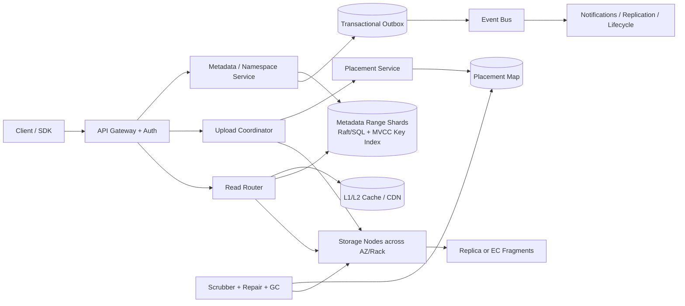

Control Plane 管 bucket、policy、placement、repair plan；Data Plane 让客户端/网关直接并行传输 bytes。否则 central `Chunk Manager` 会成为每个字节都必须穿越的瓶颈。

### 11.7 核心 Flows

**Small PUT / Multipart complete**

1. AuthZ 检查 bucket policy、quota、retention；创建 `UploadSession(epoch=1)`，返回 part endpoints。
2. 每个 part 计算 checksum，按 placement policy 写入至少 3 AZ 的 replicas，或写足 EC 的 `k+m` fragments；节点 `fsync` 后返回 fragment receipt。
3. Coordinator 校验 receipts、part checksum、总大小，生成 immutable manifest。
4. 路由到该 `(bucket,key)` 的 authoritative range owner，在单 shard transaction 中插入 `ObjectVersion`、CAS `ObjectHead.current_version`、更新本地 covering `KeyOrderIndex` 并写 `Outbox`。只有这一步 commit 后 object 对外可见。
5. 若客户端在第 2 步后断线，provisional chunks 没有可见 manifest，TTL 到期由 GC 清理；若 complete 重试，idempotency record 返回原 version。

**GET Range**

1. 读取 current/version metadata；检查 tombstone、expiry、policy epoch。
2. 根据 range 在 manifest tree 定位 extents；批量查询 placement。
3. 按同 AZ、rack load、recent latency 选 replica；并发读取，超过 hedge threshold 才发第二份，避免无脑 3× 流量。
4. 校验 chunk checksum，拼接 range；坏片立即隔离并投递 repair event。

**LIST prefix**

1. `KeyOrderIndex` 按 bucket + prefix 做有界 range scan。
2. Metadata timestamp oracle/consensus 先给本次 LIST 一个 `read_timestamp`，所有 range shards 以 MVCC 服务该 snapshot；continuation token 加密签名并包含 `read_timestamp/index_generation/per-shard cursor`，保证分页不会因并发写重复/跳项。
3. 对百万级单 prefix 做 adaptive range split；聚合器 k-way merge，不把完整目录载入内存。

### 11.8 Deep Dive A：原子可见性、幂等与失败窗口

“Blocks first, metadata last”方向正确，但只说 `2/3 quorum` 不够：

- 每次 upload 有 `upload_id + epoch`，每个临时 chunk path 包含 epoch，防旧 coordinator 写入新 attempt。
- fragment receipt 绑定 `chunk_id, checksum, placement_epoch, node_id`，不能凭客户端声称已上传。
- manifest commit 是唯一 visibility point；current pointer 用 CAS，处理同 key 并发覆盖。
- `Outbox` 与 manifest 同事务。Relay 崩溃会重复 publish，但消费者按 event_id 幂等。
- Coordinator 的本地 WAL 不是高可靠真理。上传 intent 必须在 replicated metadata store；本地日志只能加速 recovery。

### 11.9 Deep Dive B：Durability 不是“副本数”的同义词

Durability 必须定义 failure model：disk、node、rack、AZ、region、software bug、operator delete、bit rot 是否相关。

- placement 强制 failure-domain anti-affinity；禁止 3 份副本落同 rack/PDU。
- checksum 在 client、ingress、disk read 三处验证；metadata 也有 checksum/version。
- continuous scrubbing 按风险/年龄采样，发现 corrupt fragment 后从健康片重建。
- repair priority 由剩余冗余度、对象价值、failure correlation 决定；设置 repair bandwidth budget，防止故障时 repair traffic 挤死用户流量。
- delete/versioning/object lock 防人为误删；备份和跨 region copy 防 control-plane corruption。
- 用 `Annualized Loss Probability` 或 `MTTDL simulation` 校验目标；不能从“2/3 ACK”直接推出 11 nines。

EC 适合大且冷的 object；小 object 可先 3× replication，compact 成大 segment 后转 EC，避免 read-modify-write 与小片数量爆炸。

### 11.10 Deep Dive C：Metadata、LIST 与 Hot Prefix

源文档用 `path_prefix consistent hashing` 同时声称均匀分布和高效 list，这两者冲突：hash 适合 point lookup，lexicographic range 才适合 prefix list。

本设计明确选择 **authoritative range partitioning**：`ObjectHead`、同 key 的 versions、本地 covering order index 与 Outbox 都由 `(bucket_id,key)` 所在 range owner 管理。Point lookup 先查缓存的 partition-boundary map，仍是一次 shard RPC；边界变更由带 epoch 的 partition directory 发布。这样 `PUT/DELETE/HEAD` 与单 key state 同 shard 强一致，`LIST` 则跨连续 ranges 在统一 MVCC `read_timestamp` 上扫描。

若改选 hash primary，则 strong LIST 必须为 hash row + range index 引入跨 shard serializable transaction/2PC；否则只能把 LIST 降为 eventual。本文不走这条路径。热点 prefix 用 dynamic range split、virtual ranges 和 bounded k-way merge，不给 key 随机加盐破坏排序；单个极热 key 仍由一个 owner/CAS 串行更新。

### 11.11 Deep Dive D：读热点、缓存与长尾

- immutable `version_id -> bytes` 可长 TTL；但 `key -> current version`、ACL、tombstone 会变，必须短 TTL/主动 purge/version check。
- CDN key 必须包含 `bucket, key, version_id, range, encoding`；授权对象使用 signed capability，避免公共 cache 泄露私有数据。
- hot object 在 cache miss 时用 `singleflight/request coalescing`，防 thundering herd。
- parallel fetch 有 bounded concurrency；大 object 不是“几百块全部同时抓”，只抓当前 range/read-ahead window。
- hedged read 只在 p95/p99 阈值后发备份，且有全局 hedge budget。

### 11.12 Deep Dive E：Dedup、Encryption 与租户隔离

全局 plaintext hash dedup 会泄露“某内容是否存在”，还让跨租户删除/refcount 变成安全高风险事务。默认采用 tenant-scoped chunk identity，或干脆不做跨租户 dedup。

- 每 object/version 使用随机 `DEK` 做 AES-GCM；KMS 管理的 tenant `KEK` 包裹 DEK（Envelope Encryption）。
- 若 dedup 与 encryption 同时需要，可在同 tenant 内做 convergent scheme，但要明确确认攻击与密钥轮换代价。
- `ref_count` 更新必须与 manifest 引用建立/删除原子关联；GC 还需 mark-and-sweep 二次确认，不能仅相信可能漂移的计数器。
- pre-signed URL 绑定 method、bucket/key/version、expiry、content hash、最大长度；服务端使用 policy epoch 处理紧急吊销。

### 11.13 Consistency、Backpressure、Multi-Region 与 DR

**Consistency**

- single-region metadata range shard 用 Raft/consensus leader 或同步 SQL replica；`PUT/DELETE/HEAD` 走 key 的单一 authoritative owner，`LIST` 跨相邻 owners 读取同一 MVCC `read_timestamp`，因此仍提供 snapshot-strong pagination。
- data ACK 需要满足 placement policy；metadata commit 不能指向不足冗余的 fragment set。
- overwrite 产生新 version；读者要么看到旧完整 version，要么看到新完整 version，绝不看到拼接中间态。

**Backpressure**

- per-tenant request/byte quota、in-flight multipart quota、storage-node disk queue watermark。
- overload 时优先拒绝新 multipart/initiate，保留 `GET/HEAD` 与正在 complete 的上传。
- repair/lifecycle/replication 使用独立 priority lane 和 bandwidth token bucket。

**Multi-Region**

- 基础版：bucket 有 `home_region`，写入单 region；对象 commit 事件异步复制到 secondary，RPO 例如 < 5 min、RTO < 30 min。
- 强保护版：ACK 前把 metadata journal 与足够数据片同步落到 paired region，可做到 RPO=0，但 WAN latency 和 egress cost 显著上升。
- failover 前 secondary 必须追上 `commit watermark`；落后时保持 read-only 或拒绝新写，不能两个 region 同时接受同 key 写入后再 LWW。

**DR**

- 定期恢复演练验证 metadata backup、manifest、KMS grants、DNS/failover runbook。
- region loss 后先恢复 metadata safety watermark，再开放读取；repair backlog 清零前限制大规模新写。

### 11.14 Security、Observability 与 Cost

**Security**：IAM least privilege、bucket policy、KMS audit、mTLS service identity、WAF/abuse quota、malware scanning hook、object lock/legal hold、access log immutable retention。日志中不记录 object payload 或完整 secret URL。

**Golden Signals**

- `put_commit_latency`、`time_to_first_byte`、range throughput、LIST scan amplification。
- under-replicated bytes、corrupt fragments、repair age、scrub coverage、placement-domain violations。
- metadata quorum health、manifest commit conflicts、orphan provisional bytes、GC false-positive guard。
- cache hit ratio 按 bytes 而非只按 request；hot-key concentration、egress by tenant。

**Cost levers**

- EC vs replication、hot/warm/cold tier、small-object compaction、cache egress savings。
- 注意 EC repair/read amplification、跨 region replication、LIST scan、KMS request 都可能成为隐形成本。

### 11.15 Trade-offs 与演进路线

| 阶段 | 方案 | 何时升级 |
|---|---|---|
| V1 | 单 region、3 AZ、3 replicas、SQL metadata、multipart | 数十 PB 以内先换简单性 |
| V2 | metadata 分片、ordered LIST index、CDN、small-object compaction | hot prefix、metadata/write QPS 成瓶颈 |
| V3 | EC、自动 placement/repair、cross-region async | 容量成本与 region DR 成核心 |
| V4 | dual-region synchronous tier、policy epoch、tiered storage | 受监管客户要求 RPO=0/紧急吊销 |

### 11.16 高频 Follow-up Q&A

**Q1：为什么不能先写 metadata 再慢慢复制 bytes？**  因为会暴露指向不存在/不完整数据的 visible object。先形成满足 durability policy 的 fragment set，再原子提交 manifest。

**Q2：2/3 replica ACK 是否足够？**  它只表示两个节点确认，不代表跨 failure domain，也不代表 region disaster、bit rot、软件误删安全；ACK 条件必须包含 placement policy、checksum 和持久化语义。

**Q3：如何支持同 key 并发覆盖？**  每次覆盖创建 immutable version，current pointer 通过 expected version/CAS 更新；冲突返回 `412 Precondition Failed` 或明确 last-writer policy。

**Q4：为什么不对每条 path 上 Zookeeper lock？**  每次 mutation 的外部协调成本和 watcher 数会限制规模。优先用 shard owner + unique constraint/CAS；跨 shard 操作才使用有 fencing 的 workflow。

**Q5：缓存真的永不失效吗？**  只有 `content hash/version -> bytes` 可近似永久；`key -> current version`、权限、封禁、删除都必须失效或携带 epoch。

### 11.17 60 秒总结

“这是 object store，不是 POSIX 文件系统。我把 metadata、immutable manifest、physical fragments 分开。上传先让 part 跨 failure domains 持久化并校验 checksum，之后用 metadata shard 的条件事务一次性提交 version/current pointer/outbox，所以用户只会看到完整对象。读取根据 Range 定位 extents，批量查 placement，做 topology-aware parallel read 和受预算约束的 hedging；LIST 由有序 key index 提供 snapshot-stable pagination。容量上，200 PB 用 3 replicas 是 600 PB raw load、按 20% free-space 需部署 750 PB；12+4 EC 同样保留 20% free-space 约需 333.4 PB。Durability 还依赖 scrubbing、repair、versioning、跨 region 与恢复演练，不由副本数口头保证。热点走 CDN/cache，但 current pointer、ACL 与 tombstone 仍需 epoch/invalidation。”

---

---

## 12. Design a URL Shortener：短链生成、全球 Redirect 与 Analytics

### 12.1 题意、边界与 Source digest

> **Source digest — `design url.docx`**：吸收了 Base62 空间推导、100M creates/month、10B clicks/month、302 vs 301、range allocation、custom alias unique constraint、cache-aside、异步 click analytics、Raw + Aggregate 双轨与 workflow-specific CAP。源文件含 2 张 Word table、没有内嵌图片；所有架构为正文 ASCII flow。本文修正了 `62L` 漏指数、年增长算错、Base62 被称为“密文”、Redis 50 ms、302“100% 捕获点击”、async analytics 无丢失保证等问题。

范围：创建随机/系统 alias、自定义 alias、redirect、disable/expire/ban、基本 analytics、全球低延迟、多 region。

非范围：完整广告归因、通用网页爬虫、浏览器实现、复杂企业协作权限。

先问：同一 long URL 是否必须复用同一 alias？通常 **不复用**，因为不同用户需要独立 owner、expiry、campaign、policy 和 analytics。Destination 是否可变？本文允许 versioned update，但安全 takedown 必须快速生效。

一句开场：**“这是 read-heavy key-value system，但 Staff+ 难点不在 KV，而在 alias allocation、global cache consistency、hot-link protection、abuse/takedown 以及 analytics 不污染 redirect critical path。”**

### 12.2 FR、NFR 与 SLO

**Functional Requirements**

1. 创建系统 alias 或 custom alias；支持 idempotency、expiry、owner。
2. `GET /{alias}` 返回 redirect；disabled/expired/banned 返回明确页面/status。
3. owner 可更新 destination（产生 version）、disable/delete；alias 默认永不复用。
4. 异步收集 click event，提供按天/国家/device/referrer aggregates。
5. abuse scan、rate limit、takedown、preview/interstitial。

**NFR / SLO**

| 维度 | 目标 |
|---|---|
| Redirect availability | 99.99% |
| Redirect latency | global edge p95 < 50 ms；regional cache hit p99 < 20 ms |
| Creation | p99 < 300 ms；custom alias uniqueness strong |
| Consistency | create 后 owner read-your-write；disable/ban 全球 p99 < 5 s，高危可 fail closed |
| Analytics | 不阻塞 redirect；普通统计 freshness < 5 min，允许 bounded loss/duplication并公开语义 |
| Security | no alias takeover/reuse；malware/phishing/takedown；privacy retention |

### 12.3 容量与 Alias 空间计算

源假设：`100M new links/month`、`10B redirects/month`，读写约 100:1。按 30 天：

- create average：`100M / (30×86,400) = 38.6 writes/s`；10× 峰值约 `386/s`。
- redirect average：`10B / (30×86,400) = 3,858 reads/s`；10× 峰值约 `38.6k/s`。
- redirect response 按 1 KB headers/body：峰值 egress 约 `38.6 MB/s`；真正压力通常来自全球 latency、hot key 和 bot traffic，而非总字节。
- mapping 按 1 KB：`100M × 1 KB = 100 GB/month`，约 `1.2 TB/year raw`；10 年 12 TB，3 replicas 36 TB（未含 index）。
- click event 按 200 B：`10B × 200 B = 2 TB/month raw`；4:1 压缩约 0.5 TB/month。原始 click 不应放主 mapping DB。

Base62 容量必须写成幂：

| 长度 L | 空间 `62^L` | 结论 |
|---:|---:|---|
| 5 | 916,132,832 ≈ 0.916B | 不足一年增长 |
| 6 | 56,800,235,584 ≈ 56.8B | 数学上可约 47 年，但运营保留/碎片空间有限 |
| 7 | 3,521,614,606,208 ≈ 3.52T | 默认推荐，10 年 12B 仅占约 0.34% |
| 8 | 218,340,105,584,896 ≈ 218T | 空间更宽，URL 多 1 字符 |

源文档把 `100M/month` 写成“一年 1.2 亿 ×12”；正确是 `100M × 12 = 1.2B/year`，10 年 `12B`。

### 12.4 API 与 Event Contracts

```http
POST /v1/links
Idempotency-Key: campaign-123
{
  "destination":"https://example.com/products/7?src=social",
  "custom_alias":null,
  "expires_at":"2027-01-01T00:00:00Z",
  "redirect_code":302
}
```

响应：`201 {alias, short_url, link_version, state, destination_hash}`。同 idempotency key + request hash 返回同 alias；hash 不同返回 409。

```http
GET   /{alias}
PATCH /v1/links/{alias}      # If-Match: link_version
POST  /v1/links/{alias}:disable
GET   /v1/links/{alias}/analytics?from=...&to=...
```

Custom alias 先做 UX availability check，但真正抢占是 storage unique insert；失败 `409 ALIAS_TAKEN`。Alias canonicalization 明确大小写：系统生成 Base62 可 case-sensitive，自定义可统一 lower-case 并保留 reserved words。

事件：

```json
{
  "event_id":"01J...",
  "type":"LinkStateChanged",
  "alias":"aZ91kLm",
  "link_version":7,
  "state":"BANNED",
  "safety_epoch":12,
  "changed_at":"..."
}
```

```json
{
  "event_id":"click-...",
  "alias":"aZ91kLm",
  "link_version":6,
  "edge_region":"iad",
  "occurred_at":"...",
  "country":"US",
  "device_class":"mobile",
  "referrer_domain":"social.example",
  "privacy_flags":{ "sampled":false }
}
```

### 12.5 数据模型、Partition、Index、TTL 与状态机

| 实体 | 字段 | Partition / TTL |
|---|---|---|
| `AliasMapping` | alias、owner、current_version、state、expiry、safety_epoch | PK alias；strong unique；永不物理复用 |
| `LinkVersion` | alias、version、destination、redirect code、created_by | immutable；unique `(alias,version)` |
| `IdempotencyRecord` | owner、key、request hash、alias/result | TTL 至少覆盖 client retry/业务窗口 |
| `AliasRangeLease` | allocator、range、epoch、next id | 系统 alias Hi/Lo；未用 range 可永久形成 gap |
| `Takedown` | alias/domain、reason、policy version、state | safety index；高优传播 |
| `Outbox` | state-change event | 与 mapping transaction 同 shard |
| `ClickEvent` | event、alias/version、time、dimensions | stream/object/OLAP 按 date+alias hash；无 relational FK hot path |
| `ClickAggregate` | alias、time bucket、dimensions、count | eventual materialized view |

状态机：

```text
PENDING_SCAN -> ACTIVE -> DISABLED | EXPIRED | BANNED
                    |        |          |
                    +--------+----------+-> TOMBSTONED -> PURGED_METADATA(optional)
```

Alias 字符串本身不再分配给另一 owner。否则浏览器/CDN/聊天历史里的旧 cache 会被新 owner 劫持，形成 alias takeover。

### 12.6 Architecture

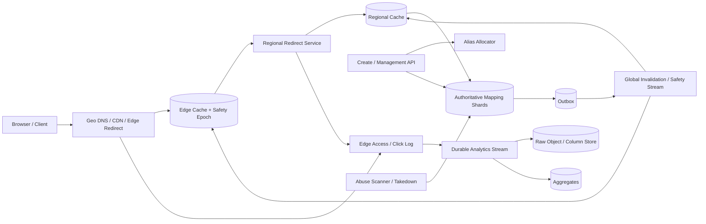

### 12.7 核心 Flows

**Create**

1. Auth/quota；校验 `http/https` scheme、URL 长度与 canonical display，异步/同步 risk scan 按产品等级。
2. 系统 alias：从本地 range 取 numeric id，经可逆 permutation/obfuscation 后 Base62；custom alias 直接尝试 unique insert。
3. 单事务写 AliasMapping、LinkVersion、IdempotencyRecord、Outbox。
4. 返回后 owner 请求在 mapping 尚未全球复制时，可由 session token 路由 home region，提供 read-your-write。

**Redirect**

1. Edge 检查 local safety denylist/epoch；命中 active mapping 且未 expiry，立即返回配置的 3xx。
2. miss 时查 regional cache -> authoritative mapping；使用 singleflight 合并同 alias miss。
3. cache value 包含 state、destination、link_version、expiry、safety_epoch；negative entry 短 TTL。
4. click/access event 从 edge durable logging pipeline 异步采集；redirect 不等待 OLAP。

**Disable/Ban**

1. authoritative transaction 递增 `safety_epoch`、写 tombstone/outbox。
2. 高优 stream 推 edge/regional purge；控制面等待目标覆盖率/critical regions ACK 后才报告“global takedown complete”。
3. 未达到 required epoch 的 cache node 对高危 alias fail closed 或回源校验。

### 12.8 Deep Dive A：Alias 生成、碰撞与可枚举性

**Range allocation/Hi-Lo**

- Central allocator 一次发 10k–1M id range，worker 本地自增；降低协调。
- crash 会浪费 gap，但 uniqueness 不受影响；range lease 有 allocator epoch，禁止重复分配。
- 直接 Base62 递增 ID 可枚举，Base62 只是编码，不是 encryption。可先通过 keyed permutation/Feistel-like mapping 或加入随机 bits，再 Base62。

**Random alias**

- 7-char 空间 3.52T；在 12B 总对象时 occupancy 0.34%，单次随机碰撞概率仍低，但 birthday collisions 会必然发生，所以必须 unique insert + retry。
- 随机分散 shard/hot prefix且不易枚举；代价是碰撞 retry、RNG 与 lookup。

**Snowflake**

- 无中央 range但 64-bit ID Base62 最多 11 chars，且依赖 clock/node-id 管理；若 7-char 是硬产品要求不合适。

决策：默认随机/obfuscated range + DB unique。Custom alias 不需要 distributed lock；unique constraint 才是最终仲裁。

### 12.9 Deep Dive B：Cache、Hot Key、Stampede 与 Takedown Safety

源文档称 Redis p95 50 ms 是“极速”，同 region Redis 正常应是低个位毫秒；50 ms 更像全球 edge budget。

- cache key `(domain,alias)`；value 带 link/safety version，不只 destination。
- active immutable version 可长 TTL；current pointer/state 短 TTL并主动 invalidation。
- disabled/banned 用 tombstone negative cache，TTL 不可过短，且 alias 永不复用。
- cache miss singleflight、probabilistic early refresh、jittered TTL 防 stampede。
- celebrity link 会形成单 Redis shard/network hot key；在 CDN/edge 多点复制，regional cache local replication，响应可直接在 edge 生成。
- cache outage 时用 circuit breaker；允许 stale active mapping 只适用于普通 link。安全 denylist/epoch 未确认时高危路径 fail closed。

不能只在 management transaction 后发一个 best-effort `DEL` 就声称全球秒级一致；multi-region purge 需要 versioned event、ACK coverage、replay 和 cache 节点 epoch health。

### 12.10 Deep Dive C：301/302/307/308 与 Analytics 语义

- `301/308` 可被长期缓存，降低 origin QPS/成本，但 destination 更新、takedown 与 click visibility 更弱。
- `302/307` 通常让请求更常回到服务；307/308 明确保留 method，但短链入口应只接受 GET/HEAD。
- 对可变/需要 analytics 的 link 默认 302 +合理 `Cache-Control`；对 immutable documentation link 可允许 301/308。
- 302 并不能“100% 捕获点击”：browser cache、bot prefetch、chat unfurl、retry、ad blocker、用户断网都会造成 over/under count。指标应叫 redirect requests/qualified clicks，并定义 bot filtering 与去重窗口。
- `HEAD`/preview bot 不应与真实 browser GET 等价计数；可记录 event type 再由 analytics 分类。

### 12.11 Deep Dive D：Analytics 不阻塞 Redirect，又不假装零丢失

选择明确的数据质量等级：

1. **Best-effort product analytics**：Edge access logs 异步批量上传；极端 edge crash 可有少量 loss，但 redirect latency 最低。
2. **Durable billed analytics**：Edge/local agent 先写 bounded disk WAL/replicated log再认为 event accepted；成本和 tail latency更高。若计费必须准确，可把计费信号与 redirect 分成独立 contract，而非悄悄 fire-and-forget。

数据链：`edge log -> durable stream -> raw immutable partitions -> stream/batch aggregate -> dashboard`。

- event_id/edge sequence 去重；at-least-once consumer 用 idempotent aggregate或按 raw 重算。
- raw 按 event date/region 分区、列式压缩；ClickHouse/OLAP 查询，不在 mapping DB 建 10B/月 FK rows。
- 隐私：IP 截断/哈希、geo 粗化、retention、consent/opt-out、owner 只能看自己 alias。
- dashboard 返回 `data_through` watermark，让用户知道 freshness。

### 12.12 Deep Dive E：Global Read、Create Consistency 与 Multi-Region

- Redirect read 在各 region/edge active-active；mapping/version 通过 global replication 分发。
- Create/custom alias 有 authoritative home/consensus shard，保证唯一。全球强 unique 可用单 home write 或全球 consensus，写 QPS 只有约 39/s average，正确性比微秒 latency 更重要。
- create 后的 first redirect：响应携 home-region/session hint，或等待 mapping 发布到最小 region quorum；否则 owner 可能立即点开得到 404。
- destination update 产生 new version并 purge；读要么旧完整 version，要么新完整 version。
- region failover secondary 必须追 `mapping/safety watermark` 后才接 custom writes；redirect 可用已知安全 cache继续服务。
- analytics 可 region-local accumulate 后汇总，接受 eventual consistency。

### 12.13 Deep Dive F：Abuse、Phishing 与 Open Redirect 风险

- 只允许 http/https；拒绝 `javascript:`, `data:`, credential-in-URL 等危险 scheme/格式。
- canonicalize hostname、IDN/punycode display、homograph detection；保存原始与规范化 destination。
- reputation/malware scan、Safe preview/interstitial、domain allow/deny lists、用户/租户 quota。
- creation API 防 bot/bruteforce；custom alias reserved names、brand impersonation/takedown workflow。
- scanner 若主动 fetch destination，必须使用 SSRF-safe egress，与 Webhook 相同地阻止 private/link-local/DNS rebinding。
- 管理员 ban 有 immutable audit、appeal、two-person control for high-impact domain-wide block。
- redirect response 加安全 headers；日志不记录完整 query 中的 token/PII，可做 parameter redaction。

### 12.14 Consistency、Backpressure、DR 与 Security

**Consistency split**

- alias create/custom claim/state/safety epoch：CP。
- redirect bytes：AP 优先，但不能绕过最新 required safety epoch。
- analytics：eventual，返回 watermark。

**Backpressure**

- creation/analytics overload 不能影响 redirect pool；CPU、thread、queue 分离。
- bot/hot alias per-IP/ASN rate limit；但限流不能让一条热门合法链接被单点误伤，使用 edge distributed controls。
- analytics lag 超阈值可 sample/降 dimensions，不能同步阻塞 redirect。

**DR**

- mapping DB PITR、outbox replay、alias allocator state/range backup、KMS、global denylist恢复演练。
- alias allocator disaster 时宁可暂时拒绝 create，也不重复发 range。
- restore 后校验 unique alias、current version、safety epoch monotonicity。

**Security**：owner authZ、API key rotation、KMS encryption、audit、WAF、DDoS、privacy controls、custom domain certificate lifecycle。

### 12.15 Observability 与 Cost

**Metrics**

- redirect latency/hit ratio by edge；origin fallback、negative hit、hot-key concentration。
- create collision/unique conflict、allocator range waste、idempotency hit。
- invalidation propagation p50/p99、nodes below safety epoch、stale redirect reports。
- 404/expired/banned ratio、destination error sampling、abuse verdict/takedown SLA。
- click stream lag、duplicate/gap、raw-to-aggregate reconciliation、dashboard watermark。

**Cost**

- CDN/edge request、global replication、analytics storage/OLAP、bot traffic通常超过 mapping DB。
- 301 可降成本但损失可变性/analytics；302 提高 origin/edge logging cost。
- 只缓存 hot mapping、压缩 analytics、raw lifecycle、预聚合。不要把所有 10 年 mapping 全塞昂贵 Redis。

### 12.16 Trade-offs、Evolution 与 Follow-up

| 决策 | 选择 | 代价 |
|---|---|---|
| 7 chars | 3.52T space，产品短 | 仍需 collision/unique handling |
| Range IDs | 无碰撞、本地快 | 可枚举、gap；需 obfuscation |
| Random IDs | 不易枚举、分布均匀 | birthday collision + retry |
| 302 default | 可更新/统计 | 更多请求与成本 |
| Edge cache | 全球低延迟/抗 hot key | invalidation/safety 复杂 |
| Async analytics | 保护 redirect | 需声明 loss/dup/freshness |

Evolution：V1 single region DB + cache；V2 range/random allocator、stream analytics；V3 global edge、versioned invalidation、abuse/takedown；V4 active-active reads、home-shard writes、privacy-aware analytics。

**Q1：为什么选 7 位？**  `62^7=3.52T`；10 年 12B 只占 0.34%，给 reserved aliases、tombstones 和增长留空间。6 位数学可用但运营余量小。

**Q2：Base62 是否能防猜？**  不能，它是 encoding。递增 ID 可枚举；需 random alias 或 keyed permutation，并配 rate limit。

**Q3：为什么 alias 不复用？**  防 stale browser/CDN/cache/历史消息把旧 alias 指向新 owner，避免 takeover。

**Q4：ban 后缓存怎么办？**  authoritative safety epoch + high-priority invalidation + edge ACK；低 epoch 节点 fail closed/回源，不只 best-effort DEL。

**Q5：analytics event publish 失败是否拖慢 redirect？**  普通 analytics 不拖，接受声明的 bounded loss；计费级数据另走 local durable log/stronger contract。

### 12.17 60 秒总结

“规模是每月 100M creates 和 10B redirects，平均约 39 writes/s、3.9k reads/s，读写 100:1。7-char Base62 有 3.52T 空间，但 Base62 不是加密；我用 random 或 obfuscated range ID，加 DB unique，custom alias 直接由 unique constraint 仲裁。Redirect 在全球 edge/cache 返回 302，mapping value 带 version、expiry 和 safety epoch；hot link 用多级复制与 singleflight。Disable/ban 不是一个 Redis DEL，而是 versioned invalidation + ACK/fail-closed。Click logs 走独立 durable stream、raw + aggregate，dashboard带 watermark；302 也不等于 100% 人类点击。创建/state 是 CP，redirect AP 优先但不能绕过 safety，analytics eventual。”

---

---

## 13. Design a Webhook Platform：可靠事件路由与出向 HTTP 交付

### 13.1 题意、边界与双文档 Source digest

> **Source digest A — `design woobhook.docx`**：吸收了场景澄清、subscription CRUD/filter/retry policy、event envelope、control plane vs data plane、independent delivery tracking、HMAC、DLQ、hot client/source isolation 与 observability。该文件无内嵌图，架构为 ASCII；Word table 3 张。
>
> **Source digest B — `设计一个 Webhook 系统.docx`**：与 A 高度重合，独有/更完整之处是 queue vs Kafka 的完整四维对比（throughput、fan-out/replay）、明确的 ASCII end-to-end/isolated queue 图，以及格式更完整的 JSON contracts。本文合并两份而不重复章节，并保留这些差异点。该文件无内嵌图，Word table 2 张。

默认设计一个独立的 outbound Webhook Platform：上游业务提交已发生的 domain event；平台按已注册 subscription 做过滤、签名、HTTP delivery、retry、replay 与审计。

先澄清：Webhook 的核心保证通常是 **at-least-once delivery**。外部 HTTP 在“接收方已提交业务事务但 response 丢失”时存在不可判定窗口，发送方无法知道是否已处理。因此 distributed lock、Kafka transaction 或本地 DB transaction 都不能单方面给出 end-to-end exactly-once；正确合同是稳定 `delivery_id/idempotency key` + 接收方 durable dedup。

范围：subscription lifecycle、event ingestion、routing/filter、delivery/retry/DLQ、per-destination ordering 可选、replay、security/SSRF、tenant isolation、多 region。

不展开：上游业务事件如何产生的完整业务系统、接收方内部事务实现、通用 ETL transform 产品。

### 13.2 FR、NFR 与 SLO

**Functional Requirements**

1. 注册/验证/暂停/更新/删除 endpoint；选择 event types 与版本。
2. 接收 event，冻结 subscription revision，产生 logical deliveries。
3. HMAC 签名并 HTTP POST；记录每次 attempt、response、latency、错误摘要。
4. 指数退避、`Retry-After`、circuit breaker、DLQ/manual replay。
5. 查询 event/delivery 状态；轮换 secret；可选 per-key ordering。

**NFR / SLO**

| 维度 | 目标 |
|---|---|
| Ingestion | 1B events/day；durable ACK p99 < 300 ms |
| Delivery latency | healthy endpoint：event accepted -> first attempt p95 < 2 s，p99 < 10 s |
| Availability | ingest/control read 99.99%；dispatch 99.95% |
| Durability | accepted events 不丢；attempt/replay 可审计 |
| Isolation | endpoint/tenant 故障不拖垮其他租户；retry 有 budget |
| Security | TLS、signed payload、replay protection、SSRF/DNS rebinding defense、secret rotation |

### 13.3 容量估算：Fan-out 才是主量级

沿用源文档 `1B source events/day`、峰值 `100k events/s`，补上 fan-out 与 HTTP concurrency：

- 平均 event rate：`1,000,000,000 / 86,400 = 11,574 events/s`。
- 假设平均匹配 3 个 subscriptions：`3B logical deliveries/day`，平均 `34,722 deliveries/s`；峰值约 `300k deliveries/s`。
- payload 平均 4 KB：source payload `1B × 4 KB = 4 TB/day`；不含压缩与副本。delivery body egress 平均约 `34,722 × 4 KB = 139 MB/s`，峰值 `1.2 GB/s`，HTTP/TLS headers 会更高。
- 假设 5% first attempt 失败，失败事件平均再尝试 2 次：retry amplification `1 + 0.05×2 = 1.10`；峰值发送约 `330k attempts/s`。
- 健康端点平均响应 500 ms：按含 retry 的 `330k attempts/s`，Little's Law 得峰值并发 socket `330k/s × 0.5s = 165k`；若 timeout 2 s，最坏在途 `660k`。需 async I/O、连接池、endpoint concurrency cap。
- 当前 delivery 摘要按 250 B：`3B × 250 B = 750 GB/day raw`；attempt amplification 后约 825 GB/day。7 天 raw 约 5.8 TB，3 replicas 约 17.4 TB；旧 attempts 必须转 object/OLAP，不能全放单 PostgreSQL 表。
- 10M subscriptions × 1 KB ≈ 10 GB primary metadata；route index 与 replicas 后几十 GB，适合 memory cache，但 DB 才是 source of truth。

### 13.4 API 与 Event Contracts

```http
POST /v1/subscriptions
Idempotency-Key: ...
{
  "endpoint_url":"https://merchant.example/webhooks",
  "event_types":["payment.succeeded","payment.failed"],
  "filter":{"currency":["USD"]},
  "ordering_key":"data.payment_id",
  "max_in_flight":20,
  "retry_policy":{"max_attempts":8,"max_elapsed_seconds":86400}
}
```

返回 `201`，secret 只在创建/rotate 时显示一次：

```json
{
  "subscription_id":"sub-9",
  "revision":1,
  "state":"PENDING_VERIFICATION",
  "signing_secret":"whsec_...",
  "secret_version":"sv-1",
  "verification_challenge":"..."
}
```

其他 APIs：

```http
PATCH  /v1/subscriptions/{id}       # If-Match: revision
POST   /v1/subscriptions/{id}:rotate-secret
POST   /v1/subscriptions/{id}:pause
GET    /v1/events/{event_id}/deliveries
GET    /v1/deliveries/{delivery_id}/attempts
POST   /v1/deliveries/{delivery_id}:replay
```

推荐上游通过 domain Outbox/Event Bus 接入；若提供 HTTP ingest：

```http
POST /v1/events
Idempotency-Key: producer-event-123
X-Source-Signature: t=...,v1=...
```

```json
{
  "event_id":"evt-123",
  "producer_id":"payments",
  "event_type":"payment.succeeded",
  "schema_version":3,
  "aggregate_id":"pay-456",
  "aggregate_sequence":18,
  "occurred_at":"...",
  "data":{...}
}
```

出向请求：

```http
POST /webhooks HTTP/1.1
Webhook-Event-Id: evt-123
Webhook-Delivery-Id: del-789
Webhook-Attempt: 3
Webhook-Timestamp: 178...
Webhook-Secret-Version: sv-1
Webhook-Signature: v1=<HMAC-SHA256(timestamp.delivery_id.secret_version.SHA256(body))>
Idempotency-Key: del-789
```

### 13.5 数据模型、Partition、Index、TTL 与状态机

| 实体 | 关键字段 | Partition / Index / TTL |
|---|---|---|
| `Subscription` | tenant、endpoint、state、current_revision、policy | hash tenant/sub；endpoint fingerprint index |
| `SubscriptionRevision` | event types、filter AST、secret version、rate/order config | immutable revision；旧 revision 保留到 deliveries 结束 |
| `RouteIndex` | producer/event_type -> subscription ids/revisions | 分片 posting list；由 control change event 更新 |
| `Event` | event id、producer、schema、aggregate seq、payload URI/hash、routing epoch | unique `(producer,event_id)`；时间分区；append-only |
| `Delivery` | delivery id、event、subscription revision、destination snapshot、state、next_attempt | unique `(event_id,subscription_id,revision)`；按 home shard |
| `Attempt` | delivery、attempt no、request hash、status/response/latency | append-only；`(delivery_id,attempt_no)` unique；冷热分层 |
| `RetryBucket` | due second/minute、shard、delivery id | durable timer wheel；不是 broker sleep thread |
| `SecretVersion` | KMS ciphertext、valid_from/to、state | secret 不明文落 DB；overlap rotation window |
| `Outbox` | event id、aggregate、payload | 与 subscription/delivery transition 同事务 |

`Delivery` 保存 endpoint URL、subscription revision、secret version 的 **snapshot**。否则用户更新 URL/secret 后，旧 event 会被不确定地发到新地址，既破坏审计又可能泄密。

状态机：

```text
Subscription: PENDING_VERIFICATION -> ACTIVE -> PAUSED -> DISABLED/DELETED
Delivery:     PENDING -> READY -> IN_FLIGHT -> SUCCEEDED
                            |          |       -> RETRY_WAIT -> READY
                            |          +------> PERMANENT_FAILURE -> DLQ
                            +-----------------> CANCELLED/EXPIRED
```

claim 使用 `attempt_epoch/lease`；terminal CAS 当前 epoch。重复 worker 可能短暂并发，但同一个 `attempt_no` 只能有一个 authoritative result，接收方仍按 delivery id 去重。

### 13.6 Architecture

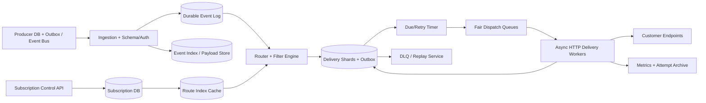

Control Plane 管 subscription、secret、policy；Data Plane 处理 event、fan-out、HTTP。HTTP worker 只拿 scoped secret handle，不把所有 tenant secret 常驻内存。

### 13.7 核心 Flows

**Subscription registration**

1. AuthZ、quota、URL canonicalization；只允许 `https` 和受支持端口。
2. SSRF-safe resolver 解析并检查目标，不允许 private/link-local/loopback/control-plane address。
3. 生成 secret version，经 KMS envelope encryption 存储；发 challenge request。
4. challenge 成功后 CAS `PENDING -> ACTIVE`，发布 RouteIndex change；secret 只显示一次。

**Event -> deliveries**

1. Ingest 验 source signature/schema/size，读取该 tenant/producer 当前已激活的 `subscription_catalog_epoch`，把它与 Event 一起 durable 存储后 ACK。
2. Router 按 `(producer,event_type)` 取 candidate revisions，执行受限 filter AST。
3. 对每个 match 以 unique key 批量创建 Delivery，并冻结 destination/secret/policy snapshot。
4. Delivery Outbox 进入 fair dispatch；fan-out 巨大时分页 materialize，有 cursor 与 quota，不在一个事务插百万行。

**HTTP attempt**

1. Dispatcher 检查 tenant、endpoint token bucket、circuit state 与 optional ordering lane。
2. claim attempt epoch，重新安全解析 DNS，选择经验证 public IP，连接时防 DNS rebinding。
3. 以 `timestamp + "." + delivery_id + "." + secret_version + "." + SHA256(exact_body_bytes)` 作为唯一 canonical string 计算 HMAC 后 POST；记录 request hash 和 response metadata。
4. 2xx success；retryable response 进入 durable RetryBucket；permanent error/DLQ；timeout 是 ambiguous failure，重试仍使用同 delivery id。

### 13.8 Deep Dive A：从业务事务到 Event 的 Atomicity

Webhook 平台自身可靠还不够；若支付 DB commit 后生产者没发 event，平台永远不知道。

推荐 `Transactional Outbox`：业务聚合更新与 outbox event 同数据库事务；relay at-least-once 发到 durable log。平台对 `(producer,event_id)` dedup。若上游使用 CDC，也要保留 source log position 和 schema evolution。

不能用跨业务 DB + Kafka 的“先 publish 再 commit”或“先 commit 再 publish”裸双写；两种顺序都有 ghost/lost event 窗口。Kafka transaction 只覆盖 Kafka 内资源，不自动包含任意业务数据库。

### 13.9 Deep Dive B：Subscription Routing、Filter 与 Fan-out

- RouteIndex 是 derived state；DB revision 是真理。每次 subscription 变更递增 tenant/producer-scoped `subscription_catalog_epoch`，index entry 携 revision 与 activation interval。Event 冻结 ingest 时看到的 routing epoch，Router 只匹配在该 epoch 已生效的 revision；这样并发注册/暂停不会因消费时机不同而漂移。`ACTIVE` 响应要等 serving routers 达到该 epoch，或明确返回 `activation_pending`。
- filter 编译为受限 AST/bytecode，限制字段、深度、CPU；不能运行用户任意代码。
- schema version 变化时用 compatibility contract；未知字段/版本是 fail closed 还是 skip subscription 要显式。
- 巨型 fan-out 采用 cursorized batches；每批 delivery unique insert，可重启重放。
- pause 语义必须产品化：`pause_new_only` 还是连 pending/retry 都暂停；delete 是否取消已 materialized delivery。默认 pending 绑定 revision，pause 停 dispatch但不丢，resume 继续。
- secret rotate 允许 old/new verification overlap；每个 Delivery 固定 secret version，避免 in-flight 请求突然无法验签。

### 13.10 Deep Dive C：At-least-once、Ordering 与 Exactly-once 边界

**At-least-once**

- stable `delivery_id` 在所有 retry 不变；attempt number 变化。
- receiver 推荐在同一业务事务中 insert unique delivery id + 应用 side effect；若已存在直接返回 2xx。
- sender 在 response 丢失时必须重试，宁可 duplicate，不能猜测 success。

**Ordering**

- 只承诺某 `(subscription_id, ordering_key)` 的顺序，不做全局 total order。
- Producer 提供 `aggregate_sequence`；router 按 key partition。
- strict mode：sequence N 未 success 前 N+1 不发送，代价是 head-of-line blocking。
- relaxed mode：并行发送，receiver 按 sequence buffer/drop stale；适合吞吐优先。
- retry queue 不可绕过 ordering gate；partition rebalance 后 owner epoch 防止旧 consumer 取得新的 send permit，但已发出的 HTTP 仍可能与新 owner retry 重叠，因此 ordering/duplicate correctness 最终仍依赖 stable `delivery_id`、aggregate sequence 与 receiver dedup。

**Exactly-once**：只有发送者与 receiver sink 共享事务/协议时才可能做 bounded exactly-once。普通 HTTP 场景最诚实的合同是 at-least-once + idempotent consumer。

### 13.11 Deep Dive D：Retry、HTTP 语义、Backpressure 与 Hot Endpoint

源文档把所有 4xx 都判 permanent，不准确：

| 响应 | 默认策略 |
|---|---|
| 任意 2xx | success；可配置只接受特定 code |
| 301/302/307/308 | 默认不自动 follow；若允许，每一跳都重新 SSRF 校验且限制 hop |
| 400/405/422 | permanent，进入 failed/DLQ |
| 401/403 | 通常配置/secret 问题；短次数重试并通知 owner，避免无限轰炸 |
| 404/410 | 可先有限重试；持续 410 自动 disable subscription |
| 408/425/429 | retryable；尊重合法 `Retry-After`，设上限 |
| 5xx / connect reset / timeout | retryable ambiguous failure |

Backoff 用 full jitter，并有 `max_attempts + max_elapsed + expiry`。Endpoint circuit breaker 依据 rolling latency/error，`OPEN -> HALF_OPEN -> CLOSED`；half-open 探针不让所有 backlog 同时恢复。

隔离层次：固定 dispatch shards、per-tenant virtual queue、per-endpoint max in-flight/token bucket、priority lane、top customers 可 dedicated pool。不能为 10M endpoint 各建物理 SQS queue；那是 control-plane 爆炸。

过载时保护 ingest durable ACK 与成功 completion；降低 low-priority first attempt，暂停 bulk replay，retry 使用 budget。监控 oldest event age 而不只看 depth。

### 13.12 Deep Dive E：SSRF、DNS Rebinding、HMAC 与加密

Webhook 平台天然是 SSRF proxy，安全远不止 TLS：

- URL 只允许 HTTPS、规范化 IDN/punycode、限制端口、禁止 userinfo；对 hostname 每次发送前解析。
- 拒绝 RFC1918、loopback、link-local、multicast、cloud metadata、内部 service ranges；连接 socket 必须使用已校验 IP，防校验后 DNS rebinding。
- redirect 默认关闭；若开启逐跳重新校验。独立 egress proxy/network namespace，不可访问 control plane。
- TLS 验证 hostname/certificate；可选 mTLS 和 customer CA policy。
- HMAC 是完整性/认证，不是加密。全系统唯一 canonical string 为 `timestamp + "." + delivery_id + "." + secret_version + "." + SHA256(exact_body_bytes)`；receiver 对同一 exact bytes 做 constant-time 比较。
- 防 replay：receiver 校验 timestamp window并 durable dedup delivery_id；只检查 5 分钟 timestamp 不够，因为窗口内仍可重放。
- secret 在 KMS/HSM 保护下 envelope-encrypted；支持双版本 overlap、审计、紧急 revoke。
- 高敏 payload 若要端到端机密性，用 hybrid encryption/JWE 思路：随机 AES-GCM DEK 加密 body，再以 recipient public key 包裹 DEK；不要用 RSA 直接加密任意大 JSON。

### 13.13 Consistency、Multi-Region 与 DR

**Consistency**

- subscription revision 更新/secret rotation 需要 strong consistency；RouteIndex eventual 但 activation 使用 watermark，不能在验证前发送。
- Event append-only；Delivery current state 由 home shard CAS；Attempt append-only。
- analytics/search eventual；用户查询可同时返回 authoritative current state 与稍迟的 aggregates。

**Multi-Region**

- 每个 subscription/delivery shard 有 home region；ingest 可全球接入，event log 跨 region复制。
- Router 可多 region，但 unique Delivery owner 决定只 materialize 一份；HTTP dispatch 的 claim/pre-send permit 也由 home owner epoch 授权。Epoch 能阻止旧 region 发起新的 attempt，却无法撤回已经越过网络边界的 HTTP，因此 failover 仍可能产生同 `delivery_id` 的 duplicate，接收方必须 durable dedup。
- region failover 前 secondary 追上 `delivery safety watermark`；旧 region 的 worker 失去 epoch。否则两个 region 会同时重试同 endpoint。
- endpoint health/circuit state 可异步复制，但 delivery state 必须按声明的 RPO tier；premium 同步 journal 可 RPO=0。

**DR**

- Event payload、Subscription DB、Delivery journal、secret/KMS 都要恢复演练。
- replay 从 immutable event + subscription snapshot 生成新 replay generation；保留 original delivery id 关联，但新 attempt/delivery id 语义要明确，防 receiver 误去重或重复 side effect。

### 13.14 Observability、Cost 与 Abuse

**Metrics**

- ingest durable latency、dedup rate、router candidates/matches、fan-out distribution。
- first-attempt latency、success by attempt、response class、timeout、oldest backlog。
- per-endpoint p50/p99、circuit state、rate-limit wait、ordering gap/HOL age。
- stale epoch rejects、duplicate receiver reports、retry amplification、DLQ age。
- SSRF denial、DNS IP changes、signature/KMS error、secret version use。

**Cost**

- 主要是 HTTP egress/TLS CPU、attempt retention、payload duplication、idle sockets。
- payload 大时 Event 只存 immutable object URI，Delivery 引用同一 body；worker stream body，不复制到 DB。
- connection pooling 仅按安全边界复用；压缩需防 zip bomb，且签名原始传输 bytes。
- attempts 热存 7–30 天，旧历史列式/对象归档；aggregates 供 dashboard。

**Abuse**：tenant event quota、endpoint/domain reputation、payload size、filter complexity、replay quota；防用户把平台当 DDoS 反射器。紧急 kill switch 可按 tenant/domain/IP/event type 停发。

### 13.15 Queue vs Stream、Trade-offs 与 Evolution

两份源文档提出 SQS vs Kafka；更准确的选择依据：

| 需求 | Work Queue | Durable Stream |
|---|---|---|
| 每项只需一个 dispatcher | 原生 visibility timeout/DLQ 简单 | 要消费者状态与 retry topics/timer |
| 多个独立消费者、长期 replay | 需要额外 event archive/fan-out | 原生日志 replay 更合适 |
| per-key ordering | FIFO queue 有边界/吞吐限制 | partition ordering 自然，但 hot key 仍串行 |
| 延迟重试 | 常有原生能力 | 通常配 durable timer，不让 consumer sleep |

常见组合：immutable Event 用 stream/object archive；materialized Delivery 用 work queue + durable DB/timer。Queue 本身并非“一崩就蒸发”，问题是 retention、replay、audit 与 source-of-truth 语义。

演进：V1 DB + managed queue；V2 Event stream、Delivery shard、Outbox、secret rotation；V3 route index、hierarchical fairness、SSRF egress proxy、ordering lane；V4 multi-region owner journal、customer-dedicated pools、hybrid encryption。

### 13.16 Follow-up Q&A

**Q1：Receiver 已处理但返回超时怎么办？**  当作 ambiguous failure，用同 delivery id 重试；receiver 在业务事务中 durable dedup。

**Q2：怎样保证 payment events 顺序？**  只对 `(subscription, payment_id)` 做 sequence；strict gate 会 HOL，或让 receiver buffer/忽略 stale。不能承诺所有事件全局排序。

**Q3：更新 endpoint 后，旧 backlog 发哪？**  Delivery 在 materialize 时冻结 subscription revision/destination；若产品选择“迁移 pending”，必须显式生成迁移操作和审计，不悄悄改地址。

**Q4：为什么不是 Redis 直接做所有 routing/dedup？**  Redis 可缓存和 hot filter，但 subscription truth、event unique、delivery state 需要 durable replicated store。

**Q5：如何防平台访问内网？**  URL/port policy、每次 DNS resolve 后 IP 分类、socket pin verified IP、redirect revalidation、isolated egress proxy 和 network deny rules。

### 13.17 60 秒总结

“我把 immutable Event、logical Delivery、physical Attempt 分开。Producer 先用 transactional Outbox 避免业务 DB 与 event bus 双写丢单；平台 durable ingest 后，按 versioned RouteIndex 找 subscription，并在 materialize 时冻结 endpoint、filter、secret revision。每个 delivery 用稳定 idempotency key做 at-least-once HTTP，timeout 后重试同一 id；receiver 才能在自身事务里完成 dedup。峰值 100k events/s、平均 fan-out 3 意味着 300k deliveries/s；含重试约 330k attempts/s，在 500 ms 平均响应下约 165k 并发 sockets，所以 per-endpoint concurrency、full-jitter retry、circuit breaker、tenant fairness 与 virtual shards 是主轴。安全上每次发送都防 SSRF/DNS rebinding，HMAC 只做认证，不冒充加密。Multi-region 用 delivery home owner + epoch 和 safety watermark 减少重复 claim/new attempt，但已越过网络边界的请求仍可能重复，receiver dedup 才是 correctness 边界。”

---

---

## 14. Design GitHub Actions：分布式 CI/CD Workflow Platform

### 14.1 题意、边界与 Source digest

> **Source digest — `design cicd.docx`**：吸收了 Git push/Webhook 接入、YAML -> DAG、WorkflowRun/TaskNode/TaskAttempt、partitioned queue、Runner sandbox、ephemeral secrets、Outbox、reconciler、retry、real-time logs、artifact/object storage 与公平调度。源文档没有 Word table 或内嵌图片，架构均为 ASCII/text flow。本文补齐 deployment approval、environment lock、cache poisoning、artifact provenance、fork PR secret policy、日志断点续传和精确容量模型。

CI/CD 不是普通 Job Scheduler 的换皮：它还要执行 **不可信代码（Untrusted Code）**，处理 source checkout、build cache、artifact、secret、deployment environment 与可验证 provenance。控制面正确性和数据面隔离同等重要。

范围：

- Git push/PR/manual/schedule trigger；读取触发 commit 上的 workflow definition。
- DAG jobs/steps、matrix expansion、condition、retry/cancel、实时状态与日志。
- hosted/self-hosted Runner、container/MicroVM isolation、short-lived secret/identity。
- artifact/cache 上传下载、retention；deployment approval、environment concurrency。

不展开：Git 对象存储本身、完整 Kubernetes 实现、具体编译器、下游生产服务内部发布策略。

一句开场：**“我会把 event ingestion、workflow compilation、fair scheduling、sandbox execution、logs/artifacts 五条链拆开；所有状态以 versioned run/attempt 为真理，queue 只做信号。真正的 Staff+ 深挖是 untrusted code 隔离、secret scope、cache/artifact provenance，以及 cancel/retry 时如何用 epoch 拒绝旧 Runner 的控制面更新，并对真正的外部 side effect 使用 target fencing 或 idempotency。”**

### 14.2 FR、NFR 与 SLO

**Functional Requirements**

1. 接收 provider webhook，按 pinned commit SHA 读取并验证 workflow YAML。
2. 编译 DAG/matrix，调度满足 dependency 与 resource label 的 jobs。
3. Runner checkout、执行 steps、注入短期凭据、回传 status/log。
4. artifact/cache 上传下载；用户断线后从 sequence/cursor 恢复日志。
5. cancel/rerun；deployment environment approval、single-flight/concurrency policy、rollback hook。

**NFR / SLO**

| 维度 | 目标 |
|---|---|
| Trigger latency | durable webhook ACK p99 < 1 s；event-to-workflow-queued p99 < 10 s |
| Queue latency | 有容量时 ready-to-runner p95 < 5 s；排队时按租户公平 |
| Scale | 10k normal active workflows，设计 envelope 100k；异构 CPU/GPU/OS pool |
| Availability | control API/log read 99.99%；scheduling 99.95% |
| Security | tenant isolation；fork PR 默认无 production secrets；每 job workload identity |
| Durability | run state/terminal logs/artifacts 不因 Runner crash 丢失；缓存不作为真理 |

### 14.3 容量估算

沿用源文档：平均 `10 pushes/s`，workflow 平均 15 分钟，10× burst。

- 活跃 workflow：`10/s × 15 × 60 = 9,000`，约 10k。
- 若 10× 负载持续 15 分钟：`100/s × 900s = 90,000`，设计 100k envelope 合理；瞬时 burst 不应直接等价为持续并发，需 queue 吸收。
- 假设每 workflow 平均 8 jobs、平均 job runtime 300 s：job arrival `10 × 8 = 80 jobs/s`；Little's Law 得平均 `80 × 300 = 24,000 active jobs`。
- 10× 持续峰值理论为 240k active jobs。若平均 2 vCPU/4 GB，需要 `480k vCPU + 960 TB RAM`，显然必须 quota、排队、reserved pool 与 autoscale，不能承诺所有 burst 立即启动。
- 每 job 6 次 metadata mutation：平均 `80 × 6 = 480 writes/s`，峰值约 `4.8k/s`；matrix 大 workflow 需限制 expansion，避免单 run 热分区。
- 假设 active job 平均产生 5 KB/s log：`24k × 5 KB/s = 120 MB/s`，约 `10.4 TB/day raw`；4:1 压缩后 `2.6 TB/day`。10× 峰值 `1.2 GB/s`。
- 假设 20% job 产生 100 MB artifact：`80/s × 20% × 100 MB = 1.6 GB/s`，约 `138 TB/day`；30 天不分层约 4.1 PB，因此 retention、dedup/compaction 与按需 artifact 至关重要。

### 14.4 API 与 Event Contracts

```http
POST /v1/repos/{repo_id}/workflow-runs
Idempotency-Key: manual-...
{ "ref":"refs/heads/main", "commit_sha":"abc...", "workflow_path":".ci/build.yml", "inputs":{} }

GET  /v1/workflow-runs/{run_id}
POST /v1/workflow-runs/{run_id}:cancel
POST /v1/jobs/{job_run_id}:rerun
GET  /v1/attempts/{attempt_id}/logs?after_seq=9182
POST /v1/environments/{env}/approvals
```

Provider webhook envelope：

```json
{
  "provider":"git-provider-x",
  "delivery_id":"d-123",
  "repo_id":"r-9",
  "event_type":"push",
  "ref":"refs/heads/main",
  "before_sha":"...",
  "after_sha":"...",
  "received_at":"...",
  "raw_payload_uri":"obj://ingress/..."
}
```

唯一键是 `(provider, installation_id/repo_id, delivery_id)`；不能只用 `commit_sha`，因为同 commit 可因不同 ref、manual rerun、workflow 或事件类型触发合法的多次运行。

Runner claim：`{attempt_id, attempt_epoch, runner_id, lease_until, workflow_digest, image_digest, token_audience}`。日志 chunk：`{attempt_id, stream, seq_start, seq_end, bytes_checksum, emitted_at}`；chunk 可重复，归档器按 sequence 去重并检测 gap。

### 14.5 数据模型、Partition、Index、TTL 与状态机

| 实体 | 字段 | 关键设计 |
|---|---|---|
| `IngressEvent` | provider delivery id、repo、commit、raw URI、state | durable unique dedup；TTL 后冷归档 |
| `WorkflowSpec` | repo、commit SHA、path、digest、compiled plan | immutable；只信 pinned commit 内容 |
| `WorkflowRun` | run_id、tenant/repo、spec digest、trigger、status | shard `(tenant,run_id)`；status/time index |
| `JobRun` | run_id、job_key、needs_remaining、resource request、state | unique `(run_id,job_key,generation)` |
| `StepRun` | job_run、ordinal、command/action digest、state | UI/provenance；不每行 log 写 DB |
| `Attempt` | epoch、runner、lease、exit、error class、log manifest | append-only attempts；current epoch fenced |
| `Artifact` | digest、size、object URI、producer attempt、expiry | content checksum；ACL 绑定 run/repo |
| `CacheEntry` | scope、cache key、version、manifest digest、expiry | cache 是 hint；不可覆盖 immutable version |
| `EnvironmentLease` | env、deployment_id、epoch、approval state | production 单 owner/fencing |
| `Outbox` | event id、aggregate、available_at | 与 run transition 同事务 |

分片：active run 按 tenant + run；ready queue 不为每 repo 建物理 topic，而用固定 partitions，并在 scheduler 内维护 tenant virtual queues。日志 topic 按 attempt_id hash，artifact 直接写 object storage。历史 run 按月归档，metadata 保留摘要。

```text
WorkflowRun: QUEUED -> RUNNING -> SUCCESS | FAILURE | CANCELLED
JobRun:      BLOCKED -> READY -> CLAIMED -> RUNNING -> SUCCESS
                                        |           -> FAILURE -> RETRY_WAIT
                                        +----------> CANCEL_REQUESTED -> CANCELLED
Deployment: WAITING_APPROVAL -> READY -> DEPLOYING -> VERIFIED -> COMPLETE
                                             |             -> ROLLBACK
```

### 14.6 High-Level Architecture

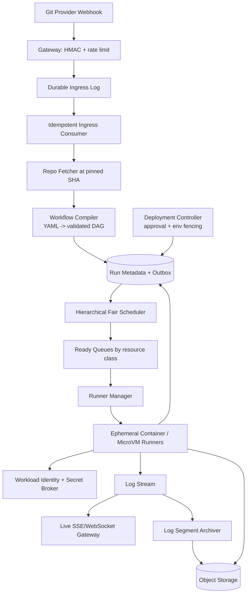

控制面不承载源码、log bytes 或 artifact bytes；Runner 通过 scoped capability 直传 object storage，降低 central orchestrator 带宽瓶颈。

### 14.7 核心 Flows

**Push -> DAG**

1. Gateway 验证 provider signature、timestamp、delivery ID，限流；只有 durable ingress log quorum ACK 后返回 2xx。
2. Consumer 以 unique delivery key 落 `IngressEvent`；重复 webhook 返回已有处理结果。
3. Repo Fetcher 使用 provider installation token 只读拉取 `after_sha` 上的 workflow；不读取移动中的 branch head。
4. Compiler 限制 YAML size、include depth、matrix cardinality、expression CPU；输出 canonical plan digest，做 cycle validation。
5. 单事务创建 WorkflowRun/JobRuns/root ready jobs/Outbox。Queue 重复只造成 claim conflict，不新建 run。

**Job execution**

1. Fair Scheduler 检查 tenant token、resource class、environment/concurrency group。
2. Runner Manager 选 warm runner 或启动 MicroVM；claim 递增 attempt epoch。
3. Runner 获短期 workload identity，checkout exact SHA，验证 action/image digest，按 step 执行。
4. logs 带 seq 流入 durable log bus；artifact 以 checksum 直传 object storage。
5. completion CAS 当前 epoch，释放 quota，DAG Orchestrator 解锁后继；旧 Runner 的迟到状态被拒绝。

**Deployment**

1. Build 产生 signed artifact/provenance；deployment job 引用 digest，而非 mutable tag。
2. Environment Controller 验 approval、branch protection、change window，并申请递增 env lease epoch。
3. deploy/verify/rollback 都携带 epoch。平台管理的 deployment proxy/admission controller 必须在每次 target mutation 校验 env epoch，且云凭据绑定 `{environment,epoch,audience}`、短 TTL/可撤销，此时旧 deployment 恢复后才会被 target 拒绝。若目标系统不支持 fencing，则只能使用 stable deployment idempotency key、desired-state reconcile 与 compensation，不能承诺旧 Runner 完全无法产生 side effect。

### 14.8 Deep Dive A：Webhook 接入、去重与 Replay

源文档建议 Redis 72h 去重并立即 202，但 Redis 不能成为持久正确性边界。正确顺序：

- 先验 HMAC/replay window，再把完整原始 payload 或对象引用写 durable ingress log，拿到 quorum ACK 后才响应 provider。
- durable DB unique key 做最终 dedup；Redis/Bloom 只做 hot duplicate filter。
- `commit_sha + delivery_id` 不是普适 key；key 必须包含 provider/installation/repo，delivery id 只在该命名空间唯一。
- raw event 归档支持 parser bug 后 replay，但 replay 写新的 processing generation，不能伪装成新的 provider delivery。
- overload 时对 provider 返回 429/5xx 让其重试，或先落 cheap durable buffer；不能先 2xx 后再冒险异步落盘。

### 14.9 Deep Dive B：DAG、Matrix 与状态正确性

- `needs` 关系单独存 Edge；不要把 prerequisite ids 仅塞数组，后续索引/条件传播困难。
- dependency completion 用 unique edge-satisfaction record，防重复 runner completion 重复 decrement。
- matrix expansion 先冻结 canonical parameter set 与 `expansion_epoch`，再创建 jobs；设置每 run 最大 jobs/steps/output bytes。
- reusable workflow/action 必须 pin 到 immutable commit/digest；浮动 `@main` 会破坏 reproducibility 和供应链安全。
- retry 是新 Attempt；rerun job 是新 JobRun generation。是否重跑 downstream 明确选择。
- queue/DB Outbox 只提供 at-least-once 信号。所谓 `UPDATE ... WHERE status=ready` 防重复 claim，但 lease expiry 后仍可能重叠执行，所以还要 attempt epoch 和 sink fencing。

### 14.10 Deep Dive C：多租户公平与异构 Runner Placement

物理上为每 organization 建 queue 不可扩展，也会有 hot partition。使用两级调度：

1. tenant virtual queue：并发上限、starts/s、CPU-memory-GPU budget、付费权重。
2. resource pool：Linux/Windows/macOS、CPU architecture、GPU、trusted/untrusted、region；用 DRF/WFQ 选任务，再做 bin packing。

防 starvation：reserved capacity 给高优/production，shared capacity 支持 borrow；priority 加 aging；large job 使用 gang scheduling 或 reservation，避免永远凑不齐 GPU。

Autoscaling 使用 `oldest_ready_age + requested resources + image/cache locality + VM startup time`。预热池减少 cold start，但 warm runner 必须在任务间销毁或强清理，不能为了成本复用有泄密风险的状态。

### 14.11 Deep Dive D：Untrusted Code、Secrets 与 Supply Chain

这是 CI/CD 题的核心 differentiator：

- hosted runner 使用 per-job VM/MicroVM；root inside guest 不等于 host root。启用 seccomp/hypervisor boundary、只读 base image、cgroup quota、metadata-service isolation。
- fork PR 默认拿不到 repository/environment secrets；需要受信 maintainer approval 后才在受控 ref 上执行 privileged stage。
- Secret Broker 根据 `{tenant, repo, workflow_digest, job, environment, attempt_epoch}` 发短 TTL capability；secret 不写磁盘/log/cache，支持 redaction 但不能把 redaction 当唯一防线。
- 更优先发 OIDC-like workload identity，让云端按 audience/claims 换短期 token，减少 long-lived secret。
- egress 默认 deny 或 allowlist；阻止访问 control plane、其他 tenant、link-local metadata。
- action、container、toolchain、artifact 都 pin digest并验证签名；产出 provenance 记录 source SHA、workflow digest、runner image、dependencies、artifact digest。
- cache key 包含 trust domain。fork/untrusted job 不能写入 privileged branch 可读的 cache，防 cache poisoning。

### 14.12 Deep Dive E：日志实时性、保序与背压

Runner 每 0.5–2 秒或达到 size threshold 微批日志，携带单调 seq；本地有 bounded disk spool，网络抖动时先落盘。队列按 attempt_id partition 只保证该 attempt 内顺序。

双路消费：

- Live path：durable stream -> fan-out gateway -> SSE/WebSocket。客户端带 `Last-Event-ID/after_seq` 重连；慢客户端有 per-connection buffer 上限，超限让它转历史读取，不拖住 producer。
- Archive path：将 contiguous ranges 写 immutable `segment-0001.gz`，最后提交 log manifest；对象存储通常不能 append 单文件。

若发现 seq gap，归档器等待 grace period并请求 Runner 重传；Runner 已失联则 manifest 标记 gap。Redis Pub/Sub 可做低延迟 hint，但不能作为唯一历史真理。

日志要做 secret scanning/redaction、单行/总量上限、binary detection。恶意 job 每秒打印 GB 数据时，先 throttle/truncate 并标记，不能让日志成本拖垮平台。

### 14.13 Deep Dive F：Artifact、Cache 与 Storage Semantics

- Artifact 是 immutable、content-addressed、带 producer provenance；DB 只存 manifest/ACL/expiry。
- 上传 multipart，完成时校验 digest；下载 capability 绑定 repo/run/identity/expiry。
- Cache 是 performance hint，不是 build correctness truth。miss 只能变慢，不能让 build 错。
- cache key 需要 OS/toolchain/lockfile/action digest/scope；immutable version 后才原子更新 lookup pointer。
- 热 cache 用 regional SSD，冷 artifact/object log 用 object storage；lifecycle 按 repo policy 清理。
- dedup 默认 tenant-scoped；跨 tenant dedup 可能泄露内容存在性。

### 14.14 Cancel、Timeout、Retry 与 Reconciliation

- Reconciler 用 indexed deadline/lease bucket，不做全表低效扫描。
- timeout/cancel：CAS `CANCEL_REQUESTED`，Runner Agent 收 SIGTERM，grace flush/checkpoint 后 SIGKILL MicroVM；若 host 断网，lease 到期由基础设施回收。
- 迟到 completion 携旧 epoch 被拒；若 external deployment 已部分发生，交给 explicit rollback/compensation workflow，而不是简单标 `skipped`。
- retry 区分 infra error、user code、capacity、policy denial。编译失败不重试；registry 503 可 full-jitter 重试。
- retry budget 同时按 attempt count、elapsed time、tenant cost；耗尽进入可操作的 failed state，不一定用一个 opaque DLQ 隐藏。

### 14.15 Consistency、Multi-Region 与 DR

**Consistency**

- WorkflowRun/JobRun/Attempt/current environment lease 是 authoritative CP state。
- logs/live view、analytics、search index 可 eventual。
- deployment environment 由单 owner + fencing；不要让两个 region 对同 production env LWW。

**Multi-Region**

- webhook 可就近接入 durable global/region log；repo/tenant 有 control-plane home region。
- workflow state journal 可同步 paired region（premium RPO=0）或异步（明确 RPO）。Runner 数据面可各 region 执行。
- failover 要携 run/attempt/environment safety watermark；secondary 未追平时不派新 attempt/deployment。
- artifact/log object 跨 region 复制；调度优先数据 locality，避免大 artifact 跨洋传输。

**DR 演练**：broker replay、metadata PITR、runner-region loss、secret/KMS loss、object manifest restore、deployment lock failover。RTO 不只是 API 恢复，还包括“不会重复 deploy”。

### 14.16 Observability 与 Cost

**Metrics**

- ingress ACK、duplicate ratio、compile latency/error、matrix expansion size。
- queue age by tenant/resource、fairness slowdown、capacity utilization、runner cold start。
- stale epoch reject、lease expiry、cancel latency、reconciler backlog。
- log ingest bytes/s、seq gaps、live fan-out lag、truncation；artifact/cache hit by bytes。
- sandbox escape/security denial、secret request audit、unsigned artifact rejection。
- deployment approval age、environment lock wait、rollback rate。

**Cost**

- 最大项通常是 compute idle/cold-start、artifact/log storage 与 egress。
- levers：bin packing、warm pool 尺寸、spot + checkpoint、log compression/retention、cache admission/eviction、artifact lifecycle。
- 不应为命中率跨 trust domain 复用 cache，也不应为少量冷启动复用未彻底隔离的 runner。

### 14.17 Trade-offs、Evolution 与 Follow-up

| 决策 | 选择 | 原因/代价 |
|---|---|---|
| Container vs MicroVM | untrusted hosted job 优先 MicroVM | 启动慢、成本高，但 boundary 更强 |
| Central vs distributed scheduler | logical global fairness + sharded owners | 兼顾政策统一与吞吐；实现更复杂 |
| Live log store | durable stream + object segments | 比 Redis-only 贵，但可 replay/断点续传 |
| Mutable tag vs digest | digest | reproducible/supply-chain safe；更新流程更显式 |
| Active-active deploy | 不采用 | production safety 优先 single owner + fast failover |

演进：V1 单 region shared runners；V2 durable ingress/outbox、attempt epoch、object artifacts；V3 fair heterogeneous pools、MicroVM、live log stream；V4 multi-region control journal、provenance/attestation、environment policy engine。

**Q1：Webhook 收到后何时返回 2xx？**  验签并得到 durable ingress quorum ACK 后；不是放进进程内存或仅写 Redis 后。

**Q2：Runner crash 会不会双跑？**  可能短暂重叠，所以 lease 之外还有 attempt epoch/fencing；external side effect 还需 idempotency。

**Q3：如何防 fork PR 偷 secret？**  untrusted trust domain 默认无 secret、无 privileged cache write、受限 egress；需要显式批准后在受控 ref/job 中换短期 identity。

**Q4：浏览器断线如何补日志？**  客户端携 after_seq，先从 live retention 补，超窗后从 immutable log segments/manifest 补。

**Q5：为什么不把 prerequisite ids 放一个数组？**  小 DAG 可做缓存，但 authoritative edge/edge-satisfaction 更利于索引、去重传播、动态 fan-out 与审计。

### 14.18 60 秒总结

“触发层先验 provider signature，并在 durable ingress ACK 后响应；delivery ID 由 DB unique key 去重。Fetcher 固定 commit SHA，Compiler 把 YAML/matrix 编成有上限的 immutable DAG。Fair Scheduler 按 tenant 和 dominant resources 分配，Runner 在 per-job MicroVM 中用短期 workload identity 执行；attempt epoch 拒绝旧 Runner 的 metadata completion/checkpoint，平台管理的 sink 还校验 fencing，任意外部 side effect 则必须使用 idempotency/reconciliation。日志用 sequence + durable stream，实时 SSE 和 immutable object segments 双路消费；artifact 绑定 digest 与 provenance，cache 只作 hint且隔离 trust domain。部署再加 approval、短期 epoch-bound credential 与 target admission fencing。源文档的 Redis 去重、CAS 防双跑、S3 append log 都不够，生产正确性靠 durable truth、idempotency、fencing 和明确的安全边界。”

---

---

## 15. Design a Distributed Job Scheduler：定时任务与 DAG 编排

### 15.1 题意、边界与 Source digest

> **Source digest — `Design a Job Scheduler.docx`**：源文件包含两个连续部分：完整 scheduler 主设计，以及 `DAG / remaining prerequisites counter / TaskRun vs JobRun` 深挖。吸收了 immediate/one-time/recurring、`FOR UPDATE SKIP LOCKED`、lease、Outbox、retry/DLQ、多租户 lane、DAG runtime instance、backfill 与 checkpoint 的方向。源文件只有 1 张 Word table、没有内嵌图片；其 ASCII flow 已重画。

本题设计一个通用基础设施：用户提交 immediate、future、cron 或 DAG workflow；平台在正确时间挑选可运行节点，派发到 Worker，追踪 attempt、重试、取消、回填和审计。

先定边界：Scheduler 负责 **when/what/where to run**，业务 task 的 external side effect 仍需业务方提供 idempotency contract。Scheduler 能提供 at-least-once execution；除非 side-effect sink 与 scheduler 共用事务，否则不能声称 end-to-end exactly-once。

范围内：

- immediate、one-time、cron、pause/resume/cancel。
- versioned DAG、dependency、retry policy、timeout、backfill。
- resource-aware placement、tenant fairness、lease/reconciliation、checkpoint hook。
- status/log pointer、audit、DLQ/manual replay。

范围外：容器构建与代码仓库（放到 CI/CD 题）、任意用户代码的沙盒实现细节、业务内部补偿逻辑。

### 15.2 FR、NFR 与 SLO

**Functional Requirements**

1. 创建不可变版本的 `JobDefinition/WorkflowDefinition`，创建 Schedule。
2. 到点只物化一次 logical run；支持 `catchup/misfire` policy。
3. DAG 上游满足后自动释放下游；支持 `all_success/any_success/all_done` 等 dependency policy。
4. Worker 领取、心跳、完成、失败、重试、超时、取消；每次 attempt 可审计。
5. 长任务 checkpoint、恢复；用户可 backfill 某时间区间且绑定原 definition version。

**NFR / SLO**

| 维度 | 目标 |
|---|---|
| Throughput | 峰值 10k task starts/s；控制面可横向扩展 |
| Timeliness | due-to-enqueued p99 < 2 s；immediate accepted-to-enqueued p99 < 500 ms |
| Availability | submit/status 99.99%；dispatch 99.95% |
| Durability | 已接受 definition/run 不丢；single-region RPO=0，region DR 按 tier |
| Delivery | 默认 at-least-once；重复可检测、旧 Worker 可 fencing |
| Fairness | 单租户洪峰不能让正常租户无限 starvation；priority 有 aging |

关键纠正：不能笼统说“High Availability over Strict Consistency”。metrics、日志索引可 AP；但 run materialization、claim 和 terminal transition 必须走 authoritative CP owner，否则会双跑或丢跑。

### 15.3 容量估算

假设：

- 平均 task starts `2,000/s`，峰值 `10,000/s`。
- 平均执行 `60 s`，p99 可到数小时。
- 每 attempt 控制面记录约 `1 KB`，payload 平均 `2 KB`（大输入只存 object URI）。
- 每 task 生命周期约 5 次 durable mutation：create、claim、lease renew/coalesced heartbeat、complete、outbox/aggregate update。

推导：

- 平均运行并发：Little's Law，`2,000 starts/s × 60 s = 120,000 active tasks`。
- 若持续一分钟处于 10k/s 峰值且不降载，需要 `10,000 × 60 = 600,000` active slots；实际通过 quota 与 queue backlog 吸收峰值。
- 平均 attempts/day：`2,000 × 86,400 = 172.8M/day`。
- attempt metadata：`172.8M × 1 KB ≈ 173 GB/day raw`；3 replicas 约 `519 GB/day`；保留 30 天约 `15.6 TB`，之后转 object storage/OLAP。
- queue payload：平均 `2,000 × 2 KB = 4 MB/s`，峰值 `20 MB/s`；不是瓶颈，claim/state write 才是。
- 峰值 durable writes 粗估：`10k × 5 = 50k writes/s`；heartbeat 必须批量或租约分层，否则每 5 秒一次会额外制造 `600k/5=120k writes/s`。
- 若扫描未来 5 分钟的 timer horizon：峰值候选约 `10k/s × 300s = 3M`，需要 time bucket，而不是每轮全表扫描。

### 15.4 API 与 Event Contracts

```http
POST /v1/workflows
Idempotency-Key: ...
{ "name":"daily-etl", "tasks":[...], "edges":[...], "version_note":"..." }

POST /v1/schedules
{ "workflow_version_id":"wv-42", "cron":"0 8 * * 1", "timezone":"America/Los_Angeles",
  "misfire_policy":"FIRE_ONCE", "max_catchup":24 }

POST /v1/workflows/{id}/runs
Idempotency-Key: ...
{ "logical_date":"2026-07-15", "params_uri":"obj://..." }

POST /v1/runs/{run_id}:cancel
POST /v1/task-runs/{task_run_id}:retry
GET  /v1/runs/{run_id}
```

Worker protocol：

```json
{
  "attempt_id": "a-9",
  "task_run_id": "tr-7",
  "attempt_epoch": 4,
  "lease_expires_at": "...",
  "payload_uri": "obj://...",
  "resource_class": "cpu-4-mem-16g",
  "idempotency_key": "tr-7"
}
```

完成事件：

```json
{
  "event_id":"01J...",
  "type":"AttemptFinished",
  "task_run_id":"tr-7",
  "attempt_id":"a-9",
  "attempt_epoch":4,
  "result":"SUCCEEDED",
  "output_uri":"obj://...",
  "finished_at":"..."
}
```

服务端只接受当前 epoch 的 terminal update；消息重复按 `event_id` 与 `(task_run_id, attempt_epoch)` 去重。

### 15.5 数据模型、分片、索引、TTL 与状态机

| 实体 | 关键字段 | 设计要点 |
|---|---|---|
| `WorkflowDefinition` | `workflow_id, version, checksum, created_at` | immutable version；backfill 固定版本 |
| `TaskDefinition` / `Edge` | command/image/resources；`from,to,condition` | 保存 adjacency；创建时 cycle detection |
| `Schedule` | `schedule_id, cron, timezone, next_fire_at, owner_epoch` | index `(timer_bucket,next_fire_at)` |
| `WorkflowRun` | `run_id, workflow_version, logical_time, status, remaining_terminal` | unique `(schedule_id, scheduled_fire_at)` |
| `TaskRun` | `run_id, task_id, status, remaining_prereqs, task_epoch` | 与同一 run co-locate；index ready/time |
| `DependencySatisfied` | `run_id, from_task, to_task, upstream_epoch` | unique key，避免重复完成导致 counter 多减 |
| `Attempt` | `attempt_id, task_run_id, epoch, lease, worker, error_class` | append attempt；当前 epoch 单调递增 |
| `TimerBucket` | `bucket_minute, shard, cursor` | 近未来时间轮；支持 lease owner |
| `Outbox` | `event_id, aggregate_id, available_at, payload` | 与状态变更同事务 |
| `Checkpoint` | `task_run_id, attempt_epoch, uri, checksum, seq` | 只接受当前 epoch；immutable snapshot |

分片：definition 按 tenant/workflow；active run 按 `hash(tenant_id, run_id)`，让一个 DAG 的 TaskRun/Edge state 尽量同 shard。timer 按 `fire_time bucket + hash(schedule_id)`；历史按 completion month range partition，TTL 后归档。

状态机：

```text
WorkflowRun: SCHEDULED -> RUNNING -> SUCCEEDED | FAILED
                              |---> CANCEL_REQUESTED -> CANCELLED
TaskRun:     PENDING -> READY -> CLAIMED -> RUNNING -> SUCCEEDED
                 |         |          |       -> FAILED -> RETRY_WAIT -> READY
                 |         |          +------> TIMED_OUT
                 +---------+-----------------> CANCEL_REQUESTED -> CANCELLED
                 +---------------------------> SKIPPED
Attempt:     CREATED -> LEASED -> RUNNING -> terminal
```

所有 transition 都是 `WHERE state IN (...) AND epoch=?` 的 compare-and-set；terminal state 不允许倒退。

### 15.6 Architecture

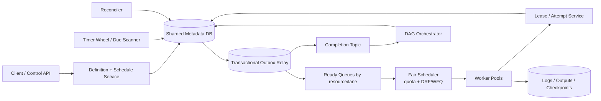

Timer 只负责“到点物化”；Fair Scheduler 负责“现在把谁分配到哪”；DAG Orchestrator 负责“什么 dependency 已满足”。三者分开可独立扩容与隔离故障。

### 15.7 核心 Flows

**Immediate run**

1. API 校验 definition version 与 params URI，在单事务插入 WorkflowRun、TaskRuns、root-ready state 与 Outbox。
2. Relay at-least-once 发布 ready task；重复 queue message 不会产生第二个 current attempt。
3. Worker 先向 Lease Service CAS：`READY -> CLAIMED, attempt_epoch+1, lease_until`。
4. 获得 `{attempt_epoch, fencing token}` 后才执行。完成时以 epoch 条件更新 Attempt/TaskRun，并写 completion Outbox。

**Recurring schedule**

1. Schedule owner 扫描 time bucket，计算下一 occurrence；用 unique `(schedule_id, fire_time)` 插入 run。
2. 同事务推进 `next_fire_at` 并写 Outbox。两个 scanner 竞争时只有一个 insert 成功。
3. `DST`：cron 保存 timezone + tzdb version；明确 ambiguous time 是运行一次/两次，nonexistent time 是 skip/shift。系统升级 tzdb 时不静默重写已物化 occurrence。

**DAG propagation**

1. 上游 TaskRun terminal 后，对每条 outgoing edge 插入 `DependencySatisfied`。
2. insert 成功才原子更新下游计数；重复 event 因 unique key 不再 decrement。
3. 当 counter 从 1 到 0 且 condition 满足时，CAS `PENDING -> READY` 并写 Outbox。
4. Workflow 通过 `remaining_nonterminal` 归零且无 pending retry 判终结，不只看 leaf node。

### 15.8 Deep Dive A：Timer 精度、Cron、Misfire 与重复物化

全表 `next_fire_at` 每 30 秒扫一次无法稳定满足 p99 < 2s。演进方案：

- 远期 schedule 存 DB；提前 5–10 分钟搬入按秒/分钟分桶的 durable timer wheel。
- bucket shard 有 lease owner；owner 一次拉一批、提前 materialize，Outbox 的 `available_at` 精确控制入 ready queue 时间。
- bucket owner crash 后，新 owner 从 durable cursor 重放；unique occurrence key 保证不双物化。
- clock 使用 monotonic timer 等待、UTC wall clock 决定 due；NTP 大幅回拨时暂停该 shard 并告警。
- `misfire_policy` 必须显式：`SKIP`、`FIRE_ONCE`、`CATCH_UP(max_n)`；否则长 outage 恢复后会形成百万级 stampede。

### 15.9 Deep Dive B：Lease 不能保证 No Double Execution

源文档把 lease 描述成“绝对不会双跑”，这是错误的。Worker A 可能暂停超过 TTL，lease 转给 B 后 A 又恢复；两者会重叠。

正确防线：

1. 每次 claim 递增 `attempt_epoch/fencing token`。
2. Scheduler metadata 只接受最新 epoch 的 heartbeat/finish/checkpoint。
3. 若下游是数据库/对象存储，写 API 也校验 fencing token；若是外部支付/邮件，则传稳定 `idempotency_key`，由对方去重。
4. lease TTL > 正常 heartbeat jitter，并动态考虑任务类型；续租失败立刻停止 side effect，不继续“赌网络会恢复”。
5. 对无法 fencing、无法幂等的任务，只能明确为 at-least-once 风险，或用人工介入/单 owner 执行，不能包装成 exactly-once。

`FOR UPDATE SKIP LOCKED` 适合中小规模 DB-backed queue，但 10k/s 下应批量 claim、按 shard 扫描并有 covering index；否则热索引、vacuum 和轮询空转会成为瓶颈。

### 15.10 Deep Dive C：DAG 正确性与复杂语义

源文档的 `remaining prerequisites--` 是好优化，但若 completion event 重放会减成负数。`DependencySatisfied` 去重记录是关键。

- definition 创建时做 cycle detection/topological validation；运行时禁止原地修改 DAG，修改产生新 version。
- edge condition 必须定义 `all_success/all_done/one_success`；upstream failed 后是 block、skip 还是触发 compensation，不能统一“叶子完成即 complete”。
- dynamic fan-out 用 `map expansion epoch`：先 durable 地冻结 expansion count，再创建 children，避免 retry 生成不同集合。
- rerun task 默认创建新的 TaskRun generation；是否重跑 downstream 是用户显式选择，并记录 provenance。
- backfill 用 logical interval，不用当前 wall time；输入、代码、image digest、secret reference policy 都需可重现。

源文档“5 节点只 11 inserts + 7 mutations”的 quiz 忽略了 dependency satisfaction、counter decrement、attempt completion、outbox 等生产记录。真实写放大取决于边数 `E`：仅依赖传播至少 `E` 次去重 insert + `E` 次 counter/CAS，不能给固定 7 次答案。

### 15.11 Deep Dive D：Fairness、Priority 与 Backpressure

不能为每 tenant 建物理 queue；百万租户会造成运维爆炸。使用固定 virtual shards + scheduler 内的分层公平队列：

- tenant/organization 先受 `running tasks, CPU, memory, GPU, starts/s` token bucket。
- 再在 resource class 内用 `Weighted Fair Queuing` 或 `Dominant Resource Fairness (DRF)`。
- priority lane 预留容量，但加入 aging，防 bulk 永远饿死。
- midnight cron 加 deterministic jitter；用户若要求严格整点，则必须购买 reserved capacity，而不是偷偷改语义。
- overload 优先保 lease renew 与 completion，再接受 immediate，最后 materialize bulk/backfill。
- queue depth 不是唯一 autoscale 信号；使用 `oldest_ready_age + resource demand + startup latency`。

### 15.12 Deep Dive E：长任务、Checkpoint、Cancel 与 Retry

- Worker 定期把 application-provided checkpoint 写 immutable object，提交 `{seq, checksum, attempt_epoch}`；新 attempt 只从最新已提交 checkpoint 恢复。
- 平台不能凭 OS memory snapshot 保证任意 6 小时程序可恢复；task 必须实现 checkpoint protocol。
- cancel 是状态机：`CANCEL_REQUESTED` 后停止分配、发 SIGTERM、grace period、SIGKILL；迟到的 success 与 cancel 用 CAS/epoch 决定唯一结果。
- error classifier 区分 permanent、transient、capacity、user-cancelled；`429/503` 尊重 `Retry-After`。
- backoff 用 full jitter：`sleep=random(0,min(cap,base×2^attempt))`；同时有 max attempts、max elapsed time、tenant retry budget。
- terminal failure 进入可查询 DLQ；manual replay 创建新 generation，不改写历史。

### 15.13 Multi-Region、DR 与 Security

**Multi-Region**

- 每个 schedule/run shard 有单一 home region 和 owner epoch；各 region 可接 API，但写路由到 home。
- metadata journal 同步复制 paired region 才能给 RPO=0 tier；基础 tier 异步复制并声明 RPO。
- failover 需读取 `scheduler safety watermark`，确认 Schedule.next_fire 与 Run unique keys 已追平；未追平时停止 materialization，而不是双 region 同时扫。
- Worker 可多 region，但 attempt claim 仍由 home owner 授 epoch；数据 locality/resource price 只是 placement 输入。

**DR**

- 定期演练 timer backlog recovery、broker loss/replay、DB restore、region failover、KMS/secret access。
- outage 恢复按 quota 释放 catch-up，不一次性 fire 所有 missed runs。

**Security**

- definition RBAC、immutable audit；Worker 使用短期 workload identity，不持久化平台 long-lived key。
- payload/secret 只传引用；Secret Manager 在启动时按 task identity 发短 TTL capability。
- network egress allowlist、resource sandbox、log redaction、artifact checksum、tenant encryption key。

### 15.14 Observability、Cost 与 On-call 视角

| 卡口 | 核心指标 |
|---|---|
| Timer | `due_to_materialized_lag`, missed occurrence, duplicate conflict, bucket owner churn |
| Outbox/Queue | oldest age、publish lag、ready depth by resource/tenant |
| Claim | claim conflict、lease expiry、stale epoch rejects、heartbeat write QPS |
| Worker | start lag、runtime、OOM/preemption、checkpoint age、cancel latency |
| DAG | blocked tasks、counter invariant violation、fan-out size、workflow critical path |
| Fairness | per-tenant slowdown、quota rejection、starvation age、reserved capacity use |

Cost 重点是 idle Worker、GPU fragmentation、heartbeat DB writes、长期 attempt/log retention。通过 bin packing、warm pool、spot/preemptible + checkpoint、heartbeat coalescing、冷热归档降低成本，但不能牺牲 fencing 与审计。

### 15.15 Trade-offs 与 Evolution

| 方案 | 优点 | 代价/适用边界 |
|---|---|---|
| DB polling + SKIP LOCKED | 简单、事务清晰 | 中等规模；高峰有热索引与 polling cost |
| Durable timer wheel + broker | 精度、吞吐、隔离更好 | 组件与 recovery cursor 更复杂 |
| Per-run co-location | DAG transaction 简单 | 超大 fan-out run 可能成为 hot shard |
| Lease + fencing | 可恢复且拒绝 stale actor | sink 必须理解 token；外部 sink 仍需 idempotency |
| Active-active materialization | 理论可用性高 | 双触发风险高；通常不如 single owner + fast failover |

演进：V1 单 SQL + SKIP LOCKED；V2 Outbox、queue、lease epoch；V3 timer wheel、sharded run store、fair scheduler；V4 multi-region owner journal、checkpoint/preemption、capacity marketplace。

### 15.16 Follow-up Q&A

**Q1：如何做到 exactly-once？**  平台只承诺 logical run 唯一、attempt 有 fencing、投递 at-least-once。外部 side effect 需要稳定 idempotency key 或与状态写共事务；否则不能做 end-to-end exactly-once。

**Q2：两个 scheduler 同时扫到同一 cron 怎么办？**  `unique(schedule_id, scheduled_fire_at)` 是最终防线；同事务推进 next_fire 并写 Outbox，重复 scanner 只得到 conflict。

**Q3：为什么不用一个 global lock？**  它把 10k/s 变成串行瓶颈。按 timer/run shard 单 owner，局部 CAS 与 unique constraint 足够。

**Q4：DAG counter 如何避免重复减？**  先插 unique `DependencySatisfied(run,from,to,upstream_epoch)`，只有首次 insert 成功才 decrement。

**Q5：6 小时任务挂了怎么继续？**  依赖 task-defined checkpoint，保存 immutable checkpoint + seq + checksum；新 epoch 从最后提交点恢复。没有 checkpoint 的任意进程只能重跑。

### 15.17 60 秒总结

“我把 immutable definition、logical run、TaskRun 和 physical Attempt 分离。Cron 由 durable timer buckets 提前物化，`(schedule_id, fire_time)` unique key 加同事务 Outbox 防双触发；ready task 经 tenant/resource fairness 进入队列。Worker 必须先拿递增 attempt epoch 的 lease，旧 Worker 即使复活也会被 metadata 和支持 fencing 的 sink 拒绝；外部 side effect 仍靠 idempotency key，所以整体是 at-least-once。DAG 用 unique dependency-satisfaction record 再原子减 counter，避免重复 completion 把计数减坏。10k starts/s、60 秒任务意味着峰值 600k 并发槽位，因此 quota、backpressure、heartbeat coalescing、checkpoint 与 catch-up budget 都是核心，而不是只画一个 queue。”

---

---

## 16. Design Conflict Control：高并发账户/库存的 Lost Update 与并发语义

### 16.1 题意、边界与 Source digest

> **Source digest — `Design system conflict.docx`**：源文档不是完整产品题，而是用账户余额 `$100` 同时扣 `$30/$50` 解释 Lost Update，并比较 atomic update、OCC/version、pessimistic row lock、CAS、Redis distributed lock + fencing/Redlock、Kafka per-key serialization。文件含 4 张 Word table、没有内嵌图片。本文将它提升为可独立作答的 Senior+/Staff 系统题：设计一个高并发账户/库存 mutation service，并修正原文对 reader blocking、Redlock、queue serialization 与 exactly-once 的过度承诺。

本题真正要回答的不是“背 5 种锁”，而是先定义 invariant 与 conflict semantics：

- `available_minor >= 0`、`reserved_minor >= 0`，且 `total_minor = available_minor + reserved_minor`；同一 withdrawal retry 只能产生一次 ledger effect。
- 每个 account 的 committed mutations 有确定顺序；查询可选择 linearizable 或 bounded-stale。
- 余额是 projection；不可变 ledger/command history 才是审计真理。
- 跨账户 transfer 还要维护 debit/credit conservation，不能只锁一行余额。

范围：single-key debit/inventory decrement、idempotency、OCC/lock/serialization、自适应热点处理、multi-region owner、transfer 扩展。

不范围：完整银行合规、汇率/利息、通用 CRDT library、支付网络本身。

### 16.2 FR、NFR 与 SLO

**Functional Requirements**

1. 原子 debit/credit/reserve/release，拒绝违反 `balance >= reserved >= 0`。
2. client retry 使用 idempotency key 返回同一结果。
3. 查询 current balance、version、immutable ledger；按 account sequence 订阅事件。
4. 支持 hot account/inventory SKU；冲突率升高时不形成 retry storm。
5. 可选跨账户 transfer：reserve -> commit/compensate，有清晰状态机。

**NFR / SLO**

| 维度 | 目标 |
|---|---|
| Throughput | 平均 100k commands/s，峰值 1M/s；单 key 极端 10k/s |
| Latency | 同 region command p99 < 100 ms；linearizable balance read p99 < 50 ms |
| Correctness | no lost update、no overdraft、idempotent retry、monotonic account sequence |
| Availability | read 99.99%，write 99.95%；网络分区时 safety 优先于同 key write availability |
| Audit | 每个 accepted/rejected command 有 reason、actor、correlation；ledger immutable |

### 16.3 容量估算与冲突数学

假设 100M accounts/SKUs，平均 `100k mutations/s`，峰值 `1M/s`：

- commands/day：`100k × 86,400 = 8.64B/day`。
- ledger/command event 按 500 B：`8.64B × 500 B = 4.32 TB/day raw`；3 replicas `12.96 TB/day`。在线热存不宜保留多年，需按时间/账户归档到 columnar/object storage。
- 峰值 event log 带宽：`1M/s × 500 B = 500 MB/s`，加协议/replication 约数 GB/s。
- 每 command 至少 4 次 durable row mutation（Command/idempotency、Ledger、Snapshot、Outbox 在一个 transaction 内）：峰值约 `1M × 4 = 4M row mutations/s`，还未计 index/WAL amplification，必须分片和批量 WAL，而不是单主库。
- 若单 partition 安全处理 2k commands/s，峰值下界 `1M/2k = 500 partitions`；留 2× headroom 取 1,024 logical shards。
- 但一个 hot account 的 10k/s 都必须落同一 owner，增加 partitions 无法拆它。需要 commutative batching、escrow/sub-balances、业务限流或改变 invariant。

OCC 重试放大：若一次尝试冲突概率为 `p`，成功一次的期望 attempts 为 `1/(1-p)`：

- `p=1%` -> 1.01 次，OCC 很划算。
- `p=50%` -> 2 次。
- `p=90%` -> 10 次，CPU/DB 被 retry storm 放大 10×，应切 pessimistic/serialized lane。

### 16.4 API 与 Event Contracts

```http
POST /v1/accounts/{account_id}/withdrawals
Idempotency-Key: wd-merchant-order-123
If-Match: "account-version-41"   # 可选；客户端需要显式 OCC 时使用
{
  "amount_minor": 3000,
  "currency": "USD",
  "reason": "order-123"
}
```

成功：

```json
{
  "command_id":"cmd-7",
  "ledger_entry_id":"le-9",
  "account_sequence":42,
  "balance_minor":7000,
  "version":42,
  "status":"COMMITTED"
}
```

余额不足返回 domain `409 INSUFFICIENT_FUNDS`；version 不符返回 `412 VERSION_CONFLICT`；相同 idempotency key + 不同 request hash 返回 `409 IDEMPOTENCY_KEY_REUSED`。

事件：

```json
{
  "event_id":"01J...",
  "type":"AccountMutationCommitted",
  "account_id":"acct-1",
  "account_sequence":42,
  "command_id":"cmd-7",
  "idempotency_key":"wd-merchant-order-123",
  "delta_minor":-3000,
  "balance_after_minor":7000,
  "committed_at":"..."
}
```

消费者按 event_id 去重，并以 `account_sequence` 检测 gap/stale；不要把 wall-clock timestamp 当同 account 的顺序依据。

### 16.5 数据模型、Partition、Index、TTL 与状态机

| 实体 | 字段 | 设计要点 |
|---|---|---|
| `AccountSnapshot` | account、currency、available、reserved、version、owner_epoch | PK `(account,currency)`；与 Command/Ledger 同 shard |
| `Command` | command id、tenant/account、idempotency key、request hash、state/result | unique `(tenant,account,idempotency_key)` |
| `LedgerEntry` | entry id、account、sequence、delta、balance_after、command | unique `(account,sequence)`；append-only |
| `Reservation` | reservation id、amount、expiry、state、version | inventory/payment hold；expiry bucket index |
| `Transfer` | transfer id、from/to、state、saga epoch | 跨 shard workflow；每 step idempotent |
| `Outbox` | event id、account、sequence、payload | 与 ledger/snapshot 同 transaction |
| `OwnerLease` | shard、region/node、epoch、lease_until | consensus-issued；resource enforces epoch |

分片 key 优先 `account_id/SKU`，使 invariant 在单 shard transaction 内。Ledger 按 `(account_id, sequence)` 聚簇并按时间冷分区；不能只按日期分片导致同账户写跨 shard。二级审计查询异步导入 OLAP。

单 command 状态：

```text
RECEIVED -> VALIDATED -> COMMITTED
                    |-> REJECTED
                    |-> RESERVED -> COMMITTED | RELEASED | EXPIRED
```

跨 shard transfer：

```text
INITIATED -> DEBIT_RESERVED -> DEBIT_POSTED_TO_CLEARING -> CREDIT_POSTED_FROM_CLEARING -> COMPLETE
                    |                    |                           |
                    +--------------------+--------------------------> COMPENSATING -> REVERSED/MANUAL_REVIEW
```

### 16.6 Architecture

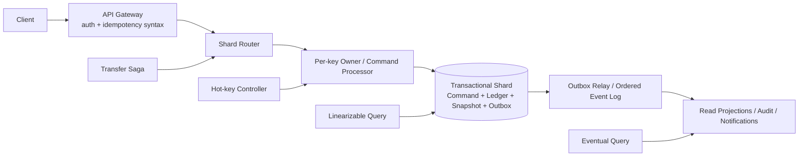

系统不是“到处加 distributed lock”。能在 shard owner 内用 storage transaction/conditional write 解决，就不引入额外锁服务。

### 16.7 核心 Flow：原子 Debit

1. Gateway 校验身份、currency/amount；Shard Router 按 account_id 找 authoritative owner epoch。
2. 单事务先 `INSERT Command ... ON CONFLICT`。若 idempotency key 已存在且 hash 相同，返回原 result；不同则拒绝。
3. 采用原子约束更新：

```sql
UPDATE account_snapshot
SET available_minor = available_minor - :amount,
    version = version + 1
WHERE account_id = :id
  AND currency = :currency
  AND available_minor >= :amount
  AND (:expected_version IS NULL OR version = :expected_version);
```

4. affected rows=1 后插入下一 `account_sequence` 的 LedgerEntry，更新 Command=COMMITTED，并写 Outbox；全部同 transaction commit。
5. affected rows=0 时区分 version conflict/insufficient funds并持久化 deterministic result，避免 retry 后结果漂移。

仅仅 `SET balance=balance-50` 还不够；必须把 `balance>=amount` invariant 放进同一原子 predicate，不能先应用层 SELECT 再判断。

### 16.8 Deep Dive A：Atomic Update、OCC 与 Pessimistic Lock

**Atomic predicate update**：单字段、单行 invariant 首选；没有 read-modify-write gap，吞吐最好。

**OCC/version CAS**：复杂计算先读 snapshot，写时 `WHERE version=?`；冲突后重新读取、重新验证业务规则。适合低冲突。Retry 用 exponential/full jitter 和 max budget，不能 tight loop。

**Pessimistic row lock**：`SELECT ... FOR UPDATE` 适合高竞争、短事务；所有需要多行锁的事务按 deterministic key order 获取，降低 deadlock。源文档说“其他任何事务读取都会阻塞”不准确：在 MVCC 数据库中普通 snapshot read 常不阻塞，主要是 competing writers/locking reads 等待。

自适应策略：按 key 统计 conflict rate/lock wait。低于阈值 OCC；持续高冲突把 key 路由 serialized hot lane，cooldown 后再恢复 OCC。避免所有 key 被最热 key 的策略拖慢。

### 16.9 Deep Dive B：CAS、Retry Storm 与 ABA

CAS 是 OCC 的实现机制之一，不是完全独立的正确性魔法：

- compare 的应是 monotonic version/epoch，不只 compare value，防 ABA（值 A->B->A，看似没变但历史已变）。
- retry 必须重跑 validation，不能拿旧业务决定只改 version。
- high contention 时 randomized backoff 仍可能浪费；排队或 combine 多个 commutative increments。
- global sequence allocation 本身需要某种协调/range allocation；不能称为“免协调”。
- conditional write 成功只保证 storage mutation 一次，不保证随后对外 HTTP side effect exactly-once。

### 16.10 Deep Dive C：Queue Serialization 的能力与边界

按 account_id partition 可以把同 key commands 送给同一 partition owner，简化顺序：

- broker 只保证 partition log order；多个 producer 的 real-time order 仍需由 owner 分配 `account_sequence`。
- consumer rebalance/crash 会重复处理；Command unique idempotency 与 transactional offset/outbox 仍必要。
- “一个 partition 单线程”不等于整个 partition 只能服务一个 account；一个 consumer 顺序处理许多 keys。增加 partitions 可扩不同 keys，但不能扩一个 10k/s hot key。
- 若 process 后、offset commit 前 crash，会 replay；若先 commit offset 再写 DB，会丢 mutation。用 inbox/transactional consume 或 DB idempotency关闭窗口。
- queue 增加排队 latency，但对超热点可提供 admission control、fairness 与 audit。

Hot counter 若操作可交换，可在 owner 内 micro-batch：累计 `N` 个 increments，一次原子加总并为每 command 记录结果；若每个命令需要读取精确 intermediate balance，则不能随意重排/合并。

### 16.11 Deep Dive D：Distributed Lock、Fencing 与 Redlock 修正

`SET key value NX PX ttl` 只给出租约，不给出安全的永久互斥。A pause 超过 TTL、B 获锁后，A 可恢复。必须：

- lock service 发单调 fencing token；最终资源在每次 mutation 验 `token > last_seen`。
- release 用 compare-owner token，不能无条件 DEL 别人的新锁。
- lease renew 失败时 actor 停止；TTL 考虑 GC/网络 tail，但再长也不能取代 fencing。

对 correctness-critical lock，优先复用已有 authoritative DB transaction，或使用基于 consensus 的 etcd/ZooKeeper lease + fencing。源文档把 5 Redis 节点多数 `Redlock` 当“黄金解法”过于绝对：它不是线性一致资源的替代品，也不能让不校验 fencing 的 sink 安全。面试中应说明其时钟/网络假设与争议，不把它用于资金 invariant 的唯一防线。

外部支付 double charge 的核心仍是 payment provider idempotency key；本地 distributed lock 无法覆盖 response-lost 和 provider 事务。

### 16.12 Deep Dive E：跨账户 Transfer、Ledger 与 Saga

若 from/to 能 co-locate，同一 serializable transaction 写双边 ledger 是最简单、最强的方案。若跨 shard：

1. 创建 Transfer unique id，并为 transfer clearing account/position 建立审计维度。
2. from shard reserve funds（还不是最终 debit），写 reservation event。
3. 把 reservation 原子转成 `source -> clearing` 的 committed debit；此后价值位于 clearing，不会凭空增发。
4. to shard 以 transfer id 幂等提交 `clearing -> destination` credit；任一步重放都返回原结果。
5. 若 credit 长期失败，以新的 compensating ledger entry 把 clearing 余额退回 source；不删除或改写旧 ledger。

Saga 提供 eventual atomic business outcome，不是瞬间 ACID。期间 query 必须区分 available/reserved/posted。若金融账要求 debit/credit conservation 的单一审计原子性，可建立 central double-entry journal owner，牺牲 availability/latency换 correctness。

### 16.13 Deep Dive F：Multi-Region、CRDT 与 Escrow

- 强 invariant 的 account/SKU 有单一 home region/consensus group；全球请求转发到 owner。网络分区时 minority 拒绝写，避免双花。
- balance 不适合 LWW；最后时间戳会直接丢掉合法 debit。
- `G-Counter/PN-Counter` 适合可交换、无下界约束的计数/likes，不自动维护库存不能为负。
- bounded counter 可用 `escrow`: 把可售库存预分配给 region，region 只在本地额度内扣减；region 间转移额度需要协调。换取本地低延迟，但可能某 region sold out而全局仍有库存。
- profile name 等非关键字段可 LWW；set membership 可 OR-Set；必须按字段选择 merge semantics，不能整个 record 一个策略。
- failover secondary 必须追 `account safety watermark/owner epoch`；旧 region 写被 resource fencing 拒绝。

### 16.14 Backpressure、DR、Security 与 Observability

**Backpressure**

- per-tenant/account command rate、in-flight、retry budget；hot key 单独排队。
- overload 保 commit/ack/lease renew，拒绝低优 query/rebuild；返回明确 429 + retry-after。
- transfer saga/reconciliation 用独立 lane，不能被新业务命令饿死。

**DR**

- shard WAL 同步 paired region 才可承诺 RPO=0；否则声明 RPO。
- PITR + immutable ledger + projection rebuild；演练 owner failover、outbox replay、duplicate command、region partition。
- 恢复后先验证每 account sequence 连续、ledger-to-snapshot checksum，再开放 write。

**Security**

- mTLS/service identity、fine-grained authZ、signed request context、KMS encryption、PII minimization。
- 管理 override/ledger reversal 双人审批，永不直接 UPDATE 历史 ledger。
- idempotency key namespace 绑定 authenticated tenant，防跨租户探测结果。

**Observability / invariants**

- conflict rate、OCC retries、lock wait/deadlock、hot-key QPS、queue age。
- stale fencing rejects、duplicate command hits、outbox lag、sequence gaps。
- invariant monitors：negative balance、reserved > total、ledger sum != snapshot、transfer stuck age。
- 按 strategy 统计 latency/cost，验证 adaptive OCC->serialization 是否真的降 amplification。

### 16.15 决策矩阵、Trade-offs 与 Evolution

| 场景 | 首选 | 不选其他方案的原因 |
|---|---|---|
| 单行可表达 invariant | atomic predicate update | 最少协调；应用 read-modify-write 多余 |
| 低冲突复杂逻辑 | OCC/version CAS | lock wait 不划算 |
| 高冲突短事务 | row lock / per-key owner | 避免 OCC retry storm |
| per-key strict order/audit | partitioned command log + idempotent consumer | 接受排队和 hot-key ceiling |
| 跨服务 lease | consensus lease + fencing | lock 本身不保护最终资源 |
| 可交换无界计数 | CRDT/local aggregation | 不必为 total order 付费 |
| 有下界的跨 region 库存 | escrow | 本地扣减安全，但额度利用率有代价 |

Evolution：V1 单 DB atomic update + unique idempotency；V2 sharded ledger/outbox/OCC；V3 hot-key serialized lane、adaptive strategy；V4 owner-epoch multi-region、escrow/transfer saga、offline invariant verifier。

### 16.16 Follow-up Q&A

**Q1：两个 `$100` 并发扣 `$30/$50` 怎么办？**  单 SQL predicate update 或 row transaction；两个 update 依次在最新值上执行，最终 `$20`。若余额只够一个，affected rows/invariant 决定一个成功一个拒绝。

**Q2：OCC 失败是否直接重放旧 SQL？**  不行；重读最新 version并重新执行业务 validation，且受 retry budget/jitter 控制。

**Q3：有 Redis lock 是否就不会双写？**  不会。TTL 后旧 holder 可复活；最终 resource 必须校验 fencing token，external side effect 还要 idempotency。

**Q4：Kafka 能否自动解决 exactly-once？**  只能在其事务边界内改善 consume/produce；任意 DB/HTTP sink 仍需 inbox/idempotency/transaction integration。

**Q5：一个 hot account 10k/s 怎么水平扩？**  strict sequential invariant 下单 key 本就有串行上限；可 batch commutative ops、escrow/shard rights、限流或重构业务语义，不能靠增加 hash partitions 假装解决。

### 16.17 60 秒总结

“我先定义 invariant：余额不为负、command 幂等、每账户 sequence 单调、ledger 不可变。单行 debit 首选 `UPDATE ... SET balance=balance-amount WHERE balance>=amount`，并在同 transaction 写 Command、Ledger、Snapshot、Outbox；不是应用层先读后写。复杂低冲突用 OCC，高冲突短事务切 row lock 或 per-key serialized owner。Lease 只帮助恢复，不保证互斥，必须有 fencing；普通 HTTP side effect 仍用 idempotency key。峰值 1M/s 可用约 1,024 shards 扩不同账户，但单个 10k/s hot key 仍受 invariant 串行上限，需要 batching、escrow 或业务限流。跨 region 对资金采用 single owner/consensus，不能 LWW；failover 先追 safety watermark。”

---

---

## 17. Design ChatGPT Playground（Streaming LLM Application Backend）

### 17.1 Source digest：源文档覆盖与校正

源文档《design ChatGPT Playground.docx》把模型视作外部 black box，重点覆盖 prompt + parameters、preset save/search、WebSocket streaming、Model Proxy、TTFT、bounded queue、rate limit、per-user concurrency、长连接网关、autoscaling 与 preset DB 降级。文档有 137 个正文块、1 张对比表，没有 embedded image 或 chart；两张架构图都是 ASCII text，已重画为 Mermaid。

需要修正：

1. WebSocket 不是唯一或“最完美”方案。SSE / HTTP chunked streaming 配合独立 cancel API 或 AbortController 通常更简单，天然穿越代理；只有需要高频双向多路信令时才优先 WebSocket。
2. 100M requests/day 的精确平均为 100M / 86,400 ≈ 1,157 RPS，而不是用“10 万秒一天”得到 1,000。100k in-flight 必须由 Little’s Law：arrival rate × generation duration 推导。
3. 每 token 都 TCP flush 会放大 frame/syscall/TLS 开销；100–300 ms 又太顿。生产上通常按 10–30 ms 或若干 tokens coalesce，同时保证 TTFT 首 token 立即发送。
4. client UUID 只有在 server 以 user + idempotency_key 建唯一约束并保存 operation/result 时才有幂等语义。非确定生成重试可能产生不同结果，必须定义“重放旧 run”还是“创建新 run”。
5. Preset DB 宕机时不能只写 Redis unsynced 就宣称成功。只有 durable queue / WAL 已确认，才能返回 accepted；否则 UI 必须显示 local-only / pending。
6. Preset 通常是 per-user 小集合，直接给 100M 级总数据上 Elasticsearch 可能过度设计；先用 owner-partitioned DB + prefix/trigram index，只有跨租户全文搜索或数据量证明确实需要时再建 search index。
7. 上游模型开始输出后，不能无损切换 replica；hedging 只能发生在 first-token 之前，或作为新 generation 明确暴露，不能把两段随机输出拼接。

### 17.2 题意、范围与开场

**面试题**：设计一个 ChatGPT Playground application backend。用户提交 prompt 与 generation parameters，实时看到 token stream，可取消、重连、保存 preset、比较 runs，并获得明确 usage 与错误语义。底层模型平台已存在，但其 endpoint 会冷启动、过载或部分失败。

**30 秒开场**：

> “我会把它拆成 connection plane、generation control plane 和 inference data plane。API 先持久化 generation receipt 与 quota reservation，再由 Model Router 选择 policy-approved endpoint；token 通过带 sequence number 的 SSE/HTTP stream 返回，cancel 独立传播到 inference scheduler。最难的不是建立长连接，而是 TTFT、慢客户端 backpressure、timeout 后状态不确定、取消与计费一致性、开始输出后的不可透明 failover，以及 model/safety/version lineage。”

**In scope**：prompt/parameters、streaming、stop、resume、presets、run metadata、usage、rate/concurrency limit、safety gate、multi-model routing、multi-region。

**Out of scope**：模型训练基础设施、RAG ingestion、完整聊天记忆产品、前端组件、银行卡支付。Conversation 可作为扩展，但主实体是独立 Generation Run。

### 17.3 FR、NFR 与 SLO

**Functional requirements**

1. Submit generation，支持 temperature、top_p、seed、max_tokens、stop sequences、model/version。
2. 返回增量 token/text delta、finish_reason、usage；支持用户 cancel。
3. 网络断开后可在短窗口内按 last_event_id 恢复已缓冲 stream，或查询 terminal result。
4. 保存、更新、删除、搜索私有 Preset；支持 immutable Preset revision，Run 引用具体 revision。
5. 同一 idempotency key 重试返回同一 generation；显式 rerun 创建新 generation_id。
6. enforce org/user/IP quota、per-user concurrency、content policy 与 data-retention policy。

**SLO**

- generation accept p99 < 200 ms；TTFT p95 < 500 ms、p99 < 1.5 s；
- steady TPOT p95 < 80 ms；stream inter-chunk gap p99 < 500 ms；
- generation control plane availability ≥ 99.99%，successful stream availability ≥ 99.9%；
- cancel accepted p99 < 200 ms，GPU stop propagation p99 < 1 s；
- presets p99 read < 100 ms、write < 300 ms，RPO 0；
- usage ledger 与 quota reservation 不漏记，可重复但必须去重；
- safety-critical policy 默认 fail closed，非关键 telemetry fail open。

### 17.4 Capacity、token、GPU、网络与存储估算

假设 10M DAU、每人 10 runs/day，即 100M runs/day；peak 10k starts/s。平均 700 input tokens、300 output tokens，用户可见 decode 50 tok/s。

- average starts = 100M / 86,400 ≈ **1,157 RPS**；10k peak ≈ 8.6× average；
- input = 70B tok/day ≈ **810k input tok/s average**；output = 30B tok/day ≈ **347k output tok/s average**；
- peak demand 若请求结构相同：**7M input tok/s + 3M output tok/s**；
- generation duration ≈ 300 / 50 = 6 s，加 TTFT 按 6.5 s；peak concurrent generations ≈ 10k × 6.5 = **65k**；按 100k provision 可覆盖更长尾；
- 70B dense model 的 decode lower bound ≈ 3M × 140 GFLOP = **420 PFLOP/s**。实际 replica/GPU 数必须用 model endpoint 的 measured prefill/decode curves 与 KV budget 反推；这说明 app server 的 CPU 不是主要成本；
- 假设每 completion text 1.2 KB，coalesced framing/TLS 后 3 KB/run，peak generation egress 约 10k × 3 KB = **30 MB/s**。Connection count 与 syscall/frame rate往往比纯字节带宽更紧；
- 若 stream 每 5 tokens 发一帧：300/5=60 frames/run；peak steady frame rate约 10k starts/s × 60 = **600k frames/s**，需多台 event-loop gateway；
- 1% runs 保存为 1 KB Preset revision：1M/day ≈ **1 GB/day**；一年 365 GB raw，RF3 + indexes 约 1–2 TB；若采用源文档 10% 保存率则是 10 GB/day，必须先确认真实 product behavior；
- generation receipt 500 B × 100M/day = **50 GB/day**；保留 30 天 raw 1.5 TB，RF3 4.5 TB。Prompt/completion 是否持久化由 tenant policy 决定，不默认全量保存。

### 17.5 API 与 event contracts

主推荐是 request/stream 分离：普通 HTTPS 创建 generation，SSE/HTTP2 读取 stream；cancel 用独立幂等 endpoint。WebSocket 是可选 transport，不改变业务 contract。

~~~http
POST /v1/generations
Idempotency-Key: org-7:client-op-88
{
  "model":"reasoner@stable",
  "input":[{"role":"user","content":"..."}],
  "parameters":{"temperature":0.7,"top_p":0.95,"max_output_tokens":300,"seed":42},
  "preset_revision_id":"pr-17",
  "stream":true
}
-> 201 {
  "generation_id":"gen-88",
  "state":"QUEUED",
  "stream_url":"/v1/generations/gen-88/events",
  "request_digest":"sha256..."
}

GET /v1/generations/{id}/events
Accept: text/event-stream
Last-Event-ID: 41

event: response.output_text.delta
id: 42
data: {"generation_id":"gen-88","sequence_no":42,"delta":"夏天","output_offset":113}

event: response.completed
id: 91
data: {"finish_reason":"stop","usage":{"input_tokens":700,"output_tokens":241}}

POST /v1/generations/{id}:cancel
Idempotency-Key: cancel:gen-88
If-Match: {generation_epoch}
-> 202 {"state":"CANCEL_REQUESTED"}

POST /v1/presets
{"name":"tagline","template":"...{{product}}...","parameters":{...}}
-> 201 {"preset_id":"p-7","revision_id":"pr-17","version":1}

GET /v1/presets?query=tagline&cursor=...
~~~

关键 events：

~~~text
GenerationAccepted {event_id, generation_id, org_id, request_digest,
                    model_policy_ref, reserved_tokens, accepted_at}
GenerationRouted {generation_id, generation_epoch, model_digest, endpoint_id}
GenerationDelta {generation_id, sequence_no, output_offset, delta_ref}
GenerationTerminal {generation_id, generation_epoch, state, finish_reason,
                    input_tokens, output_tokens, terminal_at}
UsageFinalized {usage_id, generation_id, org_id, reserved, actual, charge_status}
PresetRevisionCreated {preset_id, revision_id, owner_id, version, content_digest}
~~~

Delta 不必全部进 durable Kafka hot path；Stream Gateway 可保留 5–15 分钟 ring buffer，terminal result 按 retention policy 持久化。UsageFinalized 与 GenerationTerminal 必须 durable。

### 17.6 Data model、partition、index、TTL 与状态机

| Entity | Key / index | 关键字段 |
|---|---|---|
| GenerationOperation | PK: hash(org_id + idempotency_key) | request_digest、deterministic generation_id、state、response_ref、expires_at；stable idempotency authority |
| Generation | PK: org_id + generation_id | request_digest、state、epoch、model_digest、policy_snapshot、usage；generation_id 由 operation 稳定派生 |
| StreamCursor | PK: generation_id | owner_gateway、last_seq、buffer_ref、connection_epoch；TTL 15 min |
| ConcurrencyLease | PK: org/user + slot | generation_id、lease_epoch、expires_at；TTL + heartbeat |
| QuotaReservation | PK: reservation_id | estimated_tokens、actual_tokens、state、version |
| Preset | PK: owner_id + preset_id | name、latest_revision、deleted_at |
| PresetRevision | PK: preset_id；SK: version | immutable prompt template、params、content_digest |
| ModelPolicy | PK: alias + policy_version | allowed digests、regions、safety profile、fallback chain |
| SafetyDecision | PK: generation_id + stage | policy_version、labels、decision、explanation_ref |

Generation 状态机：

~~~text
ACCEPTING -> QUEUED -> ROUTED -> STREAMING -> COMPLETED
                 |        |          +-> CANCEL_REQUESTED -> CANCELLED
                 |        +-> FAILED_BEFORE_STREAM
                 +-> REJECTED
STREAMING -> FAILED_AFTER_PARTIAL
~~~

FAILED_BEFORE_STREAM 可在同 generation_epoch 内安全 hedge；FAILED_AFTER_PARTIAL 不透明切 endpoint，因为随机状态与 KV cache 已不同。若 client 选择 retry，创建新 epoch/run 并明确标注 restarted_from。

`GenerationOperation` 不能按 request arrival time bucket 路由，否则跨午夜/桶边界 retry 会生成第二个付费 run。服务端从 `(org_id, idempotency_key)` 确定性派生 `generation_id`，operation 与 Generation authority 共置并在一个事务 compare-or-create；按时间浏览历史只用 secondary time-bucket index。Preset 必须 owner partition，避免搜索越权。name prefix/trigram 是 per-owner secondary index。Soft-deleted preset 30 天 TTL；stream buffer 15 分钟；idempotency receipt 至少保留最大客户端重试窗口 24 小时。

### 17.7 Proposed architecture

~~~mermaid
flowchart LR
    C["Browser / SDK"] --> EDGE["Edge LB + WAF"]
    EDGE --> API["Generation API"]
    EDGE --> SG["SSE / WebSocket Stream Gateways"]
    API --> ADM["Auth, Quota, Concurrency, Safety"]
    ADM --> GDB["Generation DB + Outbox"]
    ADM --> ORCH["Generation Orchestrator"]
    ORCH --> ROUTER["Model Router / Circuit Breaker"]
    ROUTER --> INF1["Inference Pool Region A"]
    ROUTER --> INF2["Inference Pool Region B"]
    INF1 --> SG
    INF2 --> SG
    SG --> C
    API --> PS["Preset Service"]
    PS --> PDB["Owner-partitioned Preset DB"]
    PDB --> IDX["Optional Search Index"]
    GDB --> BUS["Usage / Audit / Analytics Events"]
    BUS --> LEDGER["Usage Ledger and Reconciliation"]
    POLICY["Model and Safety Policy Registry"] --> ADM
    POLICY --> ROUTER
~~~

Stream Gateway 只负责 connection state、sequence、small replay buffer 与 backpressure；Generation Orchestrator 管业务状态；Model Router 屏蔽 endpoint health，但不伪造跨 endpoint 的无缝 continuation。

### 17.8 Core flows

#### 7.1 Generate + stream

1. API 验证 auth、parameter bounds、model entitlement 与 request size；从 org + idempotency_key 派生 generation_id，在 stable operation partition 原子 compare request digest 并创建/读取同一 Generation。相同 key 不同 body 返回 conflict，跨 time bucket retry 仍命中同一 operation。
2. Tokenizer estimate 输入与最大输出，Quota Service 原子 reserve token budget，Concurrency Service 获取带 TTL lease。
3. Generation DB 写 ACCEPTED + Outbox 后返回 generation_id；timeout 的 client 可安全查询同一 operation。
4. Input safety gate 执行 policy；Router 依据 model digest、region、loaded capacity、TTFT EWMA、tenant data residency 选择 endpoint。
5. Endpoint 首 token 返回前可做有限 hedged request；winner 原子绑定 generation_epoch，loser 立即 cancel，且 hedge 计入成本预算。
6. Token delta 带 sequence_no 到 Stream Gateway；第一 token 立即 flush，后续按 10–30 ms / 2–8 tokens coalesce。
7. Terminal 时 durable 写 state + usage，释放 concurrency lease 与剩余 reservation；若 ledger 消费重复，以 usage_id 去重。

#### 7.2 Reconnect

Client 带 Last-Event-ID 重连。若 ring buffer 仍有 sequence 42 之后的 delta，补发并继续；若已 terminal，返回 final result；若 buffer 已过期且未保存完整 output，返回 410 STREAM_NOT_RESUMABLE，而不是悄悄重新生成不同文本。

#### 7.3 Cancel

Cancel CAS 增加 generation_epoch / cancel_epoch，Router 将 cancel 传到实际 endpoint。Stream Gateway 可立即停止向 client 发送，但 quota 只有收到 worker stopped 或 timeout reconciliation 后才 final charge，避免用户取消后 GPU 仍跑却账本漏记。

#### 7.4 Preset write

Preset revision 在主库事务提交才返回 201。若主库不可用但 durable command log 已 quorum，可返回 202 PENDING_SYNC；仅有本机/Redis 副本时不能声称 durable。CDC 异步更新 search index；search index 故障时回退到 recent list + prefix search，不影响 generation。

### 17.9 Deep dive 1：SSE、WebSocket 与取消语义

| Transport | 优点 | 代价 | 推荐场景 |
|---|---|---|---|
| SSE over HTTP/2 | 单向流简单、代理友好、Last-Event-ID 语义清晰 | client→server 控制需独立 API | Playground 默认 |
| Fetch/chunked HTTP | 原生 request/response、AbortController | 自定义 framing/resume | 简单 SDK |
| WebSocket | 双向低开销、多事件 multiplex | reconnect、proxy、flow control 更复杂 | 实时协作、多并行 run 控制 |

Stop 不要求 WebSocket：DELETE/POST cancel 可走另一条 HTTP 请求，客户端也可断开 stream。真正关键是 server-side cancel propagation 与 billing reconciliation。连接断开不等同 cancel；移动网络暂断时用户可能想重连，因此默认保留短 grace period，显式 cancel 才立即停止。

### 17.10 Deep dive 2：TTFT、routing 与 hedging 边界

TTFT budget 示例：edge/auth 30 ms + admission/safety 50 ms + queue 120 ms + prefill 200 ms + network 50 ms = 450 ms。每层必须有 deadline propagation，而非各自独立 500 ms timeout。

Router 使用 endpoint-level concurrency、loaded model、KV occupancy、queue age、TTFT histogram，而非只看 CPU。Cold replica 先 warmup，不接 SLO traffic。Hedging 只用于 first-token 前的长尾，触发条件如超过 model/length bucket p95，且全局 hedge budget < 1%；一旦某 endpoint 输出第一个 token并绑定 epoch，另一份必须取消。否则用户可能被双重计费或看到两种输出交织。

### 17.11 Deep dive 3：Slow client backpressure 与 stream correctness

每个 stream 有 bounded outbound buffer，例如 256 KB / 2 s。处理次序：

1. 合并相邻 text deltas，保留语义事件边界；
2. 暂停从 Model Proxy 读取并通过 HTTP/2/WS flow-control 向上游施压；
3. 若 inference endpoint 不支持 per-sequence pause，继续生成会占用 KV/GPU，因此超过阈值应 cancel slow stream；
4. 发送可恢复 terminal error，记录 last_delivered_seq 与 last_generated_seq；
5. metrics 区分 model stall、gateway stall、client stall。

Sequence_no、output_offset、generation_epoch 三者共同防止重复/乱序。Client 按 event id 幂等应用；不能把 token 文本简单 append 而不处理 replay。

### 17.12 Deep dive 4：Quota、concurrency lease 与账本

仅有每分钟 Token Bucket 无法阻止用户在一秒内启动 20 个长 generation。需要两级控制：rate budget + active generation lease。

- reserve = estimated_input + max_output_tokens；terminal 后 settle actual；
- lease 带 TTL、generation_id 与 epoch；Gateway 崩溃后由 worker heartbeat 或 reconciler 续/释放；
- cancel、timeout、partial output 都产 usage event；账本以 usage_id 去重；
- quota backend 短暂不可用时，Enterprise 可使用小额本地 signed allowance，Free fail closed；
- max_tokens 极大、prompt 极长或高成本 model 使用独立 budget，不让 request count 掩盖真实成本。

### 17.13 Deep dive 5：Reproducibility、model lineage 与 safety

“相同 prompt 得到相同结果”只有在 model digest、tokenizer、system prompt、parameters、seed、runtime/kernel 与 sampling determinism 均固定时才可能。Run 必须保存这些 lineage；model alias stable 只用于路由，审计记录具体 digest。

Safety 是分阶段的：input moderation → tool/URL policy → streaming output guard → post-generation classifier。Streaming guard 必须能缓冲敏感短片段，不能先发出再撤回。High-risk block 默认 fail closed；低风险 classifier timeout 可降级到更严格规则模型。Tenant 可以选择 zero-retention，但仍保留不可逆的 usage 与 policy decision metadata。

### 17.14 Consistency、failure、multi-region 与 DR

- Generation receipt、quota reservation、terminal usage、Preset 是 durable truth；stream delta buffer 是 ephemeral derived state。
- Preset DB 故障不能拖垮 generation；search index 仅 derived，可 rebuild。
- Stream Gateway 崩溃：连接重连到新 gateway，从 shared short buffer 或 endpoint cursor 补发；无共享 buffer 时明确 non-resumable。
- Inference endpoint 崩溃：first token 前可 retry；partial stream 后返回 FAILED_AFTER_PARTIAL，由用户决定 rerun。
- Region ownership：org 按 data residency 绑定 home region；accepted receipt 与 usage journal 同步写 paired region。Preset metadata 同步复制；large optional outputs异步复制。
- Failover 提升 generation control epoch，旧 region 不能继续 settle。正在生成的 KV cache 通常不跨 region复制，RTO 通过重建新 generation 实现，而不是声称 seamless continuation。
- DR：receipt/usage RPO 0、Preset RPO 0、control RTO < 15 min；ephemeral stream buffer RPO best effort。

### 17.15 Security、privacy 与 abuse

mTLS、WAF、tenant isolation、KMS encryption、secret scanning、prompt size limit、parameter allowlist、CSRF/origin check、WebSocket/SSE token binding。Preset template 可能含 secret，默认 private，不进入日志或跨租户 search。管理员查看 prompt 需 break-glass audit。

Abuse 包括 automated scraping、model extraction、credential stuffing、prompt injection 与 policy evasion。Rate limit 按 org/user/IP/device/model 多维；异常检测只影响 admission score，不直接永久封禁，关键处罚需规则证据或 human review。

### 17.16 完整 MLE lifecycle

Playground 本身可有两个 ML 子系统：Model Router 与 Safety Classifier。

1. **Objective**：Router 在 quality constraint 下最小化 TTFT/TPOT/cost；Safety 最大化 harmful-content recall，同时控制 benign false positive。
2. **Labels**：endpoint latency/outcome、human-rated answer quality、user stop/regenerate、policy adjudication、appeal result。不能把用户停生成简单当“模型差”，其中有 length confounder。
3. **Features**：model、input length、language、region、endpoint load、KV pressure、tenant tier、policy categories；避免使用原 prompt 明文作为通用 routing feature。
4. **Training**：point-in-time joins，按 conversation/user 分组切分，避免同 prompt 泄漏到 train/test；safety hard-negative mining 与 red-team corpus。
5. **Offline eval**：Router 的 constraint satisfaction、latency regret、quality delta；Safety 的 precision/recall、calibration、language/topic slices、adversarial robustness。
6. **Online eval**：shadow routing、small canary、A/B；guardrail 看 severe safety rate、complaints、TTFT、cost、fallback。Safety critical threshold 不由普通 CTR 实验自动改变。
7. **Serving / fallback**：Router model 超时回退 deterministic rules；Safety model 超时回退 keyword/rules 或 block high-risk requests。
8. **Drift / bias**：监控 language、prompt length、category、tenant、false-positive appeal；模型发布与政策发布分别 version，便于定位 drift 来源。

### 17.17 Observability 与 cost

SLI：accept latency、TTFT、TPOT、stream gap、active streams、buffer bytes、reconnect success、cancel propagation、endpoint queue、hedge rate/waste、input/output tokens、reserved-vs-actual、safety latency/block rate、preset index lag。Trace 贯穿 generation_id + epoch + endpoint_attempt。

成本最大项是 GPU token generation，不是 WebSocket。优化顺序：缩短无价值输出、合理 max_tokens、prefix cache（严格 tenant boundary）、continuous batching、model routing、量化、frame coalescing、cold model eviction。任何优化都要同时看 quality 与 SLO。

### 17.18 Trade-offs 与 evolution

| 决策 | 选择 | 理由 / 代价 |
|---|---|---|
| Streaming | HTTPS create + SSE stream + cancel API | 简单可恢复；双向协作再上 WebSocket |
| Generation durability | receipt + terminal durable，delta short buffer | 成本可控；不能承诺任意时长 replay |
| Failover | partial stream 明确失败 | 避免拼接随机输出；UX 不如伪 seamless |
| Preset search | owner DB index first | 避免过早 ES；复杂全文需求再 CDC 到 search |
| Quota | reserve + settle + lease | correctness 高；需要 reconciliation |
| Cache | 只做安全的 prefix/model cache | 不对随机 completion 做通用 response cache |

MVP：单 region、SSE、单 model、durable receipt、Preset CRUD；第二阶段增加 shared stream buffer、usage reconciliation、model router；第三阶段做 paired-region、safety streaming guard、canary 与 per-tenant data policy；确认需求后再加 WebSocket multiplex 或全量 search。

### 17.19 Follow-up Q&A

**Q：SSE 怎么 Stop？** 独立 POST cancel，并中止 SSE；transport 单向不妨碍控制面双向。

**Q：为什么不缓存 prompt response？** 高 temperature 与长尾 prompt 命中低；但 deterministic request digest、prefix KV、public template 可在严格 policy 下缓存，不能一概说“绝不缓存”。

**Q：Preset DB 挂了还能返回成功吗？** 只有 durable log 已接受才能返回 202；仅写 volatile cache 不能。

**Q：模型节点出错如何续写？** first token 前 hedge/retry；输出后通常不能无缝续写，除非 runtime 支持同版本 KV checkpoint，而其成本通常不值。

**Q：如何保证取消后不继续计费？** cancel epoch + worker acknowledgement + usage reconciliation；client disconnect 本身不等于 cancel。

### 17.20 60 秒总结

> “Playground 后端分成 Generation API、Stream Gateway、Orchestrator、Model Router 与 Preset Service。创建 run 时先做 quota reservation、concurrency lease、safety 与 durable receipt；token 通过带 sequence 的 SSE 返回，首 token 立即 flush，后续小窗口 coalesce。网络断开按 Last-Event-ID 短期恢复，显式 cancel 传播到 GPU 并最终 reconcile usage。first token 前可以有限 hedge，partial stream 后不能透明切换随机 endpoint。Preset 和 usage 是 durable truth，stream buffer 可丢；多 region 用 home ownership 与 epoch fencing。MLE 侧完整覆盖 routing/safety 的 labels、offline/online eval、fallback、drift 和 bias。”

---

---

## 18. Design Batch Inference System（Offline Batch Jobs + Online Continuous Batching）

### 18.1 Source digest：源文档讲了什么、哪些地方必须修正

源文档《Design Batch Inference System.docx》实际设计的是“同步在线请求的 Dynamic Batching”，而不是通常意义上的离线 Batch Inference Job。它覆盖了 tiered queues、40 ms batch window、Future/长连接、GPU Worker、优先级、Backpressure、故障重试和水平扩展，并用文本图画出 Client → Gateway → Queue → Batcher → GPU 的链路。文档有 204 个正文块、1 张四行比较表，没有 embedded image、DrawingML 或 chart；架构图是 ASCII text，已在下文重画为 Mermaid。

必须校正的关键点：

1. **题意歧义**：Offline Batch Inference 是“提交大数据集，数小时内完成”；在线 LLM 的 Dynamic / Continuous Batching 是“毫秒级攒批并持续解码”。Senior+ 应先问清 interviewer 指哪一种，而不是把两者混成一个 SLA。
2. **GPU 时间并非与 batch size 完全无关**：batch 从 1 增到 100 通常提高 throughput，但 latency、HBM、padding、KV cache 与 memory bandwidth 都会变化。LLM 还要分 Prefill 和 Decode，不能用“100 个输入与 1 个输入总耗时相同”作为通用事实。
3. **Request ID 不会天然导致 10–20 倍 non-coalesced access**：GPU kernel 使用连续 tensor/index 是合理 contract，但 CPU metadata 中携带 request_id 的成本很小。正确设计是用 slot_id + request_id 双重校验，避免仅靠数组位置导致错配无法发现。
4. **容量公式错误**：40 ms 等待窗口不应在饱和状态下串行加到每个 GPU batch 的 110 ms service time；多个 batcher 可以在 GPU 处理时准备下一批。真正容量应基于 benchmark 得到的 tokens/s、prefill tokens/s、KV-cache bytes 与 SLO，而不是固定 670 RPS/GPU。
5. **Redis BLPOP 不是可靠认领协议**：元素 pop 后 worker 崩溃会丢失；需要 lease + visibility timeout、consumer group，或 durable task log。反过来，原子 pop 本身也不会让两个 batcher 同时拿到同一元素；源文档所说的 double send 原因不准确。
6. **Future 所有权没有闭环**：若 Gateway 持有 client socket，而另一个 Batcher 从共享队列取任务，结果必须通过 request owner / stream gateway 路由回原连接。不能只说“resolve Future”而不定义跨进程 correlation contract。
7. **在线与离线必须资源隔离**：Enterprise online traffic 的 TTFT 不应被离线大 job 抢占；需要 quota、priority、preemption boundary 与独立 capacity pool。

### 18.2 题意、范围与面试开场

**面试题**：设计一个多租户 ML inference platform。用户可以提交包含数百万条样本的异步 Batch Job；平台负责切分、调度、GPU 执行、结果落盘、失败恢复与成本隔离。作为扩展，同一 inference runtime 还为在线 API 做 Dynamic / Continuous Batching。

**30 秒开场**：

> “我先区分两个 workload：offline batch 追求 deadline、throughput 和可恢复性；online continuous batching 追求 TTFT、TPOT 与 availability。两者共享 model registry、GPU runtime 和 artifact cache，但 queue、quota、autoscaling 与 SLO 分开。离线主链路采用 manifest → immutable tasks → leased attempts → conditional commit；在线主链路采用 admission control → length-aware continuous batching → token streaming。我会用 token/FLOP、KV cache、网络与 deadline 反推 GPU 数量，而不是只按 request QPS 估算。”

**In scope**：

- 从 object storage 读取 JSONL/Parquet 输入，提交、查询、取消与重试 Batch Job；
- 多 model/version、tenant quota、priority、deadline、GPU type constraint；
- task splitting、lease、retry、speculation、ordered/unordered output、lineage；
- 在线 generate API 的 continuous batching、streaming、cancel；
- model artifact cache、multi-region DR、security、cost attribution；
- model promotion、quality/safety evaluation 与 rollback。

**Out of scope**：模型训练算法本身、GPU kernel 的具体实现、prompt UI、完整 billing ledger。Billing 只定义 usage event contract。

### 18.3 FR、NFR 与 SLO

**Functional requirements**

1. 用户提交 input URI、model version、generation parameters 与 output URI；系统验证 manifest 后返回 job_id。
2. 大 job 被切为可独立重试的 task；worker 崩溃后不丢任务，不产生不可解释的重复输出。
3. 支持 job pause/cancel、priority、deadline、progress、partial failure report 与 result manifest。
4. 支持 preserve_input_order；也允许 unordered mode 以获得更高吞吐。
5. 在线 API 支持 streamed tokens、cancel、idempotency、tiered admission 和 deadline。
6. 每个输出能追溯 input record、model digest、tokenizer、runtime、parameters 与 attempt。

**Non-functional requirements / SLO**

- Batch control API：99.99% availability，p99 < 300 ms；
- 已接受 job 的 metadata RPO = 0，task/result RPO = 0；derived progress 可有 < 30 s lag；
- 95% 的 standard job 在承诺 deadline 内完成；系统给出 queue ETA 与 capacity rejection；
- task success 的 output 必须 checksum-valid；最终 manifest 不得引用 partial object；
- online：TTFT p95 < 500 ms，TPOT p95 < 80 ms，availability ≥ 99.95%；
- GPU steady utilization 以 65–80% 为目标，保留 failure 与 burst headroom；
- cancel acknowledgement p99 < 2 s；已在 GPU 上执行的 micro-batch 可在安全边界后停止。

### 18.4 Capacity、GPU、网络与存储估算

估算必须先把“请求数”转换成模型真正消耗的 work units。

#### 3.1 Offline batch 示例

假设每天 10M records，每条平均 800 input tokens、100 output tokens，70B dense model，要求 6 小时完成；每条原始输入 4 KB、输出 1 KB。

- input tokens/day = 10M × 800 = **8B tokens**；
- output tokens/day = 10M × 100 = **1B tokens**；
- deadline 内 token throughput = 9B / 21,600 s ≈ **417k tokens/s**；
- dense Transformer 的粗略推理下界约为 FLOPs/token ≈ 2P，因此 70B model 的下界约 **140 GFLOP/token**；
- useful compute ≈ 417k × 140 GFLOP/s ≈ **58.4 PFLOP/s**。这是忽略 attention quadratic term、sampling、communication 与 padding 的 lower bound；
- 若一张 GPU 在该模型与 precision 下 benchmark 的 sustained effective compute 为 400 TFLOP/s，则理论下界 = 58.4 PF / 0.4 PF ≈ **146 GPUs**；按 70% planning utilization、10% retry/straggler reserve，约 146 / 0.7 × 1.1 ≈ **230 GPUs**；
- 真正面试答案应再用实测的 prefill/decode **joint capacity frontier** 验算。若两阶段共享同一 GPU，不能把各自 replica 数简单取 `max`：它们争用同一算力/显存带宽，应把 GPU-equivalent load 相加；若拆成 disaggregated pools，则分别算 `N_prefill`、`N_decode` 后求总和。

数据面：

- input ingest = 10M × 4 KB = **40 GB/day**；output = **10 GB/day**；本例网络不是瓶颈，GPU compute 才是；
- 若保留 input/output 30 天：logical 1.5 TB。每个 region 的 object tier 采用 1.4× erasure coding约 **2.1 TB/region**；为满足 paired-region task/result RPO0，两地合计约 **4.2 TB physical**，另加 execution logs 与 manifests。每日跨区复制 `40 + 10 = 50 GB/day ≈ 0.58 MB/s average`，带宽不大，但 commit latency/durability receipt 是关键；
- task size 取 2,000 records，则约 5,000 tasks/job-day；每 task 输入约 8 MB，足够重试又不会让 scheduler 被微任务淹没。实际 task size 按 30–120 s target duration 自适应。

#### 3.2 Online continuous batching 示例

假设 peak 10k requests/s，平均 512 input tokens、256 output tokens：

- peak prefill demand = 10k × 512 = **5.12M input tok/s**；
- peak decode demand = 10k × 256 = **2.56M output tok/s**；
- 若每用户可见速度 50 tok/s，平均生成阶段约 256 / 50 = 5.12 s；加 TTFT 后按 5.5 s，则 Little’s Law 得 concurrent streams ≈ 10k/s × 5.5 s = **55k**；
- 仅 decode 的 compute lower bound = 2.56M × 140 GFLOP ≈ **358 PFLOP/s**；按每 GPU 400 TFLOP/s effective，至少约 **896 GPUs**，再加 headroom、prefill、KV 与通信，说明“10k LLM RPS”绝不是 30 张 GPU 的量级；
- 若只有各阶段独占 GPU 的 benchmark，可先做安全近似：`N_compute >= (input_tok_rate / C_prefill_only + output_tok_rate / C_decode_only) / target_utilization`，再取 `N >= max(N_compute, KV_bytes / usable_HBM_per_GPU)`；这里两个 token ratio 的单位都是 GPU-equivalent，必须相加。真实 continuous batching 有 nonlinear interference，最终应在 `(prefill tok/s, decode tok/s, active KV bytes, TTFT, TPOT)` 的 joint benchmark surface 上选满足 SLO 的点。若 prefill/decode disaggregate，则 `N_total = ceil(N_prefill) + ceil(N_decode) + failover headroom`，也不是取 max。

不要把 theoretical FLOPs 当 capacity promise。最终数字来自同 model digest、sequence-length distribution、precision、tensor parallel degree 与 SLO 下的 benchmark curve。

### 18.5 API 与 event contracts

~~~http
POST /v1/batch-jobs
Idempotency-Key: tenant-7:job-uuid
{
  "model_ref":"registry://fraud-llm@sha256:...",
  "input":{"uri":"s3://bucket/run-17/input.parquet","etag":"..."},
  "output":{"uri":"s3://bucket/run-17/out/"},
  "schema_version":3,
  "parameters":{"max_output_tokens":100,"temperature":0},
  "ordering":"PRESERVE_INPUT_ORDER",
  "priority":"STANDARD",
  "deadline":"2026-07-15T18:00:00Z"
}
-> 202 {"job_id":"bj-17","state":"VALIDATING","deduplicated":false}

GET /v1/batch-jobs/{job_id}
-> {"state":"RUNNING","records_done":4200000,"records_total":10000000,
    "failed_records":37,"progress_version":991,"eta_seconds":1840}

POST /v1/batch-jobs/{job_id}:cancel
If-Match: {job_version}
-> 202 {"state":"CANCEL_REQUESTED","job_epoch":8}

POST /v1/batch-jobs/{job_id}:pause
If-Match: {job_version}
-> 202 {"state":"PAUSE_REQUESTED","job_epoch":9}
POST /v1/batch-jobs/{job_id}:resume
If-Match: {job_version}
-> 202 {"state":"QUEUED","job_epoch":10}

POST /v1/generations
Idempotency-Key: user-9:req-88
{"model":"chat@sha256:...","input":"...","max_output_tokens":256,"stream":true}
-> 201 {"generation_id":"g-88","stream_url":"/v1/generations/g-88/events"}
~~~

Internal task lease contract：

~~~text
AcquireTasks(worker_id, capabilities, max_tokens)
 -> [{job_id, job_epoch, task_id, task_epoch, attempt_id, lease_expires_at,
      input_range, model_digest, output_temp_prefix}]

RenewLease(job_id, job_epoch, task_id, task_epoch, attempt_id, progress)
CommitTask(job_id, job_epoch, task_id, task_epoch, attempt_id,
           output_uri, output_etag, checksum, durability_receipt, record_count)
~~~

关键 immutable events：

~~~text
BatchJobAccepted {event_id, job_id, job_epoch, tenant_id, spec_digest, accepted_at}
TaskAttemptStarted {event_id, job_id, job_epoch, task_id, task_epoch, attempt_id, worker_id}
TaskAttemptCommitted {event_id, job_id, job_epoch, task_id, task_epoch, attempt_id,
                      output_ref, checksum, durability_receipt, usage, committed_at}
JobManifestPublished {event_id, job_id, job_epoch, manifest_ref, durability_receipt,
                      job_version, published_at}
InferenceUsageRecorded {usage_id, tenant_id, model_digest,
                        input_tokens, output_tokens, gpu_ms, outcome}
~~~

所有 producer 使用 local transaction + Outbox / CDC；consumer 以 event_id 或 usage_id 去重。API timeout 后客户端用相同 Idempotency-Key 查询，不能创建第二个付费 job。

### 18.6 Data model、partition、index、TTL 与状态机

| Entity | Key / partition | 关键字段 |
|---|---|---|
| BatchJobOperation | PK: hash(tenant_id + idempotency_key) | request_digest、deterministic job_id、state、response_ref、expires_at |
| BatchJob | PK: tenant_id + job_id | spec_digest、state、priority、deadline、model_digest、input_etag、job_version、job_epoch |
| JobShard | PK: job_id；SK: shard_id | input range、record_count、estimated_tokens、state、job_epoch、task_epoch |
| TaskAttempt | PK: task_id；SK: attempt_id | job_epoch、task_epoch、worker_id、lease、temp_output、checksum、durability_receipt、failure_code、usage |
| ResultManifest | PK: job_id + manifest_version | ordered parts、etag、schema、model lineage、durability_receipt；immutable |
| ModelArtifact | PK: model_digest | shard refs、tokenizer、runtime compatibility、signature、size |
| WorkerLease | PK: worker_id | GPU type、free HBM、loaded models、zone、health、lease_epoch；TTL 30 s |
| OnlineRequest | in-memory + short durable receipt | request owner、deadline、tier、input length、max output、cancel epoch；TTL 24 h receipt |
| QuotaLedger | PK: tenant + billing window | reserved tokens、actual tokens、version |

Partition 策略：从 `(tenant_id, idempotency_key)` 确定性派生 job_id，`BatchJobOperation + BatchJob + initial Outbox` 共置并在一个事务 compare-or-create；跨 time bucket retry 不会创建第二个付费 job。Job metadata 随后按 tenant_id + job_id 分片；task queue 先按 model_digest / GPU class 分池，再按 priority 与 token-size bucket 分区。不能只按 tenant hash，否则小 tenant 的任务无法组成高质量 batch；也不能只按 model，否则大 tenant 会垄断队列。Scheduler 用 hierarchical fair queue：tier → tenant → job → length bucket。

Job 状态机：

~~~text
SUBMITTED -> VALIDATING -> QUEUED -> RUNNING -> FINALIZING -> SUCCEEDED
                         |          |   |         |
                         |          |   |         +-> FAILED
                         |          |   +-> CANCEL_REQUESTED -> CANCELLED
                         |          +----> PAUSE_REQUESTED -> PAUSED -> QUEUED
                         +-> REJECTED
~~~

Task 状态机：

~~~text
PENDING -> LEASED(epoch=e) -> RUNNING -> TEMP_WRITTEN -> COMMITTED
              |                 |
              +--lease expiry---+-> PENDING(epoch=e+1)
RUNNING -> PERMANENT_RECORD_FAILURE
~~~

Conditional CommitTask 必须同时匹配 `BatchJob.state = RUNNING + job_epoch + task_epoch`，并验证 output 的 checksum-bound dual-region durability receipt，才能把 temp object 加入 manifest；过期 attempt 或 CANCEL_REQUESTED 前取得的旧 job epoch 即使迟到完成也不能覆盖 winner。Temp output TTL 24 h，由 GC 删除；job metadata 保留 1 年，usage ledger 按财务策略长期保存。

### 18.7 Proposed architecture

~~~mermaid
flowchart LR
    U["Tenant / SDK"] --> API["Batch and Online API"]
    API --> ADM["Auth, Quota, Admission"]
    API --> META["Job Metadata + Outbox"]
    META --> PLAN["Validator and Shard Planner"]
    PLAN --> Q["Hierarchical Fair Task Queues"]
    Q --> SCH["GPU Scheduler / Lease Manager"]
    SCH --> W1["GPU Worker Pool A"]
    SCH --> W2["GPU Worker Pool B"]
    REG["Model Registry + Signed Manifest"] --> CACHE["Regional Model Cache"]
    CACHE --> W1
    CACHE --> W2
    OBJ["Input Object Store"] --> W1
    OBJ --> W2
    W1 --> TMP["Attempt-scoped Dual-region Temp Outputs"]
    W2 --> TMP
    TMP --> FINAL["Conditional Commit + Result Manifest"]
    FINAL --> OBJ
    API --> OB["Online Request Router"]
    OB --> CB["Continuous Batcher"]
    CB --> W1
    W1 --> SG["Stream Gateway / Request Owner"]
    SG --> U
    META --> EVT["Usage, Audit, Metrics Stream"]
~~~

Control Plane 管 job、quota、lease、placement 与 model lineage；Data Plane 只搬 input tensor、token 与 output object。两者故障域分离：控制面短暂不可用时，已获得有效 lease 的 worker 可以继续执行，但不能在 lease 过期后自行 commit。

### 18.8 Core flows

#### 7.1 Offline happy path

1. API 校验 tenant、URI allowlist、schema、model compatibility 与预算上限；从 tenant + Idempotency-Key 派生 job_id，在 stable partition 的一个事务 compare request digest 并首次写 `BatchJobOperation + BatchJob + Outbox`。相同 key 不同 body 冲突，timeout retry 返回同一 job。
2. Validator HEAD input object，绑定 immutable etag/version，并确认 input 已在 paired region 可读或先完成受校验复制；Shard Planner 读取 Parquet row-group metadata，以 estimated tokens 而非固定 row count 切 task。
3. Scheduler 按 deadline slack、priority、tenant share 与 model locality 发 lease；QuotaLedger 先 reserve estimated tokens。
4. Worker 确认 model digest，流式读取 task range，做 token-length bucketing，形成 micro-batches；结果写 attempt-specific temp prefix。
5. Worker 将 attempt output 写入 dual-region durable object tier；只有两地 checksum/etag receipt 都匹配后，才带 `job_epoch + task_epoch + durability_receipt` 执行 fenced commit。失败 attempt 可遗留 temp object，但不能进入 final manifest。
6. 所有 shard 达 terminal 后，Finalizer 以 CAS 把同一 `job_epoch` 的 `RUNNING -> FINALIZING`，校验 record coverage、duplicate/gap、schema、checksum；manifest 本身达到 paired durability 后才发布并转 SUCCEEDED。
7. Usage consumer 以 usage_id 入账，释放多余 reservation；client 通过 manifest 并行下载结果。

#### 7.2 Online continuous batching flow

1. Gateway 验证 quota，创建 generation_id、request_owner 与 deadline；Stream Gateway 保持 SSE/WebSocket。
2. Router 依据 model、adapter、sampling compatibility、input length 与 tenant tier 放入 bounded queue。
3. Prefill scheduler 每 1–10 ms 选择能装入 token budget 的请求；decode scheduler 每个 iteration 让已激活 sequence 生成下一 token，新请求可在 iteration 边界加入，这就是 Continuous Batching。
4. Worker 返回带 generation_id、sequence_no 的 token chunks；Request Owner 校验单调 sequence 后推给 client。
5. Cancel 会递增 cancel_epoch；scheduler 在下一个安全 iteration 移除 sequence、释放 KV blocks 和 concurrency lease。

### 18.9 Deep dive 1：Batching 不是“凑够 100 个请求”

LLM batching 的约束是 token 与 HBM，不只是 request count：

- Prefill 是 compute-heavy，Decode 常为 memory-bandwidth-heavy；应分别设 max_prefill_tokens 与 max_decode_sequences；
- 静态 padding 到最长 sequence 会浪费算力，采用 length bucket、ragged tensor 或 paged attention；
- batch 越大，throughput 上升但 TTFT 与 per-token latency 可能恶化；在线优化目标是 SLO 下的 tokens/$，离线才更偏向最大吞吐；
- 不同 model digest、LoRA adapter、precision 或 sampling kernel 未必可同 batch；compatibility key 必须显式；
- output slot 同时带 slot_index、generation_id、request_epoch、sequence_no。index 提供连续 tensor，ID 提供端到端 correctness assertion，两者不冲突。

在线调参不是拍脑袋选 40 ms。通过 shadow benchmark 得到 batch-size / input-length / TTFT / TPOT / throughput surface，controller 根据 queue age 与 token budget 动态选择。任何请求达到 latest_start_time 就立刻发射，即使 batch 未满。

### 18.10 Deep dive 2：Fair scheduling、priority 与 starvation

简单的 Enterprise → Paid → Free 严格优先队列会让 Free 永久 starvation，也会让一个 Enterprise tenant 吃掉整个 pool。采用 Hierarchical Deficit Round Robin / Weighted Fair Queue：

1. 每 tier 有最低保证与最大 burst；
2. tier 内按 tenant token budget，而不是 request count 计费，避免长 prompt 伪装成一个小请求；
3. job 依据 deadline slack、age 与 remaining work 排序；
4. online pool 保留硬容量，offline 只借用可回收 spare capacity；preemption 只发生在 task / decode iteration 安全边界，不杀死任意 CUDA kernel；
5. aging 提升等待过久的低优先级任务；admission 时若 deadline 已不可实现，明确返回 capacity_unavailable，而不是先接受再违约。

### 18.11 Deep dive 3：Effectively-once output、重试与 speculative execution

GPU 任务的现实语义是 at-least-once execution + exactly-once logical commit：

- `job_epoch + task_epoch` 是两层 fencing token；lease 超时后 scheduler 增加 task epoch，cancel/failover 推进 job epoch；
- 每个 attempt 只能写 temp URI /job/task/epoch/attempt；绝不写共享 final object；
- CommitTask 使用 compare-and-set：job 仍 RUNNING、job epoch 与 task epoch 均匹配、dual-region durability receipt 有效才成功；第一位 winner 发布 output ref；
- deterministic inference 可比较 checksum；nondeterministic sampling 的两个 attempt 输出不同也没关系，只接受 winner，并记录 seed/model/runtime；
- straggler 超过同类 p95 × 1.5 且剩余 capacity 足够时才 speculative retry；限制 speculation budget，防止故障时倍增 GPU load；
- per-record permanent error 写 error sidecar，不让一条坏输入无限毒死整个 task。

Preserve order 不要求 worker 串行。每条 output 带 input_ordinal，Finalizer 生成 ordered manifest；真正物理排序可留给下游 merge job。Cancel/pause/finalize 竞争由 BatchJob CAS 决定：cancel 或 pause 只允许在 QUEUED/RUNNING 成功并推进 job_epoch，立即停止新 lease；旧 epoch attempt 可完成当前 GPU safe iteration，但 commit 被 fence。Lease drain 后 pause 进入 PAUSED，已 COMMITTED shard 保留；resume 再推进 epoch，只重排未 committed shard。一旦 Finalizer 先进入 FINALIZING，pause/cancel 返回 `409 TOO_LATE`。因此 CANCEL_REQUESTED 后不会再发布 logical task commit 或 SUCCESS manifest。

### 18.12 Deep dive 4：Model locality、cold start 与 GPU memory

500 GB model 不应被每个 task 重复下载。分层 cache：regional object mirror → host NVMe → pinned RAM → HBM。Scheduler 的 placement score 同时考虑 model locality、GPU topology、free HBM、queue deadline 与 fragmentation。

- model artifact 由 digest 寻址，manifest signed；同 digest immutable；
- admission 前预热常用版本；罕见模型按 LFU + size-aware eviction；
- HBM 中 KV cache 使用 block allocator，避免一个长 sequence 造成碎片；
- model load 是显式状态 LOADING → VERIFYING → WARMING → READY；未跑过 smoke inference 的 replica 不接生产流量；
- rolling upgrade 同时限制旧/新版本驻留，避免 double-residency 把 HBM 打爆。

### 18.13 Deep dive 5：Backpressure、overload 与 failure containment

每层 queue 都 bounded，并向上游暴露可解释信号：

- Gateway 看 quota、estimated token cost、oldest queue age 与 predicted deadline；
- scheduler 看 runnable tokens、loaded-model capacity、KV occupancy、GPU error rate；
- worker input prefetch 受 byte/token credit 控制；object store 慢时不能无限占 RAM；
- slow online client 有 per-stream outbound buffer；超过阈值后先 coalesce token frames，再终止慢消费者，不能拖住 GPU decode；
- retry budget 按 failure domain 限制。GPU node 故障时只重排未 commit tasks；不要把整个 batch 作为高优先级洪水瞬间塞回队列。

### 18.14 Consistency、multi-region、DR 与 security

**Consistency**：Job spec、task winner、result manifest、quota reservation 是强一致 metadata；progress、ETA、metrics 是 eventually consistent。Online timeout 后 generation 状态可能仍 RUNNING，client 必须 GET 或用同 idempotency key 重连，不能假设失败。

**Multi-region**：每个 job 固定 home region，metadata 在 paired region 同步复制后才返回 accepted；accepted input version 必须在 paired region 可读。Task 只有在 output object 获得 checksum-bound dual-region durability receipt 后才标 `COMMITTED`，最终 manifest 也遵守同一 barrier，因此 paired region 不会看到引用丢失 object 的成功 metadata。Region failover 提升 control-plane/job epoch，旧 region 的 lease 全部被 target-side fencing；只有满足该 barrier 的 committed shard 可直接复用，其他 attempt 重算。在线 request 不跨 region 迁移进行中的 KV cache；故障时返回 resumable terminal event，client 可选择用同 prompt 发起新 generation。

**DR 目标**：accepted job metadata、committed task output 与 published manifest 均 RPO 0，control API RTO < 15 min；derived progress RPO 30 s。这个保证以同步 object durability barrier 换取额外跨区 bytes/commit latency；若低价 tier 取消该 barrier，必须把 result regional RPO 明写进合同，不能仍称 task/result RPO 0。季度做 region evacuation 与 manifest rebuild 演练。

**Security**：mTLS、tenant-scoped signed URLs、envelope encryption、KMS key rotation、artifact signature、runtime sandbox、egress deny-by-default。Prompt/input 可含 PII；log 默认只记 hash、长度与 policy labels，不采集明文。防止 output URI confused-deputy、path traversal、model poisoning、malicious pickle；只允许 SafeTensors 等无执行语义格式。Cancel、model promotion 与 quota override 进入 immutable audit log。

### 18.15 完整 MLE lifecycle

1. **Objective**：在 deadline / TTFT / TPOT / cost 约束下最大化 task success 与 model quality；服务层不自行改变业务模型目标。
2. **Labels**：golden prompt-output、human preference、safety adjudication、task failure code、latency/cost traces；所有 label 带 model/version 与 point-in-time lineage。
3. **Features**：input token length、language、tenant tier、model/adapter、hardware、queue age、KV pressure；调度 feature 不得含会泄漏用户内容的原始文本。
4. **Training / model registry**：训练产物经过 schema、checksum、license、malware 与 compatibility gate，再绑定 tokenizer、runtime、prompt template 和 eval report。
5. **Offline eval**：task-specific accuracy、calibration、toxicity、bias slices、long-context、determinism；系统侧评估 throughput curve、OOM boundary 与 numerical parity。
6. **Online eval**：shadow → 1% canary → staged rollout；看 quality proxy、user correction、safety violations、TTFT、TPOT、tokens/$ 与 retry rate。实验随机化单位按 user/tenant，避免同一会话跨版本污染。
7. **Serving / fallback**：model router 只选 policy-approved version；新版本异常时回退上一 signed digest。资源不足时先降 max_tokens / batch SLA 或拒绝，不能静默换成语义不同模型。
8. **Drift / bias**：监控 input length、language、domain、safety label、output length 和 rejection 分布；分 tenant/language/device slice。Data drift 触发再评估，不自动触发无审查上线。

### 18.16 Observability、cost 与 operational readiness

关键 SLI：queue age p50/p95/p99、deadline miss、TTFT、TPOT、prefill/decode tok/s、batch fill ratio、padding waste、KV occupancy、GPU utilization、HBM OOM、task retry/speculation、commit conflict、orphan temp bytes、model cache hit、cost per 1M tokens。

Trace 以 generation_id / job_id / task_id / attempt_id 串联；高基数 tenant_id 进入受控 exemplar，不能直接变成无限 cardinality metric。告警按 symptom 优先：deadline burn rate、TTFT burn rate、stalled manifest、GPU pool capacity，而不是只盯 CPU。

成本抓手：提高 SLO 内 batch fill、量化/低精度、model locality、spot GPU 只跑可恢复 offline task、空闲容量借用、prompt prefix cache（仅在 tenant/privacy boundary 内）、缩短无效输出、按 token 预算 admission。不能为了利用率把在线 tail latency 推过红线。

### 18.17 Trade-offs 与 evolution plan

| 决策 | 当前选择 | 放弃什么 | 何时演进 |
|---|---|---|---|
| Task queue | durable log + lease | 比内存 queue 延迟高 | 仅在线极低延迟 path 用本地 queue |
| Scheduling | centralized policy, distributed execution | control plane 更复杂 | 单 pool 小规模可先静态队列 |
| Output semantics | at-least-once run + fenced commit | 无法保证物理只执行一次 | GPU task 几乎都应保留此语义 |
| Online batching | continuous token-aware | runtime 复杂 | 非 autoregressive model 可 static batching |
| Region ownership | single home + paired DR | 不做任意 active-active write | 有明确 conflict/epoch protocol 后再多主 |
| Offline/online pool | reserved online + borrowable spare | 利用率略低 | workload 稳定后用可抢占共享池 |

演进：MVP 用单 region、一个 model pool、durable queue、fixed task size；第二阶段加入 token-aware planner、regional cache、quota ledger；第三阶段引入 continuous batching、multi-GPU topology placement、paired-region fencing；最后才做 predictive autoscaling 与 cross-region capacity broker。

### 18.18 Follow-up Q&A

**Q：为什么不把 40 ms 直接加到 GPU 每批 service time？** 低流量单请求确实付出等待窗口；饱和时 batcher 可并行准备下一批，GPU service rate 由连续执行时间决定。排队模型要区分 arrival wait 与 device service。

**Q：为什么不用 request_id 传进 GPU？** metadata 可带 ID，tensor kernel 仍按 slot 连续计算。CPU side map 用 ID 做 correctness，GPU hot loop 用 index 做性能，不是二选一。

**Q：能否 exactly-once inference？** 不能经济地保证物理只算一次；应保证 logical result 只 commit 一次，并让计费按 winner / policy 去重。

**Q：一个 task 多大？** 目标是 30–120 s，既摊薄调度开销又限制 retry waste；按 estimated tokens 与 length distribution 自适应，不按固定 record count。

**Q：GPU 不够怎么办？** 在 admission 时预测 deadline；在线按 tier load shed，离线排队或拒绝不可兑现 deadline。不能无限排队后让全部请求超时。

### 18.19 60 秒总结

> “我会先澄清 offline batch 与 online continuous batching。离线使用 immutable input、token-aware sharding、hierarchical fair scheduling、leased attempts、attempt-scoped output 和 fenced manifest commit，实现可恢复且 effectively-once 的结果；在线使用 admission control、prefill/decode 分离、continuous batching、KV block 管理与可取消 token stream。容量用 input/output tokens、FLOPs、KV bytes 和实测 throughput 反推，并保留 30% 左右 headroom。Job metadata 与 commit 强一致，progress 可最终一致；每个 job 绑定 home region，failover 用 epoch fencing。最后用 signed model registry、canary、quality/safety eval、drift monitoring 与 cost per token 闭环。”

---

---

## 19. Design ML Model Distribution System（500 GB Model → 1,000 GPU Workers）

### 19.1 Source digest：源文档覆盖与校正

源文档《Design ML distribution system.docx》覆盖 500 GB / 250B 参数模型、50 个 SafeTensors shards、signed checksum manifest、S3 seed、RAM/NVMe/HBM、8 × 80 GB GPU、P2P chunk pipeline、Tracker control plane、rack-aware peers、failure retry 与传播时间公式。文档有 192 个正文块、无表格、无 embedded image 或 DrawingML；三张图均为 ASCII text，已改为 Mermaid。

源材料最重要的修正如下：

1. **单位冲突**：10 Gbps = 1.25 GB/s，不是 10 GB/s。500 GB 通过 10 Gbps 的物理下界是 400 s = 6.67 min；若真是 10 GB/s 才是 50 s。源文档同时出现两种单位，本文固定采用 10 Gbps。
2. **48.8 s 不可能**：在 10 Gbps 外部入口下，任何算法都不能突破 400 s。源文档后面的 408.8 s 才与其 1 GB chunk 公式一致；真实系统还要加 protocol、checksum、disk、fabric contention，目标应是约 8–12 min，而非 48.8 s。
3. **不是简单链式 pipeline**：Seed → Worker1 → Worker2 的长链到第 1,000 台会有 1,000-hop latency。正确方案是 BitTorrent-like swarm / epidemic dissemination：每个 chunk 有多个 peers，rarest-first、并行上传、rack-aware replication。
4. **Tracker 不可能既全内存又 stateless**：它维护 chunk ownership 与 lease，就是 stateful control plane。可把 ownership 视为可重建 soft state，但 rollout/job truth 必须 durable，Tracker 需要 HA、partition、snapshot 或可从 heartbeat 重建。
5. **“网卡不能直达 GPU/SSD”不是绝对事实**：GPUDirect RDMA / Storage 可以绕过部分 CPU copy。面试里仍常选 NVMe staging，因为它提供 restart cache、完整校验和复用；应把它说成工程选择，不是硬件定律。
6. **8 × 80 GB = 640 GB 不等于可安全服务 500 GB 模型**：还需要 runtime buffers、NCCL workspace 与 KV cache。可能要量化、更多 GPU 或 multi-node replica group。必须先定义 Worker 是单 host 还是可服务的 replica group。
7. **坏链路不应丢弃已下载 40% 全部字节**：用 64–256 MiB content-addressed chunks 或 Merkle subchunks，已校验块可保留并 range-resume。

### 19.2 题意、边界与开场

**面试题**：Model Registry 中有一个约 500 GB immutable model artifact，需要在单个数据中心内分发到 1,000 台 GPU host，并在节点故障、机架故障与滚动升级下尽快使所有目标 replica group READY。

**30 秒开场**：

> “这首先是 bandwidth lower-bound 问题，其次才是 metadata service。500 GB 经过 10 Gbps 入口至少要 400 秒，因此目标不是神奇地低于物理下界，而是让外部入口、fabric、host NIC、NVMe 和 HBM pipeline 尽量不空转。我会用 signed immutable manifest 把模型切成 content-addressed chunks，通过 regional seed + rack-aware P2P swarm 分发；Tracker 只传 control metadata，data bytes 点对点走。Worker 下载时流式校验并写 NVMe，全部 chunks 完整后才原子切换 local version，再完成 HBM load、smoke test 与 readiness barrier。”

**先问清的边界**：

- 500 GB 是权重逻辑大小还是压缩传输大小？采用 BF16/FP16 还是 quantized？
- 1,000 个 Worker 指 host，还是一组 GPU hosts 构成的 replica group？本文假设每 host 8 × 80 GB，但 placement planner 可把一个 replica 扩成多 host。
- 外部入口是总计 10 Gbps；每 host full-duplex 10 Gbps；fabric 是否 non-blocking？本文显式把 bisection bandwidth 放进公式。
- rollout 是 cold fleet 还是在 serving fleet 上滚动？本文支持 canary + surge rolling，不一次性停全站。

**Out of scope**：训练 checkpoint 写入、模型算法、用户 token serving path 的细节；但会覆盖 artifact promotion 到 READY 的 MLE lifecycle。

### 19.3 FR、NFR 与 SLO

**Functional requirements**

1. 注册 immutable model version 与 signed manifest；目标 fleet/placement 可按 region/zone/rack/GPU type 选择。
2. 创建 rollout，实时查看 per-host chunk、NVMe、HBM、smoke-test 与 readiness 进度。
3. Worker 从 object store / peers 获取 chunks，校验、断点续传、限速、上报 ownership。
4. 支持 canary、pause、resume、cancel、rollback、garbage collection 与并存版本。
5. 节点、peer、Tracker、机架故障不阻断全局 rollout；坏 peer 不能污染其他节点。

**NFR / SLO**

- 500 GB、1,000 hosts、10 Gbps external ingress 下，p95 fleet distribution < 12 min，理想约 7–9 min；
- 最后一台 healthy target 完成时间是 primary SLI；p50 不能掩盖 straggler；
- control plane availability ≥ 99.99%；已接受 rollout metadata RPO 0；
- artifact integrity：每 chunk checksum + signed Merkle/root manifest，silent corruption escape rate 目标 0；
- rollout 期间在线 serving capacity 不低于安全阈值，例如 80%；
- rollback control p99 < 30 s；若旧版本仍在 NVMe/HBM，可在 2 min 内恢复 traffic；
- peer data plane 必须 tenant/model authorized、加密并可审计。

### 19.4 Capacity、network、disk、HBM 与时间下界

#### 3.1 Artifact 与 storage

- 参数：250B × 2 bytes = **500 GB decimal**；tokenizer/config 只是 MB 级，另加 tensor index、alignment 等可按 1–5% overhead 规划；
- 原始传输分片可为 50 × 10 GB SafeTensors；分发层再切为约 256 MiB chunks：500 GB / 256 MiB ≈ **1,863，按约 2,000 chunks**；
- 每 host NVMe 至少保留 current + candidate 两版本：1 TB；再留 temp/rollback headroom，建议 **1.5 TB/host**；1,000 hosts 是 **1.5 PB local footprint**；
- 若只有单版本完整 cache：500 GB × 1,000 = **500 TB = 0.5 PB**。

#### 3.2 物理时间下界

令 S=500 GB，N=1,000，B_ext=10 Gbps=1.25 GB/s，B_host=1.25 GB/s，B_bisect 为 fabric 对本 rollout 可用 aggregate receive bandwidth。

~~~text
T_lower >= max(
  S / B_ext,
  N × S / B_bisect,
  S / B_host
)
~~~

- external injection lower bound = 500 / 1.25 = **400 s = 6.67 min**；
- fleet total bytes = 500 × 1,000 = **500 TB**；若 fabric 真能给 1,000 hosts 各 10 Gbps，则 aggregate receive 1.25 TB/s，对应 400 s；但 rack uplink oversubscription 会提高下界；
- 256 MiB = 0.268 GB，因此 single-link tick ≈ 0.268 / 1.25 = **0.215 s**；理想 epidemic propagation 约 log2(1000) ≈ 10 rounds，多约 2.15 s；
- 理想流式公式约 T ≈ S/B_ext + chunk_size/B_host × log2N ≈ **402.2 s**。这只在 perfect scheduling、non-blocking fabric、无协议损耗时成立；
- 取 70–80% end-to-end efficiency、加 verify/straggler，目标约 400/0.75 + 60–180 s ≈ **9–12 min**。

源文档的 1 GB chunk 公式同理：0.8 s × (500 + 10) ≈ 408 s；不是 48.8 s。

#### 3.3 Disk、checksum 与 HBM

- 单 host NVMe sequential write 7 GB/s，500 GB 纯写约 **71 s**；由于 ingress 仅 1.25 GB/s，可边收边写，通常不增加 71 s 串行尾巴；
- 若 SHA-256 实测 5 GB/s，完整 verify 约 **100 s**；同样应流式计算，最终只需等待最后 chunk finalize；
- HBM raw capacity 8 × 80 = 640 GB，只剩 140 GB 给 KV/runtime，可能不足。Placement Validator 必须估算 weight bytes + KV budget + runtime workspace < safety HBM；否则改用 8-bit/FP8 quantization、更多 GPU 或 multi-node tensor/pipeline parallel；
- HBM load 时间取决于 PCIe/NVLink 与 sharding layout，应 benchmark；可与最后一批 chunks 的 verify 部分重叠，但 READY 必须在全量 tensor load + smoke inference 后。

### 19.5 API 与 event contracts

~~~http
POST /v1/models
{
  "model_id":"m-70b","version":"2026-07-15",
  "manifest_uri":"s3://registry/m-70b/manifest.json",
  "manifest_digest":"sha256:...",
  "signature":"sigstore/...",
  "runtime_compatibility":{"engine":"vllm-x","min_version":"..."}
}
-> 201 {"model_digest":"sha256:...","state":"QUARANTINED"}

POST /v1/rollouts
Idempotency-Key: rollout-op-17
{
  "model_digest":"sha256:...",
  "target_selector":{"region":"us-west","gpu_type":"H100","count":1000},
  "strategy":{"canary":10,"max_unavailable_percent":5,"max_surge_percent":10}
}
-> 202 {"rollout_id":"r-17","epoch":1,"state":"PLANNING"}

GET /v1/rollouts/{id}
-> {"state":"DISTRIBUTING","hosts":{"ready":620,"downloading":370,"failed":10},
    "bytes_complete":...,"estimated_finish_at":"...","rollout_epoch":1}

POST /v1/rollouts/{id}:pause
If-Match: {rollout_epoch}
POST /v1/rollouts/{id}:resume
If-Match: {rollout_epoch}
POST /v1/rollouts/{id}:cancel
If-Match: {rollout_epoch}
POST /v1/rollouts/{id}:rollback
If-Match: {rollout_epoch}
~~~

Worker / Tracker contracts：

~~~text
Heartbeat(worker_id, worker_epoch, rack_id, versions, load, upload_slots, lease)
GetPeers(rollout_id, chunk_digest, requester_rack, max_peers)
 -> [{peer_id, address, peer_epoch, signed_capability, load, rack_id}]
ReportChunkVerified(rollout_id, worker_id, worker_epoch, chunk_digest,
                    local_path_digest, bytes, verified_at)
ReportStage(worker_id, rollout_epoch, from_state, to_state, evidence_ref)
~~~

Events：ModelPromoted、RolloutAccepted、ChunkVerified、WorkerVersionReady、FleetReadinessAdvanced、RolloutPaused、TrafficShifted、RollbackTriggered。全部带 event_id、model_digest、rollout_epoch；旧 epoch event 不改变当前 rollout。

### 19.6 Data model、partition、index、TTL 与状态机

| Entity | Key / partition | 关键字段 |
|---|---|---|
| ModelVersion | PK: model_digest | signed manifest、tokenizer、runtime、eval report、origin_durability_receipt、promotion state |
| Chunk | PK: chunk_digest | size、source CAS ranges、Merkle proof、compression、encryption key ref、durability class |
| ArtifactOrigin | PK: manifest_digest | cross-region CAS locations、chunk count/root、replication watermark、durability receipt |
| RolloutOperation | PK: hash(service/region + idempotency_key) | request_digest、deterministic rollout_id、state、response_ref、expires_at |
| Rollout | PK: region + rollout_id | target snapshot、epoch、strategy、state、readiness watermark |
| TargetWorker | PK: rollout_id；SK: worker_id | desired version、stage、worker_epoch、last_error |
| ChunkOwner soft state | PK: hash(chunk_digest) | compressed owner bitmap、rack diversity、lease expiry |
| Worker | PK: worker_id | rack/zone/GPU/NVMe、agent version、worker_epoch、heartbeat TTL |
| LocalVersion | host-local DB | chunk bitmap、manifest digest、stage path、active symlink/version pointer |
| TrafficRevision | PK: service + region | model digest、weight、revision、fencing epoch |

Chunk ownership 按 chunk_digest 分片；worker progress 以 compressed bitmap/delta 上报，不能在中央 DB 存 2,000 × 1,000 的逐行高频更新而无压缩。Rollout truth durable；peer ownership 是 TTL soft state，可从 Worker heartbeat 重建。

Worker 状态机：

~~~text
TARGETED -> FETCHING -> VERIFYING -> STAGED_NVME -> LOADING_HBM
         -> WARMING -> READY_NOT_SERVING -> SERVING
任意阶段 -> FAILED_RETRYABLE / QUARANTINED
SERVING -> DRAINING -> ROLLED_BACK / GC_ELIGIBLE
~~~

Rollout：`PLANNING → CANARY_DISTRIBUTING → CANARY_VALIDATING → FLEET_DISTRIBUTING → READINESS_BARRIER → TRAFFIC_SHIFTING → COMPLETED`。非 terminal 阶段可 `PAUSE_REQUESTED → PAUSED → prior_stage`；cancel 走 `CANCEL_REQUESTED → ROLLING_BACK(if candidate traffic > 0) → CANCELLED`；显式 rollback 走 `ROLLING_BACK → ROLLED_BACK`；错误可到 FAILED。

### 19.7 Proposed architecture

~~~mermaid
flowchart TB
    REG["Model Registry + Signed Manifest"] --> COORD["Rollout Coordinator"]
    REG --> ORIGIN["Cross-region Durable Artifact CAS"]
    COORD --> META["Durable Rollout DB + Outbox"]
    COORD --> TRACK["HA Tracker Shards / Peer Directory"]
    ORIGIN --> MIRROR["Regional Object Mirror / Seed Gateways"]
    subgraph R1["Rack A"]
      W1["Worker Agent A1"]
      W2["Worker Agent A2"]
    end
    subgraph R2["Rack B"]
      W3["Worker Agent B1"]
      W4["Worker Agent B2"]
    end
    MIRROR --> W1
    MIRROR --> W3
    W1 <--> W2
    W1 <--> W3
    W2 <--> W4
    W3 <--> W4
    W1 -. ownership/heartbeat .-> TRACK
    W2 -. ownership/heartbeat .-> TRACK
    W3 -. ownership/heartbeat .-> TRACK
    W4 -. ownership/heartbeat .-> TRACK
    W1 --> NV1["NVMe CAS + Chunk Bitmap"]
    NV1 --> HBM1["HBM Load + Smoke Test"]
    HBM1 --> READY["Readiness Aggregator"]
    READY --> TRAFFIC["Traffic Controller"]
~~~

Object Mirror 与 P2P 是 Data Plane；Coordinator/Tracker 是 Control Plane。Tracker 不代理 chunk bytes，也不决定每一个 TCP packet；它返回多个合规 peer，Worker 本地做带 credit 的选择。

### 19.8 Core flows

#### 7.1 Register and promote artifact

Builder 上传 shards 后生成 content digests、Merkle root 与 SBOM，签名 manifest。所有 source chunks 先进入 content-addressed **Artifact Origin**；Registry 只有在 manifest 列出的每个 chunk 都通过 checksum、达到跨 region replication/erasure policy 并生成 `origin_durability_receipt` 后，才允许离开 QUARANTINED。随后运行格式解析、tensor shape、NaN/Inf、license、malware、runtime compatibility 与 ML evaluation gate，全部通过才 PROMOTED。Model alias 指向 digest 的更新另有审批，不能覆盖 immutable artifact；regional mirror/cache 丢失时从这个 origin truth 重建。

创建 rollout 时，从 `(service/region, Idempotency-Key)` 确定性派生 rollout_id，在同一 durable partition/transaction compare request digest 并首次写 `RolloutOperation + Rollout + Outbox`。相同 key/body 返回同一 rollout，key 相同但 target/strategy 不同返回 conflict；API timeout 或跨 time bucket retry 不会启动第二轮 500 TB fleet transfer。

#### 7.2 Distribute a chunk

1. Worker 取得 rollout target snapshot 和 signed manifest，检查本地 CAS 是否已有 chunk。
2. 缺失时向 Tracker 请求 3–5 个 peers；Tracker优先不同 rack、低 upload load、有效 lease 的 owner，也可返回 regional seed。
3. Worker 通过 mTLS + signed capability 发起 range GET，按 64–256 MiB block 接收、流式 hash、写 attempt temp file。
4. 完整 digest 匹配后 fsync + atomic rename 到 CAS，更新 host-local bitmap，再上报 ChunkVerified；没校验的 partial 永不对外 seed。
5. Worker成为该 chunk 的新 peer；rarest-first scheduler 优先传播副本少、rack diversity 差的 chunks。

#### 7.3 Activate model

全部 chunks verified 后，Agent 校验 root manifest，原子切 local staged-version pointer；Loader 按 tensor mapping 放入目标 GPU group，运行 warmup/smoke/golden queries。Readiness Aggregator 达到 canary gate 后才由 Traffic Controller 逐步增加权重。控制面显示“下载完成”不等于“可服务”。

### 19.9 Deep dive 1：Swarm scheduling 与 rack-aware rarest-first

纯二叉树让上层节点成为固定热点，父节点故障会卡住子树；纯随机 P2P 可能让某些 chunk 只有同 rack 副本。Tracker 为每 chunk 维护近似 availability、rack set 与 upload credits；Worker 选择优先级：

1. rarest chunk / rack diversity deficit；
2. peer 与 requester 不同 rack，但考虑 ToR uplink budget；
3. peer upload slots 与 recent throughput；
4. 避免同一 peer 连续承担多个大 chunk；
5. seed ingress 始终持续注入新 chunk，不被旧 chunk resend 占满。

每 host 同时 4–16 个 transfers，但总带宽由 token bucket 限制；过多并发只会增加 incast、packet loss 与 disk seeks。Topology controller 给每 rack 配 cross-rack budget，先把每个 chunk 扩到至少 2–3 racks，再在 rack 内传播。

### 19.10 Deep dive 2：Chunk size、Merkle tree 与断点续传

大 chunk 减少 metadata/HTTP overhead，却扩大失败重传与 straggler；小 chunk 提升并行度，却让 Tracker 和 filesystem metadata 爆炸。500 GB / 256 MiB 约 2,000 chunks 是合理起点，再依据 RTT、NIC、CPU hash benchmark 调整。

Manifest 可以两层：原 10 GB SafeTensors shard → 256 MiB transport chunks → 可选 4 MiB Merkle leaves。Worker 保存 verified leaf bitmap；连接在 40% 断开，只重新拉未验证 leaves。最终只有完整 transport chunk root 匹配才成为 seed。Content-addressing 让不同模型版本的相同 chunks 自动 dedup，但只有 plaintext/ciphertext digest policy 一致时成立。

### 19.11 Deep dive 3：Tracker HA、state size 与 failure semantics

约 2,000 chunks × 1,000 workers = 2M ownership relationships；用逐行 SQL 更新并非无法承受，但传播 burst 与 10k-host 扩展会放大。设计：

- chunk_digest consistent hash 到 Tracker shard；owner 用 Roaring Bitmap + rack summary；
- worker 每 5 s heartbeat，chunk bitmap 用 delta/epoch；ownership TTL 15–30 s；
- rollout/job state 在 replicated DB；Tracker shard 崩溃可从 worker heartbeat 与 periodic snapshot 重建；
- API 可无 leader read，但 ReportChunkVerified 要校验 worker_epoch；重启的旧 agent 不能冒充新 owner；
- Tracker 全挂时，Worker 可在 signed peer cache 有效期内继续 data transfer，但新 peer discovery 与 final readiness暂停。

### 19.12 Deep dive 4：Rollout consistency、readiness barrier 与 rollback

Artifact available、host staged、HBM loaded、replica healthy、fleet serving 是五个不同状态。Traffic shift 使用 immutable target snapshot + rollout_epoch：

- canary 先覆盖多个 rack/host type，跑 golden + shadow traffic；
- max_unavailable / max_surge 防止候选版占用过多 serving capacity；
- readiness 需满足 model digest、runtime digest、tensor-parallel topology、health window 与 safety eval；
- TrafficRevision 以 CAS 提升 epoch，旧 controller 无法回写；
- rollback 优先切回仍 resident 的旧 HBM/NVMe；若已 GC，恢复时间会显著增加，因此 old version 有 rollback TTL。
- pause/resume/cancel/rollback command 都 CAS 推进 `rollout_epoch`。PAUSED 停止新 chunk/placement，可让已开始的 chunk 在 bounded 时间内完成；CANCEL 先停止新工作，若 canary 已有 traffic 则原子切回 baseline、drain candidate 后才标 CANCELLED，candidate bytes 仅在 rollback TTL 后 GC。Worker/Tracker 的旧 epoch report 不能让 rollout 复活。

### 19.13 Deep dive 5：HBM placement 与 topology

模型不是简单平均切 8 份。Planner 要考虑 tensor-parallel shard alignment、pipeline stages、expert parallel、NVLink/NVSwitch topology、NUMA 与 KV cache。500 GB 是当前 BF16/FP16 artifact bytes；在 640 GB HBM 上只剩 22% 空间，可能无法满足 long context。Placement gate 先明确目标精度，不能把 `8-bit` 当除数：

~~~text
weight_bytes_at_selected_precision
  = parameter_count × target_bits_per_weight / 8 + quantization_metadata
  = baseline_weight_bytes × target_bits / baseline_bits + metadata

required_HBM = weight_bytes_at_selected_precision
             + max_concurrent_sequences × KV_bytes_per_sequence
             + runtime_workspace + fragmentation_reserve
~~~

若 required_HBM > 0.85 × aggregate_HBM，拒绝该 topology，而不是上线后 OOM。多 host replica 必须 gang scheduling：所有成员同 rollout epoch、同 digest ready 才组成服务 replica；任一成员失败，整组 drain/recover。

### 19.14 Reliability、backpressure、multi-region 与 DR

- peer failure：重新选 peer，保留 verified leaves；指数退避带 jitter，按 chunk 限 retry budget；
- corrupt peer：digest 不匹配立即 quarantine peer + evidence，Tracker 移除其 ownership；不能只重试而不隔离投毒源；
- rack failure：target set 动态标记 unavailable；readiness denominator 按 policy 选择“healthy targets”或等待替换 host，不能默默降低发布门槛；
- object store throttle：Seed Gateways 有 bounded cache 与 egress token；P2P 优先，不能 1,000 hosts 同时 fallback S3 形成 thundering herd；
- disk pressure：reserve candidate bytes before download；无空间 fail fast，GC 只删未 active、未 rollback-pinned version；
- region：每 region 有 object mirror 和 rollout home controller；跨 region 不做 P2P，避免 WAN 成本/安全。Registry/manifest metadata同步 quorum；500 GB source chunks 的 truth 是跨区 durable Artifact Origin，PROMOTED 前必须取得完整 chunk-root durability receipt；
- DR：Registry/rollout 与 promoted artifact origin 均 RPO 0，RTO < 30 min；regional cache RPO 可为 24 h，因为可从 Artifact Origin rebuild。若 origin 未达到 policy，rollout 必须 fail closed，不能因为某个 regional seed 暂时有 bytes 就提升 alias。定期演练 Tracker loss、seed loss、origin-region loss、rack isolation 与 rollback。

### 19.15 Security 与 supply-chain safety

Manifest offline/CI 签名，Worker 只接受 trusted publisher + approved digest。mTLS、short-lived peer capability、model/rollout scope、anti-replay nonce。Chunk 即使 hash 正确也可能来自恶意但同内容 peer，因此 trust anchor 是 signed manifest；hash 只证明内容一致，不证明模型安全。

Artifact 静态扫描、SafeTensors 无执行语义、禁止 arbitrary pickle、SBOM、runtime allowlist、KMS encryption、NVMe secure erase、host attestation。Tracker 不把内网拓扑暴露给无权 tenant。Rollout/rollback/alias update 需 RBAC、two-person approval 与 immutable audit。

### 19.16 完整 MLE lifecycle

1. **Objective**：不仅“字节到齐”，还要候选模型在 quality/safety/latency/cost gate 下安全成为 serving version。
2. **Labels / datasets**：golden prompts、human preference、safety adjudications、slice metadata、online shadow outcomes；数据集 digest 与 model digest 一起进入 lineage。
3. **Features / model metadata**：architecture、precision、context、tokenizer、training data window、hardware/runtime compatibility；分发 scheduler 不读取原训练数据。
4. **Offline evaluation**：accuracy/task metrics、calibration、toxicity、bias slices、long-context、numerical parity、quantization delta；未通过不可 PROMOTED。
5. **Systems eval**：load time、HBM footprint、prefill/decode throughput、OOM frontier、NCCL stability、golden output checksum/tolerance。
6. **Online evaluation**：shadow → canary → staged traffic；监控 quality proxy、safety、latency、error、cost 与 hardware slices。
7. **Serving / fallback**：ModelPolicy alias 只指 approved digests；自动 rollback 到 previous-good，不能退回未通过当前 policy 的旧模型。
8. **Drift / bias**：线上 input/quality/safety slice drift 触发 re-eval 或 rollback；artifact distribution 完整不代表模型仍适用。模型、runtime、policy 三类版本分别监控。

### 19.17 Observability 与 cost

SLI：external ingress utilization、fabric/rack utilization、per-chunk replication、rarest chunk age、peer selection latency、hash throughput/mismatch、NVMe write/failure、hosts by state、last-host completion、HBM load、smoke failure、traffic revision、rollback readiness。

Trace：rollout_id → worker_id/epoch → chunk_digest → peer_attempt；metrics 控制 cardinality，chunk-level细节进入 sampled logs / queryable store。Alert 关注 completion ETA burn、rack diversity deficit、stalled rare chunks、corruption 与 serving capacity。

成本抓手：content-addressed dedup、regional mirror、P2P egress、delta distribution（仅在 tensor format 支持稳定 chunk reuse时）、old-version TTL、压缩是否值得由 CPU/GPU 解压与网络下界共同决定。不要为了省 NVMe 把每次重启都变成 500 GB WAN download。

### 19.18 Trade-offs 与 evolution

| 决策 | 选择 | 代价 / 边界 |
|---|---|---|
| Source | immutable object store + regional seeds | seed cache 成本；避免 S3 fan-out |
| Dissemination | rack-aware P2P swarm | control plane 更复杂；显著提高 aggregate upload |
| Chunk | 256 MiB + optional Merkle leaves | metadata 比 1 GB 多；retry waste 小 |
| Tracker | durable rollout + rebuildable ownership | ownership 短暂不一致可接受 |
| Activation | staged pointer + readiness barrier | 占用双版本空间；支持原子 rollback |
| Cross-region | independent regional swarms | 不共享 peer bandwidth；隔离 WAN 故障 |

MVP 可用 object mirror + rack-local caching；到 100 hosts 后引入 P2P；到 1,000 hosts 加 Tracker sharding、rarest-first、readiness barrier；到 10,000 hosts 才需要分层 Tracker、rack coordinators、compressed bitmaps 与 topology-aware bandwidth broker。

### 19.19 Follow-up Q&A

**Q：最快能否 48.8 秒？** 不能。10 Gbps 传 500 GB 的入口下界就是 400 秒；除非题目实际给 10 GB/s 或已有多 seed 副本在数据中心内。

**Q：为什么不让 1,000 台都直接读 S3？** 总外部 pipe 仍只有 10 Gbps，还会产生 thundering herd 与 egress cost；P2P 把每台 host upload 变成分发资源。

**Q：Tracker 挂了数据会停吗？** 已缓存 peer capability 的 transfer 可继续；新发现与 final readiness暂停。Tracker ownership 可从 heartbeats 重建，rollout truth 不可丢。

**Q：为什么需要 NVMe？** restart cache、完整校验、版本共存与 rollback。GPUDirect 可优化 copy，但不能替代 durable staging 的运营价值。

**Q：一个 host 装不下怎么办？** 把 serving Worker 定义为 multi-host replica group，gang schedule tensor/pipeline parallel；所有成员 ready 才接流量。

### 19.20 60 秒总结

> “我先用物理下界约束答案：500 GB 经 10 Gbps 至少 400 秒，所以合理 fleet SLO 是 8–12 分钟。Artifact 由 signed immutable manifest 和约 2,000 个 content-addressed chunks 组成；regional seed 持续注入，1,000 hosts 通过 rack-aware rarest-first P2P swarm 传播。Tracker 只维护可重建 ownership 与 lease，rollout truth 在 durable control plane；Worker 流式 hash、写 NVMe、原子 stage，再做 HBM load、smoke test 和 readiness barrier。失败可从 verified subchunks 续传，旧 epoch 被 fencing；canary、traffic revision 和 rollback 保证服务安全。最后用 model evaluation、supply-chain signing、drift 与 cost/last-host SLI 闭环。”

---

---

## 20. Design Real-time Top-K / Trending System

### 20.1 Source digest：源文档覆盖与校正

源文档《design top-k.docx》设计 YouTube-style 热门视频 Top K，包含 region filter、任意时间窗口、5M events/s、10B item IDs、Count-Min Sketch、Heavy Hitters、Flink、Kafka、Redis、S3 audit 与 event-time buckets。文档有 97 个正文块、1 张 window-strategy 表，没有 embedded image/Drawings；CMS 与组件图都是 ASCII text，已重画为 Mermaid。

最关键的语义修正：

1. **热门 Top K 与 Uber 最近司机不是同一算法**：前者是 streaming heavy hitters / aggregation，后者是 geospatial k-nearest-neighbor，需要 H3/S2/R-tree 等空间索引。只能迁移“分层候选 + merge”思想，不能说底层完全相同。
2. **不能只保存每分钟 Top K 再相加**：某视频每分钟都是第 101 名，却可能一周累计第一；minute top K 已丢失它，任何查询合并都无法找回。必须保存 mergeable summary + 足够大的 candidate set，或可查询的 per-item aggregates。
3. **双指针没有降低复杂度**：从区间两端扫分钟桶仍是 O(number_of_minutes)。正确优化是 dyadic/segment-tree canonical decomposition、多粒度 rollups 或 mergeable sketches，把读取从 O(T) 降到 O(log T) 级 summaries。
4. **CMS 参数应由误差公式推导**：width = ceil(e/epsilon)，depth = ceil(ln(1/delta))；5 × 10,000 不是自动对应“1% 误差”。还要明确误差是相对总流量的 additive error，不是每个 item 1% relative error。
5. **Redis 不应持久化所有分钟 summaries**：200 regions × 1,440/day × 多层 rollups 会很大。Redis 只缓存 hot materialized result；durable summaries 放 LSM KV / object store。
6. **“离线精确结果补丁 Redis”不能替代前台语义**：实时 approximate trending 与结算/奖励 exact ledger 是两个 bounded contexts；奖励应读取独立、冻结、可审计的 exact pipeline，而不是把历史 UI cache 改成财务 truth。

### 20.2 题意、范围与开场

**面试题**：持续摄入 view/like/share/watch-time 事件，按 geo 与任意 event-time range 返回近实时 Top K 内容。允许近似，但要定义 error/recall、late data、去重、热点、回放和 anti-manipulation。

**30 秒开场**：

> “我会先确认这是 approximate trending，不是奖金排行榜。写路径按 region + item shard 做 local aggregation，再把 mergeable sketch 和 candidate summary 汇总；读路径不合并 minute Top K，而用 dyadic time index把任意区间拆成 O(log T) 个 summaries，合并候选后可把**候选分数**精确化，但 membership 仍受 candidate recall 约束。Raw events 进入 lake 供回放与审计，Redis 只缓存热门查询。核心深挖是误差预算、candidate recall、late-data versioning、跨 region 去重和 bot manipulation。”

**In scope**：global/country/city scope、weighted events、arbitrary interval、Top K、freshness、approximation contract、audit/replay、trend scoring。

**Out of scope**：个性化 feed ranking 的完整用户模型、支付结算、nearest-driver query、视频 metadata/CDN。结果返回 item_id + score，详情由 Content Service hydrate。

### 20.3 FR、NFR 与 SLO

**Functional requirements**

1. 摄入 view/qualified_view/like/share/watch_time 等事件，支持 event_id 幂等和 event-time。
2. 查询 scope、start、end、K、metric / scoring policy；支持 global + hierarchical geo。
3. 返回 rank、estimated score、error metadata、as_of watermark 与 partial 标记。
4. 支持 1 分钟到 1 年任意区间；常见 5m/1h/24h/7d 预物化。
5. 迟到/更正事件产生新 summary version，缓存可失效；支持 replay/backfill。
6. 过滤 deleted/private/unsafe content，并抑制 bots 与 coordinated manipulation。

**NFR / SLO**

- ingest peak 5M events/s，99.99% durable accept；
- hot query p99 < 100 ms，cold arbitrary range p99 < 1 s；
- event → query freshness p95 < 30 s，p99 < 60 s；
- Top-100 recall@100 ≥ 95% on defined benchmark；score additive error ≤ epsilon × interval total weight；
- result availability ≥ 99.99%，允许返回上一 version 并带 stale_as_of；
- raw event RPO 0，real-time summary RPO < 1 min且可 replay；
- deletion/policy revocation 在安全 SLA 内从 serving result 移除，不能等统计窗口自然过期。

### 20.4 Capacity、network、state 与 sketch 估算

假设平均 1M events/s、peak 5M；Kafka normalized event 约 80 B（含 key/header），200 geo scopes，active item cardinality 每分钟约 10M global。

- events/day = 1M × 86,400 = **86.4B/day**；peak sustained 上界 432B/day；
- ingress payload = 1M × 80 B = **80 MB/s average**，peak **400 MB/s**；Kafka RF3 broker write 约 **240 MB/s average / 1.2 GB/s peak**，还未计 producer/broker protocol。若坚持 region-loss 也 RPO 0，paired safety stream 的 payload 下界另为约 **640 Mbps average / 3.2 Gbps peak**（单份、未计协议），这是明确的跨区成本；
- raw normalized log = 86.4B × 80 B ≈ **6.9 TB/day raw**；压缩若 3:1 约 **2.3 TB/day**。单地域 30 天是 69 TB compressed；region-loss RPO0 要在另一地域保留等价 durable copy，因此两地 30 天合计至少约 **138 TB compressed logical copies**，再乘各自 RF/EC overhead。Paired hot safety journal 可只留 24 h（约 **2.3 TB remote working set**）后校验 compact 到 remote durable lake；不能 TTL 删除而没有后续跨区 truth；
- 事件不能按 region 单 key 进入一个 Flink task；高流量 region 再按 item_hash 分 64–256 shards，第二阶段合并 local summaries。

CMS sizing，若 epsilon=0.001（interval total weight 的 0.1% additive error），failure probability delta=10^-6：

- width w = ceil(e/epsilon) = ceil(2.718/0.001) = **2,719**；
- depth d = ceil(ln(1/delta)) = ceil(13.82) = **14**；
- 64-bit weighted counters：2,719 × 14 × 8 ≈ **304 KB/sketch**；
- Space-Saving candidate capacity M=5,000；若每 entry 紧凑 24 B，约 **120 KB**；总计约 **424 KB per region-minute-shard summary**，不含 runtime overhead；
- 这个 424 KB 是 **per shard**，不能直接按每 region 一份算。若 200 个 scope 全部使用 64–256 shards，并把每个 shard summary 持久化一天：`424 KB × 200 × 64–256 × 1,440 ≈ 7.8–31.3 TB/day logical`。设计选择是 shard summary 只作为 Flink/checkpoint 与短 TTL correction state，watermark 后立即二阶段合并；最坏保留 2 小时约 `0.65–2.61 TB resident`，且只有 hot scopes 才用高 shard count；
- durable 层每 scope-minute 只保存一份 merged BaseSummary：`424 KB × 200 × 1,440 ≈ 122 GB/day`。完整 dyadic tree 的 internal nodes 少于 leaf 数，再增加 `< 1×`；计入 correction versions/headroom 后规划约 **250–400 GB/day logical**。Raw events 仍是重建 truth；Redis 只留 hot results/nodes。

这个 epsilon 保证 estimate(x) ≤ true(x) + 0.001 × total_weight，并不保证低频 x 的相对误差 0.1%。Top-K recall 还取决于 candidate algorithm、M 与 score gap，需要 replay benchmark，而非由 CMS 公式自动给出。

### 20.5 API 与 event contracts

~~~http
GET /v1/trends/top?k=100&scope=country:US&start=2026-07-14T18:10:00Z
    &end=2026-07-14T18:45:00Z&metric=trend_v3
-> {
  "items":[{"item_id":"v-9","rank":1,"estimated_score":918231.2}],
  "as_of_watermark":"2026-07-14T18:44:20Z",
  "summary_version":"sv-991",
  "approximation":{"algorithm":"cms+space_saving","epsilon":0.001,
                   "delta":0.000001,"candidate_capacity":5000},
  "partial":false
}

POST /internal/v1/trend-events
{
  "event_id":"evt-...","item_id":"v-9","actor_hash":"...",
  "event_type":"qualified_view","weight":1.0,
  "event_time":"...","ingest_time":"...",
  "geo":{"country":"US","region":"CA"},
  "policy_version":"trend-v3","source_region":"us-west"
}
~~~

事件必须携带 schema_version、event_id、source_partition、source_region、`owner_epoch`、event_time、ingest_time 与 anti-abuse signals/ref。客户端原始 view 先在 trusted event collector 规范化；不能让 client 自报任意 weight。Local log 与 paired safety journal 都在 append 时校验该 source partition 的当前 owner_epoch，旧 owner 即使仍联网也写不进去。

Internal summary event：

~~~text
ShardSummaryClosed {
  summary_id, scope, base_interval, shard_id, version,
  cms_ref, candidate_ref, total_weight, watermark,
  source_offsets, correction_of
}
RollupPublished {
  rollup_id, scope, interval, level, version,
  child_versions, merged_sketch_ref, candidates_ref, watermark
}
TrendResultMaterialized {query_key, result_version, policy_version, as_of}
~~~

### 20.6 Data model、partition、index、TTL 与状态机

| Entity | Key / partition | 关键字段 |
|---|---|---|
| SourceOwnership | PK: source_partition | home_region、owner_epoch、lease_expiry、paired_safety_watermark、state |
| RawEvent | log partition: source_region + scope + item_hash | event_id、source_partition/owner_epoch、item、weight、event_time、offset；lake 按 date/region/hour |
| ShardSummary | PK: scope + minute + item_shard | CMS、candidates、offsets、watermark；operator/checkpoint + 短 TTL，不做长期全量保存 |
| BaseSummary | PK: scope + minute | 所有 item shards 合并后的 CMS、candidates、total_weight、watermark、version；durable leaf |
| RollupNode | PK: scope + level + aligned_start | interval、children versions、mergeable summary、version |
| MaterializedTopK | PK: policy + scope + canonical_window | ordered items、as_of、summary_versions、TTL |
| ItemPolicy | PK: item_id | visibility_epoch、delete/safety state、updated_at |
| EventDedup | PK: source + event_id hash | first_seen、payload_digest；TTL ≥ replay/retry window |
| ExactCandidateCount | optional PK: scope + bucket + item_id | exact weight for promoted candidates |

时间索引使用 dyadic interval：level 0 是 1 min；level 1 是对齐 2 min；level 2 是 4 min……任意 [start,end) 可拆成至多约 2 log2(T) 个不重叠节点。边界秒级部分可读取 raw/base aggregates。对 1 年分钟数 525,600，最多约 40 个节点，而不是扫描 525,600 分钟。

Summary 状态：OPEN → WATERMARK_CLOSED(v1) → CORRECTED(v2...) → COMPACTED；version immutable，latest pointer CAS。Late event 不原地偷偷改 blob，而是产生 correction/version，便于 cache lineage 与 replay。

### 20.7 Proposed architecture

~~~mermaid
flowchart LR
    APP["Clients / Product Services"] --> COL["Trusted Event Collectors"]
    OWN["Source Ownership + Epoch Coordinator"] --> COL
    COL --> K["Kafka / Durable Event Log"]
    K --> DEDUP["Dedup + Validation + Anti-abuse Features"]
    DEDUP --> L1["Flink Local Aggregators by scope + item shard"]
    L1 --> L2["Second-stage Summary Merger"]
    L2 --> BASE["Versioned Base Summaries"]
    BASE --> ROLL["Dyadic Rollup Builder"]
    ROLL --> STORE["LSM KV / Object Summary Store"]
    K --> LAKE["Raw Event Lake"]
    APP --> Q["Trend Query Engine"]
    STORE --> Q
    Q <--> CACHE["Redis / Edge Cache behind Query"]
    Q --> GATE["Synchronous Visibility / Safety Gate"]
    POLICY["Visibility / Safety / Deletion Index"] --> GATE
    GATE --> APP
    LAKE --> AUDIT["Exact Replay / Quality Audit"]
    AUDIT --> MON["Error and Recall Monitor"]
~~~

### 20.8 Core flows

#### 7.1 Ingest and summarize

1. Collector 验证 schema、server session、event semantics；对 view 做 minimum watch-time / uniqueness 等资格判断，生成 trusted event_id，并附当前 source-partition owner_epoch。
2. Local Kafka 与 paired safety journal 以 target-side epoch check 接受同一 normalized event；两者 ACK 后才 durable accept。Kafka 再以 source_region + scope + item_hash 分区；Flink 以 event time + watermark 处理，dedup state TTL 覆盖最大可接受乱序。
3. 每 shard 更新 CMS 与 Space-Saving summary，同时记录 total weight；对候选项可维护 exact local count。
4. minute watermark 关闭后发布 immutable ShardSummary；第二阶段合并所有 item shards，产生 scope-level base summary。
5. Rollup Builder 把两个相邻同 level 节点合并到上一层；所有 summary algorithm 必须支持 associative merge 或明确定义误差累积。

#### 7.2 Arbitrary window query

1. 验证 scope/time/K/policy，生成 canonical query key；先查 hot MaterializedTopK。
2. Miss 时用 segment-tree decomposition 选 O(log T) 个 versioned rollup nodes，并以同一 watermark snapshot 读取。
3. 合并 candidate sets；对每 candidate 从 merged CMS 估计 score，或读取 exact candidate count refinement；建立 size-K min heap。后者只让 **candidate score** 精确，除非还能证明所有 excluded keys 的 upper bound 都低于当前第 K 名，否则结果 membership 仍是 approximate。
4. 在最终返回前同步应用 deletion/visibility/safety epoch；详情 hydrate 失败不应改变 rank truth，可标 unavailable 或跳过并补下一个候选。
5. 返回 approximation metadata、as_of、partial；常见窗口结果写 short TTL cache。

#### 7.3 Late data / correction

Late event 在 allowed lateness 内更新 open state；超过 watermark 则进入 correction stream，重建受影响 base node 与祖先 rollups，发布新 version，按 child-version lineage 失效 cache。超过 correction horizon 的事件只进入 exact archive/audit，除非触发受控 backfill。

### 20.9 Deep dive 1：为什么 minute Top K 合并是错误的

构造反例：每分钟 A1...A100 各有 1,000 views，视频 X 每分钟 999 views，因此 X 从未进入 minute Top-100；但 A 集合每分钟都换一批。一天后 X 有 1,438,560 views，可能是全日第一，可 minute Top-100 中根本没有 X。

正确选项：

- 存 mergeable Space-Saving summary，M 远大于 K；
- CMS 保存所有 key 的频次投影，Space-Saving 只负责候选 ID；
- 对候选再用 exact per-item aggregates refinement；
- 若必须 exact arbitrary range，则维护 exact item-bucket counts / inverted time series，成本显著更高。

Candidate recall 由 score gap 与 M 决定。用历史 raw replay 测 recall@K、NDCG、rank displacement，并针对 low-volume region 单独调参。

### 20.10 Deep dive 2：Sketch merge、误差与 weighted score

同 dimensions/hash seeds 的 CMS 可逐 cell 相加，因此适合 non-overlapping interval merge。必须固定 hash family/version；升级 sketch 参数时双写一段时间，不能直接合并不同 width/depth。

Weighted events 使用 64-bit fixed-point counter，避免 float nondeterminism；负 corrections 对标准 CMS 不友好，因为它不再保证只高估。撤销/修正可维护独立 positive sketch 与 negative sketch，或用支持线性加减的 Count Sketch；最终语义与误差要单独证明。

Trending 通常不是 raw count，而是：

~~~text
score = quality_weighted_events
      × freshness_decay
      × anti_abuse_multiplier
      × eligibility_gate
~~~

若 decay 随查询时间变化，不能简单把不同 minute 的已衰减 score 相加；应存未衰减 sufficient statistics，在 query/materializer 按 bucket age 应用 decay，或为固定 windows 预物化。

### 20.11 Deep dive 3：Partition、hot key 与 two-stage aggregation

只按 US region 分区会让 40% traffic 落一个 task。采用 scope + item_hash shard，把同 item 在一个 scope 内稳定路由到一个 local shard；每分钟第二阶段只合并几十/几百个小 summary，而不是原始 events。

Global view 不能把所有 region counts盲目相加，用户旅行/跨 region 重试可能重复。每个 event 有唯一 source_region/home collector；global aggregator 只接收一次 normalized event summary。Geo hierarchy 可以同时 fan-out 到 city/country/global，但这是预期的多 scope materialization，必须计入写放大与 lineage。

### 20.12 Deep dive 4：Late data、watermark 与 snapshot consistency

Watermark 是“预计不会再看到早于 t 的正常事件”，不是绝对保证。每 source partition 上报 watermark，scope summary 取 min 或带 allowed source lag 的 quorum。查询跨多个 rollups 时必须固定 snapshot_version / max watermark；否则一半节点 v1、一半 v2 会双计或漏计。

Backfill 使用 new computation_epoch，写新 summary namespace；全区间校验后原子切 latest pointer。旧 cache key包含 computation_epoch，自然失效。不要在生产 summary 上原地重放。

### 20.13 Deep dive 5：Anti-manipulation、diversity 与 eligibility

纯播放量会奖励 click farm。Collector 做 session/device 去重、minimum watch time；实时 abuse model 输出 multiplier/holdout，极端可疑事件先进入 quarantine count。最终 trend rank还要应用 creator caps、topic diversity、new-content exploration 与 safety eligibility。

安全删除使用 visibility_epoch：Policy Service 更新后，Query Engine 必须在 serving 时检查最新 epoch，即使旧 summary/cache 仍含 item，也不能继续曝光。统计修正可异步，授权/安全撤回必须同步生效。

### 20.14 Consistency、idempotency、backpressure、multi-region 与 DR

- 原始事件 durable at-least-once，event_id 去重；Flink checkpoint + source offset 保证 state replay；
- summary version immutable，latest pointer CAS；Query 用 snapshot version，结果可 approximate 但不能内部自相矛盾；
- Kafka lag / oldest event age 超阈值时 freshness 降级，返回 stale result + as_of，不让 unbounded queue 吃光 state；
- collector 先 sample/aggregate低价值 telemetry，但 qualified monetizable event不能静默 drop；不同 event class 有独立 backpressure policy；
- multi-region：`SourceOwnership` 由 consensus/paired control plane 管理 `(source_partition, home_region, owner_epoch, safety_watermark)`。Collector 只有在 local multi-AZ log 与 paired-region append-only safety journal 都通过 target-side epoch check 并 ACK 后才返回 durable accepted；异步 local trends 与 global summary merge 不在 accept critical path。Failover 必须先让新 region追到 paired safety watermark，再 CAS 提升 owner_epoch；旧 region 的 append 被日志层 fence。无法证明追平时该 partition 暂停写而不是双主。恢复后从 paired offsets 重放，global result 在追平前 `partial=true` 并列 missing scopes；
- raw log/lake region-loss RPO 0 由上述同步 safety journal实现；stream state RPO 是 checkpoint interval，例如 30 s，可从 raw replay；query cache 可丢。若低价值 telemetry 为成本选择 local-only ACK，就必须单列 `regional RPO > 0`，不能混入 RPO0 合同。DR 演练包括 paired journal failover、checkpoint corruption、region missing、large backfill。

### 20.15 Security 与 privacy

Collector attestation、signed server events、mTLS、schema registry、ACL、KMS、PII minimization。actor_id 用 rotating pseudonymous hash，raw IP/device 只在短期 abuse store；趋势 summary 不含用户身份。Query scope/tenant 授权，内部任意窗口 API 要 rate limit，避免昂贵 cold-query DoS。审计谁修改 scoring policy、eligibility 与 backfill pointer。

### 20.16 完整 MLE lifecycle

1. **Objective**：maximize qualified engagement / satisfaction，同时约束 safety、diversity、creator concentration 与 manipulation。
2. **Labels**：qualified watch、completion、like/share、hide/report、survey satisfaction、bot adjudication；曝光日志必须存在，否则只有正反馈无法训练。
3. **Features**：multi-window counts/velocity/acceleration、unique viewers、watch ratio、creator/topic、geo、freshness、abuse risk；全部 point-in-time correct。
4. **Model**：规则 baseline → GBDT / lightweight ranker → constrained re-ranker；Heavy Hitters 生成 candidates，ML 不是替代 streaming aggregation。
5. **Offline eval**：Recall@K、NDCG、time-split replay、calibration、abuse robustness、language/region/creator-size slices；同时测 sketch approximation 对候选 recall 的上限。
6. **Online eval**：geo/user cluster randomized A/B，指标含 qualified watch、retention、hide/report、diversity、latency；避免只优化 CTR 形成 sensational-content feedback loop。
7. **Serving / fallback**：ranker超时回退经过 anti-abuse 的 weighted count + freshness decay；feature lag 超阈值回退上一 materialized result。
8. **Drift / bias**：event instrumentation、traffic source、language、creator cohort、bot patterns、label delay；监控 exposure concentration 与新 creator cold-start，定期 policy review。

### 20.17 Observability 与 cost

SLI：ingest EPS/bytes、Kafka lag/oldest age、dedup rate、watermark delay、state size/checkpoint、summary close latency、rollup rebuild、query nodes read、cache hit、p99、partial/stale rate、Top-K replay recall、CMS error、candidate churn、abuse-adjusted delta。

成本：raw retention、Flink state/checkpoint、summary storage、cold-query CPU。优化：edge combine 合法计数、summary compression、multi-resolution rollup、hot-window materialization、TTL、candidate M 按 scope traffic 自适应。不要为低流量 region 固定分配与 US 相同的 5,000 candidates 和大 sketch。

### 20.18 Trade-offs 与 evolution

| 决策 | 选择 | 代价 |
|---|---|---|
| Accuracy | approximate realtime + separate exact audit | UI 可能小幅 rank 误差 |
| Candidate | CMS + Space-Saving + optional exact **candidate-score** refinement | 复杂于 minute Top K；membership 仍有可量测 recall，不冒充 exact |
| Time index | dyadic rollups | 写/存储放大，查询由 O(T) 降至 O(log T) summaries |
| Serving | durable summary store + Redis hot cache | 比全 Redis 稍慢，容量可控 |
| Late data | immutable versions | 多版本管理复杂，lineage 可审计 |
| Global | async regional merge | 全球 freshness 略慢，故障隔离好 |

MVP 先支持 fixed 1h/24h windows + exact hash aggregate；规模上升后加入 local shards 与 Space-Saving；需求出现 arbitrary range 时再建 dyadic rollups；最后增加 ML ranker、global merge、candidate-score refinement 与 self-tuning sketches。奖金/结算若要求 exact，保留独立 full-universe frozen pipeline。

### 20.19 Follow-up Q&A

**Q：为什么不能合并分钟 Top K？** 因为丢失的第 K+1 以后 item 可能跨时间累计成为第一，信息已不可恢复。

**Q：CMS 能直接列出 Top K 吗？** 不能，它不保存 keys；需要 Space-Saving/候选表。

**Q：双指针为什么不够？** 它只避免扫描区间外，区间内仍 O(T)；segment/dyadic decomposition 才减少读取节点数。

**Q：精确 Top K 怎么做？** 只对候选读取 exact count **不够**，因为真正赢家可能从未进入候选。Exact arbitrary-window Top K 必须扫描/聚合完整 exact item-bucket universe，或维护可证明的 excluded-key upper bound，并在第 K 名 lower bound 大于所有 excluded upper bounds 时才提前结束；奖金结算走冻结 full group-by/sorted pipeline。候选 refinement 只提高分数精度，不把 approximate membership 变 exact。

**Q：与 nearest drivers 有何共性？** 都可能做 local candidates + merge；但 nearest driver 核心是 geo kNN，不能用 CMS 代替空间索引。

### 20.20 60 秒总结

> “这是 approximate streaming heavy-hitters，不是 exact leaderboard。5M EPS 先按 scope + item hash 两级聚合，使用参数可解释的 CMS 估频、Space-Saving 保候选；绝不只保存 minute Top K。任意区间通过 dyadic time index 拆成 O(log T) 个 versioned summaries；candidate exact-count 只能精化分数，membership 仍报告 recall/error，exact 结算另走 full-universe pipeline。Raw log 是 replay truth，durable accept 同步写 paired safety journal；Redis/edge cache 位于 Query 后，返回前必过 visibility gate。Late data 用 watermark、immutable correction version 和 snapshot query 处理，MLE 再做 freshness、quality、diversity与 anti-abuse constrained ranking。”

---

---

## 21. Design Online Game Leaderboard（Exact Rank, Neighbors, Friends, Seasons）

### 21.1 Source digest：源文档覆盖与校正

源文档《design game leaderboard.docx》实际上拼接了两版答案，覆盖 high-score mode、Global Rank、K neighbors、Friends、Top N、多维榜、SQL truth、Kafka、Redis ZSET、分片、热点 cache、snapshot + tail replay、season reset、tiered storage、tie-breaking 与 CMS 近似备选。文档有 269 个正文块，无表格、无 embedded image/Drawings；架构与 skip-list 图均为 ASCII text。重复品牌段落已删除，两版有冲突的规模与一致性口径已统一。

必须修正：

1. **规模冲突**：前半是 250M writes/day、10k peak，后半突然变成 millions EPS。本文采用可推导的一致假设：250M/day、60k peak；若 interviewer 指定 millions EPS，再线性扩容。
2. **客户端分数不可信**：Competitive leaderboard 必须由 authoritative Match Service 签发结果；mobile client 只能请求结算状态，不能直接提交任意 score/timestamp/version。
3. **DB 写后再发 Kafka 是 dual-write bug**：DB commit 成功而 Kafka 失败会永久漏更新。必须 transactional outbox / CDC，或 event log 作为 source of truth。
4. **异步 Redis 与“全局强一致”矛盾**：Redis index 有 0.5–1 s freshness 时，它是 exact-but-stale derived view，不是 linearizable global truth。自己的刚写结果可用 read-your-write token；奖金结算必须冻结并 reconcile authoritative snapshot。
5. **把 score + timestamp 拼进 floating-point 会丢精度**：Redis ZSET score 是 double，整数精确范围有限；tie-break 不能依赖小数拼接。用显式 lexicographic tuple、固定宽 member encoding +原子 mapping，或支持 order-statistics 的自定义 store。
6. **单 Redis key 不能透明跨节点分片**：超级 global board 按 player 分片后，Top N 是 local Top N merge；exact rank 要向所有 shards 查询 countGreaterThan(tuple)，不能只 ZREVRANK 某一 shard。
7. **数据库降级不应现场 COUNT 数亿行**：Redis 故障时这种 fallback 会把 source DB 一起打垮。优先返回带 as_of 的 replicated snapshot / stale cache，限制 expensive exact rank；后台 rebuild。
8. **CMS 不适合“精确名次”或 score quantile 的直接替代**：若只展示 percentile，使用 histogram/KLL/t-digest 等分布 sketch 更合适；competitive rank 仍走 exact index。
9. **Skip list 不是并发免锁的自动保证**：数据结构选择与 execution model 都决定并发。面试重点应是 order-statistics、sharding、tie tuple 与 correctness，而不是背诵 Redis 内部实现。

### 21.2 题意、范围与开场

**面试题**：为 100M DAU 在线游戏设计实时排行榜，支持 authoritative score update、Global Top N、player exact rank、K neighbors、friends leaderboard、region/mode/season scopes、season close 与 rewards settlement。

**30 秒开场**：

> “我先锁定 score semantics：本文用 highest-score-wins，排序 tuple 是 score desc、first-achieved-at asc、player-id asc。Match Service 是唯一可信 producer；Canonical Score Ledger 是 truth，排名结构只是可重建 index。普通 board 单分片有序集即可；超级 global board 按 player hash 分片，Top N 合并 local Top N，exact rank 并行求各 shard 的 countGreaterThan(tuple)。关键是先 pin 一个包含所有 shard offsets 的 MVCC `BoardReadCut`，player tuple 与所有 count 都从同一 vector cut 读取；‘每个 shard 至少追到某 watermark’并不够。Outbox 保证账本与更新事件不丢，read-your-write token处理短暂 index lag；season payout 读取 frozen reconciled snapshot。”

**In scope**：highest score、exact deterministic rank、neighbors、friends、Top N、defined scopes、active season、anti-cheat gate、multi-region、rebuild。

**Out of scope**：matchmaking、game simulation、社交图谱实现、付款系统本身、任意 ad-hoc 维度组合。只物化产品定义的 boards，避免维度笛卡尔爆炸。

### 21.3 FR、NFR 与 SLO

**Functional requirements**

1. 接收 Match Service 的 signed result；按 match_id 幂等，highest score 单调更新。
2. 查询 player score、exact rank、前后 K neighbors；Top N；friends relative rank。
3. 支持 game/mode/region/season 等有限 board definitions；一个 event 可更新 global + country + season 等 2–5 个 boards。
4. deterministic tie-breaking；重复、乱序、低分、已关闭赛季不会破坏排名。
5. season OPEN → CLOSING → FROZEN → SETTLED；支持受审计的 correction。
6. Redis/rank shard 丢失后由 snapshot + changelog offset 重建，不丢 canonical data。

**NFR / SLO**

- authoritative score accept availability ≥ 99.99%，p99 < 300 ms；
- index freshness p95 < 500 ms、p99 < 1 s；
- Top 100 / player rank p99 < 100 ms（热榜），friends p99 < 200 ms；
- accepted score RPO 0；derived rank index RPO 可为分钟级但必须可重建；
- exactness 定义为：同一 immutable `BoardReadCut(cut_id, shard_offset_vector)` 下，player tuple 与所有 shard count 的结果完全确定；live read 返回 cut/vector digest 与 as_of；
- 99.99% read availability；rank index故障时优先 stale-with-timestamp，而不是错误 fresh；
- reward settlement 使用 reconciled frozen version，财务差错目标 0。

### 21.4 Capacity、storage、memory 与 fan-out 估算

假设 100M DAU、250M match results/day、1B leaderboard reads/day，20× average peak；每 result 更新 4 个 materialized boards。

- write average = 250M / 86,400 ≈ **2,894/s**；20× peak ≈ **58k/s，按 60k/s**；
- read average = 1B / 86,400 ≈ **11.6k/s**；20× peak ≈ **232k/s**；
- derived board update peak = 60k × 4 = **240k ordered-index mutations/s**；
- derived updates/day = `250M × 4 = 1B`，average ≈ **11.6k/s**。若 changelog/WAL delta 为 100–200 B，则约 **100–200 GB/day logical**、peak `240k × 100–200B ≈ 24–48 MB/s`；保留 24 h 且 RF3 约 300–600 GB，不应把这部分藏在 Redis 内存估算里；
- BoardReadCut 需要 bounded MVCC retention：`retained_bytes ≈ mutation_rate × bytes_per_version × cut_TTL × tree_node_amplification × replicas`。例如 peak 240k/s、200 B、30 s、4× persistent-tree amplification、2 replicas，约 **11.5 GB** pinned version bytes；真实 node copy/allocator overhead 要 benchmark，cut 过期必须 release root 防 compaction 永久阻塞；
- ScoreEvent 约 200 B：50 GB/day raw；Kafka RF3 broker write约 **150 GB/day**，30 天约 4.5 TB，不含 compression；
- 100M-player global board 的 canonical entry按 64 B 是 6.4 GB；内存有序结构/allocator/member overhead 若按 120 B/entry，约 **12 GB/board**。双副本 + 30% headroom 约 31 GB；单 global board可放大内存节点，但 CPU/hot key通常先成为问题；
- 若总活跃 materialized memberships = 2B entries，按 120 B ≈ **240 GB**；双副本+30% ≈ **624 GB**。这要求只建产品定义的 scopes，并在 season close 后下沉 cold store；
- Top-100 payload若 10 KB，峰值 100k identical reads/s 是 1 GB/s origin egress；1 s edge/cache snapshot可把 origin 降几个数量级。

这些是假设，不是产品事实。真实 sizing 必须量测 ZSET/custom index 的实际 bytes/member、board cardinality distribution、friend count p99 与 hottest-board QPS。

### 21.5 API 与 event contracts

客户端不能直接提交可信 score。Internal API 只允许 Match Service workload identity：

~~~http
POST /internal/v1/matches/{match_id}/leaderboard-result
Idempotency-Key: match:{match_id}:result-v3
{
  "match_id":"m-88","match_result_version":3,
  "player_id":"p-9","score":98120,
  "achieved_at_server":"2026-07-15T01:02:03.456Z",
  "board_context":{"game":"g1","mode":"solo","region":"US","season":"s27","season_epoch":14},
  "match_server_signature":"..."
}
-> 200 {
  "applied":true,
  "board_scores":{"lb-global-s27":{"score":98120,"board_score_version":42}},
  "read_token":{"ledger_position":{"shard":"ls-17","lsn":99181},
                "board_score_versions":{"lb-global-s27":42}}
}

GET /v1/leaderboards/{board_id}/players/{player_id}?neighbors=20
    &min_board_score_version=42
-> {"player":{"score":98120,"rank":1271},"neighbors":[...],
    "cut_id":"cut-883","cut_vector_digest":"sha256:...",
    "as_of":"...","is_stale":false}

GET /v1/leaderboards/{board_id}/top?limit=100&cursor=...
GET /v1/leaderboards/{board_id}/players/{player_id}/friends?limit=100
~~~

Top N cursor 绑定 board_id、`cut_id/vector_digest` 与最后 tuple，不用 OFFSET；所有页都读该 pinned cut。Cut TTL 到期时返回 snapshot_expired 让 client 重启，不能悄悄切到 mutable latest。

Canonical event：

~~~text
ScoreImproved {
  event_id, match_id, match_result_version,
  player_id,
  board_updates[{board_id, canonical_score, first_achieved_at, board_score_version}],
  source_ledger_shard, ledger_lsn, season_epoch, emitted_at
}
BoardIndexApplied {
  event_id, board_id, player_id, board_score_version,
  old_tuple, new_tuple, shard_id, shard_log_offset, mvcc_root_id
}
SeasonLedgerBarrierInstalled {board_id, season_id, freeze_epoch,
                              ledger_shard, barrier_offset}
SeasonFrozen {board_id, season_id, freeze_epoch, ledger_cut_vector,
              authority_export_digest, frozen_at}
RewardSnapshotPublished {board_id, freeze_epoch, snapshot_digest, row_count}
~~~

### 21.6 Data model、partition、index、TTL 与状态机

| Entity | Key / index | 关键字段 |
|---|---|---|
| MatchResult | unique match_id + player_id + result_version | signed payload、status、received_at |
| CanonicalScore | PK: board_id + player_id；physical partition by competition_scope + player_id | score、first_achieved_at、board_score_version、last_match_id |
| ScoreOutbox | PK: ledger shard + LSN | ScoreImproved payload、publish status |
| BoardDefinition | PK: board_id | dimensions、score_mode、tie_policy、season、shard_count、state |
| SeasonControl | PK: season_id | state、season_epoch、close_at、grace_deadline、freeze_epoch、ledger_cut_vector |
| SeasonLedgerFence | PK: season_id + ledger_shard | freeze_epoch、barrier_offset、state |
| RankEntry | player-sharded by board_id + hash(player_id) | order_tuple、player_id、board_score_version |
| ShardOrderIndex | PK: board_id + shard_id | ordered tuple tree、cardinality、applied_log_offset、retained MVCC roots |
| BoardReadCut | PK: board_id + cut_id | exact shard_offset vector、MVCC root IDs、vector digest、created_at、expires_at |
| TopSnapshot | PK: board_id + cut_id | Top M、cut vector digest、as_of、digest、TTL |
| FriendGraphCache | PK: player_id + graph_version | friend IDs / cursor；short TTL |
| SeasonSnapshot | PK: board_id + freeze_epoch | immutable authority-export sorted parts、ledger_cut_vector、live-rank reconciliation digest、digest |

排序 tuple：(-score, first_achieved_at_server, player_id)，按 ascending lexicographic 即得到期望顺序。score、timestamp、ID 分字段比较，不做浮点拼接。

一次 result 会影响 2–5 个 board，因此不能只返回一个含义不明的 scalar version。该 player/competition scope 的所有 affected CanonicalScore rows 共置；一个 conditional transaction 对每个 board 分配自己的 `board_score_version`，返回 map 并同事务写含 map 的 Outbox。新 score > old score 时更新；相等时保留第一次 achieved time；低分 event 仍记录 MatchResult 审计但不发 ScoreImproved。

Board/season 状态：`DRAFT → OPEN → CLOSING → FREEZE_BARRIER → FROZEN → SETTLED → ARCHIVED`；barrier 安装后普通 event不可修改，correction 走独立审批 epoch。RankEntry 是 derived，可删可重建。

### 21.7 Proposed architecture

~~~mermaid
flowchart LR
    MS["Authoritative Match Service"] --> SI["Score Ingest + Signature / Idempotency"]
    SI --> DB["Canonical Score Ledger + Outbox"]
    DB --> CDC["CDC / ScoreImproved Log"]
    CDC --> FAN["Board Fan-out / Index Updaters"]
    FAN --> R1["Rank Shard 1"]
    FAN --> R2["Rank Shard 2"]
    FAN --> RN["Rank Shard N"]
    API["Leaderboard Query API"] --> CUT["Cut Coordinator"]
    CUT --> R1
    CUT --> R2
    CUT --> RN
    CUT --> CUTDB[("BoardReadCut Vector + MVCC Roots")]
    API --> AGG["Exact Rank Aggregator"]
    CUTDB --> AGG
    AGG --> R1
    AGG --> R2
    AGG --> RN
    FAN --> TOP["Versioned Top-M Snapshot Cache"]
    API --> TOP
    API --> SOCIAL["Social Graph / Friend Cache"]
    SNAP["Snapshot + Compaction + Rebuild"] --> R1
    SNAP --> R2
    SNAP --> RN
    DB --> SNAP
    CDC --> SNAP
    CLOSE["Season Fence + Authority Snapshot Builder"] --> DB
    DB --> CLOSE
    CLOSE --> REWARD["Immutable Reward Snapshot"]
~~~

### 21.8 Core flows

#### 7.1 Score update

1. mTLS / workload identity 验证 Match Service，校验 signature、board/season state、signed `season_epoch`、server start timestamp 与 result version；CLOSING 只接受 grace policy 内已开始的 match，FREEZE_BARRIER/FROZEN 的旧 epoch 写由 ledger shard 本地 fence 拒绝。
2. 在 ledger shard transaction 插入 MatchResult unique key；重复 payload digest 相同则返回原结果，digest 不同则 conflict + alert。
3. Conditional update 所有 affected CanonicalScore rows；若 improved，同事务写 ScoreOutbox，分配 `board_score_versions{board_id: version}` 与 ledger_lsn。
4. CDC 把 ScoreImproved 投到以 board_id + player_id 为 key 的 log；Board Fan-out产生明确 affected boards，避免 downstream 自己猜 region/season。
5. 每个 board 的 Rank shard 取 map 中自己的 board_score_version，以原子脚本/transaction remove old tuple + add new tuple；旧/重复 event no-op。
6. Rank shard 原子推进自己的 `applied_log_offset` 并保留 bounded MVCC roots；这个 local offset 由异步 updater 生成，所以写 API 不伪造未来 board_version。若 query 带该 board 的 `min_board_score_version`，先等待 player home rank shard应用到该 version，再创建包含所有 shard exact offsets/root IDs 的 BoardReadCut，提供 exact read-your-write。

#### 7.2 Top N

普通单 shard board 直接在 pinned MVCC root range first N。超级 board 先取得 BoardReadCut，再向 S shards 在 cut 指定的 root/offset 并行取 local Top N，然后 k-way merge global N；每 shard 只需 N，因为 global Top N 中来自任一 shard 的元素不可能排在该 shard local N 之后。热门 Top 100 周期性基于明确 cut 发布 snapshot 到 Redis/CDN。

#### 7.3 Exact player rank on sharded board

1. Cut Coordinator 收集每个 shard 当前可保留的 exact `applied_log_offset + MVCC root_id`，发布 immutable BoardReadCut/vector digest；若要求 read-your-write，先让 player home shard应用到该 board 的 `min_board_score_version` 再 pin；
2. 在该 cut 指定的 home-shard MVCC root 点查 player order tuple t；不能先读 mutable latest tuple再配旧 counts；
3. 并行向所有 shards 调 `CountLessThan(t, cut.shard_offset[shard])`；每个 order-statistics index 在指定 MVCC root 返回严格排在 t 前的条数；
4. rank = `1 + Σ counts`，响应绑定 cut_id/vector digest。任一 shard 缺该历史 root、超时或读到不同 offset，就不能声称 exact；返回 pinned stale snapshot 或 unavailable。

复杂度 O(S log(N/S))，网络 fan-out O(S)。S 控制在几十，使用 parallel RPC、replicated read、deadline。若 S 数百，维护 score histogram / prefix-count directory 缩小 fan-out，但 tie bucket仍需精确 refinement。

#### 7.4 K neighbors

以同一 BoardReadCut 中的 player tuple t 向每 shard请求该 MVCC root 上 t 前 K 与后 K 的 local candidates，Aggregator分别做 k-way merge，得到 global 前后 K。不是先知道 global row number再跨 shard range。Cursor绑定 tuple + cut vector。

#### 7.5 Friends leaderboard

读取好友 IDs + graph_version 后，先为目标 board pin 一个 BoardReadCut；按 friend 所属 rank shard 分组，在 cut 指定的 MVCC root 批量 MultiGet tuple，过滤未上榜后本地排序，并在响应返回 cut/vector digest。这样 friend rows 是 exact-at-cut，不会混合 mutable shard 的不同时间点。朋友通常数百；p99 巨大社交图使用分页/cap，不能巨大 IN query。隐私/blocked user在 Social Graph返回时已过滤，Leaderboard再做 defense-in-depth；若产品选择不 pin cut，必须明确把 Friends 标为 eventual/mixed-as-of，而不能沿用 exact contract。

### 21.9 Deep dive 1：Exact sharded order statistics

Redis Cluster 不能把一个 ZSET key自动拆开，因此有三档：

1. 小/中 board：single ordered shard + replica，操作简单；
2. 大 board：player hash shards + aggregator；Top N、rank、neighbors 按上述 scatter-gather；
3. 极热超大 board：每 shard自有内存 order-statistics tree，另有 replicated directory 保存 score-range approximate counts，常见 rank先 directory估定位、再对 tie/边界 shards refinement。

不能按 score range静态分片而没有 rebalancing，因为热门分数段会热；按 player hash 写均匀，但读要 fan-out。Staff+ 要明确这是核心 trade-off。

### 21.10 Deep dive 2：Tie-breaking、更新原子性与版本

同分规则由 BoardDefinition versioned：earlier first-achieved time wins，最后 player_id。时间来自 Match Service/ledger server，不信 client clock。Equal score 的迟到事件不能把 first_achieved_at 改晚；如果确有更早的 authoritative match result晚到，需要明确业务是否允许 correction。Live board可 conditional min timestamp，已 FROZEN board走 correction workflow。

Rank shard更新必须原子 remove old tuple + insert new tuple + update player mapping + board_score_version。Crash 中间态不能让同一 player出现两次。Redis 可用 Lua/transaction；custom store用 write batch/WAL。Consumer先比该 board 的 version，即使 Kafka partition rebalance或 replay也保持单调。

### 21.11 Deep dive 3：Exactness、freshness 与 read-your-write

三个概念分开：

- ledger correctness：accepted result不丢、highest-score语义正确；
- index exactness：在某个 pinned BoardReadCut 的每个指定 MVCC root 上，所有 entries 排序精确，scatter read 不受并发 mutation 污染；
- freshness：cut 中各 shard offset/vector 离其 log head 多远。

写 API 只返回同步 ledger transaction 真正知道的 `ledger_position(shard, lsn) + board_score_versions map`，不返回异步 updater 未来才分配的 board_version。用户立即查询某 board 时，Query 从 map 取该 board version，等待 player home shard达到它，再 pin 一个新的 vector cut；若 50–200 ms 内未追上，返回 provisional score + previous rank / pending=true。Ledger overlay 可展示 provisional score，但在全 shard cut 未形成前不能称 global exact rank。

### 21.12 Deep dive 4：Season close、late results 与 reward settlement

1. `CLOSING`：推进 `season_epoch`，停止签发新 match；只允许携带该 epoch、且在 close 前已开始并在 grace deadline 前到达的 signed result。
2. Grace 到期进入 `FREEZE_BARRIER`。Coordinator 在 **每个 authoritative ledger shard** 的本地 serial order 中 CAS 安装 `SeasonLedgerFence(freeze_epoch)`，拒绝旧 epoch 后续写，并在所有更早 transaction 之后追加 barrier row；result commit 与 barrier 必有唯一先后，不存在“切完 cut 后又漏进一笔 accepted result”的窗口。
3. 收集每 shard `barrier_offset` 形成 `ledger_cut_vector`。若任一 shard 未安装成功，season 保持 barrier 状态且不发布 snapshot；重试同 freeze_epoch 幂等。
4. Reward Snapshot Builder **直接从 Canonical Score authority** 在各 barrier/MVCC cut 导出 rows，external sort + k-way merge 后生成 immutable SeasonSnapshot。CDC 已 repartition 成 board/player shards，所以 live rank watermark 只做 UI/reconciliation，不能证明 payout completeness。
5. Reconciler 比较 authority export row count/digest、live index cardinality/duplicates 与 reward digest；全部通过才 FROZEN 并允许 SETTLED。之后 correction 生成新 freeze_epoch、差额 ledger 与审批，不覆写旧快照。

不能只相信 client timestamp，也不能靠 Flink watermark自动发奖金。奖励 path需要 ledger-shard write fence、barrier vector、authority snapshot 与 deterministic replay。

### 21.13 Deep dive 5：Hot Top N、celebrity 与 cache invalidation

Top N 是高读低熵数据：Materializer 每 100 ms–1 s pin 一个 BoardReadCut，并按 cut_id 发布 Top-M snapshot到 regional cache/CDN；不要每个 score update都重新切 Top 1000。只有新 tuple可能进入 Top-M boundary时才标 dirty，materializer coalesce。

Celebrity player rank请求可缓存 200–500 ms，但 key绑定 cut_id/vector digest；更高效是订阅其 RankChanged event推送直播系统。Edge rate limit、防 request collapse、singleflight。My-rank 响应个性化，不能全 CDN，但可缓存 tuple/rank short TTL。

### 21.14 Rebuild、failure、backpressure、multi-region 与 DR

**Rebuild**：周期性导出 per-shard sorted snapshot，同时记录精确 changelog offset/ledger_lsn，不用模糊 timestamp。新 shard加载 snapshot，重放 offset之后事件，追到 current watermark后校验 cardinality/digest，再原子切 routing epoch。旧 shard迟到写被 fencing。

**Rank store failure**：先读 replica / last TopSnapshot；API标 stale_as_of。限制 exact rank，绝不把 200k QPS全倒向 ledger DB。Canonical write继续，CDC lag可恢复。

**Backpressure**：Board updater lag按 board/tier隔离；热门 board有独立 partitions。若 index lag过大，写 ledger仍可接受到容量上限，但UI显示 pending；Outbox/CDC disk接近满时必须 admission或扩容，不能丢 score events。

**Multi-region**：每 match/board ledger shard有单一 write home，Match Service路由到 owner；跨 region同步安全 journal后才返回 accepted可实现 RPO 0。Rank views regional async复制；global board freshness允许跨 region秒级。Failover提升 ledger/routing epoch，旧 owner fenced。Season freeze 要求所有 authoritative ledger shard 的 fence/barrier 都在 paired journal durable 后才形成 `ledger_cut_vector`；任一 region/shard不确定就暂停，不在 partition时双重结算。

**DR**：ledger/settlement RPO 0、RTO < 30 min；rank index RPO snapshot interval且可 replay、RTO < 1 h；Top cache可丢。演练 shard loss、region loss、CDC corruption、season close期间故障。

### 21.15 Security、anti-cheat 与 privacy

Match Service signed result、mTLS、nonce/result version、server clock、RBAC、KMS、audit。客户端无法调用 internal score endpoint。Anti-cheat 结果可：ALLOW、QUARANTINE、REJECT。高风险但未裁决的 score 不进入 public rank，放 review queue；最终解除时以 authoritative event加入。

好友榜遵循 privacy/blocked关系；leaderboard display name/avatar由 Profile Service按当前可见性 hydrate，不复制 PII 到 immutable rank log。用户名更改不影响 order tuple。Admin score correction与season reopen需双人审批。

### 21.16 完整 MLE lifecycle：Anti-cheat / Fraud Detection

排行榜排序本身应 deterministic，不需要 ML；MLE 重点是 Anti-cheat。

1. **Objective**：降低作弊 score进入公开榜与奖励的 expected loss，同时控制正常高手 false positive 与 review成本。
2. **Labels**：server rule violation、replay evidence、device integrity、human review、appeal outcome、ban reversal；label delay与policy version显式。
3. **Features**：score delta、match duration、input cadence、physics residual、opponent graph、device attestation、IP/account cluster、historical skill；禁止把受保护属性当惩罚 proxy。
4. **Training**：time-based split、player/group split防同一作弊团伙泄漏；class imbalance、hard negatives、adversarial simulation；feature point-in-time正确。
5. **Offline eval**：PR-AUC、precision at review capacity、recall at fixed FPR、calibration、expected loss；按 region/device/new-player/high-skill slices。
6. **Online eval**：先 shadow，后 quarantine而非自动 ban；看 confirmed cheat capture、appeal overturn、review SLA、leaderboard integrity与latency。
7. **Serving / fallback**：模型超时回退 high-confidence rules；低置信度进入榜但不参与奖励，或暂时 quarantine，取决于风险等级。
8. **Drift / bias**：游戏版本、外挂家族、device/region、高手策略变化；监控 false positive appeal、score distribution与feature missing。模型更新不改变已冻结奖励，除非走 correction process。

### 21.17 Observability 与 cost

SLI：score accept/error/idempotent hit、outbox age、CDC lag、index apply latency、board watermark、TopSnapshot age、rank scatter latency/shard timeout、version skew、duplicate player invariant、rebuild ETA、season reconciliation mismatch、anti-cheat quarantine/appeal。

Invariant monitors：每 board/player最多一条 active entry；`RankEntry.board_score_version ≤ CanonicalScore.board_score_version`；frozen snapshot row count/checksum；Top N与随机 ledger sample对账。Trace用 match_id → ledger_lsn → event_id → board/shard/version。

成本：内存有序 index、replication、hot reads。通过 selective materialization、closed-season compaction、Top-M cache、friend on-demand、cold snapshots降低成本。不要为每个 region × mode × daily × weekly × season任意组合都预建 board。

### 21.18 Trade-offs 与 evolution

| 决策 | 选择 | 代价 |
|---|---|---|
| Truth | Canonical ledger + Outbox | 写延迟略高；不丢更新 |
| Live view | exact-but-stale rank index | 不承诺全局 linearizable；可高吞吐 |
| Huge board sharding | player hash + scatter rank | exact rank有 O(S) RPC |
| Tie | explicit tuple | 实现比 float composite复杂，语义正确 |
| Failure read | stale snapshot | freshness下降；保护 ledger DB |
| Settlement | frozen reconciled snapshot | 结算稍慢，公平可审计 |

MVP 用单 board SQL indexed table；规模后切 single Redis/custom order store + Outbox；global board超单机时才 player-shard；随后加 Top snapshot、read token、season finalizer、multi-region epoch；最后根据证据引入 order-statistics directory与anti-cheat ML。

### 21.19 Follow-up Q&A

**Q：为什么 Redis ZSET float composite 不安全？** Double 精度有限，score与timestamp拼接可能碰撞/舍入。Tie tuple应显式编码和比较。

**Q：分片后如何 exact rank？** 先 pin 含每 shard exact offset/MVCC root 的 BoardReadCut；在该 cut 读取 player tuple，并行求每 shard严格优于它的数量，求和+1。“至少达到同 watermark”的 mutable reads 不够。

**Q：Redis 挂了为何不查 DB？** 高峰 exact COUNT/ORDER BY 会把 truth store击穿；返回 stale snapshot并重建更安全。

**Q：如何保证 DB 与 Kafka 不漏？** 同事务写 Outbox，CDC发布；consumer按自己的 board_score_version 幂等。

**Q：玩家刚得高分为何排名还旧？** 返回 read token；Query等待 index追上或标 pending/provisional。不要虚假声称立即全局强一致。

### 21.20 60 秒总结

> “Leaderboard 与 approximate Top K不同：排序和结算必须 deterministic。可信 Match Service把 signed result写 Canonical Score Ledger，同事务 Outbox驱动可重建 rank index；一次 result 影响多榜，所以 write token 返回 per-board score-version map。超级 board按 player hash；exact rank 先 pin `BoardReadCut(shard offset vector + MVCC roots)`，再在同一 cut 读取 tuple与各 shard count，避免 mutable scatter 产生不存在的快照。等目标 board 的 home shard applied 后再建 cut。Top snapshot吸收热点；Season在每个 ledger shard安装 write fence/barrier，从 authority cut直接构建 reward snapshot。最后用 anti-cheat ML、multi-region epoch fencing、rebuild与 invariant monitoring闭环。”

---

---

## 22. Design Distributed Crossword Solver：分布式约束求解与全局终止

> **Source digest — `design Crossword_.docx`**：源文档正确抓住了 `DFS`、positional bitset、dynamic splitting、lease/checkpoint 与 winner CAS；但需要修正三点：固定变量顺序时搜索路径天然唯一，盲目保存全局 `visited state` 可能比重复计算更贵；`work execution` 只能做到 at-least-once，只有最终答案提交可做 conditional single-winner；返回 `No Solution` 必须证明“队列、在途任务与可重试租约同时归零”，不能只看队列暂时为空。

### 22.1 题意与 30 秒 framing

**题目**：输入一个最多 `50 × 50` 的 Crossword board、约 100 个横纵 `slot` 和一个 100 万词的 dictionary，在 5 分钟内尽量找到任意合法解；若搜索空间穷尽则可靠返回 `NO_SOLUTION`。系统要支持多租户、取消、超时、节点故障与成本预算。

> “我会先把它建模为 `Constraint Satisfaction Problem (CSP)`，在单 Worker 内用 `MRV + positional bitset + forward checking` 把无效分支尽早剪掉；只有单机预算不够时，才把较粗的搜索子树放入 durable frontier 并动态拆分。全局层面最难的不是 Kafka，而是避免细粒度网络化、处理 lease 过期带来的重复计算，以及正确判定 no-solution。我会把结果提交、任务执行和终止检测三种语义分开设计。”

### 22.2 Requirements、边界与 SLO

**Functional requirements**

1. `POST /solve-jobs` 上传 board schema 与 `dictionary_version`，异步返回 `job_id`。
2. 查询 `QUEUED / RUNNING / SOLVED / NO_SOLUTION / TIMEOUT / CANCELLED`、进度和预算消耗。
3. 找到任意合法解后返回 `(slot_id -> word_id)`；支持显式取消与硬 deadline。
4. Dictionary 可版本化发布；同一 job 从开始到结束固定使用一个 immutable version。

**Non-functional requirements**

- 普通 puzzle P95 `< 5s`；大型 puzzle P95 `< 5min`，绝对 hard cap `10min`。
- 已确认的 job 与 winner 不丢；Worker crash 后最多重复最近 10 秒的本地搜索。
- 控制面 API 可用性 `99.95%`；求解是 best-effort under budget，而不是承诺所有 CSP 都在多项式时间内完成。
- 每个租户有 `max_concurrent_jobs`、`vCPU-second budget` 和队列优先级，防止一个指数爆炸任务拖垮全集群。

**Out of scope**：自然语言 clue 理解、OCR、生成 crossword、证明唯一解；若面试官要求 clue semantics，再把它作为 candidate scoring / retrieval 模块加入。

### 22.3 Capacity estimates：数字决定是否值得分布式

假设每天 `100k` 个 job，平均 `1.16 jobs/s`，峰值按 `10×` 约 `12 jobs/s`；其中只有 `1%` 进入大型分布式池。系统最多同时准入 `20` 个大型 job，每个 job 上限 `2,000 vCPU × 300s`：

```text
每个大型 job 的最大计算量
= 2,000 × 300
= 600,000 vCPU-s
= 166.7 vCPU-h

20 个并发大型 job = 40,000 vCPU 峰值
若按 $0.05 / vCPU-h 粗估，硬预算约 $8.3 / large job
```

这说明 `admission control` 和先跑单机 heuristic 比无限横向扩容更重要。

Dictionary bitset 的量级常被算错。若 100 万词平均长度 8，只为英文字母建立 `(length, position, letter)` 位图，raw bits 约为：

```text
26 letters × 8 positions × 1,000,000 words
= 208,000,000 bits
≈ 26 MB
```

加上 word strings、offset、length index 与压缩元数据，单版本约 `60–100MB`，可随 Worker image 或本地 SSD cache 分发，而不是每次远程查询。

若一个 frontier snapshot 平均 `2KB`，极端 1,000 万个待处理子树就是 `20GB/job`。若 2,000 个 Worker 每 10 秒 checkpoint 一次：

```text
2,000 / 10 × 2KB ≈ 400KB/s/job
20 jobs ≈ 8MB/s checkpoint ingress
```

因此 checkpoint 只保存 `decision stack + domain delta + RNG/heuristic version`，不能保存完整可重建内存。

### 22.4 API 与 event contracts

```http
POST /v1/solve-jobs
Idempotency-Key: <uuid>
{
  "board": {"rows": 50, "cols": 50, "blocks": "..."},
  "dictionary_version": "dict_2026_07_15",
  "deadline_ms": 300000,
  "max_vcpu_seconds": 600000
}
-> 202 {"job_id":"j_123", "status":"QUEUED"}

GET /v1/solve-jobs/{job_id}
DELETE /v1/solve-jobs/{job_id}
GET /v1/solve-jobs/{job_id}/events?cursor=<opaque>
```

核心不可变事件：

```text
SearchTaskCreated(event_id, job_id, job_epoch, task_id, parent_task_id,
                  state_ref, depth, estimated_work, created_at)
TaskLeaseGranted(job_id, job_epoch, task_id, lease_epoch, worker_id, expires_at)
TaskCompleted(job_id, job_epoch, task_id, lease_epoch, outcome, child_count, checkpoint_ref)
SolutionProposed(job_id, job_epoch, task_id, solution_hash, solution_ref)
JobTerminal(job_id, job_epoch, terminal_state, winning_solution_hash?)
```

所有 consumer 以 `event_id` 去重；`lease_epoch` 是 fencing token，旧 Worker 即使在 GC pause 后醒来，也不能提交 child task 或 winner。

### 22.5 Data model、partition、状态机

- `SolveRequestIdempotency(tenant_id, idempotency_key, request_hash, job_id, response_ref)`，unique `(tenant_id, idempotency_key)`；`job_id = HMAC(server_namespace, tenant_id || idempotency_key)` 可确定性派生，同 key 不同 body 返回 `409`。
- `SolveJob(job_id PK, tenant_id, puzzle_hash, dictionary_version, state, job_epoch, deadline_at, budget_total, budget_used, result_ref, version)`
- `SearchTask(job_id, task_id, parent_id, job_epoch, state_ref, state_hash, depth, status, lease_epoch, lease_owner, lease_expires_at, child_count)`，主键 `(job_id, task_id)`。
- `TaskAccounting(job_id, created_count, terminal_count, leased_count, accounting_epoch, last_journal_seq)`：只由 job-local authoritative journal 推进。
- `DictionaryManifest(version PK, checksum, bitset_uris, word_blob_uri, published_at)`，immutable。
- `JobOutbox(event_id PK, job_id, payload, published_at)`。

`SolveRequestIdempotency + SolveJob + SearchTask metadata + TaskAccounting + JobOutbox` 必须按稳定的 `hash(job_id)` 共置在同一个 **job-local authoritative journal/transaction partition**；不能把 child row 随 `task_id` 打散后仍宣称一次本地事务。大 job 可获得独立 logical partition/Raft group，child 以 range 批量记录；实际 ready queue、Worker locality index 与大 snapshot 是可分片的 derived state，snapshot 放 object store，数据库只保存 hash/ref。这样 queue 可水平扩展，而 `NO_SOLUTION` 证明仍有单一事务边界。状态机：

```text
QUEUED -> RUNNING -> SOLVED
                  -> NO_SOLUTION
                  -> TIMEOUT
                  -> CANCELLED
```

Terminal transition 使用 `WHERE state = RUNNING AND job_epoch = ?` 的 CAS；不能从任何 terminal state 回退。

### 22.6 Proposed architecture

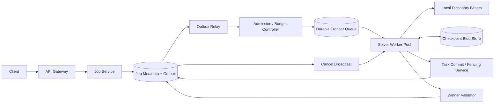

### 22.7 End-to-end flow

1. Job Service canonicalize board，生成 `request_hash/puzzle_hash`，并从 `(tenant_id, idempotency_key)` 确定性派生 `job_id` 与目标 partition。在 **一个本地事务** 中 compare-or-insert `SolveRequestIdempotency`，并首次创建 `SolveJob + root SearchTask + TaskAccounting + Outbox`；不存在“先 claim、后另开事务建 job”的 orphan window。已有 key 则比较 hash并返回同一 job/response；首次响应丢失时重试不会再烧一份 `600k vCPU-s`。
2. Admission Controller 先在一台大内存 Worker 上运行短时 sequential baseline。只有估计剩余工作超过阈值才晋升 distributed tier。
3. Worker 获取带 `lease_epoch` 的粗粒度 subtree，本地连续扩展数万到数百万个 node；仅当 `estimated_remaining_work` 足够大且集群有空闲资源时拆出 child tasks。
4. 找到候选解后，独立 Winner Validator 重放所有 word/交叉约束和 dictionary version；验证通过才 CAS 提交 `SOLVED`。
5. 其他 Worker 收到 cancel；同时每隔固定 expansion 数读取本地 terminal epoch，保证丢广播时也会停止。
6. 若所有 durable task 都 terminal、无有效 lease、延迟队列与 outbox 均越过 accounting barrier，coordinator 才提交 `NO_SOLUTION`。

### 22.8 Deep dive A：CSP heuristic 比“加机器”更重要

每个 slot 是 variable，候选 words 是 domain，intersection 是 binary constraint。热路径采用：

1. **MRV (Minimum Remaining Values)**：选择候选最少的未填 slot，尽快暴露矛盾。
2. 候选数相同时用 **degree heuristic**：优先影响最多邻居的 slot。
3. 候选 word 用 **LCV (Least Constraining Value)** 排序，保留邻居最大剩余 domain。
4. `positional bitset AND` 求 domain；填入后做 **forward checking**。更难题可局部启用 `arc consistency (AC-3)`，但要比较传播成本。
5. 使用 trail/delta 回滚 domain，避免每个 DFS node 深拷贝 board。

分布式边界放在 heuristic 之后：网络化一个 `5µs` node expansion 会彻底失败；一个 task 至少包含 `50–500ms` 预计本地工作，才能摊薄 queue、serialization 与 lease 成本。

### 22.9 Deep dive B：何时需要 global dedup

若所有 Worker 使用同一个 deterministic slot ordering，且每个 parent 的候选区间只分配一次，则搜索树中的每个 partial assignment 只有唯一父路径，通常不需要 global visited registry。源文档的“每个状态都 SHA-256 + Redis SETNX”会造成巨额网络与内存开销：

```text
100M states × 64B effective Redis footprint ≈ 6.4GB / job
20 concurrent jobs ≈ 128GB，尚未计算 replication
```

只有在允许不同变量顺序、对称变换或多种推导路径汇聚到同一 canonical state 时才去重。优先级是：

- 通过 deterministic expansion 从结构上消除重复；
- Worker 内 local hash set；
- 跨 Worker 仅对 coarse subtree root 做 exact CAS；
- 若重复只是成本而非正确性问题，可用 bounded Bloom/Cuckoo filter，但 false positive 可能错删唯一解，因此必须配置成“只作为优先级提示”，不能直接判死分支。

### 22.10 Deep dive C：lease、checkpoint 与 effectively-once result

Task delivery 是 `at-least-once`：Worker 可能完成计算但在提交前 crash，租约到期后其他 Worker 会重算。正确性依靠：

- `job_epoch + task_id + lease_epoch` 双层 fencing：任何 complete/split/checkpoint commit 都必须同时 CAS `SolveJob.state = RUNNING AND SolveJob.job_epoch = task.job_epoch`，所以 CANCEL/TIMEOUT 后即使旧 task lease 尚未过期也不能提交 child/result；
- child creation 使用 deterministic child ID，例如 `hash(parent_task_id, candidate_range)`，重复写由 unique key 吸收；
- `TaskCompleted + child task journal rows + accounting delta + outbox` 在同一个 job-local partition 事务提交，避免 parent 完成但 child 丢失；分布式 ready queue 只消费 journal，漏投可由 watermark/reconciliation 重建；
- checkpoint 是性能优化，不是唯一真相；corrupt/missing checkpoint 可从 subtree root 重算。

“Exactly once”只适用于 `JobTerminal` 的条件提交和用户看到的单一 canonical result，不适用于实际 CPU work。

### 22.11 Deep dive D：可靠证明 NO_SOLUTION

队列瞬时为空并不代表无解：消息可能仍在 outbox、Worker 正在计算、lease 过期任务尚未 requeue。使用 job-local termination accounting：

```text
outstanding = committed_tasks_created - committed_tasks_terminal
```

只有以下条件在同一 `accounting_epoch` 上成立才结束：`outstanding = 0`、`valid_leases = 0`、frontier consumer watermark 已越过全部 committed outbox、没有 retry timer，且 job 未产生 winner。Coordinator 再等待一个 bounded grace interval，按 **job journal** 做 authoritative scan / reconciliation，验证 `last_journal_seq` 与 counter 后才 CAS 到 `NO_SOLUTION`。这不是跨 shard 猜测全局空闲；若确实将一个 job 的 authority 拆到多分片，就必须引入 distributed transaction/termination protocol，不能沿用这里的本地事务证明。大规模场景可用 Dijkstra-Scholten 类 distributed termination detection，但面试中 job-local journal + transactional counters 更易证明。

### 22.12 Reliability、multi-region、security

- Worker crash：lease 到期重派；checkpoint checksum 校验失败则回到 subtree root。
- Queue backlog：停止 dynamic split，让 Worker 本地 DFS；超过租户预算则 `TIMEOUT`，而不是继续制造任务。
- Dictionary 发布：manifest 先写 immutable blobs/checksum，再原子切换 version pointer；job 固定 version，禁止中途漂移。
- Region failure：job 有明确 home region；metadata 与 frontier 同步写 paired-region safety journal。Failover 只有在追上 `job_safety_watermark` 后提升新 epoch，旧 region 的 lease 全部 fenced。Checkpoint 可异步复制，允许有限重算。
- 输入安全：限制 board/slot 数、dictionary size、deadline 与 expansion budget；防 decompression bomb、恶意高分支任务和跨租户 object reference。
- 结果校验与执行 Worker 隔离，避免 bug 或被入侵 Worker 伪造答案。

### 22.13 可选 MLE：learned heuristic 不能进入 correctness boundary

可训练一个 model 预测 `(slot, candidate)` 的成功概率或剩余 subtree cost，用于排序、dynamic split 和 budget allocation。特征包括 domain size、intersection degree、letter rarity、depth、历史 expansion rate；label 是是否进入最终解、subtree node count 或 time-to-dead-end。

- Offline：与 MRV/LCV baseline 比较 median/P95 expanded nodes、solve rate under fixed vCPU budget。
- Online：小流量 shadow/A-B，guardrail 是 correctness、timeout、cost 和 tenant fairness。
- Fallback：模型不可用或 drift 时立即回 MRV/LCV；模型只改变搜索顺序，绝不能删除被规则允许的候选，因此不会改变 completeness。

### 22.14 Observability、SLO 与 cost

核心指标：`solve_rate_by_size`、time-to-first-solution、nodes/s、prune ratio、split amplification、duplicate coarse task rate、lease expiry/recompute vCPU、frontier depth、checkpoint bytes、cancel propagation lag、termination reconciliation mismatch、vCPU-s/job 与 $/solved-job。

Trace 以 `job_id/task_id/lease_epoch` 贯穿。告警不能只看 CPU：当 `nodes/s` 正常但 prune ratio 暴跌，通常是 dictionary/heuristic 版本回归；当 outstanding counter 长期非零但无有效 lease，是任务生命周期泄漏。

### 22.15 Trade-offs 与 V1 -> V3

- **V1**：单机 CSP + bitset + MRV/LCV，覆盖绝大多数题。
- **V2**：durable coarse frontier、lease/fencing、checkpoint、single winner 与 budget control。
- **V3**：多租户公平调度、paired-region safety journal、learned ordering、可复现 benchmark。

不要一开始就上全局 Redis state registry；先测“重复率是否真的高于 registry 成本”。不要宣称任何规模都能在 5 分钟解决；NP-hard 搜索必须用 deadline 与资源预算定义产品语义。

### 22.16 高频 follow-up Q&A

**Q：为什么不用 BFS？**  
A：BFS frontier 内存随分支数指数膨胀；本题只需任意解，深搜配合强约束传播通常更快。并行时保留 bounded priority frontier，而非纯 DFS/BFS 二选一。

**Q：两个 Worker 同时找到解怎么办？**  
A：两者都可提交 proposal，但 validator 后对 `SolveJob(state=RUNNING, epoch)` 做 CAS，只有一个 canonical winner；第二个得到现有结果。

**Q：如何保证无解判断不会过早？**  
A：使用 transactional task accounting、lease/retry/outbox watermark barrier，并在 terminal CAS 前 reconciliation；不以 queue empty 作为证据。

**Q：Worker failover 时会不会重复算？**  
A：会，且这是有意接受的 at-least-once work；fencing 保证重复工作不能污染 canonical task graph 或 result。

### 22.17 60 秒总结

> “我把 Crossword 建模为 CSP，先用 positional bitset、MRV/degree/LCV 与 forward checking 降低单机搜索量，再只把 50–500ms 以上的粗粒度 subtree 放入 durable frontier。任务靠 lease epoch 和 deterministic child ID 容忍重复执行，checkpoint 只减少重算；winner 用独立验证加 CAS 得到唯一 canonical result。No Solution 不是看到队列空，而是 transactional outstanding counter、有效 lease、outbox watermark 与 retry timer 同时归零后再 reconciliation。最后以 admission、vCPU budget 和退化到本地 DFS 控制指数爆炸成本。”

---

## 23. Design Google Calendar：Recurrence、多人邀请、同步与 Free/Busy

> **Source digest — `design google calender.docx`**：源文档的 `Series + Sparse Exceptions`、push invalidation + delta sync、FreeBusy derived view 是正确主线。需要校正：日历不应把所有读都做成跨地域强一致；event aggregate 强一致，但 calendar view、search 和 free/busy 可带 freshness watermark 最终一致。Free/busy 是约时建议，不防止冲突；会议室等独占资源必须在最终创建时走强一致 reservation。还要补上 `time zone / DST`、series split 后 exception 迁移、邀请跨用户投影与 sync-log compaction。

### 23.1 题意与 framing

设计一个全球日历系统，支持单次与 recurring event、邀请/RSVP、周/月视图、跨设备离线同步、free/busy、会议室资源和提醒。

> “我会把 `EventSeries` 作为权威 aggregate，把每次实例定义为 `(series_id, original_start)`，只为被修改/取消的 occurrence 写 sparse exception。写请求路由到 event home shard 做 OCC；每位用户的 calendar view、sync log、free/busy 是可重建 projection。最难的三点是 DST 下的 recurrence identity、离线多端冲突，以及 free/busy 的 freshness 与最终资源预订的强一致边界。”

### 23.2 Requirements 与 SLO

**Functional requirements**

1. 创建、读取、修改、删除单次或循环 event；修改范围支持 `SINGLE / THIS_AND_FUTURE / ALL`。
2. 添加内部/外部 attendee，处理 `NEEDS_ACTION / ACCEPTED / DECLINED / TENTATIVE` RSVP。
3. 按时间窗加载多 calendar view；多设备在线失效通知、离线 delta sync。
4. 查询多人 free/busy，建议 meeting slot；可预订 room/resource。
5. reminder、ACL、share、external invite delivery 与审计。

**SLO / correctness**

- 周视图 P95 `< 200ms`；10 人 × 14 天 free/busy P95 `< 500ms`。
- event mutation 在 home region P99 `< 300ms`，`read-your-writes` 立即成立；其他用户 projection P95 `< 5s` 收敛。
- 组织者的 event master、attendee RSVP、room reservation 不发生 lost update；提醒允许 at-least-once delivery，但用户体验去重。
- Region 故障下个人 view 可读；无法证明 room ownership 时新预订 fail-closed。

**Out of scope**：视频会议媒体、邮件服务内部实现、复杂企业 HR directory；只定义接口。

### 23.3 Capacity estimates

假设 `100M DAU`：每人每天打开/刷新视图 20 次、产生 2 次 event/RSVP mutation，峰值系数 `10×`。

```text
View reads = 100M × 20 / 86,400 ≈ 23.1k QPS average
Peak view reads ≈ 231k QPS

Mutations = 100M × 2 / 86,400 ≈ 2.3k QPS average
Peak mutations ≈ 23k QPS
```

若一次 mutation 平均影响 organizer + 3 attendees，则约 `800M user-projection changes/day`：

```text
800M / 86,400 ≈ 9.3k change rows/s average
Peak ≈ 93k/s
```

假设在线保留 `50B` 个 EventSeries/单次 event row，每行含索引约 `700B`：`35TB logical`，3 副本约 `105TB`。Attendee 平均 3 行、每行 `200B`：

```text
50B × 3 × 200B = 30TB logical
3 replicas ≈ 90TB
```

FreeBusy 只物化活跃用户未来 60 天：`100M × 60 = 6B day blocks`；每个合并区间块平均 `250B`，约 `1.5TB logical / 4.5TB replicated`。不能为无限 recurrence 全量展开。

### 23.4 API 与 event contracts

```http
POST /v1/events
Idempotency-Key: <uuid>
{
  "calendar_id":"cal_1",
  "start":{"local":"2026-11-01T09:00:00","tzid":"America/Los_Angeles"},
  "end":{"local":"2026-11-01T09:30:00","tzid":"America/Los_Angeles"},
  "rrule":"FREQ=WEEKLY;BYDAY=MO",
  "attendees":["u_2","u_3"]
}

PATCH /v1/events/{series_id}?scope=SINGLE&recurrence_id=<original-start>
If-Match: "event-version-42"

PATCH /v1/events/{series_id}?scope=THIS_AND_FUTURE&recurrence_id=<original-start>
DELETE /v1/events/{series_id}?scope=...
PATCH /v1/events/{series_id}/attendees/me
GET /v1/calendars/events?start=...&end=...&page_token=...
POST /v1/freebusy
POST /v1/resources/{resource_id}/holds
Idempotency-Key: <uuid>
-> 201 {"hold_id":"h_1","hold_epoch":7,"expires_at":"..."}
POST /v1/resources/{resource_id}/holds/{hold_id}/confirm
If-Match: "hold-epoch-7"
DELETE /v1/resources/{resource_id}/holds/{hold_id}
If-Match: "hold-epoch-7"
GET /v1/sync?cursor=<opaque>&limit=500
```

事件必须能幂等重放：

```text
EventAggregateChanged(event_id, series_id, family_id, event_version, organizer_id,
                      affected_user_ids, change_kind, effective_range, occurred_at)
RsvpChanged(event_id, series_id, calendar_id, event_version,
            attendee_id, attendee_version, status)
ResourceHoldChanged(event_id, resource_id, hold_id, hold_epoch, state, start, end)
ResourceReservationCommitted(event_id, resource_id, hold_id, reservation_id,
                             start, end, reservation_epoch)
ReminderDue(reminder_id, user_id, occurrence_id, fire_at, reminder_version)
```

`event_id/event_version` 去重并拒绝旧 projection；提醒 idempotency key 是 `(reminder_id, occurrence_id, reminder_version)`。

### 23.5 Data model、partition、index 与状态机

- `Calendar(calendar_id PK, owner_id, home_region, tzid, acl_version, version)`
- `EventSeries(series_id PK, root_series_family_id, calendar_id, organizer_id, dtstart_local, tzid, duration, rrule, split_from, split_at, status, version)`
- `EventException(series_id, recurrence_id, override_start, override_tzid, override_fields, status, version)`
- `Attendee(series_id, attendee_id/email, role, rsvp_status, attendee_version)`
- `CalendarProjection(user_id, occurrence_date_bucket, occurrence_id, start_utc, end_utc, visibility, source_version)`
- `UserChange(user_id, user_seq, entity_id, entity_version, change_kind, payload_ref)`
- `FreeBusyDay(user_id, local_date, merged_busy_intervals, source_watermark)`
- `ResourceReservation(resource_id, hold_id, start_utc, end_utc, state, hold_expires_at, hold_epoch, reservation_epoch, idempotency_key, request_hash)`
- `Reminder(reminder_id, occurrence_id, fire_at, status, delivery_attempt)`

Event authority 按不可变的 `hash(root_series_family_id)` 路由到 home shard；原始 series 与所有 `THIS_AND_FUTURE` split descendants 永远共置，不能用新 `series_id` 重新 hash。`UserChange` 按 `user_id` 分区并在该 user shard 内单调递增，不追求全局 sequence。CalendarProjection 索引 `(user_id, start_utc)`；Exception 主键 `(series_id, recurrence_id)`。Resource 以 `resource_id` 单写，并用 range exclusion / serial transaction 防重叠；hold 的 create/confirm/cancel 都由 `(resource_id, hold_id, hold_epoch)` fence 且持久幂等。

Event state：`CONFIRMED -> CANCELLED`；invitation state 独立为 `NEEDS_ACTION <-> ACCEPTED/TENTATIVE/DECLINED`。不要把 organizer event status 与每个 attendee RSVP 混成一个字段。

### 23.6 Proposed architecture

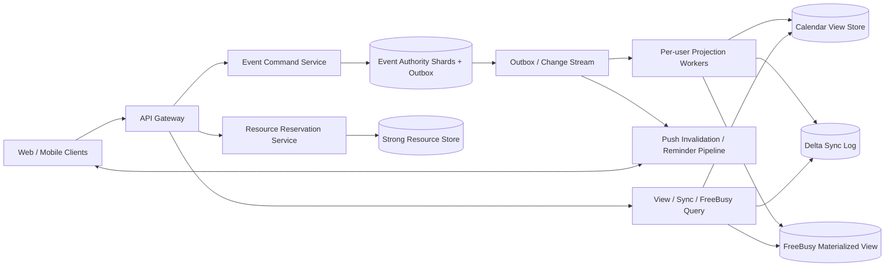

### 23.7 核心 flows

**创建与邀请**：Event Service 在 series home shard 的一个事务写 master、attendees、idempotency row 与 outbox。Projection Worker 为 organizer/attendees 产生各自 view/sync rows；外部邮箱走异步 invitation delivery。Attendee RSVP command 仍路由回 series owner，成功后再投影，避免每个用户各有一份互相冲突的 master。

**视图查询**：先从 CalendarProjection 取已物化单次 event；对 recurring series 仅在请求窗口内展开、批量加载 exception，再合并排序。热门窗口可 cache，但返回 `view_watermark`。

**离线同步**：设备保存 opaque per-user cursor。重连先 pull server delta 并更新 local cache，再按原始 `base_version` 重放本地 mutation；冲突返回 `409 + current canonical entity + conflict fields`。若 cursor 已被 compact，返回 `410 SNAPSHOT_REQUIRED`，客户端获取新 snapshot 和 cursor。

**提醒**：Projection 生成未来 bounded horizon 的 reminder tasks；timer wheel/delayed queue 投递。发送重复可接受，客户端和 notification service 按 reminder key 去重。

### 23.8 Deep dive A：Recurrence identity、DST 与 sparse exceptions

Master 保存 RFC 5545 风格 `RRULE + DTSTART local + TZID`。Occurrence identity 不能用当前 `start_utc`，因为单次移动后它会改变；使用 `(series_id, recurrence_id)`，其中 recurrence_id 是该实例在原系列时区下的 **original scheduled local start**，并保存规则/tzdb version 以便重放。

DST 必须先声明产品 policy：

- 09:00 weekly meeting 通常保持当地墙钟 `09:00`，UTC 会随 DST 改变；
- 遇到不存在的 local time（spring forward）可跳到下一合法 instant 或标记需要用户确认；
- ambiguous time（fall back）保存 offset/fold，禁止客户端与服务端自行猜测；
- tzdb 更新后后台 re-expansion，只改未来 projection，不偷偷改 historical occurrence identity。

`SINGLE` 只 upsert exception。`THIS_AND_FUTURE` 生成新 `series_id`，但继承同一个 `root_series_family_id`，因此仍路由同一 authority partition；在一个本地 transaction 中截断旧 series、创建新 series、记录 `split_from/split_at`、迁移或重解释切点之后的 exception/attendee override，并发出一个原子 aggregate event。旧邀请链接经 family alias 映射到新 series，避免 RSVP 丢失。若底层无法保证 family co-location，就必须改成带 barrier/alias 的 Saga，并在完成前冻结该 family mutation，不能仍声称 local atomic。

### 23.9 Deep dive B：多设备 sync 的一致性边界

WebSocket/APNs/FCM 只发送“user_seq 已推进到 N”的 invalidation，不携带权威全量状态。可靠性来自 pull-based delta log：

- Event transaction 与 outbox 原子；projection consumer 幂等。
- 每个 user shard 分配 `user_seq`，客户端可检测 gap 并 backfill。
- 同一设备 mutation 带 `client_mutation_id`，断线重试返回相同结果。
- `If-Match/version` 防 lost update；字段可安全合并时（例如不同 attendee 各改自己的 RSVP）由 server aggregate command 自动合并，否则显式冲突。
- Sync log 按 retention 压缩；snapshot 与 cursor 来自同一 watermark，避免 snapshot 后漏事件。

### 23.10 Deep dive C：Free/Busy 快但不冒充强一致

FreeBusyDay 是 privacy-minimized derived state，只含合并后的 busy interval 和 `source_watermark`。写 event 后异步重算受影响的用户/日期；recurring event 只展开未来 `30–60` 天，远期请求按需计算并 cache。

查询 10 人 × 14 天可一次 batch/MGET 取 140 个 day block，再用 sweep-line / multiway interval intersection 计算共同空档。响应带每个用户的 freshness；若 watermark 落后超过阈值，服务可同步读取 event authority 做 targeted repair，或明确标记 `tentative`。

Free/busy 永远只是 advisory：两个人可能在看到空档后同时创建会议。普通个人 calendar 接受这种产品语义；room、设备或医生号源等独占资源必须先创建短 TTL hold，拿到 `hold_id + hold_epoch + expires_at`，再用 idempotent confirm 在 resource home shard 的 serializable transaction / range exclusion constraint 中转为 `COMMITTED`。重复 confirm 返回同一 reservation；过期/已 cancel 的 epoch 不能复活，confirm 与 cancel 竞争只允许一个状态转换。Region partition 时无法取得 ownership lease就拒绝新 reservation。

### 23.11 Deep dive D：大规模查询、hot user 与 ACL

- View 不做 `OFFSET` 深翻页；token 固定 `query window + last(start_utc, occurrence_id) + view_watermark`。
- 超大型组织者 event 的 attendee projection 分批 fan-out；master 先成功，UI 展示 projection progress。不能在一个 SQL transaction 写 100k attendee calendars。
- ACL 变更推进 `acl_epoch`；query 必须校验 capability 中的 epoch。撤销共享时先让旧 freshness lease 失效，再确认完成，避免 cache 泄露。
- Search index、view cache、freebusy 都是 derived；event authority 是恢复锚点。

### 23.12 Reliability、multi-region、privacy 与 abuse

- Event home region 内多 AZ quorum；user projection 跨地域异步，但 canonical event command 默认在 ACK 前同步追加 paired safety journal，记录 family/version/idempotency mutation，resource reservation 同样如此。
- Failover 只有追上 `calendar_safety_watermark` 后才能提升新的 `owner_epoch` 并接受 event/resource mutation，旧 region 被 target-side fence。若产品为个人 event 明确选择 `RPO > 0` 以换低延迟，则灾备期间必须进入 read-only/quarantine，等待最大复制 lag、合并旧 tail 与 client mutation IDs、修复 family version 后再开放写；不能只提升 epoch 后立刻接受可能冲突的新写。视图可继续读 stale cache并显示同步状态。
- Outbox lag 时保护 command path，暂停低价值 reindex/reminder pre-generation；reminder 临近 deadline 优先。
- 最小化 free/busy disclosure；按 requester ACL、tenant policy 和时间范围 rate limit。External invite token 短寿命、single-purpose、可撤销。
- 防 calendar spam、invite bombing 与 malicious recurrence expansion；限制 attendees、RRULE 展开数、窗口和 reminders。

### 23.13 MLE deep dive：meeting-time recommendation

先用 deterministic baseline：hard constraints（所有人 free、working hours、room capacity）过滤，再按 time-zone fairness、历史偏好、会议长度与 travel buffer 打分。ML ranker 只重排合法 slots：

- Label：organizer 选择、attendee decline/reschedule、meeting completion；避免把“第一个展示”当真实偏好。
- Features：local hour、weekday、time-zone burden、participant seniority 不应成为不透明歧视信号；个人敏感偏好需 consent。
- Offline：NDCG/acceptance prediction、time-zone burden distribution；Online：selection rate、decline/reschedule、time-to-schedule。
- Fallback：模型失败即回规则排序；不能越过 busy/ACL/resource constraints。

### 23.14 Observability、cost 与 SLO

监控 user journey：event write success、projection lag P50/P99、sync gap/410 rate、recurrence expansion CPU、exception lookup ratio、freebusy freshness、room conflict rejection、reminder on-time rate、outbox backlog、ACL stale-deny/allow audit。

成本热点不是 Event row 本身，而是 attendee fan-out、长期 sync retention、无限 recurring materialization 和 reminder task。用 bounded horizon、log compaction、large-event batch projection 与 cold history archive 控制成本。

### 23.15 Trade-offs 与 evolution

- **V1**：单地域 SQL、series + exception、OCC、轮询 sync。
- **V2**：outbox、per-user delta log、push invalidation、FreeBusy materialization、room reservation。
- **V3**：regional ownership/fencing、large-event workflow、learned slot ranking、tenant compliance/legal audit。

不应一开始拆成 Event/Invite/RSVP 多个独立写主；先让一个 aggregate transaction 容易证明，再把派生读和异步副作用拆开。

### 23.16 高频 follow-up Q&A

**Q：永久 recurring event 会不会无限占存储？**  
A：master 只存一条 RRULE，exception 稀疏存储，projection/reminder 只物化 bounded horizon；远期按请求展开。

**Q：为什么 free/busy 可以 eventual consistency？**  
A：它用于推荐，不是最终独占承诺；响应带 freshness。真正需要防双订的 room 在权威资源 shard 提交。

**Q：如何处理离线两端同时编辑？**  
A：每个 mutation 带 base version 和 client mutation ID；安全的独立子资源可合并，冲突字段返回 409，不做 last-write-wins 静默覆盖。

**Q：邀请 100k 人怎么办？**  
A：event master 与受邀名单批次定义先提交，fan-out projection 是可重试 workflow；客户端显示 delivery/projection progress，不能同步写 100k 用户分片。

### 23.17 60 秒总结

> “Calendar 的权威写模型是 EventSeries + sparse EventException，occurrence 由 original recurrence_id 标识，DST 按系列 TZID 和明确 policy 展开。Event/RSVP 写路由到 series home shard 做 OCC 和 outbox；每个用户的 view、delta sync 与 free/busy 都是有 watermark 的 derived projection。设备靠 push invalidation + cursor pull 收敛，过期 cursor 重取同 watermark snapshot。Free/busy 只给建议，会议室等独占资源必须经过 hold 和强一致 reservation。最后用 owner epoch、ACL epoch、bounded horizon 与 large-event workflow 解决跨地域、安全和成本问题。”

---

## 24. Design Lowest-Cost Book Purchasing：实时比价、外部扇出与自动购买

> **Source digest — `design online book.docx`**：源文档提出 async 202、seller adapter、tiered fan-out、short-lived quote cache、request coalescing 和 per-seller rate limit，方向正确。关键修正是：`first acceptable offer + early exit` 不能同时宣称“全网最低价”；必须让产品在 exact-lowest 与 deadline-bounded best-effort 中选一个。ISBN 只标识 edition，真正可比的是 `condition/format/shipping/tax/currency/delivery SLA` 后的 landed cost。Redis 锁也不能保证不重复购买；幂等必须落在 durable request/attempt row、向 seller/processor 透传的 idempotency key 与 reconciliation 上。

### 24.1 题意与 framing

用户提交一本书、配送区域、最高 `landed price` 与自动购买授权。系统连接 100–200 个异构 seller，收集可比较报价，在截止时间内选择最优可执行 offer，并完成支付与外部下单。

> “我会先问清楚‘lowest’是等所有 seller 回答后的 exact minimum，还是 5 秒 deadline 内的 best-known offer。前者会被最慢 seller 决定延迟，后者才能 early exit，但 API 必须诚实标注 coverage。架构上我会把 quote discovery 与 irreversible purchase saga 分开：报价可缓存、合并与容错；下单则用 durable attempt、external idempotency、状态 UNKNOWN 的查询恢复以及 payment authorize/capture 来保证不重复。”

### 24.2 Requirements、SLO 与 product semantics

**Functional requirements**

1. 提交 `ISBN/edition + format + condition + destination + currency + max_total + deadline`，返回异步 request。
2. 标准化 seller 的 price、tax、shipping、stock、delivery date、return policy，给出可比较 offer。
3. 支持两种模式：`EXACT_COVERAGE` 等全部 eligible seller 或明确 timeout；`BEST_EFFORT` 在 deadline/quality threshold 下选择 best-known。
4. 自动 payment authorization、seller order、capture/void；查询最终状态、receipt、失败与 coverage。
5. 用户在进入 irreversible step 前可取消；失败/unknown 可人工恢复和 reconciliation。

**SLO / correctness**

- `POST` P99 `< 200ms`；best-effort quote decision P90 `< 5s`。
- 不购买超过用户 `max_total` 的 offer；同一 purchase request 对用户最多 capture 一次、对 seller 最多产生一个 canonical order。
- Seller 局部故障不拖垮系统；每个 connector 有独立 bulkhead、rate limit、circuit breaker。
- `EXACT_COVERAGE` 响应必须携带 contacted/responded/timed_out seller 集合，不能把 partial result 冒充全网最低。

**Out of scope**：平台自营库存、购物车、多件合单和跨境报关；可在 follow-up 扩展。

### 24.3 Capacity estimates

沿用源文档 `200 purchase requests/s average`、峰值 `10× = 2,000/s`，100 个 eligible sellers：

```text
Naive outbound calls = 200 × 100 = 20k/s average
Peak = 2,000 × 100 = 200k/s
```

若每个 seller 响应/headers 合计约 `2KB`，naive ingress 为 `40MB/s average / 400MB/s peak`。在 5 秒 deadline 下，峰值同时存在：

```text
2,000 requests/s × 5s = 10,000 active workflows
10,000 × 100 = 1,000,000 outbound calls in flight (worst case)
```

这超过多数 partner quota，也会耗尽连接池。若 cohort cache、request coalescing 和 tiering 把平均调用数从 100 降到 12：`2.4k/s average / 24k/s peak`，外呼减少 `88%`。

每天请求量 `200 × 86,400 = 17.28M`。主 request/offer summary 平均 `1KB`，约 `17.3GB/day`、`6.3TB/year logical`；三副本约 `19TB/year`，raw seller payload 应压缩后短期保存并转冷存储。假设购买转化 5%，平均 `10 purchases/s`、峰值 `100/s`，不可逆 saga 的吞吐远小于报价流，但 correctness 更严格。

### 24.4 API 与 contracts

```http
POST /v1/purchase-requests
Idempotency-Key: <uuid>
{
  "isbn13":"978...",
  "format":"HARDCOVER",
  "condition":"NEW",
  "ship_to":{"country":"US","postal_code":"98101"},
  "currency":"USD",
  "max_landed_amount_minor":3000,
  "selection_mode":"BEST_EFFORT",
  "decision_deadline_ms":5000,
  "payment_method_token":"pm_tok"
}
-> 202 {"request_id":"pr_1", "status":"QUOTING"}

GET /v1/purchase-requests/{id}
POST /v1/purchase-requests/{id}/cancel
POST /v1/purchase-requests/{id}/actions/{action_id}/confirm
Idempotency-Key: <uuid>
{"action_token":"short-lived-token","result":"completed"}
GET /v1/purchase-requests/{id}/offers?page_token=...
```

结果必须区分：

```json
{
  "status":"SUCCEEDED",
  "selected_offer":{"seller_id":"s_7","landed_amount_minor":2499},
  "coverage":{"seller_snapshot_id":"ss_42","eligible":120,"contacted":24,"responded":19,"timed_out":5},
  "optimality":"BEST_KNOWN_BEFORE_DEADLINE",
  "seller_order_id":"...",
  "receipt_id":"..."
}
```

事件：`QuoteRequested`, `SellerQuoteObserved`, `OfferSelected`, `PaymentAuthorized`, `SellerOrderAttempted`, `SellerOrderResolved`, `PaymentCaptured`, `PurchaseTerminal`。每个事件含 `event_id, request_id, workflow_epoch, attempt_no, source_version`。

### 24.5 Data model 与状态机

- `PurchaseRequest(request_id PK, user_id, request_fingerprint, mode, seller_snapshot_id, max_total, destination_bucket, deadline_at, state, workflow_epoch, selected_offer_id, version)`
- `SellerEligibilitySnapshot(snapshot_id PK, seller_config_version, eligibility_policy_version, eligible_seller_ids_ref, eligible_set_hash, created_at)`，对一次 request immutable。
- `QuoteCohort(cohort_key, isbn, format, condition, destination_zone, currency, in_flight_owner, expires_at)`
- `SellerOffer(offer_id, request/cohort_id, seller_id, item_price, tax, shipping, landed_total, stock_token, valid_until, normalized_hash)`
- `PurchaseAttempt(attempt_id PK, request_id UNIQUE, seller_id, offer_hash, external_idempotency_key, state, request_payload_hash, external_order_id, last_checked_at)`
- `PaymentAuthorization(auth_id, request_id UNIQUE, processor_key, amount, state, processor_ref, action_id, action_expires_at, action_version)`
- `SellerConnector(seller_id, protocol, credential_ref, quota_policy, health_score, schema_version)`
- `Outbox(event_id PK, aggregate_id, payload, published_at)`

```text
RECEIVED -> QUOTING -> OFFER_SELECTED -> AUTHORIZING
AUTHORIZING -> ACTION_REQUIRED -> AUTHORIZING  (confirmed, unexpired action)
AUTHORIZING -> ORDERING -> CAPTURING -> SUCCEEDED
any reversible state -> CANCELLED / EXPIRED / FAILED / MANUAL_REVIEW
external timeout     -> UNKNOWN_EXTERNAL -> resolved prior state / MANUAL_REVIEW
```

`UNKNOWN_EXTERNAL` 不是失败：表示 RPC timeout 后 seller/processor 可能已成功，系统必须 query/reconcile，禁止直接创建新 attempt。

### 24.6 Proposed architecture

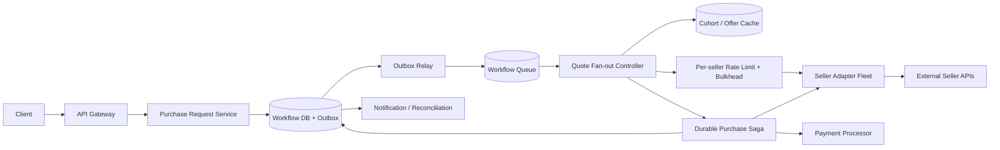

### 24.7 核心 flows

1. Request Service canonicalize body，验证支付 token，但不接触 PAN；同一 idempotency key + body fingerprint 返回同一 request。它在接单时基于 seller config/region/contract/format 冻结 `SellerEligibilitySnapshot`，事务写 request/snapshot ref/outbox 后返回 202。
2. Fan-out Controller 查 `QuoteCohort`。可安全共享的只是同 ISBN、condition、destination zone、currency 的 quote discovery；用户支付、预算和购买决策绝不共享。
3. 先请求历史表现最好的 seller tier；逐级扩大。所有结果转为 `landed_total`，校验 currency、tax/shipping、stock token 与 validity。
4. Selection Engine 按用户 mode 决策并冻结 `offer_hash`。进入 purchase 前对 winner 做一次 authoritative revalidation。
5. Saga 先 payment authorize，再用 request-derived external idempotency key 下 seller order；成功后 capture。Seller 明确失败则 void authorization；timeout 则进入 UNKNOWN 并查询，不能盲目重试另一单。
6. 最终状态通过 polling/webhook/push 告知用户；后台持续 processor/seller reconciliation。

### 24.8 Deep dive A：exact lowest、deadline 与 early exit

三种可讲清的产品合同：

- **Exact over frozen eligible set**：request 创建时冻结 `seller_snapshot_id + eligible seller IDs/hash + policy/config version`；等待该集合内所有 seller 到达 terminal response。运行中 connector 上下线不会改变分母；任何超时都使结果是 `INCOMPLETE`，不能称 exact global minimum。若政策要求排除失效 seller，只能创建有审计记录的新 snapshot/新 request，不能悄悄改旧 request 的“exact”定义。
- **Deadline-bounded minimum**：到 deadline 选已收到的最低 landed total，并报告 coverage。这是默认可用模式。
- **Satisficing**：出现低于用户 target 或模型阈值的 offer 即 early exit，优化速度/外呼成本，不优化绝对最低。

若面试题明确“最低成本”，就不能看到 `$24.99 < $30` 立刻取消可能返回 `$22` 的请求。可以安全 early-stop 的条件是：所有未返回 seller 都有可信的 lower bound，且当前 best `<= min(unseen lower bounds)`；现实中通常没有这种证明，所以只能改变产品语义或等待 deadline。

比较维度是：

```text
landed_total = item_price + tax + shipping + duties - guaranteed_discount
```

还要把 condition、edition、delivery SLA、returnability 作为 hard filter，不能把二手平装与全新精装只按价格比较。

### 24.9 Deep dive B：safe coalescing 与 cache freshness

`ISBN + price bucket` 不是安全 coalescing key：配送税、seller eligibility、库存、condition 都可能不同。使用 `cohort_key = hash(isbn, format, condition, destination_zone, currency, membership_tier)`，并满足：

- Quote result 只作为候选 discovery；购买前必须 revalidate。
- Singleflight owner 有 lease/epoch；owner crash 后 waiter 可接管。
- Waiter 有自己的 deadline，不能被慢 cohort 永久阻塞。
- Cache value 保存 `observed_at, valid_until, seller_quote_id, schema_version`；负缓存 TTL 更短。
- 热门书 stampede 使用 stale-while-revalidate，但 stale offer 不直接购买。

### 24.10 Deep dive C：真正的 purchase idempotency

Redis `SETNX(ISBN, seller, price)` 既会误拦不同用户，也可能在 failover/TTL 后重复下单。正确做法：

1. 在 durable DB 对 `(request_id, purchase_kind)` 设 unique constraint；事务创建唯一 PurchaseAttempt 与 outbox。
2. `external_idempotency_key = hash(platform, request_id, seller_id, attempt_kind)`，每次重试向同一 seller 传同一个 key；不能用新的随机 key。
3. Store request payload hash；相同 key、不同 body 返回 409，防客户端误用。
4. RPC timeout 后状态 `UNKNOWN_EXTERNAL`，按 seller order lookup endpoint、webhook 或 statement 对账；在证明原 attempt 失败前禁止第二次下单。
5. Payment capture 也以 request_id 做 processor idempotency；internal ledger entry unique on `(request_id, entry_type)`。

端到端仍是 `at-least-once message delivery + effectively-once business effect`，不能声称网络层 exactly once。

### 24.11 Deep dive D：Payment + seller order Saga

默认平台作为 merchant/orchestrator：

1. Revalidate winner，锁定 `offer_hash + max amount`。
2. Authorize 用户支付，获得短期 hold；若 SCA/3DS 必须用户交互，创建带 `action_id, action_version, expires_at` 的 durable action，状态转 `ACTION_REQUIRED`，不偷偷下单。客户端用 scoped token 调 confirm/resume；重复 confirm 按 idempotency key 返回同一结果，过期 action 原子转 `EXPIRED` 或要求重新授权，旧 action version 被 fence。
3. 调 seller order API。明确成功则记录 external order ID；明确失败则 void auth。
4. Seller order 成功后 capture，金额不得超过 authorization/max_total；capture unknown 走 processor query。
5. 若 seller 成功而 capture 最终失败，进入 recovery/manual queue，不能假装可以自动“回滚”已发货外部订单；尝试 seller cancel 是 compensation，不是 ACID rollback。

每个跨系统步骤先持久化 intent/attempt，再发外部 RPC；回调、轮询与日终 reconciliation 是三层收敛机制。

### 24.12 Deep dive E：Politeness、backpressure 与 connector isolation

- 每 seller 独立 `token bucket + max inflight + bounded queue + circuit breaker`；quota 配置版本化。
- 全局 admission 根据 `expected_fanout_cost` 而非仅 request QPS 计费；一个 exact 200-seller job 比 10-seller job 消耗更多 token。
- Deadline-aware scheduling：剩余时间不足以完成某 tier 时不再启动，返回 coverage。
- Retry 仅针对 transport/明确 retryable error，使用 exponential backoff + full jitter，并确保不越过用户 deadline。
- Seller schema parser sandbox；脏价格、负税、currency mismatch、oversized body 进入 quarantine。
- Bulkhead 保证一个 seller 慢或 credential 失效只耗尽自己的连接池。

### 24.13 Multi-region、security 与 abuse

- PurchaseRequest 有 home region；quote discovery 可多地域并行，但 canonical selection/payment/order 由单 home owner + `workflow_epoch` 执行。
- Authorize/order/capture intent 同步写 paired-region safety journal 后才发外部 RPC；failover 必须追上 safety watermark 并 fence 旧 owner。
- Address 与 payment token 分区加密、最小权限和短 retention；原始 PAN 不进入系统。Seller credentials 放 KMS-backed secret store，按 connector 隔离。
- 防恶意用户用免费报价 API 扫 seller：per-user/IP/device quota、request deposit、budget-based admission。
- 防 seller 欺诈/价格诱导：signed raw response archive、revalidation、异常价 quarantine、dispute evidence。

### 24.14 MLE deep dive：seller ordering 与 price/latency prediction

ML 可以预测 `P(in_stock)`, latency, landed price distribution, purchase success，用于 tier ordering；objective 是在 deadline 下最小化 `expected landed cost + λ·latency + μ·external-call cost`。

- Label 来自最终 normalized quote/order，不把 timeout 一律标成 out-of-stock。
- Features：ISBN/category、seller、destination zone、hour、historical freshness；禁止用泄露未来结果的 post-response feature。
- Offline：coverage@K、best-price regret、latency calibration、seller fairness；Online：landed-cost regret、calls/request、deadline success、order failure。
- Exploration：保留少量随机 seller sampling，避免永远不给长尾 seller 展示造成 feedback loop。
- Fallback：静态 health/price tier；ML 只能决定询价顺序，exact mode 仍须满足 coverage contract。

### 24.15 Observability、cost 与 operations

核心指标：quotes/request、cohort hit/singleflight wait、seller success/timeout/parse error、per-seller quota utilization、coverage、price regret（事后可知样本）、decision latency、UNKNOWN age、duplicate external order/capture invariant、reconciliation break、authorization void lag、workflow backlog、$/request。

Trace 以 `request_id / attempt_id / external_idempotency_key` 贯穿，但日志绝不记录支付 token、完整地址或 seller secret。建立 operator console 展示 raw signed response、attempt timeline 与可安全重放动作。

### 24.16 Trade-offs 与 evolution

- **V1**：10 个 seller、deadline-bounded fan-out、SQL workflow、manual unknown recovery。
- **V2**：adapter fleet、per-seller bulkhead、cohort singleflight/cache、durable saga、reconciliation。
- **V3**：learned tiering、multi-region discovery、paired safety journal、seller quality/risk system。

不要把“更多 seller”当免费召回；每增加一个 connector 都增加 quota、schema drift、合规和 unknown-state 运维成本。

### 24.17 高频 follow-up Q&A

**Q：什么时候可以 early exit 还保证最低价？**  
A：只有当前 best 不高于所有未返回 seller 的可信 price lower bound；通常做不到，所以应把语义改成 deadline-bounded best-known 或等待完整 coverage。

**Q：缓存报价会不会买到过期库存？**  
A：缓存只做 discovery，selected offer 在授权/下单前用 seller quote token revalidate；失败就回 selection，而不是继续扣款。

**Q：seller timeout 后可以换一家买吗？**  
A：若 timeout 发生在只读 quote 可换；若发生在 order POST，先标 UNKNOWN 并 query/reconcile。未证明原单失败前换 seller 会买两本。

**Q：为什么先 authorize 再下单？**  
A：降低 seller 成功后用户无法付款风险；seller 失败可 void hold。它仍是 Saga，外部成功无法被数据库事务自动回滚。

### 24.18 60 秒总结

> “我先把 lowest 定义成 exact coverage 还是 deadline-bounded best-known，并用 landed cost 而非标价比较。Quote path 可用 seller adapters、cohort singleflight、短缓存、tiered fan-out 和 per-seller bulkhead 降低 100× 扇出，但缓存只做 discovery。Purchase path 则是完全不同的 correctness boundary：durable unique attempt、向 seller/processor 透传同一个 idempotency key、authorize -> order -> capture Saga，以及 UNKNOWN 状态的 query/webhook/reconciliation。最后用 workflow epoch、paired safety journal、coverage 指标和 ML exploration 控制跨地域、成本与长尾质量。”

---

## 25. Design Online Chess：实时对局状态机、棋钟与观战

> **Source digest — `design Online Chess Game System Desig.docx`**：源文档抓住了 `FEN/UCI`、WebSocket、sharded Actor、session fencing、append-only moves 与 leaderboard projection。需要修正：FEN 很小，问题不是“更新大字段”，而是每步的 durable write QPS 与同一 game 并发；Actor 在消息 ACK 前必须把 move 写入 replicated durable log，否则 crash 会丢已确认棋步；consistent hashing 也不会自动保证 rebalance 期间单 owner，需要 ownership epoch/fencing。Leaderboard 不能简单 `ZINCRBY +1`，rating delta 应在权威事务中按 Elo/Glicko 计算，Redis 只是投影。

### 25.1 题意与 framing

支持 ranked matchmaking、好友挑战、实时走棋、server-authoritative clock、断线重连、认输/和棋、历史复盘、rating leaderboard、观战与反作弊。

> “我会把每场 game 建模为一个按 game_id 分片的 single-writer Actor，但 Actor 只是执行所有者，不是唯一持久化真相。每个 move 在广播 ACK 前追加到该 game 的 replicated event log；snapshot 只是恢复优化。Ownership coordinator 发放递增 epoch，rebalance 时旧 Actor 被 fence。棋钟保存 remaining time 和 turn deadline，不每秒写库；move 与 timeout 事件在同一 Actor mailbox 中串行裁决。”

### 25.2 Requirements、SLO 与边界

**Functional requirements**

1. 按 server-side rating/region/time-control matchmaking；好友 challenge/accept。
2. 双方通过 WebSocket 提交 move、draw/resign，接收 canonical state、clock 和错误。
3. 规则引擎验证合法走棋，判定 checkmate/stalemate/repetition/50-move/timeout。
4. 断线重连、跨设备 takeover、历史 replay、rating/leaderboard。
5. 热门对局观战；反作弊与 moderation。

**SLO / correctness**

- 同 region move submit -> opponent visible P99 `< 200ms`；重连恢复 P95 `< 1s`。
- 已返回 `MOVE_ACCEPTED` 的棋步 RPO `0`；每个 game 有唯一 canonical order。
- 服务端棋钟是权威；客户端倒计时只做预测显示。
- Match/rating 不能重复结算；spectator 可延迟 `1–2s`、可丢中间 frame 后 snapshot catch-up。

**Out of scope**：棋力引擎对弈、语音视频、真钱博彩；反作弊只设计检测系统，不自动公开封禁策略。

### 25.3 Capacity estimates

沿用源文档 `1M DAU`、峰值 `500k concurrent games`。若一场平均 80 plies、每位用户每天 4 场，先把 player-games 除以双方，不能把一场棋算两次：

```text
Unique games/day = 1M users × 4 player-games / 2 players = 2M
Moves/day = 2M × 80 = 160M
Average move writes = 160M / 86,400 ≈ 1.85k/s
```

并发高峰若每场平均 12 秒产生一步：

```text
500k games / 12s ≈ 41.7k moves/s
设计峰值取 50k moves/s
```

玩家约 1M 条 WebSocket，加 100k 普通观战连接，30 秒 heartbeat：`1.1M / 30 ≈ 36.7k heartbeats/s`。Heartbeat 在 gateway 本地合并，不应每次写中心 Redis。

每个 move event（IDs、UCI、clock delta、hash、索引）按 `400B`：

```text
160M × 400B ≈ 64GB/day logical
3 replicas ≈ 192GB/day
≈ 70TB/year before indexes/retention tiering
```

每 20 步一个约 1KB snapshot：`160M / 20 = 8M snapshots/day ≈ 8GB/day logical`。历史冷存可压缩 PGN/event block。`50k moves/s` 峰值来自给定 `500k concurrent games / 12s` 的独立并发假设，因此不随日均修正而改变。

一个 100 万 spectator 的热门比赛，每步瞬间需要 100 万次 logical delivery；不能让 game Actor 逐连接循环，必须经过 regional pub/sub fan-out tree。

### 25.4 API、WebSocket 与 event contracts

```http
POST /v1/matchmaking/tickets
Idempotency-Key: <uuid>
{"mode":"RANKED","time_control":{"base_ms":300000,"increment_ms":3000}}

DELETE /v1/matchmaking/tickets/{ticket_id}
POST /v1/challenges
POST /v1/challenges/{id}/accept
GET /v1/games/{game_id}/join-token
GET /v1/games/{game_id}/snapshot
GET /v1/games/{game_id}/moves?after_seq=...
GET /v1/leaderboards/{season}?cursor=...
```

```text
WS client -> server:
SubmitMove(game_id, client_action_id, expected_move_seq, participant_session_epoch,
           uci, client_observed_at)
GameCommand(kind=RESIGN|OFFER_DRAW|RESPOND_DRAW, client_action_id, expected_version)

WS server -> client:
MoveAccepted(action_id, move_seq, uci, fen, white_ms, black_ms, state_hash)
MoveRejected(action_id, reason, canonical_move_seq, snapshot_ref?)
GameTerminal(result, reason, final_seq, rating_pending)
ResyncRequired(snapshot_version, after_seq)
```

Durable events：`GameCreated`, `MoveCommitted`, `ClockExpired`, `PlayerResigned`, `DrawOffered/Resolved`, `GameTerminated`, `RatingCalculated`。每项含 `game_id, game_epoch, seq, event_id, prev_state_hash, new_state_hash`。

### 25.5 Data model、partition 与状态机

- `Game(game_id PK, white_id, black_id, time_control, state, owner_region, owner_epoch, last_seq, snapshot_ref, terminal_result, version)`
- `GameEvent(game_id, seq, event_id, actor_epoch, actor_player_id, participant_session_epoch, action_id, action_payload_hash, type, payload, prev_hash, new_hash)`，unique `(game_id, seq)` 与 `(game_id, actor_player_id, action_id)`；相同 action ID 但 payload hash 不同返回 conflict。
- `GameSnapshot(game_id, snapshot_seq, fen, repetition_state, clock_state, checksum)`
- `ParticipantSession(game_id, player_id, session_epoch, connection_id, role, expires_at)`
- `MatchTicket(ticket_id, player_id UNIQUE active, rating, region, time_control, created_at, state)`
- `PlayerRating(season_id, user_id, rating, rating_version, games_played, updated_at)`，主键 `(season_id, user_id)`。
- `RatingTransaction(game_id UNIQUE, season_id, white_id, black_id, white_rating_version_before/after, black_rating_version_before/after, white_before/after, black_before/after, model_version)`
- `LeaderboardProjection(season_id, user_id, rating, source_rating_version)`

Event/log 按 `hash(game_id)` 分区；同 game 的所有 command 路由到 owner Actor。Ownership Coordinator 用 consensus store 管理 `(shard, owner_node, owner_epoch, lease_expiry)`。Game state：

```text
WAITING_FOR_PLAYERS -> ACTIVE -> TERMINAL
                                 reason = CHECKMATE | STALEMATE | DRAW | TIMEOUT | RESIGN | ABORT
```

Terminal once；rating settlement 是独立 idempotent workflow，不能让 leaderboard failure 回滚 game result。

### 25.6 Proposed architecture

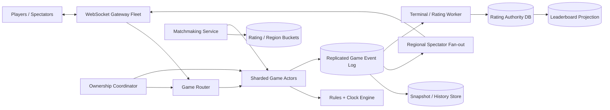

### 25.7 核心 flows

**Matchmaking**：服务端读取 authoritative rating，把 ticket 放入 region/time-control bucket。等待越久，允许的 rating window 逐步扩大；原子 match transaction 让两个 active ticket 只能进入一场 game。Client 传来的 rating 仅供显示，不能作为匹配权威。

**Move**：Gateway 验证 join token/session epoch，Router 按 game_id+owner_epoch 发送 Actor。Actor 检查 player turn、expected seq、action dedup、clock deadline 与 UCI legality，生成下一 event；事件经 regional quorum durable commit 后，Actor 才更新内存、ACK sender 并广播。Out-of-order action 返回 canonical seq 或 resync。

**恢复**：新 Actor 先取得更高 owner_epoch，再载入最新 checksum snapshot，重放 tail events；只有完成 catch-up 到 safety watermark 后接受写。旧 Actor 的 event append 因 epoch 不匹配被 log 拒绝。

**终局**：GameTerminated committed 后，outbox 触发 rating settlement。Rating Authority 在 serializable transaction 中先按 `(season_id, min(user_id), max(user_id))` 的确定顺序锁两条 `PlayerRating`，读取各自 `rating_version`，再插入 `game_id UNIQUE` 的 RatingTransaction、更新双方 rating/version 并写 outbox。这样两个同时结束且共享同一玩家的 game 会串行/OCC retry，不会都基于同一旧 rating。若 rating 已跨物理 shard，就使用能证明原子的 distributed transaction/atomic rating journal；不能拆成两个独立 eventual update。Redis/ZSET 只按 `source_rating_version` 幂等投影，失败可重建。

### 25.8 Deep dive A：Actor ownership 不是 consistent hash 就结束

Consistent hash 只告诉请求“应该去哪”，无法阻止 rebalance、network partition 或 GC pause 下两个节点同时认为自己是 owner。生产方案：

1. Coordinator 给每个 shard 发 lease 与单调 `owner_epoch`。
2. Router 从 versioned shard map 取 owner；response 带 map version，stale router 自动刷新。
3. Durable log append 必须包含 owner_epoch；log storage 记录最高 epoch，拒绝旧 owner。
4. Handoff：旧 owner 停止接新命令、flush committed seq；新 owner catch up 并取得更高 epoch后开放。无法优雅 handoff 时，宁可短暂停写。
5. 一个 shard 承载许多 game Actor；hot tournament game 可迁移到 dedicated shard，但仍按 epoch fencing。

因此内存 Actor 是低延迟 materialized state；replicated ordered log 才是 crash/rebalance 后的 truth。

### 25.9 Deep dive B：ordering、idempotency 与 ACK durability

- `expected_move_seq` 防止基于 stale board 的 move；Actor 不替客户端猜测重排。
- `client_action_id` 在玩家/游戏范围内唯一，dedup result 与 move event 一起持久化。相同 ID 不同 payload 返回 conflict。
- 同一 Actor mailbox 串行处理 move、resign、draw 和 timeout，避免 move 与 timeout 各自在不同服务“同时赢”。
- ACK 的 durability boundary 是 event-log regional quorum；若只写内存后广播，Actor crash 会产生双方都看过但历史不存在的 ghost move。
- Snapshot 每 N 步/秒生成并带 event hash；不是每步更新 FEN 是否“太大”的问题，而是 log + snapshot 在 write latency、recovery time 与存储间取舍。

### 25.10 Deep dive C：server-authoritative chess clock

不每秒 decrement/写库。ClockState 保存 `white_remaining_ms, black_remaining_ms, active_color, turn_started_at_server, deadline_at`。收到命令时：

```text
elapsed = authoritative_receive_time - turn_started_at_server
new_remaining = old_remaining - elapsed + increment_if_valid_move
```

若 move 与 timeout 几乎同时发生，它们进入同一 mailbox，以 Actor 读取的 server time 和 committed seq 判定。客户端只用 server timestamp/RTT 估计动画；不能提交“我在 deadline 前点了”。若产品提供 lag compensation，必须是 bounded、server-measured、双方一致的 policy，且记录在 event 中。

Timer wheel 为 active turn 安排 deadline；timer 丢失时任何后续 command 和 periodic sweeper 都会重新检查，timeout event 用 `(game_id, expected_seq, deadline)` 幂等提交。

### 25.11 Deep dive D：断线重连与跨设备 takeover

每位玩家有 `participant_session_epoch`。新设备显式 takeover 后 authority 原子推进 epoch，旧连接可继续 read-only 接收，但其 command 因旧 epoch 被拒绝。Connection registry 只是路由 hint；最终检查在 Actor。

重连请求带 last seen seq：gap 小则 replay tail events；gap 大/客户端 state hash 不符则发 snapshot + after_seq。Gateway 重连使用 exponential backoff/jitter 与 admission token，避免区域网络恢复时 million-connection storm。

### 25.12 Deep dive E：Spectator fan-out 与 backpressure

Player channel 与 spectator channel 分离。Actor 每步只发布一次 compact event 到 regional topic；fan-out brokers 按 gateway server 聚合，Gateway 再本地 multicast。跨洲 spectator 从就近 region 接收异步复制，允许 1–2 秒延迟。

- Hot match 使用 dedicated topic/tree，不能查一百万 session row 后逐个 RPC。
- Slow spectator 只保留最新 snapshot + small tail，丢弃中间 clock tick；player 连接不能这样丢 move。
- Clock UI tick 在客户端生成，服务端只推 move/periodic correction，避免每秒百万 fan-out。
- Admission 与 subscription quota 防观战 DDoS；public replay 可通过 CDN/HTTP chunk 降低 WebSocket 成本。

### 25.13 Reliability、multi-region 与 DR

- Game 固定 home region，player 尽量匹配同 region；跨 region 玩家走 edge gateway 到 home，避免双写 board。
- Move ACK 前同步写 home-region quorum + paired safety journal；region failover 只有追上 `game_safety_watermark` 后取得更高 epoch。达不到时 active games 暂停，而非 fork。
- Event log unavailable：停止接受 move，客户端显示 reconnecting；不能降级为“先本地走以后再合并”。
- Rules engine version 固定在 game 创建时；升级用 shadow replay，禁止中局规则漂移。
- Snapshot corruption：从更早 snapshot/完整 event log 重放，并校验 hash chain。
- Rating/leaderboard/search failure 不影响 active game；outbox 重试和 reconciliation 修复。

### 25.14 Security、abuse 与 MLE anti-cheat

- Join token 绑定 `game_id, user_id, role, session_epoch, expiry`；spectator 不能伪装 player。
- 服务端校验所有 move/clock；rate limit 非当前回合 spam、challenge harassment、chat abuse。
- Anti-cheat pipeline 异步消费完整 move sequence，特征包括 engine top-choice agreement、move-time distribution、rating-conditioned accuracy、device/account graph；模型输出 risk，不直接凭单局自动永久封禁。
- Point-in-time training、按 rating/time-control 分层校准，监控 false positive 与群体差异；高风险进入人工 review/额外验证。
- 在线 critical path 只跑轻量规则（非法客户端、已知 bot/device）；重模型不能把 move P99 推过 200ms。

### 25.15 MLE：match quality 与 rating

Baseline 用 rating difference + region RTT + wait time；ML 可预测 `P(close game)`、abandonment 与 latency quality，做 constrained matching。目标不能只最大化开局率，否则会制造碾压局：优化 wait time、skill gap、disconnect risk 的多目标，并设置最大 skill/RTT constraint。

Rating authority 使用 Elo/Glicko/TrueSkill 等确定算法版本，输入只来自一次性 GameTerminated；`game_id UNIQUE` 只防同一 game 重算，**并不能**防共享玩家的并发 lost update，因此还要对两条 PlayerRating 做 deterministic lock order + serializable/OCC。模型/参数升级记录 version，可回放审计。Leaderboard 以 per-player `rating_version` 投影；不同 game 的 seq 不可比较，Leaderboard 也不是 rating truth。

### 25.16 Observability、cost 与 SLO

指标：move accept/broadcast latency、event quorum latency、actor mailbox depth、stale owner/epoch rejection、duplicate action hit、clock dispute、reconnect recovery、snapshot replay length、game fork invariant（必须为 0）、spectator fan-out lag/drop、rating duplicate prevention、anti-cheat review precision。

成本由长期 WebSocket 内存、跨地域 player traffic、durable move log 与 hot spectator egress 主导。按 connection/game shard 做 capacity；historical events 压缩到 PGN/object storage，热库只保留近期 replay 索引。

### 25.17 Trade-offs 与 evolution

- **V1**：单 region WebSocket + SQL OCC，较小并发。
- **V2**：sharded Actor、replicated log、snapshot、session/owner epoch、rating projection。
- **V3**：paired-region failover、spectator tree、anti-cheat ML、tournament isolation。

Kafka 可用于 history/rating/event analytics，但不一定适合作为每步必须经过的通用 central queue；关键是 per-game ordered durable append 的延迟和 fencing contract，而不是产品名。

### 25.18 高频 follow-up Q&A

**Q：Actor crash 后会丢最后一步吗？**  
A：不会，ACK 前已写 replicated log；新 Actor 取得更高 epoch、snapshot + tail replay 后继续。若 durable append 失败就不 ACK。

**Q：为什么还要 session epoch，move seq 不够吗？**  
A：move seq 防 stale board；session epoch 决定哪个设备有资格 resign/draw/move，并 fence takeover 前已在途的旧连接命令。

**Q：热门比赛一百万人看怎么办？**  
A：Actor 发布一次，regional broker 按 gateway 聚合 multicast；spectator 可 drop intermediate update 并 snapshot catch-up，player path 独立保护。

**Q：Redis ZSET 是不是 leaderboard truth？**  
A：不是。GameTerminal 驱动一次性 rating transaction，ZSET 是可重建排序投影；否则丢 cache 就丢了积分正确性。

### 25.19 60 秒总结

> “在线 Chess 的核心是 per-game single-writer Actor + ACK-before-broadcast 的 replicated event log。Actor 由 owner epoch fencing，consistent hash 只做路由；move 带 expected seq、client action ID 和 participant session epoch，分别解决 stale state、重试与跨设备 takeover。棋钟保存 server deadline，move/timeout 在同一 mailbox 串行裁决。Snapshot 只减少恢复时间，rating 以 game_id 唯一事务结算，ZSET 只是 projection。观战走独立 regional fan-out tree并允许 snapshot catch-up，活跃游戏跨地域故障时宁可短暂停写也不产生 board fork。”

---

## 26. Design Slack：企业消息、Channel Ordering、Search 与 Retention

> **Source digest — `design slack.docx`**：源文档正确覆盖 WebSocket、channel ordering、media direct upload、online/offline delivery、logical delete 和 session lease。需要修正：不能给每个 channel 建一个 Kafka consumer，实际是一个 shard/partition owner 顺序处理许多 channel；WebSocket server 持有连接，因此是 stateful-but-disposable，不是 stateless；100M 连接每 10 秒刷新中心 Redis 会形成 10M writes/s。企业 Slack 题还必须覆盖 workspace tenant isolation、thread/reaction、search ACL、retention/legal hold、app/webhook integration 和 large-channel hybrid fan-out。

### 26.1 题意与 framing

设计企业协作消息系统，支持 workspace、public/private channel、DM、thread、reaction、富媒体、编辑/删除、多设备同步、搜索、通知、retention/legal hold 与 bot/app integration。

> “我会把 Slack 与 WhatsApp 区分开：这里服务端需要搜索、合规、bot 和 retention，所以不默认 E2EE。每个 channel 有一个 authoritative append owner，分配 `(channel_epoch, channel_seq)`；delivery 和 search 是派生管道。小 channel fan-out-on-write，大 channel 只发布 channel log/cursor，客户端按 gap 回补。企业级难点是 tenant/ACL 在 cache 和 search 中也必须正确，删除不等于物理抹除，因为 retention 与 legal hold policy 可能不同。”

### 26.2 Requirements、SLO 与边界

**Functional requirements**

1. 创建 workspace/channel/DM，管理 member/role；发送 text/file、thread reply、reaction、edit/delete。
2. 在线实时 push，离线/多设备 gap replay，unread mention 与 notification。
3. 按 workspace/channel/user/time 搜索消息与文件，严格执行 ACL。
4. Enterprise retention、legal hold、export/audit；bot/app event subscriptions 与 outbound webhook。
5. Presence/typing indicator 是 best-effort ephemeral signal。

**SLO / semantics**

- Message durable accept P99 `< 250ms`；同 region online recipient visible P95 `< 300ms`。
- Channel 内所有 accepted mutations 有单一 canonical order；不同 channel 不保证全局顺序。
- ACK 后消息 RPO `0` in home region；search index P95 `< 5s` 可见，通知可降级。
- Workspace/Channel membership revocation 在明确 safety SLA 内阻止新 read/search/download；合规删除和 legal hold 可审计。

**Out of scope**：音视频会议、邮件、端到端加密密钥协议；可说明 E2EE 会与服务端 search/compliance 冲突。

### 26.3 Capacity estimates

假设 `100M DAU`、每人每天 50 条消息：

```text
Messages/day = 100M × 50 = 5B
Average ingest = 5B / 86,400 ≈ 57.9k msg/s
Peak at 10× ≈ 579k msg/s
```

平均有效 recipient 20：`1.16M logical deliveries/s average`、峰值 `11.6M/s`。这直接要求 hybrid fan-out；一个 100k 人 channel 的单条消息不能同步写 100k inbox。

若 text/message metadata 平均 `800B`：`4TB/day logical`；三副本约 `12TB/day`、`4.38PB/year`，尚未含 index。若 1% 消息有平均 4MB attachment：

```text
5B × 1% × 4MB = 200TB/day source media
3 durable copies ≈ 600TB/day physical placement
```

假设高峰 `30M concurrent WebSocket`，30 秒 heartbeat 是 `1M heartbeats/s`。这些在 gateway 本地处理并批量上报 lease，不应逐心跳写中心 store。Search indexing 平均也要吃下约 `58k documents/s`。

### 26.4 API、WebSocket 与 event contracts

```http
POST /v1/workspaces/{wid}/channels
POST /v1/channels/{cid}/messages
Idempotency-Key: <client_message_id>
{"text":"...","media_ids":["m_1"],"thread_root_seq":null}

PATCH /v1/channels/{cid}/messages/{seq}
If-Match: "message-version-3"
DELETE /v1/channels/{cid}/messages/{seq}
PUT /v1/channels/{cid}/messages/{seq}/reactions/{url_encoded_emoji}
Idempotency-Key: <client_reaction_id>
{"desired_state":"PRESENT"}
GET /v1/channels/{cid}/messages?after_seq=...&limit=100
GET /v1/sync?workspace_id=...&cursor=<opaque>
GET /v1/search?q=...&cursor=...
POST /v1/media/upload-sessions
POST /v1/apps/{app_id}/subscriptions
```

实时 frame：

```text
client -> server: SendMessage(client_message_id, channel_id, expected_membership_epoch, payload)
server -> client: MessageAccepted(channel_id, channel_epoch, channel_seq, message_id)
server -> client: ChannelMutation(channel_id, channel_epoch, seq, mutation_type, entity_version)
server -> client: ChannelDirty(channel_id, latest_seq) / ResyncRequired(snapshot_cursor)
```

Reaction 使用 channel-qualified path，因为 `seq` 只在 channel 内唯一；`PUT desired_state` 让 add/remove retry 天然收敛。服务端仍校验 workspace tenant、membership epoch 和 `(channel_id, message_seq, emoji, user_id)` unique row，相同 idempotency key 不同 desired state 返回 conflict。

Durable event：`MessageAppended`, `MessageEdited`, `MessageTombstoned`, `ReactionChanged`, `MembershipChanged`, `RetentionActionDue`, `AppDeliveryRequested`。都有 `event_id, workspace_id, channel_id, channel_epoch, channel_seq, policy_epoch`。

### 26.5 Data model、partition、index 与状态机

- `Workspace(workspace_id PK, home_region, plan, retention_policy_id, policy_epoch)`
- `Channel(workspace_id, channel_id, type, channel_epoch, next_seq, membership_epoch, latest_seq)`
- `ChannelMember(channel_id, user_id, role, state, joined_seq, left_seq, version)`
- `Message(channel_id, seq, message_id, sender_id, client_message_id, body_ref, version, state, thread_root_seq, created_at)`
- `Reaction(channel_id, message_seq, emoji, user_id, state, version)`
- `Media(media_id, workspace_id, owner_id, object_ref, scan_state, acl_epoch, checksum)`
- `WorkspaceChange(user_id, user_seq, workspace_id, entity_ref, entity_version, type)`
- `DeviceCursor(device_id, channel_id, last_acked_seq)`；只保存 active/recent cursor，不为所有历史 channel 无限建行。
- `RetentionPolicy / LegalHold / AuditEvent / AppSubscription / DeliveryAttempt`

所有 key 首先带 `workspace_id` 做 tenant isolation；message log 按 `hash(channel_id)` 分片，一个 channel 不能跨 owner 并发写。Search document 索引 `workspace_id, channel_id, seq, ACL/membership_version, text terms`。

Message state：`VISIBLE -> EDITED* -> TOMBSTONED`；compliance storage 可继续保留 immutable revisions。User-visible deletion、retention purge 和 legal-hold preservation 是三种不同状态，不用一个 boolean。

### 26.6 Proposed architecture

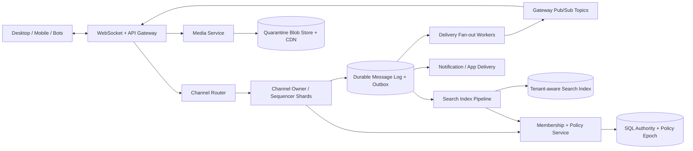

### 26.7 核心 flows

**发送消息**：Gateway 验证 auth 与粗限流，Router 找 channel owner。Owner 检查 membership epoch、dedup key、大小/retention policy，分配 next seq，在一个事务/replicated append 写 Message + Outbox；durable 后 ACK。Delivery/search/notification/app consumer 读取同一 canonical event，避免 DB+Kafka dual write。

**富媒体**：客户端取 scoped multipart upload URL，直传 quarantine bucket；完成 API 校验 part checksum/size，异步 malware/DLP scan。只有 `READY` media 且 workspace/channel ACL 合法才能关联消息和签发短寿 download capability。

**重连**：客户端带每 channel last_seq 或 workspace sync cursor。服务端发送 dirty channel 列表；gap 小 replay mutations，gap 太大给 compact snapshot + cursor。Message ID 去重只是最后防线，客户端必须检测 seq gap。

**搜索**：Query 先验证 tenant/user，召回 docs 后以 current membership/policy epoch 做 pre/post filter；高风险 revocation 不能只相信 stale index ACL。

### 26.8 Deep dive A：Channel ordering 与 hot partition

`channel_seq` 表示服务器接受顺序，不尝试用客户端 timestamp 建立“真实同时顺序”。一个 shard owner 处理许多 channel，并为每 channel 维护 sequence；不是“每 channel 一个 Kafka consumer”。

- Append 请求含 `client_message_id`；unique `(channel_id, sender_id, client_message_id)` 返回原 seq。
- Edit/delete/reaction 也进入同一 channel mutation order，客户端可按 seq 重放确定视图。
- Owner epoch 被 durable log fence，rebalance 时新 owner catch up 后才写。
- 单 channel write QPS 超过一个 owner 能力时，不能简单拆成两个 writer 而保留严格 total order。可给 hot channel dedicated shard、batch multiple appends、限制 bot flood；若产品允许，放松为 thread-local order。
- 跨 channel home/activity feed 可以按 server time/ID 合并，只提供 snapshot-stable order。

### 26.9 Deep dive B：Hybrid delivery 与离线同步

小/中 channel：event consumer 查询 cached membership，把 `(channel, seq)` 发布到在线 gateway topics，并给需要通知的用户写 lightweight inbox。大 channel：只发布 channel topic/latest cursor；在线订阅者直接收，离线用户重连按 channel log 拉，不为 100k members 写 100k durable inbox rows。

每个用户/设备 durable inbox 主要保存 mention、DM、notification decision 和 sync metadata，不复制所有 message body。Unread count 是 derived counter，可因重放短暂漂移，后台 reconciliation 修复。

慢连接有 bounded send buffer：presence/typing 可丢；普通 channel mutation 出现 gap 时发 `ChannelDirty` 后清 buffer；DM/critical mention 保留更高优先级。不能让一个慢手机拖住 fan-out consumer offset。

### 26.10 Deep dive C：WebSocket fleet 与 reconnect storm

WebSocket gateway 是 **stateful connection holder, disposable compute**。它在本地保存 connection -> user/device/subscriptions，并周期批量续租 gateway ownership；central registry 保存粗粒度 `user/device -> gateway_id, connection_epoch, expires_at`，而不是每 10 秒为每连接写一次 Redis。

- Gateway 按 user/device 建 connection epoch，旧连接 frame 被 fence。
- Fan-out 按 gateway topic 批量发送一份消息 + local recipient bitmap，减少 N 个跨服务 RPC。
- 区域故障时 client 使用 exponential backoff + full jitter、server-provided retry-after、admission token；优先恢复 DM/active channel，再恢复 presence/search warmup。
- Heartbeat timeout 是路由 hint，不是 message correctness；重连总能从 durable log 补 gap。

### 26.11 Deep dive D：Search、ACL revocation 与 retention/legal hold

Search index 是 derived state。Index document 带 workspace/channel、message revision、visibility、source seq。Query 同时检查：user 属于 workspace、在 `left_seq` 前后是否有读取历史权限、private channel membership、retention/legal policy。

Revocation 推进 `membership_epoch/policy_epoch`：

- Search/read/download capability 必须绑定 epoch，并通过短寿 `PolicyFreshnessLease` 或 authoritative check。
- 撤销成功前，停止签发旧 epoch lease并等待旧 lease drain；partition 时 fail-closed 处理 private data。
- Delete 先写 channel tombstone；search consumer 删除/遮蔽 doc，cache/CDN token 失效。Legal hold 命中时用户 UI 隐藏，但 immutable compliance copy 继续保留并记录访问审计。
- Retention worker 的 purge 是幂等 workflow；object、index、backup 有各自 lifecycle 和 proof，不把发一条 delete event 当已完成。

### 26.12 Deep dive E：Apps、Webhook 与 exactly-once illusion

Bot command 与 app event 走 tenant-scoped OAuth scope、rate limit 和签名。Outbound delivery at-least-once：事件有 stable `event_id`，HTTP 签名含 timestamp/body hash，retry 使用 exponential backoff+jitter，per-app ordered stream 仅在合同要求时提供。App endpoint timeout 不阻塞 channel accept path。

Consumer 通过 event_id 去重；不能承诺第三方 side effect exactly once。提供 delivery log、manual replay、DLQ/disabled endpoint；DLQ 只是待处理，不代表消息已送达。

### 26.13 Multi-region、reliability、security 与 abuse

- Workspace/channel 有 home region；message ACK 前写 regional quorum + paired safety journal。Remote users从本地 edge 连到 home writer，delivery/index 跨区异步。
- Failover 追上 channel safety watermark，提升 channel owner epoch；否则 channel 短暂停写，history/search 可读。
- Message log 慢时 admission/load shedding：先丢 typing/presence、延后 search/app/notification，不能 ACK 未持久化 message。
- Tenant encryption key、row/object namespace、cache key、metrics label 都隔离；管理员操作双重授权与 audit。
- Spam/bot flood、malicious file、mention bombing、token theft 有 rate limit、behavior risk、DLP/malware、quarantine。

### 26.14 MLE deep dive：Search、notification ranking 与 abuse

Search 使用 lexical BM25 + semantic retrieval + reranker，但 hard ACL filter 必须在模型前后都成立。Notification ranker 预测用户是否希望被打扰，features 包括 mention、channel affinity、local time、thread participation；critical admin/security notification 不由模型静默丢弃。

- Labels：click/reply/read/dismiss/mute，处理 position bias 和 delayed read。
- Offline：NDCG/Recall、notification precision、spam recall、tenant slices；Online：reply/time-to-read、mute/uninstall、missed-critical guardrail。
- Serving fallback：keyword/mention rules；feature/model 不可用不影响 message delivery。
- Abuse 模型进入 quarantine/限流或 review，误杀率按 workspace/user cohort 监控。

### 26.15 Observability、cost 与 SLO

指标：accept/quorum latency、channel seq gap/fork（fork 必须 0）、outbox lag、fan-out recipients/event、large-channel pull lag、gateway connections/memory/reconnect admission、search freshness/ACL deny、retention purge age、legal-hold invariant、app retry/DLQ、media scan latency、$/message 和 media egress。

成本最大项通常是附件存储/下载、跨地域 delivery、search index 和空闲连接内存。Text log 可压缩分层；大 channel 不复制 inbox；media 用 dedup（注意 tenant boundary）、tiering、CDN 和 retention lifecycle。

### 26.16 Trade-offs 与 evolution

- **V1**：单地域 SQL/message store + WebSocket、基础 channel/DM。
- **V2**：channel sequencer shards、outbox、hybrid fan-out、delta sync、media quarantine、search。
- **V3**：workspace home/paired failover、policy freshness leases、legal hold、apps platform、ML ranking/abuse。

与 WhatsApp 相比，这里选择 server-readable content 来换取 enterprise search/compliance/integrations；若面试官要求 E2EE，必须明确哪些搜索、bot、DLP 和 legal hold 功能会失去或迁移客户端。

### 26.17 高频 follow-up Q&A

**Q：如何保证所有客户端看到相同顺序？**  
A：channel owner 分配 canonical seq，客户端按 seq 应用并检测 gap；实时到达可以乱序，但 UI 缓冲/回补后收敛到同一 log。

**Q：一个 channel 100k 人怎么 fan-out？**  
A：发布一次 channel event到 gateway topics；在线本地 multicast，离线按 channel cursor pull，不写 100k durable message copies。

**Q：为什么 WebSocket server 不是 stateless？**  
A：它持有 TCP/WebSocket 与 send buffer，所以运行时有状态；业务恢复状态外置，节点可丢弃并让客户端从 durable cursor 恢复。

**Q：删除后 search/CDN 还可见怎么办？**  
A：tombstone 推动 index/cache/object workflow，授权绑定 policy epoch；legal hold copy 与用户可见 copy 分离，并监控 purge proof。

### 26.18 60 秒总结

> “Slack 的权威数据是 tenant-scoped channel log。Channel owner 用 epoch fencing 分配 seq，message/outbox durable 后才 ACK；delivery、search、unread 和 notifications 都可重建。小 channel fan-out-on-write，大 channel 发布一次后在线 gateway multicast、离线 cursor pull。WebSocket 节点是 stateful-but-disposable，connection epoch 和批量 lease 支撑重连。Enterprise 重点是 membership/policy epoch 贯穿 read、search、media capability，用户删除、retention purge 与 legal hold 分开建模。最后以 workspace home ownership、paired safety journal、app at-least-once delivery 和 ML fallback 完成可靠性与运营闭环。”

---

## 27. Design Stripe / Payment Platform：Payment Intent、Ledger 与 Reconciliation

> **Source digest — `design strip.docx`（题意为 Stripe / Payment Platform）**：源文档强调“先本地持久化再调外部”、authorize/capture、idempotency、double-entry ledger、reconciliation、tokenization 与 webhook，都是支付题主轴。必须修正：Redis-only idempotency 在过期/故障后会重复扣款，durable unique record 才是 correctness boundary；一个 PaymentIntent 可有多次 attempt、部分 capture/refund 与 dispute，不能靠单一线性状态列表达；ledger 通常维护事务内按 currency 平衡和 materialized balance，不会每次查询全历史；append-only 本身也不等于 tamper-proof；processor timeout 必须进入 `UNKNOWN`，不能当失败重试。

### 27.1 题意与 framing

设计一个多商户支付平台：客户端安全采集 payment method，merchant 创建/确认 PaymentIntent，支持 authorization、3DS/SCA、capture、cancel、refund、settlement、dispute、ledger、merchant webhook 与对账。

> “我会把 API idempotency、内部账本正确性、外部银行状态这三层分开。Merchant request 先在 durable idempotency table claim，再创建 PaymentIntent/Attempt；向 acquirer 发 RPC 前先写 outbound intent，并透传稳定 external key。Timeout 进入 UNKNOWN，由 query、webhook 和 reconciliation 收敛。资金变化用 immutable double-entry transaction 记账，同时维护可校验 materialized balance。Webhook 只承诺 signed at-least-once 和 replay，不宣称 exactly once。”

### 27.2 Requirements、SLO 与财务不变量

**Functional requirements**

1. Merchant 创建、确认、查询、取消 PaymentIntent；支持 automatic/manual capture 与 3DS action。
2. Card/payment method tokenization；authorization、partial/multiple capture（受 network rule 约束）、void/expiration。
3. Full/partial refund、dispute/chargeback、fee 与 merchant settlement/payout。
4. Double-entry ledger、processor/bank reconciliation、merchant signed webhook/replay。
5. Risk screening、rate limit、audit、operator repair。

**Correctness invariants**

- 同一 merchant 的相同 idempotency key + 相同 request fingerprint 返回相同 semantic result；同 key 不同 body 拒绝。
- 每个 ledger transaction 在同 currency/asset 内 `Σ debit = Σ credit`；entry immutable，correction 用 reversal。
- Capture 累计额 `<= authorized amount`，refund 累计额 `<= captured - chargeback-adjustment`；所有金额使用 integer minor units，不用 float。
- API timeout 不推断成功/失败；外部 operation 只有收到 authoritative response/query/statement 才 terminal。
- Merchant balance/payout 只能来自 posted ledger transaction，不由 PaymentIntent status 临时加减。

**SLO**

- Create intent P99 `< 200ms`；不含 3DS 的 confirm P99 `< 2s`（受外部网络影响，另报 dependency latency）。
- Ledger commit availability `99.99%`，ACK 后 RPO `0`；webhook 95% `< 10s`，最终 signed replay 至少 30 天。
- 支付 correctness 高于 availability；无法取得 payment/ledger ownership 时新不可逆写 fail-closed。

### 27.3 Capacity estimates

假设平均 `1,000 payment attempts/s`、峰值 `10,000/s`：

```text
Attempts/day = 1,000 × 86,400 = 86.4M
```

每 attempt 的 intent/attempt/idempotency/outbox/audit 合计约 `4KB`：

```text
86.4M × 4KB ≈ 345.6GB/day logical
3 replicas ≈ 1.04TB/day
```

若平均每 attempt 产生 6 条 ledger entry、每条含索引 `200B`：

```text
86.4M × 6 × 200B ≈ 103.7GB/day logical
3 replicas ≈ 311GB/day
```

每支付约 3 个 merchant event，平均 `3k events/s`。若 delivery/retry amplification `1.3×`，约 `3.9k HTTP deliveries/s average`，峰值按 `39k/s` 准备。Reconciliation 和历史查询走独立 analytical/storage path，不能扫描 OLTP 热表。

### 27.4 API contracts

```http
POST /v1/payment_intents
Authorization: Bearer <merchant_key>
Idempotency-Key: <merchant-generated-key>
{
  "amount":5000,
  "currency":"usd",
  "capture_method":"manual",
  "payment_method":"pm_token",
  "merchant_order_id":"ord_7"
}

POST /v1/payment_intents/{id}/confirm
POST /v1/payment_intents/{id}/captures
Idempotency-Key: <merchant-generated-key>
{"amount_to_capture":4500}
-> 202 {"capture_id":"cap_1","status":"processing"}
POST /v1/payment_intents/{id}/cancel
POST /v1/captures/{capture_id}/refunds
Idempotency-Key: <merchant-generated-key>
{"amount":1000,"reason":"requested_by_customer"}
-> 202 {"refund_id":"re_1","capture_id":"cap_1","status":"processing"}
GET /v1/payment_intents/{id}
GET /v1/balance_transactions?cursor=...
POST /v1/webhook_endpoints
```

Response 对 3DS 明确返回：

```json
{
  "id":"pi_1",
  "status":"requires_action",
  "next_action":{"type":"use_sdk","client_secret":"short-lived-scoped-secret"}
}
```

Webhook envelope：`event_id, event_type, object_id, object_version, created_at, delivery_attempt`；签名覆盖 `timestamp + raw_body`，并防 replay window。

### 27.5 Data model：不要让一个 status 承担所有语义

- `PaymentIntent(intent_id PK, merchant_id, order_ref, requested_amount, currency, capture_method, status, aggregate_version, home_region)`
- `PaymentAttempt(attempt_id PK, intent_id, attempt_no, payment_method_ref, risk_decision, state, processor, external_key, external_ref, request_hash)`
- `Authorization(auth_id, attempt_id, amount, captured_reserved_total, state, expires_at, external_ref, version)`
- `Capture(capture_id, auth_id, amount, refunded_reserved_total, state, external_key, external_ref, version)`
- `Refund(refund_id, capture_id, amount, state, external_key, external_ref, version)`
- `Dispute(dispute_id, capture_id, amount, reason, evidence_deadline, state)`
- `LedgerTransaction(txn_id PK, business_ref UNIQUE, currency, effective_at, reversal_of, hash_prev)`
- `LedgerEntry(txn_id, entry_no, account_id, side, amount_minor, currency)`
- `AccountBalance(account_id, currency, posted_balance, pending_balance, version, last_txn_seq)`
- `IdempotencyRecord(merchant_id, key, request_hash, state, response_ref, expires_at)`
- `OutboundAttempt / Outbox / WebhookDelivery / ReconciliationBreak`

PaymentIntent 可呈现：`REQUIRES_PAYMENT_METHOD -> REQUIRES_CONFIRMATION -> REQUIRES_ACTION | PROCESSING -> REQUIRES_CAPTURE | SUCCEEDED | CANCELED`。Attempt/Authorization/Capture/Refund/Dispute 各有独立状态机；不要让 refund 把原 capture 从历史上改成“Refunded”而丢失部分退款细节。

External attempt state：

```text
CREATED -> SENT -> AUTHORIZED / DECLINED
                 -> UNKNOWN -> AUTHORIZED / DECLINED / MANUAL_REVIEW
```

### 27.6 Proposed architecture

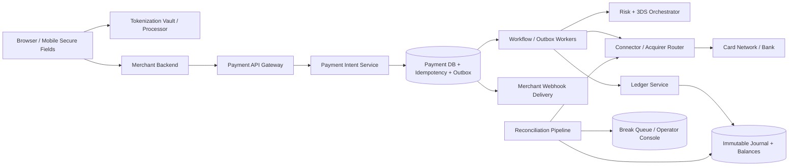

### 27.7 核心 confirm/capture flow

1. Gateway 从 merchant credential 确定 tenant，Payment Service 在 durable DB 对 `(merchant_id, idempotency_key)` 插入 unique row；若已存在，比较 request hash 并返回已有/进行中结果。
2. Intent transaction 验证金额/currency/status，创建 PaymentAttempt 与 OutboundAttempt/outbox。事务 commit 后 workflow 才调用风险/processor。
3. Risk 可能允许、拒绝或要求 3DS/SCA；`REQUIRES_ACTION` 返回客户端继续完成，action token 短寿且绑定 intent/version。
4. Connector 调 processor 时使用稳定 `external_key`。明确 authorize 成功写 Authorization；timeout 写 UNKNOWN，不新建 attempt。
5. Manual capture 创建独立 `capture_id`，先在 DB transaction 锁/CAS Authorization 并把 amount 加入 `captured_reserved_total`；外呼成功后 posted ledger，明确失败才释放 reservation，unknown 保留并查询。Concurrent capture 的 posted + in-flight reserved 总额不能超 authorization。
6. Outbox 生成 merchant event；webhook delivery 与支付事务解耦。Processor webhook 只是一个输入信号，必须验签、去重并与当前 version/state 合法合并。

### 27.8 Deep dive A：Durable idempotency 与 in-progress 请求

Redis 可缓存已完成 response，但不能是唯一防重：key TTL、failover 或 eviction 都可能让同一 charge 再执行。Correct pattern：

- DB unique `(merchant_id, idempotency_key)`；row 保存 canonical request hash、operation kind、aggregate ID、state、response blob/ref。
- 第一个请求 claim `IN_PROGRESS`；并发重复请求可短等、返回 `202/retry-after` 或读取同一 aggregate，不能都进入外部调用。
- 相同 key 不同 body/endpoint 返回 409 misuse。
- Idempotency retention 必须覆盖 merchant 最大 retry/replay window；过期后仍由 merchant_order_id / payment aggregate invariant 提供第二层保护。
- Internal queue event 使用 stable event_id，consumer inbox/dedup；external call 使用 processor idempotency key。每一层 key 作用域不同，不能只生成一个 UUID 就结束。

### 27.9 Deep dive B：External UNKNOWN 与恢复

最危险时序是银行已授权、response 丢失。把 timeout 标 `FAILED` 并重试新 key 会双重 hold/charge。处理方式：

1. OutboundAttempt 在 call 前 durable 记录 `SENT`、request hash、external key。
2. Timeout -> `UNKNOWN`，锁住该 intent 的新不可兼容操作。
3. 优先调用 processor lookup by external key/reference；同时等待 signed webhook。
4. 超过 online recovery SLA 进入 reconciliation queue，对照 processor report/settlement file。
5. 只有 authoritative evidence 证明未执行，才用同 key retry；若仍无法判断，人工 review，而不是赌。

Client/merchant 看到 `processing`，不是虚假的 failed/succeeded。Reconciliation break 有 owner、age SLO 和可审计 resolution。

### 27.10 Deep dive C：Authorize、Capture、Refund 与 Dispute

- Authorization 是资金 hold，有 expiry；未 capture 可 void。酒店/电商等需要 auth 与 capture 分离。
- Capture 可能 partial；多次 capture 是否允许取决于 network/merchant contract。每次产生稳定 `capture_id`，用 Authorization 上的 `captured_reserved_total/version` 原子 reservation，避免两个 worker 都 capture 全额；同一 capture key 重试只能回到同一个对象。
- Settlement 是网络侧异步事实，可能 T+N 日，不能与 capture 混成同步一步。
- Refund 必须明确指向 `capture_id`（或语义等价的 charge ID），而不是只给可能含多次 capture 的 PaymentIntent。创建 refund 时在事务中锁/CAS Capture，验证 `posted_refund + in_flight_refund_reservation + new_amount <= captured_amount - nonrefundable_adjustment`，推进 `refunded_reserved_total` 并写 outbound intent；明确失败释放 reservation，`UNKNOWN` 保留直到 query/reconciliation 收敛。Refund 是新对象/新外部 operation/反向 ledger transaction，可 partial、可失败/unknown；不修改原 capture history。
- Dispute/chargeback 由网络异步发起，冻结/扣减 merchant balance、收 evidence，后续 win/loss 再记 reversal。它不是普通 refund 状态。
- SCA/3DS 是可暂停 workflow；server 不持有浏览器 session，靠 client_secret + intent version 恢复。

### 27.11 Deep dive D：Double-entry ledger 的正确落地

每个 business event 映射一个 idempotent LedgerTransaction。例如 capture `$50`（忽略复杂 reserve）可在平台账本记录 processor receivable 与 merchant payable/fee accounts。所有 entry 在同一数据库事务插入，按 currency 验证 debit/credit 平衡；禁止跨币种直接相抵，FX 通过独立 clearing/FX accounts 表达。

Balance query 不每次 sum 亿级历史。Transaction 同时用 CAS 更新 `AccountBalance` 的 posted/pending balance 和 last_txn_seq；immutable journal 是 truth，materialized balance 是高性能 projection，后台按 journal 重新计算抽样/全量对账。

Append-only 不能单独防管理员直接改库。再加：最小写权限、immutable/WORM archive、transaction hash chain/Merkle checkpoint、KMS signature、数据库审计和外部 statement reconciliation。全库“总和为零”也不够，必须检查每 transaction/currency、账户边界和 expected business mapping。

### 27.12 Deep dive E：Merchant webhook 的可靠合同

- Payment transaction 只写 semantic outbox；不要依赖任意 table CDC 猜业务含义。
- Delivery at-least-once，稳定 event_id，HMAC signature、timestamp、endpoint version、TLS。
- Per-endpoint bounded concurrency、token bucket、timeout、exponential backoff + full jitter；`2xx` 才算 ACK，redirect 默认拒绝或严格 allowlist 防 SSRF。
- 重试耗尽进入 failed/DLQ 并在 dashboard 可见；merchant 可按 event cursor/list API replay。DLQ 不等于 delivered。
- 若合同要求 per-object order，可按 `(merchant_id, object_id)` lane；不同 object 不做全局 head-of-line blocking。
- Secret rotation 支持 overlap 双签名；endpoint ownership 验证、DNS/private IP 防护。

### 27.13 Reconciliation：最终安全网

分三层：near-real-time query recovery、daily processor transaction report、settlement/bank cash statement。Pipeline 将内部 attempt/capture/ledger 与外部 record 做 full outer join，匹配 external key/reference/amount/currency：

- internal only、external only、amount/currency/status mismatch、duplicate、late settlement 分别分类；
- 自动修复只能执行经过批准的 idempotent compensating transaction；高金额或模糊项人工 review；
- Break 不能只告警，要有 case state、assignee、evidence、SLA、resolution ledger refs。

### 27.14 Multi-region、DR 与 failure semantics

- Merchant/PaymentIntent 按 home region/shard 单写；API edge 可全球接入，但不可逆 command 路由 home。
- Idempotency claim、OutboundAttempt 与 ledger intent 在向外部发 RPC 前同步写 paired-region safety journal。ACK 也要求 journal 已含最终 payment/ledger commit，达到 RPO 0。
- Failover 新 owner 追上 `payment_safety_watermark` 后提升 epoch；旧 region connector 被 fence/credential lease 撤销。无法证明时停止新外呼，但允许查询。
- Risk/model/webhook/search/analytics failure 可降级；ledger/ownership/processor ambiguity 不可用“高可用优先”绕过。
- Backup restore 必须结合外部 reconciliation 验证，不只验证数据库能启动。

### 27.15 Security、PCI、privacy 与 abuse

- 使用 processor-hosted fields/SDK 直接 tokenization，后端不接触 raw PAN；token 绑定 merchant/customer/use，日志做结构化 redaction。
- 这会显著缩小但不自动消除 PCI DSS scope；仍需满足集成方式、脚本供应链、access control、扫描和审计要求。
- KMS envelope encryption、HSM key operations、mTLS/credential rotation、admin just-in-time access、two-person control for high-risk repair。
- 防 card testing、credential stuffing、refund abuse、merchant fraud、webhook SSRF；per merchant/card fingerprint/device/IP rate limit 与 velocity rules。

### 27.16 MLE deep dive：Fraud / authorization optimization

Risk model 在 processor call 前给 `ALLOW / CHALLENGE / REVIEW / BLOCK`，objective 不是只降 fraud：平衡 fraud loss、false decline、3DS friction、chargeback 和 latency。

- Labels 极度延迟且有选择偏差：chargeback 可能数周后到，blocked transaction 没有真实 outcome。训练要用 point-in-time joins、matured label window、exploration/causal correction。
- Features：merchant/account/device/card token graph、velocity、amount/currency、behavior、历史 dispute；敏感/监管属性受严格治理。
- Serving P99 budget 例如 `< 50ms`；online feature freshness/version，与 offline parity。
- Fallback 是 deterministic velocity/rule engine；模型 timeout 不应默认全放行或全拒绝，而按 merchant/risk tier 降级。
- 监控 authorization rate、fraud/chargeback bps、false-decline proxy、calibration、feature drift、cohort fairness、model/rule disagreement；champion/challenger + instant rollback。

### 27.17 Observability、cost 与 audit

关键指标：idempotency hit/conflict/in-progress age、processor latency/status/unknown age、state-transition violation、capture/refund invariant、ledger imbalance（必须 0）、balance recompute mismatch、webhook age/retry/DLQ、reconciliation break amount/age、risk latency/approval/fraud、failover safety watermark。

Trace 使用 tokenized `intent_id/attempt_id/external_key/ledger_txn_id`，但禁止 PAN、CVV、full bank data。审计日志不可由普通业务管理员删除。成本热点是 OLTP/ledger replication、processor network/fees、risk features、webhook retry、statement retention；financial records按法规分层留存。

### 27.18 Trade-offs 与 evolution

- **V1**：单 region PaymentIntent、一个 processor、durable idempotency、basic double-entry、manual reconciliation。
- **V2**：multi-attempt/3DS/partial refund、outbox webhook、automated query recovery、materialized balances。
- **V3**：multi-processor routing、paired-region RPO0 safety、dispute/payout、risk ML、tamper-evident ledger archive。

先把一个 currency、一个 processor、一个 capture 的 correctness 证明清楚，再扩功能；支付系统中“多活”不是第一版加分词，错误双写会直接变成资金损失。

### 27.19 高频 follow-up Q&A

**Q：Redis 做 idempotency 为什么不够？**  
A：eviction、TTL 和 failover 会丢 key；durable unique row + request hash 是 correctness，Redis 只加速 response lookup。

**Q：processor timeout 后怎么办？**  
A：状态 UNKNOWN，禁止新 key 重试；按原 external key query、等 webhook、最后 statement reconciliation。

**Q：余额是否每次 sum ledger？**  
A：journal 是 truth，但在线读 materialized balance；同事务更新并用 journal replay/reconciliation 验证。

**Q：Webhook 能 exactly once 吗？**  
A：不能跨互联网承诺。提供 signed at-least-once、stable event ID、merchant dedup 和 list/replay API。

### 27.20 60 秒总结

> “Payment Platform 要把三层正确性分开：durable API idempotency 防 merchant 重试，double-entry journal 防内部资金失衡，external UNKNOWN + query/webhook/reconciliation 处理银行世界的不确定性。PaymentIntent、Attempt、Authorization、Capture、Refund、Dispute 分开建模；任何外呼前先写 outbound intent并透传稳定 key。Ledger 每 transaction/currency 平衡，在线余额是可重建 materialization。不可逆写以 home owner、epoch fencing 和 paired-region safety journal 达到 RPO0；Webhook 只做 signed at-least-once。Risk ML 有严格 latency/fallback，但绝不越过金额、状态与账本不变量。”

---

## 28. Design Yelp：POI Geospatial Search、Review 与 Ranking

> **Source digest — `design yelp.docx`**：源文档覆盖 nearby search、Business/Review、PostGIS/GiST、缓存、异步 rating aggregate 与 anti-spam constraint。需要校正：`OFFSET + total_results` 在动态排序和深分页下昂贵且不稳定，应使用 snapshot/cursor；PostGIS GiST 是 R-tree-like bounding-box access method，不应笼统保证严格 O(log N)；全球扩展通常还需 S2/H3/geocell 做 routing/cache；评论写成功不等于立即公开，应有 moderation state；rating 的 edit/delete 必须发 old/new delta 并幂等；`date_trunc` expression index 对 timestamptz/time zone 有陷阱，最好显式 generated period key。

### 28.1 题意与 framing

设计全球本地商家/兴趣点平台：按当前位置、关键词、品类、营业中、价格与评分检索；展示详情、照片、营业时间和评论；用户提交/编辑 review；提供 ranking、fake-review detection 与商家更新。

> “我会把 Business/Review authority 与 Search serving 分开。Business 写入关系库后通过 outbox 更新 geospatial + lexical index；查询先用 S2/H3 cover 或 PostGIS bounding box 召回，再做精确距离、营业时间和多阶段 ranking。分页 token 固定 query snapshot，避免 OFFSET 漂移。Review 先进入 moderation，rating aggregate 由 versioned delta 更新并可从 review truth 重建。”

### 28.2 Requirements、SLO 与边界

**Functional requirements**

1. Nearby/search：GPS 或区域文本，term/category/radius/open-now/price/rating filters，稳定分页。
2. Business detail：地址、联系方式、hours、rating/review count、top reviews/photos、claim/owner updates。
3. 用户创建、编辑、删除一个 active review；图片 direct upload；helpful/report。
4. 商家/评论 moderation、duplicate/closed place merge、fake-review detection。
5. Personalized ranking 可选；基础 relevance/distance 始终可用。

**SLO / consistency**

- Search/detail P95 `< 300ms`、P99 `< 800ms`；核心读可用性 `99.99%`。
- Business/review durable write P99 `< 500ms`；search/rating projection P95 `< 10s`，状态向用户明确显示 pending。
- 用户不能通过 retry 创建重复 active review；aggregate 可短暂 stale，但最终与 visible review truth 一致。
- ACL/moderation/takedown 优先于普通 index freshness；被移除内容在 safety SLA 内不可再返回。

**Out of scope**：餐厅预订、外卖配送、广告竞价；可在 follow-up 加 reservation/ads。

### 28.3 Capacity estimates

假设 `100M MAU / 20M DAU`，每个 DAU 每天 10 次 search、5 次 detail：

```text
Search = 20M × 10 / 86,400 ≈ 2.3k QPS average
Peak at 10× ≈ 23k QPS

Detail = 20M × 5 / 86,400 ≈ 1.16k QPS average
Peak ≈ 11.6k QPS
```

每天 2M review create/edit/delete：`≈23/s average / 230/s peak`，明显 read-heavy。`10M businesses × 5KB ≈ 50GB` authority data，单库并不因 business 数就必须 NoSQL；复杂度来自 search index、reviews 和 media。

假设 `1B` review revisions、每条含索引 `1KB`：约 `1TB logical / 3TB replicated`；若 `500M` 照片平均 1MB：`500TB source / 1.5PB at 3 copies`，实际大头是 object storage/CDN egress。

Search cache 若把坐标精确到浮点会几乎零命中；需要 cell/normalized-filter key。热门 Manhattan cell 可能占流量数个百分点，必须能独立拆分和 rate-limit。

### 28.4 API 与 contracts

```http
GET /v1/businesses/search?
    lat=40.7128&lon=-74.0060&radius_m=1000&term=pizza&open_now=true
    &limit=20&page_token=<opaque>

GET /v1/businesses/{business_id}
GET /v1/businesses/{business_id}/reviews?sort=relevant&page_token=...
POST /v1/businesses/{business_id}/reviews
Idempotency-Key: <uuid>
{"rating":5,"text":"...","photo_ids":["ph_1"]}

PATCH /v1/reviews/{review_id}
If-Match: "review-version-4"
DELETE /v1/reviews/{review_id}
POST /v1/businesses/{business_id}/claim
PATCH /v1/businesses/{business_id}
POST /v1/media/upload-sessions
```

Search response 不默认计算昂贵 exact total：

```json
{
  "businesses":[...],
  "next_page_token":"opaque",
  "result_window":{"index_snapshot":"s_42","center_hash":"..."},
  "total_estimate":1200,
  "is_total_exact":false
}
```

事件：`BusinessVersionPublished`, `BusinessLocationChanged`, `ReviewSubmitted`, `ReviewModerationChanged`, `ReviewVisibleDelta(business_id, business_seq, review_id, review_version, old_visible, old_rating, new_visible, new_rating)`, `RatingAggregateUpdated`, `ContentTakedown`。每项有 stable `event_id/entity_version/policy_epoch`；rating delta 另有 business-local ordered sequence。

### 28.5 Data model、partition 与 index

- `Business(business_id PK, canonical_name, address, lat, lon, geom, timezone, categories, price_band, status, owner_version, content_version)`
- `BusinessHours(business_id, rule/weekday, local_open, local_close, valid_range, exception_date)`
- `BusinessAlias/Merge(business_id, duplicate_of, redirect_version)`
- `Review(review_id PK, business_id, user_id, active_period_key, rating, text_ref, state, version, created_at)`
- `ReviewRevision(review_id, version, old/new fields, actor, reason)`
- `BusinessRatingSequence(business_id, next_seq)`：与 review visibility transition 共置并在同一 authority transaction 分配。
- `RatingAggregate(business_id, visible_sum, visible_count, histogram, applied_business_seq, version)`
- `Media(media_id, owner, object_ref, checksum, scan/moderation_state, policy_epoch)`
- `IndexOutbox(event_id, entity_id, entity_version, payload)`
- `ModerationCase / HelpfulVote / BusinessClaim / AuditEvent`

Business authority 按 `business_id` 分片，region 只是查询路由 hint；Review 可按 `business_id` 共置以高效详情/aggregate，用户 review history 用 secondary index/projection。Search index 按 country/region + geocell range 分片，hot cell 再按 finer cell/business hash 拆。

一个 active review 的业务假设可用 unique `(user_id, business_id, active=true)` 或单独 `UserBusinessReview` pointer。若要求“每月一个”，在写时计算 immutable `review_period_utc/local-policy` 列并 unique，避免依赖 session time zone 的 timestamptz expression。

Review state：`PENDING_SCAN -> PENDING_MODERATION -> VISIBLE -> HIDDEN/REMOVED`；edit 创建新 revision并可能重新 moderation，旧 visible revision 是否继续展示由 policy 明确。

### 28.6 Proposed architecture

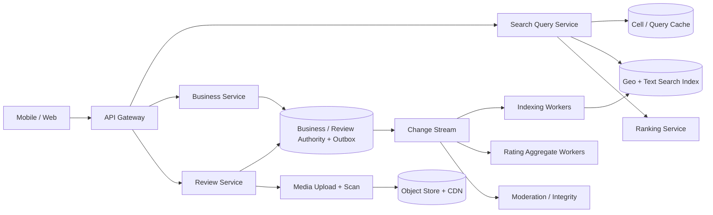

### 28.7 核心 search flow

1. Normalize term/category、限制 radius，解析 center 到 S2/H3 cells；cache key 使用 cell resolution、normalized filters、language、index snapshot/version，而非原始浮点坐标。
2. Search index 用 lexical/semantic term + geocell/bounding box 召回几百候选；对候选运行 exact geodesic distance，过滤 radius、business status 和 open-now。
3. Ranking 综合 text relevance、distance、quality、freshness、personalization，返回 stable cursor。
4. Detail 通过 business ID 从 cache/authority 取 canonical fields；reviews 独立分页，照片走 CDN signed/public policy URL。

### 28.8 核心 review flow

1. Review Service 验证 membership/rate/payload，idempotency + unique active-review constraint，同事务写 Review(PENDING) 与 outbox；返回 pending，不声称已经公开。
2. Media malware/NSFW、text policy、fake-review risk 异步评估；decision 版本化并可 appeal。
3. 进入 VISIBLE，以及 edit/hide/restore 时，在 review authority 的同一事务读取 canonical before/after、分配连续 `business_seq`，写完整 `ReviewVisibleDelta(old_visible/rating,new_visible/rating)` 与 outbox。
4. Aggregate Worker 按 event_id 去重，但只在 `business_seq = applied_business_seq + 1` 时应用 `sum += visible(new_rating)-visible(old_rating); count += new_visible-old_visible`。看到未来 seq 就 buffer/暂停该 business 并从 outbox/journal backfill gap，不能把先到的 v3 应用后再“拒绝旧 v2”。更新 RatingAggregate 后再投影 search doc；定期从 visible Review truth 全量 rebuild 对账。

### 28.9 Deep dive A：PostGIS、Geohash、S2/H3 怎么选

**V1 / 10M businesses**：PostgreSQL + PostGIS `geography(Point,4326)` 与 GiST 索引很合理，支持事务和 `ST_DWithin`。先用 index bounding box 剪枝，再精确距离；不要承诺任意分布严格 O(log N)。示意：

```sql
SELECT business_id,
       ST_Distance(geom, q.point) AS distance_m
FROM business_search, (
  SELECT ST_SetSRID(ST_MakePoint(:lon, :lat), 4326)::geography AS point
) q
WHERE ST_DWithin(geom, q.point, :radius_m)
  AND status = 'OPEN'
ORDER BY distance_m, business_id
LIMIT :limit;
```

**分布式扩展**：S2/H3 将 circle/polygon cover 成多分辨率 cell IDs，用于 shard routing、cache 与 stream aggregation；每个 cell 内仍做 exact distance。Geohash prefix 简单但边界邻居必须显式补查，固定精度在密集/稀疏区不均衡。QuadTree/R-tree 适合空间结构，但 distributed ownership/serialization 更复杂。

Hot Manhattan cell 通过 finer resolution + business hash 拆；荒漠用 coarse cell 减少空 shard。Query cover 数设上限，超大 radius 转 region/category search，防一个请求扫描全球。

### 28.10 Deep dive B：稳定分页与动态 ranking

`OFFSET 20` 在 index 更新或个性化 score 变化时会重复/漏项，深页还要跳过大量文档。Opaque token 包含：

```text
query_hash + center/radius + filter/version + index PIT/snapshot
+ last(sort_score, distance_bucket, business_id) + expiry
```

后续页用 `search_after`，在 token TTL 内固定 model/index snapshot 或至少固定 candidate set version。若 snapshot 已过期返回 restart，而不是悄悄用新排序。Distance 是连续浮点，必须有 deterministic business_id tie-breaker。Exact total 对复杂 geo+text 很贵，返回 estimate 或 capped count。

### 28.11 Deep dive C：营业中与本地时间正确性

`is_open` 不是永久字段。保存 business `timezone`、weekly local schedule、overnight interval、holiday/special exception 与 effective range；query 用 server current instant 转 business local time计算。DST transition、凌晨跨日（20:00–02:00）和临时闭店必须有测试。

为了 search 快，可在 index 物化 `next_open/next_close` 或短期 open-state bucket，但返回详情前按 current schedule version 重算。Business owner update 先 authority commit，index eventual；紧急 closed/takedown 使用高优先 safety event 和 query-time status check。

### 28.12 Deep dive D：Rating aggregate、edit/delete 与 anti-spam

只处理 `review.created` 的 `sum+rating,count+1` 会在 edit/delete/replay 后漂移。VisibleDelta 必须包含 canonical old/new visibility/rating、review version 与 authority 分配的 `business_seq`。Consumer 用 event ID 吸收 duplicate，用严格 next-sequence + gap barrier 保证顺序；不能只记某 review 的 last version 后拒绝晚到事件，否则 v3 先到、v2 后到会永久漏掉 v2 对 aggregate 的贡献。极热 business 可 batch consecutive deltas，但仍原子推进 `applied_business_seq`；periodic rebuild 检测 silent loss。

数据库 unique constraint 只能限制重复 row，无法证明真实消费。Integrity 还需：verified transaction/location（若有）、account/device/IP graph、velocity、text/photo duplication、review burst、merchant collusion。Model 决定 `allow/downrank/quarantine/review`，不是未经 appeal 直接永久封禁；aggregate 只计 policy 允许的 visible weight，且明确显示 filtered/weighted semantics。

### 28.13 Deep dive E：Cache correctness 与 invalidation

- Business detail key 带 `content_version` 或 event-driven invalidation；TTL 是最后保险。
- Search cache key 以 coarse cell + normalized query 构造，value 是 candidate IDs/index snapshot，最终 status/open-now/ACL 可再校验。
- Hot key 使用 request coalescing、stale-while-revalidate 与 jittered TTL；negative cache 更短。
- Rating update 不必每条 review 都清所有 geo query cache；让 result 带 business version，详情/轻量 rerank 校验，query cache 短 TTL。
- Takedown/closure 走 safety epoch deny list，优先于 stale cache。

### 28.14 Multi-region、reliability 与 DR

- Search/detail index/cache 在各 region active-active 读；Business/Review aggregate 有 home region 单写，跨区异步投影。
- 用户写在 nearest edge 接收后路由 home；Review create/edit/delete 的 canonical command、idempotency row 与 `(user_id,business_id)->active_review_id` uniqueness pointer 在 ACK 前同步写 paired safety journal。Search/rating **visibility** 仍可秒级 eventual；media blob 可独立复制，但不能拿“普通 review 可丢尾”换取 duplicate canonical review。
- Region loss 时 search 使用 local stale index并标 freshness。新 owner 只有追上 `review_safety_watermark`、取得更高 failover epoch 后才开放 review 写，旧 owner 的 authority store target-side fence；无法追上则 review path read-only/quarantine。若业务明确选择 RPO>0，则必须等待 lag window、reconcile idempotency/active pointers并 deterministic merge 后再写，不能直接生成第二个 active review。
- Index 可从 authority/outbox replay rebuild；定期做 count/checksum/revision reconciliation。
- Search overload 逐级降级 personalization/semantic rerank/total estimate，保留 lexical + geo baseline；限制 radius/candidate budget。

### 28.15 Security、privacy 与 abuse

- GPS 是敏感数据：默认不持久化精确 query location，日志降精度/采样/短 retention；用户 history/ads use 需 consent。
- Business claim 需要验证、role separation 和 audit；owner 不能直接绕过 review moderation。
- Upload 直达 quarantine bucket，checksum/size/type、malware/NSFW、EXIF stripping；CDN URL 权限与 takedown epoch。
- 防 scraping、enumeration、review bombing、SQL/search injection、oversized radius；API key/user/device/IP 多层 quota。

### 28.16 MLE deep dive：多阶段 local search ranking

1. **Candidate generation**：lexical BM25、category、S2/H3 nearby、semantic embedding；hard radius/status filter。
2. **Light ranker**：text relevance、distance、rating Bayesian shrinkage、review count、open-now、freshness、price。
3. **Heavy reranker**：user cuisine/price preference、context/time；保持 latency budget。
4. **Integrity adjustment**：fake-review/business risk，不让可疑评分直接放大。

少评论商家不能按 raw average 5.0 击败 1,000 条 4.8，可用 Bayesian prior/Wilson-like uncertainty。Labels 来自 click/direction/call/reservation，不把曝光后点击直接当无偏真值；训练记录 impression/exposure propensity，做 position-bias correction 与 exploration。

Offline 看 Recall@K、NDCG、distance/coverage、calibration、new/small business slices；Online 看 successful action、long click、query reformulation，同时 guardrail latency、diversity、chain domination、fairness。Fallback 是 deterministic relevance + distance + smoothed rating。

### 28.17 Observability、cost 与 SLO

指标：search P50/P99、candidate counts/cell cover、index freshness、cache hit/stampede、empty/zero-result、pagination duplicate rate、business update propagation、review moderation age、aggregate rebuild mismatch、takedown leak（必须 0 within SLA）、model slice quality、photo CDN hit/egress。

成本热点是 photo storage/egress、search replicas/semantic embeddings 和 hot-cell compute；Business SQL 体量相对小。用 image renditions/AVIF-WebP、CDN、cold media tier、embedding quantization、candidate budget 和 region-local index 控制。

### 28.18 Trade-offs 与 evolution

- **V1**：Postgres/PostGIS + Redis、Business/Review SQL、rule-based ranking。
- **V2**：outbox -> distributed geo/text index、cursor pagination、media/moderation、versioned aggregate。
- **V3**：S2/H3 regional routing、semantic/personalized ranking、integrity graph、multi-region safety/takedown。

不要因“10M businesses”直接跳到自研全球 quadtree；先证明 PostGIS + regional partition 是否已满足 23k peak search QPS，再按 hot-cell/profile 演进。

### 28.19 高频 follow-up Q&A

**Q：为什么不用 offset？**  
A：动态 index/ranking 会让页间重复/漏项，深 offset 还昂贵；PIT/snapshot + search_after cursor 固定查询语义。

**Q：PostGIS 能撑全球吗？**  
A：10M business 基线可行；按国家/region replica/shard。流量和 index 复杂度上升后用 S2/H3 routing + distributed search，仍保留 authority DB。

**Q：评论成功后为何看不到？**  
A：durable accepted 与 publicly visible 分开；malware/policy/fraud moderation 后才发 VisibleDelta，UI 显示 pending。

**Q：评分如何不因重试/编辑漂移？**  
A：versioned old/new delta、event id dedup、per-business sequence/CAS，并从 visible review truth 周期 rebuild reconciliation。

### 28.20 60 秒总结

> “Yelp 是 authority write 与 geo-search serving 分离。Business/Review 在 home shard 事务提交并写 outbox；各 region 的 S2/H3 + text index 做候选召回，随后 exact distance、open-now 和多阶段 ranking。分页用 query snapshot + search_after cursor，而不是 offset。Review durable accepted 后先 moderation，VISIBLE 的 versioned old/new delta 才更新可重建 rating aggregate。缓存按 cell/normalized query，takedown safety epoch 优先于 stale value。最后以 region-local read、single-writer mutation、fake-review ML fallback 和 media CDN 完成可用性、正确性与成本闭环。”

---

## 29. 跨题复盘：把二十八个系统压缩成可迁移的设计模式

### 29.1 先按 workload 分类，不要按公司名字背题

| Workload axis | 代表案例 | 最关键的设计判断 |
|---|---|---|
| Durable realtime event delivery | WhatsApp、Zoom chat | per-stream ordering、connection ownership、offline catch-up、ack/dedup |
| Materialized social feed | X、Instagram | hybrid fan-out、timeline materialization、ranking、read-time policy gate |
| Large immutable blob | YouTube、Netflix、Drive、Spotify、Instagram media | metadata/blob 分离、direct upload、chunking、CDN、lifecycle |
| High-rate ephemeral state | Uber location、Zoom media | 丢少量旧数据可接受，freshness 比 durability 更重要 |
| Scarce mutable resource | Amazon inventory、Uber driver assignment | conditional write、lease/fencing、reservation、state machine |
| Multi-step business transaction | Amazon checkout、YouTube processing、Drive upload/scan/index | Saga、Outbox、idempotency、reconciliation |
| Personalized retrieval/ranking | Netflix、Spotify、Instagram、X、Amazon | candidate generation → ranking → re-ranking → policy |
| Buffered streaming media plane | YouTube、Netflix、Spotify | CDN、ABR、buffer、origin shielding、egress cost |
| Interactive realtime media plane | Zoom | jitter、packet loss、congestion control、regional routing |
| Globally replicated key lookup | URL Shortener | alias entropy、cache/takedown safety、read-local/write-owned |
| Outbound HTTP delivery | Webhook、Slack Apps、Stripe Webhook | signed at-least-once、retry budget、SSRF、replay |
| Workflow / untrusted compute | Job Scheduler、CI/CD、Batch Inference | DAG state、lease/fencing、fairness、sandbox、checkpoint |
| Storage internals / bulk distribution | S3、ML Model Distribution | placement、checksum/Merkle、repair、swarm/readiness |
| High-contention mutation / ledger | Conflict Control、Stripe、Leaderboard | CAS/lock/serialization、idempotency、audit、escrow |
| LLM / GPU serving | ChatGPT Playground、Batch Inference | token budget、continuous batching、model locality、backpressure |
| Windowed aggregation / exact rank | Top-K、Leaderboard | sketch error、watermark、order statistics、season freeze |
| Distributed combinatorial search | Crossword Solver | CSP pruning、coarse frontier、termination、compute budget |
| Recurrence and device sync | Calendar、Drive | stable identity、sparse exception、cursor/snapshot、conflict |
| External quote and purchase Saga | Lowest-Cost Book、Stripe | exact-vs-deadline semantics、UNKNOWN outcome、reconciliation |
| Turn-based realtime state machine | Online Chess | durable Actor、server clock、epoch fencing、spectator fan-out |
| Enterprise messaging and compliance | Slack | channel sequence、hybrid fan-out、ACL/search/retention |
| Geospatial search | Yelp、Uber | cell routing、exact distance、hot region、stable pagination |

遇到陌生题时先问：它在这些 workload 里属于哪几类？这样已有模式会自然迁移。

### 29.2 Source of truth 与 derived state 对照

| Case | Source of truth | Derived / rebuildable state | 不变量（invariant） |
|---|---|---|---|
| WhatsApp | 有 TTL 的 pending-delivery ciphertext log + conversation/device metadata | device inbox、unread count；plaintext history/search 在 device-local，不能由服务端重建 | 同一 `message_id` 不重复展示；ack 单调推进 |
| YouTube | asset metadata + original object | renditions、thumbnail、search/recommend index | publish 前至少一个可播放 rendition 可用 |
| Uber | trip state machine + assignment record | geo index、ETA cache、heatmap | 一个 driver 同时最多一个 active trip |
| Netflix | title/playback entitlement metadata | CDN cache、personal rows、features | 没有 entitlement 不发 playback token |
| Amazon | order ledger、inventory ownership、payment ledger | cart view、search index、recommendations | 不超卖；支付与退款可审计 |
| Instagram | post/media metadata、follow graph | home feed、story tray、counters | 私有内容不得因旧 cache 越权 |
| X | tweet log、follow graph | home timeline、trends、search index | delete/takedown 最终覆盖所有派生副本 |
| Drive | file/version metadata + immutable chunks | local sync index、preview、search index | version/ACL 更新具有明确序列化点 |
| Spotify | track/rights metadata、playlist operation log | CDN cache、mixes、features | 地区/订阅 rights 在播放授权时强制执行 |
| Zoom | meeting membership/control state | media routing state、quality stats | 未授权 participant 不可加入/取流 |
| S3 | bucket/object metadata + committed chunk/manifest | CDN、repair queue、inventory index | visible object 只能指向校验并达到 durability policy 的 chunks |
| URL Shortener | alias mapping + policy state | cache、geo replica、analytics | alias 唯一；disabled/takedown 优先于 stale redirect cache |
| Webhook | accepted event + subscription/delivery intent | retry schedule、endpoint health、dashboard aggregate | stable event ID；外部交付 at-least-once且可 replay |
| CI/CD | workflow DAG/version + step attempt log | runner cache、log index、artifact cache | untrusted job 不越过 tenant/secret boundary；terminal step 不重复结算 |
| Job Scheduler | schedule definition + run/attempt state | timer buckets、ready queue、runtime prediction | 同一 run 的 business effect 由 idempotency/fencing 保护 |
| Conflict Control | authoritative aggregate/ledger | cache、contention telemetry | lost update 不发生；跨账户转账守恒且可审计 |
| ChatGPT Playground | request/quota/usage/preset metadata | stream buffer、routing cache、analytics | usage 可 reconcile；取消后不继续无限占 GPU/额度 |
| Batch Inference | job/task manifest + immutable input/model refs | ready queue、worker cache、metrics | output commit 由 task/attempt fencing实现 effectively-once |
| Model Distribution | signed model manifest + chunk hashes | peer availability、local cache、tracker state | worker READY 只指向完整校验且获准的 model version |
| Top-K | validated event log + window/version policy | sketch、candidate set、published snapshot | 结果声明 error/freshness；late data 按 watermark/version处理 |
| Leaderboard | authoritative score update/event log | rank index、Top N cache、friends projection | score update 去重；tie tuple 与 season settlement确定 |
| Crossword | job/task graph + dictionary version | checkpoint、heuristic stats、optional visited hints | winner 唯一；No Solution 需证明所有 committed work终结 |
| Calendar | EventSeries/Exception/RSVP + resource reservation | calendar view、sync log、free-busy | occurrence identity稳定；独占资源不 double-book |
| Lowest-Cost Book | purchase request/attempt + external refs | quote cache、seller ranking、coverage aggregate | 不超过 max landed cost；UNKNOWN 未解析前不重复买 |
| Online Chess | replicated game event log + owner epoch | in-memory Actor、snapshot、leaderboard | accepted move 不丢且 per-game 单序；server clock权威 |
| Slack | workspace policy/membership + channel log | delivery、unread、search、notification | channel seq 唯一；private/revoked content不因 stale index泄露 |
| Stripe | payment objects + balanced ledger journal | balances、risk features、webhook views | per-currency transaction平衡；capture/refund上限；UNKNOWN收敛 |
| Yelp | Business/Review authority + moderation state | geo/text index、rating aggregate、cache | visible review delta幂等；takedown优先于 stale search |

一个成熟回答会明确说：**cache miss 影响 latency；source-of-truth corruption 影响 correctness。两者要采用不同保护级别。**

### 29.3 Fan-out：三种模式与切换条件

#### Fan-out on write

发布时将内容 ID 写入每个 follower 的 inbox/timeline。

- 优点：读便宜且 latency 稳定。
- 缺点：大 V 用户造成 write amplification；inactive user 浪费空间；删除要传播。
- 适合：普通用户、好友量有上限、read-heavy feed。

#### Fan-out on read

读取时拉取所有 followee 的近期内容，再 merge/rank。

- 优点：写轻、内容变化即时可见。
- 缺点：读放大，关注数大时 tail latency 差。
- 适合：celebrity、低活跃读者、候选集合不大。

#### Hybrid fan-out

- 普通 producer 走 push；celebrity/high-fanout producer 走 pull。
- inbox 只存 `content_id + score_hint + timestamp`，正文从 object/content service 读。
- 读时合并 precomputed inbox、celebrity pull candidates、ads 和 exploration candidates。
- 使用 `author_id + follower_shard` 拆分 fan-out job；consumer 必须以 `(user_id, content_id)` 幂等。

**切换阈值不是固定 follower 数**，而应由 `fanout_cost = followers × active_ratio × write_rate`、队列 lag 和读侧预算共同决定。

### 29.4 长流程的可靠模板：Local transaction + Outbox + Saga

```text
API request
   │
   ├─ local DB transaction:
   │      update aggregate/state machine
   │      insert outbox_event(event_id, aggregate_version)
   │
   └─ return accepted/current state

Outbox relay / CDC → durable log → idempotent consumers
                                      ├─ side effect A
                                      ├─ side effect B
                                      └─ materialized view

Reconciler periodically compares source-of-truth with derived systems.
```

必须逐项回答：

1. **Lost event**：业务状态与 outbox 在同一 local transaction，避免“DB 成功、publish 失败”。
2. **Duplicate event**：consumer 保存 `event_id` 或以业务唯一键做 conditional upsert。
3. **Out-of-order event**：每个 aggregate 带 `version`；旧 version 丢弃或缓冲。
4. **Poison event**：有限重试后进入 DLQ，不能无限阻塞 partition。
5. **Stuck workflow**：watchdog 扫描超时状态，重发、补偿或转人工队列。
6. **Unknown outcome**：向 source of truth 查询，而不是根据 timeout 猜测。
7. **Silent divergence**：reconciliation job 对账并发出可审计 repair event。

Amazon checkout、Stripe/购书支付、Webhook delivery、CI/CD、Job Scheduler、Batch Inference、YouTube transcoding、Drive scanning/indexing 都能套用这套骨架，但补偿语义不同：钱不能简单“删除记录”，视频 job 可以安全重跑，文件权限传播则要 fail closed。

### 29.5 大对象（large blob）的统一做法

不要让 application server 代理 TB/PB 级字节流：

1. client 向 metadata service 请求 upload session；
2. service 验证 quota/auth，返回 presigned URL / temporary credential；
3. client 直接 multipart/chunk upload 到 object storage；
4. 每块带 checksum，支持 resumable upload；
5. upload service 在服务端 seal bounded part pages / hierarchical manifest；complete 只提交 session、root hash 和 part count，再原子提交 metadata pointer；
6. async pipeline 扫描、转码、预览、索引；
7. download 走 signed URL + CDN/edge，权限在发 token 时检查。

关键细节：

- **Content-addressed storage** 用 chunk hash 做 dedup，但要防 hash oracle 和跨租户信息泄漏。
- metadata 与 blob 提交之间会产生 orphan；用 mark-and-sweep GC，保留 safety window。
- delete 通常先 tombstone，撤销 token 并阻止新读，再异步清 CDN、replica、index 和备份。
- encryption 可以是 per-object **DEK** 加密数据，再由 KMS-managed **KEK** wrap DEK；轮换 KEK 时通常只需 re-wrap DEK，不必重加密整块数据。
- CDN key 必须包含会影响字节内容的 rendition/codec/DRM 维度，但不能把短期用户 token 放入 cache key 导致零命中。

### 29.6 Realtime 不是一个协议词，而是四个不同问题

| 问题 | 常见机制 | 主要风险 |
|---|---|---|
| Server → client 小事件 | WebSocket、SSE、push notification | connection ownership、reconnect storm、slow consumer |
| Client 高频 telemetry | streaming RPC、UDP/QUIC、batched HTTP | burst、stale update、sampling、backpressure |
| 双向音视频 | WebRTC/SRTP over UDP、SFU | jitter、loss、NAT、congestion、regional failure |
| Offline catch-up | cursor-based pull / sync log | gap、retention、pagination consistency |

连接层与消息 durable storage 要解耦。gateway 的内存连接不是 source of truth；断线重连时客户端提交 `last_seen_cursor`，从 durable log 补洞。服务端要给连接分配 **session epoch / fencing token**，避免旧 gateway 在迁移后继续投递。

### 29.7 Consistency 选择矩阵

| 数据 | 推荐保证 | 原因 |
|---|---|---|
| 钱、库存、driver assignment、room reservation、score settlement、file ACL version | strong consistency / serializable point | 违反不变量的代价高 |
| 用户自己的刚写内容 | read-your-writes / session consistency | 用户会立刻验证自己的操作 |
| feed、view count、presence、location heatmap | eventual consistency | freshness/availability 优先，允许短暂偏差 |
| 消息/playlist/文件版本 | per-entity ordered log | 不需要全局顺序，只需会话/对象内顺序 |
| 推荐 features | point-in-time correct offline + bounded-stale online | 防 leakage，同时控制 serving latency |

Senior+ 不能只说“CAP 选 AP/CP”。需要说明：

- 哪一个 operation 在哪一个 partition/leader 上序列化；
- 网络分区时拒绝哪类写、允许哪类降级；
- 用户会看到什么；
- 恢复后如何 reconcile；
- stale read 的最大容忍窗口是多少。

### 29.8 Multi-region：先写清 ownership，再谈 active-active

一个可操作的演进路径：

1. **Single write region + global read/CDN**：最简单，适合 V1。
2. **Home-region ownership**：按 user/conversation/tenant 分配 home region；同一 aggregate 单写，多地读。
3. **Cell-based architecture**：每个 cell 含完整服务和数据分片，blast radius 有界。
4. **Selective active-active**：只让可合并的数据多主写，如 counters、presence、某些 CRDT；库存/支付仍保留单一权威点。

Region failover 必须回答：

- RPO/RTO 目标与复制 lag；
- DNS/GSLB、client retry、connection draining；
- 原 leader 是否被 lease/fencing 隔离，避免 split brain；
- 未复制成功的已确认写如何处理；
- failback 是重新同步还是反向复制；
- failover 是否定期 game day 演练。

### 29.9 通用 MLE 架构：从产品目标到安全降级

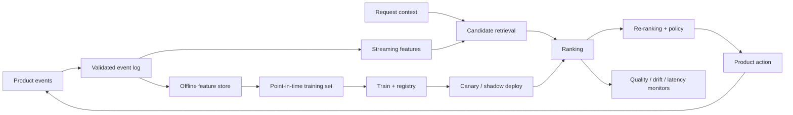

#### Objective

不要直接把 CTR 当最终目标。通常需要多目标：

```text
utility = w1 * long_term_value
        + w2 * satisfaction
        + w3 * creator/supply health
        - w4 * negative_feedback
        - w5 * safety_risk
        - w6 * latency_or_cost
```

权重由产品策略与实验确定；hard policy constraints 不应仅靠模型分数“学出来”。

#### Labels 与数据正确性

- 正样本和负样本都要定义 observation window；未曝光内容不能当负样本。
- 用 impression ID 连接展示、点击、播放、购买，避免 attribution 错位。
- training join 必须 **point-in-time correct**，不能看到未来 feature。
- propensity logging 支撑 inverse propensity weighting / counterfactual evaluation。
- 删除请求、隐私 consent、retention 要传播到 feature 与 training dataset。

#### Retrieval → Ranking → Re-ranking

1. retrieval 用 ANN、graph、collaborative filtering、rules 召回几百到几千候选；优化 recall 与 latency。
2. ranking 用 richer features / DNN / GBDT 估计多目标 utility；优化 NDCG、calibration、business metrics。
3. re-ranking 做 diversity、freshness、dedup、fairness、inventory/rights、safety 和频控。
4. fallback 按层级：last-known-good model → lightweight model → heuristic/popularity → safe static list。

#### Evaluation

- Offline：Recall@K、NDCG、MAP、AUC、calibration、coverage、diversity、slice fairness。
- Online：guardrail + primary KPI；采用 A/B、interleaving、switchback（marketplace）或 cluster randomization（network effects）。
- Serving：p50/p95/p99 latency、timeout、feature missing、fallback rate、model version skew。
- Post-deploy：input drift、prediction drift、label delay、performance decay、feedback-loop health。

### 29.10 Overload control：容量不足时按价值降级

请求进入系统后的顺序应是：

1. **Admission control**：基于 tenant/user/token bucket 拒绝超预算请求。
2. **Deadline propagation**：下游知道剩余时间，不做注定超时的工作。
3. **Bounded concurrency / queue**：防止 queue 无限增长和内存崩溃。
4. **Priority scheduling**：支付/通话控制/消息正文高于 analytics、prefetch、counter。
5. **Load shedding**：丢弃可重建、过期、低价值工作。
6. **Graceful degradation**：关闭个性化、降低清晰度、缩短候选集、延迟非关键通知。
7. **Retry budget**：重试流量不得放大故障；exponential backoff + jitter + circuit breaker。

一个很好的追问回答是：“我不会把 autoscaling 当第一道防线，因为 scale-up 有延迟，而 retry storm 往往在几十秒内就能压垮依赖。”

### 29.11 观测体系：从用户旅程而不是机器指标出发

每题至少定义：

- **SLI/SLO**：例如 message end-to-end delivery、video time-to-first-frame、checkout success、meeting media quality。
- **Golden signals**：traffic、latency、errors、saturation。
- **Correctness metrics**：duplicate/missing event、inventory mismatch、ACL leak、stuck saga、sync divergence。
- **Freshness metrics**：event-time lag、feature age、geo-index age、timeline lag。
- **Queue metrics**：depth、oldest age、partition skew、retry/DLQ rate。
- **ML metrics**：feature null、prediction distribution、fallback、slice quality、delayed labels。
- **Cost metrics**：每 GB delivered、每 media minute、每 recommendation、每 order、cache egress。

使用贯穿入口、event 和异步 job 的 `trace_id / request_id / event_id / aggregate_id`。高基数 ID 不应直接成为 metrics label，而应进入 sampled trace/log。

### 29.12 常见方案选择：一句话不够，要给 decision boundary

| 决策 | 选择 A 的条件 | 选择 B 的条件 |
|---|---|---|
| SQL vs NoSQL | transaction、约束、复杂查询优先 | 单一 access pattern、超大水平扩展优先 |
| Queue vs log | 单消费者工作分配、完成即删除 | replay、多 consumer、ordered partition |
| Cache-aside vs write-through | 可接受首次 miss、应用控制刷新 | 必须在写时同步 cache，但写 latency 更高 |
| Push vs pull feed | 活跃读多、producer fanout 可控 | celebrity/high-fanout 或低活跃消费者 |
| WebSocket vs SSE | 双向低延迟 | 单向 server events、实现更简单 |
| WebRTC P2P vs SFU | 极小会议且拓扑简单 | 多人会议、服务端路由/录制/质量控制 |
| Strong vs eventual | 不变量被破坏不可接受 | stale 可容忍且 availability 更重要 |
| Batch vs stream | 小时级 freshness、成本优先 | 秒级决策、event-time correctness 必需 |
| Precompute vs on-demand | 热门且可复用、读延迟严格 | 长尾、个性化强、存储放大不可接受 |
| Exact vs deadline-bounded | 必须证明全量 coverage / exact rank | 外部依赖慢、用户 latency 优先且可报告 coverage/error |
| Single-node vs distributed search | heuristic 后工作能在预算内完成 | coarse subtree 足够大且并行收益高于协调成本 |
| Redis accelerator vs durable idempotency | cache miss 只影响 latency | 重试可能产生支付、订单或唯一业务副作用 |

### 29.13 二十八题最终迁移口诀

面对任何新题，依次问：

1. **Truth**：权威数据在哪里，谁拥有写入？
2. **Scale**：峰值 QPS、bytes、fan-out 与热点是什么？
3. **Contract**：API/event/state machine 的重试和顺序语义是什么？
4. **Path**：哪条是同步 critical path，什么移到 async？
5. **Invariant**：哪个业务条件绝不能破坏？
6. **Failure**：timeout、duplicate、out-of-order、partial failure 如何恢复？
7. **Region**：写 ownership、RPO/RTO、fencing 和 failback 是什么？
8. **ML**：目标、标签、特征、训练服务一致性、fallback 怎么做？
9. **Operate**：SLO、alert、reconcile、capacity、cost 如何闭环？
10. **Evolve**：V1 最小正确设计是什么，什么指标触发下一次拆分？

只要这十问能答完整，即使面试题从 WhatsApp 换成协作白板、从 Uber 换成即时配送，核心能力仍然成立。

## 30. 最后 5 分钟：Senior+ 自检清单

在结束前快速确认：

- [ ] 我是否明确了核心 use cases、out of scope 和 SLO？
- [ ] 每个规模数字是否真的影响了 partition、storage、bandwidth 或 cache 决策？
- [ ] 我是否画清 source of truth、derived state 与 data ownership？
- [ ] 写链路是否有 idempotency、dedup、ordering 和 retry 语义？
- [ ] 异步流程是否有 DLQ、replay、reconciliation 和 stuck-job detector？
- [ ] 热点、突发流量、慢依赖、region failure 会发生什么？
- [ ] 是否给出 graceful degradation，而不是只说“加机器”？
- [ ] 是否讲清 strong / eventual consistency 的边界及用户可见后果？
- [ ] 是否覆盖 security、privacy、abuse、retention 与 audit？
- [ ] MLE 部分是否包含 objective、labels、features、serving、evaluation、monitoring、rollback？
- [ ] 是否给出至少一个被拒绝的方案和清晰理由？
- [ ] 是否说明 V1、scale-up trigger 与 migration path？

> 最好的 Senior+ 收尾不是重复组件，而是重申三个判断：**哪条链路最重要、哪项保证最昂贵、系统在失败时如何保持可用且可恢复。**
