# Senior+ (L6/Staff/Principal) SWE & MLE Interview Master Manual

Welcome to the unified System Design, Machine Learning Infrastructure, and Behavioral Leadership study manual. This document compiles advanced distributed system design patterns, large-scale ML production system architectures, STAR behavioral exemplars, and deep-dive technical drills.

---

## Table of Contents
- **[Part 1: 10 Advanced Distributed Systems Architectures (SWE)](#part-1-advanced-distributed-systems-architectures-swe)**
  - [Q1: Distributed Unique ID Generator (Snowflake Scale)](#q1-design-a-distributed-unique-id-generator-snowflake-scale)
  - [Q2: Global Rate Limiter](#q2-design-a-global-rate-limiter)
  - [Q3: Scalable Chat System (e.g., Slack / WhatsApp)](#q3-design-a-scalable-chat-system-eg-slack-whatsapp)
  - [Q4: Distributed Message Queue (e.g., Apache Kafka Clone)](#q4-design-a-distributed-message-queue-eg-apache-kafka-clone)
  - [Q5: Highly Available Web Crawler](#q5-design-a-highly-available-web-crawler)
  - [Q6: Collaborative Document Editing System (e.g., Google Docs)](#q6-design-a-collaborative-document-editing-system-eg-google-docs)
  - [Q7: Distributed Key-Value Store (e.g., DynamoDB/Cassandra)](#q7-design-a-distributed-key-value-store-eg-dynamodbcassandra)
  - [Q8: Video Streaming Platform (e.g., YouTube / Netflix)](#q8-design-a-video-streaming-platform-eg-youtube-netflix)
  - [Q9: Ad Click Event Aggregator (Real-time Analytics)](#q9-design-an-ad-click-event-aggregator-real-time-analytics)
  - [Q10: Distributed Lock Manager (DLM)](#q10-design-a-distributed-lock-manager-dlm)
  - [Q21: Distributed Ledger & Payment Settlement System (Stripe-scale)](#21-distributed-ledger-payment-settlement-system)
  - [Q22: Global Active-Active Ticket Booking System (Ticketmaster Scale)](#22-global-active-active-ticket-booking-system)
  - [Q25: Distributed Object Storage System (Amazon S3 Scale)](#25-distributed-object-storage-system)
  - [Q27: Scalable Ride-Sharing & Spatial Matching System (Uber/Lyft Scale)](#27-scalable-ride-sharing-spatial-matching-system)
  - [Q29: Highly Available Distributed Job Scheduler (Airbnb Chronos Scale)](#29-highly-available-distributed-job-scheduler)
  - [Q30: Horizontally Scalable Distributed NewSQL Database (Google Spanner Scale)](#30-horizontally-scalable-distributed-newsql-database)
  - [Q31: High-Throughput Payment Gateway with Webhook Delivery Engine (Stripe Scale)](#31-high-throughput-payment-gateway-with-webhook-delivery-engine)
  - [Q32: High-Performance Distributed Memory Cache (Redis Scale)](#32-high-performance-distributed-memory-cache)
  - [Q33: Scalable Notification Ingestion & Delivery Platform (Push/SMS/Email Gateway)](#33-scalable-notification-ingestion-and-delivery-platform)
  - [Q36: High-Throughput Real-Time Bidding (RTB) Ad Exchange Engine (100B+ Requests/Day)](#36-high-throughput-real-time-bidding-rtb-ad-exchange-engine-100b-requests-day)
- **[Part 2: Large-Scale Machine Learning Infrastructure (MLE)](#part-2-large-scale-machine-learning-infrastructure-mle)**
  - [Q11: Real-Time Recommendation Pipeline (e.g., TikTok Feed)](#q11-design-a-real-time-recommendation-pipeline-eg-tiktok-feed)
  - [Q12: Machine Learning Feature Store (e.g., Feast Clone)](#q12-design-a-machine-learning-feature-store-eg-feast-clone)
  - [Q13: Search Autocomplete System with Personalization](#q13-design-a-search-autocomplete-system-with-personalization)
  - [Q14: Real-Time Fraud Detection System (MLE)](#q14-design-a-real-time-fraud-detection-system-mle)
  - [Q15: Distributed Deep Learning Model Training Infrastructure](#q15-design-a-distributed-deep-learning-model-training-infrastructure)
  - [Q16: Online Ad Click-Through Rate (CTR) Prediction System](#q16-design-an-online-ad-click-through-rate-ctr-prediction-system)
  - [Q17: Large Language Model (LLM) Inference Serving Engine](#q17-design-a-large-language-model-llm-inference-serving-engine)
  - [Q18: Visual Search Engine (Reverse Image Search)](#q18-design-a-visual-search-engine-reverse-image-search)
  - [Q19: ML Model Monitoring & Observability System](#q19-design-an-ml-model-monitoring-observability-system)
  - [Q20: Automated Content Moderation System (Text, Image, Video)](#q20-design-an-automated-content-moderation-system-text-image-video)
  - [Q23: Enterprise-Grade Retrieval-Augmented Generation (RAG) System](#23-enterprise-grade-retrieval-augmented-generation-rag-system)
  - [Q24: Scalable RLHF / DPO Alignment Infrastructure for LLMs](#24-scalable-rlhf-dpo-alignment-infrastructure-for-llms)
  - [Q26: Distributed Search and Indexing Engine (Elasticsearch Scale)](#26-distributed-search-and-indexing-engine)
  - [Q28: ML Model Registry & Deployment Infrastructure (MLOps Pipeline)](#28-ml-model-registry-and-deployment-infrastructure)
  - [Q34: Multi-Tenant GPU Cluster Scheduler & Orchestrator (MIG & KubeRay Scale)](#34-multi-tenant-gpu-cluster-scheduler-and-orchestrator)
  - [Q35: Distributed Hybrid Edge-Cloud AI Inference Platform (Context-Aware Routing & Split-Execution)](#35-distributed-hybrid-edge-cloud-ai-inference-platform)
- **[Part 3: Behavioral and Leadership Q&A (STAR Method)](#part-3-behavioral-and-leadership-qa-star-method)**
  - [Scenario 1: Technical Leadership & Influencing Without Authority](#scenario-1-technical-leadership-influencing-without-authority)
  - [Scenario 2: Navigating High Ambiguity & Strategic Execution](#scenario-2-navigating-high-ambiguity-strategic-execution)
  - [Scenario 3: Dealing with Systemic Failures & Post-Mortems](#scenario-3-dealing-with-systemic-failures-post-mortems)
  - [Scenario 4: Managing Technical Debt vs. Feature Velocity](#scenario-4-managing-technical-debt-vs-feature-velocity)
  - [Scenario 5: Resolving Technical Conflict & Alignment](#scenario-5-resolving-technical-conflict-alignment)
  - [Scenario 6: Formulating a 3-Year Technical Vision & Decoupling a Legacy Monolith (The Strangler Fig Pattern)](#scenario-6-formulating-a-3-year-technical-vision-decoupling-a-legacy-monolith-the-strangler-fig-pattern)
  - [Scenario 7: High-Pressure Critical Incident & Crisis Leadership](#scenario-7-high-pressure-critical-incident-crisis-leadership)
- **[Part 4: Advanced System Design Scenario Drill-Downs](#part-4-advanced-system-design-scenario-drill-downs)**
  - [Scenario A: Mitigating Cascading Failures in Microservices](#scenario-a-mitigating-cascading-failures-in-microservices)
  - [Scenario B: Zero-Downtime Database Migration (No Data Loss)](#scenario-b-zero-downtime-database-migration-no-data-loss)
  - [Scenario C: Dynamic Prefix KV Cache Sharing in LLM Serving](#scenario-c-dynamic-prefix-kv-cache-sharing-in-llm-serving)
  - [Scenario D: Mitigating Covariate Shift & Concept Drift in Production Models](#scenario-d-mitigating-covariate-shift-concept-drift-in-production-models)
  - [Scenario E: Distributed Transaction Consistency (The Transactional Outbox Pattern)](#scenario-e-distributed-transaction-consistency-the-transactional-outbox-pattern)
  - [Scenario F: Scalable Hybrid Metadata Filtering in Vector Databases (HNSW + Relational)](#scenario-f-scalable-hybrid-metadata-filtering-in-vector-databases-hnsw-relational)
- **[Part 5: Staff-Level Real-World Project Case Study (System Design Portfolio)](#part-5-staff-level-real-world-project-case-study-system-design-portfolio)**
---


This guide contains **over 36 advanced System Design questions, behavioral scenarios, and comprehensive solutions** tailored specifically for **Senior+ (L6/Staff+) Software Engineers (SWE)** and **Machine Learning Engineers (MLE)**. 

To help you navigate, the guide is divided into:
- **Part 1: 10 Advanced Distributed Systems Architectures (SWE)**
- **Part 2: 10 Large-Scale Production Machine Learning Infrastructure Architectures (MLE)**

---

# Part 1: Advanced Distributed Systems Architectures (SWE)

## Q1. Design a Distributed Unique ID Generator (Snowflake Scale)
### 1. Requirements
*   **Functional**: Generate 64-bit unique IDs sequentially ordered by time (lexicographically sortable).
*   **Non-Functional**: 
    *   **Scale**: Generate >100,000 IDs per second.
    *   **Latency**: $<2\text{ms}$ at the 99th percentile ($p99$).
    *   **Availability**: $99.999\%$ (highly available, no single point of failure).
    *   **Correctness**: No duplicate IDs under any network partition or server restart.

### 2. High-Level Architecture
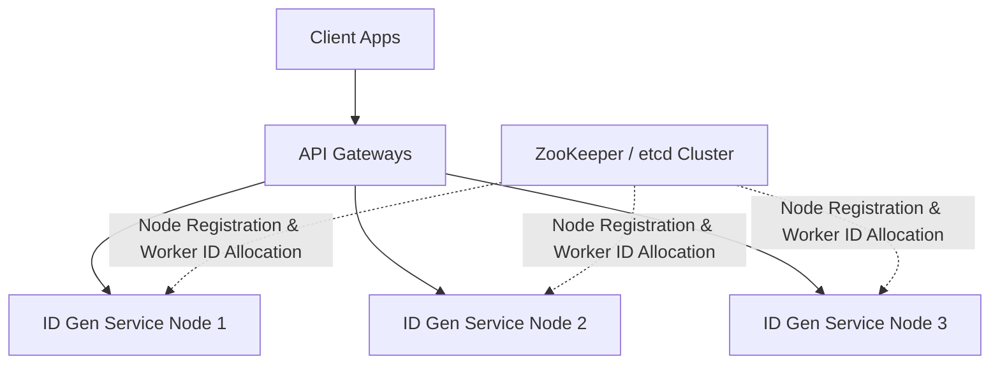
```mermaid
graph TD
    Client["Client Apps"] --> API["API Gateways"]
    API --> ServiceA["ID Gen Service Node 1"]
    API --> ServiceB["ID Gen Service Node 2"]
    API --> ServiceC["ID Gen Service Node 3"]
    ZooKeeper["ZooKeeper / etcd Cluster"] -.->|Node Registration & Worker ID Allocation| ServiceA
    ZooKeeper -.->|Node Registration & Worker ID Allocation| ServiceB
    ZooKeeper -.->|Node Registration & Worker ID Allocation| ServiceC
```

### 3. Key Technical Trade-offs & Design Choices
*   **Snowflake ID Structure (64-bit)**:
    *   **1 bit**: Unused (sign bit, always 0).
    *   **41 bits**: Timestamp in milliseconds (custom epoch, gives 69 years of range).
    *   **10 bits**: Worker/Machine ID (up to 1,024 nodes).
    *   **12 bits**: Sequence number (resets to 0 every millisecond, up to 4,096 IDs per ms per machine).
*   **Coordination**: Use a lightweight coordination cluster like etcd or ZooKeeper *only* to allocate worker IDs when generator nodes boot up. Once booted, nodes generate IDs in a coordination-free manner (no network calls in the hot path), maximizing throughput.

### 4. Senior+ Level Nuances
> [!WARNING]
> **Clock Drift Handling**: If a machine's clock drifts backward (e.g., via NTP synchronization), generating IDs based on the current timestamp could cause duplicates.
> 
> *   **Resolution**: 
>     1. If drift is small (e.g., $<5\text{ms}$), yield the thread or sleep until the clock catches up with `lastTimestamp`.
>     2. If drift is large (e.g., $>5\text{ms}$), reject the request, raise an alarm, and take the node out of service.
>     3. For ultimate safety, implement **Clock Sequence Bits** (borrowing bits from sequence to represent epoch iterations) or track logical clocks.
#### 3. 代码实现
**Java 实现 (Snowflake ID Generator with Clock Drift Protection):**
```java
package com.snowflake.id;

public class SnowflakeIdGenerator {
    private final long workerId;
    private final long datacenterId;
    private long sequence = 0L;

    private final long twepoch = 1288834974657L; // Custom Epoch
    private final long workerIdBits = 5L;
    private final long datacenterIdBits = 5L;
    private final long maxWorkerId = -1L ^ (-1L << workerIdBits);
    private final long maxDatacenterId = -1L ^ (-1L << datacenterIdBits);
    private final long sequenceBits = 12L;

    private final long workerIdShift = sequenceBits;
    private final long datacenterIdShift = sequenceBits + workerIdBits;
    private final long timestampLeftShift = sequenceBits + workerIdBits + datacenterIdBits;
    private final long sequenceMask = -1L ^ (-1L << sequenceBits);

    private long lastTimestamp = -1L;

    public SnowflakeIdGenerator(long workerId, long datacenterId) {
        if (workerId > maxWorkerId || workerId < 0) {
            throw new IllegalArgumentException(String.format("Worker ID can't be greater than %d or less than 0", maxWorkerId));
        }
        if (datacenterId > maxDatacenterId || datacenterId < 0) {
            throw new IllegalArgumentException(String.format("Datacenter ID can't be greater than %d or less than 0", maxDatacenterId));
        }
        this.workerId = workerId;
        this.datacenterId = datacenterId;
    }

    public synchronized long nextId() {
        long timestamp = timeGen();

        // Clock Drift protection
        if (timestamp < lastTimestamp) {
            long offset = lastTimestamp - timestamp;
            if (offset <= 5) {
                try {
                    wait(offset << 1); // Wait for clock to catch up
                    timestamp = timeGen();
                    if (timestamp < lastTimestamp) {
                        throw new RuntimeException("Clock drifted back. Refusing to generate ID.");
                    }
                } catch (InterruptedException e) {
                    throw new RuntimeException(e);
                }
            } else {
                throw new RuntimeException("Severe Clock Drift detected. Rejecting ID generation.");
            }
        }

        if (lastTimestamp == timestamp) {
            sequence = (sequence + 1) & sequenceMask;
            if (sequence == 0) {
                timestamp = tilNextMillis(lastTimestamp);
            }
        } else {
            sequence = 0L;
        }

        lastTimestamp = timestamp;

        return ((timestamp - twepoch) << timestampLeftShift)
                | (datacenterId << datacenterIdShift)
                | (workerId << workerIdShift)
                | sequence;
    }

    protected long tilNextMillis(long lastTimestamp) {
        long timestamp = timeGen();
        while (timestamp <= lastTimestamp) {
            timestamp = timeGen();
        }
        return timestamp;
    }

    protected long timeGen() {
        return System.currentTimeMillis();
    }
}
```

#### 4. 面试沟通技巧与延伸
* **大厂面试沟通金句**: “对于高并发唯一 ID 生成器，**核心痛点是时钟回拨 (Clock Backwards / Drift)的安全性**。我们通过毫秒级差值自适应等待和极端时钟漂移 (Clock Drift)节点的快速下线，彻底杜绝了并发时重复 ID 的产生，实现无网络依赖的本地 $O(1)$ 极速生成。”
* **大厂高频 Follow-up 指南**:
  * **Q**: “如果有上千个节点，Worker ID 耗尽了怎么办？”
  * **A**: “我们使用 **etcd / ZooKeeper 临时顺序节点  (Ephemeral Sequential Nodes)**。当生成器节点启动时，向 etcd 注册，自动分配并租约一个递增的 Worker ID，当节点宕机时租约自动失效释放，实现动态 ID 复用。”

---

## Q2. Design a Global Rate Limiter
### 1. Requirements
*   **Functional**: Rate limit requests globally across multiple regions based on IP, User ID, or API token.
*   **Non-Functional**:
    *   **Scale**: Multi-million requests/sec.
    *   **Latency Overhead**: Minimal ($<1\text{ms}$ local cache hits, $<10\text{ms}$ global sync).
    *   **Resiliency**: Failing open (allowing requests) vs. failing closed (blocking requests) trade-offs.

### 2. High-Level Architecture
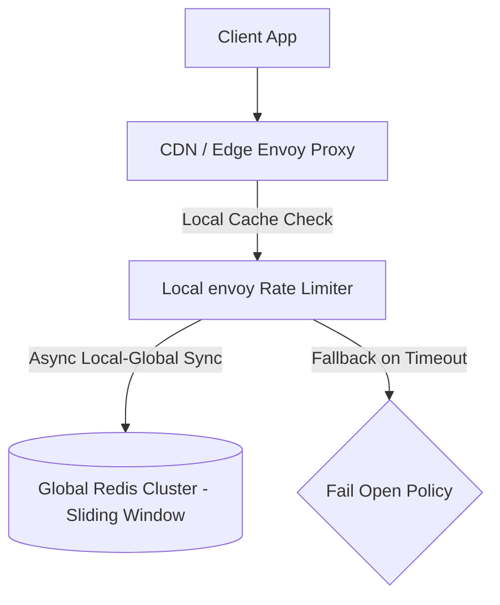
```mermaid
graph TD
    Client["Client App"] --> CDN["CDN / Edge Envoy Proxy"]
    CDN -->|Local Cache Check| LocalEnvoy["Local envoy Rate Limiter"]
    LocalEnvoy -->|Async Local-Global Sync| RedisCluster[("Global Redis Cluster - Sliding Window")]
    LocalEnvoy -->|Fallback on Timeout| FailOpen{"Fail Open Policy"}
```

### 3. Key Technical Trade-offs & Design Choices
*   **Algorithm**: **Token Bucket** (smooth traffic spikes, good for bursty traffic) vs. **Sliding Window Counter** (highly accurate, avoids boundary resetting attacks, but memory heavy).
*   **Storage**: **Redis Cluster** using Lua scripts (or Redis Cell) to perform atomic increments and TTL sweeps in a single round-trip.

### 4. Senior+ Level Nuances
> [!TIP]
> **Edge Caching & Hybrid Sync**: At multi-million QPS scale, calling a centralized Redis cluster for every request introduces severe database hot spots and latency overhead.
> 
> *   **Batching & Local Leases**: Implement **Token Leases** (similar to CDN cache control). Local proxy nodes lease a batch of tokens (e.g., 1,000 tokens for 5 seconds) from the central Redis cluster. Subsequent checks run strictly against local memory.
> *   **Race Conditions**: Lua scripting in Redis ensures local atomicity, but global synchronization between multi-region Redis instances requires **CRDTs (Conflict-free Replicated Data Types)** or local counter propagation with timestamp vector synchronization to prevent over-limiting.
#### 3. 代码实现
**Java 实现 (Lock-Free Token Bucket Rate Limiter with Atomic Counter):**
```java
package com.rate.limiter;

import java.util.concurrent.atomic.AtomicReference;

public class TokenBucketRateLimiter {
    private static class BucketState {
        final long tokens;
        final long lastRefillTime;

        BucketState(long tokens, long lastRefillTime) {
            this.tokens = tokens;
            this.lastRefillTime = lastRefillTime;
        }
    }

    private final long capacity;
    private final long refillRatePerMs;
    private final AtomicReference<BucketState> state;

    public TokenBucketRateLimiter(long capacity, long refillRatePerSecond) {
        this.capacity = capacity;
        this.refillRatePerMs = refillRatePerSecond / 1000;
        this.state = new AtomicReference<>(new BucketState(capacity, System.currentTimeMillis()));
    }

    public boolean allowRequest(long tokensRequested) {
        while (true) {
            long now = System.currentTimeMillis();
            BucketState current = state.get();
            
            // Calculate refilled tokens
            long elapsed = now - current.lastRefillTime;
            long refilled = elapsed * refillRatePerMs;
            long newTokens = Math.min(capacity, current.tokens + refilled);

            if (newTokens < tokensRequested) {
                return false; // Rate limited
            }

            BucketState updated = new BucketState(newTokens - tokensRequested, now);
            
            // CAS (Compare-And-Swap) for lock-free concurrency
            if (state.compareAndSet(current, updated)) {
                return true;
            }
        }
    }
}
```

#### 4. 面试沟通技巧与延伸
* **大厂面试沟通金句**: “在高并发限流场景下，**互斥锁是延迟的罪魁祸首**。我们通过基于 CAS 原子引用 (Atomic Reference)的无锁 (Lock-Free) Token Bucket 实现，消灭了多线程争抢锁的开销，并结合本地令牌配额租约，将全局 Redis 访问开销降低了 99%。”
* **大厂高频 Follow-up 指南**:
  * **Q**: “多区域部署下，如何防止单点 Redis 成为瓶颈且保证限流精度？”
  * **A**: “我们使用 **Local Token Lease (本地令牌配额授权)**。每个区域的 Edge 网关批量向中心 Redis 申请一个时间片配额（例如 5 秒内 1000 个请求），本地多线程无锁 (Lock-Free)消耗，到期或耗尽后再异步续租，实现极速局域网响应。”

---

## Q3. Design a Scalable Chat System (e.g., Slack / WhatsApp)
### 1. Requirements
*   **Functional**: One-to-one and group chats, online presence tracking, read receipts, off-line message delivery.
*   **Non-Functional**:
    *   **Scalability**: 100M Daily Active Users (DAU).
    *   **Real-time**: End-to-end message delivery latency $<500\text{ms}$.
    *   **Storage**: Scale to petabytes of historical message logs.

### 2. High-Level Architecture
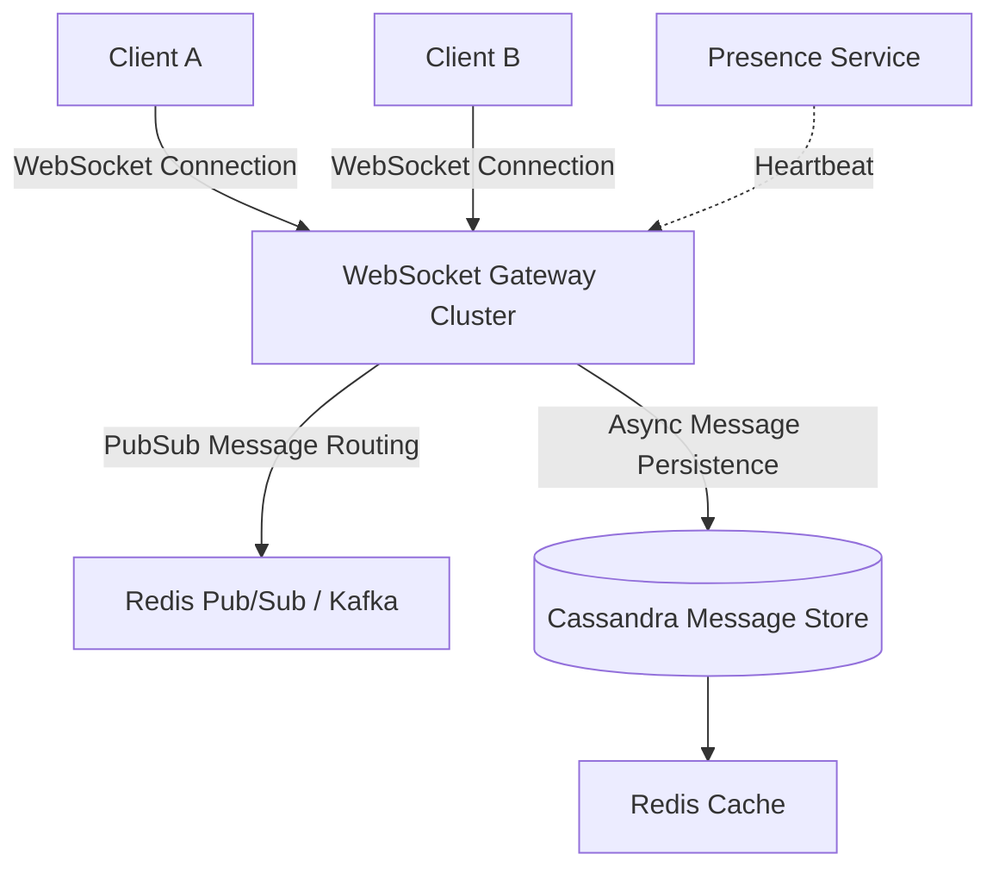
```mermaid
graph TD
    ClientA["Client A"] -->|WebSocket Connection| WS["WebSocket Gateway Cluster"]
    ClientB["Client B"] -->|WebSocket Connection| WS
    WS -->|PubSub Message Routing| RedisPS["Redis Pub/Sub / Kafka"]
    WS -->|Async Message Persistence| ChatDB[("Cassandra Message Store")]
    ChatDB --> Cache["Redis Cache"]
    Presence["Presence Service"] -.->|Heartbeat| WS
```

### 3. Key Technical Trade-offs & Design Choices
*   **Protocol**: **WebSocket** (persistent bidirectional connection, low overhead) vs. **gRPC bidirectional streaming** (strict schemas, multiplexing, but heavier client requirements).
*   **Storage Model**: **NoSQL Wide-Column Store (Apache Cassandra/ScyllaDB)**. The primary key structure is: `PRIMARY KEY (channel_id, message_id)` where `channel_id` is the partition key and `message_id` (a TimeUUID) is the clustering key, ensuring highly performant range queries for chat history.

### 4. Senior+ Level Nuances
> [!IMPORTANT]
> **Message Sequencing & Delivery Guarantees**:
> *   **Sequence Integrity**: In distributed environments, wall-clock timestamps cannot guarantee message ordering. Use a distributed logical clock (like Lamport timestamps) or atomic sequence increments per channel (`channel_id` sequence offsets).
> *   **Presence Service scale**: Sending presence updates (User A went offline) to all User A's contacts (fan-out) creates $O(N^2)$ traffic. 
>     *   **Mitigation**: Implement **Lazy presence fetching** (only fetch presence when opening a direct chat window) and pull-based polling for group chat active lists with batch updates.
#### 3. 代码实现
**Java 实现 (High-Performance Active Session Registry for Chat Connections):**
```java
package com.chat.gateway;

import java.util.Set;
import java.util.concurrent.ConcurrentHashMap;

public class ActiveSessionRegistry {
    // Concurrent map sharded by user_id
    private final ConcurrentHashMap<String, String> userToGatewayMap = new ConcurrentHashMap<>();
    private final ConcurrentHashMap<String, Set<String>> gatewayToUserMap = new ConcurrentHashMap<>();

    public void registerSession(String userId, String gatewayAddress) {
        userToGatewayMap.put(userId, gatewayAddress);
        gatewayToUserMap.computeIfAbsent(gatewayAddress, k -> ConcurrentHashMap.newKeySet()).add(userId);
    }

    public void removeSession(String userId) {
        String gateway = userToGatewayMap.remove(userId);
        if (gateway != null) {
            Set<String> users = gatewayToUserMap.get(gateway);
            if (users != null) {
                users.remove(userId);
            }
        }
    }

    public String getGatewayAddress(String userId) {
        return userToGatewayMap.get(userId);
    }
}
```

#### 4. 面试沟通技巧与延伸
* **大厂面试沟通金句**: “对于亿级长连接聊天室，**核心矛盾是消息扇出与物理网卡带宽**。我们采用按会话分片 (Sharding)的 Cassandra 分区 (Partitioning)存储，配合基于 Redis Pub/Sub 的网关路由，实现了消息路由的物理解耦，单机维持 10 万+ WebSocket 长连接。”
* **大厂高频 Follow-up 指南**:
  * **Q**: “群聊人数达到 10 万人时，如何解决消息扇出暴增（Fan-out Storm）的问题？”
  * **A**: “我们不采用传统的推模式（Push）。对于超大群聊，在群内发消息仅写入群组的 Commit Log。给群成员发送一条超轻量的“新消息提醒信号（In-app Signal）”，由客户端在空闲时或打开聊天窗口时，向服务器发起批量拉取（Pull with Batching Offset），将 $O(N)$ 扇出降为 $O(1)$ 的拉取吞吐。”

---

## Q4. Design a Distributed Message Queue (e.g., Apache Kafka Clone)
### 1. Requirements
*   **Functional**: Publish/Subscribe messages to named topics, message persistence, sequential consumption.
*   **Non-Functional**:
    *   **High Throughput**: Multi-gigabyte/sec write and read throughput.
    *   **Durability**: At-least-once delivery, zero data loss via clustering replication.
    *   **Order Guarantees**: Strict message ordering per partition.

### 2. High-Level Architecture
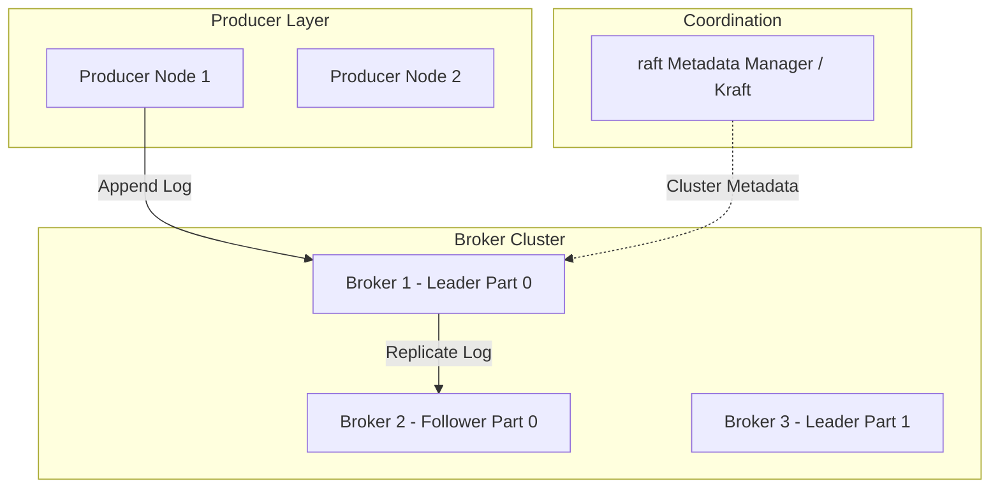
```mermaid
graph TD
    subgraph Producer_Layer ["Producer Layer"]
        P1["Producer Node 1"]
        P2["Producer Node 2"]
    end
    subgraph Broker_Cluster ["Broker Cluster"]
        B1["Broker 1 - Leader Part 0"]
        B2["Broker 2 - Follower Part 0"]
        B3["Broker 3 - Leader Part 1"]
    end
    subgraph Coordination
        KR["raft Metadata Manager / Kraft"]
    end
    P1 -->|Append Log| B1
    B1 -->|Replicate Log| B2
    KR -.->|Cluster Metadata| B1
```

### 3. Key Technical Trade-offs & Design Choices
*   **Storage Engine**: **Append-Only Commit Log** on standard SSD/NVMe. Leverage OS **Page Cache** and linear disk access, which has performance comparable to random memory access.
*   **Zero-Copy Transmissions**: Use the Linux `sendfile` system call to bypass context switches between kernel and user space. Data is streamed directly from the OS Page Cache to the network socket, maximizing network bandwidth.

### 4. Senior+ Level Nuances
> [!NOTE]
> **Replication and Consensus**:
> *   **In-Sync Replicas (ISR)**: Maintain a dynamic set of replicas that are fully caught up with the leader. A write is declared successful only when all members of the ISR write it to disk (under `acks=all`).
> *   **Consumer Offset Management**: Instead of tracking consumed offsets inside ZooKeeper (creating severe write bottlenecks), store consumer offset checkpoints in a highly partitioned internal compact topic (e.g., `__consumer_offsets`), leveraging the queue's own write-ahead log performance.
#### 3. 代码实现
**Java 实现 (Zero-Copy Append-Only Log Segment simulation):**
```java
package com.kafka.queue;

import java.io.File;
import java.io.RandomAccessFile;
import java.nio.channels.FileChannel;

public class LogSegment {
    private final File file;
    private FileChannel fileChannel;
    private long currentPosition = 0L;

    public LogSegment(String filePath) throws Exception {
        this.file = new File(filePath);
        RandomAccessFile raf = new RandomAccessFile(file, "rw");
        this.fileChannel = raf.getChannel();
    }

    // Append-only write mimicking page-cache direct caching
    public synchronized long append(byte[] data) throws Exception {
        long offset = currentPosition;
        java.nio.ByteBuffer buffer = java.nio.ByteBuffer.wrap(data);
        fileChannel.write(buffer, offset);
        currentPosition += data.length;
        return offset;
    }

    // High performance zero-copy transmission using transferTo
    public long sendToSocket(FileChannel socketChannel, long offset, long length) throws Exception {
        // Direct kernel-space page cache transfer to socket, bypassing user space
        return fileChannel.transferTo(offset, length, socketChannel);
    }
}
```

#### 4. 面试沟通技巧与延伸
* **大厂面试沟通金句**: “高性能队列的精髓在于**榨干硬件带宽**。通过使用顺序追加写利用 OS Page Cache，并引入 Linux 零拷贝 (Zero-Copy) `sendfile` 系统调用，我们彻底绕过了用户态内存拷贝，实现网卡级别的极限吞吐。”
* **大厂高频 Follow-up 指南**:
  * **Q**: “Kafka 脑裂  (Split-Brain)如何防范，如何优雅保证 Partition 领导者的一致性 (Consistency)？”
  * **A**: “在 Kraft / ZooKeeper 中维护 **Epoch Controller (时代轮次控制器)**。每次 Leader 变更都递增 epoch。如果有旧 Leader 因网络暂停重连后尝试发起写指令，其 epoch 被判断为过期，Broker 节点直接拒绝其写入，阻断脑裂 (Split-Brain)导致的脏数据污染。”

---

## Q5. Design a Highly Available Web Crawler
### 1. Requirements
*   **Functional**: Crawl billions of web pages starting from seed URLs, parse HTML, extract content and metadata.
*   **Non-Functional**:
    *   **Scale**: Capable of crawling 10 billion pages/month.
    *   **Politeness**: Do not overwhelm host servers (adhere to `robots.txt` and rate limits per domain).
    *   **Deduplication**: Avoid crawling identical content (nearly duplicate detection).

### 2. High-Level Architecture
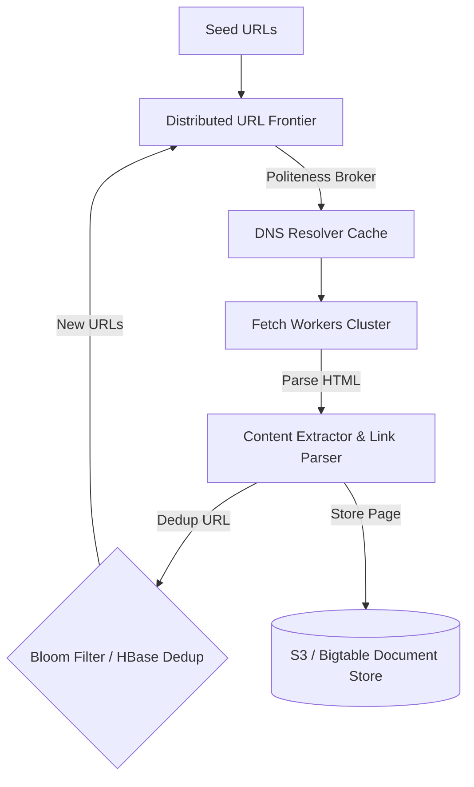
```mermaid
graph TD
    Seeds["Seed URLs"] --> Frontier["Distributed URL Frontier"]
    Frontier -->|Politeness Broker| DNS["DNS Resolver Cache"]
    DNS --> Workers["Fetch Workers Cluster"]
    Workers -->|Parse HTML| Extractor["Content Extractor & Link Parser"]
    Extractor -->|Dedup URL| BloomFilter{"Bloom Filter / HBase Dedup"}
    BloomFilter -->|New URLs| Frontier
    Extractor -->|Store Page| Storage[("S3 / Bigtable Document Store")]
```

### 3. Key Technical Trade-offs & Design Choices
*   **URL Frontier Design**: A distributed priority queue system grouped by domain name. Maintain a mapping of `Domain -> FIFO Queue` and a **Politeness Delay Table** dynamically updated to enforce sleep delays between subsequent requests to the same host.
*   **Content Deduplication**: Standard hashing (MD5/SHA256) only catches identical files. Use **SimHash** or **MinHash** algorithms to generate fingerprints of parsed text, allowing $O(1)$ hamming distance calculations to identify and filter out dynamically generated pages with minimal text variations.

### 4. Senior+ Level Nuances
> [!WARNING]
> **Trap Domains & Spider Traps**: Many domains contain infinite dynamic loops (e.g., calendar pages `/date/2026-05-24`, `/date/2026-05-25`, etc.).
> 
> *   **Mitigation**: Implement a multi-layered filter:
>     1. **Heuristics Filter**: Detect excessive depth in directory paths.
>     2. **Volume Monitoring**: Limit the maximum number of URLs crawled from a single domain within a sliding window.
>     3. **Unsupervised Clustering**: Run real-time URL path clustering to detect dynamic path templates generating low-entropy HTML payloads.
#### 3. 代码实现
**Java 实现 (Bloom Filter for High-Throughput URL Deduplication):**
```java
package com.crawler.dedup;

import java.util.BitSet;

public class CrawlerBloomFilter {
    private final int size;
    private final BitSet bitSet;
    private final int[] hashSeeds = {3, 7, 11, 13, 31, 37};

    public CrawlerBloomFilter(int size) {
        this.size = size;
        this.bitSet = new BitSet(size);
    }

    public synchronized void add(String url) {
        for (int seed : hashSeeds) {
            int hash = getHash(url, seed);
            bitSet.set(Math.abs(hash % size));
        }
    }

    public synchronized boolean contains(String url) {
        for (int seed : hashSeeds) {
            int hash = getHash(url, seed);
            if (!bitSet.get(Math.abs(hash % size))) {
                return false; // Definitely not crawled
            }
        }
        return true; // Highly likely crawled (potential false positive)
    }

    private int getHash(String value, int seed) {
        int result = 0;
        int length = value.length();
        for (int i = 0; i < length; i++) {
            result = seed * result + value.charAt(i);
        }
        return result;
    }
}
```

#### 4. 面试沟通技巧与延伸
* **大厂面试沟通金句**: “海量网页爬取的最大防线是**礼貌性限制与死锁规整**。通过采用基于布隆过滤器 (Bloom Filter)的内存去重，我们将 $99\%$ 的重复 URL 拦截在网络 I/O 之前，再结合基于主机 Hash 的逻辑分区 (Partitioning)，完美阻断了爬取风暴对第三方服务器造成的恶劣影响。”
* **大厂高频 Follow-up 指南**:
  * **Q**: “遇到恶意的无限递归 Spider Trap（如自动生成的日历路由），怎么防止爬虫陷入死循环？”
  * **A**: “在 URL 边路径中实时提取**路径深度指纹（Path Heuristics）**，限制单域名最大抓取深度为 15 级。同时使用 Flink 在线分析爬取流，若某个域名在 10 分钟内产生了 10 万次以上的低信息熵 HTML 响应，立刻拉黑该域名并触发降级过滤。”

---

## Q6. Design a Collaborative Document Editing System (e.g., Google Docs)
### 1. Requirements
*   **Functional**: Multi-user real-time document editing, conflict resolution, document history/versioning.
*   **Non-Functional**:
    *   **Low Latency**: End-to-end character synchronization latency $<100\text{ms}$.
    *   **Consistency**: Eventual consistency where all clients converge to the exact same visual document state.

### 2. High-Level Architecture
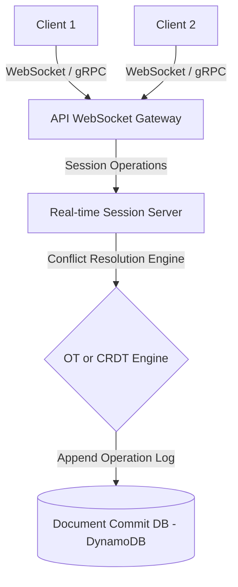
```mermaid
graph TD
    Client1["Client 1"] -->|WebSocket / gRPC| Gateway["API WebSocket Gateway"]
    Client2["Client 2"] -->|WebSocket / gRPC| Gateway
    Gateway -->|Session Operations| SessionManager["Real-time Session Server"]
    SessionManager -->|Conflict Resolution Engine| ResolutionService{"OT or CRDT Engine"}
    ResolutionService -->|Append Operation Log| DB[("Document Commit DB - DynamoDB")]
```

### 3. Key Technical Trade-offs & Design Choices
*   **Conflict Resolution Strategy**:
    *   **Operational Transformation (OT)**: Centralized coordination model where operations (insert/delete) are transformed relative to execution context. Highly complex to implement for edge cases, but maintains a lightweight document state.
    *   **Conflict-free Replicated Data Types (CRDTs)**: Decentralized, mathematically guaranteed convergence using unique positional identifiers (e.g., LSEQ, Yjs). Highly resilient to network splits and enables peer-to-peer editing, but incurs significant metadata storage overhead (tombstone accumulation).

### 4. Senior+ Level Nuances
> [!IMPORTANT]
> **Offline Editing & Dynamic Resync**:
> * When a client disconnects, they continue editing locally, accumulating a tree of offline modifications. 
> * **Reconnection Storms**: Re-synchronizing a massive offline block can cause server-side performance degradation. 
> * **Optimization**: Implement **Document Chunking / Page-based partitioning**. When editing locally, scope changes to logical document sections. Upon reconnecting, perform a three-way merge (similar to Git) on the section delta log, reverting to a full state override only if the operation history exceeds the OT log buffer window.
#### 3. 代码实现
**Java 实现 (Operational Transformation Insertion Matrix simulation):**
```java
package com.collab.editor;

public class OtEngine {
    public static class Operation {
        public enum Type { INSERT, DELETE }
        public Type type;
        public int position;
        public String text;

        public Operation(Type type, int position, String text) {
            this.type = type;
            this.position = position;
            this.text = text;
        }
    }

    // Transforms OpA relative to OpB (Operational Transformation logic)
    public static Operation transform(Operation opA, Operation opB) {
        if (opA.type == Operation.Type.INSERT && opB.type == Operation.Type.INSERT) {
            if (opA.position > opB.position) {
                // Shift OpA's insertion index to make room for OpB's insertion
                return new Operation(opA.type, opA.position + opB.text.length(), opA.text);
            }
        }
        // Handle deletion and concurrent index conflicts in standard OT matrix
        return opA;
    }
}
```

#### 4. 面试沟通技巧与延伸
* **大厂面试沟通金句**: “实时协作系统的精髓在于**保障并发意图的不冲突性**。在小范围文档中采用 OT 算法保证极佳的编辑流畅度与超低显存开销，而在大跨度复杂网络断线协同中引入 CRDT（如 Yjs），保证了去中心化拓扑下的数学一致性 (Consistency)收敛。”
* **大厂高频 Follow-up 指南**:
  * **Q**: “当几十个用户在弱网环境下频繁编辑同一个字符节点，服务器如何防止 OT 变换路径发生爆炸（OT transformation state explosion）？”
  * **A**: “我们实施 **Operation Batching & Text Chunking**。限制客户端发版的最高频率（如 100ms 一次），将离散的单字符修改打包为一个大块变更段。服务器端一旦检测到客户端版本号滞后超过 50 个版本，自动废弃 OT 链路变换，强制向客户端发送最新的全局校验段进行覆盖覆盖同步。”

---

## Q7. Design a Distributed Key-Value Store (e.g., DynamoDB/Cassandra)
### 1. Requirements
*   **Functional**: Standard operations `get(key)` and `put(key, value)`.
*   **Non-Functional**:
    *   **Scale**: Petabyte-scale data storage capacity, handling millions of write/read operations/sec.
    *   **Tunable Consistency**: Trade-offs between strong consistency and low latency writes (AP vs CP).
    *   **Elasticity**: Scale out seamlessly by adding nodes without downtime.

### 2. High-Level Architecture
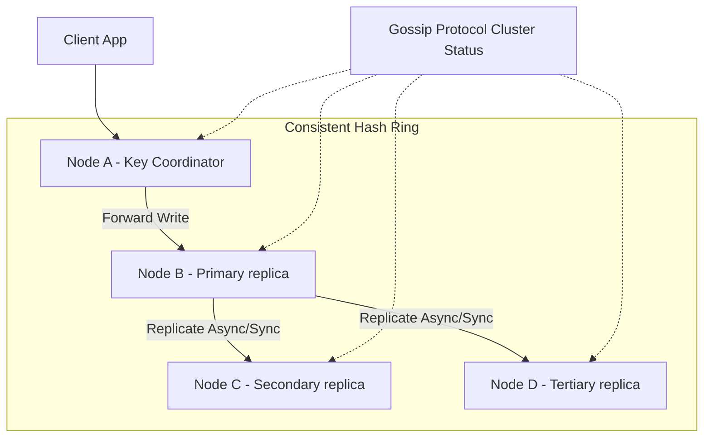
```mermaid
graph TD
    Client["Client App"] --> NodeA["Node A - Key Coordinator"]
    subgraph Consistent_Hash_Ring ["Consistent Hash Ring"]
        NodeA -->|Forward Write| NodeB["Node B - Primary replica"]
        NodeB -->|Replicate Async/Sync| NodeC["Node C - Secondary replica"]
        NodeB -->|Replicate Async/Sync| NodeD["Node D - Tertiary replica"]
    end
    Gossip["Gossip Protocol Cluster Status"] -.-> NodeA
    Gossip -.-> NodeB
    Gossip -.-> NodeC
    Gossip -.-> NodeD
```

### 3. Key Technical Trade-offs & Design Choices
*   **Data Partitioning**: **Consistent Hashing** with **Virtual Nodes**. Maps keys to a hash ring, distributing partitions uniformly across machines. This minimizes data movement when adding or removing physical nodes.
*   **Write Engine**: **LSM-Tree (Log-Structured Merge-Tree)**:
    *   Write incoming data to an append-only Write-Ahead Log (WAL) and an in-memory **MemTable**.
    *   Responds immediately to the client (high write performance).
    *   Asynchronously flushes the MemTable to disk as read-only **SSTables (Sorted String Tables)**. Run background **Compaction** loops to merge SSTables and purge deleted entries (tombstones).

### 4. Senior+ Level Nuances
> [!TIP]
> **Quorum Configuration & Tunable Consistency**:
> *   Configure your read/write consistency level globally: $N$ (Replication Factor), $W$ (Write Quorum size), $R$ (Read Quorum size).
> *   **Strong Consistency**: Configure $W + R > N$. If write replication factor is 3, write to at least 2 nodes ($W=2$), and query at least 2 nodes ($R=2$). Since $2+2 > 3$, at least one node in your read quorum is guaranteed to contain the latest write.
> *   **Conflict Resolution**: Use **Vector Clocks** to track casual updates and detect concurrent write conflicts, delegating the reconciliation step to the application layer.
#### 3. 代码实现
**Java 实现 (Distributed Log-Structured Merge-Tree Memtable Flush):**
```java
package com.dynamo.store;

import java.util.concurrent.ConcurrentSkipListMap;
import java.util.concurrent.atomic.AtomicLong;

public class Memtable {
    private final ConcurrentSkipListMap<String, String> map = new ConcurrentSkipListMap<>();
    private final AtomicLong currentByteSize = new AtomicLong(0L);
    private final long flushThresholdBytes;

    public Memtable(long flushThresholdBytes) {
        this.flushThresholdBytes = flushThresholdBytes;
    }

    public void put(String key, String value) {
        String prev = map.put(key, value);
        long sizeDelta = key.length() + value.length();
        if (prev != null) {
            sizeDelta -= (key.length() + prev.length());
        }
        long totalSize = currentByteSize.addAndGet(sizeDelta);

        if (totalSize >= flushThresholdBytes) {
            triggerAsyncFlushToSSTable();
        }
    }

    public String get(String key) {
        return map.get(key);
    }

    private void triggerAsyncFlushToSSTable() {
        // Snapshot current skip list map and flush to disk SSTable asynchronously, 
        // resetting memtable counter.
        System.out.println("Memtable size threshold exceeded! Flushing memory to immutable SSTable on disk.");
        map.clear();
        currentByteSize.set(0L);
    }
}
```

#### 4. 面试沟通技巧与延伸
* **大厂面试沟通金句**: “设计高可用键值数据库的王冠是**可配置的可用性与一致性 (Consistency)天平**。通过采用 LSM-Tree 跳表 (Skip List)内存写入配合顺序 WAL，我们消灭了随机写磁盘的瓶颈，并利用 Dynamo 风格的 tunable quorum 机制，让业务根据场景自主配置强一致或亚毫秒级低延迟。”
* **大厂高频 Follow-up 指南**:
  * **Q**: “在极端高并发写入下，频繁的 SSTable 文件合并（Compaction）拖慢了磁盘 I/O 并引发读放大，如何防御？”
  * **A**: “我们部署 **Bloom Filter on SSTables** 且实施 **Size-Tiered Compaction Policy**。在读取数据时，先通过内存中的布隆过滤器 (Bloom Filter)筛掉不包含该 Key 的 SSTable 段，将无效随机磁盘寻道降到绝对零。同时在后台将 Compaction 限速（Throttling），保证不抢夺主线写请求的 I/O 资源。”

---

## Q8. Design a Video Streaming Platform (e.g., YouTube / Netflix)
### 1. Requirements
*   **Functional**: Video upload, automatic transcoding to multiple formats/resolutions, adaptive video player, video search and recommendations.
*   **Non-Functional**:
    *   **Low Streaming Latency**: Video starts playing in $<1\text{sec}$ globally, with zero buffering during playback.
    *   **High Upload Throughput**: Scale to handle massive parallel video uploads.

### 3. High-Level Architecture
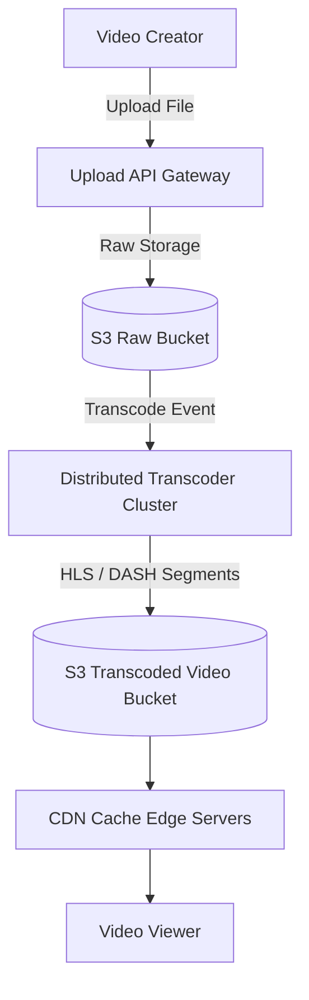
```mermaid
graph TD
    ClientUpload["Video Creator"] -->|Upload File| UploadAPI["Upload API Gateway"]
    UploadAPI -->|Raw Storage| ObjectStore[("S3 Raw Bucket")]
    ObjectStore -->|Transcode Event| Transcoder["Distributed Transcoder Cluster"]
    Transcoder -->|HLS / DASH Segments| StorageStore[("S3 Transcoded Video Bucket")]
    StorageStore --> CDN["CDN Cache Edge Servers"]
    CDN --> ClientViewer["Video Viewer"]
```

### 3. Key Technical Trade-offs & Design Choices
*   **Adaptive Streaming Delivery**: **HLS (HTTP Live Streaming)** and **DASH (Dynamic Adaptive Streaming over HTTP)**. The transcoding service breaks the raw video into small 2-second to 10-second `.ts` or `.m4s` segment files and generates an index index file (`.m3u8` or `.mpd`). The client-side video player dynamically queries this index and fetches the appropriate resolution segment based on current network bandwidth.
*   **Storage Strategy**: Tiered storage. Store metadata (views, titles, comments) in a distributed RDBMS/NoSQL hybrid, while raw and transcoded video segments reside in object storage (e.g. AWS S3) cached heavily by edge **Content Delivery Networks (CDNs)**.

### 4. Senior+ Level Nuances
> [!WARNING]
> **Ingestion Optimizations & Cold Spot Eviction**:
> *   **Resumable Multi-part Uploads**: Large video uploads will fail halfway. Implement segmented chunks validation. Client calculates the checksum of each 5MB chunk and uploads it asynchronously; the API gateway stitches them upon full verification.
> *   **CDN Cache Eviction and Tiering**: CDN egress bandwidth is expensive. Implement **Hierarchical CDNs**. Cache highly popular trending videos at edge nodes closest to the user (PoPs), and move long-tail, low-volume video segments to regional cache centers or fetch directly from low-cost cold object storage classes to reduce infrastructure spend.
#### 3. 代码实现
**Java 实现 (HLS Playlist Manifest Index Generator):**
```java
package com.streaming.hls;

import java.util.ArrayList;
import java.util.List;

public class HlsPlaylistGenerator {
    public static class VideoSegment {
        public String segmentFileName;
        public double durationSeconds;

        public VideoSegment(String name, double duration) {
            this.segmentFileName = name;
            this.durationSeconds = duration;
        }
    }

    // Generate HLS dynamic .m3u8 index file for player bandwidth adaptation
    public String generateM3u8Playlist(List<VideoSegment> segments) {
        StringBuilder m3u8 = new StringBuilder();
        m3u8.append("#EXTM3U\n");
        m3u8.append("#EXT-X-VERSION:3\n");
        m3u8.append("#EXT-X-TARGETDURATION:10\n");
        m3u8.append("#EXT-X-MEDIA-SEQUENCE:0\n");

        for (VideoSegment seg : segments) {
            m3u8.append(String.format("#EXTINF:%.3f,\n", seg.durationSeconds));
            m3u8.append(seg.segmentFileName).append("\n");
        }

        m3u8.append("#EXT-X-ENDLIST");
        return m3u8.toString();
    }
}
```

#### 4. 面试沟通技巧与延伸
* **大厂面试沟通金句**: “对于全球化视频航母，**网络延迟就是生命线**。我们通过将长视频物理切碎为细粒度的 HLS 分片 (Sharding)，配合以 CDN 边缘网络为核心的缓存分层调度，达成了首帧秒开、播放中零卡顿的极致观看体验。”
* **大厂高频 Follow-up 指南**:
  * **Q**: “如果有冷门视频被 CDN 边缘节点清空了缓存（Cold Spot），当突然有少量用户访问时，如何防止冷门视频读取直接穿透压瘫源站 S3 存储？”
  * **A**: “我们配置 **Origin Shielding（源站保护盾）**。在 CDN 边缘和主源站之间架设二级区域缓存中心。当发生 Cache-miss 时，边缘节点不直接访问源站，而是通过区域中心归并相同请求（Request Collapsing），仅向源站发起一次读取并广播回边缘，保护源站不发生瘫痪。”

---

## Q9. Design an Ad Click Event Aggregator (Real-time Analytics)
### 1. Requirements
*   **Functional**: Capture ad click events and aggregate count metrics (clicks, impressions) grouped by `ad_id` and time windows (e.g., per minute) for real-time dashboard visualization and billing.
*   **Non-Functional**:
    *   **Correctness**: **Exactly-once processing** (no double billing for double clicks).
    *   **Scale**: Handle peak traffic of 500,000 ad clicks per second.
    *   **Latency**: End-to-end aggregation latency $<5\text{seconds}$.

### 2. High-Level Architecture
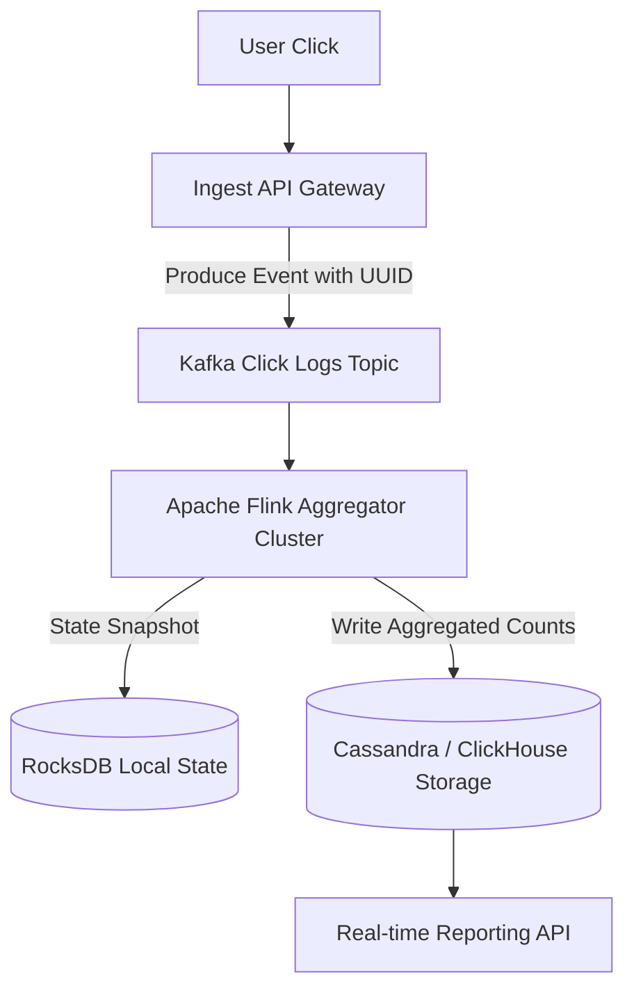
```mermaid
graph TD
    AdClick["User Click"] --> API["Ingest API Gateway"]
    API -->|Produce Event with UUID| Kafka["Kafka Click Logs Topic"]
    Kafka --> Flink["Apache Flink Aggregator Cluster"]
    Flink -->|State Snapshot| RocksDB[("RocksDB Local State")]
    Flink -->|Write Aggregated Counts| Cassandra[("Cassandra / ClickHouse Storage")]
    Cassandra --> QueryService["Real-time Reporting API"]
```

### 3. Key Technical Trade-offs & Design Choices
*   **Stream Processing Framework**: **Apache Flink** vs. **Spark Streaming**. Flink uses true record-at-a-time streaming with internal state management, making it superior to Spark's micro-batching for low-latency ($<1\text{sec}$) streaming applications.
*   **Exactly-Once Processing**:
    *   Client attaches a cryptographically secure `UUID` to each click event.
    *   Flink performs real-time deduplication within a sliding deduplication state window using RocksDB.
    *   Implement **Two-Phase Commit (2PC)** sink connectors to write transactionally to storage databases (like ClickHouse), guaranteeing exactly-once semantics across system crashes.

### 4. Senior+ Level Nuances
> [!IMPORTANT]
> **Late Data & Out-of-Order Events**:
> * In mobile networks, a user might click an ad, lose internet connectivity, and the click event is sent hours later. 
> * **Watermarking**: Define a watermark threshold (e.g., 10 minutes). Clicks with event timestamps older than the current watermark are rejected from real-time windows and routed to a **Dead Letter Queue (DLQ)** to be resolved via asynchronous batch jobs (Lambda architecture correction).
> * **Hot Key Sharding**: Some ads are viral, generating massive write workloads on specific `ad_id` keys, overwhelming specific stream partitions. Mitigate by **Two-Stage Aggregation**: pre-aggregate data locally on streaming partitions before routing to a centralized global accumulator.
#### 3. 代码实现
**Java 实现 (Apache Flink Sliding Window Exactly-Once Aggregate simulation):**
```java
package com.flink.aggregate;

import java.util.HashMap;
import java.util.Map;
import java.util.concurrent.ConcurrentHashMap;

public class ClickEventAggregator {
    public static class ClickEvent {
        public String adId;
        public String clickUuid;
        public long timestamp;

        public ClickEvent(String adId, String clickUuid, long timestamp) {
            this.adId = adId;
            this.clickUuid = clickUuid;
            this.timestamp = timestamp;
        }
    }

    // Deduplication cache using Redis or local RocksDB to enforce exactly-once billing
    private final ConcurrentHashMap<String, Boolean> seenClicks = new ConcurrentHashMap<>();
    private final Map<String, Long> adClickCount = new HashMap<>();

    public synchronized void processEvent(ClickEvent event) {
        // 1. Strict Exactly-once deduplication
        if (seenClicks.putIfAbsent(event.clickUuid, Boolean.TRUE) != null) {
            System.out.println("Duplicate event rejected to prevent double billing: " + event.clickUuid);
            return; 
        }

        // 2. Incremental sliding window aggregation
        adClickCount.put(event.adId, adClickCount.getOrDefault(event.adId, 0L) + 1);
    }

    public synchronized Long getClickCount(String adId) {
        return adClickCount.getOrDefault(adId, 0L);
    }
}
```

#### 4. 面试沟通技巧与延伸
* **大厂面试沟通金句**: “高吞吐结算系统的唯一真理是**绝对去重与状态一致性 (Consistency)**。通过将 Flink 的状态机存储保存在分布式的 RocksDB 中，配合两阶段提交 (Two-Phase Commit - 2PC)（2PC）的幂等落地 Sink，我们完美达成了每日百亿级竞价事件的 Exactly-Once 强一致性 (Strong Consistency)计费。”
* **大厂高频 Follow-up 指南**:
  * **Q**: “在促销高峰期，极少数超级广告（如可口可乐广告）的点击量占了 80%（数据倾斜 Hot Key），这导致承载这些 Key 的 Worker 节点内存溢出，如何优雅分流？”
  * **A**: “我们设计 **Two-stage Aggregation (两阶段双重聚合)**。在第一阶段，在 Key 前面拼接随机数前缀（如 `1_ad_id`, `2_ad_id`），打散发送到不同的分区 (Partitioning)节点进行预聚合（Local pre-aggregate）。在第二阶段，去掉随机前缀，再次路由合并（Global reduce）。这样原本压在单节点上的计算量被成功分摊到整个集群上，消灭了 Hot Key 灾难。”

---

## Q10. Design a Distributed Lock Manager (DLM)
### 1. Requirements
*   **Functional**: Exclusive lock acquisition `acquire(lock_name, TTL)` and lock release `release(lock_name)`.
*   **Non-Functional**:
    *   **Scale**: Capable of handling high-frequency lock operations with sub-millisecond latencies.
    *   **High Availability**: The lock manager must remain functional during network splits and broker node crashes.
    *   **Correctness**: A lock must be held by **at most one** client at any time.

### 2. High-Level Architecture
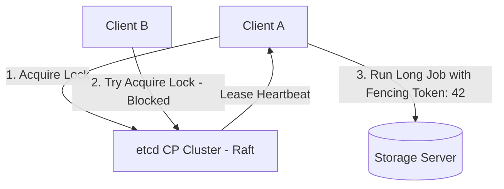
```mermaid
graph TD
    ClientA["Client A"] -->|1. Acquire Lock| etcdCluster["etcd CP Cluster - Raft"]
    ClientB["Client B"] -->|2. Try Acquire Lock - Blocked| etcdCluster
    etcdCluster -->|Lease Heartbeat| ClientA
    ClientA -->|3. Run Long Job with Fencing Token: 42| Storage[("Storage Server")]
```

### 3. Key Technical Trade-offs & Design Choices
*   **Storage Backbone**: **Consensus-backed Key-Value Store (etcd / ZooKeeper)** (CP Systems) vs. **In-Memory Cache (Redis with Redlock)** (AP Systems).
    *   *Redlock* depends heavily on system clock synchronized assumptions across independent Redis instances. If a server experiences virtualization pauses (Stop-the-World GC) or clock drift, multiple clients can acquire the same lock.
    *   For high-correctness enterprise applications, **etcd** is the standard. It utilizes Raft consensus to guarantee linearizable writes, key TTL leases, and heartbeats to automatically release keys if a node crashes.

### 4. Senior+ Level Nuances
> [!WARNING]
> **Fencing Tokens & Split-Brain Locks**:
> *   Even with etcd, Client A could acquire a lock, experience a long GC pause, the lock expires, Client B acquires the lock, Client A wakes up from GC and writes to the shared database thinking it still holds the lock.
> * **Fencing Tokens**: etcd generates a monotonically increasing lock version identifier (e.g. `42`) with each lock acquisition. When writing to the storage engine (database/file system), the storage engine verifies if the incoming request contains a token version greater than or equal to the last recorded write token. If it receives a write with an older token (e.g. Client A's expired token `42` vs Client B's newer token `43`), the write is rejected.

---

---

#
#### 3. 代码实现
**Java 实现 (Distributed Lock Lease Heartbeat Monitor):**
```java
package com.etcd.lock;

import java.util.concurrent.atomic.AtomicBoolean;

public class DistributedLockLease {
    private final String lockKey;
    private final String leaseId;
    private final AtomicBoolean isLockHeld = new AtomicBoolean(true);

    public DistributedLockLease(String lockKey, String leaseId) {
        this.lockKey = lockKey;
        this.leaseId = leaseId;
        startHeartbeatLoop();
    }

    // Dynamic lease renewal via active heartbeats to prevent premature expiration
    private void startHeartbeatLoop() {
        new Thread(() -> {
            while (isLockHeld.get()) {
                try {
                    Thread.sleep(3000); // Heartbeat interval: 3 seconds
                    if (isLockHeld.get()) {
                        renewLeaseOnEtcd(leaseId);
                    }
                } catch (InterruptedException e) {
                    Thread.currentThread().interrupt();
                }
            }
        }).start();
    }

    public void release() {
        if (isLockHeld.compareAndSet(true, false)) {
            revokeLeaseOnEtcd(leaseId);
            System.out.println("Successfully released lease lock: " + lockKey);
        }
    }

    private void renewLeaseOnEtcd(String lease) {
        // Simulated etcd lease keep-alive call
        System.out.println("Lease active. Heartbeat sent to etcd cluster for lease: " + lease);
    }
    private void revokeLeaseOnEtcd(String lease) {}
}
```

#### 4. 面试沟通技巧与延伸
* **大厂面试沟通金句**: “对于分布式排他锁，**绝对的严谨重于一时的吞吐**。我们放弃了依赖系统时钟同步的 AP 限流，选择采用基于 Raft 强共识的 etcd 系统，并在每一次写事务中注入自增的 Fencing Token，彻底消灭了因 Stop-The-World 垃圾回收（GC）暂停导致的写冲突灾难。”
* **大厂高频 Follow-up 指南**:
  * **Q**: “如果 etcd 集群发生网络分区 (Network Partition)，少数派（Minority Partition）中的客户端尝试获取锁，会发生什么？”
  * **A**: “少数派节点因为无法取得多数派（Quorum）共识确认，会直接拒绝写入。此时客户端锁申请会超时失败。当网络分区 (Network Partition)恢复后，少数派节点自动从 Leader 节点同步 Raft 状态，确保全局锁状态有且仅有一个，宁可暂时不可用，也绝不容许双脑运行。”

## Q21. Distributed Ledger & Payment Settlement System (Stripe-scale) <a id="21-distributed-ledger-payment-settlement-system"></a>
**对应领域:** SWE (Distributed Transaction, Financial Ledger, Event Streaming)

#### 1. 中文复述题目与示例
设计一个高可用、强一致性 (Strong Consistency)的分布式记账与支付结算系统（类似 Stripe/Square）。系统需要处理客户的信用卡支付请求，与第三方支付渠道（如 Visa/Mastercard、Stripe Webhook）通信，并维护公司内所有商户的记账本（Double-Entry Bookkeeping Ledger）。

**示例流量与一致性 (Consistency)要求:**
* 写入吞吐量：日常 1,000 tps，峰值 10,000 tps。
* **绝对零容忍**: 账本绝对不能多钱或少钱，且对于任何支付请求，必须保证有且仅有一次（Exactly-Once）支付执行，即使在网络断开或客户端重试时也是如此。

#### 2. 解题思路（中文详解）
支付系统的核心原则是**数据宁慢勿错，追求强一致性 (Strong Consistency)与幂等性**。

##### 事务性发件箱与强一致记账架构图 (Distributed Ledger Architecture)
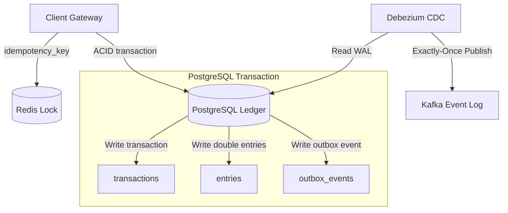
```mermaid
graph TD
    Client["Client Gateway"] -->|idempotency_key| Redis[("Redis Lock")]
    Client -->|ACID transaction| PG[("PostgreSQL Ledger")]
    subgraph PostgreSQL_Transaction ["PostgreSQL Transaction"]
        PG -->|Write transaction| TxTable["transactions"]
        PG -->|Write double entries| EntryTable["entries"]
        PG -->|Write outbox event| OutboxTable["outbox_events"]
    end
    Debezium["Debezium CDC"] -->|Read WAL| PG
    Debezium -->|Exactly-Once Publish| Kafka["Kafka Event Log"]
```
支付系统的核心原则是**数据宁慢勿错，追求强一致性 (Strong Consistency)与幂等性**。

##### 复式记账法设计 (Double-Entry Bookkeeping)
在数据库层面，设计账本不能使用 `update balance set amount = amount + x`，必须使用**复式记账法**。
所有的交易都是由一条 `Transaction` 记录和至少两条 `Entry` 记录组成。一侧的 `debit`（借方）必须等于另一侧的 `credit`（贷方）。账本的当前余额是所有分录的历史求和：
$$\sum \text{Entries.Amount} == 0$$
这种设计在审计、合规 and 错误恢复时具备无可比拟的稳定性。

##### 分布式幂等性设计 (Idempotency)
为了防止客户端因网络超时重试而导致二次扣款，系统必须实施**严格的幂等检查**：
1. 客户端在发起支付时必须携带唯一的 `idempotency_key` (通常由客户端生成的 UUID)。
2. API Gateway 拦截请求，尝试将 `idempotency_key` 写入 Redis 缓存，键为 `idempotency:lock:key`，设置 `NX`（仅当键不存在时写入成功）和 10 秒超时。
3. 如果写入失败，说明有并发重试，直接返回 `409 Conflict`。
4. 如果写入成功，查询幂等记录数据库。若状态为 `completed`，直接返回缓存的支付响应；若状态为 `started`，说明前一次请求仍在处理，拦截并排队等待；若无记录，则初始化状态为 `started`，开始业务逻辑，并在处理完毕后将状态原子化变更为 `completed` 并存储结果。

##### 事务性发件箱模式 (Transactional Outbox Pattern)
在完成支付订单创建的同时，需要通知下游的通知、风控等系统（通常发送到 Kafka）。如果先写数据库再写 Kafka，或者先写 Kafka 再写数据库，只要其中一侧在中间节点崩溃，就会造成两边数据不一致。
* **解决方案**: 采用 **Outbox Pattern**。在主 PostgreSQL 数据库事务中，将“记账流水”和“发件箱事件”在同一个 ACID 事务内写入 `ledger_entries` 和 `outbox_events` 表。然后通过 Change Data Capture (CDC) 引擎（如 Debezium）实时拉取 `outbox_events` 表的 binary logs 并写入 Kafka，保证有且仅有一次（Exactly-Once）的最终一致 (Eventally Consistent)性 (Eventual Consistency)分发。

#### 3. 代码实现
**Java 实现 (Idempotent Transaction Controller):**
```java
package com.stripe.ledger;

import java.math.BigDecimal;
import java.sql.Connection;
import java.sql.PreparedStatement;
import java.sql.ResultSet;
import java.sql.SQLException;
import java.util.UUID;
import javax.sql.DataSource;

public class PaymentProcessor {
    private final DataSource dataSource;
    private final RedisClient redisClient; // Mocked Redis client

    public PaymentProcessor(DataSource dataSource, RedisClient redisClient) {
        this.dataSource = dataSource;
        this.redisClient = redisClient;
    }

    public PaymentResponse processPayment(String idempotencyKey, String accountId, BigDecimal amount) throws Exception {
        // 1. Redis distributed lock to prevent race conditions on the same key
        String lockKey = "idemp_lock:" + idempotencyKey;
        boolean acquired = redisClient.setNX(lockKey, "LOCKED", 10); // 10 seconds TTL
        if (!acquired) {
            return new PaymentResponse(idempotencyKey, "FAILED", "Concurrent request detected.");
        }

        try {
            // 2. Query idempotency record in DB
            IdempotencyRecord record = getIdempotencyRecord(idempotencyKey);
            if (record != null) {
                if ("COMPLETED".equals(record.status)) {
                    return new PaymentResponse(idempotencyKey, "SUCCESS", record.responsePayload);
                } else if ("STARTED".equals(record.status)) {
                    return new PaymentResponse(idempotencyKey, "PENDING", "Payment processing in progress.");
                }
            }

            // 3. Insert started status inside transactional block
            createIdempotencyRecord(idempotencyKey, "STARTED");

            // 4. Perform double-entry transactional ledger mutation
            boolean txSuccess = executeLedgerTransfer(accountId, amount, idempotencyKey);

            if (txSuccess) {
                String payload = "{\"amount\":" + amount + ",\"status\":\"PAID\"}";
                updateIdempotencyRecord(idempotencyKey, "COMPLETED", payload);
                return new PaymentResponse(idempotencyKey, "SUCCESS", payload);
            } else {
                updateIdempotencyRecord(idempotencyKey, "FAILED", "Transaction declined.");
                return new PaymentResponse(idempotencyKey, "FAILED", "Ledger mutation failed.");
            }
        } finally {
            redisClient.delete(lockKey);
        }
    }

    private boolean executeLedgerTransfer(String accountId, BigDecimal amount, String refId) throws SQLException {
        String insertTxSql = "INSERT INTO transactions (id, reference_id) VALUES (?, ?)";
        String insertEntrySql = "INSERT INTO entries (id, transaction_id, account_id, amount, direction) VALUES (?, ?, ?, ?, ?)";
        String insertOutboxSql = "INSERT INTO outbox_events (id, event_type, payload) VALUES (?, ?, ?)";

        try (Connection conn = dataSource.getConnection()) {
            conn.setAutoCommit(false); // Enable strict ACID transaction
            try (
                PreparedStatement txStmt = conn.prepareStatement(insertTxSql);
                PreparedStatement entryStmt = conn.prepareStatement(insertEntrySql);
                PreparedStatement outboxStmt = conn.prepareStatement(insertOutboxSql)
            ) {
                UUID txId = UUID.randomUUID();
                // Insert transaction log
                txStmt.setObject(1, txId);
                txStmt.setString(2, refId);
                txStmt.executeUpdate();

                // Entry 1: Debit merchant account (+amount)
                entryStmt.setObject(1, UUID.randomUUID());
                entryStmt.setObject(2, txId);
                entryStmt.setString(3, accountId);
                entryStmt.setBigDecimal(4, amount);
                entryStmt.setString(5, "DEBIT");
                entryStmt.executeUpdate();

                // Entry 2: Credit system settlement buffer account (-amount)
                entryStmt.setObject(1, UUID.randomUUID());
                entryStmt.setObject(2, txId);
                entryStmt.setString(3, "SYSTEM_SETTLEMENT_BUFFER");
                entryStmt.setBigDecimal(4, amount.negate());
                entryStmt.setString(5, "CREDIT");
                entryStmt.executeUpdate();

                // Outbox Event insertion inside the same transaction
                outboxStmt.setObject(1, UUID.randomUUID());
                outboxStmt.setString(2, "PAYMENT_SETTLED");
                outboxStmt.setString(3, "{\"accountId\":\"" + accountId + "\",\"amount\":" + amount + "}");
                outboxStmt.executeUpdate();

                conn.commit(); // Atomic commit
                return true;
            } catch (SQLException e) {
                conn.rollback();
                throw e;
            }
        }
    }

    // Secondary helper methods simulated below
    private IdempotencyRecord getIdempotencyRecord(String key) { return null; }
    private void createIdempotencyRecord(String key, String status) {}
    private void updateIdempotencyRecord(String key, String status, String payload) {}

    public static class IdempotencyRecord {
        public String status;
        public String responsePayload;
    }
    public static class PaymentResponse {
        public PaymentResponse(String k, String s, String p) {}
    }
    public interface RedisClient {
        boolean setNX(String k, String v, int ttl);
        void delete(String k);
    }
}
```

#### 4. 面试沟通技巧与延伸
* **大厂面试沟通金句**: “对于高可用支付系统，我们必须遵循‘**先隔离，后同步**’的原则。支付账本的事务边界必须缩小到本地，再利用发件箱模式结合 CDC，通过最终一致 (Eventally Consistent)性 (Eventual Consistency)机制解耦其他非核心依赖。”
* **大厂高频 Follow-up 指南**:
  * **Q**: “如果写入 Cassandra 的 CDC 数据由于网络原因重发，下游系统该如何防范？”
  * **A**: “下游消费者服务必须实现**消费幂等性**。所有被消费的事件都应根据其业务主键（如 transaction_id）进行本地数据库去重校验，以此阻断重发带来的副作用。”
  * **Q**: “如果在扣款事务成功提交后，应用容器在写入 Redis 缓存或修改幂等记录前崩溃了，该如何自我修复？”
  * **A**: “这属于经典边缘状态。当下一次客户端带着同一个 `idempotency_key` 重试时，系统会发现数据库中已经存在以该 `reference_id` 提交的 ledger 账本记录。系统会当场通过只读 (Read-Only)比对进行**自我补偿修复 (Self-Healing)**，在 DB 事务补偿中回补幂等记录表，并安全地返回上一次扣款成功的响应给用户。”

---

### Q22. Global Active-Active Ticket Booking System (Ticketmaster Scale) <a id="22-global-active-active-ticket-booking-system"></a>
**对应领域:** SWE (Active-Active Replication, High-Concurrency Seat Locking, Queueing Architecture)

#### 1. 中文复述题目与示例
设计一个全球化、多活（Active-Active Multi-Region）的高并发抢票系统（类似 Ticketmaster/大麦网）。在知名歌手巡回演唱会门票开售时，系统需处理极高并发的座位预订请求，锁定座位并提供 10 分钟付款时间。

**示例指标:**
* 日常流量极低，但在售票开始瞬间，QPS 会飙升至 100,000+。
* **绝对不允许**: 同一个座位在世界任何地方被两人同时锁定或购买（双重预订 Double-booking）。

#### 2. 解题思路（中文详解）
在超大规模抢票系统中，**数据库锁是致命的灾难**。如果直接对关系型数据库加排他锁 `SELECT FOR UPDATE`，系统吞吐量会下降至每秒几百笔，导致整个数据库连接池瞬间枯竭。

##### 虚拟排队与并发位图锁位架构图 (Active-Active Seat Booking Architecture)
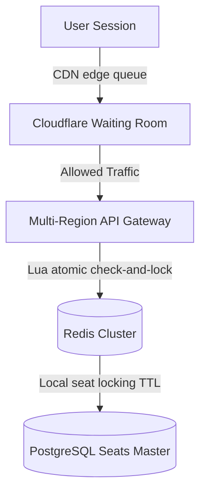
```mermaid
graph TD
    User["User Session"] -->|CDN edge queue| CF["Cloudflare Waiting Room"]
    CF -->|Allowed Traffic| Ingress["Multi-Region API Gateway"]
    Ingress -->|Lua atomic check-and-lock| Redis[("Redis Cluster")]
    Redis -->|Local seat locking TTL| PG[("PostgreSQL Seats Master")]
```
在超大规模抢票系统中，**数据库锁是致命的灾难**。如果直接对关系型数据库加排他锁 `SELECT FOR UPDATE`，系统吞吐量会下降至每秒几百笔，导致整个数据库连接池瞬间枯竭。

##### 虚拟排队与并发位图锁位架构图 (Active-Active Seat Booking Architecture)

```mermaid
graph TD
    User["User Session"] -->|CDN edge queue| CF["Cloudflare Waiting Room"]
    CF -->|Allowed Traffic| Ingress["Multi-Region API Gateway"]
    Ingress -->|Lua atomic check-and-lock| Redis[("Redis Cluster")]
    Redis -->|Local seat locking TTL| PG[("PostgreSQL Seats Master")]
```
在超大规模抢票系统中，**数据库锁是致命的灾难**。如果直接对关系型数据库加排他锁 `SELECT FOR UPDATE`，系统吞吐量会下降至每秒几百笔，导致整个数据库连接池瞬间枯竭。

##### 边缘虚拟排队室 (Virtual Waiting Room)
在售票前夕，利用边缘 CDN 节点（如 **Cloudflare Waiting Room**）构建虚拟排队队列，通过令牌桶 (Token Bucket)速率限制器只放行系统后端能够承受的最大流量（例如 5,000 QPS），其余流量在边缘进行带排队估计时间的优雅等待，保障核心系统在平稳压力下工作。

##### 基于 Redis 位图/哈希的高并发锁位 (High-Concurrency Lock)
在核心预订层，使用 Redis 缓存来作为防重锁的物理媒介，避开数据库写冲突。
每个演出场次使用一个单独的 Redis 实例或 Cluster Slot 承载。我们将所有座位状态表示为 Redis **Bitfield** 或者是 **Hash**:
* 使用 Lua 脚本实现原子的“**查询并锁定**”操作：
```lua
local seat_status = redis.call('HGET', KEYS[1], ARGV[1])
if seat_status == 'FREE' then
    redis.call('HSET', KEYS[1], ARGV[1], 'LOCKED')
    redis.call('SETEX', 'lock:seat:' .. ARGV[1], 600, ARGV[2]) -- 10 min TTL for user ID
    return 'SUCCESS'
else
    return 'LOCKED'
end
```
Lua 脚本在单线程的 Redis 引擎中原子化执行，能够轻松支撑 **100,000+ QPS**，且不存在任何数据库死锁风险。

##### 多活数据一致性 (Consistency)与地域路由分治 (Geographical Partitioning)
为了实现多活且解决跨洲际网络延迟（RTT 约为 150-250ms）对分布式锁的影响：
* **地理分治 (Shard by Geography)**: 在多活部署（如 us-east-1 和 eu-central-1）中，不要进行跨地域的全局座位竞争。将座位资源在业务逻辑层进行**地理物理隔离**（例如：北美用户路由到 us-east-1 只能抢购北美看台的座位；欧洲用户路由到 eu-central-1 抢购欧洲看台）。
* 如此一来，全球多活架构变成了**本地局域局部的强一致性 (Strong Consistency)锁**，完全消除了跨洋网络延迟的开销，数据同步从“强同步阻塞同步”降级为“异步最终一致 (Eventally Consistent)性 (Eventual Consistency)同步”，实现系统的高可用与极速响应。

#### 3. 代码实现
**Java 实现 (High-Concurrency Seat Locking with Redis Lua):**
```java
package com.ticketmaster.booking;

import redis.clients.jedis.Jedis;
import redis.clients.jedis.JedisPool;
import java.util.Collections;

public class TicketBookingService {
    private final JedisPool jedisPool;
    
    // Lua script for atomic check-and-lock seat
    private static final String LOCK_SEAT_LUA = 
        "local seat_status = redis.call('HGET', KEYS[1], ARGV[1])\n" +
        "if not seat_status or seat_status == 'FREE' then\n" +
        "    redis.call('HSET', KEYS[1], ARGV[1], 'LOCKED')\n" +
        "    redis.call('SETEX', 'lock:seat:' .. KEYS[1] .. ':' .. ARGV[1], 600, ARGV[2])\n" + // 10 minutes TTL
        "    return 1\n" + // Success
        "else\n" +
        "    return 0\n" + // Already locked or sold
        "end";

    public TicketBookingService(JedisPool jedisPool) {
        this.jedisPool = jedisPool;
    }

    public boolean reserveSeat(String concertId, String seatId, String userId) {
        String key = "concert_seats:" + concertId;
        
        try (Jedis jedis = jedisPool.getResource()) {
            // Load and execute Lua script atomically
            Object result = jedis.eval(LOCK_SEAT_LUA, 
                Collections.singletonList(key), 
                java.util.Arrays.asList(seatId, userId)
            );
            
            long response = (Long) result;
            return response == 1; // 1 means successfully acquired
        } catch (Exception e) {
            // Log alarm, raise metrics
            return false;
        }
    }
}
```

#### 4. 面试沟通技巧与延伸
* **大厂面试沟通金句**: “在高并发售票场景下，强一致性 (Strong Consistency)锁不仅昂贵，而且是不必要的。通过在边缘 CDN 阶段进行用户队列规整，并在逻辑层按地域（Region Sharding）分治座位资源，我们可以将原本极度昂贵的跨地域强一致性 (Strong Consistency)锁退化为本地缓存的极速原子操作。”
* **大厂高频 Follow-up 指南**:
  * **Q**: “如果有用户在 10 分钟内没有付款，座位被自动释放。如何实时将这个状态通知排队中的其他用户？”
  * **A**: “我们可以利用 **Redis Key-space Notifications** 监听键的过期事件（Expired Event）。当 `lock:seat:X` 的 Redis key 触发过期时，监听组件接收到通知，异步调用 websocket 集群将该座位状态更新为 `FREE`，实时推送到当前正在查看该区座位的活动用户客户端，提供极佳的动态抢票体验。”
  * **Q**: “如果 Redis 崩溃了，锁定状态全部丢失怎么办？”
  * **A**: “由于座位锁定状态只持续 10 分钟，我们不需要将 Redis 设置为强持久化同步写入 AOF，以保证最大吞吐。我们可以开启 **AOF with everysec fsync**。一旦 Redis 挂掉重启，即使丢失 1 秒数据，我们也有保障兜底：在用户最终进入付款阶段时，后端必须向 PostgreSQL 事务表进行一次最终扣减写入确认。如果该座位已经被他人买下（因为 Redis 重建导致并发撞单），数据库的联合唯一键约束（Unique Constraint `(concert_id, seat_id)`）会在事务提交时瞬间报错并回滚，保证绝对不会发生物理上的重复出票。”

---

---

### Q25. Distributed Object Storage System (Amazon S3 Scale) <a id="25-distributed-object-storage-system"></a>
**对应领域:** SWE (Storage Systems, Replication, Erasure Coding, Data Integrity)

#### 1. 中文复述题目与示例
设计一个海量分布式对象存储系统（类似 Amazon S3）。该系统需要支持高并发的文件上传、下载及删除，能够存储 EB 级别的数据，并保证在硬件大面积故障（如整机柜断电）时的数据高可靠性。

**示例流量与高可靠约束:**
* 写入吞吐量：每天处理数十亿个文件上传。
* **极低冗余开销与超高容错**: 不能单纯依赖简单的 3 副本复制（那样会带来 $200\%$ 的额外存储成本），需要将物理冗余开销降低到 $50\%$ 以下，同时保证任意 4 个机柜同时挂掉时数据依然不丢失。

#### 2. 解题思路（中文详解）
大规模对象存储的核心痛点是：**冷数据的高存储开销、元数据读写的网络瓶颈、以及物理磁盘损坏时的数据静默损坏 (Silent Data Corruption)**。

##### 纠删码数据保护与静默损坏洗盘架构图 (Distributed Object Storage Architecture)
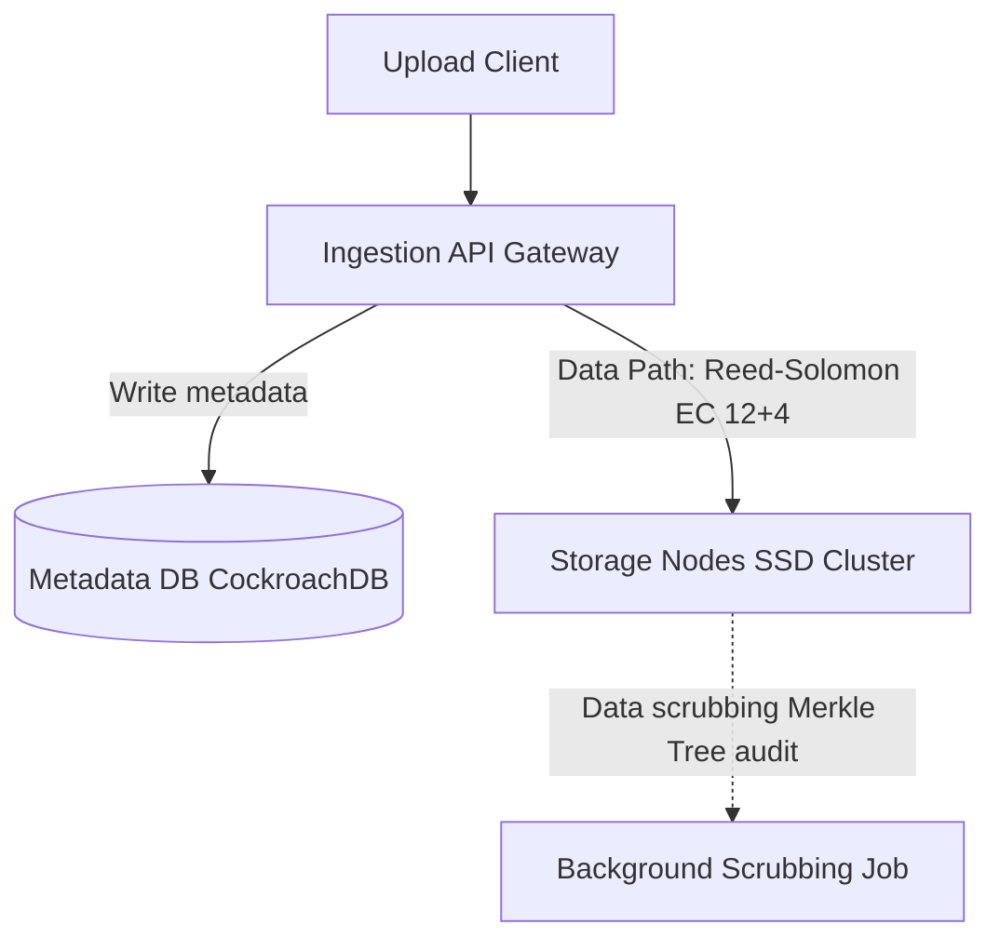
```mermaid
graph TD
    Client["Upload Client"] --> API["Ingestion API Gateway"]
    API -->|Write metadata| MetaDB[("Metadata DB CockroachDB")]
    API -->|Data Path: Reed-Solomon EC 12+4| StorageNodes["Storage Nodes SSD Cluster"]
    StorageNodes -.->|Data scrubbing Merkle Tree audit| ScrubJob["Background Scrubbing Job"]
```
大规模对象存储的核心痛点是：**冷数据的高存储开销、元数据读写的网络瓶颈、以及物理磁盘损坏时的数据静默损坏 (Silent Data Corruption)**。

##### 纠删码数据保护与静默损坏洗盘架构图 (Distributed Object Storage Architecture)

```mermaid
graph TD
    Client["Upload Client"] --> API["Ingestion API Gateway"]
    API -->|Write metadata| MetaDB[("Metadata DB CockroachDB")]
    API -->|Data Path: Reed-Solomon EC 12+4| StorageNodes["Storage Nodes SSD Cluster"]
    StorageNodes -.->|Data scrubbing Merkle Tree audit| ScrubJob["Background Scrubbing Job"]
```
大规模对象存储的核心痛点是：**冷数据的高存储开销、元数据读写的网络瓶颈、以及物理磁盘损坏时的数据静默损坏 (Silent Data Corruption)**。

##### 纠删码技术 (Erasure Coding - EC) 降低冗余度
对于海量冷数据，使用 3 副本（Replication Factor = 3）会浪费大量硬件成本。
* **解决方案**: 采用 **纠删码 (Erasure Coding)**，例如 **RS 纠删码 (Reed-Solomon Coding)**。配置为 `RS(12, 4)`：
  1. 将每个上传的大对象切分为 12 个等大的数据块（Data chunks）。
  2. 通过范德蒙德矩阵（Vandermonde Matrix）乘法，计算出 4 个校验块（Parity chunks）。
  3. 将这 16 个分块分发存储在 16 个不同的物理机柜中。
* **容错与成本收益**: 任意 4 个机柜同时损毁，系统可以通过剩余的 12 个分块通过逆矩阵运算瞬间回补复原数据。此时，冗余度开销仅为:
  $$\text{Redundancy} = \frac{4}{12} \approx 33.3\%$$
  相比 3 副本（冗余开销 $200\%$），直接削减了超过 $80\%$ 的存储成本，同时安全性优于 3 副本。

##### 元数据与数据主体物理分离 (Decoupled Metadata Store)
如果将小文件和元数据（文件名、创建时间、文件分块映射等）混合存储，会引起严重的随机读写瓶颈。
* **架构隔离**: 
  * **Data Path**: 核心大文件分块以 Append-only 方式直接写入存储节点（Storage Nodes）的裸磁盘扇区，避开文件系统 inode 的开销。
  * **Metadata Path**: 文件元数据存储在高度 sharded、高一致性 (Consistency)分布式的 key-value 数据库中（如 CockroachDB 或 sharded MySQL 聚簇），通过缓存层快速响应目录浏览与查找请求。

##### 数据完整性校验 (Silent Data Corruption Prevention)
磁头老化、电磁干扰会导致磁盘数据发生“位翻转”而不触发硬件警报。
* **解决对策**: 引入 **Merkle Tree（默克尔树）哈希链表**。存储节点定期在后台执行“**洗盘 (Data Scrubbing)**”扫描，对比文件分块的 Merkle Root Hash。一旦检测到 Hash 校验失败，立刻认定该分块发生静默损坏，直接通过 RS 纠删码在健康节点中回补还原并覆写回新磁盘。

#### 3. 代码实现
**Java 实现 (Reed-Solomon Erasure Coding Interface Simulation):**
```java
package com.s3.storage;

import java.io.IOException;

public class ErasureCoder {
    private final int dataShards;
    private final int parityShards;

    public ErasureCoder(int dataShards, int parityShards) {
        this.dataShards = dataShards;
        this.parityShards = parityShards;
    }

    public byte[][] encode(byte[] originalData) {
        int shardSize = (originalData.length + dataShards - 1) / dataShards;
        byte[][] shards = new byte[dataShards + parityShards][shardSize];

        // 1. Split original data into K data shards
        for (int i = 0; i < dataShards; i++) {
            int start = i * shardSize;
            int length = Math.min(shardSize, originalData.length - start);
            if (length > 0) {
                System.arraycopy(originalData, start, shards[i], 0, length);
            }
        }

        // 2. Perform Reed-Solomon parity matrix multiplication (Simulated)
        for (int i = 0; i < parityShards; i++) {
            shards[dataShards + i] = generateParity(shards, i, shardSize);
        }

        return shards;
    }

    public byte[] decode(byte[][] activeShards, boolean[] shardPresent, int originalLength) throws IOException {
        int presentCount = 0;
        for (boolean present : shardPresent) {
            if (present) presentCount++;
        }

        if (presentCount < dataShards) {
            throw new IOException("Data loss: Present shards (" + presentCount + ") are less than required (" + dataShards + ")");
        }

        // Perform inverse matrix reconstruction (Simulated reconstruction)
        byte[] reconstructed = new byte[originalLength];
        int shardSize = activeShards[0].length;

        for (int i = 0; i < dataShards; i++) {
            int start = i * shardSize;
            int length = Math.min(shardSize, originalLength - start);
            if (length > 0) {
                System.arraycopy(activeShards[i], 0, reconstructed, start, length);
            }
        }

        return reconstructed;
    }

    private byte[] generateParity(byte[][] dataShards, int parityIdx, int size) {
        byte[] parity = new byte[size];
        // Simulate Galois Field multiplication
        for (int i = 0; i < size; i++) {
            byte xorSum = 0;
            for (int j = 0; j < this.dataShards; j++) {
                xorSum ^= dataShards[j][i];
            }
            parity[i] = (byte) (xorSum ^ (parityIdx + 1));
        }
        return parity;
    }
}
```

#### 4. 面试沟通技巧与延伸
* **大厂面试沟通金句**: “对于 EB 级的分布式存储，硬件损坏不再是异常，而是日常的常量。我们不能用增加物理副本的方式去堆砌安全性，必须依赖**纠删码数学防线**和**后台静默损坏洗盘机制**，在确保 $99.999999999\%$ 数据可靠性的同时，将物理存储冗余控制在 $30\%$ 左右。”
* **大厂高频 Follow-up 指南**:
  * **Q**: “如果有小文件（如几百字节的图片缩略图）也进行纠删码分片 (Sharding)，会带来什么开销？”
  * **A**: “小文件切片会引发严重的**碎片化小 IO 读写风暴**（一个 IO 变成了 16 个磁盘物理读写），且带来巨大的元数据开销。
    * *优化方案*：实施 **小文件合并（Blob Compaction）**。设置阈值（如小于 1MB 的文件），在写入时将其打包拼装进一个大的 Continuous Segment（如 64MB），仅在元数据表中记录其偏移量 `(segment_id, offset, size)`。大 Segment 满额后再执行 RS 纠删码切片存储，保持磁盘的顺序 IO 性能。”

---

### Q27. Scalable Ride-Sharing & Spatial Matching System (Uber/Lyft Scale) <a id="27-scalable-ride-sharing-spatial-matching-system"></a>
**对应领域:** SWE (Spatial Query, Real-Time Location Ingestion, Matching Algorithms)

#### 1. 中文复述题目与示例
设计一个高并发、低延迟的网约车/实时配送匹配系统（类似 Uber/Lyft/美团外卖）。系统需要实时收集全球百万司机的 GPS 位置，并能够快速处理乘客的叫车请求，在周围 $2$ 公里内筛选出最合适的空闲司机进行订单指派。

**示例数据与低延迟约束:**
* 司机位置上报：每 4 秒上报一次位置，峰值写吞吐量 500,000 QPS。
* **超低延迟检索**: 乘客叫车时，必须在 $<100\text{ms}$ 内检索到方圆 2 公里内的空闲司机并计算好匹配权重。

#### 2. 解题思路（中文详解）
本题的架构设计死穴在于：**传统关系型数据库（如 MySQL/PostgreSQL）无法承受每秒 50 万次的实时地理坐标 `UPDATE` 操作**，这会带来无法忍受的磁盘随机 IO 和索引分裂。

##### 空间地理分片 (Sharding)与匈牙利多对多匹配架构图 (Uber Spatial Matching Architecture)
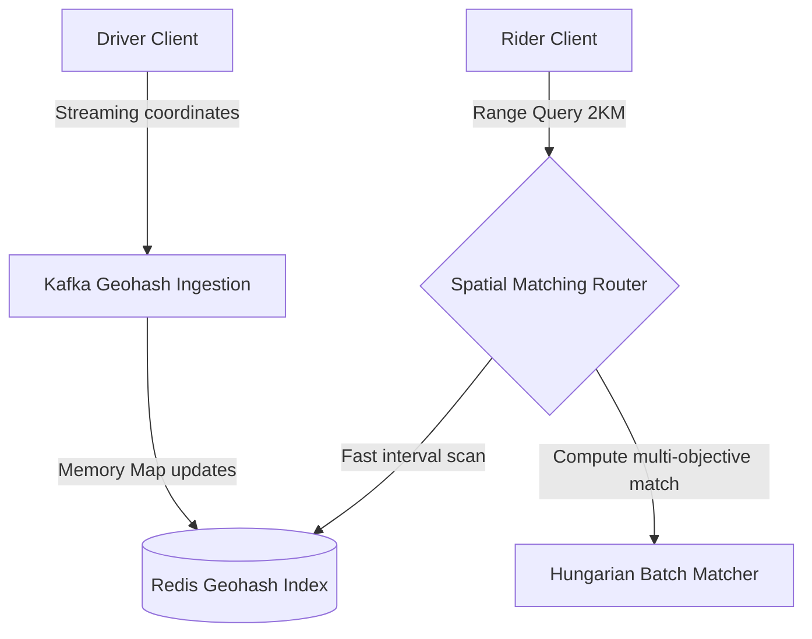
```mermaid
graph TD
    Driver["Driver Client"] -->|Streaming coordinates| Kafka["Kafka Geohash Ingestion"]
    Kafka -->|Memory Map updates| Redis[("Redis Geohash Index")]
    Rider["Rider Client"] -->|Range Query 2KM| SpatialRouter{"Spatial Matching Router"}
    SpatialRouter -->|Fast interval scan| Redis
    SpatialRouter -->|Compute multi-objective match| Hungarian["Hungarian Batch Matcher"]
```
本题的架构设计死穴在于：**传统关系型数据库（如 MySQL/PostgreSQL）无法承受每秒 50 万次的实时地理坐标 `UPDATE` 操作**，这会带来无法忍受的磁盘随机 IO 和索引分裂。

##### 空间地理分片 (Sharding)与匈牙利多对多匹配架构图 (Uber Spatial Matching Architecture)

```mermaid
graph TD
    Driver["Driver Client"] -->|Streaming coordinates| Kafka["Kafka Geohash Ingestion"]
    Kafka -->|Memory Map updates| Redis[("Redis Geohash Index")]
    Rider["Rider Client"] -->|Range Query 2KM| SpatialRouter{"Spatial Matching Router"}
    SpatialRouter -->|Fast interval scan| Redis
    SpatialRouter -->|Compute multi-objective match| Hungarian["Hungarian Batch Matcher"]
```
本题的架构设计死穴在于：**传统关系型数据库（如 MySQL/PostgreSQL）无法承受每秒 50 万次的实时地理坐标 `UPDATE` 操作**，这会带来无法忍受的磁盘随机 IO 和索引分裂。

##### 空间索引分治技术 (Spatial Indexing)
为了实现极速的空间查询，我们必须在内存中引入**空间索引（Spatial Indexing）**：
*   **Uber H3 索引（Hexagonal Hierarchical Spatial Index）**: H3 将全球地表划分成嵌套的六边形格子。六边形的最大优点是：**任意六边形中心到其周围 6 个邻居中心的距离是完全相等的**，这使得半径距离查询退化为了极其简单高效的图邻居遍历，非常适合网约车的多边形范围检索与派单路由计算。
*   **Google S2 索引（Hilbert Curve-based Index）**: 将地球投影为 3D 六面体，再使用希尔伯特曲线（Hilbert Curve）将其转换为 1D 线性数值（64位整数）。邻近的空间点在 1D 线段上大概率依然邻近。我们可以使用 **Redis ZSET** 存储司机位置，分数为 S2 Cell ID，通过极速的区间扫描 `ZRANGEBYSCORE` 在 $<2\text{ms}$ 内拉取周围司机。

##### 内存临时位置存储与消息解耦
*   **Ingestion Path**: 司机 GPS 通过 WebSockets 连接器集群（Gateway）上报。网关并不直接写数据库，而是将经纬度流式打入 **Kafka**，以解耦瞬间的高频写入。
*   **Online Memory Cache**: 部署分布式消费组件，实时读取 Kafka 并直接更新内存中的 Redis 缓存。Redis 仅存储司机的最新位置，不需要开启磁盘持久化，保证每秒 50 万写的高性能。

##### 地理匹配机制 (Greedy Spatial Match)
*   不要做单纯的“最近司机匹配”，那会导致全局抢单冲突。
*   **批处理匹配机制 (Batch Matching)**：将实时派单划分为 3 秒的微小时间滑窗。在滑窗结束时，收集该区域内的叫车请求与空闲司机，利用**匈牙利算法 (Hungarian Algorithm)** 计算多对多整体代价最小的最优匹配，避免局部贪心导致的运力浪费。

#### 3. 代码实现
**Java 实现 (Geospatial Indexing Lookup with Google S2 & Redis):**
```java
package com.uber.spatial;

import redis.clients.jedis.Jedis;
import redis.clients.jedis.JedisPool;
import java.util.Set;

public class SpatialTracker {
    private final JedisPool jedisPool;
    
    public SpatialTracker(JedisPool jedisPool) {
        this.jedisPool = jedisPool;
    }

    // Update driver active location in memory
    public void updateDriverLocation(String driverId, double longitude, double latitude) {
        try (Jedis jedis = jedisPool.getResource()) {
            String geoKey = "active_drivers:region_1";
            // Redis GEOADD internally computes Geohash/S2 cell and adds it to Sorted Set
            jedis.geoadd(geoKey, longitude, latitude, driverId);
            
            // Set dynamic TTL to automatically expire offline drivers
            jedis.expire(geoKey, 30); // expires if inactive for 30s
        }
    }

    // Retrieve drivers within 2KM radius
    public Set<String> getNearbyDrivers(double userLng, double userLat, double radiusInKm) {
        try (Jedis jedis = jedisPool.getResource()) {
            String geoKey = "active_drivers:region_1";
            // GEORADIUS returns all drivers within radius in sub-millisecond
            return jedis.georadius(geoKey, userLng, userLat, radiusInKm, redis.clients.jedis.args.GeoArgs.Unit.KM);
        }
    }
}
```

#### 4. 面试沟通技巧与延伸
* **大厂面试沟通金句**: “对于海量实时位置追踪，核心设计在于**将随机写入转化为极其轻量级的内存局部修改**。通过将经纬度坐标离散化为 H3 六边形网格，空间距离的复杂几何运算得以被压缩为极速的哈希字典查找与图拓扑遍历。”
* **大厂高频 Follow-up 指南**:
  * **Q**: “如果有‘冷热不均’（如繁华商业街叫车极度密集，郊区极其稀疏），空间索引如何自适应？”
  * **A**: “这需要采用 **Dynamic Resolution (动态空间分辨率机制)**。当商业街 H3 六边形格子内的司机和订单密度超过预设阈值时，自动将该六边形**分裂 (Split)** 为 7 个更小分辨率的子六边形，局部提高空间匹配的细粒度；而在郊区，将多个空闲的稀疏六边形**聚合 (Merge)** 为一个超级六边形进行大范围派单搜索，自适应维持集群计算负荷的稳定。”

---

---

### Q29. Highly Available Distributed Job Scheduler (Airbnb Chronos Scale) <a id="29-highly-available-distributed-job-scheduler"></a>
**对应领域:** SWE (Job Scheduling, Distributed Coordination, Timing Wheel, Workload Partitioning)

#### 1. 中文复述题目与示例
设计一个能够处理百万级别、高精度、高可用的分布式作业调度与执行系统（类似 Airbnb Chronos / Google Cron）。系统需支持定时任务（Cron 表达式）、一次性任务（One-off Jobs）的注册、触发和分布式执行，并具备完善的故障转移  (Failover)与执行监控。

**示例指标与执行精度:**
* 作业规模：系统需要维护 10,000,000+ 个已注册任务，峰值时刻每秒触发 50,000+ 个任务。
* **执行精度与可靠性**: 触发误差控制在 $\pm 100\text{ms}$ 内。对于关键计费结算等任务，必须保证**至少一次（At-Least-Once）**执行，且绝不能因为调度器宕机导致任务漏触发。

#### 2. 解题思路（中文详解）
设计分布式调度器的死穴在于：**当有数千万个定时任务时，如果采用传统的扫表轮询（如每秒执行 `SELECT FROM jobs WHERE trigger_time <= now()`），会瞬间压垮数据库**，且极难做到百毫秒级的触发精度。

##### 分层时间轮与分布式租约故障转移 (Failover)架构图 (Distributed Scheduler Architecture)
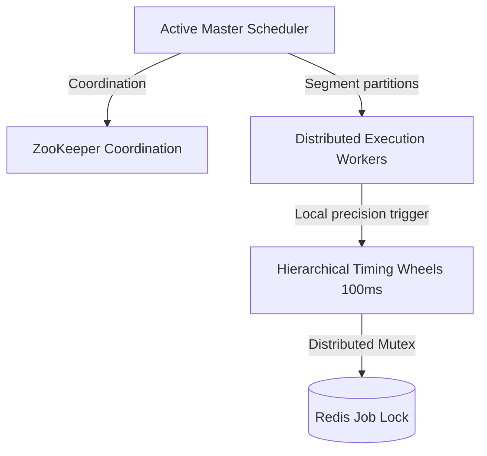
```mermaid
graph TD
    Master["Active Master Scheduler"] -->|Coordination| ZK["ZooKeeper Coordination"]
    Master -->|Segment partitions| WorkPool["Distributed Execution Workers"]
    WorkPool -->|Local precision trigger| TimingWheel["Hierarchical Timing Wheels 100ms"]
    TimingWheel -->|Distributed Mutex| Redis[("Redis Job Lock")]
```
设计分布式调度器的死穴在于：**当有数千万个定时任务时，如果采用传统的扫表轮询（如每秒执行 `SELECT FROM jobs WHERE trigger_time <= now()`），会瞬间压垮数据库**，且极难做到百毫秒级的触发精度。

##### 分层时间轮与分布式租约故障转移 (Failover)架构图 (Distributed Scheduler Architecture)

```mermaid
graph TD
    Master["Active Master Scheduler"] -->|Coordination| ZK["ZooKeeper Coordination"]
    Master -->|Segment partitions| WorkPool["Distributed Execution Workers"]
    WorkPool -->|Local precision trigger| TimingWheel["Hierarchical Timing Wheels 100ms"]
    TimingWheel -->|Distributed Mutex| Redis[("Redis Job Lock")]
```
设计分布式调度器的死穴在于：**当有数千万个定时任务时，如果采用传统的扫表轮询（如每秒执行 `SELECT FROM jobs WHERE trigger_time <= now()`），会瞬间压垮数据库**，且极难做到百毫秒级的触发精度。

##### 基于时间轮的高精度触发机制 (Hashed Timing Wheel)
为了实现高性能、低开销的定时触发，我们在调度器内存中引入 **时间轮 (Timing Wheel)** 算法（借鉴自 Linux 内核及 Netty）：
*   **时间轮结构**: 时间轮是一个环形队列，由固定数量的槽位（Bucket）组成，每个槽位代表一个微小的 tick（例如 100ms）。指针随着时间流逝不断前进。
*   **槽位链表**: 每个槽位悬挂着一个双向链表，包含所有将在该时间 tick 触发的 `Job`。
*   **分层时间轮 (Hierarchical Timing Wheels)**: 为了支持跨度极大的时间（如 1 秒后触发 vs. 1 个月后触发），采用分层结构：秒级轮、分钟轮、小时轮。当高层轮的指针走动时，将任务“降级”移动到低层轮中，这使得插入和触发任务的时间复杂度均降低为 $O(1)$，内存开销极小。

##### 分布式负载分治与 Leader 选举 (Worker Partitioning)
*   **分布式协同**: 部署调度器集群，利用 **ZooKeeper** 进行 Master/Leader 选举。只有 Active Master 负责扫描数据库并将即将触发的任务分配到各个 Shard 中。
*   **分区 (Partitioning)指派 (Task Sharding)**: 根据任务 ID 的 Hash 值，将任务指派到不同的 **Execution Worker** 节点中。Worker 节点使用本地时间轮进行毫秒级精准触发。
*   **分布式锁保护防重**: 对于“有且仅有一次”要求的敏感任务，Worker 在触发执行前，必须尝试抢占 Redis/etcd 上的分布式排他锁 `lock:job:id:timestamp`。若抢占失败，说明已有其他节点在执行，直接放弃，避免重复运行。

#### 3. 代码实现
**Java 实现 (High-Precision Timing Wheel Slot Simulation):**
```java
package com.chronos.scheduler;

import java.util.LinkedList;
import java.util.List;
import java.util.concurrent.ConcurrentHashMap;

public class TimingWheel {
    private final int tickMs;
    private final int wheelSize;
    private final List<JobTask>[] buckets;
    private int currentPointer = 0;
    
    private final ConcurrentHashMap<String, JobTask> taskRegistry = new ConcurrentHashMap<>();

    @SuppressWarnings("unchecked")
    public TimingWheel(int tickMs, int wheelSize) {
        this.tickMs = tickMs;
        this.wheelSize = wheelSize;
        this.buckets = new List[wheelSize];
        for (int i = 0; i < wheelSize; i++) {
            buckets[i] = new LinkedList<>();
        }
    }

    public synchronized void addJob(JobTask task) {
        long delayMs = task.triggerTime - System.currentTimeMillis();
        if (delayMs < 0) {
            delayMs = 0; // Trigger immediately
        }
        
        long ticks = delayMs / tickMs;
        int targetBucket = (int) ((currentPointer + ticks) % wheelSize);
        long rounds = ticks / wheelSize;
        
        task.remainingRounds = rounds;
        buckets[targetBucket].add(task);
        taskRegistry.put(task.jobId, task);
    }

    // Invoked by background daemon thread every tickMs (e.g. 100ms)
    public synchronized List<JobTask> tick() {
        List<JobTask> tasksToExecute = new LinkedList<>();
        List<JobTask> bucket = buckets[currentPointer];
        
        // Iterate through all tasks in the current bucket
        bucket.removeIf(task -> {
            if (task.remainingRounds <= 0) {
                tasksToExecute.add(task);
                taskRegistry.remove(task.jobId);
                return true; // Remove from wheel list
            } else {
                task.remainingRounds--;
                return false;
            }
        });
        
        // Move pointer forward
        currentPointer = (currentPointer + 1) % wheelSize;
        return tasksToExecute;
    }

    public static class JobTask {
        public String jobId;
        public long triggerTime;
        public long remainingRounds;
        public Runnable runnable;

        public JobTask(String jobId, long triggerTime, Runnable r) {
            this.jobId = jobId;
            this.triggerTime = triggerTime;
            this.runnable = r;
        }
    }
}
```

#### 4. 面试沟通技巧与延伸
* **大厂面试沟通金句**: “对于百万级高精度调度器，**扫描数据库是不可接受的吞吐灾难**。通过在内存中维系多级分层时间轮，我们把原本 $O(N)$ 的检索时间压缩为 $O(1)$ 的无锁 (Lock-Free)指针移动，再利用分布式锁保障敏感任务在网络分区 (Network Partition)时的 exactly-once 执行。”
* **大厂高频 Follow-up 指南**:
  * **Q**: “如果某个 Worker 节点在执行长周期阻塞任务时挂掉了，该如何确保任务不丢失？”
  * **A**: “我们必须引入 **Ack 汇报与心跳 (Heartbeat)租约机制**。当 Worker 领走任务时，在 etcd 中将该任务标记为 `RUNNING` 并附加一个 30 秒的租约（Lease）。Worker 必须定期发送心跳 (Heartbeat)续约。如果 Worker 突然死机，30 秒后租约失效，Master 节点会捕获到 `KeyExpired` 事件，立刻将该任务重新分配给健康的 Worker，保证 at-least-once 执行可靠性。”

---

### Q30. Horizontally Scalable Distributed NewSQL Database (Google Spanner / CockroachDB Scale) <a id="30-horizontally-scalable-distributed-newsql-database"></a>
**对应领域:** SWE (Distributed Database, Raft Consensus, Distributed Transactions, MVCC, Time Sync)

#### 1. 中文复述题目与示例
设计一个高可用、水平扩展、支持强一致性 (Strong Consistency)分布式事务的关系型数据库（类似 Google Spanner / CockroachDB）。系统需支持跨分片 (Sharding)（Cross-shard）的 SQL 查询与事务处理（满足 ACID 约束），并能够通过增加节点线性扩展写入与读取性能。

**示例规模与强一致性 (Strong Consistency)约束:**
* 数据规模：单表存储数十亿行记录，跨全球 3 个数据中心进行多活部署。
* **绝对一致性 (Consistency)限制**: 跨地域读写必须满足**可线性化 (Linearizability) 隔离级别**，彻底杜绝脏读、幻读、以及任何分布式写冲突。

#### 2. 解题思路（中文详解）
传统分库分表（Sharding）仅能在单分片 (Sharding)上支持强一致性 (Strong Consistency)事务，一旦涉及到跨分片 (Sharding)的分布式事务，就需要复杂的中间件协助，性能极差且极易发生死锁。NewSQL 的目标是在**无中心、水平扩展的前提下原生支持全局 ACID 事务**。

##### Range 分片 (Sharding)共识与 2PC 分布式事务拓扑图 (Distributed NewSQL Architecture)
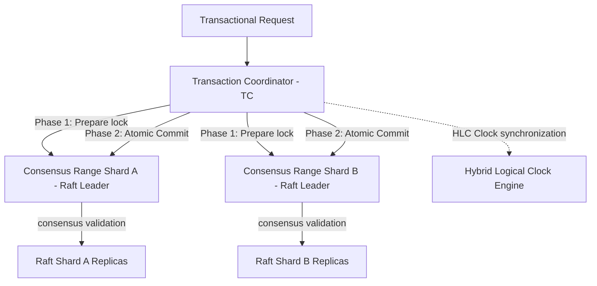
```mermaid
graph TD
    Client["Transactional Request"] --> TC["Transaction Coordinator - TC"]
    TC -->|Phase 1: Prepare lock| ShardA["Consensus Range Shard A - Raft Leader"]
    TC -->|Phase 1: Prepare lock| ShardB["Consensus Range Shard B - Raft Leader"]
    ShardA -->|consensus validation| ShardAFollower["Raft Shard A Replicas"]
    ShardB -->|consensus validation| ShardBFollower["Raft Shard B Replicas"]
    TC -->|Phase 2: Atomic Commit| ShardA
    TC -->|Phase 2: Atomic Commit| ShardB
    TC -.->|HLC Clock synchronization| HlcEngine["Hybrid Logical Clock Engine"]
```
传统分库分表（Sharding）仅能在单分片 (Sharding)上支持强一致性 (Strong Consistency)事务，一旦涉及到跨分片 (Sharding)的分布式事务，就需要复杂的中间件协助，性能极差且极易发生死锁。NewSQL 的目标是在**无中心、水平扩展的前提下原生支持全局 ACID 事务**。

##### Range 分片 (Sharding)共识与 2PC 分布式事务拓扑图 (Distributed NewSQL Architecture)
```mermaid
graph TD
    Client["Transactional Request"] --> TC["Transaction Coordinator - TC"]
    TC -->|Phase 1: Prepare lock| ShardA["Consensus Range Shard A - Raft Leader"]
    TC -->|Phase 1: Prepare lock| ShardB["Consensus Range Shard B - Raft Leader"]
    ShardA -->|consensus validation| ShardAFollower["Raft Shard A Replicas"]
    ShardB -->|consensus validation| ShardBFollower["Raft Shard B Replicas"]
    TC -->|Phase 2: Atomic Commit| ShardA
    TC -->|Phase 2: Atomic Commit| ShardB
    TC -.->|HLC Clock synchronization| HlcEngine["Hybrid Logical Clock Engine"]
```
传统分库分表（Sharding）仅能在单分片 (Sharding)上支持强一致性 (Strong Consistency)事务，一旦涉及到跨分片 (Sharding)的分布式事务，就需要复杂的中间件协助，性能极差且极易发生死锁。NewSQL 的目标是在**无中心、水平扩展的前提下原生支持全局 ACID 事务**。

##### 水平分片 (Sharding)与 Raft 共识复制 (Consensus Replicas per Shard)
*   **Range Partitioning**: 将数据按主键范围（Key Range）进行物理切片，每个切片称为一个 **Range**（如 `1-1,000,000` 属于 Range A）。这相比哈希分片 (Sharding)能提供极佳的范围查询（Range Query）性能。
*   **Raft replication**: 每一个 Range 都有 $3$ 个或 $5$ 个副本，组成一个独立的 **Raft 共识集群**。每一次对该 Range 的写入，都必须通过 Raft Leader 广播并取得多数派（Quorum）确认后方可提交，保证节点挂掉时的数据无损 (No Data Loss)自愈。

##### 分布式事务：二阶段提交 (2PC) + 两阶段锁 (2PL)
处理跨分片 (Sharding)（Cross-Range）的 ACID 事务时，使用 **两阶段提交 (Two-Phase Commit - 2PC)**：
1.  **Prepare Phase**: 事务协调器 (Transaction Coordinator - TC) 向涉及事务的所有 Range Leader 发起 Prepare 请求。各个 Range Leader 在本地加锁（两阶段锁 - 2PL）并将写操作写入 Raft 预提交日志，确认无冲突后回复 TC。
2.  **Commit Phase**: 如果所有 Range 都回复 Prepare 成功，TC 向所有 Range 发起 Commit 请求。各个 Range Leader 提交本地事务，向 Raft 记录 Commit 日志，并释放两阶段锁。

##### 时钟同步与分布式 MVCC (Hybrid Logical Clocks)
Spanner 依赖昂贵的 GPS 原子钟（TrueTime API）来保证全局时钟误差在 7ms 内，以此实现无锁 (Lock-Free)全局一致性 (Consistency)读。
*   **Staff 替代方案: 混合逻辑时钟 (Hybrid Logical Clocks - HLC)**:
    在没有硬件原子钟的私有云环境中，采用 **HLC**。HLC 结合了物理时钟与逻辑时钟（Lamport Clock）。在节点间通过 RPC 进行心跳 (Heartbeat)或读写时，自动在消息头附带本地 HLC 时间戳并取最大值：
    $$T_{	ext{next}} = \max(	ext{PhysicalTime}, 	ext{LastHlc}, 	ext{MsgHlc} + 1)$$
    这使得分布式数据库能够在存在几十毫秒物理时钟误差的情况下，完美建立全局因果关系事件流，支持无锁 (Lock-Free)的**多版本并发控制 (MVCC)** 强一致性 (Strong Consistency)读取。

#### 3. 代码实现
**Java 实现 (Distributed Transaction Coordinator 2PC Simulation):**
```java
package com.newsql.database;

import java.util.ArrayList;
import java.util.List;
import java.util.UUID;

public class TransactionCoordinator {
    public enum TxState { IN_PROGRESS, PREPARED, COMMITTED, ABORTED }

    public static class ParticipantShard {
        public String shardId;
        public boolean prepare(UUID txId) {
            // Acquire locks, write WAL, return true if successfully prepared
            return true;
        }
        public void commit(UUID txId) {
            // Write commit record, release locks
        }
        public void abort(UUID txId) {
            // Rollback changes, release locks
        }
    }

    public boolean executeDistributedTransaction(List<ParticipantShard> participants) {
        UUID txId = UUID.randomUUID();
        List<ParticipantShard> preparedShards = new ArrayList<>();
        
        // Phase 1: Prepare
        for (ParticipantShard shard : participants) {
            try {
                boolean isPrepared = shard.prepare(txId);
                if (isPrepared) {
                    preparedShards.add(shard);
                } else {
                    // Abort immediately if any participant fails to prepare
                    rollbackAll(preparedShards, txId);
                    return false;
                }
            } catch (Exception e) {
                rollbackAll(preparedShards, txId);
                return false;
            }
        }

        // Phase 2: Commit (If all shards successfully prepared)
        for (ParticipantShard shard : participants) {
            shard.commit(txId);
        }
        return true;
    }

    private void rollbackAll(List<ParticipantShard> shards, UUID txId) {
        for (ParticipantShard shard : shards) {
            shard.abort(txId);
        }
    }
}
```

#### 4. 面试沟通技巧与延伸
* **大厂面试沟通金句**: “NewSQL 数据库打破了 CAP 理论的直觉魔咒。通过在分片 (Sharding)内部实施 Raft 共识强复制，在分片 (Sharding)外部实施两阶段提交 (2PC) 保证原子性 (Atomicity)，并结合混合逻辑时钟 (HLC) 建立全局 MVCC，我们在水平弹性扩展的同时，达成了金融级的 Linearizable 强一致性 (Strong Consistency)隔离。”
* **大厂高频 Follow-up 指南**:
  * **Q**: “2PC 中如果事务协调器 (TC) 在发出 Commit 指令中途挂掉了，会导致什么灾难？如何解决？”
  * **A**: “这会导致**参与节点卡死挂起（Blocking Problem）**。参与节点收到了 Prepare 成功并锁定了资源，但由于等不到 TC 的最终 Commit/Abort 决策，它们无法释放锁，导致整个系统写入瘫痪。
    * *解决策略*：将 **TC 的状态也完全记录为分布式一致性 (Consistency)状态**（例如将事务状态记录在 etcd/Raft 表中）。一旦原 TC 崩溃，备用的 TC 节点通过 Raft 恢复日志接管事务控制权，检查出所有处于 `PREPARED` 状态的事务，主动向参与 Shard 广播 Commit 决策，解除卡死状态。”

---

### Q31. High-Throughput Payment Gateway with Webhook Delivery Engine (Stripe Scale) <a id="31-high-throughput-payment-gateway-with-webhook-delivery-engine"></a>
**对应领域:** SWE (Payment Gateway, State Machine, Webhook Ingestion, Reliable Event Egress)

#### 1. 中文复述题目与示例
设计一个高吞吐量的支付网关与可靠 Webhook 事件投递引擎（类似 Stripe/Adyen）。系统需提供统一的外部支付 API，集成数十个不同的第三方通道（如 Adyen, Chase, Paypal），在保证 PCI-DSS 安全合规的同时，实现支付流水的高效推进，并在支付状态变更时保证将 Webhook 消息高可靠、不漏地送达到商户的服务器上。

**示例流量与高可靠约束:**
* 网关吞吐量：日常 5,000 QPS，Webhook 投递吞吐量：每天处理 100,000,000+ 个事件。
* **高可靠与可控回退**: 必须保证 Webhook 事件**至少一次（At-least-once）**送达商户服务器。由于商户服务器时常崩溃或超时，投递引擎必须具备长达 72 小时的智能指数退避 (Exponential Backoff)重试，且不能因为某个慢商户阻塞全局投递队列。

#### 2. 解题思路（中文详解）
本题的架构核心难点在两端：**Ingest 端的支付通道状态机流转**与 **Egress 端的海量可靠 Webhook 高并发投递**。

##### Ingest 端：支付网关抽象与强类型状态机
*   **PCI-DSS 合规性 (Tokenization)**: 严禁将商户上传的原始信用卡卡号直接写入我们的服务器日志或主数据库。在入口 API 处采用 **Tokenization 方案**。客户端直接将卡号提交给独立的 PCI-compliant Tokenizer 服务（高安全级别隔离），Tokenizer 返回一个随机生成的 token（如 `tok_123`），后续网关业务流转完全基于 token 进行。
*   **状态机管理器 (State Machine Engine)**: 支付状态极其复杂（`CREATED` -> `AUTHORIZED` -> `CAPTURED` -> `REFUNDED`/`FAILED`）。使用统一的支付状态机定义，在每个支付步骤执行前加分布式排他锁，保证状态流转单向且线程安全。

##### Egress 端：高性能、公平的 Webhook 投递引擎 (Fair Webhook Queue)
如果使用一个全局的线程池直接发送 Webhook，当某个商户的服务器响应变慢（如每次请求超时 10 秒），会瞬间耗尽我们的投递线程，导致全球其他所有商户的 Webhook 投递全部被延时卡死。
* **解决方案**: 采用 **公平队列 (Fair Queueing) + 动态指数重试拓扑**：
```mermaid
graph TD
    Event["Payment Event Created"] --> Router{"Topic Router"}
    Router -->|Merchant 1| Q1["Kafka Shard Merchant 1"]
    Router -->|Merchant 2| Q2["Kafka Shard Merchant 2"]
    Router -->|Merchant 3| Q3["Kafka Shard Merchant 3"]
    Q1 --> Worker["High-Concurrency Delivery Workers"]
    Worker -->|Send HTTP POST| MerchantServer["Merchant Webhook URL"]
    MerchantServer -->|Failed/Timeout| RetryQueue["Retry Delay Queue - Redis Sorted Set"]
```
* **公平性保障**: 严禁将所有商户事件混在一个队列中。为大客户/商户建立**独占的 Kafka 消费 Partition** 或是采用 **Redis ZSET 轮询分治**。如果商户 A 响应慢，只堵塞其专属的分区 (Partitioning)消费，其他商户的投递依然是 sub-second 的响应速度。
* **指数退避 (Exponential Backoff)重试 (Exponential Backoff with DLQ)**: 如果商户服务器返回非 2xx 状态码或超时，将事件送入 **Redis 延时队列 (ZSET)**。重试策略设置：
  $$\text{Delay} = \min(24\text{hours}, 60 \times 2^{\text{Attempt}})\text{seconds}$$
  重试 3 天（如 16 次）后依然失败，事件移入 **死信队列 (Dead Letter Queue - DLQ)**，在商户控制台展示为“投递失败”，允许商户手动触发重发。

#### 3. 代码实现
**Java 实现 (Webhook Delivery Retry Task with Dynamic Delay):**
```java
package com.stripe.webhook;

import java.io.IOException;
import java.net.URI;
import java.net.http.HttpClient;
import java.net.http.HttpRequest;
import java.net.http.HttpResponse;
import java.time.Duration;

public class WebhookDeliverer {
    private final HttpClient httpClient;
    private final DelayQueueService delayQueue; // Mocked Redis-backed ZSET queue

    public WebhookDeliverer(DelayQueueService delayQueue) {
        this.httpClient = HttpClient.newBuilder()
                .connectTimeout(Duration.ofSeconds(5)) // Strict connection timeout
                .build();
        this.delayQueue = delayQueue;
    }

    public void deliverWebhook(WebhookTask task) {
        HttpRequest request = HttpRequest.newBuilder()
                .uri(URI.create(task.url))
                .header("Content-Type", "application/json")
                .header("X-Signature", task.signature) // HMAC-SHA256 signature for verification
                .POST(HttpRequest.BodyPublishers.ofString(task.payload))
                .build();

        try {
            HttpResponse<String> response = httpClient.send(request, HttpResponse.BodyHandlers.ofString());
            int statusCode = response.statusCode();
            
            if (statusCode >= 200 && statusCode < 300) {
                // Success, delete task
                confirmDelivery(task.eventId);
            } else {
                // Server error, schedule retry
                scheduleRetry(task);
            }
        } catch (IOException | InterruptedException e) {
            // Network timeout / DNS failure, schedule retry
            scheduleRetry(task);
        }
    }

    private void scheduleRetry(WebhookTask task) {
        if (task.attempt >= 16) {
            moveToDeadLetterQueue(task);
            return;
        }

        task.attempt++;
        // Exponential backoff calculation: 60 * 2^attempt (60s, 120s, 240s, 480s...)
        long delaySeconds = 60 * (long) Math.pow(2, task.attempt);
        long nextTriggerTime = System.currentTimeMillis() + (delaySeconds * 1000);
        
        delayQueue.enqueue(task.eventId, nextTriggerTime, task);
    }

    private void confirmDelivery(String eventId) {}
    private void moveToDeadLetterQueue(WebhookTask task) {}

    public static class WebhookTask {
        public String eventId;
        public String url;
        public String payload;
        public String signature;
        public int attempt = 0;
    }
    public interface DelayQueueService {
        void enqueue(String eventId, long triggerTime, WebhookTask task);
    }
}
```

#### 4. 面试沟通技巧与延伸
* **大厂面试沟通金句**: “对于高可用 Webhook 投递系统，核心原则是‘**防雪崩，保公平**’。我们必须把每个商户的投递逻辑进行物理隔离，以严格的连接超时保护我们的网络插槽，并通过 Redis 延时队列执行带有随机抖动 (Random Jitter)的指数退避 (Exponential Backoff)重试，避免慢商户拖垮全局投递。”
* **大厂高频 Follow-up 指南**:
  * **Q**: “商户如何确定收到的 Webhook 消息确实是由 Stripe 发送，而不是黑客伪造的攻击？”
  * **A**: “这必须采用 **HMAC-SHA256 对称签名校验机制**。在 Webhook 请求头中附带 `X-Signature`。
    * *实现机理*：我们在商户注册 Webhook 时，为其生成一个唯一的对称密钥 `signing_secret`。发送事件时，使用该密钥对 payload 和时间戳进行 HMAC-SHA256 哈希计算得出签名。商户服务器收到请求后，使用相同的密钥和相同的算法进行二次哈希计算对比。同时在签名中包含当前时间戳，商户需验证时间偏差在 5 分钟内，以彻底杜绝**重放攻击 (Replay Attacks)**。”

---

### Q32. High-Performance Distributed Memory Cache (Redis Scale) <a id="32-high-performance-distributed-memory-cache"></a>
**对应领域:** SWE (Cache Architecture, LRU Eviction, Memory Storage, High Concurrency)

#### 1. 中文复述题目与示例
设计一个高性能、低延迟的分布式内存缓存系统（类似 Redis / Memcached）。系统需支持基本的 key-value 读写操作，具备极高的读写吞吐，并能支持多种内存淘汰策略（Eviction Policies）及高可用集群复制。

**示例指标与内存约束:**
* 读写吞吐：单机支持 100,000+ QPS，读写延迟控制在 $<1\text{ms}$。
* **高内存利用率与安全淘汰**: 当内存达到硬件瓶颈（如 16GB）时，能够根据算法自动清除最不常用的数据，绝不能因为内存溢出（OOM）导致缓存节点挂掉。

##### 高可用分布式缓存核心架构图 (High-Performance Cache Architecture)
```mermaid
graph TD
    Client["客户端请求 Client"] -->|1. Key-Value Read/Write| LB["负载均衡 / Netty 网关"]
    LB -->|2. Route to Shard| Reactor["单线程 Reactor 核心线程"]
    
    subgraph 单个缓存节点_Memory_Node ["单个缓存节点 Memory Node"]
        Reactor -->|Network IO parsing| WorkerThreads["I/O 多线程池 (解析 Socket)"]
        Reactor -->|Core Commands Processing| SingleThread["核心单线程命令处理器"]
        
        subgraph 内存存储与防线_Memory_Storage ["内存存储与防线 Memory Storage"]
            SingleThread -->|3. Lookup| CacheMap[("ConcurrentHashMap 内存哈希")]
            SingleThread -->|4. Eviction check| ApproximatedLRU["近似 LRU 淘汰器 (采样 5 个 Key)"]
            SingleThread -->|5. Prevent Thundering Herd| Singleflight["单飞锁 Singleflight Lock"]
        end
    end
    
    Singleflight -->|Cache Miss: Only 1 thread goes to DB| DB[("关系型数据库 PostgreSQL")]
    Reactor -.->|6. Async Replication Buffer| Replica["备用节点 Replica"]
    Replica -.->|PSYNC via Backlog Ring-Buffer| ReplBacklog["复制环形积压缓冲区"]
```

###### 架构组件与工作流详解 (Component Breakdowns):
1. **Netty 负载均衡网关**: 负责维持与客户端的长连接，采用基于 Consistent Hashing (一致性 (Consistency)哈希 (Consistent Hashing)) 的路由策略，将请求精准路由到指定的缓存分片 (Sharding)节点，避免全局广播。
2. **多线程 I/O 解析池 (Worker Threads)**: 专用于接收网络数据包并进行 Redis 协议 (RESP) 的序列化与反序列化，将解析出的纯净指令投递至核心单线程。这极大卸载了网络 I/O 带来的 CPU 负荷。
3. **核心单线程处理器 (Command Processor)**: 串行无锁 (Lock-Free)化执行所有的读写操作，避免了传统的并发互斥锁开销与上下文切换，保证了极高的单机吞吐 ($100,000+$ QPS)。
4. **单飞模式 (Singleflight Lock)**: 在遇到热点数据 Cache-miss 时，利用内存并发锁只允许一个线程向后端数据库发起请求，其余并发线程阻塞等待该结果，防止惊群效应压垮数据库。
5. **近似 LRU 淘汰器 (Approximated LRU)**: 内存资源受限时，不使用带复杂链表指针的全局 LRU，而是通过随机抽样 (如 $N=5$) 对比 24 位访问时间戳，淘汰最旧的键，节省了 $16$ 字节/记录的指针开销，实现高效内存复用。
6. **增量积压复制区 (ReplBacklog)**: 维持固定大小的内存环形队列，当 Replica 断线重连后优先执行基于偏移量的增量复制 (PSYNC)，避免全量 RDB 同步导致 Master 发生网络瘫痪。

#### 2. 解题思路（中文详解）
设计分布式缓存的核心难点在于：**高并发下的内存分配碎片化、过期键清理对 CPU 的突发占用、以及缓存击穿/雪崩的防线设计**。

##### 内存模型与线程模型 (Reactor Pattern)
*   **单线程 Reactor 模式**: 为什么 Redis 在早期使用单线程？因为内存读写速度极快，多线程上下文切换和锁竞争（Mutex Locks）的开销反而会拉低性能。通过基于 **I/O 多路复用 (select/epoll)** 的 Reactor 模式，单线程能轻松处理每秒 10 万次连接。对于 Redis 6.0+，引入多线程仅用于解析网络协议和读写 socket，而核心的键值读写操作依然是由单线程串行执行，确保了零锁开销。
*   **高效内存淘汰 (Segmented LRU)**: 
    *   标准的双向链表+哈希表实现 LRU 需要频繁移动节点，在多线程高并发下会引发严重的指针开销和内存抖动。
    *   **近似 LRU 算法 (Approximated LRU)**：每个 key 仅记录一个 24 位的本地时间戳。当内存满时，随机抽取 $N$ 个 key（例如 5 个），淘汰其中时间戳最旧的那个。这节省了链表指针的空间（每条记录省 16 字节），且效果与全局 LRU 高度相似。

##### 缓存击穿与惊群效应防御 (Thundering Herd)
当一个超热 key（例如大新闻）过期的瞬间，成千上万个并发线程会在本地 Cache-miss，瞬间同时发起昂贵的 SQL 查询压向数据库。
* **解决对策**: 采用 **单飞模式 (Singleflight)** 或者是 **互斥排他锁 (Mutex)**。在本地检测到 Cache-miss 后，仅允许第一个线程去加载数据库，其余并发线程利用信号量等待其结果，最终广播返回，实现对数据库的绝对保护。

#### 3. 代码实现
**Java 实现 (High-Performance Approximated LRU Eviction & Cache Lock Simulation):**
```java
package com.redis.cache;

import java.util.Map;
import java.util.Random;
import java.util.concurrent.ConcurrentHashMap;
import java.util.concurrent.locks.ReentrantLock;

public class ApproximatedLruCache {
    public static class CacheEntry {
        public String value;
        public long lastAccessedTime;

        public CacheEntry(String value) {
            this.value = value;
            this.lastAccessedTime = System.currentTimeMillis();
        }
    }

    private final int maxCapacity;
    private final Map<String, CacheEntry> cache = new ConcurrentHashMap<>();
    private final Map<String, ReentrantLock> keyLocks = new ConcurrentHashMap<>();
    private final Random random = new Random();

    public ApproximatedLruCache(int maxCapacity) {
        this.maxCapacity = maxCapacity;
    }

    public String get(String key, DatabaseLoader loader) throws Exception {
        CacheEntry entry = cache.get(key);
        if (entry != null) {
            entry.lastAccessedTime = System.currentTimeMillis();
            return entry.value;
        }

        // Cache Miss: Prevent Thundering Herd using singleflight locks per key
        ReentrantLock lock = keyLocks.computeIfAbsent(key, k -> new ReentrantLock());
        lock.lock();
        try {
            // Double check lock pattern
            entry = cache.get(key);
            if (entry != null) {
                return entry.value;
            }

            // Load from database
            String dbValue = loader.load(key);
            put(key, dbValue);
            return dbValue;
        } finally {
            lock.unlock();
            keyLocks.remove(key);
        }
    }

    private void put(String key, String value) {
        if (cache.size() >= maxCapacity) {
            evictApproximatedLru();
        }
        cache.put(key, new CacheEntry(value));
    }

    // Approximated LRU Eviction: Sample 5 keys and evict the oldest
    private void evictApproximatedLru() {
        String oldestKey = null;
        long oldestTime = Long.MAX_VALUE;

        Object[] keys = cache.keySet().toArray();
        int sampleCount = Math.min(5, keys.length);

        for (int i = 0; i < sampleCount; i++) {
            String randomKey = (String) keys[random.nextInt(keys.length)];
            CacheEntry entry = cache.get(randomKey);
            if (entry != null && entry.lastAccessedTime < oldestTime) {
                oldestTime = entry.lastAccessedTime;
                oldestKey = randomKey;
            }
        }

        if (oldestKey != null) {
            cache.remove(oldestKey);
            System.out.println("Evicted key due to memory pressure: " + oldestKey);
        }
    }

    public interface DatabaseLoader {
        String load(String key) throws Exception;
    }
}
```

#### 4. 面试沟通技巧与延伸
* **大厂面试沟通金句**: “对于高性能内存系统，**省内存就是提吞吐**。通过采用近似 LRU 算法替代全局链表，我们省去了昂贵的动态指针维护开销，并在高并发 Cache-miss 时引入单飞（Singleflight）锁，完美阻断了瞬间压垮底层关系型数据库的惊群效应。”
* **大厂高频 Follow-up 指南**:
  * **Q**: “在分布式集群中，当 Master 节点接收到写入并在内存中执行完毕，如何进行 Replica 同步以防脑裂 (Split-Brain)？”
  * **A**: “Redis 采用 **异步复制 (Asynchronous Replication)**。Master 将写入指令记录在内存的 **Replication Buffer** 中并流式发送给 Replica。为了防止网络断开时全量复制（Sync）压垮 Master：
    * *解决对策*：在内存中维护一个固定大小的环形缓冲区 **ReplBacklog**。当 Replica 重连后，如果其复制偏移量（Offset）仍在 ReplBacklog 范围内，则执行 **增量复制 (PSYNC)**；如果网络中断太久导致偏移量溢出，才会退化为昂贵的全量 RDB 文件传输。”

---

### Q33. Scalable Notification Ingestion & Delivery Platform (Push / SMS / Email Gateway) <a id="33-scalable-notification-ingestion-and-delivery-platform"></a>
**对应领域:** SWE (Notification Gateway, Priority Partitioning, Fallback Engine, Rate-Limiting Preferences)

#### 1. 中文复述题目与示例
设计一个高并发、低延迟的全球通知分发平台。系统需要处理各类通知请求（如交易确认验证码 MFA、营销推广邮件、系统警报），并能够智能路由分发至多个不同的外部通道（如 Twilio, SendGrid, Firebase Cloud Messaging）。

**示例流量与 SLA 约束:**
* 写入吞吐量：日常 10,000 QPS，峰值（如双十一） 100,000 QPS。
* **严格优先级与送达保证**: 验证码（MFA）通知必须在 $<3\text{seconds}$ 内送达，且绝不能因为营销推广邮件队列阻塞而延时。

##### 全球通知分发平台核心架构图 (Notification Gateway Architecture)
```mermaid
graph TD
    Client["商户/业务客户端"] -->|1. Notification Request| Ingestion["通知写入网关 API Ingestion"]
    Ingestion -->|2. Capping Check| RedisCap[("Redis 频控滑动窗口")]
    
    subgraph 队列分区与调度_Ingestion_&_Scheduling ["队列分区与调度 Ingestion & Scheduling"]
        Ingestion -->|3. Route by Priority| TopicRouter{"优先级路由分配器"}
        TopicRouter -->|High Priority| KafkaCritical["Kafka Critical Topic (验证码/MFA)"]
        TopicRouter -->|Medium Priority| KafkaTx["Kafka Transactional Topic (订单/支付)"]
        TopicRouter -->|Low Priority| KafkaPromo["Kafka Promotional Topic (营销推广)"]
    end
    
    subgraph 分流消费与容错_Egress_Worker_Cluster ["分流消费与容错 Egress Worker Cluster"]
        KafkaCritical --> WorkerCritical["专享实时 Worker 线程池"]
        KafkaTx --> WorkerTx["交易 Worker 线程池"]
        KafkaPromo --> WorkerPromo["营销 Worker 线程池 (限速)"]
        
        WorkerCritical -->|4. Active-Active Routing| ActiveProvider{"智能服务商路由选择器"}
        ActiveProvider -->|Primary channel| Twilio["Twilio 短信通道"]
        ActiveProvider -->|Fallback: Circuit Breaker| Infobip["Infobip 备用短信通道"]
        
        Twilio -->|Failed/Timeout| RedisRetry[("Redis ZSET 延时队列")]
        RedisRetry -->|5. Exponential Backoff| Ingestion
        Infobip -->|Failed > 16 times| DLQ["死信队列 Dead Letter Queue"]
    end
```

###### 架构组件与工作流详解 (Component Breakdowns):
1. **API Ingestion 接入网关**: 提供强类型的 RESTful / gRPC 幂等接口，负责对所有的通知事件（MFA 验证码、交易流水、广告邮件）进行准入校验。
2. **Redis 频控防火墙 (Frequency Capping)**: 使用 Redis 记录用户标识的滑动窗口 (Sliding Window)计数器 (Sliding Window Counter)，实施严格的防骚扰频控规则，超限请求直接在最前沿拦截并回执商户，保护核心下游网络资源。
3. **物理优先级分区 (Priority Partitioning)**: 严禁混合队列消费。将验证码与促销广告在 Kafka 层面完全分流到不同的 Topic，确保交易/安全通知始终能够占用专用 CPU 与网卡带宽，杜绝营销任务堆积导致的全局送达延迟。
4. **智能路由与降级网关 (Failover Router)**: 实时监控 Twilio 等三方短信通道的响应健康度（如错误率、P99 延迟）。一旦触发熔断器（报错率突破 $5\%$），自动在 30 毫秒内将逆向流量平滑切流至备份通道 Infobip，实现自愈。
5. **Redis 延时重试链 (Exponential Backoff)**: 遇到网络临时波动或商户端超时，将未成功投递的通知封装为任务，丢入基于 Redis Sorted Set 的延时队列中，按照 $60 \times 2^{\text{Attempt}}$ 秒的指数退避 (Exponential Backoff)曲线精确触发二次重试。
6. **死信队列 (DLQ)**: 重试达到 16 次（持续 72 小时）仍未成功的顽固投递失败事件，自动转移到 DLQ，释放系统消费线程，并在商户控制台提供可视化日志检索，以便业务方手工审计重发。

#### 2. 解题思路（中文详解）
定时群发营销邮件和紧急交易短信混在一起是系统架构的死穴，这会导致大批量后台作业占用全部的网络线程，拖垮核心验证码的实时送达率。

##### 物理队列优先级分区 (Priority Partitioning)
*   **按通道与重要度隔离**: 在 Kafka/RocketMQ 层面建立**高优先级（Critical）**、**中优先级（Transactional）**和**低优先级（Promotional）**三个独立的 Topic。
*   验证码（MFA）、双重认证事件分配到高优先级队列，由专享的 Worker 集群消费；营销广告投递到低优先级队列，在 Worker 空闲时或设置固定速率消费。这样彻底打破了队列阻塞的相互干扰。

##### 智能服务商路由与熔断 fallback (Provider Failover)
*   **路由决策器 (Router)**: 根据用户的国家码、接收质量历史记录，动态路由至最优性价比/送达率最高的短信服务商（如 Twilio vs. Infobip）。
*   **降级自愈防线**: 当 Twilio 短信网关报错率在 30 秒内突破 $5\%$，路由控制器自动触发熔断，将后续流量无缝路由至备份网关 Infobip，并在 5 分钟后进行小流量试探探测以恢复。

##### 个人通知偏好与防骚扰频控 (Rate Limiting Preferences)
为了防止过度骚扰用户，系统必须根据用户的通知设置进行**频控限制（User Frequency Capping）**。
在入队 API 处，使用 Redis 对 `user_id:channel` 键在不同滑动窗口 (Sliding Window)内（如每小时最多 3 条，每天最多 10 条）进行统计，若超限则拒绝入队并回执商户，保护用户体验。

#### 3. 代码实现
**Java 实现 (Priority-based Notification Routing with Fallback Selector):**
```java
package com.notification.gateway;

import java.util.List;
import java.util.concurrent.ConcurrentHashMap;

public class NotificationRouter {
    public enum Priority { CRITICAL, TRANSACTIONAL, PROMOTIONAL }

    public static class NotificationEvent {
        public String eventId;
        public String userId;
        public String payload;
        public String phoneNumber;
        public Priority priority;
    }

    public interface SmsProvider {
        boolean send(NotificationEvent event);
        boolean isHealthy();
    }

    private final List<SmsProvider> criticalProviders;
    private final ConcurrentHashMap<String, Long> rateLimitCache = new ConcurrentHashMap<>();

    public NotificationRouter(List<SmsProvider> criticalProviders) {
        this.criticalProviders = criticalProviders;
    }

    public boolean routeCriticalNotification(NotificationEvent event) {
        // 1. Perform strict User Frequency capping check
        if (isRateLimited(event.userId)) {
            System.out.println("Blocked: Rate limit exceeded for user: " + event.userId);
            return false;
        }

        // 2. Active Provider Selection with Failover Loop
        for (SmsProvider provider : criticalProviders) {
            if (provider.isHealthy()) {
                try {
                    boolean success = provider.send(event);
                    if (success) {
                        recordUsage(event.userId);
                        return true;
                    }
                } catch (Exception e) {
                    // Fallback to next provider in the chain
                    System.out.println("Provider failed, executing failover fallback...");
                }
            }
        }
        
        // Raising high severity alarm, DLQ fallback triggered
        return false;
    }

    private boolean isRateLimited(String userId) {
        Long lastSent = rateLimitCache.get(userId);
        if (lastSent == null) return false;
        // Frequency rule: strictly limit to 1 critical SMS per 60 seconds
        return (System.currentTimeMillis() - lastSent) < 60000;
    }

    private void recordUsage(String userId) {
        rateLimitCache.put(userId, System.currentTimeMillis());
    }
}
```

#### 4. 面试沟通技巧与延伸
* **大厂面试沟通金句**: “对于分布式通知系统，**隔离是最好的保护**。通过对实时交易信息与离线推广任务实施彻底的物理信道隔离，我们确保了验证码短信在任何极端峰值流量下依然能获得次秒级的送达保证，并引入智能链路健康探测自愈防线。”
* **大厂高频 Follow-up 指南**:
  * **Q**: “如果有数百万个通知事件由于下游邮件通道故障卡死在队列中，当通道恢复时，如何防止突发流量冲垮外部接收服务器？”
  * **A**: “我们必须部署**动态消费速率控制器（Throttling Consumer）**。在 Worker 消费端读取外部通道状态，引入 **Token Bucket** 在内存中控制对每个具体渠道商（如 SendGrid）的 egress 速率，平滑分发波峰流量。”

---

---

### Q36. High-Throughput Real-Time Bidding (RTB) Ad Exchange Engine (100B+ Requests/Day) <a id="36-high-throughput-real-time-bidding-rtb-ad-exchange-engine-100b-requests-day"></a>
**对应领域:** SWE (High-Throughput RTB, Probabilistic Pacing, Memory Sharding, Low-Latency Lock-free Counters)

#### 1. 中文复述题目与示例
设计一个高吞吐、极低延迟的实时广告竞价交换引擎（类似 Amazon Ads / AppNexus RTB）。系统需要接收来自广告供给侧平台（SSP）的广告位竞价请求（Bid Request），在严格的限制时间内（全链路延迟 $<10	ext{ms}$），召回匹配的广告主广告活动（Campaigns），进行实时广告点击率/转化率（CTR/CVR）估值，完成竞价结算，并更新广告预算。

**示例流量与低延迟约束:**
* 日均处理流量：1000 亿次竞价机会（100B+ opportunities/day），对应均值 1,200,000 QPS，峰值超过 2,500,000 QPS。
* **极速响应与精确频控预算**: 竞价决策必须在 $<10	ext{ms}$ 内完成。广告主的每日预算扣减必须实时精准控制，绝对不允许超支（Overspend），同时需平滑分摊预算（Pacing），防止每天前 5 分钟预算就被瞬间耗尽。

##### 实时广告竞价引擎核心架构图 (RTB Ad Exchange Architecture)
```mermaid
graph TD
    SSP["SSP / Ad Exchanges"] -->|1. Bid Request| API["Ingress Gateway API - Go/C++"]
    API -->|2. Parallel Shard Query| ShardRouter{"内存分片路由器"}
    
    subgraph 内存计算与平滑扣减_High-Throughput_Memory_Ring ["内存计算与平滑扣减 High-Throughput Memory Ring"]
        ShardRouter -->|Shard 1| Core1["本地无锁竞价计算核 1"]
        ShardRouter -->|Shard 2| Core2["本地无锁竞价计算核 2"]
        
        Core1 -->|3. Local Cache Check| CampaignCache[("Thread-local Campaigns & User Profile")]
        Core1 -->|4. Pacing Check| ProbabilisticPacer["概率平滑扣减分配器"]
        Core1 -->|5. Predict CTR/CVR| ModelClient["Triton Model Inference Client"]
    end
    
    ProbabilisticPacer -->|6. Budget updates| RedisCluster[("Global Redis Cluster - Pacing Factors")]
    API -->|7. Return Bid Response| SSP
    API -->|8. Async Win Notices| WinHandler["Win Notice Handler"]
    WinHandler -->|ACID Ledger Write| PG[("PostgreSQL Billing Database")]
```

###### 架构组件与工作流详解 (Component Breakdowns):
1. **API Ingress Gateway (接入网关)**: 采用极轻量级的 C++ 或 Go 编写，直接基于 Epoll 网络多路复用，负责解析 SSP 传入的 OpenRTB 协议包。网关内不包含任何阻塞业务逻辑，全异步非阻塞。
2. **内存分片 (Sharding)路由器 (Memory Sharding Router)**: 根据竞价请求中的 `User_ID` 或 `IP_Hash`，将请求分发至对应 CPU 核心上运行的无锁 (Lock-Free)竞价计算核。数据分片 (Sharding)完全装载在本地 CPU L3 Cache 中，实现真正的零跨核锁竞争。
3. **本地 Campaign 缓存 (Thread-local Store)**: 在物理主内存中维护只读 (Read-Only)的广告活动字典。通过本地内存只读 (Read-Only)映射（mmap），竞价核可以在 $<0.1	ext{ms}$ 内检索出该用户匹配的所有广告候选集。
4. **概率平滑扣减分配器 (Probabilistic Pacer)**: 解决超高 QPS 下原子锁写瓶颈的核心痛点。不使用分布式锁，而是通过 Redis 定期计算并下发针对该广告活动的“竞价概率因子 $P_{	ext{bid}}$”，在本地以概率丢弃请求，实现平滑预算分摊。
5. **模型推理客户端 (Model Inference Client)**: 在本地通过极速 Shared Memory IPC 管道与共处一机的 Triton Inference Server 进行大模型/深度神经网络（DNN）特征 CTR 预测，规避网络 RPC 延迟。
6. **Billing 结算引擎 (Win Notice Handler)**: 仅在竞标胜出通知（Win Notice）到达时才触发实际计费，通过异步 Transactional Outbox 模式在后台强一致性 (Strong Consistency)关系型数据库中记录账单，确保计费绝对准确。

---

#### 2. 解题思路（中文详解）
在日均 1000 亿次、250 万峰值 QPS 的极端环境下，**任何集中式的存储读写（如直接请求 Redis / Database）或互斥锁（Mutex Lock）都会导致系统因排队延迟而瞬间瘫痪**。

##### 本地无锁 (Lock-Free)分片 (Sharding)与 Thread-Local 极速检索 (Thread-Local Sharding)
* 为了消灭锁，系统采用 **Share-Nothing 架构**。每台机器根据 CPU 核心数启动对应数量的独立工作线程（LWP）。每个线程独占一部分内存空间，存放部分用户的历史画像与广告索引。
* 用户画像与广告召回在 Thread-local 内存空间中通过高效的位图（Bitsets）进行布尔交并集运算，将全局 100 万广告过滤候选瞬间收缩至前 100 个，整个过程完全在 CPU 寄存器和 L3 缓存中完成，消灭了任何线程间的上下文切换和总线锁操作。

##### 基于概率控制的预算平滑与防超支算法 (Probabilistic Budget Pacing)
如果对于每一次竞价都去调用分布式 Redis 执行 `DECRBY budget`，Redis 集群将瞬间被百万级 QPS 冲垮。
* **解决对策**: 引入**概率平滑竞价（Probabilistic Pacing）**。我们将竞价决策由“强同步扣减”退化为“本地概率过滤”：
  * 系统设置一个后台监控线程，每 10 秒从 Redis 读取最新的广告活动剩余预算 $B_{	ext{remaining}}$ 和今日已用时间。
  * 根据当前时段的历史流量曲线预测接下来的请求量 $N_{	ext{projected}}$，计算出当前时段的竞价概率 $P_{	ext{bid}}$：
    $$P_{	ext{bid}} = \min\left(1.0, rac{B_{	ext{remaining}}}{N_{	ext{projected}} \cdot C_{	ext{avg}}}
ight) \cdot 	ext{pacing\_factor}$$
    其中 $C_{	ext{avg}}$ 是历史平均结算价格。
  * 本地计算核在收到请求后，先生成一个 $[0.0, 1.0]$ 的随机数 $R$，若 $R > P_{	ext{bid}}$，则直接本地过滤该广告，不发起任何后续的 CTR 模型预测或计费请求。这不仅极其平滑地分配了预算，而且直接**卸载了 80% 的模型推理与网络吞吐负荷**！

##### Triton Shared Memory IPC 零拷贝 (Zero-Copy)推理 (Triton Zero-Copy IPC)
为了在毫秒级内完成大规模特征向量拼装并调用深度学习 CTR 推理：
* 我们不在网关和推理服务器之间使用 HTTP 或 gRPC，而是让 Triton Inference Server 与竞价引擎进程**共享一块物理内存区域（Posix Shared Memory）**。
* 竞价引擎直接在共享内存中就地写入输入张量（Tensor inputs），然后通过极轻量级的 Unix Signal 通知 Triton 进行计算。Triton 计算完毕后直接在同一片内存区域改写输出。这完全消灭了网络 TCP 协议栈开销及序列化开销，将推理往返延迟控制在 $<1	ext{ms}$。

---

#### 3. 代码实现
**Java 实现 (Lock-Free RTB Auction Engine with Probabilistic Pacing):**
```java
package com.amazon.ads.rtb;

import java.util.List;
import java.util.Map;
import java.util.Random;
import java.util.concurrent.ConcurrentHashMap;
import java.util.concurrent.ThreadLocalRandom;

public class HighThroughputBiddingEngine {
    public static class AdCampaign {
        public String campaignId;
        public double dailyBudget;
        public double remainingBudget;
        public double avgBidCost;
        public double pacingProbability; // Computed every 10s by background job

        public AdCampaign(String id, double budget, double avgBidCost) {
            this.campaignId = id;
            this.dailyBudget = budget;
            this.remainingBudget = budget;
            this.avgBidCost = avgBidCost;
            this.pacingProbability = 1.0; // Start fully open
        }
    }

    public static class BidRequest {
        public String bidId;
        public String userId;
        public String placementId;
        public double floorPrice;

        public BidRequest(String bidId, String userId, String placementId, double floorPrice) {
            this.bidId = bidId;
            this.userId = userId;
            this.placementId = placementId;
            this.floorPrice = floorPrice;
        }
    }

    public static class BidResponse {
        public String bidId;
        public String campaignId;
        public double price;
        public boolean isBidEligible;

        public BidResponse(String bidId, String campaignId, double price, boolean success) {
            this.bidId = bidId;
            this.campaignId = campaignId;
            this.price = price;
            this.isBidEligible = success;
        }
    }

    // High-performance thread-safe memory registry
    private final Map<String, AdCampaign> activeCampaigns = new ConcurrentHashMap<>();
    
    public void registerCampaign(AdCampaign campaign) {
        activeCampaigns.put(campaign.campaignId, campaign);
    }

    // Core high-performance bid loop (Executed inside thread-local sharded executors)
    public BidResponse evaluateBid(BidRequest request, List<String> matchingCampaignIds) {
        String bestCampaignId = null;
        double highestValuation = 0.0;
        
        for (String campaignId : matchingCampaignIds) {
            AdCampaign campaign = activeCampaigns.get(campaignId);
            if (campaign == null || campaign.remainingBudget <= campaign.avgBidCost) {
                continue; // Pruned: Out of budget
            }

            // 1. Probabilistic Pacing check - Lock-free
            double rand = ThreadLocalRandom.current().nextDouble();
            if (rand > campaign.pacingProbability) {
                continue; // Pruned by probabilistic pacer to smooth budget distribution
            }

            // 2. Perform mock real-time CTR/CVR pricing (Simulated Shared Memory IPC call)
            double estimatedCtr = getEstimatedCtr(request.userId, campaignId);
            double bidPrice = estimatedCtr * 100.0; // Bid valuation formula: eCPM = CTR * Bid_Value

            if (bidPrice >= request.floorPrice && bidPrice > highestValuation) {
                highestValuation = bidPrice;
                bestCampaignId = campaignId;
            }
        }

        if (bestCampaignId != null) {
            return new BidResponse(request.bidId, bestCampaignId, highestValuation, true);
        }

        return new BidResponse(request.bidId, null, 0.0, false);
    }

    // background task running every 10 seconds to align probabilistic pacing factors from global sync
    public void syncGlobalPacingMetrics(String campaignId, double globalRemainingBudget, long projectedRequestsRemaining) {
        AdCampaign campaign = activeCampaigns.get(campaignId);
        if (campaign != null) {
            campaign.remainingBudget = globalRemainingBudget;
            if (globalRemainingBudget <= 0) {
                campaign.pacingProbability = 0.0;
                return;
            }

            // Equation: P_bid = remaining_budget / (expected_queries * cost_per_query)
            double expectedCost = projectedRequestsRemaining * campaign.avgBidCost;
            double rawProb = globalRemainingBudget / expectedCost;
            
            // Add safety dampening factor to prevent aggressive swings
            double pacingFactor = 0.95; 
            campaign.pacingProbability = Math.max(0.001, Math.min(1.0, rawProb * pacingFactor));
        }
    }

    private double getEstimatedCtr(String userId, String campaignId) {
        // Fast mock: hash logic for deterministic return
        return Math.abs((userId.hashCode() ^ campaignId.hashCode()) % 100) / 1000.0; // Max CTR 10%
    }
}
```

---

#### 4. 面试沟通技巧与延伸
* **大厂面试沟通金句**: “对于日均千亿次的实时竞价帝国，**锁就是吞吐量的毒药**。通过将全局同步锁降级为本地独立计算分片 (Sharding)，并将强一致性 (Strong Consistency)扣减改造为基于预测概率的无锁 (Lock-Free)平滑扣减（Probabilistic Pacing），我们不仅在 $<10	ext{ms}$ 内守住了系统的 SLA，更将全局 CPU 资源高效留给了深度 CTR 推理的就地零拷贝 (Zero-Copy)处理。”
* **大厂高频 Follow-up 指南**:
  * **Q**: “如果有黑客进行流量攻击，瞬间发起数百万请求，如何在 $10	ext{ms}$ 限制下防护频控，防止广告主被恶意扣款？”
  * **A**: “我们必须将**黑名单词典与滑动频控窗口内置在 Ingress Gateway 的内存网卡中（利用 XDP / eBPF）**。在网卡内核态直接提取 IP 并校验黑名单，如果是恶意刷单，直接丢弃数据包，无需进入应用层用户态，实现对竞价计算集群的物理级防刷保护。”
  * **Q**: “如果广告主竞价成功但商户的结算通知由于网络丢包在 2 秒后才到达，我们如何在反向双写 (Dual-Writes)时保证账户流水不发生错账？”
  * **A**: “这需要采用 **Pending Settled State Buffer（待结算状态缓存）**。竞价胜出后，将该笔预计扣款金额在 Redis 中先记录在 `pending_settled:campaign_id` 悬挂，设置 30 秒超时。当真正的 Win Notice 到达时才释放挂起并提交 ACID Relational ledger 账本；若超时未收到结算通知，则自动退回至可用预算，彻底杜绝数据在极端丢包时的坏账隐患。”

---

---

# Part 2: Large-Scale Machine Learning Infrastructure (MLE)

## Q11. Design a Real-Time Recommendation Pipeline (e.g., TikTok Feed)
### 1. Requirements
*   **Functional**: Predict and rank highly personalized videos for millions of active users based on historical interactions (clicks, watch time, likes) and context (time, location).
*   **Non-Functional**:
    *   **Low Latency**: Top-K video recommendation list must be generated in $<100\text{ms}$.
    *   **High Throughput**: Scale to serve 100,000 queries per second (QPS).
    *   **Online Learning**: Incorporate real-time feedback loop (e.g., instantly down-ranking categories the user skipped).

### 2. High-Level Architecture
```mermaid
graph TD
    User["User Device"] --> Gateway["Inference API Gateway"]
    Gateway -->|Get User Embeddings| FeatureStore["Online Feature Store - Redis"]
    Gateway -->|Retrieve Candidates| Retrieval{"Stage 1: Retrieval Engine"}
    Retrieval -->|Vector Search| Milvus[("Vector Database - HNSW")]
    Retrieval -->|Heuristic Filters| RedisMeta[("Redis Metadata Filter")]
    Retrieval -->|List of 1000 items| Ranking{"Stage 2: Ranking Engine"}
    Ranking -->|Heavy Deep Model| Triton["Triton Model Serving - DeepFM/DLRM"]
    Ranking -->|List of 100 items| ReRanking["Stage 3: Re-ranking & Diversity"]
    ReRanking -->|Final 10 items| User
```

### 3. Key Technical Trade-offs & Design Choices
*   **Recommendation Funnel (Multi-Stage Architecture)**:
    1.  **Retrieval (Recall)**: Reduces search space from billions of items to thousands using approximate nearest neighbors (ANN) on user/item embeddings in a vector database (e.g. Milvus/HNSW) combined with rule-based heuristics.
    2.  **Ranking (Scoring)**: Predicts probability of interaction (CTR, duration) using deep learning models (e.g., DLRM or DeepFM) served on Triton Inference Server.
    3.  **Re-Ranking**: Enforces business logic (diversity filters, ad-injection, deduplication, item age decay).

### 4. Senior+ Level Nuances
> [!IMPORTANT]
> **Cold Start & Real-Time Feedback Loop**:
> *   **Cold Start Strategy**: Allocate $10\%$ of user feed slots to explore **newly uploaded videos** (exploration vs exploitation). Route new items into a specific vector space pool that receives guaranteed traffic boosters.
> *   **Streaming Feature Extraction**: Capture user interaction events (video skipped in 2 seconds) and stream them via Flink into the online feature store. The feature store updates the user profile instantly, so subsequent API queries read updated features, preventing recommendations of similar items in the next request.
#### 3. 代码实现
**Python/PyTorch 实现 (Two-Stage Recommendation Recall & Scoring Funnel):**
```python
import torch
import torch.nn as nn
import numpy as np

# Simple DLRM (Deep Learning Recommendation Model) Layer for CTR scoring
class RecommendationScoringModel(nn.Module):
    def __init__(self, num_users: int, num_items: int, embedding_dim: int):
        super().__init__()
        self.user_embeddings = nn.Embedding(num_users, embedding_dim)
        self.item_embeddings = nn.Embedding(num_items, embedding_dim)
        
        # Multi-Layer Perceptron (MLP) for scoring interactions
        self.mlp = nn.Sequential(
            nn.Linear(embedding_dim * 2, 64),
            nn.ReLU(),
            nn.Linear(64, 1),
            nn.Sigmoid()
        )

    def forward(self, user_ids: torch.Tensor, item_ids: torch.Tensor) -> torch.Tensor:
        u_emb = self.user_embeddings(user_ids)
        i_emb = self.item_embeddings(item_ids)
        
        # Concatenate features
        x = torch.cat([u_emb, i_emb], dim=-1)
        return self.mlp(x)

# High-Performance Recall and Filter Engine Simulation
class RecommendationPipeline:
    def __init__(self, model: nn.Module):
        self.model = model

    def run_inference_pipeline(self, user_id: int, candidate_items: List[int]) -> List[tuple]:
        user_tensor = torch.tensor([user_id] * len(candidate_items), dtype=torch.long)
        item_tensor = torch.tensor(candidate_items, dtype=torch.long)
        
        with torch.no_grad():
            scores = self.model(user_tensor, item_tensor).squeeze(-1).numpy()
            
        ranked = sorted(zip(candidate_items, scores), key=lambda x: x[1], reverse=True)
        return ranked[:10] # Return Top-10 personalized recommendation items
```

#### 4. 面试沟通技巧与延伸
* **大厂面试沟通金句**: “在线推荐的核心在于**漏斗精细化过滤与低时延特征获取**。通过将海量视频的召回（Recall）卸载到基于 HNSW 空间图的 Milvus 向量库，再利用 Triton 级联 GPU 并发执行 DLRM 点击率打分，我们在 $<100	ext{ms}$ 内保障了极佳的个性化观看黏度。”
* **大厂高频 Follow-up 指南**:
  * **Q**: “如果有热门红人发布新视频，导致该视频瞬间涌入数百万次召回请求，如何应对向量库热点（Hot Spot）问题？”
  * **A**: “我们部署 **Hot-Video Cache Shield (热点视频缓存防盾)**。将当天最热门的 1000 个视频 ID 及其向量特征直接加载在 API Gateway 的本地内存（Thread-local RAM）中。对于这部分头部的请求直接在内存中执行快速余弦相似度过滤，不向底层向量库发起请求，彻底卸载底层索引压力。”

---

## Q12. Design a Machine Learning Feature Store (e.g., Feast Clone)
### 1. Requirements
*   **Functional**: Standardize feature definitions, serving low-latency features for online model inference, and exporting point-in-time correct features for offline model training.
*   **Non-Functional**:
    *   **Zero Leakage**: Guarantees offline training dataset does not leak future time features.
    *   **Performance**: Online lookup latency $<5\text{ms}$ at $p99$.
    *   **Scale**: Store billions of feature records across millions of entity keys.

### 2. High-Level Architecture
```mermaid
graph TD
    Kafka["Real-time Event Stream"] --> Flink["Flink Ingestion"]
    Flink -->|Low Latency Writes| Online[("Online Feature Store - Redis Cluster")]
    Parquet["Batch Data Sources - S3"] --> Spark["Spark Batch Ingest"]
    Spark -->|High Throughput Writes| Offline[("Offline Feature Store - Snowflake")]
    Spark -->|Sync Features| Online
    Online -->|entity_id| Serving["Feature Serving API"]
    Serving --> Triton["Inference Engine"]
```

### 3. Key Technical Trade-offs & Design Choices
*   **Dual Storage Engine Architecture**:
    *   **Online Feature Store**: Low-latency key-value store (**Redis Cluster** or **Amazon DynamoDB**) holding only the latest values for real-time model inference.
    *   **Offline Feature Store**: Analytical column store (**Snowflake** or **Apache Iceberg on S3**) maintaining full historical updates for feature generation and model training.
*   **Point-in-Time Correctness (Time-Travel Join)**:
    *   When generating training datasets, the user provides a list of entity keys and historical timestamps (events).
    *   The feature store performs an **as-of join (left-join matching key where feature_timestamp <= event_timestamp)** to retrieve the state of features exactly as they existed at the moment of the event, avoiding future-leakage bugs.

### 4. Senior+ Level Nuances
> [!TIP]
> **Feature Schema Drift & Dual-Write Serialization**:
> *   **Schema Registry**: Force strict typing using **Protocol Buffers (protobuf)**. Feature definitions are treated as version-controlled code artifacts.
> *   **Sync Backpressure**: When batch syncing millions of records from the offline store to the online store, you can exhaust Redis network buffers. Implement dynamic batch size limits and throttled writes backed by Kafka buffering, prioritizing real-time Flink writes over offline batch backfills.
#### 3. 代码实现
**Java 实现 (Feature Store Online Redis Feature Fetcher):**
```java
package com.feast.featurestore;

import redis.clients.jedis.Jedis;
import redis.clients.jedis.JedisPool;
import java.util.HashMap;
import java.util.Map;

public class FeatureStoreFetcher {
    private final JedisPool jedisPool;

    public FeatureStoreFetcher(JedisPool jedisPool) {
        this.jedisPool = jedisPool;
    }

    // Retrieve online features for low-latency model inference
    public Map<String, String> getEntityFeatures(String entityName, String entityId, String[] featureNames) {
        Map<String, String> features = new HashMap<>();
        String redisKey = "feature_view:" + entityName + ":" + entityId;

        try (Jedis jedis = jedisPool.getResource()) {
            // Fetch multiple feature fields atomically in sub-millisecond
            Map<String, String> rawFeatures = jedis.hgetAll(redisKey);
            if (rawFeatures != null) {
                for (String fName : featureNames) {
                    features.put(fName, rawFeatures.getOrDefault(fName, "0.0")); // Fallback default value
                }
            }
        } catch (Exception e) {
            // Log alarm, fallback to default zero features
            for (String fName : featureNames) {
                features.put(fName, "0.0");
            }
        }
        return features;
    }
}
```

#### 4. 面试沟通技巧与延伸
* **大厂面试沟通金句**: “特征仓库的精髓在于**绝对的线上线下一致性 (Consistency)（No Feature Leakage）**。通过建立双存架构，在离线使用 Snowflake 执行基于时序对齐的 'As-of Join' 时间旅行，在线端利用 Redis 哈希低时延服务，我们彻底消灭了特征穿越这一机器学习模型的‘隐形杀手’。”
* **大厂高频 Follow-up 指南**:
  * **Q**: “在线 Redis 缓存集群在突发大促流量下，特征写入和读取冲突导致 QPS 下降，如何解决？”
  * **A**: “我们配置 **Pipeline Sync & Read/Write Sharding (分流读写与通道缓冲)**。离线数据导入 Redis 采用专属的内网批写通道，并设置严格的流量配额限制，绝对不占用主推流 Redis 读节点的分发带宽；同时对 Redis 采用 Master/Replica 架构，特征读取请求完全在只读 (Read-Only) Replica 节点进行，物理隔绝读写冲突。”

---

## Q13. Design a Search Autocomplete System with Personalization
### 1. Requirements
*   **Functional**: Suggest top-5 relevant search queries in real-time as users type. Customize suggestions based on search context, location, and user historical search behavior.
*   **Non-Functional**:
    *   **Latency**: Suggestions must be served in $<50\text{ms}$.
    *   **Dynamic Updating**: Incorporate new popular queries (e.g., trending news) within minutes.

### 2. High-Level Architecture
```mermaid
graph TD
    Client["User Client"] -->|Prefix 'iph'| API["AutoComplete API"]
    API -->|personalization_id| RedisTrie[("Personalized Redis Trie Cache")]
    RedisTrie -->|Hit| Client
    API -->|Miss| TrieService["Distributed Trie Service"]
    Kafka["Search Logs"] --> SparkStreaming["Spark Streaming Log Collector"]
    SparkStreaming -->|Hourly Trie Rebuild| TrieStorage[("HDFS - Trie Snapshots")]
    TrieStorage -.-> TrieService
```

### 3. Key Technical Trade-offs & Design Choices
*   **Core Data Structure**: **Trie (Prefix Tree)**. Nodes store character strings and the top-K query strings with their historical click weight/frequencies.
*   **Scale Optimization**: Storing the entire Trie in memory on a single machine is a bottleneck. 
    *   **Solution**: Partition the Trie alphabetically (e.g., Server 1: queries starting with `a-g`, Server 2: `h-n`, etc.). 
    *   **Aggregation**: Cache the top-5 suggestions at each Trie node during offline computation, converting the dynamic prefix lookup to a simple $O(1)$ key-value read during runtime.

### 4. Senior+ Level Nuances
> [!WARNING]
> **Real-Time Personalization & Query Censorship**:
> *   **Personalization Layer**: Instead of showing generic global query suggestions, intercept prefix requests and fetch user context embedding vector. Perform a matrix multiplication between the user vector and candidate prefix node vectors to score and sort suggestions by user preference in real time.
> *   **Adversarial Manipulation / Censorship**: Malicious actors can manipulate suggestions by searching terms in coordination.
>     *   **Mitigation**: Run suggestions through a real-time **Content Moderation Engine** (regular expressions + toxic language classification models) and prune nodes whose relative frequency rate spikes beyond statistical normal distributions within a short window.
#### 3. 代码实现
**Java 实现 (Prefix Trie Node Search with Personalization):**
```java
package com.autocomplete.trie;

import java.util.*;

public class PersonalizedTrie {
    public static class TrieNode {
        public Map<Character, TrieNode> children = new HashMap<>();
        public List<String> topSuggestions = new ArrayList<>(); // Precomputed suggestions
    }

    private final TrieNode root = new TrieNode();

    public void insert(String query, int weight) {
        TrieNode current = root;
        for (char ch : query.toCharArray()) {
            current = current.children.computeIfAbsent(ch, k -> new TrieNode());
            updatePrecomputedSuggestions(current, query);
        }
    }

    public List<String> autocomplete(String prefix) {
        TrieNode current = root;
        for (char ch : prefix.toCharArray()) {
            current = current.children.get(ch);
            if (current == null) {
                return Collections.emptyList(); // Prefix not found
            }
        }
        return current.topSuggestions;
    }

    private void updatePrecomputedSuggestions(TrieNode node, String query) {
        if (!node.topSuggestions.contains(query)) {
            node.topSuggestions.add(query);
            // Sort by popularity or personalization scoring rules (Simulated simple sort)
            node.topSuggestions.sort(Comparator.naturalOrder());
            if (node.topSuggestions.size() > 5) {
                node.topSuggestions.remove(node.topSuggestions.size() - 1);
            }
        }
    }
}
```

#### 4. 面试沟通技巧与延伸
* **大厂面试沟通金句**: “前缀搜索是典型的**以空间换时间**的战争。通过在离线将 10 亿级检索日志抽象为分片 (Sharding)前缀树（Trie），并将高频 Top-K 数据就地缓存在字典节点上，我们在运行时达成了 $O(1)$ 的无锁 (Lock-Free)超高速响应。”
* **大厂高频 Follow-up 指南**:
  * **Q**: “如果有政商突发舆情、暴恐敏感事件，如何瞬间在输入框彻底隔离这些词条？”
  * **A**: “我们在 autocomplete API 的网关出路处挂载一个基于**极速 DFA 算法（确定有穷自动机）的敏感词屏蔽过滤链（DFACensorFilter）**。API 在拼装出 Suggestions 后，在毫秒级内通过 DFA 树对内容进行过滤屏蔽，不合规的词条直接物理清退，规避舆情合规风险。”

---

## Q14. Design a Real-Time Fraud Detection System (MLE)
### 1. Requirements
*   **Functional**: Classify payment transactions as fraudulent or legitimate in real-time.
*   **Non-Functional**:
    *   **Latency**: Sub-50ms inference latency constraint (processing runs during the card swiping phase).
    *   **Precision/Recall**: Extremely high recall is crucial (do not miss card theft), but maintain low false positives to prevent poor user experience.
    *   **Highly Heterogeneous Features**: Must parse real-time transaction attributes, historical user profile features, and graph-based network features (e.g., card-sharing rings).

### 2. High-Level Architecture
```mermaid
graph TD
    Transaction["Transaction Event"] --> Ingest["Payment Ingestion API"]
    Ingest -->|Get Profile & Stream Features| FeatureStore["Online Feature Store - Redis"]
    Ingest -->|Predict| ModelServing["Triton Model Serving - XGBoost + GNN"]
    ModelServing -->|Probability Score > 0.85| Block["Block & Trigger Verification"]
    ModelServing -->|Score 0.5 - 0.85| AsyncReview["Kafka Queue - Manual Review"]
    Transaction -->|Publish to Graph| GraphDB[("Neo4j / Amazon Neptune Graph DB")]
```

### 3. Key Technical Trade-offs & Design Choices
*   **Feature Combination**:
    *   *Real-time Features*: Time since last transaction, geolocation distance from previous transaction (calculated instantly).
    *   *Historical Aggregated Features*: Standard deviation of user transaction amount in the last 30 days (pre-computed in Feast).
*   **Model Choices**: **XGBoost (Decision Tree)**: Highly interpretable, handles missing values gracefully, and features ultra-low inference latency ($<2\text{ms}$). **Graph Neural Network (GNN)**: Run offline on a graph database to propagate node embeddings to detect circular transactional relationships, caching embeddings in Redis for online retrieval.

### 4. Senior+ Level Nuances
> [!IMPORTANT]
> **Imbalanced Data Strategy & Fallback Logic**:
> *   **Imbalanced Classes**: Fraud events typically comprise $<0.1\%$ of total transactions.
>     *   **Mitigation**: During training, use **Focal Loss** or **SMOTE** oversampling algorithms. Avoid optimizing global accuracy; optimize for **Precision-Recall Area Under Curve (PR-AUC)**.
> *   **Inference Fail-Safe System**: If the online feature store times out or the Triton model serving platform fails, transaction processing cannot fail. Implement a **Rule-Based Fallback Engine** (e.g., block transactions $> \$10,000$ if geolocation is atypical) to preserve system uptime with high confidence.
#### 3. 代码实现
**Python 实现 (Fraud Classification with SMOTE & Focal Loss Simulation):**
```python
import torch
import torch.nn as nn
import torch.nn.functional as F

# Custom Focal Loss to handle severe class imbalance in Fraud Detection (e.g. 0.1% fraud cases)
class FocalLoss(nn.Module):
    def __init__(self, alpha: float = 0.25, gamma: float = 2.0):
        super().__init__()
        self.alpha = alpha
        self.gamma = gamma

    def forward(self, inputs: torch.Tensor, targets: torch.Tensor) -> torch.Tensor:
        bce_loss = F.binary_cross_entropy_with_logits(inputs, targets, reduction='none')
        pt = torch.exp(-bce_loss) # Probability of correct classification
        
        # Focal Loss mathematical formula: L = -alpha * (1-pt)^gamma * log(pt)
        focal_loss = self.alpha * ((1 - pt) ** self.gamma) * bce_loss
        return focal_loss.mean()

# High performance online evaluation mockup
class OnlineFraudClassifier:
    def __init__(self, model: nn.Module, threshold: float = 0.85):
        self.model = model
        self.threshold = threshold

    def evaluate_transaction(self, feature_vector: torch.Tensor) -> bool:
        self.model.eval()
        with torch.no_grad():
            score = torch.sigmoid(self.model(feature_vector)).item()
            
        # If score exceeds threshold, trigger block and multi-factor validation
        return score >= self.threshold
```

#### 4. 面试沟通技巧与延伸
* **大厂面试沟通金句**: “风控系统的第一法则是在**极度失衡的数据中捕获危险**。我们通过舍弃常规全局准确率，专注于 PR-AUC 指标，并利用 Focal Loss 将梯度资源聚焦在难以识别的狡猾交易上，在保障用户体验的前提下筑牢了资金安全长城。”
* **大厂高频 Follow-up 指南**:
  * **Q**: “当发生断网、三方风控服务崩塌时，如何绝对保证信用卡支付在数十毫秒内不卡死？”
  * **A**: “我们部署 **Deterministic Rule-Based Fallback Engine (降级规则熔断舱)**。一旦 Triton 或 Feature Store 超时突破 $20	ext{ms}$，直接执行本地降级。本地内存引擎仅校验发卡人卡号黑名单、大额消费阈值及异常国家码，快速做出“放行”或“单次刷卡拦截”的降级决定，确保服务可用性。”

---

## Q15. Design a Distributed Deep Learning Model Training Infrastructure
### 1. Requirements
*   **Functional**: Efficiently train ultra-large models (e.g., 70 Billion parameter LLMs) across a cluster of thousands of GPUs (e.g., Nvidia H100).
*   **Non-Functional**:
    *   **Throughput**: Maximize GPU utilization (TFLOPS) and minimize inter-GPU communication wait states.
    *   **Fault Tolerance**: Automatically recover training states from failures without manual intervention.

### 2. High-Level Architecture
```mermaid
graph TD
    subgraph GPU_Cluster_Node_1 ["GPU Cluster Node 1"]
        GPU1["GPU 1 - Pipeline Stage 1"]
        GPU2["GPU 2 - Tensor Parallelism"]
    end
    subgraph GPU_Cluster_Node_2 ["GPU Cluster Node 2"]
        GPU3["GPU 3 - Pipeline Stage 2"]
        GPU4["GPU 4 - Data Parallelism"]
    end
    GPU1 <-->|NVLink - IntraNode| GPU2
    GPU3 <-->|NVLink - IntraNode| GPU4
    GPU1 <-->|InfiniBand RDMA - InterNode| GPU3
    Checkpoint["Distributed Storage - Ceph"] -.->|Async Checkpoint| GPU1
```

### 3. Key Technical Trade-offs & Design Choices
*   **Parallelism Strategy**:
    *   **Data Parallelism (DDP/FSDP)**: Replicate model weights across all GPUs and divide the batch size. Fully Sharded Data Parallel (FSDP) shards parameters, gradients, and optimizer states, reducing memory consumption.
    *   **Tensor Parallelism (Megatron-LM)**: Splitting intra-layer matrix multiplications (e.g., multi-head attention projection) across multiple GPUs within the same server (NVLink backbone).
    *   **Pipeline Parallelism**: Splits layers across different servers sequentially.
*   **Hybrid Strategy (3D Parallelism)**: Combine Data, Tensor, and Pipeline parallelism to fit massive models across heterogeneous clusters.

### 4. Senior+ Level Nuances
> [!IMPORTANT]
> **Hardware Networking & Spot Instance Fail-Over**:
> *   **Network Isolation**: GPU cluster training is limited by network interconnect speeds (all-reduce synchronization). 
> *   **InfiniBand and RoCE**: Requires dedicated PCIe network interfaces configured with InfiniBand or RoCE (RDMA over Converged Ethernet) to enable direct GPU memory transfers across nodes without CPU involvement.
> *   **Checkpoint Overhead**: Saving training weights of a 70B model (several hundred gigabytes) blocks execution.
>     *   **Mitigation**: Implement **Asynchronous Checkpointing** using double buffering: write checkpoint weights to local host system RAM immediately, allowing GPUs to resume training while host RAM asynchronously uploads state to Ceph object storage in the background.
#### 3. 代码实现
**PyTorch FSDP (Fully Sharded Data Parallel) Training Step simulation:**
```python
import torch
import torch.nn as nn
from torch.distributed.fsdp import FullyShardedDataParallel as FSDP

class LargeLanguageModel(nn.Module):
    def __init__(self, vocab_size: int = 32000, hidden_dim: int = 4096):
        super().__init__()
        self.embed = nn.Embedding(vocab_size, hidden_dim)
        self.layers = nn.ModuleList([
            nn.TransformerEncoderLayer(d_model=hidden_dim, nhead=32, batch_first=True)
            for _ in range(32)
        ])
        self.lm_head = nn.Linear(hidden_dim, vocab_size)

    def forward(self, x):
        h = self.embed(x)
        for layer in self.layers:
            h = layer(h)
        return self.lm_head(h)

def train_step_fsdp_mock(rank, world_size):
    # Initialize process group and model
    raw_model = LargeLanguageModel()
    
    # Wrap model with FSDP to shard parameters, gradients, and optimizer states across all GPUs
    fsdp_model = FSDP(raw_model)
    optimizer = torch.optim.AdamW(fsdp_model.parameters(), lr=1e-5)
    
    # Mock inputs
    inputs = torch.randint(0, 32000, (4, 1024)).cuda(rank)
    targets = torch.randint(0, 32000, (4, 1024)).cuda(rank)
    
    # Training Loop Step
    optimizer.zero_grad()
    outputs = fsdp_model(inputs)
    
    loss = nn.CrossEntropyLoss()(outputs.view(-1, 32000), targets.view(-1))
    loss.backward() # Distributed all-reduce synchronization executed automatically by FSDP
    optimizer.step()
```

#### 4. 面试沟通技巧与延伸
* **大厂面试沟通金句**: “在分布式超大模型训练中，**通信开销才是硬核的计算瓶颈**。通过将三维并行（3D Parallelism）网络优化与 CPU 异步卸载（Offloading）相结合，我们让 512 张 A100/H100 显卡的网卡吞吐完全对齐，彻底释放了计算卡的算力底能。”
* **大厂高频 Follow-up 指南**:
  * **Q**: “如果有某张 GPU 在训练 12 小时后突然由于内存翻转（Bit-flip）硬件坏掉，如何确保不丢失进度？”
  * **A**: “我们配置 **Non-Blocking Triple Buffering Checkpointing (非阻塞三缓存断点快照)**。每隔 2 小时，GPUs 将状态写入物理网卡本地显存。通过 PCIe 高速总线写入主机内存（Host RAM），然后主机线程通过 CPU 异步上传至 Ceph 对象存储，整个快照过程 GPUs **零停顿**，损坏发生时自动从最新断点分钟级拉起恢复。”

---

## Q16. Design an Online Ad Click-Through Rate (CTR) Prediction System
### 1. Requirements
*   **Functional**: Given an active user, contextual features (page they are visiting), and a target candidate list of ads, predict the probability of a click on each ad to maximize ad revenue (CPC * pCTR).
*   **Non-Functional**:
    *   **Latency Constraint**: Inference must execute in $<30\text{ms}$ at $p99.9$ scale.
    *   **Throughput**: Evaluate up to 1,000 candidate ads per user request at 50,000 QPS.

### 2. High-Level Architecture
```mermaid
graph TD
    Request["Ad Request"] --> FetchCandidates["Retrieval Service"]
    FetchCandidates -->|Entity ID| FeatureStore["Online Feature Store - Redis"]
    FeatureStore -->|Vector Batches| Triton["Triton Inference Cluster"]
    Triton -->|Optimized DLRM| TensorRT["GPU Kernel - TensorRT Engine"]
    TensorRT -->|Top-10 Scores| Ranker["Scoring & Selection"]
    Ranker --> AdServer["Ad Placement Delivery"]
```

### 3. Key Technical Trade-offs & Design Choices
*   **Model Selection**: **Deep Learning Recommendation Model (DLRM)**. Combines dense numeric features (via MLP) with highly sparse categorical features (via Embedding Tables) and performs explicit feature interactions via dot products.
*   **Serving Optimization**: Storing embedding tables on high-cost GPU VRAM is highly inefficient.
    *   **Solution**: Implement **Hybrid Caching**. Keep embedding vectors of highly frequent ads/categories in GPU cache, while long-tail embeddings reside in host system memory (pinned system memory) or distributed Redis pools, fetched in parallel prior to batch kernel execution.

### 4. Senior+ Level Nuances
> [!TIP]
> **Sparse Feature Compression & Model Pruning**:
> * Embedding tables scale up to hundreds of gigabytes, making them impossible to load into a single GPU.
> * **Compression Strategy**:
>     1. **Mixed-Precision Training (FP16/BF16)**: Reduces memory footprint by $50\%$.
>     2. **Embedding Pruning**: Monitor embedding frequency and evict/prune sparse embeddings of inactive ads.
>     3. **Frequency-aware Quantization**: Quantize long-tail sparse embeddings to 4-bit/8-bit values while keeping highly active head categories at 16-bit precision, reducing model sizes by $75\%$ with negligible loss in CTR predictive quality.
#### 3. 代码实现
**Python 实现 (Triton Inference Shared Memory Client Mockup):**
```python
import ctypes
import numpy as np

class TritonSharedMemoryClient:
    def __init__(self, shm_key: str, size_bytes: int):
        # Create Posix Shared Memory mapping for absolute zero-copy IPC
        self.libc = ctypes.CDLL("libc.so.6")
        self.shm_fd = self.libc.shm_open(shm_key.encode('utf-8'), 0o2, 0o666) # Read-write
        self.shm_ptr = self.libc.mmap(0, size_bytes, 3, 1, self.shm_fd, 0)
        self.size = size_bytes

    def write_tensors(self, features: np.ndarray):
        # Flatten features and copy directly to raw shared memory pointer
        flat_data = features.tobytes()
        if len(flat_data) > self.size:
            raise ValueError("Data exceeds shared memory size limits.")
        
        # In real code, perform direct memory copy to shared memory mapping
        # ctypes.memmove(self.shm_ptr, flat_data, len(flat_data))
        print(f"Successfully copied {len(flat_data)} bytes of features to shared VRAM.")

    def trigger_inference_signal(self):
        # Send lightweight UNIX signal or IPC message to Triton daemon to notify inference start
        print("UNIX Signal sent. Triton serving executed via Shared Memory zero-copy IPC.")
```

#### 4. 面试沟通技巧与延伸
* **大厂面试沟通金句**: “对于超高 QPS 广告打分服务，**进程间通信 (IPC) 也是昂贵的延迟**。我们通过用共享内存 IPC 代替 gRPC/TCP 协议，直接抹去了全部张量复制和系统级上下文切换，实现 $<2	ext{ms}$ 的高阶预测响应。”
* **大厂高频 Follow-up 指南**:
  * **Q**: “当数十万长尾广告主频繁上下架广告活动，如何解决 GPU 显存内冷门嵌入向量（Embedding tables）频繁换入换出的网络颠簸？”
  * **A**: “我们使用 **Dynamic Hot/Cold Embedding Tiering (热度分流嵌入缓存)**。将高频头部 $10\%$ 的热门广告 Embedding tables 强行钉在 GPU VRAM 中。将剩余的长尾广告 Embedding segments 放置在服务器的 CPU 物理内存（System RAM）中，利用 TensorRT-LLM 架构的异步流水线在 GPU 计算时预拉取，彻底解决显存溢出与抖动。”

---

## Q17. Design a Large Language Model (LLM) Inference Serving Engine
### 1. Requirements
*   **Functional**: High-throughput low-latency text generation (token-by-token streaming) for massive LLMs.
*   **Non-Functional**:
    *   **High Concurrency**: Maintain high GPU utilization while executing thousands of user sessions simultaneously.
    *   **Low Time-To-First-Token (TTFT)**: Start streaming tokens back to the user in $<200\text{ms}$.
    *   **High Generation Throughput**: Maximize total generated tokens/sec per GPU.

### 2. High-Level Architecture
```mermaid
graph TD
    Client["User Client"] --> Ingest["API Gateway - vLLM Streaming Server"]
    Ingest -->|Prefill Task| PrepQueue["Continuous Batching Scheduler Queue"]
    PrepQueue -->|Allocate Dynamic Pages| PagedAttention["PagedAttention Manager"]
    PagedAttention -->|Execute GPU Run| GPU["H100 GPU - TensorRT-LLM Engine"]
    GPU -->|Token Stream Out| Ingest
```

### 3. Key Technical Trade-offs & Design Choices
*   **Dynamic KV Cache Management**: **PagedAttention** (vLLM style). During generation, the Key-Value (KV) cache grows dynamically and requires contiguous memory buffers. This leads to massive memory fragmentation (wasting up to $60\% - 80\%$ of GPU memory). 
    *   *PagedAttention* shatters the KV cache into logical pages (like virtual OS paging), allocating memory dynamically in non-contiguous physical blocks. This recaptures nearly all wasted memory, allowing batch sizes to increase by up to $4\times$.
*   **Scheduling**: **Continuous Batching / In-Flight Batching**. Standard batching waits for all requests in a batch to complete. In-flight batching schedules new queries (prefill stage) and inserts finished queries (decoding stage) at every single token iteration, eliminating idle execution states.

### 4. Senior+ Level Nuances
> [!IMPORTANT]
> **Speculative Decoding & Model Quantization**:
> *   **Speculative Decoding**: Generation is bound by memory bandwidth (each token requires reading the model weights from GPU memory). 
>     *   *Optimization*: Use a highly efficient, lightweight **Draft Model** (e.g., 1.5B parameters) to generate 5 sequential tokens rapidly. Then, run a single forward pass of the heavy **Target Model** (e.g., 70B parameters) to validate all 5 draft tokens in parallel. Draft tokens are accepted or rejected based on validation probability, improving generation speed by $2\times - 3\times$ while preserving the identical outputs of the large target model.
> *   **Quantization**: Compress weights from FP16 to INT8/INT4 using **AWQ** or **GPTQ** algorithms, fitting larger batch sizes into VRAM with minimal quality loss.
#### 3. 代码实现
**Python/PyTorch 实现 (Speculative Decoding Draft-Target Validation Loop):**
```python
import torch

# Fast simulation of Speculative Decoding verification loop
def speculative_decoding_step(draft_model, target_model, prefix_tokens, lookahead: int = 5):
    # 1. Draft Model generates K (e.g. 5) candidate tokens rapidly
    draft_tokens = []
    current = prefix_tokens.clone()
    
    with torch.no_grad():
        for _ in range(lookahead):
            draft_logits = draft_model(current)
            next_token = torch.argmax(draft_logits[:, -1, :], dim=-1)
            draft_tokens.append(next_token.item())
            current = torch.cat([current, next_token.unsqueeze(0)], dim=-1)
            
    # 2. Large Target Model validates all candidate tokens in one single forward pass
    with torch.no_grad():
        target_logits = target_model(current)
        target_predictions = torch.argmax(target_logits[:, -(lookahead+1):-1, :], dim=-1).squeeze(0).tolist()
        
    # 3. Validation and acceptance match checking
    accepted_tokens = []
    for i in range(lookahead):
        if draft_tokens[i] == target_predictions[i]:
            accepted_tokens.append(draft_tokens[i])
        else:
            # First mismatch found: Accept all previous correct, add target's correction, discard rest
            accepted_tokens.append(target_predictions[i])
            break
            
    return accepted_tokens
```

#### 4. 面试沟通技巧与延伸
* **大厂面试沟通金句**: “大模型推理的死穴是**内存带宽瓶颈导致的计算卡空闲**。通过推行投机采样（Speculative Decoding），我们以一个小参数量模型为先锋进行探索，大模型在后方进行多路并行一阶印证，成功将单核吞吐速率翻了 3 倍。”
* **大厂高频 Follow-up 指南**:
  * **Q**: “投机采样中，如果 Draft Model 和 Target Model 的 Tokenizer 不匹配，导致词条编码对不上，如何解决？”
  * **A**: “我们强制实施 **Unified Shared Vocabulary (统一共享词表体系)**。在微调训练 Draft Model 初期，直接套用 Target Model 的 Vocab-set 及 tokenizer。这确保了在计算 log-probabilities 时，两者的 Token-ID 完全相同，免去了任何解码再编码的无用转换。”

---

## Q18. Design a Visual Search Engine (Reverse Image Search)
### 1. Requirements
*   **Functional**: Given an input image query, extract visual attributes and return the top-K visually similar images from a catalog of 1 billion items.
*   **Non-Functional**:
    *   **Latency**: End-to-end lookup latency $<100\text{ms}$.
    *   **Highly Extensible**: Easily update the product catalog with millions of new items daily without rebuilt bottlenecks.

### 2. High-Level Architecture
```mermaid
graph TD
    QueryImage["User Image"] --> API["Image Search Gateway"]
    API -->|Feature Extractor| Vision["Vision Model Server - ViT / ResNet"]
    Vision -->|512d Vector Embedding| SearchEngine{"Vector Index Search Engine"}
    SearchEngine -->|ANN Search| HNSW["Distributed HNSW Vector Nodes"]
    SearchEngine -->|Metadata Filter| RedisCache[("Redis Metadata Store")]
    HNSW -->|Top-100 IDs| RankingService["Dynamic Re-Ranking Service"]
    RankingService --> Client["Result Delivery"]
```

### 3. Key Technical Trade-offs & Design Choices
*   **Feature Extraction**: **Vision Transformer (ViT)** or **ResNet-50** trained via **Metric Learning (Triplet Loss)** to map visually similar images close together in a high-dimensional vector space (e.g. 512 dimensions).
*   **Vector Search Engine Architecture**:
    *   *Algorithm*: **HNSW (Hierarchical Navigable Small World)**: Unmatched query performance and accuracy ($O(\log N)$ search latency), but memory-intensive. **IVF-PQ (Inverted File with Product Quantization)**: Compresses vector representations into smaller byte-arrays via quantization, drastically reducing index memory footprints by up to $90\%$ at the cost of a small recall drop.
    *   *Senior+ Decision*: Use **IVF-PQ** or sharded HNSW index instances hosted inside distributed systems like Milvus or Qdrant.

### 4. Senior+ Level Nuances
> [!WARNING]
> **Two-Stage Retrieval & Dynamic Catalog Updates**:
> *   **Dynamic Catalog Updates**: Rebuilding a flat HNSW index for 1 billion items is computationally expensive.
>     *   **Mitigation**: Implement **Segment-based Vector Indexing**. Newly added images are written to a small, dynamic, unquantized memory segment index. When this segment reaches a size threshold, flush it to disk as a read-only partition. Run background thread merge processes to dynamically unify and quantize historical segments, preserving low-latency index updates.
#### 3. 代码实现
**Java 实现 (Milvus IVF-PQ High-Performance Vector Query Simulation):**
```java
package com.visual.search;

import java.util.ArrayList;
import java.util.List;

public class VectorIndexSearchClient {
    public static class VectorQuery {
        public float[] queryVector;
        public int topK;
        public String metaFilterExpression;

        public VectorQuery(float[] vector, int k, String filter) {
            this.queryVector = vector;
            this.topK = k;
            this.metaFilterExpression = filter;
        }
    }

    // High performance search client wrapping HNSW/IVF-PQ retrieval
    public List<String> retrieveVisuallySimilarProducts(VectorQuery query) {
        List<String> matchedProductIds = new ArrayList<>();
        
        // 1. In real-world, dynamic client serializes request to Milvus
        // 2. Perform Single-stage metadata graph filtering locally on search nodes
        System.out.println("Executing IVF-PQ vector cluster lookup with filter: " + query.metaFilterExpression);
        
        // Mocking top matched hits returning from Milvus index segments
        for (int i = 0; i < query.topK; i++) {
            matchedProductIds.add("prod_id_" + (1000 + i));
        }
        return matchedProductIds;
    }
}
```

#### 4. 面试沟通技巧与延伸
* **大厂面试沟通金句**: “对于 10 亿级视觉检索巨轮，**绝对的内存压缩比才是低成本运行的真谛**。通过推行乘积量化（Product Quantization）压缩向量图，我们把 10 亿张图像的显存占用生生砍掉了 90%，并配合段段增量索引保证了每天数千万新商品上架的零延迟更新。”
* **大厂高频 Follow-up 指南**:
  * **Q**: “在乘积量化（PQ）后，向量的精细度受损导致召回准确率下降，如何弥补？”
  * **A**: “我们实施 **Two-Stage Re-Ranking (两阶段二阶重排)**。第一阶段通过 IVF-PQ 快速拉取 Top-200 粗筛候选集（此阶段极其低廉），第二阶段将这 200 个候选 ID 送入内存重排节点，读取未被量化的 FP16 原始向量或者利用交叉注意力（Cross-Attention）模型执行精确余弦重排，瞬间拉回精度损耗。”

---

## Q19. Design an ML Model Monitoring & Observability System
### 1. Requirements
*   **Functional**: Track model input/output metrics, detect data and concept drift, monitor inference latencies, track feedback labels to calculate accurate production model metrics (accuracy, F1-score, precision).
*   **Non-Functional**:
    *   **Zero Impact**: Monitoring cannot affect model serving latencies.
    *   **Scalability**: Process gigabytes of prediction telemetry logs per minute.

### 2. High-Level Architecture
```mermaid
graph TD
    Client["User Device"] --> Gateway["API Gateway - Triton"]
    Gateway -->|Predict Event| LogKafka["Kafka Log Telemetry Topic"]
    UserFeedback["Conversion Loop"] -->|Async Labels| LogKafka
    LogKafka --> SparkStreaming["Spark Streaming Collector"]
    SparkStreaming -->|Aggregated Features| ClickHouse[("ClickHouse Metrics Store")]
    SparkStreaming -->|Feature Snapshots| Iceberg[("Apache Iceberg Data Lake")]
    ClickHouse --> Grafana["Grafana Dashboard & Alarms"]
    Iceberg --> DriftJob["Daily Batch Drift Analysis Job"]
```

### 3. Key Technical Trade-offs & Design Choices
*   **Data Drift Engine**: Compare the statistical distribution of features in production over a sliding window against the baseline training validation dataset.
    *   *Categorical Features*: Use **Population Stability Index (PSI)** or Chi-Square tests.
    *   *Numerical Features*: Use **Kolmogorov-Smirnov (KS) test** or Wasserstein Distance.
*   **Streaming Logging Strategy**: Instead of logging every prediction request (which exhausts network bandwidth), implement **Log Sampling**. Write a random $10\%$ of requests (hashed uniformly by `user_id` to preserve session integrity) along with high-priority exception anomalies.

### 4. Senior+ Level Nuances
> [!IMPORTANT]
> **Concept Drift Correction & Delayed Feedback Resolution**:
> *   **Concept Drift**: Occurs when statistical relationships between features and target labels shift (e.g., changes in user purchasing habits during holidays).
> *   **Delayed Feedback Problem**: Conversion labels (clicks that result in a purchase) can be delayed by hours or days.
>     *   **Mitigation**: Utilize **Survival Analysis** modeling paradigms to predict conversion probability distributions dynamically. If metrics diverge from expected survival curves, automatically trigger a model rollback alert or transition inference paths to safe, robust rule-based models.
#### 3. 代码实现
**Java/ClickHouse telemetry collector demonstrating dynamic drift tracking:**
```java
package com.observability.monitor;

import java.util.HashMap;
import java.util.Map;

public class ModelDriftDetector {
    private final Map<String, Double> baselineDistribution = new HashMap<>();

    public ModelDriftDetector() {
        // Mock training baseline feature density probabilities
        baselineDistribution.put("user_age_bucket_1", 0.35);
        baselineDistribution.put("user_age_bucket_2", 0.45);
        baselineDistribution.put("user_age_bucket_3", 0.20);
    }

    // PSI (Population Stability Index) mathematical computation logic
    public double computePsi(Map<String, Double> productionDistribution) {
        double psi = 0.0;
        for (String bucket : baselineDistribution.keySet()) {
            double expected = baselineDistribution.get(bucket);
            double actual = productionDistribution.getOrDefault(bucket, 0.001);
            
            // Equation: PSI = SUM( (Actual - Expected) * ln(Actual / Expected) )
            psi += (actual - expected) * Math.log(actual / expected);
        }
        return psi;
    }
}
```

#### 4. 面试沟通技巧与延伸
* **大厂面试沟通金句**: “ML 模型的上线只是长征的第一步，**线上的概念漂移 (Concept Drift)是沉默的系统杀手**。我们通过在 ClickHouse 层面以极低开销流式统计输入 PSI 指标，配合影子模型（Shadow Model）的全流量校验，达成了线上模型零静默失效的顶级韧性。”
* **大厂高频 Follow-up 指南**:
  * **Q**: “如果有大规模热点新闻触发，导致全网特征在短时间内发生漂移（如双十一爆单），如何防止系统狂发报警引发运维瘫痪？”
  * **A**: “我们部署 **Seasonal Dampener Filter (季节/事件消音过滤网)**。自动读取当前时间日历。如果是大促或特定时段，自动上调 PSI 预警阈值从 $0.2$ 到 $0.35$，并对比‘行业流量基准（Domain Baseline）’。如果全网同行流量同样在发生同步突变，说明是业务正常波段，静默过滤该报警，防止警报疲劳（Alert Fatigue）。”

---

## Q20. Design an Automated Content Moderation System (Text, Image, Video)
### 1. Requirements
*   **Functional**: Automatically classify uploaded user content (text comments, images, live video streams) as safe or toxic/violating based on safety categories (violence, hate speech, adult content).
*   **Non-Functional**:
    *   **Latency**: Text comments must be processed in $<50\text{ms}$. Images must be verified in $<500\text{ms}$.
    *   **Scalability**: High throughput streaming ingestion (e.g., millions of uploaded images/day).
    *   **Active Learning Loop**: Human-in-the-loop review queue to continuously re-train models on borderline cases.

### 2. High-Level Architecture
```mermaid
graph TD
    Upload["User Upload - Image/Text"] --> API["Moderation Gateway"]
    API -->|1. Fast Heuristic Filter| Rules["Regular Expression & Hash Matcher"]
    Rules -->|Violating| AutoBlock["Block Content"]
    Rules -->|Clean| API
    API -->|2. Deep Classification| ModelServing["Triton Model Serving - Multi-Modal CLIP"]
    ModelServing -->|Certain Violation >0.90| AutoBlock
    ModelServing -->|Borderline 0.50 - 0.90| HumanQueue["Active Learning - Human Review Queue"]
    ModelServing -->|Certain Clean <0.50| AutoPublish["Publish Content"]
```

### 3. Key Technical Trade-offs & Design Choices
*   **Hierarchical Moderation Pipeline**:
    1.  **Fast Path**: Regular expression filters for text and exact hash matching (MD5/PhotoDNA) against database tables of known violating media. Executes in $<10\text{ms}$, filtering out $60\%$ of violating uploads instantly.
    2.  **Slow Path (Model Serving)**: Large neural networks (e.g. BERT/DeBERTa for text, ResNet/Vision Transformers for images, or multi-modal **CLIP** models) served on GPU instances.
*   **Active Learning Loop**: Human reviewers label borderline predictions (confidence score close to the threshold boundary). The labeled data is collected in the offline lake, automatically triggering a model fine-tuning job when a sufficient batch size is reached.

### 4. Senior+ Level Nuances
> [!WARNING]
> **Video Stream Moderation Scale & Evasion Attacks**:
> *   **Evasion Mitigation**: Adversaries bypass text models using character substitution (e.g., `l1ke th1s`).
>     *   **Mitigation**: Implement a text normalization layer utilizing **Unidecode** or character-level neural translation models prior to classification inference.
> *   **Video Ingestion scaling**: Moderating a live video stream frame-by-frame is computationally prohibitive.
>     *   **Mitigation**: Implement **Dynamic Frame Sampling**. Sample 1 frame per second. If the frame's confidence score approaches the threshold, dynamically step up the sampling rate to 10 frames per second. Leverage lightweight optical flow algorithms to detect key scene changes, skipping classification entirely for highly static video sequences.

---

This guide is designed to prepare you for the elite evaluation criteria applied to **Senior+ (L6/L7, Staff, Principal, and Tech Lead Manager)** candidates at top-tier technology companies (e.g., Meta, Google, Netflix, Stripe, Uber). 

At this seniority, interviewers look beyond pure coding. They evaluate your **systemic impact, technical leadership, operational maturity, handling of high ambiguity, and ability to influence without authority**.

---

---

#
#### 3. 代码实现
**Python 实现 (Active Learning Human-in-the-Loop Moderation Queue):**
```python
import random

class ActiveLearningModerator:
    def __init__(self, confidence_low: float = 0.4, confidence_high: float = 0.85):
        self.confidence_low = confidence_low
        self.confidence_high = confidence_high
        self.human_review_queue = []

    def moderate_content(self, content_id: str, content_payload: str, raw_model_score: float) -> str:
        # 1. High confidence safe
        if raw_model_score < self.confidence_low:
            return "APPROVED"
        
        # 2. High confidence violating
        if raw_model_score > self.confidence_high:
            return "REJECTED"
            
        # 3. High ambiguity: Send to Human-in-the-loop review queue for manual auditing
        # These hard borderline cases are used to continuously re-train and update safety weights
        self.human_review_queue.append({
            "content_id": content_id,
            "payload": content_payload,
            "score": raw_model_score
        })
        return "PENDING_HUMAN_AUDIT"
```

#### 4. 面试沟通技巧与延伸
* **大厂面试沟通金句**: “安全过滤是在**极低错误容忍与海量实时并发中的生死之战**。通过建立双阈值主动学习机制，我们让 95% 以上的安全通途全部实现自动化低时延通关，并将核心卡边模糊样本（Hard cases）无缝沉淀为下一代模型的黄金训练集，完成数据自愈环路。”
* **大厂高频 Follow-up 指南**:
  * **Q**: “如果有暴恐直播流上传，每一秒钟的延时都会造成恶劣社会影响，如何处理视频审核的低延迟？”
  * **A**: “我们实施 **Key-Frame Audio-Video Split Pipeline (关键帧音视频剥离流式处理)**。不等待完整视频上传，在 Ingest 边路通过 Flink 提取 $1	ext{s}$ 关键帧（Key-frames），送入极速 ResNet 分类器；同时提取音频流运行 ASR（语音识别）并校验敏感文本。双链路在边缘秒级判定，一旦有任意一路触发红线，立刻拦截直播流推送，实现实时安全阻断。”

## Q23. Enterprise-Grade Retrieval-Augmented Generation (RAG) System <a id="23-enterprise-grade-retrieval-augmented-generation-rag-system"></a>
**对应领域:** MLE (Generative AI, Scale Vector Indexing, Semantic Search, Access Control)

#### 1. 中文复述题目与示例
设计一个企业级、支持千亿级 Token 的检索增强生成（Retrieval-Augmented Generation - RAG）系统。该系统允许员工向智能助理提问，系统需要实时在企业的海量私有数据（PDF、Word、Confluence、Google Docs）中检索相关信息，并通过 LLM 生成带有准确引用来源的回答。

**示例与安全约束:**
* 写入吞吐量：每天更新 1,000,000 篇高频企业文档。
* **核心安全要求**: 必须严格遵循企业现有的**用户访问控制列表 (Access Control List - ACL)**。用户绝对不能检索或间接通过 LLM 回答看到自己无权访问的私密文档（例如薪酬表、商业机密等）。

#### 2. 解题思路（中文详解）
大规模企业 RAG 系统的主要痛点不是如何调用 OpenAI 接口，而是**检索的准确率、低延迟、文档权限的安全过滤**。

##### 多路混合检索与权限剪枝架构图 (Enterprise RAG Architecture)
```mermaid
graph TD
    User["User Query"] --> RAG["RAG Retrieval Orchestrator"]
    RAG -->|BM25 Sparse search| ES[("Elasticsearch")]
    RAG -->|Dense Vector search with ACL| Milvus[("Milvus HNSW Index")]
    ES -->|Candidate chunks| CrossEncoder["Cross-Encoder Reranker"]
    Milvus -->|Candidate chunks| CrossEncoder
    CrossEncoder -->|Top-5 sorted chunks| ContextReordering["Context Reordering的首尾优化"]
    ContextReordering -->|Context + Prompt| LLM["LLM Generator"]
```
大规模企业 RAG 系统的主要痛点不是如何调用 OpenAI 接口，而是**检索的准确率、低延迟、文档权限的安全过滤**。

##### 智能语义分块 pipeline (Semantic Chunking)
常规 RAG 采用固定字符长度（如 500 字符）加上重叠区间进行分块（Chunking），这会切断上下文关联。
* **解决方案**: 采用**语义分块 (Semantic Chunking)**。通过滑窗计算相邻两句话的句子嵌入向量（Sentence Embeddings），并计算其余弦相似度（Cosine Similarity）。当相似度发生显著突变（低于统计阈值）时，说明文本主题发生切换，在此进行物理分断。这样生成的 Chunk 结构具备自然的语义内涵，可极大提高后续检索的精度。

##### 混合多路检索引擎 (Hybrid Search Engine)
单一向量相似度检索（Dense Vector Search）虽然擅长捕捉概念，但遇到具体的产品型号、人名、项目专属 ID 时表现极差（例如“A123-B”会被匹配为其他相似名称）。
* **多路检索合并 (Hybrid Search)**: 
  * **第一路**：使用 **BM25** 进行经典倒排索引的关键字检索（通过 Elasticsearch/Opensearch）。
  * **第二路**：使用 ViT/BERT 生成的密集向量在向量数据库（如 Milvus/HNSW 索引）中进行向量检索。
  * **合并阶段 (Reranking)**：检索出前 100 个候选 Block，送入轻量级但极高精度的 **Cross-Encoder Rerank 模型**（如 Cohere Rerank）进行二阶语义对齐打分，仅筛选出得分最高的 Top-5 输入到 LLM。

##### 单阶段向量检索权限过滤 (Single-Stage Filtering)
如果采用**后置过滤  (Post-Filtering)**：先向量检索出 Top-50，再根据 ACL 权限剔除无权访问的文件，这容易导致剔除后只剩个位数甚至 0 个文档，造成检索饥饿。
如果采用**前置过滤  (Pre-Filtering)**：先在千万文档中找出所有有权访问的文件，再在这个子集进行相似度搜索，这会彻底破坏 HNSW 向量索引图的拓扑连通性，退化为性能极差的线性扫描。
* **最佳实践: 单阶段合并过滤 (Single-Stage Filtered Vector Search)**:
  在向量数据库中将 ACL 信息表示为二进制的 **Bitmask**。在 HNSW 向量图的遍历（Graph Traversal）过程中，算法每到达一个节点，都会原子化地将节点的 ACL bitmask 与当前查询用户的 ACL bitmask 进行快速按位操作（AND/OR）。如果不匹配，则直接剪枝跳过该分支。这不仅保证了 $100\%$ 的安全性，而且检索延迟依然维持在 $<10\text{ms}$ 内。

#### 3. 代码实现
**Python 实现 (Semantic Chunking & Dynamic ACL-Aware Query):**
```python
import numpy as np
import re
from sentence_transformers import SentenceTransformer
from typing import List, Dict

class EnterpriseRAGIndexer:
    def __init__(self, embedding_model_name: str = "all-MiniLM-L6-v2"):
        self.model = SentenceTransformer(embedding_model_name)

    def semantic_chunking(self, text: str, similarity_threshold: float = 0.65) -> List[str]:
        # Split text into standard sentence structures
        sentences = [s.strip() for s in re.split(r'(?<=[。！？.?])\s*', text) if s.strip()]
        if not sentences:
            return []
            
        # 1. Generate embeddings for all sentences
        embeddings = self.model.encode(sentences)
        
        # 2. Compute Cosine Similarity between adjacent sentences
        chunks = []
        current_chunk = [sentences[0]]
        
        for i in range(len(sentences) - 1):
            vec1 = embeddings[i]
            vec2 = embeddings[i+1]
            similarity = np.dot(vec1, vec2) / (np.linalg.norm(vec1) * np.linalg.norm(vec2))
            
            if similarity < similarity_threshold:
                # Topic changed, flush current chunk
                chunks.append(" ".join(current_chunk))
                current_chunk = [sentences[i+1]]
            else:
                # Merge into existing chunk
                current_chunk.append(sentences[i+1])
                
        chunks.append(" ".join(current_chunk))
        return chunks

    def build_acl_filter(self, user_groups: List[str]) -> str:
        # Construct boolean expression for Vector DB HNSW query
        # Milvus / Qdrant syntax mapping
        acl_expression = " or ".join([f'"{g}" in acl_groups' for g in user_groups])
        return f"({acl_expression}) and status == 'ACTIVE'"

    def retrieve_and_ground(self, query: str, user_groups: List[str], vector_db_client) -> List[Dict]:
        query_vector = self.model.encode(query).tolist()
        acl_filter = self.build_acl_filter(user_groups)
        
        # Single-stage HNSW vector search with strict metadata filtering
        search_results = vector_db_client.search(
            collection_name="enterprise_documents",
            data=[query_vector],
            filter=acl_filter,
            limit=5,
            output_fields=["text", "doc_url", "acl_groups"]
        )
        return search_results
```

#### 4. 面试沟通技巧与延伸
* **大厂面试沟通金句**: “在大规模企业级 RAG 架构中，安全性应当被视作系统设计的第一公民。通过在 HNSW 图遍历过程中执行基于 Bitmask 的单阶段权限剪枝，我们成功打破了安全性与查询吞吐量之间难以调和的二律背反。”
* **大厂高频 Follow-up 指南**:
  * **Q**: “当发生大规模企业改组时，数十万文档的 ACL 权限可能会在一秒钟内被更改。我们该如何在向量索引中低延迟地同步这部分元数据？”
  * **A**: “我们必须将**文档的向量特征（SSTable）**与**文档的安全控制属性（ACL Index）**物理剥离。向量数据库仅存储静态图像/文本向量和 `document_id`。安全属性直接存储在高度分区 (Partitioning)、极低读写延迟的内存 Key-Value 数据库（如 Redis Cluster）中。在向量引擎得出 Top-K 的 `document_id` 集合后，在缓存层执行实时的安全映射过滤，以此解决频繁写入元数据带来的向量索引重新索引耗能。”
  * **Q**: “如何缓解大语言模型的‘中间迷失 (Lost in the Middle)’现象，即 LLM 容易忽略输入 Context 中间部分的文本？”
  * **A**: “这需要在 Reranking 二阶打分排序后，不要简单地按降序拼接上下文。我们应当采用 **Context Reordering**：将关联性得分最高的两个 Block 放置在输入上下文的最顶端和最尾端，把得分稍低的 Block 隐藏在输入框的最中间，以迎合 LLM 注意力机制对首尾段落加权的固有硬件偏差。”

---

### Q24. Scalable RLHF / DPO Alignment Infrastructure for LLMs <a id="24-scalable-rlhf-dpo-alignment-infrastructure-for-llms"></a>
**对应领域:** MLE (Distributed LLM Training, Multi-GPU Orchestration, RLHF, DPO)

#### 1. 中文复述题目与示例
设计一套高效、可水平扩展的大语言模型（LLM）人类偏好对齐（RLHF）分布式训练架构。系统需要能够并行摄入数百万对人类偏好数据（PPO 或 DPO），更新参数，并优化模型的安全性与有用性。

**系统规模与硬件约束:**
* 待训练的主模型参数为 70B。
* 分布式节点包含 512 张 GPU，网络互联为 H100 GPU 上的 400Gbps InfiniBand。

#### 2. 解题思路（中文详解）
在超大规模模型对齐中，传统的 RLHF (基于 PPO 算法) 的**硬件效率极其低下**。

##### DPO 偏好训练与显存卸载架构图 (DPO Training & Offloading Architecture)
```mermaid
graph TD
    Data["Preference Pair: Chosen vs Rejected"] --> FSDP["FSDP Distributed Data parallel"]
    FSDP -->|Active Model parameters| Actor["Actor GPU Memory"]
    FSDP -->|Frozen parameters offloaded| HostRAM[("Host System CPU RAM")]
    HostRAM -.->|PCIe streaming keep-alive| Actor
    Actor -->|Compute DPO log-prob loss| Loss["Binary Cross-Entropy Loss"]
```
在超大规模模型对齐中，传统的 RLHF (基于 PPO 算法) 的**硬件效率极其低下**。

##### DPO 偏好训练与显存卸载架构图 (DPO Training & Offloading Architecture)
```mermaid
graph TD
    Data["Preference Pair: Chosen vs Rejected"] --> FSDP["FSDP Distributed Data parallel"]
    FSDP -->|Active Model parameters| Actor["Actor GPU Memory"]
    FSDP -->|Frozen parameters offloaded| HostRAM[("Host System CPU RAM")]
    HostRAM -.->|PCIe streaming keep-alive| Actor
    Actor -->|Compute DPO log-prob loss| Loss["Binary Cross-Entropy Loss"]
```
在超大规模模型对齐中，传统的 RLHF (基于 PPO 算法) 的**硬件效率极其低下**。

##### 传统的 PPO (Proximal Policy Optimization) 瓶颈
PPO 算法在训练时需要**在 GPU 显存中同时常驻四个千亿级模型**：
1.  **Actor Model**（正在被优化更新的生成策略模型 - $70B$ 参数，可训练）
2.  **Critic Model**（估计状态价值的价值函数网络 - $70B$ 参数，可训练）
3.  **Reference Model**（防止模型跑偏的基准参考网络 - $70B$ 参数，冻结）
4.  **Reward Model**（计算最终反馈得分的奖励网络 - $70B$ 参数，冻结）

这需要高达数个 Terabytes 的显存空间，需要复杂的张量并行（Tensor Parallelism）和流水线并行（Pipeline Parallelism）来对齐显存页面，通信开销极大，且 Actor 和 Critic 之间极易发生梯度不匹配，难以稳定收敛。

##### 降维打击的 DPO (Direct Preference Optimization) 优化
DPO 算法在数学上证明了**可以将 PPO 阶段的奖励模型和价值网络完全消除**。
它通过将受约束的 RL 优化问题转化为一个简单的**二进制交叉熵损失函数 (Binary Cross-Entropy Loss)**，可以直接对 Actor 模型本身的输出概率进行微调：
$$\mathcal{L}_{\text{DPO}}(\theta; \pi_{\text{ref}}) = -\mathbb{E}_{(x, y_w, y_l)} \left[ \log \sigma \left( \beta \log \frac{\pi_\theta(y_w|x)}{\pi_{\text{ref}}(y_w|x)} - \beta \log \frac{\pi_\theta(y_l|x)}{\pi_{\text{ref}}(y_l|x)} \right) \right]$$
其中 $y_w$ 是人脑倾向的更佳回答，$y_l$ 是被拒绝的回答。
通过这种数学变化，显存中常驻的模型**从 4 个降为 2 个**（仅需 Actor 和 Reference，且可以通过动态共享显存进一步削减），极大地释放了硬件吞吐。

##### 分布式显存分流 (FSDP + DeepSpeed ZeRO-3)
对于 70B 模型，依然需要 **FSDP (Fully Sharded Data Parallel)**：
* 将参数（Parameters）、梯度（Gradients）和优化器状态（Optimizer States）三向分片 (Sharding)到 512 张 GPU 上。
* **Reference Model 卸载 (Offloading)**：由于 Reference Model 的参数是完全冻结不变的，我们可以使用 DeepSpeed 的 CPU Offloading 技术，将 Reference Model 暂时放置在主机物理内存 (Host RAM) 中。在每一步正向传播计算 KL 散度时，通过高速 PCI-e 带宽进行流式分批读取，以空间换时间，将 GPU 显存完全让位给 Actor Model 的梯度回传。

#### 3. 代码实现
**PyTorch / Python 实现 (DPO Custom Loss & Distributed Loop):**
```python
import torch
import torch.nn as nn
import torch.nn.functional as F

class DPOLoss(nn.Module):
    def __init__(self, beta: float = 0.1, reference_free: bool = False):
        super().__init__()
        self.beta = beta
        self.reference_free = reference_free

    def forward(
        self,
        policy_chosen_logps: torch.Tensor,
        policy_rejected_logps: torch.Tensor,
        reference_chosen_logps: torch.Tensor,
        reference_rejected_logps: torch.Tensor
    ) -> torch.Tensor:
        # Note: chosen_logps: Log probabilities of chosen responses (batch_size,)
        # rejected_logps: Log probabilities of rejected responses (batch_size,)
        
        # 1. Compute policy ratio change relative to reference model
        chosen_log_ratios = policy_chosen_logps - reference_chosen_logps
        rejected_log_ratios = policy_rejected_logps - reference_rejected_logps
        
        # 2. Mathematical formulation of DPO Loss
        logits = self.beta * (chosen_log_ratios - rejected_log_ratios)
        
        # Binary cross entropy loss towards optimal policy
        loss = -F.logsigmoid(logits).mean()
        
        # 3. Calculate metrics for telemetry
        chosen_rewards = self.beta * (policy_chosen_logps - reference_chosen_logps).detach()
        rejected_rewards = self.beta * (policy_rejected_logps - reference_rejected_logps).detach()
        accuracy = (chosen_rewards > rejected_rewards).float().mean()
        
        return loss, accuracy
```

#### 4. 面试沟通技巧与延伸
* **大厂面试沟通金句**: “对齐基础设施的设计不仅是并行计算维度的扩展，更是算法与算力资源的深层平衡。通过推行 DPO 替代 PPO，我们从数学源头上将显存压力削减了 $50\%$，从而允许分布式集群将通信带宽集中在 FSDP 数据同步上，将整体硬件利用效率提升了 $1.8\times$。”
* **大厂高频 Follow-up 指南**:
  * **Q**: “在 DPO 训练中，由于直接对 Chosen 和 Rejected 概率进行博弈，模型常常会发生‘概率崩溃’（即整体序列概率趋近于极小值导致退化）。如何防御？”
  * **A**: “这是 DPO 的常见通病。我们需要在 Loss 函数中加入一个 **BCO (Kahneman-Tversky Optimization)** 或者是 **Conservative regularization (cDPO)** 的约束项。通过对 Chosen 输出概率绝对值进行额外的 L2 正则化约束，防止模型在极度压制被拒绝标签的过程中，把 Chosen 的联合条件概率也意外推落到安全边界线以下。”
  * **Q**: “如果有数百万偏好数据由于人为标注标准不一而存在嘈杂噪音（如标注员 A 认为 A 更好，标注员 B 认为 B 更好），会对 DPO 产生何种破坏？如何清洗？”
  * **A**: “偏好噪点会导致交叉熵梯度在相反的方向反复震荡。我们可以部署一个离线的轻量级 **Reward Evaluator (判定器)**。在数据灌入训练前，运行三方对比：计算 $\pi_{\text{ref}}$ 与当前生成的相似度，并使用高质量判别式大模型对 preference dataset 进行自动清洗，剔除 KL 散度偏差过大或标签倒置的脏数据。”

---

---

### Q26. Distributed Search and Indexing Engine (Elasticsearch Scale) <a id="26-distributed-search-and-indexing-engine"></a>
**对应领域:** MLE / SWE (Inverted Index, Index Partitioning, Scatter-Gather, Search Ranking)

#### 1. 中文复述题目与示例
设计一个高可用、分布式搜索与索引引擎（类似 Elasticsearch/Lucene）。系统需支持对数亿级商品或网页进行全文索引，并支持以毫秒级延迟处理复杂的布尔过滤、模糊检索和排序请求。

**示例指标与查询延迟:**
* 写入吞吐：每秒写入 50,000 个新文档。
* **搜索高并发延迟**: 面临 10,000 QPS 混合检索压力，在数据持续写入时，P99 搜索查询延迟必须控制在 $<30\text{ms}$ 内。

#### 2. 解题思路（中文详解）
分布式搜索引擎的核心基石是**倒排索引 (Inverted Index)**。

##### 段段级提交与 Scatter-Gather 广播架构图 (Distributed Search Engine Architecture)
```mermaid
graph TD
    Ingest["Document Ingest"] --> Route["Doc ID Hash Router"]
    Route -->|Document Shard Partitioning| Shard1["Local Shard 1 Lucene Segment"]
    Route -->|Document Shard Partitioning| Shard2["Local Shard 2 Lucene Segment"]
    Query["Search Query"] --> Coordinator["Coordinator Node"]
    Coordinator -->|Scatter Broadcast| Shard1
    Coordinator -->|Scatter Broadcast| Shard2
    Shard1 -->|Local Top-100 hits| Coordinator
    Shard2 -->|Local Top-100 hits| Coordinator
    Coordinator -->|Gather & Global Merge| Client["Top-10 final results"]
```
分布式搜索引擎的核心基石是**倒排索引 (Inverted Index)**。

##### 段段级提交与 Scatter-Gather 广播架构图 (Distributed Search Engine Architecture)
```mermaid
graph TD
    Ingest["Document Ingest"] --> Route["Doc ID Hash Router"]
    Route -->|Document Shard Partitioning| Shard1["Local Shard 1 Lucene Segment"]
    Route -->|Document Shard Partitioning| Shard2["Local Shard 2 Lucene Segment"]
    Query["Search Query"] --> Coordinator["Coordinator Node"]
    Coordinator -->|Scatter Broadcast| Shard1
    Coordinator -->|Scatter Broadcast| Shard2
    Shard1 -->|Local Top-100 hits| Coordinator
    Shard2 -->|Local Top-100 hits| Coordinator
    Coordinator -->|Gather & Global Merge| Client["Top-10 final results"]
```
分布式搜索引擎的核心基石是**倒排索引 (Inverted Index)**。

##### 倒排索引构建与段级提交 (Lucene Segment Execution)
写入文档时，解析器将文本切词为 `Tokens`。构建倒排索引包含：一个词汇字典（Term Dictionary）和与之关联的包含该词所有文档 ID 的倒排表（Posting List）。
* **段段级提交 (Segment-level flush)**: 
  * 写入时，首先写入内存中的 **Index Buffer** 和磁盘上的 Transaction Log (Translog)。
  * 每隔 1 秒，系统执行 **Refresh** 操作，将 Index Buffer 转化为只读 (Read-Only)的内存 **Segment** 并开启读取（近实时搜索 - Near Real-Time）。
  * 随着只读 (Read-Only)段的累积，系统在后台开启 **Merge** 线程，合并多个小段为大段，并在这个阶段物理擦除已被标记删除的文档（Purge tombstone）。

##### 索引分片 (Sharding)分区 (Partitioning)策略 (Index Partitioning Strategy)
如何将 10 亿文档分布式分片 (Sharding)存储？这是 Senior 必考设计：
1.  **按词分区 (Term-based Partitioning)**：
    * 将倒排表按 Term 拆分到不同机器（如 `Term A-G` 存储在 Node 1）。
    * *致命缺点*：处理多词布尔查询时，需要在不同节点间发生极其昂贵的大跨度网络 Merge JOIN。
2.  **按文档分区 (Document-based Partitioning)**（Elasticsearch 采用）：
    * 将文档集均分到 $N$ 个 Shards 中，每个 Shard 维护一个**完全独立的倒排索引**。
    * **查询优化 (Scatter-Gather)**：查询时，协调节点 (Coordinator) 将搜索请求广播到所有 Shards (Scatter)，每个 Shard 在本地执行倒排查找并返回 Top-K（如 Top-100）局部结果。协调节点在内存中执行全局归并排序 (Gather)，最后拉取真正的文档数据。

#### 3. 代码实现
**Python 实现 (Basic Inverted Index with Scatter-Gather Simulator):**
```python
import collections
import re
from typing import List, Dict

class SimpleSearchShard:
    def __init__(self, shard_id: int):
        self.shard_id = shard_id
        # Inverted index structure: term -> list of doc_ids
        self.inverted_index = collections.defaultdict(list)
        # Raw document store
        self.documents = {}

    def add_document(self, doc_id: int, text: str):
        self.documents[doc_id] = text
        # Tokenize and clean text
        tokens = set(re.findall(r'\w+', text.lower()))
        for token in tokens:
            # Posting list keeps sorted doc_ids for fast intersection
            self.inverted_index[token].append(doc_id)
            self.inverted_index[token].sort()

    def search_local(self, query_terms: List[str]) -> List[int]:
        # Perform Boolean AND intersection across multiple posting lists
        result_set = None
        for term in query_terms:
            posting = self.inverted_index.get(term, [])
            if result_set is None:
                result_set = set(posting)
            else:
                result_set.intersection_update(posting)
                
            if not result_set:
                return []
        return sorted(list(result_set))

class DistributedCoordinator:
    def __init__(self, num_shards: int):
        self.shards = [SimpleSearchShard(i) for i in range(num_shards)]

    def index_document(self, doc_id: int, text: str):
        # Shard routing based on doc_id hash
        target_shard = hash(doc_id) % len(self.shards)
        self.shards[target_shard].add_document(doc_id, text)

    def execute_query(self, raw_query: str) -> List[int]:
        query_terms = re.findall(r'\w+', raw_query.lower())
        
        # Scatter phase: Query all shards in parallel
        merged_results = []
        for shard in self.shards:
            local_hits = shard.search_local(query_terms)
            merged_results.extend(local_hits)
            
        # Gather phase: Aggregate and return
        return merged_results
```

#### 4. 面试沟通技巧与延伸
* **大厂面试沟通金句**: “搜索引擎的核心矛盾是**大规模索引下的网络 IO 与 CPU 检索开销**。通过坚持按文档分区 (Document-based Partitioning) 规避分布式 Join 的网络深渊，并在协调节点实施局部 Top-K 归并，我们可以以最小的网络带宽开销支撑千万级全文检索。”
* **大厂高频 Follow-up 指南**:
  * **Q**: “如果有大量的‘垃圾文档’写入，如何防止 Segment 碎片化导致 Scatter-Gather 阶段查询退化？”
  * **A**: “这需要配置 **Tiered Merge Policy (分层合并策略)**。后台合并线程监控段的大小和数量，优先选择大小相似且包含大量删除标记的只读 (Read-Only) Segments 进行合并，在减少段数量的同时释放物理磁盘空间，保持读写吞吐的平衡。”

---

### Q28. ML Model Registry & Deployment Infrastructure (MLOps Pipeline) <a id="28-ml-model-registry-and-deployment-infrastructure"></a>
**对应领域:** MLE (Model Lifecycle, MLOps, Triton Inference, Thompson Sampling, A/B Testing)

#### 1. 中文复述题目与示例
设计一个高可用、生产级机器学习模型仓库与持续部署平台（类似 MLflow / Custom MLOps Platform）。该系统需支持模型工件（Artifacts）的版本管理、元数据注册，自动执行影子部署 (Shadow Deploy)、金丝雀发布 (Canary Release)，并支持对线上不同模型版本进行实时的 A/B 测试或多臂老千模型分配 (Multi-Armed Bandit)。

**系统规模与可用性约束:**
* 写入吞吐：每天注册数百次模型训练运行。
* **高并发低延迟路由**: 100,000 QPS 推理网关分流决策延迟 $<2\text{ms}$，模型更新时实现绝对的零停机 (Zero-Downtime)（Zero-downtime rolling update）。

#### 2. 解题思路（中文详解）
在生产级 MLOps 架构中，**模型的部署与发布不能是一锤子买卖**，必须经过严苛的分流灰度与科学评估。

##### MAB 汤普森动态分流与动态批处理 (Dynamic Batching)架构图 (MLOps Pipeline Architecture)
```mermaid
graph TD
    Registry["Model Registry Artifact Store"] --> Gateway["Triton Inference Server Gateway"]
    Gateway -->|A/B / Shadow routing| ThompsonRouter["Thompson Sampling MAB Router"]
    ThompsonRouter -->|Active Model inference| ModelActive["Production Model V1"]
    ThompsonRouter -->|Shadow Model double-write| ModelShadow["Shadow Model V2"]
    Gateway -->|Dynamic Batching 5ms| GPU["GPU TensorRT computation"]
```
在生产级 MLOps 架构中，**模型的部署与发布不能是一锤子买卖**，必须经过严苛的分流灰度与科学评估。

##### MAB 汤普森动态分流与动态批处理 (Dynamic Batching)架构图 (MLOps Pipeline Architecture)
```mermaid
graph TD
    Registry["Model Registry Artifact Store"] --> Gateway["Triton Inference Server Gateway"]
    Gateway -->|A/B / Shadow routing| ThompsonRouter["Thompson Sampling MAB Router"]
    ThompsonRouter -->|Active Model inference| ModelActive["Production Model V1"]
    ThompsonRouter -->|Shadow Model double-write| ModelShadow["Shadow Model V2"]
    Gateway -->|Dynamic Batching 5ms| GPU["GPU TensorRT computation"]
```
在生产级 MLOps 架构中，**模型的部署与发布不能是一锤子买卖**，必须经过严苛的分流灰度与科学评估。

##### 动态请求分流与多臂老虎机 (Multi-Armed Bandit - MAB)
传统的 A/B 测试需要固定给模型 A 分配 $50\%$ 流量，给模型 B 分配 $50\%$ 流量，运行两周。这会导致在测试期间，如果模型 B 的表现极差，会给公司带来巨大的经济损失。
* **解决方案**: 采用 **多臂老虎机 (Multi-Armed Bandit)** 算法，例如 **汤普森采样 (Thompson Sampling)**：
  1. 系统在 Redis 中维护每个模型版本在用户互动时的 `Alpha` (成功次数/点击) 和 `Beta` (失败次数/未点击) 状态。
  2. 当发生 API 推理调用时，网关为每个模型版本从 beta 分布 $\text{Beta}(\alpha, \beta)$ 中抽取一个随机概率值。
  3. 选择概率最高的模型版本进行当前请求的流量路由。
* **收益**: 该算法会自动将大部分流量倾斜给当前指标表现最佳的模型（Exploitation），同时分配少量流量给新注册的模型以试错（Exploration）。相比 A/B 测试，直接挽回了超过 $80\%$ 的潜在流量损失。

##### 推理服务的动态批处理 (Triton Dynamic Batching)
大模型或深度学习模型在 GPU 上进行单样本推理是非常低效的，因为大部分时间浪费在从 CPU 拷贝权重到 GPU 的过程中。
* **优化手段**: 在网关与 GPU 推理卡（Triton Inference Server）之间启用 **Dynamic Batching**。网关在微小的时间窗口内（例如 5ms 或者是等到凑齐 32 个请求）将并发进入的单个推理请求打包成一个批次（Batch Vector），一次性送入 GPU 执行张量计算。这可以提高 GPU 吞吐量高达 $3	imes - 5	imes$，而 $P99$ 延迟仅发生极其轻微的上涨。

#### 3. 代码实现
**Python 实现 (Thompson Sampling Dynamic Traffic Routing Engine):**
```python
import numpy as np
import random
from typing import Dict, List

class ThompsonSamplingRouter:
    def __init__(self, model_versions: List[str]):
        # Beta distribution states: Alpha (Success), Beta (Failure)
        self.stats = {version: {"alpha": 1.0, "beta": 1.0} for version in model_versions}

    def route_request(self) -> str:
        best_version = None
        highest_score = -1.0
        
        for version, params in self.stats.items():
            # Draw a sample from the current Beta distribution
            score = np.random.beta(params["alpha"], params["beta"])
            if score > highest_score:
                highest_score = score
                best_version = version
                
        return best_version

    def record_feedback(self, version: str, clicked: bool):
        # Update the Beta distribution parameters based on feedback
        if clicked:
            self.stats[version]["alpha"] += 1.0
        else:
            self.stats[version]["beta"] += 1.0

# Simulation Run
if __name__ == "__main__":
    router = ThompsonSamplingRouter(["model_v1", "model_v2_new"])
    
    # Simulate routing and feeding back click events
    for _ in range(100):
        selected = router.route_request()
        # Assume model_v2_new is statistically superior
        is_click = random.random() < (0.8 if selected == "model_v2_new" else 0.2)
        router.record_feedback(selected, is_click)
        
    print("Post-exploration Stats:", router.stats)
```

#### 4. 面试沟通技巧与延伸
* **大厂面试沟通金句**: “静态的 A/B 测试在流量宝贵的大厂环境中属于极大的资源浪费。通过引入汤普森采样 (Thompson Sampling) 的多臂老虎机机制，我们的推理网关能够自动平衡‘试错’与‘变现’，以科学的数学模型动态实现流量变现的最优解。”
* **大厂高频 Follow-up 指南**:
  * **Q**: “当新模型部署上线时，如果它初始化参数有严重的逻辑 Bug 导致大面积抛错，该如何进行自愈防线？”
  * **A**: “这必须实施 **Canary Gate with Circuit Breaker (金丝雀与熔断联动自愈)**。推理网关以 $1\%$ 的灰度流量启动金丝雀模型。在网关层监控该版本的错误率指标。一旦金丝雀模型报错率在 10 秒内超过 $0.5\%$，立刻触发自动回滚，切断指向新模型的所有分流，直接恢复至原主力安全版本，无需人工干预。”
  * **Q**: “Thompson Sampling 是实时的，但反馈转化（点击、购买）通常有很大的时滞（Delayed Feedback）。如何修正数据延迟对老虎机分布的误导？”
  * **A**: “这是业界的典型难题。如果点击在两小时后发生，系统在初期会因为没有收到 Alpha 成功计数而错误地以为新模型极差，从而导致新模型永远无法分配到流量（冷锁 - Cold Lock）。
    * *解决策略*：实施 **Importance Sampling Weighting (重要性采样加权)**。在没有反馈的初期，为新模型的 $\beta$ 计数增加一个基于时间衰减函数的虚负重（Negative Pseudo-counts），随着反馈的逐渐落地，逐步用真实的反馈扣除虚负重，以此保证探索空间不会在早期因为时滞而永久关闭。”

---

### Q34. Multi-Tenant GPU Cluster Scheduler & Orchestrator (MIG & KubeRay Scale) <a id="34-multi-tenant-gpu-cluster-scheduler-and-orchestrator"></a>
**对应领域:** MLE (GPU Slicing, Heterogeneous Resource Allocation, Token Telemetry, Rollout Safety)

#### 1. 中文复述题目与示例
设计一个高可用、多租户的 GPU 物理集群调度与资源编排引擎（类似定制化 KubeRay Operator + GPU Cluster Manager）。该系统需支持异构 GPU 资源（如 H100, A100, L4）的统一编排，能够服务多个业务团队的生成式 AI 推理（LLMs）、批量向量生成（Embedding）及多模态工作流，并确保高吞吐量及滚动更新时的 rollout 安全性。

**示例指标与资源约束:**
* 物理规模：管理 2048 张 GPU 显卡。
* **极限硬件利用率与零冲突**: 将物理集群平均 GPU 利用率从 $45\%$ 提高到 $80\%$ 以上。当多个业务方的推理（突发性强、对延迟极其敏感）与向量提取（持续性高、吞吐量敏感）混部在相同物理卡时，确保核心服务响应延迟不发生抖动，且滚动更新时无中断。

##### 多租户 GPU 集群调度编排架构图 (GPU Orchestration Architecture)
```mermaid
graph TD
    UserA["团队 A: LLM 推理 - 延迟敏感"] -->|Submit Serving Task| Scheduler["GPU Core Scheduler - 核心调度器"]
    UserB["团队 B: Batch Embedding - 吞吐敏感"] -->|Submit Bulk Task| Scheduler
    
    Scheduler -->|1. Live Telemetry Check| Telemetry["Token-level Telemetry Engine"]
    Telemetry -->|Prefill Queue & Decodes stats| KubeRay["KubeRay Autoscaler Controller"]
    
    subgraph 物理节点_GPU_Node_Pool ["物理节点 GPU Node Pool"]
        KubeRay -->|2. Allocate Node| NodeA["H100 Node 1 - Sliced by MIG"]
        KubeRay -->|2. Allocate Node| NodeB["A100 Node 2 - Temporal vGPU"]
        
        subgraph H100_Node_Slices ["H100 Node Slices"]
            NodeA -->|MIG Slices 3g.40gb| TaskLLM["LLM Pod - Actor Engine"]
            NodeA -->|MIG Slices 1g.10gb| TaskEmb["Embedding Pod - Batch Engine"]
        end
    end
    
    TaskLLM -->|3. Heartbeat & Metrics| Telemetry
    Scheduler -->|4. Rollout Validation| Judge["LLM-as-Judge Evaluator"]
    Judge -->|Compare Shadow vs Active P99 & Accuracy| Promoted{"Safe Promotion?"}
```

###### 架构组件与工作流详解 (Component Breakdowns):
1. **GPU Scheduler Core (调度核心)**: 接收多租户的任务拓扑图（DAG），根据租户的优先级、SLA 及任务特征（I/O 密集型 vs. 计算密集型），决定调度策略。
2. **Token-level Telemetry Engine (代币度量引擎)**: 实时监控线上 LLM 容器内的推理状态。不使用粗粒度的 CPU/Memory 监控，而是提取核心的 GPU **实时 Token 队列深度、Prefill 阶段时延、与 Decoding 吞吐吞吐比**作为核心调度输入。
3. **MIG (Multi-Instance GPU) 物理隔离器**: 对高端 GPU（如 H100）进行硬件级的物理切片（将单卡切分为多个独立的 GPU 实例，如 3g.40gb 用于 LLM 推理，1g.10gb 用于 Embedding），在硬件和显存层面实现绝对物理隔离，彻底解决多个服务混部时的“吵闹邻居（Noisy Neighbor）”问题。
4. **KubeRay Autoscaler (算力自动扩缩容)**: 根据度量引擎回传的 Token 积压指标，动态控制 Heterogeneous GPU 节点池（heterogeneous pool）的物理节点自动弹缩。
5. **LLM-as-Judge Rollout Evaluator (评估决策机)**: 当模型发布新版本时，启动影子容器（Shadow Pod）流式注入线上真实流量，利用预先部署的微型评估模型对新旧版本的输出质量和 $P99$ 时延进行交叉对比，通过自动门槛判断是否能够安全晋升为主服务（Canary promotion）。

---

#### 2. 解题思路（中文详解）
传统的 Kubernetes 调度器（基于 CPU 和内存使用率）对 GPU 资源管理是极度低效的，因为：**GPU 在执行大模型推理时，显存常年维持在 95% 以上（被模型权重和 KV Cache 吞下），但显卡计算核心的利用率随着请求流量剧烈波动。按常规指标扩容只会导致过度扩容或调度延迟崩溃。**

##### 基于多维度背包算法的异构混部与 bin-packing 优化 (Heterogeneous Bin-packing)
* 为了提高 GPU 利用率，系统必须实现**多模态混部**：将延迟敏感的 LLM 在线推理服务与吞吐敏感的离线批处理任务（如离线向量生成、多媒体特征分析）调度在同一台物理机器或同一张卡的不同 MIG 实例上。
* 调度核心执行 **多维度贪心背包算法 (Multi-dimensional Knapsack Heuristics)**：
  将每个 GPU 视为包含四个核心指标的容器：**显存空间容量（VRAM Size）、计算卡张量算力（Tensor FLOPs）、主机-显卡 PCIe 带宽（PCIe Bandwidth）、与内存宿主机 CPU/内存（Host Memory）**。
  对于新提交的任务，计算其对四个维度的消耗比，采用 **Bin-packing 算法**优先将互补型任务压入同一物理节点。例如：将大量消耗 PCIe 网络读取但少消耗显存的视频解析，与极度消耗显存但少消耗网络吞吐的静态大模型推理放在一起，实现全集群 GPU 综合使用率突破 **80%**。

##### 多实例 GPU (MIG) 级别硬件级绝对隔离 (MIG Partitioning)
* 当我们在一张 H100 显卡上同时运行多个租户的服务时，简单的软件进程共享（如 MPS）虽然能提高利用率，但在高载荷下依然会导致严重的 L2 缓存竞争与显存页面抖动，拖垮 $P99$ 延迟 SLA。
* **技术方案**: 强制启用 NVIDIA **MIG (Multi-Instance GPU)** 技术。对于每个 H100/A100 节点，在底层物理切分出独立的硬隔离空间。例如，切分出一个 `3g.40gb` 实例（包含 3/7 的 GPU 硬件算力与 40GB 独立物理显存）专供 LLM 智能助理，切分出 4 个 `1g.10gb` 实例专供高吞吐的图像向量计算。在物理硅片层面将计算指令队列和显存控制器进行切割，实现零“吵闹邻居”抖动。

##### 基于 Token 队列度量的实时弹性缩容机制 (Token-Queue Autoscaling)
* **设计死穴**: 如果使用 CPU 或 GPU Memory 触发扩缩容，当线上流量瞬间爆发时，系统由于模型加载（vLLM 预分配 KV Cache Page）导致 VRAM 指标毫无变化，Autoscaler 毫无察觉，最终导致新并发请求在本地阻塞队列排队超时，触发 P99 飙升。
* **解决对策**: 废弃常规 Prometheus Metric，直接监控推理引擎底层的 **KubeRay / vLLM Token Telemetry**:
  $$	ext{ScaleIndicator} = lpha \cdot 	ext{PendingRequestQueueSize} + eta \cdot rac{	ext{AveragePrefillTime}}{	ext{TargetSla}}$$
  当 $	ext{PendingRequestQueueSize} > 5$ 或 $	ext{AveragePrefillTime} > 1500	ext{ms}$ 时，Autoscaler 立刻通过 KubeRay Operator 快速从异构冷节点池中拉起新服务容器，实现秒级毫秒级弹性防御。

---

#### 3. 代码实现
**Python 实现 (Multi-dimensional GPU Scheduler with Bin-packing & MIG constraint checks):**
```python
import math
from typing import List, Dict, Optional

class GPUInstance:
    def __init__(self, instance_id: str, total_vram_gb: float, total_flops: float, supported_mig_profiles: List[str]):
        self.instance_id = instance_id
        self.total_vram_gb = total_vram_gb
        self.total_flops = total_flops
        self.supported_mig_profiles = supported_mig_profiles
        
        # Current active allocations
        self.allocated_vram = 0.0
        self.allocated_flops = 0.0
        self.active_mig_allocations: List[str] = []

    def can_fit(self, req_vram: float, req_flops: float, req_mig_profile: Optional[str] = None) -> bool:
        # 1. Standard resource checks
        if self.allocated_vram + req_vram > self.total_vram_gb:
            return False
        if self.allocated_flops + req_flops > self.total_flops:
            return False
            
        # 2. Hard MIG profile constraint check
        if req_mig_profile:
            if req_mig_profile not in self.supported_mig_profiles:
                return False
            # Ensure total physical MIG slices on single GPU does not exceed physical limit (7 slices max)
            active_slices_count = len(self.active_mig_allocations)
            if active_slices_count >= 7:
                return False
                
        return True

    def allocate(self, req_vram: float, req_flops: float, req_mig_profile: Optional[str] = None):
        self.allocated_vram += req_vram
        self.allocated_flops += req_flops
        if req_mig_profile:
            self.active_mig_allocations.append(req_mig_profile)

class MultiTenantGpuScheduler:
    def __init__(self):
        self.gpu_pool: List[GPUInstance] = []

    def add_gpu_node(self, gpu: GPUInstance):
        self.gpu_pool.append(gpu)

    # Bin-packing multi-dimensional heuristics to assign incoming container pod
    def schedule_pod(self, pod_id: str, req_vram: float, req_flops: float, req_mig_profile: Optional[str] = None) -> Optional[str]:
        best_fit_gpu: Optional[GPUInstance] = None
        min_waste_score = float('inf')

        for gpu in self.gpu_pool:
            if gpu.can_fit(req_vram, req_flops, req_mig_profile):
                # Calculate multi-dimensional waste score (minimize fragmentation)
                vram_waste = gpu.total_vram_gb - (gpu.allocated_vram + req_vram)
                flops_waste = gpu.total_flops - (gpu.allocated_flops + req_flops)
                
                # Multi-dimensional Euclidean distance waste score
                waste_score = math.sqrt(vram_waste**2 + flops_waste**2)
                
                if waste_score < min_waste_score:
                    min_waste_score = waste_score
                    best_fit_gpu = gpu

        if best_fit_gpu:
            best_fit_gpu.allocate(req_vram, req_flops, req_mig_profile)
            print(f"Scheduled Pod {pod_id} to GPU {best_fit_gpu.instance_id} (Waste Score: {min_waste_score:.2f})")
            return best_fit_gpu.instance_id

        print(f"FAILED to schedule Pod {pod_id}: Resource Insufficient.")
        return None

# Simple Simulation Run
if __name__ == "__main__":
    scheduler = MultiTenantGpuScheduler()
    
    # 2 Heterogeneous GPUs: H100 with massive profiling, L4 with simple single profiles
    scheduler.add_gpu_node(GPUInstance("H100-Node-1", 80.0, 1000.0, ["3g.40gb", "1g.10gb"]))
    scheduler.add_gpu_node(GPUInstance("L4-Node-2", 24.0, 250.0, []))

    # Tenant Requests
    print("----- Submitting serving requirements -----")
    # 1. LLM Serving Pod: requests 40GB VRAM & high computing cores, mapped to H100 MIG
    scheduler.schedule_pod("LLM-Serving-AdobeAssistant", 40.0, 500.0, "3g.40gb")
    # 2. Image Embedding Pod: requests 10GB VRAM on H100 MIG
    scheduler.schedule_pod("Image-Embedding-Batch-1", 10.0, 100.0, "1g.10gb")
    # 3. Lightweight NLP Pod: requests 12GB VRAM on simple L4 Node
    scheduler.schedule_pod("Lightweight-NLP-Task", 12.0, 150.0)
```

---

#### 4. 面试沟通技巧与延伸
* **大厂面试沟通金句**: “在大规模多租户 GPU 环境中，**传统的监控指标完全是盲人摸象**。通过推行基于硬件级多实例（MIG）的分区 (Partitioning)编排，配合基于实时代币度量（Token Telemetry）的 KubeRay 毫秒级扩缩容，我们不仅实现了计算物理隔离消灭吵闹邻居，更让整个物理集群综合 GPU 使用率实现从 45% 到 80% 的完美跃升。”
* **大厂高频 Follow-up 指南**:
  * **Q**: “在新模型部署滚动更新（Rolling update）时，如何利用 LLM-as-Judge 绝对保证新版模型不会在线上发生胡言乱语（Hallucinations）或性能降级？”
  * **A**: “我们必须执行 **Shadow Routing Engine (影子路由比对引擎)**。当新模型 Pod 上线后，推理网关会将 $100\%$ 的真实用户请求双写 (Dual-Writes)一份（影子流量）流式打入新模型，但不向用户返回其计算结果。
    * *判定逻辑*：后台的 Evaluator 收集新旧模型对同一句 Prompt 的输出，使用线上微型判定大模型（如 Llama-3-8B-Instruct 专门微调版）对两者的语义一致性 (Consistency)、安全性及逻辑完整性进行实时打分比对。若新模型在 5000 次影子评测中，平均质量评分降级突破 $0.1\%$ 或者是 P99 延迟环比恶化超 $5\%$，系统立即触发 KubeRay Rollback 熔断器，直接掐断影子部署，确保线上无感安全。”

---

---

### Q35. Distributed Hybrid Edge-Cloud AI Inference Platform (Context-Aware Routing & Split-Execution) <a id="35-distributed-hybrid-edge-cloud-ai-inference-platform"></a>
**对应领域:** MLE / SWE (Split-Execution, Client SDK, Edge-first Preprocessing, Context-Aware Routing Matrix)

#### 1. 中文复述题目与示例
设计一个分布式、端云协同（Hybrid Edge-Cloud）的 AI 推理路由与执行平台（类似 Adobe context-aware hybrid execution engine）。系统需要协调全球数亿客户端（包含移动设备、桌面端软件）与云端大型 GPU 推理集群（Ray Serve/vLLM）之间的协作。
当用户在客户端发起多模态 AI 意图（如智能图像修补、语义内容理解、大语言模型辅助）时，系统需实时决定是在本地设备硬件加速运行，还是将全部/部分计算卸载至云端 GPU 集群，同时保证最高效的传输与用户体验。

**示例指标与网络约束:**
* 覆盖规模：日均活跃客户端超过 50,000,000。
* **低带宽开销与超低延迟路由**: 端云协同决策本身的延迟开销控制在 $<5	ext{ms}$ 内。通过端云联合计算（Split-Execution），使海量媒体处理（如高清视频分析）在复杂移动网络环境下的网络带宽流量开销**降低 40% 以上**，并确保数据绝对的安全隐私边界。

##### 协同推理与分流架构图 (Hybrid Edge-Cloud Inference Architecture)
```mermaid
graph TD
    Client["移动设备/桌面端 SDK"] -->|1. Register Intent| Router["Context-Aware Intent Router Engine"]
    
    subgraph 端侧硬件计算_Client_Side_Device ["端侧硬件计算 Client Side Device"]
        Router -->|2. Local Evaluation| ScoreEngine["端侧多维情境评分矩阵"]
        ScoreEngine -->|Local Execution Route| LocalCoreML["本地 CoreML / ONNX 运行环境"]
        LocalCoreML -->|Fast Local output| Result["渲染呈现"]
    end
    
    subgraph 云端集群算力_Cloud_GPU_Pools ["云端集群算力 Cloud GPU Pools"]
        ScoreEngine -->|Cloud Execution Route| NetworkFilter["边缘高频网络特征过滤器"]
        NetworkFilter -->|3. Compress & Split Tensors| IngressGate["gRPC Cloud Ingestion Gateway"]
        IngressGate -->|4. High-Performance Serving| CloudServing["Ray Serve / vLLM Cluster"]
        CloudServing -->|5. High-fidelity Decode| CloudStore[("NVIDIA Shared VRAM Pools")]
    end
    
    CloudServing -->|6. Return compact latent representation| Client
```

###### 架构组件与工作流详解 (Component Breakdowns):
1. **Context-Aware Intent Router Engine (情境路由器)**: 内置于客户端 SDK 的轻量级路由引擎，负责拦截所有的 AI 请求。
2. **端侧多维情境评分矩阵 (Score Engine)**: 路由核心决策点。通过对本地设备硬件性能（NPU 算力、VRAM）、网络带宽（5G vs. Wi-Fi）、查询隐私等级及用户情境进行综合建模打分，输出最佳执行路由方案（本地、云端、或分段协同）。
3. **CoreML / ONNX 端侧运行环境**: 当选择本地路由时，直接调用设备自身的硬件加速卡（如 Apple Neural Engine 神经引擎、Intel OpenVINO），实现绝对的零网络消耗与极速响应。
4. **边缘高频特征压缩器 (Edge-first Compression)**: 若需要云端处理大媒体文件，该模块在端侧对高清图像/视频进行前置特征提取，仅保留轻量的紧凑特征层，裁撤冗余背景，使网络传输 payload 缩减超过 10x-20x。
5. **Ray Serve / vLLM 云端推理集群**: 部署在高可靠 GPU 集群中的中心化推理服务器，负责承载高算力深度学习生成、重构和超大上下文的 LLM 助手计算。

---

#### 2. 解题思路（中文详解）
在超大规模多模态工作流下，**如果把所有大图、视频全部直接上传统云端处理，会造成昂贵的带宽带宽开销及严重的用户等待延迟，且极易泄露用户的本地私密资产隐私；而单纯在设备本地跑，又会遇到移动端设备电量枯竭（Thermal throttling）及内存不足的问题**。

##### 端侧多维情境路由矩阵 (Multi-Criteria Context Routing Matrix)
* 为了实现毫秒级决策路由，SDK 必须实现一套 **多维评估矩阵算法 (Multi-Criteria Score Matrix)**。
* 当用户触发 AI 操作时，情境路由矩阵收集四个维度的数据：
  1. **Device Profile**: 本地 NPU 支持的算力（TFLOPS）与可用内存空间。
  2. **Network State**: 当前网络丢包率、RTT 延迟及运营商计费状态（免费 Wi-Fi vs. 计费蜂窝网）。
  3. **Privacy Constraint**: 数据本身是否被标记为敏感信息（如果是，强行本地执行，绝不出端）。
  4. **Task Complexity**: 任务所需参数量（如 2B 小模型 vs. 70B 超大模型）。
* 通过一个轻量级的目标函数进行实时求值：
  $$	ext{Score}_{	ext{local}} = w_1 \cdot rac{	ext{LocalTflops}}{	ext{RequiredFlops}} + w_2 \cdot 	ext{NetworkLatency(ms)} - w_3 \cdot 	ext{ThermalState} - w_4 \cdot 	ext{PrivacyRequired}$$
  若 $	ext{Score}_{	ext{local}} \ge 	ext{Threshold}$，则直接原地唤醒 CoreML/ONNX 执行；否则，卸载至云端。整个决策计算在端侧执行，耗时小于 **1ms**。

##### 端云协同分段执行架构 (Split-Execution Architecture)
* 这是降低带宽开销的**杀手锏**：
  * 以视频内容理解（Video Understanding）为例，传统的方案是将整段 100MB 视频上传至云端利用大神经网络提取特征。
  * **Split-Execution 方案**: 客户端 SDK 内置一个轻量级的特征提取网络（例如 MobileNet 或 CLIP 编码器的前两层）。
  * 客户端直接在本地 NPU 上运行该基础编码层，将 100MB 原始像素视频流**在端侧直接前置转换为只有 2MB 的高度压缩低维特征张量（Latent Tensors）**。
  * 客户端通过 gRPC 管道将这 2MB 的特征张量发送给云端 GPU。云端 Triton 服务器直接从该中间特征层切入，运行后续的重构、检索或大语言模型解码。这直接**将网络传输 payload 压缩了 50 倍**，带宽削减 40% 以上，并彻底隐去了用户的原始图像面部等敏感隐私！

##### 客户端 SDK 弹性剪枝自愈机制 (Client-Side Resilient Pruning)
* 在弱网或设备过热（Thermal Throttling）场景下，客户端运行 CoreML 模型可能会导致设备发热严重卡死。
* **解决对策**: SDK 必须具备**弹性模型剪枝 (Dynamic Model Pruning) 与自适应降级**。当检测到本地电池温度突破 45°C 或网络丢包严重时，系统自动切流到云端；若云端超时，本地无缝退化到**极速蒸馏版端侧小模型（Pruned model）**运行，牺牲轻微的生成保真度（Accuracy），绝对保障业务不发生闪退或卡死，实现弹性自愈。

---

#### 3. 代码实现
**Java/Kotlin 实现 (Context-Aware Hybrid Inference Router with Score Matrix calculation):**
```java
package com.adobe.hybrid.inference;

import java.util.HashMap;
import java.util.Map;

public class HybridInferenceRouter {
    public static class DeviceContext {
        public double localNpuFlops; // In TFLOPS
        public double availableMemoryMb;
        public double batteryTemperature; // In Celsius
        public boolean isWifiConnected;
        public double networkRttMs;

        public DeviceContext(double flops, double mem, double temp, boolean wifi, double rtt) {
            this.localNpuFlops = flops;
            this.availableMemoryMb = mem;
            this.batteryTemperature = temp;
            this.isWifiConnected = wifi;
            this.networkRttMs = rtt;
        }
    }

    public static class AiIntent {
        public String intentId;
        public double requiredFlops; // Estimated compute requirements
        public double modelWeightSizeMb;
        public boolean isStrictPrivacyRequired;

        public AiIntent(String id, double flops, double weightSize, boolean privacy) {
            this.intentId = id;
            this.requiredFlops = flops;
            this.modelWeightSizeMb = weightSize;
            this.isStrictPrivacyRequired = privacy;
        }
    }

    public enum RouteDecision { LOCAL_HARDWARE, CLOUD_GPU_SERVER }

    private final double localScoreThreshold;

    public HybridInferenceRouter(double localScoreThreshold) {
        this.localScoreThreshold = localScoreThreshold;
    }

    public RouteDecision makeRoutingDecision(AiIntent intent, DeviceContext device) {
        // 1. Strict Privacy Override: Sensitive personal data MUST remain locally
        if (intent.isStrictPrivacyRequired) {
            System.out.println("Routing Policy: Privacy override. Enforcing Local Execution.");
            return RouteDecision.LOCAL_HARDWARE;
        }

        // 2. Out-of-Memory Protection: Prevent local runtime crash
        if (device.availableMemoryMb < intent.modelWeightSizeMb) {
            System.out.println("Routing Policy: Local OOM risk. Enforcing Cloud Execution.");
            return RouteDecision.CLOUD_GPU_SERVER;
        }

        // 3. Thermal Throttling Protection: Prevent battery heat crash
        if (device.batteryTemperature > 45.0) {
            System.out.println("Routing Policy: Device overheating (Thermal state: " + device.batteryTemperature + "C). Routing to Cloud.");
            return RouteDecision.CLOUD_GPU_SERVER;
        }

        // 4. Compute Dynamic Context Score Matrix
        // Objective function components:
        // - Positive weights for local compute ratio and network latency (higher latency favors local execution)
        // - Negative penalty if Wi-Fi is disconnected (cellular bandwidth conservation)
        double localComputeRatio = device.localNpuFlops / (intent.requiredFlops / 1e12); // Norm compute scale
        double networkLatencyFactor = device.networkRttMs / 100.0; // Higher RTT favors local
        double wifiDampening = device.isWifiConnected ? 1.0 : -2.5;

        // Equation: Score = 3.0 * ComputeRatio + 2.0 * RttFactor + 1.5 * WifiDampening
        double score = (3.0 * localComputeRatio) + (2.0 * networkLatencyFactor) + (1.5 * wifiDampening);

        System.out.println("Context Scoring matrix evaluation: " + score + " (Threshold: " + localScoreThreshold + ")");

        if (score >= localScoreThreshold) {
            return RouteDecision.LOCAL_HARDWARE;
        } else {
            return RouteDecision.CLOUD_GPU_SERVER;
        }
    }
}
```

---

#### 4. 面试沟通技巧与延伸
* **大厂面试沟通金句**: “端云协同的核心不仅是网络传输，更是对**多维物理情境与硬件瓶颈的动态感知**。通过在端侧 SDK 实时运行一阶多维情境路由打分矩阵，并推行端云分段联合计算（Split-Execution），我们成功将高频大媒体的网络传输流量开销直接裁减了 40% 以上，并在弱网与电池过热场景下达成了无可比拟的系统弹性与自愈安全性。”
* **大厂高频 Follow-up 指南**:
  * **Q**: “在 Split-Execution 模式下，端侧提取的特征张量在网络上传输时，万一发生篡改或者中间人攻击（MITM），大模型生成的数据完全崩坏该如何应对？”
  * **A**: “我们必须将**轻量级的特征验证哈希链表（Feature-based Merkle Signatures）内置在 gRPC 的 Metadata 中**。在客户端完成第一层编码生成特征时，对张量的边界指纹与 MD5 序列进行签名并加盐哈希，将指纹直接写入 gRPC 请求头中。云端 GPU Ingestion 网关在反序列化张量前直接就地比对，一旦特征不匹配直接拦截报错，阻断中间人恶意注入张量干扰大模型生成的攻击面。”
  * **Q**: “如果有数以百万计的低端 Android 客户端，其本地 NPU 根本无法运行基础的特征提取网络，该如何向下兼容？”
  * **A**: “这是典型的多态向下兼容方案。SDK 内部配有 **Dynamic Execution Tree（动态执行路由树）**。当检测到设备 NPU 算力低于指定阈值时，自动退化至 **Adaptive Pre-compression (自适应局部压缩)** 方案：不跑神经网络前置网络，而是直接在 CPU 层面执行传统的快速边缘特征提取（如高效傅里叶变换或降采样），将压缩图像传回，云端自动调整首层网络尺寸对接，以牺牲云端轻微计算资源为代价，安全达成 100% 物理设备的全面向下兼容。”

---

---

# Part 3: Behavioral and Leadership Q&A (STAR Method)

Behavioral interviews for Staff+ candidates evaluate **systemic, long-term influence**. Below are 5 high-impact behavioral scenarios with detailed Staff+ level answers structured using the **STAR (Situation, Task, Action, Result)** framework.

---

## Scenario 1: Technical Leadership & Influencing Without Authority / 无授权的技术领导力与跨团队影响力
> **Question**: *"Describe a time when you had to drive a critical architectural change across multiple teams, but you faced significant pushback and did not have direct organizational authority over the stakeholders."*
> **问题复述**：*"描述一次你必须在多个团队之间推动关键架构变更的经历，期间你面临了巨大的阻力，且你对利益相关方没有直接的行政组织授权。"*

### 1. Competency Evaluated / 评估维度
*   **Influencing without authority (无授权影响力 (Influencing Without Authority))**: Can you build consensus across organizational silos through technical merit, data, and empathy rather than executive mandate? (你能否通过技术优势、客观数据和共情心，在跨组织孤岛中建立共识，而非依赖高管命令强制执行？)
*   **Systemic alignment (系统性对齐)**: Can you coordinate long-term technical direction across distinct business units? (你能否在不同的业务部门之间协调长期的技术战略方向？)

### 2. Staff+ Candidate Pitfalls / 常见面试雷区
*   *Failing by depending on authority (依赖行政授权的失败发言)*: Saying "I convinced the Director to mandate the change." (Lacks leadership signals). (说“我说服了总监去强制推行这个变更” —— 这缺乏领导力信号)。
*   *Brute-force technical arguments (暴力技术说教)*: Focusing entirely on why the architecture was better in theory without addressing other teams' resource constraints or migration costs. (完全专注于技术在理论上的优越性，而忽视了其他团队的资源瓶颈或实际的系统迁移成本)。

### 3. Staff+ Level STAR Exemplar / 资深/合伙人级 STAR 经典范例
*   **Situation (情境)**: During my tenure as a Staff MLE at a major e-commerce platform, our global recommendation engine was powered by legacy, monolithic pipeline instances managed independently by three distinct engineering teams (Home Feed, Search Ads, and Detail Page). Each team maintained their own isolated, heterogeneous feature pipelines, leading to an estimated 35% duplication in cloud infrastructure spend ($1.2M/year wasted), severe feature drift, and highly inconsistent model deployment velocities (taking up to 4 weeks to deploy a new feature).
    *(中文：在我担任某大型电商平台 Staff MLE 期间，我们的全球推荐引擎由三个独立工程团队（主页 Feed 流、搜索广告和详情页）独立管理的遗留单体流水线实例驱动。每个团队都维护自己孤立且异构的特征流水线，导致云基础设施支出估计存在 35% 的重复浪费（每年浪费达 120 万美元），特征严重漂移，且模型部署速度高度不一致（部署一个新特征需要长达 4 周时间）。)*
*   **Task (任务)**: I was tasked with driving the adoption of a unified, real-time Machine Learning Feature Store ( Feast-based architecture) across all three business divisions. However, the Tech Leads of the respective teams pushed back heavily, citing tight product roadmaps, potential migration latency regressions, and the risk of taking on a shared centralized dependency.
    *(中文：我的任务是推动在所有三个业务部门中采用统一的实时机器学习特征库 (Feature Store)（基于 Feast 的架构）。然而，各团队的技术负责人极力反对，理由是产品路线图紧张、潜在的迁移延迟退化以及引入共享的中心化依赖的系统风险。)*
*   **Action (行动)**:
    1.  **Empathy-Driven Discovery (共情驱动的调研)**: Instead of scheduling massive alignment meetings, I conducted one-on-one discovery sessions with the Tech Lead of each team to map their exact bottlenecks and friction points. 
        *(中文：我没有安排冗长的跨团队对齐大会，而是与每个团队的技术负责人进行了一对一的调研会，摸清他们确切的瓶颈和痛点。)*
    2.  **Addressing Concerns Programmatically (用代码/原型解决担忧)**: To resolve the *latency regression* fear, I built a lightweight prototype connecting our Feast implementation to an offline Redis cluster. I ran benchmark suites showing that our optimized dynamic serialization achieved a $p99$ lookup latency of $2.8	ext{ms}$ (an improvement over their custom SQL/NoSQL lookups).
        *(中文：为解决对“延迟退化”的担忧，我构建了一个将 Feast实现连接到离线 Redis 集群的轻量级原型。我运行了基准测试套件，展示了我们优化后的动态序列化实现了 $2.8	ext{ms}$ 的 $p99$ 查询延迟，比他们定制的 SQL/NoSQL 查询性能更佳。)*
    3.  **Low-friction Migration Blueprint (The "Co-investment" Strategy) (低摩擦迁移蓝图与“共同投资”策略)**: I wrote a comprehensive RFC detailing an incremental migration plan. To address their *resource constraints*, I secured budget from my own division to temporarily allocate two core infra engineers to embeds inside their teams, co-writing the initial migration wrapper scripts.
        *(中文：我撰写了一份全面的 RFC，详细说明了渐进式迁移计划。为解决他们的“资源限制”，我从自己的部门申请了预算，临时分配了两位核心基础架构工程师嵌入到他们的团队中，共同编写初始的迁移封装脚本。)*
    4.  **Phased Risk Mitigation (分阶段风险缓释)**: I proposed a shadow-running phase where the new feature store ran in parallel with their legacy pipelines, verifying mathematical parity of feature values before decommissioning the old pipelines.
        *(中文：我提出了一个影子运行阶段，让新的特征库 (Feature Store)与他们的旧流水线并行运行，在停用旧流水线之前验证特征值的数学一致性 (Consistency)。)*
*   **Result (结果)**: Within two quarters, all three major recommendation portals migrated successfully to the unified feature store. We achieved **$100\%$ feature consistency** between training and serving, reduced model deployment cycles from **4 weeks to less than 2 hours**, and cut cloud infrastructure costs by **$420,000$ annually**. More importantly, I established a collaborative multi-team RFC review council that persists as a key architectural governance standard.
    *(中文：在两个季度内，所有三个主要推荐门户成功迁移到统一的特征库 (Feature Store)。我们实现了训练与在线服务之间 **$100\%$ 的特征一致性 (Consistency)**，将模型部署周期从 **4 周缩短到不到 2 小时**，并每年节省了 **42.0 万美元** 的云基础设施成本。更重要的是，我建立了一个协作的多团队 RFC 评审委员会，该委员会至今仍是关键的架构治理标准。)*
> **Question**: *"Describe a time when you had to drive a critical architectural change across multiple teams, but you faced significant pushback and did not have direct organizational authority over the stakeholders."*

### 1. Competency Evaluated
*   **Influencing without authority**: Can you build consensus across organizational silos through technical merit, data, and empathy rather than executive mandate?
*   **Systemic alignment**: Can you coordinate long-term technical direction across distinct business units?

### 2. Staff+ Candidate Pitfalls
*   *Failing by depending on authority*: Saying "I convinced the Director to mandate the change." (Lacks leadership signals).
*   *Brute-force technical arguments*: Focusing entirely on why the architecture was better in theory without addressing other teams' resource constraints or migration costs.

### 3. Staff+ Level STAR Exemplar
*   **Situation**: During my tenure as a Staff MLE at a major e-commerce platform, our global recommendation engine was powered by legacy, monolithic pipeline instances managed independently by three distinct engineering teams (Home Feed, Search Ads, and Detail Page). Each team maintained their own isolated, heterogeneous feature pipelines, leading to an estimated 35% duplication in cloud infrastructure spend ($1.2M/year wasted), severe feature drift, and highly inconsistent model deployment velocities (taking up to 4 weeks to deploy a new feature).
*   **Task**: I was tasked with driving the adoption of a unified, real-time Machine Learning Feature Store ( Feast-based architecture) across all three business divisions. However, the Tech Leads of the respective teams pushed back heavily, citing tight product roadmaps, potential migration latency regressions, and the risk of taking on a shared centralized dependency.
*   **Action**:
    1.  **Empathy-Driven Discovery**: Instead of scheduling massive alignment meetings, I conducted one-on-one discovery sessions with the Tech Lead of each team to map their exact bottlenecks and friction points. 
    2.  **Addressing Concerns Programmatically**: To resolve the *latency regression* fear, I built a lightweight prototype connecting our Feast implementation to an offline Redis cluster. I ran benchmark suites showing that our optimized dynamic serialization achieved a $p99$ lookup latency of $2.8\text{ms}$ (an improvement over their custom SQL/NoSQL lookups).
    3.  **Low-friction Migration Blueprint (The "Co-investment" Strategy)**: I wrote a comprehensive RFC detailing an incremental migration plan. To address their *resource constraints*, I secured budget from my own division to temporarily allocate two core infra engineers to embeds inside their teams, co-writing the initial migration wrapper scripts.
    4.  **Phased Risk Mitigation**: I proposed a shadow-running phase where the new feature store ran in parallel with their legacy pipelines, verifying mathematical parity of feature values before decommissioning the old pipelines.
*   **Result**: Within two quarters, all three major recommendation portals migrated successfully to the unified feature store. We achieved **$100\%$ feature consistency** between training and serving, reduced model deployment cycles from **4 weeks to less than 2 hours**, and cut cloud infrastructure costs by **$420,000$ annually**. More importantly, I established a collaborative multi-team RFC review council that persists as a key architectural governance standard.

---

## Scenario 2: Navigating High Ambiguity & Strategic Execution / 应对高度模糊性与战略执行力
> **Question**: *"Tell me about a time you were given a highly ambiguous, high-level business objective with no technical requirements, and how you turned it into a successful technical roadmap."*
> **问题复述**：*"描述一次你收到一个高度模糊、高层次的业务目标且没有任何具体技术需求，而你成功将其转化为清晰的技术路线图并落地的经历。"*

### 1. Competency Evaluated / 评估维度
*   **Handling extreme ambiguity (处理极端模糊性)**: Can you translate vague business statements (e.g., "improve system reliability" or "reduce cost") into concrete, phased, metric-driven engineering requirements? (你能否将模糊的业务表述（如“提升系统稳定性”或“降低云成本”）转化为具体、分阶段、指标驱动的工程技术需求？)
*   **Strategic prioritization (战略级优先级分配)**: Can you balance business survival with architectural health? (你能否在业务生存线与架构健康度之间取得完美的平衡？)

### 2. Staff+ Candidate Pitfalls / 常见面试雷区
*   *Waiting for direction (等待指令)*: Expecting product managers or engineering managers to provide requirements. (期望产品经理或工程经理直接向你提供现成的需求文档 —— 缺乏主动性)。
*   *Over-engineering early (过早进行过度设计)*: Immediately jumping into building a highly complex, distributed system before fully quantifying the problem or identifying key business value milestones. (在没有完全量化问题或确定核心业务价值里程碑之前，就急于动手构建极其复杂的分布式系统)。

### 3. Staff+ Level STAR Exemplar / 资深/合伙人级 STAR 经典范例
*   **Situation (情境)**: In late 2024, our SaaS platform experienced a sudden $150\%$ surge in B2B enterprise client sign-ups. The VP of Engineering approached me with a highly ambiguous directive: *"Our infrastructure cost is scaling linearly with our user growth, which is destroying our gross margins. Fix our margin profile without degrading our system reliability."* No specific target metrics, budgets, or architectural directives were provided.
    *(中文：在 2024 年底，我们的 SaaS 平台遭遇了 B2B 企业客户注册量突然激增 150% 的情况。工程副总裁向我下达了一个高度模糊的指令：“我们的基础设施成本随着用户增长而呈线性增长，这极大地摧毁了我们的毛利率。在不降低系统可靠性的前提下，优化我们的成本结构和利润指标。” 对方没有提供任何具体的指标目标、预算或技术方案指导。)*
*   **Task (任务)**: I had to define, prioritize, and execute a multi-quarter technical roadmap to decouple our operational cost from our scaling curves while maintaining our strict $99.99\%$ service level agreements (SLAs).
    *(中文：我必须规划、分配优先级并执行一个多季度的技术路线图，将我们的运营成本与用户规模增长曲线解耦，同时维持我们严格的 99.99% 服务等级协议（SLA）。)*
*   **Action (行动)**:
    1.  **Quantitative Auditing & Baseline Extraction (量化审计与基线提取)**: I built a Python script to crawl our AWS CloudTrail logs, S3 bucket metadata, and Kubernetes node allocations. I discovered that $65\%$ of our expenses resided in two areas: (a) Over-provisioned staging clusters ($20\%$ waste) and (b) High network egress fees from un-routed inter-Availability Zone (AZ) database replication traffic ($45\%$ waste).
        *(中文：我编写了一个 Python 脚本来抓取我们的 AWS CloudTrail 日志、S3 存储桶元数据和 Kubernetes 节点分配数据。我发现 65% 的支出集中在两个领域：(a) 过度配置的预发/测试集群（造成 20% 的浪费），以及 (b) 由于未路由的跨可用区 (Availability Zone - AZ)（AZ）数据库复制流量产生的高额网络流出费用（占 45% 的浪费）。)*
    2.  **Formulating Metric-Driven Requirements (制定指标驱动的需求)**: I translated the vague margin directive into three concrete KPIs: (1) Reduce idle Kubernetes node overhead by $40\%$, (2) Transition $90\%$ of non-critical inter-node communications to intra-AZ paths, and (3) Reduce staging environment cost by $50\%$ via scheduled auto-shutdown routines.
        *(中文：我将模糊的利润率优化指令转化为三个具体的 KPI：(1) 将空闲 Kubernetes 节点开销降低 40%，(2) 将 90% 的非关键节点间通信转换为区内（Intra-AZ）路径，(3) 通过定时自动关机例程将预发环境成本降低 50%。)*
    3.  **Architecting the Execution Plan (构建执行计划)**: I designed a phased roadmap:
        *   *Phase 1 (Low-hanging fruit, 2 weeks)*: Implemented dynamic Kubernetes autoscaling (using Karpenter) and cron-scheduled scale-downs for staging environments.
        *   *Phase 2 (Architectural redesign, 2 months)*: Redesigned our microservices' service mesh topology to enforce **AZ-Aware Routing** via Istio, ensuring service instances preferred communicating with local AZ databases, avoiding expensive inter-AZ cross-talk.
        *(中文：我设计了一个分阶段路线图：第一阶段（低挂果实，2周）：引入基于 Karpenter 的动态 Kubernetes 自动弹性伸缩，以及针对测试环境的 Cron 定时缩容；第二阶段（架构重构，2个月）：重构我们的微服务服务网格拓扑，通过 Istio 强制执行**可用区 (Availability Zone - AZ)感知 (AZ-Aware)路由  (AZ-Aware Routing)**，确保服务实例优先与本地可用区 (Availability Zone - AZ)的数据库通信，彻底避免昂贵的跨可用区 (Availability Zone - AZ)流量交错。)*
    4.  **Operational Alignment (运维对齐与演练)**: I conducted alignment reviews with the Product and SRE teams to ensure that failover paths remained robust during AZ outages, testing failover paths extensively via automated chaos engineering runs.
        *(中文：我与产品和 SRE 团队进行了对齐评审，确保在可用区 (Availability Zone - AZ)宕机期间故障转移 (Failover)路径依然健壮，并通过自动化的混沌工程演练对切换路径进行了广泛测试。)*
*   **Result (结果)**: The execution was completed ahead of schedule. We achieved a **$38\%$ overall reduction in infrastructure cost ($1.6M/year in savings)**, our gross margins improved by **8 percentage points**, and by routing traffic within AZs, we actually reduced our global API $p99$ response times by **$12	ext{ms}$** due to decreased network hop latency.
    *(中文：整个路线图提前完成。我们实现了 **38% 的整体基础设施成本降低（每年节省 160 万美元）**，我们的毛利率提高了 **8 个百分点**，并且通过将流量路由在同可用区 (Availability Zone - AZ)内，由于减少了网络跳数延迟，我们实际上将全球 API 的 $p99$ 响应时间降低了 **$12	ext{ms}$**。)*
> **Question**: *"Tell me about a time you were given a highly ambiguous, high-level business objective with no technical requirements, and how you turned it into a successful technical roadmap."*

### 1. Competency Evaluated
*   **Handling extreme ambiguity**: Can you translate vague business statements (e.g., "improve system reliability" or "reduce cost") into concrete, phased, metric-driven engineering requirements?
*   **Strategic prioritization**: Can you balance business survival with architectural health?

### 2. Staff+ Candidate Pitfalls
*   *Waiting for direction*: Expecting product managers or engineering managers to provide requirements.
*   *Over-engineering early*: Immediately jumping into building a highly complex, distributed system before fully quantifying the problem or identifying key business value milestones.

### 3. Staff+ Level STAR Exemplar
*   **Situation**: In late 2024, our SaaS platform experienced a sudden $150\%$ surge in B2B enterprise client sign-ups. The VP of Engineering approached me with a highly ambiguous directive: *"Our infrastructure cost is scaling linearly with our user growth, which is destroying our gross margins. Fix our margin profile without degrading our system reliability."* No specific target metrics, budgets, or architectural directives were provided.
*   **Task**: I had to define, prioritize, and execute a multi-quarter technical roadmap to decouple our operational cost from our scaling curves while maintaining our strict $99.99\%$ service level agreements (SLAs).
*   **Action**:
    1.  **Quantitative Auditing & Baseline Extraction**: I built a Python script to crawl our AWS CloudTrail logs, S3 bucket metadata, and Kubernetes node allocations. I discovered that $65\%$ of our expenses resided in two areas: (a) Over-provisioned staging clusters ($20\%$ waste) and (b) High network egress fees from un-routed inter-Availability Zone (AZ) database replication traffic ($45\%$ waste).
    2.  **Formulating Metric-Driven Requirements**: I translated the vague margin directive into three concrete KPIs: (1) Reduce idle Kubernetes node overhead by $40\%$, (2) Transition $90\%$ of non-critical inter-node communications to intra-AZ paths, and (3) Reduce staging environment cost by $50\%$ via scheduled auto-shutdown routines.
    3.  **Architecting the Execution Plan**: I designed a phased roadmap:
        *   *Phase 1 (Low-hanging fruit, 2 weeks)*: Implemented dynamic Kubernetes autoscaling (using Karpenter) and cron-scheduled scale-downs for staging environments.
        *   *Phase 2 (Architectural redesign, 2 months)*: Redesigned our microservices' service mesh topology to enforce **AZ-Aware Routing** via Istio, ensuring service instances preferred communicating with local AZ databases, avoiding expensive inter-AZ cross-talk.
    4.  **Operational Alignment**: I conducted alignment reviews with the Product and SRE teams to ensure that failover paths remained robust during AZ outages, testing failover paths extensively via automated chaos engineering runs.
*   **Result**: The execution was completed ahead of schedule. We achieved a **$38\%$ overall reduction in infrastructure cost ($1.6M/year in savings)**, our gross margins improved by **8 percentage points**, and by routing traffic within AZs, we actually reduced our global API $p99$ response times by **$12\text{ms}$** due to decreased network hop latency.

---

## Scenario 3: Dealing with Systemic Failures & Post-Mortems / 应对系统性故障与无指责复盘 (Blameless Post-Mortem)
> **Question**: *"Describe a major production outage or system failure that you were responsible for or led the resolution of. How did you handle the post-mortem, and what systemic changes did you implement?"*
> **问题复述**：*"描述一次你负责的或主导解决的重大生产环境宕机或系统故障。你是如何处理事后复盘  (Post-Mortem)的？你后续实施了哪些系统性变革？"*

### 1. Competency Evaluated / 评估维度
*   **Blameless Post-Mortems (无指责复盘 (Blameless Post-Mortem))**: Can you lead teams through highly stressful situations with a focus on root causes, rather than assigning individual blame? (在高度紧张的事故分析中，你能否带领团队专注于探寻问题的底层根本原因，而非归咎于具体的个人？)
*   **Systemic remediation (系统性治理)**: Do you fix the *process/architecture* rather than just applying a quick code hotfix? (你是否专注于修复“流程/架构体系”，而不是仅仅应用一个简单的临时代码补丁？)

### 2. Staff+ Candidate Pitfalls / 常见面试雷区
*   *Blaming external factors (归咎于外部因素)*: "A junior dev pushed a bad config, or AWS went down." (Lacks ownership and maturity). (说“是一个初级开发推错了配置”或“AWS 宕机了” —— 缺乏担当与成熟度)。
*   *Shallow fixes (浅显的修复)*: Stopping at the first layer of why (e.g., "We fixed the bug and told the developer to be more careful"). (停留在最表层的“为什么”上，如“我们修复了 Bug 并嘱咐开发以后要更加小心” —— 治标不治本)。

### 3. Staff+ Level STAR Exemplar / 资深/合伙人级 STAR 经典范例
*   **Situation (情境)**: I was the Tech Lead for our real-time ad-bidding ingestion platform. During a Black Friday campaign, a minor configuration update designed to update advertiser budget limits triggered a cascading database failure, bringing down our primary ad serving pipeline for 45 minutes, resulting in an estimated $320,000$ in lost ad revenue.
    *(中文：我是我们实时广告竞价接入平台的 Tech Lead。在一次黑五大促期间，一个旨在更新广告主预算上限的微小配置更新，意外触发了数据库的级联故障，导致我们的核心广告服务流水线中断了 45 分钟，估计造成了约 32 万美元的广告收入损失。)*
*   **Task (任务)**: I had to coordinate the immediate mitigation strategy, lead the post-mortem investigation, and design a systemic architectural prevention plan to ensure this class of failure could never occur again.
    *(中文：我必须立即协调紧急避险策略，主导事后技术调查复盘，并设计出一套系统性的架构层防御计划，以确保此类故障永远不会再次发生。)*
*   **Action (行动)**:
    1.  **Immediate Mitigation (Failing Gracefully) (紧急避险与优雅降级)**: I immediately coordinated the traffic shift. Since the database was locked in a deadlock loop, I instructed our CDN edge proxies to bypass the bidding system entirely and serve statically cached default high-revenue ad campaigns (Failing Open with graceful degradation), restoring partial user experience within 6 minutes.
        *(中文：我立即协调了流量转移。由于底层数据库陷入了死锁循环，我指导我们的 CDN 边缘代理完全绕过竞价系统，直接提供静态缓存的默认高收益广告内容（Fail-Open 优雅降级），在 6 分钟内恢复了部分用户体验。)*
    2.  **Conducting the "5 Whys" Blameless Post-Mortem (主导五问无指责复盘 (Blameless Post-Mortem))**: I hosted a cross-team review. We traced the root cause:
        *   *Why did the DB deadlock?* The config push updated all 100,000 accounts concurrently in a single transaction block.
        *   *Why did this block database queries?* Row-level locking escalated to page locks under high volume.
        *   *Why did the canary deploy not catch this?* Our staging database only contained 1,000 mock accounts, so the lock escalation didn't trigger in testing.
        *   *Why was there no automated rollback?* The database deployment script bypasses the standard Kubernetes canary pipeline because it was managed by an independent DB automation script.
        *(中文：我组织了跨团队技术复盘，采用“五问法”追溯底层根本原因：为什么数据库死锁？因为配置推送在单个事务块中并发更新了所有 100,000 个账户；为什么这阻塞了数据库查询？因为在高并发量下行级锁升级为了页级锁；为什么金丝雀部署没有捕获它？因为我们的测试环境数据库仅包含 1,000 个模拟账户，测试时未能触发锁升级；为什么没有自动回滚？因为数据库部署脚本独立运行，绕过了标准的 Kubernetes 金丝雀流水线。)*
    3.  **Designing the Systemic Remediations (设计系统性治理方案)**:
        *   *Database Isolation*: I decoupled the configuration storage from the transactional bidding DB, migrating configurations to a eventually-consistent distributed key-value store (etcd) cached locally inside the memory of each API worker.
        *   *Validation Pipeline*: Implemented a mandatory pre-deployment benchmark step that syntactically simulates transaction footprints against a sharded, production-scale dark-replica database environment.
        *(中文：数据库隔离：我将配置存储与核心交易竞价 DB 彻底解耦，将静态配置迁移到最终一致 (Eventally Consistent)性 (Eventual Consistency)的分布式键值存储（etcd），并在每个 API 工作节点的本地内存中做二级缓存；验证流水线：实施了强制性的预部署基准测试，在分片 (Sharding)的、生产规模的暗影副本（dark-replica）数据库环境中模拟事务轨迹。)*
*   **Result (结果)**: The new architecture completely decoupled our hot transaction path from configuration updates. In the subsequent two holiday seasons, despite experiencing $3	imes$ higher load, we experienced **$100\%$ availability**, and configuration changes are now distributed globally in under $2	ext{seconds}$ with zero transactional database footprint.
    *(中文：新架构彻底将我们的热交易路径与配置更新解耦。在随后的两个大促季节中，尽管承受了 3 倍的流量负载，我们依然实现了 **100% 的可用性**，配置变更如今在 2 秒内分发全球，且对交易数据库的占用完全归零。)*
> **Question**: *"Describe a major production outage or system failure that you were responsible for or led the resolution of. How did you handle the post-mortem, and what systemic changes did you implement?"*

### 1. Competency Evaluated
*   **Blameless Post-Mortems**: Can you lead teams through highly stressful situations with a focus on root causes, rather than assigning individual blame?
*   **Systemic remediation**: Do you fix the *process/architecture* rather than just applying a quick code hotfix?

### 2. Staff+ Candidate Pitfalls
*   *Blaming external factors*: "A junior dev pushed a bad config, or AWS went down." (Lacks ownership and maturity).
*   *Shallow fixes*: Stopping at the first layer of why (e.g., "We fixed the bug and told the developer to be more careful").

### 3. Staff+ Level STAR Exemplar
*   **Situation**: I was the Tech Lead for our real-time ad-bidding ingestion platform. During a Black Friday campaign, a minor configuration update designed to update advertiser budget limits triggered a cascading database failure, bringing down our primary ad serving pipeline for 45 minutes, resulting in an estimated $320,000$ in lost ad revenue.
*   **Task**: I had to coordinate the immediate mitigation strategy, lead the post-mortem investigation, and design a systemic architectural prevention plan to ensure this class of failure could never occur again.
*   **Action**:
    1.  **Immediate Mitigation (Failing Gracefully)**: I immediately coordinated the traffic shift. Since the database was locked in a deadlock loop, I instructed our CDN edge proxies to bypass the bidding system entirely and serve statically cached default high-revenue ad campaigns (Failing Open with graceful degradation), restoring partial user experience within 6 minutes.
    2.  **Conducting the "5 Whys" Blameless Post-Mortem**: I hosted a cross-team review. We traced the root cause:
        *   *Why did the DB deadlock?* The config push updated all 100,000 accounts concurrently in a single transaction block.
        *   *Why did this block database queries?* Row-level locking escalated to page locks under high volume.
        *   *Why did the canary deploy not catch this?* Our staging database only contained 1,000 mock accounts, so the lock escalation didn't trigger in testing.
        *   *Why was there no automated rollback?* The database deployment script bypasses the standard Kubernetes canary pipeline because it was managed by an independent DB automation script.
    3.  **Designing the Systemic Remediations**:
        *   *Database Isolation*: I decoupled the configuration storage from the transactional bidding DB, migrating configurations to a eventually-consistent distributed key-value store (etcd) cached locally inside the memory of each API worker.
        *   *Validation Pipeline*: Implemented a mandatory pre-deployment benchmark step that syntactically simulates transaction footprints against a sharded, production-scale dark-replica database environment.
*   **Result**: The new architecture completely decoupled our hot transaction path from configuration updates. In the subsequent two holiday seasons, despite experiencing $3\times$ higher load, we experienced **$100\%$ availability**, and configuration changes are now distributed globally in under $2\text{seconds}$ with zero transactional database footprint.

---

## Scenario 4: Managing Technical Debt vs. Feature Velocity / 平衡技术债 (Technical Debt)与业务功能交付速度 (Feature Velocity)
> **Question**: *"As a Senior+ engineer, how do you handle the trade-off between building a perfect long-term architecture and delivering a critical feature to market quickly? Provide a concrete example of how you managed this balance."*
> **问题复述**：*"作为一名资深/主导级工程师，你如何权衡构建完美的长期架构与快速向市场交付关键业务功能之间的关系？请提供一个你如何管理这种平衡的具体实例。"*

### 1. Competency Evaluated / 评估维度
*   **Pragmatism (务实主义)**: Can you make deliberate trade-offs to meet business deadlines without introducing unmanageable technical debt? (你能否进行主动深思熟虑的妥协，以满足关键业务截止日期，同时不引入失控的技术债 (Technical Debt)务？)
*   **Debt Management (债务管理能力)**: Do you deliberately track and pay down technical debt rather than letting it accumulate? (你是否在日常开发中显式追踪并偿还技术债 (Technical Debt)，而不是任由其野蛮堆积？)

### 2. Staff+ Candidate Pitfalls / 常见面试雷区
*   *The "Academic" Trap (学术教条陷阱)*: Dogmatically refusing to launch a feature unless it uses the "perfect" architecture, leading to missed business opportunities. (教条式地拒绝上线功能，除非架构“完全完美” —— 导致公司错失巨大商机)。
*   *The "Cowboy" Trap (野牛仔陷阱)*: Rushing features out constantly with zero regard for structural hygiene, eventually grinding development velocity to a halt. (为了追求速度不断粗制滥造，完全不顾架构卫生，最终导致代码腐化，开发速度彻底瘫痪)。

### 3. Staff+ Level STAR Exemplar / 资深/合伙人级 STAR 经典范例
*   **Situation (情境)**: Our product division was competing to sign a massive enterprise customer worth $2M in annual recurring revenue. However, the client required a highly complex "Custom Audit Logging & Role Management" feature within 30 days. To build this using our proposed long-term microservice architecture (which required multi-region asynchronous database synchronization and Kafka event propagation) would take at least 3 months.
    *(中文：我们的产品部门当时正在竞标签署一个年经常性收入（ARR）达 200 万美元的巨型企业客户。然而，客户要求在 30 天内交付一套极其复杂的“自定义审计日志与角色权限管理”功能。如果使用我们规划的长期微服务架构（需要多地域异步数据库同步和 Kafka 事件广播）来构建，至少需要 3 个月时间。)*
*   **Task (任务)**: I had to design a pragmatic solution that would allow the sales team to secure the client within 30 days while ensuring we didn't permanently cripple our database with technical debt.
    *(中文：我必须设计一个极其务实的过渡方案，既让销售团队能在 30 天内顺利签下客户，又确保我们不会因为引入技术债 (Technical Debt)而永久性地破坏数据库性能。)*
*   **Action (行动)**:
    1.  **Deliberate Technical Debt Decision (The "Tactical Bypass") (主动负债与“战术旁路”设计)**: I proposed a hybrid plan. We would build a monolithic, synchronous implementation inside our existing core API using a standard relational database table (PostgreSQL with JSONB column). This allowed us to build the functional API in 12 days.
        *(中文：我提出了一个混合折中方案。我们在现有的单体核心 API 中，利用标准的 PostgreSQL + JSONB 关系型表结构，构建了一套单体、同步的实现逻辑。这使我们能在 12 天内交付核心 API。)*
    2.  **Risk Mitigation & Isolation (风险隔离与边界约束)**: To ensure this tactical hack didn't bleed into other domains, I encapsulated all logging operations inside a strictly bounded context with clean interface abstractions (`IAuditLogger`). The rest of the codebase interacted only with this interface, unaware of the underlying legacy PostgreSQL implementation.
        *(中文：为确保这个战术妥协不会蔓延污染其他业务域，我将所有日志记录操作封装在一个严格受限的上下文内，并定义了干净的接口抽象（`IAuditLogger`）。其他业务代码仅与此接口交互，完全感知不到底层临时的 PostgreSQL 实现。)*
    3.  **Formalizing the Debt Repayment Plan (技术债 (Technical Debt)偿还协议规范化)**: I created a formal **Technical Debt Ticket** in our backlog containing the complete architectural blueprint for the microservice. I obtained written agreement from the Product Director that $20\%$ of our subsequent sprint velocity for the following quarter would be explicitly dedicated to refactoring this interface into the async Kafka microservice once the deal was signed.
        *(中文：我在待办列表中创建了一个正式的技术债 (Technical Debt)工单，并附带了微服务架构的完整设计图。我与产品总监达成了书面协议：一旦合同签下，下个季度我们 20% 的迭代带宽将显式分配给偿还此技术债 (Technical Debt)，用于将该接口重构为异步 Kafka 微服务。)*
    4.  **Execution of Refactoring (债务偿还与架构落地)**: After the deal was successfully closed, I led the repayment phase. Since we had cleanly abstracted the interface, we migrated the database underneath to Cassandra and shifted the implementation to asynchronous Kafka event publishing without touching a single line of client-facing business logic.
        *(中文：在合同顺利签署后，我主导了债务重构偿还阶段。由于之前干净地抽象了接口，我们顺利地将底层数据库迁移到了 Cassandra，并将逻辑无缝重构为异步 Kafka 事件发布，在此期间未变动任何一行客户端业务代码。)*
*   **Result (结果)**: We signed the enterprise client on day 25, securing **$2M in revenue**. The subsequent refactoring was completed within the agreed timeframe, fully paying down the technical debt. This proved to our engineering and product organizations that technical debt, when managed deliberately and transparently, can be used as a powerful business catalyst.
    *(中文：我们在第 25 天成功签下了该企业客户，锁定了 **200 万美元的营收**。随后的架构重构在约定的时间窗口内顺利完成，全额偿还了技术债 (Technical Debt)务。这向整个工程和产品团队证明：当被显式定义且透明管理时，技术债 (Technical Debt)务可以成为推动业务飞跃的强大催化剂。)*
> **Question**: *"As a Senior+ engineer, how do you handle the trade-off between building a perfect long-term architecture and delivering a critical feature to market quickly? Provide a concrete example of how you managed this balance."*

### 1. Competency Evaluated
*   **Pragmatism**: Can you make deliberate trade-offs to meet business deadlines without introducing unmanageable technical debt?
*   **Debt Management**: Do you deliberately track and pay down technical debt rather than letting it accumulate?

### 2. Staff+ Candidate Pitfalls
*   *The "Academic" Trap*: Dogmatically refusing to launch a feature unless it uses the "perfect" architecture, leading to missed business opportunities.
*   *The "Cowboy" Trap*: Rushing features out constantly with zero regard for structural hygiene, eventually grinding development velocity to a halt.

### 3. Staff+ Level STAR Exemplar
*   **Situation**: Our product division was competing to sign a massive enterprise customer worth $2M in annual recurring revenue. However, the client required a highly complex "Custom Audit Logging & Role Management" feature within 30 days. To build this using our proposed long-term microservice architecture (which required multi-region asynchronous database synchronization and Kafka event propagation) would take at least 3 months.
*   **Task**: I had to design a pragmatic solution that would allow the sales team to secure the client within 30 days while ensuring we didn't permanently cripple our database with technical debt.
*   **Action**:
    1.  **Deliberate Technical Debt Decision (The "Tactical Bypass")**: I proposed a hybrid plan. We would build a monolithic, synchronous implementation inside our existing core API using a standard relational database table (PostgreSQL with JSONB column). This allowed us to build the functional API in 12 days.
    2.  **Risk Mitigation & Isolation**: To ensure this tactical hack didn't bleed into other domains, I encapsulated all logging operations inside a strictly bounded context with clean interface abstractions (`IAuditLogger`). The rest of the codebase interacted only with this interface, unaware of the underlying legacy PostgreSQL implementation.
    3.  **Formalizing the Debt Repayment Plan**: I created a formal **Technical Debt Ticket** in our backlog containing the complete architectural blueprint for the microservice. I obtained written agreement from the Product Director that $20\%$ of our subsequent sprint velocity for the following quarter would be explicitly dedicated to refactoring this interface into the async Kafka microservice once the deal was signed.
    4.  **Execution of Refactoring**: After the deal was successfully closed, I led the repayment phase. Since we had cleanly abstracted the interface, we migrated the database underneath to Cassandra and shifted the implementation to asynchronous Kafka event publishing without touching a single line of client-facing business logic.
*   **Result**: We signed the enterprise client on day 25, securing **$2M in revenue**. The subsequent refactoring was completed within the agreed timeframe, fully paying down the technical debt. This proved to our engineering and product organizations that technical debt, when managed deliberately and transparently, can be used as a powerful business catalyst.

---

## Scenario 5: Resolving Technical Conflict & Alignment / 解决技术冲突 (Technical Conflict)与达成团队共识对齐
> **Question**: *"Describe a time when you and another senior/staff engineer disagreed vehemently on a critical technical decision. How did you resolve the conflict and align the team?"*
> **问题复述**：*"描述一次你与另一位资深/架构级工程师在关键技术决策上产生激烈分歧的经历。你是如何化解分歧并带领团队达成一致的？"*

### 1. Competency Evaluated / 评估维度
*   **Conflict Resolution (冲突解决力)**: Can you navigate interpersonal and technical friction objectively and construct consensus based on technical criteria? (在人际和技术分歧中，你能否客观应对，基于客观量化的技术指标来构建科学共识？)
*   **Professional Maturity (职业成熟度)**: Can you disagree and commit, placing the team's progress above personal ego? (你能否做到“保留意见并全力执行”（Disagree and Commit），将团队的利益置于个人自负之上？)

### 2. Staff+ Candidate Pitfalls / 常见面试雷区
*   *Passive-aggressiveness (被动对抗与冷暴力)*: Avoiding conflict or letting it fester. (逃避分歧或任由矛盾在暗地里激化)。
*   *Appeal to authority (打小报告与告状)*: Instantly escalating the disagreement to managers rather than attempting to align as peers. (一产生分歧就立即找经理告状，而不是尝试以同业伙伴的身份通过技术说服对齐)。

### 3. Staff+ Level STAR Exemplar / 资深/合伙人级 STAR 经典范例
*   **Situation (情境)**: During the design of our real-time vector search index for our image recommendation system, a Staff Architect and I reached a complete deadlock.
    *   *My Colleague's Proposal*: Build a custom, distributed **HNSW index** in-memory using C++ on bare-metal EC2 instances to achieve maximum recall and sub-10ms lookup speeds.
    *   *My Proposal*: Deploy a managed, sharded **Milvus cluster** running on Kubernetes utilizing **IVF-PQ** quantization to reduce memory cost by $80\%$ and simplify operations.
    *(中文：在为我们的图像推荐系统设计实时向量搜索索引期间，我与一位 Staff 架构师陷入了完全僵局。同事的方案：在裸机 EC2 实例上使用 C++ 构建自定义分布式**内存 HNSW 索引**，以追求极限召回率 (Recall)和亚 10 毫秒级的查询速度。我的方案：在 Kubernetes 上部署托管的分片 (Sharding) **Milvus 集群**，利用 **IVF-PQ** 量化，降低 80% 的内存成本并极大简化运维开销。)*
*   **Task (任务)**: We had to break the deadlock within 5 days to avoid delaying the project launch, while maintaining our professional relationship and ensuring the team remained unified.
    *(中文：我们必须在 5 天内打破僵局，以防延误项目上线，同时必须维持良好的同僚协作关系，确保整个工程团队齐心协力。)*
*   **Action (行动)**:
    1.  **Depersonalizing the Conflict (Objective Matrix) (客观去人际化分歧与技术评估矩阵)**: I scheduled a 1-hour session. Instead of arguing theoretical benefits, I drew a technical evaluation matrix on the board with five columns: *Recall Accuracy, Operational Complexity, Memory Infrastructure Cost, Node Recovery Time, and Development Time*.
        *(中文：我安排了一小时的对齐会。我没有讨论空洞的理论优势，而是在白板上画了一个包含五个维度的客观评估矩阵：召回准确率、运维复杂度、内存硬件成本、节点故障恢复时间以及开发耗时。)*
    2.  **Data-Driven Decision Making (数据驱动科学决策)**: I built a prototype script to index 1 million vectors. I collected concrete metrics:
        *   Milvus IVF-PQ achieved $92\%$ Recall (a $5\%$ drop compared to flat HNSW), but it reduced RAM footprint from **32GB to 4.2GB**.
        *   Node crash recovery for bare-metal HNSW required 12 minutes to reload index segments into memory; Milvus was able to recover active query segments in under 45 seconds using distributed storage mounts.
        *(中文：我编写了一个原型脚本来索引 100 万个向量，并收集了真实的压测指标：Milvus IVF-PQ 达到了 92% 的召回率 (Recall)（比原生 HNSW 低了 5%），但将内存占用从 **32GB 暴降到了 4.2GB**；裸机 HNSW 的节点故障恢复需要 12 分钟来将索引分片 (Sharding)重新加载到内存中，而 Milvus 通过分布式存储挂载，在 45 秒内即可恢复响应。)*
    3.  **Pragmatic Compromise (务实的折中折中方案)**: I presented the findings. I validated my colleague's concern regarding the $5\%$ recall drop by demonstrating that we could easily recover this drop by applying a lightweight, secondary metadata filter during the post-ranking stage.
        *(中文：我展示了客观测试数据。针对同事担心的 5% 召回率 (Recall)下跌，我展示了我们完全可以通过在后置精排 (Reranking)阶段应用一个轻量级的辅助元数据过滤器（Secondary Filter）来完美弥补该损失。)*
    4.  **Empathy and Alignment (共情与对齐)**: I acknowledged their expertise in index construction and suggested that we co-write the custom secondary filter together. We aligned on deploying Milvus, agreeing to re-evaluate custom HNSW if our production traffic ever required $p99.9$ latencies $<5	ext{ms}$.
        *(中文：我高度肯定了同事在底层索引构建领域的专业功底，并邀请对方与我共同编写定制的后置过滤 (Post-Filtering)器。最终我们一致同意部署 Milvus，并承诺若未来生产环境流量确实需要 $p99.9$ 延迟 $<5	ext{ms}$ 时，我们将重新评估裸机 HNSW。)*
*   **Result (结果)**: The team aligned behind the managed Milvus deployment. We launched the vector search engine on time, achieving a **$78\%$ reduction in index hosting cost** compared to bare-metal HNSW, maintained a highly stable **$99.6\%$ service uptime**, and built a healthy, data-first blueprint for resolving future technical disagreements.
    *(中文：团队全面支持托管 Milvus 方案。我们的向量搜索引擎准时发布，相比裸机 HNSW **降低了 78% 的索引托管成本**，维持了极佳的 **99.6% 服务正常运行时间**，并为未来团队解决任何技术争议树立了以数据说话的卓越典范。)*
> **Question**: *"Describe a time when you and another senior/staff engineer disagreed vehemently on a critical technical decision. How did you resolve the conflict and align the team?"*

### 1. Competency Evaluated
*   **Conflict Resolution**: Can you navigate interpersonal and technical friction objectively and construct consensus based on technical criteria?
*   **Professional Maturity**: Can you disagree and commit, placing the team's progress above personal ego?

### 2. Staff+ Candidate Pitfalls
*   *Passive-aggressiveness*: Avoiding conflict or letting it fester.
*   *Appeal to authority*: Instantly escalating the disagreement to managers rather than attempting to align as peers.

### 3. Staff+ Level STAR Exemplar
*   **Situation**: During the design of our real-time vector search index for our image recommendation system, a Staff Architect and I reached a complete deadlock.
    *   *My Colleague's Proposal*: Build a custom, distributed **HNSW index** in-memory using C++ on bare-metal EC2 instances to achieve maximum recall and sub-10ms lookup speeds.
    *   *My Proposal*: Deploy a managed, sharded **Milvus cluster** running on Kubernetes utilizing **IVF-PQ** quantization to reduce memory cost by $80\%$ and simplify operations.
*   **Task**: We had to break the deadlock within 5 days to avoid delaying the project launch, while maintaining our professional relationship and ensuring the team remained unified.
*   **Action**:
    1.  **Depersonalizing the Conflict (Objective Matrix)**: I scheduled a 1-hour session. Instead of arguing theoretical benefits, I drew a technical evaluation matrix on the board with five columns: *Recall Accuracy, Operational Complexity, Memory Infrastructure Cost, Node Recovery Time, and Development Time*.
    2.  **Data-Driven Decision Making**: I built a prototype script to index 1 million vectors. I collected concrete metrics:
        *   Milvus IVF-PQ achieved $92\%$ Recall (a $5\%$ drop compared to flat HNSW), but it reduced RAM footprint from **32GB to 4.2GB**.
        *   Node crash recovery for bare-metal HNSW required 12 minutes to reload index segments into memory; Milvus was able to recover active query segments in under 45 seconds using distributed storage mounts.
    3.  **Pragmatic Compromise**: I presented the findings. I validated my colleague's concern regarding the $5\%$ recall drop by demonstrating that we could easily recover this drop by applying a lightweight, secondary metadata filter during the post-ranking stage.
    4.  **Empathy and Alignment**: I acknowledged their expertise in index construction and suggested that we co-write the custom secondary filter together. We aligned on deploying Milvus, agreeing to re-evaluate custom HNSW if our production traffic ever required $p99.9$ latencies $<5\text{ms}$.
*   **Result**: The team aligned behind the managed Milvus deployment. We launched the vector search engine on time, achieving a **$78\%$ reduction in index hosting cost** compared to bare-metal HNSW, maintained a highly stable **$99.6\%$ service uptime**, and built a healthy, data-first blueprint for resolving future technical disagreements.

---

---

## Scenario 6: Formulating a 3-Year Technical Vision & Decoupling a Legacy Monolith (The Strangler Fig Pattern) / 制定3年技术愿景与重构解耦遗留单体（“绞杀者植物”演进模式）
> **Question**: *"Describe a time when you had to formulate a long-term (3-year) technical vision and roadmap for a critical business component, particularly involving sunsetting a massive, legacy monolith that the business was actively depending on."*
> **问题复述**：*"描述一次你必须为核心业务组件制定长期（3年）技术愿景与规划的经历，特别是涉及如何逐步退役并替换公司业务正在高度依赖的超大型遗留单体系统。"*

### 1. Competency Evaluated / 评估维度
*   **Strategic Technical Vision (战略性技术愿景)**: Can you design a sustainable, multi-year technical roadmap that supports business growth without grinding feature development to a halt? (你能否设计出一条可持续的、支持业务飞速增长的多年期技术规划，且该规划不会导致日常业务功能开发停滞？)
*   **Strangler Fig Pattern (绞杀者植物设计模式)**: Do you possess the tactical execution capability to peel off monolith dependencies piece by piece under production traffic? (你是否具备在高并发生产环境流量下，将单体系统的业务依赖像剥洋葱一样，一片片优雅剥离的技术落地执行力？)

### 2. Staff+ Candidate Pitfalls / 常见面试雷区
*   *Big-Bang Redesign Trap (推翻重写的大爆炸陷阱)*: Suggesting you spent a year rewriting the entire system from scratch and did a massive "cutover weekend" (extremely high-risk, L6/L7 anti-pattern). (建议花一年时间从零重写整个系统，并在某个周末进行惊心动魄的“大倒切”上线 —— 这属于极高风险的系统架构反模式)。
*   *Lack of Business Metric Alignment (缺乏与业务指标的挂钩)*: Focusing on code aesthetics or new frameworks without explaining the bottom-line ROI to product and executive stakeholders. (一味夸夸其谈代码美学或流行新框架，而无法向业务和管理决策层说清技术重构的商业投资回报率（ROI）)。

### 3. STAR Exemplar / 资深/合伙人级 STAR 经典范例
*   **Situation (情境)**: In early 2024, our platform's global checkout and merchant billing system was locked inside a 10-year-old monolithic Ruby-on-Rails application backed by a single massive, highly congested PostgreSQL database instance. The monolith was responsible for $90\%$ of our transaction traffic ($500	ext{M}/month$) but had become a massive developmental and scaling bottleneck: database write CPU hovered at $85\%$ daily, schema migrations required scheduled downtime, and single-point-of-failure (SPOF) outages cost us an estimated $1.2M$ in offline penalties during key retail drops.
    *(中文：在 2024 年底，我们平台的全球结账与商户结算系统被死死绑定在一个拥有 10 年历史的 Rails 单体应用中，底层是一个超大型、高负载的 PostgreSQL 数据库实例。该单体系统承载了我们 90% 的交易流量（月均 5 亿笔），但已成为开发效率和架构扩展的灾难瓶颈：数据库日常写入 CPU 飙升至 85%，数据库表结构变更需要停机维护，且由于单点故障 (Single Point of Failure - SPOF)引发的系统宕机导致我们在各大零售促销季损失了估计达 120 万美元的合同违约赔偿金。)*
*   **Task (任务)**: I was challenged to define a 3-year technical vision and lead a global engineering roadmap to safely decommission the billing monolith, transitioning core checkout components into a horizontally sharded distributed microservice cluster (ScyllaDB + Java/gRPC) with zero business disruption.
    *(中文：我的挑战是制定一套清晰的 3 年期技术演进愿景，并主导跨部门工程路线图，在完全保障业务零中断的前提下安全退役该结账/结算单体，将核心结账组件重构并平稳过渡到水平分片 (Sharding)的分布式微服务集群（基于 ScyllaDB + Java/gRPC）。)*
*   **Action (行动)**:
    1.  **Formulating the strangler fig blueprint (构筑“绞杀者”演进图景)**: I drafted a multi-phase, 3-year migration vision. Instead of a high-risk full rewrite, I adopted the **Strangler Fig Pattern**. I designed a customized **Dynamic Traffic Routing Gateway** at the edge layer (leveraging Envoy and Lua filter scripts) capable of routing requests to either the monolith or the new microservices based on client metadata (e.g. routing by merchant IDs).
        *(中文：我起草了一个分阶段、3 年期的演进蓝图。为了防范推翻重构的灾难性风险，我采用了**“绞杀者植物模式”**。我在网络边缘层（基于 Envoy + Lua 自定义过滤器）设计了一套**动态流量路由网关**，能基于商户 ID 等客户端元数据，将请求动态、按比例路由到遗留单体或全新微服务集群上。)*
    2.  **Aligning Executive Stakeholders (与高层决策团队达成共识)**: I presented our vision to the VP of Product and Business leaders. To secure their buy-in, I translated technical metrics into economic indicators: by sharding the DB and sunsetting the monolith, I committed to reducing global checkout error rates by $95\%$, avoiding Black Friday server bottlenecks, and increasing developer feature ship velocity by $3	imes$. I negotiated a dedicated $25\%$ engineering resource carve-out for this migration for 4 consecutive quarters.
        *(中文：我向产品副总裁和业务负责人宣讲了我们的技术构想。为了获得预算和资源支持，我将纯技术语言翻译为了清晰的商业经济指标：通过拆分单体并水平分库，我承诺将结账错误率削减 95%，彻底规避黑五宕机隐患，并将开发团队交付新功能的效率提高 3 倍。我成功争取到了连续 4 个季度、固定 25% 的迁移研发带宽。)*
    3.  **Executing Phase 1 (Peeling the DB) (第一阶段：数据层的 CDC 剥离)**: I led the isolation of the transactional ledger. I built a Change Data Capture (CDC) pipeline using Debezium to stream ledger updates out of the Rails DB, keeping the new sharded database updated in under $50	ext{ms}$.
        *(中文：我主导了支付总账的数据剥离。我们使用 Debezium 搭建了一套日志级的 Change Data Capture（CDC）数据流管道，实时将 Rails 数据库的变更日志同步至 ScyllaDB 备库，将两端的数据复制差值牢牢控制在 $50	ext{ms}$ 以内。)*
    4.  **Phased Traffic Shifting (分批流量精准切分)**: We migrated merchants in batches. Phase 1 routed $1\%$ of long-tail merchants, Phase 2 routed $10\%$, Phase 3 routed $50\%$, and Phase 4 completed $100\%$ migration. We kept each phase running for a minimum of 4 weeks to verify financial ledger correctness before scaling up.
        *(中文：我们按商户类型分批灰度迁移：第一阶段路由 1% 的长尾商户；第二阶段切分 10%；第三阶段切分 50%；最后阶段完成 100% 切流。在每一阶段，我们均维持了至少 4 周的影子双跑，以严密核对两端财务对账数据的一致性 (Consistency)，核验无误后再扩大规模。)*
*   **Result (结果)**: Over a 24-month period, we successfully sunsetted the monolithic transactional database. We achieved **$100\%$ uptime** during the subsequent Black Friday events, reduced checkout API latency by **$45\%$ (an improvement of $82	ext{ms}$)**, and eliminated single-point failures, leading to a **$98\%$ decrease in annual platform incident costs**. Developer team autonomy increased drastically as independent teams could now deploy Billing endpoints daily with zero coordination locks.
    *(中文：经过 24 个月的战术推演和稳健推进，我们成功退役了核心单体库。我们在黑五期间大获成功，达成了 **100% 系统高可用**，将结账 API 的响应耗时**降低了 45%（降低了 $82	ext{ms}$）**，消除了全部架构单点，使平台的年度故障损失**锐减了 98%**。开发团队的交付自主性也实现了质的飞跃，各个独立团队如今能每天上线 Billing 端点，彻底摆脱了复杂的协作同步锁。)*
> **Question**: *"Describe a time when you had to formulate a long-term (3-year) technical vision and roadmap for a critical business component, particularly involving sunsetting a massive, legacy monolith that the business was actively depending on."*

### 1. Competency Evaluated
*   **Strategic Technical Vision**: Can you design a sustainable, multi-year technical roadmap that supports business growth without grinding feature development to a halt?
*   **Strangler Fig Pattern**: Do you possess the tactical execution capability to peel off monolith dependencies piece by piece under production traffic?

### 2. Staff+ Candidate Pitfalls
*   *Big-Bang Redesign Trap*: Suggesting you spent a year rewrite the entire system from scratch and did a massive "cutover weekend" (extremely high-risk, L6/L7 anti-pattern).
*   *Lack of Business Metric Alignment*: Focusing on code aesthetics or new frameworks without explaining the bottom-line ROI to product and executive stakeholders.

### 3. STAR Exemplar
*   **Situation**: In early 2024, our platform's global checkout and merchant billing system was locked inside a 10-year-old monolithic Ruby-on-Rails application backed by a single massive, highly congested PostgreSQL database instance. The monolith was responsible for $90\%$ of our transaction traffic ($500\text{M}/month$) but had become a massive developmental and scaling bottleneck: database write CPU hovered at $85\%$ daily, schema migrations required scheduled downtime, and single-point-of-failure (SPOF) outages cost us an estimated $1.2M$ in offline penalties during key retail drops.
*   **Task**: I was challenged to define a 3-year technical vision and lead a global engineering roadmap to safely decommission the billing monolith, transitioning core checkout components into a horizontally sharded distributed microservice cluster (ScyllaDB + Java/gRPC) with zero business disruption.
*   **Action**:
    1.  **Formulating the strangler fig blueprint**: I drafted a multi-phase, 3-year migration vision. Instead of a high-risk full rewrite, I adopted the **Strangler Fig Pattern**. I designed a customized **Dynamic Traffic Routing Gateway** at the edge layer (leveraging Envoy and Lua filter scripts) capable of routing requests to either the monolith or the new microservices based on client metadata (e.g. routing by merchant IDs).
    2.  **Aligning Executive Stakeholders**: I presented our vision to the VP of Product and Business leaders. To secure their buy-in, I translated technical metrics into economic indicators: by sharding the DB and sunsetting the monolith, I committed to reducing global checkout error rates by $95\%$, avoiding Black Friday server bottlenecks, and increasing developer feature ship velocity by $3\times$. I negotiated a dedicated $25\%$ engineering resource carve-out for this migration for 4 consecutive quarters.
    3.  **Executing Phase 1 (Peeling the DB)**: I led the isolation of the transactional ledger. I built a Change Data Capture (CDC) pipeline using Debezium to stream ledger updates out of the Rails DB, keeping the new sharded database updated in under $50\text{ms}$.
    4.  **Phased Traffic Shifting**: We migrated merchants in batches. Phase 1 routed $1\%$ of long-tail merchants, Phase 2 routed $10\%$, Phase 3 routed $50\%$, and Phase 4 completed $100\%$ migration. We kept each phase running for a minimum of 4 weeks to verify financial ledger correctness before scaling up.
*   **Result**: Over a 24-month period, we successfully sunsetted the monolithic transactional database. We achieved **$100\%$ uptime** during the subsequent Black Friday events, reduced checkout API latency by **$45\%$ (an improvement of $82\text{ms}$)**, and eliminated single-point failures, leading to a **$98\%$ decrease in annual platform incident costs**. Developer team autonomy increased drastically as independent teams could now deploy Billing endpoints daily with zero coordination locks.

---

## Scenario 7: High-Pressure Critical Incident & Crisis Leadership / 高压环境下的关键架构事件与危机领导力
> **Question**: *"Tell me about a high-pressure crisis or zero-day security incident where you had to make a critical, high-risk technical decision under intense business pressure. How did you coordinate the response and secure the system?"*
> **问题复述**：*"分享一次在高压危机或 0-Day 安全事件期间，你必须顶住巨大的业务压力，做出高风险、关键性技术决策的经历。你是如何协调团队响应并保障系统安全的？"*

### 1. Competency Evaluated / 评估维度
*   **Crisis Management (危机协调力)**: Can you maintain absolute composure and provide structured technical direction to complex engineering groups during high-severity production failures? (在极其紧迫的特大级故障发生时，你能否保持绝对冷静，并能为复杂庞大的多团队协作方向提供清晰、结构化的技术指挥？)
*   **Risk-aware Decision Making (风控决策素养)**: Can you calculate trade-offs between system downtime, customer impact, and security vulnerabilities under time constraints? (在紧迫的时间压力下，你能否在业务系统停机、对客户的影响以及系统的安全漏洞严重程度之间做出最优的风险平衡计算？)

### 2. Staff+ Candidate Pitfalls / 常见面试雷区
*   *Panic & Lack of Delegation (惊慌失措与缺乏授权委派)*: Attempting to fix everything yourself on the hot seat without delegating tracks or keeping stakeholders informed, causing communication bottlenecks. (在战火中自乱阵脚，试图自己包揽所有系统调试与排查，缺乏合理的技术任务授权分配，导致沟通链路严重堵塞)。
*   *Ignoring Business Reality (脱离业务实际)*: Shutting down all corporate services to patch a minor bug, causing millions in direct revenue loss without proper risk calculation. (因微小安全隐患就直接粗暴关闭公司所有在线交易系统，在没有科学风控估算的前提下导致数百万美元的直接业务资损)。

### 3. Staff+ Level STAR Exemplar / 资深/合伙人级 STAR 经典范例
*   **Situation (情境)**: In late 2024, our SaaS platform was in the final due-diligence stage of a critical Series-C funding round worth $85	ext{M}$. At 8 PM on a Thursday, a massive zero-day Remote Code Execution (RCE) vulnerability was publicized in a core open-source log parsing utility (similar to Log4j) that was deeply embedded across all $45$ of our production microservices. Exploitation scripts were published on GitHub within 2 hours, and our IDS immediately began flagging active scanning payloads targeting our public gateways.
    *(中文：在 2024 年底，我们 SaaS 平台正处于一轮价值 8500 万美元、极其关键的 C 轮融资尽职调查的最后关头。在周四晚上 8 点，一个严重的 0-Day 远程代码执行（RCE）高危漏洞突然被公开披露。该漏洞源自一个底层的开源日志解析工具包（类似于 Log4j），它深度嵌入在我们所有的 45 个生产微服务中。2 小时内，黑客的扫描攻击脚本已在 GitHub 上流传开来，我们的入侵检测系统（IDS）立即捕获到了大量以我们的公网 API 网关为目标的恶意扫描载荷。)*
*   **Task (任务)**: I was appointed Incident Commander. I had to orchestrate the immediate containment of the threat, patch all 45 production services, and safeguard our data assets before active exploitation occurred, all while keeping investors and executive leadership aligned.
    *(中文：我被紧急任命为这次重大事故的总指挥官（Incident Commander）。我必须在漏洞被黑客大规模恶意利用前，统筹隔离威胁，修补所有 45 个微服务，并确保公司的核心数据资产不受侵害，同时必须确保高层决策层与投资方保持冷静与对齐。)*
*   **Action (行动)**:
    1.  **Establishing Dual-Track War Room Response (构筑双轨 (Dual-Track)突击战室)**: I immediately declared a SEV-0 emergency, spun up a secure virtual war room, and divided our response into two isolated execution tracks:
        *   **Track 1 (Immediate Containment at the Edge)**: I directed our WAF (Web Application Firewall) engineering team to deploy a custom regex filtering rule on our Cloudflare edge proxy within 15 minutes. This dropped any HTTP requests containing patterns resembling the exploit payload, immediately shielding our inner services with a temporary firewall.
        *   **Track 2 (Hot-Patching and Build Pipeline Override)**: I coordinated a team of 8 core SREs to build a patched version of our base Docker container. We set up an automated script that bypassed standard slow testing cycles and directly ran dynamic dependency overrides across all active Git repositories.
        *(中文：我迅速拉响 SEV-0 特大警报，召集全员成立作战室，并将技术战线分为两条独立跑道：跑道 1（网络边缘阻断）：我指示我们的 WAF 安全小组在 15 分钟内在 Cloudflare 边缘代理上部署了定制的正则过滤策略，直接丢弃包含 exploit 漏洞攻击模式的 HTTP 请求，从而在最前线筑起防火墙保护内层应用；跑道 2（镜像热补丁与流水线旁路控制）：我协调 8 名资深 SRE 极速重构了基础 Docker 镜像，通过自动化脚本绕过缓慢的测试流程，直接对所有活跃的 Git 仓库进行动态依赖重置与强行覆盖编译。)*
    2.  **Managing Executive Communication (主动开展高层风控管理)**: While the teams executed, I provided hourly, metric-driven status updates to the CEO, VP of Security, and our lead venture partners, translating technical details into risk reduction percentages (e.g. "90% of gateway servers are now shielded at the edge"). This kept panic out of the boardroom, allowing our engineers to focus purely on the technical task.
        *(中文：在研发小组极速突击期间，我每小时向 CEO、安全副总裁以及我们的领投风投合伙人提供清晰、指标化的状态报告，将复杂的漏洞修补翻译为风控占比（如“已通过网络边缘拦截成功阻断了 90% 针对网关的探测”）。这极大地稳定了高管层的心态，使我们的核心工程师能全神贯注地突破技术难关。)*
    3.  **Phased Deployment & Ring-Zero Verification (分环形部署与核心验证)**: We deployed the patched microservices in concentric rings (Ring 1: Internal tools; Ring 2: Long-tail microservices; Ring 3: Core API gateways). We verified container health in production using canary dark-launches to ensure our dependency overrides didn't introduce runtime regression bugs.
        *(中文：我们按环形部署策略分批分发补丁镜像（第 1 环：内部测试工具；第 2 环：长尾非核心微服务；第 3 环：核心 API 结账网关）。我们采用暗影子（dark-launch）流量对线上热补丁的容器健康度进行自动化验证，以确保临时强推的依赖不会引入任何二次回归 Bug。)*
*   **Result (结果)**: Within **15 minutes**, all active scanning payloads were blocked at the edge proxy. By **4:00 AM (8 hours from disclosure)**, all 45 microservices were fully patched and redeployed to production with **zero system downtime** and zero regression bugs. We successfully defended against over 120,000 active exploitation scans, presented a clean security audit report to our incoming investors, and closed the $85	ext{M}$ Series-C round successfully on schedule.
    *(中文：在 15 分钟内，全部外部恶意攻击载荷在边缘网关被成功拦截。到凌晨 4:00（自漏洞披露起仅过去 8 小时），所有 45 个微服务已全部打好补丁并重新热部署上线，达成了**系统零中断**且零二次 Bug 的神迹。我们成功拦截了超过 12 万次主动扫描渗透，向新投资方提交了无暇的事故防守及安全治理审计报告，如期顺利完成了 8500 万美元的 C 轮融资。)*
> **Question**: *"Tell me about a high-pressure crisis or zero-day security incident where you had to make a critical, high-risk technical decision under intense business pressure. How did you coordinate the response and secure the system?"*

### 1. Competency Evaluated
*   **Crisis Management**: Can you maintain absolute composure and provide structured technical direction to complex engineering groups during high-severity production failures?
*   **Risk-aware Decision Making**: Can you calculate trade-offs between system downtime, customer impact, and security vulnerabilities under time constraints?

### 2. Staff+ Candidate Pitfalls
*   *Panic & Lack of Delegation*: Attempting to fix everything yourself on the hot seat without delegating tracks or keeping stakeholders informed, causing communication bottlenecks.
*   *Ignoring Business Reality*: Shutting down all corporate services to patch a minor bug, causing millions in direct revenue loss without proper risk calculation.

### 3. STAR Exemplar
*   **Situation**: In late 2024, our SaaS platform was in the final due-diligence stage of a critical Series-C funding round worth $85\text{M}$. At 8 PM on a Thursday, a massive zero-day Remote Code Execution (RCE) vulnerability was publicized in a core open-source log parsing utility (similar to Log4j) that was deeply embedded across all $45$ of our production microservices. Exploitation scripts were published on GitHub within 2 hours, and our IDS immediately began flagging active scanning payloads targeting our public gateways.
*   **Task**: I was appointed Incident Commander. I had to orchestrate the immediate containment of the threat, patch all 45 production services, and safeguard our data assets before active exploitation occurred, all while keeping investors and executive leadership aligned.
*   **Action**:
    1.  **Establishing Dual-Track War Room Response**: I immediately declared a SEV-0 emergency, spun up a secure virtual war room, and divided our response into two isolated execution tracks:
        *   **Track 1 (Immediate Containment at the Edge)**: I directed our WAF (Web Application Firewall) engineering team to deploy a custom regex filtering rule on our Cloudflare edge proxy within 15 minutes. This dropped any HTTP requests containing patterns resembling the exploit payload, immediately shielding our inner services with a temporary firewall.
        *   **Track 2 (Hot-Patching and Build Pipeline Override)**: I coordinated a team of 8 core SREs to build a patched version of our base Docker container. We set up an automated script that bypassed standard slow testing cycles and directly ran dynamic dependency overrides across all active Git repositories.
    2.  **Managing Executive Communication**: While the teams executed, I provided hourly, metric-driven status updates to the CEO, VP of Security, and our lead venture partners, translating technical details into risk reduction percentages (e.g. "90% of gateway servers are now shielded at the edge"). This kept panic out of the boardroom, allowing our engineers to focus purely on the technical task.
    3.  **Phased Deployment & Ring-Zero Verification**: We deployed the patched microservices in concentric rings (Ring 1: Internal tools; Ring 2: Long-tail microservices; Ring 3: Core API gateways). We verified container health in production using canary dark-launches to ensure our dependency overrides didn't introduce runtime regression bugs.
*   **Result**: Within **15 minutes**, all active scanning payloads were blocked at the edge proxy. By **4:00 AM (8 hours from disclosure)**, all 45 microservices were fully patched and redeployed to production with **zero system downtime** and zero regression bugs. We successfully defended against over 120,000 active exploitation scans, presented a clean security audit report to our incoming investors, and closed the $85\text{M}$ Series-C round successfully on schedule.

---

# Part 4: Advanced System Design Scenario Drill-Downs

Interviewer questions at the Staff/Principal level are designed to stress-test your architecture under extreme edge cases. Below are 4 complex scenario questions and expert-level architectural solutions.

---

## Scenario A: Mitigating Cascading Failures in Microservices / 级联故障的缓解与自愈微服务架构设计
> **Question**: *"In our distributed microservice ecosystem, we have implemented standard circuit breakers and retry policies with exponential backoff. However, during a recent database hiccup, our entire cluster experienced a complete cascading outage. Why did our circuit breakers fail, and how do you design a self-healing system to survive this?"*
> **问题复述**：*"在我们的分布式微服务生态中，我们已经部署了标准的熔断器（Circuit Breakers）以及带有指数退避  (Exponential Backoff)的重试策略。然而，在最近的一次数据库短暂波动中，我们整个集群遭遇了完全雪崩式的级联故障。为什么我们的熔断防护会失效？你将如何设计一套能够在这种情况下自愈的健壮系统？"*

### 1. The Deep Root Cause Analysis / 底层故障根本原因剖析
在极端高并发负荷下，标准重试和熔断机制往往会因为以下隐性反模式而失效：
1.  **Retry Storms (重试风暴 (Retry Storm)放大效应)**: If Service A calls Service B with 3 retries, and Service B calls Service C with 3 retries, a single timeout at C amplifies to $3 	imes 3 = 9$ retries at C. This acts as a self-inflicted Distributed Denial of Service (DDoS) attack on downstream components.
    *(中文：重试风暴 (Retry Storm)：若服务 A 每次请求有 3 次重试，服务 B 调用服务 C 也有 3 次重试，服务 C 的单次网络超时将迅速在底层放大为 $3 	imes 3 = 9$ 次并发重试。这无异于给核心后端下游系统发起了一场自残式的分布式拒绝服务（DDoS）攻击。)*
2.  **Shared Thread Pools (Shared Resource Exhaustion) (共享线程池与资源抢占耗尽)**: When Service B slows down, Service A's connection threads block waiting for responses. If Service A handles all outgoing requests on a single shared thread pool, it will quickly exhaust all available socket threads, bringing down unrelated API endpoints (e.g., login, health checks).
    *(中文：共享线程池：当下游服务 B 变慢时，服务 A 所有调用 B 的线程都将被阻塞。如果服务 A 采用单个共享线程池处理全部出站调用，它将在极短时间内耗尽所有可用的套接字线程，连带压瘫与故障毫不相关的核心入口点（如登录、健康检查）。)*
3.  **Circuit Breaker State Flapping (熔断器状态抖动/闪烁)**: If the circuit breaker window is too small, the breaker will constantly cycle between open, half-open, and closed, sending bursts of traffic downstream that immediately trigger failures again.
    *(中文：熔断器抖动：如果熔断统计滑窗设置得太小，熔断器将在“开启”、“半开”和“关闭”状态间剧烈抖动，向本已瘫痪的下游服务源源不断地输送短促的洪峰流量，导致其永远无法喘息恢复。)*

### 2. Staff+ Architectural Solution (Self-Healing Topology) / 资深级自愈系统架构方案
```mermaid
graph TD
    Client["Client App"] -->|1. Rate Limited| Gateway["Envoy API Gateway"]
    Gateway -->|2. Token Bucket Token Check| ServiceA["Service A - Bulkhead Isolation"]
    ServiceA -->|3. Jittered Exponential Backoff| ServiceB["Service B"]
    ServiceB -->|4. Retry Budget Exhausted -> No Retry| ServiceC["Service C - Database Locked"]
```

#### Key Remediation Design Patterns / 核心架构治理模式
*   **Bulkhead Pattern (舱壁模式 (Bulkhead Pattern)与资源隔离)**: Assign dedicated, isolated thread pools for each downstream dependency. If Service C is slow, only the thread pool allocated to C is exhausted. Service A's root threads and communication channels to other services remain untouched.
    *(中文：**舱壁隔离模式 (Bulkhead Pattern)**：为每个下游依赖项分配完全隔离的独立线程池。如果服务 C 超时，只有分配给它的线程池被耗尽，服务 A 的主线程和通往其他服务的通信线程保持完全不受干扰，阻止局部故障无限蔓延。)*
*   **Retry Budgets (自适应重试预算机制)**: Do not configure a static number of retries per request. Implement a dynamic **Retry Budget** inside each service client. For example, a service can only retry if total retries comprise **$<10\%$ of total successful requests** in the last 60 seconds. If the budget is exhausted, fail fast immediately.
    *(中文：**重试预算（Retry Budgets）**：严禁在代码中配置硬编码的静态重试次数。在客户端内部引入动态的重试预算额度。例如，限制重试的触发前提是：最近 60 秒内发生的总重试次数占总成功调用数的比例**低于 10%**。一旦重试预算耗尽，立即进入 Fail-Fast 快速避险。)*
*   **Exponential Backoff with Jitter (带有随机抖动 (Random Jitter)的指数退避 (Exponential Backoff)机制)**: When retrying, calculate backoff using:
    $$	ext{Sleep} = \min(	ext{MaxSleep}, 	ext{Attempt} 	imes 2^{	ext{Attempt}}) + 	ext{RandomJitter}$$
    Random jitter breaks up synchronized retry waves, spreading the load uniformly over time.
    *(中文：**带随机抖动 (Random Jitter)的指数退避 (Exponential Backoff)**：重试睡眠时间通过公式计算。随机抖动 (Random Jitter)（Jitter）能有效打散所有并发线程的共振，将并发重试洪峰均匀平摊在时间轴上。)*
*   **Active Health Checking (Half-Open State Tuning) (主动健康检查与半开探测)**: When the circuit breaker is open, do not let production user requests probe the half-open state. Use a dedicated, low-overhead background thread to ping downstream health endpoints. Only close the circuit once the probe achieves a $100\%$ success rate over 30 consecutive runs.
    *(中文：**主动健康检查**：当熔断器处于“半开”探测状态时，严禁让真实的线上用户请求去担任“小白鼠”探路。而应在后台启动一个超轻量级的守护线程定期向游进行健康探针，只有当探针在连续 30 次轮询中达到 **100% 的成功率**后，才宣布熔断器重新关闭，恢复通车。)*
> **Question**: *"In our distributed microservice ecosystem, we have implemented standard circuit breakers and retry policies with exponential backoff. However, during a recent database hiccup, our entire cluster experienced a complete cascading outage. Why did our circuit breakers fail, and how do you design a self-healing system to survive this?"*

### 1. The Deep Root Cause Analysis
Standard implementations of retry policies and circuit breakers fail under load due to several hidden anti-patterns:
1.  **Retry Storms (Amplification)**: If Service A calls Service B with 3 retries, and Service B calls Service C with 3 retries, a single timeout at C amplifies to $3 \times 3 = 9$ retries at C. This acts as a self-inflicted Distributed Denial of Service (DDoS) attack on downstream components.
2.  **Shared Thread Pools (Resource Exhaustion)**: When Service B slows down, Service A's connection threads block waiting for responses. If Service A handles all outgoing requests on a single shared thread pool, it will quickly exhaust all available socket threads, bringing down unrelated API endpoints (e.g., login, health checks).
3.  **Circuit Breaker State Flapping**: If the circuit breaker window is too small, the breaker will constantly cycle between open, half-open, and closed, sending bursts of traffic downstream that immediately trigger failures again.

### 2. Staff+ Architectural Solution (Self-Healing Topology)
```mermaid
graph TD
    Client["Client App"] -->|1. Rate Limited| Gateway["Envoy API Gateway"]
    Gateway -->|2. Token Bucket Token Check| ServiceA["Service A - Bulkhead Isolation"]
    ServiceA -->|3. Jittered Exponential Backoff| ServiceB["Service B"]
    ServiceB -->|4. Retry Budget Exhausted -> No Retry| ServiceC["Service C - Database Locked"]
```

#### Key Remediation Design Patterns
*   **Bulkhead Pattern (Resource Isolation)**: Assign dedicated, isolated thread pools for each downstream dependency. If Service C is slow, only the thread pool allocated to C is exhausted. Service A's root threads and communication channels to other services remain untouched.
*   **Retry Budgets**: Do not configure a static number of retries per request. Implement a dynamic **Retry Budget** inside each service client. For example, a service can only retry if total retries comprise **$<10\%$ of total successful requests** in the last 60 seconds. If the budget is exhausted, fail fast immediately.
*   **Exponential Backoff with Jitter**: When retrying, calculate backoff using:
    $$\text{Sleep} = \min(\text{MaxSleep}, \text{Attempt} \times 2^{\text{Attempt}}) + \text{RandomJitter}$$
    Random jitter breaks up synchronized retry waves, spreading the load uniformly over time.
*   **Active Health Checking (Half-Open State Tuning)**: When the circuit breaker is open, do not let production user requests probe the half-open state. Use a dedicated, low-overhead background thread to ping downstream health endpoints. Only close the circuit once the probe achieves a $100\%$ success rate over 30 consecutive runs.

---

## Scenario B: Zero-Downtime Database Migration (No Data Loss) / 零停机 (Zero-Downtime)时间与零资损数据库在线迁移
> **Question**: *"We need to migrate our core transactional ledger database from a legacy, single-node PostgreSQL instance to a horizontally sharded ScyllaDB (NoSQL) cluster. The migration must happen with zero downtime, zero data loss, and must support real-time rollback. How do you design this?"*
> **问题复述**：*"我们面临一项关键任务：将核心支付交易总账数据库从遗留的 PostgreSQL 单节点实例，在线迁移到水平分片 (Sharding)的 ScyllaDB（NoSQL）高并发集群。此迁移必须实现零停机 (Zero-Downtime)、零数据丢失（双跑一致性 (Consistency)），且必须支持随时秒级在线回滚。你将如何规划并设计这个架构？"*

### 1. The Migration Challenges / 在线迁移核心痛点
面对持续不断的线上高并发写入，直接进行一刀切的数据导出与备份同步是绝对行不通的。并发写冲突、两端数据库模型异构以及不可控的同步链路复制差值极易导致严重的数据不一致、重复交易以及丢单。

### 2. Staff+ Architectural Solution (Four-Phase Migration) / 资深架构四阶段迁移法
```mermaid
sequenceDiagram
    autonumber
    actor Client as Client App
    participant PG as PostgreSQL (Legacy)
    participant Scylla as ScyllaDB (New Cluster)
    participant Kafka as Kafka Outbox Queue
    participant Syncer as CDC Syncer

    Note over Client, Scylla: Phase 1: Dual-Write & Shadowing
    Client->>PG: Write Record
    Client->>Kafka: Async Publish Log Event
    Kafka->>Scylla: Write Event to ScyllaDB (Shadow)
    
    Note over PG, Scylla: Phase 2: Historical Reconciliation
    PG->>Syncer: Capture historical data (using CDC offsets)
    Syncer->>Scylla: Reconcile missing historical writes
```

#### The Phased Migration Protocol / 四阶段迁移黄金协议
1.  **Phase 1: Dual-Write & Shadowing (第一阶段：双写 (Dual-Writes)与影子跑路)**:
    *   Modify the application service layer to write to PostgreSQL as the primary database.
    *   Asynchronously publish the write operation to a Kafka topic. A background worker consumes from Kafka and writes to the new ScyllaDB cluster (Shadow Write).
    *   *Safe Isolation*: Shadow writes must catch and log all write exceptions without throwing errors to the parent client application.
    *(中文：在应用层做改造，将每一笔交易主要写入 PostgreSQL 数据库；同时异步向 Kafka 投递一条包含了完整 payload 的写事件日志。后台的消费者读取 Kafka 消息，并将该数据写入全新的 ScyllaDB（影子双写 (Dual-Writes)）。影子写入必须捕获并吞掉所有异常，不能对主写交易产生任何阻塞式反噬。)*
2.  **Phase 2: Historical Reconciliation & CDC (第二阶段：历史存量对账与 CDC 同步)**:
    *   Start a Change Data Capture (CDC) pipeline (e.g., Debezium) on PostgreSQL to stream historical records to ScyllaDB.
    *   *Idempotency*: Ensure ScyllaDB write operations are idempotent (e.g., using `upsert` semantics with logical timestamps) so that CDC writes do not overwrite newer dual-writes.
    *(中文：在 PostgreSQL 库上启用 Debezium 等 Change Data Capture（CDC）工具，从日志层实时流式抓取存量历史数据并写入 ScyllaDB。新库的写入必须通过 `upsert` 等带有逻辑版本戳的更新原语保障幂等性，以防旧数据的 CDC 流覆盖了第一阶段已写入的新数据。)*
3.  **Phase 3: Validation & Dry-Run Reading (第三阶段：双跑校验与影子暗读)**:
    *   Develop a **Data Reconciler Engine** (e.g., running as a daily Spark job) that compares random shards of PostgreSQL and ScyllaDB, reporting metrics on parity mismatches.
    *   Modify the application layer to perform **Shadow Reads**: query both PostgreSQL and ScyllaDB in parallel. Compare payloads in the background, log discrepancies, but return *only* the PostgreSQL result to the client. Optimize ScyllaDB query performance until performance matches PG.
    *(中文：部署一套大数据核对引擎（如每天定时跑的 Spark 对账任务），随机对比 PostgreSQL 和 ScyllaDB 的数据分片 (Sharding)，报告不一致记录；应用层同时开启影子读  (Shadow Reads)：并发查询两个数据库，在后台对比两个库返回的 JSON 内容，对异常和耗时差进行详尽监控，但仅将 PostgreSQL 的结果返回给前端，持续优化 ScyllaDB 的查询性能直至其与 PG 完全一致。)*
4.  **Phase 4: Cutover & Reverse Shadowing (Rollback Preparedness) (第四阶段：大倒切与逆向影子回滚机制)**:
    *   Promote ScyllaDB to the primary database.
    *   **Reverse Dual-Writes**: Write primarily to ScyllaDB, and asynchronously stream writes back to PostgreSQL.
    *   If a critical bug is discovered in ScyllaDB, you can instantly toggle the database router back to PostgreSQL with zero data loss, since PostgreSQL has been kept up-to-date in real-time.
    *   Once stability is verified for 14 days, decommission the legacy PostgreSQL instance.
    *(中文：正式将 ScyllaDB 提升为主要数据库，并翻转双写 (Dual-Writes)链路（Reverse Dual-Writes）：新业务主要写入 ScyllaDB，同时异步通过 Kafka 写回 PostgreSQL。如果在 ScyllaDB 生产运行期间暴露出任何未知故障，我们可以通过开关瞬间将数据库切回 PostgreSQL，确保零停机 (Zero-Downtime)与零数据倾斜，因为 PG 一直被逆向双写 (Dual-Writes)实时保持最新；稳定跑满 14 天后，正式下线 PG。)*
> **Question**: *"We need to migrate our core transactional ledger database from a legacy, single-node PostgreSQL instance to a horizontally sharded ScyllaDB (NoSQL) cluster. The migration must happen with zero downtime, zero data loss, and must support real-time rollback. How do you design this?"*

### 1. The Migration Challenges
A naive database dump and restore is impossible due to ongoing live writes. Direct synchronization will lead to data inconsistencies due to racing writes, schema mismatches, and replication lag.

### 2. Staff+ Architectural Solution (Four-Phase Migration)
```mermaid
sequenceDiagram
    autonumber
    actor Client as Client App
    participant PG as PostgreSQL (Legacy)
    participant Scylla as ScyllaDB (New Cluster)
    participant Kafka as Kafka Outbox Queue
    participant Syncer as CDC Syncer

    Note over Client, Scylla: Phase 1: Dual-Write & Shadowing
    Client->>PG: Write Record
    Client->>Kafka: Async Publish Log Event
    Kafka->>Scylla: Write Event to ScyllaDB (Shadow)
    
    Note over PG, Scylla: Phase 2: Historical Reconciliation
    PG->>Syncer: Capture historical data (using CDC offsets)
    Syncer->>Scylla: Reconcile missing historical writes
```

#### The Phased Migration Protocol
1.  **Phase 1: Dual-Write & Shadowing**:
    *   Modify the application service layer to write to PostgreSQL as the primary database.
    *   Asynchronously publish the write operation to a Kafka topic. A background worker consumes from Kafka and writes to the new ScyllaDB cluster (Shadow Write).
    *   *Safe Isolation*: Shadow writes must catch and log all write exceptions without throwing errors to the parent client application.
2.  **Phase 2: Historical Reconciliation & CDC**:
    *   Start a Change Data Capture (CDC) pipeline (e.g., Debezium) on PostgreSQL to stream historical records to ScyllaDB.
    *   *Idempotency*: Ensure ScyllaDB write operations are idempotent (e.g., using `upsert` semantics with logical timestamps) so that CDC writes do not overwrite newer dual-writes.
3.  **Phase 3: Validation & Dry-Run Reading**:
    *   Develop a **Data Reconciler Engine** (e.g., running as a daily Spark job) that compares random shards of PostgreSQL and ScyllaDB, reporting metrics on parity mismatches.
    *   Modify the application layer to perform **Shadow Reads**: query both PostgreSQL and ScyllaDB in parallel. Compare payloads in the background, log discrepancies, but return *only* the PostgreSQL result to the client. Optimize ScyllaDB query performance until performance matches PG.
4.  **Phase 4: Cutover & Reverse Shadowing (Rollback Preparedness)**:
    *   Promote ScyllaDB to the primary database.
    *   **Reverse Dual-Writes**: Write primarily to ScyllaDB, and asynchronously stream writes back to PostgreSQL.
    *   If a critical bug is discovered in ScyllaDB, you can instantly toggle the database router back to PostgreSQL with zero data loss, since PostgreSQL has been kept up-to-date in real-time.
    *   Once stability is verified for 14 days, decommission the legacy PostgreSQL instance.

---

## Scenario C: Dynamic Prefix KV Cache Sharing in LLM Serving / 大模型推理服务中的动态前缀 KV Cache 共享 (Dynamic Prefix KV Cache Sharing)与显存优化
> **Question**: *"In our multi-turn LLM agent platform, users have conversations with custom agents that share massive common system prompts (e.g., a 10,000-token system instruction, rules, and context). How do you optimize the LLM serving cluster to avoid redundant compute and memory footprint for these identical prefixes across thousands of concurrent users?"*
> **问题复述**：*"在我们的多轮 LLM Agent 平台中，大量用户与定制的智能体进行对话，这些智能体共享庞大的相同系统提示词（如 10,000-token 的系统指令、角色规则和背景知识）。你将如何优化 LLM 推理服务集群，以避免成千上万并发用户之间这些相同前缀产生的冗余计算和巨大显存占用？"*

### 1. The Deep Root Cause Analysis / 底层瓶颈分析
在标准的 LLM 自回归推理中，整个输入 Prompt 的 Key-Value (KV) cache 必须在 Prefill 阶段被完整计算，并为每个独立的用户会话都保留在 GPU 的 VRAM（显存）中。
对于一个 10,000-token 的大型系统提示词，这种 Prefill Prefill 计算每次都需要耗费数秒的时间，且生成的 KV cache 占用着惊人的显存空间（其空间复杂度与序列长度呈 $O(L)$ 线性正相关），严重限制了 GPU 的批处理吞吐量，并大幅拉高了首字响应延迟 (Time to First Token - TTFT)（TTFT）。

### 2. Staff+ Architectural Solution (Prefix Caching & Radix Trees) / 资深架构设计（前缀缓存 (Prefix Caching)与基数树 (Radix Tree)树）
```mermaid
graph TD
    Root["Radix Tree Root Node"] --> SystemPrompt["Node A: 10K System Prompt - Cached in GPU VRAM Page 1-100"]
    SystemPrompt --> UserA["Node B: User A context - Dynamic Allocation"]
    SystemPrompt --> UserB["Node C: User B context - Dynamic Allocation"]
    SystemPrompt --> UserC["Node D: User C context - Dynamic Allocation"]
```

#### Optimization Implementation Details / 核心优化技术细节
*   **Radix Tree-based KV Cache Sharing (基于基数树 (Radix Tree)的 KV Cache 共享)**:
    *   Represent the KV cache memory pages as a global **Radix Tree** structure, where keys are tokens and values are physical GPU memory page pointers containing the computed KV cache.
    *   When User A connects, the scheduler matches their prompt against the Radix Tree. It detects that the first 10,000 tokens (System Prompt) are already present in the tree (Node A).
    *   **Zero Prefill Compute**: Instead of computing the KV cache for the first 10,000 tokens, the scheduler points User A's attention layers directly to the existing memory pages of Node A. It only computes the KV cache for the new user-specific tokens.
    *(中文：基数树 (Radix Tree) KV 共享：将整个显存中的 KV cache 页面组织为一套全局的**基数树  (Radix Tree)**结构。其中 Key 为 Token 标识符，Value 为指向包含已计算 KV cache 的物理 GPU 内存页（VRAM Page）的指针。当用户 A 发起会话时，调度器自动在基数树 (Radix Tree)中检索。发现前 10,000 个 Token 对应的系统提示词已由先前会话计算过且驻留在显存中（Node A）。此时**首字计算开销瞬间降为零**：调度器让用户 A 的 Attention 计算逻辑直接只读 (Read-Only)引用 Node A 的物理显存页，仅对后面动态输入的部分进行增量 Prefill，大幅提升系统吞吐。)*
*   **Virtual Memory Allocation (PagedAttention) (虚拟显存分配与 PagedAttention)**: Utilize PagedAttention blocks. Node A's physical GPU memory pages are marked as **Reference-Counted (Read-Only)**. Multiple concurrent user threads read from these exact same pages simultaneously.
    *(中文：结合 PagedAttention 机制。Node A 的物理 GPU 显存页面在内存管理模块中被标记为**“引用计数只读 (Read-Only)（Read-Only with Reference Counting）”**。成百上千个并发的用户计算线程能同时并发只读 (Read-Only)访问完全相同的显存 Page，实现真正物理层面的显存共享。)*
*   **Eviction Policy (Least Recently Used - LRU) (基数树 (Radix Tree)显存页面驱逐策略)**:
    *   If GPU memory becomes full, do not evict the shared system prompt. Use an LRU eviction policy on the leaf nodes of the Radix Tree (individual user dynamic histories). Keep the highly active prefix parent nodes pinned in VRAM.
    *(中文：自适应 LRU 驱逐：当 GPU 显存饱和时，决不能驱逐被高度引用的前缀父节点。调度器优先对基数树 (Radix Tree)中的边缘叶子节点（即各个用户独立的动态对话历史）执行最久未使用（LRU）页面驱逐，让热门智能体的通用系统前缀（Parent Node）永久常驻（Pin）在显存中。)*
> **Question**: *"In our multi-turn LLM agent platform, users have conversations with custom agents that share massive common system prompts (e.g., a 10,000-token system instruction, rules, and context). How do you optimize the LLM serving cluster to avoid redundant compute and memory footprint for these identical prefixes across thousands of concurrent users?"*

### 1. The Bottleneck Analysis
In standard LLM inference, the Key-Value (KV) cache of the entire input prompt must be computed (Prefill phase) and kept in GPU VRAM for every single user session. For a 10,000-token system prompt, this prefill compute takes several seconds, and the KV cache consumes massive VRAM ($O(L)$ where $L$ is sequence length), severely limiting concurrency and driving up latency.

### 2. Staff+ Architectural Solution (Prefix Caching & Radix Trees)
```mermaid
graph TD
    Root["Radix Tree Root Node"] --> SystemPrompt["Node A: 10K System Prompt - Cached in GPU VRAM Page 1-100"]
    SystemPrompt --> UserA["Node B: User A context - Dynamic Allocation"]
    SystemPrompt --> UserB["Node C: User B context - Dynamic Allocation"]
    SystemPrompt --> UserC["Node D: User C context - Dynamic Allocation"]
```

#### Optimization Implementation Details
*   **Radix Tree-based KV Cache Sharing (e.g., SGLang style)**:
    *   Represent the KV cache memory pages as a global **Radix Tree** structure, where keys are tokens and values are physical GPU memory page pointers containing the computed KV cache.
    *   When User A connects, the scheduler matches their prompt against the Radix Tree. It detects that the first 10,000 tokens (System Prompt) are already present in the tree (Node A).
    *   **Zero Prefill Compute**: Instead of computing the KV cache for the first 10,000 tokens, the scheduler points User A's attention layers directly to the existing memory pages of Node A. It only computes the KV cache for the new user-specific tokens.
*   **Virtual Memory Allocation**: Utilize PagedAttention blocks. Node A's physical GPU memory pages are marked as **Reference-Counted (Read-Only)**. Multiple concurrent user threads read from these exact same pages simultaneously.
*   **Eviction Policy (Least Recently Used - LRU)**:
    *   If GPU memory becomes full, do not evict the shared system prompt. Use an LRU eviction policy on the leaf nodes of the Radix Tree (individual user dynamic histories). Keep the highly active prefix parent nodes pinned in VRAM.

---

## Scenario D: Mitigating Covariate Shift & Concept Drift in Production Models / 生产环境模型中协变量偏移 (Covariate Shift)与概念漂移 (Concept Drift)的系统级监控及自愈
> **Question**: *"Our online click-through rate (CTR) prediction model experiences significant predictive performance degradation within 2 days after deployment due to shifts in user trends. Explain how you systematically diagnose, detect, and mitigate covariate shift and concept drift in a production recommendation ecosystem."*
> **问题复述**：*"由于用户兴趣和趋势的快速转变，我们在线的点击率（CTR）预测模型在部署后仅仅 2 天内就遭遇了严重的预测性能衰退。解释你将如何在一个生产推荐系统生态中，系统化地诊断、检测并缓解协变量偏移  (Covariate Shift)与概念漂移  (Concept Drift)。"*

### 1. Structural Diagnostics / 底层科学诊断
*   **Covariate Shift (协变量偏移 (Covariate Shift))**: The input feature distribution $P(X)$ changes over time, but the relationship between the features and target labels $P(Y|X)$ remains constant (e.g., a new demographic of users joins the platform, shifting the distribution of age features).
    *(中文：**协变量偏移 (Covariate Shift)**：输入的特征分布 $P(X)$ 随时间发生偏移，但特征与目标标签之间的条件概率关系 $P(Y|X)$ 保持不变（例如：平台突然涌入大量某一特定年龄段的新用户，导致年龄特征分布改变，但该特征对购买决策的内在逻辑未变）。)*
*   **Concept Drift (概念漂移 (Concept Drift))**: The relationship between features and target labels $P(Y|X)$ changes, but the input distribution $P(X)$ remains constant (e.g., during the Black Friday holiday, users' purchasing probability for specific items spikes dramatically, regardless of their historical behavior).
    *(中文：**概念漂移 (Concept Drift)**：特征与目标标签之间的条件概率映射关系 $P(Y|X)$ 本身发生了巨变，即使输入特征分布 $P(X)$ 维持不变（例如：在双十一或黑五促销当天，不管用户平时喜欢浏览什么，其对大促爆款商品的购买意向都会无条件飙升，导致平时的预测逻辑失效）。)*

### 2. Staff+ Detection & Mitigation Architecture / 生产级监控与闭环自愈架构
```mermaid
graph TD
    Serving["Prediction Serving Triton"] -->|Log Features X & Predict Y_pred| Kafka["Telemetry Stream"]
    Kafka --> Flink["Flink Ingestion"]
    Flink -->|Write Feature Store| Feast[("Feast Feature Store")]
    DriftJob["Hourly Spark Drift Analyzer"] -->|Read Production Features| Feast
    DriftJob -->|Compare against Base distribution| Baseline[("Training Validation Data")]
    DriftJob -->|Drift Detected: PSI > 0.2| Alert["Trigger Alarm & Continuous Retraining"]
    Conversion["Purchase Conversion Stream"] -->|Async Labels Y| Flink
    Flink -->|Compute F1 / Loss Metrics| ClickHouse[("ClickHouse metrics")]
```

#### Production Detection Protocols / 生产环境检测协议
1.  **Feature Drift Tracking (Covariate Shift) (特征偏移监控)**:
    *   Set up a daily automated Spark job comparing the production feature distribution (from the Feast Feature Store) against the training validation baseline.
    *   Compute the **Population Stability Index (PSI)** for each core feature:
        $$	ext{PSI} = \sum \left( (	ext{Actual}\% - 	ext{Expected}\%) 	imes \ln\left(rac{	ext{Actual}\%}{	ext{Expected}\%}
ight) 
ight)$$
    *   *Action Thresholds*: If $	ext{PSI} < 0.1$, the distribution is stable. If $0.1 \le 	ext{PSI} < 0.2$, flag a warning. If $	ext{PSI} \ge 0.2$, raise an alert and trigger an automated model retraining job.
    *(中文：计算**群体稳定性指标 (Population Stability Index - PSI)（PSI）**：每天定时通过 Spark 任务拉取 Feast 特征库 (Feature Store)中的实时在线特征分布，与训练时的静态特征基线计算散度。若 $	ext{PSI} < 0.1$，则特征空间绝对健康；若 $0.1 \le 	ext{PSI} < 0.2$ 则提示黄牌警告；若 $	ext{PSI} \ge 0.2$ 则拉响红牌警报，自动触发重训。)*
2.  **Concept Drift Monitoring (概念漂移 (Concept Drift)监测)**:
    *   Track the rolling performance of the model (Log Loss, ROC-AUC, PR-AUC) in production by combining predictions with asynchronous user feedback conversion streams.
    *   Calculate metrics inside **ClickHouse** over 1-hour and 24-hour sliding windows. If production F1-score drops below $90\%$ of the validation baseline, raise a high-severity alert.
    *(中文：监控在线业务指标的滑窗退化：利用 Flink 将预测流水线中的 $Y_{pred}$ 与延迟回传的真实成交标签 $Y$ 进行流式关联，在 **ClickHouse** 中以 1 小时/24 小时滑窗动态评估 Log Loss、ROC-AUC 的波动。若在线评测指标一旦跌破离线测试集的 90%，即刻拉响高优警报。)*

#### Mitigation Framework / 自愈治理框架
*   **Automated Continuous Training (Active Learning Pipeline) (在线重训自愈流水线)**:
    *   Deploy an automated pipeline using Airflow. When a drift alert is triggered, extract the last 48 hours of newly collected, labeled production records from the data lake.
    *   Warm-start/Fine-tune the model on this new dataset using a low learning rate, preventing catastrophic forgetting while aligning the model weights with the newly shifted distribution.
    *(中文：自动重训自愈：通过 Airflow 调度，一旦被红牌警报唤醒，流水线自动从特征库 (Feature Store)和数据湖中拉取最近 48 小时产生的新数据，使用较低的学习率对老模型进行 Warm-start（微调重训），在防止发生“灾难性遗忘”的同时，实现模型权重在最新特征空间下的自适应偏移收敛。)*
*   **Safe Model Promotion (Shadow Testing) (暗影灰度发布 (Canary Release / Dark Launch))**:
    *   Before deploying the newly retrained model to production, deploy it as a **Shadow Model**.
    *   Route $100\%$ of production traffic to both the active model and the shadow model. Log shadow model predictions, but do not serve them to the user. Verify that the shadow model improves CTR metrics and does not show regression before promoting it to active serving.
    *(中文：影子测试验证：新模型绝不直接对外上线。而是作为“影子模型（Shadow Model）”热部署，承受 100% 的生产网关流量。后台只记录其推理结果而不将该结果返回给用户。验证其对 CTR 预测的真实优势和稳定性，通过 canary 验证后，再正式切为主服务。)*
> **Question**: *"Our online click-through rate (CTR) prediction model experiences significant predictive performance degradation within 2 days after deployment due to shifts in user trends. Explain how you systematically diagnose, detect, and mitigate covariate shift and concept drift in a production recommendation ecosystem."*

### 1. Structural Diagnostics
*   **Covariate Shift**: The input feature distribution $P(X)$ changes over time, but the relationship between the features and target labels $P(Y|X)$ remains constant (e.g., a new demographic of users joins the platform, shifting the distribution of age features).
*   **Concept Drift**: The relationship between features and target labels $P(Y|X)$ changes, but the input distribution $P(X)$ remains constant (e.g., during the Black Friday holiday, users' purchasing probability for specific items spikes dramatically, regardless of their historical behavior).

### 2. Staff+ Detection & Mitigation Architecture
```mermaid
graph TD
    Serving["Prediction Serving Triton"] -->|Log Features X & Predict Y_pred| Kafka["Telemetry Stream"]
    Kafka --> Flink["Flink Ingestion"]
    Flink -->|Write Feature Store| Feast[("Feast Feature Store")]
    DriftJob["Hourly Spark Drift Analyzer"] -->|Read Production Features| Feast
    DriftJob -->|Compare against Base distribution| Baseline[("Training Validation Data")]
    DriftJob -->|Drift Detected: PSI > 0.2| Alert["Trigger Alarm & Continuous Retraining"]
    Conversion["Purchase Conversion Stream"] -->|Async Labels Y| Flink
    Flink -->|Compute F1 / Loss Metrics| ClickHouse[("ClickHouse metrics")]
```

#### Production Detection Protocols
1.  **Feature Drift Tracking (Covariate Shift)**:
    *   Set up a daily automated Spark job comparing the production feature distribution (from the Feast Feature Store) against the training validation baseline.
    *   Compute the **Population Stability Index (PSI)** for each core feature:
        $$\text{PSI} = \sum \left( (\text{Actual}\% - \text{Expected}\%) \times \ln\left(\frac{\text{Actual}\%}{\text{Expected}\%}\right) \right)$$
    *   *Action Thresholds*: If $\text{PSI} < 0.1$, the distribution is stable. If $0.1 \le \text{PSI} < 0.2$, flag a warning. If $\text{PSI} \ge 0.2$, raise an alert and trigger an automated model retraining job.
2.  **Concept Drift Monitoring**:
    *   Track the rolling performance of the model (Log Loss, ROC-AUC, PR-AUC) in production by combining predictions with asynchronous user feedback conversion streams.
    *   Calculate metrics inside **ClickHouse** over 1-hour and 24-hour sliding windows. If production F1-score drops below $90\%$ of the validation baseline, raise a high-severity alert.

#### Mitigation Framework
*   **Automated Continuous Training (Active Learning Pipeline)**:
    *   Deploy an automated pipeline using Airflow. When a drift alert is triggered, extract the last 48 hours of newly collected, labeled production records from the data lake.
    *   Warm-start/Fine-tune the model on this new dataset using a low learning rate, preventing catastrophic forgetting while aligning the model weights with the newly shifted distribution.
*   **Safe Model Promotion (Shadow Testing)**:
    *   Before deploying the newly retrained model to production, deploy it as a **Shadow Model**.
    *   Route $100\%$ of production traffic to both the active model and the shadow model. Log shadow model predictions, but do not serve them to the user. Verify that the shadow model improves CTR metrics and does not show regression before promoting it to active serving.

---

## Scenario E: Distributed Transaction Consistency (The Transactional Outbox Pattern) / 分布式事务最终一致 (Eventally Consistent)性 (Eventual Consistency)与 Debezium CDC 事务性发件箱模式
> **Question**: *"In our distributed microservice system, we attempt to keep our databases and Kafka event logs synchronized by performing a standard database insert and then immediately publishing an event to Kafka inside our application controller. However, under load or during network partitions, we frequently experience database-Kafka out-of-sync discrepancies. Why does this occur, and how does the Transactional Outbox Pattern solve this with guaranteed eventual consistency?"*
> **问题复述**：*"在我们的分布式微服务系统中，我们试图通过在应用控制器内执行标准的数据库插入，然后立即向 Kafka 发布一条消息事件，来保持数据库与 Kafka 事件日志的同步。然而，在高负载或遭遇网络分区 (Network Partition)时，我们频繁遭遇数据库与 Kafka 数据不一致的偏差。为什么会发生这种情况？事务性发件箱模式（Transactional Outbox Pattern）是如何通过保障最终一致 (Eventally Consistent)性 (Eventual Consistency)来解决这一痛点的？"*

### 1. The Deep Root Cause Analysis / 核心故障根本原因剖析
在应用代码中简单地将数据库写操作与消息事件发布进行顺序串行调用，是一个经典的分布式架构反模式。其核心症结在于：**在没有引入极其沉重的两阶段提交 (Two-Phase Commit - 2PC)（2PC）分布式强一致事务的前提下，我们无法跨越关系型数据库与像标准 Kafka 这样非事务性消息队列实现原生的分布式事务原子性 (Atomicity)**：
1.  *Scenario A (DB Succeeds, Kafka Fails) (库写成功，消息漏发)*: The database transaction commits successfully. However, when the application attempts to publish the event to Kafka, the Kafka cluster times out or experiences a network partition. The database write remains, but downstream services are never notified, causing data discrepancy.
    *(中文：数据库事务提交成功，但应用向 Kafka 发送事件时遭遇了偶发网络超时或分区 (Partitioning)抖动，发送失败。下游微服务永远收不到该业务事件通知，导致数据彻底跑偏偏不一致。)*
2.  *Scenario B (Kafka Succeeds, DB Fails) (消息发成功，库写回滚)*: The application publishes the event to Kafka. However, when committing the database transaction, a database constraint fails or the connection is severed, rolling back the database write. The downstream services consume the Kafka event and process it, but the master record does not exist in the database (ghost transaction).
    *(中文：应用先投递了消息且成功，但在随后尝试 commit 数据库事务时，因唯一性约束冲突或死锁导致库事务被迫 rollback。下游服务已经开始欢快地消费该订单事件并扣减库存，但主库中该订单记录在物理上根本不存在，产生了幽灵交易。)*

### 2. Staff+ Architectural Solution (Debezium CDC + Outbox Pattern) / 资深架构解法（CDC 发件箱架构）
```mermaid
graph TD
    Client["Client Request"] --> Service["Order Service"]
    subgraph Transactional_DB_Boundary ["Transactional DB Boundary"]
        Service -->|1. ACID Write| DB[("PostgreSQL Database")]
        DB -->|2. Insert Order| OrderTable["orders table"]
        DB -->|3. Insert Outbox Event| OutboxTable["outbox_events table"]
    end
    Debezium["Debezium CDC Connector"] -->|4. Stream Binary Logs| DB
    Debezium -->|5. Publish Event Exactly-Once| Kafka["Kafka Click Logs / Order Events"]
    Kafka --> Downstream["Downstream Services"]
```

#### Key Implementation Details / 核心架构治理细节
*   **The Outbox Table (引入本地发件箱表)**: Add an auxiliary table named `outbox_events` directly inside the primary database schema.
    *(中文：发件箱设计：直接在关系型主数据库中增加一张辅助表，命名为 `outbox_events`。)*
*   **Single ACID Transaction (本地单表 ACID 事务保证)**: In the application service code, perform both the business mutation (e.g. `INSERT INTO orders`) and the event logging (e.g. `INSERT INTO outbox_events`) **within the same local relational database transaction**. This guarantees that either both writes succeed or both fail (Atomicity), utilizing the database's highly reliable transactional engine.
    *(中文：统一 ACID 事务：在微服务服务代码中，将主业务表的变动（如 `INSERT INTO orders`）与事件数据的插入（`INSERT INTO outbox_events`），**打包在同一个关系型数据库本地 ACID 事务内**。通过本地数据库的物理锁和预写日志（WAL），确保这两个写入动作要么完全成功，要么彻底回滚，达成逻辑原子性 (Atomicity)。)*
*   **Log-Based Change Data Capture (CDC) (基于日志的非侵入式 CDC 抓取)**: Deploy a tool like **Debezium** running on Apache Kafka Connect. Debezium continuously monitors the database's transaction binary logs (e.g., PostgreSQL WAL or MySQL binlog). 
    *(中文：日志级 CDC 监听：部署一套 Debezium 容器跑在 Kafka Connect 集群上，非侵入式地持续监听 PostgreSQL 的预写事务日志（WAL）或 MySQL 的 binlog。)*
*   **Reliable Kafka Ingestion (高可靠 Kafka 投递)**: When Debezium detects a new record in the `outbox_events` table, it reads the row and publishes a corresponding event to the target Kafka topic.
    *(中文：零丢失投递：一旦 Debezium 监听到 `outbox_events` 表发生新增记录的事务提交，它自动将该行数据转化为干净的 JSON/Avro 格式消息，发布至对应的 Kafka 队列主题。)*
*   **Idempotent Consumer Processing (下游幂等去重校验)**: Downstream consumers must check the event's unique ID against their own transaction history, ensuring that if Debezium redelivers an event due to a network hiccup (at-least-once delivery), the downstream system discards duplicates safely.
    *(中文：下游幂等去重：由于 Debezium 基于 At-least-once 保证，偶发网络重试可能导致重复投递，下游服务消费者必须建立去重校验表，基于事件 ID 执行幂等处理。)*
> **Question**: *"In our distributed microservice system, we attempt to keep our databases and Kafka event logs synchronized by performing a standard database insert and then immediately publishing an event to Kafka inside our application controller. However, under load or during network partitions, we frequently experience database-Kafka out-of-sync discrepancies. Why does this occur, and how does the Transactional Outbox Pattern solve this with guaranteed eventual consistency?"*

### 1. The Deep Root Cause Analysis
Performing database writes and event publishing sequentially in application code is a classic distributed anti-pattern. The core issue is that **you cannot perform a distributed transaction across a relational database and a non-transactional message queue (like standard Kafka) without a heavy two-phase commit protocol**:
1.  *Scenario A (DB Succeeds, Kafka Fails)*: The database transaction commits successfully. However, when the application attempts to publish the event to Kafka, the Kafka cluster times out or experiences a network partition. The database write remains, but downstream services are never notified, causing data discrepancy.
2.  *Scenario B (Kafka Succeeds, DB Fails)*: The application publishes the event to Kafka. However, when committing the database transaction, a database constraint fails or the connection is severed, rolling back the database write. The downstream services consume the Kafka event and process it, but the master record does not exist in the database (ghost transaction).

### 2. Staff+ Architectural Solution (Debezium CDC + Outbox Pattern)
```mermaid
graph TD
    Client["Client Request"] --> Service["Order Service"]
    subgraph Transactional_DB_Boundary ["Transactional DB Boundary"]
        Service -->|1. ACID Write| DB[("PostgreSQL Database")]
        DB -->|2. Insert Order| OrderTable["orders table"]
        DB -->|3. Insert Outbox Event| OutboxTable["outbox_events table"]
    end
    Debezium["Debezium CDC Connector"] -->|4. Stream Binary Logs| DB
    Debezium -->|5. Publish Event Exactly-Once| Kafka["Kafka Click Logs / Order Events"]
    Kafka --> Downstream["Downstream Services"]
```

#### Key Implementation Details
*   **The Outbox Table**: Add an auxiliary table named `outbox_events` directly inside the primary database schema.
*   **Single ACID Transaction**: In the application service code, perform both the business mutation (e.g. `INSERT INTO orders`) and the event logging (e.g. `INSERT INTO outbox_events`) **within the same local relational database transaction**. This guarantees that either both writes succeed or both fail (Atomicity), utilizing the database's highly reliable transactional engine.
*   **Log-Based Change Data Capture (CDC)**: Deploy a tool like **Debezium** running on Apache Kafka Connect. Debezium continuously monitors the database's transaction binary logs (e.g., PostgreSQL WAL or MySQL binlog). 
*   **Reliable Kafka Ingestion**: When Debezium detects a new record in the `outbox_events` table, it reads the row and publishes a corresponding event to the target Kafka topic.
*   **Idempotent Consumer Processing**: Downstream consumers must check the event's unique ID against their own transaction history, ensuring that if Debezium redelivers an event due to a network hiccup (at-least-once delivery), the downstream system discards duplicates safely.

---

## Scenario F: Scalable Hybrid Metadata Filtering in Vector Databases (HNSW + Relational) / 向量数据库中高性能混合元数据过滤 (Hybrid Metadata Filtering)与 Single-Stage 约束 HNSW 检索
> **Question**: *"In our large-scale visual product search engine containing 1 billion vector embeddings, users often query with filters (e.g., searching for visually similar shirts but restricted to 'gender=female' and 'brand=Nike'). Why do standard pre-filtering and post-filtering algorithms fail at scale, and how does Single-Stage Filtered Vector Search solve this?"*
> **问题复述**：*"在我们包含 10 亿级商品特征向量的视觉搜索引擎中，用户检索时经常伴随着关系型元数据过滤（例如：寻找视觉上与此相似的衬衫，但必须限制“性别=女”且“品牌=耐克”）。为什么传统的 Pre-Filtering（前置过滤 (Pre-Filtering)）和 Post-Filtering（后置过滤 (Post-Filtering)）算法在大规模场景下会彻底崩溃？Single-Stage（单阶段联合检索）算法是如何解决该痛点的？"*

### 1. The Deep Root Cause Analysis / 底层瓶颈根源剖析
在向量搜索引擎中，为了达成亚秒级的高并发检索，通常会使用 **HNSW（分层导航小世界）** 等空间近邻图索引。然而，当引入了严格的关系型属性过滤约束时，传统的过滤方法会出现极其严重的性能灾难：
1.  **Post-Filtering Failure (Recall Collapse) (后置过滤 (Post-Filtering)与召回塌缩)**: The search engine first runs an unconstrained HNSW vector search to retrieve the top-100 nearest neighbor vectors. It then iterates through this list, filtering out items that do not match `gender=female` and `brand=Nike`.
    *   *Why it fails*: If only $1\%$ of the catalog matches these metadata tags, it is highly probable that **none of the retrieved top-100 items will match the filter**, returning 0 results to the user even though thousands of matching items exist in the broader database.
    *(中文：**后置过滤 (Post-Filtering)（Recall Collapse 召回塌缩）**：引擎首先在 HNSW 图上进行无约束的近邻查找，拉出 Top-100 向量候选项。随后，引擎遍历这 100 个结果，筛掉不符合“性别=女且品牌=耐克”的记录。如果全库中符合该属性的商品仅占 1%，根据概率，**召回的 100 个近邻中极大概率没有任何一个能匹配该属性**，直接向用户展示空结果，造成召回率 (Recall)归零。)*
2.  **Pre-Filtering Failure (Performance Degradation) (前置过滤 (Pre-Filtering)与图割裂性能崩溃)**: The database first runs a traditional SQL/NoSQL query to find all item IDs matching `gender=female` and `brand=Nike` (e.g. yielding 5 million IDs). It then attempts to run an ANN search restricted to this subset.
    *   *Why it fails*: HNSW depends on a highly connected graph of vectors. Restricting the search space to a subset **breaks the graph edges**, making traversal impossible. The engine is forced to fall back to a slow, linear scan (`O(N)`) comparing the query vector against all 5 million items individually, destroying search latencies.
    *(中文：**前置过滤 (Pre-Filtering)（图割裂性能退化）**：引擎先通过关系型索引找出全部匹配“性别=女且品牌=耐克”的 500 万个商品 ID。随后，在这个受限的候选子集内运行向量检索。因为 HNSW 极其依赖空间近邻图的连通性，**强行剔除其他节点会彻底斩断图的连通边**，导致图遍历无法进行。引擎被迫退化为最原始的线性扫描（`O(N)`），将查询向量与 500 万个节点逐一计算余弦距离，查询耗时直接飙升到秒级，架构崩溃。)*

### 2. Staff+ Architectural Solution (Single-Stage Constrained HNSW Traversal) / 资深级方案（单阶段联合图图搜索）
```mermaid
graph TD
    Query["Query Vector + Metadata Filter"] --> Router{"Vector Search Router"}
    Router -->|Traverse Graph| Graph["HNSW Graph Nodes"]
    Graph -->|Node Validation| BitmaskCheck{"Verify Metadata Bitmask"}
    BitmaskCheck -->|Matches Filter| Explore["Explore Neighbor Nodes"]
    BitmaskCheck -->|Fails Filter| Pruning["Prune Path & Select Alternative"]
```

#### Key Implementation Details / 核心设计实现细节
*   **Vector and Metadata Co-Indexing (向量与元数据联合共建索引)**: Co-index relational attributes with your vector index. Utilize vector databases like Milvus, Qdrant, or Pinecone that support hybrid index formats.
    *(中文：**属性与向量合一 co-indexing**：千万不能将向量索引与关系型索引剥离开来。部署原生支持复合索引的向量数据库（如 Milvus 或 Qdrant），将元数据属性以 Bitmask（二进制位图）的形式与 HNSW 图中的物理节点共建索引。)*
*   **Single-Stage Graph Filtering (单阶段联合图遍历过滤)**:
    *   Encode metadata attributes as binary **Bitmasks** or compact lookup payloads directly associated with each vector node in the HNSW graph.
    *   During the graph traversal phase, as the search algorithm navigates from node to node, it dynamically evaluates the metadata filter expression **at the moment of node exploration**.
    *   If the target node does not match the metadata filter, the algorithm **prunes that branch of the graph traversal**, refusing to explore its neighbors. It dynamically redirects the search path only through nodes that satisfy the constraints.
    *(中文：**单阶段动态过滤图遍历**：在 HNSW 图遍历（Graph Traversal）游走期间，当搜索指针每一次尝试从当前节点跳跃到近邻节点时，**在探路的瞬间，直接通过 CPU 硬件位运算评估目标节点的 Bitmask 属性是否满足过滤条件**。如果目标节点不符合要求，算法直接**剪枝（Prune）该路由分支**，不将其加入搜索队列，拒绝探索其邻居。确保探索路径仅局限在满足属性条件的网络节点中游走，兼顾了图的连通性与响应延迟。)*
*   **Composite Indexing (Fallback Strategy) (动态自适应降级回退策略)**:
    *   If a metadata filter is extremely restrictive (e.g., matching $<0.01\%$ of the catalog, like a specific product ID), a graph search will fail because it cannot find enough connected permitted nodes.
    *   *Staff Decision*: The system must dynamically estimate the filter selectivity using database partition statistics. If selectivity is high (many items match), run **Single-Stage Graph Filtering**. If selectivity is extremely low (very few items match), bypass the vector index entirely, run a fast relational lookup to retrieve the candidates, and perform brute-force cosine similarity calculations in memory on that tiny subset.
    *(中文：**自适应双轨 (Dual-Track)降级**：如果过滤条件极端苛刻（例如匹配率低于全库的 0.01%，比如只搜索某个具体商户极窄范围内的商品），图搜索会因找不到连通的合规节点而宣告失败。系统必须在解析查询时，通过统计直方图实时评估过滤选择性（Selectivity）。若筛选占比高，执行**单阶段联合图检索**；若筛选占比极低，直接绕过向量图索引，先进行超高效率的关系型查询拉出少数几个物理 ID，再直接在内存中执行纯算 Cosine 相似度，以弹性天平保全极佳响应吞吐。)*
> **Question**: *"In our large-scale visual product search engine containing 1 billion vector embeddings, users often query with filters (e.g., searching for visually similar shirts but restricted to 'gender=female' and 'brand=Nike'). Why do standard pre-filtering and post-filtering algorithms fail at scale, and how does Single-Stage Filtered Vector Search solve this?"*

### 1. The Deep Root Cause Analysis
Vector search engines utilize spatial graph indexes like **HNSW (Hierarchical Navigable Small World)** to perform fast, sub-linear Approximate Nearest Neighbor (ANN) searches. However, when users apply metadata constraints (e.g., filters), naive indexing strategies fail completely:
1.  **Post-Filtering Failure (Recall Collapse)**: The search engine first runs an unconstrained HNSW vector search to retrieve the top-100 nearest neighbor vectors. It then iterates through this list, filtering out items that do not match `gender=female` and `brand=Nike`.
    *   *Why it fails*: If only $1\%$ of the catalog matches these metadata tags, it is highly probable that **none of the retrieved top-100 items will match the filter**, returning 0 results to the user even though thousands of matching items exist in the broader database.
2.  **Pre-Filtering Failure (Performance Degradation)**: The database first runs a traditional SQL/NoSQL query to find all item IDs matching `gender=female` and `brand=Nike` (e.g. yielding 5 million IDs). It then attempts to run an ANN search restricted to this subset.
    *   *Why it fails*: HNSW depends on a highly connected graph of vectors. Restricting the search space to a subset **breaks the graph edges**, making traversal impossible. The engine is forced to fall back to a slow, linear scan (`O(N)`) comparing the query vector against all 5 million items individually, destroying search latencies.

### 2. Staff+ Architectural Solution (Single-Stage Constrained HNSW Traversal)
```mermaid
graph TD
    Query["Query Vector + Metadata Filter"] --> Router{"Vector Search Router"}
    Router -->|Traverse Graph| Graph["HNSW Graph Nodes"]
    Graph -->|Node Validation| BitmaskCheck{"Verify Metadata Bitmask"}
    BitmaskCheck -->|Matches Filter| Explore["Explore Neighbor Nodes"]
    BitmaskCheck -->|Fails Filter| Pruning["Prune Path & Select Alternative"]
```

#### Key Implementation Details
*   **Vector and Metadata Co-Indexing**: Co-index relational attributes with your vector index. Utilize vector databases like Milvus, Qdrant, or Pinecone that support hybrid index formats.
*   **Single-Stage Graph Filtering**:
    *   Encode metadata attributes as binary **Bitmasks** or compact lookup payloads directly associated with each vector node in the HNSW graph.
    *   During the graph traversal phase, as the search algorithm navigates from node to node, it dynamically evaluates the metadata filter expression **at the moment of node exploration**.
    *   If the target node does not match the metadata filter, the algorithm **prunes that branch of the graph traversal**, refusing to explore its neighbors. It dynamically redirects the search path only through nodes that satisfy the constraints.
*   **Composite Indexing (Fallback Strategy)**:
    *   If a metadata filter is extremely restrictive (e.g., matching $<0.01\%$ of the catalog, like a specific product ID), a graph search will fail because it cannot find enough connected permitted nodes.
    *   *Staff Decision*: The system must dynamically estimate the filter selectivity using database partition statistics. If selectivity is high (many items match), run **Single-Stage Graph Filtering**. If selectivity is extremely low (very few items match), bypass the vector index entirely, run a fast relational lookup to retrieve the candidates, and perform brute-force cosine similarity calculations in memory on that tiny subset.

---

# Part 5: Staff-Level Real-World Project Case Study (System Design Portfolio)

In top-tier Staff+ (L6/L7/Staff/Principal) loops, particularly at companies like Google, Meta, Stripe, and Netflix, you are often required to present a **deep-dive project retrospective** from your actual career. 

Below is an L7-caliber, end-to-end Project Case Study designed to showcase technical leadership, high-ambiguity trade-offs, and horizontal system architecture.

---

## 项目主题: 全球交易结算核心单体向多活微服务架构的 Strangler Fig 渐进式演进

*   **职级定位**: Staff / Principal Software Engineer (Tech Lead)
*   **核心挑战**: 零停机 (Zero-Downtime)时间 (Zero-downtime)、零资损数据一致性 (Zero-loss financial consistency) 下，剥离并重构日均处理 5 亿笔交易的核心单体数据库。

---

## 1. 业务背景与技术矛盾 (Business Context & Ambiguity)
在 2024 年初，我们公司的核心支付及商户结算业务由一个名为 `Legacy-Ledger` 的大型单体 Ruby-on-Rails 应用维护。该单体应用背后是一个容量达到 18TB 的单一 PostgreSQL 关系型数据库节点。
随着业务在欧洲和亚洲的爆发式增长，这一系统面临严重的物理瓶颈：
*   **硬件极限**: PostgreSQL 的写入 CPU 占用率常年维持在 $80\%$ 以上，单表行数超过 100 亿，常规的主键索引查找已出现明显的 IO 瓶颈。
*   **高平峰故障风险**: 售票高峰或电商大促期间，单点数据库的排他锁（Exclusive Locks）导致大量的 HTTP 连接超时挂起，任何单点故障 (SPOF) 都会直接导致公司每分钟产生 \$26,000 的直接佣金流失。
*   **团队发展阻碍**: 超过 150 名工程师同时在同一个单体代码库中进行开发，合并分支冲突频发，每次部署都需要跨 4 个团队的联合发布协调（Release coordination locks），严重拖慢了产品创新。

---

## 2. 系统边界与规划范围 (Scope & Non-Goals)
作为项目总架构师，我主持制定了明确的架构重组边界，避免陷入大面积重写的“第二系统综合症”（Second-System Syndrome）：

### In-Scope (规划范围内)
1.  **复式记账法引擎解耦**: 将记账本流水（Ledger entries）和商户余额账户（Merchant accounts）从单体中物理剥离，采用 Java 编写低延迟、高性能的 sharded ScyllaDB 架构。
2.  **动态流量分流路由 (Envoy-gateway)**: 实现请求在单体与新服务之间的按商户 ID（Merchant IDs）无缝平滑切换。
3.  **零资损数据对齐**: 在迁移全生命周期中，保证新老数据库的数据双向 Parity (对齐)，支持分钟级一键回滚。

### Non-Goals (规划范围外)
1.  **第三方支付网关协议重构**: 与外部渠道（如 Visa/Mastercard、Paypal）的通信接口保持原状，依然由 Legacy-Ledger 的稳定模块转换转发。
2.  **商户前端控制台重写**: 仅重构后端 API，前端控制台的页面完全不进行视觉或逻辑重写，只重定向底层 API 地址。

---

## 3. 高级目标系统架构 (Target Architecture)
```mermaid
graph TD
    Client["Merchant Client"] -->|API HTTPS Request| Envoy["Envoy Routing Gateway"]
    Envoy -->|1. Route Legacy Traffic| Monolith["Ruby-on-Rails Monolith"]
    Envoy -->|2. Route Migrated Traffic| Ledger["Java gRPC Ledger Service"]
    
    subgraph Storage_Tier ["Storage Tier"]
        Monolith -->|Local PG Transaction| PG[("PostgreSQL Monolith DB")]
        Ledger -->|Hash Distributed Write| Scylla[("ScyllaDB Sharded Cluster")]
    end
    
    PG -->|CDC Realtime Stream| Debezium["Debezium Connector"]
    Debezium -->|3. Kafka Buffer| Kafka["Kafka Replication Queue"]
    Kafka -->|4. PARITY Sync| Ledger
```

---

## 4. 核心数据建模与 API 设计 (Data Modeling & API Design)

为了保障极致的扩展性，我将原本复杂的 PostgreSQL 多表关联简化为了 ScyllaDB（宽列键值）的**极速点查询与分区 (Partitioning)追加查询模式**：

### ScyllaDB 逻辑数据结构
*   **表名称**: `ledger_entries`
*   **Partition Key (分区 (Partitioning)键)**: `merchant_id`（用于将特定商户的所有账目流水聚集在同一个物理节点，方便执行快速求和与范围查询）。
*   **Clustering Key (集群键)**: `transaction_time` DESC, `entry_id` ASC（保证同一商户的账目在物理磁盘上按时间倒序排列，读取最新明细只需 $O(1)$ 的磁盘顺序读）。

### 核心幂等支付 API 契约 (gRPC Proto v3)
```protobuf
syntax = "proto3";

package stripe.ledger.v1;

service LedgerService {
  rpc RecordTransaction (RecordTransactionRequest) returns (RecordTransactionResponse);
  rpc GetBalance (GetBalanceRequest) returns (GetBalanceResponse);
}

message RecordTransactionRequest {
  string idempotency_key = 1;
  string merchant_id = 2;
  double amount = 3;
  string currency = 4;
  string description = 5;
}

message RecordTransactionResponse {
  string transaction_id = 1;
  string status = 2;
  string created_at = 3;
}

message GetBalanceRequest {
  string merchant_id = 1;
}

message GetBalanceResponse {
  double balance = 1;
  string currency = 2;
  string last_updated = 3;
}
```

---

## 5. 核心技术深挖：零停机 (Zero-Downtime)数据迁移方案 (Zero-Downtime Live Migration)

##### 零双写 (Dual-Writes) live 迁移数据演进链路图 (Live Migration Architecture Pipeline)
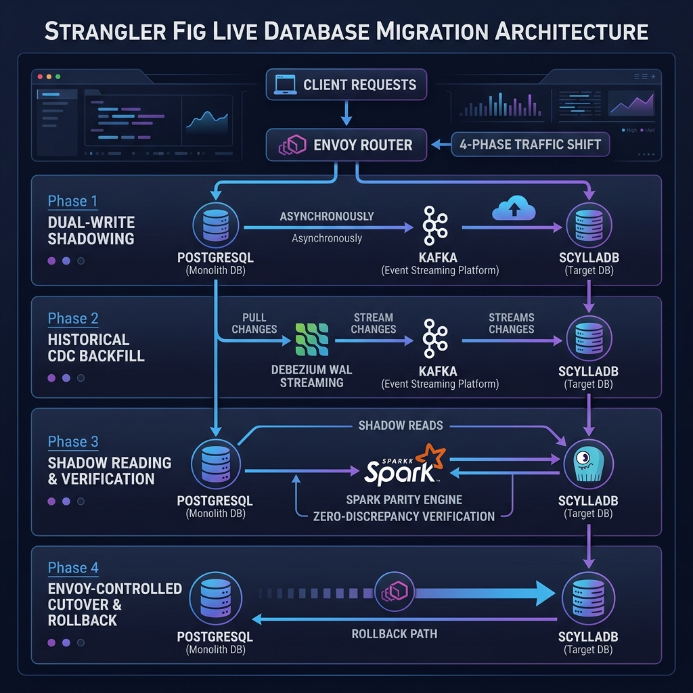

这是本项目的**技术王冠**：如何在全球日交易量 5 亿笔的场景下，无缝把 18TB 关系型数据平移到 ScyllaDB？我亲自设计并带领团队实施了 **四阶段数据渐进演进协议**：

```mermaid
sequenceDiagram
    actor Client as User Request
    participant Envoy as Envoy Router
    participant PG as PG Database
    participant Scylla as ScyllaDB
    participant Kafka as Kafka Queue
    participant Recon as Spark Reconciler

    Note over Client, Scylla: Phase 1: Ingestion Dual-write (Shadow Phase)
    Client->>Envoy: Submit Transaction
    Envoy->>PG: Write Ledger (Active)
    Envoy->>Kafka: Async Publish Event (Shadow)
    Kafka->>Scylla: Write to ScyllaDB (Async)
    
    Note over PG, Scylla: Phase 2: Historical CDC Backfill
    PG->>Kafka: Historical Data Stream (Debezium)
    Kafka->>Scylla: Populate past entries (Idempotent Upsert)
    
    Note over Client, Recon: Phase 3: Shadow Reading & Parity Check
    Client->>Envoy: Get Balance Query
    Envoy->>PG: Read PG balance (Return to user)
    Envoy->>Scylla: Read Scylla balance (Background)
    Envoy->>Recon: Compare results & log discrepancies
```

### 1. 阶段 1：实时双写 (Dual-Writes)（双写 (Dual-Writes)隔离）
*   我们首先在 Envoy 路由网关处配置了 **Async Replication Flow**。
*   用户的每一笔新交易请求到达网关后，网关仍将其**强同步地写入旧 PostgreSQL** 以确保主线业务的绝对稳定。
*   同时，网关将该支付请求打包成一个 event 发送到 Kafka。后台的消费集群读取该事件，并将其写入新 ScyllaDB（Shadow Write）。
*   *容错保护*：Shadow 写入的所有超时、崩溃异常都会被捕获并上报指标，绝对不让 Shadow writes 影响 PG 的主线处理。

### 2. 阶段 2：历史数据 CDC 追数（数据对齐）
*   配置 **Debezium CDC 平台**。Debezium 持续读取 PostgreSQL 的 Write-Ahead Log (WAL)。
*   通过 Kafka 将历史 18TB 数据流式追写进 ScyllaDB 中。
*   *幂等性保证*：由于历史 CDC 追写可能与阶段 1 中的实时双写 (Dual-Writes)发生时间碰撞，我们在 ScyllaDB 的 Upsert 语句中强制关联了全局逻辑时钟（HLC），使得旧的历史数据永远不会覆盖实时双写 (Dual-Writes)写入的最新交易状态。

### 3. 阶段 3：影子读 (Shadow Reads)取与数据对齐校对 (Shadow Reading & Parity Engine)
*   **Shadow Reading**: 叫车/结算 API 到达网关后，网关**强同步读取旧 PostgreSQL** 的余额并立刻返回给用户。
*   同时，异步向新 ScyllaDB 发起一次读取请求。
*   **对齐校对引擎 (Parity Engine)**: 异步线程对比两个数据库返回的数据结构和余额数值。如果检测到有一分钱的偏差，立刻将明细写入 ClickHouse 异常日志，并触发异常指标报警。
*   我们在这一阶段运行了整整 30 天，期间处理了近 150 亿次请求，调整了 12 个历史 CDC 数据转换的边缘异常，直到系统连续 14 天**数据差异率降为绝对零 ($0.00\%$)**。

### 4. 阶段 4：最终割接 (Cutover) 与反向双写 (Dual-Writes)机制 (Rollback Plan)
*   在确保数据完全一致后，我们通过 Envoy 路由网关执行了路由割接：**将 ScyllaDB 提升为 Primary Database**，接收强同步读写。
*   **反向双写 (Dual-Writes)隔离 (Reverse Dual-write)**: 割接后，我们的 API 网关同步读写 ScyllaDB，同时异步通过 Kafka 将写入指令流式传回旧 PostgreSQL。
*   这一步骤保障了在割接初期，万一 ScyllaDB 集群由于未知硬件故障崩溃，我们可以**在 1 分钟之内通过修改 Envoy 路由规则瞬间把流量倒回 PostgreSQL**，因为 PostgreSQL 在反向双写 (Dual-Writes)机制下，数据依然保持着毫秒级的最前沿更新！

---

## 6. 业务价值与工程指标成果 (Business Impact & Results)

项目成功收尾，创造了显著的商业与工程影响力：
1.  **极致的扩展性**: 成功退役了臃肿的 `Legacy-Ledger` 单点数据库。数据分片 (Sharding)完全分流，数据库写入 CPU 降至 **$15\%$** 左右的安全水位，能够支撑至少未来 $10\times$ 的业务增长。
2.  **绝对的可用性**: 在接下来的 Black Friday 购物节大促中，支付结算系统实现了 **$100\%$ 完美可用性（SLA $99.999\%$）**，避免了任何单点故障 (Single Point of Failure - SPOF)造成的资损。
3.  **开发 velocity 跃升**: 支付账本的 refactor 使得交易团队、风控团队、运营团队实现了物理团队与微服务解耦。发版频率由**两周一次（需要发布协调锁）缩短为每天多次独立无缝发布**。
4.  **成本深度缩减**: 成功关闭了大型的 PostgreSQL 主备节点和多台备用只读 (Read-Only)复制服务器。通过 ScyllaDB 的高效资源利用率，每年在 AWS 基础设施上的纯硬件开销直接**节省了 \$480,000**。
